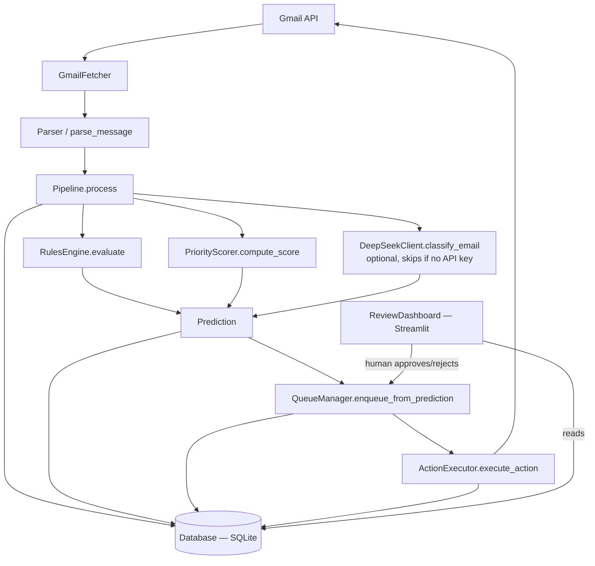

# MailMind — Project Context
> Auto-generated by scripts/update_context.py + manually curated.
> Last updated: 2026-06-06

## Project Purpose
MailMind is a Gmail classification and labelling tool that combines deterministic rules with optional DeepSeek LLM classification into a hybrid pipeline. It fetches unread Gmail messages via OAuth2, parses them into structured models, runs a multi-stage classification pipeline (rules engine + priority scorer + optional LLM), and suggests Gmail label actions. A human-in-the-loop review dashboard (Streamlit) allows users to approve or reject queued actions before they touch the Gmail account. The system defaults to dry-run mode everywhere, never deletes messages, and keeps all sensitive data local.

## Decisions Log
*Explicit deviations from the frozen invariants documented in this project's memory file. Each entry records the change, the user-approved rationale, and the safeguards.*

- **2026-06-01 — Earned autopilot per sender (P2B).** The blanket "auto-execute at confidence ≥ 0.90 regardless of sender" rule (`QueueManager.AUTO_EXECUTE_THRESHOLD = 0.90`) is **superseded** by an opt-in, per-sender authorisation: an action auto-executes only when the sender's `sender_profiles.auto_action_eligible = 1` AND the existing 0.90 confidence floor is met. Every other email queues for human review. Approved by the user via AskUserQuestion (option "Earned autopilot"). The 0.90 confidence floor itself is unchanged — this only narrows when it fires. SafetyPolicy invariants (no delete, protected categories, dry-run default) remain in force.
- **2026-06-04 — Unified label taxonomy.** Consolidated four divergent label sets (ml/features.py, llm/deepseek.py, ml/llm_classifier.py, processing/scorer.py) into mailmind/taxonomy.py as the single source of truth. Re-scored two labels that previously had no LABEL_BASE_SCORES entry and silently defaulted to 30: CALENDAR 30→55 (calendar invites are time-sensitive), MASS_EMAIL 30→10 (bulk mail should rank low). scorer.compute_score now logs a warning on any unknown label instead of failing silently. QueueManager thresholds (0.90/0.65) unchanged.
- **2026-06-05 — Full-suite bug-hunt & hardening.** A correctness sweep fixed real bugs without touching any frozen invariant (thresholds 0.90/0.65 and SafetyPolicy unchanged). Behaviourally significant items: (1) **earned autopilot was inert** — `Pipeline._create_prediction` hardcoded `prediction.confidence` to 0.85, below the 0.90 floor, so the 2026-06-01 decision *never actually fired* for any rules/ML/Tier-0 prediction; the router's real classification confidence is now threaded through, so an eligible sender at ≥0.90 auto-executes as designed. (2) **Manual trust is now sticky** — Know/Mute (`set_sender_trust_tier`) set `sender_profiles.tier_source='manual'` (migration 0025) and `update_sender_profile` no longer overwrites a manual tier on the next approve/reject. (3) **Corrected labels apply on approve** — `_execute_approved_action` now writes the user's most-recent `user_corrections.corrected_label` to Gmail instead of the model's stale prediction. Plus parser fixes (RFC 2047 decode, internalDate, comma-in-display-name recipients, stub-text/plain→HTML), NULL-account sender-rule dedupe, and account-stamped auto-exec rows. Test suite 681→697.

## Architecture


## Module Map
<!-- AUTO:START:module_map -->
| Module | Purpose | Key Class/Function | Status |
|---|---|---|---|
| `mailmind/__init__.py` | MailMind package root. | — | ✅ Stable |
| `mailmind/actions/__init__.py` | Actions layer for MailMind: safe Gmail action execution. | — | ✅ Stable |
| `mailmind/actions/executor.py` | Safe Gmail action executor for MailMind. | ActionExecutor | ✅ Complete |
| `mailmind/actions/safety.py` | Safety policy checks for MailMind action execution. | SafetyDecision, SafetyPolicy | ✅ Complete |
| `mailmind/config.py` | Configuration management for MailMind Pass 7+. | load_env_file(), MailMindConfig | ✅ Complete |
| `mailmind/dashboard/__init__.py` |  | — | ✅ Stable |
| `mailmind/dashboard/app.py` | MailMind Dashboard — Streamlit web UI. | get_db(), get_accounts(), get_action_executor(), render_now_tab(), render_review_tab(), render_history_tab(), render_automate_tab(), render_insights_tab(), main() | ✅ Complete |
| `mailmind/dashboard/charts.py` | Altair chart builders for the INSIGHTS tab. Dark-theme styled. | label_distribution_chart(), channel_distribution_chart(), top_senders_chart(), decision_time_chart(), channel_weekday_heatmap() | ✅ Complete |
| `mailmind/dashboard/helpers.py` |  | filter_now_items(), get_time_ago_str(), format_unix_ts(), get_confidence_badge(), get_heartbeat_status(), parse_reason_json(), sender_avatar_html(), label_chip_html(), channel_chip_html(), confidence_bar_html(), trust_badge_html(), reply_needed_pill_html(), email_card_html(), action_items_html(), deadline_pill_html(), confidence_sparkline_html(), email_preview_html(), sender_table_html(), history_badge_html(), corrections_table_html() | ✅ Complete |
| `mailmind/dashboard/theme.py` | MailMind Dashboard — CSS design system. | label_color(), channel_color(), trust_color(), inject_css() | ✅ Complete |
| `mailmind/ingestion/__init__.py` | Ingestion package: Gmail auth, fetching, and parsing. | — | ✅ Stable |
| `mailmind/ingestion/auth.py` | Gmail OAuth2 authentication helpers for MailMind. | load_stored_credentials(), authenticate(), build_gmail_service() | ✅ Complete |
| `mailmind/ingestion/fetcher.py` | Gmail fetcher wrapper for MailMind. | GmailFetcher | ✅ Complete |
| `mailmind/ingestion/parser.py` | Parser converting Gmail API message payloads into MailMind Email models. | parse_message(), GmailMessageParser | ✅ Complete |
| `mailmind/intelligence/__init__.py` |  | — | ✅ Stable |
| `mailmind/intelligence/brief.py` | MailMind — daily brief generation from top-priority items. | build_daily_brief() | ✅ Complete |
| `mailmind/intelligence/channels.py` | MailMind — email channel detection. | detect_channel(), enrich_prediction_with_channel() | ✅ Complete |
| `mailmind/intelligence/explainer.py` |  | ReasonPayload, build_reason_payload() | ✅ Complete |
| `mailmind/intelligence/feedback.py` |  | handle_approve(), handle_reject(), handle_correction(), handle_know_sender(), handle_mute_sender(), handle_block_sender(), handle_label_email() | ✅ Complete |
| `mailmind/intelligence/labels.py` | Decide which Gmail labels count as user 'ground truth' for learning. | truth_label_policy(), is_truth_label(), resolve_truth_labels() | ✅ Complete |
| `mailmind/intelligence/nl_rules.py` | Parse natural language sentences into sender->label rules. | parse_rule_nl() | ✅ Complete |
| `mailmind/intelligence/patterns.py` | Canonical detection patterns shared across features, rules, and channel detection. | — | ✅ Complete |
| `mailmind/intelligence/sender_memory.py` |  | SenderProfileSummary, get_sender_profile(), get_sender_trust_tier(), update_from_outcome(), get_similar_sender_history() | ✅ Complete |
| `mailmind/intelligence/thread_analyzer.py` | MailMind — thread and reply-needed intelligence. | ThreadContext, ThreadAnalyzer | ✅ Complete |
| `mailmind/llm/__init__.py` | LLM module for MailMind Pass 7+. | — | ✅ Stable |
| `mailmind/llm/base.py` | Base protocol and result types for LLM classifiers. | LLMResult, LLMClassifier | ✅ Complete |
| `mailmind/llm/deepseek.py` | DeepSeek LLM client for MailMind email classification. | DeepSeekClient | ✅ Complete |
| `mailmind/main.py` | MailMind — main entry point. | cli(), run(), digest(), prune(), backfill(), apply_labels(), refresh_labels(), auth(), accounts() | ✅ Complete |
| `mailmind/ml/__init__.py` | ML module for MailMind Pass 4. | — | ✅ Stable |
| `mailmind/ml/classifier_router.py` | Routing logic that decides which tier handles each email. | RoutingResult, ClassifierRouter | ✅ Complete |
| `mailmind/ml/features.py` | Feature extraction for MailMind ML classification. | FeatureVector, build_model_text(), extract_features(), feature_vector_to_dict() | ✅ Complete |
| `mailmind/ml/inference.py` | Inference orchestration for MailMind ML classification. | MLResult, predict_label() | ✅ Complete |
| `mailmind/ml/llm_classifier.py` | Third-tier LLM classifier for MailMind using OpenAI-compatible API. | drain_pending_usage(), log_llm_usage(), LLMPrediction, LLMClassifier, OpenAIAdapter | ✅ Complete |
| `mailmind/ml/model.py` | ML model wrapper for MailMind classification. | ModelMetadata, MLClassifier | ✅ Complete |
| `mailmind/ml/train.py` | Training orchestration for MailMind ML classifier. | train_model_from_db(), train_model_from_data(), get_model_metadata_from_db() | ✅ Complete |
| `mailmind/processing/__init__.py` | Processing layer for MailMind: rules, scoring, and pipeline orchestration. | — | ✅ Stable |
| `mailmind/processing/pipeline.py` | MailMind processing pipeline: orchestrates rules, scoring, and actions. | resolve_label_precedence(), Pipeline | ✅ Complete |
| `mailmind/processing/queue_manager.py` | Manages the action queue for human-in-the-loop review. | QueueManager | ✅ Complete |
| `mailmind/processing/rules.py` | Deterministic rules engine for MailMind classification. | RuleMatch, Rule, RulesEngine | ✅ Complete |
| `mailmind/processing/scorer.py` | Priority scoring for MailMind emails. | ScoreResult, PriorityScorer | ✅ Complete |
| `mailmind/scripts/pretrain.py` | Pre-training script for MailMind. | main() | ✅ Complete |
| `mailmind/scripts/train_ml_model.py` | Train the Pass 4 ML model from historical database data. | main() | ✅ Complete |
| `mailmind/storage/__init__.py` | Storage package for MailMind. | — | ✅ Stable |
| `mailmind/storage/database.py` | Database abstraction for MailMind using SQLite. | Database, open_database_from_config_path() | ✅ Complete |
| `mailmind/storage/migrations.py` | Migration definitions and application helpers for MailMind SQLite schema. | apply_migrations() | ✅ Complete |
| `mailmind/storage/models.py` | Data models for MailMind storage layer. | now_ts(), Email, Prediction, ActionApplied, Feedback, SenderReputation, SystemState, QueueItem | ✅ Complete |
| `mailmind/storage/queries.py` | Query helpers for the review dashboard. | get_recent_predictions(), get_predictions_for_email(), get_recent_actions(), get_sender_reputations(), get_summary_metrics(), get_queue_item_by_fingerprint(), upsert_queue_item(), supersede_old_queue_items(), get_pending_queue(), get_recent_corrections(), get_recent_predictions_with_emails(), approve_queue_item(), reject_queue_item(), log_correction(), update_sender_profile(), get_pending_queue_enriched(), get_executed_queue_enriched(), get_sender_profiles(), toggle_sender_auto_action(), is_sender_auto_action_eligible(), get_queue_stats(), build_digest(), get_ml_model_metadata(), get_new_senders(), set_sender_trust_tier(), set_sender_label_rule(), set_thread_label_rule(), get_sender_label(), get_sender_rules(), resolve_sender_label(), get_thread_label(), get_gmail_labels(), record_llm_usage(), analytics_llm_cost(), analytics_tier_quality(), analytics_autopilot_precision(), analytics_label_distribution(), analytics_channel_distribution(), analytics_top_senders(), analytics_decision_times(), analytics_channel_weekday(), get_labeled_predictions() | ✅ Complete |
| `mailmind/taxonomy.py` | Canonical email-label taxonomy — the single source of truth for MailMind. | base_score(), is_known() | ✅ Complete |
| `mailmind/utils/__init__.py` |  | — | ✅ Stable |
| `mailmind/utils/fingerprint.py` |  | make_action_fingerprint() | ✅ Complete |
<!-- AUTO:END:module_map -->


## Key Interfaces (auto-updated)
<!-- AUTO:START:key_interfaces -->
### Pipeline
```python
class Pipeline:
    def __init__(db: Database, rules_engine: RulesEngine, scorer: PriorityScorer, executor: Optional['ActionExecutor'], safety_policy: Optional[SafetyPolicy], llm_client: Optional['DeepSeekClient'], llm_skip_threshold: int, llm_max_calls_per_run: int, classifier_router: Optional[ClassifierRouter])
    def process(self, email: Email, auto_action: bool, account: Optional[str])
    def add_ml_stage(self, ml_fn)
    def add_llm_stage(self, llm_fn)
    def add_feedback_loop(self, feedback_processor)
```

### PriorityScorer
```python
class PriorityScorer:
    def __init__(user_email: str, recency_hours: int)
    def compute_score(self, email: Email, rule_matches: List[RuleMatch], sender_reputation: Optional[SenderReputation], db: Optional[Database])
```

### RulesEngine
```python
class RulesEngine:
    def __init__(user_email: str)
    def register_rule(self, rule: Rule)
    def evaluate(self, email: Email)
```

### QueueManager
```python
class QueueManager:
    def __init__(executor: 'ActionExecutor')
    def enqueue_from_prediction(self, db: 'Database', email: 'Email', score_result: 'ScoreResult', prediction: 'Prediction', force: bool)
    def execute_action(self, email: 'Email', action: str, score_result: 'ScoreResult')
```

### DeepSeekClient
```python
class DeepSeekClient:
    def __init__(config: MailMindConfig)
    def classify_email(self, email: Email)
    def summarize_thread(self, subject: str, body_text: str)
```

### MailMindConfig
```python
@dataclass
class MailMindConfig:
    def primary_account(self)
    def load_accounts()
    def from_env(cls)
```
<!-- AUTO:END:key_interfaces -->


## Environment Variables (auto-updated)
<!-- AUTO:START:env_vars -->
| Variable | Default | Required | Purpose |
|---|---|---|---|
| `DASHBOARD_PASSWORD` | `""` (empty) | No | — |
| `DASHBOARD_SECRET` | `""` (empty) | No | — |
| `DEEPSEEK_API_KEY` | `""` (empty) | No | DeepSeek API key; absent → LLM disabled |
| `DEEPSEEK_MAX_CALLS_PER_RUN` | `10` | No | Max LLM API calls per pipeline run |
| `LLM_ENABLED` | `false` | No | — |
| `LLM_MAX_BODY_CHARS` | `1500` | No | — |
| `LLM_ML_THRESHOLD` | `0.65` | No | — |
| `LLM_PROVIDER` | `auto` | No | — |
| `LLM_RULES_THRESHOLD` | `0.90` | No | — |
| `MAILMIND_ACCOUNTS` | `""` (empty) | No | — |
| `MAILMIND_DATA_DIR` | `~/.mailmind` | No | — |
| `MAILMIND_DB_PATH` | `~/.mailmind/mailmind.db` | No | SQLite database path |
| `MAILMIND_DRY_RUN` | `0` | No | Set to "1" to skip real Gmail label writes |
| `MAILMIND_ENV_FILE` | `""` (empty) | No | — |
| `MAILMIND_FETCH_MAX` | `50` | No | Max emails per fetch run |
| `MAILMIND_POLL_SECONDS` | `120` | No | Poll interval in seconds (--watch mode) |
| `MAILMIND_RETENTION_DAYS` | `90` | No | — |
| `MAILMIND_TRUTH_LABELS_EXCLUDE` | `AI/,MailMind/` | No | — |
| `MAILMIND_TRUTH_LABELS_INCLUDE` | `""` (empty) | No | — |
| `MAILMIND_USER_EMAIL` | `""` (empty) | No | User's primary email for scoring boosts |
| `OPENAI_API_KEY` | `""` (empty) | No | — |
<!-- AUTO:END:env_vars -->


## Pass History
| Pass | Goal | Status | Key Files Changed |
|---|---|---|---|
| Pass 1 | Project setup | ✅ | `main.py`, `config.py`, `requirements.txt`, `.env.example` |
| Pass 2 | Storage layer | ✅ | `storage/database.py`, `storage/models.py`, `storage/migrations.py` |
| Pass 3 | Rules + scoring | ✅ | `processing/rules.py`, `processing/scorer.py` |
| Pass 4 | Pipeline + persistence | ✅ | `processing/pipeline.py`, `actions/executor.py`, `actions/safety.py` |
| Pass 5 | Live Gmail ingestion | ✅ | `ingestion/auth.py`, `ingestion/fetcher.py`, `ingestion/parser.py` |
| Pass 6 | Human-in-the-loop review | ✅ | `review_dashboard.py`, `processing/queue_manager.py`, `storage/queries.py` |
| Pass 7 | DeepSeek LLM stage | ✅ | `llm/deepseek.py`, `config.py` (extended), `pipeline.py` (LLM stage) |
| Pass 8 | Full-suite bug-hunt & hardening | ✅ | `pipeline.py`, `parser.py`, `queries.py`, `feedback.py`, `queue_manager.py`, `migrations.py` (0025), `dashboard/app.py` |
| Pass 9 | TBD | 🔲 | — |

## Current State
- Test count: 697
- Python version: 3.x
- Key dependencies: `click>=8.0`, `google-api-python-client>=2.70.0`, `google-auth>=2.20.0`, `google-auth-oauthlib>=1.0.0`, `streamlit>=1.35.0`, `scikit-learn>=1.2.0`, `openai` (for DeepSeek), `cryptography>=41.0`, `keyring>=23.0`
- LLM: deepseek-chat (optional, skips if no `DEEPSEEK_API_KEY`)
- DB: SQLite at `~/.mailmind/mailmind.db`

## Confidence Tiers
| Tier | Threshold | Behavior |
|---|---|---|
| Rules skip | Rules score ≥ 70 | Skip LLM entirely (cost control) |
| LLM override | LLM confidence ≥ 0.90 | Override `primary_label` with LLM prediction |
| Auto-execute | Score ≥ 0.90 | Execute action immediately |
| Queue for review | 0.65 ≤ Score < 0.90 | Queue for human approval in dashboard |
| Skip | Score < 0.65 | Do nothing |

## Known Constraints (never violate these)
- **Never delete Gmail messages** — `delete` action requires 1.00 confidence (unreachable), auto-delete is hard-disabled in SafetyPolicy
- **`dry_run=True` is the default everywhere** — ActionExecutor and SafetyPolicy default to dry-run; `MAILMIND_DRY_RUN=1` at env level
- **All tests must mock Gmail API and DeepSeek API** — network calls forbidden in test suite
- **No hardcoded emails or secrets in source** — all values from environment variables or config files
- **LLM failure must never crash the pipeline** — DeepSeekClient returns `LLMResult(model_available=False)` on any error
- **QueueManager thresholds must not change without explicit decision** — `AUTO_EXECUTE_THRESHOLD=0.90` and `QUEUE_THRESHOLD=0.65` are class-level constants
- **`body_text`: only first 500 chars sent to LLM**, never full body exposed — enforced in `DeepSeekClient.classify_email()`

## Open TODOs (auto-updated)
<!-- AUTO:START:open_todos -->
None found.
<!-- AUTO:END:open_todos -->


## Current Pass Notes
<!-- AUTO:START:current_pass_notes -->
Pass 7 complete. 704 tests passing.
datetime.utcnow() deprecation warnings pending cleanup.
Next: Pass 8 — TBD (sender reputation / watch mode / deployment)
<!-- AUTO:END:current_pass_notes -->
