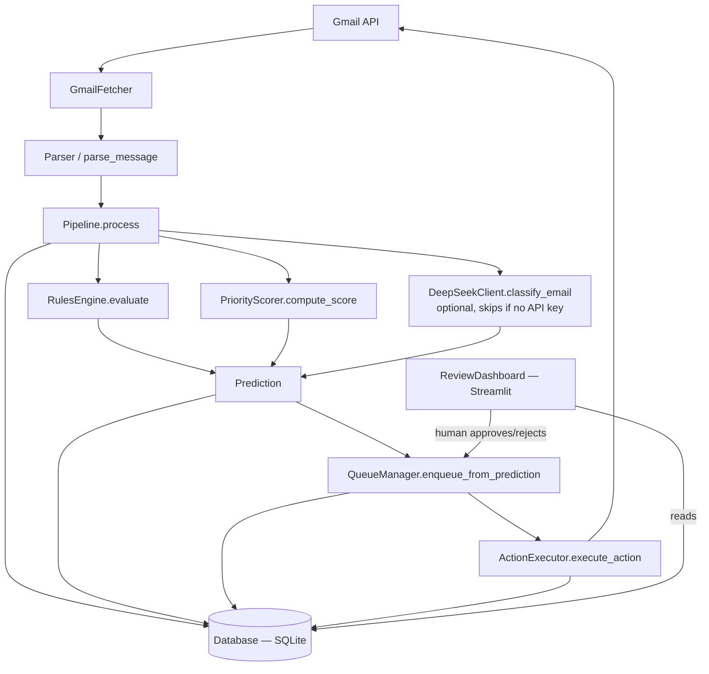

# MailMind — Project Context
> Auto-generated by scripts/update_context.py + manually curated.
> Last updated: 2026-05-21

## Project Purpose
MailMind is a Gmail classification and labelling tool that combines deterministic rules with optional DeepSeek LLM classification into a hybrid pipeline. It fetches unread Gmail messages via OAuth2, parses them into structured models, runs a multi-stage classification pipeline (rules engine + priority scorer + optional LLM), and suggests Gmail label actions. A human-in-the-loop review dashboard (Streamlit) allows users to approve or reject queued actions before they touch the Gmail account. The system defaults to dry-run mode everywhere, never deletes messages, and keeps all sensitive data local.

## Architecture


## Module Map
<!-- AUTO:START:module_map -->
| Module | Purpose | Key Class/Function | Status |
|---|---|---|---|
| `mailmind/__init__.py` | MailMind package root. | — | ✅ Stable |
| `mailmind/actions/__init__.py` | Actions layer for MailMind: safe Gmail action execution. | — | ✅ Stable |
| `mailmind/actions/executor.py` | Safe Gmail action executor for MailMind. | ActionExecutor | ✅ Complete |
| `mailmind/actions/safety.py` | Safety policy checks for MailMind action execution. | SafetyDecision, SafetyPolicy | ✅ Complete |
| `mailmind/config.py` | Configuration management for MailMind Pass 7+. | MailMindConfig | ✅ Complete |
| `mailmind/ingestion/__init__.py` | Ingestion package: Gmail auth, fetching, and parsing. | — | ✅ Stable |
| `mailmind/ingestion/auth.py` | Gmail OAuth2 authentication helpers for MailMind. | authenticate(), build_gmail_service() | ✅ Complete |
| `mailmind/ingestion/fetcher.py` | Gmail fetcher wrapper for MailMind. | GmailFetcher | ✅ Complete |
| `mailmind/ingestion/parser.py` | Parser converting Gmail API message payloads into MailMind Email models. | parse_message(), GmailMessageParser | ✅ Complete |
| `mailmind/llm/__init__.py` | LLM module for MailMind Pass 7+. | — | ✅ Stable |
| `mailmind/llm/deepseek.py` | DeepSeek LLM client for MailMind email classification. | LLMResult, DeepSeekClient | ✅ Complete |
| `mailmind/main.py` | MailMind — main entry point. | cli(), run(), auth() | ✅ Complete |
| `mailmind/ml/__init__.py` | ML module for MailMind Pass 4. | — | ✅ Stable |
| `mailmind/ml/features.py` | Feature extraction for MailMind ML classification. | FeatureVector, extract_features(), feature_vector_to_dict() | ✅ Complete |
| `mailmind/ml/inference.py` | Inference orchestration for MailMind ML classification. | MLResult, predict_label() | ✅ Complete |
| `mailmind/ml/model.py` | ML model wrapper for MailMind classification. | ModelMetadata, MLClassifier | ✅ Complete |
| `mailmind/ml/train.py` | Training orchestration for MailMind ML classifier. | train_model_from_db(), train_model_from_data(), get_model_metadata_from_db() | ✅ Complete |
| `mailmind/processing/__init__.py` | Processing layer for MailMind: rules, scoring, and pipeline orchestration. | — | ✅ Stable |
| `mailmind/processing/pipeline.py` | MailMind processing pipeline: orchestrates rules, scoring, and actions. | Pipeline | ✅ Complete |
| `mailmind/processing/queue_manager.py` | Manages the action queue for human-in-the-loop review. | QueueManager | ✅ Complete |
| `mailmind/processing/rules.py` | Deterministic rules engine for MailMind classification. | RuleMatch, Rule, RulesEngine | ✅ Complete |
| `mailmind/processing/scorer.py` | Priority scoring for MailMind emails. | ScoreResult, PriorityScorer | ✅ Complete |
| `mailmind/review_dashboard.py` | Streamlit review dashboard for MailMind. | get_db(), get_action_executor() | ✅ Complete |
| `mailmind/scripts/train_ml_model.py` | Train the Pass 4 ML model from historical database data. | main() | ✅ Complete |
| `mailmind/storage/__init__.py` | Storage package for MailMind. | — | ✅ Stable |
| `mailmind/storage/database.py` | Database abstraction for MailMind using SQLite. | Database, open_database_from_config_path() | ✅ Complete |
| `mailmind/storage/migrations.py` | Migration definitions and application helpers for MailMind SQLite schema. | apply_migrations() | ✅ Complete |
| `mailmind/storage/models.py` | Data models for MailMind storage layer. | now_ts(), Email, Prediction, ActionApplied, Feedback, SenderReputation, SystemState | ✅ Complete |
| `mailmind/storage/queries.py` | Query helpers for the review dashboard. | get_recent_predictions(), get_predictions_for_email(), get_recent_actions(), get_sender_reputations(), get_summary_metrics(), get_pending_queue(), approve_queue_item(), reject_queue_item(), log_correction(), get_recent_corrections() | ✅ Complete |
<!-- AUTO:END:module_map -->


## Key Interfaces (auto-updated)
<!-- AUTO:START:key_interfaces -->
### Pipeline
```python
class Pipeline:
    def __init__(db: Database, rules_engine: RulesEngine, scorer: PriorityScorer, executor: Optional['ActionExecutor'], safety_policy: Optional[SafetyPolicy], llm_client: Optional['DeepSeekClient'], llm_skip_threshold: int, llm_max_calls_per_run: int)
    def process(self, email: Email, auto_action: bool)
    def add_ml_stage(self, ml_fn)
    def add_llm_stage(self, llm_fn)
    def add_feedback_loop(self, feedback_processor)
```

### PriorityScorer
```python
class PriorityScorer:
    def __init__(user_email: str, recency_hours: int)
    def compute_score(self, email: Email, rule_matches: List[RuleMatch], sender_reputation: Optional[SenderReputation])
```

### RulesEngine
```python
class RulesEngine:
    def __init__(user_email: str)
    def register_rule(self, rule: Rule)
    def evaluate(self, email: Email)
```

### QueueManager
```python
class QueueManager:
    def __init__(executor: 'ActionExecutor')
    def enqueue_from_prediction(self, db: 'Database', email: 'Email', score_result: 'ScoreResult', prediction: 'Prediction')
```

### DeepSeekClient
```python
class DeepSeekClient:
    def __init__(config: MailMindConfig)
    def classify_email(self, email: Email)
```

### MailMindConfig
```python
@dataclass
class MailMindConfig:
    def from_env(cls)
```
<!-- AUTO:END:key_interfaces -->


## Environment Variables (auto-updated)
<!-- AUTO:START:env_vars -->
| Variable | Default | Required | Purpose |
|---|---|---|---|
| `DEEPSEEK_API_KEY` | `""` (empty) | No | DeepSeek API key; absent → LLM disabled |
| `DEEPSEEK_BASE_URL` | `https://api.deepseek.com/v1` | No | DeepSeek API base URL |
| `DEEPSEEK_MAX_CALLS_PER_RUN` | `10` | No | Max LLM API calls per pipeline run |
| `DEEPSEEK_MODEL` | `deepseek-chat` | No | DeepSeek model name |
| `MAILMIND_APP_DIR` | `~/.mailmind` | No | Config directory (credentials, token storage) |
| `MAILMIND_DB_PATH` | `~/.mailmind/mailmind.db` | No | SQLite database path |
| `MAILMIND_DRY_RUN` | `""` (empty) | No | Set to "1" to skip real Gmail label writes |
| `MAILMIND_FETCH_MAX` | `50` | No | Max emails per fetch run |
| `MAILMIND_POLL_SECONDS` | `120` | No | Poll interval in seconds (--watch mode) |
| `MAILMIND_USER_EMAIL` | `""` (empty) | No | User's primary email for scoring boosts |
<!-- AUTO:END:env_vars -->


## Pass History
| Pass | Goal | Status | Key Files Changed |
|---|---|---|---|
| Pass 1 | Project setup | ✅ | `main.py`, `config.py`, `requirements.txt`, `.env.example` |
| Pass 2 | Storage layer | ✅ | `storage/database.py`, `storage/models.py`, `storage/migrations.py` |
| Pass 3 | Rules + scoring | ✅ | `processing/rules.py`, `processing/scorer.py` |
| Pass 4 | Pipeline + persistence | ✅ | `processing/pipeline.py`, `actions/executor.py`, `actions/safety.py` |
| Pass 5 | Live Gmail ingestion | ✅ | `ingestion/auth.py`, `ingestion/fetcher.py`, `ingestion/parser.py` |
| Pass 6 | Human-in-the-loop review | ✅ | `review_dashboard.py`, `processing/queue_manager.py`, `storage/queries.py` |
| Pass 7 | DeepSeek LLM stage | ✅ | `llm/deepseek.py`, `config.py` (extended), `pipeline.py` (LLM stage) |
| Pass 8 | TBD | 🔲 | — |

## Current State
- Test count: 138
- Python version: 3.x
- Key dependencies: `click>=8.0`, `google-api-python-client>=2.70.0`, `google-auth>=2.20.0`, `google-auth-oauthlib>=1.0.0`, `streamlit>=1.35.0`, `scikit-learn>=1.2.0`, `openai` (for DeepSeek), `cryptography>=41.0`, `keyring>=23.0`
- LLM: deepseek-chat (optional, skips if no `DEEPSEEK_API_KEY`)
- DB: SQLite at `~/.mailmind/mailmind.db`

## Confidence Tiers
| Tier | Threshold | Behavior |
|---|---|---|
| Rules skip | Rules score ≥ 70 | Skip LLM entirely (cost control) |
| LLM override | LLM confidence ≥ 0.90 | Override `primary_label` with LLM prediction |
| Auto-execute | Score ≥ 0.90 | Execute action immediately |
| Queue for review | 0.65 ≤ Score < 0.90 | Queue for human approval in dashboard |
| Skip | Score < 0.65 | Do nothing |

## Known Constraints (never violate these)
- **Never delete Gmail messages** — `delete` action requires 1.00 confidence (unreachable), auto-delete is hard-disabled in SafetyPolicy
- **`dry_run=True` is the default everywhere** — ActionExecutor and SafetyPolicy default to dry-run; `MAILMIND_DRY_RUN=1` at env level
- **All tests must mock Gmail API and DeepSeek API** — network calls forbidden in test suite
- **No hardcoded emails or secrets in source** — all values from environment variables or config files
- **LLM failure must never crash the pipeline** — DeepSeekClient returns `LLMResult(model_available=False)` on any error
- **QueueManager thresholds must not change without explicit decision** — `AUTO_EXECUTE_THRESHOLD=0.90` and `QUEUE_THRESHOLD=0.65` are class-level constants
- **`body_text`: only first 500 chars sent to LLM**, never full body exposed — enforced in `DeepSeekClient.classify_email()`

## Open TODOs (auto-updated)
<!-- AUTO:START:open_todos -->
None found.
<!-- AUTO:END:open_todos -->


## Current Pass Notes
<!-- AUTO:START:current_pass_notes -->
Pass 7 complete. 138 tests passing.
datetime.utcnow() deprecation warnings pending cleanup.
Next: Pass 8 — TBD (sender reputation / watch mode / deployment)
<!-- AUTO:END:current_pass_notes -->
