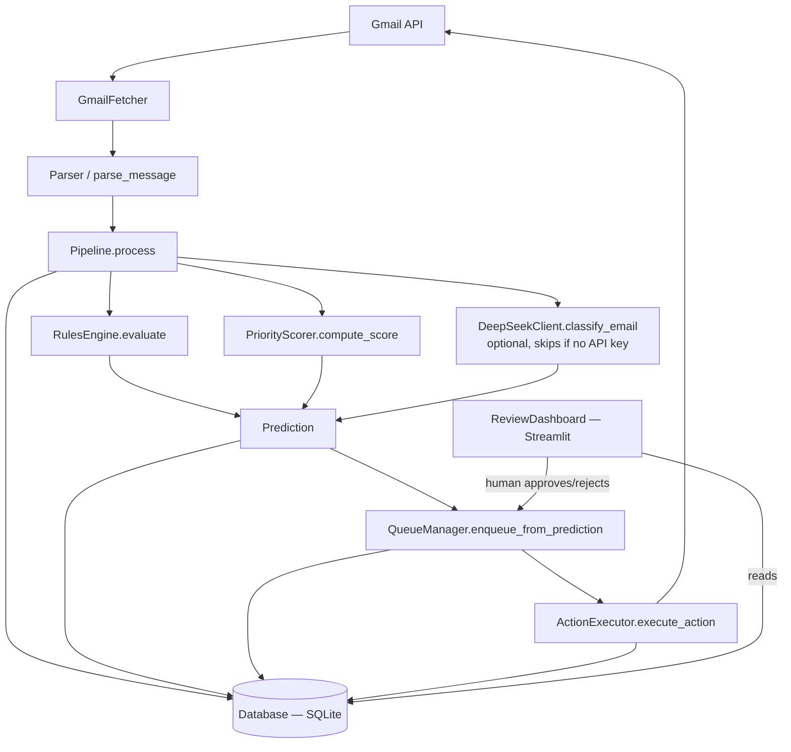

# MailMind — Project Context
> Auto-generated by scripts/update_context.py + manually curated.
> Last updated: 2026-06-02

## Project Purpose
MailMind is a Gmail classification and labelling tool that combines deterministic rules with optional DeepSeek LLM classification into a hybrid pipeline. It fetches unread Gmail messages via OAuth2, parses them into structured models, runs a multi-stage classification pipeline (rules engine + priority scorer + optional LLM), and suggests Gmail label actions. A human-in-the-loop review dashboard (Streamlit) allows users to approve or reject queued actions before they touch the Gmail account. The system defaults to dry-run mode everywhere, never deletes messages, and keeps all sensitive data local.

## Decisions Log
*Explicit deviations from the frozen invariants documented in this project's memory file. Each entry records the change, the user-approved rationale, and the safeguards.*

- **2026-06-01 — Earned autopilot per sender (P2B).** The blanket "auto-execute at confidence ≥ 0.90 regardless of sender" rule (`QueueManager.AUTO_EXECUTE_THRESHOLD = 0.90`) is **superseded** by an opt-in, per-sender authorisation: an action auto-executes only when the sender's `sender_profiles.auto_action_eligible = 1` AND the existing 0.90 confidence floor is met. Every other email queues for human review. Approved by the user via AskUserQuestion (option "Earned autopilot"). The 0.90 confidence floor itself is unchanged — this only narrows when it fires. SafetyPolicy invariants (no delete, protected categories, dry-run default) remain in force.

## Architecture


## Module Map
<!-- AUTO:START:module_map -->
| Module | Purpose | Key Class/Function | Status |
|---|---|---|---|
| `mailmind/.venv/lib/python3.13/site-packages/PIL/AvifImagePlugin.py` |  | get_codec_version(), AvifImageFile | ✅ Complete |
| `mailmind/.venv/lib/python3.13/site-packages/PIL/BdfFontFile.py` | Parse X Bitmap Distribution Format (BDF) | bdf_char(), BdfFontFile | ✅ Complete |
| `mailmind/.venv/lib/python3.13/site-packages/PIL/BlpImagePlugin.py` | Blizzard Mipmap Format (.blp) | Format, Encoding, AlphaEncoding, unpack_565(), decode_dxt1(), decode_dxt3(), decode_dxt5(), BLPFormatError, BlpImageFile, _BLPBaseDecoder, BLP1Decoder, BLP2Decoder, BLPEncoder | ✅ Complete |
| `mailmind/.venv/lib/python3.13/site-packages/PIL/BmpImagePlugin.py` |  | BmpImageFile, BmpRleDecoder, DibImageFile | ✅ Complete |
| `mailmind/.venv/lib/python3.13/site-packages/PIL/BufrStubImagePlugin.py` |  | register_handler(), BufrStubImageFile | ✅ Complete |
| `mailmind/.venv/lib/python3.13/site-packages/PIL/ContainerIO.py` |  | ContainerIO | ✅ Complete |
| `mailmind/.venv/lib/python3.13/site-packages/PIL/CurImagePlugin.py` |  | CurImageFile | ✅ Complete |
| `mailmind/.venv/lib/python3.13/site-packages/PIL/DcxImagePlugin.py` |  | DcxImageFile | ✅ Complete |
| `mailmind/.venv/lib/python3.13/site-packages/PIL/DdsImagePlugin.py` | A Pillow plugin for .dds files (S3TC-compressed aka DXTC) | DDSD, DDSCAPS, DDSCAPS2, DDPF, DXGI_FORMAT, D3DFMT, DdsImageFile, DdsRgbDecoder | ✅ Complete |
| `mailmind/.venv/lib/python3.13/site-packages/PIL/EpsImagePlugin.py` |  | has_ghostscript(), Ghostscript(), EpsImageFile | ✅ Complete |
| `mailmind/.venv/lib/python3.13/site-packages/PIL/ExifTags.py` | This module provides constants and clear-text names for various | Base, GPS, Interop, IFD, LightSource | ✅ Complete |
| `mailmind/.venv/lib/python3.13/site-packages/PIL/FitsImagePlugin.py` |  | FitsImageFile, FitsGzipDecoder | ✅ Complete |
| `mailmind/.venv/lib/python3.13/site-packages/PIL/FliImagePlugin.py` |  | FliImageFile | ✅ Complete |
| `mailmind/.venv/lib/python3.13/site-packages/PIL/FontFile.py` |  | puti16(), FontFile | ✅ Complete |
| `mailmind/.venv/lib/python3.13/site-packages/PIL/FpxImagePlugin.py` |  | FpxImageFile | ✅ Complete |
| `mailmind/.venv/lib/python3.13/site-packages/PIL/FtexImagePlugin.py` | A Pillow loader for .ftc and .ftu files (FTEX) | Format, FtexImageFile | ✅ Complete |
| `mailmind/.venv/lib/python3.13/site-packages/PIL/GbrImagePlugin.py` |  | GbrImageFile | ✅ Complete |
| `mailmind/.venv/lib/python3.13/site-packages/PIL/GdImageFile.py` | .. note:: | GdImageFile, open() | ✅ Complete |
| `mailmind/.venv/lib/python3.13/site-packages/PIL/GifImagePlugin.py` |  | LoadingStrategy, GifImageFile, _Frame, get_interlace(), getheader(), getdata() | ✅ Complete |
| `mailmind/.venv/lib/python3.13/site-packages/PIL/GimpGradientFile.py` | Stuff to translate curve segments to palette values (derived from | linear(), curved(), sine(), sphere_increasing(), sphere_decreasing(), GradientFile, GimpGradientFile | ✅ Complete |
| `mailmind/.venv/lib/python3.13/site-packages/PIL/GimpPaletteFile.py` |  | GimpPaletteFile | ✅ Complete |
| `mailmind/.venv/lib/python3.13/site-packages/PIL/GribStubImagePlugin.py` |  | register_handler(), GribStubImageFile | ✅ Complete |
| `mailmind/.venv/lib/python3.13/site-packages/PIL/Hdf5StubImagePlugin.py` |  | register_handler(), HDF5StubImageFile | ✅ Complete |
| `mailmind/.venv/lib/python3.13/site-packages/PIL/IcnsImagePlugin.py` |  | nextheader(), read_32t(), read_32(), read_mk(), read_png_or_jpeg2000(), IcnsFile, IcnsImageFile | ✅ Complete |
| `mailmind/.venv/lib/python3.13/site-packages/PIL/IcoImagePlugin.py` |  | IconHeader, IcoFile, IcoImageFile | ✅ Complete |
| `mailmind/.venv/lib/python3.13/site-packages/PIL/ImImagePlugin.py` |  | number(), ImImageFile | ✅ Complete |
| `mailmind/.venv/lib/python3.13/site-packages/PIL/Image.py` |  | DecompressionBombWarning, DecompressionBombError, Transpose, Transform, Resampling, Dither, Palette, Quantize, getmodebase(), getmodetype(), getmodebandnames(), getmodebands(), preinit(), init(), ImagePointTransform, SupportsGetData, Image, ImagePointHandler, ImageTransformHandler, new(), frombytes(), frombuffer(), SupportsArrayInterface, SupportsArrowArrayInterface, fromarray(), fromarrow(), fromqimage(), fromqpixmap(), open(), alpha_composite(), blend(), composite(), eval(), merge(), register_open(), register_mime(), register_save(), register_save_all(), register_extension(), register_extensions(), registered_extensions(), register_decoder(), register_encoder(), effect_mandelbrot(), effect_noise(), linear_gradient(), radial_gradient(), Exif | ✅ Complete |
| `mailmind/.venv/lib/python3.13/site-packages/PIL/ImageChops.py` |  | constant(), duplicate(), invert(), lighter(), darker(), difference(), multiply(), screen(), soft_light(), hard_light(), overlay(), add(), subtract(), add_modulo(), subtract_modulo(), logical_and(), logical_or(), logical_xor(), blend(), composite(), offset() | ✅ Complete |
| `mailmind/.venv/lib/python3.13/site-packages/PIL/ImageCms.py` |  | Intent, Direction, Flags, ImageCmsProfile, ImageCmsTransform, get_display_profile(), PyCMSError, profileToProfile(), getOpenProfile(), buildTransform(), buildProofTransform(), applyTransform(), createProfile(), getProfileName(), getProfileInfo(), getProfileCopyright(), getProfileManufacturer(), getProfileModel(), getProfileDescription(), getDefaultIntent(), isIntentSupported() | ✅ Complete |
| `mailmind/.venv/lib/python3.13/site-packages/PIL/ImageColor.py` |  | getrgb(), getcolor() | ✅ Complete |
| `mailmind/.venv/lib/python3.13/site-packages/PIL/ImageDraw.py` |  | ImageDraw, Draw(), getdraw(), floodfill() | ✅ Complete |
| `mailmind/.venv/lib/python3.13/site-packages/PIL/ImageDraw2.py` | (Experimental) WCK-style drawing interface operations | Pen, Brush, Font, Draw | ✅ Complete |
| `mailmind/.venv/lib/python3.13/site-packages/PIL/ImageEnhance.py` |  | _Enhance, Color, Contrast, Brightness, Sharpness | ✅ Complete |
| `mailmind/.venv/lib/python3.13/site-packages/PIL/ImageFile.py` |  | _Tile, ImageFile, StubHandler, StubImageFile, Parser, PyCodecState, PyCodec, PyDecoder, PyEncoder | ✅ Complete |
| `mailmind/.venv/lib/python3.13/site-packages/PIL/ImageFilter.py` |  | Filter, MultibandFilter, BuiltinFilter, Kernel, RankFilter, MedianFilter, MinFilter, MaxFilter, ModeFilter, GaussianBlur, BoxBlur, UnsharpMask, BLUR, CONTOUR, DETAIL, EDGE_ENHANCE, EDGE_ENHANCE_MORE, EMBOSS, FIND_EDGES, SHARPEN, SMOOTH, SMOOTH_MORE, Color3DLUT | ✅ Complete |
| `mailmind/.venv/lib/python3.13/site-packages/PIL/ImageFont.py` |  | Axis, Layout, ImageFont, FreeTypeFont, TransposedFont, load(), truetype(), load_path(), load_default_imagefont(), load_default() | ✅ Complete |
| `mailmind/.venv/lib/python3.13/site-packages/PIL/ImageGrab.py` |  | grab(), grabclipboard() | ✅ Complete |
| `mailmind/.venv/lib/python3.13/site-packages/PIL/ImageMath.py` |  | _Operand, imagemath_int(), imagemath_float(), imagemath_equal(), imagemath_notequal(), imagemath_min(), imagemath_max(), imagemath_convert(), lambda_eval(), unsafe_eval() | ✅ Complete |
| `mailmind/.venv/lib/python3.13/site-packages/PIL/ImageMode.py` |  | ModeDescriptor, getmode() | ✅ Complete |
| `mailmind/.venv/lib/python3.13/site-packages/PIL/ImageMorph.py` |  | LutBuilder, MorphOp | ✅ Complete |
| `mailmind/.venv/lib/python3.13/site-packages/PIL/ImageOps.py` |  | autocontrast(), colorize(), contain(), cover(), pad(), crop(), scale(), SupportsGetMesh, deform(), equalize(), expand(), fit(), flip(), grayscale(), invert(), mirror(), posterize(), solarize(), exif_transpose(), exif_transpose(), exif_transpose() | ✅ Complete |
| `mailmind/.venv/lib/python3.13/site-packages/PIL/ImagePalette.py` |  | ImagePalette, raw(), make_linear_lut(), make_gamma_lut(), negative(), random(), sepia(), wedge(), load() | ✅ Complete |
| `mailmind/.venv/lib/python3.13/site-packages/PIL/ImagePath.py` |  | — | ✅ Complete |
| `mailmind/.venv/lib/python3.13/site-packages/PIL/ImageQt.py` |  | rgb(), fromqimage(), fromqpixmap(), align8to32(), toqimage(), toqpixmap() | ✅ Complete |
| `mailmind/.venv/lib/python3.13/site-packages/PIL/ImageSequence.py` |  | Iterator, all_frames() | ✅ Complete |
| `mailmind/.venv/lib/python3.13/site-packages/PIL/ImageShow.py` |  | register(), show(), Viewer, WindowsViewer, MacViewer, UnixViewer, XDGViewer, DisplayViewer, GmDisplayViewer, EogViewer, XVViewer, IPythonViewer | ✅ Complete |
| `mailmind/.venv/lib/python3.13/site-packages/PIL/ImageStat.py` |  | Stat | ✅ Complete |
| `mailmind/.venv/lib/python3.13/site-packages/PIL/ImageText.py` |  | _Line, _Wrap, Text | ✅ Complete |
| `mailmind/.venv/lib/python3.13/site-packages/PIL/ImageTk.py` |  | PhotoImage, BitmapImage, getimage() | ✅ Complete |
| `mailmind/.venv/lib/python3.13/site-packages/PIL/ImageTransform.py` |  | Transform, AffineTransform, PerspectiveTransform, ExtentTransform, QuadTransform, MeshTransform | ✅ Complete |
| `mailmind/.venv/lib/python3.13/site-packages/PIL/ImageWin.py` |  | HDC, HWND, Dib, Window, ImageWindow | ✅ Complete |
| `mailmind/.venv/lib/python3.13/site-packages/PIL/ImtImagePlugin.py` |  | ImtImageFile | ✅ Complete |
| `mailmind/.venv/lib/python3.13/site-packages/PIL/IptcImagePlugin.py` |  | IptcImageFile, getiptcinfo() | ✅ Complete |
| `mailmind/.venv/lib/python3.13/site-packages/PIL/Jpeg2KImagePlugin.py` |  | BoxReader, Jpeg2KImageFile | ✅ Complete |
| `mailmind/.venv/lib/python3.13/site-packages/PIL/JpegImagePlugin.py` |  | Skip(), APP(), COM(), SOF(), DQT(), JpegImageFile, get_sampling(), jpeg_factory() | ✅ Complete |
| `mailmind/.venv/lib/python3.13/site-packages/PIL/JpegPresets.py` | JPEG quality settings equivalent to the Photoshop settings. | — | ✅ Complete |
| `mailmind/.venv/lib/python3.13/site-packages/PIL/McIdasImagePlugin.py` |  | McIdasImageFile | ✅ Complete |
| `mailmind/.venv/lib/python3.13/site-packages/PIL/MicImagePlugin.py` |  | MicImageFile | ✅ Complete |
| `mailmind/.venv/lib/python3.13/site-packages/PIL/MpegImagePlugin.py` |  | BitStream, MpegImageFile | ✅ Complete |
| `mailmind/.venv/lib/python3.13/site-packages/PIL/MpoImagePlugin.py` |  | MpoImageFile | ✅ Complete |
| `mailmind/.venv/lib/python3.13/site-packages/PIL/MspImagePlugin.py` |  | MspImageFile, MspDecoder | ✅ Complete |
| `mailmind/.venv/lib/python3.13/site-packages/PIL/PSDraw.py` |  | PSDraw | ✅ Complete |
| `mailmind/.venv/lib/python3.13/site-packages/PIL/PaletteFile.py` |  | PaletteFile | ✅ Complete |
| `mailmind/.venv/lib/python3.13/site-packages/PIL/PalmImagePlugin.py` |  | build_prototype_image() | ✅ Complete |
| `mailmind/.venv/lib/python3.13/site-packages/PIL/PcdImagePlugin.py` |  | PcdImageFile | ✅ Complete |
| `mailmind/.venv/lib/python3.13/site-packages/PIL/PcfFontFile.py` |  | sz(), PcfFontFile | ✅ Complete |
| `mailmind/.venv/lib/python3.13/site-packages/PIL/PcxImagePlugin.py` |  | PcxImageFile | ✅ Complete |
| `mailmind/.venv/lib/python3.13/site-packages/PIL/PdfImagePlugin.py` |  | — | ✅ Complete |
| `mailmind/.venv/lib/python3.13/site-packages/PIL/PdfParser.py` |  | encode_text(), decode_text(), PdfFormatError, check_format_condition(), IndirectReferenceTuple, IndirectReference, IndirectObjectDef, XrefTable, PdfName, PdfArray, PdfDict, PdfBinary, PdfStream, pdf_repr(), PdfParser | ✅ Complete |
| `mailmind/.venv/lib/python3.13/site-packages/PIL/PixarImagePlugin.py` |  | PixarImageFile | ✅ Complete |
| `mailmind/.venv/lib/python3.13/site-packages/PIL/PngImagePlugin.py` |  | Disposal, Blend, ChunkStream, iTXt, PngInfo, _RewindState, PngStream, PngImageFile, putchunk(), _idat, _fdat, _Frame, getchunks() | ✅ Complete |
| `mailmind/.venv/lib/python3.13/site-packages/PIL/PpmImagePlugin.py` |  | PpmImageFile, PpmPlainDecoder, PpmDecoder | ✅ Complete |
| `mailmind/.venv/lib/python3.13/site-packages/PIL/PsdImagePlugin.py` |  | PsdImageFile | ✅ Complete |
| `mailmind/.venv/lib/python3.13/site-packages/PIL/QoiImagePlugin.py` |  | QoiImageFile, QoiDecoder, QoiEncoder | ✅ Complete |
| `mailmind/.venv/lib/python3.13/site-packages/PIL/SgiImagePlugin.py` |  | SgiImageFile, SGI16Decoder | ✅ Complete |
| `mailmind/.venv/lib/python3.13/site-packages/PIL/SpiderImagePlugin.py` |  | isInt(), isSpiderHeader(), isSpiderImage(), SpiderImageFile, loadImageSeries(), makeSpiderHeader() | ✅ Complete |
| `mailmind/.venv/lib/python3.13/site-packages/PIL/SunImagePlugin.py` |  | SunImageFile | ✅ Complete |
| `mailmind/.venv/lib/python3.13/site-packages/PIL/TarIO.py` |  | TarIO | ✅ Complete |
| `mailmind/.venv/lib/python3.13/site-packages/PIL/TgaImagePlugin.py` |  | TgaImageFile | ✅ Complete |
| `mailmind/.venv/lib/python3.13/site-packages/PIL/TiffImagePlugin.py` |  | IFDRational, ImageFileDirectory_v2, ImageFileDirectory_v1, TiffImageFile, AppendingTiffWriter | ✅ Complete |
| `mailmind/.venv/lib/python3.13/site-packages/PIL/TiffTags.py` |  | _TagInfo, TagInfo, lookup() | ✅ Complete |
| `mailmind/.venv/lib/python3.13/site-packages/PIL/WalImageFile.py` | This reader is based on the specification available from: | WalImageFile, open() | ✅ Complete |
| `mailmind/.venv/lib/python3.13/site-packages/PIL/WebPImagePlugin.py` |  | WebPImageFile | ✅ Complete |
| `mailmind/.venv/lib/python3.13/site-packages/PIL/WmfImagePlugin.py` |  | register_handler(), WmfStubImageFile | ✅ Complete |
| `mailmind/.venv/lib/python3.13/site-packages/PIL/XVThumbImagePlugin.py` |  | XVThumbImageFile | ✅ Complete |
| `mailmind/.venv/lib/python3.13/site-packages/PIL/XbmImagePlugin.py` |  | XbmImageFile | ✅ Complete |
| `mailmind/.venv/lib/python3.13/site-packages/PIL/XpmImagePlugin.py` |  | XpmImageFile, XpmDecoder | ✅ Complete |
| `mailmind/.venv/lib/python3.13/site-packages/PIL/__init__.py` | Pillow (Fork of the Python Imaging Library) | UnidentifiedImageError | ✅ Stable |
| `mailmind/.venv/lib/python3.13/site-packages/PIL/__main__.py` |  | — | ✅ Complete |
| `mailmind/.venv/lib/python3.13/site-packages/PIL/_binary.py` | Binary input/output support routines. | i8(), o8(), i16le(), si16le(), si16be(), i32le(), si32le(), si32be(), i16be(), i32be(), o16le(), o32le(), o16be(), o32be() | ✅ Complete |
| `mailmind/.venv/lib/python3.13/site-packages/PIL/_deprecate.py` |  | deprecate() | ✅ Complete |
| `mailmind/.venv/lib/python3.13/site-packages/PIL/_tkinter_finder.py` | Find compiled module linking to Tcl / Tk libraries | — | ✅ Complete |
| `mailmind/.venv/lib/python3.13/site-packages/PIL/_typing.py` |  | SupportsRead | ✅ Complete |
| `mailmind/.venv/lib/python3.13/site-packages/PIL/_util.py` |  | is_path(), DeferredError | ✅ Complete |
| `mailmind/.venv/lib/python3.13/site-packages/PIL/_version.py` |  | — | ✅ Complete |
| `mailmind/.venv/lib/python3.13/site-packages/PIL/features.py` |  | check_module(), version_module(), get_supported_modules(), check_codec(), version_codec(), get_supported_codecs(), check_feature(), version_feature(), get_supported_features(), check(), version(), get_supported(), pilinfo() | ✅ Complete |
| `mailmind/.venv/lib/python3.13/site-packages/PIL/report.py` |  | — | ✅ Complete |
| `mailmind/.venv/lib/python3.13/site-packages/__editable___mailmind_0_1_0_finder.py` |  | _EditableFinder, _EditableNamespaceFinder, install() | ✅ Complete |
| `mailmind/.venv/lib/python3.13/site-packages/_distutils_hack/__init__.py` |  | warn_distutils_present(), clear_distutils(), enabled(), ensure_local_distutils(), do_override(), _TrivialRe, DistutilsMetaFinder, add_shim(), shim, insert_shim() | ✅ Stable |
| `mailmind/.venv/lib/python3.13/site-packages/_distutils_hack/override.py` |  | — | ✅ Complete |
| `mailmind/.venv/lib/python3.13/site-packages/_pytest/__init__.py` |  | — | ✅ Stable |
| `mailmind/.venv/lib/python3.13/site-packages/_pytest/_argcomplete.py` | Allow bash-completion for argparse with argcomplete if installed. | FastFilesCompleter | ✅ Complete |
| `mailmind/.venv/lib/python3.13/site-packages/_pytest/_code/__init__.py` | Python inspection/code generation API. | — | ✅ Stable |
| `mailmind/.venv/lib/python3.13/site-packages/_pytest/_code/code.py` |  | Code, Frame, TracebackEntry, Traceback, stringify_exception(), ExceptionInfo, FormattedExcinfo, TerminalRepr, ExceptionRepr, ExceptionChainRepr, ReprExceptionInfo, ReprTraceback, ReprTracebackNative, ReprEntryNative, ReprEntry, ReprFileLocation, ReprLocals, ReprFuncArgs, getfslineno(), filter_traceback(), filter_excinfo_traceback() | ✅ Complete |
| `mailmind/.venv/lib/python3.13/site-packages/_pytest/_code/source.py` |  | Source, findsource(), getrawcode(), deindent(), get_statement_startend2(), getstatementrange_ast() | ✅ Complete |
| `mailmind/.venv/lib/python3.13/site-packages/_pytest/_io/__init__.py` |  | — | ✅ Stable |
| `mailmind/.venv/lib/python3.13/site-packages/_pytest/_io/pprint.py` |  | _safe_key, PrettyPrinter | ✅ Complete |
| `mailmind/.venv/lib/python3.13/site-packages/_pytest/_io/saferepr.py` |  | SafeRepr, safeformat(), saferepr(), saferepr_unlimited() | ✅ Complete |
| `mailmind/.venv/lib/python3.13/site-packages/_pytest/_io/terminalwriter.py` | Helper functions for writing to terminals and files. | get_terminal_width(), should_do_markup(), TerminalWriter | ✅ Complete |
| `mailmind/.venv/lib/python3.13/site-packages/_pytest/_io/wcwidth.py` |  | wcwidth(), wcswidth() | ✅ Complete |
| `mailmind/.venv/lib/python3.13/site-packages/_pytest/_py/__init__.py` |  | — | ✅ Stable |
| `mailmind/.venv/lib/python3.13/site-packages/_pytest/_py/error.py` | create errno-specific classes for IO or os calls. | Error, ErrorMaker | ✅ Complete |
| `mailmind/.venv/lib/python3.13/site-packages/_pytest/_py/path.py` | local path implementation. | Checkers, NeverRaised, Visitor, FNMatcher, map_as_list(), Stat, getuserid(), getgroupid(), LocalPath, copymode(), copystat(), copychunked(), isimportable() | ✅ Complete |
| `mailmind/.venv/lib/python3.13/site-packages/_pytest/_version.py` |  | — | ✅ Complete |
| `mailmind/.venv/lib/python3.13/site-packages/_pytest/assertion/__init__.py` | Support for presenting detailed information in failing assertions. | pytest_addoption(), register_assert_rewrite(), RewriteHook, DummyRewriteHook, AssertionState, install_importhook(), pytest_collection(), pytest_runtest_protocol(), pytest_sessionfinish(), pytest_assertrepr_compare() | ✅ Stable |
| `mailmind/.venv/lib/python3.13/site-packages/_pytest/assertion/rewrite.py` | Rewrite assertion AST to produce nice error messages. | Sentinel, AssertionRewritingHook, rewrite_asserts(), traverse_node(), AssertionRewriter, try_makedirs(), get_cache_dir() | ✅ Complete |
| `mailmind/.venv/lib/python3.13/site-packages/_pytest/assertion/truncate.py` | Utilities for truncating assertion output. | truncate_if_required() | ✅ Complete |
| `mailmind/.venv/lib/python3.13/site-packages/_pytest/assertion/util.py` | Utilities for assertion debugging. | _HighlightFunc, dummy_highlighter(), format_explanation(), issequence(), istext(), isdict(), isset(), isnamedtuple(), isdatacls(), isattrs(), isiterable(), has_default_eq(), assertrepr_compare() | ✅ Complete |
| `mailmind/.venv/lib/python3.13/site-packages/_pytest/cacheprovider.py` | Implementation of the cache provider. | Cache, LFPluginCollWrapper, LFPluginCollSkipfiles, LFPlugin, NFPlugin, pytest_addoption(), pytest_cmdline_main(), pytest_configure(), cache(), pytest_report_header(), cacheshow() | ✅ Complete |
| `mailmind/.venv/lib/python3.13/site-packages/_pytest/capture.py` | Per-test stdout/stderr capturing mechanism. | pytest_addoption(), pytest_load_initial_conftests(), EncodedFile, CaptureIO, TeeCaptureIO, DontReadFromInput, CaptureBase, NoCapture, SysCaptureBase, SysCaptureBinary, SysCapture, FDCaptureBase, FDCaptureBinary, FDCapture, MultiCapture, CaptureManager, CaptureFixture, capsys(), capteesys(), capsysbinary(), capfd(), capfdbinary() | ✅ Complete |
| `mailmind/.venv/lib/python3.13/site-packages/_pytest/compat.py` | Python version compatibility code and random general utilities. | legacy_path(), NotSetType, iscoroutinefunction(), is_async_function(), signature(), getlocation(), num_mock_patch_args(), getfuncargnames(), get_default_arg_names(), ascii_escaped(), get_real_func(), getimfunc(), safe_getattr(), safe_isclass(), get_user_id(), CallableBool, running_on_ci() | ✅ Complete |
| `mailmind/.venv/lib/python3.13/site-packages/_pytest/config/__init__.py` | Command line options, config-file and conftest.py processing. | ExitCode, ConftestImportFailure, filter_traceback_for_conftest_import_failure(), print_conftest_import_error(), print_usage_error(), main(), console_main(), cmdline, filename_arg(), directory_arg(), get_config(), get_plugin_manager(), PytestPluginManager, Notset, _DeprecatedInicfgProxy, Config, create_terminal_writer(), parse_warning_filter(), apply_warning_filters() | ✅ Stable |
| `mailmind/.venv/lib/python3.13/site-packages/_pytest/config/argparsing.py` |  | NotSet, Parser, get_ini_default_for_type(), ArgumentError, Argument, OptionGroup, PytestArgumentParser, DropShorterLongHelpFormatter, OverrideIniAction | ✅ Complete |
| `mailmind/.venv/lib/python3.13/site-packages/_pytest/config/compat.py` |  | PathAwareHookProxy | ✅ Complete |
| `mailmind/.venv/lib/python3.13/site-packages/_pytest/config/exceptions.py` |  | UsageError, PrintHelp | ✅ Complete |
| `mailmind/.venv/lib/python3.13/site-packages/_pytest/config/findpaths.py` |  | ConfigValue, load_config_dict_from_file(), locate_config(), get_common_ancestor(), get_dirs_from_args(), parse_override_ini(), determine_setup(), is_fs_root() | ✅ Complete |
| `mailmind/.venv/lib/python3.13/site-packages/_pytest/debugging.py` | Interactive debugging with PDB, the Python Debugger. | pytest_addoption(), pytest_configure(), pytestPDB, PdbInvoke, PdbTrace, wrap_pytest_function_for_tracing(), maybe_wrap_pytest_function_for_tracing(), post_mortem() | ✅ Complete |
| `mailmind/.venv/lib/python3.13/site-packages/_pytest/deprecated.py` | Deprecation messages and bits of code used elsewhere in the codebase that | check_ispytest() | ✅ Complete |
| `mailmind/.venv/lib/python3.13/site-packages/_pytest/doctest.py` | Discover and run doctests in modules and test files. | pytest_addoption(), pytest_unconfigure(), pytest_collect_file(), ReprFailDoctest, MultipleDoctestFailures, DoctestItem, get_optionflags(), DoctestTextfile, DoctestModule, doctest_namespace() | ✅ Complete |
| `mailmind/.venv/lib/python3.13/site-packages/_pytest/faulthandler.py` |  | pytest_addoption(), pytest_configure(), pytest_unconfigure(), get_stderr_fileno(), get_timeout_config_value(), get_exit_on_timeout_config_value(), pytest_runtest_protocol(), pytest_enter_pdb(), pytest_exception_interact() | ✅ Complete |
| `mailmind/.venv/lib/python3.13/site-packages/_pytest/fixtures.py` |  | pytest_sessionstart(), get_scope_package(), get_scope_node(), getfixturemarker(), ParamArgKey, get_param_argkeys(), reorder_items(), reorder_items_atscope(), FuncFixtureInfo, FixtureRequest, TopRequest, SubRequest, FixtureLookupError, FixtureLookupErrorRepr, call_fixture_func(), FixtureDef, RequestFixtureDef, resolve_fixture_function(), pytest_fixture_setup(), FixtureFunctionMarker, FixtureFunctionDefinition, fixture(), fixture(), fixture(), yield_fixture(), pytestconfig(), pytest_addoption(), pytest_cmdline_main(), deduplicate_names(), FixtureManager, show_fixtures_per_test(), showfixtures(), write_docstring() | ✅ Complete |
| `mailmind/.venv/lib/python3.13/site-packages/_pytest/freeze_support.py` | Provides a function to report all internal modules for using freezing | freeze_includes() | ✅ Complete |
| `mailmind/.venv/lib/python3.13/site-packages/_pytest/helpconfig.py` | Version info, help messages, tracing configuration. | HelpAction, pytest_addoption(), pytest_cmdline_parse(), show_version_verbose(), pytest_cmdline_main(), showhelp(), getpluginversioninfo(), pytest_report_header() | ✅ Complete |
| `mailmind/.venv/lib/python3.13/site-packages/_pytest/hookspec.py` | Hook specifications for pytest plugins which are invoked by pytest itself | pytest_addhooks(), pytest_plugin_registered(), pytest_addoption(), pytest_configure(), pytest_cmdline_parse(), pytest_load_initial_conftests(), pytest_cmdline_main(), pytest_collection(), pytest_collection_modifyitems(), pytest_collection_finish(), pytest_ignore_collect(), pytest_collect_directory(), pytest_collect_file(), pytest_collectstart(), pytest_itemcollected(), pytest_collectreport(), pytest_deselected(), pytest_make_collect_report(), pytest_pycollect_makemodule(), pytest_pycollect_makeitem(), pytest_pyfunc_call(), pytest_generate_tests(), pytest_make_parametrize_id(), pytest_runtestloop(), pytest_runtest_protocol(), pytest_runtest_logstart(), pytest_runtest_logfinish(), pytest_runtest_setup(), pytest_runtest_call(), pytest_runtest_teardown(), pytest_runtest_makereport(), pytest_runtest_logreport(), pytest_report_to_serializable(), pytest_report_from_serializable(), pytest_fixture_setup(), pytest_fixture_post_finalizer(), pytest_sessionstart(), pytest_sessionfinish(), pytest_unconfigure(), pytest_assertrepr_compare(), pytest_assertion_pass(), pytest_report_header(), pytest_report_collectionfinish(), pytest_report_teststatus(), pytest_terminal_summary(), pytest_warning_recorded(), pytest_markeval_namespace(), pytest_internalerror(), pytest_keyboard_interrupt(), pytest_exception_interact(), pytest_enter_pdb(), pytest_leave_pdb() | ✅ Complete |
| `mailmind/.venv/lib/python3.13/site-packages/_pytest/junitxml.py` | Report test results in JUnit-XML format, for use with Jenkins and build | bin_xml_escape(), merge_family(), _NodeReporter, record_property(), record_xml_attribute(), record_testsuite_property(), pytest_addoption(), pytest_configure(), pytest_unconfigure(), mangle_test_address(), LogXML | ✅ Complete |
| `mailmind/.venv/lib/python3.13/site-packages/_pytest/legacypath.py` | Add backward compatibility support for the legacy py path type. | Testdir, LegacyTestdirPlugin, TempdirFactory, LegacyTmpdirPlugin, Cache_makedir(), FixtureRequest_fspath(), TerminalReporter_startdir(), Config_invocation_dir(), Config_rootdir(), Config_inifile(), Session_startdir(), Config__getini_unknown_type(), Node_fspath(), Node_fspath_set(), pytest_load_initial_conftests(), pytest_configure(), pytest_plugin_registered() | ✅ Complete |
| `mailmind/.venv/lib/python3.13/site-packages/_pytest/logging.py` | Access and control log capturing. | DatetimeFormatter, ColoredLevelFormatter, PercentStyleMultiline, get_option_ini(), pytest_addoption(), catching_logs, LogCaptureHandler, LogCaptureFixture, caplog(), get_log_level_for_setting(), pytest_configure(), LoggingPlugin, _FileHandler, _LiveLoggingStreamHandler, _LiveLoggingNullHandler | ✅ Complete |
| `mailmind/.venv/lib/python3.13/site-packages/_pytest/main.py` | Core implementation of the testing process: init, session, runtest loop. | pytest_addoption(), validate_basetemp(), wrap_session(), pytest_cmdline_main(), pytest_collection(), pytest_runtestloop(), pytest_ignore_collect(), pytest_collect_directory(), pytest_collection_modifyitems(), FSHookProxy, Interrupted, Failed, _bestrelpath_cache, Dir, Session, search_pypath(), CollectionArgument, resolve_collection_argument(), is_collection_argument_subsumed_by(), normalize_collection_arguments() | ✅ Complete |
| `mailmind/.venv/lib/python3.13/site-packages/_pytest/mark/__init__.py` | Generic mechanism for marking and selecting python functions. | param(), pytest_addoption(), pytest_cmdline_main(), KeywordMatcher, deselect_by_keyword(), MarkMatcher, deselect_by_mark(), pytest_collection_modifyitems(), pytest_configure(), pytest_unconfigure() | ✅ Stable |
| `mailmind/.venv/lib/python3.13/site-packages/_pytest/mark/expression.py` | Evaluate match expressions, as used by `-k` and `-m`. | TokenType, Token, Scanner, expression(), expr(), and_expr(), not_expr(), single_kwarg(), all_kwargs(), ExpressionMatcher, MatcherNameAdapter, MatcherAdapter, Expression | ✅ Complete |
| `mailmind/.venv/lib/python3.13/site-packages/_pytest/mark/structures.py` |  | _HiddenParam, istestfunc(), get_empty_parameterset_mark(), ParameterSet, Mark, MarkDecorator, get_unpacked_marks(), normalize_mark_list(), store_mark(), MarkGenerator, NodeKeywords | ✅ Complete |
| `mailmind/.venv/lib/python3.13/site-packages/_pytest/monkeypatch.py` | Monkeypatching and mocking functionality. | monkeypatch(), resolve(), annotated_getattr(), derive_importpath(), Notset, MonkeyPatch | ✅ Complete |
| `mailmind/.venv/lib/python3.13/site-packages/_pytest/nodes.py` |  | NodeMeta, Node, get_fslocation_from_item(), Collector, FSCollector, File, Directory, Item | ✅ Complete |
| `mailmind/.venv/lib/python3.13/site-packages/_pytest/outcomes.py` | Exception classes and constants handling test outcomes as well as | OutcomeException, Skipped, Failed, Exit, XFailed, _Exit, _Skip, _Fail, _XFail, importorskip() | ✅ Complete |
| `mailmind/.venv/lib/python3.13/site-packages/_pytest/pastebin.py` | Submit failure or test session information to a pastebin service. | pytest_addoption(), pytest_configure(), pytest_unconfigure(), create_new_paste(), pytest_terminal_summary() | ✅ Complete |
| `mailmind/.venv/lib/python3.13/site-packages/_pytest/pathlib.py` |  | get_lock_path(), on_rm_rf_error(), ensure_extended_length_path(), get_extended_length_path_str(), rm_rf(), find_prefixed(), extract_suffixes(), find_suffixes(), parse_num(), make_numbered_dir(), create_cleanup_lock(), register_cleanup_lock_removal(), maybe_delete_a_numbered_dir(), ensure_deletable(), try_cleanup(), cleanup_candidates(), cleanup_dead_symlinks(), cleanup_numbered_dir(), make_numbered_dir_with_cleanup(), resolve_from_str(), fnmatch_ex(), parts(), symlink_or_skip(), ImportMode, ImportPathMismatchError, import_path(), spec_matches_module_path(), module_name_from_path(), insert_missing_modules(), resolve_package_path(), resolve_pkg_root_and_module_name(), is_importable(), compute_module_name(), CouldNotResolvePathError, scandir(), visit(), absolutepath(), commonpath(), bestrelpath(), safe_exists(), samefile_nofollow() | ✅ Complete |
| `mailmind/.venv/lib/python3.13/site-packages/_pytest/pytester.py` | (Disabled by default) support for testing pytest and pytest plugins. | pytest_addoption(), pytest_configure(), LsofFdLeakChecker, PytestArg, get_public_names(), RecordedHookCall, HookRecorder, linecomp(), LineMatcher_fixture(), pytester(), RunResult, SysModulesSnapshot, SysPathsSnapshot, Pytester, LineComp, LineMatcher | ✅ Complete |
| `mailmind/.venv/lib/python3.13/site-packages/_pytest/pytester_assertions.py` | Helper plugin for pytester; should not be loaded on its own. | assertoutcome(), assert_outcomes() | ✅ Complete |
| `mailmind/.venv/lib/python3.13/site-packages/_pytest/python.py` | Python test discovery, setup and run of test functions. | pytest_addoption(), pytest_generate_tests(), pytest_configure(), async_fail(), pytest_pyfunc_call(), pytest_collect_directory(), pytest_collect_file(), path_matches_patterns(), pytest_pycollect_makemodule(), pytest_pycollect_makeitem(), PyobjMixin, _EmptyClass, PyCollector, importtestmodule(), Module, Package, Class, hasinit(), hasnew(), IdMaker, CallSpec2, get_direct_param_fixture_func(), Metafunc, Function, FunctionDefinition | ✅ Complete |
| `mailmind/.venv/lib/python3.13/site-packages/_pytest/python_api.py` |  | ApproxBase, ApproxNumpy, ApproxMapping, ApproxSequenceLike, ApproxScalar, ApproxDecimal, approx() | ✅ Complete |
| `mailmind/.venv/lib/python3.13/site-packages/_pytest/raises.py` |  | raises(), raises(), raises(), raises(), raises(), repr_callable(), backquote(), is_fully_escaped(), unescape(), AbstractRaises, RaisesExc, RaisesGroup, NotChecked, ResultHolder, possible_match() | ✅ Complete |
| `mailmind/.venv/lib/python3.13/site-packages/_pytest/recwarn.py` | Record warnings during test function execution. | recwarn(), deprecated_call(), deprecated_call(), deprecated_call(), warns(), warns(), warns(), WarningsRecorder, WarningsChecker | ✅ Complete |
| `mailmind/.venv/lib/python3.13/site-packages/_pytest/reports.py` |  | getworkerinfoline(), BaseReport, TestReport, CollectReport, CollectErrorRepr, pytest_report_to_serializable(), pytest_report_from_serializable() | ✅ Complete |
| `mailmind/.venv/lib/python3.13/site-packages/_pytest/runner.py` | Basic collect and runtest protocol implementations. | pytest_addoption(), pytest_terminal_summary(), pytest_sessionstart(), pytest_sessionfinish(), pytest_runtest_protocol(), runtestprotocol(), show_test_item(), pytest_runtest_setup(), pytest_runtest_call(), pytest_runtest_teardown(), pytest_report_teststatus(), call_and_report(), get_reraise_exceptions(), check_interactive_exception(), CallInfo, pytest_runtest_makereport(), pytest_make_collect_report(), SetupState, collect_one_node() | ✅ Complete |
| `mailmind/.venv/lib/python3.13/site-packages/_pytest/scope.py` | Scope definition and related utilities. | Scope | ✅ Complete |
| `mailmind/.venv/lib/python3.13/site-packages/_pytest/setuponly.py` |  | pytest_addoption(), pytest_fixture_setup(), pytest_fixture_post_finalizer(), pytest_cmdline_main() | ✅ Complete |
| `mailmind/.venv/lib/python3.13/site-packages/_pytest/setupplan.py` |  | pytest_addoption(), pytest_fixture_setup(), pytest_cmdline_main() | ✅ Complete |
| `mailmind/.venv/lib/python3.13/site-packages/_pytest/skipping.py` | Support for skip/xfail functions and markers. | pytest_addoption(), pytest_configure(), evaluate_condition(), Skip, evaluate_skip_marks(), Xfail, evaluate_xfail_marks(), pytest_runtest_setup(), pytest_runtest_call(), pytest_runtest_makereport(), pytest_report_teststatus() | ✅ Complete |
| `mailmind/.venv/lib/python3.13/site-packages/_pytest/stash.py` |  | StashKey, Stash | ✅ Complete |
| `mailmind/.venv/lib/python3.13/site-packages/_pytest/stepwise.py` |  | pytest_addoption(), pytest_configure(), pytest_sessionfinish(), StepwiseCacheInfo, StepwisePlugin | ✅ Complete |
| `mailmind/.venv/lib/python3.13/site-packages/_pytest/subtests.py` | Builtin plugin that adds subtests support. | pytest_addoption(), SubtestContext, SubtestReport, subtests(), Subtests, _SubTestContextManager, capturing_output(), capturing_logs(), Captured, CapturedLogs, pytest_report_to_serializable(), pytest_report_from_serializable(), pytest_configure(), pytest_report_teststatus() | ✅ Complete |
| `mailmind/.venv/lib/python3.13/site-packages/_pytest/terminal.py` | Terminal reporting of the full testing process. | MoreQuietAction, TestShortLogReport, pytest_addoption(), pytest_configure(), getreportopt(), pytest_report_teststatus(), WarningReport, TerminalReporter, pluralize(), format_session_duration(), format_node_duration(), TerminalProgressPlugin | ✅ Complete |
| `mailmind/.venv/lib/python3.13/site-packages/_pytest/terminalprogress.py` |  | pytest_configure() | ✅ Complete |
| `mailmind/.venv/lib/python3.13/site-packages/_pytest/threadexception.py` |  | ThreadExceptionMeta, collect_thread_exception(), cleanup(), thread_exception_hook(), pytest_configure(), pytest_runtest_setup(), pytest_runtest_call(), pytest_runtest_teardown() | ✅ Complete |
| `mailmind/.venv/lib/python3.13/site-packages/_pytest/timing.py` | Indirection for time functions. | Instant, Duration, MockTiming | ✅ Complete |
| `mailmind/.venv/lib/python3.13/site-packages/_pytest/tmpdir.py` | Support for providing temporary directories to test functions. | TempPathFactory, get_user(), pytest_configure(), pytest_addoption(), tmp_path_factory(), tmp_path(), pytest_sessionfinish(), pytest_runtest_makereport() | ✅ Complete |
| `mailmind/.venv/lib/python3.13/site-packages/_pytest/tracemalloc.py` |  | tracemalloc_message() | ✅ Complete |
| `mailmind/.venv/lib/python3.13/site-packages/_pytest/unittest.py` | Discover and run std-library "unittest" style tests. | pytest_pycollect_makeitem(), UnitTestCase, TestCaseFunction, pytest_runtest_makereport(), pytest_configure(), TwistedVersion, pytest_runtest_protocol() | ✅ Complete |
| `mailmind/.venv/lib/python3.13/site-packages/_pytest/unraisableexception.py` |  | gc_collect_harder(), UnraisableMeta, collect_unraisable(), cleanup(), unraisable_hook(), pytest_configure(), pytest_runtest_setup(), pytest_runtest_call(), pytest_runtest_teardown() | ✅ Complete |
| `mailmind/.venv/lib/python3.13/site-packages/_pytest/warning_types.py` |  | PytestWarning, PytestAssertRewriteWarning, PytestCacheWarning, PytestConfigWarning, PytestCollectionWarning, PytestDeprecationWarning, PytestRemovedIn9Warning, PytestRemovedIn10Warning, PytestExperimentalApiWarning, PytestReturnNotNoneWarning, PytestUnknownMarkWarning, PytestUnraisableExceptionWarning, PytestUnhandledThreadExceptionWarning, UnformattedWarning, PytestFDWarning, warn_explicit_for() | ✅ Complete |
| `mailmind/.venv/lib/python3.13/site-packages/_pytest/warnings.py` |  | catch_warnings_for_item(), warning_record_to_str(), pytest_runtest_protocol(), pytest_collection(), pytest_terminal_summary(), pytest_sessionfinish(), pytest_load_initial_conftests(), pytest_configure() | ✅ Complete |
| `mailmind/.venv/lib/python3.13/site-packages/_yaml/__init__.py` |  | — | ✅ Stable |
| `mailmind/.venv/lib/python3.13/site-packages/altair/__init__.py` |  | load_ipython_extension() | ✅ Stable |
| `mailmind/.venv/lib/python3.13/site-packages/altair/_magics.py` | Magic functions for rendering vega-lite specifications. | vegalite() | ✅ Complete |
| `mailmind/.venv/lib/python3.13/site-packages/altair/datasets/__init__.py` | Load example datasets *remotely* from `vega-datasets`_. | url() | ✅ Stable |
| `mailmind/.venv/lib/python3.13/site-packages/altair/datasets/_cache.py` |  | CompressedCache, CsvCache, SchemaCache, _SupportsScanMetadata, DatasetCache | ✅ Complete |
| `mailmind/.venv/lib/python3.13/site-packages/altair/datasets/_constraints.py` | Set-like guards for matching metadata to an implementation. | MetaIs, is_meta() | ✅ Complete |
| `mailmind/.venv/lib/python3.13/site-packages/altair/datasets/_data.py` | Data object interface for Altair datasets. | DatasetAccessor, DataObject | ✅ Complete |
| `mailmind/.venv/lib/python3.13/site-packages/altair/datasets/_exceptions.py` |  | AltairDatasetsError, module_not_found() | ✅ Complete |
| `mailmind/.venv/lib/python3.13/site-packages/altair/datasets/_loader.py` |  | Loader, _Load | ✅ Complete |
| `mailmind/.venv/lib/python3.13/site-packages/altair/datasets/_reader.py` | Backend for ``alt.datasets.Loader``. | Reader, _NoParquetReader, reader(), reader(), reader(), infer_backend() | ✅ Complete |
| `mailmind/.venv/lib/python3.13/site-packages/altair/datasets/_readimpl.py` | Individual read functions and siuations they support. | Skip, BaseImpl, read(), scan(), into_scan(), is_available(), pl_only(), pd_only(), pd_pyarrow(), pa_any() | ✅ Complete |
| `mailmind/.venv/lib/python3.13/site-packages/altair/datasets/_typing.py` |  | Metadata | ✅ Complete |
| `mailmind/.venv/lib/python3.13/site-packages/altair/expr/__init__.py` | Tools for creating transform & filter expressions with a python syntax. | _ExprMeta, expr | ✅ Stable |
| `mailmind/.venv/lib/python3.13/site-packages/altair/expr/consts.py` |  | — | ✅ Complete |
| `mailmind/.venv/lib/python3.13/site-packages/altair/expr/core.py` |  | DatumType, OperatorMixin, Expression, UnaryExpression, BinaryExpression, FunctionExpression, ConstExpression, GetAttrExpression, GetItemExpression | ✅ Complete |
| `mailmind/.venv/lib/python3.13/site-packages/altair/expr/funcs.py` |  | — | ✅ Complete |
| `mailmind/.venv/lib/python3.13/site-packages/altair/jupyter/__init__.py` |  | — | ✅ Stable |
| `mailmind/.venv/lib/python3.13/site-packages/altair/jupyter/jupyter_chart.py` |  | Params, Selections, load_js_src(), JupyterChart, collect_transform_params() | ✅ Complete |
| `mailmind/.venv/lib/python3.13/site-packages/altair/theme.py` | Customizing chart configuration defaults. | register(), unregister() | ✅ Complete |
| `mailmind/.venv/lib/python3.13/site-packages/altair/typing/__init__.py` | Public types to ease integrating with `altair`. | — | ✅ Stable |
| `mailmind/.venv/lib/python3.13/site-packages/altair/utils/__init__.py` |  | — | ✅ Stable |
| `mailmind/.venv/lib/python3.13/site-packages/altair/utils/_dfi_types.py` |  | DtypeKind, Column, DataFrame | ✅ Complete |
| `mailmind/.venv/lib/python3.13/site-packages/altair/utils/_importers.py` |  | import_vegafusion(), import_vl_convert(), vl_version_for_vl_convert(), import_pyarrow_interchange(), pyarrow_available() | ✅ Complete |
| `mailmind/.venv/lib/python3.13/site-packages/altair/utils/_show.py` |  | open_html_in_browser() | ✅ Complete |
| `mailmind/.venv/lib/python3.13/site-packages/altair/utils/_transformed_data.py` |  | transformed_data(), transformed_data(), transformed_data(), name_views(), get_group_mark_for_scope(), get_datasets_for_scope(), get_definition_scope_for_data_reference(), get_facet_mapping(), get_from_facet_mapping(), get_datasets_for_view_names() | ✅ Complete |
| `mailmind/.venv/lib/python3.13/site-packages/altair/utils/_vegafusion_data.py` |  | _ToVegaFusionReturnUrlDict, vegafusion_data_transformer(), vegafusion_data_transformer(), vegafusion_data_transformer(), vegafusion_data_transformer(), get_inline_table_names(), get_inline_tables(), compile_to_vegafusion_chart_state(), compile_with_vegafusion(), handle_row_limit_exceeded(), using_vegafusion() | ✅ Complete |
| `mailmind/.venv/lib/python3.13/site-packages/altair/utils/compiler.py` |  | VegaLiteCompilerRegistry | ✅ Complete |
| `mailmind/.venv/lib/python3.13/site-packages/altair/utils/core.py` | Utility routines. | DataFrameLike, infer_vegalite_type_for_pandas(), merge_props_geom(), sanitize_geo_interface(), numpy_is_subtype(), sanitize_pandas_dataframe(), sanitize_narwhals_dataframe(), to_eager_narwhals_dataframe(), parse_shorthand(), infer_vegalite_type_for_narwhals(), _MethodSignatureCopier, use_signature(), _FunctionSignatureCopier, use_signature_func(), update_nested(), update_nested(), update_nested(), display_traceback(), _ChannelCache, infer_encoding_types() | ✅ Complete |
| `mailmind/.venv/lib/python3.13/site-packages/altair/utils/data.py` |  | SupportsGeoInterface, is_data_type(), DataTransformerRegistry, MaxRowsError, limit_rows(), limit_rows(), limit_rows(), sample(), sample(), sample(), sample(), _FormatDict, _ToFormatReturnUrlDict, to_json(), to_json(), to_json(), to_csv(), to_csv(), to_csv(), to_values(), check_data_type(), arrow_table_from_dfi_dataframe() | ✅ Complete |
| `mailmind/.venv/lib/python3.13/site-packages/altair/utils/deprecation.py` |  | AltairDeprecationWarning, deprecated(), deprecated_warn(), _WarningsMonitor | ✅ Complete |
| `mailmind/.venv/lib/python3.13/site-packages/altair/utils/display.py` |  | RendererRegistry, Displayable, default_renderer_base(), json_renderer_base(), HTMLRenderer | ✅ Complete |
| `mailmind/.venv/lib/python3.13/site-packages/altair/utils/execeval.py` |  | _CatchDisplay, eval_block(), eval_block(), eval_block() | ✅ Complete |
| `mailmind/.venv/lib/python3.13/site-packages/altair/utils/html.py` |  | spec_to_html() | ✅ Complete |
| `mailmind/.venv/lib/python3.13/site-packages/altair/utils/mimebundle.py` |  | spec_to_mimebundle(), spec_to_mimebundle(), spec_to_mimebundle(), spec_to_mimebundle(), spec_to_mimebundle(), preprocess_embed_options() | ✅ Complete |
| `mailmind/.venv/lib/python3.13/site-packages/altair/utils/plugin_registry.py` |  | NoSuchEntryPoint, PluginEnabler, PluginRegistry, importlib_metadata_get() | ✅ Complete |
| `mailmind/.venv/lib/python3.13/site-packages/altair/utils/save.py` |  | write_file_or_filename(), set_inspect_format_argument(), set_inspect_mode_argument(), save() | ✅ Complete |
| `mailmind/.venv/lib/python3.13/site-packages/altair/utils/schemapi.py` |  | enable_debug_mode(), disable_debug_mode(), debug_mode(), validate_jsonschema(), validate_jsonschema(), validate_jsonschema(), SchemaValidationError, SchemaLike, ConditionLike, UndefinedType, is_undefined(), SchemaBase, _FromDict, _PropertySetter, with_property_setters() | ✅ Complete |
| `mailmind/.venv/lib/python3.13/site-packages/altair/utils/selection.py` |  | IndexSelection, PointSelection, IntervalSelection | ✅ Complete |
| `mailmind/.venv/lib/python3.13/site-packages/altair/utils/server.py` | A Simple server used to show altair graphics from a prompt or script. | MockRequest, MockServer, generate_handler(), find_open_port(), serve() | ✅ Complete |
| `mailmind/.venv/lib/python3.13/site-packages/altair/vegalite/__init__.py` |  | — | ✅ Stable |
| `mailmind/.venv/lib/python3.13/site-packages/altair/vegalite/api.py` |  | — | ✅ Complete |
| `mailmind/.venv/lib/python3.13/site-packages/altair/vegalite/data.py` |  | default_data_transformer(), default_data_transformer(), default_data_transformer(), DataTransformerRegistry | ✅ Complete |
| `mailmind/.venv/lib/python3.13/site-packages/altair/vegalite/display.py` |  | — | ✅ Complete |
| `mailmind/.venv/lib/python3.13/site-packages/altair/vegalite/schema.py` | Altair schema wrappers. | — | ✅ Complete |
| `mailmind/.venv/lib/python3.13/site-packages/altair/vegalite/v6/__init__.py` |  | — | ✅ Stable |
| `mailmind/.venv/lib/python3.13/site-packages/altair/vegalite/v6/api.py` |  | LookupData, FacetMapping, Parameter, ParameterExpression, SelectionExpression, check_fields_and_encodings(), _ConditionExtra, _ConditionClosed, _Conditional, _Value, _BaseWhen, When, Then, ChainedWhen, when(), value(), param(), selection(), selection_interval(), selection_point(), selection_multi(), selection_single(), binding(), binding_checkbox(), binding_radio(), binding_select(), binding_range(), condition(), condition(), condition(), condition(), condition(), TopLevelMixin, _EncodingMixin, Chart, RepeatChart, repeat(), ConcatChart, concat(), HConcatChart, hconcat(), VConcatChart, vconcat(), LayerChart, layer(), FacetChart, topo_feature(), sequence(), graticule(), sphere(), is_chart_type() | ✅ Complete |
| `mailmind/.venv/lib/python3.13/site-packages/altair/vegalite/v6/compiler.py` |  | vl_convert_compiler() | ✅ Complete |
| `mailmind/.venv/lib/python3.13/site-packages/altair/vegalite/v6/data.py` |  | — | ✅ Complete |
| `mailmind/.venv/lib/python3.13/site-packages/altair/vegalite/v6/display.py` |  | mimetype_renderer(), json_renderer(), png_renderer(), svg_renderer(), jupyter_renderer(), browser_renderer(), VegaLite, vegalite() | ✅ Complete |
| `mailmind/.venv/lib/python3.13/site-packages/altair/vegalite/v6/schema/__init__.py` |  | — | ✅ Stable |
| `mailmind/.venv/lib/python3.13/site-packages/altair/vegalite/v6/schema/_config.py` |  | AreaConfigKwds, AutoSizeParamsKwds, AxisConfigKwds, AxisResolveMapKwds, BarConfigKwds, BindCheckboxKwds, BindDirectKwds, BindInputKwds, BindRadioSelectKwds, BindRangeKwds, BoxPlotConfigKwds, BrushConfigKwds, CompositionConfigKwds, ConfigKwds, DateTimeKwds, DerivedStreamKwds, ErrorBandConfigKwds, ErrorBarConfigKwds, FeatureGeometryGeoJsonPropertiesKwds, FormatConfigKwds, GeoJsonFeatureKwds, GeoJsonFeatureCollectionKwds, GeometryCollectionKwds, GradientStopKwds, HeaderConfigKwds, IntervalSelectionConfigKwds, IntervalSelectionConfigWithoutTypeKwds, LegendConfigKwds, LegendResolveMapKwds, LegendStreamBindingKwds, LineConfigKwds, LineStringKwds, LinearGradientKwds, LocaleKwds, MarkConfigKwds, MergedStreamKwds, MultiLineStringKwds, MultiPointKwds, MultiPolygonKwds, NumberLocaleKwds, OverlayMarkDefKwds, PointKwds, PointSelectionConfigKwds, PointSelectionConfigWithoutTypeKwds, PolygonKwds, ProjectionKwds, ProjectionConfigKwds, RadialGradientKwds, RangeConfigKwds, RectConfigKwds, ResolveKwds, ScaleConfigKwds, ScaleInvalidDataConfigKwds, ScaleResolveMapKwds, SelectionConfigKwds, StepKwds, StyleConfigIndexKwds, TickConfigKwds, TimeFormatSpecifierKwds, TimeIntervalStepKwds, TimeLocaleKwds, TitleConfigKwds, TitleParamsKwds, TooltipContentKwds, TopLevelSelectionParameterKwds, VariableParameterKwds, ViewBackgroundKwds, ViewConfigKwds, ThemeConfig | ✅ Complete |
| `mailmind/.venv/lib/python3.13/site-packages/altair/vegalite/v6/schema/_typing.py` |  | Value, is_color_hex(), RowColKwds, PaddingKwds | ✅ Complete |
| `mailmind/.venv/lib/python3.13/site-packages/altair/vegalite/v6/schema/channels.py` |  | FieldChannelMixin, ValueChannelMixin, DatumChannelMixin, Angle, AngleDatum, AngleValue, Color, ColorDatum, ColorValue, Column, Description, DescriptionValue, Detail, Facet, Fill, FillDatum, FillValue, FillOpacity, FillOpacityDatum, FillOpacityValue, Href, HrefValue, Key, Latitude, LatitudeDatum, Latitude2, Latitude2Datum, Latitude2Value, Longitude, LongitudeDatum, Longitude2, Longitude2Datum, Longitude2Value, Opacity, OpacityDatum, OpacityValue, Order, OrderValue, Radius, RadiusDatum, RadiusValue, Radius2, Radius2Datum, Radius2Value, Row, Shape, ShapeDatum, ShapeValue, Size, SizeDatum, SizeValue, Stroke, StrokeDatum, StrokeValue, StrokeDash, StrokeDashDatum, StrokeDashValue, StrokeOpacity, StrokeOpacityDatum, StrokeOpacityValue, StrokeWidth, StrokeWidthDatum, StrokeWidthValue, Text, TextDatum, TextValue, Theta, ThetaDatum, ThetaValue, Theta2, Theta2Datum, Theta2Value, Time, Tooltip, TooltipValue, Url, UrlValue, X, XDatum, XValue, X2, X2Datum, X2Value, XError, XErrorValue, XError2, XError2Value, XOffset, XOffsetDatum, XOffsetValue, Y, YDatum, YValue, Y2, Y2Datum, Y2Value, YError, YErrorValue, YError2, YError2Value, YOffset, YOffsetDatum, YOffsetValue, _EncodingMixin, EncodeKwds | ✅ Complete |
| `mailmind/.venv/lib/python3.13/site-packages/altair/vegalite/v6/schema/core.py` |  | load_schema(), VegaLiteSchema, Root, Aggregate, AggregateOp, AggregatedFieldDef, Align, AnyMark, AnyMarkConfig, AreaConfig, ArgmaxDef, ArgminDef, AutoSizeParams, AutosizeType, Axis, AxisConfig, AxisOrient, AxisResolveMap, BBox, BarConfig, BaseTitleNoValueRefs, BinExtent, BinParams, Binding, BindCheckbox, BindDirect, BindInput, BindRadioSelect, BindRange, BinnedTimeUnit, Blend, BoxPlotConfig, BrushConfig, Color, ColorDef, ColorName, ColorScheme, Categorical, CompositeMark, BoxPlot, CompositeMarkDef, BoxPlotDef, CompositionConfig, ConditionalAxisColor, ConditionalAxisLabelAlign, ConditionalAxisLabelBaseline, ConditionalAxisLabelFontStyle, ConditionalAxisLabelFontWeight, ConditionalAxisNumber, ConditionalAxisNumberArray, ConditionalAxisPropertyAlignnull, ConditionalAxisPropertyColornull, ConditionalAxisPropertyFontStylenull, ConditionalAxisPropertyFontWeightnull, ConditionalAxisPropertyTextBaselinenull, ConditionalAxisPropertynumberArraynull, ConditionalAxisPropertynumbernull, ConditionalAxisPropertystringnull, ConditionalAxisString, ConditionalMarkPropFieldOrDatumDef, ConditionalMarkPropFieldOrDatumDefTypeForShape, ConditionalParameterMarkPropFieldOrDatumDef, ConditionalParameterMarkPropFieldOrDatumDefTypeForShape, ConditionalPredicateMarkPropFieldOrDatumDef, ConditionalPredicateMarkPropFieldOrDatumDefTypeForShape, ConditionalPredicateValueDefAlignnullExprRef, ConditionalPredicateValueDefColornullExprRef, ConditionalPredicateValueDefFontStylenullExprRef, ConditionalPredicateValueDefFontWeightnullExprRef, ConditionalPredicateValueDefTextBaselinenullExprRef, ConditionalPredicateValueDefnumberArraynullExprRef, ConditionalPredicateValueDefnumbernullExprRef, ConditionalStringFieldDef, ConditionalParameterStringFieldDef, ConditionalPredicateStringFieldDef, ConditionalValueDefGradientstringnullExprRef, ConditionalParameterValueDefGradientstringnullExprRef, ConditionalPredicateValueDefGradientstringnullExprRef, ConditionalValueDefTextExprRef, ConditionalParameterValueDefTextExprRef, ConditionalPredicateValueDefTextExprRef, ConditionalValueDefnumber, ConditionalParameterValueDefnumber, ConditionalPredicateValueDefnumber, ConditionalValueDefnumberArrayExprRef, ConditionalParameterValueDefnumberArrayExprRef, ConditionalPredicateValueDefnumberArrayExprRef, ConditionalValueDefnumberExprRef, ConditionalParameterValueDefnumberExprRef, ConditionalPredicateValueDefnumberExprRef, ConditionalValueDefstringExprRef, ConditionalParameterValueDefstringExprRef, ConditionalPredicateValueDefstringExprRef, ConditionalValueDefstringnullExprRef, ConditionalParameterValueDefstringnullExprRef, ConditionalPredicateValueDefstringnullExprRef, Config, Cursor, Cyclical, Data, DataFormat, CsvDataFormat, DataSource, Datasets, Day, DictInlineDataset, DictSelectionInit, DictSelectionInitInterval, Diverging, DomainUnionWith, DsvDataFormat, Element, Encoding, ErrorBand, ErrorBandConfig, ErrorBandDef, ErrorBar, ErrorBarConfig, ErrorBarDef, ErrorBarExtent, Expr, ExprRef, FacetEncodingFieldDef, FacetFieldDef, FacetMapping, FacetedEncoding, Feature, FeatureCollection, FeatureGeometryGeoJsonProperties, Field, FieldDefWithoutScale, FieldName, FieldOrDatumDefWithConditionStringFieldDefstring, FieldRange, Fit, FontStyle, FontWeight, Format, Dict, FormatConfig, Generator, GenericUnitSpecEncodingAnyMark, GeoJsonFeature, GeoJsonFeatureCollection, GeoJsonProperties, Geometry, GeometryCollection, Gradient, GradientStop, GraticuleGenerator, GraticuleParams, Header, HeaderConfig, HexColor, ImputeMethod, ImputeParams, ImputeSequence, InlineData, InlineDataset, Interpolate, IntervalSelectionConfig, IntervalSelectionConfigWithoutType, JoinAggregateFieldDef, JsonDataFormat, LabelOverlap, LatLongDef, LatLongFieldDef, LayerRepeatMapping, LayoutAlign, Legend, LegendBinding, LegendConfig, LegendOrient, LegendResolveMap, LegendStreamBinding, LineConfig, LineString, LinearGradient, Locale, LookupData, LookupSelection, Mark, MarkConfig, MarkDef, MarkInvalidDataMode, MarkPropDefGradientstringnull, FieldOrDatumDefWithConditionDatumDefGradientstringnull, FieldOrDatumDefWithConditionMarkPropFieldDefGradientstringnull, MarkPropDefnumber, MarkPropDefnumberArray, MarkPropDefstringnullTypeForShape, MarkType, Month, MultiLineString, MultiPoint, MultiPolygon, NamedData, NonArgAggregateOp, NonNormalizedSpec, NumberLocale, NumericArrayMarkPropDef, FieldOrDatumDefWithConditionDatumDefnumberArray, FieldOrDatumDefWithConditionMarkPropFieldDefnumberArray, NumericMarkPropDef, FieldOrDatumDefWithConditionDatumDefnumber, FieldOrDatumDefWithConditionMarkPropFieldDefnumber, OffsetDef, OrderFieldDef, OrderOnlyDef, OrderValueDef, Orient, Orientation, OverlayMarkDef, Padding, ParameterExtent, ParameterName, Parse, ParseValue, Point, PointSelectionConfig, PointSelectionConfigWithoutType, PolarDef, Polygon, Position, Position2Def, DatumDef, PositionDatumDefBase, PositionDef, PositionDatumDef, PositionFieldDef, PositionFieldDefBase, PositionValueDef, PredicateComposition, LogicalAndPredicate, LogicalNotPredicate, LogicalOrPredicate, Predicate, FieldEqualPredicate, FieldGTEPredicate, FieldGTPredicate, FieldLTEPredicate, FieldLTPredicate, FieldOneOfPredicate, FieldRangePredicate, FieldValidPredicate, ParameterPredicate, Projection, ProjectionConfig, ProjectionType, RadialGradient, RangeConfig, RangeRawArray, RangeScheme, RangeEnum, RangeRaw, RectConfig, RelativeBandSize, RepeatMapping, RepeatRef, Resolve, ResolveMode, RowColLayoutAlign, RowColboolean, RowColnumber, RowColumnEncodingFieldDef, Scale, ScaleBins, ScaleBinParams, ScaleConfig, ScaleDatumDef, ScaleFieldDef, ScaleInterpolateEnum, ScaleInterpolateParams, ScaleInvalidDataConfig, ScaleInvalidDataShowAsangle, ScaleInvalidDataShowAsValueangle, ScaleInvalidDataShowAscolor, ScaleInvalidDataShowAsValuecolor, ScaleInvalidDataShowAsfill, ScaleInvalidDataShowAsValuefill, ScaleInvalidDataShowAsfillOpacity, ScaleInvalidDataShowAsValuefillOpacity, ScaleInvalidDataShowAsopacity, ScaleInvalidDataShowAsValueopacity, ScaleInvalidDataShowAsradius, ScaleInvalidDataShowAsValueradius, ScaleInvalidDataShowAsshape, ScaleInvalidDataShowAsValueshape, ScaleInvalidDataShowAssize, ScaleInvalidDataShowAsValuesize, ScaleInvalidDataShowAsstroke, ScaleInvalidDataShowAsValuestroke, ScaleInvalidDataShowAsstrokeDash, ScaleInvalidDataShowAsValuestrokeDash, ScaleInvalidDataShowAsstrokeOpacity, ScaleInvalidDataShowAsValuestrokeOpacity, ScaleInvalidDataShowAsstrokeWidth, ScaleInvalidDataShowAsValuestrokeWidth, ScaleInvalidDataShowAstheta, ScaleInvalidDataShowAsValuetheta, ScaleInvalidDataShowAstime, ScaleInvalidDataShowAsValuetime, ScaleInvalidDataShowAsx, ScaleInvalidDataShowAsValuex, ScaleInvalidDataShowAsxOffset, ScaleInvalidDataShowAsValuexOffset, ScaleInvalidDataShowAsy, ScaleInvalidDataShowAsValuey, ScaleInvalidDataShowAsyOffset, ScaleInvalidDataShowAsValueyOffset, ScaleResolveMap, ScaleType, SchemeParams, SecondaryFieldDef, SelectionConfig, SelectionInit, DateTime, PrimitiveValue, SelectionInitInterval, SelectionInitIntervalMapping, SelectionInitMapping, SelectionParameter, SelectionResolution, SelectionType, SequenceGenerator, SequenceParams, SequentialMultiHue, SequentialSingleHue, ShapeDef, FieldOrDatumDefWithConditionDatumDefstringnull, FieldOrDatumDefWithConditionMarkPropFieldDefTypeForShapestringnull, SharedEncoding, SingleDefUnitChannel, Sort, AllSortString, EncodingSortField, SortArray, SortByChannel, SortByChannelDesc, SortByEncoding, SortField, SortOrder, Spec, ConcatSpecGenericSpec, FacetSpec, FacetedUnitSpec, HConcatSpecGenericSpec, LayerSpec, RepeatSpec, LayerRepeatSpec, NonLayerRepeatSpec, SphereGenerator, StackOffset, StandardType, Step, StepFor, Stream, DerivedStream, EventStream, MergedStream, StringFieldDef, StringFieldDefWithCondition, StringValueDefWithCondition, StrokeCap, StrokeJoin, StyleConfigIndex, SymbolShape, Text, TextBaseline, Baseline, TextDef, FieldOrDatumDefWithConditionStringDatumDefText, FieldOrDatumDefWithConditionStringFieldDefText, TextDirection, TickConfig, TickCount, TimeDef, TimeFieldDef, TimeFormatSpecifier, TimeInterval, TimeIntervalStep, TimeLocale, TimeUnit, MultiTimeUnit, LocalMultiTimeUnit, SingleTimeUnit, LocalSingleTimeUnit, TimeUnitParams, TimeUnitTransformParams, TitleAnchor, TitleConfig, TitleFrame, TitleOrient, TitleParams, TooltipContent, TopLevelParameter, TopLevelSelectionParameter, TopLevelSpec, TopLevelConcatSpec, TopLevelFacetSpec, TopLevelHConcatSpec, TopLevelLayerSpec, TopLevelRepeatSpec, TopLevelUnitSpec, TopLevelVConcatSpec, TopoDataFormat, Transform, AggregateTransform, BinTransform, CalculateTransform, DensityTransform, ExtentTransform, FilterTransform, FlattenTransform, FoldTransform, ImputeTransform, JoinAggregateTransform, LoessTransform, LookupTransform, PivotTransform, QuantileTransform, RegressionTransform, SampleTransform, StackTransform, TimeUnitTransform, Type, TypeForShape, TypedFieldDef, URI, UnitSpec, UnitSpecWithFrame, UrlData, UtcMultiTimeUnit, UtcSingleTimeUnit, VConcatSpecGenericSpec, ValueDefWithConditionMarkPropFieldOrDatumDefGradientstringnull, ValueDefWithConditionMarkPropFieldOrDatumDefTypeForShapestringnull, ValueDefWithConditionMarkPropFieldOrDatumDefnumber, ValueDefWithConditionMarkPropFieldOrDatumDefnumberArray, ValueDefWithConditionMarkPropFieldOrDatumDefstringnull, ValueDefWithConditionStringFieldDefText, ValueDefnumber, ValueDefnumberwidthheightExprRef, VariableParameter, Vector10string, Vector12string, Vector2DateTime, Vector2Vector2number, Vector2boolean, Vector2number, Vector2string, Vector3number, Vector7string, ViewBackground, ViewConfig, WindowEventType, EventType, WindowFieldDef, WindowOnlyOp, WindowTransform | ✅ Complete |
| `mailmind/.venv/lib/python3.13/site-packages/altair/vegalite/v6/schema/mixins.py` |  | _MarkDef, _BoxPlotDef, _ErrorBarDef, _ErrorBandDef, MarkMethodMixin, ConfigMethodMixin | ✅ Complete |
| `mailmind/.venv/lib/python3.13/site-packages/altair/vegalite/v6/theme.py` | Tools for enabling and registering chart themes. | ThemeRegistry, VegaTheme | ✅ Complete |
| `mailmind/.venv/lib/python3.13/site-packages/annotated_types/__init__.py` |  | SupportsGt, SupportsGe, SupportsLt, SupportsLe, SupportsMod, SupportsDiv, BaseMetadata, Gt, Ge, Lt, Le, GroupedMetadata, Interval, MultipleOf, MinLen, MaxLen, Len, Timezone, Unit, Predicate, Not | ✅ Stable |
| `mailmind/.venv/lib/python3.13/site-packages/anyio/__init__.py` |  | — | ✅ Stable |
| `mailmind/.venv/lib/python3.13/site-packages/anyio/_backends/__init__.py` |  | — | ✅ Stable |
| `mailmind/.venv/lib/python3.13/site-packages/anyio/_backends/_asyncio.py` |  | find_root_task(), get_callable_name(), is_anyio_cancellation(), CancelScope, TaskState, _AsyncioTaskStatus, TaskGroup, WorkerThread, StreamReaderWrapper, StreamWriterWrapper, Process, StreamProtocol, DatagramProtocol, SocketStream, _RawSocketMixin, UNIXSocketStream, TCPSocketListener, UNIXSocketListener, UDPSocket, ConnectedUDPSocket, UNIXDatagramSocket, ConnectedUNIXDatagramSocket, Event, Lock, Semaphore, CapacityLimiter, _SignalReceiver, AsyncIOTaskInfo, TestRunner, AsyncIOBackend | ✅ Complete |
| `mailmind/.venv/lib/python3.13/site-packages/anyio/_backends/_trio.py` |  | CancelScope, TaskGroup, ReceiveStreamWrapper, SendStreamWrapper, Process, _ProcessPoolShutdownInstrument, _TrioSocketMixin, SocketStream, UNIXSocketStream, TCPSocketListener, UNIXSocketListener, UDPSocket, ConnectedUDPSocket, UNIXDatagramSocket, ConnectedUNIXDatagramSocket, Event, Lock, Semaphore, CapacityLimiter, _SignalReceiver, TestRunner, TrioTaskInfo, TrioBackend | ✅ Complete |
| `mailmind/.venv/lib/python3.13/site-packages/anyio/_core/__init__.py` |  | — | ✅ Stable |
| `mailmind/.venv/lib/python3.13/site-packages/anyio/_core/_asyncio_selector_thread.py` |  | Selector, get_selector() | ✅ Complete |
| `mailmind/.venv/lib/python3.13/site-packages/anyio/_core/_contextmanagers.py` |  | _SupportsCtxMgr, _SupportsAsyncCtxMgr, ContextManagerMixin, AsyncContextManagerMixin | ✅ Complete |
| `mailmind/.venv/lib/python3.13/site-packages/anyio/_core/_eventloop.py` |  | run(), sleep(), sleep_forever(), sleep_until(), current_time(), get_all_backends(), get_available_backends(), get_cancelled_exc_class(), claim_worker_thread(), get_async_backend(), current_async_library(), set_current_async_library(), reset_current_async_library() | ✅ Complete |
| `mailmind/.venv/lib/python3.13/site-packages/anyio/_core/_exceptions.py` |  | BrokenResourceError, BrokenWorkerProcess, BrokenWorkerInterpreter, BusyResourceError, ClosedResourceError, ConnectionFailed, iterate_exceptions(), DelimiterNotFound, EndOfStream, IncompleteRead, TypedAttributeLookupError, WouldBlock, NoEventLoopError, RunFinishedError | ✅ Complete |
| `mailmind/.venv/lib/python3.13/site-packages/anyio/_core/_fileio.py` |  | AsyncFile, open_file(), open_file(), open_file(), wrap_file(), _PathIterator, Path | ✅ Complete |
| `mailmind/.venv/lib/python3.13/site-packages/anyio/_core/_resources.py` |  | aclose_forcefully() | ✅ Complete |
| `mailmind/.venv/lib/python3.13/site-packages/anyio/_core/_signals.py` |  | open_signal_receiver() | ✅ Complete |
| `mailmind/.venv/lib/python3.13/site-packages/anyio/_core/_sockets.py` |  | connect_tcp(), connect_tcp(), connect_tcp(), connect_tcp(), connect_tcp(), connect_tcp(), connect_unix(), create_tcp_listener(), create_unix_listener(), create_udp_socket(), create_connected_udp_socket(), create_unix_datagram_socket(), create_connected_unix_datagram_socket(), getaddrinfo(), getnameinfo(), wait_socket_readable(), wait_socket_writable(), wait_readable(), wait_writable(), notify_closing(), convert_ipv6_sockaddr(), setup_unix_local_socket(), TCPConnectable, UNIXConnectable, as_connectable() | ✅ Complete |
| `mailmind/.venv/lib/python3.13/site-packages/anyio/_core/_streams.py` |  | create_memory_object_stream | ✅ Complete |
| `mailmind/.venv/lib/python3.13/site-packages/anyio/_core/_subprocesses.py` |  | run_process(), open_process() | ✅ Complete |
| `mailmind/.venv/lib/python3.13/site-packages/anyio/_core/_synchronization.py` |  | EventStatistics, CapacityLimiterStatistics, LockStatistics, ConditionStatistics, SemaphoreStatistics, Event, EventAdapter, Lock, LockAdapter, Condition, Semaphore, SemaphoreAdapter, CapacityLimiter, CapacityLimiterAdapter, ResourceGuard | ✅ Complete |
| `mailmind/.venv/lib/python3.13/site-packages/anyio/_core/_tasks.py` |  | _IgnoredTaskStatus, CancelScope, fail_after(), move_on_after(), current_effective_deadline(), create_task_group() | ✅ Complete |
| `mailmind/.venv/lib/python3.13/site-packages/anyio/_core/_tempfile.py` |  | TemporaryFile, NamedTemporaryFile, SpooledTemporaryFile, TemporaryDirectory, mkstemp(), mkstemp(), mkstemp(), mkdtemp(), mkdtemp(), mkdtemp(), gettempdir(), gettempdirb() | ✅ Complete |
| `mailmind/.venv/lib/python3.13/site-packages/anyio/_core/_testing.py` |  | TaskInfo, get_current_task(), get_running_tasks(), wait_all_tasks_blocked() | ✅ Complete |
| `mailmind/.venv/lib/python3.13/site-packages/anyio/_core/_typedattr.py` |  | typed_attribute(), TypedAttributeSet, TypedAttributeProvider | ✅ Complete |
| `mailmind/.venv/lib/python3.13/site-packages/anyio/abc/__init__.py` |  | — | ✅ Stable |
| `mailmind/.venv/lib/python3.13/site-packages/anyio/abc/_eventloop.py` |  | AsyncBackend | ✅ Complete |
| `mailmind/.venv/lib/python3.13/site-packages/anyio/abc/_resources.py` |  | AsyncResource | ✅ Complete |
| `mailmind/.venv/lib/python3.13/site-packages/anyio/abc/_sockets.py` |  | SocketAttribute, _SocketProvider, SocketStream, UNIXSocketStream, SocketListener, UDPSocket, ConnectedUDPSocket, UNIXDatagramSocket, ConnectedUNIXDatagramSocket | ✅ Complete |
| `mailmind/.venv/lib/python3.13/site-packages/anyio/abc/_streams.py` |  | UnreliableObjectReceiveStream, UnreliableObjectSendStream, UnreliableObjectStream, ObjectReceiveStream, ObjectSendStream, ObjectStream, ByteReceiveStream, ByteSendStream, ByteStream, Listener, ObjectStreamConnectable, ByteStreamConnectable | ✅ Complete |
| `mailmind/.venv/lib/python3.13/site-packages/anyio/abc/_subprocesses.py` |  | Process | ✅ Complete |
| `mailmind/.venv/lib/python3.13/site-packages/anyio/abc/_tasks.py` |  | TaskStatus, TaskGroup | ✅ Complete |
| `mailmind/.venv/lib/python3.13/site-packages/anyio/abc/_testing.py` |  | TestRunner | ✅ Complete |
| `mailmind/.venv/lib/python3.13/site-packages/anyio/from_thread.py` |  | run(), run_sync(), _BlockingAsyncContextManager, _BlockingPortalTaskStatus, BlockingPortal, BlockingPortalProvider, start_blocking_portal(), check_cancelled() | ✅ Complete |
| `mailmind/.venv/lib/python3.13/site-packages/anyio/functools.py` |  | _InitialMissingType, AsyncCacheInfo, AsyncCacheParameters, _LRUMethodWrapper, AsyncLRUCacheWrapper, _LRUCacheWrapper, cache(), cache(), cache(), lru_cache(), lru_cache(), lru_cache(), lru_cache(), reduce(), reduce(), reduce() | ✅ Complete |
| `mailmind/.venv/lib/python3.13/site-packages/anyio/lowlevel.py` |  | checkpoint(), checkpoint_if_cancelled(), cancel_shielded_checkpoint(), EventLoopToken, current_token(), _NoValueSet, RunvarToken, RunVar | ✅ Complete |
| `mailmind/.venv/lib/python3.13/site-packages/anyio/pytest_plugin.py` |  | extract_backend_and_options(), get_runner(), pytest_addoption(), pytest_configure(), pytest_fixture_setup(), pytest_pycollect_makeitem(), pytest_collection_finish(), pytest_pyfunc_call(), anyio_backend(), anyio_backend_name(), anyio_backend_options(), FreePortFactory, free_tcp_port_factory(), free_udp_port_factory(), free_tcp_port(), free_udp_port() | ✅ Complete |
| `mailmind/.venv/lib/python3.13/site-packages/anyio/streams/__init__.py` |  | — | ✅ Stable |
| `mailmind/.venv/lib/python3.13/site-packages/anyio/streams/buffered.py` |  | BufferedByteReceiveStream, BufferedByteStream, BufferedConnectable | ✅ Complete |
| `mailmind/.venv/lib/python3.13/site-packages/anyio/streams/file.py` |  | FileStreamAttribute, _BaseFileStream, FileReadStream, FileWriteStream | ✅ Complete |
| `mailmind/.venv/lib/python3.13/site-packages/anyio/streams/memory.py` |  | MemoryObjectStreamStatistics, _MemoryObjectItemReceiver, _MemoryObjectStreamState, MemoryObjectReceiveStream, MemoryObjectSendStream | ✅ Complete |
| `mailmind/.venv/lib/python3.13/site-packages/anyio/streams/stapled.py` |  | StapledByteStream, StapledObjectStream, MultiListener | ✅ Complete |
| `mailmind/.venv/lib/python3.13/site-packages/anyio/streams/text.py` |  | TextReceiveStream, TextSendStream, TextStream, TextConnectable | ✅ Complete |
| `mailmind/.venv/lib/python3.13/site-packages/anyio/streams/tls.py` |  | TLSAttribute, TLSStream, TLSListener, TLSConnectable | ✅ Complete |
| `mailmind/.venv/lib/python3.13/site-packages/anyio/to_interpreter.py` |  | run_sync(), current_default_interpreter_limiter() | ✅ Complete |
| `mailmind/.venv/lib/python3.13/site-packages/anyio/to_process.py` |  | run_sync(), current_default_process_limiter(), process_worker() | ✅ Complete |
| `mailmind/.venv/lib/python3.13/site-packages/anyio/to_thread.py` |  | run_sync(), current_default_thread_limiter() | ✅ Complete |
| `mailmind/.venv/lib/python3.13/site-packages/apiclient/__init__.py` | Retain apiclient as an alias for googleapiclient. | — | ✅ Stable |
| `mailmind/.venv/lib/python3.13/site-packages/attr/__init__.py` | Classes Without Boilerplate | AttrsInstance | ✅ Stable |
| `mailmind/.venv/lib/python3.13/site-packages/attr/_cmp.py` |  | cmp_using() | ✅ Complete |
| `mailmind/.venv/lib/python3.13/site-packages/attr/_compat.py` |  | _AnnotationExtractor, get_generic_base() | ✅ Complete |
| `mailmind/.venv/lib/python3.13/site-packages/attr/_config.py` |  | set_run_validators(), get_run_validators() | ✅ Complete |
| `mailmind/.venv/lib/python3.13/site-packages/attr/_funcs.py` |  | asdict(), astuple(), has(), assoc(), resolve_types() | ✅ Complete |
| `mailmind/.venv/lib/python3.13/site-packages/attr/_make.py` |  | _Nothing, _CacheHashWrapper, attrib(), _Attributes, evolve(), _ClassBuilder, attrs(), fields(), fields_dict(), validate(), Attribute, _CountingAttr, ClassProps, Factory, Converter, make_class(), _AndValidator, and_(), pipe() | ✅ Complete |
| `mailmind/.venv/lib/python3.13/site-packages/attr/_next_gen.py` | These are keyword-only APIs that call `attr.s` and `attr.ib` with different | define(), field(), asdict(), astuple(), inspect() | ✅ Complete |
| `mailmind/.venv/lib/python3.13/site-packages/attr/_version_info.py` |  | VersionInfo | ✅ Complete |
| `mailmind/.venv/lib/python3.13/site-packages/attr/converters.py` | Commonly useful converters. | optional(), default_if_none(), to_bool() | ✅ Complete |
| `mailmind/.venv/lib/python3.13/site-packages/attr/exceptions.py` |  | FrozenError, FrozenInstanceError, FrozenAttributeError, AttrsAttributeNotFoundError, NotAnAttrsClassError, DefaultAlreadySetError, UnannotatedAttributeError, PythonTooOldError, NotCallableError | ✅ Complete |
| `mailmind/.venv/lib/python3.13/site-packages/attr/filters.py` | Commonly useful filters for `attrs.asdict` and `attrs.astuple`. | include(), exclude() | ✅ Complete |
| `mailmind/.venv/lib/python3.13/site-packages/attr/setters.py` | Commonly used hooks for on_setattr. | pipe(), frozen(), validate(), convert() | ✅ Complete |
| `mailmind/.venv/lib/python3.13/site-packages/attr/validators.py` | Commonly useful validators. | set_disabled(), get_disabled(), disabled(), _InstanceOfValidator, instance_of(), _MatchesReValidator, matches_re(), _OptionalValidator, optional(), _InValidator, in_(), _IsCallableValidator, is_callable(), _DeepIterable, deep_iterable(), _DeepMapping, deep_mapping(), _NumberValidator, lt(), le(), ge(), gt(), _MaxLengthValidator, max_len(), _MinLengthValidator, min_len(), _SubclassOfValidator, _NotValidator, not_(), _OrValidator, or_() | ✅ Complete |
| `mailmind/.venv/lib/python3.13/site-packages/attrs/__init__.py` |  | — | ✅ Stable |
| `mailmind/.venv/lib/python3.13/site-packages/attrs/converters.py` |  | — | ✅ Complete |
| `mailmind/.venv/lib/python3.13/site-packages/attrs/exceptions.py` |  | — | ✅ Complete |
| `mailmind/.venv/lib/python3.13/site-packages/attrs/filters.py` |  | — | ✅ Complete |
| `mailmind/.venv/lib/python3.13/site-packages/attrs/setters.py` |  | — | ✅ Complete |
| `mailmind/.venv/lib/python3.13/site-packages/attrs/validators.py` |  | — | ✅ Complete |
| `mailmind/.venv/lib/python3.13/site-packages/blinker/__init__.py` |  | — | ✅ Stable |
| `mailmind/.venv/lib/python3.13/site-packages/blinker/_utilities.py` |  | Symbol, make_id(), make_ref() | ✅ Complete |
| `mailmind/.venv/lib/python3.13/site-packages/blinker/base.py` |  | Signal, NamedSignal, Namespace, _PNamespaceSignal | ✅ Complete |
| `mailmind/.venv/lib/python3.13/site-packages/cachetools/__init__.py` | Extensible memoizing collections and decorators. | _DefaultSize, Cache, FIFOCache, LFUCache, LRUCache, RRCache, _TimedCache, TTLCache, TLRUCache, cached(), cachedmethod() | ✅ Stable |
| `mailmind/.venv/lib/python3.13/site-packages/cachetools/_cached.py` | Function decorator helpers. | — | ✅ Complete |
| `mailmind/.venv/lib/python3.13/site-packages/cachetools/_cachedmethod.py` | Method decorator helpers. | _WrapperBase, _DescriptorBase, _DeprecatedDescriptorBase | ✅ Complete |
| `mailmind/.venv/lib/python3.13/site-packages/cachetools/func.py` | `functools.lru_cache` compatible memoizing function decorators. | _UnboundTTLCache, fifo_cache(), lfu_cache(), lru_cache(), rr_cache(), ttl_cache() | ✅ Complete |
| `mailmind/.venv/lib/python3.13/site-packages/cachetools/keys.py` | Key functions for memoizing decorators. | _HashedTuple, hashkey(), methodkey(), typedkey(), typedmethodkey() | ✅ Complete |
| `mailmind/.venv/lib/python3.13/site-packages/certifi/__init__.py` |  | — | ✅ Stable |
| `mailmind/.venv/lib/python3.13/site-packages/certifi/__main__.py` |  | — | ✅ Complete |
| `mailmind/.venv/lib/python3.13/site-packages/certifi/core.py` | certifi.py | exit_cacert_ctx() | ✅ Complete |
| `mailmind/.venv/lib/python3.13/site-packages/cffi/__init__.py` |  | — | ✅ Stable |
| `mailmind/.venv/lib/python3.13/site-packages/cffi/_imp_emulation.py` |  | — | ✅ Complete |
| `mailmind/.venv/lib/python3.13/site-packages/cffi/_shimmed_dist_utils.py` | Temporary shim module to indirect the bits of distutils we need from setuptools/distutils while providing useful | — | ✅ Complete |
| `mailmind/.venv/lib/python3.13/site-packages/cffi/api.py` |  | FFI | ✅ Complete |
| `mailmind/.venv/lib/python3.13/site-packages/cffi/backend_ctypes.py` |  | CTypesType, CTypesData, CTypesGenericPrimitive, CTypesGenericArray, CTypesGenericPtr, CTypesBaseStructOrUnion, CTypesBackend, CTypesLibrary | ✅ Complete |
| `mailmind/.venv/lib/python3.13/site-packages/cffi/cffi_opcode.py` |  | CffiOp, format_four_bytes() | ✅ Complete |
| `mailmind/.venv/lib/python3.13/site-packages/cffi/commontypes.py` |  | resolve_common_type(), win_common_types() | ✅ Complete |
| `mailmind/.venv/lib/python3.13/site-packages/cffi/cparser.py` |  | Parser | ✅ Complete |
| `mailmind/.venv/lib/python3.13/site-packages/cffi/error.py` |  | FFIError, CDefError, VerificationError, VerificationMissing, PkgConfigError | ✅ Complete |
| `mailmind/.venv/lib/python3.13/site-packages/cffi/ffiplatform.py` |  | get_extension(), compile(), maybe_relative_path(), flatten() | ✅ Complete |
| `mailmind/.venv/lib/python3.13/site-packages/cffi/lock.py` |  | — | ✅ Complete |
| `mailmind/.venv/lib/python3.13/site-packages/cffi/model.py` |  | qualify(), BaseTypeByIdentity, BaseType, VoidType, BasePrimitiveType, PrimitiveType, UnknownIntegerType, UnknownFloatType, BaseFunctionType, RawFunctionType, FunctionPtrType, PointerType, ConstPointerType(), NamedPointerType, ArrayType, StructOrUnionOrEnum, StructOrUnion, StructType, UnionType, EnumType, unknown_type(), unknown_ptr_type(), get_typecache(), global_cache(), pointer_cache(), attach_exception_info() | ✅ Complete |
| `mailmind/.venv/lib/python3.13/site-packages/cffi/pkgconfig.py` |  | merge_flags(), call(), flags_from_pkgconfig() | ✅ Complete |
| `mailmind/.venv/lib/python3.13/site-packages/cffi/recompiler.py` |  | GlobalExpr, FieldExpr, StructUnionExpr, EnumExpr, TypenameExpr, Recompiler, make_c_source(), make_py_source(), recompile() | ✅ Complete |
| `mailmind/.venv/lib/python3.13/site-packages/cffi/setuptools_ext.py` |  | error(), execfile(), add_cffi_module(), cffi_modules() | ✅ Complete |
| `mailmind/.venv/lib/python3.13/site-packages/cffi/vengine_cpy.py` |  | VCPythonEngine | ✅ Complete |
| `mailmind/.venv/lib/python3.13/site-packages/cffi/vengine_gen.py` |  | VGenericEngine | ✅ Complete |
| `mailmind/.venv/lib/python3.13/site-packages/cffi/verifier.py` |  | Verifier, set_tmpdir(), cleanup_tmpdir() | ✅ Complete |
| `mailmind/.venv/lib/python3.13/site-packages/charset_normalizer/__init__.py` | Charset-Normalizer | — | ✅ Stable |
| `mailmind/.venv/lib/python3.13/site-packages/charset_normalizer/__main__.py` |  | — | ✅ Complete |
| `mailmind/.venv/lib/python3.13/site-packages/charset_normalizer/api.py` |  | from_bytes(), from_fp(), from_path(), is_binary() | ✅ Complete |
| `mailmind/.venv/lib/python3.13/site-packages/charset_normalizer/cd.py` |  | encoding_unicode_range(), unicode_range_languages(), encoding_languages(), mb_encoding_languages(), get_target_features(), alphabet_languages(), characters_popularity_compare(), alpha_unicode_split(), merge_coherence_ratios(), filter_alt_coherence_matches(), coherence_ratio() | ✅ Complete |
| `mailmind/.venv/lib/python3.13/site-packages/charset_normalizer/cli/__init__.py` |  | — | ✅ Stable |
| `mailmind/.venv/lib/python3.13/site-packages/charset_normalizer/cli/__main__.py` |  | query_yes_no(), FileType, cli_detect() | ✅ Complete |
| `mailmind/.venv/lib/python3.13/site-packages/charset_normalizer/constant.py` |  | — | ✅ Complete |
| `mailmind/.venv/lib/python3.13/site-packages/charset_normalizer/legacy.py` |  | detect() | ✅ Complete |
| `mailmind/.venv/lib/python3.13/site-packages/charset_normalizer/md.py` |  | CharInfo, MessDetectorPlugin, TooManySymbolOrPunctuationPlugin, TooManyAccentuatedPlugin, UnprintablePlugin, SuspiciousDuplicateAccentPlugin, SuspiciousRange, SuperWeirdWordPlugin, CjkUncommonPlugin, ArchaicUpperLowerPlugin, ArabicIsolatedFormPlugin, is_suspiciously_successive_range(), mess_ratio() | ✅ Complete |
| `mailmind/.venv/lib/python3.13/site-packages/charset_normalizer/models.py` |  | CharsetMatch, CharsetMatches, CliDetectionResult | ✅ Complete |
| `mailmind/.venv/lib/python3.13/site-packages/charset_normalizer/utils.py` |  | is_accentuated(), remove_accent(), unicode_range(), is_latin(), is_punctuation(), is_symbol(), is_emoticon(), is_separator(), is_case_variable(), is_cjk(), is_hiragana(), is_katakana(), is_hangul(), is_thai(), is_arabic(), is_arabic_isolated_form(), is_cjk_uncommon(), is_unicode_range_secondary(), is_unprintable(), any_specified_encoding(), is_multi_byte_encoding(), identify_sig_or_bom(), should_strip_sig_or_bom(), iana_name(), cp_similarity(), is_cp_similar(), set_logging_handler(), cut_sequence_chunks() | ✅ Complete |
| `mailmind/.venv/lib/python3.13/site-packages/charset_normalizer/version.py` | Expose version | — | ✅ Complete |
| `mailmind/.venv/lib/python3.13/site-packages/click/__init__.py` | Click is a simple Python module inspired by the stdlib optparse to make | — | ✅ Stable |
| `mailmind/.venv/lib/python3.13/site-packages/click/_compat.py` |  | is_ascii_encoding(), get_best_encoding(), _NonClosingTextIOWrapper, _FixupStream, get_binary_stdin(), get_binary_stdout(), get_binary_stderr(), get_text_stdin(), get_text_stdout(), get_text_stderr(), open_stream(), _AtomicFile, strip_ansi(), should_strip_ansi(), term_len(), isatty() | ✅ Complete |
| `mailmind/.venv/lib/python3.13/site-packages/click/_termui_impl.py` | This module contains implementations for the termui module. To keep the | _BufferedTextPagerStream, ProgressBar, MaybeStripAnsi, get_pager_file(), _SkipClose, Editor, open_url() | ✅ Complete |
| `mailmind/.venv/lib/python3.13/site-packages/click/_textwrap.py` |  | TextWrapper | ✅ Complete |
| `mailmind/.venv/lib/python3.13/site-packages/click/_utils.py` |  | Sentinel | ✅ Complete |
| `mailmind/.venv/lib/python3.13/site-packages/click/_winconsole.py` |  | _WindowsConsoleRawIOBase, _WindowsConsoleReader, _WindowsConsoleWriter, ConsoleStream | ✅ Complete |
| `mailmind/.venv/lib/python3.13/site-packages/click/core.py` |  | batch(), augment_usage_errors(), iter_params_for_processing(), ParameterSource, Context, Command, _FakeSubclassCheck, _BaseCommand, Group, _MultiCommand, CommandCollection, Parameter, Option, Argument | ✅ Complete |
| `mailmind/.venv/lib/python3.13/site-packages/click/decorators.py` |  | pass_context(), pass_obj(), make_pass_decorator(), pass_meta_key(), command(), command(), command(), command(), command(), group(), group(), group(), group(), group(), argument(), option(), confirmation_option(), password_option(), version_option(), help_option() | ✅ Complete |
| `mailmind/.venv/lib/python3.13/site-packages/click/exceptions.py` |  | ClickException, UsageError, BadParameter, MissingParameter, NoSuchOption, NoSuchCommand, BadOptionUsage, BadArgumentUsage, NoArgsIsHelpError, FileError, Abort, Exit | ✅ Complete |
| `mailmind/.venv/lib/python3.13/site-packages/click/formatting.py` |  | measure_table(), iter_rows(), wrap_text(), HelpFormatter, join_options() | ✅ Complete |
| `mailmind/.venv/lib/python3.13/site-packages/click/globals.py` |  | get_current_context(), get_current_context(), get_current_context(), push_context(), pop_context(), resolve_color_default() | ✅ Complete |
| `mailmind/.venv/lib/python3.13/site-packages/click/parser.py` | This module started out as largely a copy paste from the stdlib's | _Option, _Argument, _ParsingState, _OptionParser | ✅ Complete |
| `mailmind/.venv/lib/python3.13/site-packages/click/shell_completion.py` |  | shell_complete(), CompletionItem, ShellComplete, BashComplete, ZshComplete, FishComplete, add_completion_class(), get_completion_class(), split_arg_string() | ✅ Complete |
| `mailmind/.venv/lib/python3.13/site-packages/click/termui.py` |  | hidden_prompt_func(), prompt(), confirm(), get_pager_file(), echo_via_pager(), progressbar(), progressbar(), progressbar(), clear(), style(), unstyle(), secho(), edit(), edit(), edit(), edit(), launch(), getchar(), raw_terminal(), pause() | ✅ Complete |
| `mailmind/.venv/lib/python3.13/site-packages/click/testing.py` |  | EchoingStdin, _FDCapture, BytesIOCopy, StreamMixer, _NamedTextIOWrapper, make_input_stream(), Result, CliRunner | ✅ Complete |
| `mailmind/.venv/lib/python3.13/site-packages/click/types.py` |  | ParamTypeInfoDict, ParamType, CompositeParamType, FuncParamTypeInfoDict, FuncParamType, UnprocessedParamType, StringParamType, ChoiceInfoDict, Choice, DateTimeInfoDict, DateTime, _NumberParamTypeBase, NumberRangeInfoDict, _NumberRangeBase, IntParamType, IntRange, FloatParamType, FloatRange, BoolParamType, UUIDParameterType, FileInfoDict, File, PathInfoDict, Path, TupleInfoDict, Tuple, convert_type(), convert_type(), convert_type(), convert_type(), OptionHelpExtra | ✅ Complete |
| `mailmind/.venv/lib/python3.13/site-packages/click/utils.py` |  | safecall(), make_str(), make_default_short_help(), LazyFile, KeepOpenFile, echo(), get_binary_stream(), get_text_stream(), open_file(), format_filename(), get_app_dir(), PacifyFlushWrapper | ✅ Complete |
| `mailmind/.venv/lib/python3.13/site-packages/cryptography/__about__.py` |  | — | ✅ Complete |
| `mailmind/.venv/lib/python3.13/site-packages/cryptography/__init__.py` |  | — | ✅ Stable |
| `mailmind/.venv/lib/python3.13/site-packages/cryptography/exceptions.py` |  | UnsupportedAlgorithm, AlreadyFinalized, AlreadyUpdated, NotYetFinalized, InvalidTag, InvalidSignature, InternalError, InvalidKey | ✅ Complete |
| `mailmind/.venv/lib/python3.13/site-packages/cryptography/fernet.py` |  | InvalidToken, Fernet, MultiFernet | ✅ Complete |
| `mailmind/.venv/lib/python3.13/site-packages/cryptography/hazmat/__init__.py` |  | — | ✅ Stable |
| `mailmind/.venv/lib/python3.13/site-packages/cryptography/hazmat/_oid.py` |  | ExtensionOID, OCSPExtensionOID, CRLEntryExtensionOID, NameOID, SignatureAlgorithmOID, HashAlgorithmOID, PublicKeyAlgorithmOID, ExtendedKeyUsageOID, OtherNameFormOID, AuthorityInformationAccessOID, SubjectInformationAccessOID, CertificatePoliciesOID, AttributeOID | ✅ Complete |
| `mailmind/.venv/lib/python3.13/site-packages/cryptography/hazmat/asn1/__init__.py` |  | — | ✅ Stable |
| `mailmind/.venv/lib/python3.13/site-packages/cryptography/hazmat/asn1/asn1.py` |  | Variant, Default | ✅ Complete |
| `mailmind/.venv/lib/python3.13/site-packages/cryptography/hazmat/backends/__init__.py` |  | default_backend() | ✅ Stable |
| `mailmind/.venv/lib/python3.13/site-packages/cryptography/hazmat/backends/openssl/__init__.py` |  | — | ✅ Stable |
| `mailmind/.venv/lib/python3.13/site-packages/cryptography/hazmat/backends/openssl/backend.py` |  | Backend | ✅ Complete |
| `mailmind/.venv/lib/python3.13/site-packages/cryptography/hazmat/bindings/__init__.py` |  | — | ✅ Stable |
| `mailmind/.venv/lib/python3.13/site-packages/cryptography/hazmat/bindings/openssl/__init__.py` |  | — | ✅ Stable |
| `mailmind/.venv/lib/python3.13/site-packages/cryptography/hazmat/bindings/openssl/_conditional.py` |  | cryptography_has_set_cert_cb(), cryptography_has_ssl_st(), cryptography_has_tls_st(), cryptography_has_ssl_sigalgs(), cryptography_has_psk(), cryptography_has_psk_tlsv13(), cryptography_has_custom_ext(), cryptography_has_tlsv13_functions(), cryptography_has_tlsv13_hs_functions(), cryptography_has_ssl_verify_client_post_handshake(), cryptography_has_engine(), cryptography_has_verified_chain(), cryptography_has_srtp(), cryptography_has_dtls_get_data_mtu(), cryptography_has_ssl_cookie(), cryptography_has_prime_checks(), cryptography_has_unexpected_eof_while_reading(), cryptography_has_ssl_op_ignore_unexpected_eof(), cryptography_has_get_extms_support(), cryptography_has_ssl_get0_group_name() | ✅ Complete |
| `mailmind/.venv/lib/python3.13/site-packages/cryptography/hazmat/bindings/openssl/binding.py` |  | build_conditional_library(), Binding | ✅ Complete |
| `mailmind/.venv/lib/python3.13/site-packages/cryptography/hazmat/decrepit/__init__.py` |  | — | ✅ Stable |
| `mailmind/.venv/lib/python3.13/site-packages/cryptography/hazmat/decrepit/ciphers/__init__.py` |  | — | ✅ Stable |
| `mailmind/.venv/lib/python3.13/site-packages/cryptography/hazmat/decrepit/ciphers/algorithms.py` |  | ARC4, TripleDES, _DES, Blowfish, CAST5, SEED, IDEA, Camellia, RC2 | ✅ Complete |
| `mailmind/.venv/lib/python3.13/site-packages/cryptography/hazmat/decrepit/ciphers/modes.py` |  | OFB, CFB, CFB8 | ✅ Complete |
| `mailmind/.venv/lib/python3.13/site-packages/cryptography/hazmat/primitives/__init__.py` |  | — | ✅ Stable |
| `mailmind/.venv/lib/python3.13/site-packages/cryptography/hazmat/primitives/_asymmetric.py` |  | AsymmetricPadding | ✅ Complete |
| `mailmind/.venv/lib/python3.13/site-packages/cryptography/hazmat/primitives/_cipheralgorithm.py` |  | CipherAlgorithm, BlockCipherAlgorithm | ✅ Complete |
| `mailmind/.venv/lib/python3.13/site-packages/cryptography/hazmat/primitives/_modes.py` |  | Mode, ModeWithInitializationVector, ModeWithTweak, ModeWithNonce, ModeWithAuthenticationTag | ✅ Complete |
| `mailmind/.venv/lib/python3.13/site-packages/cryptography/hazmat/primitives/_serialization.py` |  | PBES, KeySerializationEncryption, BestAvailableEncryption, NoEncryption, KeySerializationEncryptionBuilder, _KeySerializationEncryption | ✅ Complete |
| `mailmind/.venv/lib/python3.13/site-packages/cryptography/hazmat/primitives/asymmetric/__init__.py` |  | — | ✅ Stable |
| `mailmind/.venv/lib/python3.13/site-packages/cryptography/hazmat/primitives/asymmetric/dh.py` |  | DHParameters, DHPublicKey, DHPrivateKey | ✅ Complete |
| `mailmind/.venv/lib/python3.13/site-packages/cryptography/hazmat/primitives/asymmetric/dsa.py` |  | DSAParameters, DSAPrivateKey, DSAPublicKey, generate_parameters(), generate_private_key() | ✅ Complete |
| `mailmind/.venv/lib/python3.13/site-packages/cryptography/hazmat/primitives/asymmetric/ec.py` |  | EllipticCurveOID, EllipticCurve, EllipticCurveSignatureAlgorithm, EllipticCurvePrivateKey, EllipticCurvePublicKey, SECP521R1, SECP384R1, SECP256R1, SECP256K1, SECP224R1, SECP192R1, BrainpoolP256R1, BrainpoolP384R1, BrainpoolP512R1, ECDSA, derive_private_key(), ECDH, get_curve_for_oid() | ✅ Complete |
| `mailmind/.venv/lib/python3.13/site-packages/cryptography/hazmat/primitives/asymmetric/ed25519.py` |  | Ed25519PublicKey, Ed25519PrivateKey | ✅ Complete |
| `mailmind/.venv/lib/python3.13/site-packages/cryptography/hazmat/primitives/asymmetric/ed448.py` |  | Ed448PublicKey, Ed448PrivateKey | ✅ Complete |
| `mailmind/.venv/lib/python3.13/site-packages/cryptography/hazmat/primitives/asymmetric/mldsa.py` |  | MLDSA44PublicKey, MLDSA44PrivateKey, MLDSA65PublicKey, MLDSA65PrivateKey, MLDSA87PublicKey, MLDSA87PrivateKey | ✅ Complete |
| `mailmind/.venv/lib/python3.13/site-packages/cryptography/hazmat/primitives/asymmetric/mlkem.py` |  | MLKEM768PublicKey, MLKEM768PrivateKey, MLKEM1024PublicKey, MLKEM1024PrivateKey | ✅ Complete |
| `mailmind/.venv/lib/python3.13/site-packages/cryptography/hazmat/primitives/asymmetric/padding.py` |  | PKCS1v15, _MaxLength, _Auto, _DigestLength, PSS, OAEP, MGF, MGF1, calculate_max_pss_salt_length() | ✅ Complete |
| `mailmind/.venv/lib/python3.13/site-packages/cryptography/hazmat/primitives/asymmetric/rsa.py` |  | RSAPrivateKey, RSAPublicKey, generate_private_key(), rsa_crt_iqmp(), rsa_crt_dmp1(), rsa_crt_dmq1(), rsa_recover_private_exponent(), rsa_recover_prime_factors() | ✅ Complete |
| `mailmind/.venv/lib/python3.13/site-packages/cryptography/hazmat/primitives/asymmetric/types.py` |  | — | ✅ Complete |
| `mailmind/.venv/lib/python3.13/site-packages/cryptography/hazmat/primitives/asymmetric/utils.py` |  | NoDigestInfo, Prehashed | ✅ Complete |
| `mailmind/.venv/lib/python3.13/site-packages/cryptography/hazmat/primitives/asymmetric/x25519.py` |  | X25519PublicKey, X25519PrivateKey | ✅ Complete |
| `mailmind/.venv/lib/python3.13/site-packages/cryptography/hazmat/primitives/asymmetric/x448.py` |  | X448PublicKey, X448PrivateKey | ✅ Complete |
| `mailmind/.venv/lib/python3.13/site-packages/cryptography/hazmat/primitives/ciphers/__init__.py` |  | — | ✅ Stable |
| `mailmind/.venv/lib/python3.13/site-packages/cryptography/hazmat/primitives/ciphers/aead.py` |  | — | ✅ Complete |
| `mailmind/.venv/lib/python3.13/site-packages/cryptography/hazmat/primitives/ciphers/algorithms.py` |  | AES, AES128, AES256, ChaCha20, SM4 | ✅ Complete |
| `mailmind/.venv/lib/python3.13/site-packages/cryptography/hazmat/primitives/ciphers/base.py` |  | CipherContext, AEADCipherContext, AEADDecryptionContext, AEADEncryptionContext, Cipher | ✅ Complete |
| `mailmind/.venv/lib/python3.13/site-packages/cryptography/hazmat/primitives/ciphers/modes.py` |  | CBC, XTS, ECB, CTR, GCM | ✅ Complete |
| `mailmind/.venv/lib/python3.13/site-packages/cryptography/hazmat/primitives/cmac.py` |  | — | ✅ Complete |
| `mailmind/.venv/lib/python3.13/site-packages/cryptography/hazmat/primitives/constant_time.py` |  | bytes_eq() | ✅ Complete |
| `mailmind/.venv/lib/python3.13/site-packages/cryptography/hazmat/primitives/hashes.py` |  | HashAlgorithm, HashContext, ExtendableOutputFunction, SHA1, SHA512_224, SHA512_256, SHA224, SHA256, SHA384, SHA512, SHA3_224, SHA3_256, SHA3_384, SHA3_512, SHAKE128, SHAKE256, MD5, BLAKE2b, BLAKE2s, SM3 | ✅ Complete |
| `mailmind/.venv/lib/python3.13/site-packages/cryptography/hazmat/primitives/hmac.py` |  | — | ✅ Complete |
| `mailmind/.venv/lib/python3.13/site-packages/cryptography/hazmat/primitives/hpke.py` |  | — | ✅ Complete |
| `mailmind/.venv/lib/python3.13/site-packages/cryptography/hazmat/primitives/kdf/__init__.py` |  | KeyDerivationFunction | ✅ Stable |
| `mailmind/.venv/lib/python3.13/site-packages/cryptography/hazmat/primitives/kdf/argon2.py` |  | — | ✅ Complete |
| `mailmind/.venv/lib/python3.13/site-packages/cryptography/hazmat/primitives/kdf/concatkdf.py` |  | — | ✅ Complete |
| `mailmind/.venv/lib/python3.13/site-packages/cryptography/hazmat/primitives/kdf/hkdf.py` |  | — | ✅ Complete |
| `mailmind/.venv/lib/python3.13/site-packages/cryptography/hazmat/primitives/kdf/kbkdf.py` |  | Mode, CounterLocation | ✅ Complete |
| `mailmind/.venv/lib/python3.13/site-packages/cryptography/hazmat/primitives/kdf/pbkdf2.py` |  | — | ✅ Complete |
| `mailmind/.venv/lib/python3.13/site-packages/cryptography/hazmat/primitives/kdf/scrypt.py` |  | — | ✅ Complete |
| `mailmind/.venv/lib/python3.13/site-packages/cryptography/hazmat/primitives/kdf/x963kdf.py` |  | — | ✅ Complete |
| `mailmind/.venv/lib/python3.13/site-packages/cryptography/hazmat/primitives/keywrap.py` |  | aes_key_wrap(), aes_key_wrap_with_padding(), aes_key_unwrap_with_padding(), aes_key_unwrap(), InvalidUnwrap | ✅ Complete |
| `mailmind/.venv/lib/python3.13/site-packages/cryptography/hazmat/primitives/padding.py` |  | PaddingContext, PKCS7, ANSIX923 | ✅ Complete |
| `mailmind/.venv/lib/python3.13/site-packages/cryptography/hazmat/primitives/poly1305.py` |  | — | ✅ Complete |
| `mailmind/.venv/lib/python3.13/site-packages/cryptography/hazmat/primitives/serialization/__init__.py` |  | — | ✅ Stable |
| `mailmind/.venv/lib/python3.13/site-packages/cryptography/hazmat/primitives/serialization/base.py` |  | — | ✅ Complete |
| `mailmind/.venv/lib/python3.13/site-packages/cryptography/hazmat/primitives/serialization/pkcs12.py` |  | PKCS12KeyAndCertificates, serialize_java_truststore(), serialize_key_and_certificates() | ✅ Complete |
| `mailmind/.venv/lib/python3.13/site-packages/cryptography/hazmat/primitives/serialization/pkcs7.py` |  | PKCS7Options, PKCS7SignatureBuilder, PKCS7EnvelopeBuilder, OpenSSLMimePart | ✅ Complete |
| `mailmind/.venv/lib/python3.13/site-packages/cryptography/hazmat/primitives/serialization/ssh.py` |  | _SSHCipher, _FragList, _SSHFormatRSA, _SSHFormatDSA, _SSHFormatECDSA, _SSHFormatEd25519, load_application(), _SSHFormatSKEd25519, _SSHFormatSKECDSA, load_ssh_private_key(), SSHCertificateType, SSHCertificate, load_ssh_public_identity(), ssh_key_fingerprint(), load_ssh_public_key(), serialize_ssh_public_key(), SSHCertificateBuilder | ✅ Complete |
| `mailmind/.venv/lib/python3.13/site-packages/cryptography/hazmat/primitives/twofactor/__init__.py` |  | InvalidToken | ✅ Stable |
| `mailmind/.venv/lib/python3.13/site-packages/cryptography/hazmat/primitives/twofactor/hotp.py` |  | HOTP | ✅ Complete |
| `mailmind/.venv/lib/python3.13/site-packages/cryptography/hazmat/primitives/twofactor/totp.py` |  | TOTP | ✅ Complete |
| `mailmind/.venv/lib/python3.13/site-packages/cryptography/utils.py` |  | CryptographyDeprecationWarning, int_to_bytes(), InterfaceNotImplemented, _DeprecatedValue, _ModuleWithDeprecations, deprecated(), cached_property(), Enum | ✅ Complete |
| `mailmind/.venv/lib/python3.13/site-packages/cryptography/x509/__init__.py` |  | — | ✅ Stable |
| `mailmind/.venv/lib/python3.13/site-packages/cryptography/x509/base.py` |  | AttributeNotFound, Attribute, Attributes, Version, InvalidVersion, CertificateSigningRequestBuilder, CertificateBuilder, CertificateRevocationListBuilder, RevokedCertificateBuilder, random_serial_number() | ✅ Complete |
| `mailmind/.venv/lib/python3.13/site-packages/cryptography/x509/certificate_transparency.py` |  | LogEntryType, Version, SignatureAlgorithm | ✅ Complete |
| `mailmind/.venv/lib/python3.13/site-packages/cryptography/x509/extensions.py` |  | DuplicateExtension, ExtensionNotFound, ExtensionType, Extensions, CRLNumber, AuthorityKeyIdentifier, SubjectKeyIdentifier, AuthorityInformationAccess, SubjectInformationAccess, AccessDescription, BasicConstraints, DeltaCRLIndicator, CRLDistributionPoints, FreshestCRL, DistributionPoint, ReasonFlags, PolicyConstraints, CertificatePolicies, PolicyInformation, UserNotice, NoticeReference, ExtendedKeyUsage, OCSPNoCheck, PrecertPoison, TLSFeature, TLSFeatureType, InhibitAnyPolicy, KeyUsage, PrivateKeyUsagePeriod, NameConstraints, Extension, GeneralNames, SubjectAlternativeName, IssuerAlternativeName, CertificateIssuer, CRLReason, InvalidityDate, PrecertificateSignedCertificateTimestamps, SignedCertificateTimestamps, OCSPNonce, OCSPAcceptableResponses, IssuingDistributionPoint, MSCertificateTemplate, NamingAuthority, ProfessionInfo, Admission, Admissions, UnrecognizedExtension | ✅ Complete |
| `mailmind/.venv/lib/python3.13/site-packages/cryptography/x509/general_name.py` |  | UnsupportedGeneralNameType, GeneralName, RFC822Name, DNSName, UniformResourceIdentifier, DirectoryName, RegisteredID, IPAddress, OtherName | ✅ Complete |
| `mailmind/.venv/lib/python3.13/site-packages/cryptography/x509/name.py` |  | _ASN1Type, NameAttribute, RelativeDistinguishedName, Name, _RFC4514NameParser | ✅ Complete |
| `mailmind/.venv/lib/python3.13/site-packages/cryptography/x509/ocsp.py` |  | OCSPResponderEncoding, OCSPResponseStatus, OCSPCertStatus, _SingleResponse, OCSPRequestBuilder, OCSPResponseBuilder | ✅ Complete |
| `mailmind/.venv/lib/python3.13/site-packages/cryptography/x509/oid.py` |  | — | ✅ Complete |
| `mailmind/.venv/lib/python3.13/site-packages/cryptography/x509/verification.py` |  | — | ✅ Complete |
| `mailmind/.venv/lib/python3.13/site-packages/dateutil/__init__.py` |  | — | ✅ Stable |
| `mailmind/.venv/lib/python3.13/site-packages/dateutil/_common.py` | Common code used in multiple modules. | weekday | ✅ Complete |
| `mailmind/.venv/lib/python3.13/site-packages/dateutil/_version.py` |  | — | ✅ Complete |
| `mailmind/.venv/lib/python3.13/site-packages/dateutil/easter.py` | This module offers a generic Easter computing method for any given year, using | easter() | ✅ Complete |
| `mailmind/.venv/lib/python3.13/site-packages/dateutil/parser/__init__.py` |  | — | ✅ Stable |
| `mailmind/.venv/lib/python3.13/site-packages/dateutil/parser/_parser.py` | This module offers a generic date/time string parser which is able to parse | _timelex, _resultbase, parserinfo, _ymd, parser, parse(), _tzparser, ParserError, UnknownTimezoneWarning | ✅ Complete |
| `mailmind/.venv/lib/python3.13/site-packages/dateutil/parser/isoparser.py` | This module offers a parser for ISO-8601 strings | isoparser | ✅ Complete |
| `mailmind/.venv/lib/python3.13/site-packages/dateutil/relativedelta.py` |  | relativedelta | ✅ Complete |
| `mailmind/.venv/lib/python3.13/site-packages/dateutil/rrule.py` | The rrule module offers a small, complete, and very fast, implementation of | weekday, rrulebase, rrule, _iterinfo, rruleset, _rrulestr | ✅ Complete |
| `mailmind/.venv/lib/python3.13/site-packages/dateutil/tz/__init__.py` |  | DeprecatedTzFormatWarning | ✅ Stable |
| `mailmind/.venv/lib/python3.13/site-packages/dateutil/tz/_common.py` |  | tzname_in_python2(), _tzinfo, tzrangebase | ✅ Complete |
| `mailmind/.venv/lib/python3.13/site-packages/dateutil/tz/_factories.py` |  | _TzSingleton, _TzFactory, _TzOffsetFactory, _TzStrFactory | ✅ Complete |
| `mailmind/.venv/lib/python3.13/site-packages/dateutil/tz/tz.py` | This module offers timezone implementations subclassing the abstract | tzutc, tzoffset, tzlocal, _ttinfo, _tzfile, tzfile, tzrange, tzstr, _tzicalvtzcomp, _tzicalvtz, tzical, datetime_exists(), datetime_ambiguous(), resolve_imaginary() | ✅ Complete |
| `mailmind/.venv/lib/python3.13/site-packages/dateutil/tz/win.py` | This module provides an interface to the native time zone data on Windows, | tzres, tzwinbase, tzwin, tzwinlocal, picknthweekday(), valuestodict() | ✅ Complete |
| `mailmind/.venv/lib/python3.13/site-packages/dateutil/tzwin.py` |  | — | ✅ Complete |
| `mailmind/.venv/lib/python3.13/site-packages/dateutil/utils.py` | This module offers general convenience and utility functions for dealing with | today(), default_tzinfo(), within_delta() | ✅ Complete |
| `mailmind/.venv/lib/python3.13/site-packages/dateutil/zoneinfo/__init__.py` |  | tzfile, getzoneinfofile_stream(), ZoneInfoFile, get_zonefile_instance(), gettz(), gettz_db_metadata() | ✅ Stable |
| `mailmind/.venv/lib/python3.13/site-packages/dateutil/zoneinfo/rebuild.py` |  | rebuild() | ✅ Complete |
| `mailmind/.venv/lib/python3.13/site-packages/distro/__init__.py` |  | — | ✅ Stable |
| `mailmind/.venv/lib/python3.13/site-packages/distro/__main__.py` |  | — | ✅ Complete |
| `mailmind/.venv/lib/python3.13/site-packages/distro/distro.py` | The ``distro`` package (``distro`` stands for Linux Distribution) provides | VersionDict, InfoDict, linux_distribution(), id(), name(), version(), version_parts(), major_version(), minor_version(), build_number(), like(), codename(), info(), os_release_info(), lsb_release_info(), distro_release_info(), uname_info(), os_release_attr(), lsb_release_attr(), distro_release_attr(), uname_attr(), LinuxDistribution, main() | ✅ Complete |
| `mailmind/.venv/lib/python3.13/site-packages/git/__init__.py` |  | refresh() | ✅ Stable |
| `mailmind/.venv/lib/python3.13/site-packages/git/cmd.py` |  | handle_process_output(), dashify(), slots_to_dict(), dict_to_slots_and__excluded_are_none(), _AutoInterrupt, _CatFileContentStream, _GitMeta, Git | ✅ Complete |
| `mailmind/.venv/lib/python3.13/site-packages/git/compat.py` | Utilities to help provide compatibility with Python 3. | safe_decode(), safe_decode(), safe_decode(), safe_encode(), safe_encode(), safe_encode(), win_encode(), win_encode(), win_encode() | ✅ Complete |
| `mailmind/.venv/lib/python3.13/site-packages/git/config.py` | Parser for reading and writing configuration files. | MetaParserBuilder, needs_values(), set_dirty_and_flush_changes(), SectionConstraint, _OMD, get_config_path(), GitConfigParser | ✅ Complete |
| `mailmind/.venv/lib/python3.13/site-packages/git/db.py` | Module with our own gitdb implementation - it uses the git command. | GitCmdObjectDB | ✅ Complete |
| `mailmind/.venv/lib/python3.13/site-packages/git/diff.py` |  | DiffConstants, decode_path(), Diffable, DiffIndex, Diff | ✅ Complete |
| `mailmind/.venv/lib/python3.13/site-packages/git/exc.py` | Exceptions thrown throughout the git package. | GitError, InvalidGitRepositoryError, WorkTreeRepositoryUnsupported, NoSuchPathError, UnsafeProtocolError, UnsafeOptionError, CommandError, GitCommandNotFound, GitCommandError, CheckoutError, CacheError, UnmergedEntriesError, HookExecutionError, RepositoryDirtyError | ✅ Complete |
| `mailmind/.venv/lib/python3.13/site-packages/git/index/__init__.py` | Initialize the index package. | — | ✅ Stable |
| `mailmind/.venv/lib/python3.13/site-packages/git/index/base.py` | Module containing :class:`IndexFile`, an Index implementation facilitating all kinds | IndexFile | ✅ Complete |
| `mailmind/.venv/lib/python3.13/site-packages/git/index/fun.py` | Standalone functions to accompany the index implementation and make it more | hook_path(), run_commit_hook(), stat_mode_to_index_mode(), write_cache(), read_header(), entry_key(), read_cache(), write_tree_from_cache(), aggressive_tree_merge() | ✅ Complete |
| `mailmind/.venv/lib/python3.13/site-packages/git/index/typ.py` | Additional types used by the index. | BlobFilter, BaseIndexEntryHelper, BaseIndexEntry, IndexEntry | ✅ Complete |
| `mailmind/.venv/lib/python3.13/site-packages/git/index/util.py` | Index utilities. | TemporaryFileSwap, post_clear_cache(), default_index(), git_working_dir() | ✅ Complete |
| `mailmind/.venv/lib/python3.13/site-packages/git/objects/__init__.py` | Import all submodules' main classes into the package space. | — | ✅ Stable |
| `mailmind/.venv/lib/python3.13/site-packages/git/objects/base.py` |  | Object, IndexObject | ✅ Complete |
| `mailmind/.venv/lib/python3.13/site-packages/git/objects/blob.py` |  | Blob | ✅ Complete |
| `mailmind/.venv/lib/python3.13/site-packages/git/objects/commit.py` |  | Commit | ✅ Complete |
| `mailmind/.venv/lib/python3.13/site-packages/git/objects/fun.py` | Functions that are supposed to be as fast as possible. | tree_to_stream(), tree_entries_from_data(), traverse_trees_recursive(), traverse_tree_recursive() | ✅ Complete |
| `mailmind/.venv/lib/python3.13/site-packages/git/objects/submodule/__init__.py` |  | — | ✅ Stable |
| `mailmind/.venv/lib/python3.13/site-packages/git/objects/submodule/base.py` |  | UpdateProgress, Submodule | ✅ Complete |
| `mailmind/.venv/lib/python3.13/site-packages/git/objects/submodule/root.py` |  | RootUpdateProgress, RootModule | ✅ Complete |
| `mailmind/.venv/lib/python3.13/site-packages/git/objects/submodule/util.py` |  | sm_section(), sm_name(), mkhead(), find_first_remote_branch(), SubmoduleConfigParser | ✅ Complete |
| `mailmind/.venv/lib/python3.13/site-packages/git/objects/tag.py` | Provides an :class:`~git.objects.base.Object`-based type for annotated tags. | TagObject | ✅ Complete |
| `mailmind/.venv/lib/python3.13/site-packages/git/objects/tree.py` |  | cmp(), TreeModifier, Tree | ✅ Complete |
| `mailmind/.venv/lib/python3.13/site-packages/git/objects/util.py` | Utility functions for working with git objects. | TraverseNT, mode_str_to_int(), get_object_type_by_name(), utctz_to_altz(), altz_to_utctz_str(), verify_utctz(), tzoffset, from_timestamp(), parse_date(), parse_actor_and_date(), ProcessStreamAdapter, Traversable, Serializable, TraversableIterableObj | ✅ Complete |
| `mailmind/.venv/lib/python3.13/site-packages/git/refs/__init__.py` |  | — | ✅ Stable |
| `mailmind/.venv/lib/python3.13/site-packages/git/refs/head.py` | Some ref-based objects. | strip_quotes(), HEAD, Head | ✅ Complete |
| `mailmind/.venv/lib/python3.13/site-packages/git/refs/log.py` |  | RefLogEntry, RefLog | ✅ Complete |
| `mailmind/.venv/lib/python3.13/site-packages/git/refs/reference.py` |  | require_remote_ref_path(), Reference | ✅ Complete |
| `mailmind/.venv/lib/python3.13/site-packages/git/refs/remote.py` | Module implementing a remote object allowing easy access to git remotes. | RemoteReference | ✅ Complete |
| `mailmind/.venv/lib/python3.13/site-packages/git/refs/symbolic.py` |  | SymbolicReference | ✅ Complete |
| `mailmind/.venv/lib/python3.13/site-packages/git/refs/tag.py` | Provides a :class:`~git.refs.reference.Reference`-based type for lightweight tags. | TagReference | ✅ Complete |
| `mailmind/.venv/lib/python3.13/site-packages/git/remote.py` | Module implementing a remote object allowing easy access to git remotes. | add_progress(), to_progress_instance(), to_progress_instance(), to_progress_instance(), to_progress_instance(), PushInfo, PushInfoList, FetchInfo, Remote | ✅ Complete |
| `mailmind/.venv/lib/python3.13/site-packages/git/repo/__init__.py` | Initialize the repo package. | — | ✅ Stable |
| `mailmind/.venv/lib/python3.13/site-packages/git/repo/base.py` |  | BlameEntry, Repo | ✅ Complete |
| `mailmind/.venv/lib/python3.13/site-packages/git/repo/fun.py` | General repository-related functions. | touch(), is_git_dir(), find_worktree_git_dir(), find_submodule_git_dir(), short_to_long(), name_to_object(), name_to_object(), name_to_object(), deref_tag(), to_commit(), rev_parse() | ✅ Complete |
| `mailmind/.venv/lib/python3.13/site-packages/git/types.py` |  | assert_never(), Files_TD, Total_TD, HSH_TD, Has_Repo, Has_id_attribute | ✅ Complete |
| `mailmind/.venv/lib/python3.13/site-packages/git/util.py` |  | unbare_repo(), cwd(), patch_env(), rmtree(), rmfile(), stream_copy(), join_path(), join_path_native(), assure_directory_exists(), py_where(), cygpath(), decygpath(), is_cygwin_git(), is_cygwin_git(), is_cygwin_git(), get_user_id(), finalize_process(), expand_path(), expand_path(), expand_path(), remove_password_if_present(), RemoteProgress, CallableRemoteProgress, Actor, Stats, IndexFileSHA1Writer, LockFile, BlockingLockFile, IterableList, IterableObj, IterableClassWatcher, Iterable | ✅ Complete |
| `mailmind/.venv/lib/python3.13/site-packages/gitdb/__init__.py` | Initialize the object database module | — | ✅ Stable |
| `mailmind/.venv/lib/python3.13/site-packages/gitdb/base.py` | Module with basic data structures - they are designed to be lightweight and fast | OInfo, OPackInfo, ODeltaPackInfo, OStream, ODeltaStream, OPackStream, ODeltaPackStream, IStream, InvalidOInfo, InvalidOStream | ✅ Complete |
| `mailmind/.venv/lib/python3.13/site-packages/gitdb/const.py` |  | — | ✅ Complete |
| `mailmind/.venv/lib/python3.13/site-packages/gitdb/db/__init__.py` |  | — | ✅ Stable |
| `mailmind/.venv/lib/python3.13/site-packages/gitdb/db/base.py` | Contains implementations of database retrieveing objects | ObjectDBR, ObjectDBW, FileDBBase, CachingDB, CompoundDB | ✅ Complete |
| `mailmind/.venv/lib/python3.13/site-packages/gitdb/db/git.py` |  | GitDB | ✅ Complete |
| `mailmind/.venv/lib/python3.13/site-packages/gitdb/db/loose.py` |  | LooseObjectDB | ✅ Complete |
| `mailmind/.venv/lib/python3.13/site-packages/gitdb/db/mem.py` | Contains the MemoryDatabase implementation | MemoryDB | ✅ Complete |
| `mailmind/.venv/lib/python3.13/site-packages/gitdb/db/pack.py` | Module containing a database to deal with packs | PackedDB | ✅ Complete |
| `mailmind/.venv/lib/python3.13/site-packages/gitdb/db/ref.py` |  | ReferenceDB | ✅ Complete |
| `mailmind/.venv/lib/python3.13/site-packages/gitdb/exc.py` | Module with common exceptions | ODBError, InvalidDBRoot, BadObject, BadName, ParseError, AmbiguousObjectName, BadObjectType, UnsupportedOperation | ✅ Complete |
| `mailmind/.venv/lib/python3.13/site-packages/gitdb/fun.py` | Contains basic c-functions which usually contain performance critical code | delta_duplicate(), delta_chunk_apply(), DeltaChunk, delta_list_apply(), delta_list_slice(), DeltaChunkList, TopdownDeltaChunkList, is_loose_object(), loose_object_header_info(), pack_object_header_info(), create_pack_object_header(), msb_size(), loose_object_header(), write_object(), stream_copy(), connect_deltas(), apply_delta_data(), is_equal_canonical_sha() | ✅ Complete |
| `mailmind/.venv/lib/python3.13/site-packages/gitdb/pack.py` | Contains PackIndexFile and PackFile implementations | pack_object_at(), write_stream_to_pack(), IndexWriter, PackIndexFile, PackFile, PackEntity | ✅ Complete |
| `mailmind/.venv/lib/python3.13/site-packages/gitdb/stream.py` |  | DecompressMemMapReader, DeltaApplyReader, Sha1Writer, FlexibleSha1Writer, ZippedStoreShaWriter, FDCompressedSha1Writer, FDStream, NullStream | ✅ Complete |
| `mailmind/.venv/lib/python3.13/site-packages/gitdb/test/__init__.py` |  | — | ✅ Stable |
| `mailmind/.venv/lib/python3.13/site-packages/gitdb/test/lib.py` | Utilities used in ODB testing | TestBase, with_rw_directory(), with_packs_rw(), fixture_path(), copy_files_globbed(), make_bytes(), make_object(), make_memory_file(), DummyStream, DeriveTest | ✅ Complete |
| `mailmind/.venv/lib/python3.13/site-packages/gitdb/typ.py` | Module containing information about types known to the database | — | ✅ Complete |
| `mailmind/.venv/lib/python3.13/site-packages/gitdb/util.py` |  | remove(), _RandomAccessBytesIO, byte_ord(), make_sha(), allocate_memory(), file_contents_ro(), file_contents_ro_filepath(), sliding_ro_buffer(), to_hex_sha(), to_bin_sha(), LazyMixin, LockedFD | ✅ Complete |
| `mailmind/.venv/lib/python3.13/site-packages/gitdb/utils/__init__.py` |  | — | ✅ Stable |
| `mailmind/.venv/lib/python3.13/site-packages/gitdb/utils/encoding.py` |  | force_bytes(), force_text() | ✅ Complete |
| `mailmind/.venv/lib/python3.13/site-packages/google/api/annotations_pb2.py` | Generated protocol buffer code. | — | ✅ Complete |
| `mailmind/.venv/lib/python3.13/site-packages/google/api/auth_pb2.py` | Generated protocol buffer code. | — | ✅ Complete |
| `mailmind/.venv/lib/python3.13/site-packages/google/api/backend_pb2.py` | Generated protocol buffer code. | — | ✅ Complete |
| `mailmind/.venv/lib/python3.13/site-packages/google/api/billing_pb2.py` | Generated protocol buffer code. | — | ✅ Complete |
| `mailmind/.venv/lib/python3.13/site-packages/google/api/client_pb2.py` | Generated protocol buffer code. | — | ✅ Complete |
| `mailmind/.venv/lib/python3.13/site-packages/google/api/config_change_pb2.py` | Generated protocol buffer code. | — | ✅ Complete |
| `mailmind/.venv/lib/python3.13/site-packages/google/api/consumer_pb2.py` | Generated protocol buffer code. | — | ✅ Complete |
| `mailmind/.venv/lib/python3.13/site-packages/google/api/context_pb2.py` | Generated protocol buffer code. | — | ✅ Complete |
| `mailmind/.venv/lib/python3.13/site-packages/google/api/control_pb2.py` | Generated protocol buffer code. | — | ✅ Complete |
| `mailmind/.venv/lib/python3.13/site-packages/google/api/distribution_pb2.py` | Generated protocol buffer code. | — | ✅ Complete |
| `mailmind/.venv/lib/python3.13/site-packages/google/api/documentation_pb2.py` | Generated protocol buffer code. | — | ✅ Complete |
| `mailmind/.venv/lib/python3.13/site-packages/google/api/endpoint_pb2.py` | Generated protocol buffer code. | — | ✅ Complete |
| `mailmind/.venv/lib/python3.13/site-packages/google/api/error_reason_pb2.py` | Generated protocol buffer code. | — | ✅ Complete |
| `mailmind/.venv/lib/python3.13/site-packages/google/api/field_behavior_pb2.py` | Generated protocol buffer code. | — | ✅ Complete |
| `mailmind/.venv/lib/python3.13/site-packages/google/api/field_info_pb2.py` | Generated protocol buffer code. | — | ✅ Complete |
| `mailmind/.venv/lib/python3.13/site-packages/google/api/http_pb2.py` | Generated protocol buffer code. | — | ✅ Complete |
| `mailmind/.venv/lib/python3.13/site-packages/google/api/httpbody_pb2.py` | Generated protocol buffer code. | — | ✅ Complete |
| `mailmind/.venv/lib/python3.13/site-packages/google/api/label_pb2.py` | Generated protocol buffer code. | — | ✅ Complete |
| `mailmind/.venv/lib/python3.13/site-packages/google/api/launch_stage_pb2.py` | Generated protocol buffer code. | — | ✅ Complete |
| `mailmind/.venv/lib/python3.13/site-packages/google/api/log_pb2.py` | Generated protocol buffer code. | — | ✅ Complete |
| `mailmind/.venv/lib/python3.13/site-packages/google/api/logging_pb2.py` | Generated protocol buffer code. | — | ✅ Complete |
| `mailmind/.venv/lib/python3.13/site-packages/google/api/metric_pb2.py` | Generated protocol buffer code. | — | ✅ Complete |
| `mailmind/.venv/lib/python3.13/site-packages/google/api/monitored_resource_pb2.py` | Generated protocol buffer code. | — | ✅ Complete |
| `mailmind/.venv/lib/python3.13/site-packages/google/api/monitoring_pb2.py` | Generated protocol buffer code. | — | ✅ Complete |
| `mailmind/.venv/lib/python3.13/site-packages/google/api/policy_pb2.py` | Generated protocol buffer code. | — | ✅ Complete |
| `mailmind/.venv/lib/python3.13/site-packages/google/api/quota_pb2.py` | Generated protocol buffer code. | — | ✅ Complete |
| `mailmind/.venv/lib/python3.13/site-packages/google/api/resource_pb2.py` | Generated protocol buffer code. | — | ✅ Complete |
| `mailmind/.venv/lib/python3.13/site-packages/google/api/routing_pb2.py` | Generated protocol buffer code. | — | ✅ Complete |
| `mailmind/.venv/lib/python3.13/site-packages/google/api/service_pb2.py` | Generated protocol buffer code. | — | ✅ Complete |
| `mailmind/.venv/lib/python3.13/site-packages/google/api/source_info_pb2.py` | Generated protocol buffer code. | — | ✅ Complete |
| `mailmind/.venv/lib/python3.13/site-packages/google/api/system_parameter_pb2.py` | Generated protocol buffer code. | — | ✅ Complete |
| `mailmind/.venv/lib/python3.13/site-packages/google/api/usage_pb2.py` | Generated protocol buffer code. | — | ✅ Complete |
| `mailmind/.venv/lib/python3.13/site-packages/google/api/visibility_pb2.py` | Generated protocol buffer code. | — | ✅ Complete |
| `mailmind/.venv/lib/python3.13/site-packages/google/api_core/__init__.py` | Google API Core. | — | ✅ Stable |
| `mailmind/.venv/lib/python3.13/site-packages/google/api_core/_python_package_support.py` | Code to check versions of dependencies used by Google Cloud Client Libraries. | parse_version_to_tuple(), get_dependency_version(), warn_deprecation_for_versions_less_than(), check_dependency_versions() | ✅ Complete |
| `mailmind/.venv/lib/python3.13/site-packages/google/api_core/_python_version_support.py` | Code to check Python versions supported by Google Cloud Client Libraries. | PythonVersionStatus, VersionInfo, check_python_version() | ✅ Complete |
| `mailmind/.venv/lib/python3.13/site-packages/google/api_core/_rest_streaming_base.py` | Helpers for server-side streaming in REST. | BaseResponseIterator | ✅ Complete |
| `mailmind/.venv/lib/python3.13/site-packages/google/api_core/bidi.py` | Helpers for synchronous bidirectional streaming RPCs. | _RequestQueueGenerator, _Throttle, BidiRpc, ResumableBidiRpc, BackgroundConsumer | ✅ Complete |
| `mailmind/.venv/lib/python3.13/site-packages/google/api_core/bidi_async.py` | Asynchronous bi-directional streaming RPC helpers. | _AsyncRequestQueueGenerator, AsyncBidiRpc | ✅ Complete |
| `mailmind/.venv/lib/python3.13/site-packages/google/api_core/bidi_base.py` | Base class for bi-directional streaming RPC helpers. | BidiRpcBase | ✅ Complete |
| `mailmind/.venv/lib/python3.13/site-packages/google/api_core/client_info.py` | Helpers for providing client information. | ClientInfo | ✅ Complete |
| `mailmind/.venv/lib/python3.13/site-packages/google/api_core/client_logging.py` |  | logger_configured(), initialize_logging(), parse_logging_scopes(), configure_defaults(), setup_logging(), StructuredLogFormatter | ✅ Complete |
| `mailmind/.venv/lib/python3.13/site-packages/google/api_core/client_options.py` | Client options class. | ClientOptions, from_dict() | ✅ Complete |
| `mailmind/.venv/lib/python3.13/site-packages/google/api_core/datetime_helpers.py` | Helpers for :mod:`datetime`. | utcnow(), to_milliseconds(), from_microseconds(), to_microseconds(), from_iso8601_date(), from_iso8601_time(), from_rfc3339(), to_rfc3339(), DatetimeWithNanoseconds | ✅ Complete |
| `mailmind/.venv/lib/python3.13/site-packages/google/api_core/exceptions.py` | Exceptions raised by Google API core & clients. | GoogleAPIError, DuplicateCredentialArgs, RetryError, _GoogleAPICallErrorMeta, GoogleAPICallError, Redirection, MovedPermanently, NotModified, TemporaryRedirect, ResumeIncomplete, ClientError, BadRequest, InvalidArgument, FailedPrecondition, OutOfRange, Unauthorized, Unauthenticated, Forbidden, PermissionDenied, NotFound, MethodNotAllowed, Conflict, AlreadyExists, Aborted, LengthRequired, PreconditionFailed, RequestRangeNotSatisfiable, TooManyRequests, ResourceExhausted, Cancelled, ServerError, InternalServerError, Unknown, DataLoss, MethodNotImplemented, BadGateway, ServiceUnavailable, GatewayTimeout, DeadlineExceeded, AsyncRestUnsupportedParameterError, exception_class_for_http_status(), from_http_status(), format_http_response_error(), from_http_response(), exception_class_for_grpc_status(), from_grpc_status(), from_grpc_error() | ✅ Complete |
| `mailmind/.venv/lib/python3.13/site-packages/google/api_core/extended_operation.py` | Futures for extended long-running operations returned from Google Cloud APIs. | ExtendedOperation | ✅ Complete |
| `mailmind/.venv/lib/python3.13/site-packages/google/api_core/future/__init__.py` | Futures for dealing with asynchronous operations. | — | ✅ Stable |
| `mailmind/.venv/lib/python3.13/site-packages/google/api_core/future/_helpers.py` | Private helpers for futures. | start_daemon_thread(), safe_invoke_callback() | ✅ Complete |
| `mailmind/.venv/lib/python3.13/site-packages/google/api_core/future/async_future.py` | AsyncIO implementation of the abstract base Future class. | _OperationNotComplete, AsyncFuture | ✅ Complete |
| `mailmind/.venv/lib/python3.13/site-packages/google/api_core/future/base.py` | Abstract and helper bases for Future implementations. | Future | ✅ Complete |
| `mailmind/.venv/lib/python3.13/site-packages/google/api_core/future/polling.py` | Abstract and helper bases for Future implementations. | _OperationNotComplete, PollingFuture | ✅ Complete |
| `mailmind/.venv/lib/python3.13/site-packages/google/api_core/gapic_v1/__init__.py` |  | — | ✅ Stable |
| `mailmind/.venv/lib/python3.13/site-packages/google/api_core/gapic_v1/client_info.py` | Helpers for providing client information. | ClientInfo | ✅ Complete |
| `mailmind/.venv/lib/python3.13/site-packages/google/api_core/gapic_v1/config.py` | Helpers for loading gapic configuration data. | parse_method_configs() | ✅ Complete |
| `mailmind/.venv/lib/python3.13/site-packages/google/api_core/gapic_v1/config_async.py` | AsyncIO helpers for loading gapic configuration data. | parse_method_configs() | ✅ Complete |
| `mailmind/.venv/lib/python3.13/site-packages/google/api_core/gapic_v1/method.py` | Helpers for wrapping low-level gRPC methods with common functionality. | _MethodDefault, _GapicCallable, wrap_method() | ✅ Complete |
| `mailmind/.venv/lib/python3.13/site-packages/google/api_core/gapic_v1/method_async.py` | AsyncIO helpers for wrapping gRPC methods with common functionality. | wrap_method() | ✅ Complete |
| `mailmind/.venv/lib/python3.13/site-packages/google/api_core/gapic_v1/routing_header.py` | Helpers for constructing routing headers. | to_routing_header(), to_grpc_metadata() | ✅ Complete |
| `mailmind/.venv/lib/python3.13/site-packages/google/api_core/general_helpers.py` |  | — | ✅ Complete |
| `mailmind/.venv/lib/python3.13/site-packages/google/api_core/grpc_helpers.py` | Helpers for :mod:`grpc`. | _StreamingResponseIterator, wrap_errors(), create_channel(), _CallableStub, ChannelStub | ✅ Complete |
| `mailmind/.venv/lib/python3.13/site-packages/google/api_core/grpc_helpers_async.py` | AsyncIO helpers for :mod:`grpc` supporting 3.7+. | _WrappedCall, _WrappedUnaryResponseMixin, _WrappedStreamResponseMixin, _WrappedStreamRequestMixin, _WrappedUnaryUnaryCall, _WrappedUnaryStreamCall, _WrappedStreamUnaryCall, _WrappedStreamStreamCall, wrap_errors(), create_channel(), FakeUnaryUnaryCall, FakeStreamUnaryCall | ✅ Complete |
| `mailmind/.venv/lib/python3.13/site-packages/google/api_core/iam.py` | Non-API-specific IAM policy definitions | InvalidOperationException, Policy | ✅ Complete |
| `mailmind/.venv/lib/python3.13/site-packages/google/api_core/operation.py` | Futures for long-running operations returned from Google Cloud APIs. | Operation, from_http_json(), from_grpc(), from_gapic() | ✅ Complete |
| `mailmind/.venv/lib/python3.13/site-packages/google/api_core/operation_async.py` | AsyncIO futures for long-running operations returned from Google Cloud APIs. | AsyncOperation, from_gapic() | ✅ Complete |
| `mailmind/.venv/lib/python3.13/site-packages/google/api_core/operations_v1/__init__.py` | Package for interacting with the google.longrunning.operations meta-API. | — | ✅ Stable |
| `mailmind/.venv/lib/python3.13/site-packages/google/api_core/operations_v1/abstract_operations_base_client.py` |  | AbstractOperationsBaseClientMeta, AbstractOperationsBaseClient | ✅ Complete |
| `mailmind/.venv/lib/python3.13/site-packages/google/api_core/operations_v1/abstract_operations_client.py` |  | AbstractOperationsClient | ✅ Complete |
| `mailmind/.venv/lib/python3.13/site-packages/google/api_core/operations_v1/operations_async_client.py` | An async client for the google.longrunning.operations meta-API. | OperationsAsyncClient | ✅ Complete |
| `mailmind/.venv/lib/python3.13/site-packages/google/api_core/operations_v1/operations_client.py` | A client for the google.longrunning.operations meta-API. | OperationsClient | ✅ Complete |
| `mailmind/.venv/lib/python3.13/site-packages/google/api_core/operations_v1/operations_client_config.py` | gapic configuration for the google.longrunning.operations client. | — | ✅ Complete |
| `mailmind/.venv/lib/python3.13/site-packages/google/api_core/operations_v1/operations_rest_client_async.py` |  | AsyncOperationsRestClient | ✅ Complete |
| `mailmind/.venv/lib/python3.13/site-packages/google/api_core/operations_v1/pagers.py` |  | ListOperationsPager | ✅ Complete |
| `mailmind/.venv/lib/python3.13/site-packages/google/api_core/operations_v1/pagers_async.py` |  | ListOperationsAsyncPager | ✅ Complete |
| `mailmind/.venv/lib/python3.13/site-packages/google/api_core/operations_v1/pagers_base.py` |  | ListOperationsPagerBase | ✅ Complete |
| `mailmind/.venv/lib/python3.13/site-packages/google/api_core/operations_v1/transports/__init__.py` |  | — | ✅ Stable |
| `mailmind/.venv/lib/python3.13/site-packages/google/api_core/operations_v1/transports/base.py` |  | OperationsTransport | ✅ Complete |
| `mailmind/.venv/lib/python3.13/site-packages/google/api_core/operations_v1/transports/rest.py` |  | OperationsRestTransport | ✅ Complete |
| `mailmind/.venv/lib/python3.13/site-packages/google/api_core/operations_v1/transports/rest_asyncio.py` |  | AsyncOperationsRestTransport | ✅ Complete |
| `mailmind/.venv/lib/python3.13/site-packages/google/api_core/page_iterator.py` | Iterators for paging through paged API methods. | Page, Iterator, HTTPIterator, _GAXIterator, GRPCIterator | ✅ Complete |
| `mailmind/.venv/lib/python3.13/site-packages/google/api_core/page_iterator_async.py` | AsyncIO iterators for paging through paged API methods. | AsyncIterator, AsyncGRPCIterator | ✅ Complete |
| `mailmind/.venv/lib/python3.13/site-packages/google/api_core/path_template.py` | Expand and validate URL path templates. | expand(), get_field(), delete_field(), validate(), transcode() | ✅ Complete |
| `mailmind/.venv/lib/python3.13/site-packages/google/api_core/protobuf_helpers.py` | Helpers for :mod:`protobuf`. | from_any_pb(), check_oneof(), get_messages(), get(), set(), setdefault(), field_mask() | ✅ Complete |
| `mailmind/.venv/lib/python3.13/site-packages/google/api_core/rest_helpers.py` | Helpers for rest transports. | flatten_query_params() | ✅ Complete |
| `mailmind/.venv/lib/python3.13/site-packages/google/api_core/rest_streaming.py` | Helpers for server-side streaming in REST. | ResponseIterator | ✅ Complete |
| `mailmind/.venv/lib/python3.13/site-packages/google/api_core/rest_streaming_async.py` | Helpers for asynchronous server-side streaming in REST. | AsyncResponseIterator | ✅ Complete |
| `mailmind/.venv/lib/python3.13/site-packages/google/api_core/retry/__init__.py` | Retry implementation for Google API client libraries. | — | ✅ Stable |
| `mailmind/.venv/lib/python3.13/site-packages/google/api_core/retry/retry_base.py` | Shared classes and functions for retrying requests. | if_exception_type(), exponential_sleep_generator(), RetryFailureReason, build_retry_error(), _BaseRetry | ✅ Complete |
| `mailmind/.venv/lib/python3.13/site-packages/google/api_core/retry/retry_streaming.py` | Generator wrapper for retryable streaming RPCs. | retry_target_stream(), StreamingRetry | ✅ Complete |
| `mailmind/.venv/lib/python3.13/site-packages/google/api_core/retry/retry_streaming_async.py` | Generator wrapper for retryable async streaming RPCs. | retry_target_stream(), AsyncStreamingRetry | ✅ Complete |
| `mailmind/.venv/lib/python3.13/site-packages/google/api_core/retry/retry_unary.py` | Helpers for retrying functions with exponential back-off. | retry_target(), Retry | ✅ Complete |
| `mailmind/.venv/lib/python3.13/site-packages/google/api_core/retry/retry_unary_async.py` | Helpers for retrying coroutine functions with exponential back-off. | retry_target(), AsyncRetry | ✅ Complete |
| `mailmind/.venv/lib/python3.13/site-packages/google/api_core/retry_async.py` |  | — | ✅ Complete |
| `mailmind/.venv/lib/python3.13/site-packages/google/api_core/timeout.py` | Decorators for applying timeout arguments to functions. | TimeToDeadlineTimeout, ConstantTimeout, ExponentialTimeout | ✅ Complete |
| `mailmind/.venv/lib/python3.13/site-packages/google/api_core/universe.py` | Helpers for universe domain. | EmptyUniverseError, UniverseMismatchError, determine_domain(), compare_domains() | ✅ Complete |
| `mailmind/.venv/lib/python3.13/site-packages/google/api_core/version.py` |  | — | ✅ Complete |
| `mailmind/.venv/lib/python3.13/site-packages/google/api_core/version_header.py` |  | to_api_version_header() | ✅ Complete |
| `mailmind/.venv/lib/python3.13/site-packages/google/auth/__init__.py` | Google Auth Library for Python. | — | ✅ Stable |
| `mailmind/.venv/lib/python3.13/site-packages/google/auth/_agent_identity_utils.py` | Helpers for Agent Identity credentials. | get_agent_identity_certificate_path(), get_and_parse_agent_identity_certificate(), parse_certificate(), calculate_certificate_fingerprint(), should_request_bound_token(), get_cached_cert_fingerprint() | ✅ Complete |
| `mailmind/.venv/lib/python3.13/site-packages/google/auth/_cache.py` |  | LRUCache | ✅ Complete |
| `mailmind/.venv/lib/python3.13/site-packages/google/auth/_cloud_sdk.py` | Helpers for reading the Google Cloud SDK's configuration. | get_config_path(), get_application_default_credentials_path(), get_project_id(), get_auth_access_token() | ✅ Complete |
| `mailmind/.venv/lib/python3.13/site-packages/google/auth/_credentials_async.py` | Interfaces for credentials. | Credentials, CredentialsWithQuotaProject, AnonymousCredentials, ReadOnlyScoped, Scoped, with_scopes_if_required(), Signing | ✅ Complete |
| `mailmind/.venv/lib/python3.13/site-packages/google/auth/_credentials_base.py` | Interface for base credentials. | _BaseCredentials | ✅ Complete |
| `mailmind/.venv/lib/python3.13/site-packages/google/auth/_default.py` | Application default credentials. | load_credentials_from_file(), load_credentials_from_dict(), get_api_key_credentials(), default() | ✅ Complete |
| `mailmind/.venv/lib/python3.13/site-packages/google/auth/_default_async.py` | Application default credentials. | load_credentials_from_file(), default_async() | ✅ Complete |
| `mailmind/.venv/lib/python3.13/site-packages/google/auth/_exponential_backoff.py` |  | _BaseExponentialBackoff, ExponentialBackoff, AsyncExponentialBackoff | ✅ Complete |
| `mailmind/.venv/lib/python3.13/site-packages/google/auth/_helpers.py` | Helper functions for commonly used utilities. | copy_docstring(), parse_content_type(), utcnow(), utcfromtimestamp(), datetime_to_secs(), to_bytes(), from_bytes(), update_query(), scopes_to_string(), string_to_scopes(), padded_urlsafe_b64decode(), unpadded_urlsafe_b64encode(), is_python_3(), is_logging_enabled(), request_log(), response_log() | ✅ Complete |
| `mailmind/.venv/lib/python3.13/site-packages/google/auth/_jwt_async.py` | JSON Web Tokens | encode(), decode(), Credentials, OnDemandCredentials | ✅ Complete |
| `mailmind/.venv/lib/python3.13/site-packages/google/auth/_oauth2client.py` | Helpers for transitioning from oauth2client to google-auth. | convert() | ✅ Complete |
| `mailmind/.venv/lib/python3.13/site-packages/google/auth/_refresh_worker.py` |  | RefreshThreadManager, RefreshThread | ✅ Complete |
| `mailmind/.venv/lib/python3.13/site-packages/google/auth/_regional_access_boundary_utils.py` | Utilities for Regional Access Boundary management. | is_regional_access_boundary_enabled(), _RegionalAccessBoundaryData, _RegionalAccessBoundaryManager, _RegionalAccessBoundaryRefreshThread, _RegionalAccessBoundaryRefreshManager | ✅ Complete |
| `mailmind/.venv/lib/python3.13/site-packages/google/auth/_service_account_info.py` | Helper functions for loading data from a Google service account file. | from_dict(), from_filename() | ✅ Complete |
| `mailmind/.venv/lib/python3.13/site-packages/google/auth/aio/__init__.py` | Google Auth AIO Library for Python. | — | ✅ Stable |
| `mailmind/.venv/lib/python3.13/site-packages/google/auth/aio/_helpers.py` | Helper functions for commonly used utilities. | response_log_async() | ✅ Complete |
| `mailmind/.venv/lib/python3.13/site-packages/google/auth/aio/credentials.py` | Interfaces for asynchronous credentials. | Credentials, StaticCredentials, AnonymousCredentials | ✅ Complete |
| `mailmind/.venv/lib/python3.13/site-packages/google/auth/aio/transport/__init__.py` | Transport - Asynchronous HTTP client library support. | Response, Request | ✅ Stable |
| `mailmind/.venv/lib/python3.13/site-packages/google/auth/aio/transport/aiohttp.py` | Transport adapter for Asynchronous HTTP Requests based on aiohttp. | Response, Request | ✅ Complete |
| `mailmind/.venv/lib/python3.13/site-packages/google/auth/aio/transport/mtls.py` | Helper functions for mTLS in async for discovery of certs. | make_client_cert_ssl_context(), default_client_cert_source(), get_client_ssl_credentials(), get_client_cert_and_key() | ✅ Complete |
| `mailmind/.venv/lib/python3.13/site-packages/google/auth/aio/transport/sessions.py` |  | timeout_guard(), AsyncAuthorizedSession | ✅ Complete |
| `mailmind/.venv/lib/python3.13/site-packages/google/auth/api_key.py` | Google API key support. | Credentials | ✅ Complete |
| `mailmind/.venv/lib/python3.13/site-packages/google/auth/app_engine.py` | Google App Engine standard environment support. | Signer, get_project_id(), Credentials | ✅ Complete |
| `mailmind/.venv/lib/python3.13/site-packages/google/auth/aws.py` | AWS Credentials and AWS Signature V4 Request Signer. | RequestSigner, AwsSecurityCredentials, AwsSecurityCredentialsSupplier, _DefaultAwsSecurityCredentialsSupplier, Credentials | ✅ Complete |
| `mailmind/.venv/lib/python3.13/site-packages/google/auth/compute_engine/__init__.py` | Google Compute Engine authentication. | — | ✅ Stable |
| `mailmind/.venv/lib/python3.13/site-packages/google/auth/compute_engine/_metadata.py` | Provides helper methods for talking to the Compute Engine metadata server. | is_on_gce(), detect_gce_residency_linux(), ping(), get(), get_project_id(), get_universe_domain(), get_service_account_info(), get_service_account_token() | ✅ Complete |
| `mailmind/.venv/lib/python3.13/site-packages/google/auth/compute_engine/_mtls.py` | Mutual TLS for Google Compute Engine metadata server. | MdsMtlsConfig, MdsMtlsMode, should_use_mds_mtls(), MdsMtlsAdapter | ✅ Complete |
| `mailmind/.venv/lib/python3.13/site-packages/google/auth/compute_engine/credentials.py` | Google Compute Engine credentials. | Credentials, IDTokenCredentials | ✅ Complete |
| `mailmind/.venv/lib/python3.13/site-packages/google/auth/credentials.py` | Interfaces for credentials. | Credentials, CredentialsWithQuotaProject, CredentialsWithTokenUri, CredentialsWithUniverseDomain, CredentialsWithRegionalAccessBoundary, AnonymousCredentials, ReadOnlyScoped, Scoped, with_scopes_if_required(), Signing, TokenState, CredentialsWithTrustBoundary | ✅ Complete |
| `mailmind/.venv/lib/python3.13/site-packages/google/auth/crypt/__init__.py` | Cryptography helpers for verifying and signing messages. | verify_signature() | ✅ Stable |
| `mailmind/.venv/lib/python3.13/site-packages/google/auth/crypt/_cryptography_rsa.py` | RSA verifier and signer that use the ``cryptography`` library. | RSAVerifier, RSASigner | ✅ Complete |
| `mailmind/.venv/lib/python3.13/site-packages/google/auth/crypt/_helpers.py` |  | — | ✅ Complete |
| `mailmind/.venv/lib/python3.13/site-packages/google/auth/crypt/_python_rsa.py` | Pure-Python RSA cryptography implementation. | RSAVerifier, RSASigner | ✅ Complete |
| `mailmind/.venv/lib/python3.13/site-packages/google/auth/crypt/base.py` | Base classes for cryptographic signers and verifiers. | Verifier, Signer, FromServiceAccountMixin | ✅ Complete |
| `mailmind/.venv/lib/python3.13/site-packages/google/auth/crypt/es.py` | ECDSA verifier and signer that use the ``cryptography`` library. | _ESAttributes, EsVerifier, EsSigner | ✅ Complete |
| `mailmind/.venv/lib/python3.13/site-packages/google/auth/crypt/es256.py` | ECDSA (ES256) verifier and signer that use the ``cryptography`` library. | ES256Verifier, ES256Signer | ✅ Complete |
| `mailmind/.venv/lib/python3.13/site-packages/google/auth/crypt/rsa.py` | RSA cryptography signer and verifier. | RSAVerifier, RSASigner | ✅ Complete |
| `mailmind/.venv/lib/python3.13/site-packages/google/auth/downscoped.py` | Downscoping with Credential Access Boundaries | CredentialAccessBoundary, AccessBoundaryRule, AvailabilityCondition, Credentials | ✅ Complete |
| `mailmind/.venv/lib/python3.13/site-packages/google/auth/environment_vars.py` | Environment variables used by :mod:`google.auth`. | — | ✅ Complete |
| `mailmind/.venv/lib/python3.13/site-packages/google/auth/exceptions.py` | Exceptions used in the google.auth package. | GoogleAuthError, TransportError, RefreshError, UserAccessTokenError, DefaultCredentialsError, MutualTLSChannelError, ClientCertError, OAuthError, ReauthFailError, ReauthSamlChallengeFailError, MalformedError, InvalidResource, InvalidOperation, InvalidValue, InvalidType, OSError, TimeoutError, ResponseError | ✅ Complete |
| `mailmind/.venv/lib/python3.13/site-packages/google/auth/external_account.py` | External Account Credentials. | SupplierContext, Credentials | ✅ Complete |
| `mailmind/.venv/lib/python3.13/site-packages/google/auth/external_account_authorized_user.py` | External Account Authorized User Credentials. | Credentials | ✅ Complete |
| `mailmind/.venv/lib/python3.13/site-packages/google/auth/iam.py` | Tools for using the Google `Cloud Identity and Access Management (IAM) | Signer | ✅ Complete |
| `mailmind/.venv/lib/python3.13/site-packages/google/auth/identity_pool.py` | Identity Pool Credentials. | SubjectTokenSupplier, _TokenContent, _FileSupplier, _UrlSupplier, _X509Supplier, Credentials | ✅ Complete |
| `mailmind/.venv/lib/python3.13/site-packages/google/auth/impersonated_credentials.py` | Google Cloud Impersonated credentials. | Credentials, IDTokenCredentials | ✅ Complete |
| `mailmind/.venv/lib/python3.13/site-packages/google/auth/jwt.py` | JSON Web Tokens | encode(), decode_header(), decode(), Credentials, OnDemandCredentials | ✅ Complete |
| `mailmind/.venv/lib/python3.13/site-packages/google/auth/metrics.py` | We use x-goog-api-client header to report metrics. This module provides | python_and_auth_lib_version(), token_request_access_token_mds(), token_request_id_token_mds(), token_request_access_token_impersonate(), token_request_id_token_impersonate(), token_request_access_token_sa_assertion(), token_request_id_token_sa_assertion(), token_request_user(), mds_ping(), reauth_start(), reauth_continue(), byoid_metrics_header(), add_metric_header() | ✅ Complete |
| `mailmind/.venv/lib/python3.13/site-packages/google/auth/pluggable.py` | Pluggable Credentials. | Credentials | ✅ Complete |
| `mailmind/.venv/lib/python3.13/site-packages/google/auth/transport/__init__.py` | Transport - HTTP client library support. | Response, Request | ✅ Stable |
| `mailmind/.venv/lib/python3.13/site-packages/google/auth/transport/_aiohttp_requests.py` | Transport adapter for Async HTTP (aiohttp). | _CombinedResponse, _Response, Request, AuthorizedSession | ✅ Complete |
| `mailmind/.venv/lib/python3.13/site-packages/google/auth/transport/_custom_tls_signer.py` | Code for configuring client side TLS to offload the signing operation to | load_offload_lib(), load_signer_lib(), load_provider_lib(), get_sign_callback(), get_cert(), CustomTlsSigner | ✅ Complete |
| `mailmind/.venv/lib/python3.13/site-packages/google/auth/transport/_http_client.py` | Transport adapter for http.client, for internal use only. | Response, Request | ✅ Complete |
| `mailmind/.venv/lib/python3.13/site-packages/google/auth/transport/_mtls_helper.py` | Helper functions for getting mTLS cert and key. | get_client_ssl_credentials(), get_client_cert_and_key(), decrypt_private_key(), check_use_client_cert(), check_parameters_for_unauthorized_response(), call_client_cert_callback() | ✅ Complete |
| `mailmind/.venv/lib/python3.13/site-packages/google/auth/transport/_requests_base.py` | Transport adapter for Base Requests. | _BaseAuthorizedSession | ✅ Complete |
| `mailmind/.venv/lib/python3.13/site-packages/google/auth/transport/grpc.py` | Authorization support for gRPC. | AuthMetadataPlugin, secure_authorized_channel(), SslCredentials | ✅ Complete |
| `mailmind/.venv/lib/python3.13/site-packages/google/auth/transport/mtls.py` | Utilites for mutual TLS. | has_default_client_cert_source(), default_client_cert_source(), default_client_encrypted_cert_source(), should_use_client_cert() | ✅ Complete |
| `mailmind/.venv/lib/python3.13/site-packages/google/auth/transport/requests.py` | Transport adapter for Requests. | _Response, TimeoutGuard, Request, _MutualTlsAdapter, _MutualTlsOffloadAdapter, AuthorizedSession | ✅ Complete |
| `mailmind/.venv/lib/python3.13/site-packages/google/auth/transport/urllib3.py` | Transport adapter for urllib3. | _Response, Request, AuthorizedHttp | ✅ Complete |
| `mailmind/.venv/lib/python3.13/site-packages/google/auth/version.py` |  | — | ✅ Complete |
| `mailmind/.venv/lib/python3.13/site-packages/google/cloud/common_resources_pb2.py` | Generated protocol buffer code. | — | ✅ Complete |
| `mailmind/.venv/lib/python3.13/site-packages/google/cloud/extended_operations_pb2.py` | Generated protocol buffer code. | — | ✅ Complete |
| `mailmind/.venv/lib/python3.13/site-packages/google/cloud/location/locations_pb2.py` | Generated protocol buffer code. | — | ✅ Complete |
| `mailmind/.venv/lib/python3.13/site-packages/google/gapic/metadata/gapic_metadata_pb2.py` | Generated protocol buffer code. | — | ✅ Complete |
| `mailmind/.venv/lib/python3.13/site-packages/google/logging/type/http_request_pb2.py` | Generated protocol buffer code. | — | ✅ Complete |
| `mailmind/.venv/lib/python3.13/site-packages/google/logging/type/log_severity_pb2.py` | Generated protocol buffer code. | — | ✅ Complete |
| `mailmind/.venv/lib/python3.13/site-packages/google/longrunning/operations_grpc.py` |  | — | ✅ Complete |
| `mailmind/.venv/lib/python3.13/site-packages/google/longrunning/operations_grpc_pb2.py` |  | — | ✅ Complete |
| `mailmind/.venv/lib/python3.13/site-packages/google/longrunning/operations_pb2.py` | Safe implementation of long-running operations with and without gRPC. | — | ✅ Complete |
| `mailmind/.venv/lib/python3.13/site-packages/google/longrunning/operations_pb2_grpc.py` | Client and server classes corresponding to protobuf-defined services. | OperationsStub, OperationsServicer, add_OperationsServicer_to_server(), Operations | ✅ Complete |
| `mailmind/.venv/lib/python3.13/site-packages/google/longrunning/operations_proto.py` |  | — | ✅ Complete |
| `mailmind/.venv/lib/python3.13/site-packages/google/longrunning/operations_proto_pb2.py` | Generated protocol buffer code. | — | ✅ Complete |
| `mailmind/.venv/lib/python3.13/site-packages/google/oauth2/__init__.py` | Google OAuth 2.0 Library for Python. | — | ✅ Stable |
| `mailmind/.venv/lib/python3.13/site-packages/google/oauth2/_client.py` | OAuth 2.0 client. | jwt_grant(), call_iam_generate_id_token_endpoint(), id_token_jwt_grant(), refresh_grant() | ✅ Complete |
| `mailmind/.venv/lib/python3.13/site-packages/google/oauth2/_client_async.py` | OAuth 2.0 async client. | jwt_grant(), id_token_jwt_grant(), refresh_grant() | ✅ Complete |
| `mailmind/.venv/lib/python3.13/site-packages/google/oauth2/_credentials_async.py` | OAuth 2.0 Async Credentials. | Credentials, UserAccessTokenCredentials | ✅ Complete |
| `mailmind/.venv/lib/python3.13/site-packages/google/oauth2/_id_token_async.py` | Google ID Token helpers. | verify_token(), verify_oauth2_token(), verify_firebase_token(), fetch_id_token() | ✅ Complete |
| `mailmind/.venv/lib/python3.13/site-packages/google/oauth2/_reauth_async.py` | A module that provides functions for handling rapt authentication. | get_rapt_token(), refresh_grant() | ✅ Complete |
| `mailmind/.venv/lib/python3.13/site-packages/google/oauth2/_service_account_async.py` | Service Accounts: JSON Web Token (JWT) Profile for OAuth 2.0 | Credentials, IDTokenCredentials | ✅ Complete |
| `mailmind/.venv/lib/python3.13/site-packages/google/oauth2/challenges.py` | Challenges for reauthentication. | get_user_password(), ReauthChallenge, PasswordChallenge, SecurityKeyChallenge, SamlChallenge | ✅ Complete |
| `mailmind/.venv/lib/python3.13/site-packages/google/oauth2/credentials.py` | OAuth 2.0 Credentials. | Credentials, UserAccessTokenCredentials | ✅ Complete |
| `mailmind/.venv/lib/python3.13/site-packages/google/oauth2/gdch_credentials.py` | Experimental GDCH credentials support. | ServiceAccountCredentials | ✅ Complete |
| `mailmind/.venv/lib/python3.13/site-packages/google/oauth2/id_token.py` | Google ID Token helpers. | verify_token(), verify_oauth2_token(), verify_firebase_token(), fetch_id_token_credentials(), fetch_id_token() | ✅ Complete |
| `mailmind/.venv/lib/python3.13/site-packages/google/oauth2/reauth.py` | A module that provides functions for handling rapt authentication. | is_interactive(), get_rapt_token(), refresh_grant() | ✅ Complete |
| `mailmind/.venv/lib/python3.13/site-packages/google/oauth2/service_account.py` | Service Accounts: JSON Web Token (JWT) Profile for OAuth 2.0 | Credentials, IDTokenCredentials | ✅ Complete |
| `mailmind/.venv/lib/python3.13/site-packages/google/oauth2/sts.py` | OAuth 2.0 Token Exchange Spec. | Client | ✅ Complete |
| `mailmind/.venv/lib/python3.13/site-packages/google/oauth2/utils.py` | OAuth 2.0 Utilities. | ClientAuthType, ClientAuthentication, OAuthClientAuthHandler, handle_error_response() | ✅ Complete |
| `mailmind/.venv/lib/python3.13/site-packages/google/oauth2/webauthn_handler.py` |  | WebAuthnHandler, PluginHandler | ✅ Complete |
| `mailmind/.venv/lib/python3.13/site-packages/google/oauth2/webauthn_handler_factory.py` |  | WebauthnHandlerFactory | ✅ Complete |
| `mailmind/.venv/lib/python3.13/site-packages/google/oauth2/webauthn_types.py` |  | PublicKeyCredentialDescriptor, AuthenticationExtensionsClientInputs, GetRequest, AuthenticatorAssertionResponse, GetResponse | ✅ Complete |
| `mailmind/.venv/lib/python3.13/site-packages/google/protobuf/__init__.py` |  | — | ✅ Stable |
| `mailmind/.venv/lib/python3.13/site-packages/google/protobuf/any.py` | Contains the Any helper APIs. | pack(), unpack(), unpack_as(), type_name(), is_type() | ✅ Complete |
| `mailmind/.venv/lib/python3.13/site-packages/google/protobuf/any_pb2.py` | Generated protocol buffer code. | — | ✅ Complete |
| `mailmind/.venv/lib/python3.13/site-packages/google/protobuf/api_pb2.py` | Generated protocol buffer code. | — | ✅ Complete |
| `mailmind/.venv/lib/python3.13/site-packages/google/protobuf/compiler/__init__.py` |  | — | ✅ Stable |
| `mailmind/.venv/lib/python3.13/site-packages/google/protobuf/compiler/plugin_pb2.py` | Generated protocol buffer code. | — | ✅ Complete |
| `mailmind/.venv/lib/python3.13/site-packages/google/protobuf/descriptor.py` | Descriptors essentially contain exactly the information found in a .proto | Error, TypeTransformationError, _Lock, DescriptorBase, _NestedDescriptorBase, Descriptor, FieldDescriptor, EnumDescriptor, EnumValueDescriptor, OneofDescriptor, ServiceDescriptor, MethodDescriptor, FileDescriptor, MakeDescriptor() | ✅ Complete |
| `mailmind/.venv/lib/python3.13/site-packages/google/protobuf/descriptor_database.py` | Provides a container for DescriptorProtos. | Error, DescriptorDatabaseConflictingDefinitionError, DescriptorDatabase | ✅ Complete |
| `mailmind/.venv/lib/python3.13/site-packages/google/protobuf/descriptor_pb2.py` | Generated protocol buffer code. | — | ✅ Complete |
| `mailmind/.venv/lib/python3.13/site-packages/google/protobuf/descriptor_pool.py` | Provides DescriptorPool to use as a container for proto2 descriptors. | DescriptorPool, Default() | ✅ Complete |
| `mailmind/.venv/lib/python3.13/site-packages/google/protobuf/duration.py` | Contains the Duration helper APIs. | from_json_string(), from_microseconds(), from_milliseconds(), from_nanoseconds(), from_seconds(), from_timedelta(), to_json_string(), to_microseconds(), to_milliseconds(), to_nanoseconds(), to_seconds(), to_timedelta() | ✅ Complete |
| `mailmind/.venv/lib/python3.13/site-packages/google/protobuf/duration_pb2.py` | Generated protocol buffer code. | — | ✅ Complete |
| `mailmind/.venv/lib/python3.13/site-packages/google/protobuf/empty_pb2.py` | Generated protocol buffer code. | — | ✅ Complete |
| `mailmind/.venv/lib/python3.13/site-packages/google/protobuf/field_mask_pb2.py` | Generated protocol buffer code. | — | ✅ Complete |
| `mailmind/.venv/lib/python3.13/site-packages/google/protobuf/internal/__init__.py` |  | — | ✅ Stable |
| `mailmind/.venv/lib/python3.13/site-packages/google/protobuf/internal/api_implementation.py` | Determine which implementation of the protobuf API is used in this process. | Type(), IsPythonDefaultSerializationDeterministic() | ✅ Complete |
| `mailmind/.venv/lib/python3.13/site-packages/google/protobuf/internal/builder.py` | Builds descriptors, message classes and services for generated _pb2.py. | BuildMessageAndEnumDescriptors(), BuildTopDescriptorsAndMessages(), AddHelpersToExtensions(), BuildServices() | ✅ Complete |
| `mailmind/.venv/lib/python3.13/site-packages/google/protobuf/internal/containers.py` | Contains container classes to represent different protocol buffer types. | BaseContainer, RepeatedScalarFieldContainer, RepeatedCompositeFieldContainer, ScalarMap, MessageMap, _UnknownField, UnknownFieldRef, UnknownFieldSet | ✅ Complete |
| `mailmind/.venv/lib/python3.13/site-packages/google/protobuf/internal/decoder.py` | Code for decoding protocol buffer primitives. | IsDefaultScalarValue(), ReadTag(), DecodeTag(), EnumDecoder(), StringDecoder(), BytesDecoder(), GroupDecoder(), MessageDecoder(), MessageSetItemDecoder(), UnknownMessageSetItemDecoder(), MapDecoder(), SetRecursionLimit() | ✅ Complete |
| `mailmind/.venv/lib/python3.13/site-packages/google/protobuf/internal/encoder.py` | Code for encoding protocol message primitives. | StringSizer(), BytesSizer(), GroupSizer(), MessageSizer(), MessageSetItemSizer(), MapSizer(), TagBytes(), BoolEncoder(), StringEncoder(), BytesEncoder(), GroupEncoder(), MessageEncoder(), MessageSetItemEncoder(), MapEncoder() | ✅ Complete |
| `mailmind/.venv/lib/python3.13/site-packages/google/protobuf/internal/enum_type_wrapper.py` | A simple wrapper around enum types to expose utility functions. | EnumTypeWrapper | ✅ Complete |
| `mailmind/.venv/lib/python3.13/site-packages/google/protobuf/internal/extension_dict.py` | Contains _ExtensionDict class to represent extensions. | _ExtensionDict | ✅ Complete |
| `mailmind/.venv/lib/python3.13/site-packages/google/protobuf/internal/field_mask.py` | Contains FieldMask class. | FieldMask, _FieldMaskTree | ✅ Complete |
| `mailmind/.venv/lib/python3.13/site-packages/google/protobuf/internal/message_listener.py` | Defines a listener interface for observing certain | MessageListener, NullMessageListener | ✅ Complete |
| `mailmind/.venv/lib/python3.13/site-packages/google/protobuf/internal/python_edition_defaults.py` | This file contains the serialized FeatureSetDefaults object corresponding to | — | ✅ Complete |
| `mailmind/.venv/lib/python3.13/site-packages/google/protobuf/internal/python_message.py` | Contains a metaclass and helper functions used to create | GeneratedProtocolMessageType, _FieldProperty, _Listener, _OneofListener | ✅ Complete |
| `mailmind/.venv/lib/python3.13/site-packages/google/protobuf/internal/testing_refleaks.py` | A subclass of unittest.TestCase which checks for reference leaks. | LocalTestResult, ReferenceLeakCheckerMixin | ✅ Complete |
| `mailmind/.venv/lib/python3.13/site-packages/google/protobuf/internal/type_checkers.py` | Provides type checking routines. | TruncateToFourByteFloat(), ToShortestFloat(), GetTypeChecker(), TypeChecker, TypeCheckerWithDefault, BoolValueChecker, IntValueChecker, EnumValueChecker, UnicodeValueChecker, Int32ValueChecker, Uint32ValueChecker, Int64ValueChecker, Uint64ValueChecker, DoubleValueChecker, FloatValueChecker | ✅ Complete |
| `mailmind/.venv/lib/python3.13/site-packages/google/protobuf/internal/well_known_types.py` | Contains well known classes. | Any, Timestamp, Duration, Struct, ListValue | ✅ Complete |
| `mailmind/.venv/lib/python3.13/site-packages/google/protobuf/internal/wire_format.py` | Constants and static functions to support protocol buffer wire format. | PackTag(), UnpackTag(), ZigZagEncode(), ZigZagDecode(), Int32ByteSize(), Int32ByteSizeNoTag(), Int64ByteSize(), UInt32ByteSize(), UInt64ByteSize(), SInt32ByteSize(), SInt64ByteSize(), Fixed32ByteSize(), Fixed64ByteSize(), SFixed32ByteSize(), SFixed64ByteSize(), FloatByteSize(), DoubleByteSize(), BoolByteSize(), EnumByteSize(), StringByteSize(), BytesByteSize(), GroupByteSize(), MessageByteSize(), MessageSetItemByteSize(), TagByteSize(), IsTypePackable() | ✅ Complete |
| `mailmind/.venv/lib/python3.13/site-packages/google/protobuf/json_format.py` | Contains routines for printing protocol messages in JSON format. | Error, SerializeToJsonError, ParseError, EnumStringValueParseError, MessageToJson(), MessageToDict(), _Printer, Parse(), ParseDict(), _Parser | ✅ Complete |
| `mailmind/.venv/lib/python3.13/site-packages/google/protobuf/message.py` | Contains an abstract base class for protocol messages. | Error, DecodeError, EncodeError, Message | ✅ Complete |
| `mailmind/.venv/lib/python3.13/site-packages/google/protobuf/message_factory.py` | Provides a factory class for generating dynamic messages. | GetMessageClass(), GetMessageClassesForFiles(), MessageFactory, GetMessages() | ✅ Complete |
| `mailmind/.venv/lib/python3.13/site-packages/google/protobuf/proto.py` | Contains the Nextgen Pythonic protobuf APIs. | serialize(), parse(), serialize_length_prefixed(), parse_length_prefixed(), byte_size(), clear_message(), clear_field() | ✅ Complete |
| `mailmind/.venv/lib/python3.13/site-packages/google/protobuf/proto_builder.py` | Dynamic Protobuf class creator. | MakeSimpleProtoClass() | ✅ Complete |
| `mailmind/.venv/lib/python3.13/site-packages/google/protobuf/proto_json.py` | Contains the Nextgen Pythonic Protobuf JSON APIs. | serialize(), parse() | ✅ Complete |
| `mailmind/.venv/lib/python3.13/site-packages/google/protobuf/proto_text.py` | Contains the Nextgen Pythonic Protobuf Text Format APIs. | serialize(), parse() | ✅ Complete |
| `mailmind/.venv/lib/python3.13/site-packages/google/protobuf/pyext/__init__.py` |  | — | ✅ Stable |
| `mailmind/.venv/lib/python3.13/site-packages/google/protobuf/pyext/cpp_message.py` | Protocol message implementation hooks for C++ implementation. | GeneratedProtocolMessageType | ✅ Complete |
| `mailmind/.venv/lib/python3.13/site-packages/google/protobuf/reflection.py` | Contains a metaclass and helper functions used to create | — | ✅ Complete |
| `mailmind/.venv/lib/python3.13/site-packages/google/protobuf/runtime_version.py` | Protobuf Runtime versions and validators. | Domain, VersionError, ValidateProtobufRuntimeVersion() | ✅ Complete |
| `mailmind/.venv/lib/python3.13/site-packages/google/protobuf/service_reflection.py` | Contains metaclasses used to create protocol service and service stub | GeneratedServiceType, GeneratedServiceStubType, _ServiceBuilder, _ServiceStubBuilder | ✅ Complete |
| `mailmind/.venv/lib/python3.13/site-packages/google/protobuf/source_context_pb2.py` | Generated protocol buffer code. | — | ✅ Complete |
| `mailmind/.venv/lib/python3.13/site-packages/google/protobuf/struct_pb2.py` | Generated protocol buffer code. | — | ✅ Complete |
| `mailmind/.venv/lib/python3.13/site-packages/google/protobuf/symbol_database.py` | A database of Python protocol buffer generated symbols. | SymbolDatabase, Default() | ✅ Complete |
| `mailmind/.venv/lib/python3.13/site-packages/google/protobuf/testdata/__init__.py` |  | — | ✅ Stable |
| `mailmind/.venv/lib/python3.13/site-packages/google/protobuf/text_encoding.py` | Encoding related utilities. | CEscape(), CUnescape() | ✅ Complete |
| `mailmind/.venv/lib/python3.13/site-packages/google/protobuf/text_format.py` | Contains routines for printing protocol messages in text format. | Error, ParseError, TextWriter, MessageToString(), MessageToBytes(), PrintMessage(), PrintField(), PrintFieldValue(), _Printer, Parse(), Merge(), ParseLines(), MergeLines(), _Parser, Tokenizer, ParseInteger(), ParseFloat(), ParseBool(), ParseEnum() | ✅ Complete |
| `mailmind/.venv/lib/python3.13/site-packages/google/protobuf/timestamp.py` | Contains the Timestamp helper APIs. | from_json_string(), from_microseconds(), from_milliseconds(), from_nanoseconds(), from_seconds(), from_current_time(), to_json_string(), to_microseconds(), to_milliseconds(), to_nanoseconds(), to_seconds(), to_datetime() | ✅ Complete |
| `mailmind/.venv/lib/python3.13/site-packages/google/protobuf/timestamp_pb2.py` | Generated protocol buffer code. | — | ✅ Complete |
| `mailmind/.venv/lib/python3.13/site-packages/google/protobuf/type_pb2.py` | Generated protocol buffer code. | — | ✅ Complete |
| `mailmind/.venv/lib/python3.13/site-packages/google/protobuf/unknown_fields.py` | Contains Unknown Fields APIs. | — | ✅ Complete |
| `mailmind/.venv/lib/python3.13/site-packages/google/protobuf/util/__init__.py` |  | — | ✅ Stable |
| `mailmind/.venv/lib/python3.13/site-packages/google/protobuf/wrappers_pb2.py` | Generated protocol buffer code. | — | ✅ Complete |
| `mailmind/.venv/lib/python3.13/site-packages/google/rpc/code_pb2.py` | Generated protocol buffer code. | — | ✅ Complete |
| `mailmind/.venv/lib/python3.13/site-packages/google/rpc/context/attribute_context_pb2.py` | Generated protocol buffer code. | — | ✅ Complete |
| `mailmind/.venv/lib/python3.13/site-packages/google/rpc/context/audit_context_pb2.py` | Generated protocol buffer code. | — | ✅ Complete |
| `mailmind/.venv/lib/python3.13/site-packages/google/rpc/error_details_pb2.py` | Generated protocol buffer code. | — | ✅ Complete |
| `mailmind/.venv/lib/python3.13/site-packages/google/rpc/http_pb2.py` | Generated protocol buffer code. | — | ✅ Complete |
| `mailmind/.venv/lib/python3.13/site-packages/google/rpc/status_pb2.py` | Generated protocol buffer code. | — | ✅ Complete |
| `mailmind/.venv/lib/python3.13/site-packages/google/type/calendar_period_pb2.py` | Generated protocol buffer code. | — | ✅ Complete |
| `mailmind/.venv/lib/python3.13/site-packages/google/type/color_pb2.py` | Generated protocol buffer code. | — | ✅ Complete |
| `mailmind/.venv/lib/python3.13/site-packages/google/type/date_pb2.py` | Generated protocol buffer code. | — | ✅ Complete |
| `mailmind/.venv/lib/python3.13/site-packages/google/type/datetime_pb2.py` | Generated protocol buffer code. | — | ✅ Complete |
| `mailmind/.venv/lib/python3.13/site-packages/google/type/dayofweek_pb2.py` | Generated protocol buffer code. | — | ✅ Complete |
| `mailmind/.venv/lib/python3.13/site-packages/google/type/decimal_pb2.py` | Generated protocol buffer code. | — | ✅ Complete |
| `mailmind/.venv/lib/python3.13/site-packages/google/type/expr_pb2.py` | Generated protocol buffer code. | — | ✅ Complete |
| `mailmind/.venv/lib/python3.13/site-packages/google/type/fraction_pb2.py` | Generated protocol buffer code. | — | ✅ Complete |
| `mailmind/.venv/lib/python3.13/site-packages/google/type/interval_pb2.py` | Generated protocol buffer code. | — | ✅ Complete |
| `mailmind/.venv/lib/python3.13/site-packages/google/type/latlng_pb2.py` | Generated protocol buffer code. | — | ✅ Complete |
| `mailmind/.venv/lib/python3.13/site-packages/google/type/localized_text_pb2.py` | Generated protocol buffer code. | — | ✅ Complete |
| `mailmind/.venv/lib/python3.13/site-packages/google/type/money_pb2.py` | Generated protocol buffer code. | — | ✅ Complete |
| `mailmind/.venv/lib/python3.13/site-packages/google/type/month_pb2.py` | Generated protocol buffer code. | — | ✅ Complete |
| `mailmind/.venv/lib/python3.13/site-packages/google/type/phone_number_pb2.py` | Generated protocol buffer code. | — | ✅ Complete |
| `mailmind/.venv/lib/python3.13/site-packages/google/type/postal_address_pb2.py` | Generated protocol buffer code. | — | ✅ Complete |
| `mailmind/.venv/lib/python3.13/site-packages/google/type/quaternion_pb2.py` | Generated protocol buffer code. | — | ✅ Complete |
| `mailmind/.venv/lib/python3.13/site-packages/google/type/timeofday_pb2.py` | Generated protocol buffer code. | — | ✅ Complete |
| `mailmind/.venv/lib/python3.13/site-packages/google_auth_httplib2.py` | Transport adapter for httplib2. | _Response, Request, AuthorizedHttp | ✅ Complete |
| `mailmind/.venv/lib/python3.13/site-packages/google_auth_oauthlib/__init__.py` | oauthlib integration for Google Auth | — | ✅ Stable |
| `mailmind/.venv/lib/python3.13/site-packages/google_auth_oauthlib/flow.py` | OAuth 2.0 Authorization Flow | Flow, InstalledAppFlow, _WSGIRequestHandler, _RedirectWSGIApp, WSGITimeoutError | ✅ Complete |
| `mailmind/.venv/lib/python3.13/site-packages/google_auth_oauthlib/helpers.py` | Integration helpers. | session_from_client_config(), session_from_client_secrets_file(), credentials_from_session() | ✅ Complete |
| `mailmind/.venv/lib/python3.13/site-packages/google_auth_oauthlib/interactive.py` | Get user credentials from interactive code environments. | is_port_open(), find_open_port(), get_user_credentials() | ✅ Complete |
| `mailmind/.venv/lib/python3.13/site-packages/google_auth_oauthlib/tool/__init__.py` |  | — | ✅ Stable |
| `mailmind/.venv/lib/python3.13/site-packages/google_auth_oauthlib/tool/__main__.py` | Command-line tool for obtaining authorization and credentials from a user. | main() | ✅ Complete |
| `mailmind/.venv/lib/python3.13/site-packages/googleapiclient/__init__.py` |  | — | ✅ Stable |
| `mailmind/.venv/lib/python3.13/site-packages/googleapiclient/_auth.py` | Helpers for authentication using oauth2client or google-auth. | credentials_from_file(), default_credentials(), with_scopes(), authorized_http(), refresh_credentials(), apply_credentials(), is_valid(), get_credentials_from_http() | ✅ Complete |
| `mailmind/.venv/lib/python3.13/site-packages/googleapiclient/_helpers.py` | Helper functions for commonly used utilities. | positional(), parse_unique_urlencoded(), update_query_params() | ✅ Complete |
| `mailmind/.venv/lib/python3.13/site-packages/googleapiclient/channel.py` | Channel notifications support. | Notification, Channel, notification_from_headers(), new_webhook_channel() | ✅ Complete |
| `mailmind/.venv/lib/python3.13/site-packages/googleapiclient/discovery.py` | Client for discovery based APIs. | APICoreVersionError, _BytesGenerator, fix_method_name(), key2param(), build(), build_from_document(), ResourceMethodParameters, createMethod(), createNextMethod(), Resource | ✅ Complete |
| `mailmind/.venv/lib/python3.13/site-packages/googleapiclient/discovery_cache/__init__.py` | Caching utility for the discovery document. | autodetect(), get_static_doc() | ✅ Stable |
| `mailmind/.venv/lib/python3.13/site-packages/googleapiclient/discovery_cache/appengine_memcache.py` | App Engine memcache based cache for the discovery document. | Cache | ✅ Complete |
| `mailmind/.venv/lib/python3.13/site-packages/googleapiclient/discovery_cache/base.py` | An abstract class for caching the discovery document. | Cache | ✅ Complete |
| `mailmind/.venv/lib/python3.13/site-packages/googleapiclient/discovery_cache/file_cache.py` | File based cache for the discovery document. | Cache | ✅ Complete |
| `mailmind/.venv/lib/python3.13/site-packages/googleapiclient/errors.py` | Errors for the library. | Error, HttpError, InvalidJsonError, UnknownFileType, UnknownLinkType, UnknownApiNameOrVersion, UnacceptableMimeTypeError, MediaUploadSizeError, ResumableUploadError, InvalidChunkSizeError, InvalidNotificationError, BatchError, UnexpectedMethodError, UnexpectedBodyError | ✅ Complete |
| `mailmind/.venv/lib/python3.13/site-packages/googleapiclient/http.py` | Classes to encapsulate a single HTTP request. | MediaUploadProgress, MediaDownloadProgress, MediaUpload, MediaIoBaseUpload, MediaFileUpload, MediaInMemoryUpload, MediaIoBaseDownload, _StreamSlice, HttpRequest, BatchHttpRequest, HttpRequestMock, RequestMockBuilder, HttpMock, HttpMockSequence, set_user_agent(), tunnel_patch(), build_http() | ✅ Complete |
| `mailmind/.venv/lib/python3.13/site-packages/googleapiclient/mimeparse.py` | MIME-Type Parser | parse_mime_type(), parse_media_range(), fitness_and_quality_parsed(), quality_parsed(), quality(), best_match() | ✅ Complete |
| `mailmind/.venv/lib/python3.13/site-packages/googleapiclient/model.py` | Model objects for requests and responses. | Model, BaseModel, JsonModel, RawModel, MediaModel, ProtocolBufferModel, makepatch() | ✅ Complete |
| `mailmind/.venv/lib/python3.13/site-packages/googleapiclient/sample_tools.py` | Utilities for making samples. | init() | ✅ Complete |
| `mailmind/.venv/lib/python3.13/site-packages/googleapiclient/schema.py` | Schema processing for discovery based APIs | Schemas, _SchemaToStruct | ✅ Complete |
| `mailmind/.venv/lib/python3.13/site-packages/googleapiclient/version.py` |  | — | ✅ Complete |
| `mailmind/.venv/lib/python3.13/site-packages/h11/__init__.py` |  | — | ✅ Stable |
| `mailmind/.venv/lib/python3.13/site-packages/h11/_abnf.py` |  | — | ✅ Complete |
| `mailmind/.venv/lib/python3.13/site-packages/h11/_connection.py` |  | NEED_DATA, PAUSED, Connection | ✅ Complete |
| `mailmind/.venv/lib/python3.13/site-packages/h11/_events.py` |  | Event, Request, _ResponseBase, InformationalResponse, Response, Data, EndOfMessage, ConnectionClosed | ✅ Complete |
| `mailmind/.venv/lib/python3.13/site-packages/h11/_headers.py` |  | Headers, normalize_and_validate(), normalize_and_validate(), normalize_and_validate(), normalize_and_validate(), get_comma_header(), set_comma_header(), has_expect_100_continue() | ✅ Complete |
| `mailmind/.venv/lib/python3.13/site-packages/h11/_readers.py` |  | maybe_read_from_IDLE_client(), maybe_read_from_SEND_RESPONSE_server(), ContentLengthReader, ChunkedReader, Http10Reader, expect_nothing() | ✅ Complete |
| `mailmind/.venv/lib/python3.13/site-packages/h11/_receivebuffer.py` |  | ReceiveBuffer | ✅ Complete |
| `mailmind/.venv/lib/python3.13/site-packages/h11/_state.py` |  | CLIENT, SERVER, IDLE, SEND_RESPONSE, SEND_BODY, DONE, MUST_CLOSE, CLOSED, ERROR, MIGHT_SWITCH_PROTOCOL, SWITCHED_PROTOCOL, _SWITCH_UPGRADE, _SWITCH_CONNECT, ConnectionState | ✅ Complete |
| `mailmind/.venv/lib/python3.13/site-packages/h11/_util.py` |  | ProtocolError, LocalProtocolError, RemoteProtocolError, validate(), Sentinel, bytesify() | ✅ Complete |
| `mailmind/.venv/lib/python3.13/site-packages/h11/_version.py` |  | — | ✅ Complete |
| `mailmind/.venv/lib/python3.13/site-packages/h11/_writers.py` |  | write_headers(), write_request(), write_any_response(), BodyWriter, ContentLengthWriter, ChunkedWriter, Http10Writer | ✅ Complete |
| `mailmind/.venv/lib/python3.13/site-packages/httpcore/__init__.py` |  | — | ✅ Stable |
| `mailmind/.venv/lib/python3.13/site-packages/httpcore/_api.py` |  | request(), stream() | ✅ Complete |
| `mailmind/.venv/lib/python3.13/site-packages/httpcore/_async/__init__.py` |  | — | ✅ Stable |
| `mailmind/.venv/lib/python3.13/site-packages/httpcore/_async/connection.py` |  | exponential_backoff(), AsyncHTTPConnection | ✅ Complete |
| `mailmind/.venv/lib/python3.13/site-packages/httpcore/_async/connection_pool.py` |  | AsyncPoolRequest, AsyncConnectionPool, PoolByteStream | ✅ Complete |
| `mailmind/.venv/lib/python3.13/site-packages/httpcore/_async/http11.py` |  | HTTPConnectionState, AsyncHTTP11Connection, HTTP11ConnectionByteStream, AsyncHTTP11UpgradeStream | ✅ Complete |
| `mailmind/.venv/lib/python3.13/site-packages/httpcore/_async/http2.py` |  | has_body_headers(), HTTPConnectionState, AsyncHTTP2Connection, HTTP2ConnectionByteStream | ✅ Complete |
| `mailmind/.venv/lib/python3.13/site-packages/httpcore/_async/http_proxy.py` |  | merge_headers(), AsyncHTTPProxy, AsyncForwardHTTPConnection, AsyncTunnelHTTPConnection | ✅ Complete |
| `mailmind/.venv/lib/python3.13/site-packages/httpcore/_async/interfaces.py` |  | AsyncRequestInterface, AsyncConnectionInterface | ✅ Complete |
| `mailmind/.venv/lib/python3.13/site-packages/httpcore/_async/socks_proxy.py` |  | AsyncSOCKSProxy, AsyncSocks5Connection | ✅ Complete |
| `mailmind/.venv/lib/python3.13/site-packages/httpcore/_backends/__init__.py` |  | — | ✅ Stable |
| `mailmind/.venv/lib/python3.13/site-packages/httpcore/_backends/anyio.py` |  | AnyIOStream, AnyIOBackend | ✅ Complete |
| `mailmind/.venv/lib/python3.13/site-packages/httpcore/_backends/auto.py` |  | AutoBackend | ✅ Complete |
| `mailmind/.venv/lib/python3.13/site-packages/httpcore/_backends/base.py` |  | NetworkStream, NetworkBackend, AsyncNetworkStream, AsyncNetworkBackend | ✅ Complete |
| `mailmind/.venv/lib/python3.13/site-packages/httpcore/_backends/mock.py` |  | MockSSLObject, MockStream, MockBackend, AsyncMockStream, AsyncMockBackend | ✅ Complete |
| `mailmind/.venv/lib/python3.13/site-packages/httpcore/_backends/sync.py` |  | TLSinTLSStream, SyncStream, SyncBackend | ✅ Complete |
| `mailmind/.venv/lib/python3.13/site-packages/httpcore/_backends/trio.py` |  | TrioStream, TrioBackend | ✅ Complete |
| `mailmind/.venv/lib/python3.13/site-packages/httpcore/_exceptions.py` |  | map_exceptions(), ConnectionNotAvailable, ProxyError, UnsupportedProtocol, ProtocolError, RemoteProtocolError, LocalProtocolError, TimeoutException, PoolTimeout, ConnectTimeout, ReadTimeout, WriteTimeout, NetworkError, ConnectError, ReadError, WriteError | ✅ Complete |
| `mailmind/.venv/lib/python3.13/site-packages/httpcore/_models.py` |  | enforce_bytes(), enforce_url(), enforce_headers(), enforce_stream(), include_request_headers(), ByteStream, Origin, URL, Request, Response, Proxy | ✅ Complete |
| `mailmind/.venv/lib/python3.13/site-packages/httpcore/_ssl.py` |  | default_ssl_context() | ✅ Complete |
| `mailmind/.venv/lib/python3.13/site-packages/httpcore/_sync/__init__.py` |  | — | ✅ Stable |
| `mailmind/.venv/lib/python3.13/site-packages/httpcore/_sync/connection.py` |  | exponential_backoff(), HTTPConnection | ✅ Complete |
| `mailmind/.venv/lib/python3.13/site-packages/httpcore/_sync/connection_pool.py` |  | PoolRequest, ConnectionPool, PoolByteStream | ✅ Complete |
| `mailmind/.venv/lib/python3.13/site-packages/httpcore/_sync/http11.py` |  | HTTPConnectionState, HTTP11Connection, HTTP11ConnectionByteStream, HTTP11UpgradeStream | ✅ Complete |
| `mailmind/.venv/lib/python3.13/site-packages/httpcore/_sync/http2.py` |  | has_body_headers(), HTTPConnectionState, HTTP2Connection, HTTP2ConnectionByteStream | ✅ Complete |
| `mailmind/.venv/lib/python3.13/site-packages/httpcore/_sync/http_proxy.py` |  | merge_headers(), HTTPProxy, ForwardHTTPConnection, TunnelHTTPConnection | ✅ Complete |
| `mailmind/.venv/lib/python3.13/site-packages/httpcore/_sync/interfaces.py` |  | RequestInterface, ConnectionInterface | ✅ Complete |
| `mailmind/.venv/lib/python3.13/site-packages/httpcore/_sync/socks_proxy.py` |  | SOCKSProxy, Socks5Connection | ✅ Complete |
| `mailmind/.venv/lib/python3.13/site-packages/httpcore/_synchronization.py` |  | current_async_library(), AsyncLock, AsyncThreadLock, AsyncEvent, AsyncSemaphore, AsyncShieldCancellation, Lock, ThreadLock, Event, Semaphore, ShieldCancellation | ✅ Complete |
| `mailmind/.venv/lib/python3.13/site-packages/httpcore/_trace.py` |  | Trace | ✅ Complete |
| `mailmind/.venv/lib/python3.13/site-packages/httpcore/_utils.py` |  | is_socket_readable() | ✅ Complete |
| `mailmind/.venv/lib/python3.13/site-packages/httplib2/__init__.py` | Small, fast HTTP client library for Python. | has_timeout(), parse_uri(), urlnorm(), safename(), Authentication, BasicAuthentication, DigestAuthentication, HmacDigestAuthentication, WsseAuthentication, GoogleLoginAuthentication, FileCache, Credentials, KeyCerts, AllHosts, ProxyInfo, proxy_info_from_environment(), proxy_info_from_url(), HTTPConnectionWithTimeout, HTTPSConnectionWithTimeout, Http, Response | ✅ Stable |
| `mailmind/.venv/lib/python3.13/site-packages/httplib2/auth.py` |  | — | ✅ Complete |
| `mailmind/.venv/lib/python3.13/site-packages/httplib2/certs.py` | Utilities for certificate management. | where() | ✅ Complete |
| `mailmind/.venv/lib/python3.13/site-packages/httplib2/error.py` |  | HttpLib2Error, HttpLib2ErrorWithResponse, RedirectMissingLocation, RedirectLimit, FailedToDecompressContent, UnimplementedDigestAuthOptionError, UnimplementedHmacDigestAuthOptionError, MalformedHeader, RelativeURIError, ServerNotFoundError, ProxiesUnavailableError | ✅ Complete |
| `mailmind/.venv/lib/python3.13/site-packages/httplib2/iri2uri.py` | Converts an IRI to a URI. | encode(), iri2uri() | ✅ Complete |
| `mailmind/.venv/lib/python3.13/site-packages/httptools/__init__.py` |  | — | ✅ Stable |
| `mailmind/.venv/lib/python3.13/site-packages/httptools/_version.py` |  | — | ✅ Complete |
| `mailmind/.venv/lib/python3.13/site-packages/httptools/parser/__init__.py` |  | — | ✅ Stable |
| `mailmind/.venv/lib/python3.13/site-packages/httptools/parser/errors.py` |  | HttpParserError, HttpParserCallbackError, HttpParserInvalidStatusError, HttpParserInvalidMethodError, HttpParserInvalidURLError, HttpParserUpgrade | ✅ Complete |
| `mailmind/.venv/lib/python3.13/site-packages/httptools/parser/protocol.py` |  | HTTPProtocol | ✅ Complete |
| `mailmind/.venv/lib/python3.13/site-packages/httpx/__init__.py` |  | — | ✅ Stable |
| `mailmind/.venv/lib/python3.13/site-packages/httpx/__version__.py` |  | — | ✅ Complete |
| `mailmind/.venv/lib/python3.13/site-packages/httpx/_api.py` |  | request(), stream(), get(), options(), head(), post(), put(), patch(), delete() | ✅ Complete |
| `mailmind/.venv/lib/python3.13/site-packages/httpx/_auth.py` |  | Auth, FunctionAuth, BasicAuth, NetRCAuth, DigestAuth, _DigestAuthChallenge | ✅ Complete |
| `mailmind/.venv/lib/python3.13/site-packages/httpx/_client.py` |  | UseClientDefault, ClientState, BoundSyncStream, BoundAsyncStream, BaseClient, Client, AsyncClient | ✅ Complete |
| `mailmind/.venv/lib/python3.13/site-packages/httpx/_config.py` |  | UnsetType, create_ssl_context(), Timeout, Limits, Proxy | ✅ Complete |
| `mailmind/.venv/lib/python3.13/site-packages/httpx/_content.py` |  | ByteStream, IteratorByteStream, AsyncIteratorByteStream, UnattachedStream, encode_content(), encode_urlencoded_data(), encode_multipart_data(), encode_text(), encode_html(), encode_json(), encode_request(), encode_response() | ✅ Complete |
| `mailmind/.venv/lib/python3.13/site-packages/httpx/_decoders.py` | Handlers for Content-Encoding. | ContentDecoder, IdentityDecoder, DeflateDecoder, GZipDecoder, BrotliDecoder, ZStandardDecoder, MultiDecoder, ByteChunker, TextChunker, TextDecoder, LineDecoder | ✅ Complete |
| `mailmind/.venv/lib/python3.13/site-packages/httpx/_exceptions.py` | Our exception hierarchy: | HTTPError, RequestError, TransportError, TimeoutException, ConnectTimeout, ReadTimeout, WriteTimeout, PoolTimeout, NetworkError, ReadError, WriteError, ConnectError, CloseError, ProxyError, UnsupportedProtocol, ProtocolError, LocalProtocolError, RemoteProtocolError, DecodingError, TooManyRedirects, HTTPStatusError, InvalidURL, CookieConflict, StreamError, StreamConsumed, StreamClosed, ResponseNotRead, RequestNotRead, request_context() | ✅ Complete |
| `mailmind/.venv/lib/python3.13/site-packages/httpx/_main.py` |  | print_help(), get_lexer_for_response(), format_request_headers(), format_response_headers(), print_request_headers(), print_response_headers(), print_response(), format_certificate(), trace(), download_response(), validate_json(), validate_auth(), handle_help(), main() | ✅ Complete |
| `mailmind/.venv/lib/python3.13/site-packages/httpx/_models.py` |  | Headers, Request, Response, Cookies | ✅ Complete |
| `mailmind/.venv/lib/python3.13/site-packages/httpx/_multipart.py` |  | get_multipart_boundary_from_content_type(), DataField, FileField, MultipartStream | ✅ Complete |
| `mailmind/.venv/lib/python3.13/site-packages/httpx/_status_codes.py` |  | codes | ✅ Complete |
| `mailmind/.venv/lib/python3.13/site-packages/httpx/_transports/__init__.py` |  | — | ✅ Stable |
| `mailmind/.venv/lib/python3.13/site-packages/httpx/_transports/asgi.py` |  | is_running_trio(), create_event(), ASGIResponseStream, ASGITransport | ✅ Complete |
| `mailmind/.venv/lib/python3.13/site-packages/httpx/_transports/base.py` |  | BaseTransport, AsyncBaseTransport | ✅ Complete |
| `mailmind/.venv/lib/python3.13/site-packages/httpx/_transports/default.py` | Custom transports, with nicely configured defaults. | map_httpcore_exceptions(), ResponseStream, HTTPTransport, AsyncResponseStream, AsyncHTTPTransport | ✅ Complete |
| `mailmind/.venv/lib/python3.13/site-packages/httpx/_transports/mock.py` |  | MockTransport | ✅ Complete |
| `mailmind/.venv/lib/python3.13/site-packages/httpx/_transports/wsgi.py` |  | WSGIByteStream, WSGITransport | ✅ Complete |
| `mailmind/.venv/lib/python3.13/site-packages/httpx/_types.py` | Type definitions for type checking purposes. | SyncByteStream, AsyncByteStream | ✅ Complete |
| `mailmind/.venv/lib/python3.13/site-packages/httpx/_urlparse.py` | An implementation of `urlparse` that provides URL validation and normalization | ParseResult, urlparse(), encode_host(), normalize_port(), validate_path(), normalize_path(), PERCENT(), percent_encoded(), quote() | ✅ Complete |
| `mailmind/.venv/lib/python3.13/site-packages/httpx/_urls.py` |  | URL, QueryParams | ✅ Complete |
| `mailmind/.venv/lib/python3.13/site-packages/httpx/_utils.py` |  | primitive_value_to_str(), get_environment_proxies(), to_bytes(), to_str(), to_bytes_or_str(), unquote(), peek_filelike_length(), URLPattern, is_ipv4_hostname(), is_ipv6_hostname() | ✅ Complete |
| `mailmind/.venv/lib/python3.13/site-packages/idna/__init__.py` |  | — | ✅ Stable |
| `mailmind/.venv/lib/python3.13/site-packages/idna/__main__.py` |  | — | ✅ Complete |
| `mailmind/.venv/lib/python3.13/site-packages/idna/cli.py` | Command-line interface for the :mod:`idna` package. | main() | ✅ Complete |
| `mailmind/.venv/lib/python3.13/site-packages/idna/codec.py` |  | Codec, IncrementalEncoder, IncrementalDecoder, StreamWriter, StreamReader, search_function() | ✅ Complete |
| `mailmind/.venv/lib/python3.13/site-packages/idna/compat.py` |  | ToASCII(), ToUnicode(), nameprep() | ✅ Complete |
| `mailmind/.venv/lib/python3.13/site-packages/idna/core.py` |  | IDNAError, IDNABidiError, InvalidCodepoint, InvalidCodepointContext, valid_label_length(), valid_string_length(), check_bidi(), check_initial_combiner(), check_hyphen_ok(), check_nfc(), valid_contextj(), valid_contexto(), check_label(), alabel(), ulabel(), uts46_remap(), encode(), decode() | ✅ Complete |
| `mailmind/.venv/lib/python3.13/site-packages/idna/idnadata.py` |  | — | ✅ Complete |
| `mailmind/.venv/lib/python3.13/site-packages/idna/intranges.py` | Given a list of integers, made up of (hopefully) a small number of long runs | intranges_from_list(), intranges_contain() | ✅ Complete |
| `mailmind/.venv/lib/python3.13/site-packages/idna/package_data.py` |  | — | ✅ Complete |
| `mailmind/.venv/lib/python3.13/site-packages/idna/uts46data.py` |  | — | ✅ Complete |
| `mailmind/.venv/lib/python3.13/site-packages/iniconfig/__init__.py` | brain-dead simple parser for ini-style files. | SectionWrapper, IniConfig | ✅ Stable |
| `mailmind/.venv/lib/python3.13/site-packages/iniconfig/_parse.py` |  | ParsedLine, parse_ini_data(), parse_lines(), iscommentline() | ✅ Complete |
| `mailmind/.venv/lib/python3.13/site-packages/iniconfig/_version.py` |  | — | ✅ Complete |
| `mailmind/.venv/lib/python3.13/site-packages/iniconfig/exceptions.py` |  | ParseError | ✅ Complete |
| `mailmind/.venv/lib/python3.13/site-packages/itsdangerous/__init__.py` |  | — | ✅ Stable |
| `mailmind/.venv/lib/python3.13/site-packages/itsdangerous/_json.py` |  | _CompactJSON | ✅ Complete |
| `mailmind/.venv/lib/python3.13/site-packages/itsdangerous/encoding.py` |  | want_bytes(), base64_encode(), base64_decode(), int_to_bytes(), bytes_to_int() | ✅ Complete |
| `mailmind/.venv/lib/python3.13/site-packages/itsdangerous/exc.py` |  | BadData, BadSignature, BadTimeSignature, SignatureExpired, BadHeader, BadPayload | ✅ Complete |
| `mailmind/.venv/lib/python3.13/site-packages/itsdangerous/serializer.py` |  | _PDataSerializer, is_text_serializer(), Serializer | ✅ Complete |
| `mailmind/.venv/lib/python3.13/site-packages/itsdangerous/signer.py` |  | SigningAlgorithm, NoneAlgorithm, HMACAlgorithm, Signer | ✅ Complete |
| `mailmind/.venv/lib/python3.13/site-packages/itsdangerous/timed.py` |  | TimestampSigner, TimedSerializer | ✅ Complete |
| `mailmind/.venv/lib/python3.13/site-packages/itsdangerous/url_safe.py` |  | URLSafeSerializerMixin, URLSafeSerializer, URLSafeTimedSerializer | ✅ Complete |
| `mailmind/.venv/lib/python3.13/site-packages/jaraco/classes/__init__.py` |  | — | ✅ Stable |
| `mailmind/.venv/lib/python3.13/site-packages/jaraco/classes/ancestry.py` | Routines for obtaining the class names | all_bases(), all_classes(), iter_subclasses() | ✅ Complete |
| `mailmind/.venv/lib/python3.13/site-packages/jaraco/classes/meta.py` | meta.py | LeafClassesMeta, TagRegistered | ✅ Complete |
| `mailmind/.venv/lib/python3.13/site-packages/jaraco/classes/properties.py` |  | NonDataProperty, classproperty | ✅ Complete |
| `mailmind/.venv/lib/python3.13/site-packages/jaraco/context/__init__.py` |  | pushd(), tarball(), strip_first_component(), remove_readonly(), robust_remover(), temp_dir(), repo_context(), ExceptionTrap, suppress, on_interrupt | ✅ Stable |
| `mailmind/.venv/lib/python3.13/site-packages/jaraco/functools/__init__.py` |  | compose(), once(), method_cache(), apply(), result_invoke(), invoke(), passthrough(), Throttler, first_invoke(), retry_call(), retry(), print_yielded(), pass_none(), none_as(), assign_params(), save_method_args(), except_(), identity(), bypass_when(), bypass_unless(), splat(), chainable(), noop() | ✅ Stable |
| `mailmind/.venv/lib/python3.13/site-packages/jinja2/__init__.py` | Jinja is a template engine written in pure Python. It provides a | — | ✅ Stable |
| `mailmind/.venv/lib/python3.13/site-packages/jinja2/_identifier.py` |  | — | ✅ Complete |
| `mailmind/.venv/lib/python3.13/site-packages/jinja2/async_utils.py` |  | async_variant(), auto_await(), _IteratorToAsyncIterator, auto_aiter(), auto_to_list() | ✅ Complete |
| `mailmind/.venv/lib/python3.13/site-packages/jinja2/bccache.py` | The optional bytecode cache system. This is useful if you have very | Bucket, BytecodeCache, FileSystemBytecodeCache, MemcachedBytecodeCache | ✅ Complete |
| `mailmind/.venv/lib/python3.13/site-packages/jinja2/compiler.py` | Compiles nodes from the parser into Python code. | optimizeconst(), generate(), has_safe_repr(), find_undeclared(), MacroRef, Frame, VisitorExit, DependencyFinderVisitor, UndeclaredNameVisitor, CompilerExit, CodeGenerator | ✅ Complete |
| `mailmind/.venv/lib/python3.13/site-packages/jinja2/constants.py` |  | — | ✅ Complete |
| `mailmind/.venv/lib/python3.13/site-packages/jinja2/debug.py` |  | rewrite_traceback_stack(), fake_traceback(), get_template_locals() | ✅ Complete |
| `mailmind/.venv/lib/python3.13/site-packages/jinja2/defaults.py` |  | — | ✅ Complete |
| `mailmind/.venv/lib/python3.13/site-packages/jinja2/environment.py` | Classes for managing templates and their runtime and compile time | get_spontaneous_environment(), create_cache(), copy_cache(), load_extensions(), Environment, Template, TemplateModule, TemplateExpression, TemplateStream | ✅ Complete |
| `mailmind/.venv/lib/python3.13/site-packages/jinja2/exceptions.py` |  | TemplateError, TemplateNotFound, TemplatesNotFound, TemplateSyntaxError, TemplateAssertionError, TemplateRuntimeError, UndefinedError, SecurityError, FilterArgumentError | ✅ Complete |
| `mailmind/.venv/lib/python3.13/site-packages/jinja2/ext.py` | Extension API for adding custom tags and behavior. | Extension, InternationalizationExtension, ExprStmtExtension, LoopControlExtension, DebugExtension, extract_from_ast(), _CommentFinder, babel_extract() | ✅ Complete |
| `mailmind/.venv/lib/python3.13/site-packages/jinja2/filters.py` | Built-in template filters used with the ``|`` operator. | ignore_case(), make_attrgetter(), make_multi_attrgetter(), do_forceescape(), do_urlencode(), do_replace(), do_upper(), do_lower(), do_items(), do_xmlattr(), do_capitalize(), do_title(), do_dictsort(), do_sort(), sync_do_unique(), do_unique(), do_min(), do_max(), do_default(), sync_do_join(), do_join(), do_center(), sync_do_first(), do_first(), do_last(), do_random(), do_filesizeformat(), do_pprint(), do_urlize(), do_indent(), do_truncate(), do_wordwrap(), do_wordcount(), do_int(), do_float(), do_format(), do_trim(), do_striptags(), sync_do_slice(), do_slice(), do_batch(), do_round(), _GroupTuple, sync_do_groupby(), do_groupby(), sync_do_sum(), do_sum(), sync_do_list(), do_list(), do_mark_safe(), do_mark_unsafe(), do_reverse(), do_reverse(), do_reverse(), do_attr(), sync_do_map(), sync_do_map(), sync_do_map(), do_map(), do_map(), do_map(), sync_do_select(), do_select(), sync_do_reject(), do_reject(), sync_do_selectattr(), do_selectattr(), sync_do_rejectattr(), do_rejectattr(), do_tojson(), prepare_map(), prepare_select_or_reject(), select_or_reject(), async_select_or_reject() | ✅ Complete |
| `mailmind/.venv/lib/python3.13/site-packages/jinja2/idtracking.py` |  | find_symbols(), symbols_for_node(), Symbols, RootVisitor, FrameSymbolVisitor | ✅ Complete |
| `mailmind/.venv/lib/python3.13/site-packages/jinja2/lexer.py` | Implements a Jinja / Python combination lexer. The ``Lexer`` class | describe_token(), describe_token_expr(), count_newlines(), compile_rules(), Failure, Token, TokenStreamIterator, TokenStream, get_lexer(), OptionalLStrip, _Rule, Lexer | ✅ Complete |
| `mailmind/.venv/lib/python3.13/site-packages/jinja2/loaders.py` | API and implementations for loading templates from different data | split_template_path(), BaseLoader, FileSystemLoader, PackageLoader, DictLoader, FunctionLoader, PrefixLoader, ChoiceLoader, _TemplateModule, ModuleLoader | ✅ Complete |
| `mailmind/.venv/lib/python3.13/site-packages/jinja2/meta.py` | Functions that expose information about templates that might be | TrackingCodeGenerator, find_undeclared_variables(), find_referenced_templates() | ✅ Complete |
| `mailmind/.venv/lib/python3.13/site-packages/jinja2/nativetypes.py` |  | native_concat(), NativeCodeGenerator, NativeEnvironment, NativeTemplate | ✅ Complete |
| `mailmind/.venv/lib/python3.13/site-packages/jinja2/nodes.py` | AST nodes generated by the parser for the compiler. Also provides | Impossible, NodeType, EvalContext, get_eval_context(), Node, Stmt, Helper, Template, Output, Extends, For, If, Macro, CallBlock, FilterBlock, With, Block, Include, Import, FromImport, ExprStmt, Assign, AssignBlock, Expr, BinExpr, UnaryExpr, Name, NSRef, Literal, Const, TemplateData, Tuple, List, Dict, Pair, Keyword, CondExpr, args_as_const(), _FilterTestCommon, Filter, Test, Call, Getitem, Getattr, Slice, Concat, Compare, Operand, Mul, Div, FloorDiv, Add, Sub, Mod, Pow, And, Or, Not, Neg, Pos, EnvironmentAttribute, ExtensionAttribute, ImportedName, InternalName, MarkSafe, MarkSafeIfAutoescape, ContextReference, DerivedContextReference, Continue, Break, Scope, OverlayScope, EvalContextModifier, ScopedEvalContextModifier | ✅ Complete |
| `mailmind/.venv/lib/python3.13/site-packages/jinja2/optimizer.py` | The optimizer tries to constant fold expressions and modify the AST | optimize(), Optimizer | ✅ Complete |
| `mailmind/.venv/lib/python3.13/site-packages/jinja2/parser.py` | Parse tokens from the lexer into nodes for the compiler. | Parser | ✅ Complete |
| `mailmind/.venv/lib/python3.13/site-packages/jinja2/runtime.py` | The runtime functions and state used by compiled templates. | identity(), markup_join(), str_join(), new_context(), TemplateReference, Context, BlockReference, LoopContext, AsyncLoopContext, Macro, Undefined, make_logging_undefined(), ChainableUndefined, DebugUndefined, StrictUndefined | ✅ Complete |
| `mailmind/.venv/lib/python3.13/site-packages/jinja2/sandbox.py` | A sandbox layer that ensures unsafe operations cannot be performed. | safe_range(), unsafe(), is_internal_attribute(), modifies_known_mutable(), SandboxedEnvironment, ImmutableSandboxedEnvironment, SandboxedFormatter, SandboxedEscapeFormatter | ✅ Complete |
| `mailmind/.venv/lib/python3.13/site-packages/jinja2/tests.py` | Built-in template tests used with the ``is`` operator. | test_odd(), test_even(), test_divisibleby(), test_defined(), test_undefined(), test_filter(), test_test(), test_none(), test_boolean(), test_false(), test_true(), test_integer(), test_float(), test_lower(), test_upper(), test_string(), test_mapping(), test_number(), test_sequence(), test_sameas(), test_iterable(), test_escaped(), test_in() | ✅ Complete |
| `mailmind/.venv/lib/python3.13/site-packages/jinja2/utils.py` |  | _MissingType, pass_context(), pass_eval_context(), pass_environment(), _PassArg, internalcode(), is_undefined(), consume(), clear_caches(), import_string(), open_if_exists(), object_type_repr(), pformat(), urlize(), generate_lorem_ipsum(), url_quote(), LRUCache, select_autoescape(), htmlsafe_json_dumps(), Cycler, Joiner, Namespace | ✅ Complete |
| `mailmind/.venv/lib/python3.13/site-packages/jinja2/visitor.py` | API for traversing the AST nodes. Implemented by the compiler and | NodeVisitor, NodeTransformer | ✅ Complete |
| `mailmind/.venv/lib/python3.13/site-packages/jiter/__init__.py` |  | — | ✅ Stable |
| `mailmind/.venv/lib/python3.13/site-packages/joblib/__init__.py` | Joblib is a set of tools to provide **lightweight pipelining in | — | ✅ Stable |
| `mailmind/.venv/lib/python3.13/site-packages/joblib/_cloudpickle_wrapper.py` | Small shim of loky's cloudpickle_wrapper to avoid failure when | — | ✅ Complete |
| `mailmind/.venv/lib/python3.13/site-packages/joblib/_dask.py` |  | is_weakrefable(), _WeakKeyDictionary, Batch, DaskDistributedBackend | ✅ Complete |
| `mailmind/.venv/lib/python3.13/site-packages/joblib/_memmapping_reducer.py` | Reducer using memory mapping for numpy arrays | add_maybe_unlink_finalizer(), unlink_file(), _WeakArrayKeyMap, has_shareable_memory(), reduce_array_memmap_backward(), ArrayMemmapForwardReducer, get_memmapping_reducers(), TemporaryResourcesManager | ✅ Complete |
| `mailmind/.venv/lib/python3.13/site-packages/joblib/_multiprocessing_helpers.py` | Helper module to factorize the conditional multiprocessing import logic | — | ✅ Complete |
| `mailmind/.venv/lib/python3.13/site-packages/joblib/_parallel_backends.py` | Backends for embarrassingly parallel code. | ParallelBackendBase, SequentialBackend, PoolManagerMixin, AutoBatchingMixin, ThreadingBackend, MultiprocessingBackend, LokyBackend, FallbackToBackend, inside_dask_worker() | ✅ Complete |
| `mailmind/.venv/lib/python3.13/site-packages/joblib/_store_backends.py` | Storage providers backends for Memory caching. | CacheWarning, concurrency_safe_write(), StoreBackendBase, StoreBackendMixin, FileSystemStoreBackend | ✅ Complete |
| `mailmind/.venv/lib/python3.13/site-packages/joblib/_utils.py` |  | eval_expr(), limit(), eval_(), _Sentinel, _TracebackCapturingWrapper | ✅ Complete |
| `mailmind/.venv/lib/python3.13/site-packages/joblib/backports.py` | Backports of fixes for joblib dependencies | Version, LooseVersion | ✅ Complete |
| `mailmind/.venv/lib/python3.13/site-packages/joblib/compressor.py` | Classes and functions for managing compressors. | register_compressor(), CompressorWrapper, BZ2CompressorWrapper, LZMACompressorWrapper, XZCompressorWrapper, LZ4CompressorWrapper, BinaryZlibFile, ZlibCompressorWrapper, BinaryGzipFile, GzipCompressorWrapper | ✅ Complete |
| `mailmind/.venv/lib/python3.13/site-packages/joblib/disk.py` | Disk management utilities. | disk_used(), memstr_to_bytes(), mkdirp(), rm_subdirs(), delete_folder() | ✅ Complete |
| `mailmind/.venv/lib/python3.13/site-packages/joblib/executor.py` | Utility function to construct a loky.ReusableExecutor with custom pickler. | get_memmapping_executor(), MemmappingExecutor, _TestingMemmappingExecutor | ✅ Complete |
| `mailmind/.venv/lib/python3.13/site-packages/joblib/externals/__init__.py` |  | — | ✅ Stable |
| `mailmind/.venv/lib/python3.13/site-packages/joblib/externals/cloudpickle/__init__.py` |  | — | ✅ Stable |
| `mailmind/.venv/lib/python3.13/site-packages/joblib/externals/cloudpickle/cloudpickle.py` | Pickler class to extend the standard pickle.Pickler functionality | register_pickle_by_value(), unregister_pickle_by_value(), list_registry_pickle_by_value(), is_tornado_coroutine(), subimport(), dynamic_subimport(), instance(), _empty_cell_value, Pickler, dump(), dumps() | ✅ Complete |
| `mailmind/.venv/lib/python3.13/site-packages/joblib/externals/cloudpickle/cloudpickle_fast.py` | Compatibility module. | — | ✅ Complete |
| `mailmind/.venv/lib/python3.13/site-packages/joblib/externals/loky/__init__.py` | The :mod:`loky` module manages a pool of worker that can be re-used across time. | — | ✅ Stable |
| `mailmind/.venv/lib/python3.13/site-packages/joblib/externals/loky/_base.py` |  | Future | ✅ Complete |
| `mailmind/.venv/lib/python3.13/site-packages/joblib/externals/loky/backend/__init__.py` |  | — | ✅ Stable |
| `mailmind/.venv/lib/python3.13/site-packages/joblib/externals/loky/backend/_posix_reduction.py` |  | DupFd(), rebuild_connection(), reduce_connection() | ✅ Complete |
| `mailmind/.venv/lib/python3.13/site-packages/joblib/externals/loky/backend/_win_reduction.py` |  | — | ✅ Complete |
| `mailmind/.venv/lib/python3.13/site-packages/joblib/externals/loky/backend/context.py` |  | get_context(), set_start_method(), get_start_method(), cpu_count(), LokyContext, LokyInitMainContext | ✅ Complete |
| `mailmind/.venv/lib/python3.13/site-packages/joblib/externals/loky/backend/fork_exec.py` |  | fork_exec() | ✅ Complete |
| `mailmind/.venv/lib/python3.13/site-packages/joblib/externals/loky/backend/popen_loky_posix.py` |  | _DupFd, Popen | ✅ Complete |
| `mailmind/.venv/lib/python3.13/site-packages/joblib/externals/loky/backend/popen_loky_win32.py` |  | Popen, get_command_line(), is_forking(), main() | ✅ Complete |
| `mailmind/.venv/lib/python3.13/site-packages/joblib/externals/loky/backend/process.py` |  | LokyProcess, LokyInitMainProcess, AuthenticationKey | ✅ Complete |
| `mailmind/.venv/lib/python3.13/site-packages/joblib/externals/loky/backend/queues.py` |  | Queue, SimpleQueue | ✅ Complete |
| `mailmind/.venv/lib/python3.13/site-packages/joblib/externals/loky/backend/reduction.py` |  | register(), _C, set_loky_pickler(), get_loky_pickler_name(), get_loky_pickler(), dump(), dumps() | ✅ Complete |
| `mailmind/.venv/lib/python3.13/site-packages/joblib/externals/loky/backend/resource_tracker.py` |  | cleanup_noop(), ResourceTracker, main(), spawnv_passfds() | ✅ Complete |
| `mailmind/.venv/lib/python3.13/site-packages/joblib/externals/loky/backend/spawn.py` |  | get_executable(), get_preparation_data(), prepare() | ✅ Complete |
| `mailmind/.venv/lib/python3.13/site-packages/joblib/externals/loky/backend/synchronize.py` |  | SemLock, Semaphore, BoundedSemaphore, Lock, RLock, Condition, Event | ✅ Complete |
| `mailmind/.venv/lib/python3.13/site-packages/joblib/externals/loky/backend/utils.py` |  | kill_process_tree(), recursive_terminate(), get_exitcodes_terminated_worker() | ✅ Complete |
| `mailmind/.venv/lib/python3.13/site-packages/joblib/externals/loky/cloudpickle_wrapper.py` |  | CloudpickledObjectWrapper, CallableObjectWrapper, wrap_non_picklable_objects() | ✅ Complete |
| `mailmind/.venv/lib/python3.13/site-packages/joblib/externals/loky/initializers.py` |  | _ChainedInitializer | ✅ Complete |
| `mailmind/.venv/lib/python3.13/site-packages/joblib/externals/loky/process_executor.py` | Implements ProcessPoolExecutor. | _ThreadWakeup, _ExecutorFlags, _RemoteTraceback, _ExceptionWithTraceback, _WorkItem, _ResultItem, _CallItem, _SafeQueue, _ExecutorManagerThread, LokyRecursionError, BrokenProcessPool, TerminatedWorkerError, ShutdownExecutorError, ProcessPoolExecutor | ✅ Complete |
| `mailmind/.venv/lib/python3.13/site-packages/joblib/externals/loky/reusable_executor.py` |  | get_reusable_executor(), _ReusablePoolExecutor | ✅ Complete |
| `mailmind/.venv/lib/python3.13/site-packages/joblib/func_inspect.py` | My own variation on function-specific inspect-like features. | get_func_code(), get_func_name(), filter_args(), format_signature(), format_call() | ✅ Complete |
| `mailmind/.venv/lib/python3.13/site-packages/joblib/hashing.py` | Fast cryptographic hash of Python objects, with a special case for fast | _ConsistentSet, _MyHash, Hasher, NumpyHasher, hash() | ✅ Complete |
| `mailmind/.venv/lib/python3.13/site-packages/joblib/logger.py` | Helpers for logging. | format_time(), short_format_time(), pformat(), Logger, PrintTime | ✅ Complete |
| `mailmind/.venv/lib/python3.13/site-packages/joblib/memory.py` | A context object for caching a function's return value each time it | extract_first_line(), JobLibCollisionWarning, register_store_backend(), MemorizedResult, NotMemorizedResult, NotMemorizedFunc, AsyncNotMemorizedFunc, MemorizedFunc, AsyncMemorizedFunc, Memory, expires_after() | ✅ Complete |
| `mailmind/.venv/lib/python3.13/site-packages/joblib/numpy_pickle.py` | Utilities for fast persistence of big data, with optional compression. | NumpyArrayWrapper, NumpyPickler, NumpyUnpickler, dump(), load_temporary_memmap(), load() | ✅ Complete |
| `mailmind/.venv/lib/python3.13/site-packages/joblib/numpy_pickle_compat.py` | Numpy pickle compatibility functions. | hex_str(), asbytes(), read_zfile(), write_zfile(), NDArrayWrapper, ZNDArrayWrapper, ZipNumpyUnpickler, load_compatibility() | ✅ Complete |
| `mailmind/.venv/lib/python3.13/site-packages/joblib/numpy_pickle_utils.py` | Utilities for fast persistence of big data, with optional compression. | — | ✅ Complete |
| `mailmind/.venv/lib/python3.13/site-packages/joblib/parallel.py` | Helpers for embarrassingly parallel code. | get_active_backend(), parallel_config, parallel_backend, BatchedCalls, cpu_count(), delayed(), BatchCompletionCallBack, register_parallel_backend(), effective_n_jobs(), Parallel | ✅ Complete |
| `mailmind/.venv/lib/python3.13/site-packages/joblib/pool.py` | Custom implementation of multiprocessing.Pool with custom pickler. | CustomizablePickler, CustomizablePicklingQueue, PicklingPool, MemmappingPool | ✅ Complete |
| `mailmind/.venv/lib/python3.13/site-packages/joblib/test/__init__.py` |  | — | ✅ Stable |
| `mailmind/.venv/lib/python3.13/site-packages/joblib/test/common.py` | Small utilities for testing. | — | ✅ Complete |
| `mailmind/.venv/lib/python3.13/site-packages/joblib/test/data/__init__.py` |  | — | ✅ Stable |
| `mailmind/.venv/lib/python3.13/site-packages/joblib/test/data/create_numpy_pickle.py` | This script is used to generate test data for joblib/test/test_numpy_pickle.py | get_joblib_version(), write_test_pickle() | ✅ Complete |
| `mailmind/.venv/lib/python3.13/site-packages/joblib/test/testutils.py` |  | return_slice_of_data(), print_filename_and_raise() | ✅ Complete |
| `mailmind/.venv/lib/python3.13/site-packages/joblib/testing.py` | Helper for testing. | warnings_to_stdout(), check_subprocess_call() | ✅ Complete |
| `mailmind/.venv/lib/python3.13/site-packages/jsonschema/__init__.py` | An implementation of JSON Schema for Python. | — | ✅ Stable |
| `mailmind/.venv/lib/python3.13/site-packages/jsonschema/__main__.py` | The jsonschema CLI is now deprecated in favor of check-jsonschema. | — | ✅ Complete |
| `mailmind/.venv/lib/python3.13/site-packages/jsonschema/_format.py` |  | FormatChecker, is_email(), is_ipv4(), is_ipv6(), is_regex(), is_date(), is_draft3_time(), is_uuid() | ✅ Complete |
| `mailmind/.venv/lib/python3.13/site-packages/jsonschema/_keywords.py` |  | patternProperties(), propertyNames(), additionalProperties(), items(), const(), contains(), exclusiveMinimum(), exclusiveMaximum(), minimum(), maximum(), multipleOf(), minItems(), maxItems(), uniqueItems(), pattern(), format(), minLength(), maxLength(), dependentRequired(), dependentSchemas(), enum(), ref(), dynamicRef(), type(), properties(), required(), minProperties(), maxProperties(), allOf(), anyOf(), oneOf(), not_(), if_(), unevaluatedItems(), unevaluatedProperties(), prefixItems() | ✅ Complete |
| `mailmind/.venv/lib/python3.13/site-packages/jsonschema/_legacy_keywords.py` |  | ignore_ref_siblings(), dependencies_draft3(), dependencies_draft4_draft6_draft7(), disallow_draft3(), extends_draft3(), items_draft3_draft4(), additionalItems(), items_draft6_draft7_draft201909(), minimum_draft3_draft4(), maximum_draft3_draft4(), properties_draft3(), type_draft3(), contains_draft6_draft7(), recursiveRef(), find_evaluated_item_indexes_by_schema(), unevaluatedItems_draft2019(), find_evaluated_property_keys_by_schema(), unevaluatedProperties_draft2019() | ✅ Complete |
| `mailmind/.venv/lib/python3.13/site-packages/jsonschema/_types.py` |  | is_array(), is_bool(), is_integer(), is_null(), is_number(), is_object(), is_string(), is_any(), TypeChecker | ✅ Complete |
| `mailmind/.venv/lib/python3.13/site-packages/jsonschema/_typing.py` | Some (initially private) typing helpers for jsonschema's types. | SchemaKeywordValidator | ✅ Complete |
| `mailmind/.venv/lib/python3.13/site-packages/jsonschema/_utils.py` |  | URIDict, Unset, format_as_index(), find_additional_properties(), extras_msg(), ensure_list(), equal(), unbool(), uniq(), find_evaluated_item_indexes_by_schema(), find_evaluated_property_keys_by_schema(), is_valid() | ✅ Complete |
| `mailmind/.venv/lib/python3.13/site-packages/jsonschema/benchmarks/__init__.py` | Benchmarks for validation. | — | ✅ Stable |
| `mailmind/.venv/lib/python3.13/site-packages/jsonschema/benchmarks/const_vs_enum.py` | A benchmark for comparing equivalent validation of `const` and `enum`. | — | ✅ Complete |
| `mailmind/.venv/lib/python3.13/site-packages/jsonschema/benchmarks/contains.py` | A benchmark for validation of the `contains` keyword. | — | ✅ Complete |
| `mailmind/.venv/lib/python3.13/site-packages/jsonschema/benchmarks/import_benchmark.py` | A benchmark which measures the import time of jsonschema | import_time() | ✅ Complete |
| `mailmind/.venv/lib/python3.13/site-packages/jsonschema/benchmarks/issue232.py` | A performance benchmark using the example from issue #232. | — | ✅ Complete |
| `mailmind/.venv/lib/python3.13/site-packages/jsonschema/benchmarks/json_schema_test_suite.py` | A performance benchmark using the official test suite. | — | ✅ Complete |
| `mailmind/.venv/lib/python3.13/site-packages/jsonschema/benchmarks/nested_schemas.py` | Validating highly nested schemas shouldn't cause exponential time blowups. | nested_schema() | ✅ Complete |
| `mailmind/.venv/lib/python3.13/site-packages/jsonschema/benchmarks/subcomponents.py` | A benchmark which tries to compare the possible slow subparts of validation. | registry_data_structures(), registry_add() | ✅ Complete |
| `mailmind/.venv/lib/python3.13/site-packages/jsonschema/benchmarks/unused_registry.py` | An unused schema registry should not cause slower validation. | — | ✅ Complete |
| `mailmind/.venv/lib/python3.13/site-packages/jsonschema/benchmarks/useless_applicator_schemas.py` | A benchmark for validation of applicators containing lots of useless schemas. | — | ✅ Complete |
| `mailmind/.venv/lib/python3.13/site-packages/jsonschema/benchmarks/useless_keywords.py` | A benchmark for validation of schemas containing lots of useless keywords. | — | ✅ Complete |
| `mailmind/.venv/lib/python3.13/site-packages/jsonschema/benchmarks/validator_creation.py` |  | — | ✅ Complete |
| `mailmind/.venv/lib/python3.13/site-packages/jsonschema/cli.py` | The ``jsonschema`` command line. | _CannotLoadFile, _Outputter, _PrettyFormatter, _PlainFormatter, parse_args(), main(), run() | ✅ Complete |
| `mailmind/.venv/lib/python3.13/site-packages/jsonschema/exceptions.py` | Validation errors, and some surrounding helpers. | _Error, ValidationError, SchemaError, _RefResolutionError, _WrappedReferencingError, UndefinedTypeCheck, UnknownType, FormatError, ErrorTree, by_relevance(), best_match() | ✅ Complete |
| `mailmind/.venv/lib/python3.13/site-packages/jsonschema/protocols.py` | typing.Protocol classes for jsonschema interfaces. | Validator | ✅ Complete |
| `mailmind/.venv/lib/python3.13/site-packages/jsonschema/validators.py` | Creation and extension of validators, with implementations for existing drafts. | validates(), create(), extend(), _RefResolver, validate(), validator_for() | ✅ Complete |
| `mailmind/.venv/lib/python3.13/site-packages/jsonschema_specifications/__init__.py` | The JSON Schema meta-schemas and vocabularies, exposed as a Registry. | — | ✅ Stable |
| `mailmind/.venv/lib/python3.13/site-packages/jsonschema_specifications/_core.py` | Load all the JSON Schema specification's official schemas. | — | ✅ Complete |
| `mailmind/.venv/lib/python3.13/site-packages/keyring/__init__.py` |  | — | ✅ Stable |
| `mailmind/.venv/lib/python3.13/site-packages/keyring/__main__.py` |  | — | ✅ Complete |
| `mailmind/.venv/lib/python3.13/site-packages/keyring/backend.py` | Keyring implementation support | KeyringBackendMeta, KeyringBackend, Crypter, NullCrypter, get_all_keyring(), SchemeSelectable | ✅ Complete |
| `mailmind/.venv/lib/python3.13/site-packages/keyring/backends/SecretService.py` |  | Keyring | ✅ Complete |
| `mailmind/.venv/lib/python3.13/site-packages/keyring/backends/Windows.py` |  | Persistence, DecodingCredential, WinVaultKeyring | ✅ Complete |
| `mailmind/.venv/lib/python3.13/site-packages/keyring/backends/__init__.py` |  | — | ✅ Stable |
| `mailmind/.venv/lib/python3.13/site-packages/keyring/backends/chainer.py` | Keyring Chainer - iterates over other viable backends to | ChainerBackend | ✅ Complete |
| `mailmind/.venv/lib/python3.13/site-packages/keyring/backends/fail.py` |  | Keyring | ✅ Complete |
| `mailmind/.venv/lib/python3.13/site-packages/keyring/backends/kwallet.py` |  | DBusKeyring, DBusKeyringKWallet4 | ✅ Complete |
| `mailmind/.venv/lib/python3.13/site-packages/keyring/backends/libsecret.py` |  | Keyring | ✅ Complete |
| `mailmind/.venv/lib/python3.13/site-packages/keyring/backends/macOS/__init__.py` |  | warn_keychain(), Keyring | ✅ Stable |
| `mailmind/.venv/lib/python3.13/site-packages/keyring/backends/macOS/api.py` |  | error, k_(), create_cf(), create_query(), cfstr_to_str(), Error, NotFound, KeychainDenied, SecAuthFailure, find_generic_password(), set_generic_password(), delete_generic_password() | ✅ Complete |
| `mailmind/.venv/lib/python3.13/site-packages/keyring/backends/null.py` |  | Keyring | ✅ Complete |
| `mailmind/.venv/lib/python3.13/site-packages/keyring/cli.py` | Simple command line interface to get/set password from a keyring | CommandLineTool, main() | ✅ Complete |
| `mailmind/.venv/lib/python3.13/site-packages/keyring/compat/__init__.py` |  | — | ✅ Stable |
| `mailmind/.venv/lib/python3.13/site-packages/keyring/compat/properties.py` |  | NonDataProperty, classproperty | ✅ Complete |
| `mailmind/.venv/lib/python3.13/site-packages/keyring/compat/py312.py` |  | — | ✅ Complete |
| `mailmind/.venv/lib/python3.13/site-packages/keyring/completion.py` |  | _MissingCompletionAction, add_completion_notice(), get_action(), install_completion(), install() | ✅ Complete |
| `mailmind/.venv/lib/python3.13/site-packages/keyring/core.py` | Core API functions and initialization routines. | set_keyring(), get_keyring(), disable(), get_password(), set_password(), delete_password(), get_credential(), recommended(), init_backend(), load_keyring(), load_env(), load_config() | ✅ Complete |
| `mailmind/.venv/lib/python3.13/site-packages/keyring/credentials.py` |  | Credential, SimpleCredential, AnonymousCredential, EnvironCredential | ✅ Complete |
| `mailmind/.venv/lib/python3.13/site-packages/keyring/devpi_client.py` |  | restore_signature(), devpiclient_get_password() | ✅ Complete |
| `mailmind/.venv/lib/python3.13/site-packages/keyring/errors.py` |  | KeyringError, PasswordSetError, PasswordDeleteError, InitError, KeyringLocked, NoKeyringError, ExceptionRaisedContext, ExceptionInfo | ✅ Complete |
| `mailmind/.venv/lib/python3.13/site-packages/keyring/http.py` | urllib2.HTTPPasswordMgr object using the keyring, for use with the | PasswordMgr | ✅ Complete |
| `mailmind/.venv/lib/python3.13/site-packages/keyring/testing/__init__.py` |  | — | ✅ Stable |
| `mailmind/.venv/lib/python3.13/site-packages/keyring/testing/backend.py` | Common test functionality for backends. | is_ascii_printable(), BackendBasicTests | ✅ Complete |
| `mailmind/.venv/lib/python3.13/site-packages/keyring/testing/util.py` |  | ImportKiller, NoNoneDictMutator(), Environ(), random_string() | ✅ Complete |
| `mailmind/.venv/lib/python3.13/site-packages/keyring/util/__init__.py` |  | suppress_exceptions() | ✅ Stable |
| `mailmind/.venv/lib/python3.13/site-packages/keyring/util/platform_.py` |  | — | ✅ Complete |
| `mailmind/.venv/lib/python3.13/site-packages/markupsafe/__init__.py` |  | _HasHTML, _TPEscape, escape(), escape_silent(), soft_str(), Markup, EscapeFormatter, _MarkupEscapeHelper | ✅ Stable |
| `mailmind/.venv/lib/python3.13/site-packages/markupsafe/_native.py` |  | — | ✅ Complete |
| `mailmind/.venv/lib/python3.13/site-packages/more_itertools/__init__.py` | More routines for operating on iterables, beyond itertools | — | ✅ Stable |
| `mailmind/.venv/lib/python3.13/site-packages/more_itertools/more.py` |  | chunked(), first(), last(), nth_or_last(), peekable, consumer(), ilen(), iterate(), with_iter(), sized_iterator, one(), raise_(), strictly_n(), distinct_permutations(), derangements(), intersperse(), unique_to_each(), windowed(), substrings(), substrings_indexes(), bucket, spy(), interleave(), interleave_longest(), interleave_evenly(), interleave_randomly(), collapse(), side_effect(), sliced(), split_at(), split_before(), split_after(), split_when(), split_into(), padded(), repeat_each(), repeat_last(), distribute(), stagger(), zip_offset(), sort_together(), unzip(), divide(), always_iterable(), adjacent(), groupby_transform(), numeric_range, count_cycle(), mark_ends(), locate(), longest_common_prefix(), lstrip(), rstrip(), strip(), islice_extended, always_reversible(), consecutive_groups(), difference(), SequenceView, seekable, run_length, exactly_n(), circular_shifts(), make_decorator(), map_reduce(), rlocate(), replace(), partitions(), set_partitions(), time_limited, only(), ichunked(), iequals(), distinct_combinations(), filter_except(), map_except(), map_if(), sample(), is_sorted(), AbortThread, callback_iter, windowed_complete(), all_unique(), nth_product(), nth_permutation(), nth_combination_with_replacement(), value_chain(), product_index(), combination_index(), combination_with_replacement_index(), permutation_index(), countable, chunked_even(), zip_broadcast(), unique_in_window(), duplicates_everseen(), duplicates_justseen(), classify_unique(), minmax(), constrained_batches(), gray_product(), partial_product(), takewhile_inclusive(), outer_product(), iter_suppress(), filter_map(), powerset_of_sets(), join_mappings(), dft(), idft(), doublestarmap(), nth_prime(), argmin(), argmax(), extract(), serialize, synchronized(), concurrent_tee(), _concurrent_tee | ✅ Complete |
| `mailmind/.venv/lib/python3.13/site-packages/more_itertools/recipes.py` | Imported from the recipes section of the itertools documentation. | take(), tabulate(), tail(), consume(), nth(), all_equal(), quantify(), pad_none(), ncycles(), dotproduct(), flatten(), repeatfunc(), pairwise(), grouper(), roundrobin(), partition(), powerset(), unique_everseen(), unique_justseen(), unique(), iter_except(), first_true(), random_product(), random_permutation(), random_combination(), random_combination_with_replacement(), nth_combination(), prepend(), convolve(), before_and_after(), triplewise(), sliding_window(), subslices(), polynomial_from_roots(), iter_index(), sieve(), transpose(), reshape(), matmul(), factor(), polynomial_eval(), sum_of_squares(), polynomial_derivative(), totient(), is_prime(), loops(), multinomial(), running_median(), running_mean(), running_min(), running_max(), Stats, running_statistics(), random_derangement() | ✅ Complete |
| `mailmind/.venv/lib/python3.13/site-packages/multipart/__init__.py` |  | — | ✅ Stable |
| `mailmind/.venv/lib/python3.13/site-packages/multipart/decoders.py` |  | — | ✅ Complete |
| `mailmind/.venv/lib/python3.13/site-packages/multipart/exceptions.py` |  | — | ✅ Complete |
| `mailmind/.venv/lib/python3.13/site-packages/multipart/multipart.py` |  | — | ✅ Complete |
| `mailmind/.venv/lib/python3.13/site-packages/narwhals/__init__.py` |  | — | ✅ Stable |
| `mailmind/.venv/lib/python3.13/site-packages/narwhals/_arrow/__init__.py` |  | — | ✅ Stable |
| `mailmind/.venv/lib/python3.13/site-packages/narwhals/_arrow/dataframe.py` |  | ArrowDataFrame | ✅ Complete |
| `mailmind/.venv/lib/python3.13/site-packages/narwhals/_arrow/expr.py` |  | ArrowExpr | ✅ Complete |
| `mailmind/.venv/lib/python3.13/site-packages/narwhals/_arrow/group_by.py` |  | ArrowGroupBy | ✅ Complete |
| `mailmind/.venv/lib/python3.13/site-packages/narwhals/_arrow/namespace.py` |  | ArrowNamespace | ✅ Complete |
| `mailmind/.venv/lib/python3.13/site-packages/narwhals/_arrow/selectors.py` |  | ArrowSelectorNamespace, ArrowSelector | ✅ Complete |
| `mailmind/.venv/lib/python3.13/site-packages/narwhals/_arrow/series.py` |  | maybe_extract_py_scalar(), maybe_extract_py_scalar(), maybe_extract_py_scalar(), maybe_extract_py_scalar(), maybe_extract_py_scalar(), ArrowSeries, _ArrowHist | ✅ Complete |
| `mailmind/.venv/lib/python3.13/site-packages/narwhals/_arrow/series_cat.py` |  | ArrowSeriesCatNamespace | ✅ Complete |
| `mailmind/.venv/lib/python3.13/site-packages/narwhals/_arrow/series_dt.py` |  | ArrowSeriesDateTimeNamespace | ✅ Complete |
| `mailmind/.venv/lib/python3.13/site-packages/narwhals/_arrow/series_list.py` |  | ArrowSeriesListNamespace | ✅ Complete |
| `mailmind/.venv/lib/python3.13/site-packages/narwhals/_arrow/series_str.py` |  | ArrowSeriesStringNamespace | ✅ Complete |
| `mailmind/.venv/lib/python3.13/site-packages/narwhals/_arrow/series_struct.py` |  | ArrowSeriesStructNamespace | ✅ Complete |
| `mailmind/.venv/lib/python3.13/site-packages/narwhals/_arrow/typing.py` |  | — | ✅ Complete |
| `mailmind/.venv/lib/python3.13/site-packages/narwhals/_arrow/utils.py` |  | extract_py_scalar(), is_array_or_scalar(), chunked_array(), nulls_like(), repeat(), zeros(), native_to_narwhals_dtype(), native_non_extension_to_narwhals_dtype(), narwhals_to_native_dtype(), extract_native(), floordiv_compat(), cast_for_truediv(), parse_datetime_format(), parse_time_format(), pad_series(), cast_to_comparable_string_types(), concat_tables(), ArrowSeriesNamespace, arange(), list_agg(), list_sort() | ✅ Complete |
| `mailmind/.venv/lib/python3.13/site-packages/narwhals/_compliant/__init__.py` |  | — | ✅ Stable |
| `mailmind/.venv/lib/python3.13/site-packages/narwhals/_compliant/any_namespace.py` | `Expr` and `Series` namespace accessor protocols. | NamespaceAccessor, CatNamespace, DateTimeNamespace, ListNamespace, NameNamespace, StringNamespace, StructNamespace | ✅ Complete |
| `mailmind/.venv/lib/python3.13/site-packages/narwhals/_compliant/column.py` |  | CompliantColumn | ✅ Complete |
| `mailmind/.venv/lib/python3.13/site-packages/narwhals/_compliant/dataframe.py` |  | CompliantFrame, CompliantDataFrame, CompliantLazyFrame, EagerDataFrame | ✅ Complete |
| `mailmind/.venv/lib/python3.13/site-packages/narwhals/_compliant/expr.py` |  | NativeExpr, CompliantExpr, ImplExpr, DepthTrackingExpr, EagerExpr, LazyExpr, _ExprNamespace, EagerExprNamespace, LazyExprNamespace, EagerExprCatNamespace, EagerExprDateTimeNamespace, EagerExprListNamespace, CompliantExprNameNamespace, EagerExprNameNamespace, LazyExprNameNamespace, EagerExprStringNamespace, EagerExprStructNamespace | ✅ Complete |
| `mailmind/.venv/lib/python3.13/site-packages/narwhals/_compliant/group_by.py` |  | CompliantGroupBy, DataFrameGroupBy, ParseKeysGroupBy, DepthTrackingGroupBy, EagerGroupBy | ✅ Complete |
| `mailmind/.venv/lib/python3.13/site-packages/narwhals/_compliant/namespace.py` |  | CompliantNamespace, AlignDiagonal, DepthTrackingNamespace, LazyNamespace, EagerNamespace | ✅ Complete |
| `mailmind/.venv/lib/python3.13/site-packages/narwhals/_compliant/selectors.py` | Almost entirely complete, generic `selectors` implementation. | CompliantSelectorNamespace, EagerSelectorNamespace, LazySelectorNamespace, CompliantSelector | ✅ Complete |
| `mailmind/.venv/lib/python3.13/site-packages/narwhals/_compliant/series.py` |  | CompliantSeries, EagerSeries, _SeriesNamespace, EagerSeriesNamespace, EagerSeriesCatNamespace, EagerSeriesDateTimeNamespace, EagerSeriesListNamespace, EagerSeriesStringNamespace, EagerSeriesStructNamespace, EagerSeriesHist | ✅ Complete |
| `mailmind/.venv/lib/python3.13/site-packages/narwhals/_compliant/typing.py` |  | — | ✅ Complete |
| `mailmind/.venv/lib/python3.13/site-packages/narwhals/_compliant/window.py` |  | WindowInputs | ✅ Complete |
| `mailmind/.venv/lib/python3.13/site-packages/narwhals/_constants.py` |  | — | ✅ Complete |
| `mailmind/.venv/lib/python3.13/site-packages/narwhals/_dask/__init__.py` |  | — | ✅ Stable |
| `mailmind/.venv/lib/python3.13/site-packages/narwhals/_dask/dataframe.py` |  | DaskLazyFrame | ✅ Complete |
| `mailmind/.venv/lib/python3.13/site-packages/narwhals/_dask/expr.py` |  | simple_aggregation(), simple_method(), simple_binary(), trivial_binary_right(), DaskExpr | ✅ Complete |
| `mailmind/.venv/lib/python3.13/site-packages/narwhals/_dask/expr_dt.py` |  | DaskExprDateTimeNamespace | ✅ Complete |
| `mailmind/.venv/lib/python3.13/site-packages/narwhals/_dask/expr_str.py` |  | DaskExprStringNamespace | ✅ Complete |
| `mailmind/.venv/lib/python3.13/site-packages/narwhals/_dask/group_by.py` |  | n_unique(), var(), std(), DaskLazyGroupBy | ✅ Complete |
| `mailmind/.venv/lib/python3.13/site-packages/narwhals/_dask/namespace.py` |  | DaskNamespace | ✅ Complete |
| `mailmind/.venv/lib/python3.13/site-packages/narwhals/_dask/selectors.py` |  | DaskSelectorNamespace, DaskSelector | ✅ Complete |
| `mailmind/.venv/lib/python3.13/site-packages/narwhals/_dask/utils.py` |  | evaluate_exprs(), align_series_full_broadcast(), add_row_index(), validate_comparand(), narwhals_to_native_dtype(), make_group_by_kwargs() | ✅ Complete |
| `mailmind/.venv/lib/python3.13/site-packages/narwhals/_duckdb/__init__.py` |  | — | ✅ Stable |
| `mailmind/.venv/lib/python3.13/site-packages/narwhals/_duckdb/dataframe.py` |  | DuckDBLazyFrame | ✅ Complete |
| `mailmind/.venv/lib/python3.13/site-packages/narwhals/_duckdb/expr.py` |  | DuckDBExpr | ✅ Complete |
| `mailmind/.venv/lib/python3.13/site-packages/narwhals/_duckdb/expr_dt.py` |  | DuckDBExprDateTimeNamespace | ✅ Complete |
| `mailmind/.venv/lib/python3.13/site-packages/narwhals/_duckdb/expr_list.py` |  | DuckDBExprListNamespace | ✅ Complete |
| `mailmind/.venv/lib/python3.13/site-packages/narwhals/_duckdb/expr_str.py` |  | DuckDBExprStringNamespace | ✅ Complete |
| `mailmind/.venv/lib/python3.13/site-packages/narwhals/_duckdb/expr_struct.py` |  | DuckDBExprStructNamespace | ✅ Complete |
| `mailmind/.venv/lib/python3.13/site-packages/narwhals/_duckdb/group_by.py` |  | DuckDBGroupBy | ✅ Complete |
| `mailmind/.venv/lib/python3.13/site-packages/narwhals/_duckdb/namespace.py` |  | DuckDBNamespace | ✅ Complete |
| `mailmind/.venv/lib/python3.13/site-packages/narwhals/_duckdb/selectors.py` |  | DuckDBSelectorNamespace, DuckDBSelector | ✅ Complete |
| `mailmind/.venv/lib/python3.13/site-packages/narwhals/_duckdb/series.py` |  | DuckDBInterchangeSeries | ✅ Complete |
| `mailmind/.venv/lib/python3.13/site-packages/narwhals/_duckdb/typing.py` |  | WindowExpressionKwargs | ✅ Complete |
| `mailmind/.venv/lib/python3.13/site-packages/narwhals/_duckdb/utils.py` |  | lambda_expr(), concat_str(), evaluate_exprs_and_aliases(), DeferredTimeZone, native_to_narwhals_dtype(), fetch_rel_time_zone(), narwhals_to_native_dtype(), parse_into_expression(), generate_partition_by_sql(), join_column_names(), generate_order_by_sql(), window_expression(), catch_duckdb_exception(), function(), sql_expression() | ✅ Complete |
| `mailmind/.venv/lib/python3.13/site-packages/narwhals/_duration.py` | Tools for working with the Polars duration string language. | Interval | ✅ Complete |
| `mailmind/.venv/lib/python3.13/site-packages/narwhals/_enum.py` |  | NoAutoEnum | ✅ Complete |
| `mailmind/.venv/lib/python3.13/site-packages/narwhals/_exceptions.py` |  | find_stacklevel(), issue_deprecation_warning(), issue_warning() | ✅ Complete |
| `mailmind/.venv/lib/python3.13/site-packages/narwhals/_expression_parsing.py` |  | is_expr(), is_series(), combine_evaluate_output_names(), combine_alias_output_names(), evaluate_output_names_and_aliases(), ExprKind, is_scalar_like(), ExpansionKind, ExprNode, ExprMetadata, combine_metadata(), check_expressions_preserve_length(), evaluate_into_exprs(), maybe_broadcast_ces(), evaluate_root_node(), evaluate_node(), evaluate_nodes() | ✅ Complete |
| `mailmind/.venv/lib/python3.13/site-packages/narwhals/_ibis/__init__.py` |  | — | ✅ Stable |
| `mailmind/.venv/lib/python3.13/site-packages/narwhals/_ibis/dataframe.py` |  | IbisLazyFrame | ✅ Complete |
| `mailmind/.venv/lib/python3.13/site-packages/narwhals/_ibis/expr.py` |  | IbisExpr | ✅ Complete |
| `mailmind/.venv/lib/python3.13/site-packages/narwhals/_ibis/expr_dt.py` |  | IbisExprDateTimeNamespace | ✅ Complete |
| `mailmind/.venv/lib/python3.13/site-packages/narwhals/_ibis/expr_list.py` |  | IbisExprListNamespace | ✅ Complete |
| `mailmind/.venv/lib/python3.13/site-packages/narwhals/_ibis/expr_str.py` |  | IbisExprStringNamespace | ✅ Complete |
| `mailmind/.venv/lib/python3.13/site-packages/narwhals/_ibis/expr_struct.py` |  | IbisExprStructNamespace | ✅ Complete |
| `mailmind/.venv/lib/python3.13/site-packages/narwhals/_ibis/group_by.py` |  | IbisGroupBy | ✅ Complete |
| `mailmind/.venv/lib/python3.13/site-packages/narwhals/_ibis/namespace.py` |  | IbisNamespace | ✅ Complete |
| `mailmind/.venv/lib/python3.13/site-packages/narwhals/_ibis/selectors.py` |  | IbisSelectorNamespace, IbisSelector | ✅ Complete |
| `mailmind/.venv/lib/python3.13/site-packages/narwhals/_ibis/series.py` |  | IbisInterchangeSeries | ✅ Complete |
| `mailmind/.venv/lib/python3.13/site-packages/narwhals/_ibis/utils.py` |  | lit(), lit(), lit(), lit(), lit(), lit(), lit(), evaluate_exprs(), native_to_narwhals_dtype(), is_timestamp(), is_interval(), is_array(), is_struct(), is_floating(), is_decimal(), narwhals_to_native_dtype(), timedelta_to_ibis_interval(), function() | ✅ Complete |
| `mailmind/.venv/lib/python3.13/site-packages/narwhals/_interchange/__init__.py` |  | — | ✅ Stable |
| `mailmind/.venv/lib/python3.13/site-packages/narwhals/_interchange/dataframe.py` |  | DtypeKind, map_interchange_dtype_to_narwhals_dtype(), InterchangeFrame, supports_dataframe_interchange() | ✅ Complete |
| `mailmind/.venv/lib/python3.13/site-packages/narwhals/_interchange/series.py` |  | InterchangeSeries | ✅ Complete |
| `mailmind/.venv/lib/python3.13/site-packages/narwhals/_namespace.py` | Narwhals-level equivalent of `CompliantNamespace`. | Namespace | ✅ Complete |
| `mailmind/.venv/lib/python3.13/site-packages/narwhals/_native.py` | The home for *mostly* [structural] counterparts to [nominal] native types. | NativeFrame, NativeDataFrame, NativeLazyFrame, NativeSeries, _BasePandasLike, _BasePandasLikeFrame, _BasePandasLikeSeries, NativeDask, _CuDFDataFrame, _CuDFSeries, NativeIbis, _ModinDataFrame, _ModinSeries, _PySparkDataFrame, is_native_polars(), is_native_arrow(), is_native_pandas(), is_native_modin(), is_native_cudf(), is_native_pandas_like(), is_native_spark_like() | ✅ Complete |
| `mailmind/.venv/lib/python3.13/site-packages/narwhals/_pandas_like/__init__.py` |  | — | ✅ Stable |
| `mailmind/.venv/lib/python3.13/site-packages/narwhals/_pandas_like/dataframe.py` |  | PandasLikeDataFrame | ✅ Complete |
| `mailmind/.venv/lib/python3.13/site-packages/narwhals/_pandas_like/expr.py` |  | window_kwargs_to_pandas_equivalent(), PandasLikeExpr | ✅ Complete |
| `mailmind/.venv/lib/python3.13/site-packages/narwhals/_pandas_like/group_by.py` |  | AggExpr, PandasLikeGroupBy, empty_results_error(), warn_complex_group_by() | ✅ Complete |
| `mailmind/.venv/lib/python3.13/site-packages/narwhals/_pandas_like/namespace.py` |  | PandasLikeNamespace, _NativeConcat | ✅ Complete |
| `mailmind/.venv/lib/python3.13/site-packages/narwhals/_pandas_like/selectors.py` |  | PandasSelectorNamespace, PandasSelector | ✅ Complete |
| `mailmind/.venv/lib/python3.13/site-packages/narwhals/_pandas_like/series.py` |  | PandasLikeSeries, _PandasHist | ✅ Complete |
| `mailmind/.venv/lib/python3.13/site-packages/narwhals/_pandas_like/series_cat.py` |  | PandasLikeSeriesCatNamespace | ✅ Complete |
| `mailmind/.venv/lib/python3.13/site-packages/narwhals/_pandas_like/series_dt.py` |  | PandasLikeSeriesDateTimeNamespace | ✅ Complete |
| `mailmind/.venv/lib/python3.13/site-packages/narwhals/_pandas_like/series_list.py` |  | PandasLikeSeriesListNamespace | ✅ Complete |
| `mailmind/.venv/lib/python3.13/site-packages/narwhals/_pandas_like/series_str.py` |  | PandasLikeSeriesStringNamespace | ✅ Complete |
| `mailmind/.venv/lib/python3.13/site-packages/narwhals/_pandas_like/series_struct.py` |  | PandasLikeSeriesStructNamespace | ✅ Complete |
| `mailmind/.venv/lib/python3.13/site-packages/narwhals/_pandas_like/typing.py` |  | — | ✅ Complete |
| `mailmind/.venv/lib/python3.13/site-packages/narwhals/_pandas_like/utils.py` |  | is_pandas_or_modin(), align_and_extract_native(), set_index(), rename(), is_dtype_non_pyarrow_string(), non_object_native_to_narwhals_dtype(), object_native_to_narwhals_dtype(), native_categorical_to_narwhals_dtype(), native_to_narwhals_dtype(), is_dtype_numpy_nullable(), get_dtype_backend(), iter_dtype_backends(), is_dtype_pyarrow(), narwhals_to_native_dtype(), narwhals_to_native_arrow_dtype(), int_dtype_mapper(), calculate_timestamp_datetime(), calculate_timestamp_date(), select_columns_by_name(), is_non_nullable_boolean(), import_array_module(), PandasLikeSeriesNamespace, make_group_by_kwargs(), broadcast_series_to_index(), binary_string_sum_fallback() | ✅ Complete |
| `mailmind/.venv/lib/python3.13/site-packages/narwhals/_polars/__init__.py` |  | — | ✅ Stable |
| `mailmind/.venv/lib/python3.13/site-packages/narwhals/_polars/dataframe.py` |  | PolarsBaseFrame, PolarsDataFrame, PolarsLazyFrame | ✅ Complete |
| `mailmind/.venv/lib/python3.13/site-packages/narwhals/_polars/expr.py` |  | PolarsExpr, PolarsExprNamespace, PolarsExprDateTimeNamespace, PolarsExprStringNamespace, PolarsExprCatNamespace, PolarsExprNameNamespace, PolarsExprListNamespace, PolarsExprStructNamespace | ✅ Complete |
| `mailmind/.venv/lib/python3.13/site-packages/narwhals/_polars/group_by.py` |  | PolarsGroupBy, PolarsLazyGroupBy | ✅ Complete |
| `mailmind/.venv/lib/python3.13/site-packages/narwhals/_polars/namespace.py` |  | PolarsNamespace, PolarsSelectorNamespace | ✅ Complete |
| `mailmind/.venv/lib/python3.13/site-packages/narwhals/_polars/series.py` |  | PolarsSeries, PolarsSeriesNamespace, PolarsSeriesDateTimeNamespace, PolarsSeriesStringNamespace, PolarsSeriesCatNamespace, PolarsSeriesListNamespace, PolarsSeriesStructNamespace | ✅ Complete |
| `mailmind/.venv/lib/python3.13/site-packages/narwhals/_polars/typing.py` |  | — | ✅ Complete |
| `mailmind/.venv/lib/python3.13/site-packages/narwhals/_polars/utils.py` |  | extract_native(), extract_native(), extract_native(), extract_args_kwargs(), native_to_narwhals_dtype(), narwhals_to_native_dtype(), catch_polars_exception(), PolarsAnyNamespace, PolarsDateTimeNamespace, PolarsStringNamespace, PolarsCatNamespace, PolarsListNamespace, PolarsStructNamespace | ✅ Complete |
| `mailmind/.venv/lib/python3.13/site-packages/narwhals/_spark_like/__init__.py` |  | — | ✅ Stable |
| `mailmind/.venv/lib/python3.13/site-packages/narwhals/_spark_like/dataframe.py` |  | SparkLikeLazyFrame | ✅ Complete |
| `mailmind/.venv/lib/python3.13/site-packages/narwhals/_spark_like/expr.py` |  | SparkLikeExpr | ✅ Complete |
| `mailmind/.venv/lib/python3.13/site-packages/narwhals/_spark_like/expr_dt.py` |  | SparkLikeExprDateTimeNamespace | ✅ Complete |
| `mailmind/.venv/lib/python3.13/site-packages/narwhals/_spark_like/expr_list.py` |  | SparkLikeExprListNamespace | ✅ Complete |
| `mailmind/.venv/lib/python3.13/site-packages/narwhals/_spark_like/expr_str.py` |  | SparkLikeExprStringNamespace | ✅ Complete |
| `mailmind/.venv/lib/python3.13/site-packages/narwhals/_spark_like/expr_struct.py` |  | SparkLikeExprStructNamespace | ✅ Complete |
| `mailmind/.venv/lib/python3.13/site-packages/narwhals/_spark_like/group_by.py` |  | SparkLikeLazyGroupBy | ✅ Complete |
| `mailmind/.venv/lib/python3.13/site-packages/narwhals/_spark_like/namespace.py` |  | SparkLikeNamespace | ✅ Complete |
| `mailmind/.venv/lib/python3.13/site-packages/narwhals/_spark_like/selectors.py` |  | SparkLikeSelectorNamespace, SparkLikeSelector | ✅ Complete |
| `mailmind/.venv/lib/python3.13/site-packages/narwhals/_spark_like/utils.py` |  | native_to_narwhals_dtype(), fetch_session_time_zone(), narwhals_to_native_dtype(), evaluate_exprs(), import_functions(), import_native_dtypes(), import_window(), strptime_to_pyspark_format(), strptime_to_pyspark_format(), strptime_to_pyspark_format(), true_divide(), catch_pyspark_sql_exception(), catch_pyspark_connect_exception() | ✅ Complete |
| `mailmind/.venv/lib/python3.13/site-packages/narwhals/_sql/__init__.py` |  | — | ✅ Stable |
| `mailmind/.venv/lib/python3.13/site-packages/narwhals/_sql/dataframe.py` |  | SQLLazyFrame | ✅ Complete |
| `mailmind/.venv/lib/python3.13/site-packages/narwhals/_sql/expr.py` |  | SQLExpr | ✅ Complete |
| `mailmind/.venv/lib/python3.13/site-packages/narwhals/_sql/expr_dt.py` |  | SQLExprDateTimeNamesSpace | ✅ Complete |
| `mailmind/.venv/lib/python3.13/site-packages/narwhals/_sql/expr_str.py` |  | SQLExprStringNamespace | ✅ Complete |
| `mailmind/.venv/lib/python3.13/site-packages/narwhals/_sql/group_by.py` |  | SQLGroupBy | ✅ Complete |
| `mailmind/.venv/lib/python3.13/site-packages/narwhals/_sql/namespace.py` |  | SQLNamespace | ✅ Complete |
| `mailmind/.venv/lib/python3.13/site-packages/narwhals/_sql/typing.py` |  | — | ✅ Complete |
| `mailmind/.venv/lib/python3.13/site-packages/narwhals/_translate.py` | [Protocols] defining conversion methods between representations, and related [structural] typing. | ArrowStreamExportable, ToNumpy, FromNumpy, NumpyConvertible, FromIterable, ToDict, FromDict, DictConvertible, ToArrow, FromArrow, ArrowConvertible, FromNative, ToNarwhals, _ExcludeSeries, ExcludeSeries, ExcludeSeriesV1, ExcludeSeriesStrictV1, _AllowSeries, AllowSeries, AllowSeriesV1, AllowSeriesStrictV1, _OnlySeries, OnlySeries, OnlySeriesV1, OnlySeriesStrictV1, _OnlyEagerOrInterchange, OnlyEagerOrInterchange, OnlyEagerOrInterchangeStrict, _AllowLazy, AllowLazy, AllowLazyV1, AllowLazyStrictV1, _AllowAny, AllowAny, AllowAnyV1, AllowAnyStrictV1, _Unknown, PassThroughUnknown, PassThroughUnknownV1, StrictUnknownV1 | ✅ Complete |
| `mailmind/.venv/lib/python3.13/site-packages/narwhals/_typing.py` |  | — | ✅ Complete |
| `mailmind/.venv/lib/python3.13/site-packages/narwhals/_typing_compat.py` | Backward compatibility for newer/less buggy typing features. | — | ✅ Complete |
| `mailmind/.venv/lib/python3.13/site-packages/narwhals/_utils.py` |  | _StoresNative, _StoresCompliant, _StoresBackendVersion, _StoresVersion, _StoresImplementation, _LimitedContext, _FullContext, ValidateBackendVersion, Version, Implementation, is_pyspark_pre_4(), backend_version(), flatten(), tupleify(), is_iterator(), parse_version(), isinstance_or_issubclass(), isinstance_or_issubclass(), isinstance_or_issubclass(), isinstance_or_issubclass(), isinstance_or_issubclass(), isinstance_or_issubclass(), isinstance_or_issubclass(), isinstance_or_issubclass(), validate_laziness(), maybe_align_index(), maybe_get_index(), maybe_set_index(), maybe_reset_index(), maybe_convert_dtypes(), scale_bytes(), is_ordered_categorical(), generate_unique_token(), generate_temporary_column_name(), parse_columns_to_drop(), is_sequence_but_not_str(), is_slice_none(), is_sized_multi_index_selector(), is_sequence_like(), is_slice_index(), is_range(), is_single_index_selector(), is_index_selector(), is_boolean_selector(), is_list_of(), predicates_contains_list_of_bool(), is_sequence_of(), is_nested_literal(), validate_strict_and_pass_though(), deprecate_native_namespace(), generate_repr(), check_columns_exist(), check_column_names_are_unique(), dtype_matches_time_unit_and_time_zone(), get_column_names(), exclude_column_names(), passthrough_column_names(), is_compliant_dataframe(), is_compliant_lazyframe(), is_compliant_series(), is_compliant_series_int(), is_compliant_series_bool(), is_eager_allowed(), can_lazyframe_collect(), is_lazy_allowed(), has_native_namespace(), supports_arrow_c_stream(), unstable(), not_implemented, requires, convert_str_slice_to_int_slice(), inherit_doc(), qualified_type_name(), ensure_type(), _DeferredIterable, deep_attrgetter(), deep_getattr(), Compliant, Narwhals, _Implementation, to_pyarrow_table(), extend_bool(), _NoDefault | ✅ Complete |
| `mailmind/.venv/lib/python3.13/site-packages/narwhals/compliant.py` | Public protocols for plugin authors. | — | ✅ Complete |
| `mailmind/.venv/lib/python3.13/site-packages/narwhals/dataframe.py` |  | BaseFrame, DataFrame, LazyFrame | ✅ Complete |
| `mailmind/.venv/lib/python3.13/site-packages/narwhals/dependencies.py` |  | get_polars(), get_pandas(), get_modin(), get_cudf(), get_cupy(), get_pyarrow(), get_numpy(), get_dask(), get_dask_dataframe(), get_duckdb(), get_ibis(), get_dask_expr(), get_pyspark(), get_pyspark_sql(), get_pyspark_connect(), get_sqlframe(), is_pandas_dataframe(), is_pandas_series(), is_pandas_index(), is_modin_dataframe(), is_modin_series(), is_modin_index(), is_cudf_dataframe(), is_cudf_series(), is_cudf_index(), is_cupy_scalar(), is_dask_dataframe(), is_duckdb_relation(), is_ibis_table(), is_polars_dataframe(), is_polars_lazyframe(), is_polars_series(), is_polars_schema(), is_polars_data_type(), is_pyarrow_chunked_array(), is_pyarrow_table(), is_pyarrow_scalar(), is_pyarrow_schema(), is_pyarrow_data_type(), is_pyspark_dataframe(), is_pyspark_connect_dataframe(), is_sqlframe_dataframe(), is_numpy_array(), is_numpy_array_1d(), is_numpy_array_1d_int(), is_numpy_array_1d_bool(), is_numpy_array_2d(), is_numpy_scalar(), is_pandas_like_dataframe(), is_pandas_like_series(), is_pandas_like_index(), is_pandas_like_dtype(), is_cudf_dtype(), is_into_series(), is_into_dataframe(), is_narwhals_dataframe(), is_narwhals_lazyframe(), is_narwhals_series(), is_narwhals_series_int(), is_narwhals_series_bool() | ✅ Complete |
| `mailmind/.venv/lib/python3.13/site-packages/narwhals/dtypes.py` |  | DTypeClass, DType, NumericType, IntegerType, SignedIntegerType, UnsignedIntegerType, FloatType, TemporalType, NestedType, Decimal, Int128, Int64, Int32, Int16, Int8, UInt128, UInt64, UInt32, UInt16, UInt8, Float64, Float32, String, Boolean, Object, Unknown, _DatetimeMeta, Datetime, _DurationMeta, Duration, Categorical, Enum, Field, Struct, List, Array, Date, Time, Binary | ✅ Complete |
| `mailmind/.venv/lib/python3.13/site-packages/narwhals/exceptions.py` |  | NarwhalsError, FormattedKeyError, ColumnNotFoundError, ComputeError, ShapeError, MultiOutputExpressionError, DuplicateError, InvalidOperationError, InvalidIntoExprError, UnsupportedDTypeError, NarwhalsUnstableWarning, PerformanceWarning | ✅ Complete |
| `mailmind/.venv/lib/python3.13/site-packages/narwhals/expr.py` |  | Expr | ✅ Complete |
| `mailmind/.venv/lib/python3.13/site-packages/narwhals/expr_cat.py` |  | ExprCatNamespace | ✅ Complete |
| `mailmind/.venv/lib/python3.13/site-packages/narwhals/expr_dt.py` |  | ExprDateTimeNamespace | ✅ Complete |
| `mailmind/.venv/lib/python3.13/site-packages/narwhals/expr_list.py` |  | ExprListNamespace | ✅ Complete |
| `mailmind/.venv/lib/python3.13/site-packages/narwhals/expr_name.py` |  | ExprNameNamespace | ✅ Complete |
| `mailmind/.venv/lib/python3.13/site-packages/narwhals/expr_str.py` |  | ExprStringNamespace | ✅ Complete |
| `mailmind/.venv/lib/python3.13/site-packages/narwhals/expr_struct.py` |  | ExprStructNamespace | ✅ Complete |
| `mailmind/.venv/lib/python3.13/site-packages/narwhals/functions.py` |  | concat(), new_series(), from_dict(), from_dicts(), from_numpy(), from_arrow(), show_versions(), read_csv(), scan_csv(), read_parquet(), scan_parquet(), col(), exclude(), nth(), all_(), len_(), sum(), mean(), median(), min(), max(), corr(), sum_horizontal(), min_horizontal(), max_horizontal(), When, Then, when(), all_horizontal(), lit(), any_horizontal(), mean_horizontal(), concat_str(), coalesce(), format(), struct() | ✅ Complete |
| `mailmind/.venv/lib/python3.13/site-packages/narwhals/group_by.py` |  | GroupBy, LazyGroupBy | ✅ Complete |
| `mailmind/.venv/lib/python3.13/site-packages/narwhals/plugins.py` |  | PluginNamespace, Plugin, from_native() | ✅ Complete |
| `mailmind/.venv/lib/python3.13/site-packages/narwhals/schema.py` | Schema. | Schema | ✅ Complete |
| `mailmind/.venv/lib/python3.13/site-packages/narwhals/selectors.py` |  | Selector, by_dtype(), matches(), numeric(), boolean(), string(), categorical(), all(), datetime() | ✅ Complete |
| `mailmind/.venv/lib/python3.13/site-packages/narwhals/series.py` |  | Series | ✅ Complete |
| `mailmind/.venv/lib/python3.13/site-packages/narwhals/series_cat.py` |  | SeriesCatNamespace | ✅ Complete |
| `mailmind/.venv/lib/python3.13/site-packages/narwhals/series_dt.py` |  | SeriesDateTimeNamespace | ✅ Complete |
| `mailmind/.venv/lib/python3.13/site-packages/narwhals/series_list.py` |  | SeriesListNamespace | ✅ Complete |
| `mailmind/.venv/lib/python3.13/site-packages/narwhals/series_str.py` |  | SeriesStringNamespace | ✅ Complete |
| `mailmind/.venv/lib/python3.13/site-packages/narwhals/series_struct.py` |  | SeriesStructNamespace | ✅ Complete |
| `mailmind/.venv/lib/python3.13/site-packages/narwhals/sql.py` |  | SQLTable, table() | ✅ Complete |
| `mailmind/.venv/lib/python3.13/site-packages/narwhals/stable/__init__.py` |  | — | ✅ Stable |
| `mailmind/.venv/lib/python3.13/site-packages/narwhals/stable/v1/__init__.py` |  | DataFrame, LazyFrame, Series, Expr, Schema, from_native(), from_native(), from_native(), from_native(), from_native(), from_native(), from_native(), from_native(), from_native(), from_native(), from_native(), from_native(), from_native(), from_native(), from_native(), from_native(), from_native(), from_native(), from_native(), from_native(), from_native(), from_native(), from_native(), from_native(), to_native(), to_native(), to_native(), to_native(), to_native(), to_native(), to_native(), to_native(), to_native(), narwhalify(), all(), col(), exclude(), nth(), len(), lit(), min(), max(), mean(), median(), sum(), sum_horizontal(), all_horizontal(), any_horizontal(), mean_horizontal(), min_horizontal(), max_horizontal(), concat_str(), format(), coalesce(), get_level(), When, Then, when(), new_series(), from_arrow(), from_dict(), from_numpy(), read_csv(), scan_csv(), read_parquet(), scan_parquet(), struct() | ✅ Stable |
| `mailmind/.venv/lib/python3.13/site-packages/narwhals/stable/v1/_dtypes.py` |  | Datetime, Duration, Enum | ✅ Complete |
| `mailmind/.venv/lib/python3.13/site-packages/narwhals/stable/v1/_namespace.py` |  | Namespace | ✅ Complete |
| `mailmind/.venv/lib/python3.13/site-packages/narwhals/stable/v1/dependencies.py` |  | is_pandas_dataframe(), is_pandas_series(), is_modin_dataframe(), is_modin_series(), is_cudf_dataframe(), is_cudf_series(), is_dask_dataframe(), is_ibis_table(), is_polars_dataframe(), is_polars_lazyframe(), is_polars_series(), is_pyarrow_chunked_array(), is_pyarrow_table(), is_pandas_like_dataframe(), is_pandas_like_series() | ✅ Complete |
| `mailmind/.venv/lib/python3.13/site-packages/narwhals/stable/v1/dtypes.py` |  | — | ✅ Complete |
| `mailmind/.venv/lib/python3.13/site-packages/narwhals/stable/v1/selectors.py` |  | — | ✅ Complete |
| `mailmind/.venv/lib/python3.13/site-packages/narwhals/stable/v1/typing.py` |  | — | ✅ Complete |
| `mailmind/.venv/lib/python3.13/site-packages/narwhals/stable/v2/__init__.py` |  | DataFrame, LazyFrame, Series, Expr, Schema, from_native(), from_native(), from_native(), from_native(), from_native(), from_native(), from_native(), from_native(), from_native(), from_native(), from_native(), from_native(), from_native(), to_native(), to_native(), to_native(), to_native(), to_native(), narwhalify(), all(), col(), exclude(), nth(), len(), lit(), min(), max(), mean(), median(), sum(), sum_horizontal(), all_horizontal(), any_horizontal(), mean_horizontal(), min_horizontal(), max_horizontal(), corr(), concat_str(), format(), coalesce(), When, Then, when(), new_series(), from_arrow(), from_dict(), from_numpy(), read_csv(), scan_csv(), read_parquet(), scan_parquet(), struct() | ✅ Stable |
| `mailmind/.venv/lib/python3.13/site-packages/narwhals/stable/v2/_namespace.py` |  | Namespace | ✅ Complete |
| `mailmind/.venv/lib/python3.13/site-packages/narwhals/stable/v2/dependencies.py` |  | — | ✅ Complete |
| `mailmind/.venv/lib/python3.13/site-packages/narwhals/stable/v2/dtypes.py` |  | — | ✅ Complete |
| `mailmind/.venv/lib/python3.13/site-packages/narwhals/stable/v2/selectors.py` |  | — | ✅ Complete |
| `mailmind/.venv/lib/python3.13/site-packages/narwhals/stable/v2/typing.py` |  | — | ✅ Complete |
| `mailmind/.venv/lib/python3.13/site-packages/narwhals/testing/__init__.py` |  | — | ✅ Stable |
| `mailmind/.venv/lib/python3.13/site-packages/narwhals/testing/asserts/__init__.py` |  | — | ✅ Stable |
| `mailmind/.venv/lib/python3.13/site-packages/narwhals/testing/asserts/frame.py` |  | assert_frame_equal() | ✅ Complete |
| `mailmind/.venv/lib/python3.13/site-packages/narwhals/testing/asserts/series.py` |  | assert_series_equal() | ✅ Complete |
| `mailmind/.venv/lib/python3.13/site-packages/narwhals/testing/asserts/utils.py` |  | raise_assertion_error(), raise_series_assertion_error(), raise_frame_assertion_error() | ✅ Complete |
| `mailmind/.venv/lib/python3.13/site-packages/narwhals/this.py` |  | — | ✅ Complete |
| `mailmind/.venv/lib/python3.13/site-packages/narwhals/translate.py` |  | to_native(), to_native(), to_native(), to_native(), to_native(), from_native(), from_native(), from_native(), from_native(), from_native(), from_native(), from_native(), from_native(), from_native(), from_native(), from_native(), from_native(), from_native(), get_native_namespace(), narwhalify(), to_py_scalar() | ✅ Complete |
| `mailmind/.venv/lib/python3.13/site-packages/narwhals/typing.py` |  | — | ✅ Complete |
| `mailmind/.venv/lib/python3.13/site-packages/narwhals/utils.py` |  | — | ✅ Complete |
| `mailmind/.venv/lib/python3.13/site-packages/numpy/__config__.py` |  | DisplayModes, show(), show_config() | ✅ Complete |
| `mailmind/.venv/lib/python3.13/site-packages/numpy/__init__.py` | NumPy | — | ✅ Stable |
| `mailmind/.venv/lib/python3.13/site-packages/numpy/_array_api_info.py` | Array API Inspection namespace | __array_namespace_info__ | ✅ Complete |
| `mailmind/.venv/lib/python3.13/site-packages/numpy/_configtool.py` |  | main() | ✅ Complete |
| `mailmind/.venv/lib/python3.13/site-packages/numpy/_core/__init__.py` | Contains the core of NumPy: ndarray, ufuncs, dtypes, etc. | — | ✅ Stable |
| `mailmind/.venv/lib/python3.13/site-packages/numpy/_core/_add_newdocs.py` | This is only meant to add docs to objects defined in C-extension modules. | — | ✅ Complete |
| `mailmind/.venv/lib/python3.13/site-packages/numpy/_core/_add_newdocs_scalars.py` | This file is separate from ``_add_newdocs.py`` so that it can be mocked out by | numeric_type_aliases(), add_newdoc_for_scalar_type() | ✅ Complete |
| `mailmind/.venv/lib/python3.13/site-packages/numpy/_core/_asarray.py` | Functions in the ``as*array`` family that promote array-likes into arrays. | require() | ✅ Complete |
| `mailmind/.venv/lib/python3.13/site-packages/numpy/_core/_dtype.py` | A place for code to be called from the implementation of np.dtype | — | ✅ Complete |
| `mailmind/.venv/lib/python3.13/site-packages/numpy/_core/_dtype_ctypes.py` | Conversion from ctypes to dtype. | dtype_from_ctypes_type() | ✅ Complete |
| `mailmind/.venv/lib/python3.13/site-packages/numpy/_core/_exceptions.py` | Various richly-typed exceptions, that also help us deal with string formatting | UFuncTypeError, _UFuncNoLoopError, _UFuncBinaryResolutionError, _UFuncCastingError, _UFuncInputCastingError, _UFuncOutputCastingError, _ArrayMemoryError | ✅ Complete |
| `mailmind/.venv/lib/python3.13/site-packages/numpy/_core/_internal.py` | A place for internal code | dummy_ctype, _missing_ctypes, _ctypes, _Stream, array_ufunc_errmsg_formatter(), array_function_errmsg_formatter(), npy_ctypes_check() | ✅ Complete |
| `mailmind/.venv/lib/python3.13/site-packages/numpy/_core/_methods.py` | Array methods which are called by both the C-code for the method | — | ✅ Complete |
| `mailmind/.venv/lib/python3.13/site-packages/numpy/_core/_string_helpers.py` | String-handling utilities to avoid locale-dependence. | english_lower(), english_upper(), english_capitalize() | ✅ Complete |
| `mailmind/.venv/lib/python3.13/site-packages/numpy/_core/_type_aliases.py` | Due to compatibility, numpy has a very large number of different naming | — | ✅ Complete |
| `mailmind/.venv/lib/python3.13/site-packages/numpy/_core/_ufunc_config.py` | Functions for changing global ufunc configuration | seterr(), geterr(), setbufsize(), getbufsize(), seterrcall(), geterrcall(), _unspecified, errstate | ✅ Complete |
| `mailmind/.venv/lib/python3.13/site-packages/numpy/_core/arrayprint.py` | Array printing function | set_printoptions(), get_printoptions(), printoptions(), repr_format(), str_format(), array2string(), FloatingFormat, format_float_scientific(), format_float_positional(), IntegerFormat, BoolFormat, ComplexFloatingFormat, _TimelikeFormat, DatetimeFormat, TimedeltaFormat, SubArrayFormat, StructuredVoidFormat, dtype_is_implied(), dtype_short_repr(), array_repr(), array_str() | ✅ Complete |
| `mailmind/.venv/lib/python3.13/site-packages/numpy/_core/cversions.py` | Simple script to compute the api hash of the current API. | — | ✅ Complete |
| `mailmind/.venv/lib/python3.13/site-packages/numpy/_core/defchararray.py` | This module contains a set of functions for vectorized string | equal(), not_equal(), greater_equal(), less_equal(), greater(), less(), multiply(), partition(), rpartition(), chararray, array(), asarray() | ✅ Complete |
| `mailmind/.venv/lib/python3.13/site-packages/numpy/_core/einsumfunc.py` | Implementation of optimized einsum. | einsum_path(), bmm_einsum(), einsum() | ✅ Complete |
| `mailmind/.venv/lib/python3.13/site-packages/numpy/_core/fromnumeric.py` | Module containing non-deprecated functions borrowed from Numeric. | take(), reshape(), choose(), repeat(), put(), swapaxes(), transpose(), matrix_transpose(), partition(), argpartition(), sort(), argsort(), argmax(), argmin(), searchsorted(), resize(), squeeze(), diagonal(), trace(), ravel(), nonzero(), shape(), compress(), clip(), sum(), any(), all(), cumulative_prod(), cumulative_sum(), cumsum(), ptp(), max(), amax(), min(), amin(), prod(), cumprod(), ndim(), size(), round(), around(), mean(), std(), var() | ✅ Complete |
| `mailmind/.venv/lib/python3.13/site-packages/numpy/_core/function_base.py` |  | linspace(), logspace(), geomspace(), add_newdoc() | ✅ Complete |
| `mailmind/.venv/lib/python3.13/site-packages/numpy/_core/getlimits.py` | Machine limits for Float32 and Float64 and (long double) if available... | finfo, iinfo | ✅ Complete |
| `mailmind/.venv/lib/python3.13/site-packages/numpy/_core/memmap.py` |  | memmap | ✅ Complete |
| `mailmind/.venv/lib/python3.13/site-packages/numpy/_core/multiarray.py` | Create the numpy._core.multiarray namespace for backward compatibility. | empty_like(), concatenate(), inner(), where(), lexsort(), can_cast(), min_scalar_type(), result_type(), dot(), vdot(), bincount(), ravel_multi_index(), unravel_index(), copyto(), putmask(), packbits(), unpackbits(), shares_memory(), may_share_memory(), is_busday(), busday_offset(), busday_count(), datetime_as_string() | ✅ Complete |
| `mailmind/.venv/lib/python3.13/site-packages/numpy/_core/numeric.py` |  | zeros_like(), ones(), ones_like(), full(), full_like(), count_nonzero(), isfortran(), argwhere(), flatnonzero(), correlate(), convolve(), outer(), tensordot(), roll(), rollaxis(), normalize_axis_tuple(), moveaxis(), cross(), indices(), fromfunction(), isscalar(), binary_repr(), base_repr(), identity(), allclose(), isclose(), array_equal(), array_equiv(), astype(), extend_all() | ✅ Complete |
| `mailmind/.venv/lib/python3.13/site-packages/numpy/_core/numerictypes.py` | numerictypes: Define the numeric type objects | maximum_sctype(), issctype(), obj2sctype(), issubclass_(), issubsctype(), _PreprocessDTypeError, isdtype(), issubdtype(), sctype2char() | ✅ Complete |
| `mailmind/.venv/lib/python3.13/site-packages/numpy/_core/overrides.py` | Implementation of __array_function__ overrides from NEP-18. | get_array_function_like_doc(), finalize_array_function_like(), verify_matching_signatures(), array_function_dispatch(), array_function_from_dispatcher() | ✅ Complete |
| `mailmind/.venv/lib/python3.13/site-packages/numpy/_core/printoptions.py` | Stores and defines the low-level format_options context variable. | — | ✅ Complete |
| `mailmind/.venv/lib/python3.13/site-packages/numpy/_core/records.py` | This module contains a set of functions for record arrays. | find_duplicate(), format_parser, record, recarray, fromarrays(), fromrecords(), fromstring(), get_remaining_size(), fromfile(), array() | ✅ Complete |
| `mailmind/.venv/lib/python3.13/site-packages/numpy/_core/shape_base.py` |  | atleast_1d(), atleast_2d(), atleast_3d(), vstack(), hstack(), stack(), unstack(), block() | ✅ Complete |
| `mailmind/.venv/lib/python3.13/site-packages/numpy/_core/strings.py` | This module contains a set of functions for vectorized string | multiply(), mod(), find(), rfind(), index(), rindex(), count(), startswith(), endswith(), decode(), encode(), expandtabs(), center(), ljust(), rjust(), zfill(), lstrip(), rstrip(), strip(), upper(), lower(), swapcase(), capitalize(), title(), replace(), partition(), rpartition(), translate(), slice() | ✅ Complete |
| `mailmind/.venv/lib/python3.13/site-packages/numpy/_core/umath.py` | Create the numpy._core.umath namespace for backward compatibility. In v1.16 | — | ✅ Complete |
| `mailmind/.venv/lib/python3.13/site-packages/numpy/_distributor_init.py` | Distributor init file | — | ✅ Complete |
| `mailmind/.venv/lib/python3.13/site-packages/numpy/_expired_attrs_2_0.py` | Dict of expired attributes that are discontinued since 2.0 release. | — | ✅ Complete |
| `mailmind/.venv/lib/python3.13/site-packages/numpy/_globals.py` | Module defining global singleton classes. | _NoValueType, _CopyMode, _SignatureDescriptor | ✅ Complete |
| `mailmind/.venv/lib/python3.13/site-packages/numpy/_pyinstaller/__init__.py` |  | — | ✅ Stable |
| `mailmind/.venv/lib/python3.13/site-packages/numpy/_pyinstaller/hook-numpy.py` | This hook should collect all binary files and any hidden modules that numpy | — | ✅ Complete |
| `mailmind/.venv/lib/python3.13/site-packages/numpy/_pytesttester.py` | Pytest test running. | PytestTester | ✅ Complete |
| `mailmind/.venv/lib/python3.13/site-packages/numpy/_typing/__init__.py` | Private counterpart of ``numpy.typing``. | — | ✅ Stable |
| `mailmind/.venv/lib/python3.13/site-packages/numpy/_typing/_add_docstring.py` | A module for creating docstrings for sphinx ``data`` domains. | add_newdoc() | ✅ Complete |
| `mailmind/.venv/lib/python3.13/site-packages/numpy/_typing/_array_like.py` |  | _SupportsArray, _SupportsArrayFunc | ✅ Complete |
| `mailmind/.venv/lib/python3.13/site-packages/numpy/_typing/_char_codes.py` |  | — | ✅ Complete |
| `mailmind/.venv/lib/python3.13/site-packages/numpy/_typing/_dtype_like.py` |  | _DTypeDictBase, _DTypeDict, _HasDType, _HasNumPyDType | ✅ Complete |
| `mailmind/.venv/lib/python3.13/site-packages/numpy/_typing/_extended_precision.py` | A module with platform-specific extended precision | — | ✅ Complete |
| `mailmind/.venv/lib/python3.13/site-packages/numpy/_typing/_nbit.py` | A module with the precisions of platform-specific `~numpy.number`s. | — | ✅ Complete |
| `mailmind/.venv/lib/python3.13/site-packages/numpy/_typing/_nbit_base.py` | A module with the precisions of generic `~numpy.number` types. | NBitBase, _128Bit, _96Bit, _64Bit, _32Bit, _16Bit, _8Bit | ✅ Complete |
| `mailmind/.venv/lib/python3.13/site-packages/numpy/_typing/_nested_sequence.py` | A module containing the `_NestedSequence` protocol. | _NestedSequence | ✅ Complete |
| `mailmind/.venv/lib/python3.13/site-packages/numpy/_typing/_scalars.py` |  | — | ✅ Complete |
| `mailmind/.venv/lib/python3.13/site-packages/numpy/_typing/_shape.py` |  | — | ✅ Complete |
| `mailmind/.venv/lib/python3.13/site-packages/numpy/_typing/_ufunc.py` |  | — | ✅ Complete |
| `mailmind/.venv/lib/python3.13/site-packages/numpy/_utils/__init__.py` | This is a module for defining private helpers which do not depend on the | set_module() | ✅ Stable |
| `mailmind/.venv/lib/python3.13/site-packages/numpy/_utils/_convertions.py` | A set of methods retained from np.compat module that | asunicode(), asbytes() | ✅ Complete |
| `mailmind/.venv/lib/python3.13/site-packages/numpy/_utils/_inspect.py` | Subset of inspect module from upstream python | ismethod(), isfunction(), iscode(), getargs(), getargspec(), getargvalues(), joinseq(), strseq(), formatargspec(), formatargvalues() | ✅ Complete |
| `mailmind/.venv/lib/python3.13/site-packages/numpy/_utils/_pep440.py` | Utility to compare pep440 compatible version strings. | Infinity, NegativeInfinity, parse(), InvalidVersion, _BaseVersion, LegacyVersion, Version | ✅ Complete |
| `mailmind/.venv/lib/python3.13/site-packages/numpy/char/__init__.py` |  | — | ✅ Stable |
| `mailmind/.venv/lib/python3.13/site-packages/numpy/core/__init__.py` | The `numpy.core` submodule exists solely for backward compatibility | — | ✅ Stable |
| `mailmind/.venv/lib/python3.13/site-packages/numpy/core/_dtype.py` |  | — | ✅ Complete |
| `mailmind/.venv/lib/python3.13/site-packages/numpy/core/_dtype_ctypes.py` |  | — | ✅ Complete |
| `mailmind/.venv/lib/python3.13/site-packages/numpy/core/_internal.py` |  | — | ✅ Complete |
| `mailmind/.venv/lib/python3.13/site-packages/numpy/core/_multiarray_umath.py` |  | — | ✅ Complete |
| `mailmind/.venv/lib/python3.13/site-packages/numpy/core/_utils.py` |  | — | ✅ Complete |
| `mailmind/.venv/lib/python3.13/site-packages/numpy/core/arrayprint.py` |  | — | ✅ Complete |
| `mailmind/.venv/lib/python3.13/site-packages/numpy/core/defchararray.py` |  | — | ✅ Complete |
| `mailmind/.venv/lib/python3.13/site-packages/numpy/core/einsumfunc.py` |  | — | ✅ Complete |
| `mailmind/.venv/lib/python3.13/site-packages/numpy/core/fromnumeric.py` |  | — | ✅ Complete |
| `mailmind/.venv/lib/python3.13/site-packages/numpy/core/function_base.py` |  | — | ✅ Complete |
| `mailmind/.venv/lib/python3.13/site-packages/numpy/core/getlimits.py` |  | — | ✅ Complete |
| `mailmind/.venv/lib/python3.13/site-packages/numpy/core/multiarray.py` |  | — | ✅ Complete |
| `mailmind/.venv/lib/python3.13/site-packages/numpy/core/numeric.py` |  | — | ✅ Complete |
| `mailmind/.venv/lib/python3.13/site-packages/numpy/core/numerictypes.py` |  | — | ✅ Complete |
| `mailmind/.venv/lib/python3.13/site-packages/numpy/core/overrides.py` |  | — | ✅ Complete |
| `mailmind/.venv/lib/python3.13/site-packages/numpy/core/records.py` |  | — | ✅ Complete |
| `mailmind/.venv/lib/python3.13/site-packages/numpy/core/shape_base.py` |  | — | ✅ Complete |
| `mailmind/.venv/lib/python3.13/site-packages/numpy/core/umath.py` |  | — | ✅ Complete |
| `mailmind/.venv/lib/python3.13/site-packages/numpy/ctypeslib/__init__.py` |  | — | ✅ Stable |
| `mailmind/.venv/lib/python3.13/site-packages/numpy/ctypeslib/_ctypeslib.py` | ============================ | _ndptr, _concrete_ndptr, ndpointer() | ✅ Complete |
| `mailmind/.venv/lib/python3.13/site-packages/numpy/doc/ufuncs.py` | =================== | — | ✅ Complete |
| `mailmind/.venv/lib/python3.13/site-packages/numpy/dtypes.py` | This module is home to specific dtypes related functionality and their classes. | — | ✅ Complete |
| `mailmind/.venv/lib/python3.13/site-packages/numpy/exceptions.py` | Exceptions and Warnings | ComplexWarning, ModuleDeprecationWarning, VisibleDeprecationWarning, RankWarning, TooHardError, AxisError, DTypePromotionError | ✅ Complete |
| `mailmind/.venv/lib/python3.13/site-packages/numpy/f2py/__init__.py` | Fortran to Python Interface Generator. | get_include() | ✅ Stable |
| `mailmind/.venv/lib/python3.13/site-packages/numpy/f2py/__main__.py` |  | — | ✅ Complete |
| `mailmind/.venv/lib/python3.13/site-packages/numpy/f2py/__version__.py` |  | — | ✅ Complete |
| `mailmind/.venv/lib/python3.13/site-packages/numpy/f2py/_backends/__init__.py` |  | f2py_build_generator() | ✅ Stable |
| `mailmind/.venv/lib/python3.13/site-packages/numpy/f2py/_backends/_backend.py` |  | Backend | ✅ Complete |
| `mailmind/.venv/lib/python3.13/site-packages/numpy/f2py/_backends/_distutils.py` |  | DistutilsBackend | ✅ Complete |
| `mailmind/.venv/lib/python3.13/site-packages/numpy/f2py/_backends/_meson.py` |  | MesonTemplate, MesonBackend | ✅ Complete |
| `mailmind/.venv/lib/python3.13/site-packages/numpy/f2py/_isocbind.py` | ISO_C_BINDING maps for f2py2e. | — | ✅ Complete |
| `mailmind/.venv/lib/python3.13/site-packages/numpy/f2py/_src_pyf.py` |  | parse_structure(), find_repl_patterns(), find_and_remove_repl_patterns(), conv(), unique_key(), expand_sub(), process_str(), resolve_includes(), process_file() | ✅ Complete |
| `mailmind/.venv/lib/python3.13/site-packages/numpy/f2py/auxfuncs.py` | Auxiliary functions for f2py2e. | outmess(), debugcapi(), ischaracter_or_characterarray(), ischaracter(), ischaracterarray(), isstring_or_stringarray(), isstring(), isstringarray(), isarrayofstrings(), isarray(), isscalar(), iscomplex(), islogical(), isinteger(), isreal(), get_kind(), isint1(), islong_long(), isunsigned_char(), isunsigned_short(), isunsigned(), isunsigned_long_long(), isdouble(), islong_double(), islong_complex(), iscomplexarray(), isint1array(), isunsigned_chararray(), isunsigned_shortarray(), isunsignedarray(), isunsigned_long_longarray(), issigned_chararray(), issigned_shortarray(), issigned_array(), issigned_long_longarray(), isallocatable(), ismutable(), ismoduleroutine(), ismodule(), isfunction(), isfunction_wrap(), issubroutine(), issubroutine_wrap(), isattr_value(), hasassumedshape(), requiresf90wrapper(), isroutine(), islogicalfunction(), islong_longfunction(), islong_doublefunction(), iscomplexfunction(), iscomplexfunction_warn(), isstringfunction(), hasexternals(), isthreadsafe(), hasvariables(), isoptional(), isexternal(), getdimension(), isrequired(), iscstyledirective(), isintent_in(), isintent_inout(), isintent_out(), isintent_hide(), isintent_nothide(), isintent_c(), isintent_cache(), isintent_copy(), isintent_overwrite(), isintent_callback(), isintent_inplace(), isintent_aux(), isintent_aligned4(), isintent_aligned8(), isintent_aligned16(), isprivate(), isvariable(), hasinitvalue(), hasinitvalueasstring(), hasnote(), hasresultnote(), hascommon(), containscommon(), hasderivedtypes(), containsderivedtypes(), containsmodule(), hasbody(), hascallstatement(), istrue(), isfalse(), F2PYError, throw_error, l_and(), l_or(), l_not(), isdummyroutine(), getfortranname(), getmultilineblock(), getcallstatement(), getcallprotoargument(), getusercode(), getusercode1(), getpymethoddef(), getargs(), getargs2(), getrestdoc(), gentitle(), flatlist(), stripcomma(), replace(), dictappend(), applyrules(), get_f2py_modulename(), getuseblocks(), process_f2cmap_dict() | ✅ Complete |
| `mailmind/.venv/lib/python3.13/site-packages/numpy/f2py/capi_maps.py` | Copyright 1999 -- 2011 Pearu Peterson all rights reserved. | load_f2cmap_file(), getctype(), f2cexpr(), getstrlength(), getarrdims(), getpydocsign(), getarrdocsign(), getinit(), get_elsize(), sign2map(), routsign2map(), modsign2map(), cb_sign2map(), cb_routsign2map(), common_sign2map() | ✅ Complete |
| `mailmind/.venv/lib/python3.13/site-packages/numpy/f2py/cb_rules.py` | Build call-back mechanism for f2py2e. | buildcallbacks(), buildcallback() | ✅ Complete |
| `mailmind/.venv/lib/python3.13/site-packages/numpy/f2py/cfuncs.py` | C declarations, CPP macros, and C functions for f2py2e. | errmess(), buildcfuncs(), append_needs(), get_needs() | ✅ Complete |
| `mailmind/.venv/lib/python3.13/site-packages/numpy/f2py/common_rules.py` | Build common block mechanism for f2py2e. | findcommonblocks(), buildhooks() | ✅ Complete |
| `mailmind/.venv/lib/python3.13/site-packages/numpy/f2py/crackfortran.py` | crackfortran --- read fortran (77,90) code and extract declaration information. | reset_global_f2py_vars(), outmess(), rmbadname1(), rmbadname(), undo_rmbadname1(), undo_rmbadname(), openhook(), is_free_format(), readfortrancode(), split_by_unquoted(), crackline(), markouterparen(), markoutercomma(), unmarkouterparen(), appenddecl(), parse_name_for_bind(), analyzeline(), appendmultiline(), cracktypespec0(), removespaces(), markinnerspaces(), updatevars(), cracktypespec(), setattrspec(), setkindselector(), setcharselector(), getblockname(), setmesstext(), get_usedict(), get_useparameters(), postcrack2(), postcrack(), sortvarnames(), analyzecommon(), analyzebody(), buildimplicitrules(), myeval(), getlincoef(), get_sorted_names(), get_parameters(), analyzevars(), param_eval(), param_parse(), expr2name(), analyzeargs(), determineexprtype(), crack2fortrangen(), common2fortran(), use2fortran(), true_intent_list(), vars2fortran(), crackfortran(), crack2fortran(), traverse(), character_backward_compatibility_hook() | ✅ Complete |
| `mailmind/.venv/lib/python3.13/site-packages/numpy/f2py/diagnose.py` |  | run() | ✅ Complete |
| `mailmind/.venv/lib/python3.13/site-packages/numpy/f2py/f2py2e.py` | f2py2e - Fortran to Python C/API generator. 2nd Edition. | scaninputline(), callcrackfortran(), buildmodules(), dict_append(), run_main(), filter_files(), get_prefix(), CombineIncludePaths, f2py_parser(), get_newer_options(), make_f2py_compile_parser(), preparse_sysargv(), run_compile(), validate_modulename(), main() | ✅ Complete |
| `mailmind/.venv/lib/python3.13/site-packages/numpy/f2py/f90mod_rules.py` | Build F90 module support for f2py2e. | findf90modules(), buildhooks() | ✅ Complete |
| `mailmind/.venv/lib/python3.13/site-packages/numpy/f2py/func2subr.py` | Rules for building C/API module with f2py2e. | var2fixfortran(), useiso_c_binding(), createfuncwrapper(), createsubrwrapper(), assubr() | ✅ Complete |
| `mailmind/.venv/lib/python3.13/site-packages/numpy/f2py/rules.py` | Rules for building C/API module with f2py2e. | buildmodule(), buildapi() | ✅ Complete |
| `mailmind/.venv/lib/python3.13/site-packages/numpy/f2py/symbolic.py` | Fortran/C symbolic expressions | Language, Op, RelOp, ArithOp, OpError, Precedence, ExprWarning, ewarn(), Expr, normalize(), as_expr(), as_symbol(), as_number(), as_integer(), as_real(), as_string(), as_array(), as_complex(), as_apply(), as_ternary(), as_ref(), as_deref(), as_eq(), as_ne(), as_lt(), as_le(), as_gt(), as_ge(), as_terms(), as_factors(), as_term_coeff(), as_numer_denom(), eliminate_quotes(), insert_quotes(), replace_parenthesis(), unreplace_parenthesis(), fromstring(), _Pair, _FromStringWorker | ✅ Complete |
| `mailmind/.venv/lib/python3.13/site-packages/numpy/f2py/use_rules.py` | Build 'use others module data' mechanism for f2py2e. | buildusevars(), buildusevar() | ✅ Complete |
| `mailmind/.venv/lib/python3.13/site-packages/numpy/fft/__init__.py` | Discrete Fourier Transform | — | ✅ Stable |
| `mailmind/.venv/lib/python3.13/site-packages/numpy/fft/_helper.py` | Discrete Fourier Transforms - _helper.py | fftshift(), ifftshift(), fftfreq(), rfftfreq() | ✅ Complete |
| `mailmind/.venv/lib/python3.13/site-packages/numpy/fft/_pocketfft.py` | Discrete Fourier Transforms | fft(), ifft(), rfft(), irfft(), hfft(), ihfft(), fftn(), ifftn(), fft2(), ifft2(), rfftn(), rfft2(), irfftn(), irfft2() | ✅ Complete |
| `mailmind/.venv/lib/python3.13/site-packages/numpy/lib/__init__.py` | ``numpy.lib`` is mostly a space for implementing functions that don't | — | ✅ Stable |
| `mailmind/.venv/lib/python3.13/site-packages/numpy/lib/_array_utils_impl.py` | Miscellaneous utils. | byte_bounds() | ✅ Complete |
| `mailmind/.venv/lib/python3.13/site-packages/numpy/lib/_arraypad_impl.py` | The arraypad module contains a group of functions to pad values onto the edges | pad() | ✅ Complete |
| `mailmind/.venv/lib/python3.13/site-packages/numpy/lib/_arraysetops_impl.py` | Set operations for arrays based on sorting. | ediff1d(), unique(), UniqueAllResult, UniqueCountsResult, UniqueInverseResult, unique_all(), unique_counts(), unique_inverse(), unique_values(), intersect1d(), setxor1d(), isin(), union1d(), setdiff1d() | ✅ Complete |
| `mailmind/.venv/lib/python3.13/site-packages/numpy/lib/_arrayterator_impl.py` | A buffered iterator for big arrays. | Arrayterator | ✅ Complete |
| `mailmind/.venv/lib/python3.13/site-packages/numpy/lib/_datasource.py` | A file interface for handling local and remote data files. | _FileOpeners, open(), DataSource, Repository | ✅ Complete |
| `mailmind/.venv/lib/python3.13/site-packages/numpy/lib/_format_impl.py` | Binary serialization | magic(), read_magic(), dtype_to_descr(), descr_to_dtype(), header_data_from_array_1_0(), write_array_header_1_0(), write_array_header_2_0(), read_array_header_1_0(), read_array_header_2_0(), write_array(), read_array(), open_memmap(), isfileobj() | ✅ Complete |
| `mailmind/.venv/lib/python3.13/site-packages/numpy/lib/_function_base_impl.py` |  | rot90(), flip(), iterable(), average(), asarray_chkfinite(), piecewise(), select(), copy(), gradient(), diff(), interp(), angle(), unwrap(), sort_complex(), trim_zeros(), extract(), place(), vectorize, cov(), corrcoef(), blackman(), bartlett(), hanning(), hamming(), i0(), kaiser(), sinc(), median(), percentile(), quantile(), trapezoid(), meshgrid(), delete(), insert(), append(), digitize() | ✅ Complete |
| `mailmind/.venv/lib/python3.13/site-packages/numpy/lib/_histograms_impl.py` | Histogram-related functions | histogram_bin_edges(), histogram(), histogramdd() | ✅ Complete |
| `mailmind/.venv/lib/python3.13/site-packages/numpy/lib/_index_tricks_impl.py` |  | ix_(), nd_grid, MGridClass, OGridClass, AxisConcatenator, RClass, CClass, ndenumerate, ndindex, IndexExpression, fill_diagonal(), diag_indices(), diag_indices_from() | ✅ Complete |
| `mailmind/.venv/lib/python3.13/site-packages/numpy/lib/_iotools.py` | A collection of functions designed to help I/O with ascii files. | has_nested_fields(), flatten_dtype(), LineSplitter, NameValidator, str2bool(), ConverterError, ConverterLockError, ConversionWarning, StringConverter, easy_dtype() | ✅ Complete |
| `mailmind/.venv/lib/python3.13/site-packages/numpy/lib/_nanfunctions_impl.py` | Functions that ignore NaN. | nanmin(), nanmax(), nanargmin(), nanargmax(), nansum(), nanprod(), nancumsum(), nancumprod(), nanmean(), nanmedian(), nanpercentile(), nanquantile(), nanvar(), nanstd() | ✅ Complete |
| `mailmind/.venv/lib/python3.13/site-packages/numpy/lib/_npyio_impl.py` | IO related functions. | BagObj, zipfile_factory(), NpzFile, load(), save(), savez(), savez_compressed(), loadtxt(), savetxt(), fromregex(), genfromtxt(), recfromtxt(), recfromcsv() | ✅ Complete |
| `mailmind/.venv/lib/python3.13/site-packages/numpy/lib/_polynomial_impl.py` | Functions to operate on polynomials. | poly(), roots(), polyint(), polyder(), polyfit(), polyval(), polyadd(), polysub(), polymul(), polydiv(), poly1d | ✅ Complete |
| `mailmind/.venv/lib/python3.13/site-packages/numpy/lib/_scimath_impl.py` | Wrapper functions to more user-friendly calling of certain math functions | sqrt(), log(), log10(), logn(), log2(), power(), arccos(), arcsin(), arctanh() | ✅ Complete |
| `mailmind/.venv/lib/python3.13/site-packages/numpy/lib/_shape_base_impl.py` |  | take_along_axis(), put_along_axis(), apply_along_axis(), apply_over_axes(), expand_dims(), row_stack(), column_stack(), dstack(), array_split(), split(), hsplit(), vsplit(), dsplit(), get_array_wrap(), kron(), tile() | ✅ Complete |
| `mailmind/.venv/lib/python3.13/site-packages/numpy/lib/_stride_tricks_impl.py` | Utilities that manipulate strides to achieve desirable effects. | DummyArray, as_strided(), sliding_window_view(), broadcast_to(), broadcast_shapes(), broadcast_arrays() | ✅ Complete |
| `mailmind/.venv/lib/python3.13/site-packages/numpy/lib/_twodim_base_impl.py` | Basic functions for manipulating 2d arrays | fliplr(), flipud(), eye(), diag(), diagflat(), tri(), tril(), triu(), vander(), histogram2d(), mask_indices(), tril_indices(), tril_indices_from(), triu_indices(), triu_indices_from() | ✅ Complete |
| `mailmind/.venv/lib/python3.13/site-packages/numpy/lib/_type_check_impl.py` | Automatically adapted for numpy Sep 19, 2005 by convertcode.py | mintypecode(), real(), imag(), iscomplex(), isreal(), iscomplexobj(), isrealobj(), nan_to_num(), real_if_close(), typename(), common_type() | ✅ Complete |
| `mailmind/.venv/lib/python3.13/site-packages/numpy/lib/_ufunclike_impl.py` | Module of functions that are like ufuncs in acting on arrays and optionally | fix(), isposinf(), isneginf() | ✅ Complete |
| `mailmind/.venv/lib/python3.13/site-packages/numpy/lib/_user_array_impl.py` | Container class for backward compatibility with NumArray. | container | ✅ Complete |
| `mailmind/.venv/lib/python3.13/site-packages/numpy/lib/_utils_impl.py` |  | show_runtime(), get_include(), _Deprecate, deprecate(), deprecate_with_doc(), info(), safe_eval(), drop_metadata() | ✅ Complete |
| `mailmind/.venv/lib/python3.13/site-packages/numpy/lib/_version.py` | Utility to compare (NumPy) version strings. | NumpyVersion | ✅ Complete |
| `mailmind/.venv/lib/python3.13/site-packages/numpy/lib/array_utils.py` |  | — | ✅ Complete |
| `mailmind/.venv/lib/python3.13/site-packages/numpy/lib/format.py` |  | — | ✅ Complete |
| `mailmind/.venv/lib/python3.13/site-packages/numpy/lib/introspect.py` | Introspection helper functions. | opt_func_info() | ✅ Complete |
| `mailmind/.venv/lib/python3.13/site-packages/numpy/lib/mixins.py` | Mixin classes for custom array types that don't inherit from ndarray. | NDArrayOperatorsMixin | ✅ Complete |
| `mailmind/.venv/lib/python3.13/site-packages/numpy/lib/npyio.py` |  | — | ✅ Complete |
| `mailmind/.venv/lib/python3.13/site-packages/numpy/lib/recfunctions.py` | Collection of utilities to manipulate structured arrays. | recursive_fill_fields(), get_names(), get_names_flat(), flatten_descr(), get_fieldstructure(), merge_arrays(), drop_fields(), rec_drop_fields(), rename_fields(), append_fields(), rec_append_fields(), repack_fields(), structured_to_unstructured(), unstructured_to_structured(), apply_along_fields(), assign_fields_by_name(), require_fields(), stack_arrays(), find_duplicates(), join_by(), rec_join() | ✅ Complete |
| `mailmind/.venv/lib/python3.13/site-packages/numpy/lib/scimath.py` |  | — | ✅ Complete |
| `mailmind/.venv/lib/python3.13/site-packages/numpy/lib/stride_tricks.py` |  | — | ✅ Complete |
| `mailmind/.venv/lib/python3.13/site-packages/numpy/lib/user_array.py` |  | — | ✅ Complete |
| `mailmind/.venv/lib/python3.13/site-packages/numpy/linalg/__init__.py` | ``numpy.linalg`` | — | ✅ Stable |
| `mailmind/.venv/lib/python3.13/site-packages/numpy/linalg/_linalg.py` | Lite version of scipy.linalg. | EigResult, EighResult, QRResult, SlogdetResult, SVDResult, LinAlgError, isComplexType(), transpose(), tensorsolve(), solve(), tensorinv(), inv(), matrix_power(), cholesky(), outer(), qr(), eigvals(), eigvalsh(), eig(), eigh(), svd(), svdvals(), cond(), matrix_rank(), pinv(), slogdet(), det(), lstsq(), norm(), multi_dot(), diagonal(), trace(), cross(), matmul(), tensordot(), matrix_transpose(), matrix_norm(), vector_norm(), vecdot() | ✅ Complete |
| `mailmind/.venv/lib/python3.13/site-packages/numpy/ma/__init__.py` | ============= | — | ✅ Stable |
| `mailmind/.venv/lib/python3.13/site-packages/numpy/ma/core.py` | numpy.ma : a package to handle missing or invalid values. | MaskedArrayFutureWarning, doc_note(), MAError, MaskError, default_fill_value(), minimum_fill_value(), maximum_fill_value(), set_fill_value(), get_fill_value(), common_fill_value(), filled(), get_masked_subclass(), getdata(), fix_invalid(), is_string_or_list_of_strings(), _DomainCheckInterval, _DomainTan, _DomainSafeDivide, _DomainGreater, _DomainGreaterEqual, _MaskedUFunc, _MaskedUnaryOperation, _MaskedBinaryOperation, _DomainedBinaryOperation, make_mask_descr(), getmask(), getmaskarray(), is_mask(), make_mask(), make_mask_none(), mask_or(), flatten_mask(), masked_where(), masked_greater(), masked_greater_equal(), masked_less(), masked_less_equal(), masked_not_equal(), masked_equal(), masked_inside(), masked_outside(), masked_object(), masked_values(), masked_invalid(), _MaskedPrintOption, flatten_structured_array(), MaskedIterator, MaskedArray, mvoid, isMaskedArray(), MaskedConstant, array(), is_masked(), _extrema_operation, min(), max(), ptp(), take(), power(), argsort(), sort(), compressed(), concatenate(), diag(), left_shift(), right_shift(), put(), putmask(), transpose(), reshape(), resize(), ndim(), shape(), size(), diff(), where(), choose(), round_(), dot(), inner(), outer(), correlate(), convolve(), allequal(), allclose(), asarray(), asanyarray(), fromfile(), fromflex(), append() | ✅ Complete |
| `mailmind/.venv/lib/python3.13/site-packages/numpy/ma/extras.py` | Masked arrays add-ons. | issequence(), count_masked(), masked_all(), masked_all_like(), flatten_inplace(), apply_along_axis(), apply_over_axes(), average(), median(), compress_nd(), compress_rowcols(), compress_rows(), compress_cols(), mask_rowcols(), mask_rows(), mask_cols(), ediff1d(), unique(), intersect1d(), setxor1d(), in1d(), isin(), union1d(), setdiff1d(), cov(), corrcoef(), MAxisConcatenator, mr_class, ndenumerate(), flatnotmasked_edges(), notmasked_edges(), flatnotmasked_contiguous(), notmasked_contiguous(), clump_unmasked(), clump_masked(), vander(), polyfit() | ✅ Complete |
| `mailmind/.venv/lib/python3.13/site-packages/numpy/ma/mrecords.py` | :mod:`numpy.ma..mrecords` | MaskedRecords, fromarrays(), fromrecords(), openfile(), fromtextfile(), addfield() | ✅ Complete |
| `mailmind/.venv/lib/python3.13/site-packages/numpy/ma/testutils.py` | Miscellaneous functions for testing masked arrays and subclasses | approx(), almost(), assert_equal_records(), assert_equal(), fail_if_equal(), assert_almost_equal(), assert_array_compare(), assert_array_equal(), fail_if_array_equal(), assert_array_approx_equal(), assert_array_almost_equal(), assert_array_less(), assert_mask_equal() | ✅ Complete |
| `mailmind/.venv/lib/python3.13/site-packages/numpy/matlib.py` |  | empty(), ones(), zeros(), identity(), eye(), rand(), randn(), repmat() | ✅ Complete |
| `mailmind/.venv/lib/python3.13/site-packages/numpy/matrixlib/__init__.py` | Sub-package containing the matrix class and related functions. | — | ✅ Stable |
| `mailmind/.venv/lib/python3.13/site-packages/numpy/matrixlib/defmatrix.py` |  | asmatrix(), matrix, bmat() | ✅ Complete |
| `mailmind/.venv/lib/python3.13/site-packages/numpy/polynomial/__init__.py` | A sub-package for efficiently dealing with polynomials. | set_default_printstyle() | ✅ Stable |
| `mailmind/.venv/lib/python3.13/site-packages/numpy/polynomial/_polybase.py` | Abstract base class for the various polynomial Classes. | ABCPolyBase | ✅ Complete |
| `mailmind/.venv/lib/python3.13/site-packages/numpy/polynomial/chebyshev.py` | ==================================================== | poly2cheb(), cheb2poly(), chebline(), chebfromroots(), chebadd(), chebsub(), chebmulx(), chebmul(), chebdiv(), chebpow(), chebder(), chebint(), chebval(), chebval2d(), chebgrid2d(), chebval3d(), chebgrid3d(), chebvander(), chebvander2d(), chebvander3d(), chebfit(), chebcompanion(), chebroots(), chebinterpolate(), chebgauss(), chebweight(), chebpts1(), chebpts2(), Chebyshev | ✅ Complete |
| `mailmind/.venv/lib/python3.13/site-packages/numpy/polynomial/hermite.py` | ============================================================== | poly2herm(), herm2poly(), hermline(), hermfromroots(), hermadd(), hermsub(), hermmulx(), hermmul(), hermdiv(), hermpow(), hermder(), hermint(), hermval(), hermval2d(), hermgrid2d(), hermval3d(), hermgrid3d(), hermvander(), hermvander2d(), hermvander3d(), hermfit(), hermcompanion(), hermroots(), hermgauss(), hermweight(), Hermite | ✅ Complete |
| `mailmind/.venv/lib/python3.13/site-packages/numpy/polynomial/hermite_e.py` | =================================================================== | poly2herme(), herme2poly(), hermeline(), hermefromroots(), hermeadd(), hermesub(), hermemulx(), hermemul(), hermediv(), hermepow(), hermeder(), hermeint(), hermeval(), hermeval2d(), hermegrid2d(), hermeval3d(), hermegrid3d(), hermevander(), hermevander2d(), hermevander3d(), hermefit(), hermecompanion(), hermeroots(), hermegauss(), hermeweight(), HermiteE | ✅ Complete |
| `mailmind/.venv/lib/python3.13/site-packages/numpy/polynomial/laguerre.py` | ================================================== | poly2lag(), lag2poly(), lagline(), lagfromroots(), lagadd(), lagsub(), lagmulx(), lagmul(), lagdiv(), lagpow(), lagder(), lagint(), lagval(), lagval2d(), laggrid2d(), lagval3d(), laggrid3d(), lagvander(), lagvander2d(), lagvander3d(), lagfit(), lagcompanion(), lagroots(), laggauss(), lagweight(), Laguerre | ✅ Complete |
| `mailmind/.venv/lib/python3.13/site-packages/numpy/polynomial/legendre.py` | ================================================== | poly2leg(), leg2poly(), legline(), legfromroots(), legadd(), legsub(), legmulx(), legmul(), legdiv(), legpow(), legder(), legint(), legval(), legval2d(), leggrid2d(), legval3d(), leggrid3d(), legvander(), legvander2d(), legvander3d(), legfit(), legcompanion(), legroots(), leggauss(), legweight(), Legendre | ✅ Complete |
| `mailmind/.venv/lib/python3.13/site-packages/numpy/polynomial/polynomial.py` | ================================================= | polyline(), polyfromroots(), polyadd(), polysub(), polymulx(), polymul(), polydiv(), polypow(), polyder(), polyint(), polyval(), polyvalfromroots(), polyval2d(), polygrid2d(), polyval3d(), polygrid3d(), polyvander(), polyvander2d(), polyvander3d(), polyfit(), polycompanion(), polyroots(), Polynomial | ✅ Complete |
| `mailmind/.venv/lib/python3.13/site-packages/numpy/polynomial/polyutils.py` | Utility classes and functions for the polynomial modules. | trimseq(), as_series(), trimcoef(), getdomain(), mapparms(), mapdomain(), format_float() | ✅ Complete |
| `mailmind/.venv/lib/python3.13/site-packages/numpy/random/__init__.py` | ======================== | — | ✅ Stable |
| `mailmind/.venv/lib/python3.13/site-packages/numpy/random/_examples/cffi/extending.py` | Use cffi to access any of the underlying C functions from distributions.h | — | ✅ Complete |
| `mailmind/.venv/lib/python3.13/site-packages/numpy/random/_examples/cffi/parse.py` |  | parse_distributions_h() | ✅ Complete |
| `mailmind/.venv/lib/python3.13/site-packages/numpy/random/_examples/numba/extending.py` |  | normals(), numbacall(), numpycall(), bounded_uint(), bounded_uints() | ✅ Complete |
| `mailmind/.venv/lib/python3.13/site-packages/numpy/random/_examples/numba/extending_distributions.py` | Building the required library in this example requires a source distribution | normals() | ✅ Complete |
| `mailmind/.venv/lib/python3.13/site-packages/numpy/random/_pickle.py` |  | — | ✅ Complete |
| `mailmind/.venv/lib/python3.13/site-packages/numpy/rec/__init__.py` |  | — | ✅ Stable |
| `mailmind/.venv/lib/python3.13/site-packages/numpy/strings/__init__.py` |  | — | ✅ Stable |
| `mailmind/.venv/lib/python3.13/site-packages/numpy/testing/__init__.py` | Common test support for all numpy test scripts. | — | ✅ Stable |
| `mailmind/.venv/lib/python3.13/site-packages/numpy/testing/_private/__init__.py` |  | — | ✅ Stable |
| `mailmind/.venv/lib/python3.13/site-packages/numpy/testing/_private/extbuild.py` | Build a c-extension module on-the-fly in tests. | build_and_import_extension(), compile_extension_module(), build(), get_so_suffix() | ✅ Complete |
| `mailmind/.venv/lib/python3.13/site-packages/numpy/testing/_private/utils.py` | Utility function to facilitate testing. | KnownFailureException, assert_(), build_err_msg(), assert_equal(), print_assert_equal(), assert_almost_equal(), assert_approx_equal(), assert_array_compare(), assert_array_equal(), assert_array_almost_equal(), assert_array_less(), runstring(), assert_string_equal(), rundocs(), check_support_sve(), _Dummy, assert_raises(), assert_raises_regex(), decorate_methods(), measure(), assert_allclose(), assert_array_almost_equal_nulp(), assert_array_max_ulp(), nulp_diff(), integer_repr(), assert_warns(), assert_no_warnings(), IgnoreException, tempdir(), temppath(), clear_and_catch_warnings, suppress_warnings, assert_no_gc_cycles(), break_cycles(), requires_memory(), check_free_memory(), run_threaded() | ✅ Complete |
| `mailmind/.venv/lib/python3.13/site-packages/numpy/testing/overrides.py` | Tools for testing implementations of __array_function__ and ufunc overrides | get_overridable_numpy_ufuncs(), allows_array_ufunc_override(), get_overridable_numpy_array_functions(), allows_array_function_override() | ✅ Complete |
| `mailmind/.venv/lib/python3.13/site-packages/numpy/testing/print_coercion_tables.py` | Prints type-coercion tables for the built-in NumPy types | GenericObject, print_cancast_table(), print_coercion_table(), print_new_cast_table() | ✅ Complete |
| `mailmind/.venv/lib/python3.13/site-packages/numpy/typing/__init__.py` | ============================ | — | ✅ Stable |
| `mailmind/.venv/lib/python3.13/site-packages/numpy/typing/mypy_plugin.py` | A mypy_ plugin for managing a number of platform-specific annotations. | — | ✅ Complete |
| `mailmind/.venv/lib/python3.13/site-packages/numpy/version.py` | Module to expose more detailed version info for the installed `numpy` | — | ✅ Complete |
| `mailmind/.venv/lib/python3.13/site-packages/oauthlib/__init__.py` | oauthlib | set_debug(), get_debug() | ✅ Stable |
| `mailmind/.venv/lib/python3.13/site-packages/oauthlib/common.py` | oauthlib.common | quote(), unquote(), urlencode(), encode_params_utf8(), decode_params_utf8(), urldecode(), extract_params(), generate_nonce(), generate_timestamp(), generate_token(), generate_signed_token(), verify_signed_token(), generate_client_id(), add_params_to_qs(), add_params_to_uri(), safe_string_equals(), to_unicode(), CaseInsensitiveDict, Request | ✅ Complete |
| `mailmind/.venv/lib/python3.13/site-packages/oauthlib/oauth1/__init__.py` | oauthlib.oauth1 | — | ✅ Stable |
| `mailmind/.venv/lib/python3.13/site-packages/oauthlib/oauth1/rfc5849/__init__.py` | oauthlib.oauth1.rfc5849 | Client | ✅ Stable |
| `mailmind/.venv/lib/python3.13/site-packages/oauthlib/oauth1/rfc5849/endpoints/__init__.py` |  | — | ✅ Stable |
| `mailmind/.venv/lib/python3.13/site-packages/oauthlib/oauth1/rfc5849/endpoints/access_token.py` | oauthlib.oauth1.rfc5849.endpoints.access_token | AccessTokenEndpoint | ✅ Complete |
| `mailmind/.venv/lib/python3.13/site-packages/oauthlib/oauth1/rfc5849/endpoints/authorization.py` | oauthlib.oauth1.rfc5849.endpoints.authorization | AuthorizationEndpoint | ✅ Complete |
| `mailmind/.venv/lib/python3.13/site-packages/oauthlib/oauth1/rfc5849/endpoints/base.py` | oauthlib.oauth1.rfc5849.endpoints.base | BaseEndpoint | ✅ Complete |
| `mailmind/.venv/lib/python3.13/site-packages/oauthlib/oauth1/rfc5849/endpoints/pre_configured.py` |  | WebApplicationServer | ✅ Complete |
| `mailmind/.venv/lib/python3.13/site-packages/oauthlib/oauth1/rfc5849/endpoints/request_token.py` | oauthlib.oauth1.rfc5849.endpoints.request_token | RequestTokenEndpoint | ✅ Complete |
| `mailmind/.venv/lib/python3.13/site-packages/oauthlib/oauth1/rfc5849/endpoints/resource.py` | oauthlib.oauth1.rfc5849.endpoints.resource | ResourceEndpoint | ✅ Complete |
| `mailmind/.venv/lib/python3.13/site-packages/oauthlib/oauth1/rfc5849/endpoints/signature_only.py` | oauthlib.oauth1.rfc5849.endpoints.signature_only | SignatureOnlyEndpoint | ✅ Complete |
| `mailmind/.venv/lib/python3.13/site-packages/oauthlib/oauth1/rfc5849/errors.py` | oauthlib.oauth1.rfc5849.errors | OAuth1Error, InsecureTransportError, InvalidSignatureMethodError, InvalidRequestError, InvalidClientError | ✅ Complete |
| `mailmind/.venv/lib/python3.13/site-packages/oauthlib/oauth1/rfc5849/parameters.py` | oauthlib.parameters | prepare_headers(), prepare_form_encoded_body(), prepare_request_uri_query() | ✅ Complete |
| `mailmind/.venv/lib/python3.13/site-packages/oauthlib/oauth1/rfc5849/request_validator.py` | oauthlib.oauth1.rfc5849 | RequestValidator | ✅ Complete |
| `mailmind/.venv/lib/python3.13/site-packages/oauthlib/oauth1/rfc5849/signature.py` | This module is an implementation of `section 3.4`_ of RFC 5849. | signature_base_string(), base_string_uri(), collect_parameters(), normalize_parameters(), sign_hmac_sha1_with_client(), verify_hmac_sha1(), sign_hmac_sha1(), sign_hmac_sha256_with_client(), verify_hmac_sha256(), sign_hmac_sha256(), sign_hmac_sha512_with_client(), verify_hmac_sha512(), sign_rsa_sha1_with_client(), verify_rsa_sha1(), sign_rsa_sha1(), sign_rsa_sha256_with_client(), verify_rsa_sha256(), sign_rsa_sha512_with_client(), verify_rsa_sha512(), sign_plaintext_with_client(), sign_plaintext(), verify_plaintext() | ✅ Complete |
| `mailmind/.venv/lib/python3.13/site-packages/oauthlib/oauth1/rfc5849/utils.py` | oauthlib.utils | filter_params(), filter_oauth_params(), escape(), unescape(), parse_keqv_list(), parse_http_list(), parse_authorization_header() | ✅ Complete |
| `mailmind/.venv/lib/python3.13/site-packages/oauthlib/oauth2/__init__.py` | oauthlib.oauth2 | — | ✅ Stable |
| `mailmind/.venv/lib/python3.13/site-packages/oauthlib/oauth2/rfc6749/__init__.py` | oauthlib.oauth2.rfc6749 | — | ✅ Stable |
| `mailmind/.venv/lib/python3.13/site-packages/oauthlib/oauth2/rfc6749/clients/__init__.py` | oauthlib.oauth2.rfc6749 | — | ✅ Stable |
| `mailmind/.venv/lib/python3.13/site-packages/oauthlib/oauth2/rfc6749/clients/backend_application.py` | oauthlib.oauth2.rfc6749 | BackendApplicationClient | ✅ Complete |
| `mailmind/.venv/lib/python3.13/site-packages/oauthlib/oauth2/rfc6749/clients/base.py` | oauthlib.oauth2.rfc6749 | Client | ✅ Complete |
| `mailmind/.venv/lib/python3.13/site-packages/oauthlib/oauth2/rfc6749/clients/legacy_application.py` | oauthlib.oauth2.rfc6749 | LegacyApplicationClient | ✅ Complete |
| `mailmind/.venv/lib/python3.13/site-packages/oauthlib/oauth2/rfc6749/clients/mobile_application.py` | oauthlib.oauth2.rfc6749 | MobileApplicationClient | ✅ Complete |
| `mailmind/.venv/lib/python3.13/site-packages/oauthlib/oauth2/rfc6749/clients/service_application.py` | oauthlib.oauth2.rfc6749 | ServiceApplicationClient | ✅ Complete |
| `mailmind/.venv/lib/python3.13/site-packages/oauthlib/oauth2/rfc6749/clients/web_application.py` | oauthlib.oauth2.rfc6749 | WebApplicationClient | ✅ Complete |
| `mailmind/.venv/lib/python3.13/site-packages/oauthlib/oauth2/rfc6749/endpoints/__init__.py` | oauthlib.oauth2.rfc6749 | — | ✅ Stable |
| `mailmind/.venv/lib/python3.13/site-packages/oauthlib/oauth2/rfc6749/endpoints/authorization.py` | oauthlib.oauth2.rfc6749 | AuthorizationEndpoint | ✅ Complete |
| `mailmind/.venv/lib/python3.13/site-packages/oauthlib/oauth2/rfc6749/endpoints/base.py` | oauthlib.oauth2.rfc6749 | BaseEndpoint, catch_errors_and_unavailability() | ✅ Complete |
| `mailmind/.venv/lib/python3.13/site-packages/oauthlib/oauth2/rfc6749/endpoints/introspect.py` | oauthlib.oauth2.rfc6749.endpoint.introspect | IntrospectEndpoint | ✅ Complete |
| `mailmind/.venv/lib/python3.13/site-packages/oauthlib/oauth2/rfc6749/endpoints/metadata.py` | oauthlib.oauth2.rfc6749.endpoint.metadata | MetadataEndpoint | ✅ Complete |
| `mailmind/.venv/lib/python3.13/site-packages/oauthlib/oauth2/rfc6749/endpoints/pre_configured.py` | oauthlib.oauth2.rfc6749.endpoints.pre_configured | Server, WebApplicationServer, MobileApplicationServer, LegacyApplicationServer, BackendApplicationServer | ✅ Complete |
| `mailmind/.venv/lib/python3.13/site-packages/oauthlib/oauth2/rfc6749/endpoints/resource.py` | oauthlib.oauth2.rfc6749 | ResourceEndpoint | ✅ Complete |
| `mailmind/.venv/lib/python3.13/site-packages/oauthlib/oauth2/rfc6749/endpoints/revocation.py` | oauthlib.oauth2.rfc6749.endpoint.revocation | RevocationEndpoint | ✅ Complete |
| `mailmind/.venv/lib/python3.13/site-packages/oauthlib/oauth2/rfc6749/endpoints/token.py` | oauthlib.oauth2.rfc6749 | TokenEndpoint | ✅ Complete |
| `mailmind/.venv/lib/python3.13/site-packages/oauthlib/oauth2/rfc6749/errors.py` | oauthlib.oauth2.rfc6749.errors | OAuth2Error, TokenExpiredError, InsecureTransportError, MismatchingStateError, MissingCodeError, MissingTokenError, MissingTokenTypeError, FatalClientError, InvalidRequestFatalError, InvalidRedirectURIError, MissingRedirectURIError, MismatchingRedirectURIError, InvalidClientIdError, MissingClientIdError, InvalidRequestError, MissingResponseTypeError, MissingCodeChallengeError, MissingCodeVerifierError, AccessDeniedError, UnsupportedResponseTypeError, UnsupportedCodeChallengeMethodError, InvalidScopeError, ServerError, TemporarilyUnavailableError, InvalidClientError, InvalidGrantError, UnauthorizedClientError, UnsupportedGrantTypeError, UnsupportedTokenTypeError, InvalidTokenError, InsufficientScopeError, ConsentRequired, LoginRequired, CustomOAuth2Error, raise_from_error() | ✅ Complete |
| `mailmind/.venv/lib/python3.13/site-packages/oauthlib/oauth2/rfc6749/grant_types/__init__.py` | oauthlib.oauth2.rfc6749.grant_types | — | ✅ Stable |
| `mailmind/.venv/lib/python3.13/site-packages/oauthlib/oauth2/rfc6749/grant_types/authorization_code.py` | oauthlib.oauth2.rfc6749.grant_types | code_challenge_method_s256(), code_challenge_method_plain(), AuthorizationCodeGrant | ✅ Complete |
| `mailmind/.venv/lib/python3.13/site-packages/oauthlib/oauth2/rfc6749/grant_types/base.py` | oauthlib.oauth2.rfc6749.grant_types | ValidatorsContainer, GrantTypeBase | ✅ Complete |
| `mailmind/.venv/lib/python3.13/site-packages/oauthlib/oauth2/rfc6749/grant_types/client_credentials.py` | oauthlib.oauth2.rfc6749.grant_types | ClientCredentialsGrant | ✅ Complete |
| `mailmind/.venv/lib/python3.13/site-packages/oauthlib/oauth2/rfc6749/grant_types/implicit.py` | oauthlib.oauth2.rfc6749.grant_types | ImplicitGrant | ✅ Complete |
| `mailmind/.venv/lib/python3.13/site-packages/oauthlib/oauth2/rfc6749/grant_types/refresh_token.py` | oauthlib.oauth2.rfc6749.grant_types | RefreshTokenGrant | ✅ Complete |
| `mailmind/.venv/lib/python3.13/site-packages/oauthlib/oauth2/rfc6749/grant_types/resource_owner_password_credentials.py` | oauthlib.oauth2.rfc6749.grant_types | ResourceOwnerPasswordCredentialsGrant | ✅ Complete |
| `mailmind/.venv/lib/python3.13/site-packages/oauthlib/oauth2/rfc6749/parameters.py` | oauthlib.oauth2.rfc6749.parameters | prepare_grant_uri(), prepare_token_request(), prepare_token_revocation_request(), parse_authorization_code_response(), parse_implicit_response(), parse_token_response(), validate_token_parameters(), parse_expires() | ✅ Complete |
| `mailmind/.venv/lib/python3.13/site-packages/oauthlib/oauth2/rfc6749/request_validator.py` | oauthlib.oauth2.rfc6749.request_validator | RequestValidator | ✅ Complete |
| `mailmind/.venv/lib/python3.13/site-packages/oauthlib/oauth2/rfc6749/tokens.py` | oauthlib.oauth2.rfc6749.tokens | OAuth2Token, prepare_mac_header(), prepare_bearer_uri(), prepare_bearer_headers(), prepare_bearer_body(), random_token_generator(), signed_token_generator(), get_token_from_header(), TokenBase, BearerToken | ✅ Complete |
| `mailmind/.venv/lib/python3.13/site-packages/oauthlib/oauth2/rfc6749/utils.py` | oauthlib.utils | list_to_scope(), scope_to_list(), params_from_uri(), host_from_uri(), escape(), generate_age(), is_secure_transport() | ✅ Complete |
| `mailmind/.venv/lib/python3.13/site-packages/oauthlib/oauth2/rfc8628/__init__.py` | oauthlib.oauth2.rfc8628 | — | ✅ Stable |
| `mailmind/.venv/lib/python3.13/site-packages/oauthlib/oauth2/rfc8628/clients/__init__.py` | oauthlib.oauth2.rfc8628 | — | ✅ Stable |
| `mailmind/.venv/lib/python3.13/site-packages/oauthlib/oauth2/rfc8628/clients/device.py` | oauthlib.oauth2.rfc8628 | DeviceClient | ✅ Complete |
| `mailmind/.venv/lib/python3.13/site-packages/oauthlib/oauth2/rfc8628/endpoints/__init__.py` | oauthlib.oauth2.rfc8628 | — | ✅ Stable |
| `mailmind/.venv/lib/python3.13/site-packages/oauthlib/oauth2/rfc8628/endpoints/device_authorization.py` | oauthlib.oauth2.rfc8628 | DeviceAuthorizationEndpoint | ✅ Complete |
| `mailmind/.venv/lib/python3.13/site-packages/oauthlib/oauth2/rfc8628/endpoints/pre_configured.py` |  | DeviceApplicationServer | ✅ Complete |
| `mailmind/.venv/lib/python3.13/site-packages/oauthlib/oauth2/rfc8628/errors.py` |  | AuthorizationPendingError, SlowDownError, ExpiredTokenError, AccessDenied | ✅ Complete |
| `mailmind/.venv/lib/python3.13/site-packages/oauthlib/oauth2/rfc8628/grant_types/__init__.py` |  | — | ✅ Stable |
| `mailmind/.venv/lib/python3.13/site-packages/oauthlib/oauth2/rfc8628/grant_types/device_code.py` |  | DeviceCodeGrant | ✅ Complete |
| `mailmind/.venv/lib/python3.13/site-packages/oauthlib/oauth2/rfc8628/request_validator.py` |  | RequestValidator | ✅ Complete |
| `mailmind/.venv/lib/python3.13/site-packages/oauthlib/openid/__init__.py` | oauthlib.openid | — | ✅ Stable |
| `mailmind/.venv/lib/python3.13/site-packages/oauthlib/openid/connect/__init__.py` |  | — | ✅ Stable |
| `mailmind/.venv/lib/python3.13/site-packages/oauthlib/openid/connect/core/__init__.py` |  | — | ✅ Stable |
| `mailmind/.venv/lib/python3.13/site-packages/oauthlib/openid/connect/core/endpoints/__init__.py` | oauthlib.oopenid.core | — | ✅ Stable |
| `mailmind/.venv/lib/python3.13/site-packages/oauthlib/openid/connect/core/endpoints/pre_configured.py` | oauthlib.openid.connect.core.endpoints.pre_configured | Server | ✅ Complete |
| `mailmind/.venv/lib/python3.13/site-packages/oauthlib/openid/connect/core/endpoints/userinfo.py` | oauthlib.openid.connect.core.endpoints.userinfo | UserInfoEndpoint | ✅ Complete |
| `mailmind/.venv/lib/python3.13/site-packages/oauthlib/openid/connect/core/exceptions.py` | oauthlib.oauth2.rfc6749.errors | FatalOpenIDClientError, OpenIDClientError, InteractionRequired, LoginRequired, AccountSelectionRequired, ConsentRequired, InvalidRequestURI, InvalidRequestObject, RequestNotSupported, RequestURINotSupported, RegistrationNotSupported, InvalidTokenError, InsufficientScopeError, raise_from_error() | ✅ Complete |
| `mailmind/.venv/lib/python3.13/site-packages/oauthlib/openid/connect/core/grant_types/__init__.py` | oauthlib.openid.connect.core.grant_types | — | ✅ Stable |
| `mailmind/.venv/lib/python3.13/site-packages/oauthlib/openid/connect/core/grant_types/authorization_code.py` | oauthlib.openid.connect.core.grant_types | AuthorizationCodeGrant | ✅ Complete |
| `mailmind/.venv/lib/python3.13/site-packages/oauthlib/openid/connect/core/grant_types/base.py` |  | GrantTypeBase | ✅ Complete |
| `mailmind/.venv/lib/python3.13/site-packages/oauthlib/openid/connect/core/grant_types/dispatchers.py` |  | Dispatcher, AuthorizationCodeGrantDispatcher, ImplicitTokenGrantDispatcher, AuthorizationTokenGrantDispatcher | ✅ Complete |
| `mailmind/.venv/lib/python3.13/site-packages/oauthlib/openid/connect/core/grant_types/hybrid.py` | oauthlib.openid.connect.core.grant_types | HybridGrant | ✅ Complete |
| `mailmind/.venv/lib/python3.13/site-packages/oauthlib/openid/connect/core/grant_types/implicit.py` | oauthlib.openid.connect.core.grant_types | ImplicitGrant | ✅ Complete |
| `mailmind/.venv/lib/python3.13/site-packages/oauthlib/openid/connect/core/grant_types/refresh_token.py` | oauthlib.openid.connect.core.grant_types | RefreshTokenGrant | ✅ Complete |
| `mailmind/.venv/lib/python3.13/site-packages/oauthlib/openid/connect/core/request_validator.py` | oauthlib.openid.connect.core.request_validator | RequestValidator | ✅ Complete |
| `mailmind/.venv/lib/python3.13/site-packages/oauthlib/openid/connect/core/tokens.py` | authlib.openid.connect.core.tokens | JWTToken | ✅ Complete |
| `mailmind/.venv/lib/python3.13/site-packages/oauthlib/signals.py` | Implements signals based on blinker if available, otherwise | — | ✅ Complete |
| `mailmind/.venv/lib/python3.13/site-packages/oauthlib/uri_validate.py` | Regex for URIs | is_uri(), is_uri_reference(), is_absolute_uri() | ✅ Complete |
| `mailmind/.venv/lib/python3.13/site-packages/openai/__init__.py` |  | _ModuleClient, _AzureModuleClient, _AmbiguousModuleClientUsageError | ✅ Stable |
| `mailmind/.venv/lib/python3.13/site-packages/openai/_base_client.py` |  | PageInfo, BasePage, BaseSyncPage, AsyncPaginator, BaseAsyncPage, BaseClient, _DefaultHttpxClient, SyncHttpxClientWrapper, SyncAPIClient, _DefaultAsyncHttpxClient, AsyncHttpxClientWrapper, AsyncAPIClient, make_request_options(), ForceMultipartDict, OtherPlatform, get_platform(), platform_headers(), OtherArch, get_python_runtime(), get_python_version(), get_architecture() | ✅ Complete |
| `mailmind/.venv/lib/python3.13/site-packages/openai/_client.py` |  | OpenAI, AsyncOpenAI, OpenAIWithRawResponse, AsyncOpenAIWithRawResponse, OpenAIWithStreamedResponse, AsyncOpenAIWithStreamedResponse | ✅ Complete |
| `mailmind/.venv/lib/python3.13/site-packages/openai/_compat.py` |  | parse_obj(), field_is_required(), field_get_default(), field_outer_type(), get_model_config(), get_model_fields(), model_copy(), model_json(), _ModelDumpKwargs, model_dump(), model_parse(), model_parse_json(), model_json_schema() | ✅ Complete |
| `mailmind/.venv/lib/python3.13/site-packages/openai/_constants.py` |  | — | ✅ Complete |
| `mailmind/.venv/lib/python3.13/site-packages/openai/_event_handler.py` |  | EventHandlerRegistry | ✅ Complete |
| `mailmind/.venv/lib/python3.13/site-packages/openai/_exceptions.py` |  | OpenAIError, SubjectTokenProviderError, APIError, APIResponseValidationError, APIStatusError, APIConnectionError, APITimeoutError, BadRequestError, AuthenticationError, OAuthError, PermissionDeniedError, NotFoundError, ConflictError, UnprocessableEntityError, RateLimitError, InternalServerError, LengthFinishReasonError, ContentFilterFinishReasonError, InvalidWebhookSignatureError, WebSocketConnectionClosedError, WebSocketQueueFullError | ✅ Complete |
| `mailmind/.venv/lib/python3.13/site-packages/openai/_extras/__init__.py` |  | — | ✅ Stable |
| `mailmind/.venv/lib/python3.13/site-packages/openai/_extras/_common.py` |  | format_instructions(), MissingDependencyError | ✅ Complete |
| `mailmind/.venv/lib/python3.13/site-packages/openai/_extras/numpy_proxy.py` |  | NumpyProxy, has_numpy() | ✅ Complete |
| `mailmind/.venv/lib/python3.13/site-packages/openai/_extras/pandas_proxy.py` |  | PandasProxy | ✅ Complete |
| `mailmind/.venv/lib/python3.13/site-packages/openai/_extras/sounddevice_proxy.py` |  | SounddeviceProxy | ✅ Complete |
| `mailmind/.venv/lib/python3.13/site-packages/openai/_files.py` |  | is_base64_file_input(), is_file_content(), assert_is_file_content(), to_httpx_files(), to_httpx_files(), to_httpx_files(), read_file_content(), async_to_httpx_files(), async_to_httpx_files(), async_to_httpx_files(), async_read_file_content(), deepcopy_with_paths() | ✅ Complete |
| `mailmind/.venv/lib/python3.13/site-packages/openai/_legacy_response.py` |  | LegacyAPIResponse, MissingStreamClassError, to_raw_response_wrapper(), async_to_raw_response_wrapper(), HttpxBinaryResponseContent | ✅ Complete |
| `mailmind/.venv/lib/python3.13/site-packages/openai/_models.py` |  | _ConfigProtocol, BaseModel, _EagerIterable, is_basemodel(), is_basemodel_type(), build(), construct_type_unchecked(), construct_type(), CachedDiscriminatorType, DiscriminatorDetails, validate_type(), set_pydantic_config(), add_request_id(), SecurityOptions, FinalRequestOptionsInput, FinalRequestOptions | ✅ Complete |
| `mailmind/.venv/lib/python3.13/site-packages/openai/_module_client.py` |  | ChatProxy, BetaProxy, FilesProxy, AudioProxy, AdminProxy, EvalsProxy, ImagesProxy, ModelsProxy, SkillsProxy, VideosProxy, BatchesProxy, UploadsProxy, WebhooksProxy, RealtimeProxy, ResponsesProxy, EmbeddingsProxy, ContainersProxy, CompletionsProxy, ModerationsProxy, FineTuningProxy, VectorStoresProxy, ConversationsProxy | ✅ Complete |
| `mailmind/.venv/lib/python3.13/site-packages/openai/_qs.py` |  | Querystring, Options | ✅ Complete |
| `mailmind/.venv/lib/python3.13/site-packages/openai/_resource.py` |  | SyncAPIResource, AsyncAPIResource | ✅ Complete |
| `mailmind/.venv/lib/python3.13/site-packages/openai/_response.py` |  | BaseAPIResponse, APIResponse, AsyncAPIResponse, BinaryAPIResponse, AsyncBinaryAPIResponse, StreamedBinaryAPIResponse, AsyncStreamedBinaryAPIResponse, MissingStreamClassError, StreamAlreadyConsumed, ResponseContextManager, AsyncResponseContextManager, to_streamed_response_wrapper(), async_to_streamed_response_wrapper(), to_custom_streamed_response_wrapper(), async_to_custom_streamed_response_wrapper(), to_raw_response_wrapper(), async_to_raw_response_wrapper(), to_custom_raw_response_wrapper(), async_to_custom_raw_response_wrapper(), extract_response_type() | ✅ Complete |
| `mailmind/.venv/lib/python3.13/site-packages/openai/_send_queue.py` |  | SendQueue | ✅ Complete |
| `mailmind/.venv/lib/python3.13/site-packages/openai/_streaming.py` |  | Stream, AsyncStream, ServerSentEvent, SSEDecoder, SSEBytesDecoder, is_stream_class_type(), extract_stream_chunk_type() | ✅ Complete |
| `mailmind/.venv/lib/python3.13/site-packages/openai/_types.py` |  | RequestOptions, NotGiven, Omit, ModelBuilderProtocol, HeadersLikeProtocol, InheritsGeneric, _GenericAlias, HttpxSendArgs | ✅ Complete |
| `mailmind/.venv/lib/python3.13/site-packages/openai/_utils/__init__.py` |  | — | ✅ Stable |
| `mailmind/.venv/lib/python3.13/site-packages/openai/_utils/_compat.py` |  | get_args(), get_origin(), is_union(), is_typeddict(), is_literal_type(), parse_date(), parse_datetime() | ✅ Complete |
| `mailmind/.venv/lib/python3.13/site-packages/openai/_utils/_datetime_parse.py` | This file contains code from https://github.com/pydantic/pydantic/blob/main/pydantic/v1/datetime_parse.py | parse_datetime(), parse_date() | ✅ Complete |
| `mailmind/.venv/lib/python3.13/site-packages/openai/_utils/_json.py` |  | openapi_dumps(), _CustomEncoder | ✅ Complete |
| `mailmind/.venv/lib/python3.13/site-packages/openai/_utils/_logs.py` |  | setup_logging(), SensitiveHeadersFilter | ✅ Complete |
| `mailmind/.venv/lib/python3.13/site-packages/openai/_utils/_path.py` |  | path_template() | ✅ Complete |
| `mailmind/.venv/lib/python3.13/site-packages/openai/_utils/_proxy.py` |  | LazyProxy | ✅ Complete |
| `mailmind/.venv/lib/python3.13/site-packages/openai/_utils/_reflection.py` |  | function_has_argument(), assert_signatures_in_sync() | ✅ Complete |
| `mailmind/.venv/lib/python3.13/site-packages/openai/_utils/_resources_proxy.py` |  | ResourcesProxy | ✅ Complete |
| `mailmind/.venv/lib/python3.13/site-packages/openai/_utils/_streams.py` |  | consume_sync_iterator(), consume_async_iterator() | ✅ Complete |
| `mailmind/.venv/lib/python3.13/site-packages/openai/_utils/_sync.py` |  | to_thread(), asyncify() | ✅ Complete |
| `mailmind/.venv/lib/python3.13/site-packages/openai/_utils/_transform.py` |  | PropertyInfo, maybe_transform(), transform(), async_maybe_transform(), async_transform(), get_type_hints() | ✅ Complete |
| `mailmind/.venv/lib/python3.13/site-packages/openai/_utils/_typing.py` |  | is_annotated_type(), is_list_type(), is_sequence_type(), is_iterable_type(), is_union_type(), is_required_type(), is_typevar(), is_type_alias_type(), strip_annotated_type(), extract_type_arg(), extract_type_var_from_base() | ✅ Complete |
| `mailmind/.venv/lib/python3.13/site-packages/openai/_utils/_utils.py` |  | flatten(), extract_files(), is_given(), is_tuple(), is_tuple_t(), is_sequence(), is_sequence_t(), is_mapping(), is_mapping_t(), is_dict(), is_list(), is_iterable(), human_join(), quote(), required_args(), strip_not_given(), strip_not_given(), strip_not_given(), strip_not_given(), coerce_integer(), coerce_float(), coerce_boolean(), maybe_coerce_integer(), maybe_coerce_float(), maybe_coerce_boolean(), removeprefix(), removesuffix(), file_from_path(), get_required_header(), get_async_library(), lru_cache(), json_safe(), is_azure_client(), is_async_azure_client() | ✅ Complete |
| `mailmind/.venv/lib/python3.13/site-packages/openai/_version.py` |  | — | ✅ Complete |
| `mailmind/.venv/lib/python3.13/site-packages/openai/auth/__init__.py` |  | — | ✅ Stable |
| `mailmind/.venv/lib/python3.13/site-packages/openai/auth/_workload.py` |  | SubjectTokenProvider, WorkloadIdentity, k8s_service_account_token_provider(), azure_managed_identity_token_provider(), gcp_id_token_provider(), WorkloadIdentityAuth | ✅ Complete |
| `mailmind/.venv/lib/python3.13/site-packages/openai/helpers/__init__.py` |  | — | ✅ Stable |
| `mailmind/.venv/lib/python3.13/site-packages/openai/helpers/local_audio_player.py` |  | LocalAudioPlayer | ✅ Complete |
| `mailmind/.venv/lib/python3.13/site-packages/openai/helpers/microphone.py` |  | Microphone | ✅ Complete |
| `mailmind/.venv/lib/python3.13/site-packages/openai/lib/__init__.py` |  | — | ✅ Stable |
| `mailmind/.venv/lib/python3.13/site-packages/openai/lib/_old_api.py` |  | APIRemovedInV1, APIRemovedInV1Proxy | ✅ Complete |
| `mailmind/.venv/lib/python3.13/site-packages/openai/lib/_parsing/__init__.py` |  | — | ✅ Stable |
| `mailmind/.venv/lib/python3.13/site-packages/openai/lib/_parsing/_completions.py` |  | is_strict_chat_completion_tool_param(), select_strict_chat_completion_tools(), validate_input_tools(), parse_chat_completion(), get_input_tool_by_name(), parse_function_tool_arguments(), maybe_parse_content(), has_parseable_input(), has_rich_response_format(), is_response_format_param(), is_parseable_tool(), type_to_response_format_param() | ✅ Complete |
| `mailmind/.venv/lib/python3.13/site-packages/openai/lib/_parsing/_responses.py` |  | type_to_text_format_param(), parse_response(), parse_text(), get_input_tool_by_name(), parse_function_tool_arguments() | ✅ Complete |
| `mailmind/.venv/lib/python3.13/site-packages/openai/lib/_pydantic.py` |  | to_strict_json_schema(), resolve_ref(), is_basemodel_type(), is_dataclass_like_type(), is_dict(), has_more_than_n_keys() | ✅ Complete |
| `mailmind/.venv/lib/python3.13/site-packages/openai/lib/_realtime.py` |  | _Calls, _AsyncCalls | ✅ Complete |
| `mailmind/.venv/lib/python3.13/site-packages/openai/lib/_tools.py` |  | PydanticFunctionTool, ResponsesPydanticFunctionTool, pydantic_function_tool() | ✅ Complete |
| `mailmind/.venv/lib/python3.13/site-packages/openai/lib/_validators.py` |  | Remediation, num_examples_validator(), necessary_column_validator(), additional_column_validator(), non_empty_field_validator(), duplicated_rows_validator(), long_examples_validator(), common_prompt_suffix_validator(), common_prompt_prefix_validator(), common_completion_prefix_validator(), common_completion_suffix_validator(), completions_space_start_validator(), lower_case_validator(), read_any_format(), format_inferrer_validator(), apply_necessary_remediation(), accept_suggestion(), apply_optional_remediation(), estimate_fine_tuning_time(), get_outfnames(), get_classification_hyperparams(), write_out_file(), infer_task_type(), get_common_xfix(), get_validators(), apply_validators() | ✅ Complete |
| `mailmind/.venv/lib/python3.13/site-packages/openai/lib/azure.py` |  | MutuallyExclusiveAuthError, BaseAzureClient, AzureOpenAI, AsyncAzureOpenAI | ✅ Complete |
| `mailmind/.venv/lib/python3.13/site-packages/openai/lib/streaming/__init__.py` |  | — | ✅ Stable |
| `mailmind/.venv/lib/python3.13/site-packages/openai/lib/streaming/_assistants.py` |  | AssistantEventHandler, AssistantStreamManager, AsyncAssistantEventHandler, AsyncAssistantStreamManager, accumulate_run_step(), accumulate_event(), accumulate_delta() | ✅ Complete |
| `mailmind/.venv/lib/python3.13/site-packages/openai/lib/streaming/_deltas.py` |  | accumulate_delta() | ✅ Complete |
| `mailmind/.venv/lib/python3.13/site-packages/openai/lib/streaming/chat/__init__.py` |  | — | ✅ Stable |
| `mailmind/.venv/lib/python3.13/site-packages/openai/lib/streaming/chat/_completions.py` |  | ChatCompletionStream, ChatCompletionStreamManager, AsyncChatCompletionStream, AsyncChatCompletionStreamManager, ChatCompletionStreamState, ChoiceEventState | ✅ Complete |
| `mailmind/.venv/lib/python3.13/site-packages/openai/lib/streaming/chat/_events.py` |  | ChunkEvent, ContentDeltaEvent, ContentDoneEvent, RefusalDeltaEvent, RefusalDoneEvent, FunctionToolCallArgumentsDeltaEvent, FunctionToolCallArgumentsDoneEvent, LogprobsContentDeltaEvent, LogprobsContentDoneEvent, LogprobsRefusalDeltaEvent, LogprobsRefusalDoneEvent | ✅ Complete |
| `mailmind/.venv/lib/python3.13/site-packages/openai/lib/streaming/chat/_types.py` |  | — | ✅ Complete |
| `mailmind/.venv/lib/python3.13/site-packages/openai/lib/streaming/responses/__init__.py` |  | — | ✅ Stable |
| `mailmind/.venv/lib/python3.13/site-packages/openai/lib/streaming/responses/_events.py` |  | ResponseTextDeltaEvent, ResponseTextDoneEvent, ResponseFunctionCallArgumentsDeltaEvent, ResponseCompletedEvent | ✅ Complete |
| `mailmind/.venv/lib/python3.13/site-packages/openai/lib/streaming/responses/_responses.py` |  | ResponseStream, ResponseStreamManager, AsyncResponseStream, AsyncResponseStreamManager, ResponseStreamState | ✅ Complete |
| `mailmind/.venv/lib/python3.13/site-packages/openai/lib/streaming/responses/_types.py` |  | — | ✅ Complete |
| `mailmind/.venv/lib/python3.13/site-packages/openai/pagination.py` |  | CursorPageItem, SyncPage, AsyncPage, SyncCursorPage, AsyncCursorPage, SyncConversationCursorPage, AsyncConversationCursorPage, SyncNextCursorPage, AsyncNextCursorPage | ✅ Complete |
| `mailmind/.venv/lib/python3.13/site-packages/openai/resources/__init__.py` |  | — | ✅ Stable |
| `mailmind/.venv/lib/python3.13/site-packages/openai/resources/admin/__init__.py` |  | — | ✅ Stable |
| `mailmind/.venv/lib/python3.13/site-packages/openai/resources/admin/admin.py` |  | Admin, AsyncAdmin, AdminWithRawResponse, AsyncAdminWithRawResponse, AdminWithStreamingResponse, AsyncAdminWithStreamingResponse | ✅ Complete |
| `mailmind/.venv/lib/python3.13/site-packages/openai/resources/admin/organization/__init__.py` |  | — | ✅ Stable |
| `mailmind/.venv/lib/python3.13/site-packages/openai/resources/admin/organization/admin_api_keys.py` |  | AdminAPIKeys, AsyncAdminAPIKeys, AdminAPIKeysWithRawResponse, AsyncAdminAPIKeysWithRawResponse, AdminAPIKeysWithStreamingResponse, AsyncAdminAPIKeysWithStreamingResponse | ✅ Complete |
| `mailmind/.venv/lib/python3.13/site-packages/openai/resources/admin/organization/audit_logs.py` |  | AuditLogs, AsyncAuditLogs, AuditLogsWithRawResponse, AsyncAuditLogsWithRawResponse, AuditLogsWithStreamingResponse, AsyncAuditLogsWithStreamingResponse | ✅ Complete |
| `mailmind/.venv/lib/python3.13/site-packages/openai/resources/admin/organization/certificates.py` |  | Certificates, AsyncCertificates, CertificatesWithRawResponse, AsyncCertificatesWithRawResponse, CertificatesWithStreamingResponse, AsyncCertificatesWithStreamingResponse | ✅ Complete |
| `mailmind/.venv/lib/python3.13/site-packages/openai/resources/admin/organization/data_retention.py` |  | DataRetention, AsyncDataRetention, DataRetentionWithRawResponse, AsyncDataRetentionWithRawResponse, DataRetentionWithStreamingResponse, AsyncDataRetentionWithStreamingResponse | ✅ Complete |
| `mailmind/.venv/lib/python3.13/site-packages/openai/resources/admin/organization/groups/__init__.py` |  | — | ✅ Stable |
| `mailmind/.venv/lib/python3.13/site-packages/openai/resources/admin/organization/groups/groups.py` |  | Groups, AsyncGroups, GroupsWithRawResponse, AsyncGroupsWithRawResponse, GroupsWithStreamingResponse, AsyncGroupsWithStreamingResponse | ✅ Complete |
| `mailmind/.venv/lib/python3.13/site-packages/openai/resources/admin/organization/groups/roles.py` |  | Roles, AsyncRoles, RolesWithRawResponse, AsyncRolesWithRawResponse, RolesWithStreamingResponse, AsyncRolesWithStreamingResponse | ✅ Complete |
| `mailmind/.venv/lib/python3.13/site-packages/openai/resources/admin/organization/groups/users.py` |  | Users, AsyncUsers, UsersWithRawResponse, AsyncUsersWithRawResponse, UsersWithStreamingResponse, AsyncUsersWithStreamingResponse | ✅ Complete |
| `mailmind/.venv/lib/python3.13/site-packages/openai/resources/admin/organization/invites.py` |  | Invites, AsyncInvites, InvitesWithRawResponse, AsyncInvitesWithRawResponse, InvitesWithStreamingResponse, AsyncInvitesWithStreamingResponse | ✅ Complete |
| `mailmind/.venv/lib/python3.13/site-packages/openai/resources/admin/organization/organization.py` |  | Organization, AsyncOrganization, OrganizationWithRawResponse, AsyncOrganizationWithRawResponse, OrganizationWithStreamingResponse, AsyncOrganizationWithStreamingResponse | ✅ Complete |
| `mailmind/.venv/lib/python3.13/site-packages/openai/resources/admin/organization/projects/__init__.py` |  | — | ✅ Stable |
| `mailmind/.venv/lib/python3.13/site-packages/openai/resources/admin/organization/projects/api_keys.py` |  | APIKeys, AsyncAPIKeys, APIKeysWithRawResponse, AsyncAPIKeysWithRawResponse, APIKeysWithStreamingResponse, AsyncAPIKeysWithStreamingResponse | ✅ Complete |
| `mailmind/.venv/lib/python3.13/site-packages/openai/resources/admin/organization/projects/certificates.py` |  | Certificates, AsyncCertificates, CertificatesWithRawResponse, AsyncCertificatesWithRawResponse, CertificatesWithStreamingResponse, AsyncCertificatesWithStreamingResponse | ✅ Complete |
| `mailmind/.venv/lib/python3.13/site-packages/openai/resources/admin/organization/projects/data_retention.py` |  | DataRetention, AsyncDataRetention, DataRetentionWithRawResponse, AsyncDataRetentionWithRawResponse, DataRetentionWithStreamingResponse, AsyncDataRetentionWithStreamingResponse | ✅ Complete |
| `mailmind/.venv/lib/python3.13/site-packages/openai/resources/admin/organization/projects/groups/__init__.py` |  | — | ✅ Stable |
| `mailmind/.venv/lib/python3.13/site-packages/openai/resources/admin/organization/projects/groups/groups.py` |  | Groups, AsyncGroups, GroupsWithRawResponse, AsyncGroupsWithRawResponse, GroupsWithStreamingResponse, AsyncGroupsWithStreamingResponse | ✅ Complete |
| `mailmind/.venv/lib/python3.13/site-packages/openai/resources/admin/organization/projects/groups/roles.py` |  | Roles, AsyncRoles, RolesWithRawResponse, AsyncRolesWithRawResponse, RolesWithStreamingResponse, AsyncRolesWithStreamingResponse | ✅ Complete |
| `mailmind/.venv/lib/python3.13/site-packages/openai/resources/admin/organization/projects/hosted_tool_permissions.py` |  | HostedToolPermissions, AsyncHostedToolPermissions, HostedToolPermissionsWithRawResponse, AsyncHostedToolPermissionsWithRawResponse, HostedToolPermissionsWithStreamingResponse, AsyncHostedToolPermissionsWithStreamingResponse | ✅ Complete |
| `mailmind/.venv/lib/python3.13/site-packages/openai/resources/admin/organization/projects/model_permissions.py` |  | ModelPermissions, AsyncModelPermissions, ModelPermissionsWithRawResponse, AsyncModelPermissionsWithRawResponse, ModelPermissionsWithStreamingResponse, AsyncModelPermissionsWithStreamingResponse | ✅ Complete |
| `mailmind/.venv/lib/python3.13/site-packages/openai/resources/admin/organization/projects/projects.py` |  | Projects, AsyncProjects, ProjectsWithRawResponse, AsyncProjectsWithRawResponse, ProjectsWithStreamingResponse, AsyncProjectsWithStreamingResponse | ✅ Complete |
| `mailmind/.venv/lib/python3.13/site-packages/openai/resources/admin/organization/projects/rate_limits.py` |  | RateLimits, AsyncRateLimits, RateLimitsWithRawResponse, AsyncRateLimitsWithRawResponse, RateLimitsWithStreamingResponse, AsyncRateLimitsWithStreamingResponse | ✅ Complete |
| `mailmind/.venv/lib/python3.13/site-packages/openai/resources/admin/organization/projects/roles.py` |  | Roles, AsyncRoles, RolesWithRawResponse, AsyncRolesWithRawResponse, RolesWithStreamingResponse, AsyncRolesWithStreamingResponse | ✅ Complete |
| `mailmind/.venv/lib/python3.13/site-packages/openai/resources/admin/organization/projects/service_accounts.py` |  | ServiceAccounts, AsyncServiceAccounts, ServiceAccountsWithRawResponse, AsyncServiceAccountsWithRawResponse, ServiceAccountsWithStreamingResponse, AsyncServiceAccountsWithStreamingResponse | ✅ Complete |
| `mailmind/.venv/lib/python3.13/site-packages/openai/resources/admin/organization/projects/spend_alerts.py` |  | SpendAlerts, AsyncSpendAlerts, SpendAlertsWithRawResponse, AsyncSpendAlertsWithRawResponse, SpendAlertsWithStreamingResponse, AsyncSpendAlertsWithStreamingResponse | ✅ Complete |
| `mailmind/.venv/lib/python3.13/site-packages/openai/resources/admin/organization/projects/users/__init__.py` |  | — | ✅ Stable |
| `mailmind/.venv/lib/python3.13/site-packages/openai/resources/admin/organization/projects/users/roles.py` |  | Roles, AsyncRoles, RolesWithRawResponse, AsyncRolesWithRawResponse, RolesWithStreamingResponse, AsyncRolesWithStreamingResponse | ✅ Complete |
| `mailmind/.venv/lib/python3.13/site-packages/openai/resources/admin/organization/projects/users/users.py` |  | Users, AsyncUsers, UsersWithRawResponse, AsyncUsersWithRawResponse, UsersWithStreamingResponse, AsyncUsersWithStreamingResponse | ✅ Complete |
| `mailmind/.venv/lib/python3.13/site-packages/openai/resources/admin/organization/roles.py` |  | Roles, AsyncRoles, RolesWithRawResponse, AsyncRolesWithRawResponse, RolesWithStreamingResponse, AsyncRolesWithStreamingResponse | ✅ Complete |
| `mailmind/.venv/lib/python3.13/site-packages/openai/resources/admin/organization/spend_alerts.py` |  | SpendAlerts, AsyncSpendAlerts, SpendAlertsWithRawResponse, AsyncSpendAlertsWithRawResponse, SpendAlertsWithStreamingResponse, AsyncSpendAlertsWithStreamingResponse | ✅ Complete |
| `mailmind/.venv/lib/python3.13/site-packages/openai/resources/admin/organization/usage.py` |  | Usage, AsyncUsage, UsageWithRawResponse, AsyncUsageWithRawResponse, UsageWithStreamingResponse, AsyncUsageWithStreamingResponse | ✅ Complete |
| `mailmind/.venv/lib/python3.13/site-packages/openai/resources/admin/organization/users/__init__.py` |  | — | ✅ Stable |
| `mailmind/.venv/lib/python3.13/site-packages/openai/resources/admin/organization/users/roles.py` |  | Roles, AsyncRoles, RolesWithRawResponse, AsyncRolesWithRawResponse, RolesWithStreamingResponse, AsyncRolesWithStreamingResponse | ✅ Complete |
| `mailmind/.venv/lib/python3.13/site-packages/openai/resources/admin/organization/users/users.py` |  | Users, AsyncUsers, UsersWithRawResponse, AsyncUsersWithRawResponse, UsersWithStreamingResponse, AsyncUsersWithStreamingResponse | ✅ Complete |
| `mailmind/.venv/lib/python3.13/site-packages/openai/resources/audio/__init__.py` |  | — | ✅ Stable |
| `mailmind/.venv/lib/python3.13/site-packages/openai/resources/audio/audio.py` |  | Audio, AsyncAudio, AudioWithRawResponse, AsyncAudioWithRawResponse, AudioWithStreamingResponse, AsyncAudioWithStreamingResponse | ✅ Complete |
| `mailmind/.venv/lib/python3.13/site-packages/openai/resources/audio/speech.py` |  | Speech, AsyncSpeech, SpeechWithRawResponse, AsyncSpeechWithRawResponse, SpeechWithStreamingResponse, AsyncSpeechWithStreamingResponse | ✅ Complete |
| `mailmind/.venv/lib/python3.13/site-packages/openai/resources/audio/transcriptions.py` |  | Transcriptions, AsyncTranscriptions, TranscriptionsWithRawResponse, AsyncTranscriptionsWithRawResponse, TranscriptionsWithStreamingResponse, AsyncTranscriptionsWithStreamingResponse | ✅ Complete |
| `mailmind/.venv/lib/python3.13/site-packages/openai/resources/audio/translations.py` |  | Translations, AsyncTranslations, TranslationsWithRawResponse, AsyncTranslationsWithRawResponse, TranslationsWithStreamingResponse, AsyncTranslationsWithStreamingResponse | ✅ Complete |
| `mailmind/.venv/lib/python3.13/site-packages/openai/resources/batches.py` |  | Batches, AsyncBatches, BatchesWithRawResponse, AsyncBatchesWithRawResponse, BatchesWithStreamingResponse, AsyncBatchesWithStreamingResponse | ✅ Complete |
| `mailmind/.venv/lib/python3.13/site-packages/openai/resources/beta/__init__.py` |  | — | ✅ Stable |
| `mailmind/.venv/lib/python3.13/site-packages/openai/resources/beta/assistants.py` |  | Assistants, AsyncAssistants, AssistantsWithRawResponse, AsyncAssistantsWithRawResponse, AssistantsWithStreamingResponse, AsyncAssistantsWithStreamingResponse | ✅ Complete |
| `mailmind/.venv/lib/python3.13/site-packages/openai/resources/beta/beta.py` |  | Beta, AsyncBeta, BetaWithRawResponse, AsyncBetaWithRawResponse, BetaWithStreamingResponse, AsyncBetaWithStreamingResponse | ✅ Complete |
| `mailmind/.venv/lib/python3.13/site-packages/openai/resources/beta/chatkit/__init__.py` |  | — | ✅ Stable |
| `mailmind/.venv/lib/python3.13/site-packages/openai/resources/beta/chatkit/chatkit.py` |  | ChatKit, AsyncChatKit, ChatKitWithRawResponse, AsyncChatKitWithRawResponse, ChatKitWithStreamingResponse, AsyncChatKitWithStreamingResponse | ✅ Complete |
| `mailmind/.venv/lib/python3.13/site-packages/openai/resources/beta/chatkit/sessions.py` |  | Sessions, AsyncSessions, SessionsWithRawResponse, AsyncSessionsWithRawResponse, SessionsWithStreamingResponse, AsyncSessionsWithStreamingResponse | ✅ Complete |
| `mailmind/.venv/lib/python3.13/site-packages/openai/resources/beta/chatkit/threads.py` |  | Threads, AsyncThreads, ThreadsWithRawResponse, AsyncThreadsWithRawResponse, ThreadsWithStreamingResponse, AsyncThreadsWithStreamingResponse | ✅ Complete |
| `mailmind/.venv/lib/python3.13/site-packages/openai/resources/beta/realtime/__init__.py` |  | — | ✅ Stable |
| `mailmind/.venv/lib/python3.13/site-packages/openai/resources/beta/realtime/realtime.py` |  | Realtime, AsyncRealtime, RealtimeWithRawResponse, AsyncRealtimeWithRawResponse, RealtimeWithStreamingResponse, AsyncRealtimeWithStreamingResponse, AsyncRealtimeConnection, AsyncRealtimeConnectionManager, RealtimeConnection, RealtimeConnectionManager, BaseRealtimeConnectionResource, RealtimeSessionResource, RealtimeResponseResource, RealtimeInputAudioBufferResource, RealtimeConversationResource, RealtimeConversationItemResource, RealtimeOutputAudioBufferResource, RealtimeTranscriptionSessionResource, BaseAsyncRealtimeConnectionResource, AsyncRealtimeSessionResource, AsyncRealtimeResponseResource, AsyncRealtimeInputAudioBufferResource, AsyncRealtimeConversationResource, AsyncRealtimeConversationItemResource, AsyncRealtimeOutputAudioBufferResource, AsyncRealtimeTranscriptionSessionResource | ✅ Complete |
| `mailmind/.venv/lib/python3.13/site-packages/openai/resources/beta/realtime/sessions.py` |  | Sessions, AsyncSessions, SessionsWithRawResponse, AsyncSessionsWithRawResponse, SessionsWithStreamingResponse, AsyncSessionsWithStreamingResponse | ✅ Complete |
| `mailmind/.venv/lib/python3.13/site-packages/openai/resources/beta/realtime/transcription_sessions.py` |  | TranscriptionSessions, AsyncTranscriptionSessions, TranscriptionSessionsWithRawResponse, AsyncTranscriptionSessionsWithRawResponse, TranscriptionSessionsWithStreamingResponse, AsyncTranscriptionSessionsWithStreamingResponse | ✅ Complete |
| `mailmind/.venv/lib/python3.13/site-packages/openai/resources/beta/threads/__init__.py` |  | — | ✅ Stable |
| `mailmind/.venv/lib/python3.13/site-packages/openai/resources/beta/threads/messages.py` |  | Messages, AsyncMessages, MessagesWithRawResponse, AsyncMessagesWithRawResponse, MessagesWithStreamingResponse, AsyncMessagesWithStreamingResponse | ✅ Complete |
| `mailmind/.venv/lib/python3.13/site-packages/openai/resources/beta/threads/runs/__init__.py` |  | — | ✅ Stable |
| `mailmind/.venv/lib/python3.13/site-packages/openai/resources/beta/threads/runs/runs.py` |  | Runs, AsyncRuns, RunsWithRawResponse, AsyncRunsWithRawResponse, RunsWithStreamingResponse, AsyncRunsWithStreamingResponse | ✅ Complete |
| `mailmind/.venv/lib/python3.13/site-packages/openai/resources/beta/threads/runs/steps.py` |  | Steps, AsyncSteps, StepsWithRawResponse, AsyncStepsWithRawResponse, StepsWithStreamingResponse, AsyncStepsWithStreamingResponse | ✅ Complete |
| `mailmind/.venv/lib/python3.13/site-packages/openai/resources/beta/threads/threads.py` |  | Threads, AsyncThreads, ThreadsWithRawResponse, AsyncThreadsWithRawResponse, ThreadsWithStreamingResponse, AsyncThreadsWithStreamingResponse | ✅ Complete |
| `mailmind/.venv/lib/python3.13/site-packages/openai/resources/chat/__init__.py` |  | — | ✅ Stable |
| `mailmind/.venv/lib/python3.13/site-packages/openai/resources/chat/chat.py` |  | Chat, AsyncChat, ChatWithRawResponse, AsyncChatWithRawResponse, ChatWithStreamingResponse, AsyncChatWithStreamingResponse | ✅ Complete |
| `mailmind/.venv/lib/python3.13/site-packages/openai/resources/chat/completions/__init__.py` |  | — | ✅ Stable |
| `mailmind/.venv/lib/python3.13/site-packages/openai/resources/chat/completions/completions.py` |  | Completions, AsyncCompletions, CompletionsWithRawResponse, AsyncCompletionsWithRawResponse, CompletionsWithStreamingResponse, AsyncCompletionsWithStreamingResponse, validate_response_format() | ✅ Complete |
| `mailmind/.venv/lib/python3.13/site-packages/openai/resources/chat/completions/messages.py` |  | Messages, AsyncMessages, MessagesWithRawResponse, AsyncMessagesWithRawResponse, MessagesWithStreamingResponse, AsyncMessagesWithStreamingResponse | ✅ Complete |
| `mailmind/.venv/lib/python3.13/site-packages/openai/resources/completions.py` |  | Completions, AsyncCompletions, CompletionsWithRawResponse, AsyncCompletionsWithRawResponse, CompletionsWithStreamingResponse, AsyncCompletionsWithStreamingResponse | ✅ Complete |
| `mailmind/.venv/lib/python3.13/site-packages/openai/resources/containers/__init__.py` |  | — | ✅ Stable |
| `mailmind/.venv/lib/python3.13/site-packages/openai/resources/containers/containers.py` |  | Containers, AsyncContainers, ContainersWithRawResponse, AsyncContainersWithRawResponse, ContainersWithStreamingResponse, AsyncContainersWithStreamingResponse | ✅ Complete |
| `mailmind/.venv/lib/python3.13/site-packages/openai/resources/containers/files/__init__.py` |  | — | ✅ Stable |
| `mailmind/.venv/lib/python3.13/site-packages/openai/resources/containers/files/content.py` |  | Content, AsyncContent, ContentWithRawResponse, AsyncContentWithRawResponse, ContentWithStreamingResponse, AsyncContentWithStreamingResponse | ✅ Complete |
| `mailmind/.venv/lib/python3.13/site-packages/openai/resources/containers/files/files.py` |  | Files, AsyncFiles, FilesWithRawResponse, AsyncFilesWithRawResponse, FilesWithStreamingResponse, AsyncFilesWithStreamingResponse | ✅ Complete |
| `mailmind/.venv/lib/python3.13/site-packages/openai/resources/conversations/__init__.py` |  | — | ✅ Stable |
| `mailmind/.venv/lib/python3.13/site-packages/openai/resources/conversations/conversations.py` |  | Conversations, AsyncConversations, ConversationsWithRawResponse, AsyncConversationsWithRawResponse, ConversationsWithStreamingResponse, AsyncConversationsWithStreamingResponse | ✅ Complete |
| `mailmind/.venv/lib/python3.13/site-packages/openai/resources/conversations/items.py` |  | Items, AsyncItems, ItemsWithRawResponse, AsyncItemsWithRawResponse, ItemsWithStreamingResponse, AsyncItemsWithStreamingResponse | ✅ Complete |
| `mailmind/.venv/lib/python3.13/site-packages/openai/resources/embeddings.py` |  | Embeddings, AsyncEmbeddings, EmbeddingsWithRawResponse, AsyncEmbeddingsWithRawResponse, EmbeddingsWithStreamingResponse, AsyncEmbeddingsWithStreamingResponse | ✅ Complete |
| `mailmind/.venv/lib/python3.13/site-packages/openai/resources/evals/__init__.py` |  | — | ✅ Stable |
| `mailmind/.venv/lib/python3.13/site-packages/openai/resources/evals/evals.py` |  | Evals, AsyncEvals, EvalsWithRawResponse, AsyncEvalsWithRawResponse, EvalsWithStreamingResponse, AsyncEvalsWithStreamingResponse | ✅ Complete |
| `mailmind/.venv/lib/python3.13/site-packages/openai/resources/evals/runs/__init__.py` |  | — | ✅ Stable |
| `mailmind/.venv/lib/python3.13/site-packages/openai/resources/evals/runs/output_items.py` |  | OutputItems, AsyncOutputItems, OutputItemsWithRawResponse, AsyncOutputItemsWithRawResponse, OutputItemsWithStreamingResponse, AsyncOutputItemsWithStreamingResponse | ✅ Complete |
| `mailmind/.venv/lib/python3.13/site-packages/openai/resources/evals/runs/runs.py` |  | Runs, AsyncRuns, RunsWithRawResponse, AsyncRunsWithRawResponse, RunsWithStreamingResponse, AsyncRunsWithStreamingResponse | ✅ Complete |
| `mailmind/.venv/lib/python3.13/site-packages/openai/resources/files.py` |  | Files, AsyncFiles, FilesWithRawResponse, AsyncFilesWithRawResponse, FilesWithStreamingResponse, AsyncFilesWithStreamingResponse | ✅ Complete |
| `mailmind/.venv/lib/python3.13/site-packages/openai/resources/fine_tuning/__init__.py` |  | — | ✅ Stable |
| `mailmind/.venv/lib/python3.13/site-packages/openai/resources/fine_tuning/alpha/__init__.py` |  | — | ✅ Stable |
| `mailmind/.venv/lib/python3.13/site-packages/openai/resources/fine_tuning/alpha/alpha.py` |  | Alpha, AsyncAlpha, AlphaWithRawResponse, AsyncAlphaWithRawResponse, AlphaWithStreamingResponse, AsyncAlphaWithStreamingResponse | ✅ Complete |
| `mailmind/.venv/lib/python3.13/site-packages/openai/resources/fine_tuning/alpha/graders.py` |  | Graders, AsyncGraders, GradersWithRawResponse, AsyncGradersWithRawResponse, GradersWithStreamingResponse, AsyncGradersWithStreamingResponse | ✅ Complete |
| `mailmind/.venv/lib/python3.13/site-packages/openai/resources/fine_tuning/checkpoints/__init__.py` |  | — | ✅ Stable |
| `mailmind/.venv/lib/python3.13/site-packages/openai/resources/fine_tuning/checkpoints/checkpoints.py` |  | Checkpoints, AsyncCheckpoints, CheckpointsWithRawResponse, AsyncCheckpointsWithRawResponse, CheckpointsWithStreamingResponse, AsyncCheckpointsWithStreamingResponse | ✅ Complete |
| `mailmind/.venv/lib/python3.13/site-packages/openai/resources/fine_tuning/checkpoints/permissions.py` |  | Permissions, AsyncPermissions, PermissionsWithRawResponse, AsyncPermissionsWithRawResponse, PermissionsWithStreamingResponse, AsyncPermissionsWithStreamingResponse | ✅ Complete |
| `mailmind/.venv/lib/python3.13/site-packages/openai/resources/fine_tuning/fine_tuning.py` |  | FineTuning, AsyncFineTuning, FineTuningWithRawResponse, AsyncFineTuningWithRawResponse, FineTuningWithStreamingResponse, AsyncFineTuningWithStreamingResponse | ✅ Complete |
| `mailmind/.venv/lib/python3.13/site-packages/openai/resources/fine_tuning/jobs/__init__.py` |  | — | ✅ Stable |
| `mailmind/.venv/lib/python3.13/site-packages/openai/resources/fine_tuning/jobs/checkpoints.py` |  | Checkpoints, AsyncCheckpoints, CheckpointsWithRawResponse, AsyncCheckpointsWithRawResponse, CheckpointsWithStreamingResponse, AsyncCheckpointsWithStreamingResponse | ✅ Complete |
| `mailmind/.venv/lib/python3.13/site-packages/openai/resources/fine_tuning/jobs/jobs.py` |  | Jobs, AsyncJobs, JobsWithRawResponse, AsyncJobsWithRawResponse, JobsWithStreamingResponse, AsyncJobsWithStreamingResponse | ✅ Complete |
| `mailmind/.venv/lib/python3.13/site-packages/openai/resources/images.py` |  | Images, AsyncImages, ImagesWithRawResponse, AsyncImagesWithRawResponse, ImagesWithStreamingResponse, AsyncImagesWithStreamingResponse | ✅ Complete |
| `mailmind/.venv/lib/python3.13/site-packages/openai/resources/models.py` |  | Models, AsyncModels, ModelsWithRawResponse, AsyncModelsWithRawResponse, ModelsWithStreamingResponse, AsyncModelsWithStreamingResponse | ✅ Complete |
| `mailmind/.venv/lib/python3.13/site-packages/openai/resources/moderations.py` |  | Moderations, AsyncModerations, ModerationsWithRawResponse, AsyncModerationsWithRawResponse, ModerationsWithStreamingResponse, AsyncModerationsWithStreamingResponse | ✅ Complete |
| `mailmind/.venv/lib/python3.13/site-packages/openai/resources/realtime/__init__.py` |  | — | ✅ Stable |
| `mailmind/.venv/lib/python3.13/site-packages/openai/resources/realtime/calls.py` |  | Calls, AsyncCalls, CallsWithRawResponse, AsyncCallsWithRawResponse, CallsWithStreamingResponse, AsyncCallsWithStreamingResponse | ✅ Complete |
| `mailmind/.venv/lib/python3.13/site-packages/openai/resources/realtime/client_secrets.py` |  | ClientSecrets, AsyncClientSecrets, ClientSecretsWithRawResponse, AsyncClientSecretsWithRawResponse, ClientSecretsWithStreamingResponse, AsyncClientSecretsWithStreamingResponse | ✅ Complete |
| `mailmind/.venv/lib/python3.13/site-packages/openai/resources/realtime/realtime.py` |  | Realtime, AsyncRealtime, RealtimeWithRawResponse, AsyncRealtimeWithRawResponse, RealtimeWithStreamingResponse, AsyncRealtimeWithStreamingResponse, AsyncRealtimeConnection, AsyncRealtimeConnectionManager, RealtimeConnection, RealtimeConnectionManager, BaseRealtimeConnectionResource, RealtimeSessionResource, RealtimeResponseResource, RealtimeInputAudioBufferResource, RealtimeConversationResource, RealtimeConversationItemResource, RealtimeOutputAudioBufferResource, BaseAsyncRealtimeConnectionResource, AsyncRealtimeSessionResource, AsyncRealtimeResponseResource, AsyncRealtimeInputAudioBufferResource, AsyncRealtimeConversationResource, AsyncRealtimeConversationItemResource, AsyncRealtimeOutputAudioBufferResource | ✅ Complete |
| `mailmind/.venv/lib/python3.13/site-packages/openai/resources/responses/__init__.py` |  | — | ✅ Stable |
| `mailmind/.venv/lib/python3.13/site-packages/openai/resources/responses/input_items.py` |  | InputItems, AsyncInputItems, InputItemsWithRawResponse, AsyncInputItemsWithRawResponse, InputItemsWithStreamingResponse, AsyncInputItemsWithStreamingResponse | ✅ Complete |
| `mailmind/.venv/lib/python3.13/site-packages/openai/resources/responses/input_tokens.py` |  | InputTokens, AsyncInputTokens, InputTokensWithRawResponse, AsyncInputTokensWithRawResponse, InputTokensWithStreamingResponse, AsyncInputTokensWithStreamingResponse | ✅ Complete |
| `mailmind/.venv/lib/python3.13/site-packages/openai/resources/responses/responses.py` |  | Responses, AsyncResponses, ResponsesWithRawResponse, AsyncResponsesWithRawResponse, ResponsesWithStreamingResponse, AsyncResponsesWithStreamingResponse, AsyncResponsesConnection, AsyncResponsesConnectionManager, ResponsesConnection, ResponsesConnectionManager, BaseResponsesConnectionResource, ResponsesResponseResource, BaseAsyncResponsesConnectionResource, AsyncResponsesResponseResource | ✅ Complete |
| `mailmind/.venv/lib/python3.13/site-packages/openai/resources/skills/__init__.py` |  | — | ✅ Stable |
| `mailmind/.venv/lib/python3.13/site-packages/openai/resources/skills/content.py` |  | Content, AsyncContent, ContentWithRawResponse, AsyncContentWithRawResponse, ContentWithStreamingResponse, AsyncContentWithStreamingResponse | ✅ Complete |
| `mailmind/.venv/lib/python3.13/site-packages/openai/resources/skills/skills.py` |  | Skills, AsyncSkills, SkillsWithRawResponse, AsyncSkillsWithRawResponse, SkillsWithStreamingResponse, AsyncSkillsWithStreamingResponse | ✅ Complete |
| `mailmind/.venv/lib/python3.13/site-packages/openai/resources/skills/versions/__init__.py` |  | — | ✅ Stable |
| `mailmind/.venv/lib/python3.13/site-packages/openai/resources/skills/versions/content.py` |  | Content, AsyncContent, ContentWithRawResponse, AsyncContentWithRawResponse, ContentWithStreamingResponse, AsyncContentWithStreamingResponse | ✅ Complete |
| `mailmind/.venv/lib/python3.13/site-packages/openai/resources/skills/versions/versions.py` |  | Versions, AsyncVersions, VersionsWithRawResponse, AsyncVersionsWithRawResponse, VersionsWithStreamingResponse, AsyncVersionsWithStreamingResponse | ✅ Complete |
| `mailmind/.venv/lib/python3.13/site-packages/openai/resources/uploads/__init__.py` |  | — | ✅ Stable |
| `mailmind/.venv/lib/python3.13/site-packages/openai/resources/uploads/parts.py` |  | Parts, AsyncParts, PartsWithRawResponse, AsyncPartsWithRawResponse, PartsWithStreamingResponse, AsyncPartsWithStreamingResponse | ✅ Complete |
| `mailmind/.venv/lib/python3.13/site-packages/openai/resources/uploads/uploads.py` |  | Uploads, AsyncUploads, UploadsWithRawResponse, AsyncUploadsWithRawResponse, UploadsWithStreamingResponse, AsyncUploadsWithStreamingResponse | ✅ Complete |
| `mailmind/.venv/lib/python3.13/site-packages/openai/resources/vector_stores/__init__.py` |  | — | ✅ Stable |
| `mailmind/.venv/lib/python3.13/site-packages/openai/resources/vector_stores/file_batches.py` |  | FileBatches, AsyncFileBatches, FileBatchesWithRawResponse, AsyncFileBatchesWithRawResponse, FileBatchesWithStreamingResponse, AsyncFileBatchesWithStreamingResponse | ✅ Complete |
| `mailmind/.venv/lib/python3.13/site-packages/openai/resources/vector_stores/files.py` |  | Files, AsyncFiles, FilesWithRawResponse, AsyncFilesWithRawResponse, FilesWithStreamingResponse, AsyncFilesWithStreamingResponse | ✅ Complete |
| `mailmind/.venv/lib/python3.13/site-packages/openai/resources/vector_stores/vector_stores.py` |  | VectorStores, AsyncVectorStores, VectorStoresWithRawResponse, AsyncVectorStoresWithRawResponse, VectorStoresWithStreamingResponse, AsyncVectorStoresWithStreamingResponse | ✅ Complete |
| `mailmind/.venv/lib/python3.13/site-packages/openai/resources/videos.py` |  | Videos, AsyncVideos, VideosWithRawResponse, AsyncVideosWithRawResponse, VideosWithStreamingResponse, AsyncVideosWithStreamingResponse | ✅ Complete |
| `mailmind/.venv/lib/python3.13/site-packages/openai/resources/webhooks/__init__.py` |  | Webhooks, AsyncWebhooks | ✅ Stable |
| `mailmind/.venv/lib/python3.13/site-packages/openai/resources/webhooks/webhooks.py` |  | Webhooks, AsyncWebhooks | ✅ Complete |
| `mailmind/.venv/lib/python3.13/site-packages/openai/types/__init__.py` |  | — | ✅ Stable |
| `mailmind/.venv/lib/python3.13/site-packages/openai/types/admin/__init__.py` |  | — | ✅ Stable |
| `mailmind/.venv/lib/python3.13/site-packages/openai/types/admin/organization/__init__.py` |  | — | ✅ Stable |
| `mailmind/.venv/lib/python3.13/site-packages/openai/types/admin/organization/admin_api_key.py` |  | Owner, AdminAPIKey | ✅ Complete |
| `mailmind/.venv/lib/python3.13/site-packages/openai/types/admin/organization/admin_api_key_create_params.py` |  | AdminAPIKeyCreateParams | ✅ Complete |
| `mailmind/.venv/lib/python3.13/site-packages/openai/types/admin/organization/admin_api_key_create_response.py` |  | AdminAPIKeyCreateResponse | ✅ Complete |
| `mailmind/.venv/lib/python3.13/site-packages/openai/types/admin/organization/admin_api_key_delete_response.py` |  | AdminAPIKeyDeleteResponse | ✅ Complete |
| `mailmind/.venv/lib/python3.13/site-packages/openai/types/admin/organization/admin_api_key_list_params.py` |  | AdminAPIKeyListParams | ✅ Complete |
| `mailmind/.venv/lib/python3.13/site-packages/openai/types/admin/organization/audit_log_list_params.py` |  | AuditLogListParams, EffectiveAt | ✅ Complete |
| `mailmind/.venv/lib/python3.13/site-packages/openai/types/admin/organization/audit_log_list_response.py` |  | ActorAPIKeyServiceAccount, ActorAPIKeyUser, ActorAPIKey, ActorSessionUser, ActorSession, Actor, APIKeyCreatedData, APIKeyCreated, APIKeyDeleted, APIKeyUpdatedChangesRequested, APIKeyUpdated, CertificateCreated, CertificateDeleted, CertificateUpdated, CertificatesActivatedCertificate, CertificatesActivated, CertificatesDeactivatedCertificate, CertificatesDeactivated, CheckpointPermissionCreatedData, CheckpointPermissionCreated, CheckpointPermissionDeleted, ExternalKeyRegistered, ExternalKeyRemoved, GroupCreatedData, GroupCreated, GroupDeleted, GroupUpdatedChangesRequested, GroupUpdated, InviteAccepted, InviteDeleted, InviteSentData, InviteSent, IPAllowlistConfigActivatedConfig, IPAllowlistConfigActivated, IPAllowlistConfigDeactivatedConfig, IPAllowlistConfigDeactivated, IPAllowlistCreated, IPAllowlistDeleted, IPAllowlistUpdated, LoginFailed, LogoutFailed, OrganizationUpdatedChangesRequested, OrganizationUpdated, Project, ProjectArchived, ProjectCreatedData, ProjectCreated, ProjectDeleted, ProjectUpdatedChangesRequested, ProjectUpdated, RateLimitDeleted, RateLimitUpdatedChangesRequested, RateLimitUpdated, RoleAssignmentCreated, RoleAssignmentDeleted, RoleCreated, RoleDeleted, RoleUpdatedChangesRequested, RoleUpdated, ScimDisabled, ScimEnabled, ServiceAccountCreatedData, ServiceAccountCreated, ServiceAccountDeleted, ServiceAccountUpdatedChangesRequested, ServiceAccountUpdated, UserAddedData, UserAdded, UserDeleted, UserUpdatedChangesRequested, UserUpdated, AuditLogListResponse | ✅ Complete |
| `mailmind/.venv/lib/python3.13/site-packages/openai/types/admin/organization/certificate.py` |  | CertificateDetails, Certificate | ✅ Complete |
| `mailmind/.venv/lib/python3.13/site-packages/openai/types/admin/organization/certificate_activate_params.py` |  | CertificateActivateParams | ✅ Complete |
| `mailmind/.venv/lib/python3.13/site-packages/openai/types/admin/organization/certificate_activate_response.py` |  | CertificateDetails, CertificateActivateResponse | ✅ Complete |
| `mailmind/.venv/lib/python3.13/site-packages/openai/types/admin/organization/certificate_create_params.py` |  | CertificateCreateParams | ✅ Complete |
| `mailmind/.venv/lib/python3.13/site-packages/openai/types/admin/organization/certificate_deactivate_params.py` |  | CertificateDeactivateParams | ✅ Complete |
| `mailmind/.venv/lib/python3.13/site-packages/openai/types/admin/organization/certificate_deactivate_response.py` |  | CertificateDetails, CertificateDeactivateResponse | ✅ Complete |
| `mailmind/.venv/lib/python3.13/site-packages/openai/types/admin/organization/certificate_delete_response.py` |  | CertificateDeleteResponse | ✅ Complete |
| `mailmind/.venv/lib/python3.13/site-packages/openai/types/admin/organization/certificate_list_params.py` |  | CertificateListParams | ✅ Complete |
| `mailmind/.venv/lib/python3.13/site-packages/openai/types/admin/organization/certificate_list_response.py` |  | CertificateDetails, CertificateListResponse | ✅ Complete |
| `mailmind/.venv/lib/python3.13/site-packages/openai/types/admin/organization/certificate_retrieve_params.py` |  | CertificateRetrieveParams | ✅ Complete |
| `mailmind/.venv/lib/python3.13/site-packages/openai/types/admin/organization/certificate_update_params.py` |  | CertificateUpdateParams | ✅ Complete |
| `mailmind/.venv/lib/python3.13/site-packages/openai/types/admin/organization/data_retention_update_params.py` |  | DataRetentionUpdateParams | ✅ Complete |
| `mailmind/.venv/lib/python3.13/site-packages/openai/types/admin/organization/group.py` |  | Group | ✅ Complete |
| `mailmind/.venv/lib/python3.13/site-packages/openai/types/admin/organization/group_create_params.py` |  | GroupCreateParams | ✅ Complete |
| `mailmind/.venv/lib/python3.13/site-packages/openai/types/admin/organization/group_delete_response.py` |  | GroupDeleteResponse | ✅ Complete |
| `mailmind/.venv/lib/python3.13/site-packages/openai/types/admin/organization/group_list_params.py` |  | GroupListParams | ✅ Complete |
| `mailmind/.venv/lib/python3.13/site-packages/openai/types/admin/organization/group_update_params.py` |  | GroupUpdateParams | ✅ Complete |
| `mailmind/.venv/lib/python3.13/site-packages/openai/types/admin/organization/group_update_response.py` |  | GroupUpdateResponse | ✅ Complete |
| `mailmind/.venv/lib/python3.13/site-packages/openai/types/admin/organization/groups/__init__.py` |  | — | ✅ Stable |
| `mailmind/.venv/lib/python3.13/site-packages/openai/types/admin/organization/groups/organization_group_user.py` |  | OrganizationGroupUser | ✅ Complete |
| `mailmind/.venv/lib/python3.13/site-packages/openai/types/admin/organization/groups/role_create_params.py` |  | RoleCreateParams | ✅ Complete |
| `mailmind/.venv/lib/python3.13/site-packages/openai/types/admin/organization/groups/role_create_response.py` |  | Group, RoleCreateResponse | ✅ Complete |
| `mailmind/.venv/lib/python3.13/site-packages/openai/types/admin/organization/groups/role_delete_response.py` |  | RoleDeleteResponse | ✅ Complete |
| `mailmind/.venv/lib/python3.13/site-packages/openai/types/admin/organization/groups/role_list_params.py` |  | RoleListParams | ✅ Complete |
| `mailmind/.venv/lib/python3.13/site-packages/openai/types/admin/organization/groups/role_list_response.py` |  | AssignmentSource, RoleListResponse | ✅ Complete |
| `mailmind/.venv/lib/python3.13/site-packages/openai/types/admin/organization/groups/role_retrieve_response.py` |  | AssignmentSource, RoleRetrieveResponse | ✅ Complete |
| `mailmind/.venv/lib/python3.13/site-packages/openai/types/admin/organization/groups/user_create_params.py` |  | UserCreateParams | ✅ Complete |
| `mailmind/.venv/lib/python3.13/site-packages/openai/types/admin/organization/groups/user_create_response.py` |  | UserCreateResponse | ✅ Complete |
| `mailmind/.venv/lib/python3.13/site-packages/openai/types/admin/organization/groups/user_delete_response.py` |  | UserDeleteResponse | ✅ Complete |
| `mailmind/.venv/lib/python3.13/site-packages/openai/types/admin/organization/groups/user_list_params.py` |  | UserListParams | ✅ Complete |
| `mailmind/.venv/lib/python3.13/site-packages/openai/types/admin/organization/groups/user_retrieve_response.py` |  | UserRetrieveResponse | ✅ Complete |
| `mailmind/.venv/lib/python3.13/site-packages/openai/types/admin/organization/invite.py` |  | Project, Invite | ✅ Complete |
| `mailmind/.venv/lib/python3.13/site-packages/openai/types/admin/organization/invite_create_params.py` |  | InviteCreateParams, Project | ✅ Complete |
| `mailmind/.venv/lib/python3.13/site-packages/openai/types/admin/organization/invite_delete_response.py` |  | InviteDeleteResponse | ✅ Complete |
| `mailmind/.venv/lib/python3.13/site-packages/openai/types/admin/organization/invite_list_params.py` |  | InviteListParams | ✅ Complete |
| `mailmind/.venv/lib/python3.13/site-packages/openai/types/admin/organization/organization_data_retention.py` |  | OrganizationDataRetention | ✅ Complete |
| `mailmind/.venv/lib/python3.13/site-packages/openai/types/admin/organization/organization_spend_alert.py` |  | NotificationChannel, OrganizationSpendAlert | ✅ Complete |
| `mailmind/.venv/lib/python3.13/site-packages/openai/types/admin/organization/organization_spend_alert_deleted.py` |  | OrganizationSpendAlertDeleted | ✅ Complete |
| `mailmind/.venv/lib/python3.13/site-packages/openai/types/admin/organization/organization_user.py` |  | ProjectsData, Projects, User, OrganizationUser | ✅ Complete |
| `mailmind/.venv/lib/python3.13/site-packages/openai/types/admin/organization/project.py` |  | Project | ✅ Complete |
| `mailmind/.venv/lib/python3.13/site-packages/openai/types/admin/organization/project_create_params.py` |  | ProjectCreateParams | ✅ Complete |
| `mailmind/.venv/lib/python3.13/site-packages/openai/types/admin/organization/project_list_params.py` |  | ProjectListParams | ✅ Complete |
| `mailmind/.venv/lib/python3.13/site-packages/openai/types/admin/organization/project_update_params.py` |  | ProjectUpdateParams | ✅ Complete |
| `mailmind/.venv/lib/python3.13/site-packages/openai/types/admin/organization/projects/__init__.py` |  | — | ✅ Stable |
| `mailmind/.venv/lib/python3.13/site-packages/openai/types/admin/organization/projects/api_key_delete_response.py` |  | APIKeyDeleteResponse | ✅ Complete |
| `mailmind/.venv/lib/python3.13/site-packages/openai/types/admin/organization/projects/api_key_list_params.py` |  | APIKeyListParams | ✅ Complete |
| `mailmind/.venv/lib/python3.13/site-packages/openai/types/admin/organization/projects/certificate_activate_params.py` |  | CertificateActivateParams | ✅ Complete |
| `mailmind/.venv/lib/python3.13/site-packages/openai/types/admin/organization/projects/certificate_activate_response.py` |  | CertificateDetails, CertificateActivateResponse | ✅ Complete |
| `mailmind/.venv/lib/python3.13/site-packages/openai/types/admin/organization/projects/certificate_deactivate_params.py` |  | CertificateDeactivateParams | ✅ Complete |
| `mailmind/.venv/lib/python3.13/site-packages/openai/types/admin/organization/projects/certificate_deactivate_response.py` |  | CertificateDetails, CertificateDeactivateResponse | ✅ Complete |
| `mailmind/.venv/lib/python3.13/site-packages/openai/types/admin/organization/projects/certificate_list_params.py` |  | CertificateListParams | ✅ Complete |
| `mailmind/.venv/lib/python3.13/site-packages/openai/types/admin/organization/projects/certificate_list_response.py` |  | CertificateDetails, CertificateListResponse | ✅ Complete |
| `mailmind/.venv/lib/python3.13/site-packages/openai/types/admin/organization/projects/data_retention_update_params.py` |  | DataRetentionUpdateParams | ✅ Complete |
| `mailmind/.venv/lib/python3.13/site-packages/openai/types/admin/organization/projects/group_create_params.py` |  | GroupCreateParams | ✅ Complete |
| `mailmind/.venv/lib/python3.13/site-packages/openai/types/admin/organization/projects/group_delete_response.py` |  | GroupDeleteResponse | ✅ Complete |
| `mailmind/.venv/lib/python3.13/site-packages/openai/types/admin/organization/projects/group_list_params.py` |  | GroupListParams | ✅ Complete |
| `mailmind/.venv/lib/python3.13/site-packages/openai/types/admin/organization/projects/group_retrieve_params.py` |  | GroupRetrieveParams | ✅ Complete |
| `mailmind/.venv/lib/python3.13/site-packages/openai/types/admin/organization/projects/groups/__init__.py` |  | — | ✅ Stable |
| `mailmind/.venv/lib/python3.13/site-packages/openai/types/admin/organization/projects/groups/role_create_params.py` |  | RoleCreateParams | ✅ Complete |
| `mailmind/.venv/lib/python3.13/site-packages/openai/types/admin/organization/projects/groups/role_create_response.py` |  | Group, RoleCreateResponse | ✅ Complete |
| `mailmind/.venv/lib/python3.13/site-packages/openai/types/admin/organization/projects/groups/role_delete_response.py` |  | RoleDeleteResponse | ✅ Complete |
| `mailmind/.venv/lib/python3.13/site-packages/openai/types/admin/organization/projects/groups/role_list_params.py` |  | RoleListParams | ✅ Complete |
| `mailmind/.venv/lib/python3.13/site-packages/openai/types/admin/organization/projects/groups/role_list_response.py` |  | AssignmentSource, RoleListResponse | ✅ Complete |
| `mailmind/.venv/lib/python3.13/site-packages/openai/types/admin/organization/projects/groups/role_retrieve_response.py` |  | AssignmentSource, RoleRetrieveResponse | ✅ Complete |
| `mailmind/.venv/lib/python3.13/site-packages/openai/types/admin/organization/projects/hosted_tool_permission_update_params.py` |  | HostedToolPermissionUpdateParams, CodeInterpreter, FileSearch, ImageGeneration, Mcp, WebSearch | ✅ Complete |
| `mailmind/.venv/lib/python3.13/site-packages/openai/types/admin/organization/projects/model_permission_update_params.py` |  | ModelPermissionUpdateParams | ✅ Complete |
| `mailmind/.venv/lib/python3.13/site-packages/openai/types/admin/organization/projects/project_api_key.py` |  | OwnerServiceAccount, OwnerUser, Owner, ProjectAPIKey | ✅ Complete |
| `mailmind/.venv/lib/python3.13/site-packages/openai/types/admin/organization/projects/project_data_retention.py` |  | ProjectDataRetention | ✅ Complete |
| `mailmind/.venv/lib/python3.13/site-packages/openai/types/admin/organization/projects/project_group.py` |  | ProjectGroup | ✅ Complete |
| `mailmind/.venv/lib/python3.13/site-packages/openai/types/admin/organization/projects/project_hosted_tool_permissions.py` |  | CodeInterpreter, FileSearch, ImageGeneration, Mcp, WebSearch, ProjectHostedToolPermissions | ✅ Complete |
| `mailmind/.venv/lib/python3.13/site-packages/openai/types/admin/organization/projects/project_model_permissions.py` |  | ProjectModelPermissions | ✅ Complete |
| `mailmind/.venv/lib/python3.13/site-packages/openai/types/admin/organization/projects/project_model_permissions_deleted.py` |  | ProjectModelPermissionsDeleted | ✅ Complete |
| `mailmind/.venv/lib/python3.13/site-packages/openai/types/admin/organization/projects/project_rate_limit.py` |  | ProjectRateLimit | ✅ Complete |
| `mailmind/.venv/lib/python3.13/site-packages/openai/types/admin/organization/projects/project_service_account.py` |  | ProjectServiceAccount | ✅ Complete |
| `mailmind/.venv/lib/python3.13/site-packages/openai/types/admin/organization/projects/project_spend_alert.py` |  | NotificationChannel, ProjectSpendAlert | ✅ Complete |
| `mailmind/.venv/lib/python3.13/site-packages/openai/types/admin/organization/projects/project_spend_alert_deleted.py` |  | ProjectSpendAlertDeleted | ✅ Complete |
| `mailmind/.venv/lib/python3.13/site-packages/openai/types/admin/organization/projects/project_user.py` |  | ProjectUser | ✅ Complete |
| `mailmind/.venv/lib/python3.13/site-packages/openai/types/admin/organization/projects/rate_limit_list_rate_limits_params.py` |  | RateLimitListRateLimitsParams | ✅ Complete |
| `mailmind/.venv/lib/python3.13/site-packages/openai/types/admin/organization/projects/rate_limit_update_rate_limit_params.py` |  | RateLimitUpdateRateLimitParams | ✅ Complete |
| `mailmind/.venv/lib/python3.13/site-packages/openai/types/admin/organization/projects/role_create_params.py` |  | RoleCreateParams | ✅ Complete |
| `mailmind/.venv/lib/python3.13/site-packages/openai/types/admin/organization/projects/role_delete_response.py` |  | RoleDeleteResponse | ✅ Complete |
| `mailmind/.venv/lib/python3.13/site-packages/openai/types/admin/organization/projects/role_list_params.py` |  | RoleListParams | ✅ Complete |
| `mailmind/.venv/lib/python3.13/site-packages/openai/types/admin/organization/projects/role_update_params.py` |  | RoleUpdateParams | ✅ Complete |
| `mailmind/.venv/lib/python3.13/site-packages/openai/types/admin/organization/projects/service_account_create_params.py` |  | ServiceAccountCreateParams | ✅ Complete |
| `mailmind/.venv/lib/python3.13/site-packages/openai/types/admin/organization/projects/service_account_create_response.py` |  | APIKey, ServiceAccountCreateResponse | ✅ Complete |
| `mailmind/.venv/lib/python3.13/site-packages/openai/types/admin/organization/projects/service_account_delete_response.py` |  | ServiceAccountDeleteResponse | ✅ Complete |
| `mailmind/.venv/lib/python3.13/site-packages/openai/types/admin/organization/projects/service_account_list_params.py` |  | ServiceAccountListParams | ✅ Complete |
| `mailmind/.venv/lib/python3.13/site-packages/openai/types/admin/organization/projects/service_account_update_params.py` |  | ServiceAccountUpdateParams | ✅ Complete |
| `mailmind/.venv/lib/python3.13/site-packages/openai/types/admin/organization/projects/spend_alert_create_params.py` |  | SpendAlertCreateParams, NotificationChannel | ✅ Complete |
| `mailmind/.venv/lib/python3.13/site-packages/openai/types/admin/organization/projects/spend_alert_list_params.py` |  | SpendAlertListParams | ✅ Complete |
| `mailmind/.venv/lib/python3.13/site-packages/openai/types/admin/organization/projects/spend_alert_update_params.py` |  | SpendAlertUpdateParams, NotificationChannel | ✅ Complete |
| `mailmind/.venv/lib/python3.13/site-packages/openai/types/admin/organization/projects/user_create_params.py` |  | UserCreateParams | ✅ Complete |
| `mailmind/.venv/lib/python3.13/site-packages/openai/types/admin/organization/projects/user_delete_response.py` |  | UserDeleteResponse | ✅ Complete |
| `mailmind/.venv/lib/python3.13/site-packages/openai/types/admin/organization/projects/user_list_params.py` |  | UserListParams | ✅ Complete |
| `mailmind/.venv/lib/python3.13/site-packages/openai/types/admin/organization/projects/user_update_params.py` |  | UserUpdateParams | ✅ Complete |
| `mailmind/.venv/lib/python3.13/site-packages/openai/types/admin/organization/projects/users/__init__.py` |  | — | ✅ Stable |
| `mailmind/.venv/lib/python3.13/site-packages/openai/types/admin/organization/projects/users/role_create_params.py` |  | RoleCreateParams | ✅ Complete |
| `mailmind/.venv/lib/python3.13/site-packages/openai/types/admin/organization/projects/users/role_create_response.py` |  | RoleCreateResponse | ✅ Complete |
| `mailmind/.venv/lib/python3.13/site-packages/openai/types/admin/organization/projects/users/role_delete_response.py` |  | RoleDeleteResponse | ✅ Complete |
| `mailmind/.venv/lib/python3.13/site-packages/openai/types/admin/organization/projects/users/role_list_params.py` |  | RoleListParams | ✅ Complete |
| `mailmind/.venv/lib/python3.13/site-packages/openai/types/admin/organization/projects/users/role_list_response.py` |  | AssignmentSource, RoleListResponse | ✅ Complete |
| `mailmind/.venv/lib/python3.13/site-packages/openai/types/admin/organization/projects/users/role_retrieve_response.py` |  | AssignmentSource, RoleRetrieveResponse | ✅ Complete |
| `mailmind/.venv/lib/python3.13/site-packages/openai/types/admin/organization/role.py` |  | Role | ✅ Complete |
| `mailmind/.venv/lib/python3.13/site-packages/openai/types/admin/organization/role_create_params.py` |  | RoleCreateParams | ✅ Complete |
| `mailmind/.venv/lib/python3.13/site-packages/openai/types/admin/organization/role_delete_response.py` |  | RoleDeleteResponse | ✅ Complete |
| `mailmind/.venv/lib/python3.13/site-packages/openai/types/admin/organization/role_list_params.py` |  | RoleListParams | ✅ Complete |
| `mailmind/.venv/lib/python3.13/site-packages/openai/types/admin/organization/role_update_params.py` |  | RoleUpdateParams | ✅ Complete |
| `mailmind/.venv/lib/python3.13/site-packages/openai/types/admin/organization/spend_alert_create_params.py` |  | SpendAlertCreateParams, NotificationChannel | ✅ Complete |
| `mailmind/.venv/lib/python3.13/site-packages/openai/types/admin/organization/spend_alert_list_params.py` |  | SpendAlertListParams | ✅ Complete |
| `mailmind/.venv/lib/python3.13/site-packages/openai/types/admin/organization/spend_alert_update_params.py` |  | SpendAlertUpdateParams, NotificationChannel | ✅ Complete |
| `mailmind/.venv/lib/python3.13/site-packages/openai/types/admin/organization/usage_audio_speeches_params.py` |  | UsageAudioSpeechesParams | ✅ Complete |
| `mailmind/.venv/lib/python3.13/site-packages/openai/types/admin/organization/usage_audio_speeches_response.py` |  | DataResultOrganizationUsageCompletionsResult, DataResultOrganizationUsageEmbeddingsResult, DataResultOrganizationUsageModerationsResult, DataResultOrganizationUsageImagesResult, DataResultOrganizationUsageAudioSpeechesResult, DataResultOrganizationUsageAudioTranscriptionsResult, DataResultOrganizationUsageVectorStoresResult, DataResultOrganizationUsageCodeInterpreterSessionsResult, DataResultOrganizationUsageFileSearchesResult, DataResultOrganizationUsageWebSearchesResult, DataResultOrganizationCostsResultAmount, DataResultOrganizationCostsResult, Data, UsageAudioSpeechesResponse | ✅ Complete |
| `mailmind/.venv/lib/python3.13/site-packages/openai/types/admin/organization/usage_audio_transcriptions_params.py` |  | UsageAudioTranscriptionsParams | ✅ Complete |
| `mailmind/.venv/lib/python3.13/site-packages/openai/types/admin/organization/usage_audio_transcriptions_response.py` |  | DataResultOrganizationUsageCompletionsResult, DataResultOrganizationUsageEmbeddingsResult, DataResultOrganizationUsageModerationsResult, DataResultOrganizationUsageImagesResult, DataResultOrganizationUsageAudioSpeechesResult, DataResultOrganizationUsageAudioTranscriptionsResult, DataResultOrganizationUsageVectorStoresResult, DataResultOrganizationUsageCodeInterpreterSessionsResult, DataResultOrganizationUsageFileSearchesResult, DataResultOrganizationUsageWebSearchesResult, DataResultOrganizationCostsResultAmount, DataResultOrganizationCostsResult, Data, UsageAudioTranscriptionsResponse | ✅ Complete |
| `mailmind/.venv/lib/python3.13/site-packages/openai/types/admin/organization/usage_code_interpreter_sessions_params.py` |  | UsageCodeInterpreterSessionsParams | ✅ Complete |
| `mailmind/.venv/lib/python3.13/site-packages/openai/types/admin/organization/usage_code_interpreter_sessions_response.py` |  | DataResultOrganizationUsageCompletionsResult, DataResultOrganizationUsageEmbeddingsResult, DataResultOrganizationUsageModerationsResult, DataResultOrganizationUsageImagesResult, DataResultOrganizationUsageAudioSpeechesResult, DataResultOrganizationUsageAudioTranscriptionsResult, DataResultOrganizationUsageVectorStoresResult, DataResultOrganizationUsageCodeInterpreterSessionsResult, DataResultOrganizationUsageFileSearchesResult, DataResultOrganizationUsageWebSearchesResult, DataResultOrganizationCostsResultAmount, DataResultOrganizationCostsResult, Data, UsageCodeInterpreterSessionsResponse | ✅ Complete |
| `mailmind/.venv/lib/python3.13/site-packages/openai/types/admin/organization/usage_completions_params.py` |  | UsageCompletionsParams | ✅ Complete |
| `mailmind/.venv/lib/python3.13/site-packages/openai/types/admin/organization/usage_completions_response.py` |  | DataResultOrganizationUsageCompletionsResult, DataResultOrganizationUsageEmbeddingsResult, DataResultOrganizationUsageModerationsResult, DataResultOrganizationUsageImagesResult, DataResultOrganizationUsageAudioSpeechesResult, DataResultOrganizationUsageAudioTranscriptionsResult, DataResultOrganizationUsageVectorStoresResult, DataResultOrganizationUsageCodeInterpreterSessionsResult, DataResultOrganizationUsageFileSearchesResult, DataResultOrganizationUsageWebSearchesResult, DataResultOrganizationCostsResultAmount, DataResultOrganizationCostsResult, Data, UsageCompletionsResponse | ✅ Complete |
| `mailmind/.venv/lib/python3.13/site-packages/openai/types/admin/organization/usage_costs_params.py` |  | UsageCostsParams | ✅ Complete |
| `mailmind/.venv/lib/python3.13/site-packages/openai/types/admin/organization/usage_costs_response.py` |  | DataResultOrganizationUsageCompletionsResult, DataResultOrganizationUsageEmbeddingsResult, DataResultOrganizationUsageModerationsResult, DataResultOrganizationUsageImagesResult, DataResultOrganizationUsageAudioSpeechesResult, DataResultOrganizationUsageAudioTranscriptionsResult, DataResultOrganizationUsageVectorStoresResult, DataResultOrganizationUsageCodeInterpreterSessionsResult, DataResultOrganizationUsageFileSearchesResult, DataResultOrganizationUsageWebSearchesResult, DataResultOrganizationCostsResultAmount, DataResultOrganizationCostsResult, Data, UsageCostsResponse | ✅ Complete |
| `mailmind/.venv/lib/python3.13/site-packages/openai/types/admin/organization/usage_embeddings_params.py` |  | UsageEmbeddingsParams | ✅ Complete |
| `mailmind/.venv/lib/python3.13/site-packages/openai/types/admin/organization/usage_embeddings_response.py` |  | DataResultOrganizationUsageCompletionsResult, DataResultOrganizationUsageEmbeddingsResult, DataResultOrganizationUsageModerationsResult, DataResultOrganizationUsageImagesResult, DataResultOrganizationUsageAudioSpeechesResult, DataResultOrganizationUsageAudioTranscriptionsResult, DataResultOrganizationUsageVectorStoresResult, DataResultOrganizationUsageCodeInterpreterSessionsResult, DataResultOrganizationUsageFileSearchesResult, DataResultOrganizationUsageWebSearchesResult, DataResultOrganizationCostsResultAmount, DataResultOrganizationCostsResult, Data, UsageEmbeddingsResponse | ✅ Complete |
| `mailmind/.venv/lib/python3.13/site-packages/openai/types/admin/organization/usage_file_search_calls_params.py` |  | UsageFileSearchCallsParams | ✅ Complete |
| `mailmind/.venv/lib/python3.13/site-packages/openai/types/admin/organization/usage_file_search_calls_response.py` |  | DataResultOrganizationUsageCompletionsResult, DataResultOrganizationUsageEmbeddingsResult, DataResultOrganizationUsageModerationsResult, DataResultOrganizationUsageImagesResult, DataResultOrganizationUsageAudioSpeechesResult, DataResultOrganizationUsageAudioTranscriptionsResult, DataResultOrganizationUsageVectorStoresResult, DataResultOrganizationUsageCodeInterpreterSessionsResult, DataResultOrganizationUsageFileSearchesResult, DataResultOrganizationUsageWebSearchesResult, DataResultOrganizationCostsResultAmount, DataResultOrganizationCostsResult, Data, UsageFileSearchCallsResponse | ✅ Complete |
| `mailmind/.venv/lib/python3.13/site-packages/openai/types/admin/organization/usage_images_params.py` |  | UsageImagesParams | ✅ Complete |
| `mailmind/.venv/lib/python3.13/site-packages/openai/types/admin/organization/usage_images_response.py` |  | DataResultOrganizationUsageCompletionsResult, DataResultOrganizationUsageEmbeddingsResult, DataResultOrganizationUsageModerationsResult, DataResultOrganizationUsageImagesResult, DataResultOrganizationUsageAudioSpeechesResult, DataResultOrganizationUsageAudioTranscriptionsResult, DataResultOrganizationUsageVectorStoresResult, DataResultOrganizationUsageCodeInterpreterSessionsResult, DataResultOrganizationUsageFileSearchesResult, DataResultOrganizationUsageWebSearchesResult, DataResultOrganizationCostsResultAmount, DataResultOrganizationCostsResult, Data, UsageImagesResponse | ✅ Complete |
| `mailmind/.venv/lib/python3.13/site-packages/openai/types/admin/organization/usage_moderations_params.py` |  | UsageModerationsParams | ✅ Complete |
| `mailmind/.venv/lib/python3.13/site-packages/openai/types/admin/organization/usage_moderations_response.py` |  | DataResultOrganizationUsageCompletionsResult, DataResultOrganizationUsageEmbeddingsResult, DataResultOrganizationUsageModerationsResult, DataResultOrganizationUsageImagesResult, DataResultOrganizationUsageAudioSpeechesResult, DataResultOrganizationUsageAudioTranscriptionsResult, DataResultOrganizationUsageVectorStoresResult, DataResultOrganizationUsageCodeInterpreterSessionsResult, DataResultOrganizationUsageFileSearchesResult, DataResultOrganizationUsageWebSearchesResult, DataResultOrganizationCostsResultAmount, DataResultOrganizationCostsResult, Data, UsageModerationsResponse | ✅ Complete |
| `mailmind/.venv/lib/python3.13/site-packages/openai/types/admin/organization/usage_vector_stores_params.py` |  | UsageVectorStoresParams | ✅ Complete |
| `mailmind/.venv/lib/python3.13/site-packages/openai/types/admin/organization/usage_vector_stores_response.py` |  | DataResultOrganizationUsageCompletionsResult, DataResultOrganizationUsageEmbeddingsResult, DataResultOrganizationUsageModerationsResult, DataResultOrganizationUsageImagesResult, DataResultOrganizationUsageAudioSpeechesResult, DataResultOrganizationUsageAudioTranscriptionsResult, DataResultOrganizationUsageVectorStoresResult, DataResultOrganizationUsageCodeInterpreterSessionsResult, DataResultOrganizationUsageFileSearchesResult, DataResultOrganizationUsageWebSearchesResult, DataResultOrganizationCostsResultAmount, DataResultOrganizationCostsResult, Data, UsageVectorStoresResponse | ✅ Complete |
| `mailmind/.venv/lib/python3.13/site-packages/openai/types/admin/organization/usage_web_search_calls_params.py` |  | UsageWebSearchCallsParams | ✅ Complete |
| `mailmind/.venv/lib/python3.13/site-packages/openai/types/admin/organization/usage_web_search_calls_response.py` |  | DataResultOrganizationUsageCompletionsResult, DataResultOrganizationUsageEmbeddingsResult, DataResultOrganizationUsageModerationsResult, DataResultOrganizationUsageImagesResult, DataResultOrganizationUsageAudioSpeechesResult, DataResultOrganizationUsageAudioTranscriptionsResult, DataResultOrganizationUsageVectorStoresResult, DataResultOrganizationUsageCodeInterpreterSessionsResult, DataResultOrganizationUsageFileSearchesResult, DataResultOrganizationUsageWebSearchesResult, DataResultOrganizationCostsResultAmount, DataResultOrganizationCostsResult, Data, UsageWebSearchCallsResponse | ✅ Complete |
| `mailmind/.venv/lib/python3.13/site-packages/openai/types/admin/organization/user_delete_response.py` |  | UserDeleteResponse | ✅ Complete |
| `mailmind/.venv/lib/python3.13/site-packages/openai/types/admin/organization/user_list_params.py` |  | UserListParams | ✅ Complete |
| `mailmind/.venv/lib/python3.13/site-packages/openai/types/admin/organization/user_update_params.py` |  | UserUpdateParams | ✅ Complete |
| `mailmind/.venv/lib/python3.13/site-packages/openai/types/admin/organization/users/__init__.py` |  | — | ✅ Stable |
| `mailmind/.venv/lib/python3.13/site-packages/openai/types/admin/organization/users/role_create_params.py` |  | RoleCreateParams | ✅ Complete |
| `mailmind/.venv/lib/python3.13/site-packages/openai/types/admin/organization/users/role_create_response.py` |  | RoleCreateResponse | ✅ Complete |
| `mailmind/.venv/lib/python3.13/site-packages/openai/types/admin/organization/users/role_delete_response.py` |  | RoleDeleteResponse | ✅ Complete |
| `mailmind/.venv/lib/python3.13/site-packages/openai/types/admin/organization/users/role_list_params.py` |  | RoleListParams | ✅ Complete |
| `mailmind/.venv/lib/python3.13/site-packages/openai/types/admin/organization/users/role_list_response.py` |  | AssignmentSource, RoleListResponse | ✅ Complete |
| `mailmind/.venv/lib/python3.13/site-packages/openai/types/admin/organization/users/role_retrieve_response.py` |  | AssignmentSource, RoleRetrieveResponse | ✅ Complete |
| `mailmind/.venv/lib/python3.13/site-packages/openai/types/audio/__init__.py` |  | — | ✅ Stable |
| `mailmind/.venv/lib/python3.13/site-packages/openai/types/audio/speech_create_params.py` |  | SpeechCreateParams, VoiceID | ✅ Complete |
| `mailmind/.venv/lib/python3.13/site-packages/openai/types/audio/speech_model.py` |  | — | ✅ Complete |
| `mailmind/.venv/lib/python3.13/site-packages/openai/types/audio/transcription.py` |  | Logprob, UsageTokensInputTokenDetails, UsageTokens, UsageDuration, Transcription | ✅ Complete |
| `mailmind/.venv/lib/python3.13/site-packages/openai/types/audio/transcription_create_params.py` |  | TranscriptionCreateParamsBase, ChunkingStrategyVadConfig, TranscriptionCreateParamsNonStreaming, TranscriptionCreateParamsStreaming | ✅ Complete |
| `mailmind/.venv/lib/python3.13/site-packages/openai/types/audio/transcription_create_response.py` |  | — | ✅ Complete |
| `mailmind/.venv/lib/python3.13/site-packages/openai/types/audio/transcription_diarized.py` |  | UsageTokensInputTokenDetails, UsageTokens, UsageDuration, TranscriptionDiarized | ✅ Complete |
| `mailmind/.venv/lib/python3.13/site-packages/openai/types/audio/transcription_diarized_segment.py` |  | TranscriptionDiarizedSegment | ✅ Complete |
| `mailmind/.venv/lib/python3.13/site-packages/openai/types/audio/transcription_include.py` |  | — | ✅ Complete |
| `mailmind/.venv/lib/python3.13/site-packages/openai/types/audio/transcription_segment.py` |  | TranscriptionSegment | ✅ Complete |
| `mailmind/.venv/lib/python3.13/site-packages/openai/types/audio/transcription_stream_event.py` |  | — | ✅ Complete |
| `mailmind/.venv/lib/python3.13/site-packages/openai/types/audio/transcription_text_delta_event.py` |  | Logprob, TranscriptionTextDeltaEvent | ✅ Complete |
| `mailmind/.venv/lib/python3.13/site-packages/openai/types/audio/transcription_text_done_event.py` |  | Logprob, UsageInputTokenDetails, Usage, TranscriptionTextDoneEvent | ✅ Complete |
| `mailmind/.venv/lib/python3.13/site-packages/openai/types/audio/transcription_text_segment_event.py` |  | TranscriptionTextSegmentEvent | ✅ Complete |
| `mailmind/.venv/lib/python3.13/site-packages/openai/types/audio/transcription_verbose.py` |  | Usage, TranscriptionVerbose | ✅ Complete |
| `mailmind/.venv/lib/python3.13/site-packages/openai/types/audio/transcription_word.py` |  | TranscriptionWord | ✅ Complete |
| `mailmind/.venv/lib/python3.13/site-packages/openai/types/audio/translation.py` |  | Translation | ✅ Complete |
| `mailmind/.venv/lib/python3.13/site-packages/openai/types/audio/translation_create_params.py` |  | TranslationCreateParams | ✅ Complete |
| `mailmind/.venv/lib/python3.13/site-packages/openai/types/audio/translation_create_response.py` |  | — | ✅ Complete |
| `mailmind/.venv/lib/python3.13/site-packages/openai/types/audio/translation_verbose.py` |  | TranslationVerbose | ✅ Complete |
| `mailmind/.venv/lib/python3.13/site-packages/openai/types/audio_model.py` |  | — | ✅ Complete |
| `mailmind/.venv/lib/python3.13/site-packages/openai/types/audio_response_format.py` |  | — | ✅ Complete |
| `mailmind/.venv/lib/python3.13/site-packages/openai/types/auto_file_chunking_strategy_param.py` |  | AutoFileChunkingStrategyParam | ✅ Complete |
| `mailmind/.venv/lib/python3.13/site-packages/openai/types/batch.py` |  | Errors, Batch | ✅ Complete |
| `mailmind/.venv/lib/python3.13/site-packages/openai/types/batch_create_params.py` |  | BatchCreateParams, OutputExpiresAfter | ✅ Complete |
| `mailmind/.venv/lib/python3.13/site-packages/openai/types/batch_error.py` |  | BatchError | ✅ Complete |
| `mailmind/.venv/lib/python3.13/site-packages/openai/types/batch_list_params.py` |  | BatchListParams | ✅ Complete |
| `mailmind/.venv/lib/python3.13/site-packages/openai/types/batch_request_counts.py` |  | BatchRequestCounts | ✅ Complete |
| `mailmind/.venv/lib/python3.13/site-packages/openai/types/batch_usage.py` |  | InputTokensDetails, OutputTokensDetails, BatchUsage | ✅ Complete |
| `mailmind/.venv/lib/python3.13/site-packages/openai/types/beta/__init__.py` |  | — | ✅ Stable |
| `mailmind/.venv/lib/python3.13/site-packages/openai/types/beta/assistant.py` |  | ToolResourcesCodeInterpreter, ToolResourcesFileSearch, ToolResources, Assistant | ✅ Complete |
| `mailmind/.venv/lib/python3.13/site-packages/openai/types/beta/assistant_create_params.py` |  | AssistantCreateParams, ToolResourcesCodeInterpreter, ToolResourcesFileSearchVectorStoreChunkingStrategyAuto, ToolResourcesFileSearchVectorStoreChunkingStrategyStaticStatic, ToolResourcesFileSearchVectorStoreChunkingStrategyStatic, ToolResourcesFileSearchVectorStore, ToolResourcesFileSearch, ToolResources | ✅ Complete |
| `mailmind/.venv/lib/python3.13/site-packages/openai/types/beta/assistant_deleted.py` |  | AssistantDeleted | ✅ Complete |
| `mailmind/.venv/lib/python3.13/site-packages/openai/types/beta/assistant_list_params.py` |  | AssistantListParams | ✅ Complete |
| `mailmind/.venv/lib/python3.13/site-packages/openai/types/beta/assistant_response_format_option.py` |  | — | ✅ Complete |
| `mailmind/.venv/lib/python3.13/site-packages/openai/types/beta/assistant_response_format_option_param.py` |  | — | ✅ Complete |
| `mailmind/.venv/lib/python3.13/site-packages/openai/types/beta/assistant_stream_event.py` |  | ThreadCreated, ThreadRunCreated, ThreadRunQueued, ThreadRunInProgress, ThreadRunRequiresAction, ThreadRunCompleted, ThreadRunIncomplete, ThreadRunFailed, ThreadRunCancelling, ThreadRunCancelled, ThreadRunExpired, ThreadRunStepCreated, ThreadRunStepInProgress, ThreadRunStepDelta, ThreadRunStepCompleted, ThreadRunStepFailed, ThreadRunStepCancelled, ThreadRunStepExpired, ThreadMessageCreated, ThreadMessageInProgress, ThreadMessageDelta, ThreadMessageCompleted, ThreadMessageIncomplete, ErrorEvent | ✅ Complete |
| `mailmind/.venv/lib/python3.13/site-packages/openai/types/beta/assistant_tool.py` |  | — | ✅ Complete |
| `mailmind/.venv/lib/python3.13/site-packages/openai/types/beta/assistant_tool_choice.py` |  | AssistantToolChoice | ✅ Complete |
| `mailmind/.venv/lib/python3.13/site-packages/openai/types/beta/assistant_tool_choice_function.py` |  | AssistantToolChoiceFunction | ✅ Complete |
| `mailmind/.venv/lib/python3.13/site-packages/openai/types/beta/assistant_tool_choice_function_param.py` |  | AssistantToolChoiceFunctionParam | ✅ Complete |
| `mailmind/.venv/lib/python3.13/site-packages/openai/types/beta/assistant_tool_choice_option.py` |  | — | ✅ Complete |
| `mailmind/.venv/lib/python3.13/site-packages/openai/types/beta/assistant_tool_choice_option_param.py` |  | — | ✅ Complete |
| `mailmind/.venv/lib/python3.13/site-packages/openai/types/beta/assistant_tool_choice_param.py` |  | AssistantToolChoiceParam | ✅ Complete |
| `mailmind/.venv/lib/python3.13/site-packages/openai/types/beta/assistant_tool_param.py` |  | — | ✅ Complete |
| `mailmind/.venv/lib/python3.13/site-packages/openai/types/beta/assistant_update_params.py` |  | AssistantUpdateParams, ToolResourcesCodeInterpreter, ToolResourcesFileSearch, ToolResources | ✅ Complete |
| `mailmind/.venv/lib/python3.13/site-packages/openai/types/beta/chat/__init__.py` |  | — | ✅ Stable |
| `mailmind/.venv/lib/python3.13/site-packages/openai/types/beta/chatkit/__init__.py` |  | — | ✅ Stable |
| `mailmind/.venv/lib/python3.13/site-packages/openai/types/beta/chatkit/chat_session.py` |  | ChatSession | ✅ Complete |
| `mailmind/.venv/lib/python3.13/site-packages/openai/types/beta/chatkit/chat_session_automatic_thread_titling.py` |  | ChatSessionAutomaticThreadTitling | ✅ Complete |
| `mailmind/.venv/lib/python3.13/site-packages/openai/types/beta/chatkit/chat_session_chatkit_configuration.py` |  | ChatSessionChatKitConfiguration | ✅ Complete |
| `mailmind/.venv/lib/python3.13/site-packages/openai/types/beta/chatkit/chat_session_chatkit_configuration_param.py` |  | AutomaticThreadTitling, FileUpload, History, ChatSessionChatKitConfigurationParam | ✅ Complete |
| `mailmind/.venv/lib/python3.13/site-packages/openai/types/beta/chatkit/chat_session_expires_after_param.py` |  | ChatSessionExpiresAfterParam | ✅ Complete |
| `mailmind/.venv/lib/python3.13/site-packages/openai/types/beta/chatkit/chat_session_file_upload.py` |  | ChatSessionFileUpload | ✅ Complete |
| `mailmind/.venv/lib/python3.13/site-packages/openai/types/beta/chatkit/chat_session_history.py` |  | ChatSessionHistory | ✅ Complete |
| `mailmind/.venv/lib/python3.13/site-packages/openai/types/beta/chatkit/chat_session_rate_limits.py` |  | ChatSessionRateLimits | ✅ Complete |
| `mailmind/.venv/lib/python3.13/site-packages/openai/types/beta/chatkit/chat_session_rate_limits_param.py` |  | ChatSessionRateLimitsParam | ✅ Complete |
| `mailmind/.venv/lib/python3.13/site-packages/openai/types/beta/chatkit/chat_session_status.py` |  | — | ✅ Complete |
| `mailmind/.venv/lib/python3.13/site-packages/openai/types/beta/chatkit/chat_session_workflow_param.py` |  | Tracing, ChatSessionWorkflowParam | ✅ Complete |
| `mailmind/.venv/lib/python3.13/site-packages/openai/types/beta/chatkit/chatkit_attachment.py` |  | ChatKitAttachment | ✅ Complete |
| `mailmind/.venv/lib/python3.13/site-packages/openai/types/beta/chatkit/chatkit_response_output_text.py` |  | AnnotationFileSource, AnnotationFile, AnnotationURLSource, AnnotationURL, ChatKitResponseOutputText | ✅ Complete |
| `mailmind/.venv/lib/python3.13/site-packages/openai/types/beta/chatkit/chatkit_thread.py` |  | StatusActive, StatusLocked, StatusClosed, ChatKitThread | ✅ Complete |
| `mailmind/.venv/lib/python3.13/site-packages/openai/types/beta/chatkit/chatkit_thread_assistant_message_item.py` |  | ChatKitThreadAssistantMessageItem | ✅ Complete |
| `mailmind/.venv/lib/python3.13/site-packages/openai/types/beta/chatkit/chatkit_thread_item_list.py` |  | DataChatKitClientToolCall, DataChatKitTask, DataChatKitTaskGroupTask, DataChatKitTaskGroup, ChatKitThreadItemList | ✅ Complete |
| `mailmind/.venv/lib/python3.13/site-packages/openai/types/beta/chatkit/chatkit_thread_user_message_item.py` |  | ContentInputText, ContentQuotedText, InferenceOptionsToolChoice, InferenceOptions, ChatKitThreadUserMessageItem | ✅ Complete |
| `mailmind/.venv/lib/python3.13/site-packages/openai/types/beta/chatkit/chatkit_widget_item.py` |  | ChatKitWidgetItem | ✅ Complete |
| `mailmind/.venv/lib/python3.13/site-packages/openai/types/beta/chatkit/session_create_params.py` |  | SessionCreateParams | ✅ Complete |
| `mailmind/.venv/lib/python3.13/site-packages/openai/types/beta/chatkit/thread_delete_response.py` |  | ThreadDeleteResponse | ✅ Complete |
| `mailmind/.venv/lib/python3.13/site-packages/openai/types/beta/chatkit/thread_list_items_params.py` |  | ThreadListItemsParams | ✅ Complete |
| `mailmind/.venv/lib/python3.13/site-packages/openai/types/beta/chatkit/thread_list_params.py` |  | ThreadListParams | ✅ Complete |
| `mailmind/.venv/lib/python3.13/site-packages/openai/types/beta/chatkit_workflow.py` |  | Tracing, ChatKitWorkflow | ✅ Complete |
| `mailmind/.venv/lib/python3.13/site-packages/openai/types/beta/code_interpreter_tool.py` |  | CodeInterpreterTool | ✅ Complete |
| `mailmind/.venv/lib/python3.13/site-packages/openai/types/beta/code_interpreter_tool_param.py` |  | CodeInterpreterToolParam | ✅ Complete |
| `mailmind/.venv/lib/python3.13/site-packages/openai/types/beta/file_search_tool.py` |  | FileSearchRankingOptions, FileSearch, FileSearchTool | ✅ Complete |
| `mailmind/.venv/lib/python3.13/site-packages/openai/types/beta/file_search_tool_param.py` |  | FileSearchRankingOptions, FileSearch, FileSearchToolParam | ✅ Complete |
| `mailmind/.venv/lib/python3.13/site-packages/openai/types/beta/function_tool.py` |  | FunctionTool | ✅ Complete |
| `mailmind/.venv/lib/python3.13/site-packages/openai/types/beta/function_tool_param.py` |  | FunctionToolParam | ✅ Complete |
| `mailmind/.venv/lib/python3.13/site-packages/openai/types/beta/realtime/__init__.py` |  | — | ✅ Stable |
| `mailmind/.venv/lib/python3.13/site-packages/openai/types/beta/realtime/conversation_created_event.py` |  | Conversation, ConversationCreatedEvent | ✅ Complete |
| `mailmind/.venv/lib/python3.13/site-packages/openai/types/beta/realtime/conversation_item.py` |  | ConversationItem | ✅ Complete |
| `mailmind/.venv/lib/python3.13/site-packages/openai/types/beta/realtime/conversation_item_content.py` |  | ConversationItemContent | ✅ Complete |
| `mailmind/.venv/lib/python3.13/site-packages/openai/types/beta/realtime/conversation_item_content_param.py` |  | ConversationItemContentParam | ✅ Complete |
| `mailmind/.venv/lib/python3.13/site-packages/openai/types/beta/realtime/conversation_item_create_event.py` |  | ConversationItemCreateEvent | ✅ Complete |
| `mailmind/.venv/lib/python3.13/site-packages/openai/types/beta/realtime/conversation_item_create_event_param.py` |  | ConversationItemCreateEventParam | ✅ Complete |
| `mailmind/.venv/lib/python3.13/site-packages/openai/types/beta/realtime/conversation_item_created_event.py` |  | ConversationItemCreatedEvent | ✅ Complete |
| `mailmind/.venv/lib/python3.13/site-packages/openai/types/beta/realtime/conversation_item_delete_event.py` |  | ConversationItemDeleteEvent | ✅ Complete |
| `mailmind/.venv/lib/python3.13/site-packages/openai/types/beta/realtime/conversation_item_delete_event_param.py` |  | ConversationItemDeleteEventParam | ✅ Complete |
| `mailmind/.venv/lib/python3.13/site-packages/openai/types/beta/realtime/conversation_item_deleted_event.py` |  | ConversationItemDeletedEvent | ✅ Complete |
| `mailmind/.venv/lib/python3.13/site-packages/openai/types/beta/realtime/conversation_item_input_audio_transcription_completed_event.py` |  | UsageTranscriptTextUsageTokensInputTokenDetails, UsageTranscriptTextUsageTokens, UsageTranscriptTextUsageDuration, Logprob, ConversationItemInputAudioTranscriptionCompletedEvent | ✅ Complete |
| `mailmind/.venv/lib/python3.13/site-packages/openai/types/beta/realtime/conversation_item_input_audio_transcription_delta_event.py` |  | Logprob, ConversationItemInputAudioTranscriptionDeltaEvent | ✅ Complete |
| `mailmind/.venv/lib/python3.13/site-packages/openai/types/beta/realtime/conversation_item_input_audio_transcription_failed_event.py` |  | Error, ConversationItemInputAudioTranscriptionFailedEvent | ✅ Complete |
| `mailmind/.venv/lib/python3.13/site-packages/openai/types/beta/realtime/conversation_item_param.py` |  | ConversationItemParam | ✅ Complete |
| `mailmind/.venv/lib/python3.13/site-packages/openai/types/beta/realtime/conversation_item_retrieve_event.py` |  | ConversationItemRetrieveEvent | ✅ Complete |
| `mailmind/.venv/lib/python3.13/site-packages/openai/types/beta/realtime/conversation_item_retrieve_event_param.py` |  | ConversationItemRetrieveEventParam | ✅ Complete |
| `mailmind/.venv/lib/python3.13/site-packages/openai/types/beta/realtime/conversation_item_truncate_event.py` |  | ConversationItemTruncateEvent | ✅ Complete |
| `mailmind/.venv/lib/python3.13/site-packages/openai/types/beta/realtime/conversation_item_truncate_event_param.py` |  | ConversationItemTruncateEventParam | ✅ Complete |
| `mailmind/.venv/lib/python3.13/site-packages/openai/types/beta/realtime/conversation_item_truncated_event.py` |  | ConversationItemTruncatedEvent | ✅ Complete |
| `mailmind/.venv/lib/python3.13/site-packages/openai/types/beta/realtime/conversation_item_with_reference.py` |  | Content, ConversationItemWithReference | ✅ Complete |
| `mailmind/.venv/lib/python3.13/site-packages/openai/types/beta/realtime/conversation_item_with_reference_param.py` |  | Content, ConversationItemWithReferenceParam | ✅ Complete |
| `mailmind/.venv/lib/python3.13/site-packages/openai/types/beta/realtime/error_event.py` |  | Error, ErrorEvent | ✅ Complete |
| `mailmind/.venv/lib/python3.13/site-packages/openai/types/beta/realtime/input_audio_buffer_append_event.py` |  | InputAudioBufferAppendEvent | ✅ Complete |
| `mailmind/.venv/lib/python3.13/site-packages/openai/types/beta/realtime/input_audio_buffer_append_event_param.py` |  | InputAudioBufferAppendEventParam | ✅ Complete |
| `mailmind/.venv/lib/python3.13/site-packages/openai/types/beta/realtime/input_audio_buffer_clear_event.py` |  | InputAudioBufferClearEvent | ✅ Complete |
| `mailmind/.venv/lib/python3.13/site-packages/openai/types/beta/realtime/input_audio_buffer_clear_event_param.py` |  | InputAudioBufferClearEventParam | ✅ Complete |
| `mailmind/.venv/lib/python3.13/site-packages/openai/types/beta/realtime/input_audio_buffer_cleared_event.py` |  | InputAudioBufferClearedEvent | ✅ Complete |
| `mailmind/.venv/lib/python3.13/site-packages/openai/types/beta/realtime/input_audio_buffer_commit_event.py` |  | InputAudioBufferCommitEvent | ✅ Complete |
| `mailmind/.venv/lib/python3.13/site-packages/openai/types/beta/realtime/input_audio_buffer_commit_event_param.py` |  | InputAudioBufferCommitEventParam | ✅ Complete |
| `mailmind/.venv/lib/python3.13/site-packages/openai/types/beta/realtime/input_audio_buffer_committed_event.py` |  | InputAudioBufferCommittedEvent | ✅ Complete |
| `mailmind/.venv/lib/python3.13/site-packages/openai/types/beta/realtime/input_audio_buffer_speech_started_event.py` |  | InputAudioBufferSpeechStartedEvent | ✅ Complete |
| `mailmind/.venv/lib/python3.13/site-packages/openai/types/beta/realtime/input_audio_buffer_speech_stopped_event.py` |  | InputAudioBufferSpeechStoppedEvent | ✅ Complete |
| `mailmind/.venv/lib/python3.13/site-packages/openai/types/beta/realtime/rate_limits_updated_event.py` |  | RateLimit, RateLimitsUpdatedEvent | ✅ Complete |
| `mailmind/.venv/lib/python3.13/site-packages/openai/types/beta/realtime/realtime_client_event.py` |  | OutputAudioBufferClear | ✅ Complete |
| `mailmind/.venv/lib/python3.13/site-packages/openai/types/beta/realtime/realtime_client_event_param.py` |  | OutputAudioBufferClear | ✅ Complete |
| `mailmind/.venv/lib/python3.13/site-packages/openai/types/beta/realtime/realtime_connect_params.py` |  | RealtimeConnectParams | ✅ Complete |
| `mailmind/.venv/lib/python3.13/site-packages/openai/types/beta/realtime/realtime_response.py` |  | RealtimeResponse | ✅ Complete |
| `mailmind/.venv/lib/python3.13/site-packages/openai/types/beta/realtime/realtime_response_status.py` |  | Error, RealtimeResponseStatus | ✅ Complete |
| `mailmind/.venv/lib/python3.13/site-packages/openai/types/beta/realtime/realtime_response_usage.py` |  | InputTokenDetails, OutputTokenDetails, RealtimeResponseUsage | ✅ Complete |
| `mailmind/.venv/lib/python3.13/site-packages/openai/types/beta/realtime/realtime_server_event.py` |  | ConversationItemRetrieved, OutputAudioBufferStarted, OutputAudioBufferStopped, OutputAudioBufferCleared | ✅ Complete |
| `mailmind/.venv/lib/python3.13/site-packages/openai/types/beta/realtime/response_audio_delta_event.py` |  | ResponseAudioDeltaEvent | ✅ Complete |
| `mailmind/.venv/lib/python3.13/site-packages/openai/types/beta/realtime/response_audio_done_event.py` |  | ResponseAudioDoneEvent | ✅ Complete |
| `mailmind/.venv/lib/python3.13/site-packages/openai/types/beta/realtime/response_audio_transcript_delta_event.py` |  | ResponseAudioTranscriptDeltaEvent | ✅ Complete |
| `mailmind/.venv/lib/python3.13/site-packages/openai/types/beta/realtime/response_audio_transcript_done_event.py` |  | ResponseAudioTranscriptDoneEvent | ✅ Complete |
| `mailmind/.venv/lib/python3.13/site-packages/openai/types/beta/realtime/response_cancel_event.py` |  | ResponseCancelEvent | ✅ Complete |
| `mailmind/.venv/lib/python3.13/site-packages/openai/types/beta/realtime/response_cancel_event_param.py` |  | ResponseCancelEventParam | ✅ Complete |
| `mailmind/.venv/lib/python3.13/site-packages/openai/types/beta/realtime/response_content_part_added_event.py` |  | Part, ResponseContentPartAddedEvent | ✅ Complete |
| `mailmind/.venv/lib/python3.13/site-packages/openai/types/beta/realtime/response_content_part_done_event.py` |  | Part, ResponseContentPartDoneEvent | ✅ Complete |
| `mailmind/.venv/lib/python3.13/site-packages/openai/types/beta/realtime/response_create_event.py` |  | ResponseTool, Response, ResponseCreateEvent | ✅ Complete |
| `mailmind/.venv/lib/python3.13/site-packages/openai/types/beta/realtime/response_create_event_param.py` |  | ResponseTool, Response, ResponseCreateEventParam | ✅ Complete |
| `mailmind/.venv/lib/python3.13/site-packages/openai/types/beta/realtime/response_created_event.py` |  | ResponseCreatedEvent | ✅ Complete |
| `mailmind/.venv/lib/python3.13/site-packages/openai/types/beta/realtime/response_done_event.py` |  | ResponseDoneEvent | ✅ Complete |
| `mailmind/.venv/lib/python3.13/site-packages/openai/types/beta/realtime/response_function_call_arguments_delta_event.py` |  | ResponseFunctionCallArgumentsDeltaEvent | ✅ Complete |
| `mailmind/.venv/lib/python3.13/site-packages/openai/types/beta/realtime/response_function_call_arguments_done_event.py` |  | ResponseFunctionCallArgumentsDoneEvent | ✅ Complete |
| `mailmind/.venv/lib/python3.13/site-packages/openai/types/beta/realtime/response_output_item_added_event.py` |  | ResponseOutputItemAddedEvent | ✅ Complete |
| `mailmind/.venv/lib/python3.13/site-packages/openai/types/beta/realtime/response_output_item_done_event.py` |  | ResponseOutputItemDoneEvent | ✅ Complete |
| `mailmind/.venv/lib/python3.13/site-packages/openai/types/beta/realtime/response_text_delta_event.py` |  | ResponseTextDeltaEvent | ✅ Complete |
| `mailmind/.venv/lib/python3.13/site-packages/openai/types/beta/realtime/response_text_done_event.py` |  | ResponseTextDoneEvent | ✅ Complete |
| `mailmind/.venv/lib/python3.13/site-packages/openai/types/beta/realtime/session.py` |  | InputAudioNoiseReduction, InputAudioTranscription, Tool, TracingTracingConfiguration, TurnDetection, Session | ✅ Complete |
| `mailmind/.venv/lib/python3.13/site-packages/openai/types/beta/realtime/session_create_params.py` |  | SessionCreateParams, ClientSecretExpiresAfter, ClientSecret, InputAudioNoiseReduction, InputAudioTranscription, Tool, TracingTracingConfiguration, TurnDetection | ✅ Complete |
| `mailmind/.venv/lib/python3.13/site-packages/openai/types/beta/realtime/session_create_response.py` |  | ClientSecret, InputAudioTranscription, Tool, TracingTracingConfiguration, TurnDetection, SessionCreateResponse | ✅ Complete |
| `mailmind/.venv/lib/python3.13/site-packages/openai/types/beta/realtime/session_created_event.py` |  | SessionCreatedEvent | ✅ Complete |
| `mailmind/.venv/lib/python3.13/site-packages/openai/types/beta/realtime/session_update_event.py` |  | SessionClientSecretExpiresAfter, SessionClientSecret, SessionInputAudioNoiseReduction, SessionInputAudioTranscription, SessionTool, SessionTracingTracingConfiguration, SessionTurnDetection, Session, SessionUpdateEvent | ✅ Complete |
| `mailmind/.venv/lib/python3.13/site-packages/openai/types/beta/realtime/session_update_event_param.py` |  | SessionClientSecretExpiresAfter, SessionClientSecret, SessionInputAudioNoiseReduction, SessionInputAudioTranscription, SessionTool, SessionTracingTracingConfiguration, SessionTurnDetection, Session, SessionUpdateEventParam | ✅ Complete |
| `mailmind/.venv/lib/python3.13/site-packages/openai/types/beta/realtime/session_updated_event.py` |  | SessionUpdatedEvent | ✅ Complete |
| `mailmind/.venv/lib/python3.13/site-packages/openai/types/beta/realtime/transcription_session.py` |  | ClientSecret, InputAudioTranscription, TurnDetection, TranscriptionSession | ✅ Complete |
| `mailmind/.venv/lib/python3.13/site-packages/openai/types/beta/realtime/transcription_session_create_params.py` |  | TranscriptionSessionCreateParams, ClientSecretExpiresAt, ClientSecret, InputAudioNoiseReduction, InputAudioTranscription, TurnDetection | ✅ Complete |
| `mailmind/.venv/lib/python3.13/site-packages/openai/types/beta/realtime/transcription_session_update.py` |  | SessionClientSecretExpiresAt, SessionClientSecret, SessionInputAudioNoiseReduction, SessionInputAudioTranscription, SessionTurnDetection, Session, TranscriptionSessionUpdate | ✅ Complete |
| `mailmind/.venv/lib/python3.13/site-packages/openai/types/beta/realtime/transcription_session_update_param.py` |  | SessionClientSecretExpiresAt, SessionClientSecret, SessionInputAudioNoiseReduction, SessionInputAudioTranscription, SessionTurnDetection, Session, TranscriptionSessionUpdateParam | ✅ Complete |
| `mailmind/.venv/lib/python3.13/site-packages/openai/types/beta/realtime/transcription_session_updated_event.py` |  | TranscriptionSessionUpdatedEvent | ✅ Complete |
| `mailmind/.venv/lib/python3.13/site-packages/openai/types/beta/thread.py` |  | ToolResourcesCodeInterpreter, ToolResourcesFileSearch, ToolResources, Thread | ✅ Complete |
| `mailmind/.venv/lib/python3.13/site-packages/openai/types/beta/thread_create_and_run_params.py` |  | ThreadCreateAndRunParamsBase, ThreadMessageAttachmentToolFileSearch, ThreadMessageAttachment, ThreadMessage, ThreadToolResourcesCodeInterpreter, ThreadToolResourcesFileSearchVectorStoreChunkingStrategyAuto, ThreadToolResourcesFileSearchVectorStoreChunkingStrategyStaticStatic, ThreadToolResourcesFileSearchVectorStoreChunkingStrategyStatic, ThreadToolResourcesFileSearchVectorStore, ThreadToolResourcesFileSearch, ThreadToolResources, Thread, ToolResourcesCodeInterpreter, ToolResourcesFileSearch, ToolResources, TruncationStrategy, ThreadCreateAndRunParamsNonStreaming, ThreadCreateAndRunParamsStreaming | ✅ Complete |
| `mailmind/.venv/lib/python3.13/site-packages/openai/types/beta/thread_create_params.py` |  | ThreadCreateParams, MessageAttachmentToolFileSearch, MessageAttachment, Message, ToolResourcesCodeInterpreter, ToolResourcesFileSearchVectorStoreChunkingStrategyAuto, ToolResourcesFileSearchVectorStoreChunkingStrategyStaticStatic, ToolResourcesFileSearchVectorStoreChunkingStrategyStatic, ToolResourcesFileSearchVectorStore, ToolResourcesFileSearch, ToolResources | ✅ Complete |
| `mailmind/.venv/lib/python3.13/site-packages/openai/types/beta/thread_deleted.py` |  | ThreadDeleted | ✅ Complete |
| `mailmind/.venv/lib/python3.13/site-packages/openai/types/beta/thread_update_params.py` |  | ThreadUpdateParams, ToolResourcesCodeInterpreter, ToolResourcesFileSearch, ToolResources | ✅ Complete |
| `mailmind/.venv/lib/python3.13/site-packages/openai/types/beta/threads/__init__.py` |  | — | ✅ Stable |
| `mailmind/.venv/lib/python3.13/site-packages/openai/types/beta/threads/annotation.py` |  | — | ✅ Complete |
| `mailmind/.venv/lib/python3.13/site-packages/openai/types/beta/threads/annotation_delta.py` |  | — | ✅ Complete |
| `mailmind/.venv/lib/python3.13/site-packages/openai/types/beta/threads/file_citation_annotation.py` |  | FileCitation, FileCitationAnnotation | ✅ Complete |
| `mailmind/.venv/lib/python3.13/site-packages/openai/types/beta/threads/file_citation_delta_annotation.py` |  | FileCitation, FileCitationDeltaAnnotation | ✅ Complete |
| `mailmind/.venv/lib/python3.13/site-packages/openai/types/beta/threads/file_path_annotation.py` |  | FilePath, FilePathAnnotation | ✅ Complete |
| `mailmind/.venv/lib/python3.13/site-packages/openai/types/beta/threads/file_path_delta_annotation.py` |  | FilePath, FilePathDeltaAnnotation | ✅ Complete |
| `mailmind/.venv/lib/python3.13/site-packages/openai/types/beta/threads/image_file.py` |  | ImageFile | ✅ Complete |
| `mailmind/.venv/lib/python3.13/site-packages/openai/types/beta/threads/image_file_content_block.py` |  | ImageFileContentBlock | ✅ Complete |
| `mailmind/.venv/lib/python3.13/site-packages/openai/types/beta/threads/image_file_content_block_param.py` |  | ImageFileContentBlockParam | ✅ Complete |
| `mailmind/.venv/lib/python3.13/site-packages/openai/types/beta/threads/image_file_delta.py` |  | ImageFileDelta | ✅ Complete |
| `mailmind/.venv/lib/python3.13/site-packages/openai/types/beta/threads/image_file_delta_block.py` |  | ImageFileDeltaBlock | ✅ Complete |
| `mailmind/.venv/lib/python3.13/site-packages/openai/types/beta/threads/image_file_param.py` |  | ImageFileParam | ✅ Complete |
| `mailmind/.venv/lib/python3.13/site-packages/openai/types/beta/threads/image_url.py` |  | ImageURL | ✅ Complete |
| `mailmind/.venv/lib/python3.13/site-packages/openai/types/beta/threads/image_url_content_block.py` |  | ImageURLContentBlock | ✅ Complete |
| `mailmind/.venv/lib/python3.13/site-packages/openai/types/beta/threads/image_url_content_block_param.py` |  | ImageURLContentBlockParam | ✅ Complete |
| `mailmind/.venv/lib/python3.13/site-packages/openai/types/beta/threads/image_url_delta.py` |  | ImageURLDelta | ✅ Complete |
| `mailmind/.venv/lib/python3.13/site-packages/openai/types/beta/threads/image_url_delta_block.py` |  | ImageURLDeltaBlock | ✅ Complete |
| `mailmind/.venv/lib/python3.13/site-packages/openai/types/beta/threads/image_url_param.py` |  | ImageURLParam | ✅ Complete |
| `mailmind/.venv/lib/python3.13/site-packages/openai/types/beta/threads/message.py` |  | AttachmentToolAssistantToolsFileSearchTypeOnly, Attachment, IncompleteDetails, Message | ✅ Complete |
| `mailmind/.venv/lib/python3.13/site-packages/openai/types/beta/threads/message_content.py` |  | — | ✅ Complete |
| `mailmind/.venv/lib/python3.13/site-packages/openai/types/beta/threads/message_content_delta.py` |  | — | ✅ Complete |
| `mailmind/.venv/lib/python3.13/site-packages/openai/types/beta/threads/message_content_part_param.py` |  | — | ✅ Complete |
| `mailmind/.venv/lib/python3.13/site-packages/openai/types/beta/threads/message_create_params.py` |  | MessageCreateParams, AttachmentToolFileSearch, Attachment | ✅ Complete |
| `mailmind/.venv/lib/python3.13/site-packages/openai/types/beta/threads/message_deleted.py` |  | MessageDeleted | ✅ Complete |
| `mailmind/.venv/lib/python3.13/site-packages/openai/types/beta/threads/message_delta.py` |  | MessageDelta | ✅ Complete |
| `mailmind/.venv/lib/python3.13/site-packages/openai/types/beta/threads/message_delta_event.py` |  | MessageDeltaEvent | ✅ Complete |
| `mailmind/.venv/lib/python3.13/site-packages/openai/types/beta/threads/message_list_params.py` |  | MessageListParams | ✅ Complete |
| `mailmind/.venv/lib/python3.13/site-packages/openai/types/beta/threads/message_update_params.py` |  | MessageUpdateParams | ✅ Complete |
| `mailmind/.venv/lib/python3.13/site-packages/openai/types/beta/threads/refusal_content_block.py` |  | RefusalContentBlock | ✅ Complete |
| `mailmind/.venv/lib/python3.13/site-packages/openai/types/beta/threads/refusal_delta_block.py` |  | RefusalDeltaBlock | ✅ Complete |
| `mailmind/.venv/lib/python3.13/site-packages/openai/types/beta/threads/required_action_function_tool_call.py` |  | Function, RequiredActionFunctionToolCall | ✅ Complete |
| `mailmind/.venv/lib/python3.13/site-packages/openai/types/beta/threads/run.py` |  | IncompleteDetails, LastError, RequiredActionSubmitToolOutputs, RequiredAction, TruncationStrategy, Usage, Run | ✅ Complete |
| `mailmind/.venv/lib/python3.13/site-packages/openai/types/beta/threads/run_create_params.py` |  | RunCreateParamsBase, AdditionalMessageAttachmentToolFileSearch, AdditionalMessageAttachment, AdditionalMessage, TruncationStrategy, RunCreateParamsNonStreaming, RunCreateParamsStreaming | ✅ Complete |
| `mailmind/.venv/lib/python3.13/site-packages/openai/types/beta/threads/run_list_params.py` |  | RunListParams | ✅ Complete |
| `mailmind/.venv/lib/python3.13/site-packages/openai/types/beta/threads/run_status.py` |  | — | ✅ Complete |
| `mailmind/.venv/lib/python3.13/site-packages/openai/types/beta/threads/run_submit_tool_outputs_params.py` |  | RunSubmitToolOutputsParamsBase, ToolOutput, RunSubmitToolOutputsParamsNonStreaming, RunSubmitToolOutputsParamsStreaming | ✅ Complete |
| `mailmind/.venv/lib/python3.13/site-packages/openai/types/beta/threads/run_update_params.py` |  | RunUpdateParams | ✅ Complete |
| `mailmind/.venv/lib/python3.13/site-packages/openai/types/beta/threads/runs/__init__.py` |  | — | ✅ Stable |
| `mailmind/.venv/lib/python3.13/site-packages/openai/types/beta/threads/runs/code_interpreter_logs.py` |  | CodeInterpreterLogs | ✅ Complete |
| `mailmind/.venv/lib/python3.13/site-packages/openai/types/beta/threads/runs/code_interpreter_output_image.py` |  | Image, CodeInterpreterOutputImage | ✅ Complete |
| `mailmind/.venv/lib/python3.13/site-packages/openai/types/beta/threads/runs/code_interpreter_tool_call.py` |  | CodeInterpreterOutputLogs, CodeInterpreterOutputImageImage, CodeInterpreterOutputImage, CodeInterpreter, CodeInterpreterToolCall | ✅ Complete |
| `mailmind/.venv/lib/python3.13/site-packages/openai/types/beta/threads/runs/code_interpreter_tool_call_delta.py` |  | CodeInterpreter, CodeInterpreterToolCallDelta | ✅ Complete |
| `mailmind/.venv/lib/python3.13/site-packages/openai/types/beta/threads/runs/file_search_tool_call.py` |  | FileSearchRankingOptions, FileSearchResultContent, FileSearchResult, FileSearch, FileSearchToolCall | ✅ Complete |
| `mailmind/.venv/lib/python3.13/site-packages/openai/types/beta/threads/runs/file_search_tool_call_delta.py` |  | FileSearchToolCallDelta | ✅ Complete |
| `mailmind/.venv/lib/python3.13/site-packages/openai/types/beta/threads/runs/function_tool_call.py` |  | Function, FunctionToolCall | ✅ Complete |
| `mailmind/.venv/lib/python3.13/site-packages/openai/types/beta/threads/runs/function_tool_call_delta.py` |  | Function, FunctionToolCallDelta | ✅ Complete |
| `mailmind/.venv/lib/python3.13/site-packages/openai/types/beta/threads/runs/message_creation_step_details.py` |  | MessageCreation, MessageCreationStepDetails | ✅ Complete |
| `mailmind/.venv/lib/python3.13/site-packages/openai/types/beta/threads/runs/run_step.py` |  | LastError, Usage, RunStep | ✅ Complete |
| `mailmind/.venv/lib/python3.13/site-packages/openai/types/beta/threads/runs/run_step_delta.py` |  | RunStepDelta | ✅ Complete |
| `mailmind/.venv/lib/python3.13/site-packages/openai/types/beta/threads/runs/run_step_delta_event.py` |  | RunStepDeltaEvent | ✅ Complete |
| `mailmind/.venv/lib/python3.13/site-packages/openai/types/beta/threads/runs/run_step_delta_message_delta.py` |  | MessageCreation, RunStepDeltaMessageDelta | ✅ Complete |
| `mailmind/.venv/lib/python3.13/site-packages/openai/types/beta/threads/runs/run_step_include.py` |  | — | ✅ Complete |
| `mailmind/.venv/lib/python3.13/site-packages/openai/types/beta/threads/runs/step_list_params.py` |  | StepListParams | ✅ Complete |
| `mailmind/.venv/lib/python3.13/site-packages/openai/types/beta/threads/runs/step_retrieve_params.py` |  | StepRetrieveParams | ✅ Complete |
| `mailmind/.venv/lib/python3.13/site-packages/openai/types/beta/threads/runs/tool_call.py` |  | — | ✅ Complete |
| `mailmind/.venv/lib/python3.13/site-packages/openai/types/beta/threads/runs/tool_call_delta.py` |  | — | ✅ Complete |
| `mailmind/.venv/lib/python3.13/site-packages/openai/types/beta/threads/runs/tool_call_delta_object.py` |  | ToolCallDeltaObject | ✅ Complete |
| `mailmind/.venv/lib/python3.13/site-packages/openai/types/beta/threads/runs/tool_calls_step_details.py` |  | ToolCallsStepDetails | ✅ Complete |
| `mailmind/.venv/lib/python3.13/site-packages/openai/types/beta/threads/text.py` |  | Text | ✅ Complete |
| `mailmind/.venv/lib/python3.13/site-packages/openai/types/beta/threads/text_content_block.py` |  | TextContentBlock | ✅ Complete |
| `mailmind/.venv/lib/python3.13/site-packages/openai/types/beta/threads/text_content_block_param.py` |  | TextContentBlockParam | ✅ Complete |
| `mailmind/.venv/lib/python3.13/site-packages/openai/types/beta/threads/text_delta.py` |  | TextDelta | ✅ Complete |
| `mailmind/.venv/lib/python3.13/site-packages/openai/types/beta/threads/text_delta_block.py` |  | TextDeltaBlock | ✅ Complete |
| `mailmind/.venv/lib/python3.13/site-packages/openai/types/chat/__init__.py` |  | — | ✅ Stable |
| `mailmind/.venv/lib/python3.13/site-packages/openai/types/chat/chat_completion.py` |  | ChoiceLogprobs, Choice, ChatCompletion | ✅ Complete |
| `mailmind/.venv/lib/python3.13/site-packages/openai/types/chat/chat_completion_allowed_tool_choice_param.py` |  | ChatCompletionAllowedToolChoiceParam | ✅ Complete |
| `mailmind/.venv/lib/python3.13/site-packages/openai/types/chat/chat_completion_allowed_tools_param.py` |  | ChatCompletionAllowedToolsParam | ✅ Complete |
| `mailmind/.venv/lib/python3.13/site-packages/openai/types/chat/chat_completion_assistant_message_param.py` |  | Audio, FunctionCall, ChatCompletionAssistantMessageParam | ✅ Complete |
| `mailmind/.venv/lib/python3.13/site-packages/openai/types/chat/chat_completion_audio.py` |  | ChatCompletionAudio | ✅ Complete |
| `mailmind/.venv/lib/python3.13/site-packages/openai/types/chat/chat_completion_audio_param.py` |  | VoiceID, ChatCompletionAudioParam | ✅ Complete |
| `mailmind/.venv/lib/python3.13/site-packages/openai/types/chat/chat_completion_chunk.py` |  | ChoiceDeltaFunctionCall, ChoiceDeltaToolCallFunction, ChoiceDeltaToolCall, ChoiceDelta, ChoiceLogprobs, Choice, ChatCompletionChunk | ✅ Complete |
| `mailmind/.venv/lib/python3.13/site-packages/openai/types/chat/chat_completion_content_part_image.py` |  | ImageURL, ChatCompletionContentPartImage | ✅ Complete |
| `mailmind/.venv/lib/python3.13/site-packages/openai/types/chat/chat_completion_content_part_image_param.py` |  | ImageURL, ChatCompletionContentPartImageParam | ✅ Complete |
| `mailmind/.venv/lib/python3.13/site-packages/openai/types/chat/chat_completion_content_part_input_audio_param.py` |  | InputAudio, ChatCompletionContentPartInputAudioParam | ✅ Complete |
| `mailmind/.venv/lib/python3.13/site-packages/openai/types/chat/chat_completion_content_part_param.py` |  | FileFile, File | ✅ Complete |
| `mailmind/.venv/lib/python3.13/site-packages/openai/types/chat/chat_completion_content_part_refusal_param.py` |  | ChatCompletionContentPartRefusalParam | ✅ Complete |
| `mailmind/.venv/lib/python3.13/site-packages/openai/types/chat/chat_completion_content_part_text.py` |  | ChatCompletionContentPartText | ✅ Complete |
| `mailmind/.venv/lib/python3.13/site-packages/openai/types/chat/chat_completion_content_part_text_param.py` |  | ChatCompletionContentPartTextParam | ✅ Complete |
| `mailmind/.venv/lib/python3.13/site-packages/openai/types/chat/chat_completion_custom_tool_param.py` |  | CustomFormatText, CustomFormatGrammarGrammar, CustomFormatGrammar, Custom, ChatCompletionCustomToolParam | ✅ Complete |
| `mailmind/.venv/lib/python3.13/site-packages/openai/types/chat/chat_completion_deleted.py` |  | ChatCompletionDeleted | ✅ Complete |
| `mailmind/.venv/lib/python3.13/site-packages/openai/types/chat/chat_completion_developer_message_param.py` |  | ChatCompletionDeveloperMessageParam | ✅ Complete |
| `mailmind/.venv/lib/python3.13/site-packages/openai/types/chat/chat_completion_function_call_option_param.py` |  | ChatCompletionFunctionCallOptionParam | ✅ Complete |
| `mailmind/.venv/lib/python3.13/site-packages/openai/types/chat/chat_completion_function_message_param.py` |  | ChatCompletionFunctionMessageParam | ✅ Complete |
| `mailmind/.venv/lib/python3.13/site-packages/openai/types/chat/chat_completion_function_tool.py` |  | ChatCompletionFunctionTool | ✅ Complete |
| `mailmind/.venv/lib/python3.13/site-packages/openai/types/chat/chat_completion_function_tool_param.py` |  | ChatCompletionFunctionToolParam | ✅ Complete |
| `mailmind/.venv/lib/python3.13/site-packages/openai/types/chat/chat_completion_message.py` |  | AnnotationURLCitation, Annotation, FunctionCall, ChatCompletionMessage | ✅ Complete |
| `mailmind/.venv/lib/python3.13/site-packages/openai/types/chat/chat_completion_message_custom_tool_call.py` |  | Custom, ChatCompletionMessageCustomToolCall | ✅ Complete |
| `mailmind/.venv/lib/python3.13/site-packages/openai/types/chat/chat_completion_message_custom_tool_call_param.py` |  | Custom, ChatCompletionMessageCustomToolCallParam | ✅ Complete |
| `mailmind/.venv/lib/python3.13/site-packages/openai/types/chat/chat_completion_message_function_tool_call.py` |  | Function, ChatCompletionMessageFunctionToolCall | ✅ Complete |
| `mailmind/.venv/lib/python3.13/site-packages/openai/types/chat/chat_completion_message_function_tool_call_param.py` |  | Function, ChatCompletionMessageFunctionToolCallParam | ✅ Complete |
| `mailmind/.venv/lib/python3.13/site-packages/openai/types/chat/chat_completion_message_param.py` |  | — | ✅ Complete |
| `mailmind/.venv/lib/python3.13/site-packages/openai/types/chat/chat_completion_message_tool_call.py` |  | — | ✅ Complete |
| `mailmind/.venv/lib/python3.13/site-packages/openai/types/chat/chat_completion_message_tool_call_param.py` |  | — | ✅ Complete |
| `mailmind/.venv/lib/python3.13/site-packages/openai/types/chat/chat_completion_message_tool_call_union_param.py` |  | — | ✅ Complete |
| `mailmind/.venv/lib/python3.13/site-packages/openai/types/chat/chat_completion_modality.py` |  | — | ✅ Complete |
| `mailmind/.venv/lib/python3.13/site-packages/openai/types/chat/chat_completion_named_tool_choice_custom_param.py` |  | Custom, ChatCompletionNamedToolChoiceCustomParam | ✅ Complete |
| `mailmind/.venv/lib/python3.13/site-packages/openai/types/chat/chat_completion_named_tool_choice_param.py` |  | Function, ChatCompletionNamedToolChoiceParam | ✅ Complete |
| `mailmind/.venv/lib/python3.13/site-packages/openai/types/chat/chat_completion_prediction_content_param.py` |  | ChatCompletionPredictionContentParam | ✅ Complete |
| `mailmind/.venv/lib/python3.13/site-packages/openai/types/chat/chat_completion_reasoning_effort.py` |  | — | ✅ Complete |
| `mailmind/.venv/lib/python3.13/site-packages/openai/types/chat/chat_completion_role.py` |  | — | ✅ Complete |
| `mailmind/.venv/lib/python3.13/site-packages/openai/types/chat/chat_completion_store_message.py` |  | ChatCompletionStoreMessage | ✅ Complete |
| `mailmind/.venv/lib/python3.13/site-packages/openai/types/chat/chat_completion_stream_options_param.py` |  | ChatCompletionStreamOptionsParam | ✅ Complete |
| `mailmind/.venv/lib/python3.13/site-packages/openai/types/chat/chat_completion_system_message_param.py` |  | ChatCompletionSystemMessageParam | ✅ Complete |
| `mailmind/.venv/lib/python3.13/site-packages/openai/types/chat/chat_completion_token_logprob.py` |  | TopLogprob, ChatCompletionTokenLogprob | ✅ Complete |
| `mailmind/.venv/lib/python3.13/site-packages/openai/types/chat/chat_completion_tool_choice_option_param.py` |  | — | ✅ Complete |
| `mailmind/.venv/lib/python3.13/site-packages/openai/types/chat/chat_completion_tool_message_param.py` |  | ChatCompletionToolMessageParam | ✅ Complete |
| `mailmind/.venv/lib/python3.13/site-packages/openai/types/chat/chat_completion_tool_param.py` |  | — | ✅ Complete |
| `mailmind/.venv/lib/python3.13/site-packages/openai/types/chat/chat_completion_tool_union_param.py` |  | — | ✅ Complete |
| `mailmind/.venv/lib/python3.13/site-packages/openai/types/chat/chat_completion_user_message_param.py` |  | ChatCompletionUserMessageParam | ✅ Complete |
| `mailmind/.venv/lib/python3.13/site-packages/openai/types/chat/completion_create_params.py` |  | CompletionCreateParamsBase, Function, WebSearchOptionsUserLocationApproximate, WebSearchOptionsUserLocation, WebSearchOptions, CompletionCreateParamsNonStreaming, CompletionCreateParamsStreaming | ✅ Complete |
| `mailmind/.venv/lib/python3.13/site-packages/openai/types/chat/completion_list_params.py` |  | CompletionListParams | ✅ Complete |
| `mailmind/.venv/lib/python3.13/site-packages/openai/types/chat/completion_update_params.py` |  | CompletionUpdateParams | ✅ Complete |
| `mailmind/.venv/lib/python3.13/site-packages/openai/types/chat/completions/__init__.py` |  | — | ✅ Stable |
| `mailmind/.venv/lib/python3.13/site-packages/openai/types/chat/completions/message_list_params.py` |  | MessageListParams | ✅ Complete |
| `mailmind/.venv/lib/python3.13/site-packages/openai/types/chat/parsed_chat_completion.py` |  | ParsedChatCompletionMessage, ParsedChoice, ParsedChatCompletion | ✅ Complete |
| `mailmind/.venv/lib/python3.13/site-packages/openai/types/chat/parsed_function_tool_call.py` |  | ParsedFunction, ParsedFunctionToolCall | ✅ Complete |
| `mailmind/.venv/lib/python3.13/site-packages/openai/types/chat_model.py` |  | — | ✅ Complete |
| `mailmind/.venv/lib/python3.13/site-packages/openai/types/completion.py` |  | Completion | ✅ Complete |
| `mailmind/.venv/lib/python3.13/site-packages/openai/types/completion_choice.py` |  | Logprobs, CompletionChoice | ✅ Complete |
| `mailmind/.venv/lib/python3.13/site-packages/openai/types/completion_create_params.py` |  | CompletionCreateParamsBase, CompletionCreateParamsNonStreaming, CompletionCreateParamsStreaming | ✅ Complete |
| `mailmind/.venv/lib/python3.13/site-packages/openai/types/completion_usage.py` |  | CompletionTokensDetails, PromptTokensDetails, CompletionUsage | ✅ Complete |
| `mailmind/.venv/lib/python3.13/site-packages/openai/types/container_create_params.py` |  | ContainerCreateParams, ExpiresAfter | ✅ Complete |
| `mailmind/.venv/lib/python3.13/site-packages/openai/types/container_create_response.py` |  | ExpiresAfter, NetworkPolicy, ContainerCreateResponse | ✅ Complete |
| `mailmind/.venv/lib/python3.13/site-packages/openai/types/container_list_params.py` |  | ContainerListParams | ✅ Complete |
| `mailmind/.venv/lib/python3.13/site-packages/openai/types/container_list_response.py` |  | ExpiresAfter, NetworkPolicy, ContainerListResponse | ✅ Complete |
| `mailmind/.venv/lib/python3.13/site-packages/openai/types/container_retrieve_response.py` |  | ExpiresAfter, NetworkPolicy, ContainerRetrieveResponse | ✅ Complete |
| `mailmind/.venv/lib/python3.13/site-packages/openai/types/containers/__init__.py` |  | — | ✅ Stable |
| `mailmind/.venv/lib/python3.13/site-packages/openai/types/containers/file_create_params.py` |  | FileCreateParams | ✅ Complete |
| `mailmind/.venv/lib/python3.13/site-packages/openai/types/containers/file_create_response.py` |  | FileCreateResponse | ✅ Complete |
| `mailmind/.venv/lib/python3.13/site-packages/openai/types/containers/file_list_params.py` |  | FileListParams | ✅ Complete |
| `mailmind/.venv/lib/python3.13/site-packages/openai/types/containers/file_list_response.py` |  | FileListResponse | ✅ Complete |
| `mailmind/.venv/lib/python3.13/site-packages/openai/types/containers/file_retrieve_response.py` |  | FileRetrieveResponse | ✅ Complete |
| `mailmind/.venv/lib/python3.13/site-packages/openai/types/containers/files/__init__.py` |  | — | ✅ Stable |
| `mailmind/.venv/lib/python3.13/site-packages/openai/types/conversations/__init__.py` |  | — | ✅ Stable |
| `mailmind/.venv/lib/python3.13/site-packages/openai/types/conversations/computer_screenshot_content.py` |  | ComputerScreenshotContent | ✅ Complete |
| `mailmind/.venv/lib/python3.13/site-packages/openai/types/conversations/conversation.py` |  | Conversation | ✅ Complete |
| `mailmind/.venv/lib/python3.13/site-packages/openai/types/conversations/conversation_create_params.py` |  | ConversationCreateParams | ✅ Complete |
| `mailmind/.venv/lib/python3.13/site-packages/openai/types/conversations/conversation_deleted_resource.py` |  | ConversationDeletedResource | ✅ Complete |
| `mailmind/.venv/lib/python3.13/site-packages/openai/types/conversations/conversation_item.py` |  | ImageGenerationCall, LocalShellCallAction, LocalShellCall, LocalShellCallOutput, McpListToolsTool, McpListTools, McpApprovalRequest, McpApprovalResponse, McpCall | ✅ Complete |
| `mailmind/.venv/lib/python3.13/site-packages/openai/types/conversations/conversation_item_list.py` |  | ConversationItemList | ✅ Complete |
| `mailmind/.venv/lib/python3.13/site-packages/openai/types/conversations/conversation_update_params.py` |  | ConversationUpdateParams | ✅ Complete |
| `mailmind/.venv/lib/python3.13/site-packages/openai/types/conversations/input_file_content.py` |  | — | ✅ Complete |
| `mailmind/.venv/lib/python3.13/site-packages/openai/types/conversations/input_file_content_param.py` |  | — | ✅ Complete |
| `mailmind/.venv/lib/python3.13/site-packages/openai/types/conversations/input_image_content.py` |  | — | ✅ Complete |
| `mailmind/.venv/lib/python3.13/site-packages/openai/types/conversations/input_image_content_param.py` |  | — | ✅ Complete |
| `mailmind/.venv/lib/python3.13/site-packages/openai/types/conversations/input_text_content.py` |  | — | ✅ Complete |
| `mailmind/.venv/lib/python3.13/site-packages/openai/types/conversations/input_text_content_param.py` |  | — | ✅ Complete |
| `mailmind/.venv/lib/python3.13/site-packages/openai/types/conversations/item_create_params.py` |  | ItemCreateParams | ✅ Complete |
| `mailmind/.venv/lib/python3.13/site-packages/openai/types/conversations/item_list_params.py` |  | ItemListParams | ✅ Complete |
| `mailmind/.venv/lib/python3.13/site-packages/openai/types/conversations/item_retrieve_params.py` |  | ItemRetrieveParams | ✅ Complete |
| `mailmind/.venv/lib/python3.13/site-packages/openai/types/conversations/message.py` |  | ContentReasoningText, Message | ✅ Complete |
| `mailmind/.venv/lib/python3.13/site-packages/openai/types/conversations/output_text_content.py` |  | — | ✅ Complete |
| `mailmind/.venv/lib/python3.13/site-packages/openai/types/conversations/output_text_content_param.py` |  | — | ✅ Complete |
| `mailmind/.venv/lib/python3.13/site-packages/openai/types/conversations/refusal_content.py` |  | — | ✅ Complete |
| `mailmind/.venv/lib/python3.13/site-packages/openai/types/conversations/refusal_content_param.py` |  | — | ✅ Complete |
| `mailmind/.venv/lib/python3.13/site-packages/openai/types/conversations/summary_text_content.py` |  | SummaryTextContent | ✅ Complete |
| `mailmind/.venv/lib/python3.13/site-packages/openai/types/conversations/text_content.py` |  | TextContent | ✅ Complete |
| `mailmind/.venv/lib/python3.13/site-packages/openai/types/create_embedding_response.py` |  | Usage, CreateEmbeddingResponse | ✅ Complete |
| `mailmind/.venv/lib/python3.13/site-packages/openai/types/deleted_skill.py` |  | DeletedSkill | ✅ Complete |
| `mailmind/.venv/lib/python3.13/site-packages/openai/types/embedding.py` |  | Embedding | ✅ Complete |
| `mailmind/.venv/lib/python3.13/site-packages/openai/types/embedding_create_params.py` |  | EmbeddingCreateParams | ✅ Complete |
| `mailmind/.venv/lib/python3.13/site-packages/openai/types/embedding_model.py` |  | — | ✅ Complete |
| `mailmind/.venv/lib/python3.13/site-packages/openai/types/eval_create_params.py` |  | EvalCreateParams, DataSourceConfigCustom, DataSourceConfigLogs, DataSourceConfigStoredCompletions, TestingCriterionLabelModelInputSimpleInputMessage, TestingCriterionLabelModelInputEvalItemContentOutputText, TestingCriterionLabelModelInputEvalItemContentInputImage, TestingCriterionLabelModelInputEvalItem, TestingCriterionLabelModel, TestingCriterionTextSimilarity, TestingCriterionPython, TestingCriterionScoreModel | ✅ Complete |
| `mailmind/.venv/lib/python3.13/site-packages/openai/types/eval_create_response.py` |  | DataSourceConfigLogs, TestingCriterionEvalGraderTextSimilarity, TestingCriterionEvalGraderPython, TestingCriterionEvalGraderScoreModel, EvalCreateResponse | ✅ Complete |
| `mailmind/.venv/lib/python3.13/site-packages/openai/types/eval_custom_data_source_config.py` |  | EvalCustomDataSourceConfig | ✅ Complete |
| `mailmind/.venv/lib/python3.13/site-packages/openai/types/eval_delete_response.py` |  | EvalDeleteResponse | ✅ Complete |
| `mailmind/.venv/lib/python3.13/site-packages/openai/types/eval_list_params.py` |  | EvalListParams | ✅ Complete |
| `mailmind/.venv/lib/python3.13/site-packages/openai/types/eval_list_response.py` |  | DataSourceConfigLogs, TestingCriterionEvalGraderTextSimilarity, TestingCriterionEvalGraderPython, TestingCriterionEvalGraderScoreModel, EvalListResponse | ✅ Complete |
| `mailmind/.venv/lib/python3.13/site-packages/openai/types/eval_retrieve_response.py` |  | DataSourceConfigLogs, TestingCriterionEvalGraderTextSimilarity, TestingCriterionEvalGraderPython, TestingCriterionEvalGraderScoreModel, EvalRetrieveResponse | ✅ Complete |
| `mailmind/.venv/lib/python3.13/site-packages/openai/types/eval_stored_completions_data_source_config.py` |  | EvalStoredCompletionsDataSourceConfig | ✅ Complete |
| `mailmind/.venv/lib/python3.13/site-packages/openai/types/eval_update_params.py` |  | EvalUpdateParams | ✅ Complete |
| `mailmind/.venv/lib/python3.13/site-packages/openai/types/eval_update_response.py` |  | DataSourceConfigLogs, TestingCriterionEvalGraderTextSimilarity, TestingCriterionEvalGraderPython, TestingCriterionEvalGraderScoreModel, EvalUpdateResponse | ✅ Complete |
| `mailmind/.venv/lib/python3.13/site-packages/openai/types/evals/__init__.py` |  | — | ✅ Stable |
| `mailmind/.venv/lib/python3.13/site-packages/openai/types/evals/create_eval_completions_run_data_source.py` |  | SourceFileContentContent, SourceFileContent, SourceFileID, SourceStoredCompletions, InputMessagesTemplateTemplateEvalItemContentOutputText, InputMessagesTemplateTemplateEvalItemContentInputImage, InputMessagesTemplateTemplateEvalItem, InputMessagesTemplate, InputMessagesItemReference, SamplingParams, CreateEvalCompletionsRunDataSource | ✅ Complete |
| `mailmind/.venv/lib/python3.13/site-packages/openai/types/evals/create_eval_completions_run_data_source_param.py` |  | SourceFileContentContent, SourceFileContent, SourceFileID, SourceStoredCompletions, InputMessagesTemplateTemplateEvalItemContentOutputText, InputMessagesTemplateTemplateEvalItemContentInputImage, InputMessagesTemplateTemplateEvalItem, InputMessagesTemplate, InputMessagesItemReference, SamplingParams, CreateEvalCompletionsRunDataSourceParam | ✅ Complete |
| `mailmind/.venv/lib/python3.13/site-packages/openai/types/evals/create_eval_jsonl_run_data_source.py` |  | SourceFileContentContent, SourceFileContent, SourceFileID, CreateEvalJSONLRunDataSource | ✅ Complete |
| `mailmind/.venv/lib/python3.13/site-packages/openai/types/evals/create_eval_jsonl_run_data_source_param.py` |  | SourceFileContentContent, SourceFileContent, SourceFileID, CreateEvalJSONLRunDataSourceParam | ✅ Complete |
| `mailmind/.venv/lib/python3.13/site-packages/openai/types/evals/eval_api_error.py` |  | EvalAPIError | ✅ Complete |
| `mailmind/.venv/lib/python3.13/site-packages/openai/types/evals/run_cancel_response.py` |  | DataSourceResponsesSourceFileContentContent, DataSourceResponsesSourceFileContent, DataSourceResponsesSourceFileID, DataSourceResponsesSourceResponses, DataSourceResponsesInputMessagesTemplateTemplateChatMessage, DataSourceResponsesInputMessagesTemplateTemplateEvalItemContentOutputText, DataSourceResponsesInputMessagesTemplateTemplateEvalItemContentInputImage, DataSourceResponsesInputMessagesTemplateTemplateEvalItem, DataSourceResponsesInputMessagesTemplate, DataSourceResponsesInputMessagesItemReference, DataSourceResponsesSamplingParamsText, DataSourceResponsesSamplingParams, DataSourceResponses, PerModelUsage, PerTestingCriteriaResult, ResultCounts, RunCancelResponse | ✅ Complete |
| `mailmind/.venv/lib/python3.13/site-packages/openai/types/evals/run_create_params.py` |  | RunCreateParams, DataSourceCreateEvalResponsesRunDataSourceSourceFileContentContent, DataSourceCreateEvalResponsesRunDataSourceSourceFileContent, DataSourceCreateEvalResponsesRunDataSourceSourceFileID, DataSourceCreateEvalResponsesRunDataSourceSourceResponses, DataSourceCreateEvalResponsesRunDataSourceInputMessagesTemplateTemplateChatMessage, DataSourceCreateEvalResponsesRunDataSourceInputMessagesTemplateTemplateEvalItemContentOutputText, DataSourceCreateEvalResponsesRunDataSourceInputMessagesTemplateTemplateEvalItemContentInputImage, DataSourceCreateEvalResponsesRunDataSourceInputMessagesTemplateTemplateEvalItem, DataSourceCreateEvalResponsesRunDataSourceInputMessagesTemplate, DataSourceCreateEvalResponsesRunDataSourceInputMessagesItemReference, DataSourceCreateEvalResponsesRunDataSourceSamplingParamsText, DataSourceCreateEvalResponsesRunDataSourceSamplingParams, DataSourceCreateEvalResponsesRunDataSource | ✅ Complete |
| `mailmind/.venv/lib/python3.13/site-packages/openai/types/evals/run_create_response.py` |  | DataSourceResponsesSourceFileContentContent, DataSourceResponsesSourceFileContent, DataSourceResponsesSourceFileID, DataSourceResponsesSourceResponses, DataSourceResponsesInputMessagesTemplateTemplateChatMessage, DataSourceResponsesInputMessagesTemplateTemplateEvalItemContentOutputText, DataSourceResponsesInputMessagesTemplateTemplateEvalItemContentInputImage, DataSourceResponsesInputMessagesTemplateTemplateEvalItem, DataSourceResponsesInputMessagesTemplate, DataSourceResponsesInputMessagesItemReference, DataSourceResponsesSamplingParamsText, DataSourceResponsesSamplingParams, DataSourceResponses, PerModelUsage, PerTestingCriteriaResult, ResultCounts, RunCreateResponse | ✅ Complete |
| `mailmind/.venv/lib/python3.13/site-packages/openai/types/evals/run_delete_response.py` |  | RunDeleteResponse | ✅ Complete |
| `mailmind/.venv/lib/python3.13/site-packages/openai/types/evals/run_list_params.py` |  | RunListParams | ✅ Complete |
| `mailmind/.venv/lib/python3.13/site-packages/openai/types/evals/run_list_response.py` |  | DataSourceResponsesSourceFileContentContent, DataSourceResponsesSourceFileContent, DataSourceResponsesSourceFileID, DataSourceResponsesSourceResponses, DataSourceResponsesInputMessagesTemplateTemplateChatMessage, DataSourceResponsesInputMessagesTemplateTemplateEvalItemContentOutputText, DataSourceResponsesInputMessagesTemplateTemplateEvalItemContentInputImage, DataSourceResponsesInputMessagesTemplateTemplateEvalItem, DataSourceResponsesInputMessagesTemplate, DataSourceResponsesInputMessagesItemReference, DataSourceResponsesSamplingParamsText, DataSourceResponsesSamplingParams, DataSourceResponses, PerModelUsage, PerTestingCriteriaResult, ResultCounts, RunListResponse | ✅ Complete |
| `mailmind/.venv/lib/python3.13/site-packages/openai/types/evals/run_retrieve_response.py` |  | DataSourceResponsesSourceFileContentContent, DataSourceResponsesSourceFileContent, DataSourceResponsesSourceFileID, DataSourceResponsesSourceResponses, DataSourceResponsesInputMessagesTemplateTemplateChatMessage, DataSourceResponsesInputMessagesTemplateTemplateEvalItemContentOutputText, DataSourceResponsesInputMessagesTemplateTemplateEvalItemContentInputImage, DataSourceResponsesInputMessagesTemplateTemplateEvalItem, DataSourceResponsesInputMessagesTemplate, DataSourceResponsesInputMessagesItemReference, DataSourceResponsesSamplingParamsText, DataSourceResponsesSamplingParams, DataSourceResponses, PerModelUsage, PerTestingCriteriaResult, ResultCounts, RunRetrieveResponse | ✅ Complete |
| `mailmind/.venv/lib/python3.13/site-packages/openai/types/evals/runs/__init__.py` |  | — | ✅ Stable |
| `mailmind/.venv/lib/python3.13/site-packages/openai/types/evals/runs/output_item_list_params.py` |  | OutputItemListParams | ✅ Complete |
| `mailmind/.venv/lib/python3.13/site-packages/openai/types/evals/runs/output_item_list_response.py` |  | Result, SampleInput, SampleOutput, SampleUsage, Sample, OutputItemListResponse | ✅ Complete |
| `mailmind/.venv/lib/python3.13/site-packages/openai/types/evals/runs/output_item_retrieve_response.py` |  | Result, SampleInput, SampleOutput, SampleUsage, Sample, OutputItemRetrieveResponse | ✅ Complete |
| `mailmind/.venv/lib/python3.13/site-packages/openai/types/file_chunking_strategy.py` |  | — | ✅ Complete |
| `mailmind/.venv/lib/python3.13/site-packages/openai/types/file_chunking_strategy_param.py` |  | — | ✅ Complete |
| `mailmind/.venv/lib/python3.13/site-packages/openai/types/file_content.py` |  | — | ✅ Complete |
| `mailmind/.venv/lib/python3.13/site-packages/openai/types/file_create_params.py` |  | FileCreateParams, ExpiresAfter | ✅ Complete |
| `mailmind/.venv/lib/python3.13/site-packages/openai/types/file_deleted.py` |  | FileDeleted | ✅ Complete |
| `mailmind/.venv/lib/python3.13/site-packages/openai/types/file_list_params.py` |  | FileListParams | ✅ Complete |
| `mailmind/.venv/lib/python3.13/site-packages/openai/types/file_object.py` |  | FileObject | ✅ Complete |
| `mailmind/.venv/lib/python3.13/site-packages/openai/types/file_purpose.py` |  | — | ✅ Complete |
| `mailmind/.venv/lib/python3.13/site-packages/openai/types/fine_tuning/__init__.py` |  | — | ✅ Stable |
| `mailmind/.venv/lib/python3.13/site-packages/openai/types/fine_tuning/alpha/__init__.py` |  | — | ✅ Stable |
| `mailmind/.venv/lib/python3.13/site-packages/openai/types/fine_tuning/alpha/grader_run_params.py` |  | GraderRunParams | ✅ Complete |
| `mailmind/.venv/lib/python3.13/site-packages/openai/types/fine_tuning/alpha/grader_run_response.py` |  | MetadataErrors, Metadata, GraderRunResponse | ✅ Complete |
| `mailmind/.venv/lib/python3.13/site-packages/openai/types/fine_tuning/alpha/grader_validate_params.py` |  | GraderValidateParams | ✅ Complete |
| `mailmind/.venv/lib/python3.13/site-packages/openai/types/fine_tuning/alpha/grader_validate_response.py` |  | GraderValidateResponse | ✅ Complete |
| `mailmind/.venv/lib/python3.13/site-packages/openai/types/fine_tuning/checkpoints/__init__.py` |  | — | ✅ Stable |
| `mailmind/.venv/lib/python3.13/site-packages/openai/types/fine_tuning/checkpoints/permission_create_params.py` |  | PermissionCreateParams | ✅ Complete |
| `mailmind/.venv/lib/python3.13/site-packages/openai/types/fine_tuning/checkpoints/permission_create_response.py` |  | PermissionCreateResponse | ✅ Complete |
| `mailmind/.venv/lib/python3.13/site-packages/openai/types/fine_tuning/checkpoints/permission_delete_response.py` |  | PermissionDeleteResponse | ✅ Complete |
| `mailmind/.venv/lib/python3.13/site-packages/openai/types/fine_tuning/checkpoints/permission_list_params.py` |  | PermissionListParams | ✅ Complete |
| `mailmind/.venv/lib/python3.13/site-packages/openai/types/fine_tuning/checkpoints/permission_list_response.py` |  | PermissionListResponse | ✅ Complete |
| `mailmind/.venv/lib/python3.13/site-packages/openai/types/fine_tuning/checkpoints/permission_retrieve_params.py` |  | PermissionRetrieveParams | ✅ Complete |
| `mailmind/.venv/lib/python3.13/site-packages/openai/types/fine_tuning/checkpoints/permission_retrieve_response.py` |  | Data, PermissionRetrieveResponse | ✅ Complete |
| `mailmind/.venv/lib/python3.13/site-packages/openai/types/fine_tuning/dpo_hyperparameters.py` |  | DpoHyperparameters | ✅ Complete |
| `mailmind/.venv/lib/python3.13/site-packages/openai/types/fine_tuning/dpo_hyperparameters_param.py` |  | DpoHyperparametersParam | ✅ Complete |
| `mailmind/.venv/lib/python3.13/site-packages/openai/types/fine_tuning/dpo_method.py` |  | DpoMethod | ✅ Complete |
| `mailmind/.venv/lib/python3.13/site-packages/openai/types/fine_tuning/dpo_method_param.py` |  | DpoMethodParam | ✅ Complete |
| `mailmind/.venv/lib/python3.13/site-packages/openai/types/fine_tuning/fine_tuning_job.py` |  | Error, Hyperparameters, Method, FineTuningJob | ✅ Complete |
| `mailmind/.venv/lib/python3.13/site-packages/openai/types/fine_tuning/fine_tuning_job_event.py` |  | FineTuningJobEvent | ✅ Complete |
| `mailmind/.venv/lib/python3.13/site-packages/openai/types/fine_tuning/fine_tuning_job_integration.py` |  | — | ✅ Complete |
| `mailmind/.venv/lib/python3.13/site-packages/openai/types/fine_tuning/fine_tuning_job_wandb_integration.py` |  | FineTuningJobWandbIntegration | ✅ Complete |
| `mailmind/.venv/lib/python3.13/site-packages/openai/types/fine_tuning/fine_tuning_job_wandb_integration_object.py` |  | FineTuningJobWandbIntegrationObject | ✅ Complete |
| `mailmind/.venv/lib/python3.13/site-packages/openai/types/fine_tuning/job_create_params.py` |  | JobCreateParams, Hyperparameters, IntegrationWandb, Integration, Method | ✅ Complete |
| `mailmind/.venv/lib/python3.13/site-packages/openai/types/fine_tuning/job_list_events_params.py` |  | JobListEventsParams | ✅ Complete |
| `mailmind/.venv/lib/python3.13/site-packages/openai/types/fine_tuning/job_list_params.py` |  | JobListParams | ✅ Complete |
| `mailmind/.venv/lib/python3.13/site-packages/openai/types/fine_tuning/jobs/__init__.py` |  | — | ✅ Stable |
| `mailmind/.venv/lib/python3.13/site-packages/openai/types/fine_tuning/jobs/checkpoint_list_params.py` |  | CheckpointListParams | ✅ Complete |
| `mailmind/.venv/lib/python3.13/site-packages/openai/types/fine_tuning/jobs/fine_tuning_job_checkpoint.py` |  | Metrics, FineTuningJobCheckpoint | ✅ Complete |
| `mailmind/.venv/lib/python3.13/site-packages/openai/types/fine_tuning/reinforcement_hyperparameters.py` |  | ReinforcementHyperparameters | ✅ Complete |
| `mailmind/.venv/lib/python3.13/site-packages/openai/types/fine_tuning/reinforcement_hyperparameters_param.py` |  | ReinforcementHyperparametersParam | ✅ Complete |
| `mailmind/.venv/lib/python3.13/site-packages/openai/types/fine_tuning/reinforcement_method.py` |  | ReinforcementMethod | ✅ Complete |
| `mailmind/.venv/lib/python3.13/site-packages/openai/types/fine_tuning/reinforcement_method_param.py` |  | ReinforcementMethodParam | ✅ Complete |
| `mailmind/.venv/lib/python3.13/site-packages/openai/types/fine_tuning/supervised_hyperparameters.py` |  | SupervisedHyperparameters | ✅ Complete |
| `mailmind/.venv/lib/python3.13/site-packages/openai/types/fine_tuning/supervised_hyperparameters_param.py` |  | SupervisedHyperparametersParam | ✅ Complete |
| `mailmind/.venv/lib/python3.13/site-packages/openai/types/fine_tuning/supervised_method.py` |  | SupervisedMethod | ✅ Complete |
| `mailmind/.venv/lib/python3.13/site-packages/openai/types/fine_tuning/supervised_method_param.py` |  | SupervisedMethodParam | ✅ Complete |
| `mailmind/.venv/lib/python3.13/site-packages/openai/types/graders/__init__.py` |  | — | ✅ Stable |
| `mailmind/.venv/lib/python3.13/site-packages/openai/types/graders/grader_inputs.py` |  | GraderInputItemOutputText, GraderInputItemInputImage | ✅ Complete |
| `mailmind/.venv/lib/python3.13/site-packages/openai/types/graders/grader_inputs_param.py` |  | GraderInputsParamItemOutputText, GraderInputsParamItemInputImage | ✅ Complete |
| `mailmind/.venv/lib/python3.13/site-packages/openai/types/graders/label_model_grader.py` |  | InputContentOutputText, InputContentInputImage, Input, LabelModelGrader | ✅ Complete |
| `mailmind/.venv/lib/python3.13/site-packages/openai/types/graders/label_model_grader_param.py` |  | InputContentOutputText, InputContentInputImage, Input, LabelModelGraderParam | ✅ Complete |
| `mailmind/.venv/lib/python3.13/site-packages/openai/types/graders/multi_grader.py` |  | MultiGrader | ✅ Complete |
| `mailmind/.venv/lib/python3.13/site-packages/openai/types/graders/multi_grader_param.py` |  | MultiGraderParam | ✅ Complete |
| `mailmind/.venv/lib/python3.13/site-packages/openai/types/graders/python_grader.py` |  | PythonGrader | ✅ Complete |
| `mailmind/.venv/lib/python3.13/site-packages/openai/types/graders/python_grader_param.py` |  | PythonGraderParam | ✅ Complete |
| `mailmind/.venv/lib/python3.13/site-packages/openai/types/graders/score_model_grader.py` |  | InputContentOutputText, InputContentInputImage, Input, SamplingParams, ScoreModelGrader | ✅ Complete |
| `mailmind/.venv/lib/python3.13/site-packages/openai/types/graders/score_model_grader_param.py` |  | InputContentOutputText, InputContentInputImage, Input, SamplingParams, ScoreModelGraderParam | ✅ Complete |
| `mailmind/.venv/lib/python3.13/site-packages/openai/types/graders/string_check_grader.py` |  | StringCheckGrader | ✅ Complete |
| `mailmind/.venv/lib/python3.13/site-packages/openai/types/graders/string_check_grader_param.py` |  | StringCheckGraderParam | ✅ Complete |
| `mailmind/.venv/lib/python3.13/site-packages/openai/types/graders/text_similarity_grader.py` |  | TextSimilarityGrader | ✅ Complete |
| `mailmind/.venv/lib/python3.13/site-packages/openai/types/graders/text_similarity_grader_param.py` |  | TextSimilarityGraderParam | ✅ Complete |
| `mailmind/.venv/lib/python3.13/site-packages/openai/types/image.py` |  | Image | ✅ Complete |
| `mailmind/.venv/lib/python3.13/site-packages/openai/types/image_create_variation_params.py` |  | ImageCreateVariationParams | ✅ Complete |
| `mailmind/.venv/lib/python3.13/site-packages/openai/types/image_edit_completed_event.py` |  | UsageInputTokensDetails, Usage, ImageEditCompletedEvent | ✅ Complete |
| `mailmind/.venv/lib/python3.13/site-packages/openai/types/image_edit_params.py` |  | ImageEditParamsBase, ImageEditParamsNonStreaming, ImageEditParamsStreaming | ✅ Complete |
| `mailmind/.venv/lib/python3.13/site-packages/openai/types/image_edit_partial_image_event.py` |  | ImageEditPartialImageEvent | ✅ Complete |
| `mailmind/.venv/lib/python3.13/site-packages/openai/types/image_edit_stream_event.py` |  | — | ✅ Complete |
| `mailmind/.venv/lib/python3.13/site-packages/openai/types/image_gen_completed_event.py` |  | UsageInputTokensDetails, Usage, ImageGenCompletedEvent | ✅ Complete |
| `mailmind/.venv/lib/python3.13/site-packages/openai/types/image_gen_partial_image_event.py` |  | ImageGenPartialImageEvent | ✅ Complete |
| `mailmind/.venv/lib/python3.13/site-packages/openai/types/image_gen_stream_event.py` |  | — | ✅ Complete |
| `mailmind/.venv/lib/python3.13/site-packages/openai/types/image_generate_params.py` |  | ImageGenerateParamsBase, ImageGenerateParamsNonStreaming, ImageGenerateParamsStreaming | ✅ Complete |
| `mailmind/.venv/lib/python3.13/site-packages/openai/types/image_input_reference_param.py` |  | ImageInputReferenceParam | ✅ Complete |
| `mailmind/.venv/lib/python3.13/site-packages/openai/types/image_model.py` |  | — | ✅ Complete |
| `mailmind/.venv/lib/python3.13/site-packages/openai/types/images_response.py` |  | UsageInputTokensDetails, UsageOutputTokensDetails, Usage, ImagesResponse | ✅ Complete |
| `mailmind/.venv/lib/python3.13/site-packages/openai/types/model.py` |  | Model | ✅ Complete |
| `mailmind/.venv/lib/python3.13/site-packages/openai/types/model_deleted.py` |  | ModelDeleted | ✅ Complete |
| `mailmind/.venv/lib/python3.13/site-packages/openai/types/moderation.py` |  | Categories, CategoryAppliedInputTypes, CategoryScores, Moderation | ✅ Complete |
| `mailmind/.venv/lib/python3.13/site-packages/openai/types/moderation_create_params.py` |  | ModerationCreateParams | ✅ Complete |
| `mailmind/.venv/lib/python3.13/site-packages/openai/types/moderation_create_response.py` |  | ModerationCreateResponse | ✅ Complete |
| `mailmind/.venv/lib/python3.13/site-packages/openai/types/moderation_image_url_input_param.py` |  | ImageURL, ModerationImageURLInputParam | ✅ Complete |
| `mailmind/.venv/lib/python3.13/site-packages/openai/types/moderation_model.py` |  | — | ✅ Complete |
| `mailmind/.venv/lib/python3.13/site-packages/openai/types/moderation_multi_modal_input_param.py` |  | — | ✅ Complete |
| `mailmind/.venv/lib/python3.13/site-packages/openai/types/moderation_text_input_param.py` |  | ModerationTextInputParam | ✅ Complete |
| `mailmind/.venv/lib/python3.13/site-packages/openai/types/other_file_chunking_strategy_object.py` |  | OtherFileChunkingStrategyObject | ✅ Complete |
| `mailmind/.venv/lib/python3.13/site-packages/openai/types/realtime/__init__.py` |  | — | ✅ Stable |
| `mailmind/.venv/lib/python3.13/site-packages/openai/types/realtime/audio_transcription.py` |  | AudioTranscription | ✅ Complete |
| `mailmind/.venv/lib/python3.13/site-packages/openai/types/realtime/audio_transcription_param.py` |  | AudioTranscriptionParam | ✅ Complete |
| `mailmind/.venv/lib/python3.13/site-packages/openai/types/realtime/call_accept_params.py` |  | CallAcceptParams | ✅ Complete |
| `mailmind/.venv/lib/python3.13/site-packages/openai/types/realtime/call_create_params.py` |  | CallCreateParams | ✅ Complete |
| `mailmind/.venv/lib/python3.13/site-packages/openai/types/realtime/call_refer_params.py` |  | CallReferParams | ✅ Complete |
| `mailmind/.venv/lib/python3.13/site-packages/openai/types/realtime/call_reject_params.py` |  | CallRejectParams | ✅ Complete |
| `mailmind/.venv/lib/python3.13/site-packages/openai/types/realtime/client_secret_create_params.py` |  | ClientSecretCreateParams, ExpiresAfter | ✅ Complete |
| `mailmind/.venv/lib/python3.13/site-packages/openai/types/realtime/client_secret_create_response.py` |  | ClientSecretCreateResponse | ✅ Complete |
| `mailmind/.venv/lib/python3.13/site-packages/openai/types/realtime/conversation_created_event.py` |  | Conversation, ConversationCreatedEvent | ✅ Complete |
| `mailmind/.venv/lib/python3.13/site-packages/openai/types/realtime/conversation_item.py` |  | — | ✅ Complete |
| `mailmind/.venv/lib/python3.13/site-packages/openai/types/realtime/conversation_item_added.py` |  | ConversationItemAdded | ✅ Complete |
| `mailmind/.venv/lib/python3.13/site-packages/openai/types/realtime/conversation_item_create_event.py` |  | ConversationItemCreateEvent | ✅ Complete |
| `mailmind/.venv/lib/python3.13/site-packages/openai/types/realtime/conversation_item_create_event_param.py` |  | ConversationItemCreateEventParam | ✅ Complete |
| `mailmind/.venv/lib/python3.13/site-packages/openai/types/realtime/conversation_item_created_event.py` |  | ConversationItemCreatedEvent | ✅ Complete |
| `mailmind/.venv/lib/python3.13/site-packages/openai/types/realtime/conversation_item_delete_event.py` |  | ConversationItemDeleteEvent | ✅ Complete |
| `mailmind/.venv/lib/python3.13/site-packages/openai/types/realtime/conversation_item_delete_event_param.py` |  | ConversationItemDeleteEventParam | ✅ Complete |
| `mailmind/.venv/lib/python3.13/site-packages/openai/types/realtime/conversation_item_deleted_event.py` |  | ConversationItemDeletedEvent | ✅ Complete |
| `mailmind/.venv/lib/python3.13/site-packages/openai/types/realtime/conversation_item_done.py` |  | ConversationItemDone | ✅ Complete |
| `mailmind/.venv/lib/python3.13/site-packages/openai/types/realtime/conversation_item_input_audio_transcription_completed_event.py` |  | UsageTranscriptTextUsageTokensInputTokenDetails, UsageTranscriptTextUsageTokens, UsageTranscriptTextUsageDuration, ConversationItemInputAudioTranscriptionCompletedEvent | ✅ Complete |
| `mailmind/.venv/lib/python3.13/site-packages/openai/types/realtime/conversation_item_input_audio_transcription_delta_event.py` |  | ConversationItemInputAudioTranscriptionDeltaEvent | ✅ Complete |
| `mailmind/.venv/lib/python3.13/site-packages/openai/types/realtime/conversation_item_input_audio_transcription_failed_event.py` |  | Error, ConversationItemInputAudioTranscriptionFailedEvent | ✅ Complete |
| `mailmind/.venv/lib/python3.13/site-packages/openai/types/realtime/conversation_item_input_audio_transcription_segment.py` |  | ConversationItemInputAudioTranscriptionSegment | ✅ Complete |
| `mailmind/.venv/lib/python3.13/site-packages/openai/types/realtime/conversation_item_param.py` |  | — | ✅ Complete |
| `mailmind/.venv/lib/python3.13/site-packages/openai/types/realtime/conversation_item_retrieve_event.py` |  | ConversationItemRetrieveEvent | ✅ Complete |
| `mailmind/.venv/lib/python3.13/site-packages/openai/types/realtime/conversation_item_retrieve_event_param.py` |  | ConversationItemRetrieveEventParam | ✅ Complete |
| `mailmind/.venv/lib/python3.13/site-packages/openai/types/realtime/conversation_item_truncate_event.py` |  | ConversationItemTruncateEvent | ✅ Complete |
| `mailmind/.venv/lib/python3.13/site-packages/openai/types/realtime/conversation_item_truncate_event_param.py` |  | ConversationItemTruncateEventParam | ✅ Complete |
| `mailmind/.venv/lib/python3.13/site-packages/openai/types/realtime/conversation_item_truncated_event.py` |  | ConversationItemTruncatedEvent | ✅ Complete |
| `mailmind/.venv/lib/python3.13/site-packages/openai/types/realtime/input_audio_buffer_append_event.py` |  | InputAudioBufferAppendEvent | ✅ Complete |
| `mailmind/.venv/lib/python3.13/site-packages/openai/types/realtime/input_audio_buffer_append_event_param.py` |  | InputAudioBufferAppendEventParam | ✅ Complete |
| `mailmind/.venv/lib/python3.13/site-packages/openai/types/realtime/input_audio_buffer_clear_event.py` |  | InputAudioBufferClearEvent | ✅ Complete |
| `mailmind/.venv/lib/python3.13/site-packages/openai/types/realtime/input_audio_buffer_clear_event_param.py` |  | InputAudioBufferClearEventParam | ✅ Complete |
| `mailmind/.venv/lib/python3.13/site-packages/openai/types/realtime/input_audio_buffer_cleared_event.py` |  | InputAudioBufferClearedEvent | ✅ Complete |
| `mailmind/.venv/lib/python3.13/site-packages/openai/types/realtime/input_audio_buffer_commit_event.py` |  | InputAudioBufferCommitEvent | ✅ Complete |
| `mailmind/.venv/lib/python3.13/site-packages/openai/types/realtime/input_audio_buffer_commit_event_param.py` |  | InputAudioBufferCommitEventParam | ✅ Complete |
| `mailmind/.venv/lib/python3.13/site-packages/openai/types/realtime/input_audio_buffer_committed_event.py` |  | InputAudioBufferCommittedEvent | ✅ Complete |
| `mailmind/.venv/lib/python3.13/site-packages/openai/types/realtime/input_audio_buffer_dtmf_event_received_event.py` |  | InputAudioBufferDtmfEventReceivedEvent | ✅ Complete |
| `mailmind/.venv/lib/python3.13/site-packages/openai/types/realtime/input_audio_buffer_speech_started_event.py` |  | InputAudioBufferSpeechStartedEvent | ✅ Complete |
| `mailmind/.venv/lib/python3.13/site-packages/openai/types/realtime/input_audio_buffer_speech_stopped_event.py` |  | InputAudioBufferSpeechStoppedEvent | ✅ Complete |
| `mailmind/.venv/lib/python3.13/site-packages/openai/types/realtime/input_audio_buffer_timeout_triggered.py` |  | InputAudioBufferTimeoutTriggered | ✅ Complete |
| `mailmind/.venv/lib/python3.13/site-packages/openai/types/realtime/log_prob_properties.py` |  | LogProbProperties | ✅ Complete |
| `mailmind/.venv/lib/python3.13/site-packages/openai/types/realtime/mcp_list_tools_completed.py` |  | McpListToolsCompleted | ✅ Complete |
| `mailmind/.venv/lib/python3.13/site-packages/openai/types/realtime/mcp_list_tools_failed.py` |  | McpListToolsFailed | ✅ Complete |
| `mailmind/.venv/lib/python3.13/site-packages/openai/types/realtime/mcp_list_tools_in_progress.py` |  | McpListToolsInProgress | ✅ Complete |
| `mailmind/.venv/lib/python3.13/site-packages/openai/types/realtime/noise_reduction_type.py` |  | — | ✅ Complete |
| `mailmind/.venv/lib/python3.13/site-packages/openai/types/realtime/output_audio_buffer_clear_event.py` |  | OutputAudioBufferClearEvent | ✅ Complete |
| `mailmind/.venv/lib/python3.13/site-packages/openai/types/realtime/output_audio_buffer_clear_event_param.py` |  | OutputAudioBufferClearEventParam | ✅ Complete |
| `mailmind/.venv/lib/python3.13/site-packages/openai/types/realtime/rate_limits_updated_event.py` |  | RateLimit, RateLimitsUpdatedEvent | ✅ Complete |
| `mailmind/.venv/lib/python3.13/site-packages/openai/types/realtime/realtime_audio_config.py` |  | RealtimeAudioConfig | ✅ Complete |
| `mailmind/.venv/lib/python3.13/site-packages/openai/types/realtime/realtime_audio_config_input.py` |  | NoiseReduction, RealtimeAudioConfigInput | ✅ Complete |
| `mailmind/.venv/lib/python3.13/site-packages/openai/types/realtime/realtime_audio_config_input_param.py` |  | NoiseReduction, RealtimeAudioConfigInputParam | ✅ Complete |
| `mailmind/.venv/lib/python3.13/site-packages/openai/types/realtime/realtime_audio_config_output.py` |  | VoiceID, RealtimeAudioConfigOutput | ✅ Complete |
| `mailmind/.venv/lib/python3.13/site-packages/openai/types/realtime/realtime_audio_config_output_param.py` |  | VoiceID, RealtimeAudioConfigOutputParam | ✅ Complete |
| `mailmind/.venv/lib/python3.13/site-packages/openai/types/realtime/realtime_audio_config_param.py` |  | RealtimeAudioConfigParam | ✅ Complete |
| `mailmind/.venv/lib/python3.13/site-packages/openai/types/realtime/realtime_audio_formats.py` |  | AudioPCM, AudioPCMU, AudioPCMA | ✅ Complete |
| `mailmind/.venv/lib/python3.13/site-packages/openai/types/realtime/realtime_audio_formats_param.py` |  | AudioPCM, AudioPCMU, AudioPCMA | ✅ Complete |
| `mailmind/.venv/lib/python3.13/site-packages/openai/types/realtime/realtime_audio_input_turn_detection.py` |  | ServerVad, SemanticVad | ✅ Complete |
| `mailmind/.venv/lib/python3.13/site-packages/openai/types/realtime/realtime_audio_input_turn_detection_param.py` |  | ServerVad, SemanticVad | ✅ Complete |
| `mailmind/.venv/lib/python3.13/site-packages/openai/types/realtime/realtime_client_event.py` |  | — | ✅ Complete |
| `mailmind/.venv/lib/python3.13/site-packages/openai/types/realtime/realtime_client_event_param.py` |  | — | ✅ Complete |
| `mailmind/.venv/lib/python3.13/site-packages/openai/types/realtime/realtime_connect_params.py` |  | RealtimeConnectParams | ✅ Complete |
| `mailmind/.venv/lib/python3.13/site-packages/openai/types/realtime/realtime_conversation_item_assistant_message.py` |  | Content, RealtimeConversationItemAssistantMessage | ✅ Complete |
| `mailmind/.venv/lib/python3.13/site-packages/openai/types/realtime/realtime_conversation_item_assistant_message_param.py` |  | Content, RealtimeConversationItemAssistantMessageParam | ✅ Complete |
| `mailmind/.venv/lib/python3.13/site-packages/openai/types/realtime/realtime_conversation_item_function_call.py` |  | RealtimeConversationItemFunctionCall | ✅ Complete |
| `mailmind/.venv/lib/python3.13/site-packages/openai/types/realtime/realtime_conversation_item_function_call_output.py` |  | RealtimeConversationItemFunctionCallOutput | ✅ Complete |
| `mailmind/.venv/lib/python3.13/site-packages/openai/types/realtime/realtime_conversation_item_function_call_output_param.py` |  | RealtimeConversationItemFunctionCallOutputParam | ✅ Complete |
| `mailmind/.venv/lib/python3.13/site-packages/openai/types/realtime/realtime_conversation_item_function_call_param.py` |  | RealtimeConversationItemFunctionCallParam | ✅ Complete |
| `mailmind/.venv/lib/python3.13/site-packages/openai/types/realtime/realtime_conversation_item_system_message.py` |  | Content, RealtimeConversationItemSystemMessage | ✅ Complete |
| `mailmind/.venv/lib/python3.13/site-packages/openai/types/realtime/realtime_conversation_item_system_message_param.py` |  | Content, RealtimeConversationItemSystemMessageParam | ✅ Complete |
| `mailmind/.venv/lib/python3.13/site-packages/openai/types/realtime/realtime_conversation_item_user_message.py` |  | Content, RealtimeConversationItemUserMessage | ✅ Complete |
| `mailmind/.venv/lib/python3.13/site-packages/openai/types/realtime/realtime_conversation_item_user_message_param.py` |  | Content, RealtimeConversationItemUserMessageParam | ✅ Complete |
| `mailmind/.venv/lib/python3.13/site-packages/openai/types/realtime/realtime_error.py` |  | RealtimeError | ✅ Complete |
| `mailmind/.venv/lib/python3.13/site-packages/openai/types/realtime/realtime_error_event.py` |  | RealtimeErrorEvent | ✅ Complete |
| `mailmind/.venv/lib/python3.13/site-packages/openai/types/realtime/realtime_function_tool.py` |  | RealtimeFunctionTool | ✅ Complete |
| `mailmind/.venv/lib/python3.13/site-packages/openai/types/realtime/realtime_function_tool_param.py` |  | RealtimeFunctionToolParam | ✅ Complete |
| `mailmind/.venv/lib/python3.13/site-packages/openai/types/realtime/realtime_mcp_approval_request.py` |  | RealtimeMcpApprovalRequest | ✅ Complete |
| `mailmind/.venv/lib/python3.13/site-packages/openai/types/realtime/realtime_mcp_approval_request_param.py` |  | RealtimeMcpApprovalRequestParam | ✅ Complete |
| `mailmind/.venv/lib/python3.13/site-packages/openai/types/realtime/realtime_mcp_approval_response.py` |  | RealtimeMcpApprovalResponse | ✅ Complete |
| `mailmind/.venv/lib/python3.13/site-packages/openai/types/realtime/realtime_mcp_approval_response_param.py` |  | RealtimeMcpApprovalResponseParam | ✅ Complete |
| `mailmind/.venv/lib/python3.13/site-packages/openai/types/realtime/realtime_mcp_list_tools.py` |  | Tool, RealtimeMcpListTools | ✅ Complete |
| `mailmind/.venv/lib/python3.13/site-packages/openai/types/realtime/realtime_mcp_list_tools_param.py` |  | Tool, RealtimeMcpListToolsParam | ✅ Complete |
| `mailmind/.venv/lib/python3.13/site-packages/openai/types/realtime/realtime_mcp_protocol_error.py` |  | RealtimeMcpProtocolError | ✅ Complete |
| `mailmind/.venv/lib/python3.13/site-packages/openai/types/realtime/realtime_mcp_protocol_error_param.py` |  | RealtimeMcpProtocolErrorParam | ✅ Complete |
| `mailmind/.venv/lib/python3.13/site-packages/openai/types/realtime/realtime_mcp_tool_call.py` |  | RealtimeMcpToolCall | ✅ Complete |
| `mailmind/.venv/lib/python3.13/site-packages/openai/types/realtime/realtime_mcp_tool_call_param.py` |  | RealtimeMcpToolCallParam | ✅ Complete |
| `mailmind/.venv/lib/python3.13/site-packages/openai/types/realtime/realtime_mcp_tool_execution_error.py` |  | RealtimeMcpToolExecutionError | ✅ Complete |
| `mailmind/.venv/lib/python3.13/site-packages/openai/types/realtime/realtime_mcp_tool_execution_error_param.py` |  | RealtimeMcpToolExecutionErrorParam | ✅ Complete |
| `mailmind/.venv/lib/python3.13/site-packages/openai/types/realtime/realtime_mcphttp_error.py` |  | RealtimeMcphttpError | ✅ Complete |
| `mailmind/.venv/lib/python3.13/site-packages/openai/types/realtime/realtime_mcphttp_error_param.py` |  | RealtimeMcphttpErrorParam | ✅ Complete |
| `mailmind/.venv/lib/python3.13/site-packages/openai/types/realtime/realtime_reasoning.py` |  | RealtimeReasoning | ✅ Complete |
| `mailmind/.venv/lib/python3.13/site-packages/openai/types/realtime/realtime_reasoning_effort.py` |  | — | ✅ Complete |
| `mailmind/.venv/lib/python3.13/site-packages/openai/types/realtime/realtime_reasoning_param.py` |  | RealtimeReasoningParam | ✅ Complete |
| `mailmind/.venv/lib/python3.13/site-packages/openai/types/realtime/realtime_response.py` |  | AudioOutput, Audio, RealtimeResponse | ✅ Complete |
| `mailmind/.venv/lib/python3.13/site-packages/openai/types/realtime/realtime_response_create_audio_output.py` |  | OutputVoiceID, Output, RealtimeResponseCreateAudioOutput | ✅ Complete |
| `mailmind/.venv/lib/python3.13/site-packages/openai/types/realtime/realtime_response_create_audio_output_param.py` |  | OutputVoiceID, Output, RealtimeResponseCreateAudioOutputParam | ✅ Complete |
| `mailmind/.venv/lib/python3.13/site-packages/openai/types/realtime/realtime_response_create_mcp_tool.py` |  | AllowedToolsMcpToolFilter, RequireApprovalMcpToolApprovalFilterAlways, RequireApprovalMcpToolApprovalFilterNever, RequireApprovalMcpToolApprovalFilter, RealtimeResponseCreateMcpTool | ✅ Complete |
| `mailmind/.venv/lib/python3.13/site-packages/openai/types/realtime/realtime_response_create_mcp_tool_param.py` |  | AllowedToolsMcpToolFilter, RequireApprovalMcpToolApprovalFilterAlways, RequireApprovalMcpToolApprovalFilterNever, RequireApprovalMcpToolApprovalFilter, RealtimeResponseCreateMcpToolParam | ✅ Complete |
| `mailmind/.venv/lib/python3.13/site-packages/openai/types/realtime/realtime_response_create_params.py` |  | RealtimeResponseCreateParams | ✅ Complete |
| `mailmind/.venv/lib/python3.13/site-packages/openai/types/realtime/realtime_response_create_params_param.py` |  | RealtimeResponseCreateParamsParam | ✅ Complete |
| `mailmind/.venv/lib/python3.13/site-packages/openai/types/realtime/realtime_response_status.py` |  | Error, RealtimeResponseStatus | ✅ Complete |
| `mailmind/.venv/lib/python3.13/site-packages/openai/types/realtime/realtime_response_usage.py` |  | RealtimeResponseUsage | ✅ Complete |
| `mailmind/.venv/lib/python3.13/site-packages/openai/types/realtime/realtime_response_usage_input_token_details.py` |  | CachedTokensDetails, RealtimeResponseUsageInputTokenDetails | ✅ Complete |
| `mailmind/.venv/lib/python3.13/site-packages/openai/types/realtime/realtime_response_usage_output_token_details.py` |  | RealtimeResponseUsageOutputTokenDetails | ✅ Complete |
| `mailmind/.venv/lib/python3.13/site-packages/openai/types/realtime/realtime_server_event.py` |  | ConversationItemRetrieved, OutputAudioBufferStarted, OutputAudioBufferStopped, OutputAudioBufferCleared | ✅ Complete |
| `mailmind/.venv/lib/python3.13/site-packages/openai/types/realtime/realtime_session_create_request.py` |  | RealtimeSessionCreateRequest | ✅ Complete |
| `mailmind/.venv/lib/python3.13/site-packages/openai/types/realtime/realtime_session_create_request_param.py` |  | RealtimeSessionCreateRequestParam | ✅ Complete |
| `mailmind/.venv/lib/python3.13/site-packages/openai/types/realtime/realtime_session_create_response.py` |  | AudioInputNoiseReduction, AudioInputTurnDetectionServerVad, AudioInputTurnDetectionSemanticVad, AudioInput, AudioOutput, Audio, ToolMcpToolAllowedToolsMcpToolFilter, ToolMcpToolRequireApprovalMcpToolApprovalFilterAlways, ToolMcpToolRequireApprovalMcpToolApprovalFilterNever, ToolMcpToolRequireApprovalMcpToolApprovalFilter, ToolMcpTool, TracingTracingConfiguration, RealtimeSessionCreateResponse | ✅ Complete |
| `mailmind/.venv/lib/python3.13/site-packages/openai/types/realtime/realtime_tool_choice_config.py` |  | — | ✅ Complete |
| `mailmind/.venv/lib/python3.13/site-packages/openai/types/realtime/realtime_tool_choice_config_param.py` |  | — | ✅ Complete |
| `mailmind/.venv/lib/python3.13/site-packages/openai/types/realtime/realtime_tools_config.py` |  | — | ✅ Complete |
| `mailmind/.venv/lib/python3.13/site-packages/openai/types/realtime/realtime_tools_config_param.py` |  | McpAllowedToolsMcpToolFilter, McpRequireApprovalMcpToolApprovalFilterAlways, McpRequireApprovalMcpToolApprovalFilterNever, McpRequireApprovalMcpToolApprovalFilter, Mcp | ✅ Complete |
| `mailmind/.venv/lib/python3.13/site-packages/openai/types/realtime/realtime_tools_config_union.py` |  | McpAllowedToolsMcpToolFilter, McpRequireApprovalMcpToolApprovalFilterAlways, McpRequireApprovalMcpToolApprovalFilterNever, McpRequireApprovalMcpToolApprovalFilter, Mcp | ✅ Complete |
| `mailmind/.venv/lib/python3.13/site-packages/openai/types/realtime/realtime_tools_config_union_param.py` |  | McpAllowedToolsMcpToolFilter, McpRequireApprovalMcpToolApprovalFilterAlways, McpRequireApprovalMcpToolApprovalFilterNever, McpRequireApprovalMcpToolApprovalFilter, Mcp | ✅ Complete |
| `mailmind/.venv/lib/python3.13/site-packages/openai/types/realtime/realtime_tracing_config.py` |  | TracingConfiguration | ✅ Complete |
| `mailmind/.venv/lib/python3.13/site-packages/openai/types/realtime/realtime_tracing_config_param.py` |  | TracingConfiguration | ✅ Complete |
| `mailmind/.venv/lib/python3.13/site-packages/openai/types/realtime/realtime_transcription_session_audio.py` |  | RealtimeTranscriptionSessionAudio | ✅ Complete |
| `mailmind/.venv/lib/python3.13/site-packages/openai/types/realtime/realtime_transcription_session_audio_input.py` |  | NoiseReduction, RealtimeTranscriptionSessionAudioInput | ✅ Complete |
| `mailmind/.venv/lib/python3.13/site-packages/openai/types/realtime/realtime_transcription_session_audio_input_param.py` |  | NoiseReduction, RealtimeTranscriptionSessionAudioInputParam | ✅ Complete |
| `mailmind/.venv/lib/python3.13/site-packages/openai/types/realtime/realtime_transcription_session_audio_input_turn_detection.py` |  | ServerVad, SemanticVad | ✅ Complete |
| `mailmind/.venv/lib/python3.13/site-packages/openai/types/realtime/realtime_transcription_session_audio_input_turn_detection_param.py` |  | ServerVad, SemanticVad | ✅ Complete |
| `mailmind/.venv/lib/python3.13/site-packages/openai/types/realtime/realtime_transcription_session_audio_param.py` |  | RealtimeTranscriptionSessionAudioParam | ✅ Complete |
| `mailmind/.venv/lib/python3.13/site-packages/openai/types/realtime/realtime_transcription_session_create_request.py` |  | RealtimeTranscriptionSessionCreateRequest | ✅ Complete |
| `mailmind/.venv/lib/python3.13/site-packages/openai/types/realtime/realtime_transcription_session_create_request_param.py` |  | RealtimeTranscriptionSessionCreateRequestParam | ✅ Complete |
| `mailmind/.venv/lib/python3.13/site-packages/openai/types/realtime/realtime_transcription_session_create_response.py` |  | AudioInputNoiseReduction, AudioInput, Audio, RealtimeTranscriptionSessionCreateResponse | ✅ Complete |
| `mailmind/.venv/lib/python3.13/site-packages/openai/types/realtime/realtime_transcription_session_turn_detection.py` |  | RealtimeTranscriptionSessionTurnDetection | ✅ Complete |
| `mailmind/.venv/lib/python3.13/site-packages/openai/types/realtime/realtime_truncation.py` |  | — | ✅ Complete |
| `mailmind/.venv/lib/python3.13/site-packages/openai/types/realtime/realtime_truncation_param.py` |  | — | ✅ Complete |
| `mailmind/.venv/lib/python3.13/site-packages/openai/types/realtime/realtime_truncation_retention_ratio.py` |  | TokenLimits, RealtimeTruncationRetentionRatio | ✅ Complete |
| `mailmind/.venv/lib/python3.13/site-packages/openai/types/realtime/realtime_truncation_retention_ratio_param.py` |  | TokenLimits, RealtimeTruncationRetentionRatioParam | ✅ Complete |
| `mailmind/.venv/lib/python3.13/site-packages/openai/types/realtime/response_audio_delta_event.py` |  | ResponseAudioDeltaEvent | ✅ Complete |
| `mailmind/.venv/lib/python3.13/site-packages/openai/types/realtime/response_audio_done_event.py` |  | ResponseAudioDoneEvent | ✅ Complete |
| `mailmind/.venv/lib/python3.13/site-packages/openai/types/realtime/response_audio_transcript_delta_event.py` |  | ResponseAudioTranscriptDeltaEvent | ✅ Complete |
| `mailmind/.venv/lib/python3.13/site-packages/openai/types/realtime/response_audio_transcript_done_event.py` |  | ResponseAudioTranscriptDoneEvent | ✅ Complete |
| `mailmind/.venv/lib/python3.13/site-packages/openai/types/realtime/response_cancel_event.py` |  | ResponseCancelEvent | ✅ Complete |
| `mailmind/.venv/lib/python3.13/site-packages/openai/types/realtime/response_cancel_event_param.py` |  | ResponseCancelEventParam | ✅ Complete |
| `mailmind/.venv/lib/python3.13/site-packages/openai/types/realtime/response_content_part_added_event.py` |  | Part, ResponseContentPartAddedEvent | ✅ Complete |
| `mailmind/.venv/lib/python3.13/site-packages/openai/types/realtime/response_content_part_done_event.py` |  | Part, ResponseContentPartDoneEvent | ✅ Complete |
| `mailmind/.venv/lib/python3.13/site-packages/openai/types/realtime/response_create_event.py` |  | ResponseCreateEvent | ✅ Complete |
| `mailmind/.venv/lib/python3.13/site-packages/openai/types/realtime/response_create_event_param.py` |  | ResponseCreateEventParam | ✅ Complete |
| `mailmind/.venv/lib/python3.13/site-packages/openai/types/realtime/response_created_event.py` |  | ResponseCreatedEvent | ✅ Complete |
| `mailmind/.venv/lib/python3.13/site-packages/openai/types/realtime/response_done_event.py` |  | ResponseDoneEvent | ✅ Complete |
| `mailmind/.venv/lib/python3.13/site-packages/openai/types/realtime/response_function_call_arguments_delta_event.py` |  | ResponseFunctionCallArgumentsDeltaEvent | ✅ Complete |
| `mailmind/.venv/lib/python3.13/site-packages/openai/types/realtime/response_function_call_arguments_done_event.py` |  | ResponseFunctionCallArgumentsDoneEvent | ✅ Complete |
| `mailmind/.venv/lib/python3.13/site-packages/openai/types/realtime/response_mcp_call_arguments_delta.py` |  | ResponseMcpCallArgumentsDelta | ✅ Complete |
| `mailmind/.venv/lib/python3.13/site-packages/openai/types/realtime/response_mcp_call_arguments_done.py` |  | ResponseMcpCallArgumentsDone | ✅ Complete |
| `mailmind/.venv/lib/python3.13/site-packages/openai/types/realtime/response_mcp_call_completed.py` |  | ResponseMcpCallCompleted | ✅ Complete |
| `mailmind/.venv/lib/python3.13/site-packages/openai/types/realtime/response_mcp_call_failed.py` |  | ResponseMcpCallFailed | ✅ Complete |
| `mailmind/.venv/lib/python3.13/site-packages/openai/types/realtime/response_mcp_call_in_progress.py` |  | ResponseMcpCallInProgress | ✅ Complete |
| `mailmind/.venv/lib/python3.13/site-packages/openai/types/realtime/response_output_item_added_event.py` |  | ResponseOutputItemAddedEvent | ✅ Complete |
| `mailmind/.venv/lib/python3.13/site-packages/openai/types/realtime/response_output_item_done_event.py` |  | ResponseOutputItemDoneEvent | ✅ Complete |
| `mailmind/.venv/lib/python3.13/site-packages/openai/types/realtime/response_text_delta_event.py` |  | ResponseTextDeltaEvent | ✅ Complete |
| `mailmind/.venv/lib/python3.13/site-packages/openai/types/realtime/response_text_done_event.py` |  | ResponseTextDoneEvent | ✅ Complete |
| `mailmind/.venv/lib/python3.13/site-packages/openai/types/realtime/session_created_event.py` |  | SessionCreatedEvent | ✅ Complete |
| `mailmind/.venv/lib/python3.13/site-packages/openai/types/realtime/session_update_event.py` |  | SessionUpdateEvent | ✅ Complete |
| `mailmind/.venv/lib/python3.13/site-packages/openai/types/realtime/session_update_event_param.py` |  | SessionUpdateEventParam | ✅ Complete |
| `mailmind/.venv/lib/python3.13/site-packages/openai/types/realtime/session_updated_event.py` |  | SessionUpdatedEvent | ✅ Complete |
| `mailmind/.venv/lib/python3.13/site-packages/openai/types/responses/__init__.py` |  | — | ✅ Stable |
| `mailmind/.venv/lib/python3.13/site-packages/openai/types/responses/apply_patch_tool.py` |  | ApplyPatchTool | ✅ Complete |
| `mailmind/.venv/lib/python3.13/site-packages/openai/types/responses/apply_patch_tool_param.py` |  | ApplyPatchToolParam | ✅ Complete |
| `mailmind/.venv/lib/python3.13/site-packages/openai/types/responses/compacted_response.py` |  | CompactedResponse | ✅ Complete |
| `mailmind/.venv/lib/python3.13/site-packages/openai/types/responses/computer_action.py` |  | Click, DoubleClick, DragPath, Drag, Keypress, Move, Screenshot, Scroll, Type, Wait | ✅ Complete |
| `mailmind/.venv/lib/python3.13/site-packages/openai/types/responses/computer_action_list.py` |  | — | ✅ Complete |
| `mailmind/.venv/lib/python3.13/site-packages/openai/types/responses/computer_action_list_param.py` |  | Click, DoubleClick, DragPath, Drag, Keypress, Move, Screenshot, Scroll, Type, Wait | ✅ Complete |
| `mailmind/.venv/lib/python3.13/site-packages/openai/types/responses/computer_action_param.py` |  | Click, DoubleClick, DragPath, Drag, Keypress, Move, Screenshot, Scroll, Type, Wait | ✅ Complete |
| `mailmind/.venv/lib/python3.13/site-packages/openai/types/responses/computer_tool.py` |  | ComputerTool | ✅ Complete |
| `mailmind/.venv/lib/python3.13/site-packages/openai/types/responses/computer_tool_param.py` |  | ComputerToolParam | ✅ Complete |
| `mailmind/.venv/lib/python3.13/site-packages/openai/types/responses/computer_use_preview_tool.py` |  | ComputerUsePreviewTool | ✅ Complete |
| `mailmind/.venv/lib/python3.13/site-packages/openai/types/responses/computer_use_preview_tool_param.py` |  | ComputerUsePreviewToolParam | ✅ Complete |
| `mailmind/.venv/lib/python3.13/site-packages/openai/types/responses/container_auto.py` |  | ContainerAuto | ✅ Complete |
| `mailmind/.venv/lib/python3.13/site-packages/openai/types/responses/container_auto_param.py` |  | ContainerAutoParam | ✅ Complete |
| `mailmind/.venv/lib/python3.13/site-packages/openai/types/responses/container_network_policy_allowlist.py` |  | ContainerNetworkPolicyAllowlist | ✅ Complete |
| `mailmind/.venv/lib/python3.13/site-packages/openai/types/responses/container_network_policy_allowlist_param.py` |  | ContainerNetworkPolicyAllowlistParam | ✅ Complete |
| `mailmind/.venv/lib/python3.13/site-packages/openai/types/responses/container_network_policy_disabled.py` |  | ContainerNetworkPolicyDisabled | ✅ Complete |
| `mailmind/.venv/lib/python3.13/site-packages/openai/types/responses/container_network_policy_disabled_param.py` |  | ContainerNetworkPolicyDisabledParam | ✅ Complete |
| `mailmind/.venv/lib/python3.13/site-packages/openai/types/responses/container_network_policy_domain_secret.py` |  | ContainerNetworkPolicyDomainSecret | ✅ Complete |
| `mailmind/.venv/lib/python3.13/site-packages/openai/types/responses/container_network_policy_domain_secret_param.py` |  | ContainerNetworkPolicyDomainSecretParam | ✅ Complete |
| `mailmind/.venv/lib/python3.13/site-packages/openai/types/responses/container_reference.py` |  | ContainerReference | ✅ Complete |
| `mailmind/.venv/lib/python3.13/site-packages/openai/types/responses/container_reference_param.py` |  | ContainerReferenceParam | ✅ Complete |
| `mailmind/.venv/lib/python3.13/site-packages/openai/types/responses/custom_tool.py` |  | CustomTool | ✅ Complete |
| `mailmind/.venv/lib/python3.13/site-packages/openai/types/responses/custom_tool_param.py` |  | CustomToolParam | ✅ Complete |
| `mailmind/.venv/lib/python3.13/site-packages/openai/types/responses/easy_input_message.py` |  | EasyInputMessage | ✅ Complete |
| `mailmind/.venv/lib/python3.13/site-packages/openai/types/responses/easy_input_message_param.py` |  | EasyInputMessageParam | ✅ Complete |
| `mailmind/.venv/lib/python3.13/site-packages/openai/types/responses/file_search_tool.py` |  | RankingOptionsHybridSearch, RankingOptions, FileSearchTool | ✅ Complete |
| `mailmind/.venv/lib/python3.13/site-packages/openai/types/responses/file_search_tool_param.py` |  | RankingOptionsHybridSearch, RankingOptions, FileSearchToolParam | ✅ Complete |
| `mailmind/.venv/lib/python3.13/site-packages/openai/types/responses/function_shell_tool.py` |  | FunctionShellTool | ✅ Complete |
| `mailmind/.venv/lib/python3.13/site-packages/openai/types/responses/function_shell_tool_param.py` |  | FunctionShellToolParam | ✅ Complete |
| `mailmind/.venv/lib/python3.13/site-packages/openai/types/responses/function_tool.py` |  | FunctionTool | ✅ Complete |
| `mailmind/.venv/lib/python3.13/site-packages/openai/types/responses/function_tool_param.py` |  | FunctionToolParam | ✅ Complete |
| `mailmind/.venv/lib/python3.13/site-packages/openai/types/responses/inline_skill.py` |  | InlineSkill | ✅ Complete |
| `mailmind/.venv/lib/python3.13/site-packages/openai/types/responses/inline_skill_param.py` |  | InlineSkillParam | ✅ Complete |
| `mailmind/.venv/lib/python3.13/site-packages/openai/types/responses/inline_skill_source.py` |  | InlineSkillSource | ✅ Complete |
| `mailmind/.venv/lib/python3.13/site-packages/openai/types/responses/inline_skill_source_param.py` |  | InlineSkillSourceParam | ✅ Complete |
| `mailmind/.venv/lib/python3.13/site-packages/openai/types/responses/input_item_list_params.py` |  | InputItemListParams | ✅ Complete |
| `mailmind/.venv/lib/python3.13/site-packages/openai/types/responses/input_token_count_params.py` |  | InputTokenCountParams, Text | ✅ Complete |
| `mailmind/.venv/lib/python3.13/site-packages/openai/types/responses/input_token_count_response.py` |  | InputTokenCountResponse | ✅ Complete |
| `mailmind/.venv/lib/python3.13/site-packages/openai/types/responses/local_environment.py` |  | LocalEnvironment | ✅ Complete |
| `mailmind/.venv/lib/python3.13/site-packages/openai/types/responses/local_environment_param.py` |  | LocalEnvironmentParam | ✅ Complete |
| `mailmind/.venv/lib/python3.13/site-packages/openai/types/responses/local_skill.py` |  | LocalSkill | ✅ Complete |
| `mailmind/.venv/lib/python3.13/site-packages/openai/types/responses/local_skill_param.py` |  | LocalSkillParam | ✅ Complete |
| `mailmind/.venv/lib/python3.13/site-packages/openai/types/responses/namespace_tool.py` |  | ToolFunction, NamespaceTool | ✅ Complete |
| `mailmind/.venv/lib/python3.13/site-packages/openai/types/responses/namespace_tool_param.py` |  | ToolFunction, NamespaceToolParam | ✅ Complete |
| `mailmind/.venv/lib/python3.13/site-packages/openai/types/responses/parsed_response.py` |  | ParsedResponseOutputText, ParsedResponseOutputMessage, ParsedResponseFunctionToolCall, ParsedResponse | ✅ Complete |
| `mailmind/.venv/lib/python3.13/site-packages/openai/types/responses/response.py` |  | IncompleteDetails, Conversation, Response | ✅ Complete |
| `mailmind/.venv/lib/python3.13/site-packages/openai/types/responses/response_apply_patch_tool_call.py` |  | OperationCreateFile, OperationDeleteFile, OperationUpdateFile, ResponseApplyPatchToolCall | ✅ Complete |
| `mailmind/.venv/lib/python3.13/site-packages/openai/types/responses/response_apply_patch_tool_call_output.py` |  | ResponseApplyPatchToolCallOutput | ✅ Complete |
| `mailmind/.venv/lib/python3.13/site-packages/openai/types/responses/response_audio_delta_event.py` |  | ResponseAudioDeltaEvent | ✅ Complete |
| `mailmind/.venv/lib/python3.13/site-packages/openai/types/responses/response_audio_done_event.py` |  | ResponseAudioDoneEvent | ✅ Complete |
| `mailmind/.venv/lib/python3.13/site-packages/openai/types/responses/response_audio_transcript_delta_event.py` |  | ResponseAudioTranscriptDeltaEvent | ✅ Complete |
| `mailmind/.venv/lib/python3.13/site-packages/openai/types/responses/response_audio_transcript_done_event.py` |  | ResponseAudioTranscriptDoneEvent | ✅ Complete |
| `mailmind/.venv/lib/python3.13/site-packages/openai/types/responses/response_code_interpreter_call_code_delta_event.py` |  | ResponseCodeInterpreterCallCodeDeltaEvent | ✅ Complete |
| `mailmind/.venv/lib/python3.13/site-packages/openai/types/responses/response_code_interpreter_call_code_done_event.py` |  | ResponseCodeInterpreterCallCodeDoneEvent | ✅ Complete |
| `mailmind/.venv/lib/python3.13/site-packages/openai/types/responses/response_code_interpreter_call_completed_event.py` |  | ResponseCodeInterpreterCallCompletedEvent | ✅ Complete |
| `mailmind/.venv/lib/python3.13/site-packages/openai/types/responses/response_code_interpreter_call_in_progress_event.py` |  | ResponseCodeInterpreterCallInProgressEvent | ✅ Complete |
| `mailmind/.venv/lib/python3.13/site-packages/openai/types/responses/response_code_interpreter_call_interpreting_event.py` |  | ResponseCodeInterpreterCallInterpretingEvent | ✅ Complete |
| `mailmind/.venv/lib/python3.13/site-packages/openai/types/responses/response_code_interpreter_tool_call.py` |  | OutputLogs, OutputImage, ResponseCodeInterpreterToolCall | ✅ Complete |
| `mailmind/.venv/lib/python3.13/site-packages/openai/types/responses/response_code_interpreter_tool_call_param.py` |  | OutputLogs, OutputImage, ResponseCodeInterpreterToolCallParam | ✅ Complete |
| `mailmind/.venv/lib/python3.13/site-packages/openai/types/responses/response_compact_params.py` |  | ResponseCompactParams | ✅ Complete |
| `mailmind/.venv/lib/python3.13/site-packages/openai/types/responses/response_compaction_item.py` |  | ResponseCompactionItem | ✅ Complete |
| `mailmind/.venv/lib/python3.13/site-packages/openai/types/responses/response_compaction_item_param.py` |  | ResponseCompactionItemParam | ✅ Complete |
| `mailmind/.venv/lib/python3.13/site-packages/openai/types/responses/response_compaction_item_param_param.py` |  | ResponseCompactionItemParamParam | ✅ Complete |
| `mailmind/.venv/lib/python3.13/site-packages/openai/types/responses/response_completed_event.py` |  | ResponseCompletedEvent | ✅ Complete |
| `mailmind/.venv/lib/python3.13/site-packages/openai/types/responses/response_computer_tool_call.py` |  | PendingSafetyCheck, ActionClick, ActionDoubleClick, ActionDragPath, ActionDrag, ActionKeypress, ActionMove, ActionScreenshot, ActionScroll, ActionType, ActionWait, ResponseComputerToolCall | ✅ Complete |
| `mailmind/.venv/lib/python3.13/site-packages/openai/types/responses/response_computer_tool_call_output_item.py` |  | AcknowledgedSafetyCheck, ResponseComputerToolCallOutputItem | ✅ Complete |
| `mailmind/.venv/lib/python3.13/site-packages/openai/types/responses/response_computer_tool_call_output_screenshot.py` |  | ResponseComputerToolCallOutputScreenshot | ✅ Complete |
| `mailmind/.venv/lib/python3.13/site-packages/openai/types/responses/response_computer_tool_call_output_screenshot_param.py` |  | ResponseComputerToolCallOutputScreenshotParam | ✅ Complete |
| `mailmind/.venv/lib/python3.13/site-packages/openai/types/responses/response_computer_tool_call_param.py` |  | PendingSafetyCheck, ActionClick, ActionDoubleClick, ActionDragPath, ActionDrag, ActionKeypress, ActionMove, ActionScreenshot, ActionScroll, ActionType, ActionWait, ResponseComputerToolCallParam | ✅ Complete |
| `mailmind/.venv/lib/python3.13/site-packages/openai/types/responses/response_container_reference.py` |  | ResponseContainerReference | ✅ Complete |
| `mailmind/.venv/lib/python3.13/site-packages/openai/types/responses/response_content_part_added_event.py` |  | PartReasoningText, ResponseContentPartAddedEvent | ✅ Complete |
| `mailmind/.venv/lib/python3.13/site-packages/openai/types/responses/response_content_part_done_event.py` |  | PartReasoningText, ResponseContentPartDoneEvent | ✅ Complete |
| `mailmind/.venv/lib/python3.13/site-packages/openai/types/responses/response_conversation_param.py` |  | ResponseConversationParam | ✅ Complete |
| `mailmind/.venv/lib/python3.13/site-packages/openai/types/responses/response_conversation_param_param.py` |  | ResponseConversationParamParam | ✅ Complete |
| `mailmind/.venv/lib/python3.13/site-packages/openai/types/responses/response_create_params.py` |  | ResponseCreateParamsBase, ContextManagement, StreamOptions, ResponseCreateParamsNonStreaming, ResponseCreateParamsStreaming | ✅ Complete |
| `mailmind/.venv/lib/python3.13/site-packages/openai/types/responses/response_created_event.py` |  | ResponseCreatedEvent | ✅ Complete |
| `mailmind/.venv/lib/python3.13/site-packages/openai/types/responses/response_custom_tool_call.py` |  | ResponseCustomToolCall | ✅ Complete |
| `mailmind/.venv/lib/python3.13/site-packages/openai/types/responses/response_custom_tool_call_input_delta_event.py` |  | ResponseCustomToolCallInputDeltaEvent | ✅ Complete |
| `mailmind/.venv/lib/python3.13/site-packages/openai/types/responses/response_custom_tool_call_input_done_event.py` |  | ResponseCustomToolCallInputDoneEvent | ✅ Complete |
| `mailmind/.venv/lib/python3.13/site-packages/openai/types/responses/response_custom_tool_call_item.py` |  | ResponseCustomToolCallItem | ✅ Complete |
| `mailmind/.venv/lib/python3.13/site-packages/openai/types/responses/response_custom_tool_call_output.py` |  | ResponseCustomToolCallOutput | ✅ Complete |
| `mailmind/.venv/lib/python3.13/site-packages/openai/types/responses/response_custom_tool_call_output_item.py` |  | ResponseCustomToolCallOutputItem | ✅ Complete |
| `mailmind/.venv/lib/python3.13/site-packages/openai/types/responses/response_custom_tool_call_output_param.py` |  | ResponseCustomToolCallOutputParam | ✅ Complete |
| `mailmind/.venv/lib/python3.13/site-packages/openai/types/responses/response_custom_tool_call_param.py` |  | ResponseCustomToolCallParam | ✅ Complete |
| `mailmind/.venv/lib/python3.13/site-packages/openai/types/responses/response_error.py` |  | ResponseError | ✅ Complete |
| `mailmind/.venv/lib/python3.13/site-packages/openai/types/responses/response_error_event.py` |  | ResponseErrorEvent | ✅ Complete |
| `mailmind/.venv/lib/python3.13/site-packages/openai/types/responses/response_failed_event.py` |  | ResponseFailedEvent | ✅ Complete |
| `mailmind/.venv/lib/python3.13/site-packages/openai/types/responses/response_file_search_call_completed_event.py` |  | ResponseFileSearchCallCompletedEvent | ✅ Complete |
| `mailmind/.venv/lib/python3.13/site-packages/openai/types/responses/response_file_search_call_in_progress_event.py` |  | ResponseFileSearchCallInProgressEvent | ✅ Complete |
| `mailmind/.venv/lib/python3.13/site-packages/openai/types/responses/response_file_search_call_searching_event.py` |  | ResponseFileSearchCallSearchingEvent | ✅ Complete |
| `mailmind/.venv/lib/python3.13/site-packages/openai/types/responses/response_file_search_tool_call.py` |  | Result, ResponseFileSearchToolCall | ✅ Complete |
| `mailmind/.venv/lib/python3.13/site-packages/openai/types/responses/response_file_search_tool_call_param.py` |  | Result, ResponseFileSearchToolCallParam | ✅ Complete |
| `mailmind/.venv/lib/python3.13/site-packages/openai/types/responses/response_format_text_config.py` |  | — | ✅ Complete |
| `mailmind/.venv/lib/python3.13/site-packages/openai/types/responses/response_format_text_config_param.py` |  | — | ✅ Complete |
| `mailmind/.venv/lib/python3.13/site-packages/openai/types/responses/response_format_text_json_schema_config.py` |  | ResponseFormatTextJSONSchemaConfig | ✅ Complete |
| `mailmind/.venv/lib/python3.13/site-packages/openai/types/responses/response_format_text_json_schema_config_param.py` |  | ResponseFormatTextJSONSchemaConfigParam | ✅ Complete |
| `mailmind/.venv/lib/python3.13/site-packages/openai/types/responses/response_function_call_arguments_delta_event.py` |  | ResponseFunctionCallArgumentsDeltaEvent | ✅ Complete |
| `mailmind/.venv/lib/python3.13/site-packages/openai/types/responses/response_function_call_arguments_done_event.py` |  | ResponseFunctionCallArgumentsDoneEvent | ✅ Complete |
| `mailmind/.venv/lib/python3.13/site-packages/openai/types/responses/response_function_call_output_item.py` |  | — | ✅ Complete |
| `mailmind/.venv/lib/python3.13/site-packages/openai/types/responses/response_function_call_output_item_list.py` |  | — | ✅ Complete |
| `mailmind/.venv/lib/python3.13/site-packages/openai/types/responses/response_function_call_output_item_list_param.py` |  | — | ✅ Complete |
| `mailmind/.venv/lib/python3.13/site-packages/openai/types/responses/response_function_call_output_item_param.py` |  | — | ✅ Complete |
| `mailmind/.venv/lib/python3.13/site-packages/openai/types/responses/response_function_shell_call_output_content.py` |  | OutcomeTimeout, OutcomeExit, ResponseFunctionShellCallOutputContent | ✅ Complete |
| `mailmind/.venv/lib/python3.13/site-packages/openai/types/responses/response_function_shell_call_output_content_param.py` |  | OutcomeTimeout, OutcomeExit, ResponseFunctionShellCallOutputContentParam | ✅ Complete |
| `mailmind/.venv/lib/python3.13/site-packages/openai/types/responses/response_function_shell_tool_call.py` |  | Action, ResponseFunctionShellToolCall | ✅ Complete |
| `mailmind/.venv/lib/python3.13/site-packages/openai/types/responses/response_function_shell_tool_call_output.py` |  | OutputOutcomeTimeout, OutputOutcomeExit, Output, ResponseFunctionShellToolCallOutput | ✅ Complete |
| `mailmind/.venv/lib/python3.13/site-packages/openai/types/responses/response_function_tool_call.py` |  | ResponseFunctionToolCall | ✅ Complete |
| `mailmind/.venv/lib/python3.13/site-packages/openai/types/responses/response_function_tool_call_item.py` |  | ResponseFunctionToolCallItem | ✅ Complete |
| `mailmind/.venv/lib/python3.13/site-packages/openai/types/responses/response_function_tool_call_output_item.py` |  | ResponseFunctionToolCallOutputItem | ✅ Complete |
| `mailmind/.venv/lib/python3.13/site-packages/openai/types/responses/response_function_tool_call_param.py` |  | ResponseFunctionToolCallParam | ✅ Complete |
| `mailmind/.venv/lib/python3.13/site-packages/openai/types/responses/response_function_web_search.py` |  | ActionSearchSource, ActionSearch, ActionOpenPage, ActionFind, ResponseFunctionWebSearch | ✅ Complete |
| `mailmind/.venv/lib/python3.13/site-packages/openai/types/responses/response_function_web_search_param.py` |  | ActionSearchSource, ActionSearch, ActionOpenPage, ActionFind, ResponseFunctionWebSearchParam | ✅ Complete |
| `mailmind/.venv/lib/python3.13/site-packages/openai/types/responses/response_image_gen_call_completed_event.py` |  | ResponseImageGenCallCompletedEvent | ✅ Complete |
| `mailmind/.venv/lib/python3.13/site-packages/openai/types/responses/response_image_gen_call_generating_event.py` |  | ResponseImageGenCallGeneratingEvent | ✅ Complete |
| `mailmind/.venv/lib/python3.13/site-packages/openai/types/responses/response_image_gen_call_in_progress_event.py` |  | ResponseImageGenCallInProgressEvent | ✅ Complete |
| `mailmind/.venv/lib/python3.13/site-packages/openai/types/responses/response_image_gen_call_partial_image_event.py` |  | ResponseImageGenCallPartialImageEvent | ✅ Complete |
| `mailmind/.venv/lib/python3.13/site-packages/openai/types/responses/response_in_progress_event.py` |  | ResponseInProgressEvent | ✅ Complete |
| `mailmind/.venv/lib/python3.13/site-packages/openai/types/responses/response_includable.py` |  | — | ✅ Complete |
| `mailmind/.venv/lib/python3.13/site-packages/openai/types/responses/response_incomplete_event.py` |  | ResponseIncompleteEvent | ✅ Complete |
| `mailmind/.venv/lib/python3.13/site-packages/openai/types/responses/response_input.py` |  | — | ✅ Complete |
| `mailmind/.venv/lib/python3.13/site-packages/openai/types/responses/response_input_audio.py` |  | InputAudio, ResponseInputAudio | ✅ Complete |
| `mailmind/.venv/lib/python3.13/site-packages/openai/types/responses/response_input_audio_param.py` |  | InputAudio, ResponseInputAudioParam | ✅ Complete |
| `mailmind/.venv/lib/python3.13/site-packages/openai/types/responses/response_input_content.py` |  | — | ✅ Complete |
| `mailmind/.venv/lib/python3.13/site-packages/openai/types/responses/response_input_content_param.py` |  | — | ✅ Complete |
| `mailmind/.venv/lib/python3.13/site-packages/openai/types/responses/response_input_file.py` |  | ResponseInputFile | ✅ Complete |
| `mailmind/.venv/lib/python3.13/site-packages/openai/types/responses/response_input_file_content.py` |  | ResponseInputFileContent | ✅ Complete |
| `mailmind/.venv/lib/python3.13/site-packages/openai/types/responses/response_input_file_content_param.py` |  | ResponseInputFileContentParam | ✅ Complete |
| `mailmind/.venv/lib/python3.13/site-packages/openai/types/responses/response_input_file_param.py` |  | ResponseInputFileParam | ✅ Complete |
| `mailmind/.venv/lib/python3.13/site-packages/openai/types/responses/response_input_image.py` |  | ResponseInputImage | ✅ Complete |
| `mailmind/.venv/lib/python3.13/site-packages/openai/types/responses/response_input_image_content.py` |  | ResponseInputImageContent | ✅ Complete |
| `mailmind/.venv/lib/python3.13/site-packages/openai/types/responses/response_input_image_content_param.py` |  | ResponseInputImageContentParam | ✅ Complete |
| `mailmind/.venv/lib/python3.13/site-packages/openai/types/responses/response_input_image_param.py` |  | ResponseInputImageParam | ✅ Complete |
| `mailmind/.venv/lib/python3.13/site-packages/openai/types/responses/response_input_item.py` |  | Message, ComputerCallOutputAcknowledgedSafetyCheck, ComputerCallOutput, FunctionCallOutput, ToolSearchCall, ImageGenerationCall, LocalShellCallAction, LocalShellCall, LocalShellCallOutput, ShellCallAction, ShellCall, ShellCallOutput, ApplyPatchCallOperationCreateFile, ApplyPatchCallOperationDeleteFile, ApplyPatchCallOperationUpdateFile, ApplyPatchCall, ApplyPatchCallOutput, McpListToolsTool, McpListTools, McpApprovalRequest, McpApprovalResponse, McpCall, CompactionTrigger, ItemReference | ✅ Complete |
| `mailmind/.venv/lib/python3.13/site-packages/openai/types/responses/response_input_item_param.py` |  | Message, ComputerCallOutputAcknowledgedSafetyCheck, ComputerCallOutput, FunctionCallOutput, ToolSearchCall, ImageGenerationCall, LocalShellCallAction, LocalShellCall, LocalShellCallOutput, ShellCallAction, ShellCall, ShellCallOutput, ApplyPatchCallOperationCreateFile, ApplyPatchCallOperationDeleteFile, ApplyPatchCallOperationUpdateFile, ApplyPatchCall, ApplyPatchCallOutput, McpListToolsTool, McpListTools, McpApprovalRequest, McpApprovalResponse, McpCall, CompactionTrigger, ItemReference | ✅ Complete |
| `mailmind/.venv/lib/python3.13/site-packages/openai/types/responses/response_input_message_content_list.py` |  | — | ✅ Complete |
| `mailmind/.venv/lib/python3.13/site-packages/openai/types/responses/response_input_message_content_list_param.py` |  | — | ✅ Complete |
| `mailmind/.venv/lib/python3.13/site-packages/openai/types/responses/response_input_message_item.py` |  | ResponseInputMessageItem | ✅ Complete |
| `mailmind/.venv/lib/python3.13/site-packages/openai/types/responses/response_input_param.py` |  | Message, ComputerCallOutputAcknowledgedSafetyCheck, ComputerCallOutput, FunctionCallOutput, ToolSearchCall, ImageGenerationCall, LocalShellCallAction, LocalShellCall, LocalShellCallOutput, ShellCallAction, ShellCall, ShellCallOutput, ApplyPatchCallOperationCreateFile, ApplyPatchCallOperationDeleteFile, ApplyPatchCallOperationUpdateFile, ApplyPatchCall, ApplyPatchCallOutput, McpListToolsTool, McpListTools, McpApprovalRequest, McpApprovalResponse, McpCall, CompactionTrigger, ItemReference | ✅ Complete |
| `mailmind/.venv/lib/python3.13/site-packages/openai/types/responses/response_input_text.py` |  | ResponseInputText | ✅ Complete |
| `mailmind/.venv/lib/python3.13/site-packages/openai/types/responses/response_input_text_content.py` |  | ResponseInputTextContent | ✅ Complete |
| `mailmind/.venv/lib/python3.13/site-packages/openai/types/responses/response_input_text_content_param.py` |  | ResponseInputTextContentParam | ✅ Complete |
| `mailmind/.venv/lib/python3.13/site-packages/openai/types/responses/response_input_text_param.py` |  | ResponseInputTextParam | ✅ Complete |
| `mailmind/.venv/lib/python3.13/site-packages/openai/types/responses/response_item.py` |  | ImageGenerationCall, LocalShellCallAction, LocalShellCall, LocalShellCallOutput, McpListToolsTool, McpListTools, McpApprovalRequest, McpApprovalResponse, McpCall | ✅ Complete |
| `mailmind/.venv/lib/python3.13/site-packages/openai/types/responses/response_item_list.py` |  | ResponseItemList | ✅ Complete |
| `mailmind/.venv/lib/python3.13/site-packages/openai/types/responses/response_local_environment.py` |  | ResponseLocalEnvironment | ✅ Complete |
| `mailmind/.venv/lib/python3.13/site-packages/openai/types/responses/response_mcp_call_arguments_delta_event.py` |  | ResponseMcpCallArgumentsDeltaEvent | ✅ Complete |
| `mailmind/.venv/lib/python3.13/site-packages/openai/types/responses/response_mcp_call_arguments_done_event.py` |  | ResponseMcpCallArgumentsDoneEvent | ✅ Complete |
| `mailmind/.venv/lib/python3.13/site-packages/openai/types/responses/response_mcp_call_completed_event.py` |  | ResponseMcpCallCompletedEvent | ✅ Complete |
| `mailmind/.venv/lib/python3.13/site-packages/openai/types/responses/response_mcp_call_failed_event.py` |  | ResponseMcpCallFailedEvent | ✅ Complete |
| `mailmind/.venv/lib/python3.13/site-packages/openai/types/responses/response_mcp_call_in_progress_event.py` |  | ResponseMcpCallInProgressEvent | ✅ Complete |
| `mailmind/.venv/lib/python3.13/site-packages/openai/types/responses/response_mcp_list_tools_completed_event.py` |  | ResponseMcpListToolsCompletedEvent | ✅ Complete |
| `mailmind/.venv/lib/python3.13/site-packages/openai/types/responses/response_mcp_list_tools_failed_event.py` |  | ResponseMcpListToolsFailedEvent | ✅ Complete |
| `mailmind/.venv/lib/python3.13/site-packages/openai/types/responses/response_mcp_list_tools_in_progress_event.py` |  | ResponseMcpListToolsInProgressEvent | ✅ Complete |
| `mailmind/.venv/lib/python3.13/site-packages/openai/types/responses/response_output_item.py` |  | ImageGenerationCall, LocalShellCallAction, LocalShellCall, LocalShellCallOutput, McpCall, McpListToolsTool, McpListTools, McpApprovalRequest, McpApprovalResponse | ✅ Complete |
| `mailmind/.venv/lib/python3.13/site-packages/openai/types/responses/response_output_item_added_event.py` |  | ResponseOutputItemAddedEvent | ✅ Complete |
| `mailmind/.venv/lib/python3.13/site-packages/openai/types/responses/response_output_item_done_event.py` |  | ResponseOutputItemDoneEvent | ✅ Complete |
| `mailmind/.venv/lib/python3.13/site-packages/openai/types/responses/response_output_message.py` |  | ResponseOutputMessage | ✅ Complete |
| `mailmind/.venv/lib/python3.13/site-packages/openai/types/responses/response_output_message_param.py` |  | ResponseOutputMessageParam | ✅ Complete |
| `mailmind/.venv/lib/python3.13/site-packages/openai/types/responses/response_output_refusal.py` |  | ResponseOutputRefusal | ✅ Complete |
| `mailmind/.venv/lib/python3.13/site-packages/openai/types/responses/response_output_refusal_param.py` |  | ResponseOutputRefusalParam | ✅ Complete |
| `mailmind/.venv/lib/python3.13/site-packages/openai/types/responses/response_output_text.py` |  | AnnotationFileCitation, AnnotationURLCitation, AnnotationContainerFileCitation, AnnotationFilePath, LogprobTopLogprob, Logprob, ResponseOutputText | ✅ Complete |
| `mailmind/.venv/lib/python3.13/site-packages/openai/types/responses/response_output_text_annotation_added_event.py` |  | ResponseOutputTextAnnotationAddedEvent | ✅ Complete |
| `mailmind/.venv/lib/python3.13/site-packages/openai/types/responses/response_output_text_param.py` |  | AnnotationFileCitation, AnnotationURLCitation, AnnotationContainerFileCitation, AnnotationFilePath, LogprobTopLogprob, Logprob, ResponseOutputTextParam | ✅ Complete |
| `mailmind/.venv/lib/python3.13/site-packages/openai/types/responses/response_prompt.py` |  | ResponsePrompt | ✅ Complete |
| `mailmind/.venv/lib/python3.13/site-packages/openai/types/responses/response_prompt_param.py` |  | ResponsePromptParam | ✅ Complete |
| `mailmind/.venv/lib/python3.13/site-packages/openai/types/responses/response_queued_event.py` |  | ResponseQueuedEvent | ✅ Complete |
| `mailmind/.venv/lib/python3.13/site-packages/openai/types/responses/response_reasoning_item.py` |  | Summary, Content, ResponseReasoningItem | ✅ Complete |
| `mailmind/.venv/lib/python3.13/site-packages/openai/types/responses/response_reasoning_item_param.py` |  | Summary, Content, ResponseReasoningItemParam | ✅ Complete |
| `mailmind/.venv/lib/python3.13/site-packages/openai/types/responses/response_reasoning_summary_part_added_event.py` |  | Part, ResponseReasoningSummaryPartAddedEvent | ✅ Complete |
| `mailmind/.venv/lib/python3.13/site-packages/openai/types/responses/response_reasoning_summary_part_done_event.py` |  | Part, ResponseReasoningSummaryPartDoneEvent | ✅ Complete |
| `mailmind/.venv/lib/python3.13/site-packages/openai/types/responses/response_reasoning_summary_text_delta_event.py` |  | ResponseReasoningSummaryTextDeltaEvent | ✅ Complete |
| `mailmind/.venv/lib/python3.13/site-packages/openai/types/responses/response_reasoning_summary_text_done_event.py` |  | ResponseReasoningSummaryTextDoneEvent | ✅ Complete |
| `mailmind/.venv/lib/python3.13/site-packages/openai/types/responses/response_reasoning_text_delta_event.py` |  | ResponseReasoningTextDeltaEvent | ✅ Complete |
| `mailmind/.venv/lib/python3.13/site-packages/openai/types/responses/response_reasoning_text_done_event.py` |  | ResponseReasoningTextDoneEvent | ✅ Complete |
| `mailmind/.venv/lib/python3.13/site-packages/openai/types/responses/response_refusal_delta_event.py` |  | ResponseRefusalDeltaEvent | ✅ Complete |
| `mailmind/.venv/lib/python3.13/site-packages/openai/types/responses/response_refusal_done_event.py` |  | ResponseRefusalDoneEvent | ✅ Complete |
| `mailmind/.venv/lib/python3.13/site-packages/openai/types/responses/response_retrieve_params.py` |  | ResponseRetrieveParamsBase, ResponseRetrieveParamsNonStreaming, ResponseRetrieveParamsStreaming | ✅ Complete |
| `mailmind/.venv/lib/python3.13/site-packages/openai/types/responses/response_status.py` |  | — | ✅ Complete |
| `mailmind/.venv/lib/python3.13/site-packages/openai/types/responses/response_stream_event.py` |  | — | ✅ Complete |
| `mailmind/.venv/lib/python3.13/site-packages/openai/types/responses/response_text_config.py` |  | ResponseTextConfig | ✅ Complete |
| `mailmind/.venv/lib/python3.13/site-packages/openai/types/responses/response_text_config_param.py` |  | ResponseTextConfigParam | ✅ Complete |
| `mailmind/.venv/lib/python3.13/site-packages/openai/types/responses/response_text_delta_event.py` |  | LogprobTopLogprob, Logprob, ResponseTextDeltaEvent | ✅ Complete |
| `mailmind/.venv/lib/python3.13/site-packages/openai/types/responses/response_text_done_event.py` |  | LogprobTopLogprob, Logprob, ResponseTextDoneEvent | ✅ Complete |
| `mailmind/.venv/lib/python3.13/site-packages/openai/types/responses/response_tool_search_call.py` |  | ResponseToolSearchCall | ✅ Complete |
| `mailmind/.venv/lib/python3.13/site-packages/openai/types/responses/response_tool_search_output_item.py` |  | ResponseToolSearchOutputItem | ✅ Complete |
| `mailmind/.venv/lib/python3.13/site-packages/openai/types/responses/response_tool_search_output_item_param.py` |  | ResponseToolSearchOutputItemParam | ✅ Complete |
| `mailmind/.venv/lib/python3.13/site-packages/openai/types/responses/response_tool_search_output_item_param_param.py` |  | ResponseToolSearchOutputItemParamParam | ✅ Complete |
| `mailmind/.venv/lib/python3.13/site-packages/openai/types/responses/response_usage.py` |  | InputTokensDetails, OutputTokensDetails, ResponseUsage | ✅ Complete |
| `mailmind/.venv/lib/python3.13/site-packages/openai/types/responses/response_web_search_call_completed_event.py` |  | ResponseWebSearchCallCompletedEvent | ✅ Complete |
| `mailmind/.venv/lib/python3.13/site-packages/openai/types/responses/response_web_search_call_in_progress_event.py` |  | ResponseWebSearchCallInProgressEvent | ✅ Complete |
| `mailmind/.venv/lib/python3.13/site-packages/openai/types/responses/response_web_search_call_searching_event.py` |  | ResponseWebSearchCallSearchingEvent | ✅ Complete |
| `mailmind/.venv/lib/python3.13/site-packages/openai/types/responses/responses_client_event.py` |  | ContextManagement, StreamOptions, ResponsesClientEvent | ✅ Complete |
| `mailmind/.venv/lib/python3.13/site-packages/openai/types/responses/responses_client_event_param.py` |  | ContextManagement, StreamOptions, ResponsesClientEventParam | ✅ Complete |
| `mailmind/.venv/lib/python3.13/site-packages/openai/types/responses/responses_server_event.py` |  | — | ✅ Complete |
| `mailmind/.venv/lib/python3.13/site-packages/openai/types/responses/skill_reference.py` |  | SkillReference | ✅ Complete |
| `mailmind/.venv/lib/python3.13/site-packages/openai/types/responses/skill_reference_param.py` |  | SkillReferenceParam | ✅ Complete |
| `mailmind/.venv/lib/python3.13/site-packages/openai/types/responses/tool.py` |  | McpAllowedToolsMcpToolFilter, McpRequireApprovalMcpToolApprovalFilterAlways, McpRequireApprovalMcpToolApprovalFilterNever, McpRequireApprovalMcpToolApprovalFilter, Mcp, CodeInterpreterContainerCodeInterpreterToolAuto, CodeInterpreter, ImageGenerationInputImageMask, ImageGeneration, LocalShell | ✅ Complete |
| `mailmind/.venv/lib/python3.13/site-packages/openai/types/responses/tool_choice_allowed.py` |  | ToolChoiceAllowed | ✅ Complete |
| `mailmind/.venv/lib/python3.13/site-packages/openai/types/responses/tool_choice_allowed_param.py` |  | ToolChoiceAllowedParam | ✅ Complete |
| `mailmind/.venv/lib/python3.13/site-packages/openai/types/responses/tool_choice_apply_patch.py` |  | ToolChoiceApplyPatch | ✅ Complete |
| `mailmind/.venv/lib/python3.13/site-packages/openai/types/responses/tool_choice_apply_patch_param.py` |  | ToolChoiceApplyPatchParam | ✅ Complete |
| `mailmind/.venv/lib/python3.13/site-packages/openai/types/responses/tool_choice_custom.py` |  | ToolChoiceCustom | ✅ Complete |
| `mailmind/.venv/lib/python3.13/site-packages/openai/types/responses/tool_choice_custom_param.py` |  | ToolChoiceCustomParam | ✅ Complete |
| `mailmind/.venv/lib/python3.13/site-packages/openai/types/responses/tool_choice_function.py` |  | ToolChoiceFunction | ✅ Complete |
| `mailmind/.venv/lib/python3.13/site-packages/openai/types/responses/tool_choice_function_param.py` |  | ToolChoiceFunctionParam | ✅ Complete |
| `mailmind/.venv/lib/python3.13/site-packages/openai/types/responses/tool_choice_mcp.py` |  | ToolChoiceMcp | ✅ Complete |
| `mailmind/.venv/lib/python3.13/site-packages/openai/types/responses/tool_choice_mcp_param.py` |  | ToolChoiceMcpParam | ✅ Complete |
| `mailmind/.venv/lib/python3.13/site-packages/openai/types/responses/tool_choice_options.py` |  | — | ✅ Complete |
| `mailmind/.venv/lib/python3.13/site-packages/openai/types/responses/tool_choice_shell.py` |  | ToolChoiceShell | ✅ Complete |
| `mailmind/.venv/lib/python3.13/site-packages/openai/types/responses/tool_choice_shell_param.py` |  | ToolChoiceShellParam | ✅ Complete |
| `mailmind/.venv/lib/python3.13/site-packages/openai/types/responses/tool_choice_types.py` |  | ToolChoiceTypes | ✅ Complete |
| `mailmind/.venv/lib/python3.13/site-packages/openai/types/responses/tool_choice_types_param.py` |  | ToolChoiceTypesParam | ✅ Complete |
| `mailmind/.venv/lib/python3.13/site-packages/openai/types/responses/tool_param.py` |  | McpAllowedToolsMcpToolFilter, McpRequireApprovalMcpToolApprovalFilterAlways, McpRequireApprovalMcpToolApprovalFilterNever, McpRequireApprovalMcpToolApprovalFilter, Mcp, CodeInterpreterContainerCodeInterpreterToolAuto, CodeInterpreter, ImageGenerationInputImageMask, ImageGeneration, LocalShell | ✅ Complete |
| `mailmind/.venv/lib/python3.13/site-packages/openai/types/responses/tool_search_tool.py` |  | ToolSearchTool | ✅ Complete |
| `mailmind/.venv/lib/python3.13/site-packages/openai/types/responses/tool_search_tool_param.py` |  | ToolSearchToolParam | ✅ Complete |
| `mailmind/.venv/lib/python3.13/site-packages/openai/types/responses/web_search_preview_tool.py` |  | UserLocation, WebSearchPreviewTool | ✅ Complete |
| `mailmind/.venv/lib/python3.13/site-packages/openai/types/responses/web_search_preview_tool_param.py` |  | UserLocation, WebSearchPreviewToolParam | ✅ Complete |
| `mailmind/.venv/lib/python3.13/site-packages/openai/types/responses/web_search_tool.py` |  | Filters, UserLocation, WebSearchTool | ✅ Complete |
| `mailmind/.venv/lib/python3.13/site-packages/openai/types/responses/web_search_tool_param.py` |  | Filters, UserLocation, WebSearchToolParam | ✅ Complete |
| `mailmind/.venv/lib/python3.13/site-packages/openai/types/shared/__init__.py` |  | — | ✅ Stable |
| `mailmind/.venv/lib/python3.13/site-packages/openai/types/shared/all_models.py` |  | — | ✅ Complete |
| `mailmind/.venv/lib/python3.13/site-packages/openai/types/shared/chat_model.py` |  | — | ✅ Complete |
| `mailmind/.venv/lib/python3.13/site-packages/openai/types/shared/comparison_filter.py` |  | ComparisonFilter | ✅ Complete |
| `mailmind/.venv/lib/python3.13/site-packages/openai/types/shared/compound_filter.py` |  | CompoundFilter | ✅ Complete |
| `mailmind/.venv/lib/python3.13/site-packages/openai/types/shared/custom_tool_input_format.py` |  | Text, Grammar | ✅ Complete |
| `mailmind/.venv/lib/python3.13/site-packages/openai/types/shared/error_object.py` |  | ErrorObject | ✅ Complete |
| `mailmind/.venv/lib/python3.13/site-packages/openai/types/shared/function_definition.py` |  | FunctionDefinition | ✅ Complete |
| `mailmind/.venv/lib/python3.13/site-packages/openai/types/shared/function_parameters.py` |  | — | ✅ Complete |
| `mailmind/.venv/lib/python3.13/site-packages/openai/types/shared/metadata.py` |  | — | ✅ Complete |
| `mailmind/.venv/lib/python3.13/site-packages/openai/types/shared/oauth_error_code.py` |  | — | ✅ Complete |
| `mailmind/.venv/lib/python3.13/site-packages/openai/types/shared/reasoning.py` |  | Reasoning | ✅ Complete |
| `mailmind/.venv/lib/python3.13/site-packages/openai/types/shared/reasoning_effort.py` |  | — | ✅ Complete |
| `mailmind/.venv/lib/python3.13/site-packages/openai/types/shared/response_format_json_object.py` |  | ResponseFormatJSONObject | ✅ Complete |
| `mailmind/.venv/lib/python3.13/site-packages/openai/types/shared/response_format_json_schema.py` |  | JSONSchema, ResponseFormatJSONSchema | ✅ Complete |
| `mailmind/.venv/lib/python3.13/site-packages/openai/types/shared/response_format_text.py` |  | ResponseFormatText | ✅ Complete |
| `mailmind/.venv/lib/python3.13/site-packages/openai/types/shared/response_format_text_grammar.py` |  | ResponseFormatTextGrammar | ✅ Complete |
| `mailmind/.venv/lib/python3.13/site-packages/openai/types/shared/response_format_text_python.py` |  | ResponseFormatTextPython | ✅ Complete |
| `mailmind/.venv/lib/python3.13/site-packages/openai/types/shared/responses_model.py` |  | — | ✅ Complete |
| `mailmind/.venv/lib/python3.13/site-packages/openai/types/shared_params/__init__.py` |  | — | ✅ Stable |
| `mailmind/.venv/lib/python3.13/site-packages/openai/types/shared_params/chat_model.py` |  | — | ✅ Complete |
| `mailmind/.venv/lib/python3.13/site-packages/openai/types/shared_params/comparison_filter.py` |  | ComparisonFilter | ✅ Complete |
| `mailmind/.venv/lib/python3.13/site-packages/openai/types/shared_params/compound_filter.py` |  | CompoundFilter | ✅ Complete |
| `mailmind/.venv/lib/python3.13/site-packages/openai/types/shared_params/custom_tool_input_format.py` |  | Text, Grammar | ✅ Complete |
| `mailmind/.venv/lib/python3.13/site-packages/openai/types/shared_params/function_definition.py` |  | FunctionDefinition | ✅ Complete |
| `mailmind/.venv/lib/python3.13/site-packages/openai/types/shared_params/function_parameters.py` |  | — | ✅ Complete |
| `mailmind/.venv/lib/python3.13/site-packages/openai/types/shared_params/metadata.py` |  | — | ✅ Complete |
| `mailmind/.venv/lib/python3.13/site-packages/openai/types/shared_params/oauth_error_code.py` |  | — | ✅ Complete |
| `mailmind/.venv/lib/python3.13/site-packages/openai/types/shared_params/reasoning.py` |  | Reasoning | ✅ Complete |
| `mailmind/.venv/lib/python3.13/site-packages/openai/types/shared_params/reasoning_effort.py` |  | — | ✅ Complete |
| `mailmind/.venv/lib/python3.13/site-packages/openai/types/shared_params/response_format_json_object.py` |  | ResponseFormatJSONObject | ✅ Complete |
| `mailmind/.venv/lib/python3.13/site-packages/openai/types/shared_params/response_format_json_schema.py` |  | JSONSchema, ResponseFormatJSONSchema | ✅ Complete |
| `mailmind/.venv/lib/python3.13/site-packages/openai/types/shared_params/response_format_text.py` |  | ResponseFormatText | ✅ Complete |
| `mailmind/.venv/lib/python3.13/site-packages/openai/types/shared_params/responses_model.py` |  | — | ✅ Complete |
| `mailmind/.venv/lib/python3.13/site-packages/openai/types/skill.py` |  | Skill | ✅ Complete |
| `mailmind/.venv/lib/python3.13/site-packages/openai/types/skill_create_params.py` |  | SkillCreateParams | ✅ Complete |
| `mailmind/.venv/lib/python3.13/site-packages/openai/types/skill_list.py` |  | SkillList | ✅ Complete |
| `mailmind/.venv/lib/python3.13/site-packages/openai/types/skill_list_params.py` |  | SkillListParams | ✅ Complete |
| `mailmind/.venv/lib/python3.13/site-packages/openai/types/skill_update_params.py` |  | SkillUpdateParams | ✅ Complete |
| `mailmind/.venv/lib/python3.13/site-packages/openai/types/skills/__init__.py` |  | — | ✅ Stable |
| `mailmind/.venv/lib/python3.13/site-packages/openai/types/skills/deleted_skill_version.py` |  | DeletedSkillVersion | ✅ Complete |
| `mailmind/.venv/lib/python3.13/site-packages/openai/types/skills/skill_version.py` |  | SkillVersion | ✅ Complete |
| `mailmind/.venv/lib/python3.13/site-packages/openai/types/skills/skill_version_list.py` |  | SkillVersionList | ✅ Complete |
| `mailmind/.venv/lib/python3.13/site-packages/openai/types/skills/version_create_params.py` |  | VersionCreateParams | ✅ Complete |
| `mailmind/.venv/lib/python3.13/site-packages/openai/types/skills/version_list_params.py` |  | VersionListParams | ✅ Complete |
| `mailmind/.venv/lib/python3.13/site-packages/openai/types/skills/versions/__init__.py` |  | — | ✅ Stable |
| `mailmind/.venv/lib/python3.13/site-packages/openai/types/static_file_chunking_strategy.py` |  | StaticFileChunkingStrategy | ✅ Complete |
| `mailmind/.venv/lib/python3.13/site-packages/openai/types/static_file_chunking_strategy_object.py` |  | StaticFileChunkingStrategyObject | ✅ Complete |
| `mailmind/.venv/lib/python3.13/site-packages/openai/types/static_file_chunking_strategy_object_param.py` |  | StaticFileChunkingStrategyObjectParam | ✅ Complete |
| `mailmind/.venv/lib/python3.13/site-packages/openai/types/static_file_chunking_strategy_param.py` |  | StaticFileChunkingStrategyParam | ✅ Complete |
| `mailmind/.venv/lib/python3.13/site-packages/openai/types/upload.py` |  | Upload | ✅ Complete |
| `mailmind/.venv/lib/python3.13/site-packages/openai/types/upload_complete_params.py` |  | UploadCompleteParams | ✅ Complete |
| `mailmind/.venv/lib/python3.13/site-packages/openai/types/upload_create_params.py` |  | UploadCreateParams, ExpiresAfter | ✅ Complete |
| `mailmind/.venv/lib/python3.13/site-packages/openai/types/uploads/__init__.py` |  | — | ✅ Stable |
| `mailmind/.venv/lib/python3.13/site-packages/openai/types/uploads/part_create_params.py` |  | PartCreateParams | ✅ Complete |
| `mailmind/.venv/lib/python3.13/site-packages/openai/types/uploads/upload_part.py` |  | UploadPart | ✅ Complete |
| `mailmind/.venv/lib/python3.13/site-packages/openai/types/vector_store.py` |  | FileCounts, ExpiresAfter, VectorStore | ✅ Complete |
| `mailmind/.venv/lib/python3.13/site-packages/openai/types/vector_store_create_params.py` |  | VectorStoreCreateParams, ExpiresAfter | ✅ Complete |
| `mailmind/.venv/lib/python3.13/site-packages/openai/types/vector_store_deleted.py` |  | VectorStoreDeleted | ✅ Complete |
| `mailmind/.venv/lib/python3.13/site-packages/openai/types/vector_store_list_params.py` |  | VectorStoreListParams | ✅ Complete |
| `mailmind/.venv/lib/python3.13/site-packages/openai/types/vector_store_search_params.py` |  | VectorStoreSearchParams, RankingOptions | ✅ Complete |
| `mailmind/.venv/lib/python3.13/site-packages/openai/types/vector_store_search_response.py` |  | Content, VectorStoreSearchResponse | ✅ Complete |
| `mailmind/.venv/lib/python3.13/site-packages/openai/types/vector_store_update_params.py` |  | VectorStoreUpdateParams, ExpiresAfter | ✅ Complete |
| `mailmind/.venv/lib/python3.13/site-packages/openai/types/vector_stores/__init__.py` |  | — | ✅ Stable |
| `mailmind/.venv/lib/python3.13/site-packages/openai/types/vector_stores/file_batch_create_params.py` |  | FileBatchCreateParams, File | ✅ Complete |
| `mailmind/.venv/lib/python3.13/site-packages/openai/types/vector_stores/file_batch_list_files_params.py` |  | FileBatchListFilesParams | ✅ Complete |
| `mailmind/.venv/lib/python3.13/site-packages/openai/types/vector_stores/file_content_response.py` |  | FileContentResponse | ✅ Complete |
| `mailmind/.venv/lib/python3.13/site-packages/openai/types/vector_stores/file_create_params.py` |  | FileCreateParams | ✅ Complete |
| `mailmind/.venv/lib/python3.13/site-packages/openai/types/vector_stores/file_list_params.py` |  | FileListParams | ✅ Complete |
| `mailmind/.venv/lib/python3.13/site-packages/openai/types/vector_stores/file_update_params.py` |  | FileUpdateParams | ✅ Complete |
| `mailmind/.venv/lib/python3.13/site-packages/openai/types/vector_stores/vector_store_file.py` |  | LastError, VectorStoreFile | ✅ Complete |
| `mailmind/.venv/lib/python3.13/site-packages/openai/types/vector_stores/vector_store_file_batch.py` |  | FileCounts, VectorStoreFileBatch | ✅ Complete |
| `mailmind/.venv/lib/python3.13/site-packages/openai/types/vector_stores/vector_store_file_deleted.py` |  | VectorStoreFileDeleted | ✅ Complete |
| `mailmind/.venv/lib/python3.13/site-packages/openai/types/video.py` |  | Video | ✅ Complete |
| `mailmind/.venv/lib/python3.13/site-packages/openai/types/video_create_character_params.py` |  | VideoCreateCharacterParams | ✅ Complete |
| `mailmind/.venv/lib/python3.13/site-packages/openai/types/video_create_character_response.py` |  | VideoCreateCharacterResponse | ✅ Complete |
| `mailmind/.venv/lib/python3.13/site-packages/openai/types/video_create_error.py` |  | VideoCreateError | ✅ Complete |
| `mailmind/.venv/lib/python3.13/site-packages/openai/types/video_create_params.py` |  | VideoCreateParams | ✅ Complete |
| `mailmind/.venv/lib/python3.13/site-packages/openai/types/video_delete_response.py` |  | VideoDeleteResponse | ✅ Complete |
| `mailmind/.venv/lib/python3.13/site-packages/openai/types/video_download_content_params.py` |  | VideoDownloadContentParams | ✅ Complete |
| `mailmind/.venv/lib/python3.13/site-packages/openai/types/video_edit_params.py` |  | VideoEditParams, VideoVideoReferenceInputParam | ✅ Complete |
| `mailmind/.venv/lib/python3.13/site-packages/openai/types/video_extend_params.py` |  | VideoExtendParams, VideoVideoReferenceInputParam | ✅ Complete |
| `mailmind/.venv/lib/python3.13/site-packages/openai/types/video_get_character_response.py` |  | VideoGetCharacterResponse | ✅ Complete |
| `mailmind/.venv/lib/python3.13/site-packages/openai/types/video_list_params.py` |  | VideoListParams | ✅ Complete |
| `mailmind/.venv/lib/python3.13/site-packages/openai/types/video_model.py` |  | — | ✅ Complete |
| `mailmind/.venv/lib/python3.13/site-packages/openai/types/video_model_param.py` |  | — | ✅ Complete |
| `mailmind/.venv/lib/python3.13/site-packages/openai/types/video_remix_params.py` |  | VideoRemixParams | ✅ Complete |
| `mailmind/.venv/lib/python3.13/site-packages/openai/types/video_seconds.py` |  | — | ✅ Complete |
| `mailmind/.venv/lib/python3.13/site-packages/openai/types/video_size.py` |  | — | ✅ Complete |
| `mailmind/.venv/lib/python3.13/site-packages/openai/types/webhooks/__init__.py` |  | — | ✅ Stable |
| `mailmind/.venv/lib/python3.13/site-packages/openai/types/webhooks/batch_cancelled_webhook_event.py` |  | Data, BatchCancelledWebhookEvent | ✅ Complete |
| `mailmind/.venv/lib/python3.13/site-packages/openai/types/webhooks/batch_completed_webhook_event.py` |  | Data, BatchCompletedWebhookEvent | ✅ Complete |
| `mailmind/.venv/lib/python3.13/site-packages/openai/types/webhooks/batch_expired_webhook_event.py` |  | Data, BatchExpiredWebhookEvent | ✅ Complete |
| `mailmind/.venv/lib/python3.13/site-packages/openai/types/webhooks/batch_failed_webhook_event.py` |  | Data, BatchFailedWebhookEvent | ✅ Complete |
| `mailmind/.venv/lib/python3.13/site-packages/openai/types/webhooks/eval_run_canceled_webhook_event.py` |  | Data, EvalRunCanceledWebhookEvent | ✅ Complete |
| `mailmind/.venv/lib/python3.13/site-packages/openai/types/webhooks/eval_run_failed_webhook_event.py` |  | Data, EvalRunFailedWebhookEvent | ✅ Complete |
| `mailmind/.venv/lib/python3.13/site-packages/openai/types/webhooks/eval_run_succeeded_webhook_event.py` |  | Data, EvalRunSucceededWebhookEvent | ✅ Complete |
| `mailmind/.venv/lib/python3.13/site-packages/openai/types/webhooks/fine_tuning_job_cancelled_webhook_event.py` |  | Data, FineTuningJobCancelledWebhookEvent | ✅ Complete |
| `mailmind/.venv/lib/python3.13/site-packages/openai/types/webhooks/fine_tuning_job_failed_webhook_event.py` |  | Data, FineTuningJobFailedWebhookEvent | ✅ Complete |
| `mailmind/.venv/lib/python3.13/site-packages/openai/types/webhooks/fine_tuning_job_succeeded_webhook_event.py` |  | Data, FineTuningJobSucceededWebhookEvent | ✅ Complete |
| `mailmind/.venv/lib/python3.13/site-packages/openai/types/webhooks/realtime_call_incoming_webhook_event.py` |  | DataSipHeader, Data, RealtimeCallIncomingWebhookEvent | ✅ Complete |
| `mailmind/.venv/lib/python3.13/site-packages/openai/types/webhooks/response_cancelled_webhook_event.py` |  | Data, ResponseCancelledWebhookEvent | ✅ Complete |
| `mailmind/.venv/lib/python3.13/site-packages/openai/types/webhooks/response_completed_webhook_event.py` |  | Data, ResponseCompletedWebhookEvent | ✅ Complete |
| `mailmind/.venv/lib/python3.13/site-packages/openai/types/webhooks/response_failed_webhook_event.py` |  | Data, ResponseFailedWebhookEvent | ✅ Complete |
| `mailmind/.venv/lib/python3.13/site-packages/openai/types/webhooks/response_incomplete_webhook_event.py` |  | Data, ResponseIncompleteWebhookEvent | ✅ Complete |
| `mailmind/.venv/lib/python3.13/site-packages/openai/types/webhooks/unwrap_webhook_event.py` |  | — | ✅ Complete |
| `mailmind/.venv/lib/python3.13/site-packages/openai/types/websocket_connection_options.py` |  | WebSocketConnectionOptions | ✅ Complete |
| `mailmind/.venv/lib/python3.13/site-packages/openai/types/websocket_reconnection.py` |  | ReconnectingEvent, ReconnectingOverrides, is_recoverable_close() | ✅ Complete |
| `mailmind/.venv/lib/python3.13/site-packages/openai/version.py` |  | — | ✅ Complete |
| `mailmind/.venv/lib/python3.13/site-packages/packaging/__init__.py` |  | — | ✅ Stable |
| `mailmind/.venv/lib/python3.13/site-packages/packaging/_elffile.py` | ELF file parser. | ELFInvalid, EIClass, EIData, EMachine, ELFFile | ✅ Complete |
| `mailmind/.venv/lib/python3.13/site-packages/packaging/_manylinux.py` |  | _GLibCVersion, platform_tags() | ✅ Complete |
| `mailmind/.venv/lib/python3.13/site-packages/packaging/_musllinux.py` | PEP 656 support. | _MuslVersion, platform_tags() | ✅ Complete |
| `mailmind/.venv/lib/python3.13/site-packages/packaging/_parser.py` | Handwritten parser of dependency specifiers. | Node, Variable, Value, Op, ParsedRequirement, parse_requirement(), parse_marker(), process_env_var(), process_python_str() | ✅ Complete |
| `mailmind/.venv/lib/python3.13/site-packages/packaging/_structures.py` | Backward-compatibility shim for unpickling Version objects serialized before | InfinityType, NegativeInfinityType | ✅ Complete |
| `mailmind/.venv/lib/python3.13/site-packages/packaging/_tokenizer.py` |  | Token, ParserSyntaxError, Tokenizer | ✅ Complete |
| `mailmind/.venv/lib/python3.13/site-packages/packaging/dependency_groups.py` |  | DuplicateGroupNames, CyclicDependencyGroup, InvalidDependencyGroupObject, DependencyGroupInclude, DependencyGroupResolver, resolve_dependency_groups() | ✅ Complete |
| `mailmind/.venv/lib/python3.13/site-packages/packaging/direct_url.py` |  | _FromMappingProtocol, DirectUrlValidationError, _DirectUrlRequiredKeyError, VcsInfo, ArchiveInfo, DirInfo, DirectUrl | ✅ Complete |
| `mailmind/.venv/lib/python3.13/site-packages/packaging/errors.py` |  | _ErrorCollector | ✅ Complete |
| `mailmind/.venv/lib/python3.13/site-packages/packaging/licenses/__init__.py` |  | InvalidLicenseExpression, canonicalize_license_expression() | ✅ Stable |
| `mailmind/.venv/lib/python3.13/site-packages/packaging/licenses/_spdx.py` |  | SPDXLicense, SPDXException | ✅ Complete |
| `mailmind/.venv/lib/python3.13/site-packages/packaging/markers.py` |  | InvalidMarker, UndefinedComparison, UndefinedEnvironmentName, Environment, default_environment(), Marker | ✅ Complete |
| `mailmind/.venv/lib/python3.13/site-packages/packaging/metadata.py` |  | InvalidMetadata, RawMetadata, RFC822Policy, RFC822Message, parse_email(), _Validator, Metadata | ✅ Complete |
| `mailmind/.venv/lib/python3.13/site-packages/packaging/pylock.py` |  | _FromMappingProtocol, is_valid_pylock_path(), PylockValidationError, _PylockRequiredKeyError, PylockUnsupportedVersionError, PylockSelectError, PackageVcs, PackageDirectory, PackageArchive, PackageSdist, PackageWheel, Package, Pylock | ✅ Complete |
| `mailmind/.venv/lib/python3.13/site-packages/packaging/requirements.py` |  | InvalidRequirement, Requirement | ✅ Complete |
| `mailmind/.venv/lib/python3.13/site-packages/packaging/specifiers.py` | .. testsetup:: | _BoundaryKind, _BoundaryVersion, _LowerBound, _UpperBound, InvalidSpecifier, BaseSpecifier, Specifier, SpecifierSet | ✅ Complete |
| `mailmind/.venv/lib/python3.13/site-packages/packaging/tags.py` |  | UnsortedTagsError, Tag, parse_tag(), cpython_tags(), generic_tags(), compatible_tags(), mac_platforms(), ios_platforms(), android_platforms(), platform_tags(), interpreter_name(), interpreter_version(), sys_tags(), create_compatible_tags_selector() | ✅ Complete |
| `mailmind/.venv/lib/python3.13/site-packages/packaging/utils.py` |  | InvalidName, InvalidWheelFilename, InvalidSdistFilename, canonicalize_name(), is_normalized_name(), canonicalize_version(), parse_wheel_filename(), parse_sdist_filename() | ✅ Complete |
| `mailmind/.venv/lib/python3.13/site-packages/packaging/version.py` | .. testsetup:: | _VersionReplace, normalize_pre(), parse(), InvalidVersion, _BaseVersion, _Version, Version, _TrimmedRelease | ✅ Complete |
| `mailmind/.venv/lib/python3.13/site-packages/pandas/__init__.py` |  | — | ✅ Stable |
| `mailmind/.venv/lib/python3.13/site-packages/pandas/_config/__init__.py` | pandas._config is considered explicitly upstream of everything else in pandas, | using_string_dtype(), using_python_scalars(), is_nan_na() | ✅ Stable |
| `mailmind/.venv/lib/python3.13/site-packages/pandas/_config/config.py` | The config module holds package-wide configurables and provides | DeprecatedOption, RegisteredOption, OptionError, get_option(), set_option(), describe_option(), reset_option(), get_default_val(), DictWrapper, option_context(), register_option(), deprecate_option(), config_prefix(), is_type_factory(), is_instance_factory(), is_one_of_factory(), is_nonnegative_int(), is_callable() | ✅ Complete |
| `mailmind/.venv/lib/python3.13/site-packages/pandas/_config/dates.py` | config for datetime formatting | — | ✅ Complete |
| `mailmind/.venv/lib/python3.13/site-packages/pandas/_config/display.py` | Unopinionated display configuration. | detect_console_encoding() | ✅ Complete |
| `mailmind/.venv/lib/python3.13/site-packages/pandas/_config/localization.py` | Helpers for configuring locale settings. | set_locale(), can_set_locale(), get_locales() | ✅ Complete |
| `mailmind/.venv/lib/python3.13/site-packages/pandas/_libs/__init__.py` |  | — | ✅ Stable |
| `mailmind/.venv/lib/python3.13/site-packages/pandas/_libs/tslibs/__init__.py` |  | — | ✅ Stable |
| `mailmind/.venv/lib/python3.13/site-packages/pandas/_libs/window/__init__.py` |  | — | ✅ Stable |
| `mailmind/.venv/lib/python3.13/site-packages/pandas/_testing/__init__.py` |  | box_expected(), to_array(), SubclassedSeries, SubclassedDataFrame, convert_rows_list_to_csv_str(), external_error_raised(), get_cython_table_params(), get_op_from_name(), getitem(), setitem(), loc(), iloc(), at(), iat(), get_finest_unit(), shares_memory(), run_multithreaded() | ✅ Stable |
| `mailmind/.venv/lib/python3.13/site-packages/pandas/_testing/_hypothesis.py` | Hypothesis data generator helpers. | — | ✅ Complete |
| `mailmind/.venv/lib/python3.13/site-packages/pandas/_testing/_io.py` |  | round_trip_pickle(), round_trip_pathlib(), write_to_compressed() | ✅ Complete |
| `mailmind/.venv/lib/python3.13/site-packages/pandas/_testing/_warnings.py` |  | assert_produces_warning(), maybe_produces_warning() | ✅ Complete |
| `mailmind/.venv/lib/python3.13/site-packages/pandas/_testing/asserters.py` |  | assert_almost_equal(), assert_dict_equal(), assert_index_equal(), assert_class_equal(), assert_attr_equal(), assert_is_sorted(), assert_categorical_equal(), assert_interval_array_equal(), assert_period_array_equal(), assert_datetime_array_equal(), assert_timedelta_array_equal(), raise_assert_detail(), assert_numpy_array_equal(), assert_extension_array_equal(), assert_series_equal(), assert_frame_equal(), assert_equal(), assert_sp_array_equal(), assert_contains_all(), assert_copy(), is_extension_array_dtype_and_needs_i8_conversion(), assert_indexing_slices_equivalent(), assert_metadata_equivalent() | ✅ Complete |
| `mailmind/.venv/lib/python3.13/site-packages/pandas/_testing/compat.py` | Helpers for sharing tests between DataFrame/Series | get_dtype(), get_obj() | ✅ Complete |
| `mailmind/.venv/lib/python3.13/site-packages/pandas/_testing/contexts.py` |  | decompress_file(), set_timezone(), with_csv_dialect(), raises_chained_assignment_error() | ✅ Complete |
| `mailmind/.venv/lib/python3.13/site-packages/pandas/_typing.py` |  | SequenceNotStr, BaseBuffer, ReadBuffer, WriteBuffer, ReadPickleBuffer, WriteExcelBuffer, ReadCsvBuffer, ArrowArrayExportable, ArrowStreamExportable | ✅ Complete |
| `mailmind/.venv/lib/python3.13/site-packages/pandas/_version.py` | Git implementation of _version.py. | get_keywords(), VersioneerConfig, get_config(), NotThisMethod, register_vcs_handler(), run_command(), versions_from_parentdir(), git_get_keywords(), git_versions_from_keywords(), git_pieces_from_vcs(), plus_or_dot(), render_pep440(), render_pep440_branch(), pep440_split_post(), render_pep440_pre(), render_pep440_post(), render_pep440_post_branch(), render_pep440_old(), render_git_describe(), render_git_describe_long(), render(), get_versions() | ✅ Complete |
| `mailmind/.venv/lib/python3.13/site-packages/pandas/_version_meson.py` |  | — | ✅ Complete |
| `mailmind/.venv/lib/python3.13/site-packages/pandas/api/__init__.py` | public toolkit API | — | ✅ Stable |
| `mailmind/.venv/lib/python3.13/site-packages/pandas/api/executors/__init__.py` | Public API for function executor engines to be used with ``map`` and ``apply``. | — | ✅ Stable |
| `mailmind/.venv/lib/python3.13/site-packages/pandas/api/extensions/__init__.py` | Public API for extending pandas objects. | — | ✅ Stable |
| `mailmind/.venv/lib/python3.13/site-packages/pandas/api/indexers/__init__.py` | Public API for Rolling Window Indexers. | — | ✅ Stable |
| `mailmind/.venv/lib/python3.13/site-packages/pandas/api/interchange/__init__.py` | Public API for DataFrame interchange protocol. | — | ✅ Stable |
| `mailmind/.venv/lib/python3.13/site-packages/pandas/api/internals.py` |  | create_dataframe_from_blocks() | ✅ Complete |
| `mailmind/.venv/lib/python3.13/site-packages/pandas/api/types/__init__.py` | Public toolkit API. | — | ✅ Stable |
| `mailmind/.venv/lib/python3.13/site-packages/pandas/api/typing/__init__.py` | Public API classes that store intermediate results useful for type-hinting. | — | ✅ Stable |
| `mailmind/.venv/lib/python3.13/site-packages/pandas/api/typing/aliases.py` |  | — | ✅ Complete |
| `mailmind/.venv/lib/python3.13/site-packages/pandas/arrays/__init__.py` | All of pandas' ExtensionArrays. | — | ✅ Stable |
| `mailmind/.venv/lib/python3.13/site-packages/pandas/compat/__init__.py` | compat | set_function_name(), is_platform_little_endian(), is_platform_windows(), is_platform_linux(), is_platform_mac(), is_platform_arm(), is_platform_power(), is_platform_riscv64(), is_ci_environment() | ✅ Stable |
| `mailmind/.venv/lib/python3.13/site-packages/pandas/compat/_constants.py` | _constants | — | ✅ Complete |
| `mailmind/.venv/lib/python3.13/site-packages/pandas/compat/_optional.py` |  | get_version(), import_optional_dependency(), import_optional_dependency(), import_optional_dependency() | ✅ Complete |
| `mailmind/.venv/lib/python3.13/site-packages/pandas/compat/numpy/__init__.py` | support numpy compatibility across versions | — | ✅ Stable |
| `mailmind/.venv/lib/python3.13/site-packages/pandas/compat/numpy/function.py` | For compatibility with numpy libraries, pandas functions or methods have to | CompatValidator, process_skipna(), validate_argmin_with_skipna(), validate_argmax_with_skipna(), validate_argsort_with_ascending(), validate_clip_with_axis(), validate_clip_with_axis(), validate_clip_with_axis(), validate_cum_func_with_skipna(), validate_groupby_func(), validate_minmax_axis(), validate_func() | ✅ Complete |
| `mailmind/.venv/lib/python3.13/site-packages/pandas/compat/pickle_compat.py` | Pickle compatibility to pandas version 1.0 | Unpickler, loads(), patch_pickle() | ✅ Complete |
| `mailmind/.venv/lib/python3.13/site-packages/pandas/compat/pyarrow.py` | support pyarrow compatibility across versions | — | ✅ Complete |
| `mailmind/.venv/lib/python3.13/site-packages/pandas/core/__init__.py` |  | — | ✅ Stable |
| `mailmind/.venv/lib/python3.13/site-packages/pandas/core/_numba/__init__.py` |  | — | ✅ Stable |
| `mailmind/.venv/lib/python3.13/site-packages/pandas/core/_numba/executor.py` |  | generate_apply_looper(), make_looper(), generate_shared_aggregator() | ✅ Complete |
| `mailmind/.venv/lib/python3.13/site-packages/pandas/core/_numba/extensions.py` | Utility classes/functions to let numba recognize | set_numba_data(), IndexType, SeriesType, typeof_index(), typeof_series(), type_series_constructor(), type_index_constructor(), IndexModel, SeriesModel, pdseries_constructor(), pdseries_constructor_with_name(), index_constructor_2arg(), index_constructor_2arg_parent(), index_constructor_1arg(), maybe_cast_str(), maybe_cast_str_impl(), unbox_index(), unbox_series(), box_index(), box_series(), generate_series_reduction(), generate_series_binop(), index_get_loc(), series_indexing(), index_indexing(), IlocType, typeof_iloc(), type_iloc_constructor(), iloc_constructor(), ILocModel, series_iloc(), iloc_getitem() | ✅ Complete |
| `mailmind/.venv/lib/python3.13/site-packages/pandas/core/_numba/kernels/__init__.py` |  | — | ✅ Stable |
| `mailmind/.venv/lib/python3.13/site-packages/pandas/core/_numba/kernels/mean_.py` | Numba 1D mean kernels that can be shared by | add_mean(), remove_mean(), sliding_mean(), grouped_mean() | ✅ Complete |
| `mailmind/.venv/lib/python3.13/site-packages/pandas/core/_numba/kernels/min_max_.py` | Numba 1D min/max kernels that can be shared by | bisect_left(), sliding_min_max(), grouped_min_max() | ✅ Complete |
| `mailmind/.venv/lib/python3.13/site-packages/pandas/core/_numba/kernels/shared.py` |  | is_monotonic_increasing() | ✅ Complete |
| `mailmind/.venv/lib/python3.13/site-packages/pandas/core/_numba/kernels/sum_.py` | Numba 1D sum kernels that can be shared by | add_sum(), remove_sum(), sliding_sum(), grouped_kahan_sum(), grouped_sum() | ✅ Complete |
| `mailmind/.venv/lib/python3.13/site-packages/pandas/core/_numba/kernels/var_.py` | Numba 1D var kernels that can be shared by | add_var(), remove_var(), sliding_var(), grouped_var() | ✅ Complete |
| `mailmind/.venv/lib/python3.13/site-packages/pandas/core/accessor.py` | accessor.py contains base classes for implementing accessor properties | DirNamesMixin, PandasDelegate, delegate_names(), Accessor, register_dataframe_accessor(), register_series_accessor(), register_index_accessor() | ✅ Complete |
| `mailmind/.venv/lib/python3.13/site-packages/pandas/core/algorithms.py` | Generic data algorithms. This module is experimental at the moment and not | unique(), unique(), unique(), nunique_ints(), unique_with_mask(), isin(), factorize_array(), factorize(), value_counts_internal(), value_counts_arraylike(), duplicated(), mode(), rank(), take(), searchsorted(), diff(), safe_sort(), union_with_duplicates(), map_array() | ✅ Complete |
| `mailmind/.venv/lib/python3.13/site-packages/pandas/core/api.py` |  | — | ✅ Complete |
| `mailmind/.venv/lib/python3.13/site-packages/pandas/core/apply.py` |  | BaseExecutionEngine, frame_apply(), Apply, NDFrameApply, FrameApply, FrameRowApply, FrameColumnApply, SeriesApply, GroupByApply, ResamplerWindowApply, reconstruct_func(), is_multi_agg_with_relabel(), normalize_keyword_aggregation(), relabel_result(), reconstruct_and_relabel_result(), maybe_mangle_lambdas(), validate_func_kwargs(), include_axis() | ✅ Complete |
| `mailmind/.venv/lib/python3.13/site-packages/pandas/core/array_algos/__init__.py` | core.array_algos is for algorithms that operate on ndarray and ExtensionArray. | — | ✅ Stable |
| `mailmind/.venv/lib/python3.13/site-packages/pandas/core/array_algos/datetimelike_accumulations.py` | datetimelke_accumulations.py is for accumulations of datetimelike extension arrays | cumsum(), cummin(), cummax() | ✅ Complete |
| `mailmind/.venv/lib/python3.13/site-packages/pandas/core/array_algos/masked_accumulations.py` | masked_accumulations.py is for accumulation algorithms using a mask-based approach | cumsum(), cumprod(), cummin(), cummax() | ✅ Complete |
| `mailmind/.venv/lib/python3.13/site-packages/pandas/core/array_algos/masked_reductions.py` | masked_reductions.py is for reduction algorithms using a mask-based approach | sum(), prod(), min(), max(), mean(), var(), std() | ✅ Complete |
| `mailmind/.venv/lib/python3.13/site-packages/pandas/core/array_algos/putmask.py` | EA-compatible analogue to np.putmask | putmask_inplace(), putmask_without_repeat(), validate_putmask(), extract_bool_array(), setitem_datetimelike_compat() | ✅ Complete |
| `mailmind/.venv/lib/python3.13/site-packages/pandas/core/array_algos/quantile.py` |  | quantile_compat(), quantile_with_mask() | ✅ Complete |
| `mailmind/.venv/lib/python3.13/site-packages/pandas/core/array_algos/replace.py` | Methods used by Block.replace and related methods. | should_use_regex(), compare_or_regex_search(), replace_regex() | ✅ Complete |
| `mailmind/.venv/lib/python3.13/site-packages/pandas/core/array_algos/take.py` |  | take_nd(), take_nd(), take_nd(), take_2d_multi() | ✅ Complete |
| `mailmind/.venv/lib/python3.13/site-packages/pandas/core/array_algos/transforms.py` | transforms.py is for shape-preserving functions. | shift() | ✅ Complete |
| `mailmind/.venv/lib/python3.13/site-packages/pandas/core/arraylike.py` | Methods that can be shared by many array-like classes or subclasses: | OpsMixin, array_ufunc(), dispatch_ufunc_with_out(), default_array_ufunc(), dispatch_reduction_ufunc() | ✅ Complete |
| `mailmind/.venv/lib/python3.13/site-packages/pandas/core/arrays/__init__.py` |  | — | ✅ Stable |
| `mailmind/.venv/lib/python3.13/site-packages/pandas/core/arrays/_arrow_string_mixins.py` |  | ArrowStringArrayMixin | ✅ Complete |
| `mailmind/.venv/lib/python3.13/site-packages/pandas/core/arrays/_mixins.py` |  | ravel_compat(), NDArrayBackedExtensionArray | ✅ Complete |
| `mailmind/.venv/lib/python3.13/site-packages/pandas/core/arrays/_ranges.py` | Helper functions to generate range-like data for DatetimeArray | generate_regular_range() | ✅ Complete |
| `mailmind/.venv/lib/python3.13/site-packages/pandas/core/arrays/_utils.py` |  | to_numpy_dtype_inference() | ✅ Complete |
| `mailmind/.venv/lib/python3.13/site-packages/pandas/core/arrays/arrow/__init__.py` |  | — | ✅ Stable |
| `mailmind/.venv/lib/python3.13/site-packages/pandas/core/arrays/arrow/_arrow_utils.py` |  | pyarrow_array_to_numpy_and_mask() | ✅ Complete |
| `mailmind/.venv/lib/python3.13/site-packages/pandas/core/arrays/arrow/accessors.py` | Accessors for arrow-backed data. | ArrowAccessor, ListAccessor, StructAccessor | ✅ Complete |
| `mailmind/.venv/lib/python3.13/site-packages/pandas/core/arrays/arrow/array.py` |  | to_pyarrow_type(), ArrowExtensionArray, transpose_homogeneous_pyarrow() | ✅ Complete |
| `mailmind/.venv/lib/python3.13/site-packages/pandas/core/arrays/arrow/extension_types.py` |  | ArrowPeriodType, ArrowIntervalType, patch_pyarrow() | ✅ Complete |
| `mailmind/.venv/lib/python3.13/site-packages/pandas/core/arrays/base.py` | An interface for extending pandas with custom arrays. | ExtensionArray, ExtensionArraySupportsAnyAll, ExtensionOpsMixin, ExtensionScalarOpsMixin | ✅ Complete |
| `mailmind/.venv/lib/python3.13/site-packages/pandas/core/arrays/boolean.py` |  | BooleanDtype, coerce_to_array(), BooleanArray | ✅ Complete |
| `mailmind/.venv/lib/python3.13/site-packages/pandas/core/arrays/categorical.py` |  | contains(), Categorical, CategoricalAccessor, recode_for_categories(), factorize_from_iterable(), factorize_from_iterables() | ✅ Complete |
| `mailmind/.venv/lib/python3.13/site-packages/pandas/core/arrays/datetimelike.py` |  | DatetimeLikeArrayMixin, DatelikeOps, TimelikeOps, ensure_arraylike_for_datetimelike(), validate_periods(), validate_periods(), validate_periods(), dtype_to_unit() | ✅ Complete |
| `mailmind/.venv/lib/python3.13/site-packages/pandas/core/arrays/datetimes.py` |  | tz_to_dtype(), tz_to_dtype(), tz_to_dtype(), DatetimeArray, objects_to_datetime64(), maybe_convert_dtype() | ✅ Complete |
| `mailmind/.venv/lib/python3.13/site-packages/pandas/core/arrays/floating.py` |  | FloatingDtype, FloatingArray, Float32Dtype, Float64Dtype | ✅ Complete |
| `mailmind/.venv/lib/python3.13/site-packages/pandas/core/arrays/integer.py` |  | IntegerDtype, IntegerArray, Int8Dtype, Int16Dtype, Int32Dtype, Int64Dtype, UInt8Dtype, UInt16Dtype, UInt32Dtype, UInt64Dtype | ✅ Complete |
| `mailmind/.venv/lib/python3.13/site-packages/pandas/core/arrays/interval.py` |  | IntervalArray | ✅ Complete |
| `mailmind/.venv/lib/python3.13/site-packages/pandas/core/arrays/masked.py` |  | BaseMaskedArray, transpose_homogeneous_masked_arrays() | ✅ Complete |
| `mailmind/.venv/lib/python3.13/site-packages/pandas/core/arrays/numeric.py` |  | NumericDtype, NumericArray | ✅ Complete |
| `mailmind/.venv/lib/python3.13/site-packages/pandas/core/arrays/numpy_.py` |  | NumpyExtensionArray | ✅ Complete |
| `mailmind/.venv/lib/python3.13/site-packages/pandas/core/arrays/period.py` |  | PeriodArray, raise_on_incompatible(), period_array(), validate_dtype_freq(), validate_dtype_freq(), validate_dtype_freq(), dt64arr_to_periodarr() | ✅ Complete |
| `mailmind/.venv/lib/python3.13/site-packages/pandas/core/arrays/sparse/__init__.py` |  | — | ✅ Stable |
| `mailmind/.venv/lib/python3.13/site-packages/pandas/core/arrays/sparse/accessor.py` | Sparse accessor | BaseAccessor, SparseAccessor, SparseFrameAccessor | ✅ Complete |
| `mailmind/.venv/lib/python3.13/site-packages/pandas/core/arrays/sparse/array.py` | SparseArray data structure | SparseArray, make_sparse_index(), make_sparse_index(), make_sparse_index() | ✅ Complete |
| `mailmind/.venv/lib/python3.13/site-packages/pandas/core/arrays/sparse/scipy_sparse.py` | Interaction with scipy.sparse matrices. | sparse_series_to_coo(), coo_to_sparse_series() | ✅ Complete |
| `mailmind/.venv/lib/python3.13/site-packages/pandas/core/arrays/string_.py` |  | StringDtype, BaseStringArray, StringArray | ✅ Complete |
| `mailmind/.venv/lib/python3.13/site-packages/pandas/core/arrays/string_arrow.py` |  | ArrowStringArray | ✅ Complete |
| `mailmind/.venv/lib/python3.13/site-packages/pandas/core/arrays/timedeltas.py` |  | TimedeltaArray, sequence_to_td64ns() | ✅ Complete |
| `mailmind/.venv/lib/python3.13/site-packages/pandas/core/base.py` | Base and utility classes for pandas objects. | PandasObject, NoNewAttributesMixin, SelectionMixin, IndexOpsMixin | ✅ Complete |
| `mailmind/.venv/lib/python3.13/site-packages/pandas/core/col.py` |  | Expression, col() | ✅ Complete |
| `mailmind/.venv/lib/python3.13/site-packages/pandas/core/common.py` | Misc tools for implementing data structures | flatten(), consensus_name_attr(), is_bool_indexer(), cast_scalar_indexer(), not_none(), any_none(), all_none(), any_not_none(), all_not_none(), count_not_none(), asarray_tuplesafe(), asarray_tuplesafe(), asarray_tuplesafe(), index_labels_to_array(), maybe_make_list(), maybe_iterable_to_list(), is_null_slice(), is_empty_slice(), is_true_slices(), is_full_slice(), get_callable_name(), apply_if_callable(), standardize_mapping(), random_state(), random_state(), random_state(), pipe(), pipe(), pipe(), get_rename_function(), convert_to_list_like(), temp_setattr(), require_length_match(), get_cython_func(), fill_missing_names(), is_local_in_caller_frame() | ✅ Complete |
| `mailmind/.venv/lib/python3.13/site-packages/pandas/core/computation/__init__.py` |  | — | ✅ Stable |
| `mailmind/.venv/lib/python3.13/site-packages/pandas/core/computation/align.py` | Core eval alignment algorithms. | align_terms(), reconstruct_object() | ✅ Complete |
| `mailmind/.venv/lib/python3.13/site-packages/pandas/core/computation/api.py` |  | — | ✅ Complete |
| `mailmind/.venv/lib/python3.13/site-packages/pandas/core/computation/check.py` |  | — | ✅ Complete |
| `mailmind/.venv/lib/python3.13/site-packages/pandas/core/computation/common.py` |  | ensure_decoded(), result_type_many() | ✅ Complete |
| `mailmind/.venv/lib/python3.13/site-packages/pandas/core/computation/engines.py` | Engine classes for :func:`~pandas.eval` | AbstractEngine, NumExprEngine, PythonEngine | ✅ Complete |
| `mailmind/.venv/lib/python3.13/site-packages/pandas/core/computation/eval.py` | Top level ``eval`` module. | eval() | ✅ Complete |
| `mailmind/.venv/lib/python3.13/site-packages/pandas/core/computation/expr.py` | :func:`~pandas.eval` parsers. | disallow(), add_ops(), BaseExprVisitor, PandasExprVisitor, PythonExprVisitor, Expr | ✅ Complete |
| `mailmind/.venv/lib/python3.13/site-packages/pandas/core/computation/expressions.py` | Expressions | set_use_numexpr(), set_numexpr_threads(), evaluate(), where(), set_test_mode(), get_test_result() | ✅ Complete |
| `mailmind/.venv/lib/python3.13/site-packages/pandas/core/computation/ops.py` | Operator classes for eval. | Term, Constant, Op, is_term(), BinOp, UnaryOp, MathCall, FuncNode | ✅ Complete |
| `mailmind/.venv/lib/python3.13/site-packages/pandas/core/computation/parsing.py` | :func:`~pandas.eval` source string parsing functions | create_valid_python_identifier(), clean_backtick_quoted_toks(), clean_column_name(), ParseState, tokenize_string() | ✅ Complete |
| `mailmind/.venv/lib/python3.13/site-packages/pandas/core/computation/pytables.py` | manage PyTables query interface via Expressions | PyTablesScope, Term, Constant, BinOp, FilterBinOp, JointFilterBinOp, ConditionBinOp, JointConditionBinOp, UnaryOp, PyTablesExprVisitor, PyTablesExpr, TermValue, maybe_expression() | ✅ Complete |
| `mailmind/.venv/lib/python3.13/site-packages/pandas/core/computation/scope.py` | Module for scope operations | DeepChainMap, ensure_scope(), Scope | ✅ Complete |
| `mailmind/.venv/lib/python3.13/site-packages/pandas/core/config_init.py` | This module is imported from the pandas package __init__.py file | use_bottleneck_cb(), use_numexpr_cb(), use_numba_cb(), table_schema_cb(), is_terminal(), is_valid_string_storage(), register_plotting_backend_cb(), register_converter_cb() | ✅ Complete |
| `mailmind/.venv/lib/python3.13/site-packages/pandas/core/construction.py` | Constructor functions intended to be shared by pd.array, Series.__init__, | array(), extract_array(), extract_array(), extract_array(), ensure_wrapped_if_datetimelike(), sanitize_masked_array(), sanitize_array(), range_to_ndarray() | ✅ Complete |
| `mailmind/.venv/lib/python3.13/site-packages/pandas/core/dtypes/__init__.py` |  | — | ✅ Stable |
| `mailmind/.venv/lib/python3.13/site-packages/pandas/core/dtypes/api.py` |  | — | ✅ Complete |
| `mailmind/.venv/lib/python3.13/site-packages/pandas/core/dtypes/astype.py` | Functions for implementing 'astype' methods according to pandas conventions, | astype_array(), astype_array_safe(), astype_is_view() | ✅ Complete |
| `mailmind/.venv/lib/python3.13/site-packages/pandas/core/dtypes/base.py` | Extend pandas with custom array types. | ExtensionDtype, StorageExtensionDtype, register_extension_dtype(), Registry | ✅ Complete |
| `mailmind/.venv/lib/python3.13/site-packages/pandas/core/dtypes/cast.py` | Routines for casting. | maybe_convert_platform(), is_nested_object(), maybe_box_datetimelike(), maybe_box_native(), maybe_downcast_to_dtype(), maybe_downcast_to_dtype(), maybe_downcast_to_dtype(), maybe_downcast_numeric(), maybe_downcast_numeric(), maybe_downcast_numeric(), maybe_upcast_numeric_to_64bit(), ensure_dtype_can_hold_na(), ensure_dtype_can_hold_na(), ensure_dtype_can_hold_na(), maybe_promote(), infer_dtype_from(), infer_dtype_from_scalar(), dict_compat(), infer_dtype_from_array(), invalidate_string_dtypes(), coerce_indexer_dtype(), convert_dtypes(), maybe_cast_to_datetime(), find_result_type(), common_dtype_categorical_compat(), np_find_common_type(), find_common_type(), find_common_type(), find_common_type(), find_common_type(), construct_2d_arraylike_from_scalar(), construct_1d_arraylike_from_scalar(), maybe_unbox_numpy_scalar(), construct_1d_object_array_from_listlike(), maybe_cast_to_integer_array(), can_hold_element(), np_can_hold_element(), np_can_cast_scalar() | ✅ Complete |
| `mailmind/.venv/lib/python3.13/site-packages/pandas/core/dtypes/common.py` | Common type operations. | ensure_str(), ensure_python_int(), classes(), is_object_dtype(), is_sparse(), is_scipy_sparse(), is_datetime64_dtype(), is_datetime64tz_dtype(), is_timedelta64_dtype(), is_period_dtype(), is_interval_dtype(), is_categorical_dtype(), is_string_or_object_np_dtype(), is_string_dtype(), is_dtype_equal(), is_integer_dtype(), is_signed_integer_dtype(), is_unsigned_integer_dtype(), is_int64_dtype(), is_datetime64_any_dtype(), is_datetime64_ns_dtype(), is_timedelta64_ns_dtype(), is_numeric_v_string_like(), needs_i8_conversion(), is_numeric_dtype(), is_any_real_numeric_dtype(), is_float_dtype(), is_bool_dtype(), is_1d_only_ea_dtype(), is_extension_array_dtype(), is_ea_or_datetimelike_dtype(), is_complex_dtype(), infer_dtype_from_object(), validate_all_hashable(), pandas_dtype(), is_all_strings() | ✅ Complete |
| `mailmind/.venv/lib/python3.13/site-packages/pandas/core/dtypes/concat.py` | Utility functions related to concat. | concat_compat(), union_categoricals() | ✅ Complete |
| `mailmind/.venv/lib/python3.13/site-packages/pandas/core/dtypes/dtypes.py` | Define extension dtypes. | PandasExtensionDtype, CategoricalDtypeType, CategoricalDtype, DatetimeTZDtype, PeriodDtype, IntervalDtype, NumpyEADtype, BaseMaskedDtype, SparseDtype, ArrowDtype | ✅ Complete |
| `mailmind/.venv/lib/python3.13/site-packages/pandas/core/dtypes/generic.py` | define generic base classes for pandas objects | create_pandas_abc_type() | ✅ Complete |
| `mailmind/.venv/lib/python3.13/site-packages/pandas/core/dtypes/inference.py` | basic inference routines | is_number(), iterable_not_string(), is_file_like(), is_re(), is_re_compilable(), is_array_like(), is_nested_list_like(), is_dict_like(), is_named_tuple(), is_hashable(), is_sequence(), is_dataclass() | ✅ Complete |
| `mailmind/.venv/lib/python3.13/site-packages/pandas/core/dtypes/missing.py` | missing types & inference | isna(), isna(), isna(), isna(), isna(), isna(), notna(), notna(), notna(), notna(), notna(), notna(), array_equivalent(), array_equals(), infer_fill_value(), construct_1d_array_from_inferred_fill_value(), maybe_fill(), na_value_for_dtype(), remove_na_arraylike(), is_valid_na_for_dtype(), isna_all() | ✅ Complete |
| `mailmind/.venv/lib/python3.13/site-packages/pandas/core/flags.py` |  | Flags | ✅ Complete |
| `mailmind/.venv/lib/python3.13/site-packages/pandas/core/frame.py` | DataFrame | DataFrame | ✅ Complete |
| `mailmind/.venv/lib/python3.13/site-packages/pandas/core/generic.py` |  | NDFrame, make_doc() | ✅ Complete |
| `mailmind/.venv/lib/python3.13/site-packages/pandas/core/groupby/__init__.py` |  | — | ✅ Stable |
| `mailmind/.venv/lib/python3.13/site-packages/pandas/core/groupby/base.py` | Provide basic components for groupby. | OutputKey | ✅ Complete |
| `mailmind/.venv/lib/python3.13/site-packages/pandas/core/groupby/categorical.py` |  | recode_for_groupby() | ✅ Complete |
| `mailmind/.venv/lib/python3.13/site-packages/pandas/core/groupby/generic.py` | Define the SeriesGroupBy and DataFrameGroupBy | NamedAgg, SeriesGroupBy, DataFrameGroupBy | ✅ Complete |
| `mailmind/.venv/lib/python3.13/site-packages/pandas/core/groupby/groupby.py` | Provide the groupby split-apply-combine paradigm. Define the GroupBy | GroupByPlot, BaseGroupBy, GroupBy, get_groupby() | ✅ Complete |
| `mailmind/.venv/lib/python3.13/site-packages/pandas/core/groupby/grouper.py` | Provide user facing operators for doing the split part of the | Grouper, Grouping, get_grouper() | ✅ Complete |
| `mailmind/.venv/lib/python3.13/site-packages/pandas/core/groupby/indexing.py` |  | GroupByIndexingMixin, GroupByPositionalSelector, GroupByNthSelector | ✅ Complete |
| `mailmind/.venv/lib/python3.13/site-packages/pandas/core/groupby/numba_.py` | Common utilities for Numba operations with groupby ops | validate_udf(), generate_numba_agg_func(), generate_numba_transform_func() | ✅ Complete |
| `mailmind/.venv/lib/python3.13/site-packages/pandas/core/groupby/ops.py` | Provide classes to perform the groupby aggregate operations. | check_result_array(), extract_result(), WrappedCythonOp, BaseGrouper, BinGrouper, DataSplitter, SeriesSplitter, FrameSplitter | ✅ Complete |
| `mailmind/.venv/lib/python3.13/site-packages/pandas/core/indexers/__init__.py` |  | — | ✅ Stable |
| `mailmind/.venv/lib/python3.13/site-packages/pandas/core/indexers/objects.py` | Indexer objects for computing start/end window bounds for rolling operations | BaseIndexer, FixedWindowIndexer, VariableWindowIndexer, VariableOffsetWindowIndexer, ExpandingIndexer, FixedForwardWindowIndexer, GroupbyIndexer, ExponentialMovingWindowIndexer | ✅ Complete |
| `mailmind/.venv/lib/python3.13/site-packages/pandas/core/indexers/utils.py` | Low-dependency indexing utilities. | is_valid_positional_slice(), is_list_like_indexer(), is_scalar_indexer(), is_empty_indexer(), check_setitem_lengths(), validate_indices(), maybe_convert_indices(), length_of_indexer(), disallow_ndim_indexing(), unpack_1tuple(), check_key_length(), unpack_tuple_and_ellipses(), getitem_returns_view(), check_array_indexer() | ✅ Complete |
| `mailmind/.venv/lib/python3.13/site-packages/pandas/core/indexes/__init__.py` |  | — | ✅ Stable |
| `mailmind/.venv/lib/python3.13/site-packages/pandas/core/indexes/accessors.py` | datetimelike delegation | Properties, ArrowTemporalProperties, DatetimeProperties, TimedeltaProperties, PeriodProperties, CombinedDatetimelikeProperties | ✅ Complete |
| `mailmind/.venv/lib/python3.13/site-packages/pandas/core/indexes/api.py` |  | get_objs_combined_axis(), safe_sort_index(), union_indexes(), all_indexes_same(), default_index() | ✅ Complete |
| `mailmind/.venv/lib/python3.13/site-packages/pandas/core/indexes/base.py` |  | Index, maybe_sequence_to_range(), ensure_index_from_sequences(), ensure_index(), trim_front(), maybe_extract_name(), get_unanimous_names(), get_values_for_csv() | ✅ Complete |
| `mailmind/.venv/lib/python3.13/site-packages/pandas/core/indexes/category.py` |  | CategoricalIndex | ✅ Complete |
| `mailmind/.venv/lib/python3.13/site-packages/pandas/core/indexes/datetimelike.py` | Base and utility classes for tseries type pandas objects. | DatetimeIndexOpsMixin, DatetimeTimedeltaMixin | ✅ Complete |
| `mailmind/.venv/lib/python3.13/site-packages/pandas/core/indexes/datetimes.py` |  | DatetimeIndex, date_range(), bdate_range() | ✅ Complete |
| `mailmind/.venv/lib/python3.13/site-packages/pandas/core/indexes/extension.py` | Shared methods for Index subclasses backed by ExtensionArray. | inherit_names(), ExtensionIndex, NDArrayBackedExtensionIndex | ✅ Complete |
| `mailmind/.venv/lib/python3.13/site-packages/pandas/core/indexes/frozen.py` | frozen (immutable) data structures to support MultiIndexing | FrozenList | ✅ Complete |
| `mailmind/.venv/lib/python3.13/site-packages/pandas/core/indexes/interval.py` | define the IntervalIndex | IntervalIndex, interval_range() | ✅ Complete |
| `mailmind/.venv/lib/python3.13/site-packages/pandas/core/indexes/multi.py` |  | MultiIndexUInt64Engine, MultiIndexUInt32Engine, MultiIndexUInt16Engine, MultiIndexUInt8Engine, MultiIndexPyIntEngine, names_compat(), MultiIndex, sparsify_labels(), maybe_droplevels(), cartesian_product() | ✅ Complete |
| `mailmind/.venv/lib/python3.13/site-packages/pandas/core/indexes/period.py` |  | PeriodIndex, period_range() | ✅ Complete |
| `mailmind/.venv/lib/python3.13/site-packages/pandas/core/indexes/range.py` |  | min_fitting_element(), RangeIndex | ✅ Complete |
| `mailmind/.venv/lib/python3.13/site-packages/pandas/core/indexes/timedeltas.py` | implement the TimedeltaIndex | TimedeltaIndex, timedelta_range() | ✅ Complete |
| `mailmind/.venv/lib/python3.13/site-packages/pandas/core/indexing.py` |  | _IndexSlice, IndexingMixin, _LocationIndexer, _LocIndexer, _iLocIndexer, _ScalarAccessIndexer, _AtIndexer, _iAtIndexer, check_bool_indexer(), convert_missing_indexer(), convert_from_missing_indexer_tuple(), maybe_convert_ix(), is_nested_tuple(), is_label_like(), need_slice(), check_dict_or_set_indexers() | ✅ Complete |
| `mailmind/.venv/lib/python3.13/site-packages/pandas/core/interchange/__init__.py` |  | — | ✅ Stable |
| `mailmind/.venv/lib/python3.13/site-packages/pandas/core/interchange/buffer.py` |  | PandasBuffer, PandasBufferPyarrow | ✅ Complete |
| `mailmind/.venv/lib/python3.13/site-packages/pandas/core/interchange/column.py` |  | PandasColumn | ✅ Complete |
| `mailmind/.venv/lib/python3.13/site-packages/pandas/core/interchange/dataframe.py` |  | PandasDataFrameXchg | ✅ Complete |
| `mailmind/.venv/lib/python3.13/site-packages/pandas/core/interchange/dataframe_protocol.py` | A verbatim copy (vendored) of the spec from https://github.com/data-apis/dataframe-api | DlpackDeviceType, DtypeKind, ColumnNullType, ColumnBuffers, CategoricalDescription, Buffer, Column, DataFrame | ✅ Complete |
| `mailmind/.venv/lib/python3.13/site-packages/pandas/core/interchange/from_dataframe.py` |  | from_dataframe(), protocol_df_chunk_to_pandas(), primitive_column_to_ndarray(), categorical_column_to_series(), string_column_to_ndarray(), parse_datetime_format_str(), datetime_column_to_ndarray(), buffer_to_ndarray(), set_nulls(), set_nulls(), set_nulls(), set_nulls() | ✅ Complete |
| `mailmind/.venv/lib/python3.13/site-packages/pandas/core/interchange/utils.py` | Utility functions and objects for implementing the interchange API. | ArrowCTypes, Endianness, dtype_to_arrow_c_fmt(), maybe_rechunk() | ✅ Complete |
| `mailmind/.venv/lib/python3.13/site-packages/pandas/core/internals/__init__.py` |  | — | ✅ Stable |
| `mailmind/.venv/lib/python3.13/site-packages/pandas/core/internals/api.py` | This is a pseudo-public API for downstream libraries.  We ask that downstream | _DatetimeTZBlock, make_block(), maybe_infer_ndim() | ✅ Complete |
| `mailmind/.venv/lib/python3.13/site-packages/pandas/core/internals/blocks.py` |  | Block, EABackedBlock, ExtensionBlock, NumpyBlock, NDArrayBackedExtensionBlock, DatetimeLikeBlock, maybe_coerce_values(), get_block_type(), new_block_2d(), new_block(), check_ndim(), extract_pandas_array(), extend_blocks(), ensure_block_shape(), external_values() | ✅ Complete |
| `mailmind/.venv/lib/python3.13/site-packages/pandas/core/internals/concat.py` |  | concatenate_managers(), JoinUnit | ✅ Complete |
| `mailmind/.venv/lib/python3.13/site-packages/pandas/core/internals/construction.py` | Functions for preparing various inputs passed to the DataFrame or Series | arrays_to_mgr(), rec_array_to_mgr(), ndarray_to_mgr(), dict_to_mgr(), nested_data_to_arrays(), treat_as_nested(), reorder_arrays(), dataclasses_to_dicts(), to_arrays(), convert_object_array() | ✅ Complete |
| `mailmind/.venv/lib/python3.13/site-packages/pandas/core/internals/managers.py` |  | interleaved_dtype(), ensure_np_dtype(), BaseBlockManager, BlockManager, SingleBlockManager, create_block_manager_from_blocks(), create_block_manager_from_column_arrays(), raise_construction_error(), make_na_array() | ✅ Complete |
| `mailmind/.venv/lib/python3.13/site-packages/pandas/core/internals/ops.py` |  | BlockPairInfo, operate_blockwise(), blockwise_all() | ✅ Complete |
| `mailmind/.venv/lib/python3.13/site-packages/pandas/core/methods/__init__.py` |  | — | ✅ Stable |
| `mailmind/.venv/lib/python3.13/site-packages/pandas/core/methods/describe.py` | Module responsible for execution of NDFrame.describe() method. | describe_ndframe(), NDFrameDescriberAbstract, SeriesDescriber, DataFrameDescriber, reorder_columns(), describe_numeric_1d(), describe_categorical_1d(), describe_timestamp_1d(), select_describe_func() | ✅ Complete |
| `mailmind/.venv/lib/python3.13/site-packages/pandas/core/methods/selectn.py` | Implementation of nlargest and nsmallest. | SelectN, SelectNSeries, SelectNFrame | ✅ Complete |
| `mailmind/.venv/lib/python3.13/site-packages/pandas/core/methods/to_dict.py` |  | create_data_for_split(), to_dict(), to_dict(), to_dict(), to_dict(), to_dict() | ✅ Complete |
| `mailmind/.venv/lib/python3.13/site-packages/pandas/core/missing.py` | Routines for filling missing data. | check_value_size(), mask_missing(), clean_fill_method(), clean_fill_method(), clean_fill_method(), clean_interp_method(), find_valid_index(), validate_limit_direction(), validate_limit_area(), infer_limit_direction(), get_interp_index(), interpolate_2d_inplace(), pad_or_backfill_inplace(), get_fill_func(), clean_reindex_fill_method() | ✅ Complete |
| `mailmind/.venv/lib/python3.13/site-packages/pandas/core/nanops.py` |  | set_use_bottleneck(), disallow, bottleneck_switch, maybe_operate_rowwise(), nanany(), nanall(), nansum(), nanmean(), nanmedian(), nanstd(), nanvar(), nansem(), nanargmax(), nanargmin(), nanskew(), nankurt(), nanprod(), check_below_min_count(), nancorr(), get_corr_func(), nancov(), na_accum_func() | ✅ Complete |
| `mailmind/.venv/lib/python3.13/site-packages/pandas/core/ops/__init__.py` | Arithmetic operations for PandasObjects | — | ✅ Stable |
| `mailmind/.venv/lib/python3.13/site-packages/pandas/core/ops/array_ops.py` | Functions for arithmetic and comparison operations on NumPy arrays and | fill_binop(), comp_method_OBJECT_ARRAY(), arithmetic_op(), comparison_op(), na_logical_op(), logical_op(), get_array_op(), maybe_prepare_scalar_for_op() | ✅ Complete |
| `mailmind/.venv/lib/python3.13/site-packages/pandas/core/ops/common.py` | Boilerplate functions used in defining binary operations. | unpack_zerodim_and_defer(), get_op_result_name() | ✅ Complete |
| `mailmind/.venv/lib/python3.13/site-packages/pandas/core/ops/dispatch.py` | Functions for defining unary operations. | should_extension_dispatch() | ✅ Complete |
| `mailmind/.venv/lib/python3.13/site-packages/pandas/core/ops/docstrings.py` | Templating for ops docstrings | make_flex_doc() | ✅ Complete |
| `mailmind/.venv/lib/python3.13/site-packages/pandas/core/ops/invalid.py` | Templates for invalid operations. | invalid_comparison(), make_invalid_op() | ✅ Complete |
| `mailmind/.venv/lib/python3.13/site-packages/pandas/core/ops/mask_ops.py` | Ops for masked arrays. | kleene_or(), kleene_xor(), kleene_and(), raise_for_nan() | ✅ Complete |
| `mailmind/.venv/lib/python3.13/site-packages/pandas/core/ops/missing.py` | Missing data handling for arithmetic operations. | mask_zero_div_zero(), dispatch_fill_zeros() | ✅ Complete |
| `mailmind/.venv/lib/python3.13/site-packages/pandas/core/resample.py` |  | Resampler, _GroupByMixin, DatetimeIndexResampler, DatetimeIndexResamplerGroupby, PeriodIndexResampler, PeriodIndexResamplerGroupby, TimedeltaIndexResampler, TimedeltaIndexResamplerGroupby, get_resampler(), get_resampler_for_grouping(), TimeGrouper, asfreq() | ✅ Complete |
| `mailmind/.venv/lib/python3.13/site-packages/pandas/core/reshape/__init__.py` |  | — | ✅ Stable |
| `mailmind/.venv/lib/python3.13/site-packages/pandas/core/reshape/api.py` |  | — | ✅ Complete |
| `mailmind/.venv/lib/python3.13/site-packages/pandas/core/reshape/concat.py` | Concat routines. | concat(), concat(), concat(), concat(), concat(), concat(), new_axes(), validate_unique_levels() | ✅ Complete |
| `mailmind/.venv/lib/python3.13/site-packages/pandas/core/reshape/encoding.py` |  | get_dummies(), from_dummies() | ✅ Complete |
| `mailmind/.venv/lib/python3.13/site-packages/pandas/core/reshape/melt.py` |  | ensure_list_vars(), melt(), lreshape(), wide_to_long() | ✅ Complete |
| `mailmind/.venv/lib/python3.13/site-packages/pandas/core/reshape/merge.py` | SQL-style merge routines | merge(), merge_ordered(), merge_asof(), _MergeOperation, get_join_indexers(), get_join_indexers_non_unique(), restore_dropped_levels_multijoin(), _OrderedMerge, _AsOfMerge | ✅ Complete |
| `mailmind/.venv/lib/python3.13/site-packages/pandas/core/reshape/pivot.py` |  | pivot_table(), pivot(), crosstab() | ✅ Complete |
| `mailmind/.venv/lib/python3.13/site-packages/pandas/core/reshape/reshape.py` |  | _Unstacker, unstack(), unstack(), unstack(), stack(), stack_multiple(), stack_v3(), stack_reshape() | ✅ Complete |
| `mailmind/.venv/lib/python3.13/site-packages/pandas/core/reshape/tile.py` | Quantilization functions and related stuff | cut(), qcut() | ✅ Complete |
| `mailmind/.venv/lib/python3.13/site-packages/pandas/core/roperator.py` | Reversed Operations not available in the stdlib operator module. | radd(), rsub(), rmul(), rdiv(), rtruediv(), rfloordiv(), rmod(), rdivmod(), rpow(), rand_(), ror_(), rxor() | ✅ Complete |
| `mailmind/.venv/lib/python3.13/site-packages/pandas/core/sample.py` | Module containing utilities for NDFrame.sample() and .GroupBy.sample() | preprocess_weights(), process_sampling_size(), sample() | ✅ Complete |
| `mailmind/.venv/lib/python3.13/site-packages/pandas/core/series.py` | Data structure for 1-dimensional cross-sectional and time series data | Series | ✅ Complete |
| `mailmind/.venv/lib/python3.13/site-packages/pandas/core/shared_docs.py` |  | — | ✅ Complete |
| `mailmind/.venv/lib/python3.13/site-packages/pandas/core/sorting.py` | miscellaneous sorting / groupby utilities | get_indexer_indexer(), get_group_index(), get_compressed_ids(), is_int64_overflow_possible(), decons_obs_group_ids(), lexsort_indexer(), nargsort(), nargminmax(), ensure_key_mapped(), get_indexer_dict(), get_group_index_sorter(), compress_group_index() | ✅ Complete |
| `mailmind/.venv/lib/python3.13/site-packages/pandas/core/sparse/__init__.py` |  | — | ✅ Stable |
| `mailmind/.venv/lib/python3.13/site-packages/pandas/core/sparse/api.py` |  | — | ✅ Complete |
| `mailmind/.venv/lib/python3.13/site-packages/pandas/core/strings/__init__.py` | Implementation of pandas.Series.str and its interface. | — | ✅ Stable |
| `mailmind/.venv/lib/python3.13/site-packages/pandas/core/strings/accessor.py` |  | forbid_nonstring_types(), StringMethods, cat_safe(), cat_core(), str_extractall() | ✅ Complete |
| `mailmind/.venv/lib/python3.13/site-packages/pandas/core/strings/object_array.py` |  | ObjectStringArrayMixin | ✅ Complete |
| `mailmind/.venv/lib/python3.13/site-packages/pandas/core/tools/__init__.py` |  | — | ✅ Stable |
| `mailmind/.venv/lib/python3.13/site-packages/pandas/core/tools/datetimes.py` |  | YearMonthDayDict, FulldatetimeDict, should_cache(), to_datetime(), to_datetime(), to_datetime(), to_datetime() | ✅ Complete |
| `mailmind/.venv/lib/python3.13/site-packages/pandas/core/tools/numeric.py` |  | to_numeric() | ✅ Complete |
| `mailmind/.venv/lib/python3.13/site-packages/pandas/core/tools/timedeltas.py` | timedelta support tools | to_timedelta(), to_timedelta(), to_timedelta(), to_timedelta() | ✅ Complete |
| `mailmind/.venv/lib/python3.13/site-packages/pandas/core/tools/times.py` |  | to_time() | ✅ Complete |
| `mailmind/.venv/lib/python3.13/site-packages/pandas/core/util/__init__.py` |  | — | ✅ Stable |
| `mailmind/.venv/lib/python3.13/site-packages/pandas/core/util/hashing.py` | data hash pandas / numpy objects | combine_hash_arrays(), hash_pandas_object(), hash_tuples(), hash_array() | ✅ Complete |
| `mailmind/.venv/lib/python3.13/site-packages/pandas/core/util/numba_.py` | Common utilities for Numba operations | maybe_use_numba(), set_use_numba(), get_jit_arguments(), jit_user_function(), prepare_function_arguments() | ✅ Complete |
| `mailmind/.venv/lib/python3.13/site-packages/pandas/core/window/__init__.py` |  | — | ✅ Stable |
| `mailmind/.venv/lib/python3.13/site-packages/pandas/core/window/common.py` | Common utility functions for rolling operations | flex_binary_moment(), zsqrt(), prep_binary() | ✅ Complete |
| `mailmind/.venv/lib/python3.13/site-packages/pandas/core/window/doc.py` | Any shareable docstring components for rolling/expanding/ewm | create_section_header(), window_agg_numba_parameters() | ✅ Complete |
| `mailmind/.venv/lib/python3.13/site-packages/pandas/core/window/ewm.py` |  | get_center_of_mass(), ExponentialMovingWindow, ExponentialMovingWindowGroupby, OnlineExponentialMovingWindow | ✅ Complete |
| `mailmind/.venv/lib/python3.13/site-packages/pandas/core/window/expanding.py` |  | Expanding, ExpandingGroupby | ✅ Complete |
| `mailmind/.venv/lib/python3.13/site-packages/pandas/core/window/numba_.py` |  | generate_numba_apply_func(), generate_numba_ewm_func(), generate_numba_table_func(), generate_manual_numpy_nan_agg_with_axis(), generate_numba_ewm_table_func() | ✅ Complete |
| `mailmind/.venv/lib/python3.13/site-packages/pandas/core/window/online.py` |  | generate_online_numba_ewma_func(), EWMMeanState | ✅ Complete |
| `mailmind/.venv/lib/python3.13/site-packages/pandas/core/window/rolling.py` | Provide a generic structure to support window functions, | BaseWindow, BaseWindowGroupby, Window, RollingAndExpandingMixin, Rolling, RollingGroupby | ✅ Complete |
| `mailmind/.venv/lib/python3.13/site-packages/pandas/errors/__init__.py` | Expose public exceptions & warnings | IntCastingNaNError, NullFrequencyError, PerformanceWarning, PandasChangeWarning, PandasPendingDeprecationWarning, PandasDeprecationWarning, PandasFutureWarning, Pandas4Warning, Pandas5Warning, UnsupportedFunctionCall, UnsortedIndexError, ParserError, DtypeWarning, EmptyDataError, ParserWarning, MergeError, AbstractMethodError, NumbaUtilError, DuplicateLabelError, InvalidIndexError, DataError, SpecificationError, ChainedAssignmentError, NumExprClobberingError, UndefinedVariableError, IndexingError, PyperclipException, PyperclipWindowsException, CSSWarning, PossibleDataLossError, ClosedFileError, IncompatibilityWarning, AttributeConflictWarning, DatabaseError, PossiblePrecisionLoss, ValueLabelTypeMismatch, InvalidColumnName, CategoricalConversionWarning, LossySetitemError, NoBufferPresent, InvalidComparison | ✅ Stable |
| `mailmind/.venv/lib/python3.13/site-packages/pandas/errors/cow.py` |  | — | ✅ Complete |
| `mailmind/.venv/lib/python3.13/site-packages/pandas/io/__init__.py` |  | — | ✅ Stable |
| `mailmind/.venv/lib/python3.13/site-packages/pandas/io/_util.py` |  | arrow_table_to_pandas() | ✅ Complete |
| `mailmind/.venv/lib/python3.13/site-packages/pandas/io/api.py` | Data I/O API | — | ✅ Complete |
| `mailmind/.venv/lib/python3.13/site-packages/pandas/io/clipboard/__init__.py` | Pyperclip | PyperclipTimeoutException, init_osx_pbcopy_clipboard(), init_osx_pyobjc_clipboard(), init_qt_clipboard(), init_xclip_clipboard(), init_xsel_clipboard(), init_wl_clipboard(), init_klipper_clipboard(), init_dev_clipboard_clipboard(), init_no_clipboard(), CheckedCall, init_windows_clipboard(), init_wsl_clipboard(), determine_clipboard(), set_clipboard(), lazy_load_stub_copy(), lazy_load_stub_paste(), is_available(), waitForPaste(), waitForNewPaste() | ✅ Stable |
| `mailmind/.venv/lib/python3.13/site-packages/pandas/io/clipboards.py` | io on the clipboard | read_clipboard(), to_clipboard() | ✅ Complete |
| `mailmind/.venv/lib/python3.13/site-packages/pandas/io/common.py` | Common I/O API utilities | IOArgs, IOHandles, is_url(), validate_header_arg(), stringify_path(), stringify_path(), stringify_path(), urlopen(), is_fsspec_url(), file_path_to_url(), get_compression_method(), infer_compression(), check_parent_directory(), get_handle(), get_handle(), get_handle(), get_handle(), _BufferedWriter, _BytesTarFile, _BytesZipFile, _IOWrapper, _BytesIOWrapper, file_exists(), is_potential_multi_index(), dedup_names() | ✅ Complete |
| `mailmind/.venv/lib/python3.13/site-packages/pandas/io/excel/__init__.py` |  | — | ✅ Stable |
| `mailmind/.venv/lib/python3.13/site-packages/pandas/io/excel/_base.py` |  | read_excel(), read_excel(), read_excel(), BaseExcelReader, ExcelWriter, inspect_excel_format(), ExcelFile | ✅ Complete |
| `mailmind/.venv/lib/python3.13/site-packages/pandas/io/excel/_calamine.py` |  | CalamineReader | ✅ Complete |
| `mailmind/.venv/lib/python3.13/site-packages/pandas/io/excel/_odfreader.py` |  | ODFReader | ✅ Complete |
| `mailmind/.venv/lib/python3.13/site-packages/pandas/io/excel/_odswriter.py` |  | ODSWriter | ✅ Complete |
| `mailmind/.venv/lib/python3.13/site-packages/pandas/io/excel/_openpyxl.py` |  | OpenpyxlWriter, OpenpyxlReader | ✅ Complete |
| `mailmind/.venv/lib/python3.13/site-packages/pandas/io/excel/_pyxlsb.py` |  | PyxlsbReader | ✅ Complete |
| `mailmind/.venv/lib/python3.13/site-packages/pandas/io/excel/_util.py` |  | register_writer(), get_default_engine(), get_writer(), maybe_convert_usecols(), maybe_convert_usecols(), maybe_convert_usecols(), maybe_convert_usecols(), maybe_convert_usecols(), validate_freeze_panes(), validate_freeze_panes(), validate_freeze_panes(), fill_mi_header(), pop_header_name(), combine_kwargs() | ✅ Complete |
| `mailmind/.venv/lib/python3.13/site-packages/pandas/io/excel/_xlrd.py` |  | XlrdReader | ✅ Complete |
| `mailmind/.venv/lib/python3.13/site-packages/pandas/io/excel/_xlsxwriter.py` |  | _XlsxStyler, XlsxWriter | ✅ Complete |
| `mailmind/.venv/lib/python3.13/site-packages/pandas/io/feather_format.py` | feather-format compat | to_feather(), read_feather() | ✅ Complete |
| `mailmind/.venv/lib/python3.13/site-packages/pandas/io/formats/__init__.py` |  | — | ✅ Stable |
| `mailmind/.venv/lib/python3.13/site-packages/pandas/io/formats/_color_data.py` |  | — | ✅ Complete |
| `mailmind/.venv/lib/python3.13/site-packages/pandas/io/formats/console.py` | Internal module for console introspection | get_console_size(), in_interactive_session(), in_ipython_frontend() | ✅ Complete |
| `mailmind/.venv/lib/python3.13/site-packages/pandas/io/formats/css.py` | Utilities for interpreting CSS from Stylers for formatting non-HTML outputs. | CSSResolver | ✅ Complete |
| `mailmind/.venv/lib/python3.13/site-packages/pandas/io/formats/csvs.py` | Module for formatting output data into CSV files. | CSVFormatter | ✅ Complete |
| `mailmind/.venv/lib/python3.13/site-packages/pandas/io/formats/excel.py` | Utilities for conversion to writer-agnostic Excel representation. | ExcelCell, CssExcelCell, CSSToExcelConverter, ExcelFormatter | ✅ Complete |
| `mailmind/.venv/lib/python3.13/site-packages/pandas/io/formats/format.py` | Internal module for formatting output data in csv, html, xml, | SeriesFormatter, get_dataframe_repr_params(), get_series_repr_params(), DataFrameFormatter, DataFrameRenderer, save_to_buffer(), format_array(), _GenericArrayFormatter, FloatArrayFormatter, _IntArrayFormatter, _Datetime64Formatter, _ExtensionArrayFormatter, format_percentiles(), get_precision(), get_format_datetime64(), _Datetime64TZFormatter, _Timedelta64Formatter, get_format_timedelta64(), EngFormatter, set_eng_float_format(), get_level_lengths(), buffer_put_lines() | ✅ Complete |
| `mailmind/.venv/lib/python3.13/site-packages/pandas/io/formats/html.py` | Module for formatting output data in HTML. | HTMLFormatter, NotebookFormatter | ✅ Complete |
| `mailmind/.venv/lib/python3.13/site-packages/pandas/io/formats/info.py` |  | _BaseInfo, DataFrameInfo, SeriesInfo, _InfoPrinterAbstract, _DataFrameInfoPrinter, _SeriesInfoPrinter, _TableBuilderAbstract, _DataFrameTableBuilder, _DataFrameTableBuilderNonVerbose, _TableBuilderVerboseMixin, _DataFrameTableBuilderVerbose, _SeriesTableBuilder, _SeriesTableBuilderNonVerbose, _SeriesTableBuilderVerbose | ✅ Complete |
| `mailmind/.venv/lib/python3.13/site-packages/pandas/io/formats/printing.py` | Printing tools. | adjoin(), pprint_thing(), pprint_thing_encoded(), enable_data_resource_formatter(), default_pprint(), format_object_summary(), PrettyDict, _TextAdjustment, _EastAsianTextAdjustment, get_adjustment() | ✅ Complete |
| `mailmind/.venv/lib/python3.13/site-packages/pandas/io/formats/string.py` | Module for formatting output data in console (to string). | StringFormatter | ✅ Complete |
| `mailmind/.venv/lib/python3.13/site-packages/pandas/io/formats/style.py` | Module for applying conditional formatting to DataFrames and Series. | Styler | ✅ Complete |
| `mailmind/.venv/lib/python3.13/site-packages/pandas/io/formats/style_render.py` |  | CSSDict, StylerRenderer, format_table_styles(), non_reducing_slice(), maybe_convert_css_to_tuples(), refactor_levels(), Tooltips | ✅ Complete |
| `mailmind/.venv/lib/python3.13/site-packages/pandas/io/formats/xml.py` | :mod:`pandas.io.formats.xml` is a module for formatting data in XML. | _BaseXMLFormatter, EtreeXMLFormatter, LxmlXMLFormatter | ✅ Complete |
| `mailmind/.venv/lib/python3.13/site-packages/pandas/io/html.py` | :mod:`pandas.io.html` is a module containing functionality for dealing with | _HtmlFrameParser, _BeautifulSoupHtml5LibFrameParser, _LxmlFrameParser, read_html() | ✅ Complete |
| `mailmind/.venv/lib/python3.13/site-packages/pandas/io/iceberg.py` |  | read_iceberg(), to_iceberg() | ✅ Complete |
| `mailmind/.venv/lib/python3.13/site-packages/pandas/io/json/__init__.py` |  | — | ✅ Stable |
| `mailmind/.venv/lib/python3.13/site-packages/pandas/io/json/_json.py` |  | to_json(), to_json(), to_json(), Writer, SeriesWriter, FrameWriter, JSONTableWriter, read_json(), read_json(), read_json(), read_json(), read_json(), JsonReader, Parser, SeriesParser, FrameParser | ✅ Complete |
| `mailmind/.venv/lib/python3.13/site-packages/pandas/io/json/_normalize.py` |  | convert_to_line_delimits(), nested_to_record(), nested_to_record(), nested_to_record(), json_normalize() | ✅ Complete |
| `mailmind/.venv/lib/python3.13/site-packages/pandas/io/json/_table_schema.py` | Table Schema builders | as_json_table_type(), set_default_names(), convert_pandas_type_to_json_field(), convert_json_field_to_pandas_type(), build_table_schema(), parse_table_schema() | ✅ Complete |
| `mailmind/.venv/lib/python3.13/site-packages/pandas/io/orc.py` | orc compat | read_orc(), to_orc() | ✅ Complete |
| `mailmind/.venv/lib/python3.13/site-packages/pandas/io/parquet.py` | parquet compat | get_engine(), BaseImpl, PyArrowImpl, FastParquetImpl, to_parquet(), read_parquet() | ✅ Complete |
| `mailmind/.venv/lib/python3.13/site-packages/pandas/io/parsers/__init__.py` |  | — | ✅ Stable |
| `mailmind/.venv/lib/python3.13/site-packages/pandas/io/parsers/arrow_parser_wrapper.py` |  | ArrowParserWrapper | ✅ Complete |
| `mailmind/.venv/lib/python3.13/site-packages/pandas/io/parsers/base_parser.py` |  | ParserBase, date_converter(), get_na_values(), is_index_col(), validate_parse_dates_presence(), evaluate_callable_usecols(), evaluate_callable_usecols(), evaluate_callable_usecols() | ✅ Complete |
| `mailmind/.venv/lib/python3.13/site-packages/pandas/io/parsers/c_parser_wrapper.py` |  | CParserWrapper, ensure_dtype_objs() | ✅ Complete |
| `mailmind/.venv/lib/python3.13/site-packages/pandas/io/parsers/python_parser.py` |  | PythonParser, FixedWidthReader, FixedWidthFieldParser | ✅ Complete |
| `mailmind/.venv/lib/python3.13/site-packages/pandas/io/parsers/readers.py` | Module contains tools for processing files into DataFrames or other objects | _C_Parser_Defaults, _Fwf_Defaults, validate_integer(), validate_integer(), validate_integer(), validate_integer(), read_csv(), read_csv(), read_csv(), read_csv(), read_csv(), read_table(), read_table(), read_table(), read_table(), read_table(), read_fwf(), read_fwf(), read_fwf(), read_fwf(), TextFileReader, TextParser() | ✅ Complete |
| `mailmind/.venv/lib/python3.13/site-packages/pandas/io/pickle.py` | pickle compat | to_pickle(), read_pickle() | ✅ Complete |
| `mailmind/.venv/lib/python3.13/site-packages/pandas/io/pytables.py` | High level interface to PyTables for reading and writing pandas data structures | to_hdf(), read_hdf(), HDFStore, TableIterator, IndexCol, GenericIndexCol, DataCol, DataIndexableCol, GenericDataIndexableCol, Fixed, GenericFixed, SeriesFixed, BlockManagerFixed, FrameFixed, Table, WORMTable, AppendableTable, AppendableFrameTable, AppendableSeriesTable, AppendableMultiSeriesTable, GenericTable, AppendableMultiFrameTable, Selection | ✅ Complete |
| `mailmind/.venv/lib/python3.13/site-packages/pandas/io/sas/__init__.py` |  | — | ✅ Stable |
| `mailmind/.venv/lib/python3.13/site-packages/pandas/io/sas/sas7bdat.py` | Read SAS7BDAT files | _Column, SAS7BDATReader | ✅ Complete |
| `mailmind/.venv/lib/python3.13/site-packages/pandas/io/sas/sas_constants.py` |  | SASIndex | ✅ Complete |
| `mailmind/.venv/lib/python3.13/site-packages/pandas/io/sas/sas_xport.py` | Read a SAS XPort format file into a Pandas DataFrame. | XportReader | ✅ Complete |
| `mailmind/.venv/lib/python3.13/site-packages/pandas/io/sas/sasreader.py` | Read SAS sas7bdat or xport files. | SASReader, read_sas(), read_sas(), read_sas() | ✅ Complete |
| `mailmind/.venv/lib/python3.13/site-packages/pandas/io/spss.py` |  | read_spss() | ✅ Complete |
| `mailmind/.venv/lib/python3.13/site-packages/pandas/io/sql.py` | Collection of query wrappers / abstractions to both facilitate data | read_sql_table(), read_sql_table(), read_sql_table(), read_sql_query(), read_sql_query(), read_sql_query(), read_sql(), read_sql(), read_sql(), to_sql(), has_table(), pandasSQL_builder(), SQLTable, PandasSQL, BaseEngine, SQLAlchemyEngine, get_engine(), SQLDatabase, ADBCDatabase, SQLiteTable, SQLiteDatabase, get_schema() | ✅ Complete |
| `mailmind/.venv/lib/python3.13/site-packages/pandas/io/stata.py` | Module contains tools for processing Stata files into DataFrames | StataValueLabel, StataNonCatValueLabel, StataMissingValue, StataParser, StataReader, read_stata(), StataWriter, StataStrLWriter, StataWriter117, StataWriterUTF8 | ✅ Complete |
| `mailmind/.venv/lib/python3.13/site-packages/pandas/io/xml.py` | :mod:``pandas.io.xml`` is a module for reading XML. | _XMLFrameParser, _EtreeFrameParser, _LxmlFrameParser, get_data_from_filepath(), preprocess_data(), read_xml() | ✅ Complete |
| `mailmind/.venv/lib/python3.13/site-packages/pandas/plotting/__init__.py` | Plotting public API. | — | ✅ Stable |
| `mailmind/.venv/lib/python3.13/site-packages/pandas/plotting/_core.py` |  | holds_integer(), hist_series(), hist_frame(), boxplot(), boxplot_frame(), boxplot_frame_groupby(), PlotAccessor | ✅ Complete |
| `mailmind/.venv/lib/python3.13/site-packages/pandas/plotting/_matplotlib/__init__.py` |  | plot() | ✅ Stable |
| `mailmind/.venv/lib/python3.13/site-packages/pandas/plotting/_matplotlib/boxplot.py` |  | BoxPlot, maybe_color_bp(), boxplot(), boxplot_frame(), boxplot_frame_groupby() | ✅ Complete |
| `mailmind/.venv/lib/python3.13/site-packages/pandas/plotting/_matplotlib/converter.py` |  | get_pairs(), register_pandas_matplotlib_converters(), pandas_converters(), register(), deregister(), time2num(), TimeConverter, TimeFormatter, PeriodConverter, DatetimeConverter, PandasAutoDateFormatter, PandasAutoDateLocator, MilliSecondLocator, has_level_label(), get_finder(), TimeSeries_DateLocator, TimeSeries_DateFormatter, TimeSeries_TimedeltaFormatter | ✅ Complete |
| `mailmind/.venv/lib/python3.13/site-packages/pandas/plotting/_matplotlib/core.py` |  | holds_integer(), MPLPlot, PlanePlot, ScatterPlot, HexBinPlot, LinePlot, AreaPlot, BarPlot, BarhPlot, PiePlot | ✅ Complete |
| `mailmind/.venv/lib/python3.13/site-packages/pandas/plotting/_matplotlib/groupby.py` |  | create_iter_data_given_by(), reconstruct_data_with_by(), reformat_hist_y_given_by() | ✅ Complete |
| `mailmind/.venv/lib/python3.13/site-packages/pandas/plotting/_matplotlib/hist.py` |  | HistPlot, KdePlot, hist_series(), hist_frame() | ✅ Complete |
| `mailmind/.venv/lib/python3.13/site-packages/pandas/plotting/_matplotlib/misc.py` |  | scatter_matrix(), radviz(), andrews_curves(), bootstrap_plot(), parallel_coordinates(), lag_plot(), autocorrelation_plot(), unpack_single_str_list() | ✅ Complete |
| `mailmind/.venv/lib/python3.13/site-packages/pandas/plotting/_matplotlib/style.py` |  | get_standard_colors(), get_standard_colors(), get_standard_colors(), get_standard_colors() | ✅ Complete |
| `mailmind/.venv/lib/python3.13/site-packages/pandas/plotting/_matplotlib/timeseries.py` |  | maybe_resample(), decorate_axes(), use_dynamic_x(), maybe_convert_index(), format_dateaxis(), prepare_ts_data() | ✅ Complete |
| `mailmind/.venv/lib/python3.13/site-packages/pandas/plotting/_matplotlib/tools.py` |  | do_adjust_figure(), maybe_adjust_figure(), format_date_labels(), table(), create_subplots(), handle_shared_axes(), flatten_axes(), set_ticks_props(), get_all_lines(), get_xlim() | ✅ Complete |
| `mailmind/.venv/lib/python3.13/site-packages/pandas/plotting/_misc.py` |  | table(), register(), deregister(), scatter_matrix(), radviz(), andrews_curves(), bootstrap_plot(), parallel_coordinates(), lag_plot(), autocorrelation_plot(), _Options | ✅ Complete |
| `mailmind/.venv/lib/python3.13/site-packages/pandas/testing.py` | Public testing utility functions. | — | ✅ Complete |
| `mailmind/.venv/lib/python3.13/site-packages/pandas/tseries/__init__.py` |  | — | ✅ Stable |
| `mailmind/.venv/lib/python3.13/site-packages/pandas/tseries/api.py` | Timeseries API | — | ✅ Complete |
| `mailmind/.venv/lib/python3.13/site-packages/pandas/tseries/frequencies.py` |  | get_period_alias(), infer_freq(), _FrequencyInferer, _TimedeltaFrequencyInferer, is_subperiod(), is_superperiod() | ✅ Complete |
| `mailmind/.venv/lib/python3.13/site-packages/pandas/tseries/holiday.py` |  | next_monday(), next_monday_or_tuesday(), previous_friday(), sunday_to_monday(), weekend_to_monday(), nearest_workday(), next_workday(), previous_workday(), before_nearest_workday(), after_nearest_workday(), Holiday, register(), get_calendar(), HolidayCalendarMetaClass, AbstractHolidayCalendar, USFederalHolidayCalendar, HolidayCalendarFactory() | ✅ Complete |
| `mailmind/.venv/lib/python3.13/site-packages/pandas/tseries/offsets.py` |  | — | ✅ Complete |
| `mailmind/.venv/lib/python3.13/site-packages/pandas/util/__init__.py` |  | — | ✅ Stable |
| `mailmind/.venv/lib/python3.13/site-packages/pandas/util/_decorators.py` |  | deprecate(), deprecate_kwarg(), future_version_msg(), deprecate_nonkeyword_arguments(), doc(), Substitution, Appender, indent(), set_module() | ✅ Complete |
| `mailmind/.venv/lib/python3.13/site-packages/pandas/util/_doctools.py` |  | TablePlotter, main() | ✅ Complete |
| `mailmind/.venv/lib/python3.13/site-packages/pandas/util/_exceptions.py` |  | rewrite_exception(), find_stack_level(), rewrite_warning() | ✅ Complete |
| `mailmind/.venv/lib/python3.13/site-packages/pandas/util/_print_versions.py` |  | show_versions() | ✅ Complete |
| `mailmind/.venv/lib/python3.13/site-packages/pandas/util/_test_decorators.py` | This module provides decorator functions which can be applied to test objects | skip_if_installed(), skip_if_no(), parametrize_fixture_doc() | ✅ Complete |
| `mailmind/.venv/lib/python3.13/site-packages/pandas/util/_tester.py` | Entrypoint for testing from the top-level namespace. | test() | ✅ Complete |
| `mailmind/.venv/lib/python3.13/site-packages/pandas/util/_validators.py` | Module that contains many useful utilities | validate_args(), validate_kwargs(), validate_args_and_kwargs(), validate_bool_kwarg(), validate_na_arg(), validate_fillna_kwargs(), validate_percentile(), validate_ascending(), validate_ascending(), validate_ascending(), validate_endpoints(), validate_inclusive(), validate_insert_loc(), check_dtype_backend() | ✅ Complete |
| `mailmind/.venv/lib/python3.13/site-packages/pandas/util/version/__init__.py` |  | InfinityType, NegativeInfinityType, _Version, parse(), InvalidVersion, _BaseVersion, Version | ✅ Stable |
| `mailmind/.venv/lib/python3.13/site-packages/pip/__init__.py` |  | main() | ✅ Stable |
| `mailmind/.venv/lib/python3.13/site-packages/pip/__main__.py` |  | — | ✅ Complete |
| `mailmind/.venv/lib/python3.13/site-packages/pip/__pip-runner__.py` | Execute exactly this copy of pip, within a different environment. | version_str(), PipImportRedirectingFinder | ✅ Complete |
| `mailmind/.venv/lib/python3.13/site-packages/pip/_internal/__init__.py` |  | main() | ✅ Stable |
| `mailmind/.venv/lib/python3.13/site-packages/pip/_internal/build_env.py` | Build Environment used for isolation during sdist building | _Prefix, get_runnable_pip(), BuildEnvironmentInstaller, SubprocessBuildEnvironmentInstaller, InprocessBuildEnvironmentInstaller, BuildEnvironment, NoOpBuildEnvironment | ✅ Complete |
| `mailmind/.venv/lib/python3.13/site-packages/pip/_internal/cache.py` | Cache Management | Cache, SimpleWheelCache, EphemWheelCache, CacheEntry, WheelCache | ✅ Complete |
| `mailmind/.venv/lib/python3.13/site-packages/pip/_internal/cli/__init__.py` | Subpackage containing all of pip's command line interface related code | — | ✅ Stable |
| `mailmind/.venv/lib/python3.13/site-packages/pip/_internal/cli/autocompletion.py` | Logic that powers autocompletion installed by ``pip completion``. | autocomplete(), get_path_completion_type(), auto_complete_paths() | ✅ Complete |
| `mailmind/.venv/lib/python3.13/site-packages/pip/_internal/cli/base_command.py` | Base Command class, and related routines | Command | ✅ Complete |
| `mailmind/.venv/lib/python3.13/site-packages/pip/_internal/cli/cmdoptions.py` | shared options and groups | raise_option_error(), make_option_group(), check_dist_restriction(), check_build_constraints(), PipOption, exists_action(), extra_index_url(), find_links(), uploaded_prior_to(), trusted_host(), constraints(), build_constraints(), requirements(), requirements_from_scripts(), editable(), no_binary(), only_binary(), all_releases(), only_final(), check_release_control_exclusive(), add_target_python_options(), make_target_python(), prefer_binary(), check_list_path_option() | ✅ Complete |
| `mailmind/.venv/lib/python3.13/site-packages/pip/_internal/cli/command_context.py` |  | CommandContextMixIn | ✅ Complete |
| `mailmind/.venv/lib/python3.13/site-packages/pip/_internal/cli/index_command.py` | Contains command classes which may interact with an index / the network. | SessionCommandMixin, IndexGroupCommand | ✅ Complete |
| `mailmind/.venv/lib/python3.13/site-packages/pip/_internal/cli/main.py` | Primary application entrypoint. | main() | ✅ Complete |
| `mailmind/.venv/lib/python3.13/site-packages/pip/_internal/cli/main_parser.py` | A single place for constructing and exposing the main parser | create_main_parser(), identify_python_interpreter(), parse_command() | ✅ Complete |
| `mailmind/.venv/lib/python3.13/site-packages/pip/_internal/cli/parser.py` | Base option parser setup | PrettyHelpFormatter, UpdatingDefaultsHelpFormatter, CustomOptionParser, ConfigOptionParser | ✅ Complete |
| `mailmind/.venv/lib/python3.13/site-packages/pip/_internal/cli/progress_bars.py` |  | get_download_progress_renderer(), get_install_progress_renderer() | ✅ Complete |
| `mailmind/.venv/lib/python3.13/site-packages/pip/_internal/cli/req_command.py` | Contains the RequirementCommand base class. | should_ignore_regular_constraints(), with_cleanup(), parse_constraint_files(), RequirementCommand | ✅ Complete |
| `mailmind/.venv/lib/python3.13/site-packages/pip/_internal/cli/spinners.py` |  | SpinnerInterface, InteractiveSpinner, NonInteractiveSpinner, RateLimiter, open_spinner(), _PipRichSpinner, open_rich_spinner(), hidden_cursor() | ✅ Complete |
| `mailmind/.venv/lib/python3.13/site-packages/pip/_internal/cli/status_codes.py` |  | — | ✅ Complete |
| `mailmind/.venv/lib/python3.13/site-packages/pip/_internal/commands/__init__.py` | Package containing all pip commands | create_command(), get_similar_commands() | ✅ Stable |
| `mailmind/.venv/lib/python3.13/site-packages/pip/_internal/commands/cache.py` |  | CacheCommand | ✅ Complete |
| `mailmind/.venv/lib/python3.13/site-packages/pip/_internal/commands/check.py` |  | CheckCommand | ✅ Complete |
| `mailmind/.venv/lib/python3.13/site-packages/pip/_internal/commands/completion.py` |  | CompletionCommand | ✅ Complete |
| `mailmind/.venv/lib/python3.13/site-packages/pip/_internal/commands/configuration.py` |  | ConfigurationCommand | ✅ Complete |
| `mailmind/.venv/lib/python3.13/site-packages/pip/_internal/commands/debug.py` |  | show_value(), show_sys_implementation(), create_vendor_txt_map(), get_module_from_module_name(), get_vendor_version_from_module(), show_actual_vendor_versions(), show_vendor_versions(), show_tags(), ca_bundle_info(), DebugCommand | ✅ Complete |
| `mailmind/.venv/lib/python3.13/site-packages/pip/_internal/commands/download.py` |  | DownloadCommand | ✅ Complete |
| `mailmind/.venv/lib/python3.13/site-packages/pip/_internal/commands/freeze.py` |  | FreezeCommand | ✅ Complete |
| `mailmind/.venv/lib/python3.13/site-packages/pip/_internal/commands/hash.py` |  | HashCommand | ✅ Complete |
| `mailmind/.venv/lib/python3.13/site-packages/pip/_internal/commands/help.py` |  | HelpCommand | ✅ Complete |
| `mailmind/.venv/lib/python3.13/site-packages/pip/_internal/commands/index.py` |  | IndexCommand | ✅ Complete |
| `mailmind/.venv/lib/python3.13/site-packages/pip/_internal/commands/inspect.py` |  | InspectCommand | ✅ Complete |
| `mailmind/.venv/lib/python3.13/site-packages/pip/_internal/commands/install.py` |  | InstallCommand, installed_packages_summary(), get_lib_location_guesses(), site_packages_writable(), decide_user_install(), create_os_error_message() | ✅ Complete |
| `mailmind/.venv/lib/python3.13/site-packages/pip/_internal/commands/list.py` |  | ListCommand, format_for_columns(), format_for_json() | ✅ Complete |
| `mailmind/.venv/lib/python3.13/site-packages/pip/_internal/commands/lock.py` |  | LockCommand | ✅ Complete |
| `mailmind/.venv/lib/python3.13/site-packages/pip/_internal/commands/search.py` |  | TransformedHit, SearchCommand, transform_hits(), print_dist_installation_info(), get_installed_distribution(), print_results(), highest_version() | ✅ Complete |
| `mailmind/.venv/lib/python3.13/site-packages/pip/_internal/commands/show.py` |  | normalize_project_url_label(), ShowCommand, _PackageInfo, search_packages_info(), print_results() | ✅ Complete |
| `mailmind/.venv/lib/python3.13/site-packages/pip/_internal/commands/uninstall.py` |  | UninstallCommand | ✅ Complete |
| `mailmind/.venv/lib/python3.13/site-packages/pip/_internal/commands/wheel.py` |  | WheelCommand | ✅ Complete |
| `mailmind/.venv/lib/python3.13/site-packages/pip/_internal/configuration.py` | Configuration management setup | get_configuration_files(), Configuration | ✅ Complete |
| `mailmind/.venv/lib/python3.13/site-packages/pip/_internal/distributions/__init__.py` |  | make_distribution_for_install_requirement() | ✅ Stable |
| `mailmind/.venv/lib/python3.13/site-packages/pip/_internal/distributions/base.py` |  | AbstractDistribution | ✅ Complete |
| `mailmind/.venv/lib/python3.13/site-packages/pip/_internal/distributions/installed.py` |  | InstalledDistribution | ✅ Complete |
| `mailmind/.venv/lib/python3.13/site-packages/pip/_internal/distributions/sdist.py` |  | SourceDistribution | ✅ Complete |
| `mailmind/.venv/lib/python3.13/site-packages/pip/_internal/distributions/wheel.py` |  | WheelDistribution | ✅ Complete |
| `mailmind/.venv/lib/python3.13/site-packages/pip/_internal/exceptions.py` | Exceptions used throughout package. | PipError, DiagnosticPipError, ConfigurationError, InstallationError, FailedToPrepareCandidate, MissingPyProjectBuildRequires, InvalidPyProjectBuildRequires, NoneMetadataError, UserInstallationInvalid, InvalidSchemeCombination, DistributionNotFound, RequirementsFileParseError, BestVersionAlreadyInstalled, BadCommand, CommandError, PreviousBuildDirError, NetworkConnectionError, InvalidWheelFilename, UnsupportedWheel, InvalidWheel, MetadataInconsistent, MetadataInvalid, InstallationSubprocessError, MetadataGenerationFailed, HashErrors, HashError, VcsHashUnsupported, DirectoryUrlHashUnsupported, HashMissing, HashUnpinned, HashMismatch, UnsupportedPythonVersion, ConfigurationFileCouldNotBeLoaded, ExternallyManagedEnvironment, UninstallMissingRecord, LegacyDistutilsInstall, InvalidInstalledPackage, IncompleteDownloadError, ResolutionTooDeepError, InstallWheelBuildError, InvalidEggFragment, BuildDependencyInstallError | ✅ Complete |
| `mailmind/.venv/lib/python3.13/site-packages/pip/_internal/index/__init__.py` | Index interaction code | — | ✅ Stable |
| `mailmind/.venv/lib/python3.13/site-packages/pip/_internal/index/collector.py` | The main purpose of this module is to expose LinkCollector.collect_sources(). | _NotAPIContent, _NotHTTP, CacheablePageContent, ParseLinks, with_cached_index_content(), parse_links(), IndexContent, HTMLLinkParser, CollectedSources, LinkCollector | ✅ Complete |
| `mailmind/.venv/lib/python3.13/site-packages/pip/_internal/index/package_finder.py` | Routines related to PyPI, indexes | LinkType, LinkEvaluator, filter_unallowed_hashes(), CandidatePreferences, BestCandidateResult, CandidateEvaluator, PackageFinder | ✅ Complete |
| `mailmind/.venv/lib/python3.13/site-packages/pip/_internal/index/sources.py` |  | LinkSource, _FlatDirectoryToUrls, _FlatDirectorySource, _LocalFileSource, _RemoteFileSource, _IndexDirectorySource, build_source() | ✅ Complete |
| `mailmind/.venv/lib/python3.13/site-packages/pip/_internal/locations/__init__.py` |  | get_scheme(), get_bin_prefix(), get_bin_user(), get_purelib(), get_platlib() | ✅ Stable |
| `mailmind/.venv/lib/python3.13/site-packages/pip/_internal/locations/_distutils.py` | Locations where we look for configs, install stuff, etc | distutils_scheme(), get_scheme(), get_bin_prefix(), get_purelib(), get_platlib() | ✅ Complete |
| `mailmind/.venv/lib/python3.13/site-packages/pip/_internal/locations/_sysconfig.py` |  | get_scheme(), get_bin_prefix(), get_purelib(), get_platlib() | ✅ Complete |
| `mailmind/.venv/lib/python3.13/site-packages/pip/_internal/locations/base.py` |  | get_major_minor_version(), change_root(), get_src_prefix(), is_osx_framework() | ✅ Complete |
| `mailmind/.venv/lib/python3.13/site-packages/pip/_internal/main.py` |  | main() | ✅ Complete |
| `mailmind/.venv/lib/python3.13/site-packages/pip/_internal/metadata/__init__.py` |  | Backend, select_backend(), get_default_environment(), get_environment(), get_directory_distribution(), get_wheel_distribution(), get_metadata_distribution() | ✅ Stable |
| `mailmind/.venv/lib/python3.13/site-packages/pip/_internal/metadata/_json.py` |  | json_name(), msg_to_json() | ✅ Complete |
| `mailmind/.venv/lib/python3.13/site-packages/pip/_internal/metadata/base.py` |  | BaseEntryPoint, RequiresEntry, BaseDistribution, BaseEnvironment, Wheel, FilesystemWheel, MemoryWheel | ✅ Complete |
| `mailmind/.venv/lib/python3.13/site-packages/pip/_internal/metadata/importlib/__init__.py` |  | — | ✅ Stable |
| `mailmind/.venv/lib/python3.13/site-packages/pip/_internal/metadata/importlib/_compat.py` |  | BadMetadata, BasePath, get_info_location(), parse_name_and_version_from_info_directory(), get_dist_canonical_name() | ✅ Complete |
| `mailmind/.venv/lib/python3.13/site-packages/pip/_internal/metadata/importlib/_dists.py` |  | WheelDistribution, Distribution | ✅ Complete |
| `mailmind/.venv/lib/python3.13/site-packages/pip/_internal/metadata/importlib/_envs.py` |  | _DistributionFinder, Environment | ✅ Complete |
| `mailmind/.venv/lib/python3.13/site-packages/pip/_internal/metadata/pkg_resources.py` |  | EntryPoint, InMemoryMetadata, Distribution, Environment | ✅ Complete |
| `mailmind/.venv/lib/python3.13/site-packages/pip/_internal/models/__init__.py` | A package that contains models that represent entities. | — | ✅ Stable |
| `mailmind/.venv/lib/python3.13/site-packages/pip/_internal/models/candidate.py` |  | InstallationCandidate | ✅ Complete |
| `mailmind/.venv/lib/python3.13/site-packages/pip/_internal/models/direct_url.py` | PEP 610 | DirectUrl | ✅ Complete |
| `mailmind/.venv/lib/python3.13/site-packages/pip/_internal/models/format_control.py` |  | FormatControl | ✅ Complete |
| `mailmind/.venv/lib/python3.13/site-packages/pip/_internal/models/index.py` |  | PackageIndex | ✅ Complete |
| `mailmind/.venv/lib/python3.13/site-packages/pip/_internal/models/installation_report.py` |  | InstallationReport | ✅ Complete |
| `mailmind/.venv/lib/python3.13/site-packages/pip/_internal/models/link.py` |  | LinkHash, MetadataFile, supported_hashes(), Link, _CleanResult, links_equivalent() | ✅ Complete |
| `mailmind/.venv/lib/python3.13/site-packages/pip/_internal/models/release_control.py` |  | ReleaseControl | ✅ Complete |
| `mailmind/.venv/lib/python3.13/site-packages/pip/_internal/models/scheme.py` | For types associated with installation schemes. | Scheme | ✅ Complete |
| `mailmind/.venv/lib/python3.13/site-packages/pip/_internal/models/search_scope.py` |  | SearchScope | ✅ Complete |
| `mailmind/.venv/lib/python3.13/site-packages/pip/_internal/models/selection_prefs.py` |  | SelectionPreferences | ✅ Complete |
| `mailmind/.venv/lib/python3.13/site-packages/pip/_internal/models/target_python.py` |  | TargetPython | ✅ Complete |
| `mailmind/.venv/lib/python3.13/site-packages/pip/_internal/models/wheel.py` | Represents a wheel file and provides access to the various parts of the | Wheel | ✅ Complete |
| `mailmind/.venv/lib/python3.13/site-packages/pip/_internal/network/__init__.py` | Contains purely network-related utilities. | — | ✅ Stable |
| `mailmind/.venv/lib/python3.13/site-packages/pip/_internal/network/auth.py` | Network Authentication Helpers | Credentials, KeyRingBaseProvider, KeyRingNullProvider, KeyRingPythonProvider, KeyRingCliProvider, get_keyring_provider(), MultiDomainBasicAuth | ✅ Complete |
| `mailmind/.venv/lib/python3.13/site-packages/pip/_internal/network/cache.py` | HTTP cache implementation. | is_from_cache(), suppressed_cache_errors(), SafeFileCache | ✅ Complete |
| `mailmind/.venv/lib/python3.13/site-packages/pip/_internal/network/download.py` | Download files with progress indicators. | sanitize_content_filename(), parse_content_disposition(), _FileDownload, Downloader | ✅ Complete |
| `mailmind/.venv/lib/python3.13/site-packages/pip/_internal/network/lazy_wheel.py` | Lazy ZIP over HTTP | HTTPRangeRequestUnsupported, dist_from_wheel_url(), LazyZipOverHTTP | ✅ Complete |
| `mailmind/.venv/lib/python3.13/site-packages/pip/_internal/network/session.py` | PipSession and supporting code, containing all pip-specific | looks_like_ci(), user_agent(), LocalFSAdapter, _SSLContextAdapterMixin, HTTPAdapter, CacheControlAdapter, InsecureHTTPAdapter, InsecureCacheControlAdapter, PipSession | ✅ Complete |
| `mailmind/.venv/lib/python3.13/site-packages/pip/_internal/network/utils.py` |  | raise_for_status(), response_chunks() | ✅ Complete |
| `mailmind/.venv/lib/python3.13/site-packages/pip/_internal/network/xmlrpc.py` | xmlrpclib.Transport implementation | PipXmlrpcTransport | ✅ Complete |
| `mailmind/.venv/lib/python3.13/site-packages/pip/_internal/operations/__init__.py` |  | — | ✅ Stable |
| `mailmind/.venv/lib/python3.13/site-packages/pip/_internal/operations/build/__init__.py` |  | — | ✅ Stable |
| `mailmind/.venv/lib/python3.13/site-packages/pip/_internal/operations/build/build_tracker.py` |  | update_env_context_manager(), get_build_tracker(), TrackerId, BuildTracker | ✅ Complete |
| `mailmind/.venv/lib/python3.13/site-packages/pip/_internal/operations/build/metadata.py` | Metadata generation logic for source distributions. | generate_metadata() | ✅ Complete |
| `mailmind/.venv/lib/python3.13/site-packages/pip/_internal/operations/build/metadata_editable.py` | Metadata generation logic for source distributions. | generate_editable_metadata() | ✅ Complete |
| `mailmind/.venv/lib/python3.13/site-packages/pip/_internal/operations/build/wheel.py` |  | build_wheel_pep517() | ✅ Complete |
| `mailmind/.venv/lib/python3.13/site-packages/pip/_internal/operations/build/wheel_editable.py` |  | build_wheel_editable() | ✅ Complete |
| `mailmind/.venv/lib/python3.13/site-packages/pip/_internal/operations/check.py` | Validation of dependencies of packages | PackageDetails, create_package_set_from_installed(), check_package_set(), check_install_conflicts(), check_unsupported() | ✅ Complete |
| `mailmind/.venv/lib/python3.13/site-packages/pip/_internal/operations/freeze.py` |  | _EditableInfo, freeze(), FrozenRequirement | ✅ Complete |
| `mailmind/.venv/lib/python3.13/site-packages/pip/_internal/operations/install/__init__.py` | For modules related to installing packages. | — | ✅ Stable |
| `mailmind/.venv/lib/python3.13/site-packages/pip/_internal/operations/install/wheel.py` | Support for installing and building the "wheel" binary package format. | File, rehash(), csv_io_kwargs(), fix_script(), wheel_root_is_purelib(), get_entrypoints(), message_about_scripts_not_on_PATH(), get_csv_rows_for_installed(), get_console_script_specs(), ZipBackedFile, ScriptFile, MissingCallableSuffix, PipScriptMaker, req_error_context(), install_wheel() | ✅ Complete |
| `mailmind/.venv/lib/python3.13/site-packages/pip/_internal/operations/prepare.py` | Prepares a distribution for installation | unpack_vcs_link(), File, get_http_url(), get_file_url(), unpack_url(), RequirementPreparer | ✅ Complete |
| `mailmind/.venv/lib/python3.13/site-packages/pip/_internal/pyproject.py` |  | make_pyproject_path(), load_pyproject_toml() | ✅ Complete |
| `mailmind/.venv/lib/python3.13/site-packages/pip/_internal/req/__init__.py` |  | InstallationResult, install_given_reqs() | ✅ Stable |
| `mailmind/.venv/lib/python3.13/site-packages/pip/_internal/req/constructors.py` | Backing implementation for InstallRequirement's various constructors | convert_extras(), parse_editable(), check_first_requirement_in_file(), deduce_helpful_msg(), RequirementParts, parse_req_from_editable(), install_req_from_editable(), parse_req_from_line(), install_req_from_line(), install_req_from_req_string(), install_req_from_parsed_requirement(), install_req_from_link_and_ireq(), install_req_drop_extras(), install_req_extend_extras(), install_req_from_pylock_package() | ✅ Complete |
| `mailmind/.venv/lib/python3.13/site-packages/pip/_internal/req/pep723.py` |  | PEP723Exception, pep723_metadata() | ✅ Complete |
| `mailmind/.venv/lib/python3.13/site-packages/pip/_internal/req/req_dependency_group.py` |  | parse_dependency_groups() | ✅ Complete |
| `mailmind/.venv/lib/python3.13/site-packages/pip/_internal/req/req_file.py` | Requirements file parsing | ParsedRequirement, ParsedLine, parse_requirements(), preprocess(), handle_requirement_line(), handle_option_line(), handle_line(), RequirementsFileParser, get_line_parser(), break_args_options(), OptionParsingError, build_parser(), join_lines(), ignore_comments(), expand_env_variables(), get_file_content() | ✅ Complete |
| `mailmind/.venv/lib/python3.13/site-packages/pip/_internal/req/req_install.py` |  | InstallRequirement, check_invalid_constraint_type() | ✅ Complete |
| `mailmind/.venv/lib/python3.13/site-packages/pip/_internal/req/req_set.py` |  | RequirementSet | ✅ Complete |
| `mailmind/.venv/lib/python3.13/site-packages/pip/_internal/req/req_uninstall.py` |  | uninstallation_paths(), compact(), compress_for_rename(), compress_for_output_listing(), StashedUninstallPathSet, UninstallPathSet, UninstallPthEntries | ✅ Complete |
| `mailmind/.venv/lib/python3.13/site-packages/pip/_internal/resolution/__init__.py` |  | — | ✅ Stable |
| `mailmind/.venv/lib/python3.13/site-packages/pip/_internal/resolution/base.py` |  | BaseResolver | ✅ Complete |
| `mailmind/.venv/lib/python3.13/site-packages/pip/_internal/resolution/legacy/__init__.py` |  | — | ✅ Stable |
| `mailmind/.venv/lib/python3.13/site-packages/pip/_internal/resolution/legacy/resolver.py` | Dependency Resolution | Resolver | ✅ Complete |
| `mailmind/.venv/lib/python3.13/site-packages/pip/_internal/resolution/resolvelib/__init__.py` |  | — | ✅ Stable |
| `mailmind/.venv/lib/python3.13/site-packages/pip/_internal/resolution/resolvelib/base.py` |  | format_name(), Constraint, Requirement, Candidate | ✅ Complete |
| `mailmind/.venv/lib/python3.13/site-packages/pip/_internal/resolution/resolvelib/candidates.py` |  | as_base_candidate(), make_install_req_from_link(), make_install_req_from_editable(), _InstallRequirementBackedCandidate, LinkCandidate, EditableCandidate, AlreadyInstalledCandidate, ExtrasCandidate, RequiresPythonCandidate | ✅ Complete |
| `mailmind/.venv/lib/python3.13/site-packages/pip/_internal/resolution/resolvelib/factory.py` |  | CollectedRootRequirements, Factory | ✅ Complete |
| `mailmind/.venv/lib/python3.13/site-packages/pip/_internal/resolution/resolvelib/found_candidates.py` | Utilities to lazily create and visit candidates found. | FoundCandidates | ✅ Complete |
| `mailmind/.venv/lib/python3.13/site-packages/pip/_internal/resolution/resolvelib/provider.py` |  | PipProvider | ✅ Complete |
| `mailmind/.venv/lib/python3.13/site-packages/pip/_internal/resolution/resolvelib/reporter.py` |  | PipReporter, PipDebuggingReporter | ✅ Complete |
| `mailmind/.venv/lib/python3.13/site-packages/pip/_internal/resolution/resolvelib/requirements.py` |  | ExplicitRequirement, SpecifierRequirement, SpecifierWithoutExtrasRequirement, RequiresPythonRequirement, UnsatisfiableRequirement | ✅ Complete |
| `mailmind/.venv/lib/python3.13/site-packages/pip/_internal/resolution/resolvelib/resolver.py` |  | Resolver, get_topological_weights() | ✅ Complete |
| `mailmind/.venv/lib/python3.13/site-packages/pip/_internal/self_outdated_check.py` |  | SelfCheckState, UpgradePrompt, pip_self_version_check_fetch(), pip_self_version_check_emit() | ✅ Complete |
| `mailmind/.venv/lib/python3.13/site-packages/pip/_internal/utils/__init__.py` |  | — | ✅ Stable |
| `mailmind/.venv/lib/python3.13/site-packages/pip/_internal/utils/_jaraco_text.py` | Functions brought over from jaraco.text. | yield_lines(), drop_comment(), join_continuation() | ✅ Complete |
| `mailmind/.venv/lib/python3.13/site-packages/pip/_internal/utils/_log.py` | Customize logging | VerboseLogger, getLogger(), init_logging() | ✅ Complete |
| `mailmind/.venv/lib/python3.13/site-packages/pip/_internal/utils/appdirs.py` | This code wraps the vendored appdirs module to so the return values are | user_cache_dir(), user_config_dir(), site_config_dirs() | ✅ Complete |
| `mailmind/.venv/lib/python3.13/site-packages/pip/_internal/utils/compat.py` | Stuff that differs in different Python versions and platform | has_tls(), get_path_uid() | ✅ Complete |
| `mailmind/.venv/lib/python3.13/site-packages/pip/_internal/utils/compatibility_tags.py` | Generate and work with PEP 425 Compatibility Tags. | version_info_to_nodot(), get_supported() | ✅ Complete |
| `mailmind/.venv/lib/python3.13/site-packages/pip/_internal/utils/datetime.py` | For when pip wants to check the date or time. | today_is_later_than(), parse_iso_datetime() | ✅ Complete |
| `mailmind/.venv/lib/python3.13/site-packages/pip/_internal/utils/deprecation.py` | A module that implements tooling to enable easy warnings about deprecations. | PipDeprecationWarning, install_warning_logger(), deprecated() | ✅ Complete |
| `mailmind/.venv/lib/python3.13/site-packages/pip/_internal/utils/direct_url_helpers.py` |  | direct_url_as_pep440_direct_reference(), direct_url_for_editable(), direct_url_from_link() | ✅ Complete |
| `mailmind/.venv/lib/python3.13/site-packages/pip/_internal/utils/egg_link.py` |  | egg_link_path_from_sys_path(), egg_link_path_from_location() | ✅ Complete |
| `mailmind/.venv/lib/python3.13/site-packages/pip/_internal/utils/entrypoints.py` |  | get_best_invocation_for_this_pip(), get_best_invocation_for_this_python() | ✅ Complete |
| `mailmind/.venv/lib/python3.13/site-packages/pip/_internal/utils/filesystem.py` |  | check_path_owner(), adjacent_tmp_file(), test_writable_dir(), find_files(), file_size(), format_file_size(), directory_size(), format_directory_size(), copy_directory_permissions(), subdirs_without_files(), subdirs_without_wheels() | ✅ Complete |
| `mailmind/.venv/lib/python3.13/site-packages/pip/_internal/utils/filetypes.py` | Filetype information. | is_archive_file() | ✅ Complete |
| `mailmind/.venv/lib/python3.13/site-packages/pip/_internal/utils/glibc.py` |  | glibc_version_string(), glibc_version_string_confstr(), glibc_version_string_ctypes(), libc_ver() | ✅ Complete |
| `mailmind/.venv/lib/python3.13/site-packages/pip/_internal/utils/hashes.py` |  | Hashes, MissingHashes | ✅ Complete |
| `mailmind/.venv/lib/python3.13/site-packages/pip/_internal/utils/logging.py` |  | BrokenStdoutLoggingError, capture_logging(), indent_log(), get_indentation(), IndentingFormatter, IndentedRenderable, PipConsole, get_console(), RichPipStreamHandler, BetterRotatingFileHandler, MaxLevelFilter, ExcludeLoggerFilter, setup_logging() | ✅ Complete |
| `mailmind/.venv/lib/python3.13/site-packages/pip/_internal/utils/misc.py` |  | get_pip_version(), normalize_version_info(), ensure_dir(), get_prog(), rmtree(), rmtree_errorhandler(), display_path(), backup_dir(), ask_path_exists(), ask(), ask_input(), ask_password(), strtobool(), format_size(), tabulate(), is_installable_dir(), read_chunks(), normalize_path(), splitext(), renames(), is_local(), write_output(), StreamWrapper, enum(), build_netloc(), build_url_from_netloc(), parse_netloc(), split_auth_from_netloc(), redact_netloc(), split_auth_netloc_from_url(), remove_auth_from_url(), redact_auth_from_url(), redact_auth_from_requirement(), HiddenText, hide_value(), hide_url(), protect_pip_from_modification_on_windows(), check_externally_managed(), is_console_interactive(), hash_file(), pairwise(), partition(), ConfiguredBuildBackendHookCaller, warn_if_run_as_root() | ✅ Complete |
| `mailmind/.venv/lib/python3.13/site-packages/pip/_internal/utils/packaging.py` |  | check_requires_python(), get_requirement() | ✅ Complete |
| `mailmind/.venv/lib/python3.13/site-packages/pip/_internal/utils/pylock.py` |  | pylock_from_install_requirements(), is_valid_pylock_filename(), package_vcs_requirement_url(), package_archive_requirement_url(), package_directory_requirement_url(), package_sdist_requirement_url(), package_wheel_requirement_url(), select_from_pylock_path_or_url() | ✅ Complete |
| `mailmind/.venv/lib/python3.13/site-packages/pip/_internal/utils/retry.py` |  | retry() | ✅ Complete |
| `mailmind/.venv/lib/python3.13/site-packages/pip/_internal/utils/subprocess.py` |  | make_command(), format_command_args(), reveal_command_args(), call_subprocess(), runner_with_spinner_message() | ✅ Complete |
| `mailmind/.venv/lib/python3.13/site-packages/pip/_internal/utils/temp_dir.py` |  | global_tempdir_manager(), TempDirectoryTypeRegistry, tempdir_registry(), _Default, TempDirectory, AdjacentTempDirectory | ✅ Complete |
| `mailmind/.venv/lib/python3.13/site-packages/pip/_internal/utils/unpacking.py` | Utilities related archives. | current_umask(), split_leading_dir(), has_leading_dir(), is_within_directory(), set_extracted_file_to_default_mode_plus_executable(), zip_item_is_executable(), unzip_file(), untar_file(), is_symlink_target_in_tar(), unpack_file() | ✅ Complete |
| `mailmind/.venv/lib/python3.13/site-packages/pip/_internal/utils/urls.py` |  | path_to_url(), url_to_path() | ✅ Complete |
| `mailmind/.venv/lib/python3.13/site-packages/pip/_internal/utils/virtualenv.py` |  | running_under_virtualenv(), virtualenv_no_global() | ✅ Complete |
| `mailmind/.venv/lib/python3.13/site-packages/pip/_internal/utils/wheel.py` | Support functions for working with wheel files. | parse_wheel(), wheel_dist_info_dir(), read_wheel_metadata_file(), wheel_metadata(), wheel_version(), check_compatibility() | ✅ Complete |
| `mailmind/.venv/lib/python3.13/site-packages/pip/_internal/vcs/__init__.py` |  | — | ✅ Stable |
| `mailmind/.venv/lib/python3.13/site-packages/pip/_internal/vcs/bazaar.py` |  | Bazaar | ✅ Complete |
| `mailmind/.venv/lib/python3.13/site-packages/pip/_internal/vcs/git.py` |  | looks_like_hash(), Git | ✅ Complete |
| `mailmind/.venv/lib/python3.13/site-packages/pip/_internal/vcs/mercurial.py` |  | Mercurial | ✅ Complete |
| `mailmind/.venv/lib/python3.13/site-packages/pip/_internal/vcs/subversion.py` |  | Subversion | ✅ Complete |
| `mailmind/.venv/lib/python3.13/site-packages/pip/_internal/vcs/versioncontrol.py` | Handles all VCS (version control) support | is_url(), make_vcs_requirement_url(), find_path_to_project_root_from_repo_root(), RemoteNotFoundError, RemoteNotValidError, RevOptions, VcsSupport, VersionControl | ✅ Complete |
| `mailmind/.venv/lib/python3.13/site-packages/pip/_internal/wheel_builder.py` | Orchestrator for building wheels from InstallRequirements. | build() | ✅ Complete |
| `mailmind/.venv/lib/python3.13/site-packages/pip/_vendor/__init__.py` | pip._vendor is for vendoring dependencies of pip to prevent needing pip to | vendored() | ✅ Stable |
| `mailmind/.venv/lib/python3.13/site-packages/pip/_vendor/cachecontrol/__init__.py` | CacheControl import Interface. | — | ✅ Stable |
| `mailmind/.venv/lib/python3.13/site-packages/pip/_vendor/cachecontrol/_cmd.py` |  | setup_logging(), get_session(), get_args(), main() | ✅ Complete |
| `mailmind/.venv/lib/python3.13/site-packages/pip/_vendor/cachecontrol/adapter.py` |  | CacheControlAdapter | ✅ Complete |
| `mailmind/.venv/lib/python3.13/site-packages/pip/_vendor/cachecontrol/cache.py` | The cache object API for implementing caches. The default is a thread | BaseCache, DictCache, SeparateBodyBaseCache | ✅ Complete |
| `mailmind/.venv/lib/python3.13/site-packages/pip/_vendor/cachecontrol/caches/__init__.py` |  | — | ✅ Stable |
| `mailmind/.venv/lib/python3.13/site-packages/pip/_vendor/cachecontrol/caches/file_cache.py` |  | _FileCacheMixin, FileCache, SeparateBodyFileCache, url_to_file_path() | ✅ Complete |
| `mailmind/.venv/lib/python3.13/site-packages/pip/_vendor/cachecontrol/caches/redis_cache.py` |  | RedisCache | ✅ Complete |
| `mailmind/.venv/lib/python3.13/site-packages/pip/_vendor/cachecontrol/controller.py` | The httplib2 algorithms ported for use with requests. | parse_uri(), CacheController | ✅ Complete |
| `mailmind/.venv/lib/python3.13/site-packages/pip/_vendor/cachecontrol/filewrapper.py` |  | CallbackFileWrapper | ✅ Complete |
| `mailmind/.venv/lib/python3.13/site-packages/pip/_vendor/cachecontrol/heuristics.py` |  | expire_after(), datetime_to_header(), BaseHeuristic, OneDayCache, ExpiresAfter, LastModified | ✅ Complete |
| `mailmind/.venv/lib/python3.13/site-packages/pip/_vendor/cachecontrol/serialize.py` |  | Serializer | ✅ Complete |
| `mailmind/.venv/lib/python3.13/site-packages/pip/_vendor/cachecontrol/wrapper.py` |  | CacheControl() | ✅ Complete |
| `mailmind/.venv/lib/python3.13/site-packages/pip/_vendor/certifi/__init__.py` |  | — | ✅ Stable |
| `mailmind/.venv/lib/python3.13/site-packages/pip/_vendor/certifi/__main__.py` |  | — | ✅ Complete |
| `mailmind/.venv/lib/python3.13/site-packages/pip/_vendor/certifi/core.py` | certifi.py | exit_cacert_ctx() | ✅ Complete |
| `mailmind/.venv/lib/python3.13/site-packages/pip/_vendor/distlib/__init__.py` |  | DistlibException | ✅ Stable |
| `mailmind/.venv/lib/python3.13/site-packages/pip/_vendor/distlib/compat.py` |  | — | ✅ Complete |
| `mailmind/.venv/lib/python3.13/site-packages/pip/_vendor/distlib/resources.py` |  | ResourceCache, ResourceBase, Resource, ResourceContainer, ResourceFinder, ZipResourceFinder, register_finder(), finder(), finder_for_path() | ✅ Complete |
| `mailmind/.venv/lib/python3.13/site-packages/pip/_vendor/distlib/scripts.py` |  | enquote_executable(), ScriptMaker | ✅ Complete |
| `mailmind/.venv/lib/python3.13/site-packages/pip/_vendor/distlib/util.py` |  | parse_marker(), parse_requirement(), get_resources_dests(), in_venv(), get_executable(), proceed(), extract_by_key(), read_exports(), write_exports(), tempdir(), chdir(), socket_timeout(), cached_property, convert_path(), FileOperator, resolve(), ExportEntry, get_export_entry(), get_cache_base(), path_to_cache_dir(), ensure_slash(), parse_credentials(), get_process_umask(), is_string_sequence(), split_filename(), parse_name_and_version(), get_extras(), get_project_data(), get_package_data(), Cache, EventMixin, Sequencer, unarchive(), zip_dir(), Progress, iglob(), Transport, ServerProxy, CSVBase, CSVReader, CSVWriter, Configurator, SubprocessMixin, normalize_name(), PyPIRCFile, get_host_platform(), get_platform() | ✅ Complete |
| `mailmind/.venv/lib/python3.13/site-packages/pip/_vendor/distro/__init__.py` |  | — | ✅ Stable |
| `mailmind/.venv/lib/python3.13/site-packages/pip/_vendor/distro/__main__.py` |  | — | ✅ Complete |
| `mailmind/.venv/lib/python3.13/site-packages/pip/_vendor/distro/distro.py` | The ``distro`` package (``distro`` stands for Linux Distribution) provides | VersionDict, InfoDict, linux_distribution(), id(), name(), version(), version_parts(), major_version(), minor_version(), build_number(), like(), codename(), info(), os_release_info(), lsb_release_info(), distro_release_info(), uname_info(), os_release_attr(), lsb_release_attr(), distro_release_attr(), uname_attr(), LinuxDistribution, main() | ✅ Complete |
| `mailmind/.venv/lib/python3.13/site-packages/pip/_vendor/idna/__init__.py` |  | — | ✅ Stable |
| `mailmind/.venv/lib/python3.13/site-packages/pip/_vendor/idna/codec.py` |  | Codec, IncrementalEncoder, IncrementalDecoder, StreamWriter, StreamReader, search_function() | ✅ Complete |
| `mailmind/.venv/lib/python3.13/site-packages/pip/_vendor/idna/compat.py` |  | ToASCII(), ToUnicode(), nameprep() | ✅ Complete |
| `mailmind/.venv/lib/python3.13/site-packages/pip/_vendor/idna/core.py` |  | IDNAError, IDNABidiError, InvalidCodepoint, InvalidCodepointContext, valid_label_length(), valid_string_length(), check_bidi(), check_initial_combiner(), check_hyphen_ok(), check_nfc(), valid_contextj(), valid_contexto(), check_label(), alabel(), ulabel(), uts46_remap(), encode(), decode() | ✅ Complete |
| `mailmind/.venv/lib/python3.13/site-packages/pip/_vendor/idna/idnadata.py` |  | — | ✅ Complete |
| `mailmind/.venv/lib/python3.13/site-packages/pip/_vendor/idna/intranges.py` | Given a list of integers, made up of (hopefully) a small number of long runs | intranges_from_list(), intranges_contain() | ✅ Complete |
| `mailmind/.venv/lib/python3.13/site-packages/pip/_vendor/idna/package_data.py` |  | — | ✅ Complete |
| `mailmind/.venv/lib/python3.13/site-packages/pip/_vendor/idna/uts46data.py` |  | — | ✅ Complete |
| `mailmind/.venv/lib/python3.13/site-packages/pip/_vendor/msgpack/__init__.py` |  | pack(), packb(), unpack() | ✅ Stable |
| `mailmind/.venv/lib/python3.13/site-packages/pip/_vendor/msgpack/exceptions.py` |  | UnpackException, BufferFull, OutOfData, FormatError, StackError, ExtraData | ✅ Complete |
| `mailmind/.venv/lib/python3.13/site-packages/pip/_vendor/msgpack/ext.py` |  | ExtType, Timestamp | ✅ Complete |
| `mailmind/.venv/lib/python3.13/site-packages/pip/_vendor/msgpack/fallback.py` | Fallback pure Python implementation of msgpack | unpackb(), Unpacker, Packer | ✅ Complete |
| `mailmind/.venv/lib/python3.13/site-packages/pip/_vendor/packaging/__init__.py` |  | — | ✅ Stable |
| `mailmind/.venv/lib/python3.13/site-packages/pip/_vendor/packaging/_elffile.py` | ELF file parser. | ELFInvalid, EIClass, EIData, EMachine, ELFFile | ✅ Complete |
| `mailmind/.venv/lib/python3.13/site-packages/pip/_vendor/packaging/_manylinux.py` |  | _GLibCVersion, platform_tags() | ✅ Complete |
| `mailmind/.venv/lib/python3.13/site-packages/pip/_vendor/packaging/_musllinux.py` | PEP 656 support. | _MuslVersion, platform_tags() | ✅ Complete |
| `mailmind/.venv/lib/python3.13/site-packages/pip/_vendor/packaging/_parser.py` | Handwritten parser of dependency specifiers. | Node, Variable, Value, Op, ParsedRequirement, parse_requirement(), parse_marker(), process_env_var(), process_python_str() | ✅ Complete |
| `mailmind/.venv/lib/python3.13/site-packages/pip/_vendor/packaging/_structures.py` | Backward-compatibility shim for unpickling Version objects serialized before | InfinityType, NegativeInfinityType | ✅ Complete |
| `mailmind/.venv/lib/python3.13/site-packages/pip/_vendor/packaging/_tokenizer.py` |  | Token, ParserSyntaxError, Tokenizer | ✅ Complete |
| `mailmind/.venv/lib/python3.13/site-packages/pip/_vendor/packaging/dependency_groups.py` |  | DuplicateGroupNames, CyclicDependencyGroup, InvalidDependencyGroupObject, DependencyGroupInclude, DependencyGroupResolver, resolve_dependency_groups() | ✅ Complete |
| `mailmind/.venv/lib/python3.13/site-packages/pip/_vendor/packaging/direct_url.py` |  | _FromMappingProtocol, DirectUrlValidationError, _DirectUrlRequiredKeyError, VcsInfo, ArchiveInfo, DirInfo, DirectUrl | ✅ Complete |
| `mailmind/.venv/lib/python3.13/site-packages/pip/_vendor/packaging/errors.py` |  | _ErrorCollector | ✅ Complete |
| `mailmind/.venv/lib/python3.13/site-packages/pip/_vendor/packaging/licenses/__init__.py` |  | InvalidLicenseExpression, canonicalize_license_expression() | ✅ Stable |
| `mailmind/.venv/lib/python3.13/site-packages/pip/_vendor/packaging/licenses/_spdx.py` |  | SPDXLicense, SPDXException | ✅ Complete |
| `mailmind/.venv/lib/python3.13/site-packages/pip/_vendor/packaging/markers.py` |  | InvalidMarker, UndefinedComparison, UndefinedEnvironmentName, Environment, default_environment(), Marker | ✅ Complete |
| `mailmind/.venv/lib/python3.13/site-packages/pip/_vendor/packaging/metadata.py` |  | InvalidMetadata, RawMetadata, RFC822Policy, RFC822Message, parse_email(), _Validator, Metadata | ✅ Complete |
| `mailmind/.venv/lib/python3.13/site-packages/pip/_vendor/packaging/pylock.py` |  | _FromMappingProtocol, is_valid_pylock_path(), PylockValidationError, _PylockRequiredKeyError, PylockUnsupportedVersionError, PylockSelectError, PackageVcs, PackageDirectory, PackageArchive, PackageSdist, PackageWheel, Package, Pylock | ✅ Complete |
| `mailmind/.venv/lib/python3.13/site-packages/pip/_vendor/packaging/requirements.py` |  | InvalidRequirement, Requirement | ✅ Complete |
| `mailmind/.venv/lib/python3.13/site-packages/pip/_vendor/packaging/specifiers.py` | .. testsetup:: | _BoundaryKind, _BoundaryVersion, _LowerBound, _UpperBound, InvalidSpecifier, BaseSpecifier, Specifier, SpecifierSet | ✅ Complete |
| `mailmind/.venv/lib/python3.13/site-packages/pip/_vendor/packaging/tags.py` |  | UnsortedTagsError, Tag, parse_tag(), cpython_tags(), generic_tags(), compatible_tags(), mac_platforms(), ios_platforms(), android_platforms(), platform_tags(), interpreter_name(), interpreter_version(), sys_tags(), create_compatible_tags_selector() | ✅ Complete |
| `mailmind/.venv/lib/python3.13/site-packages/pip/_vendor/packaging/utils.py` |  | InvalidName, InvalidWheelFilename, InvalidSdistFilename, canonicalize_name(), is_normalized_name(), canonicalize_version(), parse_wheel_filename(), parse_sdist_filename() | ✅ Complete |
| `mailmind/.venv/lib/python3.13/site-packages/pip/_vendor/packaging/version.py` | .. testsetup:: | _VersionReplace, normalize_pre(), parse(), InvalidVersion, _BaseVersion, _Version, Version, _TrimmedRelease | ✅ Complete |
| `mailmind/.venv/lib/python3.13/site-packages/pip/_vendor/pkg_resources/__init__.py` | Package resource API | _LoaderProtocol, _ZipLoaderModule, PEP440Warning, get_supported_platform(), ResolutionError, VersionConflict, ContextualVersionConflict, DistributionNotFound, UnknownExtra, register_loader_type(), get_provider(), get_provider(), get_provider(), get_build_platform(), compatible_platforms(), get_distribution(), get_distribution(), get_distribution(), load_entry_point(), get_entry_map(), get_entry_map(), get_entry_map(), get_entry_info(), IMetadataProvider, IResourceProvider, WorkingSet, _ReqExtras, Environment, ExtractionError, ResourceManager, get_default_cache(), safe_name(), safe_version(), safe_extra(), to_filename(), invalid_marker(), evaluate_marker(), NullProvider, EggProvider, DefaultProvider, EmptyProvider, ZipManifests, MemoizedZipManifests, ZipProvider, FileMetadata, PathMetadata, EggMetadata, register_finder(), find_distributions(), find_eggs_in_zip(), find_nothing(), find_on_path(), dist_factory(), NoDists, safe_listdir(), distributions_from_metadata(), non_empty_lines(), resolve_egg_link(), register_namespace_handler(), declare_namespace(), fixup_namespace_packages(), file_ns_handler(), null_ns_handler(), normalize_path(), normalize_path(), normalize_path(), EntryPoint, Distribution, EggInfoDistribution, DistInfoDistribution, issue_warning(), parse_requirements(), RequirementParseError, Requirement, ensure_directory(), split_sections(), PkgResourcesDeprecationWarning | ✅ Stable |
| `mailmind/.venv/lib/python3.13/site-packages/pip/_vendor/platformdirs/__init__.py` | Utilities for determining application-specific dirs. | user_data_dir(), site_data_dir(), user_config_dir(), site_config_dir(), user_cache_dir(), site_cache_dir(), user_state_dir(), user_log_dir(), user_documents_dir(), user_downloads_dir(), user_pictures_dir(), user_videos_dir(), user_music_dir(), user_desktop_dir(), user_runtime_dir(), site_runtime_dir(), user_data_path(), site_data_path(), user_config_path(), site_config_path(), site_cache_path(), user_cache_path(), user_state_path(), user_log_path(), user_documents_path(), user_downloads_path(), user_pictures_path(), user_videos_path(), user_music_path(), user_desktop_path(), user_runtime_path(), site_runtime_path() | ✅ Stable |
| `mailmind/.venv/lib/python3.13/site-packages/pip/_vendor/platformdirs/__main__.py` | Main entry point. | main() | ✅ Complete |
| `mailmind/.venv/lib/python3.13/site-packages/pip/_vendor/platformdirs/android.py` | Android. | Android | ✅ Complete |
| `mailmind/.venv/lib/python3.13/site-packages/pip/_vendor/platformdirs/api.py` | Base API. | PlatformDirsABC | ✅ Complete |
| `mailmind/.venv/lib/python3.13/site-packages/pip/_vendor/platformdirs/macos.py` | macOS. | MacOS | ✅ Complete |
| `mailmind/.venv/lib/python3.13/site-packages/pip/_vendor/platformdirs/unix.py` | Unix. | Unix | ✅ Complete |
| `mailmind/.venv/lib/python3.13/site-packages/pip/_vendor/platformdirs/version.py` |  | — | ✅ Complete |
| `mailmind/.venv/lib/python3.13/site-packages/pip/_vendor/platformdirs/windows.py` | Windows. | Windows, get_win_folder_from_env_vars(), get_win_folder_if_csidl_name_not_env_var(), get_win_folder_from_registry(), get_win_folder_via_ctypes() | ✅ Complete |
| `mailmind/.venv/lib/python3.13/site-packages/pip/_vendor/pygments/__init__.py` | Pygments | lex(), format(), highlight() | ✅ Stable |
| `mailmind/.venv/lib/python3.13/site-packages/pip/_vendor/pygments/__main__.py` | pygments.__main__ | — | ✅ Complete |
| `mailmind/.venv/lib/python3.13/site-packages/pip/_vendor/pygments/console.py` | pygments.console | reset_color(), colorize(), ansiformat() | ✅ Complete |
| `mailmind/.venv/lib/python3.13/site-packages/pip/_vendor/pygments/filter.py` | pygments.filter | apply_filters(), simplefilter(), Filter, FunctionFilter | ✅ Complete |
| `mailmind/.venv/lib/python3.13/site-packages/pip/_vendor/pygments/filters/__init__.py` | pygments.filters | find_filter_class(), get_filter_by_name(), get_all_filters(), CodeTagFilter, SymbolFilter, KeywordCaseFilter, NameHighlightFilter, ErrorToken, RaiseOnErrorTokenFilter, VisibleWhitespaceFilter, GobbleFilter, TokenMergeFilter | ✅ Stable |
| `mailmind/.venv/lib/python3.13/site-packages/pip/_vendor/pygments/formatter.py` | pygments.formatter | Formatter | ✅ Complete |
| `mailmind/.venv/lib/python3.13/site-packages/pip/_vendor/pygments/formatters/__init__.py` | pygments.formatters | get_all_formatters(), find_formatter_class(), get_formatter_by_name(), load_formatter_from_file(), get_formatter_for_filename(), _automodule | ✅ Stable |
| `mailmind/.venv/lib/python3.13/site-packages/pip/_vendor/pygments/formatters/_mapping.py` |  | — | ✅ Complete |
| `mailmind/.venv/lib/python3.13/site-packages/pip/_vendor/pygments/lexer.py` | pygments.lexer | LexerMeta, Lexer, DelegatingLexer, include, _inherit, combined, _PseudoMatch, bygroups(), _This, using(), default, words, RegexLexerMeta, RegexLexer, LexerContext, ExtendedRegexLexer, do_insertions(), ProfilingRegexLexerMeta, ProfilingRegexLexer | ✅ Complete |
| `mailmind/.venv/lib/python3.13/site-packages/pip/_vendor/pygments/lexers/__init__.py` | pygments.lexers | get_all_lexers(), find_lexer_class(), find_lexer_class_by_name(), get_lexer_by_name(), load_lexer_from_file(), find_lexer_class_for_filename(), get_lexer_for_filename(), get_lexer_for_mimetype(), guess_lexer_for_filename(), guess_lexer(), _automodule | ✅ Stable |
| `mailmind/.venv/lib/python3.13/site-packages/pip/_vendor/pygments/lexers/_mapping.py` |  | — | ✅ Complete |
| `mailmind/.venv/lib/python3.13/site-packages/pip/_vendor/pygments/lexers/python.py` | pygments.lexers.python | PythonLexer, Python2Lexer, _PythonConsoleLexerBase, PythonConsoleLexer, PythonTracebackLexer, Python2TracebackLexer, CythonLexer, DgLexer, NumPyLexer | ✅ Complete |
| `mailmind/.venv/lib/python3.13/site-packages/pip/_vendor/pygments/modeline.py` | pygments.modeline | get_filetype_from_line(), get_filetype_from_buffer() | ✅ Complete |
| `mailmind/.venv/lib/python3.13/site-packages/pip/_vendor/pygments/plugin.py` | pygments.plugin | iter_entry_points(), find_plugin_lexers(), find_plugin_formatters(), find_plugin_styles(), find_plugin_filters() | ✅ Complete |
| `mailmind/.venv/lib/python3.13/site-packages/pip/_vendor/pygments/regexopt.py` | pygments.regexopt | make_charset(), regex_opt_inner(), regex_opt() | ✅ Complete |
| `mailmind/.venv/lib/python3.13/site-packages/pip/_vendor/pygments/scanner.py` | pygments.scanner | EndOfText, Scanner | ✅ Complete |
| `mailmind/.venv/lib/python3.13/site-packages/pip/_vendor/pygments/sphinxext.py` | pygments.sphinxext | PygmentsDoc, setup() | ✅ Complete |
| `mailmind/.venv/lib/python3.13/site-packages/pip/_vendor/pygments/style.py` | pygments.style | StyleMeta, Style | ✅ Complete |
| `mailmind/.venv/lib/python3.13/site-packages/pip/_vendor/pygments/styles/__init__.py` | pygments.styles | get_style_by_name(), get_all_styles() | ✅ Stable |
| `mailmind/.venv/lib/python3.13/site-packages/pip/_vendor/pygments/styles/_mapping.py` |  | — | ✅ Complete |
| `mailmind/.venv/lib/python3.13/site-packages/pip/_vendor/pygments/token.py` | pygments.token | _TokenType, is_token_subtype(), string_to_tokentype() | ✅ Complete |
| `mailmind/.venv/lib/python3.13/site-packages/pip/_vendor/pygments/unistring.py` | pygments.unistring | combine(), allexcept() | ✅ Complete |
| `mailmind/.venv/lib/python3.13/site-packages/pip/_vendor/pygments/util.py` | pygments.util | ClassNotFound, OptionError, get_choice_opt(), get_bool_opt(), get_int_opt(), get_list_opt(), docstring_headline(), make_analysator(), shebang_matches(), doctype_matches(), html_doctype_matches(), looks_like_xml(), surrogatepair(), format_lines(), duplicates_removed(), Future, guess_decode(), guess_decode_from_terminal(), terminal_encoding(), UnclosingTextIOWrapper | ✅ Complete |
| `mailmind/.venv/lib/python3.13/site-packages/pip/_vendor/pyproject_hooks/__init__.py` | Wrappers to call pyproject.toml-based build backend hooks. | — | ✅ Stable |
| `mailmind/.venv/lib/python3.13/site-packages/pip/_vendor/pyproject_hooks/_impl.py` |  | write_json(), read_json(), BackendUnavailable, HookMissing, UnsupportedOperation, default_subprocess_runner(), quiet_subprocess_runner(), norm_and_check(), BuildBackendHookCaller | ✅ Complete |
| `mailmind/.venv/lib/python3.13/site-packages/pip/_vendor/pyproject_hooks/_in_process/__init__.py` | This is a subpackage because the directory is on sys.path for _in_process.py | — | ✅ Stable |
| `mailmind/.venv/lib/python3.13/site-packages/pip/_vendor/pyproject_hooks/_in_process/_in_process.py` | This is invoked in a subprocess to call the build backend hooks. | write_json(), read_json(), BackendUnavailable, HookMissing, _BackendPathFinder, get_requires_for_build_wheel(), get_requires_for_build_editable(), prepare_metadata_for_build_wheel(), prepare_metadata_for_build_editable(), build_wheel(), build_editable(), get_requires_for_build_sdist(), _DummyException, GotUnsupportedOperation, build_sdist(), main() | ✅ Complete |
| `mailmind/.venv/lib/python3.13/site-packages/pip/_vendor/requests/__init__.py` | Requests HTTP Library | check_compatibility() | ✅ Stable |
| `mailmind/.venv/lib/python3.13/site-packages/pip/_vendor/requests/__version__.py` |  | — | ✅ Complete |
| `mailmind/.venv/lib/python3.13/site-packages/pip/_vendor/requests/_internal_utils.py` | requests._internal_utils | to_native_string(), unicode_is_ascii() | ✅ Complete |
| `mailmind/.venv/lib/python3.13/site-packages/pip/_vendor/requests/adapters.py` | requests.adapters | BaseAdapter, HTTPAdapter | ✅ Complete |
| `mailmind/.venv/lib/python3.13/site-packages/pip/_vendor/requests/api.py` | requests.api | request(), get(), options(), head(), post(), put(), patch(), delete() | ✅ Complete |
| `mailmind/.venv/lib/python3.13/site-packages/pip/_vendor/requests/auth.py` | requests.auth | AuthBase, HTTPBasicAuth, HTTPProxyAuth, HTTPDigestAuth | ✅ Complete |
| `mailmind/.venv/lib/python3.13/site-packages/pip/_vendor/requests/certs.py` | requests.certs | — | ✅ Complete |
| `mailmind/.venv/lib/python3.13/site-packages/pip/_vendor/requests/compat.py` | requests.compat | — | ✅ Complete |
| `mailmind/.venv/lib/python3.13/site-packages/pip/_vendor/requests/cookies.py` | requests.cookies | MockRequest, MockResponse, extract_cookies_to_jar(), get_cookie_header(), remove_cookie_by_name(), CookieConflictError, RequestsCookieJar, create_cookie(), morsel_to_cookie(), cookiejar_from_dict(), merge_cookies() | ✅ Complete |
| `mailmind/.venv/lib/python3.13/site-packages/pip/_vendor/requests/exceptions.py` | requests.exceptions | RequestException, InvalidJSONError, JSONDecodeError, HTTPError, ConnectionError, ProxyError, SSLError, Timeout, ConnectTimeout, ReadTimeout, URLRequired, TooManyRedirects, MissingSchema, InvalidSchema, InvalidURL, InvalidHeader, InvalidProxyURL, ChunkedEncodingError, ContentDecodingError, StreamConsumedError, RetryError, UnrewindableBodyError, RequestsWarning, FileModeWarning, RequestsDependencyWarning | ✅ Complete |
| `mailmind/.venv/lib/python3.13/site-packages/pip/_vendor/requests/help.py` | Module containing bug report helper(s). | info(), main() | ✅ Complete |
| `mailmind/.venv/lib/python3.13/site-packages/pip/_vendor/requests/hooks.py` | requests.hooks | default_hooks(), dispatch_hook() | ✅ Complete |
| `mailmind/.venv/lib/python3.13/site-packages/pip/_vendor/requests/models.py` | requests.models | RequestEncodingMixin, RequestHooksMixin, Request, PreparedRequest, Response | ✅ Complete |
| `mailmind/.venv/lib/python3.13/site-packages/pip/_vendor/requests/packages.py` |  | — | ✅ Complete |
| `mailmind/.venv/lib/python3.13/site-packages/pip/_vendor/requests/sessions.py` | requests.sessions | merge_setting(), merge_hooks(), SessionRedirectMixin, Session, session() | ✅ Complete |
| `mailmind/.venv/lib/python3.13/site-packages/pip/_vendor/requests/status_codes.py` | The ``codes`` object defines a mapping from common names for HTTP statuses | — | ✅ Complete |
| `mailmind/.venv/lib/python3.13/site-packages/pip/_vendor/requests/structures.py` | requests.structures | CaseInsensitiveDict, LookupDict | ✅ Complete |
| `mailmind/.venv/lib/python3.13/site-packages/pip/_vendor/requests/utils.py` | requests.utils | dict_to_sequence(), super_len(), get_netrc_auth(), guess_filename(), extract_zipped_paths(), atomic_open(), from_key_val_list(), to_key_val_list(), parse_list_header(), parse_dict_header(), unquote_header_value(), dict_from_cookiejar(), add_dict_to_cookiejar(), get_encodings_from_content(), get_encoding_from_headers(), stream_decode_response_unicode(), iter_slices(), get_unicode_from_response(), unquote_unreserved(), requote_uri(), address_in_network(), dotted_netmask(), is_ipv4_address(), is_valid_cidr(), set_environ(), should_bypass_proxies(), get_environ_proxies(), select_proxy(), resolve_proxies(), default_user_agent(), default_headers(), parse_header_links(), guess_json_utf(), prepend_scheme_if_needed(), get_auth_from_url(), check_header_validity(), urldefragauth(), rewind_body() | ✅ Complete |
| `mailmind/.venv/lib/python3.13/site-packages/pip/_vendor/resolvelib/__init__.py` |  | — | ✅ Stable |
| `mailmind/.venv/lib/python3.13/site-packages/pip/_vendor/resolvelib/providers.py` |  | AbstractProvider | ✅ Complete |
| `mailmind/.venv/lib/python3.13/site-packages/pip/_vendor/resolvelib/reporters.py` |  | BaseReporter | ✅ Complete |
| `mailmind/.venv/lib/python3.13/site-packages/pip/_vendor/resolvelib/resolvers/__init__.py` |  | — | ✅ Stable |
| `mailmind/.venv/lib/python3.13/site-packages/pip/_vendor/resolvelib/resolvers/abstract.py` |  | AbstractResolver | ✅ Complete |
| `mailmind/.venv/lib/python3.13/site-packages/pip/_vendor/resolvelib/resolvers/criterion.py` |  | Criterion | ✅ Complete |
| `mailmind/.venv/lib/python3.13/site-packages/pip/_vendor/resolvelib/resolvers/exceptions.py` |  | ResolverException, RequirementsConflicted, InconsistentCandidate, ResolutionError, ResolutionImpossible, ResolutionTooDeep | ✅ Complete |
| `mailmind/.venv/lib/python3.13/site-packages/pip/_vendor/resolvelib/resolvers/resolution.py` |  | Resolution, Resolver | ✅ Complete |
| `mailmind/.venv/lib/python3.13/site-packages/pip/_vendor/resolvelib/structs.py` |  | DirectedGraph, IteratorMapping, _FactoryIterableView, _SequenceIterableView, build_iter_view() | ✅ Complete |
| `mailmind/.venv/lib/python3.13/site-packages/pip/_vendor/rich/__init__.py` | Rich text and beautiful formatting in the terminal. | get_console(), reconfigure(), print(), print_json(), inspect() | ✅ Stable |
| `mailmind/.venv/lib/python3.13/site-packages/pip/_vendor/rich/__main__.py` |  | ColorBox, make_test_card() | ✅ Complete |
| `mailmind/.venv/lib/python3.13/site-packages/pip/_vendor/rich/_cell_widths.py` |  | — | ✅ Complete |
| `mailmind/.venv/lib/python3.13/site-packages/pip/_vendor/rich/_emoji_codes.py` |  | — | ✅ Complete |
| `mailmind/.venv/lib/python3.13/site-packages/pip/_vendor/rich/_emoji_replace.py` |  | — | ✅ Complete |
| `mailmind/.venv/lib/python3.13/site-packages/pip/_vendor/rich/_export_format.py` |  | — | ✅ Complete |
| `mailmind/.venv/lib/python3.13/site-packages/pip/_vendor/rich/_extension.py` |  | load_ipython_extension() | ✅ Complete |
| `mailmind/.venv/lib/python3.13/site-packages/pip/_vendor/rich/_fileno.py` |  | get_fileno() | ✅ Complete |
| `mailmind/.venv/lib/python3.13/site-packages/pip/_vendor/rich/_inspect.py` |  | Inspect, get_object_types_mro(), get_object_types_mro_as_strings(), is_object_one_of_types() | ✅ Complete |
| `mailmind/.venv/lib/python3.13/site-packages/pip/_vendor/rich/_log_render.py` |  | LogRender | ✅ Complete |
| `mailmind/.venv/lib/python3.13/site-packages/pip/_vendor/rich/_loop.py` |  | loop_first(), loop_last(), loop_first_last() | ✅ Complete |
| `mailmind/.venv/lib/python3.13/site-packages/pip/_vendor/rich/_null_file.py` |  | NullFile | ✅ Complete |
| `mailmind/.venv/lib/python3.13/site-packages/pip/_vendor/rich/_palettes.py` |  | — | ✅ Complete |
| `mailmind/.venv/lib/python3.13/site-packages/pip/_vendor/rich/_pick.py` |  | pick_bool() | ✅ Complete |
| `mailmind/.venv/lib/python3.13/site-packages/pip/_vendor/rich/_ratio.py` |  | Edge, ratio_resolve(), ratio_reduce(), ratio_distribute() | ✅ Complete |
| `mailmind/.venv/lib/python3.13/site-packages/pip/_vendor/rich/_spinners.py` | Spinners are from: | — | ✅ Complete |
| `mailmind/.venv/lib/python3.13/site-packages/pip/_vendor/rich/_stack.py` |  | Stack | ✅ Complete |
| `mailmind/.venv/lib/python3.13/site-packages/pip/_vendor/rich/_timer.py` | Timer context manager, only used in debug. | timer() | ✅ Complete |
| `mailmind/.venv/lib/python3.13/site-packages/pip/_vendor/rich/_win32_console.py` | Light wrapper around the Win32 Console API - this module should only be imported on Windows | LegacyWindowsError, WindowsCoordinates, CONSOLE_SCREEN_BUFFER_INFO, CONSOLE_CURSOR_INFO, GetStdHandle(), GetConsoleMode(), FillConsoleOutputCharacter(), FillConsoleOutputAttribute(), SetConsoleTextAttribute(), GetConsoleScreenBufferInfo(), SetConsoleCursorPosition(), GetConsoleCursorInfo(), SetConsoleCursorInfo(), SetConsoleTitle(), LegacyWindowsTerm | ✅ Complete |
| `mailmind/.venv/lib/python3.13/site-packages/pip/_vendor/rich/_windows.py` |  | WindowsConsoleFeatures | ✅ Complete |
| `mailmind/.venv/lib/python3.13/site-packages/pip/_vendor/rich/_windows_renderer.py` |  | legacy_windows_render() | ✅ Complete |
| `mailmind/.venv/lib/python3.13/site-packages/pip/_vendor/rich/_wrap.py` |  | words(), divide_line() | ✅ Complete |
| `mailmind/.venv/lib/python3.13/site-packages/pip/_vendor/rich/abc.py` |  | RichRenderable | ✅ Complete |
| `mailmind/.venv/lib/python3.13/site-packages/pip/_vendor/rich/align.py` |  | Align, VerticalCenter | ✅ Complete |
| `mailmind/.venv/lib/python3.13/site-packages/pip/_vendor/rich/ansi.py` |  | _AnsiToken, AnsiDecoder | ✅ Complete |
| `mailmind/.venv/lib/python3.13/site-packages/pip/_vendor/rich/bar.py` |  | Bar | ✅ Complete |
| `mailmind/.venv/lib/python3.13/site-packages/pip/_vendor/rich/box.py` |  | Box | ✅ Complete |
| `mailmind/.venv/lib/python3.13/site-packages/pip/_vendor/rich/cells.py` |  | cached_cell_len(), cell_len(), get_character_cell_size(), set_cell_size(), chop_cells() | ✅ Complete |
| `mailmind/.venv/lib/python3.13/site-packages/pip/_vendor/rich/color.py` |  | ColorSystem, ColorType, ColorParseError, Color, parse_rgb_hex(), blend_rgb() | ✅ Complete |
| `mailmind/.venv/lib/python3.13/site-packages/pip/_vendor/rich/color_triplet.py` |  | ColorTriplet | ✅ Complete |
| `mailmind/.venv/lib/python3.13/site-packages/pip/_vendor/rich/columns.py` |  | Columns | ✅ Complete |
| `mailmind/.venv/lib/python3.13/site-packages/pip/_vendor/rich/console.py` |  | NoChange, ConsoleDimensions, ConsoleOptions, RichCast, ConsoleRenderable, CaptureError, NewLine, ScreenUpdate, Capture, ThemeContext, PagerContext, ScreenContext, Group, group(), ConsoleThreadLocals, RenderHook, get_windows_console_features(), detect_legacy_windows(), Console | ✅ Complete |
| `mailmind/.venv/lib/python3.13/site-packages/pip/_vendor/rich/constrain.py` |  | Constrain | ✅ Complete |
| `mailmind/.venv/lib/python3.13/site-packages/pip/_vendor/rich/containers.py` |  | Renderables, Lines | ✅ Complete |
| `mailmind/.venv/lib/python3.13/site-packages/pip/_vendor/rich/control.py` |  | Control, strip_control_codes(), escape_control_codes() | ✅ Complete |
| `mailmind/.venv/lib/python3.13/site-packages/pip/_vendor/rich/default_styles.py` |  | — | ✅ Complete |
| `mailmind/.venv/lib/python3.13/site-packages/pip/_vendor/rich/diagnose.py` |  | report() | ✅ Complete |
| `mailmind/.venv/lib/python3.13/site-packages/pip/_vendor/rich/emoji.py` |  | NoEmoji, Emoji | ✅ Complete |
| `mailmind/.venv/lib/python3.13/site-packages/pip/_vendor/rich/errors.py` |  | ConsoleError, StyleError, StyleSyntaxError, MissingStyle, StyleStackError, NotRenderableError, MarkupError, LiveError, NoAltScreen | ✅ Complete |
| `mailmind/.venv/lib/python3.13/site-packages/pip/_vendor/rich/file_proxy.py` |  | FileProxy | ✅ Complete |
| `mailmind/.venv/lib/python3.13/site-packages/pip/_vendor/rich/filesize.py` | Functions for reporting filesizes. Borrowed from https://github.com/PyFilesystem/pyfilesystem2 | pick_unit_and_suffix(), decimal() | ✅ Complete |
| `mailmind/.venv/lib/python3.13/site-packages/pip/_vendor/rich/highlighter.py` |  | Highlighter, NullHighlighter, RegexHighlighter, ReprHighlighter, JSONHighlighter, ISO8601Highlighter | ✅ Complete |
| `mailmind/.venv/lib/python3.13/site-packages/pip/_vendor/rich/json.py` |  | JSON | ✅ Complete |
| `mailmind/.venv/lib/python3.13/site-packages/pip/_vendor/rich/jupyter.py` |  | JupyterRenderable, JupyterMixin, display(), print() | ✅ Complete |
| `mailmind/.venv/lib/python3.13/site-packages/pip/_vendor/rich/layout.py` |  | LayoutRender, LayoutError, NoSplitter, _Placeholder, Splitter, RowSplitter, ColumnSplitter, Layout | ✅ Complete |
| `mailmind/.venv/lib/python3.13/site-packages/pip/_vendor/rich/live.py` |  | _RefreshThread, Live | ✅ Complete |
| `mailmind/.venv/lib/python3.13/site-packages/pip/_vendor/rich/live_render.py` |  | LiveRender | ✅ Complete |
| `mailmind/.venv/lib/python3.13/site-packages/pip/_vendor/rich/logging.py` |  | RichHandler | ✅ Complete |
| `mailmind/.venv/lib/python3.13/site-packages/pip/_vendor/rich/markup.py` |  | Tag, escape(), render() | ✅ Complete |
| `mailmind/.venv/lib/python3.13/site-packages/pip/_vendor/rich/measure.py` |  | Measurement, measure_renderables() | ✅ Complete |
| `mailmind/.venv/lib/python3.13/site-packages/pip/_vendor/rich/padding.py` |  | Padding | ✅ Complete |
| `mailmind/.venv/lib/python3.13/site-packages/pip/_vendor/rich/pager.py` |  | Pager, SystemPager | ✅ Complete |
| `mailmind/.venv/lib/python3.13/site-packages/pip/_vendor/rich/palette.py` |  | Palette | ✅ Complete |
| `mailmind/.venv/lib/python3.13/site-packages/pip/_vendor/rich/panel.py` |  | Panel | ✅ Complete |
| `mailmind/.venv/lib/python3.13/site-packages/pip/_vendor/rich/pretty.py` |  | install(), Pretty, is_expandable(), Node, _Line, traverse(), pretty_repr(), pprint() | ✅ Complete |
| `mailmind/.venv/lib/python3.13/site-packages/pip/_vendor/rich/progress.py` |  | _TrackThread, track(), _Reader, _ReadContext, wrap_file(), open(), open(), open(), ProgressColumn, RenderableColumn, SpinnerColumn, TextColumn, BarColumn, TimeElapsedColumn, TaskProgressColumn, TimeRemainingColumn, FileSizeColumn, TotalFileSizeColumn, MofNCompleteColumn, DownloadColumn, TransferSpeedColumn, ProgressSample, Task, Progress | ✅ Complete |
| `mailmind/.venv/lib/python3.13/site-packages/pip/_vendor/rich/progress_bar.py` |  | ProgressBar | ✅ Complete |
| `mailmind/.venv/lib/python3.13/site-packages/pip/_vendor/rich/prompt.py` |  | PromptError, InvalidResponse, PromptBase, Prompt, IntPrompt, FloatPrompt, Confirm | ✅ Complete |
| `mailmind/.venv/lib/python3.13/site-packages/pip/_vendor/rich/protocol.py` |  | is_renderable(), rich_cast() | ✅ Complete |
| `mailmind/.venv/lib/python3.13/site-packages/pip/_vendor/rich/region.py` |  | Region | ✅ Complete |
| `mailmind/.venv/lib/python3.13/site-packages/pip/_vendor/rich/repr.py` |  | ReprError, auto(), auto(), auto(), rich_repr(), rich_repr(), rich_repr() | ✅ Complete |
| `mailmind/.venv/lib/python3.13/site-packages/pip/_vendor/rich/rule.py` |  | Rule | ✅ Complete |
| `mailmind/.venv/lib/python3.13/site-packages/pip/_vendor/rich/scope.py` |  | render_scope() | ✅ Complete |
| `mailmind/.venv/lib/python3.13/site-packages/pip/_vendor/rich/screen.py` |  | Screen | ✅ Complete |
| `mailmind/.venv/lib/python3.13/site-packages/pip/_vendor/rich/segment.py` |  | ControlType, Segment, Segments, SegmentLines | ✅ Complete |
| `mailmind/.venv/lib/python3.13/site-packages/pip/_vendor/rich/spinner.py` |  | Spinner | ✅ Complete |
| `mailmind/.venv/lib/python3.13/site-packages/pip/_vendor/rich/status.py` |  | Status | ✅ Complete |
| `mailmind/.venv/lib/python3.13/site-packages/pip/_vendor/rich/style.py` |  | _Bit, Style, StyleStack | ✅ Complete |
| `mailmind/.venv/lib/python3.13/site-packages/pip/_vendor/rich/styled.py` |  | Styled | ✅ Complete |
| `mailmind/.venv/lib/python3.13/site-packages/pip/_vendor/rich/syntax.py` |  | SyntaxTheme, PygmentsSyntaxTheme, ANSISyntaxTheme, _SyntaxHighlightRange, PaddingProperty, Syntax | ✅ Complete |
| `mailmind/.venv/lib/python3.13/site-packages/pip/_vendor/rich/table.py` |  | Column, Row, _Cell, Table | ✅ Complete |
| `mailmind/.venv/lib/python3.13/site-packages/pip/_vendor/rich/terminal_theme.py` |  | TerminalTheme | ✅ Complete |
| `mailmind/.venv/lib/python3.13/site-packages/pip/_vendor/rich/text.py` |  | Span, Text | ✅ Complete |
| `mailmind/.venv/lib/python3.13/site-packages/pip/_vendor/rich/theme.py` |  | Theme, ThemeStackError, ThemeStack | ✅ Complete |
| `mailmind/.venv/lib/python3.13/site-packages/pip/_vendor/rich/themes.py` |  | — | ✅ Complete |
| `mailmind/.venv/lib/python3.13/site-packages/pip/_vendor/rich/traceback.py` |  | install(), Frame, _SyntaxError, Stack, Trace, PathHighlighter, Traceback | ✅ Complete |
| `mailmind/.venv/lib/python3.13/site-packages/pip/_vendor/rich/tree.py` |  | Tree | ✅ Complete |
| `mailmind/.venv/lib/python3.13/site-packages/pip/_vendor/tomli/__init__.py` |  | — | ✅ Stable |
| `mailmind/.venv/lib/python3.13/site-packages/pip/_vendor/tomli/_parser.py` |  | DEPRECATED_DEFAULT, TOMLDecodeError, load(), loads(), Flags, NestedDict, Output, skip_chars(), skip_until(), skip_comment(), skip_comments_and_array_ws(), create_dict_rule(), create_list_rule(), key_value_rule(), parse_key_value_pair(), parse_key(), parse_key_part(), parse_one_line_basic_str(), parse_array(), parse_inline_table(), parse_basic_str_escape(), parse_basic_str_escape_multiline(), parse_hex_char(), parse_literal_str(), parse_multiline_str(), parse_basic_str(), parse_value(), is_unicode_scalar_value(), make_safe_parse_float() | ✅ Complete |
| `mailmind/.venv/lib/python3.13/site-packages/pip/_vendor/tomli/_re.py` |  | match_to_datetime(), cached_tz(), match_to_localtime(), match_to_number() | ✅ Complete |
| `mailmind/.venv/lib/python3.13/site-packages/pip/_vendor/tomli/_types.py` |  | — | ✅ Complete |
| `mailmind/.venv/lib/python3.13/site-packages/pip/_vendor/tomli_w/__init__.py` |  | — | ✅ Stable |
| `mailmind/.venv/lib/python3.13/site-packages/pip/_vendor/tomli_w/_writer.py` |  | Context, dump(), dumps(), gen_table_chunks(), format_literal(), format_decimal(), format_inline_table(), format_inline_array(), format_key_part(), format_string(), is_aot(), is_suitable_inline_table() | ✅ Complete |
| `mailmind/.venv/lib/python3.13/site-packages/pip/_vendor/truststore/__init__.py` | Verify certificates using native system trust stores | — | ✅ Stable |
| `mailmind/.venv/lib/python3.13/site-packages/pip/_vendor/truststore/_api.py` |  | inject_into_ssl(), extract_from_ssl(), SSLContext | ✅ Complete |
| `mailmind/.venv/lib/python3.13/site-packages/pip/_vendor/truststore/_macos.py` |  | CFConst | ✅ Complete |
| `mailmind/.venv/lib/python3.13/site-packages/pip/_vendor/truststore/_openssl.py` |  | — | ✅ Complete |
| `mailmind/.venv/lib/python3.13/site-packages/pip/_vendor/truststore/_ssl_constants.py` |  | — | ✅ Complete |
| `mailmind/.venv/lib/python3.13/site-packages/pip/_vendor/truststore/_windows.py` |  | CERT_CONTEXT, CERT_ENHKEY_USAGE, CERT_USAGE_MATCH, CERT_CHAIN_PARA, CERT_TRUST_STATUS, CERT_CHAIN_ELEMENT, CERT_SIMPLE_CHAIN, CERT_CHAIN_CONTEXT, SSL_EXTRA_CERT_CHAIN_POLICY_PARA, CERT_CHAIN_POLICY_PARA, CERT_CHAIN_POLICY_STATUS, CERT_CHAIN_ENGINE_CONFIG | ✅ Complete |
| `mailmind/.venv/lib/python3.13/site-packages/pip/_vendor/urllib3/__init__.py` | Python HTTP library with thread-safe connection pooling, file post support, user friendly, and more | add_stderr_logger(), disable_warnings(), request() | ✅ Stable |
| `mailmind/.venv/lib/python3.13/site-packages/pip/_vendor/urllib3/_base_connection.py` |  | ProxyConfig, _ResponseOptions | ✅ Complete |
| `mailmind/.venv/lib/python3.13/site-packages/pip/_vendor/urllib3/_collections.py` |  | _Sentinel, ensure_can_construct_http_header_dict(), RecentlyUsedContainer, HTTPHeaderDictItemView, HTTPHeaderDict | ✅ Complete |
| `mailmind/.venv/lib/python3.13/site-packages/pip/_vendor/urllib3/_request_methods.py` |  | RequestMethods | ✅ Complete |
| `mailmind/.venv/lib/python3.13/site-packages/pip/_vendor/urllib3/_version.py` |  | — | ✅ Complete |
| `mailmind/.venv/lib/python3.13/site-packages/pip/_vendor/urllib3/connection.py` |  | HTTPConnection, HTTPSConnection, _WrappedAndVerifiedSocket, DummyConnection | ✅ Complete |
| `mailmind/.venv/lib/python3.13/site-packages/pip/_vendor/urllib3/connectionpool.py` |  | ConnectionPool, HTTPConnectionPool, HTTPSConnectionPool, connection_from_url() | ✅ Complete |
| `mailmind/.venv/lib/python3.13/site-packages/pip/_vendor/urllib3/contrib/__init__.py` |  | — | ✅ Stable |
| `mailmind/.venv/lib/python3.13/site-packages/pip/_vendor/urllib3/contrib/emscripten/__init__.py` |  | inject_into_urllib3() | ✅ Stable |
| `mailmind/.venv/lib/python3.13/site-packages/pip/_vendor/urllib3/contrib/emscripten/connection.py` |  | EmscriptenHTTPConnection, EmscriptenHTTPSConnection | ✅ Complete |
| `mailmind/.venv/lib/python3.13/site-packages/pip/_vendor/urllib3/contrib/emscripten/fetch.py` | Support for streaming http requests in emscripten. | _RequestError, _StreamingError, _TimeoutError, _ReadStream, _StreamingFetcher, _JSPIReadStream, is_in_browser_main_thread(), is_cross_origin_isolated(), is_in_node(), is_worker_available(), send_streaming_request(), send_request(), send_jspi_request(), has_jspi(), streaming_ready(), wait_for_streaming_ready() | ✅ Complete |
| `mailmind/.venv/lib/python3.13/site-packages/pip/_vendor/urllib3/contrib/emscripten/request.py` |  | EmscriptenRequest | ✅ Complete |
| `mailmind/.venv/lib/python3.13/site-packages/pip/_vendor/urllib3/contrib/emscripten/response.py` |  | EmscriptenResponse, EmscriptenHttpResponseWrapper | ✅ Complete |
| `mailmind/.venv/lib/python3.13/site-packages/pip/_vendor/urllib3/contrib/pyopenssl.py` | Module for using pyOpenSSL as a TLS backend. This module was relevant before | inject_into_urllib3(), extract_from_urllib3(), get_subj_alt_name(), WrappedSocket, PyOpenSSLContext | ✅ Complete |
| `mailmind/.venv/lib/python3.13/site-packages/pip/_vendor/urllib3/contrib/socks.py` | This module contains provisional support for SOCKS proxies from within | _TYPE_SOCKS_OPTIONS, SOCKSConnection, SOCKSHTTPSConnection, SOCKSHTTPConnectionPool, SOCKSHTTPSConnectionPool, SOCKSProxyManager | ✅ Complete |
| `mailmind/.venv/lib/python3.13/site-packages/pip/_vendor/urllib3/exceptions.py` |  | HTTPError, HTTPWarning, PoolError, RequestError, SSLError, ProxyError, DecodeError, ProtocolError, MaxRetryError, HostChangedError, TimeoutStateError, TimeoutError, ReadTimeoutError, ConnectTimeoutError, NewConnectionError, NameResolutionError, EmptyPoolError, FullPoolError, ClosedPoolError, LocationValueError, LocationParseError, URLSchemeUnknown, ResponseError, SecurityWarning, InsecureRequestWarning, NotOpenSSLWarning, SystemTimeWarning, InsecurePlatformWarning, DependencyWarning, ResponseNotChunked, BodyNotHttplibCompatible, IncompleteRead, InvalidChunkLength, InvalidHeader, ProxySchemeUnknown, ProxySchemeUnsupported, HeaderParsingError, UnrewindableBodyError | ✅ Complete |
| `mailmind/.venv/lib/python3.13/site-packages/pip/_vendor/urllib3/fields.py` |  | guess_content_type(), format_header_param_rfc2231(), format_multipart_header_param(), format_header_param_html5(), format_header_param(), RequestField | ✅ Complete |
| `mailmind/.venv/lib/python3.13/site-packages/pip/_vendor/urllib3/filepost.py` |  | choose_boundary(), iter_field_objects(), encode_multipart_formdata() | ✅ Complete |
| `mailmind/.venv/lib/python3.13/site-packages/pip/_vendor/urllib3/http2/__init__.py` |  | inject_into_urllib3(), extract_from_urllib3() | ✅ Stable |
| `mailmind/.venv/lib/python3.13/site-packages/pip/_vendor/urllib3/http2/connection.py` |  | _LockedObject, HTTP2Connection, HTTP2Response | ✅ Complete |
| `mailmind/.venv/lib/python3.13/site-packages/pip/_vendor/urllib3/http2/probe.py` |  | _HTTP2ProbeCache | ✅ Complete |
| `mailmind/.venv/lib/python3.13/site-packages/pip/_vendor/urllib3/poolmanager.py` |  | PoolKey, PoolManager, ProxyManager, proxy_from_url() | ✅ Complete |
| `mailmind/.venv/lib/python3.13/site-packages/pip/_vendor/urllib3/response.py` |  | ContentDecoder, DeflateDecoder, GzipDecoderState, GzipDecoder, MultiDecoder, BytesQueueBuffer, BaseHTTPResponse, HTTPResponse | ✅ Complete |
| `mailmind/.venv/lib/python3.13/site-packages/pip/_vendor/urllib3/util/__init__.py` |  | — | ✅ Stable |
| `mailmind/.venv/lib/python3.13/site-packages/pip/_vendor/urllib3/util/connection.py` |  | is_connection_dropped(), create_connection(), allowed_gai_family() | ✅ Complete |
| `mailmind/.venv/lib/python3.13/site-packages/pip/_vendor/urllib3/util/proxy.py` |  | connection_requires_http_tunnel() | ✅ Complete |
| `mailmind/.venv/lib/python3.13/site-packages/pip/_vendor/urllib3/util/request.py` |  | _TYPE_FAILEDTELL, make_headers(), set_file_position(), rewind_body(), ChunksAndContentLength, body_to_chunks() | ✅ Complete |
| `mailmind/.venv/lib/python3.13/site-packages/pip/_vendor/urllib3/util/response.py` |  | is_fp_closed(), assert_header_parsing(), is_response_to_head() | ✅ Complete |
| `mailmind/.venv/lib/python3.13/site-packages/pip/_vendor/urllib3/util/retry.py` |  | RequestHistory, Retry | ✅ Complete |
| `mailmind/.venv/lib/python3.13/site-packages/pip/_vendor/urllib3/util/ssl_.py` |  | assert_fingerprint(), resolve_cert_reqs(), resolve_ssl_version(), create_urllib3_context(), ssl_wrap_socket(), ssl_wrap_socket(), ssl_wrap_socket(), is_ipaddress() | ✅ Complete |
| `mailmind/.venv/lib/python3.13/site-packages/pip/_vendor/urllib3/util/ssl_match_hostname.py` | The match_hostname() function from Python 3.5, essential when using SSL. | CertificateError, match_hostname() | ✅ Complete |
| `mailmind/.venv/lib/python3.13/site-packages/pip/_vendor/urllib3/util/ssltransport.py` |  | SSLTransport | ✅ Complete |
| `mailmind/.venv/lib/python3.13/site-packages/pip/_vendor/urllib3/util/timeout.py` |  | _TYPE_DEFAULT, Timeout | ✅ Complete |
| `mailmind/.venv/lib/python3.13/site-packages/pip/_vendor/urllib3/util/url.py` |  | Url, parse_url() | ✅ Complete |
| `mailmind/.venv/lib/python3.13/site-packages/pip/_vendor/urllib3/util/util.py` |  | to_bytes(), to_str(), reraise() | ✅ Complete |
| `mailmind/.venv/lib/python3.13/site-packages/pip/_vendor/urllib3/util/wait.py` |  | select_wait_for_socket(), poll_wait_for_socket(), wait_for_socket(), wait_for_read(), wait_for_write() | ✅ Complete |
| `mailmind/.venv/lib/python3.13/site-packages/pluggy/__init__.py` |  | — | ✅ Stable |
| `mailmind/.venv/lib/python3.13/site-packages/pluggy/_callers.py` | Call loop machinery | run_old_style_hookwrapper() | ✅ Complete |
| `mailmind/.venv/lib/python3.13/site-packages/pluggy/_hooks.py` | Internal hook annotation, representation and calling machinery. | HookspecOpts, HookimplOpts, HookspecMarker, HookimplMarker, normalize_hookimpl_opts(), varnames(), HookRelay, HookCaller, _SubsetHookCaller, HookImpl, HookSpec | ✅ Complete |
| `mailmind/.venv/lib/python3.13/site-packages/pluggy/_manager.py` |  | PluginValidationError, DistFacade, PluginManager | ✅ Complete |
| `mailmind/.venv/lib/python3.13/site-packages/pluggy/_result.py` | Hook wrapper "result" utilities. | HookCallError, Result | ✅ Complete |
| `mailmind/.venv/lib/python3.13/site-packages/pluggy/_tracing.py` | Tracing utils | TagTracer, TagTracerSub | ✅ Complete |
| `mailmind/.venv/lib/python3.13/site-packages/pluggy/_version.py` |  | — | ✅ Complete |
| `mailmind/.venv/lib/python3.13/site-packages/pluggy/_warnings.py` |  | PluggyWarning, PluggyTeardownRaisedWarning | ✅ Complete |
| `mailmind/.venv/lib/python3.13/site-packages/proto/__init__.py` |  | — | ✅ Stable |
| `mailmind/.venv/lib/python3.13/site-packages/proto/_file_info.py` |  | _FileInfo | ✅ Complete |
| `mailmind/.venv/lib/python3.13/site-packages/proto/_package_info.py` |  | compile() | ✅ Complete |
| `mailmind/.venv/lib/python3.13/site-packages/proto/datetime_helpers.py` | Helpers for :mod:`datetime`. | DatetimeWithNanoseconds | ✅ Complete |
| `mailmind/.venv/lib/python3.13/site-packages/proto/enums.py` |  | ProtoEnumMeta, Enum, _EnumInfo | ✅ Complete |
| `mailmind/.venv/lib/python3.13/site-packages/proto/fields.py` |  | Field, RepeatedField, MapField | ✅ Complete |
| `mailmind/.venv/lib/python3.13/site-packages/proto/marshal/__init__.py` |  | — | ✅ Stable |
| `mailmind/.venv/lib/python3.13/site-packages/proto/marshal/collections/__init__.py` |  | — | ✅ Stable |
| `mailmind/.venv/lib/python3.13/site-packages/proto/marshal/collections/maps.py` |  | MapComposite | ✅ Complete |
| `mailmind/.venv/lib/python3.13/site-packages/proto/marshal/collections/repeated.py` |  | Repeated, RepeatedComposite | ✅ Complete |
| `mailmind/.venv/lib/python3.13/site-packages/proto/marshal/compat.py` |  | — | ✅ Complete |
| `mailmind/.venv/lib/python3.13/site-packages/proto/marshal/marshal.py` |  | Rule, BaseMarshal, Marshal, NoopRule | ✅ Complete |
| `mailmind/.venv/lib/python3.13/site-packages/proto/marshal/rules/__init__.py` |  | — | ✅ Stable |
| `mailmind/.venv/lib/python3.13/site-packages/proto/marshal/rules/bytes.py` |  | BytesRule | ✅ Complete |
| `mailmind/.venv/lib/python3.13/site-packages/proto/marshal/rules/dates.py` |  | TimestampRule, DurationRule | ✅ Complete |
| `mailmind/.venv/lib/python3.13/site-packages/proto/marshal/rules/enums.py` |  | EnumRule | ✅ Complete |
| `mailmind/.venv/lib/python3.13/site-packages/proto/marshal/rules/field_mask.py` |  | FieldMaskRule | ✅ Complete |
| `mailmind/.venv/lib/python3.13/site-packages/proto/marshal/rules/message.py` |  | MessageRule | ✅ Complete |
| `mailmind/.venv/lib/python3.13/site-packages/proto/marshal/rules/stringy_numbers.py` |  | StringyNumberRule, Int64Rule, UInt64Rule, SInt64Rule, Fixed64Rule, SFixed64Rule | ✅ Complete |
| `mailmind/.venv/lib/python3.13/site-packages/proto/marshal/rules/struct.py` |  | ValueRule, ListValueRule, StructRule | ✅ Complete |
| `mailmind/.venv/lib/python3.13/site-packages/proto/marshal/rules/wrappers.py` |  | WrapperRule, DoubleValueRule, FloatValueRule, Int64ValueRule, UInt64ValueRule, Int32ValueRule, UInt32ValueRule, BoolValueRule, StringValueRule, BytesValueRule | ✅ Complete |
| `mailmind/.venv/lib/python3.13/site-packages/proto/message.py` |  | MessageMeta, Message, _MessageInfo | ✅ Complete |
| `mailmind/.venv/lib/python3.13/site-packages/proto/modules.py` |  | define_module() | ✅ Complete |
| `mailmind/.venv/lib/python3.13/site-packages/proto/primitives.py` |  | ProtoType | ✅ Complete |
| `mailmind/.venv/lib/python3.13/site-packages/proto/utils.py` |  | has_upb(), cached_property() | ✅ Complete |
| `mailmind/.venv/lib/python3.13/site-packages/proto/version.py` |  | — | ✅ Complete |
| `mailmind/.venv/lib/python3.13/site-packages/py.py` |  | — | ✅ Complete |
| `mailmind/.venv/lib/python3.13/site-packages/pyarrow/__init__.py` | PyArrow is the python implementation of Apache Arrow. | show_versions(), show_info(), get_include(), get_libraries(), create_library_symlinks(), get_library_dirs() | ✅ Stable |
| `mailmind/.venv/lib/python3.13/site-packages/pyarrow/_compute_docstrings.py` | Custom documentation additions for compute functions. | — | ✅ Complete |
| `mailmind/.venv/lib/python3.13/site-packages/pyarrow/_generated_version.py` |  | — | ✅ Complete |
| `mailmind/.venv/lib/python3.13/site-packages/pyarrow/acero.py` |  | — | ✅ Complete |
| `mailmind/.venv/lib/python3.13/site-packages/pyarrow/benchmark.py` |  | — | ✅ Complete |
| `mailmind/.venv/lib/python3.13/site-packages/pyarrow/cffi.py` |  | — | ✅ Complete |
| `mailmind/.venv/lib/python3.13/site-packages/pyarrow/compute.py` |  | cast(), index(), take(), fill_null(), top_k_unstable(), bottom_k_unstable(), random(), field(), scalar() | ✅ Complete |
| `mailmind/.venv/lib/python3.13/site-packages/pyarrow/csv.py` |  | — | ✅ Complete |
| `mailmind/.venv/lib/python3.13/site-packages/pyarrow/cuda.py` |  | — | ✅ Complete |
| `mailmind/.venv/lib/python3.13/site-packages/pyarrow/dataset.py` | Dataset is currently unstable. APIs subject to change without notice. | partitioning(), parquet_dataset(), dataset(), write_dataset() | ✅ Complete |
| `mailmind/.venv/lib/python3.13/site-packages/pyarrow/feather.py` |  | FeatherDataset, check_chunked_overflow(), write_feather(), read_feather(), read_table() | ✅ Complete |
| `mailmind/.venv/lib/python3.13/site-packages/pyarrow/flight.py` |  | — | ✅ Complete |
| `mailmind/.venv/lib/python3.13/site-packages/pyarrow/fs.py` | FileSystem abstraction to interact with various local and remote filesystems. | copy_files(), FSSpecHandler | ✅ Complete |
| `mailmind/.venv/lib/python3.13/site-packages/pyarrow/interchange/__init__.py` |  | — | ✅ Stable |
| `mailmind/.venv/lib/python3.13/site-packages/pyarrow/interchange/buffer.py` |  | DlpackDeviceType, _PyArrowBuffer | ✅ Complete |
| `mailmind/.venv/lib/python3.13/site-packages/pyarrow/interchange/column.py` |  | DtypeKind, ColumnNullType, ColumnBuffers, CategoricalDescription, Endianness, NoBufferPresent, _PyArrowColumn | ✅ Complete |
| `mailmind/.venv/lib/python3.13/site-packages/pyarrow/interchange/dataframe.py` |  | _PyArrowDataFrame | ✅ Complete |
| `mailmind/.venv/lib/python3.13/site-packages/pyarrow/interchange/from_dataframe.py` |  | from_dataframe(), protocol_df_chunk_to_pyarrow(), column_to_array(), bool_column_to_array(), categorical_column_to_dictionary(), parse_datetime_format_str(), map_date_type(), buffers_to_array(), validity_buffer_from_mask(), validity_buffer_nan_sentinel() | ✅ Complete |
| `mailmind/.venv/lib/python3.13/site-packages/pyarrow/ipc.py` |  | RecordBatchStreamReader, RecordBatchStreamWriter, RecordBatchFileReader, RecordBatchFileWriter, new_stream(), open_stream(), new_file(), open_file(), serialize_pandas(), deserialize_pandas() | ✅ Complete |
| `mailmind/.venv/lib/python3.13/site-packages/pyarrow/json.py` |  | — | ✅ Complete |
| `mailmind/.venv/lib/python3.13/site-packages/pyarrow/jvm.py` | Functions to interact with Arrow memory allocated by Arrow Java. | _JvmBufferNanny, jvm_buffer(), field(), schema(), array(), record_batch() | ✅ Complete |
| `mailmind/.venv/lib/python3.13/site-packages/pyarrow/orc.py` |  | ORCFile, ORCWriter, read_table(), write_table() | ✅ Complete |
| `mailmind/.venv/lib/python3.13/site-packages/pyarrow/pandas_compat.py` |  | get_logical_type_map(), get_logical_type(), get_numpy_logical_type_map(), get_logical_type_from_numpy(), get_extension_dtype_info(), get_column_metadata(), construct_metadata(), dataframe_to_types(), dataframe_to_arrays(), get_datetimetz_type(), make_datetimetz(), table_to_dataframe(), get_pandas_logical_type_map(), make_tz_aware() | ✅ Complete |
| `mailmind/.venv/lib/python3.13/site-packages/pyarrow/parquet/__init__.py` |  | — | ✅ Stable |
| `mailmind/.venv/lib/python3.13/site-packages/pyarrow/parquet/core.py` |  | filters_to_expression(), ParquetFile, ParquetWriter, ParquetDataset, read_table(), read_pandas(), write_table(), write_to_dataset(), write_metadata(), read_metadata(), read_schema() | ✅ Complete |
| `mailmind/.venv/lib/python3.13/site-packages/pyarrow/parquet/encryption.py` |  | — | ✅ Complete |
| `mailmind/.venv/lib/python3.13/site-packages/pyarrow/substrait.py` |  | — | ✅ Complete |
| `mailmind/.venv/lib/python3.13/site-packages/pyarrow/types.py` |  | TypesEnum, is_null(), is_boolean(), is_integer(), is_signed_integer(), is_unsigned_integer(), is_int8(), is_int16(), is_int32(), is_int64(), is_uint8(), is_uint16(), is_uint32(), is_uint64(), is_floating(), is_float16(), is_float32(), is_float64(), is_list(), is_large_list(), is_fixed_size_list(), is_list_view(), is_large_list_view(), is_struct(), is_union(), is_nested(), is_run_end_encoded(), is_temporal(), is_timestamp(), is_duration(), is_time(), is_time32(), is_time64(), is_binary(), is_large_binary(), is_unicode(), is_string(), is_large_unicode(), is_large_string(), is_fixed_size_binary(), is_binary_view(), is_string_view(), is_date(), is_date32(), is_date64(), is_map(), is_decimal(), is_decimal32(), is_decimal64(), is_decimal128(), is_decimal256(), is_dictionary(), is_interval(), is_primitive() | ✅ Complete |
| `mailmind/.venv/lib/python3.13/site-packages/pyarrow/util.py` |  | doc(), product(), get_contiguous_span(), find_free_port(), guid(), download_tzdata_on_windows() | ✅ Complete |
| `mailmind/.venv/lib/python3.13/site-packages/pyarrow/vendored/__init__.py` |  | — | ✅ Stable |
| `mailmind/.venv/lib/python3.13/site-packages/pyarrow/vendored/docscrape.py` | Extract reference documentation from the NumPy source tree. | strip_blank_lines(), Reader, ParseError, NumpyDocString, dedent_lines(), FunctionDoc, ObjDoc, ClassDoc, get_doc_object() | ✅ Complete |
| `mailmind/.venv/lib/python3.13/site-packages/pyarrow/vendored/version.py` |  | InfinityType, NegativeInfinityType, parse(), InvalidVersion, _BaseVersion, LegacyVersion, Version | ✅ Complete |
| `mailmind/.venv/lib/python3.13/site-packages/pyasn1/__init__.py` |  | — | ✅ Stable |
| `mailmind/.venv/lib/python3.13/site-packages/pyasn1/codec/__init__.py` |  | — | ✅ Stable |
| `mailmind/.venv/lib/python3.13/site-packages/pyasn1/codec/ber/__init__.py` |  | — | ✅ Stable |
| `mailmind/.venv/lib/python3.13/site-packages/pyasn1/codec/ber/decoder.py` |  | AbstractPayloadDecoder, AbstractSimplePayloadDecoder, RawPayloadDecoder, IntegerPayloadDecoder, BooleanPayloadDecoder, BitStringPayloadDecoder, OctetStringPayloadDecoder, NullPayloadDecoder, ObjectIdentifierPayloadDecoder, RelativeOIDPayloadDecoder, RealPayloadDecoder, AbstractConstructedPayloadDecoder, ConstructedPayloadDecoderBase, SequenceOrSequenceOfPayloadDecoder, SequencePayloadDecoder, SequenceOfPayloadDecoder, SetOrSetOfPayloadDecoder, SetPayloadDecoder, SetOfPayloadDecoder, ChoicePayloadDecoder, AnyPayloadDecoder, UTF8StringPayloadDecoder, NumericStringPayloadDecoder, PrintableStringPayloadDecoder, TeletexStringPayloadDecoder, VideotexStringPayloadDecoder, IA5StringPayloadDecoder, GraphicStringPayloadDecoder, VisibleStringPayloadDecoder, GeneralStringPayloadDecoder, UniversalStringPayloadDecoder, BMPStringPayloadDecoder, ObjectDescriptorPayloadDecoder, GeneralizedTimePayloadDecoder, UTCTimePayloadDecoder, SingleItemDecoder, StreamingDecoder, Decoder | ✅ Complete |
| `mailmind/.venv/lib/python3.13/site-packages/pyasn1/codec/ber/encoder.py` |  | AbstractItemEncoder, EndOfOctetsEncoder, BooleanEncoder, IntegerEncoder, BitStringEncoder, OctetStringEncoder, NullEncoder, ObjectIdentifierEncoder, RelativeOIDEncoder, RealEncoder, SequenceEncoder, SequenceOfEncoder, ChoiceEncoder, AnyEncoder, SingleItemEncoder, Encoder | ✅ Complete |
| `mailmind/.venv/lib/python3.13/site-packages/pyasn1/codec/ber/eoo.py` |  | EndOfOctets | ✅ Complete |
| `mailmind/.venv/lib/python3.13/site-packages/pyasn1/codec/cer/__init__.py` |  | — | ✅ Stable |
| `mailmind/.venv/lib/python3.13/site-packages/pyasn1/codec/cer/decoder.py` |  | BooleanPayloadDecoder, SingleItemDecoder, StreamingDecoder, Decoder | ✅ Complete |
| `mailmind/.venv/lib/python3.13/site-packages/pyasn1/codec/cer/encoder.py` |  | BooleanEncoder, RealEncoder, TimeEncoderMixIn, GeneralizedTimeEncoder, UTCTimeEncoder, SetOfEncoder, SequenceOfEncoder, SetEncoder, SequenceEncoder, SingleItemEncoder, Encoder | ✅ Complete |
| `mailmind/.venv/lib/python3.13/site-packages/pyasn1/codec/der/__init__.py` |  | — | ✅ Stable |
| `mailmind/.venv/lib/python3.13/site-packages/pyasn1/codec/der/decoder.py` |  | BitStringPayloadDecoder, OctetStringPayloadDecoder, SingleItemDecoder, StreamingDecoder, Decoder | ✅ Complete |
| `mailmind/.venv/lib/python3.13/site-packages/pyasn1/codec/der/encoder.py` |  | SetEncoder, SingleItemEncoder, Encoder | ✅ Complete |
| `mailmind/.venv/lib/python3.13/site-packages/pyasn1/codec/native/__init__.py` |  | — | ✅ Stable |
| `mailmind/.venv/lib/python3.13/site-packages/pyasn1/codec/native/decoder.py` |  | AbstractScalarPayloadDecoder, BitStringPayloadDecoder, SequenceOrSetPayloadDecoder, SequenceOfOrSetOfPayloadDecoder, ChoicePayloadDecoder, SingleItemDecoder, Decoder | ✅ Complete |
| `mailmind/.venv/lib/python3.13/site-packages/pyasn1/codec/native/encoder.py` |  | AbstractItemEncoder, BooleanEncoder, IntegerEncoder, BitStringEncoder, OctetStringEncoder, TextStringEncoder, NullEncoder, ObjectIdentifierEncoder, RelativeOIDEncoder, RealEncoder, SetEncoder, SequenceEncoder, SequenceOfEncoder, ChoiceEncoder, AnyEncoder, SingleItemEncoder, Encoder | ✅ Complete |
| `mailmind/.venv/lib/python3.13/site-packages/pyasn1/codec/streaming.py` |  | CachingStreamWrapper, asSeekableStream(), isEndOfStream(), peekIntoStream(), readFromStream() | ✅ Complete |
| `mailmind/.venv/lib/python3.13/site-packages/pyasn1/compat/__init__.py` |  | — | ✅ Stable |
| `mailmind/.venv/lib/python3.13/site-packages/pyasn1/compat/integer.py` |  | to_bytes() | ✅ Complete |
| `mailmind/.venv/lib/python3.13/site-packages/pyasn1/debug.py` |  | Printer, Debug, setLogger(), registerLoggee(), hexdump(), Scope | ✅ Complete |
| `mailmind/.venv/lib/python3.13/site-packages/pyasn1/error.py` |  | PyAsn1Error, ValueConstraintError, SubstrateUnderrunError, EndOfStreamError, UnsupportedSubstrateError, PyAsn1UnicodeError, PyAsn1UnicodeDecodeError, PyAsn1UnicodeEncodeError | ✅ Complete |
| `mailmind/.venv/lib/python3.13/site-packages/pyasn1/type/__init__.py` |  | — | ✅ Stable |
| `mailmind/.venv/lib/python3.13/site-packages/pyasn1/type/base.py` |  | Asn1Item, Asn1Type, NoValue, SimpleAsn1Type, ConstructedAsn1Type | ✅ Complete |
| `mailmind/.venv/lib/python3.13/site-packages/pyasn1/type/char.py` |  | AbstractCharacterString, NumericString, PrintableString, TeletexString, T61String, VideotexString, IA5String, GraphicString, VisibleString, ISO646String, GeneralString, UniversalString, BMPString, UTF8String | ✅ Complete |
| `mailmind/.venv/lib/python3.13/site-packages/pyasn1/type/constraint.py` |  | AbstractConstraint, SingleValueConstraint, ContainedSubtypeConstraint, ValueRangeConstraint, ValueSizeConstraint, PermittedAlphabetConstraint, ComponentPresentConstraint, ComponentAbsentConstraint, WithComponentsConstraint, InnerTypeConstraint, ConstraintsExclusion, AbstractConstraintSet, ConstraintsIntersection, ConstraintsUnion | ✅ Complete |
| `mailmind/.venv/lib/python3.13/site-packages/pyasn1/type/error.py` |  | ValueConstraintError | ✅ Complete |
| `mailmind/.venv/lib/python3.13/site-packages/pyasn1/type/namedtype.py` |  | NamedType, OptionalNamedType, DefaultedNamedType, NamedTypes | ✅ Complete |
| `mailmind/.venv/lib/python3.13/site-packages/pyasn1/type/namedval.py` |  | NamedValues | ✅ Complete |
| `mailmind/.venv/lib/python3.13/site-packages/pyasn1/type/opentype.py` |  | OpenType | ✅ Complete |
| `mailmind/.venv/lib/python3.13/site-packages/pyasn1/type/tag.py` |  | Tag, TagSet, initTagSet() | ✅ Complete |
| `mailmind/.venv/lib/python3.13/site-packages/pyasn1/type/tagmap.py` |  | TagMap | ✅ Complete |
| `mailmind/.venv/lib/python3.13/site-packages/pyasn1/type/univ.py` |  | Integer, Boolean, SizedInteger, BitString, OctetString, Null, ObjectIdentifier, RelativeOID, Real, Enumerated, SequenceOfAndSetOfBase, SequenceOf, SetOf, SequenceAndSetBase, Sequence, Set, Choice, Any | ✅ Complete |
| `mailmind/.venv/lib/python3.13/site-packages/pyasn1/type/useful.py` |  | ObjectDescriptor, TimeMixIn, GeneralizedTime, UTCTime | ✅ Complete |
| `mailmind/.venv/lib/python3.13/site-packages/pyasn1_modules/__init__.py` |  | — | ✅ Stable |
| `mailmind/.venv/lib/python3.13/site-packages/pyasn1_modules/pem.py` |  | readPemBlocksFromFile(), readPemFromFile(), readBase64fromText(), readBase64FromFile() | ✅ Complete |
| `mailmind/.venv/lib/python3.13/site-packages/pyasn1_modules/rfc1155.py` |  | ObjectName, SimpleSyntax, IpAddress, NetworkAddress, Counter, Gauge, TimeTicks, Opaque, ApplicationSyntax, ObjectSyntax | ✅ Complete |
| `mailmind/.venv/lib/python3.13/site-packages/pyasn1_modules/rfc1157.py` |  | Version, Community, RequestID, ErrorStatus, ErrorIndex, VarBind, VarBindList, _RequestBase, GetRequestPDU, GetNextRequestPDU, GetResponsePDU, SetRequestPDU, TrapPDU, Pdus, Message | ✅ Complete |
| `mailmind/.venv/lib/python3.13/site-packages/pyasn1_modules/rfc1901.py` |  | Message | ✅ Complete |
| `mailmind/.venv/lib/python3.13/site-packages/pyasn1_modules/rfc1902.py` |  | Integer, Integer32, OctetString, IpAddress, Counter32, Gauge32, Unsigned32, TimeTicks, Opaque, Counter64, Bits, ObjectName, SimpleSyntax, ApplicationSyntax, ObjectSyntax | ✅ Complete |
| `mailmind/.venv/lib/python3.13/site-packages/pyasn1_modules/rfc1905.py` |  | _BindValue, VarBind, VarBindList, PDU, BulkPDU, GetRequestPDU, GetNextRequestPDU, ResponsePDU, SetRequestPDU, GetBulkRequestPDU, InformRequestPDU, SNMPv2TrapPDU, ReportPDU, PDUs | ✅ Complete |
| `mailmind/.venv/lib/python3.13/site-packages/pyasn1_modules/rfc2251.py` |  | LDAPString, LDAPOID, LDAPDN, RelativeLDAPDN, AttributeType, AttributeDescription, AttributeDescriptionList, AttributeValue, AssertionValue, AttributeValueAssertion, Attribute, MatchingRuleId, Control, Controls, LDAPURL, Referral, SaslCredentials, AuthenticationChoice, BindRequest, PartialAttributeList, SearchResultEntry, MatchingRuleAssertion, SubstringFilter, Filter3, Filter2, Filter, SearchRequest, UnbindRequest, BindResponse, LDAPResult, SearchResultReference, SearchResultDone, AttributeTypeAndValues, ModifyRequest, ModifyResponse, AttributeList, AddRequest, AddResponse, DelRequest, DelResponse, ModifyDNRequest, ModifyDNResponse, CompareRequest, CompareResponse, AbandonRequest, ExtendedRequest, ExtendedResponse, MessageID, LDAPMessage | ✅ Complete |
| `mailmind/.venv/lib/python3.13/site-packages/pyasn1_modules/rfc2314.py` |  | Attributes, Version, CertificationRequestInfo, Signature, SignatureAlgorithmIdentifier, CertificationRequest | ✅ Complete |
| `mailmind/.venv/lib/python3.13/site-packages/pyasn1_modules/rfc2315.py` |  | Attribute, AttributeValueAssertion, ContentType, ContentEncryptionAlgorithmIdentifier, EncryptedContent, EncryptedContentInfo, Version, EncryptedData, DigestAlgorithmIdentifier, DigestAlgorithmIdentifiers, Digest, ContentInfo, DigestedData, IssuerAndSerialNumber, KeyEncryptionAlgorithmIdentifier, EncryptedKey, RecipientInfo, RecipientInfos, Attributes, ExtendedCertificateInfo, SignatureAlgorithmIdentifier, Signature, ExtendedCertificate, ExtendedCertificateOrCertificate, ExtendedCertificatesAndCertificates, SerialNumber, CRLEntry, TBSCertificateRevocationList, CertificateRevocationList, CertificateRevocationLists, DigestEncryptionAlgorithmIdentifier, EncryptedDigest, SignerInfo, SignerInfos, SignedAndEnvelopedData, EnvelopedData, DigestInfo, SignedData, Data | ✅ Complete |
| `mailmind/.venv/lib/python3.13/site-packages/pyasn1_modules/rfc2437.py` |  | Version, RSAPrivateKey, RSAPublicKey, RSAES_OAEP_params | ✅ Complete |
| `mailmind/.venv/lib/python3.13/site-packages/pyasn1_modules/rfc2459.py` |  | UniversalString, BMPString, UTF8String, X520name, X520CommonName, X520LocalityName, X520StateOrProvinceName, X520OrganizationName, X520OrganizationalUnitName, X520Title, X520dnQualifier, X520countryName, Pkcs9email, DSAPrivateKey, DirectoryString, AlgorithmIdentifier, Dss_Sig_Value, ValidationParms, DomainParameters, Dss_Parms, TeletexDomainDefinedAttribute, TeletexDomainDefinedAttributes, TerminalType, PresentationAddress, E163_4_address, ExtendedNetworkAddress, PDSParameter, LocalPostalAttributes, UniquePostalName, PosteRestanteAddress, PostOfficeBoxAddress, StreetAddress, UnformattedPostalAddress, PhysicalDeliveryOfficeName, PhysicalDeliveryOfficeNumber, ExtensionORAddressComponents, PhysicalDeliveryPersonalName, PhysicalDeliveryOrganizationName, ExtensionPhysicalDeliveryAddressComponents, PostalCode, PhysicalDeliveryCountryName, PDSName, TeletexOrganizationalUnitName, TeletexOrganizationalUnitNames, TeletexPersonalName, TeletexOrganizationName, TeletexCommonName, CommonName, ExtensionAttribute, ExtensionAttributes, BuiltInDomainDefinedAttribute, BuiltInDomainDefinedAttributes, OrganizationalUnitName, OrganizationalUnitNames, PersonalName, NumericUserIdentifier, OrganizationName, PrivateDomainName, TerminalIdentifier, X121Address, NetworkAddress, AdministrationDomainName, CountryName, BuiltInStandardAttributes, ORAddress, InvalidityDate, HoldInstructionCode, CRLReason, CRLNumber, BaseCRLNumber, KeyPurposeId, ExtKeyUsageSyntax, ReasonFlags, SkipCerts, PolicyConstraints, BasicConstraints, EDIPartyName, BaseDistance, DisplayText, NoticeReference, UserNotice, CPSuri, PolicyQualifierId, CertPolicyId, PolicyQualifierInfo, PolicyInformation, CertificatePolicies, PolicyMapping, PolicyMappings, PrivateKeyUsagePeriod, KeyUsage, KeyIdentifier, SubjectKeyIdentifier, AttributeValue, AttributeType, AttributeTypeAndValue, Attribute, SubjectDirectoryAttributes, RelativeDistinguishedName, RDNSequence, Name, CertificateSerialNumber, AnotherName, GeneralName, GeneralNames, AccessDescription, AuthorityInfoAccessSyntax, AuthorityKeyIdentifier, DistributionPointName, DistributionPoint, CRLDistPointsSyntax, IssuingDistributionPoint, GeneralSubtree, GeneralSubtrees, NameConstraints, CertificateIssuer, SubjectAltName, IssuerAltName, Extension, Extensions, SubjectPublicKeyInfo, UniqueIdentifier, Time, Validity, Version, TBSCertificate, Certificate, RevokedCertificate, TBSCertList, CertificateList | ✅ Complete |
| `mailmind/.venv/lib/python3.13/site-packages/pyasn1_modules/rfc2511.py` |  | GeneralName, UTF8Pairs, ProtocolEncrKey, CertId, OldCertId, KeyGenParameters, EncryptedValue, EncryptedKey, PKIArchiveOptions, SinglePubInfo, PKIPublicationInfo, Authenticator, RegToken, SubsequentMessage, POPOPrivKey, PBMParameter, PKMACValue, POPOSigningKeyInput, POPOSigningKey, ProofOfPossession, Controls, OptionalValidity, CertTemplate, CertRequest, CertReq, CertReqMsg, CertReqMessages | ✅ Complete |
| `mailmind/.venv/lib/python3.13/site-packages/pyasn1_modules/rfc2560.py` |  | CRLReason, GeneralName, AcceptableResponses, ArchiveCutoff, UnknownInfo, RevokedInfo, CertID, CertStatus, SingleResponse, KeyHash, ResponderID, Version, ResponseData, BasicOCSPResponse, ResponseBytes, OCSPResponseStatus, OCSPResponse, Request, Signature, TBSRequest, OCSPRequest | ✅ Complete |
| `mailmind/.venv/lib/python3.13/site-packages/pyasn1_modules/rfc2631.py` |  | KeySpecificInfo, OtherInfo | ✅ Complete |
| `mailmind/.venv/lib/python3.13/site-packages/pyasn1_modules/rfc2634.py` |  | Hash, IssuerSerial, ESSCertID, SigningCertificate, EntityIdentifier, MLReceiptPolicy, MLData, MLExpansionHistory, ESSPrivacyMark, SecurityClassification, SecurityPolicyIdentifier, SecurityCategory, SecurityCategories, ESSSecurityLabel, EquivalentLabels, ContentIdentifier, ContentReference, MsgSigDigest, ContentHints, AllOrFirstTier, ReceiptsFrom, ReceiptRequest, ESSVersion, Receipt | ✅ Complete |
| `mailmind/.venv/lib/python3.13/site-packages/pyasn1_modules/rfc2876.py` |  | Skipjack_Parm | ✅ Complete |
| `mailmind/.venv/lib/python3.13/site-packages/pyasn1_modules/rfc2985.py` |  | AttributeType, AttributeValue, AttributeValues, SingleAttributeValues, SingleAttribute, CMSSingleAttribute, DirectoryString, PKCS9String, GenderString, RandomNonce, SequenceNumber, ExtensionRequest, AttributeSet, FriendlyName, SMIMECapability, SMIMECapabilities | ✅ Complete |
| `mailmind/.venv/lib/python3.13/site-packages/pyasn1_modules/rfc2986.py` |  | Attributes, CertificationRequestInfo, CertificationRequest | ✅ Complete |
| `mailmind/.venv/lib/python3.13/site-packages/pyasn1_modules/rfc3058.py` |  | IDEA_CBCPar | ✅ Complete |
| `mailmind/.venv/lib/python3.13/site-packages/pyasn1_modules/rfc3114.py` |  | Amoco_SecurityClassification, Caterpillar_SecurityClassification, Whirlpool_SecurityClassification, SecurityCategoryValues | ✅ Complete |
| `mailmind/.venv/lib/python3.13/site-packages/pyasn1_modules/rfc3125.py` |  | CertPolicyId, AcceptablePolicySet, SignPolExtn, SignPolExtensions, AlgAndLength, AlgorithmConstraints, AlgorithmConstraintSet, AttributeValueConstraints, AttributeTypeConstraints, AttributeConstraints, HowCertAttribute, SkipCerts, PolicyConstraints, BaseDistance, GeneralSubtree, GeneralSubtrees, NameConstraints, PathLenConstraint, CertificateTrustPoint, CertificateTrustTrees, EnuRevReq, RevReq, CertRevReq, AttributeTrustCondition, CMSAttrs, CertInfoReq, CertRefReq, DeltaTime, TimestampTrustCondition, SignerRules, MandatedUnsignedAttr, VerifierRules, SignerAndVerifierRules, SigningCertTrustCondition, CommitmentTypeIdentifier, FieldOfApplication, CommitmentType, SelectedCommitmentTypes, CommitmentRule, CommitmentRules, CommonRules, PolicyIssuerName, SignPolicyHash, SignPolicyId, SigningPeriod, SignatureValidationPolicy, SignPolicyInfo, SignaturePolicy | ✅ Complete |
| `mailmind/.venv/lib/python3.13/site-packages/pyasn1_modules/rfc3161.py` |  | Accuracy, MessageImprint, PKIFailureInfo, PKIStatus, PKIStatusInfo, TSAPolicyId, TSTInfo, TimeStampReq, TimeStampToken, TimeStampResp | ✅ Complete |
| `mailmind/.venv/lib/python3.13/site-packages/pyasn1_modules/rfc3274.py` |  | CompressionAlgorithmIdentifier, CompressedData | ✅ Complete |
| `mailmind/.venv/lib/python3.13/site-packages/pyasn1_modules/rfc3279.py` |  | DSAPublicKey, Dss_Parms, Dss_Sig_Value, RSAPublicKey, DHPublicKey, ValidationParms, DomainParameters, KEA_Parms_Id, FieldID, ECDSA_Sig_Value, Prime_p, Characteristic_two, Trinomial, Pentanomial, FieldElement, ECPoint, Curve, ECPVer, ECParameters, EcpkParameters | ✅ Complete |
| `mailmind/.venv/lib/python3.13/site-packages/pyasn1_modules/rfc3280.py` |  | OrganizationalUnitName, OrganizationalUnitNames, AttributeType, PDSParameter, PhysicalDeliveryOrganizationName, TeletexDomainDefinedAttribute, PresentationAddress, AlgorithmIdentifier, UniqueIdentifier, Extension, Extensions, CertificateSerialNumber, SubjectPublicKeyInfo, Time, Validity, Version, AttributeValue, AttributeTypeAndValue, RelativeDistinguishedName, RDNSequence, Name, TBSCertificate, Certificate, TeletexOrganizationName, CountryName, ExtendedNetworkAddress, X520StateOrProvinceName, X520OrganizationName, ExtensionPhysicalDeliveryAddressComponents, NumericUserIdentifier, OrganizationName, AdministrationDomainName, PrivateDomainName, PersonalName, TerminalIdentifier, X121Address, NetworkAddress, BuiltInStandardAttributes, BuiltInDomainDefinedAttribute, BuiltInDomainDefinedAttributes, ExtensionAttribute, ExtensionAttributes, ORAddress, X520Title, EmailAddress, TeletexCommonName, LocalPostalAttributes, StreetAddress, DirectoryString, DomainComponent, PDSName, PosteRestanteAddress, DistinguishedName, CommonName, X520SerialNumber, TeletexOrganizationalUnitName, TeletexPersonalName, TeletexDomainDefinedAttributes, TBSCertList, PhysicalDeliveryCountryName, X520name, TerminalType, X520OrganizationalUnitName, X520LocalityName, PhysicalDeliveryPersonalName, PostalCode, X520countryName, PostOfficeBoxAddress, PhysicalDeliveryOfficeName, CertificateList, PhysicalDeliveryOfficeNumber, TeletexOrganizationalUnitNames, ExtensionORAddressComponents, X520CommonName, X520dnQualifier, Attribute, UnformattedPostalAddress, UniquePostalName, X520Pseudonym, EDIPartyName, AnotherName, GeneralName, GeneralNames, IssuerAltName, CertPolicyId, PolicyMappings, PolicyQualifierId, SubjectDirectoryAttributes, ReasonFlags, DistributionPointName, DistributionPoint, PolicyQualifierInfo, PolicyInformation, CertificatePolicies, HoldInstructionCode, KeyPurposeId, ExtKeyUsageSyntax, SubjectAltName, BasicConstraints, SkipCerts, InhibitAnyPolicy, CRLNumber, BaseCRLNumber, KeyIdentifier, AuthorityKeyIdentifier, CRLDistributionPoints, FreshestCRL, CRLReason, BaseDistance, GeneralSubtree, GeneralSubtrees, NameConstraints, DirectoryString, AccessDescription, AuthorityInfoAccessSyntax, CPSuri, DisplayText, NoticeReference, UserNotice, PrivateKeyUsagePeriod, CertificateIssuer, InvalidityDate, SubjectInfoAccessSyntax, KeyUsage, PolicyConstraints, SubjectKeyIdentifier, IssuingDistributionPoint | ✅ Complete |
| `mailmind/.venv/lib/python3.13/site-packages/pyasn1_modules/rfc3281.py` |  | ObjectDigestInfo, IssuerSerial, TargetCert, Target, Targets, ProxyInfo, ClassList, SecurityCategory, Clearance, AttCertVersion, AttrSpec, AAControls, AttCertValidityPeriod, V2Form, AttCertIssuer, Holder, AttributeCertificateInfo, AttributeCertificate, RoleSyntax, ACClearAttrs, SvceAuthInfo, IetfAttrSyntax | ✅ Complete |
| `mailmind/.venv/lib/python3.13/site-packages/pyasn1_modules/rfc3370.py` |  | RC2ParameterVersion, RC2wrapParameter, Dss_Pub_Key | ✅ Complete |
| `mailmind/.venv/lib/python3.13/site-packages/pyasn1_modules/rfc3412.py` |  | ScopedPDU, ScopedPduData, HeaderData, SNMPv3Message | ✅ Complete |
| `mailmind/.venv/lib/python3.13/site-packages/pyasn1_modules/rfc3414.py` |  | UsmSecurityParameters | ✅ Complete |
| `mailmind/.venv/lib/python3.13/site-packages/pyasn1_modules/rfc3447.py` |  | OtherPrimeInfo, OtherPrimeInfos, RSAPrivateKey | ✅ Complete |
| `mailmind/.venv/lib/python3.13/site-packages/pyasn1_modules/rfc3537.py` |  | — | ✅ Complete |
| `mailmind/.venv/lib/python3.13/site-packages/pyasn1_modules/rfc3560.py` |  | RSAES_OAEP_params | ✅ Complete |
| `mailmind/.venv/lib/python3.13/site-packages/pyasn1_modules/rfc3565.py` |  | AlgorithmIdentifier, AES_IV | ✅ Complete |
| `mailmind/.venv/lib/python3.13/site-packages/pyasn1_modules/rfc3657.py` |  | Camellia_IV, CamelliaSMimeCapability | ✅ Complete |
| `mailmind/.venv/lib/python3.13/site-packages/pyasn1_modules/rfc3709.py` |  | HashAlgAndValue, LogotypeDetails, LogotypeAudioInfo, LogotypeAudio, LogotypeImageType, LogotypeImageResolution, LogotypeImageInfo, LogotypeImage, LogotypeData, LogotypeReference, LogotypeInfo, OtherLogotypeInfo, LogotypeExtn | ✅ Complete |
| `mailmind/.venv/lib/python3.13/site-packages/pyasn1_modules/rfc3739.py` |  | DateOfBirth, PlaceOfBirth, Gender, CountryOfCitizenship, CountryOfResidence, PredefinedBiometricType, TypeOfBiometricData, BiometricData, BiometricSyntax, NameRegistrationAuthorities, QCStatement, QCStatements, SemanticsInformation | ✅ Complete |
| `mailmind/.venv/lib/python3.13/site-packages/pyasn1_modules/rfc3770.py` |  | SSID, SSIDList | ✅ Complete |
| `mailmind/.venv/lib/python3.13/site-packages/pyasn1_modules/rfc3779.py` |  | IPAddress, IPAddressRange, IPAddressOrRange, IPAddressChoice, IPAddressFamily, IPAddrBlocks, ASId, ASRange, ASIdOrRange, ASIdentifierChoice, ASIdentifiers | ✅ Complete |
| `mailmind/.venv/lib/python3.13/site-packages/pyasn1_modules/rfc3820.py` |  | ProxyCertPathLengthConstraint, ProxyPolicy, ProxyCertInfoExtension | ✅ Complete |
| `mailmind/.venv/lib/python3.13/site-packages/pyasn1_modules/rfc3852.py` |  | AttributeValue, Attribute, SignedAttributes, OtherRevocationInfoFormat, RevocationInfoChoice, RevocationInfoChoices, OtherKeyAttribute, KeyEncryptionAlgorithmIdentifier, EncryptedKey, CMSVersion, KEKIdentifier, KEKRecipientInfo, KeyDerivationAlgorithmIdentifier, PasswordRecipientInfo, OtherRecipientInfo, IssuerAndSerialNumber, SubjectKeyIdentifier, RecipientKeyIdentifier, KeyAgreeRecipientIdentifier, RecipientEncryptedKey, RecipientEncryptedKeys, UserKeyingMaterial, OriginatorPublicKey, OriginatorIdentifierOrKey, KeyAgreeRecipientInfo, RecipientIdentifier, KeyTransRecipientInfo, RecipientInfo, RecipientInfos, DigestAlgorithmIdentifier, Signature, SignerIdentifier, UnprotectedAttributes, ContentType, EncryptedContent, ContentEncryptionAlgorithmIdentifier, EncryptedContentInfo, EncryptedData, DigestAlgorithmIdentifiers, EncapsulatedContentInfo, Digest, DigestedData, ContentInfo, UnauthAttributes, ExtendedCertificateInfo, SignatureAlgorithmIdentifier, ExtendedCertificate, OtherCertificateFormat, AttributeCertificateV2, AttCertVersionV1, AttributeCertificateInfoV1, AttributeCertificateV1, CertificateChoices, CertificateSet, MessageAuthenticationCode, UnsignedAttributes, SignatureValue, SignerInfo, SignerInfos, SignedData, MessageAuthenticationCodeAlgorithm, MessageDigest, Time, OriginatorInfo, AuthAttributes, AuthenticatedData, EnvelopedData, Countersignature, ExtendedCertificateOrCertificate, SigningTime | ✅ Complete |
| `mailmind/.venv/lib/python3.13/site-packages/pyasn1_modules/rfc4010.py` |  | SeedIV, SeedCBCParameter, SeedSMimeCapability | ✅ Complete |
| `mailmind/.venv/lib/python3.13/site-packages/pyasn1_modules/rfc4043.py` |  | PermanentIdentifier | ✅ Complete |
| `mailmind/.venv/lib/python3.13/site-packages/pyasn1_modules/rfc4055.py` |  | RSAPublicKey, HashAlgorithm, MaskGenAlgorithm, RSAES_OAEP_params, RSASSA_PSS_params | ✅ Complete |
| `mailmind/.venv/lib/python3.13/site-packages/pyasn1_modules/rfc4073.py` |  | ContentCollection, ContentWithAttributes | ✅ Complete |
| `mailmind/.venv/lib/python3.13/site-packages/pyasn1_modules/rfc4108.py` |  | HardwareSerialEntry, HardwareModules, CommunityIdentifier, PreferredPackageIdentifier, PreferredOrLegacyPackageIdentifier, CurrentFWConfig, PreferredOrLegacyStalePackageIdentifier, FirmwarePackageLoadErrorCode, VendorLoadErrorCode, WrappedFirmwareKey, FirmwarePackageInfo, CommunityIdentifiers, ImplementedCompressAlgorithms, ImplementedCryptoAlgorithms, DecryptKeyIdentifier, TargetHardwareIdentifiers, FirmwarePackageIdentifier, FirmwarePackageMessageDigest, FWErrorVersion, FirmwarePackageLoadError, FWReceiptVersion, FirmwarePackageLoadReceipt, FirmwarePkgData, HardwareModuleName | ✅ Complete |
| `mailmind/.venv/lib/python3.13/site-packages/pyasn1_modules/rfc4210.py` |  | KeyIdentifier, CMPCertificate, OOBCert, CertAnnContent, PKIFreeText, PollRepContent, PollReqContent, InfoTypeAndValue, GenRepContent, GenMsgContent, PKIConfirmContent, CRLAnnContent, CAKeyUpdAnnContent, RevDetails, RevReqContent, CertOrEncCert, CertifiedKeyPair, POPODecKeyRespContent, Challenge, PKIStatus, PKIFailureInfo, PKIStatusInfo, ErrorMsgContent, CertStatus, CertConfirmContent, RevAnnContent, RevRepContent, KeyRecRepContent, CertResponse, CertRepMessage, POPODecKeyChallContent, OOBCertHash, NestedMessageContent, DHBMParameter, PBMParameter, PKIProtection, PKIBody, PKIHeader, ProtectedPart, PKIMessage, PKIMessages | ✅ Complete |
| `mailmind/.venv/lib/python3.13/site-packages/pyasn1_modules/rfc4211.py` |  | SinglePubInfo, UTF8Pairs, PKMACValue, POPOSigningKeyInput, POPOSigningKey, Attributes, PrivateKeyInfo, EncryptedValue, EncryptedKey, KeyGenParameters, PKIArchiveOptions, ProtocolEncrKey, Authenticator, SubsequentMessage, AttributeTypeAndValue, POPOPrivKey, ProofOfPossession, OptionalValidity, CertTemplate, Controls, CertRequest, CertReqMsg, CertReqMessages, CertReq, CertId, OldCertId, PKIPublicationInfo, EncKeyWithID, PBMParameter, RegToken | ✅ Complete |
| `mailmind/.venv/lib/python3.13/site-packages/pyasn1_modules/rfc4334.py` |  | SSID, SSIDList | ✅ Complete |
| `mailmind/.venv/lib/python3.13/site-packages/pyasn1_modules/rfc4357.py` |  | Gost28147_89_ParamSet, Gost28147_89_BlobParameters, Gost28147_89_MAC, Gost28147_89_Key, Gost28147_89_EncryptedKey, Gost28147_89_IV, Gost28147_89_UZ, Gost28147_89_ParamSetParameters, Gost28147_89_Parameters, GostR3410_2001_CertificateSignature, GostR3410_2001_ParamSetParameters, GostR3410_2001_PublicKey, GostR3410_2001_PublicKeyParameters, GostR3410_94_CertificateSignature, GostR3410_94_ParamSetParameters_t, GostR3410_94_ParamSetParameters, GostR3410_94_PublicKey, GostR3410_94_PublicKeyParameters, GostR3410_94_ValidationBisParameters_c, GostR3410_94_ValidationBisParameters, GostR3410_94_ValidationParameters_c, GostR3410_94_ValidationParameters, GostR3411_94_Digest, GostR3411_94_DigestParameters, GostR3411_94_ParamSetParameters | ✅ Complete |
| `mailmind/.venv/lib/python3.13/site-packages/pyasn1_modules/rfc4387.py` |  | — | ✅ Complete |
| `mailmind/.venv/lib/python3.13/site-packages/pyasn1_modules/rfc4476.py` |  | ACUserNotice, ACPSuri, AcPolicyId, PolicyInformation, AcPoliciesSyntax | ✅ Complete |
| `mailmind/.venv/lib/python3.13/site-packages/pyasn1_modules/rfc4490.py` |  | Gost28147_89_KeyWrapParameters, GostR3410_TransportParameters, GostR3410_KeyTransport, GostR3410_94_Signature, GostR3410_2001_Signature | ✅ Complete |
| `mailmind/.venv/lib/python3.13/site-packages/pyasn1_modules/rfc4491.py` |  | — | ✅ Complete |
| `mailmind/.venv/lib/python3.13/site-packages/pyasn1_modules/rfc4683.py` |  | HashContent, SIM, EncryptedPEPSI | ✅ Complete |
| `mailmind/.venv/lib/python3.13/site-packages/pyasn1_modules/rfc4985.py` |  | SRVName | ✅ Complete |
| `mailmind/.venv/lib/python3.13/site-packages/pyasn1_modules/rfc5035.py` |  | ESSCertIDv2, SigningCertificateV2 | ✅ Complete |
| `mailmind/.venv/lib/python3.13/site-packages/pyasn1_modules/rfc5083.py` |  | AuthEnvelopedData | ✅ Complete |
| `mailmind/.venv/lib/python3.13/site-packages/pyasn1_modules/rfc5084.py` |  | AES_CCM_ICVlen, AES_GCM_ICVlen, CCMParameters, GCMParameters | ✅ Complete |
| `mailmind/.venv/lib/python3.13/site-packages/pyasn1_modules/rfc5126.py` |  | OtherHashValue, OtherHashAlgAndValue, OtherHash, OtherCertID, OtherSigningCertificate, SigPolicyId, SigPolicyHash, SigPolicyQualifierId, SigPolicyQualifierInfo, SignaturePolicyId, SignaturePolicyImplied, SignaturePolicy, DisplayText, NoticeReference, SPUserNotice, SPuri, CommitmentTypeIdentifier, CommitmentTypeQualifier, CommitmentTypeIndication, PostalAddress, SignerLocation, SignatureTimeStampToken, ContentTimestamp, ClaimedAttributes, CertifiedAttributes, SignerAttribute, CompleteCertificateRefs, CrlIdentifier, CrlValidatedID, CRLListID, OcspIdentifier, OcspResponsesID, OcspListID, OtherRevRefType, OtherRevRefs, CrlOcspRef, CompleteRevocationRefs, CertificateValues, OtherRevValType, OtherRevVals, RevocationValues, ESCTimeStampToken, TimestampedCertsCRLs, ArchiveTimeStampToken, AttributeCertificateRefs, AttributeRevocationRefs | ✅ Complete |
| `mailmind/.venv/lib/python3.13/site-packages/pyasn1_modules/rfc5208.py` |  | KeyEncryptionAlgorithms, PrivateKeyAlgorithms, EncryptedData, EncryptedPrivateKeyInfo, PrivateKey, Attributes, Version, PrivateKeyInfo | ✅ Complete |
| `mailmind/.venv/lib/python3.13/site-packages/pyasn1_modules/rfc5275.py` |  | Certificates, GLInfo, GLOwnerInfo, GLAdministration, GLKeyAttributes, GLUseKEK, DeleteGL, GLMember, GLAddMember, GLDeleteMember, GLNewKeyAttributes, GLRekey, GLOwnerAdministration, GLKCompromise, Date, GLKRefresh, GLAQueryRequest, GLAQueryResponse, SKDAlgRequest, GLManageCert, GLKey, SKDFailInfo | ✅ Complete |
| `mailmind/.venv/lib/python3.13/site-packages/pyasn1_modules/rfc5280.py` |  | TerminalType, Extension, Extensions, UnformattedPostalAddress, X520OrganizationName, PostalCode, DomainComponent, AttributeType, PDSParameter, PhysicalDeliveryPersonalName, TeletexDomainDefinedAttribute, TeletexDomainDefinedAttributes, X520LocalityName, PersonalName, OrganizationalUnitName, Version, CertificateSerialNumber, AlgorithmIdentifier, Time, AttributeValue, AttributeTypeAndValue, RelativeDistinguishedName, RDNSequence, Name, TBSCertList, CertificateList, PhysicalDeliveryOfficeName, ExtensionAttribute, X520dnQualifier, PosteRestanteAddress, UniqueIdentifier, Validity, SubjectPublicKeyInfo, TBSCertificate, X520name, X121Address, NetworkAddress, PhysicalDeliveryCountryName, X520Pseudonym, AdministrationDomainName, PresentationAddress, ExtendedNetworkAddress, TeletexOrganizationName, TerminalIdentifier, StreetAddress, ExtensionAttributes, ExtensionORAddressComponents, X520OrganizationalUnitName, LocalPostalAttributes, X520Title, X520StateOrProvinceName, X520countryName, X520SerialNumber, Attribute, ExtensionPhysicalDeliveryAddressComponents, EmailAddress, BuiltInDomainDefinedAttribute, BuiltInDomainDefinedAttributes, X520CommonName, TeletexCommonName, PhysicalDeliveryOrganizationName, NumericUserIdentifier, CountryName, OrganizationName, OrganizationalUnitNames, PrivateDomainName, BuiltInStandardAttributes, ORAddress, DistinguishedName, PhysicalDeliveryOfficeNumber, UniquePostalName, PDSName, TeletexPersonalName, PostOfficeBoxAddress, DirectoryString, CommonName, Certificate, TeletexOrganizationalUnitName, TeletexOrganizationalUnitNames, SkipCerts, CRLReason, PrivateKeyUsagePeriod, AnotherName, EDIPartyName, GeneralName, BaseDistance, GeneralSubtree, GeneralNames, DistributionPointName, ReasonFlags, IssuingDistributionPoint, AccessDescription, IssuerAltName, DistributionPoint, CRLDistributionPoints, GeneralSubtrees, NameConstraints, SubjectDirectoryAttributes, DisplayText, NoticeReference, UserNotice, PolicyQualifierId, PolicyQualifierInfo, CertPolicyId, PolicyInformation, CertificatePolicies, SubjectAltName, BasicConstraints, PolicyMappings, InhibitAnyPolicy, CRLNumber, BaseCRLNumber, KeyIdentifier, AuthorityKeyIdentifier, FreshestCRL, AuthorityInfoAccessSyntax, CPSuri, SubjectKeyIdentifier, KeyPurposeId, ExtKeyUsageSyntax, HoldInstructionCode, SubjectInfoAccessSyntax, InvalidityDate, KeyUsage, CertificateIssuer, PolicyConstraints | ✅ Complete |
| `mailmind/.venv/lib/python3.13/site-packages/pyasn1_modules/rfc5480.py` |  | ECParameters | ✅ Complete |
| `mailmind/.venv/lib/python3.13/site-packages/pyasn1_modules/rfc5636.py` |  | UserKey, Timeout, BlinedCertificateHash, PartiallySignedCertificateHash, Token, TokenandBlindHash, TokenandPartiallySignedCertificateHash, TACToken, TACTokenandBlindHash, TACTokenandPartiallySignedCertificateHash | ✅ Complete |
| `mailmind/.venv/lib/python3.13/site-packages/pyasn1_modules/rfc5639.py` |  | — | ✅ Complete |
| `mailmind/.venv/lib/python3.13/site-packages/pyasn1_modules/rfc5649.py` |  | AlgorithmIdentifier | ✅ Complete |
| `mailmind/.venv/lib/python3.13/site-packages/pyasn1_modules/rfc5652.py` |  | AttCertVersionV1, AttributeCertificateInfoV1, AttributeCertificateV1, AttributeValue, Attribute, SignedAttributes, AttributeCertificateV2, OtherKeyAttribute, UnauthAttributes, SignatureValue, IssuerAndSerialNumber, SubjectKeyIdentifier, RecipientKeyIdentifier, KeyAgreeRecipientIdentifier, EncryptedKey, RecipientEncryptedKey, RecipientEncryptedKeys, MessageAuthenticationCode, CMSVersion, OtherCertificateFormat, ExtendedCertificateInfo, Signature, SignatureAlgorithmIdentifier, ExtendedCertificate, CertificateChoices, CertificateSet, OtherRevocationInfoFormat, RevocationInfoChoice, RevocationInfoChoices, OriginatorInfo, ContentType, EncryptedContent, ContentEncryptionAlgorithmIdentifier, EncryptedContentInfo, UnprotectedAttributes, KeyEncryptionAlgorithmIdentifier, KEKIdentifier, KEKRecipientInfo, KeyDerivationAlgorithmIdentifier, PasswordRecipientInfo, RecipientIdentifier, KeyTransRecipientInfo, UserKeyingMaterial, OriginatorPublicKey, OriginatorIdentifierOrKey, KeyAgreeRecipientInfo, OtherRecipientInfo, RecipientInfo, RecipientInfos, EnvelopedData, DigestAlgorithmIdentifier, EncryptedData, MessageAuthenticationCodeAlgorithm, UnsignedAttributes, SignerIdentifier, SignerInfo, SignerInfos, Countersignature, ContentInfo, EncapsulatedContentInfo, MessageDigest, AuthAttributes, Time, AuthenticatedData, ExtendedCertificateOrCertificate, Digest, DigestedData, DigestAlgorithmIdentifiers, SignedData, SigningTime | ✅ Complete |
| `mailmind/.venv/lib/python3.13/site-packages/pyasn1_modules/rfc5697.py` |  | SCVPIssuerSerial, SCVPCertID, OtherCertificates | ✅ Complete |
| `mailmind/.venv/lib/python3.13/site-packages/pyasn1_modules/rfc5751.py` |  | SMIMECapability, SMIMECapabilities, SMIMECapabilitiesParametersForRC2CBC, SMIMEEncryptionKeyPreference | ✅ Complete |
| `mailmind/.venv/lib/python3.13/site-packages/pyasn1_modules/rfc5752.py` |  | SignAttrsHash, MultipleSignatures | ✅ Complete |
| `mailmind/.venv/lib/python3.13/site-packages/pyasn1_modules/rfc5753.py` |  | IV, CBCParameter, KeyWrapAlgorithm, ECC_CMS_SharedInfo, MQVuserKeyingMaterial | ✅ Complete |
| `mailmind/.venv/lib/python3.13/site-packages/pyasn1_modules/rfc5755.py` |  | AttCertVersion, IssuerSerial, ObjectDigestInfo, Holder, V2Form, AttCertIssuer, AttCertValidityPeriod, AttributeCertificateInfo, AttributeCertificate, TargetCert, Target, Targets, ProxyInfo, AttrSpec, AAControls, SvceAuthInfo, IetfAttrSyntax, RoleSyntax, ClassList, SecurityCategory, Clearance, Clearance_rfc3281, ACClearAttrs | ✅ Complete |
| `mailmind/.venv/lib/python3.13/site-packages/pyasn1_modules/rfc5913.py` |  | AuthorityClearanceConstraints | ✅ Complete |
| `mailmind/.venv/lib/python3.13/site-packages/pyasn1_modules/rfc5914.py` |  | CertPolicyFlags, CertPathControls, TrustAnchorTitle, TrustAnchorInfoVersion, TrustAnchorInfo, TrustAnchorChoice, TrustAnchorList | ✅ Complete |
| `mailmind/.venv/lib/python3.13/site-packages/pyasn1_modules/rfc5915.py` |  | ECPrivateKey | ✅ Complete |
| `mailmind/.venv/lib/python3.13/site-packages/pyasn1_modules/rfc5916.py` |  | — | ✅ Complete |
| `mailmind/.venv/lib/python3.13/site-packages/pyasn1_modules/rfc5917.py` |  | DirectoryString | ✅ Complete |
| `mailmind/.venv/lib/python3.13/site-packages/pyasn1_modules/rfc5924.py` |  | — | ✅ Complete |
| `mailmind/.venv/lib/python3.13/site-packages/pyasn1_modules/rfc5934.py` |  | TAMPVersion, TerseOrVerbose, HardwareSerialEntry, HardwareModules, HardwareModuleIdentifierList, Community, CommunityIdentifierList, TargetIdentifier, SeqNumber, TAMPMsgRef, TAMPStatusQuery, KeyIdentifiers, TrustAnchorChoiceList, TAMPSequenceNumber, TAMPSequenceNumbers, TerseStatusResponse, VerboseStatusResponse, StatusResponse, TAMPStatusResponse, TBSCertificateChangeInfo, TrustAnchorChangeInfo, TrustAnchorChangeInfoChoice, TrustAnchorUpdate, TAMPUpdate, StatusCode, StatusCodeList, TerseUpdateConfirm, VerboseUpdateConfirm, UpdateConfirm, TAMPUpdateConfirm, TAMPApexUpdate, TerseApexUpdateConfirm, VerboseApexUpdateConfirm, ApexUpdateConfirm, TAMPApexUpdateConfirm, CommunityUpdates, TAMPCommunityUpdate, TerseCommunityConfirm, VerboseCommunityConfirm, CommunityConfirm, TAMPCommunityUpdateConfirm, SequenceNumberAdjust, SequenceNumberAdjustConfirm, TAMPError, PlaintextSymmetricKey, ApexContingencyKey | ✅ Complete |
| `mailmind/.venv/lib/python3.13/site-packages/pyasn1_modules/rfc5940.py` |  | SCVPReqRes | ✅ Complete |
| `mailmind/.venv/lib/python3.13/site-packages/pyasn1_modules/rfc5958.py` |  | KeyEncryptionAlgorithmIdentifier, PrivateKeyAlgorithmIdentifier, EncryptedData, EncryptedPrivateKeyInfo, Version, PrivateKey, Attributes, PublicKey, OneAsymmetricKey, PrivateKeyInfo, AsymmetricKeyPackage | ✅ Complete |
| `mailmind/.venv/lib/python3.13/site-packages/pyasn1_modules/rfc5990.py` |  | NullParms, Camellia_KeyWrappingScheme, DataEncapsulationMechanism, KDF2_HashFunction, KDF3_HashFunction, KeyDerivationFunction, KeyEncapsulationMechanism, X9_SymmetricKeyWrappingScheme, GenericHybridParameters, KeyLength, RsaKemParameters | ✅ Complete |
| `mailmind/.venv/lib/python3.13/site-packages/pyasn1_modules/rfc6010.py` |  | AttrConstraint, AttrConstraintList, ContentTypeGeneration, ContentTypeConstraint, CMSContentConstraints | ✅ Complete |
| `mailmind/.venv/lib/python3.13/site-packages/pyasn1_modules/rfc6019.py` |  | BinaryTime, BinarySigningTime | ✅ Complete |
| `mailmind/.venv/lib/python3.13/site-packages/pyasn1_modules/rfc6031.py` |  | at_pskc_manufacturer, at_pskc_serialNo, at_pskc_model, at_pskc_issueNo, at_pskc_deviceBinding, at_pskc_deviceStartDate, at_pskc_deviceExpiryDate, at_pskc_moduleId, at_pskc_deviceUserId, at_pskc_keyUserId, at_pskc_algorithm, at_pskc_issuer, at_pskc_keyProfileId, at_pskc_keyReference, FriendlyName, at_pskc_friendlyName, Encoding, ChallengeFormat, ResponseFormat, PSKCAlgorithmParameters, at_pskc_algorithmParameters, at_pskc_counter, at_pskc_time, at_pskc_timeInterval, at_pskc_timeDrift, ValueMac, at_pskc_valueMAC, at_pskc_keyId, at_pskc_keyStartDate, at_pskc_keyExpiryDate, at_pskc_numberOfTransactions, PSKCKeyUsage, PSKCKeyUsages, at_pskc_keyUsage, PINUsageMode, PINPolicy, at_pskc_pinPolicy, AttributeType, AttributeValue, SKeyAttribute, SKeyPkgAttribute, KeyPkgVersion, OneSymmetricKey, SymmetricKeys, SymmetricKeyPackage | ✅ Complete |
| `mailmind/.venv/lib/python3.13/site-packages/pyasn1_modules/rfc6032.py` |  | ContentDecryptKeyID, EncryptedKeyPackage | ✅ Complete |
| `mailmind/.venv/lib/python3.13/site-packages/pyasn1_modules/rfc6120.py` |  | XmppAddr | ✅ Complete |
| `mailmind/.venv/lib/python3.13/site-packages/pyasn1_modules/rfc6170.py` |  | — | ✅ Complete |
| `mailmind/.venv/lib/python3.13/site-packages/pyasn1_modules/rfc6187.py` |  | — | ✅ Complete |
| `mailmind/.venv/lib/python3.13/site-packages/pyasn1_modules/rfc6210.py` |  | MD5_XOR_EXPERIMENT | ✅ Complete |
| `mailmind/.venv/lib/python3.13/site-packages/pyasn1_modules/rfc6211.py` |  | CMSAlgorithmProtection | ✅ Complete |
| `mailmind/.venv/lib/python3.13/site-packages/pyasn1_modules/rfc6402.py` |  | ChangeSubjectName, AttributeValue, CMCStatus, PendInfo, BodyPartID, BodyPartPath, BodyPartReference, CMCFailInfo, CMCStatusInfoV2, GetCRL, PopLinkWitnessV2, ControlsProcessed, CertificationRequest, TaggedCertificationRequest, TaggedRequest, PublishTrustAnchors, RevokeRequest, TaggedContentInfo, IdentifyProofV2, CMCPublicationInfo, CMCStatusInfo, DecryptedPOP, TaggedAttribute, OtherMsg, PKIData, BodyPartList, AuthPublish, CMCUnsignedData, CMCCertId, PKIResponse, ResponseBody, ModCertTemplate, ExtensionReq, LraPopWitness, GetCert, AddExtensions, EncryptedPOP, NoSignatureValue | ✅ Complete |
| `mailmind/.venv/lib/python3.13/site-packages/pyasn1_modules/rfc6482.py` |  | ASID, IPAddress, ROAIPAddress, ROAIPAddressFamily, RouteOriginAttestation | ✅ Complete |
| `mailmind/.venv/lib/python3.13/site-packages/pyasn1_modules/rfc6486.py` |  | FileAndHash, Manifest | ✅ Complete |
| `mailmind/.venv/lib/python3.13/site-packages/pyasn1_modules/rfc6487.py` |  | — | ✅ Complete |
| `mailmind/.venv/lib/python3.13/site-packages/pyasn1_modules/rfc6664.py` |  | RSAKeySize, RSAKeyCapabilities, RsaSsa_Pss_sig_caps, DSAKeySize, DSAKeyCapabilities, EC_SMimeCaps | ✅ Complete |
| `mailmind/.venv/lib/python3.13/site-packages/pyasn1_modules/rfc6955.py` |  | DhSigStatic | ✅ Complete |
| `mailmind/.venv/lib/python3.13/site-packages/pyasn1_modules/rfc6960.py` |  | CertID, SingleResponse, ResponderID, ResponseData, BasicOCSPResponse, Request, Signature, TBSRequest, OCSPRequest, ServiceLocator, CrlID, PreferredSignatureAlgorithm, PreferredSignatureAlgorithms | ✅ Complete |
| `mailmind/.venv/lib/python3.13/site-packages/pyasn1_modules/rfc7030.py` |  | AsymmetricDecryptKeyIdentifier, AttrOrOID, CsrAttrs | ✅ Complete |
| `mailmind/.venv/lib/python3.13/site-packages/pyasn1_modules/rfc7191.py` |  | AttributeValue, AttributeValues, SingleAttribute, SIREntityNameType, SIREntityNameValue, SIREntityName, SIREntityNames, siren_dn, EnumeratedErrorCode, ErrorCodeChoice, KeyPkgID, KeyPkgIdentifier, KeyPkgVersion, KeyPackageError, KeyPackageReceipt, KeyPkgReceiptReq, KeyPkgIdentifierAndReceiptReq | ✅ Complete |
| `mailmind/.venv/lib/python3.13/site-packages/pyasn1_modules/rfc7229.py` |  | — | ✅ Complete |
| `mailmind/.venv/lib/python3.13/site-packages/pyasn1_modules/rfc7292.py` |  | AttributeType, AttributeValue, AttributeValues, CMSSingleAttribute, Pkcs_12PbeParams, BAG_TYPE, KeyBag, PKCS8ShroudedKeyBag, CertBag, CRLBag, SecretBag, SafeBag, SafeContents, AuthenticatedSafe, MacData, PFX, FriendlyName | ✅ Complete |
| `mailmind/.venv/lib/python3.13/site-packages/pyasn1_modules/rfc7296.py` |  | CertificateOrCRL, CertificateBundle | ✅ Complete |
| `mailmind/.venv/lib/python3.13/site-packages/pyasn1_modules/rfc7508.py` |  | Algorithm, HeaderFieldStatus, HeaderFieldName, HeaderFieldValue, HeaderField, HeaderFields, SecureHeaderFields | ✅ Complete |
| `mailmind/.venv/lib/python3.13/site-packages/pyasn1_modules/rfc7585.py` |  | NAIRealm | ✅ Complete |
| `mailmind/.venv/lib/python3.13/site-packages/pyasn1_modules/rfc7633.py` |  | Features | ✅ Complete |
| `mailmind/.venv/lib/python3.13/site-packages/pyasn1_modules/rfc7773.py` |  | AuthenticationContext, AuthenticationContexts | ✅ Complete |
| `mailmind/.venv/lib/python3.13/site-packages/pyasn1_modules/rfc7894.py` |  | DirectoryString | ✅ Complete |
| `mailmind/.venv/lib/python3.13/site-packages/pyasn1_modules/rfc7906.py` |  | KeyProvinceV2, ShortTitle, Manifest, KeyAlgorithm, KeyPkgReceiver, KeyPkgReceiversV2, CharEdition, CharEditionRange, NumEdition, NumEditionRange, EditionID, Register, RegisterRange, RegisterID, SegmentNumber, SegmentRange, SegmentID, TSECNomenclature, KeyPurpose, KeyUse, TransOp, KeyDistPeriod, KeyValidityPeriod, KeyDuration, SecurityAttribute, EnumeratedTag, FreeFormField, InformativeTag, Classification, SplitID, KeyPkgType, SignatureUsage, PkiPath, ContentDecryptKeyID | ✅ Complete |
| `mailmind/.venv/lib/python3.13/site-packages/pyasn1_modules/rfc7914.py` |  | Scrypt_params | ✅ Complete |
| `mailmind/.venv/lib/python3.13/site-packages/pyasn1_modules/rfc8017.py` |  | DigestAlgorithm, HashAlgorithm, MaskGenAlgorithm, PSourceAlgorithm, EncodingParameters, Version, TrailerField, DigestInfo | ✅ Complete |
| `mailmind/.venv/lib/python3.13/site-packages/pyasn1_modules/rfc8018.py` |  | PBEParameter, PBES2_params, PBMAC1_params, PBKDF2_params, RC2_CBC_Parameter, RC5_CBC_Parameters, AES_IV, DES_IV | ✅ Complete |
| `mailmind/.venv/lib/python3.13/site-packages/pyasn1_modules/rfc8103.py` |  | AEADChaCha20Poly1305Nonce | ✅ Complete |
| `mailmind/.venv/lib/python3.13/site-packages/pyasn1_modules/rfc8209.py` |  | — | ✅ Complete |
| `mailmind/.venv/lib/python3.13/site-packages/pyasn1_modules/rfc8226.py` |  | JWTClaimName, JWTClaimNames, JWTClaimPermittedValues, JWTClaimPermittedValuesList, JWTClaimConstraints, ServiceProviderCode, TelephoneNumber, TelephoneNumberRange, TNEntry, TNAuthorizationList | ✅ Complete |
| `mailmind/.venv/lib/python3.13/site-packages/pyasn1_modules/rfc8358.py` |  | — | ✅ Complete |
| `mailmind/.venv/lib/python3.13/site-packages/pyasn1_modules/rfc8360.py` |  | — | ✅ Complete |
| `mailmind/.venv/lib/python3.13/site-packages/pyasn1_modules/rfc8398.py` |  | SmtpUTF8Mailbox | ✅ Complete |
| `mailmind/.venv/lib/python3.13/site-packages/pyasn1_modules/rfc8410.py` |  | SignatureAlgorithmIdentifier, KeyEncryptionAlgorithmIdentifier, CurvePrivateKey | ✅ Complete |
| `mailmind/.venv/lib/python3.13/site-packages/pyasn1_modules/rfc8418.py` |  | KeyEncryptionAlgorithmIdentifier, KeyWrapAlgorithmIdentifier | ✅ Complete |
| `mailmind/.venv/lib/python3.13/site-packages/pyasn1_modules/rfc8419.py` |  | ShakeOutputLen | ✅ Complete |
| `mailmind/.venv/lib/python3.13/site-packages/pyasn1_modules/rfc8479.py` |  | ValidationParams | ✅ Complete |
| `mailmind/.venv/lib/python3.13/site-packages/pyasn1_modules/rfc8494.py` |  | AlgorithmID_ShortForm, ContentType_ShortForm, CompressedContentInfo, CompressionAlgorithmIdentifier, CompressedData | ✅ Complete |
| `mailmind/.venv/lib/python3.13/site-packages/pyasn1_modules/rfc8520.py` |  | MUDURLSyntax, MUDsignerSyntax | ✅ Complete |
| `mailmind/.venv/lib/python3.13/site-packages/pyasn1_modules/rfc8619.py` |  | — | ✅ Complete |
| `mailmind/.venv/lib/python3.13/site-packages/pyasn1_modules/rfc8649.py` |  | HashedRootKey | ✅ Complete |
| `mailmind/.venv/lib/python3.13/site-packages/pyasn1_modules/rfc8692.py` |  | — | ✅ Complete |
| `mailmind/.venv/lib/python3.13/site-packages/pyasn1_modules/rfc8696.py` |  | PreSharedKeyIdentifier, KeyTransRecipientInfos, KeyTransPSKRecipientInfo, KeyAgreePSKRecipientInfo, CMSORIforPSKOtherInfo | ✅ Complete |
| `mailmind/.venv/lib/python3.13/site-packages/pyasn1_modules/rfc8702.py` |  | KMACwithSHAKE128_params, KMACwithSHAKE256_params | ✅ Complete |
| `mailmind/.venv/lib/python3.13/site-packages/pyasn1_modules/rfc8708.py` |  | HSS_LMS_HashSig_PublicKey | ✅ Complete |
| `mailmind/.venv/lib/python3.13/site-packages/pyasn1_modules/rfc8769.py` |  | — | ✅ Complete |
| `mailmind/.venv/lib/python3.13/site-packages/pycparser/__init__.py` |  | preprocess_file(), parse_file() | ✅ Stable |
| `mailmind/.venv/lib/python3.13/site-packages/pycparser/_ast_gen.py` |  | ASTCodeGenerator, NodeCfg | ✅ Complete |
| `mailmind/.venv/lib/python3.13/site-packages/pycparser/ast_transforms.py` |  | fix_switch_cases(), fix_atomic_specifiers() | ✅ Complete |
| `mailmind/.venv/lib/python3.13/site-packages/pycparser/c_ast.py` |  | Node, NodeVisitor, ArrayDecl, ArrayRef, Assignment, Alignas, BinaryOp, Break, Case, Cast, Compound, CompoundLiteral, Constant, Continue, Decl, DeclList, Default, DoWhile, EllipsisParam, EmptyStatement, Enum, Enumerator, EnumeratorList, ExprList, FileAST, For, FuncCall, FuncDecl, FuncDef, Goto, ID, IdentifierType, If, InitList, Label, NamedInitializer, ParamList, PtrDecl, Return, StaticAssert, Struct, StructRef, Switch, TernaryOp, TypeDecl, Typedef, Typename, UnaryOp, Union, While, Pragma | ✅ Complete |
| `mailmind/.venv/lib/python3.13/site-packages/pycparser/c_generator.py` |  | CGenerator | ✅ Complete |
| `mailmind/.venv/lib/python3.13/site-packages/pycparser/c_lexer.py` |  | _Token, CLexer, _RegexAction, _RegexRule, _FixedToken | ✅ Complete |
| `mailmind/.venv/lib/python3.13/site-packages/pycparser/c_parser.py` |  | Coord, ParseError, CParser, _TokenStream, _DeclSpec, _DeclInfo | ✅ Complete |
| `mailmind/.venv/lib/python3.13/site-packages/pydantic/__init__.py` |  | — | ✅ Stable |
| `mailmind/.venv/lib/python3.13/site-packages/pydantic/_internal/__init__.py` |  | — | ✅ Stable |
| `mailmind/.venv/lib/python3.13/site-packages/pydantic/_internal/_config.py` |  | ConfigWrapper, ConfigWrapperStack, prepare_config(), check_deprecated() | ✅ Complete |
| `mailmind/.venv/lib/python3.13/site-packages/pydantic/_internal/_core_metadata.py` |  | CoreMetadata, update_core_metadata() | ✅ Complete |
| `mailmind/.venv/lib/python3.13/site-packages/pydantic/_internal/_core_utils.py` |  | is_core_schema(), is_core_schema_field(), is_function_with_inner_schema(), is_list_like_schema_with_items_schema(), get_type_ref(), get_ref(), pretty_print_core_schema() | ✅ Complete |
| `mailmind/.venv/lib/python3.13/site-packages/pydantic/_internal/_dataclasses.py` | Private logic for creating pydantic dataclasses. | set_dataclass_fields(), complete_dataclass(), is_stdlib_dataclass(), as_dataclass_field(), patch_base_fields() | ✅ Complete |
| `mailmind/.venv/lib/python3.13/site-packages/pydantic/_internal/_decorators.py` | Logic related to validators applied to models etc. via the `@field_validator` and `@model_validator` decorators. | ValidatorDecoratorInfo, FieldValidatorDecoratorInfo, RootValidatorDecoratorInfo, FieldSerializerDecoratorInfo, ModelSerializerDecoratorInfo, ModelValidatorDecoratorInfo, PydanticDescriptorProxy, Decorator, get_bases(), mro(), mro_for_bases(), get_attribute_from_bases(), get_attribute_from_base_dicts(), DecoratorInfos, inspect_validator(), inspect_field_serializer(), inspect_annotated_serializer(), inspect_model_serializer(), is_instance_method_from_sig(), ensure_classmethod_based_on_signature(), unwrap_wrapped_function(), get_callable_return_type(), count_positional_required_params(), ensure_property() | ✅ Complete |
| `mailmind/.venv/lib/python3.13/site-packages/pydantic/_internal/_decorators_v1.py` | Logic for V1 validators, e.g. `@validator` and `@root_validator`. | V1OnlyValueValidator, V1ValidatorWithValues, V1ValidatorWithValuesKwOnly, V1ValidatorWithKwargs, V1ValidatorWithValuesAndKwargs, can_be_keyword(), make_generic_v1_field_validator(), V1RootValidatorFunction, V2CoreBeforeRootValidator, V2CoreAfterRootValidator, make_v1_generic_root_validator() | ✅ Complete |
| `mailmind/.venv/lib/python3.13/site-packages/pydantic/_internal/_discriminated_union.py` |  | MissingDefinitionForUnionRef, set_discriminator_in_metadata(), apply_discriminator(), _ApplyInferredDiscriminator | ✅ Complete |
| `mailmind/.venv/lib/python3.13/site-packages/pydantic/_internal/_docs_extraction.py` | Utilities related to attribute docstring extraction. | DocstringVisitor, extract_docstrings_from_cls() | ✅ Complete |
| `mailmind/.venv/lib/python3.13/site-packages/pydantic/_internal/_fields.py` | Private logic related to fields (the `Field()` function and `FieldInfo` class), and arguments to `Annotated`. | PydanticMetadata, PydanticExtraInfo, pydantic_general_metadata(), update_field_from_config(), collect_model_fields(), rebuild_model_fields(), collect_dataclass_fields(), rebuild_dataclass_fields(), is_valid_field_name(), is_valid_privateattr_name(), takes_validated_data_argument(), resolve_default_value() | ✅ Complete |
| `mailmind/.venv/lib/python3.13/site-packages/pydantic/_internal/_forward_ref.py` |  | PydanticRecursiveRef | ✅ Complete |
| `mailmind/.venv/lib/python3.13/site-packages/pydantic/_internal/_generate_schema.py` | Convert python types to pydantic-core schema. | check_validator_fields_against_field_name(), check_decorator_fields_exist(), filter_field_decorator_info_by_field(), apply_each_item_validators(), InvalidSchemaError, GenerateSchema, apply_validators(), apply_model_validators(), wrap_default(), resolve_original_schema(), _Definitions, _FieldNameStack, _ModelTypeStack | ✅ Complete |
| `mailmind/.venv/lib/python3.13/site-packages/pydantic/_internal/_generics.py` |  | LimitedDict, PydanticGenericMetadata, create_generic_submodel(), iter_contained_typevars(), get_args(), get_origin(), get_standard_typevars_map(), get_model_typevars_map(), replace_types(), map_generic_model_arguments(), generic_recursion_self_type(), recursively_defined_type_refs(), get_cached_generic_type_early(), get_cached_generic_type_late(), set_cached_generic_type() | ✅ Complete |
| `mailmind/.venv/lib/python3.13/site-packages/pydantic/_internal/_git.py` | Git utilities, adopted from mypy's git utilities (https://github.com/python/mypy/blob/master/mypy/git.py). | is_git_repo(), have_git(), git_revision() | ✅ Complete |
| `mailmind/.venv/lib/python3.13/site-packages/pydantic/_internal/_import_utils.py` |  | import_cached_base_model(), import_cached_field_info() | ✅ Complete |
| `mailmind/.venv/lib/python3.13/site-packages/pydantic/_internal/_internal_dataclass.py` |  | — | ✅ Complete |
| `mailmind/.venv/lib/python3.13/site-packages/pydantic/_internal/_known_annotated_metadata.py` |  | as_jsonable_value(), expand_grouped_metadata(), apply_known_metadata(), collect_known_metadata(), check_metadata() | ✅ Complete |
| `mailmind/.venv/lib/python3.13/site-packages/pydantic/_internal/_mock_val_ser.py` |  | MockCoreSchema, MockValSer, set_type_adapter_mocks(), set_model_mocks(), set_dataclass_mocks() | ✅ Complete |
| `mailmind/.venv/lib/python3.13/site-packages/pydantic/_internal/_model_construction.py` | Private logic for creating models. | _ModelNamespaceDict, NoInitField(), ModelMetaclass, init_private_attributes(), get_model_post_init(), inspect_namespace(), set_default_hash_func(), make_hash_func(), set_model_fields(), complete_model_class(), set_deprecated_descriptors(), _DeprecatedFieldDescriptor, _PydanticWeakRef, build_lenient_weakvaluedict(), unpack_lenient_weakvaluedict(), default_ignored_types() | ✅ Complete |
| `mailmind/.venv/lib/python3.13/site-packages/pydantic/_internal/_namespace_utils.py` |  | NamespacesTuple, get_module_ns_of(), LazyLocalNamespace, ns_for_function(), NsResolver | ✅ Complete |
| `mailmind/.venv/lib/python3.13/site-packages/pydantic/_internal/_repr.py` | Tools to provide pretty/human-readable display of objects. | PlainRepr, Representation, display_as_type() | ✅ Complete |
| `mailmind/.venv/lib/python3.13/site-packages/pydantic/_internal/_schema_gather.py` |  | GatherResult, MissingDefinitionError, GatherContext, traverse_metadata(), traverse_definition_ref(), traverse_schema(), gather_schemas_for_cleaning() | ✅ Complete |
| `mailmind/.venv/lib/python3.13/site-packages/pydantic/_internal/_schema_generation_shared.py` | Types and utility functions used by various other internal tools. | GenerateJsonSchemaHandler, CallbackGetCoreSchemaHandler | ✅ Complete |
| `mailmind/.venv/lib/python3.13/site-packages/pydantic/_internal/_serializers.py` |  | serialize_sequence_via_list() | ✅ Complete |
| `mailmind/.venv/lib/python3.13/site-packages/pydantic/_internal/_signature.py` |  | _HAS_DEFAULT_FACTORY_CLASS, generate_pydantic_signature() | ✅ Complete |
| `mailmind/.venv/lib/python3.13/site-packages/pydantic/_internal/_typing_extra.py` | Logic for interacting with type annotations, mostly extensions, shims and hacks to wrap Python's typing module. | is_annotated(), annotated_type(), unpack_type(), is_hashable(), is_callable(), is_classvar_annotation(), is_finalvar(), is_none_type(), is_namedtuple(), is_generic_alias(), parent_frame_namespace(), safe_get_annotations(), get_model_type_hints(), get_cls_type_hints(), try_eval_type(), eval_type(), eval_type_lenient(), eval_type_backport(), is_backport_fixable_error(), signature_no_eval(), get_function_type_hints() | ✅ Complete |
| `mailmind/.venv/lib/python3.13/site-packages/pydantic/_internal/_utils.py` | Bucket of reusable internal utilities. | can_be_positional(), sequence_like(), lenient_isinstance(), lenient_issubclass(), is_model_class(), is_valid_identifier(), deep_update(), update_not_none(), unique_list(), ValueItems, smart_deepcopy(), all_identical(), get_first_not_none(), SafeGetItemProxy, deprecated_instance_property | ✅ Complete |
| `mailmind/.venv/lib/python3.13/site-packages/pydantic/_internal/_validate_call.py` |  | extract_function_name(), extract_function_qualname(), update_wrapper_attributes(), ValidateCallWrapper | ✅ Complete |
| `mailmind/.venv/lib/python3.13/site-packages/pydantic/_internal/_validators.py` | Validator functions for standard library types. | sequence_validator(), import_string(), pattern_either_validator(), pattern_str_validator(), pattern_bytes_validator(), compile_pattern(), ip_v4_address_validator(), ip_v6_address_validator(), ip_v4_network_validator(), ip_v6_network_validator(), ip_v4_interface_validator(), ip_v6_interface_validator(), fraction_validator(), forbid_inf_nan_check(), greater_than_validator(), greater_than_or_equal_validator(), less_than_validator(), less_than_or_equal_validator(), multiple_of_validator(), min_length_validator(), max_length_validator(), max_digits_validator(), decimal_places_validator(), deque_validator(), defaultdict_validator(), get_defaultdict_default_default_factory(), validate_str_is_valid_iana_tz() | ✅ Complete |
| `mailmind/.venv/lib/python3.13/site-packages/pydantic/_migration.py` |  | getattr_migration() | ✅ Complete |
| `mailmind/.venv/lib/python3.13/site-packages/pydantic/alias_generators.py` | Alias generators for converting between different capitalization conventions. | to_pascal(), to_camel(), to_snake() | ✅ Complete |
| `mailmind/.venv/lib/python3.13/site-packages/pydantic/aliases.py` | Support for alias configurations. | AliasPath, AliasChoices, AliasGenerator | ✅ Complete |
| `mailmind/.venv/lib/python3.13/site-packages/pydantic/annotated_handlers.py` | Type annotations to use with `__get_pydantic_core_schema__` and `__get_pydantic_json_schema__`. | GetJsonSchemaHandler, GetCoreSchemaHandler | ✅ Complete |
| `mailmind/.venv/lib/python3.13/site-packages/pydantic/class_validators.py` | `class_validators` module is a backport module from V1. | — | ✅ Complete |
| `mailmind/.venv/lib/python3.13/site-packages/pydantic/color.py` | Color definitions are used as per the CSS3 | RGBA, Color, parse_tuple(), parse_str(), ints_to_rgba(), parse_color_value(), parse_float_alpha(), parse_hsl(), float_to_255() | ✅ Complete |
| `mailmind/.venv/lib/python3.13/site-packages/pydantic/config.py` | Configuration for Pydantic models. | ConfigDict, with_config(), with_config(), with_config(), with_config() | ✅ Complete |
| `mailmind/.venv/lib/python3.13/site-packages/pydantic/dataclasses.py` | Provide an enhanced dataclass that performs validation. | dataclass(), rebuild_dataclass(), is_pydantic_dataclass() | ✅ Complete |
| `mailmind/.venv/lib/python3.13/site-packages/pydantic/datetime_parse.py` | The `datetime_parse` module is a backport module from V1. | — | ✅ Complete |
| `mailmind/.venv/lib/python3.13/site-packages/pydantic/decorator.py` | The `decorator` module is a backport module from V1. | — | ✅ Complete |
| `mailmind/.venv/lib/python3.13/site-packages/pydantic/deprecated/__init__.py` |  | — | ✅ Stable |
| `mailmind/.venv/lib/python3.13/site-packages/pydantic/deprecated/class_validators.py` | Old `@validator` and `@root_validator` function validators from V1. | validator(), root_validator(), root_validator(), root_validator(), root_validator() | ✅ Complete |
| `mailmind/.venv/lib/python3.13/site-packages/pydantic/deprecated/config.py` |  | _ConfigMetaclass, BaseConfig, _ExtraMeta, Extra | ✅ Complete |
| `mailmind/.venv/lib/python3.13/site-packages/pydantic/deprecated/copy_internals.py` |  | — | ✅ Complete |
| `mailmind/.venv/lib/python3.13/site-packages/pydantic/deprecated/decorator.py` |  | validate_arguments(), validate_arguments(), validate_arguments(), ValidatedFunction | ✅ Complete |
| `mailmind/.venv/lib/python3.13/site-packages/pydantic/deprecated/json.py` |  | isoformat(), decimal_encoder(), pydantic_encoder(), custom_pydantic_encoder(), timedelta_isoformat() | ✅ Complete |
| `mailmind/.venv/lib/python3.13/site-packages/pydantic/deprecated/parse.py` |  | Protocol, load_str_bytes(), load_file() | ✅ Complete |
| `mailmind/.venv/lib/python3.13/site-packages/pydantic/deprecated/tools.py` |  | parse_obj_as(), schema_of(), schema_json_of() | ✅ Complete |
| `mailmind/.venv/lib/python3.13/site-packages/pydantic/env_settings.py` | The `env_settings` module is a backport module from V1. | — | ✅ Complete |
| `mailmind/.venv/lib/python3.13/site-packages/pydantic/error_wrappers.py` | The `error_wrappers` module is a backport module from V1. | — | ✅ Complete |
| `mailmind/.venv/lib/python3.13/site-packages/pydantic/errors.py` | Pydantic-specific errors. | PydanticErrorMixin, PydanticUserError, PydanticUndefinedAnnotation, PydanticImportError, PydanticSchemaGenerationError, PydanticInvalidForJsonSchema, PydanticForbiddenQualifier | ✅ Complete |
| `mailmind/.venv/lib/python3.13/site-packages/pydantic/experimental/__init__.py` | The "experimental" module of pydantic contains potential new features that are subject to change. | — | ✅ Stable |
| `mailmind/.venv/lib/python3.13/site-packages/pydantic/experimental/arguments_schema.py` | Experimental module exposing a function to generate a core schema that validates callable arguments. | generate_arguments_schema() | ✅ Complete |
| `mailmind/.venv/lib/python3.13/site-packages/pydantic/experimental/missing_sentinel.py` | Experimental module exposing a function a `MISSING` sentinel. | — | ✅ Complete |
| `mailmind/.venv/lib/python3.13/site-packages/pydantic/experimental/pipeline.py` | Experimental pipeline API functionality. Be careful with this API, it's subject to change. | _ValidateAs, _ValidateAsDefer, _Transform, _PipelineOr, _PipelineAnd, _Eq, _NotEq, _In, _NotIn, _Constraint, _FieldTypeMarker, _Pipeline, _SupportsRange, _SupportsLen | ✅ Complete |
| `mailmind/.venv/lib/python3.13/site-packages/pydantic/fields.py` | Defining fields on models. | _FromFieldInfoInputs, _FieldInfoInputs, _FieldInfoAsDict, FieldInfo, _EmptyKwargs, Field(), Field(), Field(), Field(), Field(), Field(), Field(), ModelPrivateAttr, PrivateAttr(), PrivateAttr(), PrivateAttr(), PrivateAttr(), ComputedFieldInfo, computed_field(), computed_field(), computed_field() | ✅ Complete |
| `mailmind/.venv/lib/python3.13/site-packages/pydantic/functional_serializers.py` | This module contains related classes and functions for serialization. | PlainSerializer, WrapSerializer, field_serializer(), field_serializer(), field_serializer(), model_serializer(), model_serializer(), model_serializer(), model_serializer() | ✅ Complete |
| `mailmind/.venv/lib/python3.13/site-packages/pydantic/functional_validators.py` | This module contains related classes and functions for validation. | AfterValidator, BeforeValidator, PlainValidator, WrapValidator, field_validator(), field_validator(), field_validator(), field_validator(), ModelWrapValidatorHandler, ModelWrapValidatorWithoutInfo, ModelWrapValidator, FreeModelBeforeValidatorWithoutInfo, ModelBeforeValidatorWithoutInfo, FreeModelBeforeValidator, ModelBeforeValidator, model_validator(), model_validator(), model_validator(), model_validator(), ValidateAs | ✅ Complete |
| `mailmind/.venv/lib/python3.13/site-packages/pydantic/generics.py` | The `generics` module is a backport module from V1. | — | ✅ Complete |
| `mailmind/.venv/lib/python3.13/site-packages/pydantic/json.py` | The `json` module is a backport module from V1. | — | ✅ Complete |
| `mailmind/.venv/lib/python3.13/site-packages/pydantic/json_schema.py` | !!! abstract "Usage Documentation" | PydanticJsonSchemaWarning, _DefinitionsRemapping, GenerateJsonSchema, model_json_schema(), models_json_schema(), WithJsonSchema, Examples | ✅ Complete |
| `mailmind/.venv/lib/python3.13/site-packages/pydantic/main.py` | Logic for creating models. | BaseModel, create_model(), create_model(), create_model() | ✅ Complete |
| `mailmind/.venv/lib/python3.13/site-packages/pydantic/mypy.py` | This module includes classes and functions designed specifically for use with the mypy plugin. | plugin(), PydanticPlugin, PydanticPluginConfig, from_attributes_callback(), PydanticModelField, PydanticModelClassVar, PydanticModelTransformer, ChangeExplicitTypeOfAny, ModelConfigData, is_root_model(), error_from_attributes(), error_invalid_config_value(), error_required_dynamic_aliases(), error_unexpected_behavior(), error_untyped_fields(), error_extra_fields_on_root_model(), add_method(), parse_toml() | ✅ Complete |
| `mailmind/.venv/lib/python3.13/site-packages/pydantic/networks.py` | The networks module contains types for common network-related fields. | UrlConstraints, _BaseUrl, _BaseMultiHostUrl, AnyUrl, AnyHttpUrl, HttpUrl, AnyWebsocketUrl, WebsocketUrl, FileUrl, FtpUrl, PostgresDsn, CockroachDsn, AmqpDsn, RedisDsn, MongoDsn, KafkaDsn, NatsDsn, MySQLDsn, MariaDBDsn, ClickHouseDsn, SnowflakeDsn, import_email_validator(), NameEmail, validate_email() | ✅ Complete |
| `mailmind/.venv/lib/python3.13/site-packages/pydantic/parse.py` | The `parse` module is a backport module from V1. | — | ✅ Complete |
| `mailmind/.venv/lib/python3.13/site-packages/pydantic/plugin/__init__.py` | !!! abstract "Usage Documentation" | SchemaTypePath, PydanticPluginProtocol, BaseValidateHandlerProtocol, ValidatePythonHandlerProtocol, ValidateJsonHandlerProtocol, ValidateStringsHandlerProtocol | ✅ Stable |
| `mailmind/.venv/lib/python3.13/site-packages/pydantic/plugin/_loader.py` |  | get_plugins() | ✅ Complete |
| `mailmind/.venv/lib/python3.13/site-packages/pydantic/plugin/_schema_validator.py` | Pluggable schema validator for pydantic. | create_schema_validator(), PluggableSchemaValidator, build_wrapper(), filter_handlers() | ✅ Complete |
| `mailmind/.venv/lib/python3.13/site-packages/pydantic/root_model.py` | RootModel class and type definitions. | RootModel | ✅ Complete |
| `mailmind/.venv/lib/python3.13/site-packages/pydantic/schema.py` | The `schema` module is a backport module from V1. | — | ✅ Complete |
| `mailmind/.venv/lib/python3.13/site-packages/pydantic/tools.py` | The `tools` module is a backport module from V1. | — | ✅ Complete |
| `mailmind/.venv/lib/python3.13/site-packages/pydantic/type_adapter.py` | Type adapter specification. | TypeAdapter | ✅ Complete |
| `mailmind/.venv/lib/python3.13/site-packages/pydantic/types.py` | The types module contains custom types used by pydantic. | Strict, conint(), AllowInfNan, confloat(), conbytes(), StringConstraints, constr(), conset(), confrozenset(), conlist(), condecimal(), UuidVersion, PathType, _SecretBase, Secret, _SecretField, SecretStr, SecretBytes, PaymentCardBrand, PaymentCardNumber, ByteSize, condate(), EncoderProtocol, Base64Encoder, Base64UrlEncoder, EncodedBytes, EncodedStr, GetPydanticSchema, Tag, Discriminator, _AllowAnyJson, _OnErrorOmit, FailFast | ✅ Complete |
| `mailmind/.venv/lib/python3.13/site-packages/pydantic/typing.py` | `typing` module is a backport module from V1. | — | ✅ Complete |
| `mailmind/.venv/lib/python3.13/site-packages/pydantic/utils.py` | The `utils` module is a backport module from V1. | — | ✅ Complete |
| `mailmind/.venv/lib/python3.13/site-packages/pydantic/v1/__init__.py` |  | — | ✅ Stable |
| `mailmind/.venv/lib/python3.13/site-packages/pydantic/v1/_hypothesis_plugin.py` | Register Hypothesis strategies for Pydantic custom types. | add_luhn_digit(), resolves(), resolve_json(), resolve_conbytes(), resolve_condecimal(), resolve_confloat(), resolve_conint(), resolve_condate(), resolve_constr() | ✅ Complete |
| `mailmind/.venv/lib/python3.13/site-packages/pydantic/v1/annotated_types.py` |  | create_model_from_typeddict(), create_model_from_namedtuple() | ✅ Complete |
| `mailmind/.venv/lib/python3.13/site-packages/pydantic/v1/class_validators.py` |  | Validator, validator(), root_validator(), root_validator(), root_validator(), ValidatorGroup, extract_validators(), extract_root_validators(), inherit_validators(), make_generic_validator(), prep_validators(), gather_all_validators() | ✅ Complete |
| `mailmind/.venv/lib/python3.13/site-packages/pydantic/v1/color.py` | Color definitions are  used as per CSS3 specification: | RGBA, Color, parse_tuple(), parse_str(), ints_to_rgba(), parse_color_value(), parse_float_alpha(), parse_hsl(), float_to_255() | ✅ Complete |
| `mailmind/.venv/lib/python3.13/site-packages/pydantic/v1/config.py` |  | Extra, BaseConfig, get_config(), inherit_config(), prepare_config() | ✅ Complete |
| `mailmind/.venv/lib/python3.13/site-packages/pydantic/v1/dataclasses.py` | The main purpose is to enhance stdlib dataclasses by adding validation | dataclass(), set_validation(), DataclassProxy, create_pydantic_model_from_dataclass(), is_builtin_dataclass(), make_dataclass_validator() | ✅ Complete |
| `mailmind/.venv/lib/python3.13/site-packages/pydantic/v1/datetime_parse.py` | Functions to parse datetime objects. | get_numeric(), from_unix_seconds(), parse_date(), parse_time(), parse_datetime(), parse_duration() | ✅ Complete |
| `mailmind/.venv/lib/python3.13/site-packages/pydantic/v1/decorator.py` |  | validate_arguments(), validate_arguments(), validate_arguments(), ValidatedFunction | ✅ Complete |
| `mailmind/.venv/lib/python3.13/site-packages/pydantic/v1/env_settings.py` |  | SettingsError, BaseSettings, InitSettingsSource, EnvSettingsSource, SecretsSettingsSource, read_env_file(), find_case_path() | ✅ Complete |
| `mailmind/.venv/lib/python3.13/site-packages/pydantic/v1/error_wrappers.py` |  | ErrorWrapper, ValidationError, display_errors(), flatten_errors(), error_dict(), get_exc_type() | ✅ Complete |
| `mailmind/.venv/lib/python3.13/site-packages/pydantic/v1/errors.py` |  | cls_kwargs(), PydanticErrorMixin, PydanticTypeError, PydanticValueError, ConfigError, MissingError, ExtraError, NoneIsNotAllowedError, NoneIsAllowedError, WrongConstantError, NotNoneError, BoolError, BytesError, DictError, EmailError, UrlError, UrlSchemeError, UrlSchemePermittedError, UrlUserInfoError, UrlHostError, UrlHostTldError, UrlPortError, UrlExtraError, EnumMemberError, IntegerError, FloatError, PathError, _PathValueError, PathNotExistsError, PathNotAFileError, PathNotADirectoryError, PyObjectError, SequenceError, IterableError, ListError, SetError, FrozenSetError, DequeError, TupleError, TupleLengthError, ListMinLengthError, ListMaxLengthError, ListUniqueItemsError, SetMinLengthError, SetMaxLengthError, FrozenSetMinLengthError, FrozenSetMaxLengthError, AnyStrMinLengthError, AnyStrMaxLengthError, StrError, StrRegexError, _NumberBoundError, NumberNotGtError, NumberNotGeError, NumberNotLtError, NumberNotLeError, NumberNotFiniteError, NumberNotMultipleError, DecimalError, DecimalIsNotFiniteError, DecimalMaxDigitsError, DecimalMaxPlacesError, DecimalWholeDigitsError, DateTimeError, DateError, DateNotInThePastError, DateNotInTheFutureError, TimeError, DurationError, HashableError, UUIDError, UUIDVersionError, ArbitraryTypeError, ClassError, SubclassError, JsonError, JsonTypeError, PatternError, DataclassTypeError, CallableError, EnumError, IntEnumError, IPvAnyAddressError, IPvAnyInterfaceError, IPvAnyNetworkError, IPv4AddressError, IPv6AddressError, IPv4NetworkError, IPv6NetworkError, IPv4InterfaceError, IPv6InterfaceError, ColorError, StrictBoolError, NotDigitError, LuhnValidationError, InvalidLengthForBrand, InvalidByteSize, InvalidByteSizeUnit, MissingDiscriminator, InvalidDiscriminator | ✅ Complete |
| `mailmind/.venv/lib/python3.13/site-packages/pydantic/v1/fields.py` |  | UndefinedType, FieldInfo, Field(), ModelField, ModelPrivateAttr, PrivateAttr(), DeferredType, is_finalvar_with_default_val() | ✅ Complete |
| `mailmind/.venv/lib/python3.13/site-packages/pydantic/v1/generics.py` |  | GenericModel, replace_types(), check_parameters_count(), iter_contained_typevars(), get_caller_frame_info() | ✅ Complete |
| `mailmind/.venv/lib/python3.13/site-packages/pydantic/v1/json.py` |  | isoformat(), decimal_encoder(), pydantic_encoder(), custom_pydantic_encoder(), timedelta_isoformat() | ✅ Complete |
| `mailmind/.venv/lib/python3.13/site-packages/pydantic/v1/main.py` |  | validate_custom_root_type(), generate_hash_function(), ModelMetaclass, BaseModel, create_model(), create_model(), create_model(), validate_model() | ✅ Complete |
| `mailmind/.venv/lib/python3.13/site-packages/pydantic/v1/mypy.py` |  | parse_mypy_version(), plugin(), PydanticPlugin, PydanticPluginConfig, from_orm_callback(), PydanticModelTransformer, PydanticModelField, ModelConfigData, error_from_orm(), error_invalid_config_value(), error_required_dynamic_aliases(), error_unexpected_behavior(), error_untyped_fields(), error_default_and_default_factory_specified(), add_method(), get_fullname(), get_name(), parse_toml() | ✅ Complete |
| `mailmind/.venv/lib/python3.13/site-packages/pydantic/v1/networks.py` |  | url_regex(), multi_host_url_regex(), ascii_domain_regex(), int_domain_regex(), host_regex(), AnyUrl, AnyHttpUrl, HttpUrl, FileUrl, MultiHostDsn, PostgresDsn, CockroachDsn, AmqpDsn, RedisDsn, MongoDsn, KafkaDsn, stricturl(), import_email_validator(), EmailStr, NameEmail, IPvAnyAddress, IPvAnyInterface, IPvAnyNetwork, validate_email() | ✅ Complete |
| `mailmind/.venv/lib/python3.13/site-packages/pydantic/v1/parse.py` |  | Protocol, load_str_bytes(), load_file() | ✅ Complete |
| `mailmind/.venv/lib/python3.13/site-packages/pydantic/v1/schema.py` |  | schema(), model_schema(), get_field_info_schema(), field_schema(), get_field_schema_validations(), get_model_name_map(), get_flat_models_from_model(), get_flat_models_from_field(), get_flat_models_from_fields(), get_flat_models_from_models(), get_long_model_name(), field_type_schema(), model_process_schema(), model_type_schema(), enum_process_schema(), field_singleton_sub_fields_schema(), add_field_type_to_schema(), get_schema_ref(), field_singleton_schema(), multitypes_literal_field_for_schema(), encode_default(), get_annotation_from_field_info(), get_annotation_with_constraints(), normalize_name(), SkipField | ✅ Complete |
| `mailmind/.venv/lib/python3.13/site-packages/pydantic/v1/tools.py` |  | parse_obj_as(), parse_file_as(), parse_raw_as(), schema_of(), schema_json_of() | ✅ Complete |
| `mailmind/.venv/lib/python3.13/site-packages/pydantic/v1/types.py` |  | ConstrainedNumberMeta, ConstrainedInt, conint(), ConstrainedFloat, confloat(), ConstrainedBytes, conbytes(), ConstrainedStr, constr(), ConstrainedSet, conset(), ConstrainedFrozenSet, confrozenset(), ConstrainedList, conlist(), ConstrainedDecimal, condecimal(), JsonWrapper, JsonMeta, SecretField, SecretStr, SecretBytes, PaymentCardBrand, PaymentCardNumber, ByteSize, ConstrainedDate, condate() | ✅ Complete |
| `mailmind/.venv/lib/python3.13/site-packages/pydantic/v1/typing.py` |  | display_as_type(), resolve_annotations(), is_callable_type(), is_literal_type(), literal_values(), all_literal_values(), is_namedtuple(), is_typeddict(), is_typeddict_special(), is_new_type(), new_type_supertype(), is_classvar(), is_finalvar(), update_field_forward_refs(), update_model_forward_refs(), get_class(), get_sub_types() | ✅ Complete |
| `mailmind/.venv/lib/python3.13/site-packages/pydantic/v1/utils.py` |  | import_string(), truncate(), sequence_like(), validate_field_name(), lenient_isinstance(), lenient_issubclass(), in_ipython(), is_valid_identifier(), deep_update(), update_not_none(), almost_equal_floats(), generate_model_signature(), get_model(), to_camel(), to_lower_camel(), unique_list(), PyObjectStr, Representation, GetterDict, ValueItems, ClassAttribute, path_type(), smart_deepcopy(), is_valid_field(), is_valid_private_name(), all_identical(), assert_never(), get_unique_discriminator_alias(), get_discriminator_alias_and_values() | ✅ Complete |
| `mailmind/.venv/lib/python3.13/site-packages/pydantic/v1/validators.py` |  | str_validator(), strict_str_validator(), bytes_validator(), strict_bytes_validator(), bool_validator(), int_validator(), strict_int_validator(), float_validator(), strict_float_validator(), float_finite_validator(), number_multiple_validator(), number_size_validator(), constant_validator(), anystr_length_validator(), anystr_strip_whitespace(), anystr_upper(), anystr_lower(), ordered_dict_validator(), dict_validator(), list_validator(), tuple_validator(), set_validator(), frozenset_validator(), deque_validator(), enum_member_validator(), uuid_validator(), decimal_validator(), hashable_validator(), ip_v4_address_validator(), ip_v6_address_validator(), ip_v4_network_validator(), ip_v6_network_validator(), ip_v4_interface_validator(), ip_v6_interface_validator(), path_validator(), path_exists_validator(), callable_validator(), enum_validator(), int_enum_validator(), make_literal_validator(), constr_length_validator(), constr_strip_whitespace(), constr_upper(), constr_lower(), validate_json(), make_arbitrary_type_validator(), make_class_validator(), any_class_validator(), none_validator(), pattern_validator(), make_namedtuple_validator(), make_typeddict_validator(), IfConfig, find_validators() | ✅ Complete |
| `mailmind/.venv/lib/python3.13/site-packages/pydantic/v1/version.py` |  | version_info() | ✅ Complete |
| `mailmind/.venv/lib/python3.13/site-packages/pydantic/validate_call_decorator.py` | Decorator for validating function calls. | validate_call(), validate_call(), validate_call() | ✅ Complete |
| `mailmind/.venv/lib/python3.13/site-packages/pydantic/validators.py` | The `validators` module is a backport module from V1. | — | ✅ Complete |
| `mailmind/.venv/lib/python3.13/site-packages/pydantic/version.py` | The `version` module holds the version information for Pydantic. | version_short(), version_info(), check_pydantic_core_version(), parse_mypy_version() | ✅ Complete |
| `mailmind/.venv/lib/python3.13/site-packages/pydantic/warnings.py` | Pydantic-specific warnings. | PydanticDeprecationWarning, PydanticDeprecatedSince20, PydanticDeprecatedSince26, PydanticDeprecatedSince29, PydanticDeprecatedSince210, PydanticDeprecatedSince211, PydanticDeprecatedSince212, GenericBeforeBaseModelWarning, PydanticExperimentalWarning, CoreSchemaGenerationWarning, ArbitraryTypeWarning, UnsupportedFieldAttributeWarning, TypedDictExtraConfigWarning | ✅ Complete |
| `mailmind/.venv/lib/python3.13/site-packages/pydantic_core/__init__.py` |  | ErrorDetails, InitErrorDetails, ErrorTypeInfo, MultiHostHost | ✅ Stable |
| `mailmind/.venv/lib/python3.13/site-packages/pydantic_core/core_schema.py` | This module contains definitions to build schemas which `pydantic_core` can | CoreConfig, SerializationInfo, FieldSerializationInfo, ValidationInfo, SimpleSerSchema, simple_ser_schema(), PlainSerializerFunctionSerSchema, plain_serializer_function_ser_schema(), SerializerFunctionWrapHandler, WrapSerializerFunctionSerSchema, wrap_serializer_function_ser_schema(), FormatSerSchema, format_ser_schema(), ToStringSerSchema, to_string_ser_schema(), ModelSerSchema, model_ser_schema(), InvalidSchema, invalid_schema(), ComputedField, computed_field(), AnySchema, any_schema(), NoneSchema, none_schema(), BoolSchema, bool_schema(), IntSchema, int_schema(), FloatSchema, float_schema(), DecimalSchema, decimal_schema(), ComplexSchema, complex_schema(), StringSchema, str_schema(), BytesSchema, bytes_schema(), DateSchema, date_schema(), TimeSchema, time_schema(), DatetimeSchema, datetime_schema(), TimedeltaSchema, timedelta_schema(), LiteralSchema, literal_schema(), EnumSchema, enum_schema(), MissingSentinelSchema, missing_sentinel_schema(), IsInstanceSchema, is_instance_schema(), IsSubclassSchema, is_subclass_schema(), CallableSchema, callable_schema(), UuidSchema, uuid_schema(), IncExSeqSerSchema, filter_seq_schema(), ListSchema, list_schema(), tuple_positional_schema(), tuple_variable_schema(), TupleSchema, tuple_schema(), SetSchema, set_schema(), FrozenSetSchema, frozenset_schema(), GeneratorSchema, generator_schema(), IncExDictSerSchema, filter_dict_schema(), DictSchema, dict_schema(), NoInfoValidatorFunctionSchema, WithInfoValidatorFunctionSchema, _ValidatorFunctionSchema, BeforeValidatorFunctionSchema, no_info_before_validator_function(), with_info_before_validator_function(), AfterValidatorFunctionSchema, no_info_after_validator_function(), with_info_after_validator_function(), ValidatorFunctionWrapHandler, NoInfoWrapValidatorFunctionSchema, WithInfoWrapValidatorFunctionSchema, WrapValidatorFunctionSchema, no_info_wrap_validator_function(), with_info_wrap_validator_function(), PlainValidatorFunctionSchema, no_info_plain_validator_function(), with_info_plain_validator_function(), WithDefaultSchema, with_default_schema(), NullableSchema, nullable_schema(), UnionSchema, union_schema(), TaggedUnionSchema, tagged_union_schema(), ChainSchema, chain_schema(), LaxOrStrictSchema, lax_or_strict_schema(), JsonOrPythonSchema, json_or_python_schema(), TypedDictField, typed_dict_field(), TypedDictSchema, typed_dict_schema(), ModelField, model_field(), ModelFieldsSchema, model_fields_schema(), ModelSchema, model_schema(), DataclassField, dataclass_field(), DataclassArgsSchema, dataclass_args_schema(), DataclassSchema, dataclass_schema(), ArgumentsParameter, arguments_parameter(), ArgumentsSchema, arguments_schema(), ArgumentsV3Parameter, arguments_v3_parameter(), ArgumentsV3Schema, arguments_v3_schema(), CallSchema, call_schema(), CustomErrorSchema, custom_error_schema(), JsonSchema, json_schema(), UrlSchema, url_schema(), MultiHostUrlSchema, multi_host_url_schema(), DefinitionsSchema, definitions_schema(), DefinitionReferenceSchema, definition_reference_schema(), iter_union_choices(), field_before_validator_function(), general_before_validator_function(), field_after_validator_function(), general_after_validator_function(), field_wrap_validator_function(), general_wrap_validator_function(), field_plain_validator_function(), general_plain_validator_function() | ✅ Complete |
| `mailmind/.venv/lib/python3.13/site-packages/pydeck/__init__.py` |  | — | ✅ Stable |
| `mailmind/.venv/lib/python3.13/site-packages/pydeck/_version.py` |  | — | ✅ Complete |
| `mailmind/.venv/lib/python3.13/site-packages/pydeck/bindings/__init__.py` |  | — | ✅ Stable |
| `mailmind/.venv/lib/python3.13/site-packages/pydeck/bindings/base_map_provider.py` |  | BaseMapProvider | ✅ Complete |
| `mailmind/.venv/lib/python3.13/site-packages/pydeck/bindings/deck.py` |  | has_jupyter_extra(), Deck | ✅ Complete |
| `mailmind/.venv/lib/python3.13/site-packages/pydeck/bindings/json_tools.py` | Support serializing objects into JSON | to_camel_case(), lower_first_letter(), camel_and_lower(), lower_camel_case_keys(), default_serialize(), serialize(), JSONMixin | ✅ Complete |
| `mailmind/.venv/lib/python3.13/site-packages/pydeck/bindings/layer.py` |  | Layer | ✅ Complete |
| `mailmind/.venv/lib/python3.13/site-packages/pydeck/bindings/light_settings.py` |  | LightSettings | ✅ Complete |
| `mailmind/.venv/lib/python3.13/site-packages/pydeck/bindings/map_styles.py` |  | get_from_map_identifier(), get_default_map_identifier() | ✅ Complete |
| `mailmind/.venv/lib/python3.13/site-packages/pydeck/bindings/view.py` |  | View | ✅ Complete |
| `mailmind/.venv/lib/python3.13/site-packages/pydeck/bindings/view_state.py` |  | ViewState | ✅ Complete |
| `mailmind/.venv/lib/python3.13/site-packages/pydeck/bindings/widget.py` |  | Widget | ✅ Complete |
| `mailmind/.venv/lib/python3.13/site-packages/pydeck/data_utils/__init__.py` |  | — | ✅ Stable |
| `mailmind/.venv/lib/python3.13/site-packages/pydeck/data_utils/binary_transfer.py` |  | array_to_binary(), serialize_columns() | ✅ Complete |
| `mailmind/.venv/lib/python3.13/site-packages/pydeck/data_utils/color_scales.py` |  | get_random_rgb(), assign_random_colors() | ✅ Complete |
| `mailmind/.venv/lib/python3.13/site-packages/pydeck/data_utils/type_checking.py` |  | is_pandas_df(), has_geo_interface(), records_from_geo_interface() | ✅ Complete |
| `mailmind/.venv/lib/python3.13/site-packages/pydeck/data_utils/viewport_helpers.py` | Functions that make it easier to provide a default centering | euclidean(), geometric_mean(), get_bbox(), k_nearest_neighbors(), get_n_pct(), bbox_to_zoom_level(), compute_view() | ✅ Complete |
| `mailmind/.venv/lib/python3.13/site-packages/pydeck/exceptions/__init__.py` |  | — | ✅ Stable |
| `mailmind/.venv/lib/python3.13/site-packages/pydeck/exceptions/exceptions.py` |  | PydeckException, BinaryTransportException | ✅ Complete |
| `mailmind/.venv/lib/python3.13/site-packages/pydeck/frontend_semver.py` |  | — | ✅ Complete |
| `mailmind/.venv/lib/python3.13/site-packages/pydeck/io/__init__.py` |  | — | ✅ Stable |
| `mailmind/.venv/lib/python3.13/site-packages/pydeck/io/html.py` |  | in_jupyter(), convert_js_bool(), cdn_picker(), render_json_to_html(), display_html(), iframe_with_srcdoc(), render_for_colab(), deck_to_html() | ✅ Complete |
| `mailmind/.venv/lib/python3.13/site-packages/pydeck/nbextension/__init__.py` |  | — | ✅ Stable |
| `mailmind/.venv/lib/python3.13/site-packages/pydeck/settings.py` |  | Settings | ✅ Complete |
| `mailmind/.venv/lib/python3.13/site-packages/pydeck/types/__init__.py` |  | — | ✅ Stable |
| `mailmind/.venv/lib/python3.13/site-packages/pydeck/types/base.py` |  | PydeckType | ✅ Complete |
| `mailmind/.venv/lib/python3.13/site-packages/pydeck/types/function.py` |  | Function | ✅ Complete |
| `mailmind/.venv/lib/python3.13/site-packages/pydeck/types/image.py` |  | get_encoding(), Image | ✅ Complete |
| `mailmind/.venv/lib/python3.13/site-packages/pydeck/types/string.py` |  | String | ✅ Complete |
| `mailmind/.venv/lib/python3.13/site-packages/pydeck/widget/__init__.py` |  | — | ✅ Stable |
| `mailmind/.venv/lib/python3.13/site-packages/pydeck/widget/_frontend.py` |  | — | ✅ Complete |
| `mailmind/.venv/lib/python3.13/site-packages/pydeck/widget/debounce.py` |  | Timer, debounce() | ✅ Complete |
| `mailmind/.venv/lib/python3.13/site-packages/pydeck/widget/widget.py` |  | store_selection(), DeckGLWidget | ✅ Complete |
| `mailmind/.venv/lib/python3.13/site-packages/pygments/__init__.py` | Pygments | lex(), format(), highlight() | ✅ Stable |
| `mailmind/.venv/lib/python3.13/site-packages/pygments/__main__.py` | pygments.__main__ | — | ✅ Complete |
| `mailmind/.venv/lib/python3.13/site-packages/pygments/cmdline.py` | pygments.cmdline | main_inner(), HelpFormatter, main() | ✅ Complete |
| `mailmind/.venv/lib/python3.13/site-packages/pygments/console.py` | pygments.console | reset_color(), colorize(), ansiformat() | ✅ Complete |
| `mailmind/.venv/lib/python3.13/site-packages/pygments/filter.py` | pygments.filter | apply_filters(), simplefilter(), Filter, FunctionFilter | ✅ Complete |
| `mailmind/.venv/lib/python3.13/site-packages/pygments/filters/__init__.py` | pygments.filters | find_filter_class(), get_filter_by_name(), get_all_filters(), CodeTagFilter, SymbolFilter, KeywordCaseFilter, NameHighlightFilter, ErrorToken, RaiseOnErrorTokenFilter, VisibleWhitespaceFilter, GobbleFilter, TokenMergeFilter | ✅ Stable |
| `mailmind/.venv/lib/python3.13/site-packages/pygments/formatter.py` | pygments.formatter | Formatter | ✅ Complete |
| `mailmind/.venv/lib/python3.13/site-packages/pygments/formatters/__init__.py` | pygments.formatters | get_all_formatters(), find_formatter_class(), get_formatter_by_name(), load_formatter_from_file(), get_formatter_for_filename(), _automodule | ✅ Stable |
| `mailmind/.venv/lib/python3.13/site-packages/pygments/formatters/_mapping.py` |  | — | ✅ Complete |
| `mailmind/.venv/lib/python3.13/site-packages/pygments/formatters/bbcode.py` | pygments.formatters.bbcode | BBCodeFormatter | ✅ Complete |
| `mailmind/.venv/lib/python3.13/site-packages/pygments/formatters/groff.py` | pygments.formatters.groff | GroffFormatter | ✅ Complete |
| `mailmind/.venv/lib/python3.13/site-packages/pygments/formatters/html.py` | pygments.formatters.html | escape_html(), webify(), HtmlFormatter | ✅ Complete |
| `mailmind/.venv/lib/python3.13/site-packages/pygments/formatters/img.py` | pygments.formatters.img | PilNotAvailable, FontNotFound, FontManager, ImageFormatter, GifImageFormatter, JpgImageFormatter, BmpImageFormatter | ✅ Complete |
| `mailmind/.venv/lib/python3.13/site-packages/pygments/formatters/irc.py` | pygments.formatters.irc | ircformat(), IRCFormatter | ✅ Complete |
| `mailmind/.venv/lib/python3.13/site-packages/pygments/formatters/latex.py` | pygments.formatters.latex | escape_tex(), LatexFormatter, LatexEmbeddedLexer | ✅ Complete |
| `mailmind/.venv/lib/python3.13/site-packages/pygments/formatters/other.py` | pygments.formatters.other | NullFormatter, RawTokenFormatter, TestcaseFormatter | ✅ Complete |
| `mailmind/.venv/lib/python3.13/site-packages/pygments/formatters/pangomarkup.py` | pygments.formatters.pangomarkup | escape_special_chars(), PangoMarkupFormatter | ✅ Complete |
| `mailmind/.venv/lib/python3.13/site-packages/pygments/formatters/rtf.py` | pygments.formatters.rtf | RtfFormatter | ✅ Complete |
| `mailmind/.venv/lib/python3.13/site-packages/pygments/formatters/svg.py` | pygments.formatters.svg | escape_html(), SvgFormatter | ✅ Complete |
| `mailmind/.venv/lib/python3.13/site-packages/pygments/formatters/terminal.py` | pygments.formatters.terminal | TerminalFormatter | ✅ Complete |
| `mailmind/.venv/lib/python3.13/site-packages/pygments/formatters/terminal256.py` | pygments.formatters.terminal256 | EscapeSequence, Terminal256Formatter, TerminalTrueColorFormatter | ✅ Complete |
| `mailmind/.venv/lib/python3.13/site-packages/pygments/lexer.py` | pygments.lexer | LexerMeta, Lexer, DelegatingLexer, include, _inherit, combined, _PseudoMatch, bygroups(), _This, using(), default, words, RegexLexerMeta, RegexLexer, LexerContext, ExtendedRegexLexer, do_insertions(), ProfilingRegexLexerMeta, ProfilingRegexLexer | ✅ Complete |
| `mailmind/.venv/lib/python3.13/site-packages/pygments/lexers/__init__.py` | pygments.lexers | get_all_lexers(), find_lexer_class(), find_lexer_class_by_name(), get_lexer_by_name(), load_lexer_from_file(), find_lexer_class_for_filename(), get_lexer_for_filename(), get_lexer_for_mimetype(), guess_lexer_for_filename(), guess_lexer(), _automodule | ✅ Stable |
| `mailmind/.venv/lib/python3.13/site-packages/pygments/lexers/_ada_builtins.py` | pygments.lexers._ada_builtins | — | ✅ Complete |
| `mailmind/.venv/lib/python3.13/site-packages/pygments/lexers/_asy_builtins.py` | pygments.lexers._asy_builtins | — | ✅ Complete |
| `mailmind/.venv/lib/python3.13/site-packages/pygments/lexers/_cl_builtins.py` | pygments.lexers._cl_builtins | — | ✅ Complete |
| `mailmind/.venv/lib/python3.13/site-packages/pygments/lexers/_cocoa_builtins.py` | pygments.lexers._cocoa_builtins | — | ✅ Complete |
| `mailmind/.venv/lib/python3.13/site-packages/pygments/lexers/_csound_builtins.py` | pygments.lexers._csound_builtins | — | ✅ Complete |
| `mailmind/.venv/lib/python3.13/site-packages/pygments/lexers/_css_builtins.py` | pygments.lexers._css_builtins | — | ✅ Complete |
| `mailmind/.venv/lib/python3.13/site-packages/pygments/lexers/_googlesql_builtins.py` | pygments.lexers._googlesql_builtins | — | ✅ Complete |
| `mailmind/.venv/lib/python3.13/site-packages/pygments/lexers/_julia_builtins.py` | pygments.lexers._julia_builtins | — | ✅ Complete |
| `mailmind/.venv/lib/python3.13/site-packages/pygments/lexers/_lasso_builtins.py` | pygments.lexers._lasso_builtins | — | ✅ Complete |
| `mailmind/.venv/lib/python3.13/site-packages/pygments/lexers/_lilypond_builtins.py` | pygments.lexers._lilypond_builtins | — | ✅ Complete |
| `mailmind/.venv/lib/python3.13/site-packages/pygments/lexers/_lua_builtins.py` | pygments.lexers._lua_builtins | — | ✅ Complete |
| `mailmind/.venv/lib/python3.13/site-packages/pygments/lexers/_luau_builtins.py` | pygments.lexers._luau_builtins | — | ✅ Complete |
| `mailmind/.venv/lib/python3.13/site-packages/pygments/lexers/_mapping.py` |  | — | ✅ Complete |
| `mailmind/.venv/lib/python3.13/site-packages/pygments/lexers/_mql_builtins.py` | pygments.lexers._mql_builtins | — | ✅ Complete |
| `mailmind/.venv/lib/python3.13/site-packages/pygments/lexers/_mysql_builtins.py` | pygments.lexers._mysql_builtins | — | ✅ Complete |
| `mailmind/.venv/lib/python3.13/site-packages/pygments/lexers/_openedge_builtins.py` | pygments.lexers._openedge_builtins | — | ✅ Complete |
| `mailmind/.venv/lib/python3.13/site-packages/pygments/lexers/_php_builtins.py` | pygments.lexers._php_builtins | — | ✅ Complete |
| `mailmind/.venv/lib/python3.13/site-packages/pygments/lexers/_postgres_builtins.py` | pygments.lexers._postgres_builtins | — | ✅ Complete |
| `mailmind/.venv/lib/python3.13/site-packages/pygments/lexers/_qlik_builtins.py` | pygments.lexers._qlik_builtins | — | ✅ Complete |
| `mailmind/.venv/lib/python3.13/site-packages/pygments/lexers/_scheme_builtins.py` | pygments.lexers._scheme_builtins | — | ✅ Complete |
| `mailmind/.venv/lib/python3.13/site-packages/pygments/lexers/_scilab_builtins.py` | pygments.lexers._scilab_builtins | — | ✅ Complete |
| `mailmind/.venv/lib/python3.13/site-packages/pygments/lexers/_sourcemod_builtins.py` | pygments.lexers._sourcemod_builtins | — | ✅ Complete |
| `mailmind/.venv/lib/python3.13/site-packages/pygments/lexers/_sql_builtins.py` | pygments.lexers._sql_builtins | — | ✅ Complete |
| `mailmind/.venv/lib/python3.13/site-packages/pygments/lexers/_stan_builtins.py` | pygments.lexers._stan_builtins | — | ✅ Complete |
| `mailmind/.venv/lib/python3.13/site-packages/pygments/lexers/_stata_builtins.py` | pygments.lexers._stata_builtins | — | ✅ Complete |
| `mailmind/.venv/lib/python3.13/site-packages/pygments/lexers/_tsql_builtins.py` | pygments.lexers._tsql_builtins | — | ✅ Complete |
| `mailmind/.venv/lib/python3.13/site-packages/pygments/lexers/_usd_builtins.py` | pygments.lexers._usd_builtins | — | ✅ Complete |
| `mailmind/.venv/lib/python3.13/site-packages/pygments/lexers/_vbscript_builtins.py` | pygments.lexers._vbscript_builtins | — | ✅ Complete |
| `mailmind/.venv/lib/python3.13/site-packages/pygments/lexers/_vim_builtins.py` | pygments.lexers._vim_builtins | — | ✅ Complete |
| `mailmind/.venv/lib/python3.13/site-packages/pygments/lexers/actionscript.py` | pygments.lexers.actionscript | ActionScriptLexer, ActionScript3Lexer, MxmlLexer | ✅ Complete |
| `mailmind/.venv/lib/python3.13/site-packages/pygments/lexers/ada.py` | pygments.lexers.ada | AdaLexer | ✅ Complete |
| `mailmind/.venv/lib/python3.13/site-packages/pygments/lexers/agile.py` | pygments.lexers.agile | — | ✅ Complete |
| `mailmind/.venv/lib/python3.13/site-packages/pygments/lexers/algebra.py` | pygments.lexers.algebra | GAPLexer, GAPConsoleLexer, MathematicaLexer, MuPADLexer, BCLexer | ✅ Complete |
| `mailmind/.venv/lib/python3.13/site-packages/pygments/lexers/ambient.py` | pygments.lexers.ambient | AmbientTalkLexer | ✅ Complete |
| `mailmind/.venv/lib/python3.13/site-packages/pygments/lexers/amdgpu.py` | pygments.lexers.amdgpu | AMDGPULexer | ✅ Complete |
| `mailmind/.venv/lib/python3.13/site-packages/pygments/lexers/ampl.py` | pygments.lexers.ampl | AmplLexer | ✅ Complete |
| `mailmind/.venv/lib/python3.13/site-packages/pygments/lexers/apdlexer.py` | pygments.lexers.apdlexer | apdlexer | ✅ Complete |
| `mailmind/.venv/lib/python3.13/site-packages/pygments/lexers/apl.py` | pygments.lexers.apl | APLLexer | ✅ Complete |
| `mailmind/.venv/lib/python3.13/site-packages/pygments/lexers/archetype.py` | pygments.lexers.archetype | AtomsLexer, OdinLexer, CadlLexer, AdlLexer | ✅ Complete |
| `mailmind/.venv/lib/python3.13/site-packages/pygments/lexers/arrow.py` | pygments.lexers.arrow | ArrowLexer | ✅ Complete |
| `mailmind/.venv/lib/python3.13/site-packages/pygments/lexers/arturo.py` | pygments.lexers.arturo | ArturoLexer | ✅ Complete |
| `mailmind/.venv/lib/python3.13/site-packages/pygments/lexers/asc.py` | pygments.lexers.asc | AscLexer | ✅ Complete |
| `mailmind/.venv/lib/python3.13/site-packages/pygments/lexers/asm.py` | pygments.lexers.asm | GasLexer, ObjdumpLexer, DObjdumpLexer, CppObjdumpLexer, CObjdumpLexer, HsailLexer, LlvmLexer, LlvmMirBodyLexer, LlvmMirLexer, NasmLexer, NasmObjdumpLexer, TasmLexer, Ca65Lexer, Dasm16Lexer | ✅ Complete |
| `mailmind/.venv/lib/python3.13/site-packages/pygments/lexers/asn1.py` | pygments.lexers.asn1 | word_sequences(), Asn1Lexer | ✅ Complete |
| `mailmind/.venv/lib/python3.13/site-packages/pygments/lexers/automation.py` | pygments.lexers.automation | AutohotkeyLexer, AutoItLexer | ✅ Complete |
| `mailmind/.venv/lib/python3.13/site-packages/pygments/lexers/bare.py` | pygments.lexers.bare | BareLexer | ✅ Complete |
| `mailmind/.venv/lib/python3.13/site-packages/pygments/lexers/basic.py` | pygments.lexers.basic | BlitzMaxLexer, BlitzBasicLexer, MonkeyLexer, CbmBasicV2Lexer, QBasicLexer, VBScriptLexer, BBCBasicLexer | ✅ Complete |
| `mailmind/.venv/lib/python3.13/site-packages/pygments/lexers/bdd.py` | pygments.lexers.bdd | BddLexer | ✅ Complete |
| `mailmind/.venv/lib/python3.13/site-packages/pygments/lexers/berry.py` | pygments.lexers.berry | BerryLexer | ✅ Complete |
| `mailmind/.venv/lib/python3.13/site-packages/pygments/lexers/bibtex.py` | pygments.lexers.bibtex | BibTeXLexer, BSTLexer | ✅ Complete |
| `mailmind/.venv/lib/python3.13/site-packages/pygments/lexers/blueprint.py` | pygments.lexers.blueprint | BlueprintLexer | ✅ Complete |
| `mailmind/.venv/lib/python3.13/site-packages/pygments/lexers/boa.py` | pygments.lexers.boa | BoaLexer | ✅ Complete |
| `mailmind/.venv/lib/python3.13/site-packages/pygments/lexers/bqn.py` | pygments.lexers.bqn | BQNLexer | ✅ Complete |
| `mailmind/.venv/lib/python3.13/site-packages/pygments/lexers/business.py` | pygments.lexers.business | CobolLexer, CobolFreeformatLexer, ABAPLexer, OpenEdgeLexer, GoodDataCLLexer, MaqlLexer | ✅ Complete |
| `mailmind/.venv/lib/python3.13/site-packages/pygments/lexers/c_cpp.py` | pygments.lexers.c_cpp | CFamilyLexer, CLexer, CppLexer | ✅ Complete |
| `mailmind/.venv/lib/python3.13/site-packages/pygments/lexers/c_like.py` | pygments.lexers.c_like | PikeLexer, NesCLexer, ClayLexer, ECLexer, ValaLexer, CudaLexer, SwigLexer, MqlLexer, ArduinoLexer, CharmciLexer, OmgIdlLexer, PromelaLexer | ✅ Complete |
| `mailmind/.venv/lib/python3.13/site-packages/pygments/lexers/capnproto.py` | pygments.lexers.capnproto | CapnProtoLexer | ✅ Complete |
| `mailmind/.venv/lib/python3.13/site-packages/pygments/lexers/carbon.py` | pygments.lexers.carbon | CarbonLexer | ✅ Complete |
| `mailmind/.venv/lib/python3.13/site-packages/pygments/lexers/cddl.py` | pygments.lexers.cddl | CddlLexer | ✅ Complete |
| `mailmind/.venv/lib/python3.13/site-packages/pygments/lexers/chapel.py` | pygments.lexers.chapel | ChapelLexer | ✅ Complete |
| `mailmind/.venv/lib/python3.13/site-packages/pygments/lexers/clean.py` | pygments.lexers.clean | CleanLexer | ✅ Complete |
| `mailmind/.venv/lib/python3.13/site-packages/pygments/lexers/codeql.py` | pygments.lexers.codeql | CodeQLLexer | ✅ Complete |
| `mailmind/.venv/lib/python3.13/site-packages/pygments/lexers/comal.py` | pygments.lexers.comal | Comal80Lexer | ✅ Complete |
| `mailmind/.venv/lib/python3.13/site-packages/pygments/lexers/compiled.py` | pygments.lexers.compiled | — | ✅ Complete |
| `mailmind/.venv/lib/python3.13/site-packages/pygments/lexers/configs.py` | pygments.lexers.configs | IniLexer, DesktopLexer, SystemdLexer, RegeditLexer, PropertiesLexer, KconfigLexer, Cfengine3Lexer, ApacheConfLexer, SquidConfLexer, NginxConfLexer, LighttpdConfLexer, DockerLexer, TerraformLexer, TermcapLexer, TerminfoLexer, PkgConfigLexer, PacmanConfLexer, AugeasLexer, TOMLLexer, NestedTextLexer, SingularityLexer, UnixConfigLexer | ✅ Complete |
| `mailmind/.venv/lib/python3.13/site-packages/pygments/lexers/console.py` | pygments.lexers.console | VCTreeStatusLexer, PyPyLogLexer | ✅ Complete |
| `mailmind/.venv/lib/python3.13/site-packages/pygments/lexers/cplint.py` | pygments.lexers.cplint | CplintLexer | ✅ Complete |
| `mailmind/.venv/lib/python3.13/site-packages/pygments/lexers/crystal.py` | pygments.lexers.crystal | CrystalLexer | ✅ Complete |
| `mailmind/.venv/lib/python3.13/site-packages/pygments/lexers/csound.py` | pygments.lexers.csound | CsoundLexer, CsoundScoreLexer, CsoundOrchestraLexer, CsoundDocumentLexer | ✅ Complete |
| `mailmind/.venv/lib/python3.13/site-packages/pygments/lexers/css.py` | pygments.lexers.css | CssLexer, SassLexer, ScssLexer, LessCssLexer | ✅ Complete |
| `mailmind/.venv/lib/python3.13/site-packages/pygments/lexers/d.py` | pygments.lexers.d | DLexer, CrocLexer, MiniDLexer | ✅ Complete |
| `mailmind/.venv/lib/python3.13/site-packages/pygments/lexers/dalvik.py` | pygments.lexers.dalvik | SmaliLexer | ✅ Complete |
| `mailmind/.venv/lib/python3.13/site-packages/pygments/lexers/data.py` | pygments.lexers.data | YamlLexerContext, YamlLexer, JsonLexer, JsonBareObjectLexer, JsonLdLexer | ✅ Complete |
| `mailmind/.venv/lib/python3.13/site-packages/pygments/lexers/dax.py` | pygments.lexers.dax | DaxLexer | ✅ Complete |
| `mailmind/.venv/lib/python3.13/site-packages/pygments/lexers/devicetree.py` | pygments.lexers.devicetree | DevicetreeLexer | ✅ Complete |
| `mailmind/.venv/lib/python3.13/site-packages/pygments/lexers/diff.py` | pygments.lexers.diff | DiffLexer, DarcsPatchLexer, WDiffLexer | ✅ Complete |
| `mailmind/.venv/lib/python3.13/site-packages/pygments/lexers/dns.py` | pygments.lexers.dns | DnsZoneLexer | ✅ Complete |
| `mailmind/.venv/lib/python3.13/site-packages/pygments/lexers/dotnet.py` | pygments.lexers.dotnet | CSharpLexer, NemerleLexer, BooLexer, VbNetLexer, GenericAspxLexer, CSharpAspxLexer, VbNetAspxLexer, FSharpLexer, XppLexer | ✅ Complete |
| `mailmind/.venv/lib/python3.13/site-packages/pygments/lexers/dsls.py` | pygments.lexers.dsls | ProtoBufLexer, ThriftLexer, ZeekLexer, PuppetLexer, RslLexer, MscgenLexer, VGLLexer, AlloyLexer, PanLexer, CrmshLexer, FlatlineLexer, SnowballLexer | ✅ Complete |
| `mailmind/.venv/lib/python3.13/site-packages/pygments/lexers/dylan.py` | pygments.lexers.dylan | DylanLexer, DylanLidLexer, DylanConsoleLexer | ✅ Complete |
| `mailmind/.venv/lib/python3.13/site-packages/pygments/lexers/ecl.py` | pygments.lexers.ecl | ECLLexer | ✅ Complete |
| `mailmind/.venv/lib/python3.13/site-packages/pygments/lexers/eiffel.py` | pygments.lexers.eiffel | EiffelLexer | ✅ Complete |
| `mailmind/.venv/lib/python3.13/site-packages/pygments/lexers/elm.py` | pygments.lexers.elm | ElmLexer | ✅ Complete |
| `mailmind/.venv/lib/python3.13/site-packages/pygments/lexers/elpi.py` | pygments.lexers.elpi | ElpiLexer | ✅ Complete |
| `mailmind/.venv/lib/python3.13/site-packages/pygments/lexers/email.py` | pygments.lexers.email | EmailHeaderLexer, EmailLexer | ✅ Complete |
| `mailmind/.venv/lib/python3.13/site-packages/pygments/lexers/erlang.py` | pygments.lexers.erlang | ErlangLexer, ErlangShellLexer, gen_elixir_string_rules(), gen_elixir_sigstr_rules(), ElixirLexer, ElixirConsoleLexer | ✅ Complete |
| `mailmind/.venv/lib/python3.13/site-packages/pygments/lexers/esoteric.py` | pygments.lexers.esoteric | BrainfuckLexer, BefungeLexer, CAmkESLexer, CapDLLexer, RedcodeLexer, AheuiLexer | ✅ Complete |
| `mailmind/.venv/lib/python3.13/site-packages/pygments/lexers/ezhil.py` | pygments.lexers.ezhil | EzhilLexer | ✅ Complete |
| `mailmind/.venv/lib/python3.13/site-packages/pygments/lexers/factor.py` | pygments.lexers.factor | FactorLexer | ✅ Complete |
| `mailmind/.venv/lib/python3.13/site-packages/pygments/lexers/fantom.py` | pygments.lexers.fantom | FantomLexer | ✅ Complete |
| `mailmind/.venv/lib/python3.13/site-packages/pygments/lexers/felix.py` | pygments.lexers.felix | FelixLexer | ✅ Complete |
| `mailmind/.venv/lib/python3.13/site-packages/pygments/lexers/fift.py` | pygments.lexers.fift | FiftLexer | ✅ Complete |
| `mailmind/.venv/lib/python3.13/site-packages/pygments/lexers/floscript.py` | pygments.lexers.floscript | FloScriptLexer | ✅ Complete |
| `mailmind/.venv/lib/python3.13/site-packages/pygments/lexers/forth.py` | pygments.lexers.forth | ForthLexer | ✅ Complete |
| `mailmind/.venv/lib/python3.13/site-packages/pygments/lexers/fortran.py` | pygments.lexers.fortran | FortranLexer, FortranFixedLexer | ✅ Complete |
| `mailmind/.venv/lib/python3.13/site-packages/pygments/lexers/foxpro.py` | pygments.lexers.foxpro | FoxProLexer | ✅ Complete |
| `mailmind/.venv/lib/python3.13/site-packages/pygments/lexers/freefem.py` | pygments.lexers.freefem | FreeFemLexer | ✅ Complete |
| `mailmind/.venv/lib/python3.13/site-packages/pygments/lexers/func.py` | pygments.lexers.func | FuncLexer | ✅ Complete |
| `mailmind/.venv/lib/python3.13/site-packages/pygments/lexers/functional.py` | pygments.lexers.functional | — | ✅ Complete |
| `mailmind/.venv/lib/python3.13/site-packages/pygments/lexers/futhark.py` | pygments.lexers.futhark | FutharkLexer | ✅ Complete |
| `mailmind/.venv/lib/python3.13/site-packages/pygments/lexers/gcodelexer.py` | pygments.lexers.gcodelexer | GcodeLexer | ✅ Complete |
| `mailmind/.venv/lib/python3.13/site-packages/pygments/lexers/gdscript.py` | pygments.lexers.gdscript | GDScriptLexer | ✅ Complete |
| `mailmind/.venv/lib/python3.13/site-packages/pygments/lexers/gleam.py` | pygments.lexers.gleam | GleamLexer | ✅ Complete |
| `mailmind/.venv/lib/python3.13/site-packages/pygments/lexers/go.py` | pygments.lexers.go | GoLexer | ✅ Complete |
| `mailmind/.venv/lib/python3.13/site-packages/pygments/lexers/grammar_notation.py` | pygments.lexers.grammar_notation | BnfLexer, AbnfLexer, JsgfLexer, PegLexer | ✅ Complete |
| `mailmind/.venv/lib/python3.13/site-packages/pygments/lexers/graph.py` | pygments.lexers.graph | CypherLexer | ✅ Complete |
| `mailmind/.venv/lib/python3.13/site-packages/pygments/lexers/graphics.py` | pygments.lexers.graphics | GLShaderLexer, HLSLShaderLexer, PostScriptLexer, AsymptoteLexer, GnuplotLexer, PovrayLexer | ✅ Complete |
| `mailmind/.venv/lib/python3.13/site-packages/pygments/lexers/graphql.py` | pygments.lexers.graphql | GraphQLLexer | ✅ Complete |
| `mailmind/.venv/lib/python3.13/site-packages/pygments/lexers/graphviz.py` | pygments.lexers.graphviz | GraphvizLexer | ✅ Complete |
| `mailmind/.venv/lib/python3.13/site-packages/pygments/lexers/gsql.py` | pygments.lexers.gsql | GSQLLexer | ✅ Complete |
| `mailmind/.venv/lib/python3.13/site-packages/pygments/lexers/hare.py` | pygments.lexers.hare | HareLexer | ✅ Complete |
| `mailmind/.venv/lib/python3.13/site-packages/pygments/lexers/haskell.py` | pygments.lexers.haskell | HaskellLexer, HspecLexer, IdrisLexer, AgdaLexer, CryptolLexer, LiterateLexer, LiterateHaskellLexer, LiterateIdrisLexer, LiterateAgdaLexer, LiterateCryptolLexer, KokaLexer | ✅ Complete |
| `mailmind/.venv/lib/python3.13/site-packages/pygments/lexers/haxe.py` | pygments.lexers.haxe | HaxeLexer, HxmlLexer | ✅ Complete |
| `mailmind/.venv/lib/python3.13/site-packages/pygments/lexers/hdl.py` | pygments.lexers.hdl | VerilogLexer, SystemVerilogLexer, VhdlLexer | ✅ Complete |
| `mailmind/.venv/lib/python3.13/site-packages/pygments/lexers/hexdump.py` | pygments.lexers.hexdump | HexdumpLexer | ✅ Complete |
| `mailmind/.venv/lib/python3.13/site-packages/pygments/lexers/html.py` | pygments.lexers.html | HtmlLexer, DtdLexer, XmlLexer, XsltLexer, HamlLexer, ScamlLexer, PugLexer, UrlEncodedLexer, VueLexer | ✅ Complete |
| `mailmind/.venv/lib/python3.13/site-packages/pygments/lexers/idl.py` | pygments.lexers.idl | IDLLexer | ✅ Complete |
| `mailmind/.venv/lib/python3.13/site-packages/pygments/lexers/igor.py` | pygments.lexers.igor | IgorLexer | ✅ Complete |
| `mailmind/.venv/lib/python3.13/site-packages/pygments/lexers/inferno.py` | pygments.lexers.inferno | LimboLexer | ✅ Complete |
| `mailmind/.venv/lib/python3.13/site-packages/pygments/lexers/installers.py` | pygments.lexers.installers | NSISLexer, RPMSpecLexer, DebianSourcesLexer, SourcesListLexer, DebianControlLexer | ✅ Complete |
| `mailmind/.venv/lib/python3.13/site-packages/pygments/lexers/int_fiction.py` | pygments.lexers.int_fiction | Inform6Lexer, Inform7Lexer, Inform6TemplateLexer, Tads3Lexer | ✅ Complete |
| `mailmind/.venv/lib/python3.13/site-packages/pygments/lexers/iolang.py` | pygments.lexers.iolang | IoLexer | ✅ Complete |
| `mailmind/.venv/lib/python3.13/site-packages/pygments/lexers/j.py` | pygments.lexers.j | JLexer | ✅ Complete |
| `mailmind/.venv/lib/python3.13/site-packages/pygments/lexers/javascript.py` | pygments.lexers.javascript | JavascriptLexer, TypeScriptLexer, KalLexer, LiveScriptLexer, DartLexer, LassoLexer, ObjectiveJLexer, CoffeeScriptLexer, MaskLexer, EarlGreyLexer, JuttleLexer, NodeConsoleLexer | ✅ Complete |
| `mailmind/.venv/lib/python3.13/site-packages/pygments/lexers/jmespath.py` | pygments.lexers.jmespath | JMESPathLexer | ✅ Complete |
| `mailmind/.venv/lib/python3.13/site-packages/pygments/lexers/jslt.py` | pygments.lexers.jslt | JSLTLexer | ✅ Complete |
| `mailmind/.venv/lib/python3.13/site-packages/pygments/lexers/json5.py` | pygments.lexers.json5 | string_rules(), quoted_field_name(), Json5Lexer | ✅ Complete |
| `mailmind/.venv/lib/python3.13/site-packages/pygments/lexers/jsonnet.py` | pygments.lexers.jsonnet | string_rules(), quoted_field_name(), JsonnetLexer | ✅ Complete |
| `mailmind/.venv/lib/python3.13/site-packages/pygments/lexers/jsx.py` | pygments.lexers.jsx | JsxLexer, TsxLexer | ✅ Complete |
| `mailmind/.venv/lib/python3.13/site-packages/pygments/lexers/julia.py` | pygments.lexers.julia | JuliaLexer, JuliaConsoleLexer | ✅ Complete |
| `mailmind/.venv/lib/python3.13/site-packages/pygments/lexers/jvm.py` | pygments.lexers.jvm | JavaLexer, AspectJLexer, ScalaLexer, GosuLexer, GosuTemplateLexer, GroovyLexer, IokeLexer, ClojureLexer, ClojureScriptLexer, TeaLangLexer, CeylonLexer, KotlinLexer, XtendLexer, PigLexer, GoloLexer, JasminLexer, SarlLexer | ✅ Complete |
| `mailmind/.venv/lib/python3.13/site-packages/pygments/lexers/kuin.py` | pygments.lexers.kuin | KuinLexer | ✅ Complete |
| `mailmind/.venv/lib/python3.13/site-packages/pygments/lexers/kusto.py` | pygments.lexers.kusto | KustoLexer | ✅ Complete |
| `mailmind/.venv/lib/python3.13/site-packages/pygments/lexers/ldap.py` | pygments.lexers.ldap | LdifLexer, LdaprcLexer | ✅ Complete |
| `mailmind/.venv/lib/python3.13/site-packages/pygments/lexers/lean.py` | pygments.lexers.lean | Lean3Lexer, Lean4Lexer | ✅ Complete |
| `mailmind/.venv/lib/python3.13/site-packages/pygments/lexers/lilypond.py` | pygments.lexers.lilypond | builtin_words(), LilyPondLexer | ✅ Complete |
| `mailmind/.venv/lib/python3.13/site-packages/pygments/lexers/lisp.py` | pygments.lexers.lisp | SchemeLexer, CommonLispLexer, HyLexer, RacketLexer, NewLispLexer, EmacsLispLexer, ShenLexer, CPSALexer, XtlangLexer, FennelLexer, JanetLexer | ✅ Complete |
| `mailmind/.venv/lib/python3.13/site-packages/pygments/lexers/macaulay2.py` | pygments.lexers.macaulay2 | Macaulay2Lexer | ✅ Complete |
| `mailmind/.venv/lib/python3.13/site-packages/pygments/lexers/make.py` | pygments.lexers.make | MakefileLexer, BaseMakefileLexer, CMakeLexer | ✅ Complete |
| `mailmind/.venv/lib/python3.13/site-packages/pygments/lexers/maple.py` | pygments.lexers.maple | MapleLexer | ✅ Complete |
| `mailmind/.venv/lib/python3.13/site-packages/pygments/lexers/markup.py` | pygments.lexers.markup | BBCodeLexer, MoinWikiLexer, RstLexer, TexLexer, GroffLexer, MozPreprocHashLexer, MozPreprocPercentLexer, MozPreprocXulLexer, MozPreprocJavascriptLexer, MozPreprocCssLexer, MarkdownLexer, OrgLexer, TiddlyWiki5Lexer, WikitextLexer | ✅ Complete |
| `mailmind/.venv/lib/python3.13/site-packages/pygments/lexers/math.py` | pygments.lexers.math | — | ✅ Complete |
| `mailmind/.venv/lib/python3.13/site-packages/pygments/lexers/matlab.py` | pygments.lexers.matlab | MatlabLexer, MatlabSessionLexer, OctaveLexer, ScilabLexer | ✅ Complete |
| `mailmind/.venv/lib/python3.13/site-packages/pygments/lexers/maxima.py` | pygments.lexers.maxima | MaximaLexer | ✅ Complete |
| `mailmind/.venv/lib/python3.13/site-packages/pygments/lexers/meson.py` | pygments.lexers.meson | MesonLexer | ✅ Complete |
| `mailmind/.venv/lib/python3.13/site-packages/pygments/lexers/mime.py` | pygments.lexers.mime | MIMELexer | ✅ Complete |
| `mailmind/.venv/lib/python3.13/site-packages/pygments/lexers/minecraft.py` | pygments.lexers.minecraft | SNBTLexer, MCFunctionLexer, MCSchemaLexer | ✅ Complete |
| `mailmind/.venv/lib/python3.13/site-packages/pygments/lexers/mips.py` | pygments.lexers.mips | MIPSLexer | ✅ Complete |
| `mailmind/.venv/lib/python3.13/site-packages/pygments/lexers/ml.py` | pygments.lexers.ml | SMLLexer, OcamlLexer, OpaLexer, ReasonLexer, FStarLexer | ✅ Complete |
| `mailmind/.venv/lib/python3.13/site-packages/pygments/lexers/modeling.py` | pygments.lexers.modeling | ModelicaLexer, BugsLexer, JagsLexer, StanLexer | ✅ Complete |
| `mailmind/.venv/lib/python3.13/site-packages/pygments/lexers/modula2.py` | pygments.lexers.modula2 | Modula2Lexer | ✅ Complete |
| `mailmind/.venv/lib/python3.13/site-packages/pygments/lexers/mojo.py` | pygments.lexers.mojo | MojoLexer | ✅ Complete |
| `mailmind/.venv/lib/python3.13/site-packages/pygments/lexers/monte.py` | pygments.lexers.monte | MonteLexer | ✅ Complete |
| `mailmind/.venv/lib/python3.13/site-packages/pygments/lexers/mosel.py` | pygments.lexers.mosel | MoselLexer | ✅ Complete |
| `mailmind/.venv/lib/python3.13/site-packages/pygments/lexers/ncl.py` | pygments.lexers.ncl | NCLLexer | ✅ Complete |
| `mailmind/.venv/lib/python3.13/site-packages/pygments/lexers/nimrod.py` | pygments.lexers.nimrod | NimrodLexer | ✅ Complete |
| `mailmind/.venv/lib/python3.13/site-packages/pygments/lexers/nit.py` | pygments.lexers.nit | NitLexer | ✅ Complete |
| `mailmind/.venv/lib/python3.13/site-packages/pygments/lexers/nix.py` | pygments.lexers.nix | NixLexer | ✅ Complete |
| `mailmind/.venv/lib/python3.13/site-packages/pygments/lexers/numbair.py` | pygments.lexers.numbair | NumbaIRLexer | ✅ Complete |
| `mailmind/.venv/lib/python3.13/site-packages/pygments/lexers/oberon.py` | pygments.lexers.oberon | ComponentPascalLexer | ✅ Complete |
| `mailmind/.venv/lib/python3.13/site-packages/pygments/lexers/objective.py` | pygments.lexers.objective | objective(), ObjectiveCLexer, ObjectiveCppLexer, LogosLexer, SwiftLexer | ✅ Complete |
| `mailmind/.venv/lib/python3.13/site-packages/pygments/lexers/ooc.py` | pygments.lexers.ooc | OocLexer | ✅ Complete |
| `mailmind/.venv/lib/python3.13/site-packages/pygments/lexers/openscad.py` | pygments.lexers.openscad | OpenScadLexer | ✅ Complete |
| `mailmind/.venv/lib/python3.13/site-packages/pygments/lexers/other.py` | pygments.lexers.other | — | ✅ Complete |
| `mailmind/.venv/lib/python3.13/site-packages/pygments/lexers/parasail.py` | pygments.lexers.parasail | ParaSailLexer | ✅ Complete |
| `mailmind/.venv/lib/python3.13/site-packages/pygments/lexers/parsers.py` | pygments.lexers.parsers | RagelLexer, RagelEmbeddedLexer, RagelRubyLexer, RagelCLexer, RagelDLexer, RagelCppLexer, RagelObjectiveCLexer, RagelJavaLexer, AntlrLexer, AntlrCppLexer, AntlrObjectiveCLexer, AntlrCSharpLexer, AntlrPythonLexer, AntlrJavaLexer, AntlrRubyLexer, AntlrPerlLexer, AntlrActionScriptLexer, TreetopBaseLexer, TreetopLexer, EbnfLexer | ✅ Complete |
| `mailmind/.venv/lib/python3.13/site-packages/pygments/lexers/pascal.py` | pygments.lexers.pascal | PortugolLexer, DelphiLexer | ✅ Complete |
| `mailmind/.venv/lib/python3.13/site-packages/pygments/lexers/pawn.py` | pygments.lexers.pawn | SourcePawnLexer, PawnLexer | ✅ Complete |
| `mailmind/.venv/lib/python3.13/site-packages/pygments/lexers/pddl.py` | pygments.lexers.pddl | PddlLexer | ✅ Complete |
| `mailmind/.venv/lib/python3.13/site-packages/pygments/lexers/perl.py` | pygments.lexers.perl | PerlLexer, Perl6Lexer | ✅ Complete |
| `mailmind/.venv/lib/python3.13/site-packages/pygments/lexers/phix.py` | pygments.lexers.phix | PhixLexer | ✅ Complete |
| `mailmind/.venv/lib/python3.13/site-packages/pygments/lexers/php.py` | pygments.lexers.php | ZephirLexer, PsyshConsoleLexer, PhpLexer | ✅ Complete |
| `mailmind/.venv/lib/python3.13/site-packages/pygments/lexers/pointless.py` | pygments.lexers.pointless | PointlessLexer | ✅ Complete |
| `mailmind/.venv/lib/python3.13/site-packages/pygments/lexers/pony.py` | pygments.lexers.pony | PonyLexer | ✅ Complete |
| `mailmind/.venv/lib/python3.13/site-packages/pygments/lexers/praat.py` | pygments.lexers.praat | PraatLexer | ✅ Complete |
| `mailmind/.venv/lib/python3.13/site-packages/pygments/lexers/procfile.py` | pygments.lexers.procfile | ProcfileLexer | ✅ Complete |
| `mailmind/.venv/lib/python3.13/site-packages/pygments/lexers/prolog.py` | pygments.lexers.prolog | PrologLexer, LogtalkLexer | ✅ Complete |
| `mailmind/.venv/lib/python3.13/site-packages/pygments/lexers/promql.py` | pygments.lexers.promql | PromQLLexer | ✅ Complete |
| `mailmind/.venv/lib/python3.13/site-packages/pygments/lexers/prql.py` | pygments.lexers.prql | PrqlLexer | ✅ Complete |
| `mailmind/.venv/lib/python3.13/site-packages/pygments/lexers/ptx.py` | pygments.lexers.ptx | PtxLexer | ✅ Complete |
| `mailmind/.venv/lib/python3.13/site-packages/pygments/lexers/python.py` | pygments.lexers.python | PythonLexer, Python2Lexer, _PythonConsoleLexerBase, PythonConsoleLexer, PythonTracebackLexer, Python2TracebackLexer, CythonLexer, DgLexer, NumPyLexer | ✅ Complete |
| `mailmind/.venv/lib/python3.13/site-packages/pygments/lexers/q.py` | pygments.lexers.q | KLexer, QLexer | ✅ Complete |
| `mailmind/.venv/lib/python3.13/site-packages/pygments/lexers/qlik.py` | pygments.lexers.qlik | QlikLexer | ✅ Complete |
| `mailmind/.venv/lib/python3.13/site-packages/pygments/lexers/qvt.py` | pygments.lexers.qvt | QVToLexer | ✅ Complete |
| `mailmind/.venv/lib/python3.13/site-packages/pygments/lexers/r.py` | pygments.lexers.r | RConsoleLexer, SLexer, RdLexer | ✅ Complete |
| `mailmind/.venv/lib/python3.13/site-packages/pygments/lexers/rdf.py` | pygments.lexers.rdf | SparqlLexer, TurtleLexer, ShExCLexer | ✅ Complete |
| `mailmind/.venv/lib/python3.13/site-packages/pygments/lexers/rebol.py` | pygments.lexers.rebol | RebolLexer, RedLexer | ✅ Complete |
| `mailmind/.venv/lib/python3.13/site-packages/pygments/lexers/rego.py` | pygments.lexers.rego | RegoLexer | ✅ Complete |
| `mailmind/.venv/lib/python3.13/site-packages/pygments/lexers/rell.py` | pygments.lexers.rell | RellLexer | ✅ Complete |
| `mailmind/.venv/lib/python3.13/site-packages/pygments/lexers/resource.py` | pygments.lexers.resource | ResourceLexer | ✅ Complete |
| `mailmind/.venv/lib/python3.13/site-packages/pygments/lexers/ride.py` | pygments.lexers.ride | RideLexer | ✅ Complete |
| `mailmind/.venv/lib/python3.13/site-packages/pygments/lexers/rita.py` | pygments.lexers.rita | RitaLexer | ✅ Complete |
| `mailmind/.venv/lib/python3.13/site-packages/pygments/lexers/rnc.py` | pygments.lexers.rnc | RNCCompactLexer | ✅ Complete |
| `mailmind/.venv/lib/python3.13/site-packages/pygments/lexers/roboconf.py` | pygments.lexers.roboconf | RoboconfGraphLexer, RoboconfInstancesLexer | ✅ Complete |
| `mailmind/.venv/lib/python3.13/site-packages/pygments/lexers/robotframework.py` | pygments.lexers.robotframework | normalize(), RobotFrameworkLexer, VariableTokenizer, RowTokenizer, RowSplitter, Tokenizer, Comment, Setting, ImportSetting, TestCaseSetting, KeywordSetting, Variable, KeywordCall, GherkinTokenizer, TemplatedKeywordCall, ForLoop, _Table, UnknownTable, VariableTable, SettingTable, TestCaseTable, KeywordTable, VariableSplitter | ✅ Complete |
| `mailmind/.venv/lib/python3.13/site-packages/pygments/lexers/ruby.py` | pygments.lexers.ruby | RubyLexer, RubyConsoleLexer, FancyLexer | ✅ Complete |
| `mailmind/.venv/lib/python3.13/site-packages/pygments/lexers/rust.py` | pygments.lexers.rust | RustLexer | ✅ Complete |
| `mailmind/.venv/lib/python3.13/site-packages/pygments/lexers/sas.py` | pygments.lexers.sas | SASLexer | ✅ Complete |
| `mailmind/.venv/lib/python3.13/site-packages/pygments/lexers/savi.py` | pygments.lexers.savi | SaviLexer | ✅ Complete |
| `mailmind/.venv/lib/python3.13/site-packages/pygments/lexers/scdoc.py` | pygments.lexers.scdoc | ScdocLexer | ✅ Complete |
| `mailmind/.venv/lib/python3.13/site-packages/pygments/lexers/scripting.py` | pygments.lexers.scripting | all_lua_builtins(), LuaLexer, LuauLexer, MoonScriptLexer, ChaiscriptLexer, LSLLexer, AppleScriptLexer, RexxLexer, MOOCodeLexer, HybrisLexer, EasytrieveLexer, JclLexer, MiniScriptLexer | ✅ Complete |
| `mailmind/.venv/lib/python3.13/site-packages/pygments/lexers/sgf.py` | pygments.lexers.sgf | SmartGameFormatLexer | ✅ Complete |
| `mailmind/.venv/lib/python3.13/site-packages/pygments/lexers/shell.py` | pygments.lexers.shell | BashLexer, SlurmBashLexer, ShellSessionBaseLexer, BashSessionLexer, BatchLexer, MSDOSSessionLexer, TcshLexer, TcshSessionLexer, PowerShellLexer, PowerShellSessionLexer, FishShellLexer, ExeclineLexer | ✅ Complete |
| `mailmind/.venv/lib/python3.13/site-packages/pygments/lexers/sieve.py` | pygments.lexers.sieve | SieveLexer | ✅ Complete |
| `mailmind/.venv/lib/python3.13/site-packages/pygments/lexers/slash.py` | pygments.lexers.slash | SlashLanguageLexer, SlashLexer | ✅ Complete |
| `mailmind/.venv/lib/python3.13/site-packages/pygments/lexers/smalltalk.py` | pygments.lexers.smalltalk | SmalltalkLexer, NewspeakLexer | ✅ Complete |
| `mailmind/.venv/lib/python3.13/site-packages/pygments/lexers/smithy.py` | pygments.lexers.smithy | SmithyLexer | ✅ Complete |
| `mailmind/.venv/lib/python3.13/site-packages/pygments/lexers/smv.py` | pygments.lexers.smv | NuSMVLexer | ✅ Complete |
| `mailmind/.venv/lib/python3.13/site-packages/pygments/lexers/snobol.py` | pygments.lexers.snobol | SnobolLexer | ✅ Complete |
| `mailmind/.venv/lib/python3.13/site-packages/pygments/lexers/solidity.py` | pygments.lexers.solidity | SolidityLexer | ✅ Complete |
| `mailmind/.venv/lib/python3.13/site-packages/pygments/lexers/soong.py` | pygments.lexers.soong | SoongLexer | ✅ Complete |
| `mailmind/.venv/lib/python3.13/site-packages/pygments/lexers/sophia.py` | pygments.lexers.sophia | SophiaLexer | ✅ Complete |
| `mailmind/.venv/lib/python3.13/site-packages/pygments/lexers/special.py` | pygments.lexers.special | TextLexer, OutputLexer, RawTokenLexer | ✅ Complete |
| `mailmind/.venv/lib/python3.13/site-packages/pygments/lexers/spice.py` | pygments.lexers.spice | SpiceLexer | ✅ Complete |
| `mailmind/.venv/lib/python3.13/site-packages/pygments/lexers/sql.py` | pygments.lexers.sql | language_callback(), PostgresBase, PostgresLexer, PlPgsqlLexer, PsqlRegexLexer, lookahead, PostgresConsoleLexer, PostgresExplainLexer, SqlLexer, TransactSqlLexer, MySqlLexer, GoogleSqlLexer, SqliteConsoleLexer, RqlLexer | ✅ Complete |
| `mailmind/.venv/lib/python3.13/site-packages/pygments/lexers/srcinfo.py` | pygments.lexers.srcinfo | SrcinfoLexer | ✅ Complete |
| `mailmind/.venv/lib/python3.13/site-packages/pygments/lexers/stata.py` | pygments.lexers.stata | StataLexer | ✅ Complete |
| `mailmind/.venv/lib/python3.13/site-packages/pygments/lexers/supercollider.py` | pygments.lexers.supercollider | SuperColliderLexer | ✅ Complete |
| `mailmind/.venv/lib/python3.13/site-packages/pygments/lexers/tablegen.py` | pygments.lexers.tablegen | TableGenLexer | ✅ Complete |
| `mailmind/.venv/lib/python3.13/site-packages/pygments/lexers/tact.py` | pygments.lexers.tact | TactLexer | ✅ Complete |
| `mailmind/.venv/lib/python3.13/site-packages/pygments/lexers/tal.py` | pygments.lexers.tal | TalLexer | ✅ Complete |
| `mailmind/.venv/lib/python3.13/site-packages/pygments/lexers/tcl.py` | pygments.lexers.tcl | TclLexer | ✅ Complete |
| `mailmind/.venv/lib/python3.13/site-packages/pygments/lexers/teal.py` | pygments.lexers.teal | TealLexer | ✅ Complete |
| `mailmind/.venv/lib/python3.13/site-packages/pygments/lexers/templates.py` | pygments.lexers.templates | ErbLexer, SmartyLexer, VelocityLexer, VelocityHtmlLexer, VelocityXmlLexer, DjangoLexer, MyghtyLexer, MyghtyHtmlLexer, MyghtyXmlLexer, MyghtyJavascriptLexer, MyghtyCssLexer, MasonLexer, MakoLexer, MakoHtmlLexer, MakoXmlLexer, MakoJavascriptLexer, MakoCssLexer, CheetahPythonLexer, CheetahLexer, CheetahHtmlLexer, CheetahXmlLexer, CheetahJavascriptLexer, GenshiTextLexer, GenshiMarkupLexer, HtmlGenshiLexer, GenshiLexer, JavascriptGenshiLexer, CssGenshiLexer, RhtmlLexer, XmlErbLexer, CssErbLexer, JavascriptErbLexer, HtmlPhpLexer, XmlPhpLexer, CssPhpLexer, JavascriptPhpLexer, HtmlSmartyLexer, XmlSmartyLexer, CssSmartyLexer, JavascriptSmartyLexer, HtmlDjangoLexer, XmlDjangoLexer, CssDjangoLexer, JavascriptDjangoLexer, JspRootLexer, JspLexer, EvoqueLexer, EvoqueHtmlLexer, EvoqueXmlLexer, ColdfusionLexer, ColdfusionMarkupLexer, ColdfusionHtmlLexer, ColdfusionCFCLexer, SspLexer, TeaTemplateRootLexer, TeaTemplateLexer, LassoHtmlLexer, LassoXmlLexer, LassoCssLexer, LassoJavascriptLexer, HandlebarsLexer, HandlebarsHtmlLexer, YamlJinjaLexer, LiquidLexer, TwigLexer, TwigHtmlLexer, Angular2Lexer, Angular2HtmlLexer, SqlJinjaLexer | ✅ Complete |
| `mailmind/.venv/lib/python3.13/site-packages/pygments/lexers/teraterm.py` | pygments.lexers.teraterm | TeraTermLexer | ✅ Complete |
| `mailmind/.venv/lib/python3.13/site-packages/pygments/lexers/testing.py` | pygments.lexers.testing | GherkinLexer, TAPLexer | ✅ Complete |
| `mailmind/.venv/lib/python3.13/site-packages/pygments/lexers/text.py` | pygments.lexers.text | — | ✅ Complete |
| `mailmind/.venv/lib/python3.13/site-packages/pygments/lexers/textedit.py` | pygments.lexers.textedit | AwkLexer, SedLexer, VimLexer | ✅ Complete |
| `mailmind/.venv/lib/python3.13/site-packages/pygments/lexers/textfmts.py` | pygments.lexers.textfmts | IrcLogsLexer, GettextLexer, HttpLexer, TodotxtLexer, NotmuchLexer, KernelLogLexer | ✅ Complete |
| `mailmind/.venv/lib/python3.13/site-packages/pygments/lexers/theorem.py` | pygments.lexers.theorem | RocqLexer, IsabelleLexer | ✅ Complete |
| `mailmind/.venv/lib/python3.13/site-packages/pygments/lexers/thingsdb.py` | pygments.lexers.thingsdb | ThingsDBLexer | ✅ Complete |
| `mailmind/.venv/lib/python3.13/site-packages/pygments/lexers/tlb.py` | pygments.lexers.tlb | TlbLexer | ✅ Complete |
| `mailmind/.venv/lib/python3.13/site-packages/pygments/lexers/tls.py` | pygments.lexers.tls | TlsLexer | ✅ Complete |
| `mailmind/.venv/lib/python3.13/site-packages/pygments/lexers/tnt.py` | pygments.lexers.tnt | TNTLexer | ✅ Complete |
| `mailmind/.venv/lib/python3.13/site-packages/pygments/lexers/trafficscript.py` | pygments.lexers.trafficscript | RtsLexer | ✅ Complete |
| `mailmind/.venv/lib/python3.13/site-packages/pygments/lexers/typoscript.py` | pygments.lexers.typoscript | TypoScriptCssDataLexer, TypoScriptHtmlDataLexer, TypoScriptLexer | ✅ Complete |
| `mailmind/.venv/lib/python3.13/site-packages/pygments/lexers/typst.py` | pygments.lexers.typst | TypstLexer | ✅ Complete |
| `mailmind/.venv/lib/python3.13/site-packages/pygments/lexers/ul4.py` | pygments.lexers.ul4 | UL4Lexer, HTMLUL4Lexer, XMLUL4Lexer, CSSUL4Lexer, JavascriptUL4Lexer, PythonUL4Lexer | ✅ Complete |
| `mailmind/.venv/lib/python3.13/site-packages/pygments/lexers/unicon.py` | pygments.lexers.unicon | UniconLexer, IconLexer, UcodeLexer | ✅ Complete |
| `mailmind/.venv/lib/python3.13/site-packages/pygments/lexers/urbi.py` | pygments.lexers.urbi | UrbiscriptLexer | ✅ Complete |
| `mailmind/.venv/lib/python3.13/site-packages/pygments/lexers/usd.py` | pygments.lexers.usd | UsdLexer | ✅ Complete |
| `mailmind/.venv/lib/python3.13/site-packages/pygments/lexers/varnish.py` | pygments.lexers.varnish | VCLLexer, VCLSnippetLexer | ✅ Complete |
| `mailmind/.venv/lib/python3.13/site-packages/pygments/lexers/verification.py` | pygments.lexers.verification | BoogieLexer, SilverLexer | ✅ Complete |
| `mailmind/.venv/lib/python3.13/site-packages/pygments/lexers/verifpal.py` | pygments.lexers.verifpal | VerifpalLexer | ✅ Complete |
| `mailmind/.venv/lib/python3.13/site-packages/pygments/lexers/vip.py` | pygments.lexers.vip | VisualPrologBaseLexer, VisualPrologLexer, VisualPrologGrammarLexer | ✅ Complete |
| `mailmind/.venv/lib/python3.13/site-packages/pygments/lexers/vyper.py` | pygments.lexers.vyper | VyperLexer | ✅ Complete |
| `mailmind/.venv/lib/python3.13/site-packages/pygments/lexers/web.py` | pygments.lexers.web | — | ✅ Complete |
| `mailmind/.venv/lib/python3.13/site-packages/pygments/lexers/webassembly.py` | pygments.lexers.webassembly | WatLexer | ✅ Complete |
| `mailmind/.venv/lib/python3.13/site-packages/pygments/lexers/webidl.py` | pygments.lexers.webidl | WebIDLLexer | ✅ Complete |
| `mailmind/.venv/lib/python3.13/site-packages/pygments/lexers/webmisc.py` | pygments.lexers.webmisc | DuelLexer, XQueryLexer, QmlLexer, CirruLexer, SlimLexer | ✅ Complete |
| `mailmind/.venv/lib/python3.13/site-packages/pygments/lexers/wgsl.py` | pygments.lexers.wgsl | WgslLexer | ✅ Complete |
| `mailmind/.venv/lib/python3.13/site-packages/pygments/lexers/whiley.py` | pygments.lexers.whiley | WhileyLexer | ✅ Complete |
| `mailmind/.venv/lib/python3.13/site-packages/pygments/lexers/wowtoc.py` | pygments.lexers.wowtoc | WoWTocLexer | ✅ Complete |
| `mailmind/.venv/lib/python3.13/site-packages/pygments/lexers/wren.py` | pygments.lexers.wren | WrenLexer | ✅ Complete |
| `mailmind/.venv/lib/python3.13/site-packages/pygments/lexers/x10.py` | pygments.lexers.x10 | X10Lexer | ✅ Complete |
| `mailmind/.venv/lib/python3.13/site-packages/pygments/lexers/xorg.py` | pygments.lexers.xorg | XorgLexer | ✅ Complete |
| `mailmind/.venv/lib/python3.13/site-packages/pygments/lexers/yang.py` | pygments.lexers.yang | YangLexer | ✅ Complete |
| `mailmind/.venv/lib/python3.13/site-packages/pygments/lexers/yara.py` | pygments.lexers.yara | YaraLexer | ✅ Complete |
| `mailmind/.venv/lib/python3.13/site-packages/pygments/lexers/zig.py` | pygments.lexers.zig | ZigLexer | ✅ Complete |
| `mailmind/.venv/lib/python3.13/site-packages/pygments/modeline.py` | pygments.modeline | get_filetype_from_line(), get_filetype_from_buffer() | ✅ Complete |
| `mailmind/.venv/lib/python3.13/site-packages/pygments/plugin.py` | pygments.plugin | iter_entry_points(), find_plugin_lexers(), find_plugin_formatters(), find_plugin_styles(), find_plugin_filters() | ✅ Complete |
| `mailmind/.venv/lib/python3.13/site-packages/pygments/regexopt.py` | pygments.regexopt | commonprefix(), make_charset(), regex_opt_inner(), regex_opt() | ✅ Complete |
| `mailmind/.venv/lib/python3.13/site-packages/pygments/scanner.py` | pygments.scanner | EndOfText, Scanner | ✅ Complete |
| `mailmind/.venv/lib/python3.13/site-packages/pygments/sphinxext.py` | pygments.sphinxext | PygmentsDoc, setup() | ✅ Complete |
| `mailmind/.venv/lib/python3.13/site-packages/pygments/style.py` | pygments.style | StyleMeta, Style | ✅ Complete |
| `mailmind/.venv/lib/python3.13/site-packages/pygments/styles/__init__.py` | pygments.styles | get_style_by_name(), get_all_styles() | ✅ Stable |
| `mailmind/.venv/lib/python3.13/site-packages/pygments/styles/_mapping.py` |  | — | ✅ Complete |
| `mailmind/.venv/lib/python3.13/site-packages/pygments/styles/abap.py` | pygments.styles.abap | AbapStyle | ✅ Complete |
| `mailmind/.venv/lib/python3.13/site-packages/pygments/styles/algol.py` | pygments.styles.algol | AlgolStyle | ✅ Complete |
| `mailmind/.venv/lib/python3.13/site-packages/pygments/styles/algol_nu.py` | pygments.styles.algol_nu | Algol_NuStyle | ✅ Complete |
| `mailmind/.venv/lib/python3.13/site-packages/pygments/styles/arduino.py` | pygments.styles.arduino | ArduinoStyle | ✅ Complete |
| `mailmind/.venv/lib/python3.13/site-packages/pygments/styles/autumn.py` | pygments.styles.autumn | AutumnStyle | ✅ Complete |
| `mailmind/.venv/lib/python3.13/site-packages/pygments/styles/borland.py` | pygments.styles.borland | BorlandStyle | ✅ Complete |
| `mailmind/.venv/lib/python3.13/site-packages/pygments/styles/bw.py` | pygments.styles.bw | BlackWhiteStyle | ✅ Complete |
| `mailmind/.venv/lib/python3.13/site-packages/pygments/styles/coffee.py` | pygments.styles.coffee | CoffeeStyle | ✅ Complete |
| `mailmind/.venv/lib/python3.13/site-packages/pygments/styles/colorful.py` | pygments.styles.colorful | ColorfulStyle | ✅ Complete |
| `mailmind/.venv/lib/python3.13/site-packages/pygments/styles/default.py` | pygments.styles.default | DefaultStyle | ✅ Complete |
| `mailmind/.venv/lib/python3.13/site-packages/pygments/styles/dracula.py` | pygments.styles.dracula | DraculaStyle | ✅ Complete |
| `mailmind/.venv/lib/python3.13/site-packages/pygments/styles/emacs.py` | pygments.styles.emacs | EmacsStyle | ✅ Complete |
| `mailmind/.venv/lib/python3.13/site-packages/pygments/styles/friendly.py` | pygments.styles.friendly | FriendlyStyle | ✅ Complete |
| `mailmind/.venv/lib/python3.13/site-packages/pygments/styles/friendly_grayscale.py` | pygments.styles.friendly_grayscale | FriendlyGrayscaleStyle | ✅ Complete |
| `mailmind/.venv/lib/python3.13/site-packages/pygments/styles/fruity.py` | pygments.styles.fruity | FruityStyle | ✅ Complete |
| `mailmind/.venv/lib/python3.13/site-packages/pygments/styles/gh_dark.py` | pygments.styles.gh_dark | GhDarkStyle | ✅ Complete |
| `mailmind/.venv/lib/python3.13/site-packages/pygments/styles/gruvbox.py` | pygments.styles.gruvbox | GruvboxDarkStyle, GruvboxLightStyle | ✅ Complete |
| `mailmind/.venv/lib/python3.13/site-packages/pygments/styles/igor.py` | pygments.styles.igor | IgorStyle | ✅ Complete |
| `mailmind/.venv/lib/python3.13/site-packages/pygments/styles/inkpot.py` | pygments.styles.inkpot | InkPotStyle | ✅ Complete |
| `mailmind/.venv/lib/python3.13/site-packages/pygments/styles/lightbulb.py` | pygments.styles.lightbulb | LightbulbStyle | ✅ Complete |
| `mailmind/.venv/lib/python3.13/site-packages/pygments/styles/lilypond.py` | pygments.styles.lilypond | LilyPondStyle | ✅ Complete |
| `mailmind/.venv/lib/python3.13/site-packages/pygments/styles/lovelace.py` | pygments.styles.lovelace | LovelaceStyle | ✅ Complete |
| `mailmind/.venv/lib/python3.13/site-packages/pygments/styles/manni.py` | pygments.styles.manni | ManniStyle | ✅ Complete |
| `mailmind/.venv/lib/python3.13/site-packages/pygments/styles/material.py` | pygments.styles.material | MaterialStyle | ✅ Complete |
| `mailmind/.venv/lib/python3.13/site-packages/pygments/styles/monokai.py` | pygments.styles.monokai | MonokaiStyle | ✅ Complete |
| `mailmind/.venv/lib/python3.13/site-packages/pygments/styles/murphy.py` | pygments.styles.murphy | MurphyStyle | ✅ Complete |
| `mailmind/.venv/lib/python3.13/site-packages/pygments/styles/native.py` | pygments.styles.native | NativeStyle | ✅ Complete |
| `mailmind/.venv/lib/python3.13/site-packages/pygments/styles/nord.py` | pygments.styles.nord | NordStyle, NordDarkerStyle | ✅ Complete |
| `mailmind/.venv/lib/python3.13/site-packages/pygments/styles/onedark.py` | pygments.styles.onedark | OneDarkStyle | ✅ Complete |
| `mailmind/.venv/lib/python3.13/site-packages/pygments/styles/paraiso_dark.py` | pygments.styles.paraiso_dark | ParaisoDarkStyle | ✅ Complete |
| `mailmind/.venv/lib/python3.13/site-packages/pygments/styles/paraiso_light.py` | pygments.styles.paraiso_light | ParaisoLightStyle | ✅ Complete |
| `mailmind/.venv/lib/python3.13/site-packages/pygments/styles/pastie.py` | pygments.styles.pastie | PastieStyle | ✅ Complete |
| `mailmind/.venv/lib/python3.13/site-packages/pygments/styles/perldoc.py` | pygments.styles.perldoc | PerldocStyle | ✅ Complete |
| `mailmind/.venv/lib/python3.13/site-packages/pygments/styles/rainbow_dash.py` | pygments.styles.rainbow_dash | RainbowDashStyle | ✅ Complete |
| `mailmind/.venv/lib/python3.13/site-packages/pygments/styles/rrt.py` | pygments.styles.rrt | RrtStyle | ✅ Complete |
| `mailmind/.venv/lib/python3.13/site-packages/pygments/styles/sas.py` | pygments.styles.sas | SasStyle | ✅ Complete |
| `mailmind/.venv/lib/python3.13/site-packages/pygments/styles/solarized.py` | pygments.styles.solarized | make_style(), SolarizedDarkStyle, SolarizedLightStyle | ✅ Complete |
| `mailmind/.venv/lib/python3.13/site-packages/pygments/styles/staroffice.py` | pygments.styles.staroffice | StarofficeStyle | ✅ Complete |
| `mailmind/.venv/lib/python3.13/site-packages/pygments/styles/stata_dark.py` | pygments.styles.stata_dark | StataDarkStyle | ✅ Complete |
| `mailmind/.venv/lib/python3.13/site-packages/pygments/styles/stata_light.py` | pygments.styles.stata_light | StataLightStyle | ✅ Complete |
| `mailmind/.venv/lib/python3.13/site-packages/pygments/styles/tango.py` | pygments.styles.tango | TangoStyle | ✅ Complete |
| `mailmind/.venv/lib/python3.13/site-packages/pygments/styles/trac.py` | pygments.styles.trac | TracStyle | ✅ Complete |
| `mailmind/.venv/lib/python3.13/site-packages/pygments/styles/vim.py` | pygments.styles.vim | VimStyle | ✅ Complete |
| `mailmind/.venv/lib/python3.13/site-packages/pygments/styles/vs.py` | pygments.styles.vs | VisualStudioStyle | ✅ Complete |
| `mailmind/.venv/lib/python3.13/site-packages/pygments/styles/xcode.py` | pygments.styles.xcode | XcodeStyle | ✅ Complete |
| `mailmind/.venv/lib/python3.13/site-packages/pygments/styles/zenburn.py` | pygments.styles.zenburn | ZenburnStyle | ✅ Complete |
| `mailmind/.venv/lib/python3.13/site-packages/pygments/token.py` | pygments.token | _TokenType, is_token_subtype(), string_to_tokentype() | ✅ Complete |
| `mailmind/.venv/lib/python3.13/site-packages/pygments/unistring.py` | pygments.unistring | combine(), allexcept() | ✅ Complete |
| `mailmind/.venv/lib/python3.13/site-packages/pygments/util.py` | pygments.util | ClassNotFound, OptionError, get_choice_opt(), get_bool_opt(), get_int_opt(), get_list_opt(), docstring_headline(), make_analysator(), shebang_matches(), doctype_matches(), html_doctype_matches(), looks_like_xml(), surrogatepair(), format_lines(), duplicates_removed(), Future, guess_decode(), guess_decode_from_terminal(), terminal_encoding(), UnclosingTextIOWrapper | ✅ Complete |
| `mailmind/.venv/lib/python3.13/site-packages/pyparsing/__init__.py` |  | version_info, show_best_practices() | ✅ Stable |
| `mailmind/.venv/lib/python3.13/site-packages/pyparsing/actions.py` |  | OnlyOnce, match_only_at_col(), replace_with(), remove_quotes(), with_attribute(), with_class() | ✅ Complete |
| `mailmind/.venv/lib/python3.13/site-packages/pyparsing/ai/__init__.py` |  | — | ✅ Stable |
| `mailmind/.venv/lib/python3.13/site-packages/pyparsing/ai/show_best_practices/__init__.py` |  | — | ✅ Stable |
| `mailmind/.venv/lib/python3.13/site-packages/pyparsing/ai/show_best_practices/__main__.py` |  | — | ✅ Complete |
| `mailmind/.venv/lib/python3.13/site-packages/pyparsing/common.py` |  | pyparsing_common | ✅ Complete |
| `mailmind/.venv/lib/python3.13/site-packages/pyparsing/core.py` |  | __compat__, __diag__, Diagnostics, enable_diag(), disable_diag(), enable_all_warnings(), _ParseActionIndexError, condition_as_parse_action(), null_debug_action(), ParserElement, _PendingSkip, Token, NoMatch, Literal, Empty, _SingleCharLiteral, Keyword, CaselessLiteral, CaselessKeyword, CloseMatch, Word, Char, Regex, QuotedString, CharsNotIn, White, PositionToken, GoToColumn, LineStart, LineEnd, StringStart, StringEnd, WordStart, WordEnd, Tag, ParseExpression, And, Or, MatchFirst, Each, ParseElementEnhance, IndentedBlock, AtStringStart, AtLineStart, FollowedBy, PrecededBy, Located, NotAny, _MultipleMatch, OneOrMore, ZeroOrMore, DelimitedList, _NullToken, Opt, SkipTo, Forward, TokenConverter, Combine, Group, Dict, Suppress, trace_parse_action(), srange(), token_map(), autoname_elements() | ✅ Complete |
| `mailmind/.venv/lib/python3.13/site-packages/pyparsing/diagram/__init__.py` |  | NamedDiagram, EachItem, AnnotatedItem, EditablePartial, railroad_to_html(), resolve_partial(), to_railroad(), ElementState, ConverterState | ✅ Stable |
| `mailmind/.venv/lib/python3.13/site-packages/pyparsing/exceptions.py` |  | _ExceptionWordUnicodeSet, ParseBaseException, ParseException, ParseFatalException, ParseSyntaxException, RecursiveGrammarException | ✅ Complete |
| `mailmind/.venv/lib/python3.13/site-packages/pyparsing/helpers.py` |  | counted_array(), match_previous_literal(), match_previous_expr(), one_of(), dict_of(), original_text_for(), ungroup(), locatedExpr(), nested_expr(), make_html_tags(), make_xml_tags(), replace_html_entity(), OpAssoc, infix_notation(), indentedBlock(), delimited_list() | ✅ Complete |
| `mailmind/.venv/lib/python3.13/site-packages/pyparsing/results.py` |  | _ParseResultsWithOffset, ParseResults | ✅ Complete |
| `mailmind/.venv/lib/python3.13/site-packages/pyparsing/testing.py` |  | pyparsing_test | ✅ Complete |
| `mailmind/.venv/lib/python3.13/site-packages/pyparsing/tools/__init__.py` |  | — | ✅ Stable |
| `mailmind/.venv/lib/python3.13/site-packages/pyparsing/tools/cvt_pyparsing_pep8_names.py` |  | camel_to_snake(), update_special_changes() | ✅ Complete |
| `mailmind/.venv/lib/python3.13/site-packages/pyparsing/unicode.py` |  | _lazyclassproperty, unicode_set, pyparsing_unicode | ✅ Complete |
| `mailmind/.venv/lib/python3.13/site-packages/pyparsing/util.py` |  | __config_flags, col(), lineno(), line(), _UnboundedCache, _FifoCache, LRUMemo, UnboundedMemo, _GroupConsecutive, make_compressed_re(), replaced_by_pep8(), deprecate_argument() | ✅ Complete |
| `mailmind/.venv/lib/python3.13/site-packages/pyparsing/warnings.py` |  | PyparsingWarning, PyparsingDeprecationWarning, PyparsingDiagnosticWarning | ✅ Complete |
| `mailmind/.venv/lib/python3.13/site-packages/pytest/__init__.py` | pytest: unit and functional testing with Python. | — | ✅ Stable |
| `mailmind/.venv/lib/python3.13/site-packages/pytest/__main__.py` | The pytest entry point. | — | ✅ Complete |
| `mailmind/.venv/lib/python3.13/site-packages/python_multipart/__init__.py` |  | — | ✅ Stable |
| `mailmind/.venv/lib/python3.13/site-packages/python_multipart/decoders.py` |  | Base64Decoder, QuotedPrintableDecoder | ✅ Complete |
| `mailmind/.venv/lib/python3.13/site-packages/python_multipart/exceptions.py` |  | FormParserError, ParseError, MultipartParseError, QuerystringParseError, DecodeError, FileError | ✅ Complete |
| `mailmind/.venv/lib/python3.13/site-packages/python_multipart/multipart.py` |  | QuerystringState, MultipartState, parse_options_header(), Field, File, BaseParser, OctetStreamParser, QuerystringParser, MultipartParser, FormParser, create_form_parser(), parse_form() | ✅ Complete |
| `mailmind/.venv/lib/python3.13/site-packages/referencing/__init__.py` | Cross-specification, implementation-agnostic JSON referencing. | — | ✅ Stable |
| `mailmind/.venv/lib/python3.13/site-packages/referencing/_attrs.py` |  | define(), frozen(), UnsupportedSubclassing | ✅ Complete |
| `mailmind/.venv/lib/python3.13/site-packages/referencing/_core.py` |  | _Unset, _MaybeInSubresource, _SpecificationDetector, Specification, Resource, Registry, Retrieved, Resolved, Resolver, Anchor | ✅ Complete |
| `mailmind/.venv/lib/python3.13/site-packages/referencing/exceptions.py` | Errors, oh no! | NoSuchResource, NoInternalID, Unretrievable, CannotDetermineSpecification, Unresolvable, PointerToNowhere, NoSuchAnchor, InvalidAnchor | ✅ Complete |
| `mailmind/.venv/lib/python3.13/site-packages/referencing/jsonschema.py` | Referencing implementations for JSON Schema specs (historic & current). | UnknownDialect, specification_with(), DynamicAnchor, lookup_recursive_ref() | ✅ Complete |
| `mailmind/.venv/lib/python3.13/site-packages/referencing/retrieval.py` | Helpers related to (dynamic) resource retrieval. | to_cached_resource() | ✅ Complete |
| `mailmind/.venv/lib/python3.13/site-packages/referencing/typing.py` | Type-annotation related support for the referencing library. | Retrieve, Anchor | ✅ Complete |
| `mailmind/.venv/lib/python3.13/site-packages/requests/__init__.py` | Requests HTTP Library | check_compatibility() | ✅ Stable |
| `mailmind/.venv/lib/python3.13/site-packages/requests/__version__.py` |  | — | ✅ Complete |
| `mailmind/.venv/lib/python3.13/site-packages/requests/_internal_utils.py` | requests._internal_utils | to_native_string(), unicode_is_ascii() | ✅ Complete |
| `mailmind/.venv/lib/python3.13/site-packages/requests/_types.py` | requests._types | SupportsRead, SupportsItems, is_prepared() | ✅ Complete |
| `mailmind/.venv/lib/python3.13/site-packages/requests/adapters.py` | requests.adapters | BaseAdapter, HTTPAdapter | ✅ Complete |
| `mailmind/.venv/lib/python3.13/site-packages/requests/api.py` | requests.api | request(), get(), options(), head(), post(), put(), patch(), delete() | ✅ Complete |
| `mailmind/.venv/lib/python3.13/site-packages/requests/auth.py` | requests.auth | AuthBase, HTTPBasicAuth, HTTPProxyAuth, HTTPDigestAuth | ✅ Complete |
| `mailmind/.venv/lib/python3.13/site-packages/requests/certs.py` | requests.certs | — | ✅ Complete |
| `mailmind/.venv/lib/python3.13/site-packages/requests/compat.py` | requests.compat | — | ✅ Complete |
| `mailmind/.venv/lib/python3.13/site-packages/requests/cookies.py` | requests.cookies | MockRequest, MockResponse, extract_cookies_to_jar(), get_cookie_header(), remove_cookie_by_name(), CookieConflictError, RequestsCookieJar, create_cookie(), morsel_to_cookie(), cookiejar_from_dict(), cookiejar_from_dict(), cookiejar_from_dict(), merge_cookies() | ✅ Complete |
| `mailmind/.venv/lib/python3.13/site-packages/requests/exceptions.py` | requests.exceptions | RequestException, InvalidJSONError, JSONDecodeError, HTTPError, ConnectionError, ProxyError, SSLError, Timeout, ConnectTimeout, ReadTimeout, URLRequired, TooManyRedirects, MissingSchema, InvalidSchema, InvalidURL, InvalidHeader, InvalidProxyURL, ChunkedEncodingError, ContentDecodingError, StreamConsumedError, RetryError, UnrewindableBodyError, RequestsWarning, FileModeWarning, RequestsDependencyWarning | ✅ Complete |
| `mailmind/.venv/lib/python3.13/site-packages/requests/help.py` | Module containing bug report helper(s). | info(), main() | ✅ Complete |
| `mailmind/.venv/lib/python3.13/site-packages/requests/hooks.py` | requests.hooks | default_hooks(), dispatch_hook() | ✅ Complete |
| `mailmind/.venv/lib/python3.13/site-packages/requests/models.py` | requests.models | RequestEncodingMixin, RequestHooksMixin, Request, PreparedRequest, Response | ✅ Complete |
| `mailmind/.venv/lib/python3.13/site-packages/requests/packages.py` |  | — | ✅ Complete |
| `mailmind/.venv/lib/python3.13/site-packages/requests/sessions.py` | requests.sessions | merge_setting(), merge_hooks(), SessionRedirectMixin, Session, session() | ✅ Complete |
| `mailmind/.venv/lib/python3.13/site-packages/requests/status_codes.py` | The ``codes`` object defines a mapping from common names for HTTP statuses | — | ✅ Complete |
| `mailmind/.venv/lib/python3.13/site-packages/requests/structures.py` | requests.structures | CaseInsensitiveDict, LookupDict | ✅ Complete |
| `mailmind/.venv/lib/python3.13/site-packages/requests/utils.py` | requests.utils | dict_to_sequence(), super_len(), get_netrc_auth(), guess_filename(), extract_zipped_paths(), atomic_open(), from_key_val_list(), to_key_val_list(), to_key_val_list(), to_key_val_list(), parse_list_header(), parse_dict_header(), unquote_header_value(), dict_from_cookiejar(), add_dict_to_cookiejar(), get_encodings_from_content(), get_encoding_from_headers(), stream_decode_response_unicode(), iter_slices(), iter_slices(), iter_slices(), get_unicode_from_response(), unquote_unreserved(), requote_uri(), address_in_network(), dotted_netmask(), is_ipv4_address(), is_valid_cidr(), set_environ(), should_bypass_proxies(), get_environ_proxies(), select_proxy(), resolve_proxies(), default_user_agent(), default_headers(), parse_header_links(), guess_json_utf(), prepend_scheme_if_needed(), get_auth_from_url(), check_header_validity(), urldefragauth(), rewind_body() | ✅ Complete |
| `mailmind/.venv/lib/python3.13/site-packages/requests_oauthlib/__init__.py` |  | — | ✅ Stable |
| `mailmind/.venv/lib/python3.13/site-packages/requests_oauthlib/compliance_fixes/__init__.py` |  | — | ✅ Stable |
| `mailmind/.venv/lib/python3.13/site-packages/requests_oauthlib/compliance_fixes/douban.py` |  | douban_compliance_fix() | ✅ Complete |
| `mailmind/.venv/lib/python3.13/site-packages/requests_oauthlib/compliance_fixes/ebay.py` |  | ebay_compliance_fix() | ✅ Complete |
| `mailmind/.venv/lib/python3.13/site-packages/requests_oauthlib/compliance_fixes/facebook.py` |  | facebook_compliance_fix() | ✅ Complete |
| `mailmind/.venv/lib/python3.13/site-packages/requests_oauthlib/compliance_fixes/fitbit.py` | The Fitbit API breaks from the OAuth2 RFC standard by returning an "errors" | fitbit_compliance_fix() | ✅ Complete |
| `mailmind/.venv/lib/python3.13/site-packages/requests_oauthlib/compliance_fixes/instagram.py` |  | instagram_compliance_fix() | ✅ Complete |
| `mailmind/.venv/lib/python3.13/site-packages/requests_oauthlib/compliance_fixes/mailchimp.py` |  | mailchimp_compliance_fix() | ✅ Complete |
| `mailmind/.venv/lib/python3.13/site-packages/requests_oauthlib/compliance_fixes/plentymarkets.py` |  | plentymarkets_compliance_fix() | ✅ Complete |
| `mailmind/.venv/lib/python3.13/site-packages/requests_oauthlib/compliance_fixes/slack.py` |  | slack_compliance_fix() | ✅ Complete |
| `mailmind/.venv/lib/python3.13/site-packages/requests_oauthlib/compliance_fixes/weibo.py` |  | weibo_compliance_fix() | ✅ Complete |
| `mailmind/.venv/lib/python3.13/site-packages/requests_oauthlib/oauth1_auth.py` |  | OAuth1 | ✅ Complete |
| `mailmind/.venv/lib/python3.13/site-packages/requests_oauthlib/oauth1_session.py` |  | urldecode(), TokenRequestDenied, TokenMissing, VerifierMissing, OAuth1Session | ✅ Complete |
| `mailmind/.venv/lib/python3.13/site-packages/requests_oauthlib/oauth2_auth.py` |  | OAuth2 | ✅ Complete |
| `mailmind/.venv/lib/python3.13/site-packages/requests_oauthlib/oauth2_session.py` |  | TokenUpdated, OAuth2Session | ✅ Complete |
| `mailmind/.venv/lib/python3.13/site-packages/rpds/__init__.py` |  | — | ✅ Stable |
| `mailmind/.venv/lib/python3.13/site-packages/scipy/__config__.py` |  | DisplayModes, show() | ✅ Complete |
| `mailmind/.venv/lib/python3.13/site-packages/scipy/__init__.py` | SciPy: A scientific computing package for Python | — | ✅ Stable |
| `mailmind/.venv/lib/python3.13/site-packages/scipy/_distributor_init.py` | Distributor init file | — | ✅ Complete |
| `mailmind/.venv/lib/python3.13/site-packages/scipy/_lib/__init__.py` | Module containing private utility functions | — | ✅ Stable |
| `mailmind/.venv/lib/python3.13/site-packages/scipy/_lib/_array_api.py` | Utility functions to use Python Array API compatible libraries. | xp_copy(), default_xp(), eager_warns(), xp_assert_equal(), xp_assert_close(), xp_assert_close_nulp(), xp_assert_less(), assert_array_almost_equal(), assert_almost_equal(), xp_unsupported_param_msg(), is_complex(), get_native_namespace_name(), scipy_namespace_for(), xp_vector_norm(), xp_ravel(), xp_swapaxes(), xp_result_type(), xp_promote(), xp_float_to_complex(), xp_default_dtype(), xp_result_device(), concat_1d(), is_marray(), _XPSphinxCapability, xp_capabilities(), make_xp_test_case(), make_xp_pytest_param(), make_xp_pytest_marks(), xp_device_type() | ✅ Complete |
| `mailmind/.venv/lib/python3.13/site-packages/scipy/_lib/_array_api_compat_vendor.py` |  | — | ✅ Complete |
| `mailmind/.venv/lib/python3.13/site-packages/scipy/_lib/_array_api_docs_tables.py` | Generate flat tables showing Array API capabilities for use in docs. | BackendSupportStatus, is_named_function_like_object(), make_flat_capabilities_table(), calculate_table_statistics() | ✅ Complete |
| `mailmind/.venv/lib/python3.13/site-packages/scipy/_lib/_array_api_no_0d.py` | Extra testing functions that forbid 0d-input, see #21044 | xp_assert_equal(), xp_assert_close(), xp_assert_less(), assert_array_almost_equal(), assert_almost_equal() | ✅ Complete |
| `mailmind/.venv/lib/python3.13/site-packages/scipy/_lib/_array_api_override.py` | Override functions from array_api_compat, for use by array-api-extra | _ArrayClsInfo, array_namespace() | ✅ Complete |
| `mailmind/.venv/lib/python3.13/site-packages/scipy/_lib/_bunch.py` |  | — | ✅ Complete |
| `mailmind/.venv/lib/python3.13/site-packages/scipy/_lib/_ccallback.py` |  | CData, LowLevelCallable | ✅ Complete |
| `mailmind/.venv/lib/python3.13/site-packages/scipy/_lib/_disjoint_set.py` | Disjoint set data structure | DisjointSet | ✅ Complete |
| `mailmind/.venv/lib/python3.13/site-packages/scipy/_lib/_docscrape.py` | Extract reference documentation from the NumPy source tree. | strip_blank_lines(), Reader, ParseError, NumpyDocString, dedent_lines(), FunctionDoc, ObjDoc, ClassDoc, get_doc_object() | ✅ Complete |
| `mailmind/.venv/lib/python3.13/site-packages/scipy/_lib/_elementwise_iterative_method.py` |  | — | ✅ Complete |
| `mailmind/.venv/lib/python3.13/site-packages/scipy/_lib/_gcutils.py` | Module for testing automatic garbage collection of objects | ReferenceError, set_gc_state(), gc_state(), assert_deallocated() | ✅ Complete |
| `mailmind/.venv/lib/python3.13/site-packages/scipy/_lib/_pep440.py` | Utility to compare pep440 compatible version strings. | Infinity, NegativeInfinity, parse(), InvalidVersion, _BaseVersion, LegacyVersion, Version | ✅ Complete |
| `mailmind/.venv/lib/python3.13/site-packages/scipy/_lib/_public_api.py` | PUBLIC_MODULES was once included in scipy._lib.tests.test_public_api. | — | ✅ Complete |
| `mailmind/.venv/lib/python3.13/site-packages/scipy/_lib/_sparse.py` |  | SparseABC, issparse() | ✅ Complete |
| `mailmind/.venv/lib/python3.13/site-packages/scipy/_lib/_testutils.py` | Generic test utilities. | FPUModeChangeWarning, PytestTester, _TestPythranFunc, check_free_memory() | ✅ Complete |
| `mailmind/.venv/lib/python3.13/site-packages/scipy/_lib/_tmpdirs.py` | Contexts for *with* statement providing temporary directories | tempdir(), in_tempdir(), in_dir() | ✅ Complete |
| `mailmind/.venv/lib/python3.13/site-packages/scipy/_lib/_uarray/__init__.py` | .. note: | — | ✅ Stable |
| `mailmind/.venv/lib/python3.13/site-packages/scipy/_lib/_uarray/_backend.py` |  | unpickle_function(), pickle_function(), pickle_state(), pickle_set_backend_context(), pickle_skip_backend_context(), get_state(), reset_state(), set_state(), create_multimethod(), generate_multimethod(), set_backend(), skip_backend(), get_defaults(), set_global_backend(), register_backend(), clear_backends(), Dispatchable, mark_as(), all_of_type(), wrap_single_convertor(), wrap_single_convertor_instance(), determine_backend(), determine_backend_multi() | ✅ Complete |
| `mailmind/.venv/lib/python3.13/site-packages/scipy/_lib/_util.py` |  | float_factorial(), check_random_state(), getfullargspec_no_self(), _FunctionWrapper, _ScalarFunctionWrapper, MapWrapper, rng_integers(), ignore_warns(), normalize_axis_index(), _RichResult, np_vecdot(), broadcastable() | ✅ Complete |
| `mailmind/.venv/lib/python3.13/site-packages/scipy/_lib/array_api_compat/__init__.py` | NumPy Array API compatibility library | — | ✅ Stable |
| `mailmind/.venv/lib/python3.13/site-packages/scipy/_lib/array_api_compat/_internal.py` | Internal helpers | get_xp(), clone_module() | ✅ Complete |
| `mailmind/.venv/lib/python3.13/site-packages/scipy/_lib/array_api_compat/common/__init__.py` |  | — | ✅ Stable |
| `mailmind/.venv/lib/python3.13/site-packages/scipy/_lib/array_api_compat/common/_aliases.py` | These are functions that are just aliases of existing functions in NumPy. | arange(), empty(), empty_like(), eye(), full(), full_like(), linspace(), ones(), ones_like(), zeros(), zeros_like(), UniqueAllResult, UniqueCountsResult, UniqueInverseResult, unique_all(), unique_counts(), unique_inverse(), unique_values(), std(), var(), cumulative_sum(), cumulative_prod(), clip(), permute_dims(), reshape(), argsort(), sort(), nonzero(), matmul(), matrix_transpose(), tensordot(), vecdot(), isdtype(), unstack(), sign(), finfo(), iinfo() | ✅ Complete |
| `mailmind/.venv/lib/python3.13/site-packages/scipy/_lib/array_api_compat/common/_fft.py` |  | fft(), ifft(), fftn(), ifftn(), rfft(), irfft(), rfftn(), irfftn(), hfft(), ihfft(), fftfreq(), rfftfreq(), fftshift(), ifftshift() | ✅ Complete |
| `mailmind/.venv/lib/python3.13/site-packages/scipy/_lib/array_api_compat/common/_helpers.py` | Various helper functions which are not part of the spec. | is_numpy_array(), is_cupy_array(), is_torch_array(), is_ndonnx_array(), is_dask_array(), is_jax_array(), is_pydata_sparse_array(), is_array_api_obj(), is_numpy_namespace(), is_cupy_namespace(), is_torch_namespace(), is_ndonnx_namespace(), is_dask_namespace(), is_jax_namespace(), is_pydata_sparse_namespace(), is_array_api_strict_namespace(), _ClsToXPInfo, array_namespace(), _dask_device, device(), to_device(), size(), size(), size(), is_writeable_array(), is_lazy_array() | ✅ Complete |
| `mailmind/.venv/lib/python3.13/site-packages/scipy/_lib/array_api_compat/common/_linalg.py` |  | cross(), outer(), EighResult, QRResult, SlogdetResult, SVDResult, eigh(), qr(), slogdet(), svd(), cholesky(), matrix_rank(), pinv(), matrix_norm(), svdvals(), vector_norm(), diagonal(), trace() | ✅ Complete |
| `mailmind/.venv/lib/python3.13/site-packages/scipy/_lib/array_api_compat/common/_typing.py` |  | JustInt, JustFloat, JustComplex, NestedSequence, SupportsArrayNamespace, HasShape, DTypesBool, DTypesSigned, DTypesUnsigned, DTypesIntegral, DTypesReal, DTypesComplex, DTypesNumeric, DTypesAll | ✅ Complete |
| `mailmind/.venv/lib/python3.13/site-packages/scipy/_lib/array_api_compat/cupy/__init__.py` |  | — | ✅ Stable |
| `mailmind/.venv/lib/python3.13/site-packages/scipy/_lib/array_api_compat/cupy/_aliases.py` |  | asarray(), astype(), count_nonzero(), ceil(), floor(), trunc(), take_along_axis() | ✅ Complete |
| `mailmind/.venv/lib/python3.13/site-packages/scipy/_lib/array_api_compat/cupy/_info.py` | Array API Inspection namespace | __array_namespace_info__ | ✅ Complete |
| `mailmind/.venv/lib/python3.13/site-packages/scipy/_lib/array_api_compat/cupy/_typing.py` |  | — | ✅ Complete |
| `mailmind/.venv/lib/python3.13/site-packages/scipy/_lib/array_api_compat/cupy/fft.py` |  | — | ✅ Complete |
| `mailmind/.venv/lib/python3.13/site-packages/scipy/_lib/array_api_compat/cupy/linalg.py` |  | — | ✅ Complete |
| `mailmind/.venv/lib/python3.13/site-packages/scipy/_lib/array_api_compat/dask/__init__.py` |  | — | ✅ Stable |
| `mailmind/.venv/lib/python3.13/site-packages/scipy/_lib/array_api_compat/dask/array/__init__.py` |  | — | ✅ Stable |
| `mailmind/.venv/lib/python3.13/site-packages/scipy/_lib/array_api_compat/dask/array/_aliases.py` |  | astype(), arange(), asarray(), clip(), sort(), argsort(), count_nonzero() | ✅ Complete |
| `mailmind/.venv/lib/python3.13/site-packages/scipy/_lib/array_api_compat/dask/array/_info.py` | Array API Inspection namespace | __array_namespace_info__ | ✅ Complete |
| `mailmind/.venv/lib/python3.13/site-packages/scipy/_lib/array_api_compat/dask/array/fft.py` |  | — | ✅ Complete |
| `mailmind/.venv/lib/python3.13/site-packages/scipy/_lib/array_api_compat/dask/array/linalg.py` |  | qr(), svd(), svdvals() | ✅ Complete |
| `mailmind/.venv/lib/python3.13/site-packages/scipy/_lib/array_api_compat/numpy/__init__.py` |  | — | ✅ Stable |
| `mailmind/.venv/lib/python3.13/site-packages/scipy/_lib/array_api_compat/numpy/_aliases.py` |  | asarray(), astype(), count_nonzero(), take_along_axis(), ceil(), floor(), trunc() | ✅ Complete |
| `mailmind/.venv/lib/python3.13/site-packages/scipy/_lib/array_api_compat/numpy/_info.py` | Array API Inspection namespace | __array_namespace_info__ | ✅ Complete |
| `mailmind/.venv/lib/python3.13/site-packages/scipy/_lib/array_api_compat/numpy/_typing.py` |  | — | ✅ Complete |
| `mailmind/.venv/lib/python3.13/site-packages/scipy/_lib/array_api_compat/numpy/fft.py` |  | — | ✅ Complete |
| `mailmind/.venv/lib/python3.13/site-packages/scipy/_lib/array_api_compat/numpy/linalg.py` |  | solve() | ✅ Complete |
| `mailmind/.venv/lib/python3.13/site-packages/scipy/_lib/array_api_compat/torch/__init__.py` |  | — | ✅ Stable |
| `mailmind/.venv/lib/python3.13/site-packages/scipy/_lib/array_api_compat/torch/_aliases.py` |  | result_type(), can_cast(), asarray(), max(), min(), sort(), argsort(), prod(), sum(), any(), all(), mean(), std(), var(), concat(), squeeze(), broadcast_to(), permute_dims(), flip(), roll(), nonzero(), diff(), count_nonzero(), repeat(), where(), reshape(), arange(), eye(), linspace(), full(), ones(), zeros(), empty(), tril(), triu(), expand_dims(), astype(), broadcast_arrays(), unique_all(), unique_counts(), unique_inverse(), unique_values(), matmul(), vecdot(), tensordot(), isdtype(), take(), take_along_axis(), sign(), meshgrid() | ✅ Complete |
| `mailmind/.venv/lib/python3.13/site-packages/scipy/_lib/array_api_compat/torch/_info.py` | Array API Inspection namespace | __array_namespace_info__ | ✅ Complete |
| `mailmind/.venv/lib/python3.13/site-packages/scipy/_lib/array_api_compat/torch/_typing.py` |  | — | ✅ Complete |
| `mailmind/.venv/lib/python3.13/site-packages/scipy/_lib/array_api_compat/torch/fft.py` |  | fftn(), ifftn(), rfftn(), irfftn(), fftshift(), ifftshift() | ✅ Complete |
| `mailmind/.venv/lib/python3.13/site-packages/scipy/_lib/array_api_compat/torch/linalg.py` |  | cross(), vecdot(), solve(), trace(), vector_norm() | ✅ Complete |
| `mailmind/.venv/lib/python3.13/site-packages/scipy/_lib/array_api_extra/__init__.py` | Extra array functions built on top of the array API standard. | — | ✅ Stable |
| `mailmind/.venv/lib/python3.13/site-packages/scipy/_lib/array_api_extra/_delegation.py` | Delegation to existing implementations for Public API Functions. | atleast_nd(), cov(), create_diagonal(), expand_dims(), isclose(), nan_to_num(), one_hot(), pad(), setdiff1d(), sinc(), partition(), argpartition(), isin() | ✅ Complete |
| `mailmind/.venv/lib/python3.13/site-packages/scipy/_lib/array_api_extra/_lib/__init__.py` | Internals of array-api-extra. | — | ✅ Stable |
| `mailmind/.venv/lib/python3.13/site-packages/scipy/_lib/array_api_extra/_lib/_at.py` | Update operations for read-only arrays. | _AtOp, Undef, at | ✅ Complete |
| `mailmind/.venv/lib/python3.13/site-packages/scipy/_lib/array_api_extra/_lib/_backends.py` | Backends against which array-api-extra runs its tests. | Backend | ✅ Complete |
| `mailmind/.venv/lib/python3.13/site-packages/scipy/_lib/array_api_extra/_lib/_funcs.py` | Array-agnostic implementations for the public API. | apply_where(), apply_where(), apply_where(), atleast_nd(), broadcast_shapes(), cov(), one_hot(), create_diagonal(), default_dtype(), expand_dims(), isclose(), kron(), nan_to_num(), nunique(), pad(), setdiff1d(), sinc(), partition(), argpartition(), isin() | ✅ Complete |
| `mailmind/.venv/lib/python3.13/site-packages/scipy/_lib/array_api_extra/_lib/_lazy.py` | Public API Functions. | lazy_apply(), lazy_apply(), lazy_apply() | ✅ Complete |
| `mailmind/.venv/lib/python3.13/site-packages/scipy/_lib/array_api_extra/_lib/_testing.py` | Testing utilities. | as_numpy_array(), xp_assert_equal(), xp_assert_less(), xp_assert_close(), xfail() | ✅ Complete |
| `mailmind/.venv/lib/python3.13/site-packages/scipy/_lib/array_api_extra/_lib/_utils/__init__.py` | Modules housing private utility functions. | — | ✅ Stable |
| `mailmind/.venv/lib/python3.13/site-packages/scipy/_lib/array_api_extra/_lib/_utils/_compat.py` | Acquire helpers from array-api-compat. | — | ✅ Complete |
| `mailmind/.venv/lib/python3.13/site-packages/scipy/_lib/array_api_extra/_lib/_utils/_helpers.py` | Helper functions used by `array_api_extra/_funcs.py`. | in1d(), mean(), is_python_scalar(), asarrays(), ndindex(), eager_shape(), meta_namespace(), capabilities(), pickle_flatten(), pickle_unflatten(), _AutoJITWrapper, jax_autojit() | ✅ Complete |
| `mailmind/.venv/lib/python3.13/site-packages/scipy/_lib/array_api_extra/_lib/_utils/_typing.py` |  | — | ✅ Complete |
| `mailmind/.venv/lib/python3.13/site-packages/scipy/_lib/array_api_extra/testing.py` | Public testing utilities. | Deprecated, lazy_xp_function(), patch_lazy_xp_functions(), CountingDaskScheduler | ✅ Complete |
| `mailmind/.venv/lib/python3.13/site-packages/scipy/_lib/cobyqa/__init__.py` |  | — | ✅ Stable |
| `mailmind/.venv/lib/python3.13/site-packages/scipy/_lib/cobyqa/framework.py` |  | TrustRegion | ✅ Complete |
| `mailmind/.venv/lib/python3.13/site-packages/scipy/_lib/cobyqa/main.py` |  | minimize() | ✅ Complete |
| `mailmind/.venv/lib/python3.13/site-packages/scipy/_lib/cobyqa/models.py` |  | Interpolation, build_system(), Quadratic, Models | ✅ Complete |
| `mailmind/.venv/lib/python3.13/site-packages/scipy/_lib/cobyqa/problem.py` |  | ObjectiveFunction, BoundConstraints, LinearConstraints, NonlinearConstraints, Problem | ✅ Complete |
| `mailmind/.venv/lib/python3.13/site-packages/scipy/_lib/cobyqa/settings.py` |  | ExitStatus, Options, Constants | ✅ Complete |
| `mailmind/.venv/lib/python3.13/site-packages/scipy/_lib/cobyqa/subsolvers/__init__.py` |  | — | ✅ Stable |
| `mailmind/.venv/lib/python3.13/site-packages/scipy/_lib/cobyqa/subsolvers/geometry.py` |  | cauchy_geometry(), spider_geometry() | ✅ Complete |
| `mailmind/.venv/lib/python3.13/site-packages/scipy/_lib/cobyqa/subsolvers/optim.py` |  | tangential_byrd_omojokun(), constrained_tangential_byrd_omojokun(), normal_byrd_omojokun(), qr_tangential_byrd_omojokun(), qr_normal_byrd_omojokun() | ✅ Complete |
| `mailmind/.venv/lib/python3.13/site-packages/scipy/_lib/cobyqa/utils/__init__.py` |  | — | ✅ Stable |
| `mailmind/.venv/lib/python3.13/site-packages/scipy/_lib/cobyqa/utils/exceptions.py` |  | MaxEvalError, TargetSuccess, CallbackSuccess, FeasibleSuccess | ✅ Complete |
| `mailmind/.venv/lib/python3.13/site-packages/scipy/_lib/cobyqa/utils/math.py` |  | get_arrays_tol(), exact_1d_array(), exact_2d_array() | ✅ Complete |
| `mailmind/.venv/lib/python3.13/site-packages/scipy/_lib/cobyqa/utils/versions.py` |  | show_versions() | ✅ Complete |
| `mailmind/.venv/lib/python3.13/site-packages/scipy/_lib/deprecation.py` |  | _DeprecationHelperStr, deprecate_cython_api() | ✅ Complete |
| `mailmind/.venv/lib/python3.13/site-packages/scipy/_lib/doccer.py` | Utilities to allow inserting docstring fragments for common | Decorator, docformat(), inherit_docstring_from(), extend_notes_in_docstring(), replace_notes_in_docstring(), indentcount_lines(), filldoc(), unindent_dict(), unindent_string(), doc_replace() | ✅ Complete |
| `mailmind/.venv/lib/python3.13/site-packages/scipy/_lib/pyprima/__init__.py` |  | ConstraintType, get_constraint_type(), process_constraints(), minimize() | ✅ Stable |
| `mailmind/.venv/lib/python3.13/site-packages/scipy/_lib/pyprima/cobyla/__init__.py` |  | — | ✅ Stable |
| `mailmind/.venv/lib/python3.13/site-packages/scipy/_lib/pyprima/cobyla/cobyla.py` | This module provides Powell's COBYLA algorithm. | COBYLAResult, cobyla(), get_lincon() | ✅ Complete |
| `mailmind/.venv/lib/python3.13/site-packages/scipy/_lib/pyprima/cobyla/cobylb.py` | This module performs the major calculations of COBYLA. | cobylb(), getcpen(), fcratio() | ✅ Complete |
| `mailmind/.venv/lib/python3.13/site-packages/scipy/_lib/pyprima/cobyla/geometry.py` | This module contains subroutines concerning the geometry-improving of the interpolation set. | setdrop_tr(), geostep() | ✅ Complete |
| `mailmind/.venv/lib/python3.13/site-packages/scipy/_lib/pyprima/cobyla/initialize.py` | This module contains subroutines for initialization. | initxfc(), initfilt() | ✅ Complete |
| `mailmind/.venv/lib/python3.13/site-packages/scipy/_lib/pyprima/cobyla/trustregion.py` | This module provides subroutines concerning the trust-region calculations of COBYLA. | trstlp(), trstlp_sub(), trrad() | ✅ Complete |
| `mailmind/.venv/lib/python3.13/site-packages/scipy/_lib/pyprima/cobyla/update.py` | This module contains subroutines concerning the update of the interpolation set. | updatexfc(), findpole(), updatepole() | ✅ Complete |
| `mailmind/.venv/lib/python3.13/site-packages/scipy/_lib/pyprima/common/__init__.py` |  | — | ✅ Stable |
| `mailmind/.venv/lib/python3.13/site-packages/scipy/_lib/pyprima/common/_bounds.py` |  | process_bounds() | ✅ Complete |
| `mailmind/.venv/lib/python3.13/site-packages/scipy/_lib/pyprima/common/_linear_constraints.py` |  | combine_multiple_linear_constraints(), separate_LC_into_eq_and_ineq() | ✅ Complete |
| `mailmind/.venv/lib/python3.13/site-packages/scipy/_lib/pyprima/common/_nonlinear_constraints.py` |  | transform_constraint_function(), process_nl_constraints() | ✅ Complete |
| `mailmind/.venv/lib/python3.13/site-packages/scipy/_lib/pyprima/common/_project.py` | This module provides the _project function that attempts to project the initial guess | — | ✅ Complete |
| `mailmind/.venv/lib/python3.13/site-packages/scipy/_lib/pyprima/common/checkbreak.py` | This module checks whether to break out of the solver loop. | checkbreak_unc(), checkbreak_con() | ✅ Complete |
| `mailmind/.venv/lib/python3.13/site-packages/scipy/_lib/pyprima/common/consts.py` | This is a module defining some constants. | — | ✅ Complete |
| `mailmind/.venv/lib/python3.13/site-packages/scipy/_lib/pyprima/common/evaluate.py` | This is a module evaluating the objective/constraint function with Nan/Inf handling. | moderatex(), moderatef(), moderatec(), evaluate() | ✅ Complete |
| `mailmind/.venv/lib/python3.13/site-packages/scipy/_lib/pyprima/common/history.py` | This module provides subroutines that handle the X/F/C histories of the solver, taking into | savehist() | ✅ Complete |
| `mailmind/.venv/lib/python3.13/site-packages/scipy/_lib/pyprima/common/infos.py` | This is a module defining exit flags. | — | ✅ Complete |
| `mailmind/.venv/lib/python3.13/site-packages/scipy/_lib/pyprima/common/linalg.py` | This module provides some basic linear algebra procedures. | inprod(), matprod12(), matprod21(), matprod22(), matprod(), outprod(), lsqr(), hypot(), norm(), istril(), istriu(), inv(), qr(), primasum(), primapow2(), planerot(), isminor(), isinv(), isorth(), get_arrays_tol() | ✅ Complete |
| `mailmind/.venv/lib/python3.13/site-packages/scipy/_lib/pyprima/common/message.py` | This module provides some functions that print messages to terminal/files. | get_info_string(), retmsg(), rhomsg(), cpenmsg(), fmsg() | ✅ Complete |
| `mailmind/.venv/lib/python3.13/site-packages/scipy/_lib/pyprima/common/powalg.py` | This module provides some Powell-style linear algebra procedures. | qradd_Rdiag(), qrexc_Rdiag() | ✅ Complete |
| `mailmind/.venv/lib/python3.13/site-packages/scipy/_lib/pyprima/common/preproc.py` | This is a module that preprocesses the inputs. | preproc() | ✅ Complete |
| `mailmind/.venv/lib/python3.13/site-packages/scipy/_lib/pyprima/common/present.py` |  | present() | ✅ Complete |
| `mailmind/.venv/lib/python3.13/site-packages/scipy/_lib/pyprima/common/ratio.py` | This module calculates the reduction ratio for trust-region methods. | redrat() | ✅ Complete |
| `mailmind/.venv/lib/python3.13/site-packages/scipy/_lib/pyprima/common/redrho.py` | This module provides a function that calculates RHO when it needs to be reduced. | redrho() | ✅ Complete |
| `mailmind/.venv/lib/python3.13/site-packages/scipy/_lib/pyprima/common/selectx.py` | This module provides subroutines that ensure the returned X is optimal among all the calculated | isbetter(), savefilt(), selectx() | ✅ Complete |
| `mailmind/.venv/lib/python3.13/site-packages/scipy/_lib/uarray.py` | `uarray` provides functions for generating multimethods that dispatch to | — | ✅ Complete |
| `mailmind/.venv/lib/python3.13/site-packages/scipy/cluster/__init__.py` | ========================================= | — | ✅ Stable |
| `mailmind/.venv/lib/python3.13/site-packages/scipy/cluster/hierarchy.py` | Hierarchical clustering (:mod:`scipy.cluster.hierarchy`) | ClusterWarning, int_floor(), single(), complete(), average(), weighted(), centroid(), median(), ward(), linkage(), ClusterNode, cut_tree(), to_tree(), optimal_leaf_ordering(), cophenet(), inconsistent(), from_mlab_linkage(), to_mlab_linkage(), is_monotonic(), is_valid_im(), is_valid_linkage(), num_obs_linkage(), correspond(), fcluster(), fclusterdata(), leaves_list(), set_link_color_palette(), dendrogram(), is_isomorphic(), maxdists(), maxinconsts(), maxRstat(), leaders() | ✅ Complete |
| `mailmind/.venv/lib/python3.13/site-packages/scipy/cluster/vq.py` | K-means clustering and vector quantization (:mod:`scipy.cluster.vq`) | ClusterError, whiten(), vq(), py_vq(), kmeans(), kmeans2() | ✅ Complete |
| `mailmind/.venv/lib/python3.13/site-packages/scipy/constants/__init__.py` | ================================== | — | ✅ Stable |
| `mailmind/.venv/lib/python3.13/site-packages/scipy/constants/_codata.py` | Fundamental Physical Constants | exact2002(), exact2006(), exact2018(), parse_constants_2002to2014(), parse_constants_2018toXXXX(), replace_exact(), ConstantWarning, value(), unit(), precision(), find() | ✅ Complete |
| `mailmind/.venv/lib/python3.13/site-packages/scipy/constants/_constants.py` | Collection of physical constants and conversion factors. | convert_temperature(), lambda2nu(), nu2lambda() | ✅ Complete |
| `mailmind/.venv/lib/python3.13/site-packages/scipy/constants/codata.py` |  | — | ✅ Complete |
| `mailmind/.venv/lib/python3.13/site-packages/scipy/constants/constants.py` |  | — | ✅ Complete |
| `mailmind/.venv/lib/python3.13/site-packages/scipy/datasets/__init__.py` | ================================ | — | ✅ Stable |
| `mailmind/.venv/lib/python3.13/site-packages/scipy/datasets/_download_all.py` | Platform independent script to download all the | download_all(), main() | ✅ Complete |
| `mailmind/.venv/lib/python3.13/site-packages/scipy/datasets/_fetchers.py` |  | fetch_data(), ascent(), electrocardiogram(), face() | ✅ Complete |
| `mailmind/.venv/lib/python3.13/site-packages/scipy/datasets/_registry.py` |  | — | ✅ Complete |
| `mailmind/.venv/lib/python3.13/site-packages/scipy/datasets/_utils.py` |  | clear_cache() | ✅ Complete |
| `mailmind/.venv/lib/python3.13/site-packages/scipy/differentiate/__init__.py` | ============================================================== | — | ✅ Stable |
| `mailmind/.venv/lib/python3.13/site-packages/scipy/differentiate/_differentiate.py` |  | derivative(), jacobian(), hessian() | ✅ Complete |
| `mailmind/.venv/lib/python3.13/site-packages/scipy/fft/__init__.py` | ============================================== | — | ✅ Stable |
| `mailmind/.venv/lib/python3.13/site-packages/scipy/fft/_backend.py` |  | _ScipyBackend, set_global_backend(), register_backend(), set_backend(), skip_backend() | ✅ Complete |
| `mailmind/.venv/lib/python3.13/site-packages/scipy/fft/_basic.py` |  | fft(), ifft(), rfft(), irfft(), hfft(), ihfft(), fftn(), ifftn(), fft2(), ifft2(), rfftn(), rfft2(), irfftn(), irfft2(), hfftn(), hfft2(), ihfftn(), ihfft2() | ✅ Complete |
| `mailmind/.venv/lib/python3.13/site-packages/scipy/fft/_basic_backend.py` |  | fft(), ifft(), rfft(), irfft(), hfft(), ihfft(), fftn(), ifftn(), fft2(), ifft2(), rfftn(), rfft2(), irfftn(), irfft2(), hfftn(), hfft2(), ihfftn(), ihfft2() | ✅ Complete |
| `mailmind/.venv/lib/python3.13/site-packages/scipy/fft/_debug_backends.py` |  | NumPyBackend, EchoBackend | ✅ Complete |
| `mailmind/.venv/lib/python3.13/site-packages/scipy/fft/_fftlog.py` | Fast Hankel transforms using the FFTLog algorithm. | fht(), ifht() | ✅ Complete |
| `mailmind/.venv/lib/python3.13/site-packages/scipy/fft/_fftlog_backend.py` |  | fht(), ifht(), fhtcoeff(), fhtoffset() | ✅ Complete |
| `mailmind/.venv/lib/python3.13/site-packages/scipy/fft/_helper.py` |  | next_fast_len(), prev_fast_len(), fftfreq(), rfftfreq(), fftshift(), ifftshift() | ✅ Complete |
| `mailmind/.venv/lib/python3.13/site-packages/scipy/fft/_pocketfft/__init__.py` | FFT backend using pypocketfft | — | ✅ Stable |
| `mailmind/.venv/lib/python3.13/site-packages/scipy/fft/_pocketfft/basic.py` | Discrete Fourier Transforms - basic.py | c2c(), r2c(), c2r(), hfft2(), ihfft2(), c2cn(), r2cn(), c2rn(), r2r_fftpack() | ✅ Complete |
| `mailmind/.venv/lib/python3.13/site-packages/scipy/fft/_pocketfft/helper.py` |  | set_workers(), get_workers() | ✅ Complete |
| `mailmind/.venv/lib/python3.13/site-packages/scipy/fft/_pocketfft/realtransforms.py` |  | — | ✅ Complete |
| `mailmind/.venv/lib/python3.13/site-packages/scipy/fft/_realtransforms.py` |  | dctn(), idctn(), dstn(), idstn(), dct(), idct(), dst(), idst() | ✅ Complete |
| `mailmind/.venv/lib/python3.13/site-packages/scipy/fft/_realtransforms_backend.py` |  | dctn(), idctn(), dstn(), idstn(), dct(), idct(), dst(), idst() | ✅ Complete |
| `mailmind/.venv/lib/python3.13/site-packages/scipy/fftpack/__init__.py` | ========================================================= | — | ✅ Stable |
| `mailmind/.venv/lib/python3.13/site-packages/scipy/fftpack/_basic.py` | Discrete Fourier Transforms - _basic.py | fft(), ifft(), rfft(), irfft(), fftn(), ifftn(), fft2(), ifft2() | ✅ Complete |
| `mailmind/.venv/lib/python3.13/site-packages/scipy/fftpack/_helper.py` |  | rfftfreq(), next_fast_len() | ✅ Complete |
| `mailmind/.venv/lib/python3.13/site-packages/scipy/fftpack/_pseudo_diffs.py` | Differential and pseudo-differential operators. | diff(), tilbert(), itilbert(), hilbert(), ihilbert(), cs_diff(), sc_diff(), ss_diff(), cc_diff(), shift() | ✅ Complete |
| `mailmind/.venv/lib/python3.13/site-packages/scipy/fftpack/_realtransforms.py` | Real spectrum transforms (DCT, DST, MDCT) | dctn(), idctn(), dstn(), idstn(), dct(), idct(), dst(), idst() | ✅ Complete |
| `mailmind/.venv/lib/python3.13/site-packages/scipy/fftpack/basic.py` |  | — | ✅ Complete |
| `mailmind/.venv/lib/python3.13/site-packages/scipy/fftpack/helper.py` |  | — | ✅ Complete |
| `mailmind/.venv/lib/python3.13/site-packages/scipy/fftpack/pseudo_diffs.py` |  | — | ✅ Complete |
| `mailmind/.venv/lib/python3.13/site-packages/scipy/fftpack/realtransforms.py` |  | — | ✅ Complete |
| `mailmind/.venv/lib/python3.13/site-packages/scipy/integrate/__init__.py` | ============================================= | — | ✅ Stable |
| `mailmind/.venv/lib/python3.13/site-packages/scipy/integrate/_bvp.py` | Boundary value problem solver. | estimate_fun_jac(), estimate_bc_jac(), compute_jac_indices(), stacked_matmul(), construct_global_jac(), collocation_fun(), prepare_sys(), solve_newton(), print_iteration_header(), print_iteration_progress(), BVPResult, estimate_rms_residuals(), create_spline(), modify_mesh(), wrap_functions(), solve_bvp() | ✅ Complete |
| `mailmind/.venv/lib/python3.13/site-packages/scipy/integrate/_cubature.py` |  | CubatureRegion, CubatureResult, cubature(), _VariableTransform, _InfiniteLimitsTransform | ✅ Complete |
| `mailmind/.venv/lib/python3.13/site-packages/scipy/integrate/_ivp/__init__.py` | Suite of ODE solvers implemented in Python. | — | ✅ Stable |
| `mailmind/.venv/lib/python3.13/site-packages/scipy/integrate/_ivp/base.py` |  | check_arguments(), OdeSolver, DenseOutput, ConstantDenseOutput | ✅ Complete |
| `mailmind/.venv/lib/python3.13/site-packages/scipy/integrate/_ivp/bdf.py` |  | compute_R(), change_D(), solve_bdf_system(), BDF, BdfDenseOutput | ✅ Complete |
| `mailmind/.venv/lib/python3.13/site-packages/scipy/integrate/_ivp/common.py` |  | validate_first_step(), validate_max_step(), warn_extraneous(), validate_tol(), norm(), select_initial_step(), OdeSolution, num_jac() | ✅ Complete |
| `mailmind/.venv/lib/python3.13/site-packages/scipy/integrate/_ivp/dop853_coefficients.py` |  | — | ✅ Complete |
| `mailmind/.venv/lib/python3.13/site-packages/scipy/integrate/_ivp/ivp.py` |  | OdeResult, prepare_events(), solve_event_equation(), handle_events(), find_active_events(), solve_ivp() | ✅ Complete |
| `mailmind/.venv/lib/python3.13/site-packages/scipy/integrate/_ivp/lsoda.py` |  | LSODA, LsodaDenseOutput | ✅ Complete |
| `mailmind/.venv/lib/python3.13/site-packages/scipy/integrate/_ivp/radau.py` |  | solve_collocation_system(), predict_factor(), Radau, RadauDenseOutput | ✅ Complete |
| `mailmind/.venv/lib/python3.13/site-packages/scipy/integrate/_ivp/rk.py` |  | rk_step(), RungeKutta, RK23, RK45, DOP853, RkDenseOutput, Dop853DenseOutput | ✅ Complete |
| `mailmind/.venv/lib/python3.13/site-packages/scipy/integrate/_lebedev.py` |  | get_lebedev_sphere(), get_lebedev_recurrence_points(), lebedev_rule() | ✅ Complete |
| `mailmind/.venv/lib/python3.13/site-packages/scipy/integrate/_ode.py` | First-order ODE integrators. | ode, complex_ode, find_integrator(), IntegratorConcurrencyError, IntegratorBase, vode, zvode, dopri5, dop853, lsoda | ✅ Complete |
| `mailmind/.venv/lib/python3.13/site-packages/scipy/integrate/_odepack_py.py` |  | ODEintWarning, odeint() | ✅ Complete |
| `mailmind/.venv/lib/python3.13/site-packages/scipy/integrate/_quad_vec.py` |  | LRUDict, SemiInfiniteFunc, DoubleInfiniteFunc, _Bunch, quad_vec() | ✅ Complete |
| `mailmind/.venv/lib/python3.13/site-packages/scipy/integrate/_quadpack_py.py` |  | IntegrationWarning, quad(), dblquad(), tplquad(), nquad(), _RangeFunc, _OptFunc, _NQuad | ✅ Complete |
| `mailmind/.venv/lib/python3.13/site-packages/scipy/integrate/_quadrature.py` |  | trapezoid(), fixed_quad(), tupleset(), cumulative_trapezoid(), simpson(), cumulative_simpson(), romb(), newton_cotes(), qmc_quad() | ✅ Complete |
| `mailmind/.venv/lib/python3.13/site-packages/scipy/integrate/_rules/__init__.py` | Numerical cubature algorithms | — | ✅ Stable |
| `mailmind/.venv/lib/python3.13/site-packages/scipy/integrate/_rules/_base.py` |  | Rule, FixedRule, NestedFixedRule, ProductNestedFixed | ✅ Complete |
| `mailmind/.venv/lib/python3.13/site-packages/scipy/integrate/_rules/_gauss_kronrod.py` |  | GaussKronrodQuadrature | ✅ Complete |
| `mailmind/.venv/lib/python3.13/site-packages/scipy/integrate/_rules/_gauss_legendre.py` |  | GaussLegendreQuadrature | ✅ Complete |
| `mailmind/.venv/lib/python3.13/site-packages/scipy/integrate/_rules/_genz_malik.py` |  | GenzMalikCubature | ✅ Complete |
| `mailmind/.venv/lib/python3.13/site-packages/scipy/integrate/_tanhsinh.py` |  | tanhsinh(), nsum() | ✅ Complete |
| `mailmind/.venv/lib/python3.13/site-packages/scipy/integrate/dop.py` |  | — | ✅ Complete |
| `mailmind/.venv/lib/python3.13/site-packages/scipy/integrate/lsoda.py` |  | — | ✅ Complete |
| `mailmind/.venv/lib/python3.13/site-packages/scipy/integrate/odepack.py` |  | — | ✅ Complete |
| `mailmind/.venv/lib/python3.13/site-packages/scipy/integrate/quadpack.py` |  | — | ✅ Complete |
| `mailmind/.venv/lib/python3.13/site-packages/scipy/integrate/vode.py` |  | — | ✅ Complete |
| `mailmind/.venv/lib/python3.13/site-packages/scipy/interpolate/__init__.py` | ======================================== | — | ✅ Stable |
| `mailmind/.venv/lib/python3.13/site-packages/scipy/interpolate/_bary_rational.py` |  | _BarycentricRational, AAA, FloaterHormannInterpolator | ✅ Complete |
| `mailmind/.venv/lib/python3.13/site-packages/scipy/interpolate/_bsplines.py` |  | BSpline, make_interp_spline(), make_lsq_spline(), make_smoothing_spline(), fpcheck() | ✅ Complete |
| `mailmind/.venv/lib/python3.13/site-packages/scipy/interpolate/_cubic.py` | Interpolation algorithms using piecewise cubic polynomials. | prepare_input(), CubicHermiteSpline, PchipInterpolator, pchip_interpolate(), Akima1DInterpolator, CubicSpline | ✅ Complete |
| `mailmind/.venv/lib/python3.13/site-packages/scipy/interpolate/_fitpack2.py` | fitpack --- curve and surface fitting with splines | UnivariateSpline, InterpolatedUnivariateSpline, LSQUnivariateSpline, _BivariateSplineBase, BivariateSpline, _DerivedBivariateSpline, SmoothBivariateSpline, LSQBivariateSpline, RectBivariateSpline, SphereBivariateSpline, SmoothSphereBivariateSpline, LSQSphereBivariateSpline, RectSphereBivariateSpline | ✅ Complete |
| `mailmind/.venv/lib/python3.13/site-packages/scipy/interpolate/_fitpack_impl.py` | fitpack (dierckx in netlib) --- A Python-C wrapper to FITPACK (by P. Dierckx). | splprep(), splrep(), splev(), splint(), sproot(), spalde(), bisplrep(), bisplev(), dblint(), insert(), splder(), splantider() | ✅ Complete |
| `mailmind/.venv/lib/python3.13/site-packages/scipy/interpolate/_fitpack_py.py` |  | splprep(), splrep(), splev(), splint(), sproot(), spalde(), insert(), splder(), splantider() | ✅ Complete |
| `mailmind/.venv/lib/python3.13/site-packages/scipy/interpolate/_fitpack_repro.py` | Replicate FITPACK's logic for constructing smoothing spline functions and curves. | add_knot(), generate_knots(), prodd(), disc(), F, Fperiodic, fprati(), Bunch, root_rati(), make_splrep(), make_splprep() | ✅ Complete |
| `mailmind/.venv/lib/python3.13/site-packages/scipy/interpolate/_interpolate.py` |  | lagrange(), interp2d, interp1d, _PPolyBase, PPoly, BPoly, NdPPoly | ✅ Complete |
| `mailmind/.venv/lib/python3.13/site-packages/scipy/interpolate/_ndbspline.py` |  | NdBSpline, make_ndbspl() | ✅ Complete |
| `mailmind/.venv/lib/python3.13/site-packages/scipy/interpolate/_ndgriddata.py` | Convenience interface to N-D interpolation | NearestNDInterpolator, griddata() | ✅ Complete |
| `mailmind/.venv/lib/python3.13/site-packages/scipy/interpolate/_pade.py` |  | pade() | ✅ Complete |
| `mailmind/.venv/lib/python3.13/site-packages/scipy/interpolate/_polyint.py` |  | _Interpolator1D, _Interpolator1DWithDerivatives, KroghInterpolator, krogh_interpolate(), approximate_taylor_polynomial(), BarycentricInterpolator, barycentric_interpolate() | ✅ Complete |
| `mailmind/.venv/lib/python3.13/site-packages/scipy/interpolate/_rbf.py` | rbf - Radial basis functions for interpolation/smoothing scattered N-D data. | Rbf | ✅ Complete |
| `mailmind/.venv/lib/python3.13/site-packages/scipy/interpolate/_rbfinterp.py` | Module for RBF interpolation. | RBFInterpolator | ✅ Complete |
| `mailmind/.venv/lib/python3.13/site-packages/scipy/interpolate/_rbfinterp_common.py` |  | — | ✅ Complete |
| `mailmind/.venv/lib/python3.13/site-packages/scipy/interpolate/_rbfinterp_np.py` |  | polynomial_matrix(), compute_interpolation() | ✅ Complete |
| `mailmind/.venv/lib/python3.13/site-packages/scipy/interpolate/_rbfinterp_xp.py` | 'Generic' Array API backend for RBF interpolation. | linear(), thin_plate_spline(), cubic(), quintic(), multiquadric(), inverse_multiquadric(), inverse_quadratic(), gaussian(), kernel_matrix(), polynomial_matrix(), compute_interpolation() | ✅ Complete |
| `mailmind/.venv/lib/python3.13/site-packages/scipy/interpolate/_rgi.py` |  | RegularGridInterpolator, interpn() | ✅ Complete |
| `mailmind/.venv/lib/python3.13/site-packages/scipy/interpolate/dfitpack.py` |  | — | ✅ Complete |
| `mailmind/.venv/lib/python3.13/site-packages/scipy/interpolate/fitpack.py` |  | — | ✅ Complete |
| `mailmind/.venv/lib/python3.13/site-packages/scipy/interpolate/fitpack2.py` |  | — | ✅ Complete |
| `mailmind/.venv/lib/python3.13/site-packages/scipy/interpolate/interpnd.py` |  | — | ✅ Complete |
| `mailmind/.venv/lib/python3.13/site-packages/scipy/interpolate/interpolate.py` |  | — | ✅ Complete |
| `mailmind/.venv/lib/python3.13/site-packages/scipy/interpolate/ndgriddata.py` |  | — | ✅ Complete |
| `mailmind/.venv/lib/python3.13/site-packages/scipy/interpolate/polyint.py` |  | — | ✅ Complete |
| `mailmind/.venv/lib/python3.13/site-packages/scipy/interpolate/rbf.py` |  | — | ✅ Complete |
| `mailmind/.venv/lib/python3.13/site-packages/scipy/io/__init__.py` | ================================== | — | ✅ Stable |
| `mailmind/.venv/lib/python3.13/site-packages/scipy/io/_fast_matrix_market/__init__.py` | Matrix Market I/O with a C++ backend. | _TextToBytesWrapper, mmread(), mmwrite(), mminfo() | ✅ Stable |
| `mailmind/.venv/lib/python3.13/site-packages/scipy/io/_fortran.py` | Module to read / write Fortran unformatted sequential files. | FortranEOFError, FortranFormattingError, FortranFile | ✅ Complete |
| `mailmind/.venv/lib/python3.13/site-packages/scipy/io/_harwell_boeing/__init__.py` |  | — | ✅ Stable |
| `mailmind/.venv/lib/python3.13/site-packages/scipy/io/_harwell_boeing/_fortran_format_parser.py` | Preliminary module to handle Fortran formats for IO. Does not use this outside | BadFortranFormat, number_digits(), IntFormat, ExpFormat, Token, Tokenizer, FortranFormatParser | ✅ Complete |
| `mailmind/.venv/lib/python3.13/site-packages/scipy/io/_harwell_boeing/hb.py` | Implementation of Harwell-Boeing read/write. | MalformedHeader, LineOverflow, HBInfo, HBMatrixType, HBFile, hb_read(), hb_write() | ✅ Complete |
| `mailmind/.venv/lib/python3.13/site-packages/scipy/io/_idl.py` |  | Pointer, ObjectPointer, AttrDict, readsav() | ✅ Complete |
| `mailmind/.venv/lib/python3.13/site-packages/scipy/io/_mmio.py` | Matrix Market I/O in Python. | asstr(), mminfo(), mmread(), mmwrite(), MMFile | ✅ Complete |
| `mailmind/.venv/lib/python3.13/site-packages/scipy/io/_netcdf.py` | NetCDF reader/writer module. | netcdf_file, netcdf_variable | ✅ Complete |
| `mailmind/.venv/lib/python3.13/site-packages/scipy/io/arff/__init__.py` | Module to read ARFF files | — | ✅ Stable |
| `mailmind/.venv/lib/python3.13/site-packages/scipy/io/arff/_arffread.py` |  | ArffError, ParseArffError, Attribute, NominalAttribute, NumericAttribute, StringAttribute, DateAttribute, RelationalAttribute, to_attribute(), csv_sniffer_has_bug_last_field(), workaround_csv_sniffer_bug_last_field(), split_data_line(), tokenize_attribute(), tokenize_single_comma(), tokenize_single_wcomma(), read_relational_attribute(), read_header(), MetaData, loadarff() | ✅ Complete |
| `mailmind/.venv/lib/python3.13/site-packages/scipy/io/arff/arffread.py` |  | — | ✅ Complete |
| `mailmind/.venv/lib/python3.13/site-packages/scipy/io/harwell_boeing.py` |  | — | ✅ Complete |
| `mailmind/.venv/lib/python3.13/site-packages/scipy/io/idl.py` |  | — | ✅ Complete |
| `mailmind/.venv/lib/python3.13/site-packages/scipy/io/matlab/__init__.py` | MATLAB® file utilities (:mod:`scipy.io.matlab`) | — | ✅ Stable |
| `mailmind/.venv/lib/python3.13/site-packages/scipy/io/matlab/_byteordercodes.py` | Byteorder utilities for system - numpy byteorder encoding | to_numpy_code() | ✅ Complete |
| `mailmind/.venv/lib/python3.13/site-packages/scipy/io/matlab/_mio.py` | Module for reading and writing matlab (TM) .mat files | mat_reader_factory(), loadmat(), savemat(), whosmat() | ✅ Complete |
| `mailmind/.venv/lib/python3.13/site-packages/scipy/io/matlab/_mio4.py` | Classes for read / write of matlab (TM) 4 files | VarHeader4, VarReader4, MatFile4Reader, arr_to_2d(), VarWriter4, MatFile4Writer | ✅ Complete |
| `mailmind/.venv/lib/python3.13/site-packages/scipy/io/matlab/_mio5.py` | Classes for read / write of matlab (TM) 5 files | MatFile5Reader, varmats_from_mat(), EmptyStructMarker, to_writeable(), VarWriter5, MatFile5Writer | ✅ Complete |
| `mailmind/.venv/lib/python3.13/site-packages/scipy/io/matlab/_mio5_params.py` | Constants and classes for matlab 5 read and write | mat_struct, MatlabObject, MatlabFunction, MatlabOpaque | ✅ Complete |
| `mailmind/.venv/lib/python3.13/site-packages/scipy/io/matlab/_miobase.py` | Base classes for MATLAB file stream reading. | MatReadError, MatWriteError, MatReadWarning, MatWriteWarning, convert_dtypes(), read_dtype(), matfile_version(), matdims(), MatVarReader, MatFileReader, arr_dtype_number(), arr_to_chars() | ✅ Complete |
| `mailmind/.venv/lib/python3.13/site-packages/scipy/io/matlab/byteordercodes.py` |  | — | ✅ Complete |
| `mailmind/.venv/lib/python3.13/site-packages/scipy/io/matlab/mio.py` |  | — | ✅ Complete |
| `mailmind/.venv/lib/python3.13/site-packages/scipy/io/matlab/mio4.py` |  | — | ✅ Complete |
| `mailmind/.venv/lib/python3.13/site-packages/scipy/io/matlab/mio5.py` |  | — | ✅ Complete |
| `mailmind/.venv/lib/python3.13/site-packages/scipy/io/matlab/mio5_params.py` |  | — | ✅ Complete |
| `mailmind/.venv/lib/python3.13/site-packages/scipy/io/matlab/mio5_utils.py` |  | — | ✅ Complete |
| `mailmind/.venv/lib/python3.13/site-packages/scipy/io/matlab/mio_utils.py` |  | — | ✅ Complete |
| `mailmind/.venv/lib/python3.13/site-packages/scipy/io/matlab/miobase.py` |  | — | ✅ Complete |
| `mailmind/.venv/lib/python3.13/site-packages/scipy/io/matlab/streams.py` |  | — | ✅ Complete |
| `mailmind/.venv/lib/python3.13/site-packages/scipy/io/mmio.py` |  | — | ✅ Complete |
| `mailmind/.venv/lib/python3.13/site-packages/scipy/io/netcdf.py` |  | — | ✅ Complete |
| `mailmind/.venv/lib/python3.13/site-packages/scipy/io/wavfile.py` | Module to read / write wav files using NumPy arrays | WavFileWarning, SeekEmulatingReader, WAVE_FORMAT, read(), write() | ✅ Complete |
| `mailmind/.venv/lib/python3.13/site-packages/scipy/linalg/__init__.py` | ==================================== | — | ✅ Stable |
| `mailmind/.venv/lib/python3.13/site-packages/scipy/linalg/_basic.py` |  | solve(), solve0(), solve_triangular(), solve_banded(), solveh_banded(), solve_toeplitz(), solve_circulant(), inv(), det(), lstsq(), pinv(), pinvh(), matrix_balance(), matmul_toeplitz() | ✅ Complete |
| `mailmind/.venv/lib/python3.13/site-packages/scipy/linalg/_decomp.py` |  | eig(), eigh(), eig_banded(), eigvals(), eigvalsh(), eigvals_banded(), eigvalsh_tridiagonal(), eigh_tridiagonal(), hessenberg(), cdf2rdf() | ✅ Complete |
| `mailmind/.venv/lib/python3.13/site-packages/scipy/linalg/_decomp_cholesky.py` | Cholesky decomposition functions. | cholesky(), cho_factor(), cho_solve(), cholesky_banded(), cho_solve_banded() | ✅ Complete |
| `mailmind/.venv/lib/python3.13/site-packages/scipy/linalg/_decomp_cossin.py` |  | cossin() | ✅ Complete |
| `mailmind/.venv/lib/python3.13/site-packages/scipy/linalg/_decomp_ldl.py` |  | ldl() | ✅ Complete |
| `mailmind/.venv/lib/python3.13/site-packages/scipy/linalg/_decomp_lu.py` | LU decomposition functions. | lu_factor(), lu_solve(), lu() | ✅ Complete |
| `mailmind/.venv/lib/python3.13/site-packages/scipy/linalg/_decomp_polar.py` |  | polar() | ✅ Complete |
| `mailmind/.venv/lib/python3.13/site-packages/scipy/linalg/_decomp_qr.py` | QR decomposition functions. | safecall(), qr(), qr_multiply(), rq() | ✅ Complete |
| `mailmind/.venv/lib/python3.13/site-packages/scipy/linalg/_decomp_qz.py` |  | qz(), ordqz() | ✅ Complete |
| `mailmind/.venv/lib/python3.13/site-packages/scipy/linalg/_decomp_schur.py` | Schur decomposition functions. | schur(), rsf2csf() | ✅ Complete |
| `mailmind/.venv/lib/python3.13/site-packages/scipy/linalg/_decomp_svd.py` | SVD decomposition functions. | svd(), svdvals(), diagsvd(), orth(), null_space(), subspace_angles() | ✅ Complete |
| `mailmind/.venv/lib/python3.13/site-packages/scipy/linalg/_expm_frechet.py` | Frechet derivative of the matrix exponential. | expm_frechet(), expm_frechet_block_enlarge(), expm_frechet_algo_64(), vec(), expm_frechet_kronform(), expm_cond() | ✅ Complete |
| `mailmind/.venv/lib/python3.13/site-packages/scipy/linalg/_matfuncs.py` |  | fractional_matrix_power(), logm(), expm(), sqrtm(), cosm(), sinm(), tanm(), coshm(), sinhm(), tanhm(), funm(), signm(), khatri_rao() | ✅ Complete |
| `mailmind/.venv/lib/python3.13/site-packages/scipy/linalg/_matfuncs_inv_ssq.py` | Matrix functions that use Pade approximation with inverse scaling and squaring. | LogmRankWarning, LogmExactlySingularWarning, LogmNearlySingularWarning, LogmError, FractionalMatrixPowerError, _MatrixM1PowerOperator | ✅ Complete |
| `mailmind/.venv/lib/python3.13/site-packages/scipy/linalg/_matfuncs_sqrtm.py` | Matrix square root for general matrices and for upper triangular matrices. | SqrtmError | ✅ Complete |
| `mailmind/.venv/lib/python3.13/site-packages/scipy/linalg/_misc.py` |  | LinAlgWarning, norm() | ✅ Complete |
| `mailmind/.venv/lib/python3.13/site-packages/scipy/linalg/_procrustes.py` | Solve the orthogonal Procrustes problem. | orthogonal_procrustes() | ✅ Complete |
| `mailmind/.venv/lib/python3.13/site-packages/scipy/linalg/_sketches.py` | Sketching-based Matrix Computations | cwt_matrix(), clarkson_woodruff_transform() | ✅ Complete |
| `mailmind/.venv/lib/python3.13/site-packages/scipy/linalg/_solvers.py` | Matrix equation solver routines | solve_sylvester(), solve_continuous_lyapunov(), solve_discrete_lyapunov(), solve_continuous_are(), solve_discrete_are() | ✅ Complete |
| `mailmind/.venv/lib/python3.13/site-packages/scipy/linalg/_special_matrices.py` |  | toeplitz(), circulant(), hankel(), hadamard(), leslie(), block_diag(), companion(), helmert(), hilbert(), invhilbert(), pascal(), invpascal(), dft(), fiedler(), fiedler_companion(), convolution_matrix() | ✅ Complete |
| `mailmind/.venv/lib/python3.13/site-packages/scipy/linalg/_testutils.py` |  | _FakeMatrix, _FakeMatrix2, assert_no_overwrite() | ✅ Complete |
| `mailmind/.venv/lib/python3.13/site-packages/scipy/linalg/basic.py` |  | — | ✅ Complete |
| `mailmind/.venv/lib/python3.13/site-packages/scipy/linalg/blas.py` | Low-level BLAS functions (:mod:`scipy.linalg.blas`) | find_best_blas_type(), get_blas_funcs() | ✅ Complete |
| `mailmind/.venv/lib/python3.13/site-packages/scipy/linalg/decomp.py` |  | — | ✅ Complete |
| `mailmind/.venv/lib/python3.13/site-packages/scipy/linalg/decomp_cholesky.py` |  | — | ✅ Complete |
| `mailmind/.venv/lib/python3.13/site-packages/scipy/linalg/decomp_lu.py` |  | — | ✅ Complete |
| `mailmind/.venv/lib/python3.13/site-packages/scipy/linalg/decomp_qr.py` |  | — | ✅ Complete |
| `mailmind/.venv/lib/python3.13/site-packages/scipy/linalg/decomp_schur.py` |  | — | ✅ Complete |
| `mailmind/.venv/lib/python3.13/site-packages/scipy/linalg/decomp_svd.py` |  | — | ✅ Complete |
| `mailmind/.venv/lib/python3.13/site-packages/scipy/linalg/interpolative.py` | ====================================================================== | interp_decomp(), reconstruct_matrix_from_id(), reconstruct_interp_matrix(), reconstruct_skel_matrix(), id_to_svd(), estimate_spectral_norm(), estimate_spectral_norm_diff(), svd(), estimate_rank() | ✅ Complete |
| `mailmind/.venv/lib/python3.13/site-packages/scipy/linalg/lapack.py` | Low-level LAPACK functions (:mod:`scipy.linalg.lapack`) | backtickrepl(), get_lapack_funcs() | ✅ Complete |
| `mailmind/.venv/lib/python3.13/site-packages/scipy/linalg/matfuncs.py` |  | — | ✅ Complete |
| `mailmind/.venv/lib/python3.13/site-packages/scipy/linalg/misc.py` |  | — | ✅ Complete |
| `mailmind/.venv/lib/python3.13/site-packages/scipy/linalg/special_matrices.py` |  | — | ✅ Complete |
| `mailmind/.venv/lib/python3.13/site-packages/scipy/misc/__init__.py` |  | — | ✅ Stable |
| `mailmind/.venv/lib/python3.13/site-packages/scipy/misc/common.py` |  | — | ✅ Complete |
| `mailmind/.venv/lib/python3.13/site-packages/scipy/misc/doccer.py` |  | — | ✅ Complete |
| `mailmind/.venv/lib/python3.13/site-packages/scipy/ndimage/__init__.py` | ========================================================= | — | ✅ Stable |
| `mailmind/.venv/lib/python3.13/site-packages/scipy/ndimage/_delegators.py` | Delegators for alternative backends in scipy.ndimage. | affine_transform_signature(), binary_closing_signature(), binary_dilation_signature(), binary_fill_holes_signature(), label_signature(), binary_hit_or_miss_signature(), binary_propagation_signature(), convolve_signature(), convolve1d_signature(), distance_transform_bf_signature(), distance_transform_cdt_signature(), distance_transform_edt_signature(), find_objects_signature(), fourier_ellipsoid_signature(), fourier_gaussian_signature(), fourier_shift_signature(), gaussian_filter_signature(), gaussian_filter1d_signature(), gaussian_gradient_magnitude_signature(), generate_binary_structure_signature(), generic_filter_signature(), generic_filter1d_signature(), generic_gradient_magnitude_signature(), generic_laplace_signature(), geometric_transform_signature(), histogram_signature(), iterate_structure_signature(), labeled_comprehension_signature(), laplace_signature(), map_coordinates_signature(), maximum_filter1d_signature(), maximum_signature(), median_filter_signature(), morphological_gradient_signature(), percentile_filter_signature(), prewitt_signature(), rank_filter_signature(), rotate_signature(), shift_signature(), spline_filter_signature(), spline_filter1d_signature(), uniform_filter_signature(), value_indices_signature(), vectorized_filter_signature(), watershed_ift_signature(), zoom_signature() | ✅ Complete |
| `mailmind/.venv/lib/python3.13/site-packages/scipy/ndimage/_filters.py` |  | vectorized_filter(), correlate1d(), convolve1d(), gaussian_filter1d(), gaussian_filter(), prewitt(), sobel(), generic_laplace(), laplace(), gaussian_laplace(), generic_gradient_magnitude(), gaussian_gradient_magnitude(), correlate(), convolve(), uniform_filter1d(), uniform_filter(), minimum_filter1d(), maximum_filter1d(), minimum_filter(), maximum_filter(), rank_filter(), median_filter(), percentile_filter(), generic_filter1d(), generic_filter() | ✅ Complete |
| `mailmind/.venv/lib/python3.13/site-packages/scipy/ndimage/_fourier.py` |  | fourier_gaussian(), fourier_uniform(), fourier_ellipsoid(), fourier_shift() | ✅ Complete |
| `mailmind/.venv/lib/python3.13/site-packages/scipy/ndimage/_interpolation.py` |  | spline_filter1d(), spline_filter(), geometric_transform(), map_coordinates(), affine_transform(), shift(), zoom(), rotate() | ✅ Complete |
| `mailmind/.venv/lib/python3.13/site-packages/scipy/ndimage/_measurements.py` |  | label(), find_objects(), value_indices(), labeled_comprehension(), sum(), sum_labels(), mean(), variance(), standard_deviation(), minimum(), maximum(), median(), minimum_position(), maximum_position(), extrema(), center_of_mass(), histogram(), watershed_ift() | ✅ Complete |
| `mailmind/.venv/lib/python3.13/site-packages/scipy/ndimage/_morphology.py` |  | iterate_structure(), generate_binary_structure(), binary_erosion(), binary_dilation(), binary_opening(), binary_closing(), binary_hit_or_miss(), binary_propagation(), binary_fill_holes(), grey_erosion(), grey_dilation(), grey_opening(), grey_closing(), morphological_gradient(), morphological_laplace(), white_tophat(), black_tophat(), distance_transform_bf(), distance_transform_cdt(), distance_transform_edt() | ✅ Complete |
| `mailmind/.venv/lib/python3.13/site-packages/scipy/ndimage/_ndimage_api.py` | This is the 'bare' ndimage API. | — | ✅ Complete |
| `mailmind/.venv/lib/python3.13/site-packages/scipy/ndimage/_ni_docstrings.py` | Docstring components common to several ndimage functions. | — | ✅ Complete |
| `mailmind/.venv/lib/python3.13/site-packages/scipy/ndimage/_ni_support.py` |  | — | ✅ Complete |
| `mailmind/.venv/lib/python3.13/site-packages/scipy/ndimage/_support_alternative_backends.py` |  | delegate_xp() | ✅ Complete |
| `mailmind/.venv/lib/python3.13/site-packages/scipy/ndimage/filters.py` |  | — | ✅ Complete |
| `mailmind/.venv/lib/python3.13/site-packages/scipy/ndimage/fourier.py` |  | — | ✅ Complete |
| `mailmind/.venv/lib/python3.13/site-packages/scipy/ndimage/interpolation.py` |  | — | ✅ Complete |
| `mailmind/.venv/lib/python3.13/site-packages/scipy/ndimage/measurements.py` |  | — | ✅ Complete |
| `mailmind/.venv/lib/python3.13/site-packages/scipy/ndimage/morphology.py` |  | — | ✅ Complete |
| `mailmind/.venv/lib/python3.13/site-packages/scipy/odr/__init__.py` | ================================================= | — | ✅ Stable |
| `mailmind/.venv/lib/python3.13/site-packages/scipy/odr/_add_newdocs.py` |  | — | ✅ Complete |
| `mailmind/.venv/lib/python3.13/site-packages/scipy/odr/_models.py` | Collection of Model instances for use with the odrpack fitting package. | _MultilinearModel, polynomial(), _ExponentialModel, _UnilinearModel, _QuadraticModel | ✅ Complete |
| `mailmind/.venv/lib/python3.13/site-packages/scipy/odr/_odrpack.py` | Python wrappers for Orthogonal Distance Regression (ODRPACK). | OdrWarning, OdrError, OdrStop, Data, RealData, Model, Output, ODR | ✅ Complete |
| `mailmind/.venv/lib/python3.13/site-packages/scipy/odr/models.py` |  | — | ✅ Complete |
| `mailmind/.venv/lib/python3.13/site-packages/scipy/odr/odrpack.py` |  | — | ✅ Complete |
| `mailmind/.venv/lib/python3.13/site-packages/scipy/optimize/__init__.py` | ===================================================== | — | ✅ Stable |
| `mailmind/.venv/lib/python3.13/site-packages/scipy/optimize/_basinhopping.py` | basinhopping: The basinhopping global optimization algorithm | Storage, BasinHoppingRunner, AdaptiveStepsize, RandomDisplacement, MinimizerWrapper, Metropolis, basinhopping() | ✅ Complete |
| `mailmind/.venv/lib/python3.13/site-packages/scipy/optimize/_bracket.py` |  | — | ✅ Complete |
| `mailmind/.venv/lib/python3.13/site-packages/scipy/optimize/_chandrupatla.py` |  | — | ✅ Complete |
| `mailmind/.venv/lib/python3.13/site-packages/scipy/optimize/_cobyla_py.py` | Interface to Constrained Optimization By Linear Approximation | fmin_cobyla() | ✅ Complete |
| `mailmind/.venv/lib/python3.13/site-packages/scipy/optimize/_cobyqa_py.py` |  | — | ✅ Complete |
| `mailmind/.venv/lib/python3.13/site-packages/scipy/optimize/_constraints.py` | Constraints definition for minimize. | NonlinearConstraint, LinearConstraint, Bounds, PreparedConstraint, new_bounds_to_old(), old_bound_to_new(), strict_bounds(), new_constraint_to_old(), old_constraint_to_new() | ✅ Complete |
| `mailmind/.venv/lib/python3.13/site-packages/scipy/optimize/_dcsrch.py` |  | DCSRCH, dcstep() | ✅ Complete |
| `mailmind/.venv/lib/python3.13/site-packages/scipy/optimize/_differentiable_functions.py` |  | _ScalarGradWrapper, _ScalarHessWrapper, ScalarFunction, _VectorFunWrapper, _VectorJacWrapper, _VectorHessWrapper, VectorFunction, LinearVectorFunction, IdentityVectorFunction | ✅ Complete |
| `mailmind/.venv/lib/python3.13/site-packages/scipy/optimize/_differentialevolution.py` | differential_evolution: The differential evolution global optimization algorithm | differential_evolution(), DifferentialEvolutionSolver, _ConstraintWrapper | ✅ Complete |
| `mailmind/.venv/lib/python3.13/site-packages/scipy/optimize/_direct_py.py` |  | direct() | ✅ Complete |
| `mailmind/.venv/lib/python3.13/site-packages/scipy/optimize/_dual_annealing.py` | A Dual Annealing global optimization algorithm | VisitingDistribution, EnergyState, StrategyChain, ObjectiveFunWrapper, LocalSearchWrapper, dual_annealing() | ✅ Complete |
| `mailmind/.venv/lib/python3.13/site-packages/scipy/optimize/_elementwise.py` |  | find_root(), find_minimum(), bracket_root(), bracket_minimum() | ✅ Complete |
| `mailmind/.venv/lib/python3.13/site-packages/scipy/optimize/_hessian_update_strategy.py` | Hessian update strategies for quasi-Newton optimization methods. | HessianUpdateStrategy, FullHessianUpdateStrategy, BFGS, SR1 | ✅ Complete |
| `mailmind/.venv/lib/python3.13/site-packages/scipy/optimize/_highspy/__init__.py` |  | — | ✅ Stable |
| `mailmind/.venv/lib/python3.13/site-packages/scipy/optimize/_highspy/_highs_wrapper.py` |  | check_option() | ✅ Complete |
| `mailmind/.venv/lib/python3.13/site-packages/scipy/optimize/_isotonic.py` |  | isotonic_regression() | ✅ Complete |
| `mailmind/.venv/lib/python3.13/site-packages/scipy/optimize/_lbfgsb_py.py` | Functions | fmin_l_bfgs_b(), LbfgsInvHessProduct | ✅ Complete |
| `mailmind/.venv/lib/python3.13/site-packages/scipy/optimize/_linesearch.py` | Functions | LineSearchWarning, line_search_wolfe1(), scalar_search_wolfe1(), line_search_wolfe2(), scalar_search_wolfe2(), line_search_armijo(), line_search_BFGS(), scalar_search_armijo() | ✅ Complete |
| `mailmind/.venv/lib/python3.13/site-packages/scipy/optimize/_linprog.py` | A top-level linear programming interface. | linprog_verbose_callback(), linprog_terse_callback(), linprog() | ✅ Complete |
| `mailmind/.venv/lib/python3.13/site-packages/scipy/optimize/_linprog_doc.py` | Created on Sat Aug 22 19:49:17 2020 | — | ✅ Complete |
| `mailmind/.venv/lib/python3.13/site-packages/scipy/optimize/_linprog_highs.py` | HiGHS Linear Optimization Methods | — | ✅ Complete |
| `mailmind/.venv/lib/python3.13/site-packages/scipy/optimize/_linprog_ip.py` | Interior-point method for linear programming | — | ✅ Complete |
| `mailmind/.venv/lib/python3.13/site-packages/scipy/optimize/_linprog_rs.py` | Revised simplex method for linear programming | — | ✅ Complete |
| `mailmind/.venv/lib/python3.13/site-packages/scipy/optimize/_linprog_simplex.py` | Simplex method for  linear programming | — | ✅ Complete |
| `mailmind/.venv/lib/python3.13/site-packages/scipy/optimize/_linprog_util.py` | Method agnostic utility functions for linear programming | — | ✅ Complete |
| `mailmind/.venv/lib/python3.13/site-packages/scipy/optimize/_lsq/__init__.py` | This module contains least-squares algorithms. | — | ✅ Stable |
| `mailmind/.venv/lib/python3.13/site-packages/scipy/optimize/_lsq/bvls.py` | Bounded-variable least-squares algorithm. | compute_kkt_optimality(), bvls() | ✅ Complete |
| `mailmind/.venv/lib/python3.13/site-packages/scipy/optimize/_lsq/common.py` | Functions used by least-squares algorithms. | intersect_trust_region(), solve_lsq_trust_region(), solve_trust_region_2d(), update_tr_radius(), build_quadratic_1d(), minimize_quadratic_1d(), evaluate_quadratic(), in_bounds(), step_size_to_bound(), find_active_constraints(), make_strictly_feasible(), CL_scaling_vector(), reflective_transformation(), print_header_nonlinear(), print_iteration_nonlinear(), print_header_linear(), print_iteration_linear(), compute_grad(), compute_jac_scale(), left_multiplied_operator(), right_multiplied_operator(), regularized_lsq_operator(), right_multiply(), left_multiply(), check_termination(), scale_for_robust_loss_function() | ✅ Complete |
| `mailmind/.venv/lib/python3.13/site-packages/scipy/optimize/_lsq/dogbox.py` | Dogleg algorithm with rectangular trust regions for least-squares minimization. | lsmr_operator(), find_intersection(), dogleg_step(), dogbox() | ✅ Complete |
| `mailmind/.venv/lib/python3.13/site-packages/scipy/optimize/_lsq/least_squares.py` | Generic interface for least-squares minimization. | call_minpack(), prepare_bounds(), check_tolerance(), check_x_scale(), check_jac_sparsity(), huber(), soft_l1(), cauchy(), arctan(), construct_loss_function(), _WrapArgsKwargs, least_squares() | ✅ Complete |
| `mailmind/.venv/lib/python3.13/site-packages/scipy/optimize/_lsq/lsq_linear.py` | Linear least squares with bound constraints on independent variables. | prepare_bounds(), lsq_linear() | ✅ Complete |
| `mailmind/.venv/lib/python3.13/site-packages/scipy/optimize/_lsq/trf.py` | Trust Region Reflective algorithm for least-squares optimization. | trf(), select_step(), trf_bounds(), trf_no_bounds() | ✅ Complete |
| `mailmind/.venv/lib/python3.13/site-packages/scipy/optimize/_lsq/trf_linear.py` | The adaptation of Trust Region Reflective algorithm for a linear | regularized_lsq_with_qr(), backtracking(), select_step(), trf_linear() | ✅ Complete |
| `mailmind/.venv/lib/python3.13/site-packages/scipy/optimize/_milp.py` |  | milp() | ✅ Complete |
| `mailmind/.venv/lib/python3.13/site-packages/scipy/optimize/_minimize.py` | Unified interfaces to minimization algorithms. | minimize(), minimize_scalar(), _Patch_Callback_Equal_Variables, _Remove_From_Func, standardize_bounds(), standardize_constraints() | ✅ Complete |
| `mailmind/.venv/lib/python3.13/site-packages/scipy/optimize/_minpack_py.py` |  | fsolve(), leastsq(), curve_fit(), check_gradient(), fixed_point() | ✅ Complete |
| `mailmind/.venv/lib/python3.13/site-packages/scipy/optimize/_nnls.py` |  | nnls() | ✅ Complete |
| `mailmind/.venv/lib/python3.13/site-packages/scipy/optimize/_nonlin.py` |  | NoConvergence, maxnorm(), nonlin_solve(), TerminationCondition, Jacobian, InverseJacobian, asjacobian(), GenericBroyden, LowRankMatrix, BroydenFirst, BroydenSecond, Anderson, DiagBroyden, LinearMixing, ExcitingMixing, KrylovJacobian | ✅ Complete |
| `mailmind/.venv/lib/python3.13/site-packages/scipy/optimize/_numdiff.py` | Routines for numerical differentiation. | group_columns(), approx_derivative(), _Fun_Wrapper, check_derivative() | ✅ Complete |
| `mailmind/.venv/lib/python3.13/site-packages/scipy/optimize/_optimize.py` |  | MemoizeJac, OptimizeResult, OptimizeWarning, is_finite_scalar(), vecnorm(), rosen(), rosen_der(), rosen_hess(), rosen_hess_prod(), _MaxFuncCallError, fmin(), approx_fprime(), check_grad(), approx_fhess_p(), _LineSearchError, fmin_bfgs(), fmin_cg(), fmin_ncg(), fminbound(), Brent, brent(), golden(), bracket(), BracketError, fmin_powell(), brute(), _Brute_Wrapper, show_options() | ✅ Complete |
| `mailmind/.venv/lib/python3.13/site-packages/scipy/optimize/_qap.py` |  | quadratic_assignment() | ✅ Complete |
| `mailmind/.venv/lib/python3.13/site-packages/scipy/optimize/_remove_redundancy.py` | Routines for removing redundant (linearly dependent) equations from linear | bg_update_dense() | ✅ Complete |
| `mailmind/.venv/lib/python3.13/site-packages/scipy/optimize/_root.py` | Unified interfaces to root finding algorithms. | root() | ✅ Complete |
| `mailmind/.venv/lib/python3.13/site-packages/scipy/optimize/_root_scalar.py` | Unified interfaces to root finding algorithms for real or complex | MemoizeDer, root_scalar() | ✅ Complete |
| `mailmind/.venv/lib/python3.13/site-packages/scipy/optimize/_shgo.py` | shgo: The simplicial homology global optimisation algorithm. | shgo(), SHGO, LMap, LMapCache | ✅ Complete |
| `mailmind/.venv/lib/python3.13/site-packages/scipy/optimize/_shgo_lib/__init__.py` |  | — | ✅ Stable |
| `mailmind/.venv/lib/python3.13/site-packages/scipy/optimize/_shgo_lib/_complex.py` | Base classes for low memory simplicial complex structures. | Complex | ✅ Complete |
| `mailmind/.venv/lib/python3.13/site-packages/scipy/optimize/_shgo_lib/_vertex.py` |  | VertexBase, VertexScalarField, VertexVectorField, VertexCacheBase, VertexCube, VertexCacheIndex, VertexCacheField, ConstraintWrapper, FieldWrapper | ✅ Complete |
| `mailmind/.venv/lib/python3.13/site-packages/scipy/optimize/_slsqp_py.py` | This module implements the Sequential Least Squares Programming optimization | approx_jacobian(), fmin_slsqp() | ✅ Complete |
| `mailmind/.venv/lib/python3.13/site-packages/scipy/optimize/_spectral.py` | Spectral Algorithm for Nonlinear Equations | _NoConvergence | ✅ Complete |
| `mailmind/.venv/lib/python3.13/site-packages/scipy/optimize/_tnc.py` | TNC: A Python interface to the TNC non-linear optimizer | fmin_tnc() | ✅ Complete |
| `mailmind/.venv/lib/python3.13/site-packages/scipy/optimize/_trlib/__init__.py` |  | get_trlib_quadratic_subproblem() | ✅ Stable |
| `mailmind/.venv/lib/python3.13/site-packages/scipy/optimize/_trustregion.py` | Trust-region optimization. | BaseQuadraticSubproblem | ✅ Complete |
| `mailmind/.venv/lib/python3.13/site-packages/scipy/optimize/_trustregion_constr/__init__.py` | This module contains the equality constrained SQP solver. | — | ✅ Stable |
| `mailmind/.venv/lib/python3.13/site-packages/scipy/optimize/_trustregion_constr/canonical_constraint.py` |  | CanonicalConstraint, initial_constraints_as_canonical() | ✅ Complete |
| `mailmind/.venv/lib/python3.13/site-packages/scipy/optimize/_trustregion_constr/equality_constrained_sqp.py` | Byrd-Omojokun Trust-Region SQP method. | default_scaling(), equality_constrained_sqp() | ✅ Complete |
| `mailmind/.venv/lib/python3.13/site-packages/scipy/optimize/_trustregion_constr/minimize_trustregion_constr.py` |  | HessianLinearOperator, LagrangianHessian, update_state_sqp(), update_state_ip() | ✅ Complete |
| `mailmind/.venv/lib/python3.13/site-packages/scipy/optimize/_trustregion_constr/projections.py` | Basic linear factorizations needed by the solver. | orthogonality(), normal_equation_projections(), augmented_system_projections(), qr_factorization_projections(), svd_factorization_projections(), projections() | ✅ Complete |
| `mailmind/.venv/lib/python3.13/site-packages/scipy/optimize/_trustregion_constr/qp_subproblem.py` | Equality-constrained quadratic programming solvers. | eqp_kktfact(), sphere_intersections(), box_intersections(), box_sphere_intersections(), inside_box_boundaries(), reinforce_box_boundaries(), modified_dogleg(), projected_cg() | ✅ Complete |
| `mailmind/.venv/lib/python3.13/site-packages/scipy/optimize/_trustregion_constr/report.py` | Progress report printers. | ReportBase, BasicReport, SQPReport, IPReport | ✅ Complete |
| `mailmind/.venv/lib/python3.13/site-packages/scipy/optimize/_trustregion_constr/tr_interior_point.py` | Trust-region interior point method. | BarrierSubproblem, tr_interior_point() | ✅ Complete |
| `mailmind/.venv/lib/python3.13/site-packages/scipy/optimize/_trustregion_dogleg.py` | Dog-leg trust-region optimization. | DoglegSubproblem | ✅ Complete |
| `mailmind/.venv/lib/python3.13/site-packages/scipy/optimize/_trustregion_exact.py` | Nearly exact trust-region optimization subproblem. | estimate_smallest_singular_value(), gershgorin_bounds(), singular_leading_submatrix(), IterativeSubproblem | ✅ Complete |
| `mailmind/.venv/lib/python3.13/site-packages/scipy/optimize/_trustregion_krylov.py` |  | — | ✅ Complete |
| `mailmind/.venv/lib/python3.13/site-packages/scipy/optimize/_trustregion_ncg.py` | Newton-CG trust-region optimization. | CGSteihaugSubproblem | ✅ Complete |
| `mailmind/.venv/lib/python3.13/site-packages/scipy/optimize/_tstutils.py` | Parameters used in test and benchmark methods. | f1(), f1_fp(), f1_fpp(), f2(), f2_fp(), f2_fpp(), f3(), f3_fp(), f3_fpp(), f4(), f5(), f6(), aps01_f(), aps01_fp(), aps01_fpp(), aps02_f(), aps02_fp(), aps02_fpp(), aps03_f(), aps03_fp(), aps03_fpp(), aps04_f(), aps04_fp(), aps04_fpp(), aps05_f(), aps05_fp(), aps05_fpp(), aps06_f(), aps06_fp(), aps06_fpp(), aps07_f(), aps07_fp(), aps07_fpp(), aps08_f(), aps08_fp(), aps08_fpp(), aps09_f(), aps09_fp(), aps09_fpp(), aps10_f(), aps10_fp(), aps10_fpp(), aps11_f(), aps11_fp(), aps11_fpp(), aps12_f(), aps12_fp(), aps12_fpp(), aps13_f(), aps13_fp(), aps13_fpp(), aps14_f(), aps14_fp(), aps14_fpp(), aps15_f(), aps15_fp(), aps15_fpp(), cplx01_f(), cplx01_fp(), cplx01_fpp(), cplx02_f(), cplx02_fp(), cplx02_fpp(), get_tests(), fun1(), fun2(), fun3(), fun4(), fun5(), fun6(), fun7(), fun8(), fun9() | ✅ Complete |
| `mailmind/.venv/lib/python3.13/site-packages/scipy/optimize/_zeros_py.py` |  | RootResults, results_c(), newton(), bisect(), ridder(), brentq(), brenth(), TOMS748Solver, toms748() | ✅ Complete |
| `mailmind/.venv/lib/python3.13/site-packages/scipy/optimize/cobyla.py` |  | — | ✅ Complete |
| `mailmind/.venv/lib/python3.13/site-packages/scipy/optimize/cython_optimize/__init__.py` | Cython optimize root finding API | — | ✅ Stable |
| `mailmind/.venv/lib/python3.13/site-packages/scipy/optimize/elementwise.py` | =================================================================== | — | ✅ Complete |
| `mailmind/.venv/lib/python3.13/site-packages/scipy/optimize/lbfgsb.py` |  | — | ✅ Complete |
| `mailmind/.venv/lib/python3.13/site-packages/scipy/optimize/linesearch.py` |  | — | ✅ Complete |
| `mailmind/.venv/lib/python3.13/site-packages/scipy/optimize/minpack.py` |  | — | ✅ Complete |
| `mailmind/.venv/lib/python3.13/site-packages/scipy/optimize/minpack2.py` |  | — | ✅ Complete |
| `mailmind/.venv/lib/python3.13/site-packages/scipy/optimize/moduleTNC.py` |  | — | ✅ Complete |
| `mailmind/.venv/lib/python3.13/site-packages/scipy/optimize/nonlin.py` |  | — | ✅ Complete |
| `mailmind/.venv/lib/python3.13/site-packages/scipy/optimize/optimize.py` |  | — | ✅ Complete |
| `mailmind/.venv/lib/python3.13/site-packages/scipy/optimize/slsqp.py` |  | — | ✅ Complete |
| `mailmind/.venv/lib/python3.13/site-packages/scipy/optimize/tnc.py` |  | — | ✅ Complete |
| `mailmind/.venv/lib/python3.13/site-packages/scipy/optimize/zeros.py` |  | — | ✅ Complete |
| `mailmind/.venv/lib/python3.13/site-packages/scipy/signal/__init__.py` | ======================================= | — | ✅ Stable |
| `mailmind/.venv/lib/python3.13/site-packages/scipy/signal/_arraytools.py` | Functions for acting on a axis of an array. | axis_slice(), axis_reverse(), odd_ext(), even_ext(), const_ext(), zero_ext() | ✅ Complete |
| `mailmind/.venv/lib/python3.13/site-packages/scipy/signal/_czt.py` | Chirp z-transform. | czt_points(), CZT, ZoomFFT, czt(), zoom_fft() | ✅ Complete |
| `mailmind/.venv/lib/python3.13/site-packages/scipy/signal/_delegators.py` | Delegators for alternative backends in scipy.signal. | abcd_normalize_signature(), argrelextrema_signature(), band_stop_obj_signature(), bessel_signature(), cheby2_signature(), cheby1_signature(), ellip_signature(), besselap_signature(), buttap_signature(), cheb1ap_signature(), cheb2ap_signature(), ellipap_signature(), correlation_lags_signature(), czt_points_signature(), gammatone_signature(), iircomb_signature(), iirnotch_signature(), savgol_coeffs_signature(), unit_impulse_signature(), buttord_signature(), kaiser_atten_signature(), kaiser_beta_signature(), kaiserord_signature(), get_window_signature(), bode_signature(), freqresp_signature(), impulse_signature(), dimpulse_signature(), lsim_signature(), dlsim_signature(), step_signature(), dstep_signature(), cont2discrete_signature(), bilinear_signature(), bilinear_zpk_signature(), chirp_signature(), choose_conv_method_signature(), convolve_signature(), coherence_signature(), csd_signature(), periodogram_signature(), welch_signature(), spectrogram_signature(), stft_signature(), istft_signature(), resample_signature(), resample_poly_signature(), check_COLA_signature(), check_NOLA_signature(), czt_signature(), deconvolve_signature(), detrend_signature(), filtfilt_signature(), lfilter_signature(), envelope_signature(), find_peaks_signature(), find_peaks_cwt_signature(), findfreqs_signature(), firls_signature(), firwin_signature(), firwin2_signature(), freqs_zpk_signature(), freqs_signature(), freqz_signature(), freqz_sos_signature(), gausspulse_signature(), group_delay_signature(), hilbert_signature(), iirdesign_signature(), iirfilter_signature(), invres_signature(), lfilter_zi_signature(), sosfilt_zi_signature(), remez_signature(), lfiltic_signature(), lombscargle_signature(), lp2bp_signature(), lp2bp_zpk_signature(), zpk2sos_signature(), max_len_seq_signature(), medfilt_signature(), medfilt2d_signature(), minimum_phase_signature(), order_filter_signature(), peak_prominences_signature(), place_poles_signature(), savgol_filter_signature(), sawtooth_signature(), sepfir2d_signature(), sos2tf_signature(), sosfilt_signature(), sosfiltfilt_signature(), spline_filter_signature(), square_signature(), ss2tf_signature(), sweep_poly_signature(), symiirorder1_signature(), symiirorder2_signature(), cspline1d_signature(), cspline1d_eval_signature(), tf2ss_signature(), unique_roots_signature(), upfirdn_signature(), vectorstrength_signature(), wiener_signature(), zoom_fft_signature() | ✅ Complete |
| `mailmind/.venv/lib/python3.13/site-packages/scipy/signal/_filter_design.py` | Filter design. | BadCoefficients, findfreqs(), freqs(), freqs_zpk(), freqz(), freqz_zpk(), group_delay(), freqz_sos(), sosfreqz(), tf2zpk(), zpk2tf(), tf2sos(), sos2tf(), sos2zpk(), zpk2sos(), normalize(), lp2lp(), lp2hp(), lp2bp(), lp2bs(), bilinear(), iirdesign(), iirfilter(), bilinear_zpk(), lp2lp_zpk(), lp2hp_zpk(), lp2bp_zpk(), lp2bs_zpk(), butter(), cheby1(), cheby2(), ellip(), bessel(), maxflat(), yulewalk(), band_stop_obj(), buttord(), cheb1ord(), cheb2ord(), ellipord(), buttap(), cheb1ap(), cheb2ap(), ellipap(), besselap(), iirnotch(), iirpeak(), iircomb(), gammatone() | ✅ Complete |
| `mailmind/.venv/lib/python3.13/site-packages/scipy/signal/_fir_filter_design.py` | Functions for FIR filter design. | kaiser_beta(), kaiser_atten(), kaiserord(), firwin(), firwin2(), remez(), firls(), minimum_phase(), firwin_2d() | ✅ Complete |
| `mailmind/.venv/lib/python3.13/site-packages/scipy/signal/_lti_conversion.py` | ltisys -- a collection of functions to convert linear time invariant systems | tf2ss(), abcd_normalize(), ss2tf(), zpk2ss(), ss2zpk(), cont2discrete() | ✅ Complete |
| `mailmind/.venv/lib/python3.13/site-packages/scipy/signal/_ltisys.py` | ltisys -- a collection of classes and functions for modeling linear | LinearTimeInvariant, lti, dlti, TransferFunction, TransferFunctionContinuous, TransferFunctionDiscrete, ZerosPolesGain, ZerosPolesGainContinuous, ZerosPolesGainDiscrete, StateSpace, StateSpaceContinuous, StateSpaceDiscrete, lsim(), impulse(), step(), bode(), freqresp(), Bunch, place_poles(), dlsim(), dimpulse(), dstep(), dfreqresp(), dbode() | ✅ Complete |
| `mailmind/.venv/lib/python3.13/site-packages/scipy/signal/_max_len_seq.py` | Tools for MLS generation | max_len_seq() | ✅ Complete |
| `mailmind/.venv/lib/python3.13/site-packages/scipy/signal/_peak_finding.py` | Functions for identifying peaks in signals. | argrelmin(), argrelmax(), argrelextrema(), peak_prominences(), peak_widths(), find_peaks(), find_peaks_cwt() | ✅ Complete |
| `mailmind/.venv/lib/python3.13/site-packages/scipy/signal/_polyutils.py` | Partial replacements for numpy polynomial routines, with Array API compatibility. | polyroots(), polyval(), poly(), polymul(), polyfit(), npp_polyval(), npp_polyvalfromroots() | ✅ Complete |
| `mailmind/.venv/lib/python3.13/site-packages/scipy/signal/_savitzky_golay.py` |  | savgol_coeffs(), savgol_filter() | ✅ Complete |
| `mailmind/.venv/lib/python3.13/site-packages/scipy/signal/_short_time_fft.py` | Implementation of an FFT-based Short-time Fourier Transform. | closest_STFT_dual_window(), ShortTimeFFT | ✅ Complete |
| `mailmind/.venv/lib/python3.13/site-packages/scipy/signal/_signal_api.py` | This is the 'bare' scipy.signal API. | — | ✅ Complete |
| `mailmind/.venv/lib/python3.13/site-packages/scipy/signal/_signaltools.py` |  | correlate(), correlation_lags(), fftconvolve(), oaconvolve(), choose_conv_method(), convolve(), order_filter(), medfilt(), wiener(), convolve2d(), correlate2d(), medfilt2d(), lfilter(), lfiltic(), deconvolve(), hilbert(), hilbert2(), envelope(), unique_roots(), invres(), residue(), residuez(), invresz(), resample(), resample_poly(), vectorstrength(), detrend(), lfilter_zi(), sosfilt_zi(), filtfilt(), sosfilt(), sosfiltfilt(), decimate() | ✅ Complete |
| `mailmind/.venv/lib/python3.13/site-packages/scipy/signal/_spectral_py.py` | Tools for spectral analysis. | lombscargle(), periodogram(), welch(), csd(), spectrogram(), check_COLA(), check_NOLA(), stft(), istft(), coherence() | ✅ Complete |
| `mailmind/.venv/lib/python3.13/site-packages/scipy/signal/_spline_filters.py` |  | spline_filter(), gauss_spline(), compute_root_from_lambda(), cspline1d(), qspline1d(), collapse_2d(), symiirorder_nd(), qspline2d(), cspline2d(), cspline1d_eval(), qspline1d_eval(), symiirorder1(), symiirorder2() | ✅ Complete |
| `mailmind/.venv/lib/python3.13/site-packages/scipy/signal/_support_alternative_backends.py` |  | delegate_xp(), get_default_capabilities() | ✅ Complete |
| `mailmind/.venv/lib/python3.13/site-packages/scipy/signal/_upfirdn.py` |  | _UpFIRDn, upfirdn() | ✅ Complete |
| `mailmind/.venv/lib/python3.13/site-packages/scipy/signal/_waveforms.py` |  | sawtooth(), square(), gausspulse(), chirp(), sweep_poly(), unit_impulse() | ✅ Complete |
| `mailmind/.venv/lib/python3.13/site-packages/scipy/signal/_wavelets.py` |  | — | ✅ Complete |
| `mailmind/.venv/lib/python3.13/site-packages/scipy/signal/bsplines.py` |  | — | ✅ Complete |
| `mailmind/.venv/lib/python3.13/site-packages/scipy/signal/filter_design.py` |  | — | ✅ Complete |
| `mailmind/.venv/lib/python3.13/site-packages/scipy/signal/fir_filter_design.py` |  | — | ✅ Complete |
| `mailmind/.venv/lib/python3.13/site-packages/scipy/signal/lti_conversion.py` |  | — | ✅ Complete |
| `mailmind/.venv/lib/python3.13/site-packages/scipy/signal/ltisys.py` |  | — | ✅ Complete |
| `mailmind/.venv/lib/python3.13/site-packages/scipy/signal/signaltools.py` |  | — | ✅ Complete |
| `mailmind/.venv/lib/python3.13/site-packages/scipy/signal/spectral.py` |  | — | ✅ Complete |
| `mailmind/.venv/lib/python3.13/site-packages/scipy/signal/spline.py` |  | — | ✅ Complete |
| `mailmind/.venv/lib/python3.13/site-packages/scipy/signal/waveforms.py` |  | — | ✅ Complete |
| `mailmind/.venv/lib/python3.13/site-packages/scipy/signal/wavelets.py` |  | — | ✅ Complete |
| `mailmind/.venv/lib/python3.13/site-packages/scipy/signal/windows/__init__.py` | Window functions (:mod:`scipy.signal.windows`) | — | ✅ Stable |
| `mailmind/.venv/lib/python3.13/site-packages/scipy/signal/windows/_windows.py` | The suite of window functions. | general_cosine(), boxcar(), triang(), parzen(), bohman(), blackman(), nuttall(), blackmanharris(), flattop(), bartlett(), hann(), tukey(), barthann(), general_hamming(), hamming(), kaiser(), kaiser_bessel_derived(), gaussian(), general_gaussian(), chebwin(), cosine(), exponential(), taylor(), dpss(), lanczos(), get_window() | ✅ Complete |
| `mailmind/.venv/lib/python3.13/site-packages/scipy/signal/windows/windows.py` |  | — | ✅ Complete |
| `mailmind/.venv/lib/python3.13/site-packages/scipy/sparse/__init__.py` | =================================== | — | ✅ Stable |
| `mailmind/.venv/lib/python3.13/site-packages/scipy/sparse/_base.py` | Base class for sparse matrices | SparseWarning, SparseFormatWarning, SparseEfficiencyWarning, _spbase, sparray, isspmatrix() | ✅ Complete |
| `mailmind/.venv/lib/python3.13/site-packages/scipy/sparse/_bsr.py` | Compressed Block Sparse Row format | _bsr_base, isspmatrix_bsr(), bsr_array, bsr_matrix | ✅ Complete |
| `mailmind/.venv/lib/python3.13/site-packages/scipy/sparse/_compressed.py` | Base class for sparse matrix formats using compressed storage. | _cs_matrix | ✅ Complete |
| `mailmind/.venv/lib/python3.13/site-packages/scipy/sparse/_construct.py` | Functions to construct sparse matrices and arrays | expand_dims(), swapaxes(), permute_dims(), spdiags(), diags_array(), diags(), identity(), eye_array(), eye(), kron(), kronsum(), hstack(), vstack(), bmat(), block_array(), block_diag(), random_array(), random(), rand() | ✅ Complete |
| `mailmind/.venv/lib/python3.13/site-packages/scipy/sparse/_coo.py` | A sparse matrix in COOrdinate or 'triplet' format | _coo_base, isspmatrix_coo(), coo_array, coo_matrix | ✅ Complete |
| `mailmind/.venv/lib/python3.13/site-packages/scipy/sparse/_csc.py` | Compressed Sparse Column matrix format | _csc_base, isspmatrix_csc(), csc_array, csc_matrix | ✅ Complete |
| `mailmind/.venv/lib/python3.13/site-packages/scipy/sparse/_csr.py` | Compressed Sparse Row matrix format | _csr_base, isspmatrix_csr(), csr_array, csr_matrix | ✅ Complete |
| `mailmind/.venv/lib/python3.13/site-packages/scipy/sparse/_data.py` | Base class for sparse matrice with a .data attribute | _data_matrix, _minmax_mixin | ✅ Complete |
| `mailmind/.venv/lib/python3.13/site-packages/scipy/sparse/_dia.py` | Sparse DIAgonal format | _dia_base, isspmatrix_dia(), dia_array, dia_matrix | ✅ Complete |
| `mailmind/.venv/lib/python3.13/site-packages/scipy/sparse/_dok.py` | Dictionary Of Keys based matrix | _dok_base, isspmatrix_dok(), dok_array, dok_matrix | ✅ Complete |
| `mailmind/.venv/lib/python3.13/site-packages/scipy/sparse/_extract.py` | Functions to extract parts of sparse matrices | find(), tril(), triu() | ✅ Complete |
| `mailmind/.venv/lib/python3.13/site-packages/scipy/sparse/_index.py` | Indexing mixin for sparse array/matrix classes. | IndexMixin | ✅ Complete |
| `mailmind/.venv/lib/python3.13/site-packages/scipy/sparse/_lil.py` | List of Lists sparse matrix class | _lil_base, isspmatrix_lil(), lil_array, lil_matrix | ✅ Complete |
| `mailmind/.venv/lib/python3.13/site-packages/scipy/sparse/_matrix.py` |  | spmatrix | ✅ Complete |
| `mailmind/.venv/lib/python3.13/site-packages/scipy/sparse/_matrix_io.py` |  | save_npz(), load_npz() | ✅ Complete |
| `mailmind/.venv/lib/python3.13/site-packages/scipy/sparse/_spfuncs.py` | Functions that operate on sparse matrices | estimate_blocksize(), count_blocks() | ✅ Complete |
| `mailmind/.venv/lib/python3.13/site-packages/scipy/sparse/_sputils.py` | Utility functions for sparse matrix module | upcast(), upcast_char(), upcast_scalar(), downcast_intp_index(), to_native(), getdtype(), getdata(), safely_cast_index_arrays(), get_index_dtype(), get_sum_dtype(), isscalarlike(), isintlike(), isshape(), issequence(), ismatrix(), isdense(), validateaxis(), check_shape(), broadcast_shapes(), check_reshape_kwargs(), is_pydata_spmatrix(), convert_pydata_sparse_to_scipy(), matrix(), asmatrix() | ✅ Complete |
| `mailmind/.venv/lib/python3.13/site-packages/scipy/sparse/base.py` |  | — | ✅ Complete |
| `mailmind/.venv/lib/python3.13/site-packages/scipy/sparse/bsr.py` |  | — | ✅ Complete |
| `mailmind/.venv/lib/python3.13/site-packages/scipy/sparse/compressed.py` |  | — | ✅ Complete |
| `mailmind/.venv/lib/python3.13/site-packages/scipy/sparse/construct.py` |  | — | ✅ Complete |
| `mailmind/.venv/lib/python3.13/site-packages/scipy/sparse/coo.py` |  | — | ✅ Complete |
| `mailmind/.venv/lib/python3.13/site-packages/scipy/sparse/csc.py` |  | — | ✅ Complete |
| `mailmind/.venv/lib/python3.13/site-packages/scipy/sparse/csgraph/__init__.py` | Compressed sparse graph routines (:mod:`scipy.sparse.csgraph`) | — | ✅ Stable |
| `mailmind/.venv/lib/python3.13/site-packages/scipy/sparse/csgraph/_laplacian.py` | Laplacian of a compressed-sparse graph | laplacian() | ✅ Complete |
| `mailmind/.venv/lib/python3.13/site-packages/scipy/sparse/csgraph/_validation.py` |  | validate_graph() | ✅ Complete |
| `mailmind/.venv/lib/python3.13/site-packages/scipy/sparse/csr.py` |  | — | ✅ Complete |
| `mailmind/.venv/lib/python3.13/site-packages/scipy/sparse/data.py` |  | — | ✅ Complete |
| `mailmind/.venv/lib/python3.13/site-packages/scipy/sparse/dia.py` |  | — | ✅ Complete |
| `mailmind/.venv/lib/python3.13/site-packages/scipy/sparse/dok.py` |  | — | ✅ Complete |
| `mailmind/.venv/lib/python3.13/site-packages/scipy/sparse/extract.py` |  | — | ✅ Complete |
| `mailmind/.venv/lib/python3.13/site-packages/scipy/sparse/lil.py` |  | — | ✅ Complete |
| `mailmind/.venv/lib/python3.13/site-packages/scipy/sparse/linalg/__init__.py` | Sparse linear algebra (:mod:`scipy.sparse.linalg`) | — | ✅ Stable |
| `mailmind/.venv/lib/python3.13/site-packages/scipy/sparse/linalg/_dsolve/__init__.py` | Linear Solvers | — | ✅ Stable |
| `mailmind/.venv/lib/python3.13/site-packages/scipy/sparse/linalg/_dsolve/_add_newdocs.py` |  | — | ✅ Complete |
| `mailmind/.venv/lib/python3.13/site-packages/scipy/sparse/linalg/_dsolve/linsolve.py` |  | MatrixRankWarning, use_solver(), spsolve(), splu(), spilu(), factorized(), spsolve_triangular(), is_sptriangular(), spbandwidth() | ✅ Complete |
| `mailmind/.venv/lib/python3.13/site-packages/scipy/sparse/linalg/_eigen/__init__.py` | Sparse Eigenvalue Solvers | — | ✅ Stable |
| `mailmind/.venv/lib/python3.13/site-packages/scipy/sparse/linalg/_eigen/_svds.py` |  | svds() | ✅ Complete |
| `mailmind/.venv/lib/python3.13/site-packages/scipy/sparse/linalg/_eigen/_svds_doc.py` |  | — | ✅ Complete |
| `mailmind/.venv/lib/python3.13/site-packages/scipy/sparse/linalg/_eigen/arpack/__init__.py` | Eigenvalue solver using iterative methods. | — | ✅ Stable |
| `mailmind/.venv/lib/python3.13/site-packages/scipy/sparse/linalg/_eigen/arpack/arpack.py` | Find a few eigenvectors and eigenvalues of a matrix. | ArpackError, ArpackNoConvergence, choose_ncv(), _ArpackParams, _SymmetricArpackParams, _UnsymmetricArpackParams, SpLuInv, LuInv, gmres_loose(), IterInv, IterOpInv, get_inv_matvec(), get_OPinv_matvec(), eigs(), eigsh() | ✅ Complete |
| `mailmind/.venv/lib/python3.13/site-packages/scipy/sparse/linalg/_eigen/lobpcg/__init__.py` | Locally Optimal Block Preconditioned Conjugate Gradient Method (LOBPCG) | — | ✅ Stable |
| `mailmind/.venv/lib/python3.13/site-packages/scipy/sparse/linalg/_eigen/lobpcg/lobpcg.py` | Locally Optimal Block Preconditioned Conjugate Gradient Method (LOBPCG). | lobpcg() | ✅ Complete |
| `mailmind/.venv/lib/python3.13/site-packages/scipy/sparse/linalg/_expm_multiply.py` | Compute the action of the matrix exponential. | traceest(), expm_multiply(), LazyOperatorNormInfo | ✅ Complete |
| `mailmind/.venv/lib/python3.13/site-packages/scipy/sparse/linalg/_funm_multiply_krylov.py` | Restared Krylov method for evaluating f(A)b | funm_multiply_krylov() | ✅ Complete |
| `mailmind/.venv/lib/python3.13/site-packages/scipy/sparse/linalg/_interface.py` | Abstract linear algebra library. | LinearOperator, _CustomLinearOperator, _AdjointLinearOperator, _TransposedLinearOperator, _SumLinearOperator, _ProductLinearOperator, _ScaledLinearOperator, _PowerLinearOperator, MatrixLinearOperator, _AdjointMatrixOperator, IdentityOperator, aslinearoperator() | ✅ Complete |
| `mailmind/.venv/lib/python3.13/site-packages/scipy/sparse/linalg/_isolve/__init__.py` | Iterative Solvers for Sparse Linear Systems | — | ✅ Stable |
| `mailmind/.venv/lib/python3.13/site-packages/scipy/sparse/linalg/_isolve/_gcrotmk.py` |  | gcrotmk() | ✅ Complete |
| `mailmind/.venv/lib/python3.13/site-packages/scipy/sparse/linalg/_isolve/iterative.py` |  | bicg(), bicgstab(), cg(), cgs(), gmres(), qmr() | ✅ Complete |
| `mailmind/.venv/lib/python3.13/site-packages/scipy/sparse/linalg/_isolve/lgmres.py` |  | lgmres() | ✅ Complete |
| `mailmind/.venv/lib/python3.13/site-packages/scipy/sparse/linalg/_isolve/lsmr.py` | Copyright (C) 2010 David Fong and Michael Saunders | lsmr() | ✅ Complete |
| `mailmind/.venv/lib/python3.13/site-packages/scipy/sparse/linalg/_isolve/lsqr.py` | Sparse Equations and Least Squares. | lsqr() | ✅ Complete |
| `mailmind/.venv/lib/python3.13/site-packages/scipy/sparse/linalg/_isolve/minres.py` |  | minres() | ✅ Complete |
| `mailmind/.venv/lib/python3.13/site-packages/scipy/sparse/linalg/_isolve/tfqmr.py` |  | tfqmr() | ✅ Complete |
| `mailmind/.venv/lib/python3.13/site-packages/scipy/sparse/linalg/_isolve/utils.py` |  | coerce(), id(), make_system() | ✅ Complete |
| `mailmind/.venv/lib/python3.13/site-packages/scipy/sparse/linalg/_matfuncs.py` | Sparse matrix functions | inv(), MatrixPowerOperator, ProductOperator, _ExpmPadeHelper, expm(), matrix_power() | ✅ Complete |
| `mailmind/.venv/lib/python3.13/site-packages/scipy/sparse/linalg/_norm.py` | Sparse matrix norms. | norm() | ✅ Complete |
| `mailmind/.venv/lib/python3.13/site-packages/scipy/sparse/linalg/_onenormest.py` | Sparse block 1-norm estimator. | onenormest(), sign_round_up(), elementary_vector(), vectors_are_parallel(), every_col_of_X_is_parallel_to_a_col_of_Y(), column_needs_resampling(), resample_column(), less_than_or_close() | ✅ Complete |
| `mailmind/.venv/lib/python3.13/site-packages/scipy/sparse/linalg/_special_sparse_arrays.py` |  | LaplacianNd, Sakurai, MikotaM, MikotaK, MikotaPair | ✅ Complete |
| `mailmind/.venv/lib/python3.13/site-packages/scipy/sparse/linalg/_svdp.py` |  | _AProd | ✅ Complete |
| `mailmind/.venv/lib/python3.13/site-packages/scipy/sparse/linalg/dsolve.py` |  | — | ✅ Complete |
| `mailmind/.venv/lib/python3.13/site-packages/scipy/sparse/linalg/eigen.py` |  | — | ✅ Complete |
| `mailmind/.venv/lib/python3.13/site-packages/scipy/sparse/linalg/interface.py` |  | — | ✅ Complete |
| `mailmind/.venv/lib/python3.13/site-packages/scipy/sparse/linalg/isolve.py` |  | — | ✅ Complete |
| `mailmind/.venv/lib/python3.13/site-packages/scipy/sparse/linalg/matfuncs.py` |  | — | ✅ Complete |
| `mailmind/.venv/lib/python3.13/site-packages/scipy/sparse/sparsetools.py` |  | — | ✅ Complete |
| `mailmind/.venv/lib/python3.13/site-packages/scipy/sparse/spfuncs.py` |  | — | ✅ Complete |
| `mailmind/.venv/lib/python3.13/site-packages/scipy/sparse/sputils.py` |  | — | ✅ Complete |
| `mailmind/.venv/lib/python3.13/site-packages/scipy/spatial/__init__.py` | ============================================================= | — | ✅ Stable |
| `mailmind/.venv/lib/python3.13/site-packages/scipy/spatial/_geometric_slerp.py` |  | geometric_slerp() | ✅ Complete |
| `mailmind/.venv/lib/python3.13/site-packages/scipy/spatial/_kdtree.py` |  | minkowski_distance_p(), minkowski_distance(), Rectangle, KDTree, distance_matrix() | ✅ Complete |
| `mailmind/.venv/lib/python3.13/site-packages/scipy/spatial/_plotutils.py` |  | delaunay_plot_2d(), convex_hull_plot_2d(), voronoi_plot_2d() | ✅ Complete |
| `mailmind/.venv/lib/python3.13/site-packages/scipy/spatial/_procrustes.py` | This module provides functions to perform full Procrustes analysis. | procrustes() | ✅ Complete |
| `mailmind/.venv/lib/python3.13/site-packages/scipy/spatial/_spherical_voronoi.py` | Spherical Voronoi Code | calculate_solid_angles(), SphericalVoronoi | ✅ Complete |
| `mailmind/.venv/lib/python3.13/site-packages/scipy/spatial/ckdtree.py` |  | — | ✅ Complete |
| `mailmind/.venv/lib/python3.13/site-packages/scipy/spatial/distance.py` | Distance computations (:mod:`scipy.spatial.distance`) | directed_hausdorff(), minkowski(), euclidean(), sqeuclidean(), correlation(), cosine(), hamming(), jaccard(), seuclidean(), cityblock(), mahalanobis(), chebyshev(), braycurtis(), canberra(), jensenshannon(), yule(), dice(), rogerstanimoto(), russellrao(), sokalsneath(), CDistMetricWrapper, PDistMetricWrapper, MetricInfo, pdist(), squareform(), is_valid_dm(), is_valid_y(), num_obs_dm(), num_obs_y(), cdist() | ✅ Complete |
| `mailmind/.venv/lib/python3.13/site-packages/scipy/spatial/kdtree.py` |  | — | ✅ Complete |
| `mailmind/.venv/lib/python3.13/site-packages/scipy/spatial/qhull.py` |  | — | ✅ Complete |
| `mailmind/.venv/lib/python3.13/site-packages/scipy/spatial/transform/__init__.py` | Spatial Transformations (:mod:`scipy.spatial.transform`) | — | ✅ Stable |
| `mailmind/.venv/lib/python3.13/site-packages/scipy/spatial/transform/_rigid_transform.py` |  | select_backend(), normalize_dual_quaternion(), RigidTransform | ✅ Complete |
| `mailmind/.venv/lib/python3.13/site-packages/scipy/spatial/transform/_rigid_transform_xp.py` |  | from_matrix(), from_rotation(), from_translation(), from_components(), from_exp_coords(), from_dual_quat(), as_exp_coords(), as_dual_quat(), compose_transforms(), inv(), apply(), pow(), mean(), setitem(), normalize_dual_quaternion() | ✅ Complete |
| `mailmind/.venv/lib/python3.13/site-packages/scipy/spatial/transform/_rotation.py` |  | select_backend(), Rotation, Slerp | ✅ Complete |
| `mailmind/.venv/lib/python3.13/site-packages/scipy/spatial/transform/_rotation_groups.py` |  | icosahedral(), octahedral(), tetrahedral(), dicyclic(), cyclic(), create_group() | ✅ Complete |
| `mailmind/.venv/lib/python3.13/site-packages/scipy/spatial/transform/_rotation_spline.py` |  | RotationSpline | ✅ Complete |
| `mailmind/.venv/lib/python3.13/site-packages/scipy/spatial/transform/_rotation_xp.py` | Array API backend for the `Rotation` class. | from_quat(), from_matrix(), from_rotvec(), from_mrp(), from_euler(), from_davenport(), as_quat(), as_matrix(), as_rotvec(), as_mrp(), as_euler(), as_davenport(), inv(), magnitude(), approx_equal(), mean(), reduce(), apply(), setitem(), align_vectors(), pow(), compose_quat() | ✅ Complete |
| `mailmind/.venv/lib/python3.13/site-packages/scipy/spatial/transform/rotation.py` |  | — | ✅ Complete |
| `mailmind/.venv/lib/python3.13/site-packages/scipy/special/__init__.py` | ======================================== | — | ✅ Stable |
| `mailmind/.venv/lib/python3.13/site-packages/scipy/special/_add_newdocs.py` |  | get(), add_newdoc() | ✅ Complete |
| `mailmind/.venv/lib/python3.13/site-packages/scipy/special/_basic.py` |  | diric(), jnjnp_zeros(), jnyn_zeros(), jn_zeros(), jnp_zeros(), yn_zeros(), ynp_zeros(), y0_zeros(), y1_zeros(), y1p_zeros(), jvp(), yvp(), kvp(), ivp(), h1vp(), h2vp(), riccati_jn(), riccati_yn(), erf_zeros(), fresnelc_zeros(), fresnels_zeros(), fresnel_zeros(), assoc_laguerre(), polygamma(), mathieu_even_coef(), mathieu_odd_coef(), lqmn(), bernoulli(), euler(), lqn(), ai_zeros(), bi_zeros(), lmbda(), pbdv_seq(), pbvv_seq(), pbdn_seq(), ber_zeros(), bei_zeros(), ker_zeros(), kei_zeros(), berp_zeros(), beip_zeros(), kerp_zeros(), keip_zeros(), kelvin_zeros(), pro_cv_seq(), obl_cv_seq(), comb(), perm(), factorial(), factorial2(), factorialk(), stirling2(), zeta(), softplus() | ✅ Complete |
| `mailmind/.venv/lib/python3.13/site-packages/scipy/special/_ellip_harm.py` |  | ellip_harm(), ellip_harm_2(), ellip_normal() | ✅ Complete |
| `mailmind/.venv/lib/python3.13/site-packages/scipy/special/_input_validation.py` |  | — | ✅ Complete |
| `mailmind/.venv/lib/python3.13/site-packages/scipy/special/_lambertw.py` |  | lambertw() | ✅ Complete |
| `mailmind/.venv/lib/python3.13/site-packages/scipy/special/_logsumexp.py` |  | logsumexp(), softmax(), log_softmax() | ✅ Complete |
| `mailmind/.venv/lib/python3.13/site-packages/scipy/special/_mptestutils.py` |  | Arg, FixedArg, ComplexArg, IntArg, get_args(), MpmathData, assert_mpmath_equal(), nonfunctional_tooslow(), mpf2float(), mpc2complex(), trace_args(), TimeoutError, time_limited(), exception_to_nan(), inf_to_nan(), mp_assert_allclose() | ✅ Complete |
| `mailmind/.venv/lib/python3.13/site-packages/scipy/special/_multiufuncs.py` |  | MultiUFunc | ✅ Complete |
| `mailmind/.venv/lib/python3.13/site-packages/scipy/special/_orthogonal.py` | A collection of functions to find the weights and abscissas for | orthopoly1d, roots_jacobi(), jacobi(), roots_sh_jacobi(), sh_jacobi(), roots_genlaguerre(), genlaguerre(), roots_laguerre(), laguerre(), roots_hermite(), hermite(), roots_hermitenorm(), hermitenorm(), roots_gegenbauer(), gegenbauer(), roots_chebyt(), chebyt(), roots_chebyu(), chebyu(), roots_chebyc(), chebyc(), roots_chebys(), chebys(), roots_sh_chebyt(), sh_chebyt(), roots_sh_chebyu(), sh_chebyu(), roots_legendre(), legendre(), roots_sh_legendre(), sh_legendre() | ✅ Complete |
| `mailmind/.venv/lib/python3.13/site-packages/scipy/special/_precompute/__init__.py` |  | — | ✅ Stable |
| `mailmind/.venv/lib/python3.13/site-packages/scipy/special/_precompute/cosine_cdf.py` |  | f() | ✅ Complete |
| `mailmind/.venv/lib/python3.13/site-packages/scipy/special/_precompute/expn_asy.py` | Precompute the polynomials for the asymptotic expansion of the | generate_A(), main() | ✅ Complete |
| `mailmind/.venv/lib/python3.13/site-packages/scipy/special/_precompute/gammainc_asy.py` | Precompute coefficients of Temme's asymptotic expansion for gammainc. | compute_a(), compute_g(), eta(), compute_alpha(), compute_d(), main() | ✅ Complete |
| `mailmind/.venv/lib/python3.13/site-packages/scipy/special/_precompute/gammainc_data.py` | Compute gammainc and gammaincc for large arguments and parameters | gammainc(), gammaincc(), main() | ✅ Complete |
| `mailmind/.venv/lib/python3.13/site-packages/scipy/special/_precompute/hyp2f1_data.py` | This script evaluates scipy's implementation of hyp2f1 against mpmath's. | get_region(), get_result(), get_result_no_mp(), get_results(), make_hyp2f1_test_cases(), main() | ✅ Complete |
| `mailmind/.venv/lib/python3.13/site-packages/scipy/special/_precompute/lambertw.py` | Compute a Pade approximation for the principal branch of the | lambertw_pade(), main() | ✅ Complete |
| `mailmind/.venv/lib/python3.13/site-packages/scipy/special/_precompute/loggamma.py` | Precompute series coefficients for log-Gamma. | stirling_series(), taylor_series_at_1(), main() | ✅ Complete |
| `mailmind/.venv/lib/python3.13/site-packages/scipy/special/_precompute/struve_convergence.py` | Convergence regions of the expansions used in ``struve.c`` | err_metric(), do_plot(), main() | ✅ Complete |
| `mailmind/.venv/lib/python3.13/site-packages/scipy/special/_precompute/utils.py` |  | lagrange_inversion() | ✅ Complete |
| `mailmind/.venv/lib/python3.13/site-packages/scipy/special/_precompute/wright_bessel.py` | Precompute coefficients of several series expansions | series_small_a(), dg_series(), pg_series(), series_small_a_small_b(), asymptotic_series(), optimal_epsilon_integral(), main() | ✅ Complete |
| `mailmind/.venv/lib/python3.13/site-packages/scipy/special/_precompute/wright_bessel_data.py` | Compute a grid of values for Wright's generalized Bessel function | rgamma_cached(), mp_wright_bessel(), main() | ✅ Complete |
| `mailmind/.venv/lib/python3.13/site-packages/scipy/special/_precompute/wrightomega.py` |  | mpmath_wrightomega(), wrightomega_series_error(), wrightomega_exp_error(), main() | ✅ Complete |
| `mailmind/.venv/lib/python3.13/site-packages/scipy/special/_precompute/zetac.py` | Compute the Taylor series for zeta(x) - 1 around x = 0. | zetac_series(), main() | ✅ Complete |
| `mailmind/.venv/lib/python3.13/site-packages/scipy/special/_sf_error.py` | Warnings and Exceptions that can be raised by special functions. | SpecialFunctionWarning, SpecialFunctionError | ✅ Complete |
| `mailmind/.venv/lib/python3.13/site-packages/scipy/special/_spfun_stats.py` | Some more special functions which may be useful for multivariate statistical | multigammaln() | ✅ Complete |
| `mailmind/.venv/lib/python3.13/site-packages/scipy/special/_spherical_bessel.py` |  | use_reflection(), spherical_jn(), spherical_yn(), spherical_in(), spherical_kn_reflection(), spherical_kn() | ✅ Complete |
| `mailmind/.venv/lib/python3.13/site-packages/scipy/special/_support_alternative_backends.py` |  | _FuncInfo | ✅ Complete |
| `mailmind/.venv/lib/python3.13/site-packages/scipy/special/_testutils.py` |  | MissingModule, check_version(), with_special_errors(), assert_func_equal(), FuncData | ✅ Complete |
| `mailmind/.venv/lib/python3.13/site-packages/scipy/special/add_newdocs.py` |  | — | ✅ Complete |
| `mailmind/.venv/lib/python3.13/site-packages/scipy/special/basic.py` |  | — | ✅ Complete |
| `mailmind/.venv/lib/python3.13/site-packages/scipy/special/orthogonal.py` |  | — | ✅ Complete |
| `mailmind/.venv/lib/python3.13/site-packages/scipy/special/sf_error.py` |  | — | ✅ Complete |
| `mailmind/.venv/lib/python3.13/site-packages/scipy/special/specfun.py` |  | — | ✅ Complete |
| `mailmind/.venv/lib/python3.13/site-packages/scipy/special/spfun_stats.py` |  | — | ✅ Complete |
| `mailmind/.venv/lib/python3.13/site-packages/scipy/stats/__init__.py` | .. _statsrefmanual: | — | ✅ Stable |
| `mailmind/.venv/lib/python3.13/site-packages/scipy/stats/_axis_nan_policy.py` |  | SmallSampleWarning | ✅ Complete |
| `mailmind/.venv/lib/python3.13/site-packages/scipy/stats/_binned_statistic.py` |  | binned_statistic(), binned_statistic_2d(), binned_statistic_dd() | ✅ Complete |
| `mailmind/.venv/lib/python3.13/site-packages/scipy/stats/_binomtest.py` |  | BinomTestResult, binomtest() | ✅ Complete |
| `mailmind/.venv/lib/python3.13/site-packages/scipy/stats/_bws_test.py` |  | bws_test() | ✅ Complete |
| `mailmind/.venv/lib/python3.13/site-packages/scipy/stats/_censored_data.py` |  | CensoredData | ✅ Complete |
| `mailmind/.venv/lib/python3.13/site-packages/scipy/stats/_common.py` |  | — | ✅ Complete |
| `mailmind/.venv/lib/python3.13/site-packages/scipy/stats/_constants.py` | Statistics-related constants. | — | ✅ Complete |
| `mailmind/.venv/lib/python3.13/site-packages/scipy/stats/_continued_fraction.py` |  | — | ✅ Complete |
| `mailmind/.venv/lib/python3.13/site-packages/scipy/stats/_continuous_distns.py` |  | ksone_gen, kstwo_gen, kstwobign_gen, norm_gen, alpha_gen, anglit_gen, arcsine_gen, FitDataError, FitSolverError, beta_gen, betaprime_gen, bradford_gen, burr_gen, burr12_gen, fisk_gen, cauchy_gen, chi_gen, chi2_gen, cosine_gen, dgamma_gen, dpareto_lognorm_gen, dweibull_gen, expon_gen, exponnorm_gen, exponweib_gen, exponpow_gen, fatiguelife_gen, foldcauchy_gen, f_gen, foldnorm_gen, weibull_min_gen, truncweibull_min_gen, weibull_max_gen, genlogistic_gen, genpareto_gen, genexpon_gen, genextreme_gen, gamma_gen, erlang_gen, gengamma_gen, genhalflogistic_gen, genhyperbolic_gen, gompertz_gen, gumbel_r_gen, gumbel_l_gen, halfcauchy_gen, halflogistic_gen, halfnorm_gen, hypsecant_gen, gausshyper_gen, invgamma_gen, invgauss_gen, geninvgauss_gen, norminvgauss_gen, invweibull_gen, jf_skew_t_gen, johnsonsb_gen, johnsonsu_gen, landau_gen, laplace_gen, laplace_asymmetric_gen, levy_gen, levy_l_gen, logistic_gen, loggamma_gen, loglaplace_gen, lognorm_gen, gibrat_gen, maxwell_gen, mielke_gen, kappa4_gen, kappa3_gen, moyal_gen, nakagami_gen, ncx2_gen, ncf_gen, t_gen, nct_gen, pareto_gen, lomax_gen, pearson3_gen, powerlaw_gen, powerlognorm_gen, powernorm_gen, rdist_gen, rayleigh_gen, reciprocal_gen, rice_gen, irwinhall_gen, recipinvgauss_gen, semicircular_gen, skewcauchy_gen, skewnorm_gen, trapezoid_gen, triang_gen, truncexpon_gen, truncnorm_gen, truncpareto_gen, tukeylambda_gen, FitUniformFixedScaleDataError, uniform_gen, vonmises_gen, wald_gen, wrapcauchy_gen, gennorm_gen, halfgennorm_gen, crystalball_gen, argus_gen, rv_histogram, studentized_range_gen, rel_breitwigner_gen | ✅ Complete |
| `mailmind/.venv/lib/python3.13/site-packages/scipy/stats/_correlation.py` |  | chatterjeexi(), spearmanrho() | ✅ Complete |
| `mailmind/.venv/lib/python3.13/site-packages/scipy/stats/_covariance.py` |  | Covariance, CovViaPrecision, CovViaDiagonal, CovViaCholesky, CovViaEigendecomposition, CovViaPSD | ✅ Complete |
| `mailmind/.venv/lib/python3.13/site-packages/scipy/stats/_crosstab.py` |  | crosstab() | ✅ Complete |
| `mailmind/.venv/lib/python3.13/site-packages/scipy/stats/_discrete_distns.py` |  | binom_gen, bernoulli_gen, betabinom_gen, nbinom_gen, betanbinom_gen, geom_gen, hypergeom_gen, nhypergeom_gen, logser_gen, poisson_gen, planck_gen, boltzmann_gen, randint_gen, zipf_gen, zipfian_gen, dlaplace_gen, poisson_binom_gen, poisson_binomial_frozen, skellam_gen, yulesimon_gen, _nchypergeom_gen, nchypergeom_fisher_gen, nchypergeom_wallenius_gen | ✅ Complete |
| `mailmind/.venv/lib/python3.13/site-packages/scipy/stats/_distn_infrastructure.py` |  | rv_frozen, rv_discrete_frozen, rv_continuous_frozen, argsreduce(), rv_generic, _ShapeInfo, rv_continuous, rv_discrete, rv_sample, get_distribution_names() | ✅ Complete |
| `mailmind/.venv/lib/python3.13/site-packages/scipy/stats/_distr_params.py` | Sane parameters for stats.distributions. | — | ✅ Complete |
| `mailmind/.venv/lib/python3.13/site-packages/scipy/stats/_distribution_infrastructure.py` |  | _Domain, _Interval, _RealInterval, _IntegerInterval, _Parameter, _RealParameter, _Parameterization, UnivariateDistribution, ContinuousDistribution, DiscreteDistribution, make_distribution(), TransformedDistribution, TruncatedDistribution, truncate(), ShiftedScaledDistribution, OrderStatisticDistribution, order_statistic(), Mixture, MonotonicTransformedDistribution, FoldedDistribution, abs(), exp(), log() | ✅ Complete |
| `mailmind/.venv/lib/python3.13/site-packages/scipy/stats/_entropy.py` | Created on Fri Apr  2 09:06:05 2021 | entropy(), differential_entropy() | ✅ Complete |
| `mailmind/.venv/lib/python3.13/site-packages/scipy/stats/_finite_differences.py` |  | — | ✅ Complete |
| `mailmind/.venv/lib/python3.13/site-packages/scipy/stats/_fit.py` |  | FitResult, fit(), goodness_of_fit() | ✅ Complete |
| `mailmind/.venv/lib/python3.13/site-packages/scipy/stats/_hypotests.py` |  | epps_singleton_2samp(), poisson_means_test(), CramerVonMisesResult, cramervonmises(), SomersDResult, somersd(), BarnardExactResult, barnard_exact(), BoschlooExactResult, boschloo_exact(), cramervonmises_2samp(), TukeyHSDResult, tukey_hsd() | ✅ Complete |
| `mailmind/.venv/lib/python3.13/site-packages/scipy/stats/_kde.py` |  | gaussian_kde | ✅ Complete |
| `mailmind/.venv/lib/python3.13/site-packages/scipy/stats/_ksstats.py` |  | kolmogn(), kolmognp(), kolmogni() | ✅ Complete |
| `mailmind/.venv/lib/python3.13/site-packages/scipy/stats/_levy_stable/__init__.py` |  | levy_stable_gen, pdf_from_cf_with_fft(), levy_stable_frozen | ✅ Stable |
| `mailmind/.venv/lib/python3.13/site-packages/scipy/stats/_mannwhitneyu.py` |  | _MWU, mannwhitneyu() | ✅ Complete |
| `mailmind/.venv/lib/python3.13/site-packages/scipy/stats/_mgc.py` |  | _ParallelP, multiscale_graphcorr() | ✅ Complete |
| `mailmind/.venv/lib/python3.13/site-packages/scipy/stats/_morestats.py` |  | bayes_mvs(), mvsdist(), kstat(), kstatvar(), probplot(), ppcc_max(), ppcc_plot(), boxcox_llf(), boxcox(), _BigFloat, boxcox_normmax(), boxcox_normplot(), yeojohnson(), yeojohnson_llf(), yeojohnson_normmax(), yeojohnson_normplot(), shapiro(), anderson(), anderson_ksamp(), _ABW, ansari(), bartlett(), levene(), fligner(), mood(), wilcoxon_result_unpacker(), wilcoxon_result_object(), wilcoxon_outputs(), wilcoxon(), median_test(), circmean(), circvar(), circstd(), DirectionalStats, directional_stats(), false_discovery_control() | ✅ Complete |
| `mailmind/.venv/lib/python3.13/site-packages/scipy/stats/_mstats_basic.py` | An extension of scipy.stats._stats_py to support masked arrays | argstoarray(), find_repeats(), count_tied_groups(), rankdata(), mode(), msign(), pearsonr(), spearmanr(), kendalltau(), kendalltau_seasonal(), pointbiserialr(), linregress(), theilslopes(), siegelslopes(), sen_seasonal_slopes(), ttest_1samp(), ttest_ind(), ttest_rel(), mannwhitneyu(), kruskal(), ks_1samp(), ks_2samp(), kstest(), trima(), trimr(), trim(), trimboth(), trimtail(), trimmed_mean(), trimmed_var(), trimmed_std(), trimmed_stde(), tmean(), tvar(), tmin(), tmax(), tsem(), winsorize(), moment(), variation(), skew(), kurtosis(), describe(), stde_median(), skewtest(), kurtosistest(), normaltest(), mquantiles(), scoreatpercentile(), plotting_positions(), obrientransform(), sem(), f_oneway(), friedmanchisquare(), brunnermunzel() | ✅ Complete |
| `mailmind/.venv/lib/python3.13/site-packages/scipy/stats/_mstats_extras.py` | Additional statistics functions with support for masked arrays. | hdquantiles(), hdmedian(), hdquantiles_sd(), trimmed_mean_ci(), mjci(), mquantiles_cimj(), median_cihs(), compare_medians_ms(), idealfourths(), rsh() | ✅ Complete |
| `mailmind/.venv/lib/python3.13/site-packages/scipy/stats/_multicomp.py` |  | DunnettResult, dunnett() | ✅ Complete |
| `mailmind/.venv/lib/python3.13/site-packages/scipy/stats/_multivariate.py` |  | _PSD, multi_rv_generic, multi_rv_frozen, multivariate_normal_gen, multivariate_normal_frozen, matrix_normal_gen, matrix_normal_frozen, matrix_t_gen, matrix_t_frozen, dirichlet_gen, dirichlet_frozen, wishart_gen, wishart_frozen, invwishart_gen, invwishart_frozen, multinomial_gen, multinomial_frozen, special_ortho_group_gen, special_ortho_group_frozen, ortho_group_gen, ortho_group_frozen, random_correlation_gen, random_correlation_frozen, unitary_group_gen, unitary_group_frozen, multivariate_t_gen, multivariate_t_frozen, multivariate_hypergeom_gen, multivariate_hypergeom_frozen, random_table_gen, random_table_frozen, uniform_direction_gen, uniform_direction_frozen, dirichlet_multinomial_gen, dirichlet_multinomial_frozen, vonmises_fisher_gen, vonmises_fisher_frozen, normal_inverse_gamma_gen, normal_inverse_gamma_frozen | ✅ Complete |
| `mailmind/.venv/lib/python3.13/site-packages/scipy/stats/_new_distributions.py` |  | Normal, StandardNormal, Logistic, _LogUniform, Uniform, _Gamma, Binomial | ✅ Complete |
| `mailmind/.venv/lib/python3.13/site-packages/scipy/stats/_odds_ratio.py` |  | OddsRatioResult, odds_ratio() | ✅ Complete |
| `mailmind/.venv/lib/python3.13/site-packages/scipy/stats/_page_trend_test.py` |  | PageTrendTestResult, page_trend_test(), _PageL | ✅ Complete |
| `mailmind/.venv/lib/python3.13/site-packages/scipy/stats/_probability_distribution.py` |  | _ProbabilityDistribution | ✅ Complete |
| `mailmind/.venv/lib/python3.13/site-packages/scipy/stats/_qmc.py` | Quasi-Monte Carlo engines and helpers. | check_random_state(), check_random_state(), check_random_state(), scale(), discrepancy(), geometric_discrepancy(), update_discrepancy(), primes_from_2_to(), n_primes(), van_der_corput(), QMCEngine, Halton, LatinHypercube, Sobol, PoissonDisk, MultivariateNormalQMC, MultinomialQMC | ✅ Complete |
| `mailmind/.venv/lib/python3.13/site-packages/scipy/stats/_qmvnt.py` |  | — | ✅ Complete |
| `mailmind/.venv/lib/python3.13/site-packages/scipy/stats/_quantile.py` |  | quantile() | ✅ Complete |
| `mailmind/.venv/lib/python3.13/site-packages/scipy/stats/_rcont/__init__.py` |  | — | ✅ Stable |
| `mailmind/.venv/lib/python3.13/site-packages/scipy/stats/_relative_risk.py` |  | RelativeRiskResult, relative_risk() | ✅ Complete |
| `mailmind/.venv/lib/python3.13/site-packages/scipy/stats/_resampling.py` |  | BootstrapResult, bootstrap(), MonteCarloTestResult, monte_carlo_test(), PowerResult, power(), PermutationTestResult, permutation_test(), ResamplingMethod, MonteCarloMethod, PermutationMethod, BootstrapMethod | ✅ Complete |
| `mailmind/.venv/lib/python3.13/site-packages/scipy/stats/_result_classes.py` | Result classes | — | ✅ Complete |
| `mailmind/.venv/lib/python3.13/site-packages/scipy/stats/_sampling.py` |  | argus_pdf(), argus_gamma_trf(), argus_gamma_inv_trf(), betaprime_pdf(), beta_valid_params(), gamma_pdf(), invgamma_pdf(), burr_pdf(), burr12_pdf(), chi_pdf(), chi2_pdf(), alpha_pdf(), bradford_pdf(), crystalball_pdf(), weibull_min_pdf(), weibull_max_pdf(), invweibull_pdf(), wald_pdf(), geninvgauss_mode(), geninvgauss_pdf(), invgauss_mode(), invgauss_pdf(), powerlaw_pdf(), CustomDistPINV, FastGeneratorInversion, RatioUniforms | ✅ Complete |
| `mailmind/.venv/lib/python3.13/site-packages/scipy/stats/_sensitivity_analysis.py` |  | f_ishigami(), sample_A_B(), sample_AB(), saltelli_2010(), BootstrapSobolResult, SobolResult, sobol_indices() | ✅ Complete |
| `mailmind/.venv/lib/python3.13/site-packages/scipy/stats/_stats_mstats_common.py` |  | theilslopes(), siegelslopes() | ✅ Complete |
| `mailmind/.venv/lib/python3.13/site-packages/scipy/stats/_stats_py.py` | A collection of basic statistical functions for Python. | gmean(), hmean(), pmean(), mode(), tmean(), tvar(), tmin(), tmax(), tstd(), tsem(), moment(), skew(), kurtosis(), describe(), skewtest(), kurtosistest(), normaltest(), jarque_bera(), scoreatpercentile(), percentileofscore(), cumfreq(), relfreq(), obrientransform(), sem(), zscore(), gzscore(), zmap(), gstd(), iqr(), median_abs_deviation(), sigmaclip(), trimboth(), trim1(), trim_mean(), f_oneway(), AlexanderGovernResult, alexandergovern(), PearsonRResult, pearsonr(), fisher_exact(), spearmanr(), pointbiserialr(), kendalltau(), weightedtau(), TtestResult, pack_TtestResult(), unpack_TtestResult(), ttest_1samp(), ttest_ind_from_stats(), ttest_ind(), ttest_rel(), power_divergence(), chisquare(), ks_1samp(), ks_2samp(), kstest(), tiecorrect(), ranksums(), kruskal(), friedmanchisquare(), brunnermunzel(), combine_pvalues(), QuantileTestResult, quantile_test_iv(), quantile_test(), wasserstein_distance_nd(), wasserstein_distance(), energy_distance(), rankdata(), expectile(), lmoment(), linregress(), _SimpleNormal, _SimpleChi2, _SimpleBeta, _SimpleStudentT, _SimpleF | ✅ Complete |
| `mailmind/.venv/lib/python3.13/site-packages/scipy/stats/_survival.py` |  | EmpiricalDistributionFunction, ECDFResult, ecdf(), LogRankResult, logrank() | ✅ Complete |
| `mailmind/.venv/lib/python3.13/site-packages/scipy/stats/_tukeylambda_stats.py` |  | tukeylambda_variance(), tukeylambda_kurtosis() | ✅ Complete |
| `mailmind/.venv/lib/python3.13/site-packages/scipy/stats/_unuran/__init__.py` |  | — | ✅ Stable |
| `mailmind/.venv/lib/python3.13/site-packages/scipy/stats/_variation.py` |  | variation() | ✅ Complete |
| `mailmind/.venv/lib/python3.13/site-packages/scipy/stats/_warnings_errors.py` |  | DegenerateDataWarning, ConstantInputWarning, NearConstantInputWarning, FitError | ✅ Complete |
| `mailmind/.venv/lib/python3.13/site-packages/scipy/stats/_wilcoxon.py` |  | WilcoxonDistribution | ✅ Complete |
| `mailmind/.venv/lib/python3.13/site-packages/scipy/stats/biasedurn.py` |  | — | ✅ Complete |
| `mailmind/.venv/lib/python3.13/site-packages/scipy/stats/contingency.py` | Contingency table functions (:mod:`scipy.stats.contingency`) | margins(), expected_freq(), chi2_contingency(), association() | ✅ Complete |
| `mailmind/.venv/lib/python3.13/site-packages/scipy/stats/distributions.py` |  | — | ✅ Complete |
| `mailmind/.venv/lib/python3.13/site-packages/scipy/stats/kde.py` |  | — | ✅ Complete |
| `mailmind/.venv/lib/python3.13/site-packages/scipy/stats/morestats.py` |  | — | ✅ Complete |
| `mailmind/.venv/lib/python3.13/site-packages/scipy/stats/mstats.py` | =================================================================== | — | ✅ Complete |
| `mailmind/.venv/lib/python3.13/site-packages/scipy/stats/mstats_basic.py` |  | — | ✅ Complete |
| `mailmind/.venv/lib/python3.13/site-packages/scipy/stats/mstats_extras.py` |  | — | ✅ Complete |
| `mailmind/.venv/lib/python3.13/site-packages/scipy/stats/mvn.py` |  | — | ✅ Complete |
| `mailmind/.venv/lib/python3.13/site-packages/scipy/stats/qmc.py` | ==================================================== | — | ✅ Complete |
| `mailmind/.venv/lib/python3.13/site-packages/scipy/stats/sampling.py` | ====================================================== | — | ✅ Complete |
| `mailmind/.venv/lib/python3.13/site-packages/scipy/stats/stats.py` |  | — | ✅ Complete |
| `mailmind/.venv/lib/python3.13/site-packages/scipy/version.py` | Module to expose more detailed version info for the installed `scipy` | — | ✅ Complete |
| `mailmind/.venv/lib/python3.13/site-packages/setuptools/__init__.py` | Extensions to the 'distutils' for large or complex distributions | setup(), Command, findall(), sic | ✅ Stable |
| `mailmind/.venv/lib/python3.13/site-packages/setuptools/_core_metadata.py` | Handling of Core Metadata for Python packages (including reading and writing). | get_metadata_version(), rfc822_unescape(), read_pkg_file(), single_line(), write_pkg_info(), write_pkg_file(), get_fullname() | ✅ Complete |
| `mailmind/.venv/lib/python3.13/site-packages/setuptools/_discovery.py` |  | extras_from_dep(), extras_from_deps() | ✅ Complete |
| `mailmind/.venv/lib/python3.13/site-packages/setuptools/_distutils/__init__.py` |  | — | ✅ Stable |
| `mailmind/.venv/lib/python3.13/site-packages/setuptools/_distutils/_log.py` |  | — | ✅ Complete |
| `mailmind/.venv/lib/python3.13/site-packages/setuptools/_distutils/_macos_compat.py` |  | bypass_compiler_fixup() | ✅ Complete |
| `mailmind/.venv/lib/python3.13/site-packages/setuptools/_distutils/_modified.py` | Timestamp comparison of files and groups of files. | newer(), newer_pairwise(), newer_group() | ✅ Complete |
| `mailmind/.venv/lib/python3.13/site-packages/setuptools/_distutils/_msvccompiler.py` |  | — | ✅ Complete |
| `mailmind/.venv/lib/python3.13/site-packages/setuptools/_distutils/archive_util.py` | distutils.archive_util | make_tarball(), make_zipfile(), check_archive_formats(), make_archive(), make_archive(), make_archive() | ✅ Complete |
| `mailmind/.venv/lib/python3.13/site-packages/setuptools/_distutils/ccompiler.py` |  | — | ✅ Complete |
| `mailmind/.venv/lib/python3.13/site-packages/setuptools/_distutils/cmd.py` | distutils.cmd | Command | ✅ Complete |
| `mailmind/.venv/lib/python3.13/site-packages/setuptools/_distutils/command/__init__.py` | distutils.command | — | ✅ Stable |
| `mailmind/.venv/lib/python3.13/site-packages/setuptools/_distutils/command/_framework_compat.py` | Backward compatibility for homebrew builds on macOS. | enabled(), vars(), scheme() | ✅ Complete |
| `mailmind/.venv/lib/python3.13/site-packages/setuptools/_distutils/command/bdist.py` | distutils.command.bdist | show_formats(), ListCompat, bdist | ✅ Complete |
| `mailmind/.venv/lib/python3.13/site-packages/setuptools/_distutils/command/bdist_dumb.py` | distutils.command.bdist_dumb | bdist_dumb | ✅ Complete |
| `mailmind/.venv/lib/python3.13/site-packages/setuptools/_distutils/command/bdist_rpm.py` | distutils.command.bdist_rpm | bdist_rpm | ✅ Complete |
| `mailmind/.venv/lib/python3.13/site-packages/setuptools/_distutils/command/build.py` | distutils.command.build | build | ✅ Complete |
| `mailmind/.venv/lib/python3.13/site-packages/setuptools/_distutils/command/build_clib.py` | distutils.command.build_clib | build_clib | ✅ Complete |
| `mailmind/.venv/lib/python3.13/site-packages/setuptools/_distutils/command/build_ext.py` | distutils.command.build_ext | build_ext | ✅ Complete |
| `mailmind/.venv/lib/python3.13/site-packages/setuptools/_distutils/command/build_py.py` | distutils.command.build_py | build_py | ✅ Complete |
| `mailmind/.venv/lib/python3.13/site-packages/setuptools/_distutils/command/build_scripts.py` | distutils.command.build_scripts | build_scripts | ✅ Complete |
| `mailmind/.venv/lib/python3.13/site-packages/setuptools/_distutils/command/check.py` | distutils.command.check | check | ✅ Complete |
| `mailmind/.venv/lib/python3.13/site-packages/setuptools/_distutils/command/clean.py` | distutils.command.clean | clean | ✅ Complete |
| `mailmind/.venv/lib/python3.13/site-packages/setuptools/_distutils/command/config.py` | distutils.command.config | config, dump_file() | ✅ Complete |
| `mailmind/.venv/lib/python3.13/site-packages/setuptools/_distutils/command/install.py` | distutils.command.install | install | ✅ Complete |
| `mailmind/.venv/lib/python3.13/site-packages/setuptools/_distutils/command/install_data.py` | distutils.command.install_data | install_data | ✅ Complete |
| `mailmind/.venv/lib/python3.13/site-packages/setuptools/_distutils/command/install_egg_info.py` | distutils.command.install_egg_info | install_egg_info, safe_name(), safe_version(), to_filename() | ✅ Complete |
| `mailmind/.venv/lib/python3.13/site-packages/setuptools/_distutils/command/install_headers.py` | distutils.command.install_headers | install_headers | ✅ Complete |
| `mailmind/.venv/lib/python3.13/site-packages/setuptools/_distutils/command/install_lib.py` | distutils.command.install_lib | install_lib | ✅ Complete |
| `mailmind/.venv/lib/python3.13/site-packages/setuptools/_distutils/command/install_scripts.py` | distutils.command.install_scripts | install_scripts | ✅ Complete |
| `mailmind/.venv/lib/python3.13/site-packages/setuptools/_distutils/command/sdist.py` | distutils.command.sdist | show_formats(), sdist, is_comment() | ✅ Complete |
| `mailmind/.venv/lib/python3.13/site-packages/setuptools/_distutils/compat/__init__.py` |  | consolidate_linker_args() | ✅ Stable |
| `mailmind/.venv/lib/python3.13/site-packages/setuptools/_distutils/compat/numpy.py` |  | — | ✅ Complete |
| `mailmind/.venv/lib/python3.13/site-packages/setuptools/_distutils/compat/py39.py` |  | add_ext_suffix_39(), UnequalIterablesError | ✅ Complete |
| `mailmind/.venv/lib/python3.13/site-packages/setuptools/_distutils/compilers/C/base.py` | distutils.ccompiler | Compiler, get_default_compiler(), show_compilers(), new_compiler(), gen_preprocess_options(), gen_lib_options() | ✅ Complete |
| `mailmind/.venv/lib/python3.13/site-packages/setuptools/_distutils/compilers/C/cygwin.py` | distutils.cygwinccompiler | get_msvcr(), Compiler, MinGW32Compiler, check_config_h(), is_cygwincc() | ✅ Complete |
| `mailmind/.venv/lib/python3.13/site-packages/setuptools/_distutils/compilers/C/errors.py` |  | Error, PreprocessError, CompileError, LibError, LinkError, UnknownFileType | ✅ Complete |
| `mailmind/.venv/lib/python3.13/site-packages/setuptools/_distutils/compilers/C/msvc.py` | distutils._msvccompiler | Compiler | ✅ Complete |
| `mailmind/.venv/lib/python3.13/site-packages/setuptools/_distutils/compilers/C/unix.py` | distutils.unixccompiler | Compiler | ✅ Complete |
| `mailmind/.venv/lib/python3.13/site-packages/setuptools/_distutils/compilers/C/zos.py` | distutils.zosccompiler | Compiler | ✅ Complete |
| `mailmind/.venv/lib/python3.13/site-packages/setuptools/_distutils/core.py` | distutils.core | gen_usage(), setup(), run_commands(), run_setup() | ✅ Complete |
| `mailmind/.venv/lib/python3.13/site-packages/setuptools/_distutils/cygwinccompiler.py` |  | — | ✅ Complete |
| `mailmind/.venv/lib/python3.13/site-packages/setuptools/_distutils/debug.py` |  | — | ✅ Complete |
| `mailmind/.venv/lib/python3.13/site-packages/setuptools/_distutils/dep_util.py` |  | — | ✅ Complete |
| `mailmind/.venv/lib/python3.13/site-packages/setuptools/_distutils/dir_util.py` | distutils.dir_util | SkipRepeatAbsolutePaths, mkpath(), create_tree(), copy_tree(), remove_tree(), ensure_relative() | ✅ Complete |
| `mailmind/.venv/lib/python3.13/site-packages/setuptools/_distutils/dist.py` | distutils.dist | Distribution, DistributionMetadata, fix_help_options() | ✅ Complete |
| `mailmind/.venv/lib/python3.13/site-packages/setuptools/_distutils/errors.py` | Exceptions used by the Distutils modules. | DistutilsError, DistutilsModuleError, DistutilsClassError, DistutilsGetoptError, DistutilsArgError, DistutilsFileError, DistutilsOptionError, DistutilsSetupError, DistutilsPlatformError, DistutilsExecError, DistutilsInternalError, DistutilsTemplateError, DistutilsByteCompileError | ✅ Complete |
| `mailmind/.venv/lib/python3.13/site-packages/setuptools/_distutils/extension.py` | distutils.extension | Extension, read_setup_file() | ✅ Complete |
| `mailmind/.venv/lib/python3.13/site-packages/setuptools/_distutils/fancy_getopt.py` | distutils.fancy_getopt | FancyGetopt, fancy_getopt(), wrap_text(), translate_longopt(), OptionDummy | ✅ Complete |
| `mailmind/.venv/lib/python3.13/site-packages/setuptools/_distutils/file_util.py` | distutils.file_util | copy_file(), move_file(), write_file() | ✅ Complete |
| `mailmind/.venv/lib/python3.13/site-packages/setuptools/_distutils/filelist.py` | distutils.filelist | FileList, _UniqueDirs, findall(), glob_to_re(), translate_pattern() | ✅ Complete |
| `mailmind/.venv/lib/python3.13/site-packages/setuptools/_distutils/log.py` | A simple log mechanism styled after PEP 282. | set_threshold(), set_verbosity(), Log | ✅ Complete |
| `mailmind/.venv/lib/python3.13/site-packages/setuptools/_distutils/spawn.py` | distutils.spawn | spawn(), find_executable() | ✅ Complete |
| `mailmind/.venv/lib/python3.13/site-packages/setuptools/_distutils/sysconfig.py` | Provide access to Python's configuration information.  The specific | get_python_version(), get_python_inc(), get_python_lib(), customize_compiler(), get_config_h_filename(), get_makefile_filename(), parse_config_h(), parse_makefile(), expand_makefile_vars(), get_config_vars(), get_config_vars(), get_config_vars(), get_config_var(), get_config_var(), get_config_var() | ✅ Complete |
| `mailmind/.venv/lib/python3.13/site-packages/setuptools/_distutils/text_file.py` | text_file | TextFile | ✅ Complete |
| `mailmind/.venv/lib/python3.13/site-packages/setuptools/_distutils/unixccompiler.py` |  | — | ✅ Complete |
| `mailmind/.venv/lib/python3.13/site-packages/setuptools/_distutils/util.py` | distutils.util | get_host_platform(), get_platform(), get_macosx_target_ver_from_syscfg(), get_macosx_target_ver(), split_version(), convert_path(), change_root(), check_environ(), subst_vars(), grok_environment_error(), split_quoted(), execute(), strtobool(), byte_compile(), rfc822_escape(), is_mingw(), is_freethreaded() | ✅ Complete |
| `mailmind/.venv/lib/python3.13/site-packages/setuptools/_distutils/version.py` | Provides classes to represent module version numbers (one class for | suppress_known_deprecation(), Version, StrictVersion, LooseVersion | ✅ Complete |
| `mailmind/.venv/lib/python3.13/site-packages/setuptools/_distutils/versionpredicate.py` | Module for parsing and testing package version predicate strings. | splitUp(), VersionPredicate, split_provision() | ✅ Complete |
| `mailmind/.venv/lib/python3.13/site-packages/setuptools/_distutils/zosccompiler.py` |  | — | ✅ Complete |
| `mailmind/.venv/lib/python3.13/site-packages/setuptools/_entry_points.py` |  | ensure_valid(), load_group(), by_group_and_name(), validate(), load(), render(), render_items() | ✅ Complete |
| `mailmind/.venv/lib/python3.13/site-packages/setuptools/_imp.py` | Re-implementation of find_module and get_frozen_object | find_spec(), find_module(), get_frozen_object(), get_module() | ✅ Complete |
| `mailmind/.venv/lib/python3.13/site-packages/setuptools/_importlib.py` |  | — | ✅ Complete |
| `mailmind/.venv/lib/python3.13/site-packages/setuptools/_itertools.py` |  | ensure_unique() | ✅ Complete |
| `mailmind/.venv/lib/python3.13/site-packages/setuptools/_normalization.py` | Helpers for normalization as expected in wheel/sdist/module file names | safe_identifier(), safe_name(), safe_version(), best_effort_version(), safe_extra(), filename_component(), filename_component_broken(), safer_name(), safer_best_effort_version() | ✅ Complete |
| `mailmind/.venv/lib/python3.13/site-packages/setuptools/_path.py` |  | ensure_directory(), same_path(), normpath(), paths_on_pythonpath() | ✅ Complete |
| `mailmind/.venv/lib/python3.13/site-packages/setuptools/_reqs.py` |  | parse_strings(), parse(), parse(), parse() | ✅ Complete |
| `mailmind/.venv/lib/python3.13/site-packages/setuptools/_scripts.py` |  | _SplitArgs, CommandSpec, WindowsCommandSpec, ScriptWriter, WindowsScriptWriter, WindowsExecutableLauncherWriter, get_win_launcher(), load_launcher_manifest(), is_64bit(), isascii() | ✅ Complete |
| `mailmind/.venv/lib/python3.13/site-packages/setuptools/_shutil.py` | Convenience layer on top of stdlib's shutil and os | attempt_chmod_verbose(), rmtree(), rmdir(), current_umask() | ✅ Complete |
| `mailmind/.venv/lib/python3.13/site-packages/setuptools/_static.py` |  | Static, Str, Tuple, List, Dict, SpecifierSet, noop(), attempt_conversion(), is_static() | ✅ Complete |
| `mailmind/.venv/lib/python3.13/site-packages/setuptools/_vendor/autocommand/__init__.py` |  | — | ✅ Stable |
| `mailmind/.venv/lib/python3.13/site-packages/setuptools/_vendor/autocommand/autoasync.py` |  | autoasync() | ✅ Complete |
| `mailmind/.venv/lib/python3.13/site-packages/setuptools/_vendor/autocommand/autocommand.py` |  | autocommand() | ✅ Complete |
| `mailmind/.venv/lib/python3.13/site-packages/setuptools/_vendor/autocommand/automain.py` |  | AutomainRequiresModuleError, automain() | ✅ Complete |
| `mailmind/.venv/lib/python3.13/site-packages/setuptools/_vendor/autocommand/autoparse.py` |  | AnnotationError, PositionalArgError, KWArgError, DocstringError, TooManySplitsError, make_parser(), parse_docstring(), autoparse(), smart_open() | ✅ Complete |
| `mailmind/.venv/lib/python3.13/site-packages/setuptools/_vendor/autocommand/errors.py` |  | AutocommandError | ✅ Complete |
| `mailmind/.venv/lib/python3.13/site-packages/setuptools/_vendor/backports/__init__.py` |  | — | ✅ Stable |
| `mailmind/.venv/lib/python3.13/site-packages/setuptools/_vendor/backports/tarfile/__init__.py` | Read from and write to tar format archives. | stn(), nts(), nti(), itn(), calc_chksums(), copyfileobj(), TarError, ExtractError, ReadError, CompressionError, StreamError, HeaderError, EmptyHeaderError, TruncatedHeaderError, EOFHeaderError, InvalidHeaderError, SubsequentHeaderError, _LowLevelFile, _Stream, _StreamProxy, _FileInFile, ExFileObject, FilterError, AbsolutePathError, OutsideDestinationError, SpecialFileError, AbsoluteLinkError, LinkOutsideDestinationError, fully_trusted_filter(), tar_filter(), data_filter(), TarInfo, TarFile, is_tarfile(), main() | ✅ Stable |
| `mailmind/.venv/lib/python3.13/site-packages/setuptools/_vendor/backports/tarfile/__main__.py` |  | — | ✅ Complete |
| `mailmind/.venv/lib/python3.13/site-packages/setuptools/_vendor/backports/tarfile/compat/__init__.py` |  | — | ✅ Stable |
| `mailmind/.venv/lib/python3.13/site-packages/setuptools/_vendor/backports/tarfile/compat/py38.py` |  | — | ✅ Complete |
| `mailmind/.venv/lib/python3.13/site-packages/setuptools/_vendor/importlib_metadata/__init__.py` | APIs exposing metadata from third-party Python packages. | PackageNotFoundError, Sectioned, _EntryPointMatch, EntryPoint, EntryPoints, PackagePath, FileHash, Distribution, DistributionFinder, FastPath, Lookup, Prepared, MetadataPathFinder, PathDistribution, distribution(), distributions(), metadata(), version(), entry_points(), files(), requires(), packages_distributions() | ✅ Stable |
| `mailmind/.venv/lib/python3.13/site-packages/setuptools/_vendor/importlib_metadata/_adapters.py` |  | RawPolicy, Message | ✅ Complete |
| `mailmind/.venv/lib/python3.13/site-packages/setuptools/_vendor/importlib_metadata/_collections.py` |  | FreezableDefaultDict, Pair | ✅ Complete |
| `mailmind/.venv/lib/python3.13/site-packages/setuptools/_vendor/importlib_metadata/_compat.py` |  | install(), disable_stdlib_finder(), NullFinder, pypy_partial() | ✅ Complete |
| `mailmind/.venv/lib/python3.13/site-packages/setuptools/_vendor/importlib_metadata/_functools.py` |  | method_cache(), pass_none(), noop(), passthrough() | ✅ Complete |
| `mailmind/.venv/lib/python3.13/site-packages/setuptools/_vendor/importlib_metadata/_itertools.py` |  | unique_everseen(), always_iterable(), bucket | ✅ Complete |
| `mailmind/.venv/lib/python3.13/site-packages/setuptools/_vendor/importlib_metadata/_meta.py` |  | PackageMetadata, SimplePath | ✅ Complete |
| `mailmind/.venv/lib/python3.13/site-packages/setuptools/_vendor/importlib_metadata/_text.py` |  | FoldedCase | ✅ Complete |
| `mailmind/.venv/lib/python3.13/site-packages/setuptools/_vendor/importlib_metadata/_typing.py` |  | — | ✅ Complete |
| `mailmind/.venv/lib/python3.13/site-packages/setuptools/_vendor/importlib_metadata/compat/__init__.py` |  | — | ✅ Stable |
| `mailmind/.venv/lib/python3.13/site-packages/setuptools/_vendor/importlib_metadata/compat/py311.py` |  | wrap() | ✅ Complete |
| `mailmind/.venv/lib/python3.13/site-packages/setuptools/_vendor/importlib_metadata/compat/py39.py` | Compatibility layer with Python 3.8/3.9 | normalized_name(), ep_matches() | ✅ Complete |
| `mailmind/.venv/lib/python3.13/site-packages/setuptools/_vendor/importlib_metadata/diagnose.py` |  | inspect(), run() | ✅ Complete |
| `mailmind/.venv/lib/python3.13/site-packages/setuptools/_vendor/jaraco/context/__init__.py` |  | pushd(), tarball(), strip_first_component(), remove_readonly(), robust_remover(), temp_dir(), repo_context(), ExceptionTrap, suppress, on_interrupt | ✅ Stable |
| `mailmind/.venv/lib/python3.13/site-packages/setuptools/_vendor/jaraco/functools/__init__.py` |  | compose(), once(), method_cache(), apply(), result_invoke(), invoke(), passthrough(), Throttler, first_invoke(), retry_call(), retry(), print_yielded(), pass_none(), none_as(), assign_params(), save_method_args(), except_(), identity(), bypass_when(), bypass_unless(), splat(), chainable(), noop() | ✅ Stable |
| `mailmind/.venv/lib/python3.13/site-packages/setuptools/_vendor/jaraco/text/__init__.py` |  | substitution(), multi_substitution(), FoldedCase, is_decodable(), is_binary(), trim(), wrap(), unwrap(), Splitter, indent(), WordSet, simple_html_strip(), SeparatedValues, Stripper, remove_prefix(), remove_suffix(), normalize_newlines(), yield_lines(), clean(), drop_comment(), join_continuation(), read_newlines(), lines_from() | ✅ Stable |
| `mailmind/.venv/lib/python3.13/site-packages/setuptools/_vendor/jaraco/text/layouts.py` |  | translate() | ✅ Complete |
| `mailmind/.venv/lib/python3.13/site-packages/setuptools/_vendor/jaraco/text/show-newlines.py` |  | report_newlines() | ✅ Complete |
| `mailmind/.venv/lib/python3.13/site-packages/setuptools/_vendor/jaraco/text/strip-prefix.py` |  | strip_prefix() | ✅ Complete |
| `mailmind/.venv/lib/python3.13/site-packages/setuptools/_vendor/jaraco/text/to-dvorak.py` |  | — | ✅ Complete |
| `mailmind/.venv/lib/python3.13/site-packages/setuptools/_vendor/jaraco/text/to-qwerty.py` |  | — | ✅ Complete |
| `mailmind/.venv/lib/python3.13/site-packages/setuptools/_vendor/more_itertools/__init__.py` | More routines for operating on iterables, beyond itertools | — | ✅ Stable |
| `mailmind/.venv/lib/python3.13/site-packages/setuptools/_vendor/more_itertools/more.py` |  | chunked(), first(), last(), nth_or_last(), peekable, consumer(), ilen(), iterate(), with_iter(), one(), raise_(), strictly_n(), distinct_permutations(), derangements(), intersperse(), unique_to_each(), windowed(), substrings(), substrings_indexes(), bucket, spy(), interleave(), interleave_longest(), interleave_evenly(), interleave_randomly(), collapse(), side_effect(), sliced(), split_at(), split_before(), split_after(), split_when(), split_into(), padded(), repeat_each(), repeat_last(), distribute(), stagger(), zip_equal(), zip_offset(), sort_together(), unzip(), divide(), always_iterable(), adjacent(), groupby_transform(), numeric_range, count_cycle(), mark_ends(), locate(), longest_common_prefix(), lstrip(), rstrip(), strip(), islice_extended, always_reversible(), consecutive_groups(), difference(), SequenceView, seekable, run_length, exactly_n(), circular_shifts(), make_decorator(), map_reduce(), rlocate(), replace(), partitions(), set_partitions(), time_limited, only(), ichunked(), iequals(), distinct_combinations(), filter_except(), map_except(), map_if(), sample(), is_sorted(), AbortThread, callback_iter, windowed_complete(), all_unique(), nth_product(), nth_permutation(), nth_combination_with_replacement(), value_chain(), product_index(), combination_index(), combination_with_replacement_index(), permutation_index(), countable, chunked_even(), zip_broadcast(), unique_in_window(), duplicates_everseen(), duplicates_justseen(), classify_unique(), minmax(), constrained_batches(), gray_product(), partial_product(), takewhile_inclusive(), outer_product(), iter_suppress(), filter_map(), powerset_of_sets(), join_mappings(), dft(), idft(), doublestarmap(), nth_prime(), argmin(), argmax(), extract() | ✅ Complete |
| `mailmind/.venv/lib/python3.13/site-packages/setuptools/_vendor/more_itertools/recipes.py` | Imported from the recipes section of the itertools documentation. | take(), tabulate(), tail(), consume(), nth(), all_equal(), quantify(), pad_none(), ncycles(), dotproduct(), flatten(), repeatfunc(), UnequalIterablesError, grouper(), roundrobin(), partition(), powerset(), unique_everseen(), unique_justseen(), unique(), iter_except(), first_true(), random_product(), random_permutation(), random_combination(), random_combination_with_replacement(), nth_combination(), prepend(), convolve(), before_and_after(), triplewise(), sliding_window(), subslices(), polynomial_from_roots(), iter_index(), sieve(), transpose(), reshape(), matmul(), factor(), polynomial_eval(), sum_of_squares(), polynomial_derivative(), totient(), is_prime(), loops(), multinomial(), running_median() | ✅ Complete |
| `mailmind/.venv/lib/python3.13/site-packages/setuptools/_vendor/packaging/__init__.py` |  | — | ✅ Stable |
| `mailmind/.venv/lib/python3.13/site-packages/setuptools/_vendor/packaging/_elffile.py` | ELF file parser. | ELFInvalid, EIClass, EIData, EMachine, ELFFile | ✅ Complete |
| `mailmind/.venv/lib/python3.13/site-packages/setuptools/_vendor/packaging/_manylinux.py` |  | _GLibCVersion, platform_tags() | ✅ Complete |
| `mailmind/.venv/lib/python3.13/site-packages/setuptools/_vendor/packaging/_musllinux.py` | PEP 656 support. | _MuslVersion, platform_tags() | ✅ Complete |
| `mailmind/.venv/lib/python3.13/site-packages/setuptools/_vendor/packaging/_parser.py` | Handwritten parser of dependency specifiers. | Node, Variable, Value, Op, ParsedRequirement, parse_requirement(), parse_marker(), process_env_var(), process_python_str() | ✅ Complete |
| `mailmind/.venv/lib/python3.13/site-packages/setuptools/_vendor/packaging/_structures.py` |  | InfinityType, NegativeInfinityType | ✅ Complete |
| `mailmind/.venv/lib/python3.13/site-packages/setuptools/_vendor/packaging/_tokenizer.py` |  | Token, ParserSyntaxError, Tokenizer | ✅ Complete |
| `mailmind/.venv/lib/python3.13/site-packages/setuptools/_vendor/packaging/licenses/__init__.py` |  | InvalidLicenseExpression, canonicalize_license_expression() | ✅ Stable |
| `mailmind/.venv/lib/python3.13/site-packages/setuptools/_vendor/packaging/licenses/_spdx.py` |  | SPDXLicense, SPDXException | ✅ Complete |
| `mailmind/.venv/lib/python3.13/site-packages/setuptools/_vendor/packaging/markers.py` |  | InvalidMarker, UndefinedComparison, UndefinedEnvironmentName, Environment, format_full_version(), default_environment(), Marker | ✅ Complete |
| `mailmind/.venv/lib/python3.13/site-packages/setuptools/_vendor/packaging/metadata.py` |  | InvalidMetadata, RawMetadata, RFC822Policy, RFC822Message, parse_email(), _Validator, Metadata | ✅ Complete |
| `mailmind/.venv/lib/python3.13/site-packages/setuptools/_vendor/packaging/pylock.py` |  | _FromMappingProtocol, is_valid_pylock_path(), PylockValidationError, _PylockRequiredKeyError, PylockUnsupportedVersionError, PackageVcs, PackageDirectory, PackageArchive, PackageSdist, PackageWheel, Package, Pylock | ✅ Complete |
| `mailmind/.venv/lib/python3.13/site-packages/setuptools/_vendor/packaging/requirements.py` |  | InvalidRequirement, Requirement | ✅ Complete |
| `mailmind/.venv/lib/python3.13/site-packages/setuptools/_vendor/packaging/specifiers.py` | .. testsetup:: | InvalidSpecifier, BaseSpecifier, Specifier, SpecifierSet | ✅ Complete |
| `mailmind/.venv/lib/python3.13/site-packages/setuptools/_vendor/packaging/tags.py` |  | Tag, parse_tag(), cpython_tags(), generic_tags(), compatible_tags(), mac_platforms(), ios_platforms(), android_platforms(), platform_tags(), interpreter_name(), interpreter_version(), sys_tags() | ✅ Complete |
| `mailmind/.venv/lib/python3.13/site-packages/setuptools/_vendor/packaging/utils.py` |  | InvalidName, InvalidWheelFilename, InvalidSdistFilename, canonicalize_name(), is_normalized_name(), canonicalize_version(), parse_wheel_filename(), parse_sdist_filename() | ✅ Complete |
| `mailmind/.venv/lib/python3.13/site-packages/setuptools/_vendor/packaging/version.py` | .. testsetup:: | _VersionReplace, parse(), InvalidVersion, _BaseVersion, _Version, Version, _TrimmedRelease | ✅ Complete |
| `mailmind/.venv/lib/python3.13/site-packages/setuptools/_vendor/platformdirs/__init__.py` | Utilities for determining application-specific dirs. | user_data_dir(), site_data_dir(), user_config_dir(), site_config_dir(), user_cache_dir(), site_cache_dir(), user_state_dir(), user_log_dir(), user_documents_dir(), user_downloads_dir(), user_pictures_dir(), user_videos_dir(), user_music_dir(), user_desktop_dir(), user_runtime_dir(), site_runtime_dir(), user_data_path(), site_data_path(), user_config_path(), site_config_path(), site_cache_path(), user_cache_path(), user_state_path(), user_log_path(), user_documents_path(), user_downloads_path(), user_pictures_path(), user_videos_path(), user_music_path(), user_desktop_path(), user_runtime_path(), site_runtime_path() | ✅ Stable |
| `mailmind/.venv/lib/python3.13/site-packages/setuptools/_vendor/platformdirs/__main__.py` | Main entry point. | main() | ✅ Complete |
| `mailmind/.venv/lib/python3.13/site-packages/setuptools/_vendor/platformdirs/android.py` | Android. | Android | ✅ Complete |
| `mailmind/.venv/lib/python3.13/site-packages/setuptools/_vendor/platformdirs/api.py` | Base API. | PlatformDirsABC | ✅ Complete |
| `mailmind/.venv/lib/python3.13/site-packages/setuptools/_vendor/platformdirs/macos.py` | macOS. | MacOS | ✅ Complete |
| `mailmind/.venv/lib/python3.13/site-packages/setuptools/_vendor/platformdirs/unix.py` | Unix. | Unix | ✅ Complete |
| `mailmind/.venv/lib/python3.13/site-packages/setuptools/_vendor/platformdirs/version.py` |  | — | ✅ Complete |
| `mailmind/.venv/lib/python3.13/site-packages/setuptools/_vendor/platformdirs/windows.py` | Windows. | Windows, get_win_folder_from_env_vars(), get_win_folder_if_csidl_name_not_env_var(), get_win_folder_from_registry(), get_win_folder_via_ctypes() | ✅ Complete |
| `mailmind/.venv/lib/python3.13/site-packages/setuptools/_vendor/tomli/__init__.py` |  | — | ✅ Stable |
| `mailmind/.venv/lib/python3.13/site-packages/setuptools/_vendor/tomli/_parser.py` |  | DEPRECATED_DEFAULT, TOMLDecodeError, load(), loads(), Flags, NestedDict, Output, skip_chars(), skip_until(), skip_comment(), skip_comments_and_array_ws(), create_dict_rule(), create_list_rule(), key_value_rule(), parse_key_value_pair(), parse_key(), parse_key_part(), parse_one_line_basic_str(), parse_array(), parse_inline_table(), parse_basic_str_escape(), parse_basic_str_escape_multiline(), parse_hex_char(), parse_literal_str(), parse_multiline_str(), parse_basic_str(), parse_value(), is_unicode_scalar_value(), make_safe_parse_float() | ✅ Complete |
| `mailmind/.venv/lib/python3.13/site-packages/setuptools/_vendor/tomli/_re.py` |  | match_to_datetime(), cached_tz(), match_to_localtime(), match_to_number() | ✅ Complete |
| `mailmind/.venv/lib/python3.13/site-packages/setuptools/_vendor/tomli/_types.py` |  | — | ✅ Complete |
| `mailmind/.venv/lib/python3.13/site-packages/setuptools/_vendor/wheel/__init__.py` |  | — | ✅ Stable |
| `mailmind/.venv/lib/python3.13/site-packages/setuptools/_vendor/wheel/__main__.py` | Wheel command line tool (enables the ``python -m wheel`` syntax) | main() | ✅ Complete |
| `mailmind/.venv/lib/python3.13/site-packages/setuptools/_vendor/wheel/_bdist_wheel.py` | Create a wheel (.whl) distribution. | safe_name(), safe_version(), python_tag(), get_platform(), get_flag(), get_abi_tag(), safer_name(), safer_version(), remove_readonly(), remove_readonly_exc(), bdist_wheel | ✅ Complete |
| `mailmind/.venv/lib/python3.13/site-packages/setuptools/_vendor/wheel/_commands/__init__.py` | Wheel command-line utility. | unpack_f(), pack_f(), convert_f(), tags_f(), version_f(), parse_build_tag(), parser(), main() | ✅ Stable |
| `mailmind/.venv/lib/python3.13/site-packages/setuptools/_vendor/wheel/_commands/convert.py` |  | convert_requires(), convert_pkg_info(), normalize(), ConvertSource, EggFileSource, EggDirectorySource, WininstFileSource, convert() | ✅ Complete |
| `mailmind/.venv/lib/python3.13/site-packages/setuptools/_vendor/wheel/_commands/pack.py` |  | pack(), compute_tagline() | ✅ Complete |
| `mailmind/.venv/lib/python3.13/site-packages/setuptools/_vendor/wheel/_commands/tags.py` |  | tags() | ✅ Complete |
| `mailmind/.venv/lib/python3.13/site-packages/setuptools/_vendor/wheel/_commands/unpack.py` |  | unpack() | ✅ Complete |
| `mailmind/.venv/lib/python3.13/site-packages/setuptools/_vendor/wheel/_metadata.py` | Tools for converting old- to new-style metadata. | yield_lines(), split_sections(), safe_extra(), safe_name(), requires_to_requires_dist(), convert_requirements(), generate_requirements(), pkginfo_to_metadata() | ✅ Complete |
| `mailmind/.venv/lib/python3.13/site-packages/setuptools/_vendor/wheel/_setuptools_logging.py` |  | configure() | ✅ Complete |
| `mailmind/.venv/lib/python3.13/site-packages/setuptools/_vendor/wheel/bdist_wheel.py` |  | — | ✅ Complete |
| `mailmind/.venv/lib/python3.13/site-packages/setuptools/_vendor/wheel/macosx_libfile.py` | IMPORTANT: DO NOT IMPORT THIS MODULE DIRECTLY. | swap32(), get_base_class_and_magic_number(), read_data(), extract_macosx_min_system_version(), read_mach_header(), parse_version(), calculate_macosx_platform_tag() | ✅ Complete |
| `mailmind/.venv/lib/python3.13/site-packages/setuptools/_vendor/wheel/metadata.py` |  | — | ✅ Complete |
| `mailmind/.venv/lib/python3.13/site-packages/setuptools/_vendor/wheel/wheelfile.py` |  | WheelError, urlsafe_b64encode(), urlsafe_b64decode(), get_zipinfo_datetime(), WheelFile | ✅ Complete |
| `mailmind/.venv/lib/python3.13/site-packages/setuptools/_vendor/zipp/__init__.py` | A Path-like interface for zipfiles. | InitializedState, CompleteDirs, FastLookup, Path | ✅ Stable |
| `mailmind/.venv/lib/python3.13/site-packages/setuptools/_vendor/zipp/_functools.py` |  | save_method_args() | ✅ Complete |
| `mailmind/.venv/lib/python3.13/site-packages/setuptools/_vendor/zipp/compat/__init__.py` |  | — | ✅ Stable |
| `mailmind/.venv/lib/python3.13/site-packages/setuptools/_vendor/zipp/compat/overlay.py` | Expose zipp.Path as .zipfile.Path. | HashableNamespace | ✅ Complete |
| `mailmind/.venv/lib/python3.13/site-packages/setuptools/_vendor/zipp/compat/py310.py` |  | — | ✅ Complete |
| `mailmind/.venv/lib/python3.13/site-packages/setuptools/_vendor/zipp/compat/py313.py` |  | identity(), apply(), compose(), replace() | ✅ Complete |
| `mailmind/.venv/lib/python3.13/site-packages/setuptools/_vendor/zipp/glob.py` |  | Translator, separate() | ✅ Complete |
| `mailmind/.venv/lib/python3.13/site-packages/setuptools/archive_util.py` | Utilities for extracting common archive formats | UnrecognizedFormat, default_filter(), unpack_archive(), unpack_directory(), unpack_zipfile(), unpack_tarfile() | ✅ Complete |
| `mailmind/.venv/lib/python3.13/site-packages/setuptools/build_meta.py` | A PEP 517 interface to setuptools | SetupRequirementsError, Distribution, no_install_setup_requires(), suppress_known_deprecation(), _ConfigSettingsTranslator, _BuildMetaBackend, _BuildMetaLegacyBackend, _IncompatibleBdistWheel | ✅ Complete |
| `mailmind/.venv/lib/python3.13/site-packages/setuptools/command/__init__.py` |  | — | ✅ Stable |
| `mailmind/.venv/lib/python3.13/site-packages/setuptools/command/_requirestxt.py` | Helper code used to generate ``requires.txt`` files in the egg-info directory. | write_requirements(), write_setup_requirements() | ✅ Complete |
| `mailmind/.venv/lib/python3.13/site-packages/setuptools/command/alias.py` |  | shquote(), alias, format_alias() | ✅ Complete |
| `mailmind/.venv/lib/python3.13/site-packages/setuptools/command/bdist_egg.py` | setuptools.command.bdist_egg | strip_module(), sorted_walk(), write_stub(), bdist_egg, walk_egg(), analyze_egg(), write_safety_flag(), scan_module(), iter_symbols(), can_scan(), make_zipfile() | ✅ Complete |
| `mailmind/.venv/lib/python3.13/site-packages/setuptools/command/bdist_rpm.py` |  | bdist_rpm | ✅ Complete |
| `mailmind/.venv/lib/python3.13/site-packages/setuptools/command/bdist_wheel.py` | Create a wheel (.whl) distribution. | safe_version(), python_tag(), get_platform(), get_flag(), get_abi_tag(), safer_version(), bdist_wheel | ✅ Complete |
| `mailmind/.venv/lib/python3.13/site-packages/setuptools/command/build.py` |  | build, SubCommand | ✅ Complete |
| `mailmind/.venv/lib/python3.13/site-packages/setuptools/command/build_clib.py` |  | build_clib | ✅ Complete |
| `mailmind/.venv/lib/python3.13/site-packages/setuptools/command/build_ext.py` |  | get_abi3_suffix(), build_ext | ✅ Complete |
| `mailmind/.venv/lib/python3.13/site-packages/setuptools/command/build_py.py` |  | make_writable(), build_py, assert_relative(), _IncludePackageDataAbuse | ✅ Complete |
| `mailmind/.venv/lib/python3.13/site-packages/setuptools/command/develop.py` |  | develop, DevelopDeprecationWarning | ✅ Complete |
| `mailmind/.venv/lib/python3.13/site-packages/setuptools/command/dist_info.py` | Create a dist_info directory | dist_info | ✅ Complete |
| `mailmind/.venv/lib/python3.13/site-packages/setuptools/command/easy_install.py` |  | easy_install | ✅ Complete |
| `mailmind/.venv/lib/python3.13/site-packages/setuptools/command/editable_wheel.py` | Create a wheel that, when installed, will make the source package 'editable' | _EditableMode, editable_wheel, EditableStrategy, _StaticPth, _LinkTree, _TopLevelFinder, _NamespaceInstaller, LinksNotSupported | ✅ Complete |
| `mailmind/.venv/lib/python3.13/site-packages/setuptools/command/egg_info.py` | setuptools.command.egg_info | translate_pattern(), InfoCommon, egg_info, FileList, manifest_maker, write_file(), write_pkg_info(), warn_depends_obsolete(), write_toplevel_names(), overwrite_arg(), write_arg(), write_entries(), EggInfoDeprecationWarning | ✅ Complete |
| `mailmind/.venv/lib/python3.13/site-packages/setuptools/command/install.py` |  | install | ✅ Complete |
| `mailmind/.venv/lib/python3.13/site-packages/setuptools/command/install_egg_info.py` |  | install_egg_info | ✅ Complete |
| `mailmind/.venv/lib/python3.13/site-packages/setuptools/command/install_lib.py` |  | install_lib | ✅ Complete |
| `mailmind/.venv/lib/python3.13/site-packages/setuptools/command/install_scripts.py` |  | install_scripts | ✅ Complete |
| `mailmind/.venv/lib/python3.13/site-packages/setuptools/command/rotate.py` |  | rotate | ✅ Complete |
| `mailmind/.venv/lib/python3.13/site-packages/setuptools/command/saveopts.py` |  | saveopts | ✅ Complete |
| `mailmind/.venv/lib/python3.13/site-packages/setuptools/command/sdist.py` |  | walk_revctrl(), sdist | ✅ Complete |
| `mailmind/.venv/lib/python3.13/site-packages/setuptools/command/setopt.py` |  | config_file(), edit_config(), option_base, setopt | ✅ Complete |
| `mailmind/.venv/lib/python3.13/site-packages/setuptools/command/test.py` |  | _test | ✅ Complete |
| `mailmind/.venv/lib/python3.13/site-packages/setuptools/compat/__init__.py` |  | — | ✅ Stable |
| `mailmind/.venv/lib/python3.13/site-packages/setuptools/compat/py310.py` |  | — | ✅ Complete |
| `mailmind/.venv/lib/python3.13/site-packages/setuptools/compat/py311.py` |  | shutil_rmtree() | ✅ Complete |
| `mailmind/.venv/lib/python3.13/site-packages/setuptools/compat/py312.py` |  | — | ✅ Complete |
| `mailmind/.venv/lib/python3.13/site-packages/setuptools/compat/py39.py` |  | — | ✅ Complete |
| `mailmind/.venv/lib/python3.13/site-packages/setuptools/config/__init__.py` | For backward compatibility, expose main functions from | — | ✅ Stable |
| `mailmind/.venv/lib/python3.13/site-packages/setuptools/config/_apply_pyprojecttoml.py` | Translation layer between pyproject config and setuptools distribution and | apply(), json_compatible_key(), _MissingDynamic | ✅ Complete |
| `mailmind/.venv/lib/python3.13/site-packages/setuptools/config/_validate_pyproject/__init__.py` |  | validate() | ✅ Stable |
| `mailmind/.venv/lib/python3.13/site-packages/setuptools/config/_validate_pyproject/error_reporting.py` |  | ValidationError, detailed_errors(), _ErrorFormatting, _SummaryWriter | ✅ Complete |
| `mailmind/.venv/lib/python3.13/site-packages/setuptools/config/_validate_pyproject/extra_validations.py` | The purpose of this module is implement PEP 621 validations that are | RedefiningStaticFieldAsDynamic, IncludedDependencyGroupMustExist, ImportNameCollision, ImportNameMissing, validate_project_dynamic(), validate_include_depenency(), validate_import_name_issues() | ✅ Complete |
| `mailmind/.venv/lib/python3.13/site-packages/setuptools/config/_validate_pyproject/fastjsonschema_exceptions.py` |  | JsonSchemaException, JsonSchemaValueException, JsonSchemaDefinitionException | ✅ Complete |
| `mailmind/.venv/lib/python3.13/site-packages/setuptools/config/_validate_pyproject/fastjsonschema_validations.py` |  | validate(), validate_https___packaging_python_org_en_latest_specifications_declaring_build_dependencies(), validate_https___setuptools_pypa_io_en_latest_userguide_pyproject_config_html(), validate_https___setuptools_pypa_io_en_latest_userguide_pyproject_config_html__definitions_file_directive_properties_file(), validate_https___setuptools_pypa_io_en_latest_userguide_pyproject_config_html__definitions_file_directive_for_dependencies(), validate_https___setuptools_pypa_io_en_latest_userguide_pyproject_config_html__definitions_file_directive(), validate_https___setuptools_pypa_io_en_latest_userguide_pyproject_config_html__definitions_attr_directive(), validate_https___setuptools_pypa_io_en_latest_userguide_pyproject_config_html__definitions_ext_module(), validate_https___setuptools_pypa_io_en_latest_userguide_pyproject_config_html__definitions_find_directive(), validate_https___setuptools_pypa_io_en_latest_userguide_pyproject_config_html__definitions_package_name(), validate_https___setuptools_pypa_io_en_latest_deprecated_distutils_configfile_html(), validate_https___packaging_python_org_en_latest_specifications_pyproject_toml(), validate_https___packaging_python_org_en_latest_specifications_pyproject_toml___definitions_dependency(), validate_https___packaging_python_org_en_latest_specifications_pyproject_toml___definitions_entry_point_group(), validate_https___packaging_python_org_en_latest_specifications_pyproject_toml___definitions_author() | ✅ Complete |
| `mailmind/.venv/lib/python3.13/site-packages/setuptools/config/_validate_pyproject/formats.py` | The functions in this module are used to validate schemas with the | pep440(), pep508_identifier(), pep508_versionspec(), pep517_backend_reference(), _TroveClassifier, pep561_stub_name(), url(), python_identifier(), python_qualified_identifier(), python_module_name(), python_module_name_relaxed(), python_entrypoint_group(), python_entrypoint_name(), python_entrypoint_reference(), uint8(), uint16(), uint32(), uint64(), uint(), int8(), int16(), int32(), int64(), int(), import_name() | ✅ Complete |
| `mailmind/.venv/lib/python3.13/site-packages/setuptools/config/expand.py` | Utility functions to expand configuration directives or special values | StaticModule, glob_relative(), read_files(), read_attr(), resolve_class(), cmdclass(), find_packages(), version(), canonic_package_data(), canonic_data_files(), entry_points(), EnsurePackagesDiscovered, LazyMappingProxy | ✅ Complete |
| `mailmind/.venv/lib/python3.13/site-packages/setuptools/config/pyprojecttoml.py` | Load setuptools configuration from ``pyproject.toml`` files. | load_file(), validate(), apply_configuration(), read_configuration(), expand_configuration(), _ConfigExpander, _EnsurePackagesDiscovered, _ExperimentalConfiguration, _ToolsTypoInMetadata | ✅ Complete |
| `mailmind/.venv/lib/python3.13/site-packages/setuptools/config/setupcfg.py` | Load setuptools configuration from ``setup.cfg`` files. | read_configuration(), apply_configuration(), configuration_to_dict(), parse_configuration(), ConfigHandler, ConfigMetadataHandler, ConfigOptionsHandler, _AmbiguousMarker, _DeprecatedConfig | ✅ Complete |
| `mailmind/.venv/lib/python3.13/site-packages/setuptools/depends.py` |  | Require, maybe_close() | ✅ Complete |
| `mailmind/.venv/lib/python3.13/site-packages/setuptools/discovery.py` | Automatic discovery of Python modules and packages (for inclusion in the | _Filter, _Finder, PackageFinder, PEP420PackageFinder, ModuleFinder, FlatLayoutPackageFinder, FlatLayoutModuleFinder, ConfigDiscovery, remove_nested_packages(), remove_stubs(), find_parent_package(), find_package_path(), construct_package_dir() | ✅ Complete |
| `mailmind/.venv/lib/python3.13/site-packages/setuptools/dist.py` |  | check_importable(), assert_string_list(), check_nsp(), check_extras(), assert_bool(), invalid_unless_false(), check_requirements(), check_specifier(), check_entry_points(), check_package_data(), check_packages(), Distribution, DistDeprecationWarning | ✅ Complete |
| `mailmind/.venv/lib/python3.13/site-packages/setuptools/errors.py` | setuptools.errors | InvalidConfigError, RemovedConfigError, RemovedCommandError, PackageDiscoveryError | ✅ Complete |
| `mailmind/.venv/lib/python3.13/site-packages/setuptools/extension.py` |  | Extension, Library | ✅ Complete |
| `mailmind/.venv/lib/python3.13/site-packages/setuptools/glob.py` | Filename globbing utility. Mostly a copy of `glob` from Python 3.5. | glob(), iglob(), glob1(), glob1(), glob1(), glob0(), glob2(), glob2(), glob2(), has_magic(), escape() | ✅ Complete |
| `mailmind/.venv/lib/python3.13/site-packages/setuptools/installer.py` |  | fetch_build_egg(), strip_marker(), _DeprecatedInstaller | ✅ Complete |
| `mailmind/.venv/lib/python3.13/site-packages/setuptools/launch.py` | Launch the Python script on the command line after | run() | ✅ Complete |
| `mailmind/.venv/lib/python3.13/site-packages/setuptools/logging.py` |  | configure(), set_threshold() | ✅ Complete |
| `mailmind/.venv/lib/python3.13/site-packages/setuptools/modified.py` |  | — | ✅ Complete |
| `mailmind/.venv/lib/python3.13/site-packages/setuptools/monkey.py` | Monkey patching of distutils. | get_unpatched(), get_unpatched(), get_unpatched(), get_unpatched_class(), patch_all(), patch_func(), get_unpatched_function() | ✅ Complete |
| `mailmind/.venv/lib/python3.13/site-packages/setuptools/msvc.py` | Environment info about Microsoft Compilers. | PlatformInfo, RegistryInfo, SystemInfo, _EnvironmentDict, EnvironmentInfo | ✅ Complete |
| `mailmind/.venv/lib/python3.13/site-packages/setuptools/namespaces.py` |  | Installer, DevelopInstaller | ✅ Complete |
| `mailmind/.venv/lib/python3.13/site-packages/setuptools/unicode_utils.py` |  | decompose(), filesys_decode(), try_encode(), _Utf8EncodingNeeded | ✅ Complete |
| `mailmind/.venv/lib/python3.13/site-packages/setuptools/version.py` |  | — | ✅ Complete |
| `mailmind/.venv/lib/python3.13/site-packages/setuptools/warnings.py` | Provide basic warnings used by setuptools modules. | SetuptoolsWarning, InformationOnly, SetuptoolsDeprecationWarning | ✅ Complete |
| `mailmind/.venv/lib/python3.13/site-packages/setuptools/wheel.py` | Wheels support. | unpack(), disable_info_traces(), Wheel | ✅ Complete |
| `mailmind/.venv/lib/python3.13/site-packages/setuptools/windows_support.py` |  | windows_only(), hide_file() | ✅ Complete |
| `mailmind/.venv/lib/python3.13/site-packages/six.py` | Utilities for writing code that runs on Python 2 and 3 | _LazyDescr, MovedModule, _LazyModule, MovedAttribute, _SixMetaPathImporter, _MovedItems, Module_six_moves_urllib_parse, Module_six_moves_urllib_error, Module_six_moves_urllib_request, Module_six_moves_urllib_response, Module_six_moves_urllib_robotparser, Module_six_moves_urllib, add_move(), remove_move(), assertCountEqual(), assertRaisesRegex(), assertRegex(), assertNotRegex(), with_metaclass(), add_metaclass(), ensure_binary(), ensure_str(), ensure_text(), python_2_unicode_compatible() | ✅ Complete |
| `mailmind/.venv/lib/python3.13/site-packages/sklearn/__check_build/__init__.py` | Module to give helpful messages to the user that did not | raise_build_error() | ✅ Stable |
| `mailmind/.venv/lib/python3.13/site-packages/sklearn/__init__.py` | Configure global settings and get information about the working environment. | setup_module() | ✅ Stable |
| `mailmind/.venv/lib/python3.13/site-packages/sklearn/_build_utils/__init__.py` |  | — | ✅ Stable |
| `mailmind/.venv/lib/python3.13/site-packages/sklearn/_build_utils/tempita.py` |  | process_tempita(), main() | ✅ Complete |
| `mailmind/.venv/lib/python3.13/site-packages/sklearn/_build_utils/version.py` | Extract version number from __init__.py | — | ✅ Complete |
| `mailmind/.venv/lib/python3.13/site-packages/sklearn/_config.py` | Global configuration state and functions for management | get_config(), set_config(), config_context() | ✅ Complete |
| `mailmind/.venv/lib/python3.13/site-packages/sklearn/_distributor_init.py` | Distributor init file | — | ✅ Complete |
| `mailmind/.venv/lib/python3.13/site-packages/sklearn/_loss/__init__.py` | The :mod:`sklearn._loss` module includes loss function classes suitable for | — | ✅ Stable |
| `mailmind/.venv/lib/python3.13/site-packages/sklearn/_loss/link.py` | Module contains classes for invertible (and differentiable) link functions. | Interval, BaseLink, IdentityLink, LogLink, LogitLink, HalfLogitLink, MultinomialLogit | ✅ Complete |
| `mailmind/.venv/lib/python3.13/site-packages/sklearn/_loss/loss.py` | This module contains loss classes suitable for fitting. | BaseLoss, HalfSquaredError, AbsoluteError, PinballLoss, HuberLoss, HalfPoissonLoss, HalfGammaLoss, HalfTweedieLoss, HalfTweedieLossIdentity, HalfBinomialLoss, HalfMultinomialLoss, ExponentialLoss | ✅ Complete |
| `mailmind/.venv/lib/python3.13/site-packages/sklearn/_min_dependencies.py` | All minimum dependencies for scikit-learn. | — | ✅ Complete |
| `mailmind/.venv/lib/python3.13/site-packages/sklearn/base.py` | Base classes for all estimators and various utility functions. | clone(), BaseEstimator, ClassifierMixin, RegressorMixin, ClusterMixin, BiclusterMixin, TransformerMixin, OneToOneFeatureMixin, ClassNamePrefixFeaturesOutMixin, DensityMixin, OutlierMixin, MetaEstimatorMixin, MultiOutputMixin, _UnstableArchMixin, is_classifier(), is_regressor(), is_clusterer(), is_outlier_detector() | ✅ Complete |
| `mailmind/.venv/lib/python3.13/site-packages/sklearn/calibration.py` | Methods for calibrating predicted probabilities. | CalibratedClassifierCV, _CalibratedClassifier, _SigmoidCalibration, _TemperatureScaling, calibration_curve(), CalibrationDisplay | ✅ Complete |
| `mailmind/.venv/lib/python3.13/site-packages/sklearn/cluster/__init__.py` | Popular unsupervised clustering algorithms. | — | ✅ Stable |
| `mailmind/.venv/lib/python3.13/site-packages/sklearn/cluster/_affinity_propagation.py` | Affinity Propagation clustering algorithm. | affinity_propagation(), AffinityPropagation | ✅ Complete |
| `mailmind/.venv/lib/python3.13/site-packages/sklearn/cluster/_agglomerative.py` | Hierarchical Agglomerative Clustering | ward_tree(), linkage_tree(), AgglomerativeClustering, FeatureAgglomeration | ✅ Complete |
| `mailmind/.venv/lib/python3.13/site-packages/sklearn/cluster/_bicluster.py` | Spectral biclustering algorithms. | BaseSpectral, SpectralCoclustering, SpectralBiclustering | ✅ Complete |
| `mailmind/.venv/lib/python3.13/site-packages/sklearn/cluster/_birch.py` |  | _CFNode, _CFSubcluster, Birch | ✅ Complete |
| `mailmind/.venv/lib/python3.13/site-packages/sklearn/cluster/_bisect_k_means.py` | Bisecting K-means clustering. | _BisectingTree, BisectingKMeans | ✅ Complete |
| `mailmind/.venv/lib/python3.13/site-packages/sklearn/cluster/_dbscan.py` | DBSCAN: Density-Based Spatial Clustering of Applications with Noise | dbscan(), DBSCAN | ✅ Complete |
| `mailmind/.venv/lib/python3.13/site-packages/sklearn/cluster/_feature_agglomeration.py` | Feature agglomeration. Base classes and functions for performing feature | AgglomerationTransform | ✅ Complete |
| `mailmind/.venv/lib/python3.13/site-packages/sklearn/cluster/_hdbscan/__init__.py` |  | — | ✅ Stable |
| `mailmind/.venv/lib/python3.13/site-packages/sklearn/cluster/_hdbscan/hdbscan.py` | HDBSCAN: Hierarchical Density-Based Spatial Clustering | remap_single_linkage_tree(), HDBSCAN | ✅ Complete |
| `mailmind/.venv/lib/python3.13/site-packages/sklearn/cluster/_kmeans.py` | K-means clustering. | kmeans_plusplus(), k_means(), _BaseKMeans, KMeans, MiniBatchKMeans | ✅ Complete |
| `mailmind/.venv/lib/python3.13/site-packages/sklearn/cluster/_mean_shift.py` | Mean shift clustering algorithm. | estimate_bandwidth(), mean_shift(), get_bin_seeds(), MeanShift | ✅ Complete |
| `mailmind/.venv/lib/python3.13/site-packages/sklearn/cluster/_optics.py` | Ordering Points To Identify the Clustering Structure (OPTICS) | OPTICS, compute_optics_graph(), cluster_optics_dbscan(), cluster_optics_xi() | ✅ Complete |
| `mailmind/.venv/lib/python3.13/site-packages/sklearn/cluster/_spectral.py` | Algorithms for spectral clustering | cluster_qr(), discretize(), spectral_clustering(), SpectralClustering | ✅ Complete |
| `mailmind/.venv/lib/python3.13/site-packages/sklearn/compose/__init__.py` | Meta-estimators for building composite models with transformers. | — | ✅ Stable |
| `mailmind/.venv/lib/python3.13/site-packages/sklearn/compose/_column_transformer.py` | The :mod:`sklearn.compose._column_transformer` module implements utilities | ColumnTransformer, make_column_transformer(), make_column_selector | ✅ Complete |
| `mailmind/.venv/lib/python3.13/site-packages/sklearn/compose/_target.py` |  | TransformedTargetRegressor | ✅ Complete |
| `mailmind/.venv/lib/python3.13/site-packages/sklearn/covariance/__init__.py` | Methods and algorithms to robustly estimate covariance. | — | ✅ Stable |
| `mailmind/.venv/lib/python3.13/site-packages/sklearn/covariance/_elliptic_envelope.py` |  | EllipticEnvelope | ✅ Complete |
| `mailmind/.venv/lib/python3.13/site-packages/sklearn/covariance/_empirical_covariance.py` | Maximum likelihood covariance estimator. | log_likelihood(), empirical_covariance(), EmpiricalCovariance | ✅ Complete |
| `mailmind/.venv/lib/python3.13/site-packages/sklearn/covariance/_graph_lasso.py` | GraphicalLasso: sparse inverse covariance estimation with an l1-penalized | alpha_max(), graphical_lasso(), BaseGraphicalLasso, GraphicalLasso, graphical_lasso_path(), GraphicalLassoCV | ✅ Complete |
| `mailmind/.venv/lib/python3.13/site-packages/sklearn/covariance/_robust_covariance.py` | Robust location and covariance estimators. | c_step(), select_candidates(), fast_mcd(), MinCovDet | ✅ Complete |
| `mailmind/.venv/lib/python3.13/site-packages/sklearn/covariance/_shrunk_covariance.py` | Covariance estimators using shrinkage. | shrunk_covariance(), ShrunkCovariance, ledoit_wolf_shrinkage(), ledoit_wolf(), LedoitWolf, oas(), OAS | ✅ Complete |
| `mailmind/.venv/lib/python3.13/site-packages/sklearn/cross_decomposition/__init__.py` | Algorithms for cross decomposition. | — | ✅ Stable |
| `mailmind/.venv/lib/python3.13/site-packages/sklearn/cross_decomposition/_pls.py` | The :mod:`sklearn.pls` module implements Partial Least Squares (PLS). | _PLS, PLSRegression, PLSCanonical, CCA, PLSSVD | ✅ Complete |
| `mailmind/.venv/lib/python3.13/site-packages/sklearn/datasets/__init__.py` | Utilities to load popular datasets and artificial data generators. | — | ✅ Stable |
| `mailmind/.venv/lib/python3.13/site-packages/sklearn/datasets/_arff_parser.py` | Implementation of ARFF parsers: via LIAC-ARFF and pandas. | load_arff_from_gzip_file() | ✅ Complete |
| `mailmind/.venv/lib/python3.13/site-packages/sklearn/datasets/_base.py` | Base IO code for all datasets | get_data_home(), clear_data_home(), load_files(), load_csv_data(), load_gzip_compressed_csv_data(), load_descr(), load_wine(), load_iris(), load_breast_cancer(), load_digits(), load_diabetes(), load_linnerud(), load_sample_images(), load_sample_image(), fetch_file() | ✅ Complete |
| `mailmind/.venv/lib/python3.13/site-packages/sklearn/datasets/_california_housing.py` | California housing dataset. | fetch_california_housing() | ✅ Complete |
| `mailmind/.venv/lib/python3.13/site-packages/sklearn/datasets/_covtype.py` | Forest covertype dataset. | fetch_covtype() | ✅ Complete |
| `mailmind/.venv/lib/python3.13/site-packages/sklearn/datasets/_kddcup99.py` | KDDCUP 99 dataset. | fetch_kddcup99() | ✅ Complete |
| `mailmind/.venv/lib/python3.13/site-packages/sklearn/datasets/_lfw.py` | Labeled Faces in the Wild (LFW) dataset | fetch_lfw_people(), fetch_lfw_pairs() | ✅ Complete |
| `mailmind/.venv/lib/python3.13/site-packages/sklearn/datasets/_olivetti_faces.py` | Modified Olivetti faces dataset. | fetch_olivetti_faces() | ✅ Complete |
| `mailmind/.venv/lib/python3.13/site-packages/sklearn/datasets/_openml.py` |  | OpenMLError, fetch_openml() | ✅ Complete |
| `mailmind/.venv/lib/python3.13/site-packages/sklearn/datasets/_rcv1.py` | RCV1 dataset. | fetch_rcv1() | ✅ Complete |
| `mailmind/.venv/lib/python3.13/site-packages/sklearn/datasets/_samples_generator.py` | Generate samples of synthetic data sets. | make_classification(), make_multilabel_classification(), make_hastie_10_2(), make_regression(), make_circles(), make_moons(), make_blobs(), make_friedman1(), make_friedman2(), make_friedman3(), make_low_rank_matrix(), make_sparse_coded_signal(), make_sparse_uncorrelated(), make_spd_matrix(), make_sparse_spd_matrix(), make_swiss_roll(), make_s_curve(), make_gaussian_quantiles(), make_biclusters(), make_checkerboard() | ✅ Complete |
| `mailmind/.venv/lib/python3.13/site-packages/sklearn/datasets/_species_distributions.py` | ============================= | construct_grids(), fetch_species_distributions() | ✅ Complete |
| `mailmind/.venv/lib/python3.13/site-packages/sklearn/datasets/_svmlight_format_io.py` | This module implements a loader and dumper for the svmlight format | load_svmlight_file(), load_svmlight_files(), dump_svmlight_file() | ✅ Complete |
| `mailmind/.venv/lib/python3.13/site-packages/sklearn/datasets/_twenty_newsgroups.py` | Caching loader for the 20 newsgroups text classification dataset. | strip_newsgroup_header(), strip_newsgroup_quoting(), strip_newsgroup_footer(), fetch_20newsgroups(), fetch_20newsgroups_vectorized() | ✅ Complete |
| `mailmind/.venv/lib/python3.13/site-packages/sklearn/datasets/data/__init__.py` |  | — | ✅ Stable |
| `mailmind/.venv/lib/python3.13/site-packages/sklearn/datasets/descr/__init__.py` |  | — | ✅ Stable |
| `mailmind/.venv/lib/python3.13/site-packages/sklearn/datasets/images/__init__.py` |  | — | ✅ Stable |
| `mailmind/.venv/lib/python3.13/site-packages/sklearn/decomposition/__init__.py` | Matrix decomposition algorithms. | — | ✅ Stable |
| `mailmind/.venv/lib/python3.13/site-packages/sklearn/decomposition/_base.py` | Principal Component Analysis Base Classes | _BasePCA | ✅ Complete |
| `mailmind/.venv/lib/python3.13/site-packages/sklearn/decomposition/_dict_learning.py` | Dictionary learning. | sparse_encode(), dict_learning_online(), dict_learning(), _BaseSparseCoding, SparseCoder, DictionaryLearning, MiniBatchDictionaryLearning | ✅ Complete |
| `mailmind/.venv/lib/python3.13/site-packages/sklearn/decomposition/_factor_analysis.py` | Factor Analysis. | FactorAnalysis | ✅ Complete |
| `mailmind/.venv/lib/python3.13/site-packages/sklearn/decomposition/_fastica.py` | Python implementation of the fast ICA algorithms. | fastica(), FastICA | ✅ Complete |
| `mailmind/.venv/lib/python3.13/site-packages/sklearn/decomposition/_incremental_pca.py` | Incremental Principal Components Analysis. | IncrementalPCA | ✅ Complete |
| `mailmind/.venv/lib/python3.13/site-packages/sklearn/decomposition/_kernel_pca.py` | Kernel Principal Components Analysis. | KernelPCA | ✅ Complete |
| `mailmind/.venv/lib/python3.13/site-packages/sklearn/decomposition/_lda.py` | ============================================================= | LatentDirichletAllocation | ✅ Complete |
| `mailmind/.venv/lib/python3.13/site-packages/sklearn/decomposition/_nmf.py` | Non-negative matrix factorization. | norm(), trace_dot(), non_negative_factorization(), _BaseNMF, NMF, MiniBatchNMF | ✅ Complete |
| `mailmind/.venv/lib/python3.13/site-packages/sklearn/decomposition/_pca.py` | Principal Component Analysis. | PCA | ✅ Complete |
| `mailmind/.venv/lib/python3.13/site-packages/sklearn/decomposition/_sparse_pca.py` | Matrix factorization with Sparse PCA. | _BaseSparsePCA, SparsePCA, MiniBatchSparsePCA | ✅ Complete |
| `mailmind/.venv/lib/python3.13/site-packages/sklearn/decomposition/_truncated_svd.py` | Truncated SVD for sparse matrices, aka latent semantic analysis (LSA). | TruncatedSVD | ✅ Complete |
| `mailmind/.venv/lib/python3.13/site-packages/sklearn/discriminant_analysis.py` | Linear and quadratic discriminant analysis. | DiscriminantAnalysisPredictionMixin, LinearDiscriminantAnalysis, QuadraticDiscriminantAnalysis | ✅ Complete |
| `mailmind/.venv/lib/python3.13/site-packages/sklearn/dummy.py` | Dummy estimators that implement simple rules of thumb. | DummyClassifier, DummyRegressor | ✅ Complete |
| `mailmind/.venv/lib/python3.13/site-packages/sklearn/ensemble/__init__.py` | Ensemble-based methods for classification, regression and anomaly detection. | — | ✅ Stable |
| `mailmind/.venv/lib/python3.13/site-packages/sklearn/ensemble/_bagging.py` | Bagging meta-estimator. | BaseBagging, BaggingClassifier, BaggingRegressor | ✅ Complete |
| `mailmind/.venv/lib/python3.13/site-packages/sklearn/ensemble/_base.py` | Base class for ensemble-based estimators. | BaseEnsemble, _BaseHeterogeneousEnsemble | ✅ Complete |
| `mailmind/.venv/lib/python3.13/site-packages/sklearn/ensemble/_forest.py` | Forest of trees-based ensemble methods. | BaseForest, ForestClassifier, ForestRegressor, RandomForestClassifier, RandomForestRegressor, ExtraTreesClassifier, ExtraTreesRegressor, RandomTreesEmbedding | ✅ Complete |
| `mailmind/.venv/lib/python3.13/site-packages/sklearn/ensemble/_gb.py` | Gradient Boosted Regression Trees. | set_huber_delta(), VerboseReporter, BaseGradientBoosting, GradientBoostingClassifier, GradientBoostingRegressor | ✅ Complete |
| `mailmind/.venv/lib/python3.13/site-packages/sklearn/ensemble/_hist_gradient_boosting/__init__.py` | This module implements histogram-based gradient boosting estimators. | — | ✅ Stable |
| `mailmind/.venv/lib/python3.13/site-packages/sklearn/ensemble/_hist_gradient_boosting/binning.py` | This module contains the BinMapper class. | _BinMapper | ✅ Complete |
| `mailmind/.venv/lib/python3.13/site-packages/sklearn/ensemble/_hist_gradient_boosting/gradient_boosting.py` | Fast Gradient Boosting decision trees for classification and regression. | BaseHistGradientBoosting, HistGradientBoostingRegressor, HistGradientBoostingClassifier | ✅ Complete |
| `mailmind/.venv/lib/python3.13/site-packages/sklearn/ensemble/_hist_gradient_boosting/grower.py` | This module contains the TreeGrower class. | TreeNode, TreeGrower | ✅ Complete |
| `mailmind/.venv/lib/python3.13/site-packages/sklearn/ensemble/_hist_gradient_boosting/predictor.py` | This module contains the TreePredictor class which is used for prediction. | TreePredictor | ✅ Complete |
| `mailmind/.venv/lib/python3.13/site-packages/sklearn/ensemble/_hist_gradient_boosting/utils.py` | This module contains utility routines. | get_equivalent_estimator() | ✅ Complete |
| `mailmind/.venv/lib/python3.13/site-packages/sklearn/ensemble/_iforest.py` |  | IsolationForest | ✅ Complete |
| `mailmind/.venv/lib/python3.13/site-packages/sklearn/ensemble/_stacking.py` | Stacking classifier and regressor. | _BaseStacking, StackingClassifier, StackingRegressor | ✅ Complete |
| `mailmind/.venv/lib/python3.13/site-packages/sklearn/ensemble/_voting.py` | Soft Voting/Majority Rule classifier and Voting regressor. | _BaseVoting, VotingClassifier, VotingRegressor | ✅ Complete |
| `mailmind/.venv/lib/python3.13/site-packages/sklearn/ensemble/_weight_boosting.py` | Weight Boosting. | BaseWeightBoosting, AdaBoostClassifier, AdaBoostRegressor | ✅ Complete |
| `mailmind/.venv/lib/python3.13/site-packages/sklearn/exceptions.py` | Custom warnings and errors used across scikit-learn. | UnsetMetadataPassedError, NotFittedError, ConvergenceWarning, DataConversionWarning, DataDimensionalityWarning, EfficiencyWarning, FitFailedWarning, SkipTestWarning, UndefinedMetricWarning, PositiveSpectrumWarning, InconsistentVersionWarning, EstimatorCheckFailedWarning | ✅ Complete |
| `mailmind/.venv/lib/python3.13/site-packages/sklearn/experimental/__init__.py` | Importable modules that enable the use of experimental features or estimators. | — | ✅ Stable |
| `mailmind/.venv/lib/python3.13/site-packages/sklearn/experimental/enable_halving_search_cv.py` | Enables Successive Halving search-estimators | — | ✅ Complete |
| `mailmind/.venv/lib/python3.13/site-packages/sklearn/experimental/enable_hist_gradient_boosting.py` | This is now a no-op and can be safely removed from your code. | — | ✅ Complete |
| `mailmind/.venv/lib/python3.13/site-packages/sklearn/experimental/enable_iterative_imputer.py` | Enables IterativeImputer | — | ✅ Complete |
| `mailmind/.venv/lib/python3.13/site-packages/sklearn/externals/__init__.py` | External, bundled dependencies. | — | ✅ Stable |
| `mailmind/.venv/lib/python3.13/site-packages/sklearn/externals/_arff.py` | The liac-arff module implements functions to read and write ARFF files in | ArffException, BadRelationFormat, BadAttributeFormat, BadDataFormat, BadAttributeType, BadAttributeName, BadNominalValue, BadNominalFormatting, BadNumericalValue, BadStringValue, BadLayout, BadObject, encode_string(), EncodedNominalConversor, NominalConversor, DenseGeneratorData, _DataListMixin, Data, COOData, LODGeneratorData, LODData, ArffDecoder, ArffEncoder, load(), loads(), dump(), dumps() | ✅ Complete |
| `mailmind/.venv/lib/python3.13/site-packages/sklearn/externals/_array_api_compat_vendor.py` |  | — | ✅ Complete |
| `mailmind/.venv/lib/python3.13/site-packages/sklearn/externals/_numpydoc/docscrape.py` | Extract reference documentation from the NumPy source tree. | strip_blank_lines(), Reader, ParseError, NumpyDocString, dedent_lines(), FunctionDoc, ObjDoc, ClassDoc, get_doc_object() | ✅ Complete |
| `mailmind/.venv/lib/python3.13/site-packages/sklearn/externals/_packaging/__init__.py` |  | — | ✅ Stable |
| `mailmind/.venv/lib/python3.13/site-packages/sklearn/externals/_packaging/_structures.py` | Vendoered from | InfinityType, NegativeInfinityType | ✅ Complete |
| `mailmind/.venv/lib/python3.13/site-packages/sklearn/externals/_packaging/version.py` | Vendored from | parse(), InvalidVersion, _BaseVersion, LegacyVersion, Version | ✅ Complete |
| `mailmind/.venv/lib/python3.13/site-packages/sklearn/externals/_scipy/__init__.py` |  | — | ✅ Stable |
| `mailmind/.venv/lib/python3.13/site-packages/sklearn/externals/_scipy/sparse/__init__.py` |  | — | ✅ Stable |
| `mailmind/.venv/lib/python3.13/site-packages/sklearn/externals/_scipy/sparse/csgraph/__init__.py` |  | — | ✅ Stable |
| `mailmind/.venv/lib/python3.13/site-packages/sklearn/externals/_scipy/sparse/csgraph/_laplacian.py` | This file is a copy of the scipy.sparse.csgraph._laplacian module from SciPy 1.12 | laplacian() | ✅ Complete |
| `mailmind/.venv/lib/python3.13/site-packages/sklearn/externals/array_api_compat/__init__.py` | NumPy Array API compatibility library | — | ✅ Stable |
| `mailmind/.venv/lib/python3.13/site-packages/sklearn/externals/array_api_compat/_internal.py` | Internal helpers | get_xp() | ✅ Complete |
| `mailmind/.venv/lib/python3.13/site-packages/sklearn/externals/array_api_compat/common/__init__.py` |  | — | ✅ Stable |
| `mailmind/.venv/lib/python3.13/site-packages/sklearn/externals/array_api_compat/common/_aliases.py` | These are functions that are just aliases of existing functions in NumPy. | arange(), empty(), empty_like(), eye(), full(), full_like(), linspace(), ones(), ones_like(), zeros(), zeros_like(), UniqueAllResult, UniqueCountsResult, UniqueInverseResult, unique_all(), unique_counts(), unique_inverse(), unique_values(), std(), var(), cumulative_sum(), cumulative_prod(), clip(), permute_dims(), reshape(), argsort(), sort(), nonzero(), ceil(), floor(), trunc(), matmul(), matrix_transpose(), tensordot(), vecdot(), isdtype(), unstack(), sign(), finfo(), iinfo() | ✅ Complete |
| `mailmind/.venv/lib/python3.13/site-packages/sklearn/externals/array_api_compat/common/_fft.py` |  | fft(), ifft(), fftn(), ifftn(), rfft(), irfft(), rfftn(), irfftn(), hfft(), ihfft(), fftfreq(), rfftfreq(), fftshift(), ifftshift() | ✅ Complete |
| `mailmind/.venv/lib/python3.13/site-packages/sklearn/externals/array_api_compat/common/_helpers.py` | Various helper functions which are not part of the spec. | is_numpy_array(), is_cupy_array(), is_torch_array(), is_ndonnx_array(), is_dask_array(), is_jax_array(), is_pydata_sparse_array(), is_array_api_obj(), is_numpy_namespace(), is_cupy_namespace(), is_torch_namespace(), is_ndonnx_namespace(), is_dask_namespace(), is_jax_namespace(), is_pydata_sparse_namespace(), is_array_api_strict_namespace(), array_namespace(), _dask_device, device(), to_device(), size(), size(), size(), size(), is_writeable_array(), is_lazy_array() | ✅ Complete |
| `mailmind/.venv/lib/python3.13/site-packages/sklearn/externals/array_api_compat/common/_linalg.py` |  | cross(), outer(), EighResult, QRResult, SlogdetResult, SVDResult, eigh(), qr(), slogdet(), svd(), cholesky(), matrix_rank(), pinv(), matrix_norm(), svdvals(), vector_norm(), diagonal(), trace() | ✅ Complete |
| `mailmind/.venv/lib/python3.13/site-packages/sklearn/externals/array_api_compat/common/_typing.py` |  | JustInt, JustFloat, JustComplex, NestedSequence, SupportsArrayNamespace, HasShape, DTypesBool, DTypesSigned, DTypesUnsigned, DTypesIntegral, DTypesReal, DTypesComplex, DTypesNumeric, DTypesAll | ✅ Complete |
| `mailmind/.venv/lib/python3.13/site-packages/sklearn/externals/array_api_compat/cupy/__init__.py` |  | — | ✅ Stable |
| `mailmind/.venv/lib/python3.13/site-packages/sklearn/externals/array_api_compat/cupy/_aliases.py` |  | asarray(), astype(), count_nonzero(), take_along_axis() | ✅ Complete |
| `mailmind/.venv/lib/python3.13/site-packages/sklearn/externals/array_api_compat/cupy/_info.py` | Array API Inspection namespace | __array_namespace_info__ | ✅ Complete |
| `mailmind/.venv/lib/python3.13/site-packages/sklearn/externals/array_api_compat/cupy/_typing.py` |  | — | ✅ Complete |
| `mailmind/.venv/lib/python3.13/site-packages/sklearn/externals/array_api_compat/cupy/fft.py` |  | — | ✅ Complete |
| `mailmind/.venv/lib/python3.13/site-packages/sklearn/externals/array_api_compat/cupy/linalg.py` |  | — | ✅ Complete |
| `mailmind/.venv/lib/python3.13/site-packages/sklearn/externals/array_api_compat/dask/__init__.py` |  | — | ✅ Stable |
| `mailmind/.venv/lib/python3.13/site-packages/sklearn/externals/array_api_compat/dask/array/__init__.py` |  | — | ✅ Stable |
| `mailmind/.venv/lib/python3.13/site-packages/sklearn/externals/array_api_compat/dask/array/_aliases.py` |  | astype(), arange(), asarray(), clip(), sort(), argsort(), count_nonzero() | ✅ Complete |
| `mailmind/.venv/lib/python3.13/site-packages/sklearn/externals/array_api_compat/dask/array/_info.py` | Array API Inspection namespace | __array_namespace_info__ | ✅ Complete |
| `mailmind/.venv/lib/python3.13/site-packages/sklearn/externals/array_api_compat/dask/array/fft.py` |  | — | ✅ Complete |
| `mailmind/.venv/lib/python3.13/site-packages/sklearn/externals/array_api_compat/dask/array/linalg.py` |  | qr(), svd(), svdvals() | ✅ Complete |
| `mailmind/.venv/lib/python3.13/site-packages/sklearn/externals/array_api_compat/numpy/__init__.py` |  | — | ✅ Stable |
| `mailmind/.venv/lib/python3.13/site-packages/sklearn/externals/array_api_compat/numpy/_aliases.py` |  | asarray(), astype(), count_nonzero(), take_along_axis() | ✅ Complete |
| `mailmind/.venv/lib/python3.13/site-packages/sklearn/externals/array_api_compat/numpy/_info.py` | Array API Inspection namespace | __array_namespace_info__ | ✅ Complete |
| `mailmind/.venv/lib/python3.13/site-packages/sklearn/externals/array_api_compat/numpy/_typing.py` |  | — | ✅ Complete |
| `mailmind/.venv/lib/python3.13/site-packages/sklearn/externals/array_api_compat/numpy/fft.py` |  | — | ✅ Complete |
| `mailmind/.venv/lib/python3.13/site-packages/sklearn/externals/array_api_compat/numpy/linalg.py` |  | solve() | ✅ Complete |
| `mailmind/.venv/lib/python3.13/site-packages/sklearn/externals/array_api_compat/torch/__init__.py` |  | — | ✅ Stable |
| `mailmind/.venv/lib/python3.13/site-packages/sklearn/externals/array_api_compat/torch/_aliases.py` |  | result_type(), can_cast(), asarray(), max(), min(), sort(), prod(), sum(), any(), all(), mean(), std(), var(), concat(), squeeze(), broadcast_to(), permute_dims(), flip(), roll(), nonzero(), diff(), count_nonzero(), repeat(), where(), reshape(), arange(), eye(), linspace(), full(), ones(), zeros(), empty(), tril(), triu(), expand_dims(), astype(), broadcast_arrays(), unique_all(), unique_counts(), unique_inverse(), unique_values(), matmul(), vecdot(), tensordot(), isdtype(), take(), take_along_axis(), sign(), meshgrid() | ✅ Complete |
| `mailmind/.venv/lib/python3.13/site-packages/sklearn/externals/array_api_compat/torch/_info.py` | Array API Inspection namespace | __array_namespace_info__ | ✅ Complete |
| `mailmind/.venv/lib/python3.13/site-packages/sklearn/externals/array_api_compat/torch/_typing.py` |  | — | ✅ Complete |
| `mailmind/.venv/lib/python3.13/site-packages/sklearn/externals/array_api_compat/torch/fft.py` |  | fftn(), ifftn(), rfftn(), irfftn(), fftshift(), ifftshift() | ✅ Complete |
| `mailmind/.venv/lib/python3.13/site-packages/sklearn/externals/array_api_compat/torch/linalg.py` |  | cross(), vecdot(), solve(), trace(), vector_norm() | ✅ Complete |
| `mailmind/.venv/lib/python3.13/site-packages/sklearn/externals/array_api_extra/__init__.py` | Extra array functions built on top of the array API standard. | — | ✅ Stable |
| `mailmind/.venv/lib/python3.13/site-packages/sklearn/externals/array_api_extra/_delegation.py` | Delegation to existing implementations for Public API Functions. | isclose(), nan_to_num(), one_hot(), pad() | ✅ Complete |
| `mailmind/.venv/lib/python3.13/site-packages/sklearn/externals/array_api_extra/_lib/__init__.py` | Internals of array-api-extra. | — | ✅ Stable |
| `mailmind/.venv/lib/python3.13/site-packages/sklearn/externals/array_api_extra/_lib/_at.py` | Update operations for read-only arrays. | _AtOp, Undef, at | ✅ Complete |
| `mailmind/.venv/lib/python3.13/site-packages/sklearn/externals/array_api_extra/_lib/_backends.py` | Backends against which array-api-extra runs its tests. | Backend | ✅ Complete |
| `mailmind/.venv/lib/python3.13/site-packages/sklearn/externals/array_api_extra/_lib/_funcs.py` | Array-agnostic implementations for the public API. | apply_where(), apply_where(), apply_where(), atleast_nd(), broadcast_shapes(), cov(), one_hot(), create_diagonal(), default_dtype(), expand_dims(), isclose(), kron(), nan_to_num(), nunique(), pad(), setdiff1d(), sinc() | ✅ Complete |
| `mailmind/.venv/lib/python3.13/site-packages/sklearn/externals/array_api_extra/_lib/_lazy.py` | Public API Functions. | lazy_apply(), lazy_apply(), lazy_apply() | ✅ Complete |
| `mailmind/.venv/lib/python3.13/site-packages/sklearn/externals/array_api_extra/_lib/_testing.py` | Testing utilities. | as_numpy_array(), xp_assert_equal(), xp_assert_less(), xp_assert_close(), xfail() | ✅ Complete |
| `mailmind/.venv/lib/python3.13/site-packages/sklearn/externals/array_api_extra/_lib/_utils/__init__.py` | Modules housing private utility functions. | — | ✅ Stable |
| `mailmind/.venv/lib/python3.13/site-packages/sklearn/externals/array_api_extra/_lib/_utils/_compat.py` | Acquire helpers from array-api-compat. | — | ✅ Complete |
| `mailmind/.venv/lib/python3.13/site-packages/sklearn/externals/array_api_extra/_lib/_utils/_helpers.py` | Helper functions used by `array_api_extra/_funcs.py`. | in1d(), mean(), is_python_scalar(), asarrays(), ndindex(), eager_shape(), meta_namespace(), capabilities(), pickle_flatten(), pickle_unflatten(), _AutoJITWrapper, jax_autojit() | ✅ Complete |
| `mailmind/.venv/lib/python3.13/site-packages/sklearn/externals/array_api_extra/_lib/_utils/_typing.py` |  | — | ✅ Complete |
| `mailmind/.venv/lib/python3.13/site-packages/sklearn/externals/array_api_extra/testing.py` | Public testing utilities. | Deprecated, lazy_xp_function(), patch_lazy_xp_functions(), CountingDaskScheduler | ✅ Complete |
| `mailmind/.venv/lib/python3.13/site-packages/sklearn/feature_extraction/__init__.py` | Feature extraction from raw data. | — | ✅ Stable |
| `mailmind/.venv/lib/python3.13/site-packages/sklearn/feature_extraction/_dict_vectorizer.py` |  | DictVectorizer | ✅ Complete |
| `mailmind/.venv/lib/python3.13/site-packages/sklearn/feature_extraction/_hash.py` |  | FeatureHasher | ✅ Complete |
| `mailmind/.venv/lib/python3.13/site-packages/sklearn/feature_extraction/_stop_words.py` |  | — | ✅ Complete |
| `mailmind/.venv/lib/python3.13/site-packages/sklearn/feature_extraction/image.py` | Utilities to extract features from images. | img_to_graph(), grid_to_graph(), extract_patches_2d(), reconstruct_from_patches_2d(), PatchExtractor | ✅ Complete |
| `mailmind/.venv/lib/python3.13/site-packages/sklearn/feature_extraction/text.py` | Utilities to build feature vectors from text documents. | strip_accents_unicode(), strip_accents_ascii(), strip_tags(), _VectorizerMixin, HashingVectorizer, CountVectorizer, TfidfTransformer, TfidfVectorizer | ✅ Complete |
| `mailmind/.venv/lib/python3.13/site-packages/sklearn/feature_selection/__init__.py` | Feature selection algorithms. | — | ✅ Stable |
| `mailmind/.venv/lib/python3.13/site-packages/sklearn/feature_selection/_base.py` | Generic feature selection mixin | SelectorMixin | ✅ Complete |
| `mailmind/.venv/lib/python3.13/site-packages/sklearn/feature_selection/_from_model.py` |  | SelectFromModel | ✅ Complete |
| `mailmind/.venv/lib/python3.13/site-packages/sklearn/feature_selection/_mutual_info.py` |  | mutual_info_regression(), mutual_info_classif() | ✅ Complete |
| `mailmind/.venv/lib/python3.13/site-packages/sklearn/feature_selection/_rfe.py` | Recursive feature elimination for feature ranking | RFE, RFECV | ✅ Complete |
| `mailmind/.venv/lib/python3.13/site-packages/sklearn/feature_selection/_sequential.py` | Sequential feature selection | SequentialFeatureSelector | ✅ Complete |
| `mailmind/.venv/lib/python3.13/site-packages/sklearn/feature_selection/_univariate_selection.py` | Univariate features selection. | f_oneway(), f_classif(), chi2(), r_regression(), f_regression(), _BaseFilter, SelectPercentile, SelectKBest, SelectFpr, SelectFdr, SelectFwe, GenericUnivariateSelect | ✅ Complete |
| `mailmind/.venv/lib/python3.13/site-packages/sklearn/feature_selection/_variance_threshold.py` |  | VarianceThreshold | ✅ Complete |
| `mailmind/.venv/lib/python3.13/site-packages/sklearn/frozen/__init__.py` |  | — | ✅ Stable |
| `mailmind/.venv/lib/python3.13/site-packages/sklearn/frozen/_frozen.py` |  | FrozenEstimator | ✅ Complete |
| `mailmind/.venv/lib/python3.13/site-packages/sklearn/gaussian_process/__init__.py` | Gaussian process based regression and classification. | — | ✅ Stable |
| `mailmind/.venv/lib/python3.13/site-packages/sklearn/gaussian_process/_gpc.py` | Gaussian processes classification. | _BinaryGaussianProcessClassifierLaplace, GaussianProcessClassifier | ✅ Complete |
| `mailmind/.venv/lib/python3.13/site-packages/sklearn/gaussian_process/_gpr.py` | Gaussian processes regression. | GaussianProcessRegressor | ✅ Complete |
| `mailmind/.venv/lib/python3.13/site-packages/sklearn/gaussian_process/kernels.py` | A set of kernels that can be combined by operators and used in Gaussian processes. | Hyperparameter, Kernel, NormalizedKernelMixin, StationaryKernelMixin, GenericKernelMixin, CompoundKernel, KernelOperator, Sum, Product, Exponentiation, ConstantKernel, WhiteKernel, RBF, Matern, RationalQuadratic, ExpSineSquared, DotProduct, PairwiseKernel | ✅ Complete |
| `mailmind/.venv/lib/python3.13/site-packages/sklearn/impute/__init__.py` | Transformers for missing value imputation. | — | ✅ Stable |
| `mailmind/.venv/lib/python3.13/site-packages/sklearn/impute/_base.py` |  | _BaseImputer, SimpleImputer, MissingIndicator | ✅ Complete |
| `mailmind/.venv/lib/python3.13/site-packages/sklearn/impute/_iterative.py` |  | IterativeImputer | ✅ Complete |
| `mailmind/.venv/lib/python3.13/site-packages/sklearn/impute/_knn.py` |  | KNNImputer | ✅ Complete |
| `mailmind/.venv/lib/python3.13/site-packages/sklearn/inspection/__init__.py` | Tools for model inspection. | — | ✅ Stable |
| `mailmind/.venv/lib/python3.13/site-packages/sklearn/inspection/_partial_dependence.py` | Partial dependence plots for regression and classification models. | partial_dependence() | ✅ Complete |
| `mailmind/.venv/lib/python3.13/site-packages/sklearn/inspection/_pd_utils.py` |  | — | ✅ Complete |
| `mailmind/.venv/lib/python3.13/site-packages/sklearn/inspection/_permutation_importance.py` | Permutation importance for estimators. | permutation_importance() | ✅ Complete |
| `mailmind/.venv/lib/python3.13/site-packages/sklearn/inspection/_plot/__init__.py` |  | — | ✅ Stable |
| `mailmind/.venv/lib/python3.13/site-packages/sklearn/inspection/_plot/decision_boundary.py` |  | DecisionBoundaryDisplay | ✅ Complete |
| `mailmind/.venv/lib/python3.13/site-packages/sklearn/inspection/_plot/partial_dependence.py` |  | PartialDependenceDisplay | ✅ Complete |
| `mailmind/.venv/lib/python3.13/site-packages/sklearn/isotonic.py` | Isotonic regression for obtaining monotonic fit to data. | check_increasing(), isotonic_regression(), IsotonicRegression | ✅ Complete |
| `mailmind/.venv/lib/python3.13/site-packages/sklearn/kernel_approximation.py` | Approximate kernel feature maps based on Fourier transforms and count sketches. | PolynomialCountSketch, RBFSampler, SkewedChi2Sampler, AdditiveChi2Sampler, Nystroem | ✅ Complete |
| `mailmind/.venv/lib/python3.13/site-packages/sklearn/kernel_ridge.py` | Kernel ridge regression. | KernelRidge | ✅ Complete |
| `mailmind/.venv/lib/python3.13/site-packages/sklearn/linear_model/__init__.py` | A variety of linear models. | — | ✅ Stable |
| `mailmind/.venv/lib/python3.13/site-packages/sklearn/linear_model/_base.py` | Generalized Linear Models. | make_dataset(), LinearModel, LinearClassifierMixin, SparseCoefMixin, LinearRegression | ✅ Complete |
| `mailmind/.venv/lib/python3.13/site-packages/sklearn/linear_model/_bayes.py` | Various bayesian regression | BayesianRidge, ARDRegression | ✅ Complete |
| `mailmind/.venv/lib/python3.13/site-packages/sklearn/linear_model/_coordinate_descent.py` |  | lasso_path(), enet_path(), ElasticNet, Lasso, LinearModelCV, LassoCV, ElasticNetCV, MultiTaskElasticNet, MultiTaskLasso, MultiTaskElasticNetCV, MultiTaskLassoCV | ✅ Complete |
| `mailmind/.venv/lib/python3.13/site-packages/sklearn/linear_model/_glm/__init__.py` |  | — | ✅ Stable |
| `mailmind/.venv/lib/python3.13/site-packages/sklearn/linear_model/_glm/_newton_solver.py` | Newton solver for Generalized Linear Models | NewtonSolver, NewtonCholeskySolver | ✅ Complete |
| `mailmind/.venv/lib/python3.13/site-packages/sklearn/linear_model/_glm/glm.py` | Generalized Linear Models with Exponential Dispersion Family | _GeneralizedLinearRegressor, PoissonRegressor, GammaRegressor, TweedieRegressor | ✅ Complete |
| `mailmind/.venv/lib/python3.13/site-packages/sklearn/linear_model/_huber.py` |  | HuberRegressor | ✅ Complete |
| `mailmind/.venv/lib/python3.13/site-packages/sklearn/linear_model/_least_angle.py` | Least Angle Regression algorithm. See the documentation on the | lars_path(), lars_path_gram(), Lars, LassoLars, LarsCV, LassoLarsCV, LassoLarsIC | ✅ Complete |
| `mailmind/.venv/lib/python3.13/site-packages/sklearn/linear_model/_linear_loss.py` | Loss functions for linear models with raw_prediction = X @ coef | sandwich_dot(), LinearModelLoss | ✅ Complete |
| `mailmind/.venv/lib/python3.13/site-packages/sklearn/linear_model/_logistic.py` | Logistic Regression | LogisticRegression, LogisticRegressionCV | ✅ Complete |
| `mailmind/.venv/lib/python3.13/site-packages/sklearn/linear_model/_omp.py` | Orthogonal matching pursuit algorithms | orthogonal_mp(), orthogonal_mp_gram(), OrthogonalMatchingPursuit, OrthogonalMatchingPursuitCV | ✅ Complete |
| `mailmind/.venv/lib/python3.13/site-packages/sklearn/linear_model/_passive_aggressive.py` |  | PassiveAggressiveClassifier, PassiveAggressiveRegressor | ✅ Complete |
| `mailmind/.venv/lib/python3.13/site-packages/sklearn/linear_model/_perceptron.py` |  | Perceptron | ✅ Complete |
| `mailmind/.venv/lib/python3.13/site-packages/sklearn/linear_model/_quantile.py` |  | QuantileRegressor | ✅ Complete |
| `mailmind/.venv/lib/python3.13/site-packages/sklearn/linear_model/_ransac.py` |  | RANSACRegressor | ✅ Complete |
| `mailmind/.venv/lib/python3.13/site-packages/sklearn/linear_model/_ridge.py` | Ridge regression | ridge_regression(), resolve_solver(), resolve_solver_for_numpy(), _BaseRidge, Ridge, _RidgeClassifierMixin, RidgeClassifier, _X_CenterStackOp, _XT_CenterStackOp, _IdentityRegressor, _IdentityClassifier, _RidgeGCV, _BaseRidgeCV, RidgeCV, RidgeClassifierCV | ✅ Complete |
| `mailmind/.venv/lib/python3.13/site-packages/sklearn/linear_model/_sag.py` | Solvers for Ridge and LogisticRegression using SAG algorithm | get_auto_step_size(), sag_solver() | ✅ Complete |
| `mailmind/.venv/lib/python3.13/site-packages/sklearn/linear_model/_stochastic_gradient.py` | Classification, regression and One-Class SVM using Stochastic Gradient | _ValidationScoreCallback, BaseSGD, fit_binary(), BaseSGDClassifier, SGDClassifier, BaseSGDRegressor, SGDRegressor, SGDOneClassSVM | ✅ Complete |
| `mailmind/.venv/lib/python3.13/site-packages/sklearn/linear_model/_theil_sen.py` | A Theil-Sen Estimator for Multiple Linear Regression Model | TheilSenRegressor | ✅ Complete |
| `mailmind/.venv/lib/python3.13/site-packages/sklearn/manifold/__init__.py` | Data embedding techniques. | — | ✅ Stable |
| `mailmind/.venv/lib/python3.13/site-packages/sklearn/manifold/_classical_mds.py` | Classical multi-dimensional scaling (classical MDS). | ClassicalMDS | ✅ Complete |
| `mailmind/.venv/lib/python3.13/site-packages/sklearn/manifold/_isomap.py` | Isomap for manifold learning | Isomap | ✅ Complete |
| `mailmind/.venv/lib/python3.13/site-packages/sklearn/manifold/_locally_linear.py` | Locally Linear Embedding | barycenter_weights(), barycenter_kneighbors_graph(), null_space(), locally_linear_embedding(), LocallyLinearEmbedding | ✅ Complete |
| `mailmind/.venv/lib/python3.13/site-packages/sklearn/manifold/_mds.py` | Multi-dimensional Scaling (MDS). | smacof(), MDS | ✅ Complete |
| `mailmind/.venv/lib/python3.13/site-packages/sklearn/manifold/_spectral_embedding.py` | Spectral Embedding. | spectral_embedding(), SpectralEmbedding | ✅ Complete |
| `mailmind/.venv/lib/python3.13/site-packages/sklearn/manifold/_t_sne.py` |  | trustworthiness(), TSNE | ✅ Complete |
| `mailmind/.venv/lib/python3.13/site-packages/sklearn/metrics/__init__.py` | Score functions, performance metrics, pairwise metrics and distance computations. | — | ✅ Stable |
| `mailmind/.venv/lib/python3.13/site-packages/sklearn/metrics/_base.py` | Common code for all metrics. | — | ✅ Complete |
| `mailmind/.venv/lib/python3.13/site-packages/sklearn/metrics/_classification.py` | Metrics to assess performance on classification task given class prediction. | accuracy_score(), confusion_matrix(), multilabel_confusion_matrix(), cohen_kappa_score(), jaccard_score(), matthews_corrcoef(), zero_one_loss(), f1_score(), fbeta_score(), precision_recall_fscore_support(), class_likelihood_ratios(), precision_score(), recall_score(), balanced_accuracy_score(), classification_report(), hamming_loss(), log_loss(), hinge_loss(), brier_score_loss(), d2_log_loss_score(), d2_brier_score() | ✅ Complete |
| `mailmind/.venv/lib/python3.13/site-packages/sklearn/metrics/_pairwise_distances_reduction/__init__.py` |  | — | ✅ Stable |
| `mailmind/.venv/lib/python3.13/site-packages/sklearn/metrics/_pairwise_distances_reduction/_dispatcher.py` |  | sqeuclidean_row_norms(), BaseDistancesReductionDispatcher, ArgKmin, RadiusNeighbors, ArgKminClassMode, RadiusNeighborsClassMode | ✅ Complete |
| `mailmind/.venv/lib/python3.13/site-packages/sklearn/metrics/_plot/__init__.py` |  | — | ✅ Stable |
| `mailmind/.venv/lib/python3.13/site-packages/sklearn/metrics/_plot/confusion_matrix.py` |  | ConfusionMatrixDisplay | ✅ Complete |
| `mailmind/.venv/lib/python3.13/site-packages/sklearn/metrics/_plot/det_curve.py` |  | DetCurveDisplay | ✅ Complete |
| `mailmind/.venv/lib/python3.13/site-packages/sklearn/metrics/_plot/precision_recall_curve.py` |  | PrecisionRecallDisplay | ✅ Complete |
| `mailmind/.venv/lib/python3.13/site-packages/sklearn/metrics/_plot/regression.py` |  | PredictionErrorDisplay | ✅ Complete |
| `mailmind/.venv/lib/python3.13/site-packages/sklearn/metrics/_plot/roc_curve.py` |  | RocCurveDisplay | ✅ Complete |
| `mailmind/.venv/lib/python3.13/site-packages/sklearn/metrics/_ranking.py` | Metrics to assess performance on classification task given scores. | auc(), average_precision_score(), det_curve(), roc_auc_score(), confusion_matrix_at_thresholds(), precision_recall_curve(), roc_curve(), label_ranking_average_precision_score(), coverage_error(), label_ranking_loss(), dcg_score(), ndcg_score(), top_k_accuracy_score() | ✅ Complete |
| `mailmind/.venv/lib/python3.13/site-packages/sklearn/metrics/_regression.py` | Metrics to assess performance on regression task. | mean_absolute_error(), mean_pinball_loss(), mean_absolute_percentage_error(), mean_squared_error(), root_mean_squared_error(), mean_squared_log_error(), root_mean_squared_log_error(), median_absolute_error(), explained_variance_score(), r2_score(), max_error(), mean_tweedie_deviance(), mean_poisson_deviance(), mean_gamma_deviance(), d2_tweedie_score(), d2_pinball_score(), d2_absolute_error_score() | ✅ Complete |
| `mailmind/.venv/lib/python3.13/site-packages/sklearn/metrics/_scorer.py` | The :mod:`sklearn.metrics.scorer` submodule implements a flexible | _MultimetricScorer, _BaseScorer, _Scorer, get_scorer(), _PassthroughScorer, make_scorer(), positive_likelihood_ratio(), negative_likelihood_ratio(), get_scorer_names(), check_scoring(), _CurveScorer | ✅ Complete |
| `mailmind/.venv/lib/python3.13/site-packages/sklearn/metrics/cluster/__init__.py` | Evaluation metrics for cluster analysis results. | — | ✅ Stable |
| `mailmind/.venv/lib/python3.13/site-packages/sklearn/metrics/cluster/_bicluster.py` |  | consensus_score() | ✅ Complete |
| `mailmind/.venv/lib/python3.13/site-packages/sklearn/metrics/cluster/_supervised.py` | Utilities to evaluate the clustering performance of models. | check_clusterings(), contingency_matrix(), pair_confusion_matrix(), rand_score(), adjusted_rand_score(), homogeneity_completeness_v_measure(), homogeneity_score(), completeness_score(), v_measure_score(), mutual_info_score(), adjusted_mutual_info_score(), normalized_mutual_info_score(), fowlkes_mallows_score(), entropy() | ✅ Complete |
| `mailmind/.venv/lib/python3.13/site-packages/sklearn/metrics/cluster/_unsupervised.py` | Unsupervised evaluation metrics. | check_number_of_labels(), silhouette_score(), silhouette_samples(), calinski_harabasz_score(), davies_bouldin_score() | ✅ Complete |
| `mailmind/.venv/lib/python3.13/site-packages/sklearn/metrics/pairwise.py` | Metrics for pairwise distances and affinity of sets of samples. | check_pairwise_arrays(), check_paired_arrays(), euclidean_distances(), nan_euclidean_distances(), pairwise_distances_argmin_min(), pairwise_distances_argmin(), haversine_distances(), manhattan_distances(), cosine_distances(), paired_euclidean_distances(), paired_manhattan_distances(), paired_cosine_distances(), paired_distances(), linear_kernel(), polynomial_kernel(), sigmoid_kernel(), rbf_kernel(), laplacian_kernel(), cosine_similarity(), additive_chi2_kernel(), chi2_kernel(), distance_metrics(), pairwise_distances_chunked(), pairwise_distances(), kernel_metrics(), pairwise_kernels() | ✅ Complete |
| `mailmind/.venv/lib/python3.13/site-packages/sklearn/mixture/__init__.py` | Mixture modeling algorithms. | — | ✅ Stable |
| `mailmind/.venv/lib/python3.13/site-packages/sklearn/mixture/_base.py` | Base class for mixture models. | BaseMixture | ✅ Complete |
| `mailmind/.venv/lib/python3.13/site-packages/sklearn/mixture/_bayesian_mixture.py` | Bayesian Gaussian Mixture Model. | BayesianGaussianMixture | ✅ Complete |
| `mailmind/.venv/lib/python3.13/site-packages/sklearn/mixture/_gaussian_mixture.py` | Gaussian Mixture Model. | GaussianMixture | ✅ Complete |
| `mailmind/.venv/lib/python3.13/site-packages/sklearn/model_selection/__init__.py` | Tools for model selection, such as cross validation and hyper-parameter tuning. | — | ✅ Stable |
| `mailmind/.venv/lib/python3.13/site-packages/sklearn/model_selection/_classification_threshold.py` |  | BaseThresholdClassifier, FixedThresholdClassifier, TunedThresholdClassifierCV | ✅ Complete |
| `mailmind/.venv/lib/python3.13/site-packages/sklearn/model_selection/_plot.py` |  | _BaseCurveDisplay, LearningCurveDisplay, ValidationCurveDisplay | ✅ Complete |
| `mailmind/.venv/lib/python3.13/site-packages/sklearn/model_selection/_search.py` | The :mod:`sklearn.model_selection._search` includes utilities to fine-tune the | ParameterGrid, ParameterSampler, BaseSearchCV, GridSearchCV, RandomizedSearchCV | ✅ Complete |
| `mailmind/.venv/lib/python3.13/site-packages/sklearn/model_selection/_search_successive_halving.py` |  | _SubsampleMetaSplitter, BaseSuccessiveHalving, HalvingGridSearchCV, HalvingRandomSearchCV | ✅ Complete |
| `mailmind/.venv/lib/python3.13/site-packages/sklearn/model_selection/_split.py` | The :mod:`sklearn.model_selection._split` module includes classes and | _UnsupportedGroupCVMixin, GroupsConsumerMixin, BaseCrossValidator, LeaveOneOut, LeavePOut, _BaseKFold, KFold, GroupKFold, StratifiedKFold, StratifiedGroupKFold, TimeSeriesSplit, LeaveOneGroupOut, LeavePGroupsOut, _RepeatedSplits, RepeatedKFold, RepeatedStratifiedKFold, BaseShuffleSplit, ShuffleSplit, GroupShuffleSplit, StratifiedShuffleSplit, PredefinedSplit, _CVIterableWrapper, check_cv(), train_test_split() | ✅ Complete |
| `mailmind/.venv/lib/python3.13/site-packages/sklearn/model_selection/_validation.py` | The :mod:`sklearn.model_selection._validation` module includes classes and | cross_validate(), cross_val_score(), cross_val_predict(), permutation_test_score(), learning_curve(), validation_curve() | ✅ Complete |
| `mailmind/.venv/lib/python3.13/site-packages/sklearn/multiclass.py` | Multiclass learning algorithms. | _ConstantPredictor, OneVsRestClassifier, OneVsOneClassifier, OutputCodeClassifier | ✅ Complete |
| `mailmind/.venv/lib/python3.13/site-packages/sklearn/multioutput.py` | Multioutput regression and classification. | _MultiOutputEstimator, MultiOutputRegressor, MultiOutputClassifier, _BaseChain, ClassifierChain, RegressorChain | ✅ Complete |
| `mailmind/.venv/lib/python3.13/site-packages/sklearn/naive_bayes.py` | Naive Bayes algorithms. | _BaseNB, GaussianNB, _BaseDiscreteNB, MultinomialNB, ComplementNB, BernoulliNB, CategoricalNB | ✅ Complete |
| `mailmind/.venv/lib/python3.13/site-packages/sklearn/neighbors/__init__.py` | The k-nearest neighbors algorithms. | — | ✅ Stable |
| `mailmind/.venv/lib/python3.13/site-packages/sklearn/neighbors/_base.py` | Base and mixin classes for nearest neighbors. | sort_graph_by_row_values(), NeighborsBase, KNeighborsMixin, RadiusNeighborsMixin | ✅ Complete |
| `mailmind/.venv/lib/python3.13/site-packages/sklearn/neighbors/_classification.py` | Nearest Neighbor Classification | KNeighborsClassifier, RadiusNeighborsClassifier | ✅ Complete |
| `mailmind/.venv/lib/python3.13/site-packages/sklearn/neighbors/_graph.py` | Nearest Neighbors graph functions | kneighbors_graph(), radius_neighbors_graph(), KNeighborsTransformer, RadiusNeighborsTransformer | ✅ Complete |
| `mailmind/.venv/lib/python3.13/site-packages/sklearn/neighbors/_kde.py` | Kernel Density Estimation | KernelDensity | ✅ Complete |
| `mailmind/.venv/lib/python3.13/site-packages/sklearn/neighbors/_lof.py` |  | LocalOutlierFactor | ✅ Complete |
| `mailmind/.venv/lib/python3.13/site-packages/sklearn/neighbors/_nca.py` | Neighborhood Component Analysis | NeighborhoodComponentsAnalysis | ✅ Complete |
| `mailmind/.venv/lib/python3.13/site-packages/sklearn/neighbors/_nearest_centroid.py` | Nearest Centroid Classification | NearestCentroid | ✅ Complete |
| `mailmind/.venv/lib/python3.13/site-packages/sklearn/neighbors/_regression.py` | Nearest Neighbor Regression. | KNeighborsRegressor, RadiusNeighborsRegressor | ✅ Complete |
| `mailmind/.venv/lib/python3.13/site-packages/sklearn/neighbors/_unsupervised.py` | Unsupervised nearest neighbors learner | NearestNeighbors | ✅ Complete |
| `mailmind/.venv/lib/python3.13/site-packages/sklearn/neural_network/__init__.py` | Models based on neural networks. | — | ✅ Stable |
| `mailmind/.venv/lib/python3.13/site-packages/sklearn/neural_network/_base.py` | Utilities for the neural network modules | inplace_identity(), inplace_exp(), inplace_logistic(), inplace_tanh(), inplace_relu(), inplace_softmax(), inplace_identity_derivative(), inplace_logistic_derivative(), inplace_tanh_derivative(), inplace_relu_derivative(), squared_loss(), poisson_loss(), log_loss(), binary_log_loss() | ✅ Complete |
| `mailmind/.venv/lib/python3.13/site-packages/sklearn/neural_network/_multilayer_perceptron.py` | Multi-layer Perceptron | BaseMultilayerPerceptron, MLPClassifier, MLPRegressor | ✅ Complete |
| `mailmind/.venv/lib/python3.13/site-packages/sklearn/neural_network/_rbm.py` | Restricted Boltzmann Machine | BernoulliRBM | ✅ Complete |
| `mailmind/.venv/lib/python3.13/site-packages/sklearn/neural_network/_stochastic_optimizers.py` | Stochastic optimization methods for MLP | BaseOptimizer, SGDOptimizer, AdamOptimizer | ✅ Complete |
| `mailmind/.venv/lib/python3.13/site-packages/sklearn/pipeline.py` | Utilities to build a composite estimator as a chain of transforms and estimators. | Pipeline, make_pipeline(), FeatureUnion, make_union() | ✅ Complete |
| `mailmind/.venv/lib/python3.13/site-packages/sklearn/preprocessing/__init__.py` | Methods for scaling, centering, normalization, binarization, and more. | — | ✅ Stable |
| `mailmind/.venv/lib/python3.13/site-packages/sklearn/preprocessing/_data.py` |  | scale(), MinMaxScaler, minmax_scale(), StandardScaler, MaxAbsScaler, maxabs_scale(), RobustScaler, robust_scale(), normalize(), Normalizer, binarize(), Binarizer, KernelCenterer, add_dummy_feature(), QuantileTransformer, quantile_transform(), PowerTransformer, power_transform() | ✅ Complete |
| `mailmind/.venv/lib/python3.13/site-packages/sklearn/preprocessing/_discretization.py` |  | KBinsDiscretizer | ✅ Complete |
| `mailmind/.venv/lib/python3.13/site-packages/sklearn/preprocessing/_encoders.py` |  | _BaseEncoder, OneHotEncoder, OrdinalEncoder | ✅ Complete |
| `mailmind/.venv/lib/python3.13/site-packages/sklearn/preprocessing/_function_transformer.py` |  | FunctionTransformer | ✅ Complete |
| `mailmind/.venv/lib/python3.13/site-packages/sklearn/preprocessing/_label.py` |  | LabelEncoder, LabelBinarizer, label_binarize(), MultiLabelBinarizer | ✅ Complete |
| `mailmind/.venv/lib/python3.13/site-packages/sklearn/preprocessing/_polynomial.py` | This file contains preprocessing tools based on polynomials. | PolynomialFeatures, SplineTransformer | ✅ Complete |
| `mailmind/.venv/lib/python3.13/site-packages/sklearn/preprocessing/_target_encoder.py` |  | TargetEncoder | ✅ Complete |
| `mailmind/.venv/lib/python3.13/site-packages/sklearn/random_projection.py` | Random projection transformers. | johnson_lindenstrauss_min_dim(), BaseRandomProjection, GaussianRandomProjection, SparseRandomProjection | ✅ Complete |
| `mailmind/.venv/lib/python3.13/site-packages/sklearn/semi_supervised/__init__.py` | Semi-supervised learning algorithms. | — | ✅ Stable |
| `mailmind/.venv/lib/python3.13/site-packages/sklearn/semi_supervised/_label_propagation.py` | Label propagation in the context of this module refers to a set of | BaseLabelPropagation, LabelPropagation, LabelSpreading | ✅ Complete |
| `mailmind/.venv/lib/python3.13/site-packages/sklearn/semi_supervised/_self_training.py` |  | SelfTrainingClassifier | ✅ Complete |
| `mailmind/.venv/lib/python3.13/site-packages/sklearn/svm/__init__.py` | Support vector machine algorithms. | — | ✅ Stable |
| `mailmind/.venv/lib/python3.13/site-packages/sklearn/svm/_base.py` |  | BaseLibSVM, BaseSVC | ✅ Complete |
| `mailmind/.venv/lib/python3.13/site-packages/sklearn/svm/_bounds.py` | Determination of parameter bounds | l1_min_c() | ✅ Complete |
| `mailmind/.venv/lib/python3.13/site-packages/sklearn/svm/_classes.py` |  | LinearSVC, LinearSVR, SVC, NuSVC, SVR, NuSVR, OneClassSVM | ✅ Complete |
| `mailmind/.venv/lib/python3.13/site-packages/sklearn/tree/__init__.py` | Decision tree based models for classification and regression. | — | ✅ Stable |
| `mailmind/.venv/lib/python3.13/site-packages/sklearn/tree/_classes.py` | This module gathers tree-based methods, including decision, regression and | BaseDecisionTree, DecisionTreeClassifier, DecisionTreeRegressor, ExtraTreeClassifier, ExtraTreeRegressor | ✅ Complete |
| `mailmind/.venv/lib/python3.13/site-packages/sklearn/tree/_export.py` | This module defines export functions for decision trees. | Sentinel, plot_tree(), _BaseTreeExporter, _DOTTreeExporter, _MPLTreeExporter, export_graphviz(), export_text() | ✅ Complete |
| `mailmind/.venv/lib/python3.13/site-packages/sklearn/tree/_reingold_tilford.py` |  | DrawTree, buchheim(), third_walk(), first_walk(), apportion(), move_subtree(), execute_shifts(), ancestor(), second_walk(), Tree | ✅ Complete |
| `mailmind/.venv/lib/python3.13/site-packages/sklearn/utils/__init__.py` | Various utilities to help with development. | — | ✅ Stable |
| `mailmind/.venv/lib/python3.13/site-packages/sklearn/utils/_arpack.py` |  | — | ✅ Complete |
| `mailmind/.venv/lib/python3.13/site-packages/sklearn/utils/_array_api.py` | Tools to support array_api. | yield_namespaces(), yield_namespace_device_dtype_combinations(), device(), size(), supported_float_dtypes(), get_namespace(), get_namespace_and_device(), move_to(), indexing_dtype() | ✅ Complete |
| `mailmind/.venv/lib/python3.13/site-packages/sklearn/utils/_available_if.py` |  | _AvailableIfDescriptor, available_if() | ✅ Complete |
| `mailmind/.venv/lib/python3.13/site-packages/sklearn/utils/_bunch.py` |  | Bunch | ✅ Complete |
| `mailmind/.venv/lib/python3.13/site-packages/sklearn/utils/_chunking.py` |  | chunk_generator(), gen_batches(), gen_even_slices(), get_chunk_n_rows() | ✅ Complete |
| `mailmind/.venv/lib/python3.13/site-packages/sklearn/utils/_dataframe.py` | Functions to determine if an object is a dataframe or series. | is_df_or_series(), is_pandas_df_or_series(), is_pandas_df(), is_pyarrow_data(), is_polars_df_or_series(), is_polars_df() | ✅ Complete |
| `mailmind/.venv/lib/python3.13/site-packages/sklearn/utils/_encode.py` |  | MissingValues, _nandict, _NaNCounter | ✅ Complete |
| `mailmind/.venv/lib/python3.13/site-packages/sklearn/utils/_indexing.py` |  | resample(), shuffle() | ✅ Complete |
| `mailmind/.venv/lib/python3.13/site-packages/sklearn/utils/_mask.py` |  | safe_mask(), axis0_safe_slice(), indices_to_mask() | ✅ Complete |
| `mailmind/.venv/lib/python3.13/site-packages/sklearn/utils/_metadata_requests.py` | Metadata Routing Utility | _RoutingNotSupportedMixin, request_is_alias(), request_is_valid(), MethodMetadataRequest, MetadataRequest, MethodMapping, MetadataRouter, get_routing_for_object(), RequestMethod, _MetadataRequester, process_routing() | ✅ Complete |
| `mailmind/.venv/lib/python3.13/site-packages/sklearn/utils/_missing.py` |  | is_scalar_nan(), is_pandas_na() | ✅ Complete |
| `mailmind/.venv/lib/python3.13/site-packages/sklearn/utils/_mocking.py` |  | ArraySlicingWrapper, MockDataFrame, CheckingClassifier, NoSampleWeightWrapper, _MockEstimatorOnOffPrediction | ✅ Complete |
| `mailmind/.venv/lib/python3.13/site-packages/sklearn/utils/_optional_dependencies.py` |  | check_matplotlib_support(), check_pandas_support() | ✅ Complete |
| `mailmind/.venv/lib/python3.13/site-packages/sklearn/utils/_param_validation.py` |  | InvalidParameterError, validate_parameter_constraints(), make_constraint(), validate_params(), RealNotInt, _Constraint, _InstancesOf, _NoneConstraint, _NanConstraint, _PandasNAConstraint, Options, StrOptions, Interval, _ArrayLikes, _SparseMatrices, _Callables, _RandomStates, _Booleans, _VerboseHelper, MissingValues, HasMethods, _IterablesNotString, _CVObjects, Hidden, generate_invalid_param_val(), generate_valid_param() | ✅ Complete |
| `mailmind/.venv/lib/python3.13/site-packages/sklearn/utils/_plotting.py` |  | _BinaryClassifierCurveDisplayMixin | ✅ Complete |
| `mailmind/.venv/lib/python3.13/site-packages/sklearn/utils/_pprint.py` | This module contains the _EstimatorPrettyPrinter class used in | KeyValTuple, KeyValTupleParam, _EstimatorPrettyPrinter | ✅ Complete |
| `mailmind/.venv/lib/python3.13/site-packages/sklearn/utils/_repr_html/__init__.py` |  | — | ✅ Stable |
| `mailmind/.venv/lib/python3.13/site-packages/sklearn/utils/_repr_html/base.py` |  | _HTMLDocumentationLinkMixin, ReprHTMLMixin | ✅ Complete |
| `mailmind/.venv/lib/python3.13/site-packages/sklearn/utils/_repr_html/estimator.py` |  | _IDCounter, _VisualBlock, estimator_html_repr() | ✅ Complete |
| `mailmind/.venv/lib/python3.13/site-packages/sklearn/utils/_repr_html/params.py` |  | ParamsDict | ✅ Complete |
| `mailmind/.venv/lib/python3.13/site-packages/sklearn/utils/_response.py` | Utilities to get the response values of a classifier or a regressor. | — | ✅ Complete |
| `mailmind/.venv/lib/python3.13/site-packages/sklearn/utils/_set_output.py` |  | check_library_installed(), get_columns(), ContainerAdapterProtocol, PandasAdapter, PolarsAdapter, ContainerAdaptersManager, _SetOutputMixin | ✅ Complete |
| `mailmind/.venv/lib/python3.13/site-packages/sklearn/utils/_show_versions.py` | Utility methods to print system info for debugging | show_versions() | ✅ Complete |
| `mailmind/.venv/lib/python3.13/site-packages/sklearn/utils/_tags.py` |  | InputTags, TargetTags, TransformerTags, ClassifierTags, RegressorTags, Tags, get_tags() | ✅ Complete |
| `mailmind/.venv/lib/python3.13/site-packages/sklearn/utils/_test_common/__init__.py` |  | — | ✅ Stable |
| `mailmind/.venv/lib/python3.13/site-packages/sklearn/utils/_test_common/instance_generator.py` |  | — | ✅ Complete |
| `mailmind/.venv/lib/python3.13/site-packages/sklearn/utils/_testing.py` | Testing utilities. | ignore_warnings(), _IgnoreWarnings, assert_allclose(), assert_allclose_dense_sparse(), set_random_state(), check_skip_network(), TempMemmap, create_memmap_backed_data(), check_docstring_parameters(), assert_docstring_consistency(), assert_run_python_script_without_output(), raises(), _Raises, MinimalClassifier, MinimalRegressor, MinimalTransformer, get_pytest_filterwarning_lines(), turn_warnings_into_errors() | ✅ Complete |
| `mailmind/.venv/lib/python3.13/site-packages/sklearn/utils/_unique.py` |  | attach_unique(), cached_unique() | ✅ Complete |
| `mailmind/.venv/lib/python3.13/site-packages/sklearn/utils/_user_interface.py` |  | — | ✅ Complete |
| `mailmind/.venv/lib/python3.13/site-packages/sklearn/utils/class_weight.py` | Utilities for handling weights based on class labels. | compute_class_weight(), compute_sample_weight() | ✅ Complete |
| `mailmind/.venv/lib/python3.13/site-packages/sklearn/utils/deprecation.py` |  | deprecated | ✅ Complete |
| `mailmind/.venv/lib/python3.13/site-packages/sklearn/utils/discovery.py` | Utilities to discover scikit-learn objects. | all_estimators(), all_displays(), all_functions() | ✅ Complete |
| `mailmind/.venv/lib/python3.13/site-packages/sklearn/utils/estimator_checks.py` | Various utilities to check the compatibility of estimators with scikit-learn API. | estimator_checks_generator(), parametrize_with_checks(), check_estimator(), _NotAnArray, check_supervised_y_no_nan(), check_array_api_input(), check_array_api_input_and_values(), check_estimator_sparse_tag(), check_estimator_sparse_matrix(), check_estimator_sparse_array(), check_f_contiguous_array_estimator(), check_sample_weights_pandas_series(), check_sample_weights_not_an_array(), check_sample_weights_list(), check_sample_weights_shape(), check_sample_weight_equivalence_on_dense_data(), check_sample_weight_equivalence_on_sparse_data(), check_sample_weights_not_overwritten(), check_dtype_object(), check_complex_data(), check_dict_unchanged(), check_dont_overwrite_parameters(), check_fit2d_predict1d(), check_methods_subset_invariance(), check_methods_sample_order_invariance(), check_fit2d_1sample(), check_fit2d_1feature(), check_fit1d(), check_transformer_general(), check_transformer_data_not_an_array(), check_transformers_unfitted(), check_transformers_unfitted_stateless(), check_pipeline_consistency(), check_mixin_order(), check_fit_score_takes_y(), check_estimators_dtypes(), check_transformer_preserve_dtypes(), check_estimators_empty_data_messages(), check_estimators_nan_inf(), check_nonsquare_error(), check_estimators_pickle(), check_estimators_partial_fit_n_features(), check_classifier_multioutput(), check_regressor_multioutput(), check_clustering(), check_clusterer_compute_labels_predict(), check_classifiers_one_label(), check_classifiers_one_label_sample_weights(), check_classifiers_train(), check_outlier_corruption(), check_outliers_train(), check_outlier_contamination(), check_classifiers_multilabel_representation_invariance(), check_classifiers_multilabel_output_format_predict(), check_classifiers_multilabel_output_format_predict_proba(), check_classifiers_multilabel_output_format_decision_function(), check_get_feature_names_out_error(), check_estimators_fit_returns_self(), check_readonly_memmap_input(), check_estimators_unfitted(), check_supervised_y_2d(), check_classifiers_predictions(), check_classifiers_classes(), check_regressors_int(), check_regressors_train(), check_regressors_no_decision_function(), check_class_weight_classifiers(), check_class_weight_balanced_classifiers(), check_class_weight_balanced_linear_classifier(), check_estimators_overwrite_params(), check_no_attributes_set_in_init(), check_sparsify_coefficients(), check_classifier_data_not_an_array(), check_regressor_data_not_an_array(), check_estimators_data_not_an_array(), check_estimator_cloneable(), check_estimator_repr(), check_parameters_default_constructible(), check_positive_only_tag_during_fit(), check_non_transformer_estimators_n_iter(), check_transformer_n_iter(), check_get_params_invariance(), check_set_params(), check_classifiers_regression_target(), check_decision_proba_consistency(), check_outliers_fit_predict(), check_fit_non_negative(), check_fit_idempotent(), check_fit_check_is_fitted(), check_n_features_in(), check_requires_y_none(), check_n_features_in_after_fitting(), check_valid_tag_types(), check_estimator_tags_renamed(), check_dataframe_column_names_consistency(), check_transformer_get_feature_names_out(), check_transformer_get_feature_names_out_pandas(), check_param_validation(), check_set_output_transform(), check_set_output_transform_pandas(), check_global_output_transform_pandas(), check_set_output_transform_polars(), check_global_set_output_transform_polars(), check_inplace_ensure_writeable(), check_do_not_raise_errors_in_init_or_set_params(), check_classifier_not_supporting_multiclass() | ✅ Complete |
| `mailmind/.venv/lib/python3.13/site-packages/sklearn/utils/extmath.py` | Utilities to perform optimal mathematical operations in scikit-learn. | squared_norm(), row_norms(), fast_logdet(), density(), safe_sparse_dot(), randomized_range_finder(), randomized_svd(), weighted_mode(), cartesian(), svd_flip(), softmax(), make_nonnegative(), stable_cumsum(), safe_sqr() | ✅ Complete |
| `mailmind/.venv/lib/python3.13/site-packages/sklearn/utils/fixes.py` | Compatibility fixes for older version of python, numpy and scipy | pd_fillna(), tarfile_extractall() | ✅ Complete |
| `mailmind/.venv/lib/python3.13/site-packages/sklearn/utils/graph.py` | Graph utilities and algorithms. | single_source_shortest_path_length() | ✅ Complete |
| `mailmind/.venv/lib/python3.13/site-packages/sklearn/utils/metadata_routing.py` | Utilities to route metadata within scikit-learn estimators. | — | ✅ Complete |
| `mailmind/.venv/lib/python3.13/site-packages/sklearn/utils/metaestimators.py` | Utilities for meta-estimators. | _BaseComposition | ✅ Complete |
| `mailmind/.venv/lib/python3.13/site-packages/sklearn/utils/multiclass.py` | Utilities to handle multiclass/multioutput target in classifiers. | unique_labels(), is_multilabel(), check_classification_targets(), type_of_target(), class_distribution() | ✅ Complete |
| `mailmind/.venv/lib/python3.13/site-packages/sklearn/utils/optimize.py` | Our own implementation of the Newton algorithm | _LineSearchError | ✅ Complete |
| `mailmind/.venv/lib/python3.13/site-packages/sklearn/utils/parallel.py` | Customizations of :mod:`joblib` and :mod:`threadpoolctl` tools for scikit-learn | Parallel, delayed(), _FuncWrapper | ✅ Complete |
| `mailmind/.venv/lib/python3.13/site-packages/sklearn/utils/random.py` | Utilities for random sampling. | — | ✅ Complete |
| `mailmind/.venv/lib/python3.13/site-packages/sklearn/utils/sparsefuncs.py` | A collection of utilities to work with sparse matrices and arrays. | inplace_csr_column_scale(), inplace_csr_row_scale(), mean_variance_axis(), incr_mean_variance_axis(), inplace_column_scale(), inplace_row_scale(), inplace_swap_row_csc(), inplace_swap_row_csr(), inplace_swap_row(), inplace_swap_column(), min_max_axis(), count_nonzero(), csc_median_axis_0(), sparse_matmul_to_dense() | ✅ Complete |
| `mailmind/.venv/lib/python3.13/site-packages/sklearn/utils/stats.py` |  | — | ✅ Complete |
| `mailmind/.venv/lib/python3.13/site-packages/sklearn/utils/validation.py` | Functions to validate input and parameters within scikit-learn estimators. | assert_all_finite(), as_float_array(), check_memory(), check_consistent_length(), indexable(), check_array(), check_X_y(), column_or_1d(), check_random_state(), has_fit_parameter(), check_symmetric(), check_is_fitted(), check_non_negative(), check_scalar(), validate_data() | ✅ Complete |
| `mailmind/.venv/lib/python3.13/site-packages/smmap/__init__.py` | Initialize the smmap package | — | ✅ Stable |
| `mailmind/.venv/lib/python3.13/site-packages/smmap/buf.py` | Module with a simple buffer implementation using the memory manager | SlidingWindowMapBuffer | ✅ Complete |
| `mailmind/.venv/lib/python3.13/site-packages/smmap/mman.py` | Module containing a memory memory manager which provides a sliding window on a number of memory mapped files | WindowCursor, StaticWindowMapManager, SlidingWindowMapManager | ✅ Complete |
| `mailmind/.venv/lib/python3.13/site-packages/smmap/test/__init__.py` |  | — | ✅ Stable |
| `mailmind/.venv/lib/python3.13/site-packages/smmap/test/lib.py` | Provide base classes for the test system | FileCreator, TestBase | ✅ Complete |
| `mailmind/.venv/lib/python3.13/site-packages/smmap/util.py` | Module containing a memory memory manager which provides a sliding window on a number of memory mapped files | align_to_mmap(), is_64_bit(), MapWindow, MapRegion, MapRegionList | ✅ Complete |
| `mailmind/.venv/lib/python3.13/site-packages/sniffio/__init__.py` | Top-level package for sniffio. | — | ✅ Stable |
| `mailmind/.venv/lib/python3.13/site-packages/sniffio/_impl.py` |  | _ThreadLocal, AsyncLibraryNotFoundError, current_async_library() | ✅ Complete |
| `mailmind/.venv/lib/python3.13/site-packages/sniffio/_tests/__init__.py` |  | — | ✅ Stable |
| `mailmind/.venv/lib/python3.13/site-packages/sniffio/_version.py` |  | — | ✅ Complete |
| `mailmind/.venv/lib/python3.13/site-packages/starlette/__init__.py` |  | — | ✅ Stable |
| `mailmind/.venv/lib/python3.13/site-packages/starlette/_exception_handler.py` |  | wrap_app_handling_exceptions() | ✅ Complete |
| `mailmind/.venv/lib/python3.13/site-packages/starlette/_utils.py` |  | is_async_callable(), is_async_callable(), is_async_callable(), AwaitableOrContextManager, SupportsAsyncClose, AwaitableOrContextManagerWrapper, collapse_excgroups(), get_route_path() | ✅ Complete |
| `mailmind/.venv/lib/python3.13/site-packages/starlette/applications.py` |  | Starlette | ✅ Complete |
| `mailmind/.venv/lib/python3.13/site-packages/starlette/authentication.py` |  | has_required_scope(), requires(), AuthenticationError, AuthenticationBackend, AuthCredentials, BaseUser, SimpleUser, UnauthenticatedUser | ✅ Complete |
| `mailmind/.venv/lib/python3.13/site-packages/starlette/background.py` |  | BackgroundTask, BackgroundTasks | ✅ Complete |
| `mailmind/.venv/lib/python3.13/site-packages/starlette/concurrency.py` |  | run_until_first_complete(), run_in_threadpool(), _StopIteration, iterate_in_threadpool() | ✅ Complete |
| `mailmind/.venv/lib/python3.13/site-packages/starlette/config.py` |  | undefined, EnvironError, Environ, Config | ✅ Complete |
| `mailmind/.venv/lib/python3.13/site-packages/starlette/convertors.py` |  | Convertor, StringConvertor, PathConvertor, IntegerConvertor, FloatConvertor, UUIDConvertor, register_url_convertor() | ✅ Complete |
| `mailmind/.venv/lib/python3.13/site-packages/starlette/datastructures.py` |  | Address, URL, URLPath, Secret, CommaSeparatedStrings, ImmutableMultiDict, MultiDict, QueryParams, UploadFile, FormData, Headers, MutableHeaders, State | ✅ Complete |
| `mailmind/.venv/lib/python3.13/site-packages/starlette/endpoints.py` |  | HTTPEndpoint, WebSocketEndpoint | ✅ Complete |
| `mailmind/.venv/lib/python3.13/site-packages/starlette/exceptions.py` |  | HTTPException, WebSocketException, StarletteDeprecationWarning | ✅ Complete |
| `mailmind/.venv/lib/python3.13/site-packages/starlette/formparsers.py` |  | FormMessage, MultipartPart, MultiPartException, FormParser, MultiPartParser | ✅ Complete |
| `mailmind/.venv/lib/python3.13/site-packages/starlette/middleware/__init__.py` |  | _MiddlewareFactory, Middleware | ✅ Stable |
| `mailmind/.venv/lib/python3.13/site-packages/starlette/middleware/authentication.py` |  | AuthenticationMiddleware | ✅ Complete |
| `mailmind/.venv/lib/python3.13/site-packages/starlette/middleware/base.py` |  | _CachedRequest, BaseHTTPMiddleware, _StreamingResponse | ✅ Complete |
| `mailmind/.venv/lib/python3.13/site-packages/starlette/middleware/cors.py` |  | CORSMiddleware | ✅ Complete |
| `mailmind/.venv/lib/python3.13/site-packages/starlette/middleware/errors.py` |  | ServerErrorMiddleware | ✅ Complete |
| `mailmind/.venv/lib/python3.13/site-packages/starlette/middleware/exceptions.py` |  | ExceptionMiddleware | ✅ Complete |
| `mailmind/.venv/lib/python3.13/site-packages/starlette/middleware/gzip.py` |  | GZipMiddleware, IdentityResponder, GZipResponder, unattached_send() | ✅ Complete |
| `mailmind/.venv/lib/python3.13/site-packages/starlette/middleware/httpsredirect.py` |  | HTTPSRedirectMiddleware | ✅ Complete |
| `mailmind/.venv/lib/python3.13/site-packages/starlette/middleware/sessions.py` |  | SessionMiddleware, Session | ✅ Complete |
| `mailmind/.venv/lib/python3.13/site-packages/starlette/middleware/trustedhost.py` |  | TrustedHostMiddleware | ✅ Complete |
| `mailmind/.venv/lib/python3.13/site-packages/starlette/middleware/wsgi.py` |  | build_environ(), WSGIMiddleware, WSGIResponder | ✅ Complete |
| `mailmind/.venv/lib/python3.13/site-packages/starlette/requests.py` |  | cookie_parser(), ClientDisconnect, HTTPConnection, empty_receive(), empty_send(), Request | ✅ Complete |
| `mailmind/.venv/lib/python3.13/site-packages/starlette/responses.py` |  | Response, HTMLResponse, PlainTextResponse, JSONResponse, RedirectResponse, StreamingResponse, MalformedRangeHeader, RangeNotSatisfiable, FileResponse | ✅ Complete |
| `mailmind/.venv/lib/python3.13/site-packages/starlette/routing.py` |  | NoMatchFound, Match, request_response(), websocket_session(), get_name(), replace_params(), compile_path(), BaseRoute, Route, WebSocketRoute, Mount, Host, _AsyncLiftContextManager, _DefaultLifespan, Router | ✅ Complete |
| `mailmind/.venv/lib/python3.13/site-packages/starlette/schemas.py` |  | OpenAPIResponse, EndpointInfo, BaseSchemaGenerator, SchemaGenerator | ✅ Complete |
| `mailmind/.venv/lib/python3.13/site-packages/starlette/staticfiles.py` |  | NotModifiedResponse, StaticFiles | ✅ Complete |
| `mailmind/.venv/lib/python3.13/site-packages/starlette/status.py` | HTTP codes | — | ✅ Complete |
| `mailmind/.venv/lib/python3.13/site-packages/starlette/templating.py` |  | _TemplateResponse, Jinja2Templates | ✅ Complete |
| `mailmind/.venv/lib/python3.13/site-packages/starlette/testclient.py` |  | _WrapASGI2, _AsyncBackend, _Upgrade, WebSocketDenialResponse, WebSocketTestSession, _TestClientTransport, TestClient | ✅ Complete |
| `mailmind/.venv/lib/python3.13/site-packages/starlette/types.py` |  | — | ✅ Complete |
| `mailmind/.venv/lib/python3.13/site-packages/starlette/websockets.py` |  | WebSocketState, WebSocketDisconnect, WebSocket, WebSocketClose | ✅ Complete |
| `mailmind/.venv/lib/python3.13/site-packages/streamlit/.agents/skills/developing-with-streamlit/assets/templates/apps/dashboard-companies/streamlit_app.py` | Company analytics dashboard template. | generate_company_data(), load_company_data(), aggregate_companies(), render_company_dialog() | ✅ Complete |
| `mailmind/.venv/lib/python3.13/site-packages/streamlit/.agents/skills/developing-with-streamlit/assets/templates/apps/dashboard-compute/streamlit_app.py` | Compute/resource dashboard template. | generate_time_series(), load_account_type_data(), load_instance_type_data(), load_region_data(), filter_by_time_range(), create_line_chart(), create_bar_chart(), render_page_header(), dimension_metric() | ✅ Complete |
| `mailmind/.venv/lib/python3.13/site-packages/streamlit/.agents/skills/developing-with-streamlit/assets/templates/apps/dashboard-feature-usage/streamlit_app.py` | API usage dashboard template. | generate_api_data(), load_api_data(), apply_rolling_average(), normalize_data(), calculate_delta() | ✅ Complete |
| `mailmind/.venv/lib/python3.13/site-packages/streamlit/.agents/skills/developing-with-streamlit/assets/templates/apps/dashboard-metrics/streamlit_app.py` | Metrics dashboard template. | generate_metric_data(), load_all_metrics(), filter_by_time_range(), render_line_chart(), render_area_chart(), render_bar_chart(), render_point_chart(), metric_card(), render_page_header() | ✅ Complete |
| `mailmind/.venv/lib/python3.13/site-packages/streamlit/.agents/skills/developing-with-streamlit/assets/templates/apps/dashboard-seattle-weather/streamlit_app.py` | Seattle Weather dashboard exploring the classic Altair case study dataset. | load_weather_data() | ✅ Complete |
| `mailmind/.venv/lib/python3.13/site-packages/streamlit/.agents/skills/developing-with-streamlit/assets/templates/apps/dashboard-stock-peers/streamlit_app.py` | Stock peer analysis dashboard for comparing a set of tickers over time. | load_data() | ✅ Complete |
| `mailmind/.venv/lib/python3.13/site-packages/streamlit/__init__.py` | Streamlit. | — | ✅ Stable |
| `mailmind/.venv/lib/python3.13/site-packages/streamlit/__main__.py` |  | — | ✅ Complete |
| `mailmind/.venv/lib/python3.13/site-packages/streamlit/auth_util.py` |  | AuthCache, is_authlib_installed(), get_signing_secret(), get_secrets_auth_section(), get_expose_tokens_config(), get_redirect_uri(), get_validated_redirect_uri(), get_origin_from_redirect_uri(), build_logout_url(), encode_provider_token(), decode_provider_token(), generate_default_provider_section(), set_cookie_with_chunks(), get_cookie_with_chunks(), clear_cookie_and_chunks(), validate_auth_credentials() | ✅ Complete |
| `mailmind/.venv/lib/python3.13/site-packages/streamlit/cli_util.py` | Utilities related to the CLI. | print_to_cli(), style_for_cli(), open_browser() | ✅ Complete |
| `mailmind/.venv/lib/python3.13/site-packages/streamlit/column_config.py` | Column types that can be configured via the ``column_config`` parameter of | — | ✅ Complete |
| `mailmind/.venv/lib/python3.13/site-packages/streamlit/commands/__init__.py` |  | — | ✅ Stable |
| `mailmind/.venv/lib/python3.13/site-packages/streamlit/commands/echo.py` |  | echo() | ✅ Complete |
| `mailmind/.venv/lib/python3.13/site-packages/streamlit/commands/execution_control.py` |  | stop(), rerun(), switch_page() | ✅ Complete |
| `mailmind/.venv/lib/python3.13/site-packages/streamlit/commands/logo.py` | Handle App logos. | logo() | ✅ Complete |
| `mailmind/.venv/lib/python3.13/site-packages/streamlit/commands/navigation.py` |  | convert_to_streamlit_page(), pages_from_nav_sections(), send_page_not_found(), navigation() | ✅ Complete |
| `mailmind/.venv/lib/python3.13/site-packages/streamlit/commands/page_config.py` |  | set_page_config(), get_random_emoji(), set_menu_items_proto(), validate_menu_items(), valid_menu_item_key() | ✅ Complete |
| `mailmind/.venv/lib/python3.13/site-packages/streamlit/components/__init__.py` |  | — | ✅ Stable |
| `mailmind/.venv/lib/python3.13/site-packages/streamlit/components/lib/__init__.py` |  | — | ✅ Stable |
| `mailmind/.venv/lib/python3.13/site-packages/streamlit/components/lib/local_component_registry.py` |  | LocalComponentRegistry | ✅ Complete |
| `mailmind/.venv/lib/python3.13/site-packages/streamlit/components/types/__init__.py` |  | — | ✅ Stable |
| `mailmind/.venv/lib/python3.13/site-packages/streamlit/components/types/base_component_registry.py` |  | BaseComponentRegistry | ✅ Complete |
| `mailmind/.venv/lib/python3.13/site-packages/streamlit/components/types/base_custom_component.py` |  | MarshallComponentException, BaseCustomComponent | ✅ Complete |
| `mailmind/.venv/lib/python3.13/site-packages/streamlit/components/v1/__init__.py` | Contains the files and modules for the exposed API. | — | ✅ Stable |
| `mailmind/.venv/lib/python3.13/site-packages/streamlit/components/v1/component_arrow.py` | Data marshalling utilities for ArrowTable protobufs, which are used by | marshall(), arrow_proto_to_dataframe() | ✅ Complete |
| `mailmind/.venv/lib/python3.13/site-packages/streamlit/components/v1/component_registry.py` |  | declare_component(), ComponentRegistry | ✅ Complete |
| `mailmind/.venv/lib/python3.13/site-packages/streamlit/components/v1/components.py` |  | — | ✅ Complete |
| `mailmind/.venv/lib/python3.13/site-packages/streamlit/components/v1/custom_component.py` |  | MarshallComponentException, CustomComponent | ✅ Complete |
| `mailmind/.venv/lib/python3.13/site-packages/streamlit/components/v2/__init__.py` | Register the st.components.v2 API namespace. | component() | ✅ Stable |
| `mailmind/.venv/lib/python3.13/site-packages/streamlit/components/v2/bidi_component/__init__.py` |  | — | ✅ Stable |
| `mailmind/.venv/lib/python3.13/site-packages/streamlit/components/v2/bidi_component/constants.py` |  | — | ✅ Complete |
| `mailmind/.venv/lib/python3.13/site-packages/streamlit/components/v2/bidi_component/main.py` |  | BidiComponentMixin | ✅ Complete |
| `mailmind/.venv/lib/python3.13/site-packages/streamlit/components/v2/bidi_component/serialization.py` |  | serialize_mixed_data(), handle_deserialize(), deserialize_trigger_list(), BidiComponentSerde | ✅ Complete |
| `mailmind/.venv/lib/python3.13/site-packages/streamlit/components/v2/bidi_component/state.py` |  | BidiComponentState, ComponentResult, unwrap_component_state() | ✅ Complete |
| `mailmind/.venv/lib/python3.13/site-packages/streamlit/components/v2/component_definition_resolver.py` | Shared resolver for building component definitions with path validation. | build_definition_with_validation() | ✅ Complete |
| `mailmind/.venv/lib/python3.13/site-packages/streamlit/components/v2/component_file_watcher.py` | Component file watching utilities. | _HasClose, ComponentFileWatcher | ✅ Complete |
| `mailmind/.venv/lib/python3.13/site-packages/streamlit/components/v2/component_manager.py` | Custom Components v2 manager and supporting orchestration. | _ApiInputs, BidiComponentManager | ✅ Complete |
| `mailmind/.venv/lib/python3.13/site-packages/streamlit/components/v2/component_manifest_handler.py` |  | ComponentManifestHandler | ✅ Complete |
| `mailmind/.venv/lib/python3.13/site-packages/streamlit/components/v2/component_path_utils.py` | Security-hardened path utilities for Component v2. | ComponentPathUtils | ✅ Complete |
| `mailmind/.venv/lib/python3.13/site-packages/streamlit/components/v2/component_registry.py` | Component registry for Custom Components v2. | BidiComponentDefinition, BidiComponentRegistry | ✅ Complete |
| `mailmind/.venv/lib/python3.13/site-packages/streamlit/components/v2/get_bidi_component_manager.py` | Accessors for the BidiComponentManager used by Custom Components v2. | get_bidi_component_manager() | ✅ Complete |
| `mailmind/.venv/lib/python3.13/site-packages/streamlit/components/v2/manifest_scanner.py` | Discovery utilities for Component v2 manifests in installed packages. | ComponentManifest, ComponentConfig, scan_component_manifests() | ✅ Complete |
| `mailmind/.venv/lib/python3.13/site-packages/streamlit/components/v2/presentation.py` |  | _TriggerPayload, make_bidi_component_presenter() | ✅ Complete |
| `mailmind/.venv/lib/python3.13/site-packages/streamlit/components/v2/types.py` | Shared typing utilities for the `st.components.v2` API. | ComponentRenderer | ✅ Complete |
| `mailmind/.venv/lib/python3.13/site-packages/streamlit/config.py` | Loads the configuration data. | ShowErrorDetailsConfigOptions, CustomThemeCategories, set_option(), set_user_option(), get_option(), get_options_for_section(), get_where_defined(), is_manually_set(), show_config(), get_config_files(), get_config_options(), on_config_parsed() | ✅ Complete |
| `mailmind/.venv/lib/python3.13/site-packages/streamlit/config_option.py` | Class to store a key-value pair for the config system. | ConfigOption | ✅ Complete |
| `mailmind/.venv/lib/python3.13/site-packages/streamlit/config_util.py` |  | _ThemeOverride, server_option_changed(), show_config(), process_theme_inheritance() | ✅ Complete |
| `mailmind/.venv/lib/python3.13/site-packages/streamlit/connections/__init__.py` |  | — | ✅ Stable |
| `mailmind/.venv/lib/python3.13/site-packages/streamlit/connections/base_connection.py` |  | BaseConnection | ✅ Complete |
| `mailmind/.venv/lib/python3.13/site-packages/streamlit/connections/snowflake_connection.py` |  | BaseSnowflakeConnection, SnowflakeConnection, SnowflakeCallersRightsConnection | ✅ Complete |
| `mailmind/.venv/lib/python3.13/site-packages/streamlit/connections/snowpark_connection.py` |  | SnowparkConnection | ✅ Complete |
| `mailmind/.venv/lib/python3.13/site-packages/streamlit/connections/sql_connection.py` |  | SQLConnection | ✅ Complete |
| `mailmind/.venv/lib/python3.13/site-packages/streamlit/connections/util.py` |  | extract_from_dict(), load_from_snowsql_config_file(), running_in_sis() | ✅ Complete |
| `mailmind/.venv/lib/python3.13/site-packages/streamlit/cursor.py` |  | make_delta_path(), get_container_cursor(), SparseList, Cursor, RunningCursor, LockedCursor | ✅ Complete |
| `mailmind/.venv/lib/python3.13/site-packages/streamlit/dataframe_util.py` | A bunch of useful utilities for dealing with dataframes. | DBAPICursor, DataFrameGenericAlias, PandasCompatible, DataframeInterchangeCompatible, ArrowStreamExportable, DataFormat, is_pyarrow_version_less_than(), is_pandas_version_less_than(), is_dataframe_like(), is_unevaluated_data_object(), is_pandas_data_object(), is_snowpark_data_object(), is_snowpark_row_list(), is_pyspark_data_object(), is_dask_object(), is_modin_data_object(), is_snowpandas_data_object(), is_polars_dataframe(), is_xarray_dataset(), is_xarray_data_array(), is_polars_series(), is_polars_lazyframe(), is_pandas_styler(), is_dbapi_cursor(), is_duckdb_relation(), has_range_index(), convert_anything_to_pandas_df(), convert_arrow_table_to_arrow_bytes(), convert_pandas_df_to_arrow_bytes(), convert_arrow_bytes_to_pandas_df(), convert_anything_to_arrow_bytes(), convert_anything_to_list(), determine_arrow_column_fix(), fix_arrow_incompatible_column_types(), determine_data_format(), convert_pandas_df_to_data_format() | ✅ Complete |
| `mailmind/.venv/lib/python3.13/site-packages/streamlit/delta_generator.py` | Allows us to create and absorb changes (aka Deltas) to elements. | DeltaGenerator | ✅ Complete |
| `mailmind/.venv/lib/python3.13/site-packages/streamlit/delta_generator_singletons.py` | The main purpose of this module (right now at least) is to avoid a dependency | DeltaGeneratorSingleton, get_dg_singleton_instance(), ContextVarWithLazyDefault, get_default_dg_stack_value(), get_last_dg_added_to_context_stack() | ✅ Complete |
| `mailmind/.venv/lib/python3.13/site-packages/streamlit/deprecation_util.py` |  | show_deprecation_warning(), make_deprecated_name_warning(), deprecate_func_name(), deprecate_obj_name() | ✅ Complete |
| `mailmind/.venv/lib/python3.13/site-packages/streamlit/development.py` | Variables for dev purposes. | — | ✅ Complete |
| `mailmind/.venv/lib/python3.13/site-packages/streamlit/elements/__init__.py` |  | — | ✅ Stable |
| `mailmind/.venv/lib/python3.13/site-packages/streamlit/elements/alert.py` |  | AlertMixin | ✅ Complete |
| `mailmind/.venv/lib/python3.13/site-packages/streamlit/elements/arrow.py` |  | DataframeSelectionState, DataframeState, DataframeSelectionSerde, parse_selection_mode(), ArrowMixin, marshall() | ✅ Complete |
| `mailmind/.venv/lib/python3.13/site-packages/streamlit/elements/balloons.py` |  | BalloonsMixin | ✅ Complete |
| `mailmind/.venv/lib/python3.13/site-packages/streamlit/elements/bokeh_chart.py` | A Python wrapper around Bokeh. | BokehMixin | ✅ Complete |
| `mailmind/.venv/lib/python3.13/site-packages/streamlit/elements/bottom.py` | Bottom container proxy with context restrictions. | BottomContainerProxy | ✅ Complete |
| `mailmind/.venv/lib/python3.13/site-packages/streamlit/elements/code.py` |  | CodeMixin | ✅ Complete |
| `mailmind/.venv/lib/python3.13/site-packages/streamlit/elements/deck_gl_json_chart.py` |  | parse_selection_mode(), PydeckSelectionState, PydeckState, PydeckSelectionSerde, PydeckMixin | ✅ Complete |
| `mailmind/.venv/lib/python3.13/site-packages/streamlit/elements/dialog_decorator.py` |  | dialog_decorator(), dialog_decorator(), dialog_decorator() | ✅ Complete |
| `mailmind/.venv/lib/python3.13/site-packages/streamlit/elements/empty.py` |  | EmptyMixin | ✅ Complete |
| `mailmind/.venv/lib/python3.13/site-packages/streamlit/elements/exception.py` |  | ExceptionMixin, marshall() | ✅ Complete |
| `mailmind/.venv/lib/python3.13/site-packages/streamlit/elements/form.py` |  | FormMixin | ✅ Complete |
| `mailmind/.venv/lib/python3.13/site-packages/streamlit/elements/graphviz_chart.py` | Streamlit support for GraphViz charts. | GraphvizMixin, marshall() | ✅ Complete |
| `mailmind/.venv/lib/python3.13/site-packages/streamlit/elements/heading.py` |  | HeadingProtoTag, HeadingMixin | ✅ Complete |
| `mailmind/.venv/lib/python3.13/site-packages/streamlit/elements/help.py` | Allows us to create and absorb changes (aka Deltas) to elements. | HelpMixin | ✅ Complete |
| `mailmind/.venv/lib/python3.13/site-packages/streamlit/elements/html.py` |  | HtmlMixin | ✅ Complete |
| `mailmind/.venv/lib/python3.13/site-packages/streamlit/elements/iframe.py` |  | IframeMixin, marshall() | ✅ Complete |
| `mailmind/.venv/lib/python3.13/site-packages/streamlit/elements/image.py` | Image marshalling. | ImageMixin | ✅ Complete |
| `mailmind/.venv/lib/python3.13/site-packages/streamlit/elements/json.py` |  | JsonMixin | ✅ Complete |
| `mailmind/.venv/lib/python3.13/site-packages/streamlit/elements/layouts.py` |  | _ExpanderSerde, _PopoverSerde, _TabsSerde, LayoutsMixin | ✅ Complete |
| `mailmind/.venv/lib/python3.13/site-packages/streamlit/elements/lib/__init__.py` |  | — | ✅ Stable |
| `mailmind/.venv/lib/python3.13/site-packages/streamlit/elements/lib/built_in_chart_utils.py` | Utilities for our built-in charts commands. | ChartType, maybe_raise_stack_warning(), generate_chart(), StreamlitColumnNotFoundError, StreamlitInvalidColorError, StreamlitColorLengthError | ✅ Complete |
| `mailmind/.venv/lib/python3.13/site-packages/streamlit/elements/lib/color_util.py` |  | to_int_color_tuple(), to_css_color(), is_css_color_like(), is_hex_color_like(), is_color_tuple_like(), is_builtin_color_name(), is_color_like() | ✅ Complete |
| `mailmind/.venv/lib/python3.13/site-packages/streamlit/elements/lib/column_config_utils.py` |  | ColumnDataKind, is_type_compatible(), determine_dataframe_schema(), process_config_mapping(), update_column_config(), apply_data_specific_configs(), marshall_column_config() | ✅ Complete |
| `mailmind/.venv/lib/python3.13/site-packages/streamlit/elements/lib/column_types.py` |  | NumberColumnConfig, TextColumnConfig, CheckboxColumnConfig, SelectboxOption, SelectboxColumnConfig, LinkColumnConfig, BarChartColumnConfig, LineChartColumnConfig, AreaChartColumnConfig, ImageColumnConfig, AudioColumnConfig, VideoColumnConfig, ListColumnConfig, MultiselectOption, MultiselectColumnConfig, DatetimeColumnConfig, TimeColumnConfig, DateColumnConfig, ProgressColumnConfig, JsonColumnConfig, ColumnConfig, Column(), NumberColumn(), TextColumn(), LinkColumn(), CheckboxColumn(), SelectboxColumn(), BarChartColumn(), LineChartColumn(), AreaChartColumn(), ImageColumn(), AudioColumn(), VideoColumn(), ListColumn(), MultiselectColumn(), DatetimeColumn(), TimeColumn(), DateColumn(), ProgressColumn(), JsonColumn() | ✅ Complete |
| `mailmind/.venv/lib/python3.13/site-packages/streamlit/elements/lib/dialog.py` |  | Dialog | ✅ Complete |
| `mailmind/.venv/lib/python3.13/site-packages/streamlit/elements/lib/dicttools.py` | Tools for working with dicts. | unflatten(), remove_none_values() | ✅ Complete |
| `mailmind/.venv/lib/python3.13/site-packages/streamlit/elements/lib/file_uploader_utils.py` |  | classify_file_type(), normalize_upload_file_type(), enforce_filename_restriction() | ✅ Complete |
| `mailmind/.venv/lib/python3.13/site-packages/streamlit/elements/lib/form_utils.py` |  | FormData, current_form_id(), is_in_form() | ✅ Complete |
| `mailmind/.venv/lib/python3.13/site-packages/streamlit/elements/lib/image_utils.py` |  | WidthBehavior, image_to_url(), marshall_images() | ✅ Complete |
| `mailmind/.venv/lib/python3.13/site-packages/streamlit/elements/lib/js_number.py` |  | JSNumberBoundsException, JSNumber | ✅ Complete |
| `mailmind/.venv/lib/python3.13/site-packages/streamlit/elements/lib/layout_utils.py` |  | LayoutConfig, create_layout_config(), validate_width(), validate_height(), validate_space_size(), get_width_config(), get_height_config(), get_gap_size(), validate_horizontal_alignment(), validate_vertical_alignment(), validate_text_alignment(), get_justify(), get_align(), get_text_alignment_config() | ✅ Complete |
| `mailmind/.venv/lib/python3.13/site-packages/streamlit/elements/lib/mutable_expander_container.py` |  | ExpanderContainer | ✅ Complete |
| `mailmind/.venv/lib/python3.13/site-packages/streamlit/elements/lib/mutable_popover_container.py` |  | PopoverContainer | ✅ Complete |
| `mailmind/.venv/lib/python3.13/site-packages/streamlit/elements/lib/mutable_status_container.py` |  | StatusContainer | ✅ Complete |
| `mailmind/.venv/lib/python3.13/site-packages/streamlit/elements/lib/mutable_tab_container.py` |  | TabContainer | ✅ Complete |
| `mailmind/.venv/lib/python3.13/site-packages/streamlit/elements/lib/options_selector_utils.py` |  | validate_select_widget_filter_mode(), index_(), check_and_convert_to_indices(), convert_to_sequence_and_check_comparable(), get_default_indices(), maybe_coerce_enum(), maybe_coerce_enum(), maybe_coerce_enum(), maybe_coerce_enum_sequence(), maybe_coerce_enum_sequence(), maybe_coerce_enum_sequence(), create_mappings(), validate_and_sync_value_with_options(), validate_and_sync_multiselect_value_with_options(), validate_and_sync_range_value_with_options() | ✅ Complete |
| `mailmind/.venv/lib/python3.13/site-packages/streamlit/elements/lib/pandas_styler_utils.py` |  | marshall_styler() | ✅ Complete |
| `mailmind/.venv/lib/python3.13/site-packages/streamlit/elements/lib/policies.py` |  | check_callback_rules(), check_session_state_rules(), CachedWidgetWarning, check_cache_replay_rules(), check_fragment_path_policy(), check_widget_policies(), maybe_raise_label_warnings() | ✅ Complete |
| `mailmind/.venv/lib/python3.13/site-packages/streamlit/elements/lib/shortcut_utils.py` |  | normalize_shortcut() | ✅ Complete |
| `mailmind/.venv/lib/python3.13/site-packages/streamlit/elements/lib/streamlit_plotly_theme.py` |  | configure_streamlit_plotly_theme() | ✅ Complete |
| `mailmind/.venv/lib/python3.13/site-packages/streamlit/elements/lib/subtitle_utils.py` |  | process_subtitle_data() | ✅ Complete |
| `mailmind/.venv/lib/python3.13/site-packages/streamlit/elements/lib/utils.py` |  | get_label_visibility_proto_value(), get_chat_input_accept_file_proto_value(), to_key(), to_key(), to_key(), compute_and_register_element_id(), save_for_app_testing() | ✅ Complete |
| `mailmind/.venv/lib/python3.13/site-packages/streamlit/elements/map.py` | A wrapper for simple PyDeck scatter charts. | MapMixin, to_deckgl_json(), marshall() | ✅ Complete |
| `mailmind/.venv/lib/python3.13/site-packages/streamlit/elements/markdown.py` |  | MarkdownMixin | ✅ Complete |
| `mailmind/.venv/lib/python3.13/site-packages/streamlit/elements/media.py` |  | MediaMixin, marshall_video(), marshall_audio() | ✅ Complete |
| `mailmind/.venv/lib/python3.13/site-packages/streamlit/elements/metric.py` |  | MetricColorAndDirection, MetricMixin | ✅ Complete |
| `mailmind/.venv/lib/python3.13/site-packages/streamlit/elements/pdf.py` |  | PdfMixin | ✅ Complete |
| `mailmind/.venv/lib/python3.13/site-packages/streamlit/elements/plotly_chart.py` |  | PlotlySelectionState, PlotlyState, PlotlyChartSelectionSerde, parse_selection_mode(), PlotlyMixin | ✅ Complete |
| `mailmind/.venv/lib/python3.13/site-packages/streamlit/elements/progress.py` |  | ProgressMixin | ✅ Complete |
| `mailmind/.venv/lib/python3.13/site-packages/streamlit/elements/pyplot.py` | Streamlit support for Matplotlib PyPlot charts. | PyplotMixin, marshall() | ✅ Complete |
| `mailmind/.venv/lib/python3.13/site-packages/streamlit/elements/snow.py` |  | SnowMixin | ✅ Complete |
| `mailmind/.venv/lib/python3.13/site-packages/streamlit/elements/space.py` |  | SpaceMixin | ✅ Complete |
| `mailmind/.venv/lib/python3.13/site-packages/streamlit/elements/spinner.py` |  | SpinnerMixin | ✅ Complete |
| `mailmind/.venv/lib/python3.13/site-packages/streamlit/elements/table.py` |  | parse_border_mode(), marshall_table(), TableMixin | ✅ Complete |
| `mailmind/.venv/lib/python3.13/site-packages/streamlit/elements/text.py` |  | TextMixin | ✅ Complete |
| `mailmind/.venv/lib/python3.13/site-packages/streamlit/elements/toast.py` |  | validate_text(), ToastMixin | ✅ Complete |
| `mailmind/.venv/lib/python3.13/site-packages/streamlit/elements/vega_charts.py` | Collection of chart commands that are rendered via our vega-lite chart component. | VegaLiteState, VegaLiteStateSerde, VegaChartsMixin | ✅ Complete |
| `mailmind/.venv/lib/python3.13/site-packages/streamlit/elements/widgets/__init__.py` |  | — | ✅ Stable |
| `mailmind/.venv/lib/python3.13/site-packages/streamlit/elements/widgets/audio_input.py` |  | AudioInputSerde, AudioInputMixin | ✅ Complete |
| `mailmind/.venv/lib/python3.13/site-packages/streamlit/elements/widgets/button.py` |  | ButtonSerde, ButtonMixin, marshall_file() | ✅ Complete |
| `mailmind/.venv/lib/python3.13/site-packages/streamlit/elements/widgets/button_group.py` |  | _SingleSelectButtonGroupSerde, _MultiSelectButtonGroupSerde, ButtonGroupMixin | ✅ Complete |
| `mailmind/.venv/lib/python3.13/site-packages/streamlit/elements/widgets/camera_input.py` |  | CameraInputSerde, CameraInputMixin | ✅ Complete |
| `mailmind/.venv/lib/python3.13/site-packages/streamlit/elements/widgets/chat.py` |  | ChatInputValue, PresetNames, ChatInputSerde, ChatMixin | ✅ Complete |
| `mailmind/.venv/lib/python3.13/site-packages/streamlit/elements/widgets/checkbox.py` |  | CheckboxSerde, CheckboxMixin | ✅ Complete |
| `mailmind/.venv/lib/python3.13/site-packages/streamlit/elements/widgets/color_picker.py` |  | ColorPickerSerde, ColorPickerMixin | ✅ Complete |
| `mailmind/.venv/lib/python3.13/site-packages/streamlit/elements/widgets/data_editor.py` |  | EditingState, DataEditorSerde, DataEditorMixin | ✅ Complete |
| `mailmind/.venv/lib/python3.13/site-packages/streamlit/elements/widgets/feedback.py` |  | FeedbackSerde, FeedbackMixin | ✅ Complete |
| `mailmind/.venv/lib/python3.13/site-packages/streamlit/elements/widgets/file_uploader.py` |  | FileUploaderSerde, FileUploaderMixin | ✅ Complete |
| `mailmind/.venv/lib/python3.13/site-packages/streamlit/elements/widgets/menu_button.py` |  | MenuButtonSerde, MenuButtonMixin | ✅ Complete |
| `mailmind/.venv/lib/python3.13/site-packages/streamlit/elements/widgets/multiselect.py` |  | MultiSelectSerde, MultiSelectMixin | ✅ Complete |
| `mailmind/.venv/lib/python3.13/site-packages/streamlit/elements/widgets/number_input.py` |  | NumberInputSerde, NumberInputMixin | ✅ Complete |
| `mailmind/.venv/lib/python3.13/site-packages/streamlit/elements/widgets/pagination.py` |  | PaginationSerde, PaginationMixin | ✅ Complete |
| `mailmind/.venv/lib/python3.13/site-packages/streamlit/elements/widgets/radio.py` |  | RadioSerde, RadioMixin | ✅ Complete |
| `mailmind/.venv/lib/python3.13/site-packages/streamlit/elements/widgets/select_slider.py` |  | SelectSliderSerde, SelectSliderMixin | ✅ Complete |
| `mailmind/.venv/lib/python3.13/site-packages/streamlit/elements/widgets/selectbox.py` |  | SelectboxSerde, SelectboxMixin | ✅ Complete |
| `mailmind/.venv/lib/python3.13/site-packages/streamlit/elements/widgets/slider.py` |  | SliderDefaultValues, SliderSerde, SliderMixin | ✅ Complete |
| `mailmind/.venv/lib/python3.13/site-packages/streamlit/elements/widgets/text_widgets.py` |  | TextInputSerde, TextAreaSerde, TextWidgetsMixin | ✅ Complete |
| `mailmind/.venv/lib/python3.13/site-packages/streamlit/elements/widgets/time_widgets.py` |  | _DateTimeInputValues, _DateInputValues, DateTimeInputSerde, TimeInputSerde, DateInputSerde, TimeWidgetsMixin | ✅ Complete |
| `mailmind/.venv/lib/python3.13/site-packages/streamlit/elements/write.py` |  | StreamingOutput, WriteMixin | ✅ Complete |
| `mailmind/.venv/lib/python3.13/site-packages/streamlit/emojis.py` | A generated list with all existing emojis. | — | ✅ Complete |
| `mailmind/.venv/lib/python3.13/site-packages/streamlit/env_util.py` |  | is_pex(), is_repl(), is_executable_in_path() | ✅ Complete |
| `mailmind/.venv/lib/python3.13/site-packages/streamlit/error_util.py` |  | show_uncaught_app_exception(), handle_uncaught_app_exception(), invoke_script_error_handler(), handle_user_script_exception() | ✅ Complete |
| `mailmind/.venv/lib/python3.13/site-packages/streamlit/errors.py` |  | Error, CustomComponentError, StreamlitComponentRegistryError, DeprecationError, FragmentStorageKeyError, FragmentHandledException, NoStaticFiles, NoSessionContext, MarkdownFormattedException, StreamlitMaxRetriesError, StreamlitAPIException, DuplicateWidgetID, StreamlitAuthError, StreamlitMissingAuthlibError, StreamlitDuplicateElementId, StreamlitDuplicateElementKey, UnserializableSessionStateError, StreamlitAPIWarning, StreamlitModuleNotFoundError, LocalizableStreamlitException, StreamlitInvalidPageLayoutError, StreamlitInvalidSidebarStateError, StreamlitInvalidMenuItemKeyError, StreamlitInvalidURLError, StreamlitInvalidColumnSpecError, StreamlitInvalidVerticalAlignmentError, StreamlitInvalidColumnGapError, StreamlitInvalidHorizontalAlignmentError, StreamlitInvalidTextAlignmentError, StreamlitInvalidBindValueError, StreamlitSelectionCountExceedsMaxError, StreamlitInvalidMaxError, StreamlitMixedNumericTypesError, StreamlitValueBelowMinError, StreamlitValueAboveMaxError, StreamlitJSNumberBoundsError, StreamlitInvalidNumberFormatError, StreamlitMissingPageLabelError, StreamlitQueryParamDictValueError, StreamlitPageNotFoundError, BidiComponentInvalidIdError, BidiComponentInvalidCallbackNameError, BidiComponentInvalidDefaultKeyError, BidiComponentUnserializableDataError, StreamlitFragmentWidgetsNotAllowedOutsideError, StreamlitInvalidFormCallbackError, StreamlitValueAssignmentNotAllowedError, StreamlitInvalidColorError, StreamlitBadTimeStringError, StreamlitSecretNotFoundError, StreamlitInvalidWidthError, StreamlitInvalidHeightError, StreamlitInvalidSizeError, StreamlitValueError, StreamlitInvalidThemeError, StreamlitInvalidThemeOptionError, StreamlitInvalidThemeSectionError | ✅ Complete |
| `mailmind/.venv/lib/python3.13/site-packages/streamlit/file_util.py` |  | get_encoded_file_data(), streamlit_read(), streamlit_write(), get_static_dir(), get_app_static_dir(), get_streamlit_file_path(), get_project_streamlit_file_path(), get_main_script_streamlit_file_path(), file_is_in_folder_glob(), get_directory_size(), file_in_pythonpath(), normalize_path_join(), get_main_script_directory() | ✅ Complete |
| `mailmind/.venv/lib/python3.13/site-packages/streamlit/git_util.py` |  | GitRepo | ✅ Complete |
| `mailmind/.venv/lib/python3.13/site-packages/streamlit/hello/__init__.py` |  | — | ✅ Stable |
| `mailmind/.venv/lib/python3.13/site-packages/streamlit/hello/animation_demo.py` |  | animation_demo() | ✅ Complete |
| `mailmind/.venv/lib/python3.13/site-packages/streamlit/hello/dataframe_demo.py` |  | data_frame_demo() | ✅ Complete |
| `mailmind/.venv/lib/python3.13/site-packages/streamlit/hello/hello.py` |  | — | ✅ Complete |
| `mailmind/.venv/lib/python3.13/site-packages/streamlit/hello/mapping_demo.py` |  | mapping_demo() | ✅ Complete |
| `mailmind/.venv/lib/python3.13/site-packages/streamlit/hello/plotting_demo.py` |  | plotting_demo() | ✅ Complete |
| `mailmind/.venv/lib/python3.13/site-packages/streamlit/hello/streamlit_app.py` |  | run() | ✅ Complete |
| `mailmind/.venv/lib/python3.13/site-packages/streamlit/hello/utils.py` |  | show_code() | ✅ Complete |
| `mailmind/.venv/lib/python3.13/site-packages/streamlit/logger.py` | Logging module. | set_log_level(), setup_formatter(), update_formatter(), init_uvicorn_logs(), get_logger() | ✅ Complete |
| `mailmind/.venv/lib/python3.13/site-packages/streamlit/material_icon_names.py` | A generated list with all valid material symbols names. | — | ✅ Complete |
| `mailmind/.venv/lib/python3.13/site-packages/streamlit/navigation/__init__.py` |  | — | ✅ Stable |
| `mailmind/.venv/lib/python3.13/site-packages/streamlit/navigation/page.py` |  | Page(), StreamlitPage | ✅ Complete |
| `mailmind/.venv/lib/python3.13/site-packages/streamlit/net_util.py` |  | get_external_ip(), get_internal_ip() | ✅ Complete |
| `mailmind/.venv/lib/python3.13/site-packages/streamlit/path_security.py` | Shared path security utilities for preventing path traversal and SSRF attacks. | is_unsafe_path_pattern() | ✅ Complete |
| `mailmind/.venv/lib/python3.13/site-packages/streamlit/platform.py` | Platform module. | post_parent_message() | ✅ Complete |
| `mailmind/.venv/lib/python3.13/site-packages/streamlit/proto/Alert_pb2.py` | Generated protocol buffer code. | — | ✅ Complete |
| `mailmind/.venv/lib/python3.13/site-packages/streamlit/proto/AppPage_pb2.py` | Generated protocol buffer code. | — | ✅ Complete |
| `mailmind/.venv/lib/python3.13/site-packages/streamlit/proto/ArrowData_pb2.py` | Generated protocol buffer code. | — | ✅ Complete |
| `mailmind/.venv/lib/python3.13/site-packages/streamlit/proto/ArrowNamedDataSet_pb2.py` | Generated protocol buffer code. | — | ✅ Complete |
| `mailmind/.venv/lib/python3.13/site-packages/streamlit/proto/AudioInput_pb2.py` | Generated protocol buffer code. | — | ✅ Complete |
| `mailmind/.venv/lib/python3.13/site-packages/streamlit/proto/Audio_pb2.py` | Generated protocol buffer code. | — | ✅ Complete |
| `mailmind/.venv/lib/python3.13/site-packages/streamlit/proto/AuthRedirect_pb2.py` | Generated protocol buffer code. | — | ✅ Complete |
| `mailmind/.venv/lib/python3.13/site-packages/streamlit/proto/AutoRerun_pb2.py` | Generated protocol buffer code. | — | ✅ Complete |
| `mailmind/.venv/lib/python3.13/site-packages/streamlit/proto/BackMsg_pb2.py` | Generated protocol buffer code. | — | ✅ Complete |
| `mailmind/.venv/lib/python3.13/site-packages/streamlit/proto/Balloons_pb2.py` | Generated protocol buffer code. | — | ✅ Complete |
| `mailmind/.venv/lib/python3.13/site-packages/streamlit/proto/BidiComponent_pb2.py` | Generated protocol buffer code. | — | ✅ Complete |
| `mailmind/.venv/lib/python3.13/site-packages/streamlit/proto/Block_pb2.py` | Generated protocol buffer code. | — | ✅ Complete |
| `mailmind/.venv/lib/python3.13/site-packages/streamlit/proto/ButtonGroup_pb2.py` | Generated protocol buffer code. | — | ✅ Complete |
| `mailmind/.venv/lib/python3.13/site-packages/streamlit/proto/ButtonLikeIconPosition_pb2.py` | Generated protocol buffer code. | — | ✅ Complete |
| `mailmind/.venv/lib/python3.13/site-packages/streamlit/proto/Button_pb2.py` | Generated protocol buffer code. | — | ✅ Complete |
| `mailmind/.venv/lib/python3.13/site-packages/streamlit/proto/CameraInput_pb2.py` | Generated protocol buffer code. | — | ✅ Complete |
| `mailmind/.venv/lib/python3.13/site-packages/streamlit/proto/ChatInput_pb2.py` | Generated protocol buffer code. | — | ✅ Complete |
| `mailmind/.venv/lib/python3.13/site-packages/streamlit/proto/Checkbox_pb2.py` | Generated protocol buffer code. | — | ✅ Complete |
| `mailmind/.venv/lib/python3.13/site-packages/streamlit/proto/ClientState_pb2.py` | Generated protocol buffer code. | — | ✅ Complete |
| `mailmind/.venv/lib/python3.13/site-packages/streamlit/proto/Code_pb2.py` | Generated protocol buffer code. | — | ✅ Complete |
| `mailmind/.venv/lib/python3.13/site-packages/streamlit/proto/ColorPicker_pb2.py` | Generated protocol buffer code. | — | ✅ Complete |
| `mailmind/.venv/lib/python3.13/site-packages/streamlit/proto/Common_pb2.py` | Generated protocol buffer code. | — | ✅ Complete |
| `mailmind/.venv/lib/python3.13/site-packages/streamlit/proto/Components_pb2.py` | Generated protocol buffer code. | — | ✅ Complete |
| `mailmind/.venv/lib/python3.13/site-packages/streamlit/proto/Dataframe_pb2.py` | Generated protocol buffer code. | — | ✅ Complete |
| `mailmind/.venv/lib/python3.13/site-packages/streamlit/proto/DateInput_pb2.py` | Generated protocol buffer code. | — | ✅ Complete |
| `mailmind/.venv/lib/python3.13/site-packages/streamlit/proto/DateTimeInput_pb2.py` | Generated protocol buffer code. | — | ✅ Complete |
| `mailmind/.venv/lib/python3.13/site-packages/streamlit/proto/DeckGlJsonChart_pb2.py` | Generated protocol buffer code. | — | ✅ Complete |
| `mailmind/.venv/lib/python3.13/site-packages/streamlit/proto/Delta_pb2.py` | Generated protocol buffer code. | — | ✅ Complete |
| `mailmind/.venv/lib/python3.13/site-packages/streamlit/proto/DownloadButton_pb2.py` | Generated protocol buffer code. | — | ✅ Complete |
| `mailmind/.venv/lib/python3.13/site-packages/streamlit/proto/Element_pb2.py` | Generated protocol buffer code. | — | ✅ Complete |
| `mailmind/.venv/lib/python3.13/site-packages/streamlit/proto/Empty_pb2.py` | Generated protocol buffer code. | — | ✅ Complete |
| `mailmind/.venv/lib/python3.13/site-packages/streamlit/proto/Exception_pb2.py` | Generated protocol buffer code. | — | ✅ Complete |
| `mailmind/.venv/lib/python3.13/site-packages/streamlit/proto/Favicon_pb2.py` | Generated protocol buffer code. | — | ✅ Complete |
| `mailmind/.venv/lib/python3.13/site-packages/streamlit/proto/Feedback_pb2.py` | Generated protocol buffer code. | — | ✅ Complete |
| `mailmind/.venv/lib/python3.13/site-packages/streamlit/proto/FileUploader_pb2.py` | Generated protocol buffer code. | — | ✅ Complete |
| `mailmind/.venv/lib/python3.13/site-packages/streamlit/proto/ForwardMsg_pb2.py` | Generated protocol buffer code. | — | ✅ Complete |
| `mailmind/.venv/lib/python3.13/site-packages/streamlit/proto/GapSize_pb2.py` | Generated protocol buffer code. | — | ✅ Complete |
| `mailmind/.venv/lib/python3.13/site-packages/streamlit/proto/GitInfo_pb2.py` | Generated protocol buffer code. | — | ✅ Complete |
| `mailmind/.venv/lib/python3.13/site-packages/streamlit/proto/GraphVizChart_pb2.py` | Generated protocol buffer code. | — | ✅ Complete |
| `mailmind/.venv/lib/python3.13/site-packages/streamlit/proto/Heading_pb2.py` | Generated protocol buffer code. | — | ✅ Complete |
| `mailmind/.venv/lib/python3.13/site-packages/streamlit/proto/HeightConfig_pb2.py` | Generated protocol buffer code. | — | ✅ Complete |
| `mailmind/.venv/lib/python3.13/site-packages/streamlit/proto/Help_pb2.py` | Generated protocol buffer code. | — | ✅ Complete |
| `mailmind/.venv/lib/python3.13/site-packages/streamlit/proto/Html_pb2.py` | Generated protocol buffer code. | — | ✅ Complete |
| `mailmind/.venv/lib/python3.13/site-packages/streamlit/proto/IFrame_pb2.py` | Generated protocol buffer code. | — | ✅ Complete |
| `mailmind/.venv/lib/python3.13/site-packages/streamlit/proto/Image_pb2.py` | Generated protocol buffer code. | — | ✅ Complete |
| `mailmind/.venv/lib/python3.13/site-packages/streamlit/proto/Json_pb2.py` | Generated protocol buffer code. | — | ✅ Complete |
| `mailmind/.venv/lib/python3.13/site-packages/streamlit/proto/LabelVisibility_pb2.py` | Generated protocol buffer code. | — | ✅ Complete |
| `mailmind/.venv/lib/python3.13/site-packages/streamlit/proto/LinkButton_pb2.py` | Generated protocol buffer code. | — | ✅ Complete |
| `mailmind/.venv/lib/python3.13/site-packages/streamlit/proto/Logo_pb2.py` | Generated protocol buffer code. | — | ✅ Complete |
| `mailmind/.venv/lib/python3.13/site-packages/streamlit/proto/Markdown_pb2.py` | Generated protocol buffer code. | — | ✅ Complete |
| `mailmind/.venv/lib/python3.13/site-packages/streamlit/proto/MenuButton_pb2.py` | Generated protocol buffer code. | — | ✅ Complete |
| `mailmind/.venv/lib/python3.13/site-packages/streamlit/proto/Metric_pb2.py` | Generated protocol buffer code. | — | ✅ Complete |
| `mailmind/.venv/lib/python3.13/site-packages/streamlit/proto/MetricsEvent_pb2.py` | Generated protocol buffer code. | — | ✅ Complete |
| `mailmind/.venv/lib/python3.13/site-packages/streamlit/proto/MultiSelect_pb2.py` | Generated protocol buffer code. | — | ✅ Complete |
| `mailmind/.venv/lib/python3.13/site-packages/streamlit/proto/Navigation_pb2.py` | Generated protocol buffer code. | — | ✅ Complete |
| `mailmind/.venv/lib/python3.13/site-packages/streamlit/proto/NewSession_pb2.py` | Generated protocol buffer code. | — | ✅ Complete |
| `mailmind/.venv/lib/python3.13/site-packages/streamlit/proto/NumberInput_pb2.py` | Generated protocol buffer code. | — | ✅ Complete |
| `mailmind/.venv/lib/python3.13/site-packages/streamlit/proto/PageConfig_pb2.py` | Generated protocol buffer code. | — | ✅ Complete |
| `mailmind/.venv/lib/python3.13/site-packages/streamlit/proto/PageInfo_pb2.py` | Generated protocol buffer code. | — | ✅ Complete |
| `mailmind/.venv/lib/python3.13/site-packages/streamlit/proto/PageLink_pb2.py` | Generated protocol buffer code. | — | ✅ Complete |
| `mailmind/.venv/lib/python3.13/site-packages/streamlit/proto/PageNotFound_pb2.py` | Generated protocol buffer code. | — | ✅ Complete |
| `mailmind/.venv/lib/python3.13/site-packages/streamlit/proto/PageProfile_pb2.py` | Generated protocol buffer code. | — | ✅ Complete |
| `mailmind/.venv/lib/python3.13/site-packages/streamlit/proto/Pagination_pb2.py` | Generated protocol buffer code. | — | ✅ Complete |
| `mailmind/.venv/lib/python3.13/site-packages/streamlit/proto/ParentMessage_pb2.py` | Generated protocol buffer code. | — | ✅ Complete |
| `mailmind/.venv/lib/python3.13/site-packages/streamlit/proto/PlotlyChart_pb2.py` | Generated protocol buffer code. | — | ✅ Complete |
| `mailmind/.venv/lib/python3.13/site-packages/streamlit/proto/Progress_pb2.py` | Generated protocol buffer code. | — | ✅ Complete |
| `mailmind/.venv/lib/python3.13/site-packages/streamlit/proto/Radio_pb2.py` | Generated protocol buffer code. | — | ✅ Complete |
| `mailmind/.venv/lib/python3.13/site-packages/streamlit/proto/RootContainer_pb2.py` | Generated protocol buffer code. | — | ✅ Complete |
| `mailmind/.venv/lib/python3.13/site-packages/streamlit/proto/SelectWidgetFilterMode_pb2.py` | Generated protocol buffer code. | — | ✅ Complete |
| `mailmind/.venv/lib/python3.13/site-packages/streamlit/proto/Selectbox_pb2.py` | Generated protocol buffer code. | — | ✅ Complete |
| `mailmind/.venv/lib/python3.13/site-packages/streamlit/proto/SessionEvent_pb2.py` | Generated protocol buffer code. | — | ✅ Complete |
| `mailmind/.venv/lib/python3.13/site-packages/streamlit/proto/SessionStatus_pb2.py` | Generated protocol buffer code. | — | ✅ Complete |
| `mailmind/.venv/lib/python3.13/site-packages/streamlit/proto/Skeleton_pb2.py` | Generated protocol buffer code. | — | ✅ Complete |
| `mailmind/.venv/lib/python3.13/site-packages/streamlit/proto/Slider_pb2.py` | Generated protocol buffer code. | — | ✅ Complete |
| `mailmind/.venv/lib/python3.13/site-packages/streamlit/proto/Snow_pb2.py` | Generated protocol buffer code. | — | ✅ Complete |
| `mailmind/.venv/lib/python3.13/site-packages/streamlit/proto/Space_pb2.py` | Generated protocol buffer code. | — | ✅ Complete |
| `mailmind/.venv/lib/python3.13/site-packages/streamlit/proto/Spinner_pb2.py` | Generated protocol buffer code. | — | ✅ Complete |
| `mailmind/.venv/lib/python3.13/site-packages/streamlit/proto/Table_pb2.py` | Generated protocol buffer code. | — | ✅ Complete |
| `mailmind/.venv/lib/python3.13/site-packages/streamlit/proto/TextAlignmentConfig_pb2.py` | Generated protocol buffer code. | — | ✅ Complete |
| `mailmind/.venv/lib/python3.13/site-packages/streamlit/proto/TextArea_pb2.py` | Generated protocol buffer code. | — | ✅ Complete |
| `mailmind/.venv/lib/python3.13/site-packages/streamlit/proto/TextInput_pb2.py` | Generated protocol buffer code. | — | ✅ Complete |
| `mailmind/.venv/lib/python3.13/site-packages/streamlit/proto/Text_pb2.py` | Generated protocol buffer code. | — | ✅ Complete |
| `mailmind/.venv/lib/python3.13/site-packages/streamlit/proto/TimeInput_pb2.py` | Generated protocol buffer code. | — | ✅ Complete |
| `mailmind/.venv/lib/python3.13/site-packages/streamlit/proto/Toast_pb2.py` | Generated protocol buffer code. | — | ✅ Complete |
| `mailmind/.venv/lib/python3.13/site-packages/streamlit/proto/Transient_pb2.py` | Generated protocol buffer code. | — | ✅ Complete |
| `mailmind/.venv/lib/python3.13/site-packages/streamlit/proto/VegaLiteChart_pb2.py` | Generated protocol buffer code. | — | ✅ Complete |
| `mailmind/.venv/lib/python3.13/site-packages/streamlit/proto/Video_pb2.py` | Generated protocol buffer code. | — | ✅ Complete |
| `mailmind/.venv/lib/python3.13/site-packages/streamlit/proto/WidgetStates_pb2.py` | Generated protocol buffer code. | — | ✅ Complete |
| `mailmind/.venv/lib/python3.13/site-packages/streamlit/proto/WidthConfig_pb2.py` | Generated protocol buffer code. | — | ✅ Complete |
| `mailmind/.venv/lib/python3.13/site-packages/streamlit/proto/__init__.py` |  | — | ✅ Stable |
| `mailmind/.venv/lib/python3.13/site-packages/streamlit/proto/openmetrics_data_model_pb2.py` | Generated protocol buffer code. | — | ✅ Complete |
| `mailmind/.venv/lib/python3.13/site-packages/streamlit/runtime/__init__.py` |  | get_instance(), exists() | ✅ Stable |
| `mailmind/.venv/lib/python3.13/site-packages/streamlit/runtime/app_session.py` |  | AppSessionState, AppSession | ✅ Complete |
| `mailmind/.venv/lib/python3.13/site-packages/streamlit/runtime/backend_operation_handler.py` | Handler system for backend operations. | BackendOperationHandler, BackendOperationDispatcher, DeferredFileHandler | ✅ Complete |
| `mailmind/.venv/lib/python3.13/site-packages/streamlit/runtime/caching/__init__.py` |  | save_element_message(), save_block_message(), save_media_data() | ✅ Stable |
| `mailmind/.venv/lib/python3.13/site-packages/streamlit/runtime/caching/cache_data_api.py` | @st.cache_data: pickle-based caching. | CachedDataFuncInfo, DataCaches, clear_session_cache(), get_data_cache_stats_provider(), CacheDataAPI, DataCache | ✅ Complete |
| `mailmind/.venv/lib/python3.13/site-packages/streamlit/runtime/caching/cache_errors.py` |  | get_cached_func_name_md(), get_return_value_type(), UnhashableTypeError, UnhashableParamError, CacheKeyNotFoundError, CacheError, CacheReplayClosureError, UnserializableReturnValueError, UnevaluatedDataFrameError | ✅ Complete |
| `mailmind/.venv/lib/python3.13/site-packages/streamlit/runtime/caching/cache_resource_api.py` | @st.cache_resource implementation. | ResourceCaches, clear_session_cache(), get_resource_cache_stats_provider(), CachedResourceFuncInfo, CacheResourceAPI, ResourceCache | ✅ Complete |
| `mailmind/.venv/lib/python3.13/site-packages/streamlit/runtime/caching/cache_type.py` |  | CacheType, get_decorator_api_name() | ✅ Complete |
| `mailmind/.venv/lib/python3.13/site-packages/streamlit/runtime/caching/cache_utils.py` | Common cache logic shared by st.cache_data and st.cache_resource. | get_session_id_or_throw(), Cache, CachedFuncInfo, make_cached_func_wrapper(), BoundCachedFunc, CachedFunc | ✅ Complete |
| `mailmind/.venv/lib/python3.13/site-packages/streamlit/runtime/caching/cached_message_replay.py` |  | MediaMsgData, ElementMsgData, BlockMsgData, CachedResult, CachedMessageReplayContext, replay_cached_messages() | ✅ Complete |
| `mailmind/.venv/lib/python3.13/site-packages/streamlit/runtime/caching/hashing.py` | Hashing for st.cache_data and st.cache_resource. | UserHashError, update_hash(), _HashStack, _HashStacks, _CacheFuncHasher, NoResult | ✅ Complete |
| `mailmind/.venv/lib/python3.13/site-packages/streamlit/runtime/caching/legacy_cache_api.py` | A library of caching utilities. | cache() | ✅ Complete |
| `mailmind/.venv/lib/python3.13/site-packages/streamlit/runtime/caching/storage/__init__.py` |  | — | ✅ Stable |
| `mailmind/.venv/lib/python3.13/site-packages/streamlit/runtime/caching/storage/cache_storage_protocol.py` | Declares the CacheStorageContext dataclass, which contains parameter information for | CacheStorageError, CacheStorageKeyNotFoundError, InvalidCacheStorageContextError, CacheStorageContext, CacheStorage, CacheStorageManager | ✅ Complete |
| `mailmind/.venv/lib/python3.13/site-packages/streamlit/runtime/caching/storage/dummy_cache_storage.py` |  | MemoryCacheStorageManager, DummyCacheStorage | ✅ Complete |
| `mailmind/.venv/lib/python3.13/site-packages/streamlit/runtime/caching/storage/in_memory_cache_storage_wrapper.py` |  | InMemoryCacheStorageWrapper | ✅ Complete |
| `mailmind/.venv/lib/python3.13/site-packages/streamlit/runtime/caching/storage/local_disk_cache_storage.py` | Declares the LocalDiskCacheStorageManager class, which is used | LocalDiskCacheStorageManager, LocalDiskCacheStorage, get_cache_folder_path() | ✅ Complete |
| `mailmind/.venv/lib/python3.13/site-packages/streamlit/runtime/caching/ttl_cleanup_cache.py` | LRU cache supporting TTL and max entry count, as well as release hooks for cleanup. | TTLCleanupCache | ✅ Complete |
| `mailmind/.venv/lib/python3.13/site-packages/streamlit/runtime/connection_factory.py` |  | connection_factory(), connection_factory(), connection_factory(), connection_factory(), connection_factory(), connection_factory(), connection_factory(), connection_factory(), connection_factory(), connection_factory(), connection_factory() | ✅ Complete |
| `mailmind/.venv/lib/python3.13/site-packages/streamlit/runtime/context.py` |  | StreamlitTheme, StreamlitHeaders, StreamlitCookies, ContextProxy | ✅ Complete |
| `mailmind/.venv/lib/python3.13/site-packages/streamlit/runtime/context_util.py` |  | maybe_trim_page_path(), maybe_add_page_path() | ✅ Complete |
| `mailmind/.venv/lib/python3.13/site-packages/streamlit/runtime/credentials.py` | Manage the user's Streamlit credentials. | _Activation, email_prompt(), Credentials, check_credentials() | ✅ Complete |
| `mailmind/.venv/lib/python3.13/site-packages/streamlit/runtime/download_data_util.py` |  | convert_data_to_bytes_and_infer_mime() | ✅ Complete |
| `mailmind/.venv/lib/python3.13/site-packages/streamlit/runtime/forward_msg_cache.py` |  | populate_hash_if_needed(), create_reference_msg() | ✅ Complete |
| `mailmind/.venv/lib/python3.13/site-packages/streamlit/runtime/forward_msg_queue.py` |  | ForwardMsgQueue | ✅ Complete |
| `mailmind/.venv/lib/python3.13/site-packages/streamlit/runtime/fragment.py` |  | FragmentStorage, MemoryFragmentStorage, fragment(), fragment(), fragment() | ✅ Complete |
| `mailmind/.venv/lib/python3.13/site-packages/streamlit/runtime/media_file_manager.py` | Provides global MediaFileManager object as `media_file_manager`. | DeferredCallableEntry, MediaFileMetadata, MediaFileManager | ✅ Complete |
| `mailmind/.venv/lib/python3.13/site-packages/streamlit/runtime/media_file_storage.py` |  | MediaFileKind, MediaFileStorageError, MediaFileStorage | ✅ Complete |
| `mailmind/.venv/lib/python3.13/site-packages/streamlit/runtime/memory_media_file_storage.py` | MediaFileStorage implementation that stores files in memory. | get_extension_for_mimetype(), MemoryFile, MemoryMediaFileStorage | ✅ Complete |
| `mailmind/.venv/lib/python3.13/site-packages/streamlit/runtime/memory_session_storage.py` |  | MemorySessionStorage | ✅ Complete |
| `mailmind/.venv/lib/python3.13/site-packages/streamlit/runtime/memory_uploaded_file_manager.py` |  | MemoryUploadedFileManager | ✅ Complete |
| `mailmind/.venv/lib/python3.13/site-packages/streamlit/runtime/metrics_util.py` |  | Installation, to_microseconds(), gather_metrics(), gather_metrics(), gather_metrics(), create_page_profile_message() | ✅ Complete |
| `mailmind/.venv/lib/python3.13/site-packages/streamlit/runtime/pages_manager.py` |  | PagesManager | ✅ Complete |
| `mailmind/.venv/lib/python3.13/site-packages/streamlit/runtime/parallel_coordinator.py` | ParallelFragmentCoordinator and supporting helpers. | ParallelFragmentCoordinator | ✅ Complete |
| `mailmind/.venv/lib/python3.13/site-packages/streamlit/runtime/runtime.py` |  | RuntimeStoppedError, RuntimeConfig, RuntimeState, AsyncObjects, Runtime | ✅ Complete |
| `mailmind/.venv/lib/python3.13/site-packages/streamlit/runtime/runtime_util.py` | Runtime-related utility functions. | MessageSizeError, BadDurationStringError, serialize_forward_msg(), get_max_message_size_bytes() | ✅ Complete |
| `mailmind/.venv/lib/python3.13/site-packages/streamlit/runtime/script_data.py` |  | ScriptData | ✅ Complete |
| `mailmind/.venv/lib/python3.13/site-packages/streamlit/runtime/scriptrunner/__init__.py` |  | — | ✅ Stable |
| `mailmind/.venv/lib/python3.13/site-packages/streamlit/runtime/scriptrunner/exec_code.py` |  | modified_sys_path, exec_func_with_error_handling() | ✅ Complete |
| `mailmind/.venv/lib/python3.13/site-packages/streamlit/runtime/scriptrunner/magic.py` |  | add_magic() | ✅ Complete |
| `mailmind/.venv/lib/python3.13/site-packages/streamlit/runtime/scriptrunner/magic_funcs.py` |  | transparent_write() | ✅ Complete |
| `mailmind/.venv/lib/python3.13/site-packages/streamlit/runtime/scriptrunner/script_cache.py` |  | ScriptCache | ✅ Complete |
| `mailmind/.venv/lib/python3.13/site-packages/streamlit/runtime/scriptrunner/script_runner.py` |  | ScriptRunnerEvent, ScriptRunner | ✅ Complete |
| `mailmind/.venv/lib/python3.13/site-packages/streamlit/runtime/scriptrunner_utils/__init__.py` | The modules in this package are separated from | — | ✅ Stable |
| `mailmind/.venv/lib/python3.13/site-packages/streamlit/runtime/scriptrunner_utils/exceptions.py` |  | ScriptControlException, StopException, RerunException | ✅ Complete |
| `mailmind/.venv/lib/python3.13/site-packages/streamlit/runtime/scriptrunner_utils/script_requests.py` |  | ScriptRequestType, RerunData, ScriptRequest, ScriptRequests | ✅ Complete |
| `mailmind/.venv/lib/python3.13/site-packages/streamlit/runtime/scriptrunner_utils/script_run_context.py` |  | FragmentThreadState, _FragmentThreadStateFields, ThreadState, ScriptRunContext, add_script_run_ctx(), get_script_run_ctx(), enqueue_message() | ✅ Complete |
| `mailmind/.venv/lib/python3.13/site-packages/streamlit/runtime/scriptrunner_utils/thread_safe_set.py` |  | ThreadSafeSet | ✅ Complete |
| `mailmind/.venv/lib/python3.13/site-packages/streamlit/runtime/secrets.py` |  | SecretErrorMessages, AttrDict, Secrets | ✅ Complete |
| `mailmind/.venv/lib/python3.13/site-packages/streamlit/runtime/session_manager.py` |  | SessionClientDisconnectedError, ClientContext, SessionClient, ActiveSessionInfo, SessionInfo, SessionStorageError, SessionStorage, SessionManager | ✅ Complete |
| `mailmind/.venv/lib/python3.13/site-packages/streamlit/runtime/state/__init__.py` |  | — | ✅ Stable |
| `mailmind/.venv/lib/python3.13/site-packages/streamlit/runtime/state/common.py` | Functions and data structures shared by session_state.py and widgets.py. | is_array_value_field_name(), WidgetMetadata, RegisterWidgetResult, user_key_from_element_id(), is_element_id(), is_keyed_element_id(), require_valid_user_key() | ✅ Complete |
| `mailmind/.venv/lib/python3.13/site-packages/streamlit/runtime/state/presentation.py` |  | apply_presenter() | ✅ Complete |
| `mailmind/.venv/lib/python3.13/site-packages/streamlit/runtime/state/query_params.py` |  | WidgetBinding, is_empty_url_value(), parse_url_param(), QueryParams, missing_key_error_message(), process_query_params() | ✅ Complete |
| `mailmind/.venv/lib/python3.13/site-packages/streamlit/runtime/state/query_params_proxy.py` |  | QueryParamsProxy | ✅ Complete |
| `mailmind/.venv/lib/python3.13/site-packages/streamlit/runtime/state/safe_session_state.py` |  | SafeSessionState | ✅ Complete |
| `mailmind/.venv/lib/python3.13/site-packages/streamlit/runtime/state/session_state.py` |  | Serialized, Value, WStates, KeyIdMapper, SessionState, SessionStateStatProvider | ✅ Complete |
| `mailmind/.venv/lib/python3.13/site-packages/streamlit/runtime/state/session_state_proxy.py` |  | get_session_state(), SessionStateProxy | ✅ Complete |
| `mailmind/.venv/lib/python3.13/site-packages/streamlit/runtime/state/widgets.py` |  | register_widget(), register_widget_from_metadata() | ✅ Complete |
| `mailmind/.venv/lib/python3.13/site-packages/streamlit/runtime/stats.py` |  | Stat, CacheStat, group_cache_stats(), CounterStat, GaugeStat, metric_type_string_to_proto(), StatsProvider, StatsManager | ✅ Complete |
| `mailmind/.venv/lib/python3.13/site-packages/streamlit/runtime/theme_util.py` |  | parse_fonts_with_source() | ✅ Complete |
| `mailmind/.venv/lib/python3.13/site-packages/streamlit/runtime/uploaded_file_manager.py` |  | UploadedFileRec, UploadFileUrlInfo, DeletedFile, UploadedFile, UploadedFileManager | ✅ Complete |
| `mailmind/.venv/lib/python3.13/site-packages/streamlit/runtime/websocket_session_manager.py` |  | WebsocketSessionManager | ✅ Complete |
| `mailmind/.venv/lib/python3.13/site-packages/streamlit/source_util.py` |  | PageInfo, open_python_file(), page_sort_key(), page_icon_and_name() | ✅ Complete |
| `mailmind/.venv/lib/python3.13/site-packages/streamlit/starlette.py` | Starlette integration for Streamlit. | — | ✅ Complete |
| `mailmind/.venv/lib/python3.13/site-packages/streamlit/string_util.py` |  | clean_text(), is_emoji(), is_material_icon(), validate_icon_or_emoji(), validate_emoji(), validate_material_icon(), extract_leading_emoji(), extract_leading_icon(), max_char_sequence(), is_binary_string(), simplify_number(), is_mem_address_str(), to_snake_case(), from_number() | ✅ Complete |
| `mailmind/.venv/lib/python3.13/site-packages/streamlit/temporary_directory.py` |  | TemporaryDirectory | ✅ Complete |
| `mailmind/.venv/lib/python3.13/site-packages/streamlit/testing/__init__.py` |  | — | ✅ Stable |
| `mailmind/.venv/lib/python3.13/site-packages/streamlit/testing/v1/__init__.py` |  | — | ✅ Stable |
| `mailmind/.venv/lib/python3.13/site-packages/streamlit/testing/v1/app_test.py` |  | AppTest | ✅ Complete |
| `mailmind/.venv/lib/python3.13/site-packages/streamlit/testing/v1/element_tree.py` |  | InitialValue, Element, UnknownElement, Widget, ElementList, WidgetList, AlertBase, Error, Warning, Info, Success, Button, ChatInput, Checkbox, Code, ColorPicker, Dataframe, DateInput, Exception, HeadingBase, Header, Subheader, Title, Json, Markdown, Caption, Divider, Latex, Space, Metric, ButtonGroup, Feedback, FileUploader, MenuButton, Multiselect, NumberInput, Radio, Selectbox, SelectSlider, Slider, Table, Text, TextArea, TextInput, TimeInput, DateTimeInput, Toast, Toggle, Block, repr_(), format_dict(), SpecialBlock, ChatMessage, Column, Expander, Status, Tab, get_widget_state(), ElementTree, parse_tree_from_messages() | ✅ Complete |
| `mailmind/.venv/lib/python3.13/site-packages/streamlit/testing/v1/local_script_runner.py` |  | LocalScriptRunner, require_widgets_deltas() | ✅ Complete |
| `mailmind/.venv/lib/python3.13/site-packages/streamlit/testing/v1/util.py` |  | patch_config_options(), build_mock_config_get_option() | ✅ Complete |
| `mailmind/.venv/lib/python3.13/site-packages/streamlit/time_util.py` |  | adjust_years(), time_to_seconds(), time_to_seconds(), time_to_seconds() | ✅ Complete |
| `mailmind/.venv/lib/python3.13/site-packages/streamlit/type_util.py` | A bunch of useful utilities for dealing with types. | SupportsStr, SupportsReprHtml, CustomDict, is_type(), is_type(), is_type(), is_type(), get_object_name(), get_fqn(), get_fqn_type(), is_bytes_like(), to_bytes(), is_sympy_expression(), is_altair_chart(), is_pillow_image(), is_keras_model(), is_openai_chunk(), is_plotly_chart(), is_graphviz_chart(), is_delta_generator(), is_function(), get_func_parameters(), has_callable_attr(), is_namedtuple(), is_dataclass_instance(), is_pydeck(), is_pydantic_model(), is_sequence_of_pydantic_models(), dump_pydantic_sequence(), is_custom_dict(), is_iterable(), is_list_like(), check_python_comparable(), is_altair_version_less_than(), is_version_less_than(), async_generator_to_sync() | ✅ Complete |
| `mailmind/.venv/lib/python3.13/site-packages/streamlit/url_util.py` |  | process_gitblob_url(), get_hostname(), is_url(), make_url_path(), is_relative_static_url() | ✅ Complete |
| `mailmind/.venv/lib/python3.13/site-packages/streamlit/user_info.py` |  | login(), logout(), generate_login_redirect_url(), TokensProxy, UserInfoProxy | ✅ Complete |
| `mailmind/.venv/lib/python3.13/site-packages/streamlit/util.py` | A bunch of useful utilities. | memoize(), repr_(), create_fast_hasher(), calc_hash(), AttributeDictionary, ReadOnlyAttributeDictionary, in_sidebar() | ✅ Complete |
| `mailmind/.venv/lib/python3.13/site-packages/streamlit/vendor/__init__.py` |  | — | ✅ Stable |
| `mailmind/.venv/lib/python3.13/site-packages/streamlit/vendor/pympler/__init__.py` |  | — | ✅ Stable |
| `mailmind/.venv/lib/python3.13/site-packages/streamlit/vendor/pympler/asizeof.py` | This is a stripped-down of asizeof.py from the pympler module. It's vendored | _Claskey, _NamedRef, _Typedef, _Prof, _Rank, _Seen, Asized, Asizer, amapped(), asized(), asizeof(), asizesof(), basicsize(), flatsize(), itemsize(), leng(), named_refs(), refs() | ✅ Complete |
| `mailmind/.venv/lib/python3.13/site-packages/streamlit/version.py` |  | — | ✅ Complete |
| `mailmind/.venv/lib/python3.13/site-packages/streamlit/watcher/__init__.py` |  | — | ✅ Stable |
| `mailmind/.venv/lib/python3.13/site-packages/streamlit/watcher/event_based_path_watcher.py` | Declares the EventBasedPathWatcher class, which watches given paths in the file system. | EventBasedPathWatcher, _MultiPathWatcher, WatchedPath, _FolderEventHandler | ✅ Complete |
| `mailmind/.venv/lib/python3.13/site-packages/streamlit/watcher/folder_black_list.py` |  | FolderBlackList | ✅ Complete |
| `mailmind/.venv/lib/python3.13/site-packages/streamlit/watcher/local_sources_watcher.py` |  | WatchedModule, LocalSourcesWatcher, get_module_paths() | ✅ Complete |
| `mailmind/.venv/lib/python3.13/site-packages/streamlit/watcher/path_watcher.py` |  | NoOpPathWatcher, report_watchdog_availability(), watch_file(), watch_dir(), get_default_path_watcher_class(), get_path_watcher_class() | ✅ Complete |
| `mailmind/.venv/lib/python3.13/site-packages/streamlit/watcher/polling_path_watcher.py` | A class that watches a given path via polling. | PollingPathWatcher | ✅ Complete |
| `mailmind/.venv/lib/python3.13/site-packages/streamlit/watcher/util.py` | A bunch of useful utilities for the watcher. | calc_hash_with_blocking_retries(), path_modification_time() | ✅ Complete |
| `mailmind/.venv/lib/python3.13/site-packages/streamlit/web/__init__.py` |  | — | ✅ Stable |
| `mailmind/.venv/lib/python3.13/site-packages/streamlit/web/bootstrap.py` |  | prepare_streamlit_environment(), load_config_options(), run_asgi_app(), run() | ✅ Complete |
| `mailmind/.venv/lib/python3.13/site-packages/streamlit/web/cache_storage_manager_config.py` |  | create_default_cache_storage_manager() | ✅ Complete |
| `mailmind/.venv/lib/python3.13/site-packages/streamlit/web/cli.py` | A script which is run when the Streamlit package is executed. | configurator_options(), main(), help(), main_version(), main_docs(), main_hello(), main_run(), cache(), cache_clear(), config(), config_show(), activate(), activate_reset(), test(), test_prog_name(), main_skills(), main_init() | ✅ Complete |
| `mailmind/.venv/lib/python3.13/site-packages/streamlit/web/server/__init__.py` |  | — | ✅ Stable |
| `mailmind/.venv/lib/python3.13/site-packages/streamlit/web/server/app_discovery.py` | App discovery utilities for detecting ASGI app instances in scripts. | AppDiscoveryResult, discover_asgi_app() | ✅ Complete |
| `mailmind/.venv/lib/python3.13/site-packages/streamlit/web/server/component_file_utils.py` | Utilities for safely resolving component asset paths and content types. | build_safe_abspath(), guess_content_type() | ✅ Complete |
| `mailmind/.venv/lib/python3.13/site-packages/streamlit/web/server/server.py` |  | server_address_is_unix_socket(), Server | ✅ Complete |
| `mailmind/.venv/lib/python3.13/site-packages/streamlit/web/server/server_util.py` | Server related utility functions. | allowlisted_origins(), allow_all_cross_origin_requests(), is_allowed_origin(), is_url_from_allowed_origins(), get_cookie_secret(), is_xsrf_enabled(), get_display_address(), get_url() | ✅ Complete |
| `mailmind/.venv/lib/python3.13/site-packages/streamlit/web/server/starlette/__init__.py` |  | — | ✅ Stable |
| `mailmind/.venv/lib/python3.13/site-packages/streamlit/web/server/starlette/starlette_app.py` | Starlette application for serving a Streamlit app. | create_streamlit_routes(), create_streamlit_middleware(), create_starlette_app(), App | ✅ Complete |
| `mailmind/.venv/lib/python3.13/site-packages/streamlit/web/server/starlette/starlette_app_utils.py` | Utility functions for the Starlette server implementation. | parse_range_header(), websocket_mask(), create_signed_value(), decode_signed_value(), generate_xsrf_token_string(), decode_xsrf_token_string(), generate_random_hex_string(), validate_xsrf_token() | ✅ Complete |
| `mailmind/.venv/lib/python3.13/site-packages/streamlit/web/server/starlette/starlette_auth_routes.py` | Starlette app authentication routes. | _AuthlibConfig, create_auth_routes() | ✅ Complete |
| `mailmind/.venv/lib/python3.13/site-packages/streamlit/web/server/starlette/starlette_gzip_middleware.py` | Custom GZip middleware for Streamlit HTTP responses. | _MediaAwareIdentityResponder, _MediaAwareGZipResponder, MediaAwareGZipMiddleware, SelectiveGZipMiddleware | ✅ Complete |
| `mailmind/.venv/lib/python3.13/site-packages/streamlit/web/server/starlette/starlette_path_security_middleware.py` | Path security middleware for blocking unsafe path patterns. | PathSecurityMiddleware | ✅ Complete |
| `mailmind/.venv/lib/python3.13/site-packages/streamlit/web/server/starlette/starlette_routes.py` | Route handlers for the Starlette server. | create_health_routes(), create_script_health_routes(), create_metrics_routes(), create_host_config_routes(), create_media_routes(), create_upload_routes(), create_component_routes(), create_bidi_component_routes(), create_app_static_serving_routes() | ✅ Complete |
| `mailmind/.venv/lib/python3.13/site-packages/streamlit/web/server/starlette/starlette_server.py` | Uvicorn server wrappers for running Streamlit applications (using Starlette). | RetriesExceededError, UvicornServer, UvicornRunner | ✅ Complete |
| `mailmind/.venv/lib/python3.13/site-packages/streamlit/web/server/starlette/starlette_server_config.py` | Configuration for the Starlette server. | — | ✅ Complete |
| `mailmind/.venv/lib/python3.13/site-packages/streamlit/web/server/starlette/starlette_static_routes.py` | Static file handling for the Starlette server. | create_streamlit_static_handler(), create_streamlit_static_assets_routes() | ✅ Complete |
| `mailmind/.venv/lib/python3.13/site-packages/streamlit/web/server/starlette/starlette_websocket.py` | WebSocket handling for the Starlette server. | StarletteClientContext, StarletteSessionClient, create_websocket_handler(), create_websocket_routes() | ✅ Complete |
| `mailmind/.venv/lib/python3.13/site-packages/streamlit/web/skills.py` | Implementation of the `streamlit skills` CLI command. | _InstallResult, install_skills() | ✅ Complete |
| `mailmind/.venv/lib/python3.13/site-packages/tenacity/__init__.py` |  | IterState, TryAgain, DoAttempt, DoSleep, BaseAction, RetryAction, RetryError, AttemptManager, BaseRetrying, Retrying, Future, RetryCallState, _AsyncRetryDecorator, retry(), retry(), retry(), retry() | ✅ Stable |
| `mailmind/.venv/lib/python3.13/site-packages/tenacity/_utils.py` |  | LoggerProtocol, find_ordinal(), to_ordinal(), get_callback_name(), to_seconds(), is_coroutine_callable(), wrap_to_async_func() | ✅ Complete |
| `mailmind/.venv/lib/python3.13/site-packages/tenacity/after.py` |  | after_nothing(), after_log() | ✅ Complete |
| `mailmind/.venv/lib/python3.13/site-packages/tenacity/asyncio/__init__.py` |  | AsyncRetrying | ✅ Stable |
| `mailmind/.venv/lib/python3.13/site-packages/tenacity/asyncio/retry.py` |  | async_retry_base, retry_if_exception, retry_if_result, retry_any, retry_all | ✅ Complete |
| `mailmind/.venv/lib/python3.13/site-packages/tenacity/before.py` |  | before_nothing(), before_log() | ✅ Complete |
| `mailmind/.venv/lib/python3.13/site-packages/tenacity/before_sleep.py` |  | before_sleep_nothing(), before_sleep_log() | ✅ Complete |
| `mailmind/.venv/lib/python3.13/site-packages/tenacity/nap.py` |  | sleep(), sleep_using_event | ✅ Complete |
| `mailmind/.venv/lib/python3.13/site-packages/tenacity/retry.py` |  | retry_base, _retry_never, _retry_always, retry_if_exception, retry_if_exception_type, retry_if_not_exception_type, retry_unless_exception_type, retry_if_exception_cause_type, retry_if_result, retry_if_not_result, retry_if_exception_message, retry_if_not_exception_message, retry_any, retry_all | ✅ Complete |
| `mailmind/.venv/lib/python3.13/site-packages/tenacity/stop.py` |  | stop_base, stop_any, stop_all, _stop_never, stop_when_event_set, stop_after_attempt, stop_after_delay, stop_before_delay | ✅ Complete |
| `mailmind/.venv/lib/python3.13/site-packages/tenacity/tornadoweb.py` |  | TornadoRetrying | ✅ Complete |
| `mailmind/.venv/lib/python3.13/site-packages/tenacity/wait.py` |  | wait_base, wait_fixed, wait_none, wait_random, wait_combine, wait_chain, wait_exception, wait_incrementing, wait_exponential, wait_random_exponential, wait_exponential_jitter | ✅ Complete |
| `mailmind/.venv/lib/python3.13/site-packages/threadpoolctl.py` | threadpoolctl | _dl_phdr_info, LibController, OpenBLASController, BLISController, FlexiBLASController, MKLController, OpenMPController, register(), threadpool_info(), _ThreadpoolLimiter, _ThreadpoolLimiterDecorator, threadpool_limits, ThreadpoolController | ✅ Complete |
| `mailmind/.venv/lib/python3.13/site-packages/toml/__init__.py` | Python module which parses and emits TOML. | — | ✅ Stable |
| `mailmind/.venv/lib/python3.13/site-packages/toml/decoder.py` |  | TomlDecodeError, CommentValue, load(), loads(), InlineTableDict, TomlDecoder, TomlPreserveCommentDecoder | ✅ Complete |
| `mailmind/.venv/lib/python3.13/site-packages/toml/encoder.py` |  | dump(), dumps(), TomlEncoder, TomlPreserveInlineDictEncoder, TomlArraySeparatorEncoder, TomlNumpyEncoder, TomlPreserveCommentEncoder, TomlPathlibEncoder | ✅ Complete |
| `mailmind/.venv/lib/python3.13/site-packages/toml/ordered.py` |  | TomlOrderedDecoder, TomlOrderedEncoder | ✅ Complete |
| `mailmind/.venv/lib/python3.13/site-packages/toml/tz.py` |  | TomlTz | ✅ Complete |
| `mailmind/.venv/lib/python3.13/site-packages/tqdm/__init__.py` |  | tqdm_notebook(), tnrange() | ✅ Stable |
| `mailmind/.venv/lib/python3.13/site-packages/tqdm/__main__.py` |  | — | ✅ Complete |
| `mailmind/.venv/lib/python3.13/site-packages/tqdm/_main.py` |  | — | ✅ Complete |
| `mailmind/.venv/lib/python3.13/site-packages/tqdm/_monitor.py` |  | TqdmSynchronisationWarning, TMonitor | ✅ Complete |
| `mailmind/.venv/lib/python3.13/site-packages/tqdm/_tqdm.py` |  | — | ✅ Complete |
| `mailmind/.venv/lib/python3.13/site-packages/tqdm/_tqdm_gui.py` |  | — | ✅ Complete |
| `mailmind/.venv/lib/python3.13/site-packages/tqdm/_tqdm_notebook.py` |  | — | ✅ Complete |
| `mailmind/.venv/lib/python3.13/site-packages/tqdm/_tqdm_pandas.py` |  | tqdm_pandas() | ✅ Complete |
| `mailmind/.venv/lib/python3.13/site-packages/tqdm/_utils.py` |  | — | ✅ Complete |
| `mailmind/.venv/lib/python3.13/site-packages/tqdm/asyncio.py` | Asynchronous progressbar decorator for iterators. | tqdm_asyncio, tarange() | ✅ Complete |
| `mailmind/.venv/lib/python3.13/site-packages/tqdm/auto.py` | Enables multiple commonly used features. | trange() | ✅ Complete |
| `mailmind/.venv/lib/python3.13/site-packages/tqdm/autonotebook.py` | Automatically choose between `tqdm.notebook` and `tqdm.std`. | — | ✅ Complete |
| `mailmind/.venv/lib/python3.13/site-packages/tqdm/cli.py` | Module version for monitoring CLI pipes (`... | python -m tqdm | ...`). | cast(), posix_pipe(), main() | ✅ Complete |
| `mailmind/.venv/lib/python3.13/site-packages/tqdm/contrib/__init__.py` | Thin wrappers around common functions. | DummyTqdmFile, builtin_iterable(), tenumerate(), tzip(), tmap() | ✅ Stable |
| `mailmind/.venv/lib/python3.13/site-packages/tqdm/contrib/bells.py` | Even more features than `tqdm.auto` (all the bells & whistles): | — | ✅ Complete |
| `mailmind/.venv/lib/python3.13/site-packages/tqdm/contrib/concurrent.py` | Thin wrappers around `concurrent.futures`. | ensure_lock(), thread_map(), process_map() | ✅ Complete |
| `mailmind/.venv/lib/python3.13/site-packages/tqdm/contrib/discord.py` | Sends updates to a Discord bot. | DiscordIO, tqdm_discord, tdrange() | ✅ Complete |
| `mailmind/.venv/lib/python3.13/site-packages/tqdm/contrib/itertools.py` | Thin wrappers around `itertools`. | product() | ✅ Complete |
| `mailmind/.venv/lib/python3.13/site-packages/tqdm/contrib/logging.py` | Helper functionality for interoperability with stdlib `logging`. | _TqdmLoggingHandler, logging_redirect_tqdm(), tqdm_logging_redirect() | ✅ Complete |
| `mailmind/.venv/lib/python3.13/site-packages/tqdm/contrib/slack.py` | Sends updates to a Slack app. | SlackIO, tqdm_slack, tsrange() | ✅ Complete |
| `mailmind/.venv/lib/python3.13/site-packages/tqdm/contrib/telegram.py` | Sends updates to a Telegram bot. | TelegramIO, tqdm_telegram, ttgrange() | ✅ Complete |
| `mailmind/.venv/lib/python3.13/site-packages/tqdm/contrib/utils_worker.py` | IO/concurrency helpers for `tqdm.contrib`. | MonoWorker | ✅ Complete |
| `mailmind/.venv/lib/python3.13/site-packages/tqdm/dask.py` |  | TqdmCallback | ✅ Complete |
| `mailmind/.venv/lib/python3.13/site-packages/tqdm/gui.py` | Matplotlib GUI progressbar decorator for iterators. | tqdm_gui, tgrange() | ✅ Complete |
| `mailmind/.venv/lib/python3.13/site-packages/tqdm/keras.py` |  | TqdmCallback | ✅ Complete |
| `mailmind/.venv/lib/python3.13/site-packages/tqdm/notebook.py` | IPython/Jupyter Notebook progressbar decorator for iterators. | TqdmHBox, tqdm_notebook, tnrange() | ✅ Complete |
| `mailmind/.venv/lib/python3.13/site-packages/tqdm/rich.py` | `rich.progress` decorator for iterators. | FractionColumn, RateColumn, tqdm_rich, trrange() | ✅ Complete |
| `mailmind/.venv/lib/python3.13/site-packages/tqdm/std.py` | Customisable progressbar decorator for iterators. | TqdmTypeError, TqdmKeyError, TqdmWarning, TqdmExperimentalWarning, TqdmDeprecationWarning, TqdmMonitorWarning, TRLock(), TqdmDefaultWriteLock, Bar, EMA, tqdm, trange() | ✅ Complete |
| `mailmind/.venv/lib/python3.13/site-packages/tqdm/tk.py` | Tkinter GUI progressbar decorator for iterators. | tqdm_tk, ttkrange() | ✅ Complete |
| `mailmind/.venv/lib/python3.13/site-packages/tqdm/utils.py` | General helpers required for `tqdm.std`. | envwrap(), FormatReplace, Comparable, ObjectWrapper, SimpleTextIOWrapper, DisableOnWriteError, CallbackIOWrapper, disp_len(), disp_trim() | ✅ Complete |
| `mailmind/.venv/lib/python3.13/site-packages/tqdm/version.py` | `tqdm` version detector. Precedence: installed dist, git, 'UNKNOWN'. | — | ✅ Complete |
| `mailmind/.venv/lib/python3.13/site-packages/typing_extensions.py` |  | _Sentinel, _SpecialForm, _ExtensionsSpecialForm, IntVar(), _DefaultMixin, _TypeVarLikeMeta, _EllipsisDummy, Sentinel | ✅ Complete |
| `mailmind/.venv/lib/python3.13/site-packages/typing_inspection/__init__.py` |  | — | ✅ Stable |
| `mailmind/.venv/lib/python3.13/site-packages/typing_inspection/introspection.py` | High-level introspection utilities, used to inspect type annotations. | get_literal_values(), AnnotationSource, ForbiddenQualifier, _UnknownTypeEnum, InspectedAnnotation, inspect_annotation() | ✅ Complete |
| `mailmind/.venv/lib/python3.13/site-packages/typing_inspection/typing_objects.py` | Low-level introspection utilities for [`typing`][] members. | is_namedtuple() | ✅ Complete |
| `mailmind/.venv/lib/python3.13/site-packages/uritemplate/__init__.py` | uritemplate | — | ✅ Stable |
| `mailmind/.venv/lib/python3.13/site-packages/uritemplate/api.py` | uritemplate.api | expand(), partial(), variables() | ✅ Complete |
| `mailmind/.venv/lib/python3.13/site-packages/uritemplate/orderedset.py` |  | Link, OrderedSet | ✅ Complete |
| `mailmind/.venv/lib/python3.13/site-packages/uritemplate/template.py` | uritemplate.template | URITemplate | ✅ Complete |
| `mailmind/.venv/lib/python3.13/site-packages/uritemplate/variable.py` | uritemplate.variable | Operator, URIVariable, is_list_of_tuples(), list_test(), dict_test(), quote() | ✅ Complete |
| `mailmind/.venv/lib/python3.13/site-packages/urllib3/__init__.py` | Python HTTP library with thread-safe connection pooling, file post support, user friendly, and more | add_stderr_logger(), disable_warnings(), request() | ✅ Stable |
| `mailmind/.venv/lib/python3.13/site-packages/urllib3/_base_connection.py` |  | ProxyConfig, _ResponseOptions | ✅ Complete |
| `mailmind/.venv/lib/python3.13/site-packages/urllib3/_collections.py` |  | _Sentinel, ensure_can_construct_http_header_dict(), RecentlyUsedContainer, HTTPHeaderDictItemView, HTTPHeaderDict | ✅ Complete |
| `mailmind/.venv/lib/python3.13/site-packages/urllib3/_request_methods.py` |  | RequestMethods | ✅ Complete |
| `mailmind/.venv/lib/python3.13/site-packages/urllib3/_version.py` |  | — | ✅ Complete |
| `mailmind/.venv/lib/python3.13/site-packages/urllib3/connection.py` |  | HTTPConnection, HTTPSConnection, _WrappedAndVerifiedSocket, DummyConnection | ✅ Complete |
| `mailmind/.venv/lib/python3.13/site-packages/urllib3/connectionpool.py` |  | ConnectionPool, HTTPConnectionPool, HTTPSConnectionPool, connection_from_url() | ✅ Complete |
| `mailmind/.venv/lib/python3.13/site-packages/urllib3/contrib/__init__.py` |  | — | ✅ Stable |
| `mailmind/.venv/lib/python3.13/site-packages/urllib3/contrib/emscripten/__init__.py` |  | inject_into_urllib3() | ✅ Stable |
| `mailmind/.venv/lib/python3.13/site-packages/urllib3/contrib/emscripten/connection.py` |  | EmscriptenHTTPConnection, EmscriptenHTTPSConnection | ✅ Complete |
| `mailmind/.venv/lib/python3.13/site-packages/urllib3/contrib/emscripten/fetch.py` | Support for streaming http requests in emscripten. | _RequestError, _StreamingError, _TimeoutError, _ReadStream, _StreamingFetcher, _JSPIReadStream, is_in_browser_main_thread(), is_cross_origin_isolated(), is_in_node(), is_worker_available(), send_streaming_request(), send_request(), send_jspi_request(), has_jspi(), streaming_ready(), wait_for_streaming_ready() | ✅ Complete |
| `mailmind/.venv/lib/python3.13/site-packages/urllib3/contrib/emscripten/request.py` |  | EmscriptenRequest | ✅ Complete |
| `mailmind/.venv/lib/python3.13/site-packages/urllib3/contrib/emscripten/response.py` |  | EmscriptenResponse, EmscriptenHttpResponseWrapper | ✅ Complete |
| `mailmind/.venv/lib/python3.13/site-packages/urllib3/contrib/pyopenssl.py` | Module for using pyOpenSSL as a TLS backend. This module was relevant before | inject_into_urllib3(), extract_from_urllib3(), get_subj_alt_name(), WrappedSocket, PyOpenSSLContext | ✅ Complete |
| `mailmind/.venv/lib/python3.13/site-packages/urllib3/contrib/socks.py` | This module contains provisional support for SOCKS proxies from within | _TYPE_SOCKS_OPTIONS, SOCKSConnection, SOCKSHTTPSConnection, SOCKSHTTPConnectionPool, SOCKSHTTPSConnectionPool, SOCKSProxyManager | ✅ Complete |
| `mailmind/.venv/lib/python3.13/site-packages/urllib3/exceptions.py` |  | HTTPError, HTTPWarning, PoolError, RequestError, SSLError, ProxyError, DecodeError, ProtocolError, MaxRetryError, HostChangedError, TimeoutStateError, TimeoutError, ReadTimeoutError, ConnectTimeoutError, NewConnectionError, NameResolutionError, EmptyPoolError, FullPoolError, ClosedPoolError, LocationValueError, LocationParseError, URLSchemeUnknown, ResponseError, SecurityWarning, InsecureRequestWarning, NotOpenSSLWarning, SystemTimeWarning, InsecurePlatformWarning, DependencyWarning, ResponseNotChunked, BodyNotHttplibCompatible, IncompleteRead, InvalidChunkLength, InvalidHeader, ProxySchemeUnknown, ProxySchemeUnsupported, HeaderParsingError, UnrewindableBodyError | ✅ Complete |
| `mailmind/.venv/lib/python3.13/site-packages/urllib3/fields.py` |  | guess_content_type(), format_header_param_rfc2231(), format_multipart_header_param(), format_header_param_html5(), format_header_param(), RequestField | ✅ Complete |
| `mailmind/.venv/lib/python3.13/site-packages/urllib3/filepost.py` |  | choose_boundary(), iter_field_objects(), encode_multipart_formdata() | ✅ Complete |
| `mailmind/.venv/lib/python3.13/site-packages/urllib3/http2/__init__.py` |  | inject_into_urllib3(), extract_from_urllib3() | ✅ Stable |
| `mailmind/.venv/lib/python3.13/site-packages/urllib3/http2/connection.py` |  | _LockedObject, HTTP2Connection, HTTP2Response | ✅ Complete |
| `mailmind/.venv/lib/python3.13/site-packages/urllib3/http2/probe.py` |  | _HTTP2ProbeCache | ✅ Complete |
| `mailmind/.venv/lib/python3.13/site-packages/urllib3/poolmanager.py` |  | PoolKey, PoolManager, ProxyManager, proxy_from_url() | ✅ Complete |
| `mailmind/.venv/lib/python3.13/site-packages/urllib3/response.py` |  | ContentDecoder, DeflateDecoder, GzipDecoderState, GzipDecoder, MultiDecoder, BytesQueueBuffer, BaseHTTPResponse, HTTPResponse | ✅ Complete |
| `mailmind/.venv/lib/python3.13/site-packages/urllib3/util/__init__.py` |  | — | ✅ Stable |
| `mailmind/.venv/lib/python3.13/site-packages/urllib3/util/connection.py` |  | is_connection_dropped(), create_connection(), allowed_gai_family() | ✅ Complete |
| `mailmind/.venv/lib/python3.13/site-packages/urllib3/util/proxy.py` |  | connection_requires_http_tunnel() | ✅ Complete |
| `mailmind/.venv/lib/python3.13/site-packages/urllib3/util/request.py` |  | _TYPE_FAILEDTELL, make_headers(), set_file_position(), rewind_body(), ChunksAndContentLength, body_to_chunks() | ✅ Complete |
| `mailmind/.venv/lib/python3.13/site-packages/urllib3/util/response.py` |  | is_fp_closed(), assert_header_parsing(), is_response_to_head() | ✅ Complete |
| `mailmind/.venv/lib/python3.13/site-packages/urllib3/util/retry.py` |  | RequestHistory, Retry | ✅ Complete |
| `mailmind/.venv/lib/python3.13/site-packages/urllib3/util/ssl_.py` |  | assert_fingerprint(), resolve_cert_reqs(), resolve_ssl_version(), create_urllib3_context(), ssl_wrap_socket(), ssl_wrap_socket(), ssl_wrap_socket(), is_ipaddress() | ✅ Complete |
| `mailmind/.venv/lib/python3.13/site-packages/urllib3/util/ssl_match_hostname.py` | The match_hostname() function from Python 3.5, essential when using SSL. | CertificateError, match_hostname() | ✅ Complete |
| `mailmind/.venv/lib/python3.13/site-packages/urllib3/util/ssltransport.py` |  | SSLTransport | ✅ Complete |
| `mailmind/.venv/lib/python3.13/site-packages/urllib3/util/timeout.py` |  | _TYPE_DEFAULT, Timeout | ✅ Complete |
| `mailmind/.venv/lib/python3.13/site-packages/urllib3/util/url.py` |  | Url, parse_url() | ✅ Complete |
| `mailmind/.venv/lib/python3.13/site-packages/urllib3/util/util.py` |  | to_bytes(), to_str(), reraise() | ✅ Complete |
| `mailmind/.venv/lib/python3.13/site-packages/urllib3/util/wait.py` |  | select_wait_for_socket(), poll_wait_for_socket(), wait_for_socket(), wait_for_read(), wait_for_write() | ✅ Complete |
| `mailmind/.venv/lib/python3.13/site-packages/uvicorn/__init__.py` |  | — | ✅ Stable |
| `mailmind/.venv/lib/python3.13/site-packages/uvicorn/__main__.py` |  | — | ✅ Complete |
| `mailmind/.venv/lib/python3.13/site-packages/uvicorn/_compat.py` |  | — | ✅ Complete |
| `mailmind/.venv/lib/python3.13/site-packages/uvicorn/_subprocess.py` | Some light wrappers around Python's multiprocessing, to deal with cleanly | get_subprocess(), subprocess_started() | ✅ Complete |
| `mailmind/.venv/lib/python3.13/site-packages/uvicorn/_types.py` | Copyright (c) Django Software Foundation and individual contributors. | ASGIVersions, HTTPScope, WebSocketScope, LifespanScope, HTTPRequestEvent, HTTPResponseDebugEvent, HTTPResponseStartEvent, HTTPResponseBodyEvent, HTTPResponseTrailersEvent, HTTPServerPushEvent, HTTPDisconnectEvent, WebSocketConnectEvent, WebSocketAcceptEvent, _WebSocketReceiveEventBytes, _WebSocketReceiveEventText, _WebSocketSendEventBytes, _WebSocketSendEventText, WebSocketResponseStartEvent, WebSocketResponseBodyEvent, WebSocketDisconnectEvent, WebSocketCloseEvent, LifespanStartupEvent, LifespanShutdownEvent, LifespanStartupCompleteEvent, LifespanStartupFailedEvent, LifespanShutdownCompleteEvent, LifespanShutdownFailedEvent, ASGI2Protocol | ✅ Complete |
| `mailmind/.venv/lib/python3.13/site-packages/uvicorn/config.py` |  | create_ssl_context(), is_dir(), resolve_reload_patterns(), Config | ✅ Complete |
| `mailmind/.venv/lib/python3.13/site-packages/uvicorn/importer.py` |  | ImportFromStringError, import_from_string() | ✅ Complete |
| `mailmind/.venv/lib/python3.13/site-packages/uvicorn/lifespan/__init__.py` |  | — | ✅ Stable |
| `mailmind/.venv/lib/python3.13/site-packages/uvicorn/lifespan/off.py` |  | LifespanOff | ✅ Complete |
| `mailmind/.venv/lib/python3.13/site-packages/uvicorn/lifespan/on.py` |  | LifespanOn | ✅ Complete |
| `mailmind/.venv/lib/python3.13/site-packages/uvicorn/logging.py` |  | ColourizedFormatter, DefaultFormatter, AccessFormatter | ✅ Complete |
| `mailmind/.venv/lib/python3.13/site-packages/uvicorn/loops/__init__.py` |  | — | ✅ Stable |
| `mailmind/.venv/lib/python3.13/site-packages/uvicorn/loops/asyncio.py` |  | asyncio_loop_factory() | ✅ Complete |
| `mailmind/.venv/lib/python3.13/site-packages/uvicorn/loops/auto.py` |  | auto_loop_factory() | ✅ Complete |
| `mailmind/.venv/lib/python3.13/site-packages/uvicorn/loops/uvloop.py` |  | uvloop_loop_factory() | ✅ Complete |
| `mailmind/.venv/lib/python3.13/site-packages/uvicorn/main.py` |  | print_version(), main(), run() | ✅ Complete |
| `mailmind/.venv/lib/python3.13/site-packages/uvicorn/middleware/__init__.py` |  | — | ✅ Stable |
| `mailmind/.venv/lib/python3.13/site-packages/uvicorn/middleware/asgi2.py` |  | ASGI2Middleware | ✅ Complete |
| `mailmind/.venv/lib/python3.13/site-packages/uvicorn/middleware/message_logger.py` |  | message_with_placeholders(), MessageLoggerMiddleware | ✅ Complete |
| `mailmind/.venv/lib/python3.13/site-packages/uvicorn/middleware/proxy_headers.py` |  | ProxyHeadersMiddleware, _TrustedHosts | ✅ Complete |
| `mailmind/.venv/lib/python3.13/site-packages/uvicorn/middleware/wsgi.py` |  | build_environ(), _WSGIMiddleware, WSGIResponder | ✅ Complete |
| `mailmind/.venv/lib/python3.13/site-packages/uvicorn/protocols/__init__.py` |  | — | ✅ Stable |
| `mailmind/.venv/lib/python3.13/site-packages/uvicorn/protocols/http/__init__.py` |  | — | ✅ Stable |
| `mailmind/.venv/lib/python3.13/site-packages/uvicorn/protocols/http/auto.py` |  | — | ✅ Complete |
| `mailmind/.venv/lib/python3.13/site-packages/uvicorn/protocols/http/flow_control.py` |  | FlowControl, service_unavailable() | ✅ Complete |
| `mailmind/.venv/lib/python3.13/site-packages/uvicorn/protocols/http/h11_impl.py` |  | H11Protocol, RequestResponseCycle | ✅ Complete |
| `mailmind/.venv/lib/python3.13/site-packages/uvicorn/protocols/http/httptools_impl.py` |  | HttpToolsProtocol, RequestResponseCycle | ✅ Complete |
| `mailmind/.venv/lib/python3.13/site-packages/uvicorn/protocols/utils.py` |  | ClientDisconnected, get_remote_addr(), get_local_addr(), is_ssl(), get_client_addr(), get_path_with_query_string() | ✅ Complete |
| `mailmind/.venv/lib/python3.13/site-packages/uvicorn/protocols/websockets/__init__.py` |  | — | ✅ Stable |
| `mailmind/.venv/lib/python3.13/site-packages/uvicorn/protocols/websockets/auto.py` |  | — | ✅ Complete |
| `mailmind/.venv/lib/python3.13/site-packages/uvicorn/protocols/websockets/websockets_impl.py` |  | Server, WebSocketProtocol | ✅ Complete |
| `mailmind/.venv/lib/python3.13/site-packages/uvicorn/protocols/websockets/websockets_sansio_impl.py` |  | WebSocketsSansIOProtocol | ✅ Complete |
| `mailmind/.venv/lib/python3.13/site-packages/uvicorn/protocols/websockets/wsproto_impl.py` |  | FrameTooLargeError, WebsocketBuffer, WSProtocol | ✅ Complete |
| `mailmind/.venv/lib/python3.13/site-packages/uvicorn/server.py` |  | ServerState, Server | ✅ Complete |
| `mailmind/.venv/lib/python3.13/site-packages/uvicorn/supervisors/__init__.py` |  | — | ✅ Stable |
| `mailmind/.venv/lib/python3.13/site-packages/uvicorn/supervisors/basereload.py` |  | BaseReload | ✅ Complete |
| `mailmind/.venv/lib/python3.13/site-packages/uvicorn/supervisors/multiprocess.py` |  | Process, Multiprocess | ✅ Complete |
| `mailmind/.venv/lib/python3.13/site-packages/uvicorn/supervisors/statreload.py` |  | StatReload | ✅ Complete |
| `mailmind/.venv/lib/python3.13/site-packages/uvicorn/supervisors/watchfilesreload.py` |  | FileFilter, WatchFilesReload | ✅ Complete |
| `mailmind/.venv/lib/python3.13/site-packages/uvicorn/workers.py` |  | UvicornWorker, UvicornH11Worker | ✅ Complete |
| `mailmind/.venv/lib/python3.13/site-packages/websockets/__init__.py` |  | — | ✅ Stable |
| `mailmind/.venv/lib/python3.13/site-packages/websockets/__main__.py` |  | — | ✅ Complete |
| `mailmind/.venv/lib/python3.13/site-packages/websockets/asyncio/__init__.py` |  | — | ✅ Stable |
| `mailmind/.venv/lib/python3.13/site-packages/websockets/asyncio/async_timeout.py` |  | timeout(), timeout_at(), _State, Timeout | ✅ Complete |
| `mailmind/.venv/lib/python3.13/site-packages/websockets/asyncio/client.py` |  | ClientConnection, process_exception(), connect, unix_connect(), HTTPProxyConnection, connect_http_proxy() | ✅ Complete |
| `mailmind/.venv/lib/python3.13/site-packages/websockets/asyncio/compatibility.py` |  | — | ✅ Complete |
| `mailmind/.venv/lib/python3.13/site-packages/websockets/asyncio/connection.py` |  | Connection, broadcast() | ✅ Complete |
| `mailmind/.venv/lib/python3.13/site-packages/websockets/asyncio/messages.py` |  | SimpleQueue, Assembler | ✅ Complete |
| `mailmind/.venv/lib/python3.13/site-packages/websockets/asyncio/router.py` |  | Router | ✅ Complete |
| `mailmind/.venv/lib/python3.13/site-packages/websockets/asyncio/server.py` |  | ServerConnection, Server, serve, unix_serve(), is_credentials(), basic_auth() | ✅ Complete |
| `mailmind/.venv/lib/python3.13/site-packages/websockets/auth.py` |  | — | ✅ Complete |
| `mailmind/.venv/lib/python3.13/site-packages/websockets/cli.py` |  | print_during_input(), print_over_input(), ReadLines, print_incoming_messages(), send_outgoing_messages(), interactive_client(), main() | ✅ Complete |
| `mailmind/.venv/lib/python3.13/site-packages/websockets/client.py` |  | ClientProtocol, ClientConnection, backoff() | ✅ Complete |
| `mailmind/.venv/lib/python3.13/site-packages/websockets/connection.py` |  | — | ✅ Complete |
| `mailmind/.venv/lib/python3.13/site-packages/websockets/datastructures.py` |  | MultipleValuesError, Headers, SupportsKeysAndGetItem | ✅ Complete |
| `mailmind/.venv/lib/python3.13/site-packages/websockets/exceptions.py` | :mod:`websockets.exceptions` defines the following hierarchy of exceptions. | WebSocketException, ConnectionClosed, ConnectionClosedOK, ConnectionClosedError, InvalidURI, InvalidProxy, InvalidHandshake, SecurityError, ProxyError, InvalidProxyMessage, InvalidProxyStatus, InvalidMessage, InvalidStatus, InvalidHeader, InvalidHeaderFormat, InvalidHeaderValue, InvalidOrigin, InvalidUpgrade, NegotiationError, DuplicateParameter, InvalidParameterName, InvalidParameterValue, ProtocolError, PayloadTooBig, InvalidState, ConcurrencyError | ✅ Complete |
| `mailmind/.venv/lib/python3.13/site-packages/websockets/extensions/__init__.py` |  | — | ✅ Stable |
| `mailmind/.venv/lib/python3.13/site-packages/websockets/extensions/base.py` |  | Extension, ClientExtensionFactory, ServerExtensionFactory | ✅ Complete |
| `mailmind/.venv/lib/python3.13/site-packages/websockets/extensions/permessage_deflate.py` |  | PerMessageDeflate, ClientPerMessageDeflateFactory, enable_client_permessage_deflate(), ServerPerMessageDeflateFactory, enable_server_permessage_deflate() | ✅ Complete |
| `mailmind/.venv/lib/python3.13/site-packages/websockets/frames.py` |  | Opcode, CloseCode, Frame, Close | ✅ Complete |
| `mailmind/.venv/lib/python3.13/site-packages/websockets/headers.py` |  | build_host(), peek_ahead(), parse_OWS(), parse_token(), parse_quoted_string(), build_quoted_string(), parse_list(), parse_connection_option(), parse_connection(), parse_upgrade_protocol(), parse_upgrade(), parse_extension_item_param(), parse_extension_item(), parse_extension(), build_extension_item(), build_extension(), parse_subprotocol_item(), parse_subprotocol(), build_subprotocol(), validate_subprotocols(), build_www_authenticate_basic(), parse_token68(), parse_end(), parse_authorization_basic(), build_authorization_basic() | ✅ Complete |
| `mailmind/.venv/lib/python3.13/site-packages/websockets/http.py` |  | — | ✅ Complete |
| `mailmind/.venv/lib/python3.13/site-packages/websockets/http11.py` |  | d(), Request, Response, parse_line(), parse_headers(), read_body() | ✅ Complete |
| `mailmind/.venv/lib/python3.13/site-packages/websockets/imports.py` |  | import_name(), lazy_import() | ✅ Complete |
| `mailmind/.venv/lib/python3.13/site-packages/websockets/legacy/__init__.py` |  | — | ✅ Stable |
| `mailmind/.venv/lib/python3.13/site-packages/websockets/legacy/auth.py` |  | is_credentials(), BasicAuthWebSocketServerProtocol, basic_auth_protocol_factory() | ✅ Complete |
| `mailmind/.venv/lib/python3.13/site-packages/websockets/legacy/client.py` |  | WebSocketClientProtocol, Connect, unix_connect() | ✅ Complete |
| `mailmind/.venv/lib/python3.13/site-packages/websockets/legacy/exceptions.py` |  | InvalidStatusCode, AbortHandshake, RedirectHandshake | ✅ Complete |
| `mailmind/.venv/lib/python3.13/site-packages/websockets/legacy/framing.py` |  | Frame, prepare_data(), prepare_ctrl(), parse_close(), serialize_close() | ✅ Complete |
| `mailmind/.venv/lib/python3.13/site-packages/websockets/legacy/handshake.py` |  | build_request(), check_request(), build_response(), check_response() | ✅ Complete |
| `mailmind/.venv/lib/python3.13/site-packages/websockets/legacy/http.py` |  | d(), read_request(), read_response(), read_headers(), read_line() | ✅ Complete |
| `mailmind/.venv/lib/python3.13/site-packages/websockets/legacy/protocol.py` |  | WebSocketCommonProtocol, broadcast() | ✅ Complete |
| `mailmind/.venv/lib/python3.13/site-packages/websockets/legacy/server.py` |  | WebSocketServerProtocol, WebSocketServer, Serve, unix_serve(), remove_path_argument() | ✅ Complete |
| `mailmind/.venv/lib/python3.13/site-packages/websockets/protocol.py` |  | Side, State, Protocol | ✅ Complete |
| `mailmind/.venv/lib/python3.13/site-packages/websockets/proxy.py` |  | Proxy, parse_proxy(), get_proxy(), prepare_connect_request() | ✅ Complete |
| `mailmind/.venv/lib/python3.13/site-packages/websockets/server.py` |  | ServerProtocol, ServerConnection | ✅ Complete |
| `mailmind/.venv/lib/python3.13/site-packages/websockets/streams.py` |  | StreamReader | ✅ Complete |
| `mailmind/.venv/lib/python3.13/site-packages/websockets/sync/__init__.py` |  | — | ✅ Stable |
| `mailmind/.venv/lib/python3.13/site-packages/websockets/sync/client.py` |  | ClientConnection, connect(), unix_connect(), read_connect_response(), connect_http_proxy(), SSLSSLSocket | ✅ Complete |
| `mailmind/.venv/lib/python3.13/site-packages/websockets/sync/connection.py` |  | Connection | ✅ Complete |
| `mailmind/.venv/lib/python3.13/site-packages/websockets/sync/messages.py` |  | Assembler | ✅ Complete |
| `mailmind/.venv/lib/python3.13/site-packages/websockets/sync/router.py` |  | Router | ✅ Complete |
| `mailmind/.venv/lib/python3.13/site-packages/websockets/sync/server.py` |  | ServerConnection, Server, serve(), unix_serve(), is_credentials(), basic_auth() | ✅ Complete |
| `mailmind/.venv/lib/python3.13/site-packages/websockets/sync/utils.py` |  | Deadline | ✅ Complete |
| `mailmind/.venv/lib/python3.13/site-packages/websockets/typing.py` |  | — | ✅ Complete |
| `mailmind/.venv/lib/python3.13/site-packages/websockets/uri.py` |  | WebSocketURI, parse_uri() | ✅ Complete |
| `mailmind/.venv/lib/python3.13/site-packages/websockets/utils.py` |  | generate_key(), accept_key(), apply_mask() | ✅ Complete |
| `mailmind/.venv/lib/python3.13/site-packages/websockets/version.py` |  | — | ✅ Complete |
| `mailmind/.venv/lib/python3.13/site-packages/wheel/__init__.py` |  | — | ✅ Stable |
| `mailmind/.venv/lib/python3.13/site-packages/wheel/__main__.py` | Wheel command line tool (enables the ``python -m wheel`` syntax) | main() | ✅ Complete |
| `mailmind/.venv/lib/python3.13/site-packages/wheel/_bdist_wheel.py` | Create a wheel (.whl) distribution. | safe_name(), safe_version(), python_tag(), get_platform(), get_flag(), get_abi_tag(), safer_name(), safer_version(), remove_readonly(), remove_readonly_exc(), bdist_wheel | ✅ Complete |
| `mailmind/.venv/lib/python3.13/site-packages/wheel/_commands/__init__.py` | Wheel command-line utility. | unpack_f(), pack_f(), convert_f(), tags_f(), info_f(), version_f(), parse_build_tag(), parser(), main() | ✅ Stable |
| `mailmind/.venv/lib/python3.13/site-packages/wheel/_commands/convert.py` |  | convert_requires(), convert_pkg_info(), normalize(), ConvertSource, EggFileSource, EggDirectorySource, WininstFileSource, convert() | ✅ Complete |
| `mailmind/.venv/lib/python3.13/site-packages/wheel/_commands/info.py` | Display information about wheel files. | info() | ✅ Complete |
| `mailmind/.venv/lib/python3.13/site-packages/wheel/_commands/pack.py` |  | pack(), compute_tagline() | ✅ Complete |
| `mailmind/.venv/lib/python3.13/site-packages/wheel/_commands/tags.py` |  | tags() | ✅ Complete |
| `mailmind/.venv/lib/python3.13/site-packages/wheel/_commands/unpack.py` |  | unpack() | ✅ Complete |
| `mailmind/.venv/lib/python3.13/site-packages/wheel/_metadata.py` | Tools for converting old- to new-style metadata. | yield_lines(), split_sections(), safe_extra(), safe_name(), requires_to_requires_dist(), convert_requirements(), generate_requirements(), pkginfo_to_metadata() | ✅ Complete |
| `mailmind/.venv/lib/python3.13/site-packages/wheel/_setuptools_logging.py` |  | configure() | ✅ Complete |
| `mailmind/.venv/lib/python3.13/site-packages/wheel/bdist_wheel.py` |  | — | ✅ Complete |
| `mailmind/.venv/lib/python3.13/site-packages/wheel/macosx_libfile.py` | IMPORTANT: DO NOT IMPORT THIS MODULE DIRECTLY. | swap32(), get_base_class_and_magic_number(), read_data(), extract_macosx_min_system_version(), read_mach_header(), parse_version(), calculate_macosx_platform_tag() | ✅ Complete |
| `mailmind/.venv/lib/python3.13/site-packages/wheel/metadata.py` |  | — | ✅ Complete |
| `mailmind/.venv/lib/python3.13/site-packages/wheel/wheelfile.py` |  | WheelError, urlsafe_b64encode(), urlsafe_b64decode(), get_zipinfo_datetime(), WheelFile | ✅ Complete |
| `mailmind/.venv/lib/python3.13/site-packages/yaml/__init__.py` |  | warnings(), scan(), parse(), compose(), compose_all(), load(), load_all(), full_load(), full_load_all(), safe_load(), safe_load_all(), unsafe_load(), unsafe_load_all(), emit(), serialize_all(), serialize(), dump_all(), dump(), safe_dump_all(), safe_dump(), add_implicit_resolver(), add_path_resolver(), add_constructor(), add_multi_constructor(), add_representer(), add_multi_representer(), YAMLObjectMetaclass, YAMLObject | ✅ Stable |
| `mailmind/.venv/lib/python3.13/site-packages/yaml/composer.py` |  | ComposerError, Composer | ✅ Complete |
| `mailmind/.venv/lib/python3.13/site-packages/yaml/constructor.py` |  | ConstructorError, BaseConstructor, SafeConstructor, FullConstructor, UnsafeConstructor, Constructor | ✅ Complete |
| `mailmind/.venv/lib/python3.13/site-packages/yaml/cyaml.py` |  | CBaseLoader, CSafeLoader, CFullLoader, CUnsafeLoader, CLoader, CBaseDumper, CSafeDumper, CDumper | ✅ Complete |
| `mailmind/.venv/lib/python3.13/site-packages/yaml/dumper.py` |  | BaseDumper, SafeDumper, Dumper | ✅ Complete |
| `mailmind/.venv/lib/python3.13/site-packages/yaml/emitter.py` |  | EmitterError, ScalarAnalysis, Emitter | ✅ Complete |
| `mailmind/.venv/lib/python3.13/site-packages/yaml/error.py` |  | Mark, YAMLError, MarkedYAMLError | ✅ Complete |
| `mailmind/.venv/lib/python3.13/site-packages/yaml/events.py` |  | Event, NodeEvent, CollectionStartEvent, CollectionEndEvent, StreamStartEvent, StreamEndEvent, DocumentStartEvent, DocumentEndEvent, AliasEvent, ScalarEvent, SequenceStartEvent, SequenceEndEvent, MappingStartEvent, MappingEndEvent | ✅ Complete |
| `mailmind/.venv/lib/python3.13/site-packages/yaml/loader.py` |  | BaseLoader, FullLoader, SafeLoader, Loader, UnsafeLoader | ✅ Complete |
| `mailmind/.venv/lib/python3.13/site-packages/yaml/nodes.py` |  | Node, ScalarNode, CollectionNode, SequenceNode, MappingNode | ✅ Complete |
| `mailmind/.venv/lib/python3.13/site-packages/yaml/parser.py` |  | ParserError, Parser | ✅ Complete |
| `mailmind/.venv/lib/python3.13/site-packages/yaml/reader.py` |  | ReaderError, Reader | ✅ Complete |
| `mailmind/.venv/lib/python3.13/site-packages/yaml/representer.py` |  | RepresenterError, BaseRepresenter, SafeRepresenter, Representer | ✅ Complete |
| `mailmind/.venv/lib/python3.13/site-packages/yaml/resolver.py` |  | ResolverError, BaseResolver, Resolver | ✅ Complete |
| `mailmind/.venv/lib/python3.13/site-packages/yaml/scanner.py` |  | ScannerError, SimpleKey, Scanner | ✅ Complete |
| `mailmind/.venv/lib/python3.13/site-packages/yaml/serializer.py` |  | SerializerError, Serializer | ✅ Complete |
| `mailmind/.venv/lib/python3.13/site-packages/yaml/tokens.py` |  | Token, DirectiveToken, DocumentStartToken, DocumentEndToken, StreamStartToken, StreamEndToken, BlockSequenceStartToken, BlockMappingStartToken, BlockEndToken, FlowSequenceStartToken, FlowMappingStartToken, FlowSequenceEndToken, FlowMappingEndToken, KeyToken, ValueToken, BlockEntryToken, FlowEntryToken, AliasToken, AnchorToken, TagToken, ScalarToken | ✅ Complete |
| `mailmind/__init__.py` | MailMind package root. | — | ✅ Stable |
| `mailmind/actions/__init__.py` | Actions layer for MailMind: safe Gmail action execution. | — | ✅ Stable |
| `mailmind/actions/executor.py` | Safe Gmail action executor for MailMind. | ActionExecutor | ✅ Complete |
| `mailmind/actions/safety.py` | Safety policy checks for MailMind action execution. | SafetyDecision, SafetyPolicy | ✅ Complete |
| `mailmind/config.py` | Configuration management for MailMind Pass 7+. | MailMindConfig | ✅ Complete |
| `mailmind/dashboard/__init__.py` |  | — | ✅ Stable |
| `mailmind/dashboard/app.py` | MailMind Dashboard — Streamlit web UI. | get_db(), get_accounts(), get_action_executor(), render_now_tab(), render_review_tab(), render_automate_tab(), main() | ✅ Complete |
| `mailmind/dashboard/charts.py` | Altair chart builders for the INSIGHTS tab. Dark-theme styled. | label_distribution_chart(), channel_distribution_chart(), top_senders_chart(), decision_time_chart(), channel_weekday_heatmap() | ✅ Complete |
| `mailmind/dashboard/helpers.py` |  | filter_now_items(), get_time_ago_str(), format_unix_ts(), get_confidence_badge(), get_heartbeat_status(), parse_reason_json(), sender_avatar_html(), label_chip_html(), channel_chip_html(), confidence_bar_html(), trust_badge_html(), reply_needed_pill_html(), email_card_html(), action_items_html(), deadline_pill_html(), confidence_sparkline_html() | ✅ Complete |
| `mailmind/dashboard/theme.py` | MailMind Dashboard — CSS design system. | label_color(), channel_color(), trust_color(), inject_css() | ✅ Complete |
| `mailmind/ingestion/__init__.py` | Ingestion package: Gmail auth, fetching, and parsing. | — | ✅ Stable |
| `mailmind/ingestion/auth.py` | Gmail OAuth2 authentication helpers for MailMind. | load_stored_credentials(), authenticate(), build_gmail_service() | ✅ Complete |
| `mailmind/ingestion/fetcher.py` | Gmail fetcher wrapper for MailMind. | GmailFetcher | ✅ Complete |
| `mailmind/ingestion/parser.py` | Parser converting Gmail API message payloads into MailMind Email models. | parse_message(), GmailMessageParser | ✅ Complete |
| `mailmind/intelligence/__init__.py` |  | — | ✅ Stable |
| `mailmind/intelligence/channels.py` | MailMind — email channel detection. | detect_channel(), enrich_prediction_with_channel() | ✅ Complete |
| `mailmind/intelligence/explainer.py` |  | ReasonPayload, build_reason_payload() | ✅ Complete |
| `mailmind/intelligence/feedback.py` |  | handle_approve(), handle_reject(), handle_correction(), handle_know_sender(), handle_mute_sender(), handle_block_sender() | ✅ Complete |
| `mailmind/intelligence/sender_memory.py` |  | SenderProfileSummary, get_sender_profile(), get_sender_trust_tier(), update_from_outcome(), get_similar_sender_history() | ✅ Complete |
| `mailmind/intelligence/thread_analyzer.py` | MailMind — thread and reply-needed intelligence. | ThreadContext, ThreadAnalyzer | ✅ Complete |
| `mailmind/llm/__init__.py` | LLM module for MailMind Pass 7+. | — | ✅ Stable |
| `mailmind/llm/deepseek.py` | DeepSeek LLM client for MailMind email classification. | LLMResult, DeepSeekClient | ✅ Complete |
| `mailmind/main.py` | MailMind — main entry point. | cli(), run(), digest(), prune(), auth(), accounts() | ✅ Complete |
| `mailmind/ml/__init__.py` | ML module for MailMind Pass 4. | — | ✅ Stable |
| `mailmind/ml/classifier_router.py` | Routing logic that decides which tier handles each email. | RoutingResult, ClassifierRouter | ✅ Complete |
| `mailmind/ml/features.py` | Feature extraction for MailMind ML classification. | FeatureVector, extract_features(), feature_vector_to_dict() | ✅ Complete |
| `mailmind/ml/inference.py` | Inference orchestration for MailMind ML classification. | MLResult, predict_label() | ✅ Complete |
| `mailmind/ml/llm_classifier.py` | Third-tier LLM classifier for MailMind using OpenAI-compatible API. | LLMPrediction, LLMClassifier | ✅ Complete |
| `mailmind/ml/model.py` | ML model wrapper for MailMind classification. | ModelMetadata, MLClassifier | ✅ Complete |
| `mailmind/ml/train.py` | Training orchestration for MailMind ML classifier. | train_model_from_db(), train_model_from_data(), get_model_metadata_from_db() | ✅ Complete |
| `mailmind/processing/__init__.py` | Processing layer for MailMind: rules, scoring, and pipeline orchestration. | — | ✅ Stable |
| `mailmind/processing/pipeline.py` | MailMind processing pipeline: orchestrates rules, scoring, and actions. | Pipeline | ✅ Complete |
| `mailmind/processing/queue_manager.py` | Manages the action queue for human-in-the-loop review. | QueueManager | ✅ Complete |
| `mailmind/processing/rules.py` | Deterministic rules engine for MailMind classification. | RuleMatch, Rule, RulesEngine | ✅ Complete |
| `mailmind/processing/scorer.py` | Priority scoring for MailMind emails. | ScoreResult, PriorityScorer | ✅ Complete |
| `mailmind/review_dashboard.py` | Streamlit review dashboard for MailMind. | get_db(), get_action_executor() | ✅ Complete |
| `mailmind/scripts/pretrain.py` | Pre-training script for MailMind. | main() | ✅ Complete |
| `mailmind/scripts/train_ml_model.py` | Train the Pass 4 ML model from historical database data. | main() | ✅ Complete |
| `mailmind/storage/__init__.py` | Storage package for MailMind. | — | ✅ Stable |
| `mailmind/storage/database.py` | Database abstraction for MailMind using SQLite. | Database, open_database_from_config_path() | ✅ Complete |
| `mailmind/storage/migrations.py` | Migration definitions and application helpers for MailMind SQLite schema. | apply_migrations() | ✅ Complete |
| `mailmind/storage/models.py` | Data models for MailMind storage layer. | now_ts(), Email, Prediction, ActionApplied, Feedback, SenderReputation, SystemState, QueueItem | ✅ Complete |
| `mailmind/storage/queries.py` | Query helpers for the review dashboard. | get_recent_predictions(), get_predictions_for_email(), get_recent_actions(), get_sender_reputations(), get_summary_metrics(), get_queue_item_by_fingerprint(), upsert_queue_item(), supersede_old_queue_items(), get_pending_queue(), get_recent_corrections(), get_recent_predictions_with_emails(), approve_queue_item(), reject_queue_item(), log_correction(), update_sender_profile(), get_pending_queue_enriched(), get_sender_profiles(), toggle_sender_auto_action(), is_sender_auto_action_eligible(), get_queue_stats(), build_digest(), get_ml_model_metadata(), get_new_senders(), set_sender_trust_tier(), analytics_label_distribution(), analytics_channel_distribution(), analytics_top_senders(), analytics_decision_times(), analytics_channel_weekday() | ✅ Complete |
| `mailmind/utils/__init__.py` |  | — | ✅ Stable |
| `mailmind/utils/fingerprint.py` |  | make_action_fingerprint() | ✅ Complete |
<!-- AUTO:END:module_map -->


## Key Interfaces (auto-updated)
<!-- AUTO:START:key_interfaces -->
### Pipeline
```python
class Pipeline:
    def __init__(db: Database, rules_engine: RulesEngine, scorer: PriorityScorer, executor: Optional['ActionExecutor'], safety_policy: Optional[SafetyPolicy], llm_client: Optional['DeepSeekClient'], llm_skip_threshold: int, llm_max_calls_per_run: int, classifier_router: Optional[ClassifierRouter])
    def process(self, email: Email, auto_action: bool)
    def add_ml_stage(self, ml_fn)
    def add_llm_stage(self, llm_fn)
    def add_feedback_loop(self, feedback_processor)
```

### PriorityScorer
```python
class PriorityScorer:
    def __init__(user_email: str, recency_hours: int)
    def compute_score(self, email: Email, rule_matches: List[RuleMatch], sender_reputation: Optional[SenderReputation], db: Optional[Database])
```

### RulesEngine
```python
class RulesEngine:
    def __init__(user_email: str)
    def register_rule(self, rule: Rule)
    def evaluate(self, email: Email)
```

### QueueManager
```python
class QueueManager:
    def __init__(executor: 'ActionExecutor')
    def enqueue_from_prediction(self, db: 'Database', email: 'Email', score_result: 'ScoreResult', prediction: 'Prediction', force: bool)
    def execute_action(self, email: 'Email', action: str, score_result: 'ScoreResult')
```

### DeepSeekClient
```python
class DeepSeekClient:
    def __init__(config: MailMindConfig)
    def classify_email(self, email: Email)
```

### MailMindConfig
```python
@dataclass
class MailMindConfig:
    def primary_account(self)
    def load_accounts()
    def from_env(cls)
```
<!-- AUTO:END:key_interfaces -->


## Environment Variables (auto-updated)
<!-- AUTO:START:env_vars -->
| Variable | Default | Required | Purpose |
|---|---|---|---|
| `ARROW_PRE_0_15_IPC_FORMAT` | `0` | No | — |
| `ARROW_PRE_1_0_METADATA_VERSION` | `0` | No | — |
| `COLORTERM` | `""` (empty) | No | — |
| `DASHBOARD_PASSWORD` | `""` (empty) | No | — |
| `DEEPSEEK_API_KEY` | `""` (empty) | No | DeepSeek API key; absent → LLM disabled |
| `DEEPSEEK_MAX_CALLS_PER_RUN` | `10` | No | Max LLM API calls per pipeline run |
| `DEFER_PYDANTIC_BUILD` | `true` | No | — |
| `ENSUREPIP_OPTIONS` | `""` (empty) | No | — |
| `FORWARDED_ALLOW_IPS` | `127.0.0.1` | No | — |
| `HOME` | `~` | No | — |
| `JOBLIB_START_METHOD` | `""` (empty) | No | — |
| `LESS` | `""` (empty) | No | — |
| `LLM_ENABLED` | `false` | No | — |
| `LLM_MAX_BODY_CHARS` | `1500` | No | — |
| `LLM_ML_THRESHOLD` | `0.65` | No | — |
| `LLM_RULES_THRESHOLD` | `0.90` | No | — |
| `MAILMIND_ACCOUNTS` | `""` (empty) | No | — |
| `MAILMIND_DATA_DIR` | `~/.mailmind` | No | — |
| `MAILMIND_DB_PATH` | `~/.mailmind/mailmind.db` | No | SQLite database path |
| `MAILMIND_DRY_RUN` | `0` | No | Set to "1" to skip real Gmail label writes |
| `MAILMIND_FETCH_MAX` | `50` | No | Max emails per fetch run |
| `MAILMIND_POLL_SECONDS` | `120` | No | Poll interval in seconds (--watch mode) |
| `MAILMIND_RETENTION_DAYS` | `90` | No | — |
| `MAILMIND_USER_EMAIL` | `""` (empty) | No | User's primary email for scoring boosts |
| `NO_PROXY` | `""` (empty) | No | — |
| `NPY_PROMOTION_STATE` | `weak` | No | — |
| `OPENAI_API_KEY` | `""` (empty) | No | — |
| `PAGER` | `""` (empty) | No | — |
| `PANDAS_CI` | `0` | No | — |
| `PANDAS_COPY_ON_WRITE` | `0` | No | — |
| `PANDAS_FUTURE_DISTINGUISH_NAN_AND_NA` | `0` | No | — |
| `PANDAS_FUTURE_INFER_STRING` | `1` | No | — |
| `PANDAS_FUTURE_PYTHON_SCALARS` | `0` | No | — |
| `PATH` | `""` (empty) | No | — |
| `PATHEXT` | `""` (empty) | No | — |
| `PIP_CONSTRAINT` | `""` (empty) | No | — |
| `PIP_EXISTS_ACTION` | `""` (empty) | No | — |
| `PIP_NO_COLOR` | `no` | No | — |
| `PKG_CONFIG` | `pkg-config` | No | — |
| `PROCESSOR_ARCHITECTURE` | `""` (empty) | No | — |
| `PROCESSOR_ARCHITEW6432` | `""` (empty) | No | — |
| `PYTEST_ADDOPTS` | `""` (empty) | No | — |
| `PYTHONPATH` | `""` (empty) | No | — |
| `PY_IGNORE_IMPORTMISMATCH` | `""` (empty) | No | — |
| `SCIPY_DEVICE` | `cpu` | No | — |
| `SCIPY_XSLOW` | `0` | No | — |
| `SETUPTOOLS_LAUNCHER` | `executable` | No | — |
| `SETUPTOOLS_USE_DISTUTILS` | `local` | No | — |
| `TERM` | `""` (empty) | No | — |
| `UNIXCONFDIR` | `/etc` | No | — |
| `UNIXUSRLIBDIR` | `/usr/lib` | No | — |
| `WEBSOCKETS_BACKOFF_FACTOR` | `1.618` | No | — |
| `WEBSOCKETS_BACKOFF_INITIAL_DELAY` | `5` | No | — |
| `WEBSOCKETS_BACKOFF_MAX_DELAY` | `90.0` | No | — |
| `WEBSOCKETS_BACKOFF_MIN_DELAY` | `3.1` | No | — |
| `WEBSOCKETS_MAX_BODY_SIZE` | `1_048_576` | No | — |
| `WEBSOCKETS_MAX_LINE_LENGTH` | `8192` | No | — |
| `WEBSOCKETS_MAX_LOG_SIZE` | `75` | No | — |
| `WEBSOCKETS_MAX_NUM_HEADERS` | `128` | No | — |
| `WEBSOCKETS_MAX_REDIRECTS` | `10` | No | — |
| `XDG_CACHE_HOME` | `""` (empty) | No | — |
| `XDG_CONFIG_DIRS` | `""` (empty) | No | — |
| `XDG_CONFIG_HOME` | `""` (empty) | No | — |
| `XDG_DATA_DIRS` | `""` (empty) | No | — |
| `XDG_DATA_HOME` | `""` (empty) | No | — |
| `XDG_RUNTIME_DIR` | `""` (empty) | No | — |
| `XDG_STATE_HOME` | `""` (empty) | No | — |
<!-- AUTO:END:env_vars -->


## Pass History
| Pass | Goal | Status | Key Files Changed |
|---|---|---|---|
| Pass 1 | Project setup | ✅ | `main.py`, `config.py`, `requirements.txt`, `.env.example` |
| Pass 2 | Storage layer | ✅ | `storage/database.py`, `storage/models.py`, `storage/migrations.py` |
| Pass 3 | Rules + scoring | ✅ | `processing/rules.py`, `processing/scorer.py` |
| Pass 4 | Pipeline + persistence | ✅ | `processing/pipeline.py`, `actions/executor.py`, `actions/safety.py` |
| Pass 5 | Live Gmail ingestion | ✅ | `ingestion/auth.py`, `ingestion/fetcher.py`, `ingestion/parser.py` |
| Pass 6 | Human-in-the-loop review | ✅ | `review_dashboard.py`, `processing/queue_manager.py`, `storage/queries.py` |
| Pass 7 | DeepSeek LLM stage | ✅ | `llm/deepseek.py`, `config.py` (extended), `pipeline.py` (LLM stage) |
| Pass 8 | TBD | 🔲 | — |

## Current State
- Test count: 138
- Python version: 3.x
- Key dependencies: `click>=8.0`, `google-api-python-client>=2.70.0`, `google-auth>=2.20.0`, `google-auth-oauthlib>=1.0.0`, `streamlit>=1.35.0`, `scikit-learn>=1.2.0`, `openai` (for DeepSeek), `cryptography>=41.0`, `keyring>=23.0`
- LLM: deepseek-chat (optional, skips if no `DEEPSEEK_API_KEY`)
- DB: SQLite at `~/.mailmind/mailmind.db`

## Confidence Tiers
| Tier | Threshold | Behavior |
|---|---|---|
| Rules skip | Rules score ≥ 70 | Skip LLM entirely (cost control) |
| LLM override | LLM confidence ≥ 0.90 | Override `primary_label` with LLM prediction |
| Auto-execute | Score ≥ 0.90 | Execute action immediately |
| Queue for review | 0.65 ≤ Score < 0.90 | Queue for human approval in dashboard |
| Skip | Score < 0.65 | Do nothing |

## Known Constraints (never violate these)
- **Never delete Gmail messages** — `delete` action requires 1.00 confidence (unreachable), auto-delete is hard-disabled in SafetyPolicy
- **`dry_run=True` is the default everywhere** — ActionExecutor and SafetyPolicy default to dry-run; `MAILMIND_DRY_RUN=1` at env level
- **All tests must mock Gmail API and DeepSeek API** — network calls forbidden in test suite
- **No hardcoded emails or secrets in source** — all values from environment variables or config files
- **LLM failure must never crash the pipeline** — DeepSeekClient returns `LLMResult(model_available=False)` on any error
- **QueueManager thresholds must not change without explicit decision** — `AUTO_EXECUTE_THRESHOLD=0.90` and `QUEUE_THRESHOLD=0.65` are class-level constants
- **`body_text`: only first 500 chars sent to LLM**, never full body exposed — enforced in `DeepSeekClient.classify_email()`

## Open TODOs (auto-updated)
<!-- AUTO:START:open_todos -->
- `[mailmind/.venv/lib/python3.13/site-packages/PIL/IcoImagePlugin.py:89]` # TODO: invent a more convenient method for proportional scalings
- `[mailmind/.venv/lib/python3.13/site-packages/PIL/PdfParser.py:617]` # TODO: support reuse of deleted objects
- `[mailmind/.venv/lib/python3.13/site-packages/_pytest/assertion/rewrite.py:867]` # TODO: This assert should not be needed.
- `[mailmind/.venv/lib/python3.13/site-packages/_pytest/cacheprovider.py:242]` # TODO: pass ignore_cleanup_errors=True when we no longer support python < 3.10.
- `[mailmind/.venv/lib/python3.13/site-packages/_pytest/cacheprovider.py:586]` # TODO: evaluate generating upward relative paths
- `[mailmind/.venv/lib/python3.13/site-packages/_pytest/capture.py:708]` # TODO: This type error is real, need to fix.
- `[mailmind/.venv/lib/python3.13/site-packages/_pytest/compat.py:126]` # TODO(RonnyPfannschmidt): This function should be refactored when we
- `[mailmind/.venv/lib/python3.13/site-packages/_pytest/doctest.py:316]` # TODO: Type ignored -- breaks Liskov Substitution.
- `[mailmind/.venv/lib/python3.13/site-packages/_pytest/doctest.py:346]` # TODO: ReprFileLocation doesn't expect a None lineno.
- `[mailmind/.venv/lib/python3.13/site-packages/_pytest/fixtures.py:150]` # TODO: Try to use FixtureFunctionDefinition instead of the marker
- `[mailmind/.venv/lib/python3.13/site-packages/_pytest/fixtures.py:1256]` # TODO: paramspec/return type annotation tracking and storing
- `[mailmind/.venv/lib/python3.13/site-packages/_pytest/fixtures.py:1542]` # TODO: The order of the FixtureDefs list of each arg is significant,
- `[mailmind/.venv/lib/python3.13/site-packages/_pytest/fixtures.py:1968]` # TODO: Fix this type ignore.
- `[mailmind/.venv/lib/python3.13/site-packages/_pytest/junitxml.py:512]` # TODO: breaks for --dist=each
- `[mailmind/.venv/lib/python3.13/site-packages/_pytest/legacypath.py:389]` # TODO: This assert is probably not valid in all cases.
- `[mailmind/.venv/lib/python3.13/site-packages/_pytest/main.py:993]` # TODO: Remove the hacky split once the collection structure
- `[mailmind/.venv/lib/python3.13/site-packages/_pytest/mark/structures.py:157]` # TODO: Refactor to fix this type-ignore. Currently the following
- `[mailmind/.venv/lib/python3.13/site-packages/_pytest/nodes.py:514]` # TODO: This omits the style= parameter which breaks Liskov Substitution.
- `[mailmind/.venv/lib/python3.13/site-packages/_pytest/python.py:305]` # TODO: Improve the type of `parent` such that assert/ignore aren't needed.
- `[mailmind/.venv/lib/python3.13/site-packages/_pytest/python.py:1581]` # TODO: If escaping is turned off and the user passes bytes,
- `[mailmind/.venv/lib/python3.13/site-packages/_pytest/python.py:1754]` # TODO: Type ignored -- breaks Liskov Substitution.
- `[mailmind/.venv/lib/python3.13/site-packages/_pytest/raises.py:495]` # TODO: harmonize with ExceptionInfo.match
- `[mailmind/.venv/lib/python3.13/site-packages/_pytest/raises.py:513]` # TODO: it instructs to use `-v` to print leading text, but that doesn't work
- `[mailmind/.venv/lib/python3.13/site-packages/_pytest/raises.py:696]` # TODO: move common code into superclass
- `[mailmind/.venv/lib/python3.13/site-packages/_pytest/reports.py:523]` # TODO: Check if this is actually reachable.
- `[mailmind/.venv/lib/python3.13/site-packages/_pytest/reports.py:575]` # TODO: Investigate whether the duck typing is really necessary here.
- `[mailmind/.venv/lib/python3.13/site-packages/_pytest/terminal.py:1570]` # TODO: Revisit after marks scope would be fixed.
- `[mailmind/.venv/lib/python3.13/site-packages/altair/datasets/_reader.py:244]` # TODO: (Multiple)
- `[mailmind/.venv/lib/python3.13/site-packages/altair/utils/schemapi.py:492]` # TODO @dangotbanned: Review after available (https://github.com/narwhals-dev/narwhals/pull/2110)
- `[mailmind/.venv/lib/python3.13/site-packages/altair/utils/schemapi.py:1611]` # TODO: handle schemas for additionalProperties/patternProperties
- `[mailmind/.venv/lib/python3.13/site-packages/altair/utils/schemapi.py:1670]` # TODO: use schema to validate
- `[mailmind/.venv/lib/python3.13/site-packages/altair/vegalite/v6/api.py:518]` # TODO: Are there any special cases to consider for __getitem__?
- `[mailmind/.venv/lib/python3.13/site-packages/altair/vegalite/v6/api.py:1962]` # TODO: update the docstring
- `[mailmind/.venv/lib/python3.13/site-packages/altair/vegalite/v6/api.py:2118]` # TODO: following entries are added after validation. Should they be validated?
- `[mailmind/.venv/lib/python3.13/site-packages/altair/vegalite/v6/api.py:2520]` # TODO: Can this be removed
- `[mailmind/.venv/lib/python3.13/site-packages/altair/vegalite/v6/api.py:4813]` # TODO: check for conflicting interaction
- `[mailmind/.venv/lib/python3.13/site-packages/anyio/_core/_fileio.py:421]` # TODO: add return type annotation when Typeshed gets it
- `[mailmind/.venv/lib/python3.13/site-packages/blinker/base.py:135]` # TODO no explanation or test for this
- `[mailmind/.venv/lib/python3.13/site-packages/blinker/base.py:336]` # TODO: test receivers_for(ANY)
- `[mailmind/.venv/lib/python3.13/site-packages/cryptography/hazmat/asn1/asn1.py:61]` # TODO: Drop the `hasattr()` once the minimum supported Python version
- `[mailmind/.venv/lib/python3.13/site-packages/cryptography/hazmat/asn1/asn1.py:401]` # TODO: replace with `Default[U]` once the min Python version is >= 3.12
- `[mailmind/.venv/lib/python3.13/site-packages/cryptography/x509/name.py:361]` # TODO: this is relatively expensive, if this looks like a bottleneck
- `[mailmind/.venv/lib/python3.13/site-packages/dateutil/parser/_parser.py:55]` # TODO: pandas.core.tools.datetimes imports this explicitly.  Might be worth
- `[mailmind/.venv/lib/python3.13/site-packages/dateutil/parser/_parser.py:265]` # TODO: "Tues"
- `[mailmind/.venv/lib/python3.13/site-packages/dateutil/parser/_parser.py:267]` # TODO: "Thurs"
- `[mailmind/.venv/lib/python3.13/site-packages/dateutil/parser/_parser.py:272]` # TODO: "Febr"
- `[mailmind/.venv/lib/python3.13/site-packages/dateutil/parser/_parser.py:291]` # TODO: ERA = ["AD", "BC", "CE", "BCE", "Stardate",
- `[mailmind/.venv/lib/python3.13/site-packages/dateutil/parser/_parser.py:777]` # TODO: not hit in tests
- `[mailmind/.venv/lib/python3.13/site-packages/dateutil/parser/_parser.py:815]` # TODO: check that l[i + 1] is integer?
- `[mailmind/.venv/lib/python3.13/site-packages/dateutil/parser/_parser.py:823]` # TODO: Check that l[i+3] is minute-like?
- `[mailmind/.venv/lib/python3.13/site-packages/dateutil/parser/_parser.py:910]` # TODO: Check if res attributes already set.
- `[mailmind/.venv/lib/python3.13/site-packages/dateutil/parser/_parser.py:934]` # TODO: checking that hour/minute/second are not
- `[mailmind/.venv/lib/python3.13/site-packages/dateutil/parser/_parser.py:941]` # TODO: try/except for this?
- `[mailmind/.venv/lib/python3.13/site-packages/dateutil/parser/_parser.py:1032]` # TODO: Are we sure this is the right condition here?
- `[mailmind/.venv/lib/python3.13/site-packages/dateutil/parser/_parser.py:1100]` # TODO: Every usage of this function sets res.second to the return
- `[mailmind/.venv/lib/python3.13/site-packages/dateutil/parser/_parser.py:1112]` # TODO: Is this going to admit a lot of false-positives for when we
- `[mailmind/.venv/lib/python3.13/site-packages/dateutil/rrule.py:1182]` # TODO: Check -numweeks for next year.
- `[mailmind/.venv/lib/python3.13/site-packages/dateutil/zoneinfo/__init__.py:25]` # TODO  switch to FileNotFoundError?
- `[mailmind/.venv/lib/python3.13/site-packages/dateutil/zoneinfo/__init__.py:76]` # TODO: Remove after deprecation period.
- `[mailmind/.venv/lib/python3.13/site-packages/git/__init__.py:196]` # TODO: If __version__ is made dynamic and lazily fetched, put that case right here.
- `[mailmind/.venv/lib/python3.13/site-packages/git/cmd.py:385]` # TODO: Bad choice to mimic `proc.wait()` but with different args.
- `[mailmind/.venv/lib/python3.13/site-packages/git/config.py:520]` # TODO: Handle other quoted content, especially well-formed backslash escapes.
- `[mailmind/.venv/lib/python3.13/site-packages/git/config.py:645]` # TODO: Replace cast with assert to narrow type, once sure.
- `[mailmind/.venv/lib/python3.13/site-packages/git/config.py:762]` # TODO: Use PathLike (having dropped 3.5).
- `[mailmind/.venv/lib/python3.13/site-packages/git/index/base.py:747]` # TODO: variable undefined
- `[mailmind/.venv/lib/python3.13/site-packages/git/index/typ.py:64]` # TODO: Change to use `PosixPath.is_relative_to` once Python 3.8 is no
- `[mailmind/.venv/lib/python3.13/site-packages/git/objects/commit.py:569]` # TODO: Review this - it seems process handling got a bit out of control due to
- `[mailmind/.venv/lib/python3.13/site-packages/git/objects/submodule/base.py:1173]` # TODO: If we run into permission problems, we have a highly
- `[mailmind/.venv/lib/python3.13/site-packages/git/repo/base.py:359]` # TODO: Find these references and ensure they are closed and deleted
- `[mailmind/.venv/lib/python3.13/site-packages/git/util.py:493]` # TODO: when py3.7 support is dropped, use the new interpolation f"{variable=}"
- `[mailmind/.venv/lib/python3.13/site-packages/git/util.py:511]` # TODO: No close proc-streams??
- `[mailmind/.venv/lib/python3.13/site-packages/git/util.py:521]` # TODO: Support for Python 3.5 has been dropped, so these overloads can be improved.
- `[mailmind/.venv/lib/python3.13/site-packages/gitdb/fun.py:371]` # TODO: Use a deque here, and decide by the index whether to extend
- `[mailmind/.venv/lib/python3.13/site-packages/gitdb/pack.py:539]` # TODO: figure out whether we should better keep the lock, or maybe
- `[mailmind/.venv/lib/python3.13/site-packages/gitdb/pack.py:679]` # TODO: make this a simple sorted offset array which can be bisected
- `[mailmind/.venv/lib/python3.13/site-packages/gitdb/stream.py:406]` # TODO: There should be a special case if there is only one stream
- `[mailmind/.venv/lib/python3.13/site-packages/google/api_core/_python_version_support.py:85]` # TODO: specify day when announced
- `[mailmind/.venv/lib/python3.13/site-packages/google/api_core/_python_version_support.py:91]` # TODO: specify day when announced
- `[mailmind/.venv/lib/python3.13/site-packages/google/api_core/_python_version_support.py:97]` # TODO: specify day when announced
- `[mailmind/.venv/lib/python3.13/site-packages/google/api_core/_python_version_support.py:103]` # TODO: specify day when announced
- `[mailmind/.venv/lib/python3.13/site-packages/google/api_core/_python_version_support.py:109]` # TODO: specify day when announced
- `[mailmind/.venv/lib/python3.13/site-packages/google/api_core/_python_version_support.py:143]` # TODO(https://github.com/googleapis/python-api-core/issues/835):
- `[mailmind/.venv/lib/python3.13/site-packages/google/api_core/bidi.py:272]` # TODO: api_core should expose the future interface for wrapped
- `[mailmind/.venv/lib/python3.13/site-packages/google/api_core/bidi_async.py:188]` # TODO: api_core should expose the future interface for wrapped
- `[mailmind/.venv/lib/python3.13/site-packages/google/api_core/client_logging.py:12]` # TODO(https://github.com/googleapis/python-api-core/issues/761): Update this list to support additional logging fields.
- `[mailmind/.venv/lib/python3.13/site-packages/google/api_core/client_logging.py:77]` # TODO(https://github.com/googleapis/python-api-core/issues/759): check if the namespace is a valid namespace.
- `[mailmind/.venv/lib/python3.13/site-packages/google/api_core/client_logging.py:78]` # TODO(b/380481951): Support logging multiple scopes.
- `[mailmind/.venv/lib/python3.13/site-packages/google/api_core/client_logging.py:79]` # TODO(b/380483756): Raise or log a warning for an invalid scope.
- `[mailmind/.venv/lib/python3.13/site-packages/google/api_core/client_logging.py:128]` # TODO(https://github.com/googleapis/python-api-core/issues/763): Expand documentation.
- `[mailmind/.venv/lib/python3.13/site-packages/google/api_core/client_logging.py:130]` # TODO(https://github.com/googleapis/python-api-core/issues/761): ensure that additional fields such as
- `[mailmind/.venv/lib/python3.13/site-packages/google/api_core/exceptions.py:497]` # TODO(https://github.com/googleapis/python-api-core/issues/691): Add type hint for response.
- `[mailmind/.venv/lib/python3.13/site-packages/google/api_core/extended_operation.py:138]` # TODO(dovs): there is not currently a good way to determine whether the
- `[mailmind/.venv/lib/python3.13/site-packages/google/api_core/grpc_helpers.py:278]` # TODO(https://github.com/googleapis/python-api-core/issues/598):
- `[mailmind/.venv/lib/python3.13/site-packages/google/api_core/operations_v1/operations_rest_client_async.py:109]` # TODO(https://github.com/googleapis/python-api-core/issues/722): Leverage `retry`
- `[mailmind/.venv/lib/python3.13/site-packages/google/api_core/operations_v1/operations_rest_client_async.py:164]` # TODO(https://github.com/googleapis/python-api-core/issues/722): Leverage `retry`
- `[mailmind/.venv/lib/python3.13/site-packages/google/api_core/operations_v1/operations_rest_client_async.py:246]` # TODO(https://github.com/googleapis/python-api-core/issues/722): Leverage `retry`
- `[mailmind/.venv/lib/python3.13/site-packages/google/api_core/operations_v1/operations_rest_client_async.py:294]` # TODO(https://github.com/googleapis/python-api-core/issues/722): Leverage `retry`
- `[mailmind/.venv/lib/python3.13/site-packages/google/api_core/operations_v1/transports/base.py:54]` # TODO(https://github.com/googleapis/python-api-core/issues/709): update type hint for credentials to include `google.auth.aio.Credentials`.
- `[mailmind/.venv/lib/python3.13/site-packages/google/api_core/operations_v1/transports/base.py:246]` # TODO(https://github.com/googleapis/python-api-core/issues/643): For backwards compatibility
- `[mailmind/.venv/lib/python3.13/site-packages/google/api_core/operations_v1/transports/rest.py:141]` # TODO(yon-mg): resolve other ctor params i.e. scopes, quota, etc.
- `[mailmind/.venv/lib/python3.13/site-packages/google/api_core/operations_v1/transports/rest.py:142]` # TODO: When custom host (api_endpoint) is set, `scopes` must *also* be set on the
- `[mailmind/.venv/lib/python3.13/site-packages/google/api_core/operations_v1/transports/rest.py:155]` # TODO(https://github.com/googleapis/python-api-core/issues/720): Add wrap logic directly to the property methods for callables.
- `[mailmind/.venv/lib/python3.13/site-packages/google/api_core/operations_v1/transports/rest.py:164]` # TODO(https://github.com/googleapis/python-api-core/issues/723): Leverage `retry`
- `[mailmind/.venv/lib/python3.13/site-packages/google/api_core/operations_v1/transports/rest.py:220]` # TODO(https://github.com/googleapis/python-api-core/issues/721): Update incorrect use of `uri`` variable name.
- `[mailmind/.venv/lib/python3.13/site-packages/google/api_core/operations_v1/transports/rest.py:242]` # TODO(https://github.com/googleapis/python-api-core/issues/723): Leverage `retry`
- `[mailmind/.venv/lib/python3.13/site-packages/google/api_core/operations_v1/transports/rest.py:299]` # TODO(https://github.com/googleapis/python-api-core/issues/721): Update incorrect use of `uri`` variable name.
- `[mailmind/.venv/lib/python3.13/site-packages/google/api_core/operations_v1/transports/rest.py:321]` # TODO(https://github.com/googleapis/python-api-core/issues/723): Leverage `retry`
- `[mailmind/.venv/lib/python3.13/site-packages/google/api_core/operations_v1/transports/rest.py:371]` # TODO(https://github.com/googleapis/python-api-core/issues/721): Update incorrect use of `uri`` variable name.
- `[mailmind/.venv/lib/python3.13/site-packages/google/api_core/operations_v1/transports/rest.py:390]` # TODO(https://github.com/googleapis/python-api-core/issues/723): Leverage `retry`
- `[mailmind/.venv/lib/python3.13/site-packages/google/api_core/operations_v1/transports/rest.py:449]` # TODO(https://github.com/googleapis/python-api-core/issues/721): Update incorrect use of `uri`` variable name.
- `[mailmind/.venv/lib/python3.13/site-packages/google/api_core/operations_v1/transports/rest_asyncio.py:86]` # TODO(https://github.com/googleapis/python-api-core/issues/715): Add docstring for `credentials_file` to async REST transport.
- `[mailmind/.venv/lib/python3.13/site-packages/google/api_core/operations_v1/transports/rest_asyncio.py:87]` # TODO(https://github.com/googleapis/python-api-core/issues/716): Add docstring for `scopes` to async REST transport.
- `[mailmind/.venv/lib/python3.13/site-packages/google/api_core/operations_v1/transports/rest_asyncio.py:88]` # TODO(https://github.com/googleapis/python-api-core/issues/717): Add docstring for `quota_project_id` to async REST transport.
- `[mailmind/.venv/lib/python3.13/site-packages/google/api_core/operations_v1/transports/rest_asyncio.py:89]` # TODO(https://github.com/googleapis/python-api-core/issues/718): Add docstring for `client_cert_source` to async REST transport.
- `[mailmind/.venv/lib/python3.13/site-packages/google/api_core/operations_v1/transports/rest_asyncio.py:138]` # TODO(https://github.com/googleapis/python-api-core/issues/715): Add support for `credentials_file` to async REST transport.
- `[mailmind/.venv/lib/python3.13/site-packages/google/api_core/operations_v1/transports/rest_asyncio.py:140]` # TODO(https://github.com/googleapis/python-api-core/issues/716): Add support for `scopes` to async REST transport.
- `[mailmind/.venv/lib/python3.13/site-packages/google/api_core/operations_v1/transports/rest_asyncio.py:142]` # TODO(https://github.com/googleapis/python-api-core/issues/717): Add support for `quota_project_id` to async REST transport.
- `[mailmind/.venv/lib/python3.13/site-packages/google/api_core/operations_v1/transports/rest_asyncio.py:144]` # TODO(https://github.com/googleapis/python-api-core/issues/718): Add support for `client_cert_source` to async REST transport.
- `[mailmind/.venv/lib/python3.13/site-packages/google/api_core/operations_v1/transports/rest_asyncio.py:146]` # TODO(https://github.com/googleapis/python-api-core/issues/718): Add support for `client_cert_source` to async REST transport.
- `[mailmind/.venv/lib/python3.13/site-packages/google/api_core/operations_v1/transports/rest_asyncio.py:159]` # TODO(https://github.com/googleapis/python-api-core/issues/709): Remove `type: ignore` when the linked issue is resolved.
- `[mailmind/.venv/lib/python3.13/site-packages/google/api_core/operations_v1/transports/rest_asyncio.py:162]` # TODO(https://github.com/googleapis/python-api-core/issues/725): Set always_use_jwt_access token when supported.
- `[mailmind/.venv/lib/python3.13/site-packages/google/api_core/operations_v1/transports/rest_asyncio.py:165]` # TODO(https://github.com/googleapis/python-api-core/issues/708): add support for
- `[mailmind/.venv/lib/python3.13/site-packages/google/api_core/operations_v1/transports/rest_asyncio.py:168]` # TODO(https://github.com/googleapis/python-api-core/issues/709): Remove `type: ignore` when the linked issue is resolved.
- `[mailmind/.venv/lib/python3.13/site-packages/google/api_core/operations_v1/transports/rest_asyncio.py:170]` # TODO(https://github.com/googleapis/python-api-core/issues/720): Add wrap logic directly to the property methods for callables.
- `[mailmind/.venv/lib/python3.13/site-packages/google/api_core/operations_v1/transports/rest_asyncio.py:244]` # TODO(https://github.com/googleapis/python-api-core/issues/722): Leverage `retry`
- `[mailmind/.venv/lib/python3.13/site-packages/google/api_core/operations_v1/transports/rest_asyncio.py:296]` # TODO(https://github.com/googleapis/python-api-core/issues/721): Update incorrect use of `uri`` variable name.
- `[mailmind/.venv/lib/python3.13/site-packages/google/api_core/operations_v1/transports/rest_asyncio.py:321]` # TODO(https://github.com/googleapis/python-api-core/issues/722): Leverage `retry`
- `[mailmind/.venv/lib/python3.13/site-packages/google/api_core/operations_v1/transports/rest_asyncio.py:374]` # TODO(https://github.com/googleapis/python-api-core/issues/721): Update incorrect use of `uri`` variable name.
- `[mailmind/.venv/lib/python3.13/site-packages/google/api_core/operations_v1/transports/rest_asyncio.py:399]` # TODO(https://github.com/googleapis/python-api-core/issues/722): Leverage `retry`
- `[mailmind/.venv/lib/python3.13/site-packages/google/api_core/operations_v1/transports/rest_asyncio.py:448]` # TODO(https://github.com/googleapis/python-api-core/issues/721): Update incorrect use of `uri`` variable name.
- `[mailmind/.venv/lib/python3.13/site-packages/google/api_core/operations_v1/transports/rest_asyncio.py:470]` # TODO(https://github.com/googleapis/python-api-core/issues/722): Leverage `retry`
- `[mailmind/.venv/lib/python3.13/site-packages/google/api_core/operations_v1/transports/rest_asyncio.py:475]` # TODO(https://github.com/googleapis/python-api-core/issues/722): Add `retry` parameter
- `[mailmind/.venv/lib/python3.13/site-packages/google/api_core/operations_v1/transports/rest_asyncio.py:527]` # TODO(https://github.com/googleapis/python-api-core/issues/721): Update incorrect use of `uri`` variable name.
- `[mailmind/.venv/lib/python3.13/site-packages/google/api_core/rest_streaming_async.py:54]` # TODO(https://github.com/googleapis/python-api-core/issues/703): mypy does not recognize the abstract content
- `[mailmind/.venv/lib/python3.13/site-packages/google/api_core/retry/__init__.py:33]` # TODO: Revert these imports on the next major version release (https://github.com/googleapis/python-api-core/issues/576)
- `[mailmind/.venv/lib/python3.13/site-packages/google/api_core/retry/retry_streaming.py:113]` # TODO: support max_attempts argument: https://github.com/googleapis/python-api-core/issues/535
- `[mailmind/.venv/lib/python3.13/site-packages/google/api_core/retry/retry_streaming_async.py:116]` # TODO: support max_attempts argument: https://github.com/googleapis/python-api-core/issues/535
- `[mailmind/.venv/lib/python3.13/site-packages/google/api_core/retry/retry_unary.py:144]` # TODO: support max_attempts argument: https://github.com/googleapis/python-api-core/issues/535
- `[mailmind/.venv/lib/python3.13/site-packages/google/api_core/retry/retry_unary_async.py:155]` # TODO: support max_attempts argument: https://github.com/googleapis/python-api-core/issues/535
- `[mailmind/.venv/lib/python3.13/site-packages/google/api_core/retry_async.py:17]` # TODO: Revert these imports on the next major version release (https://github.com/googleapis/python-api-core/issues/576)
- `[mailmind/.venv/lib/python3.13/site-packages/google/auth/_helpers.py:43]` # TODO(https://github.com/googleapis/google-auth-library-python/issues/1684): Audit and update the list below.
- `[mailmind/.venv/lib/python3.13/site-packages/google/auth/_helpers.py:349]` # TODO(https://github.com/googleapis/google-auth-library-python/issues/1701):
- `[mailmind/.venv/lib/python3.13/site-packages/google/auth/_helpers.py:501]` # TODO(https://github.com/googleapis/google-auth-library-python/issues/1744):
- `[mailmind/.venv/lib/python3.13/site-packages/google/auth/aio/_helpers.py:42]` # TODO(https://github.com/googleapis/google-auth-library-python/issues/1745):
- `[mailmind/.venv/lib/python3.13/site-packages/google/auth/aio/_helpers.py:56]` # TODO(https://github.com/googleapis/google-auth-library-python/issues/1755):
- `[mailmind/.venv/lib/python3.13/site-packages/google/auth/compute_engine/_metadata.py:139]` # TODO: implement GCE residency detection on Windows
- `[mailmind/.venv/lib/python3.13/site-packages/google/auth/transport/_aiohttp_requests.py:146]` # TODO: Use auto_decompress property for aiohttp 3.7+
- `[mailmind/.venv/lib/python3.13/site-packages/google/protobuf/descriptor.py:27]` # TODO: Remove this import after fix api_implementation
- `[mailmind/.venv/lib/python3.13/site-packages/google/protobuf/descriptor.py:290]` # TODO: Add function to calculate full_name instead of having it in
- `[mailmind/.venv/lib/python3.13/site-packages/google/protobuf/descriptor.py:522]` # TODO: We should have aggressive checking here,
- `[mailmind/.venv/lib/python3.13/site-packages/google/protobuf/descriptor.py:528]` # TODO: for this and other *Descriptor classes, we
- `[mailmind/.venv/lib/python3.13/site-packages/google/protobuf/descriptor.py:576]` # TODO: Find a way to eliminate this repetition.
- `[mailmind/.venv/lib/python3.13/site-packages/google/protobuf/descriptor.py:600]` # TODO: Find a way to eliminate this repetition.
- `[mailmind/.venv/lib/python3.13/site-packages/google/protobuf/descriptor.py:637]` # TODO: Find a way to eliminate this repetition.
- `[mailmind/.venv/lib/python3.13/site-packages/google/protobuf/descriptor_database.py:148]` # TODO: implement this API.
- `[mailmind/.venv/lib/python3.13/site-packages/google/protobuf/descriptor_database.py:152]` # TODO: implement this API.
- `[mailmind/.venv/lib/python3.13/site-packages/google/protobuf/descriptor_pool.py:1364]` # TODO: This pool could be constructed from Python code, when we
- `[mailmind/.venv/lib/python3.13/site-packages/google/protobuf/internal/api_implementation.py:88]` # TODO: fail back to python
- `[mailmind/.venv/lib/python3.13/site-packages/google/protobuf/internal/builder.py:100]` # TODO: Remove this on-op
- `[mailmind/.venv/lib/python3.13/site-packages/google/protobuf/internal/containers.py:99]` # TODO: Remove this. BaseContainer does *not* conform to
- `[mailmind/.venv/lib/python3.13/site-packages/google/protobuf/internal/containers.py:250]` # TODO: Constrain T to be a subtype of Message.
- `[mailmind/.venv/lib/python3.13/site-packages/google/protobuf/internal/extension_dict.py:37]` # TODO: Unify error handling of "unknown extension" crap.
- `[mailmind/.venv/lib/python3.13/site-packages/google/protobuf/internal/extension_dict.py:38]` # TODO: Support iteritems()-style iteration over all
- `[mailmind/.venv/lib/python3.13/site-packages/google/protobuf/internal/python_message.py:10]` # TODO: Helpers for verbose, common checks like seeing if a
- `[mailmind/.venv/lib/python3.13/site-packages/google/protobuf/internal/python_message.py:215]` # TODO: Escape Python keywords (e.g., yield), and test this support.
- `[mailmind/.venv/lib/python3.13/site-packages/google/protobuf/internal/python_message.py:230]` # TODO:  Remove this method entirely if/when everyone agrees with my
- `[mailmind/.venv/lib/python3.13/site-packages/google/protobuf/internal/python_message.py:466]` # TODO: This may be broken since there may not be
- `[mailmind/.venv/lib/python3.13/site-packages/google/protobuf/internal/python_message.py:727]` # TODO: This may be broken since there may not be
- `[mailmind/.venv/lib/python3.13/site-packages/google/protobuf/internal/python_message.py:777]` # TODO: Remove duplication with similar method
- `[mailmind/.venv/lib/python3.13/site-packages/google/protobuf/internal/python_message.py:834]` # TODO: Migrate all users of these attributes to functions like
- `[mailmind/.venv/lib/python3.13/site-packages/google/protobuf/internal/python_message.py:837]` # TODO: Use cls.MESSAGE_FACTORY.pool when available.
- `[mailmind/.venv/lib/python3.13/site-packages/google/protobuf/internal/python_message.py:994]` # TODO: Don't use the factory of generated messages.
- `[mailmind/.venv/lib/python3.13/site-packages/google/protobuf/internal/python_message.py:1006]` # TODO: For now we just strip the hostname.  Better logic will be
- `[mailmind/.venv/lib/python3.13/site-packages/google/protobuf/internal/python_message.py:1052]` # TODO: Fix UnknownFieldSet to consider MessageSet extensions,
- `[mailmind/.venv/lib/python3.13/site-packages/google/protobuf/message.py:8]` # TODO: We should just make these methods all "pure-virtual" and move
- `[mailmind/.venv/lib/python3.13/site-packages/google/protobuf/message.py:43]` # TODO: Link to an HTML document here.
- `[mailmind/.venv/lib/python3.13/site-packages/google/protobuf/message.py:45]` # TODO: Document that instances of this class will also
- `[mailmind/.venv/lib/python3.13/site-packages/google/protobuf/message.py:49]` # TODO: Document these fields and methods.
- `[mailmind/.venv/lib/python3.13/site-packages/google/protobuf/message.py:66]` # TODO: Remove this once the UPB implementation is improved.
- `[mailmind/.venv/lib/python3.13/site-packages/google/protobuf/message.py:182]` # TODO: MergeFromString() should probably return None and be
- `[mailmind/.venv/lib/python3.13/site-packages/google/protobuf/message.py:217]` # TODO: Document handling of unknown fields.
- `[mailmind/.venv/lib/python3.13/site-packages/google/protobuf/message.py:218]` # TODO: When we switch to a helper, this will return None.
- `[mailmind/.venv/lib/python3.13/site-packages/google/protobuf/message.py:263]` # TODO: Decide whether we like these better
- `[mailmind/.venv/lib/python3.13/site-packages/google/protobuf/message.py:269]` # TODO: Be sure to document (and test) exactly
- `[mailmind/.venv/lib/python3.13/site-packages/google/protobuf/message_factory.py:100]` # TODO: Remove this check here. Duplicate extension
- `[mailmind/.venv/lib/python3.13/site-packages/google/protobuf/message_factory.py:140]` # TODO: Remove this check here. Duplicate extension
- `[mailmind/.venv/lib/python3.13/site-packages/google/protobuf/pyext/cpp_message.py:21]` # TODO: Remove this import after fix api_implementation
- `[mailmind/.venv/lib/python3.13/site-packages/google/protobuf/symbol_database.py:136]` # TODO: Fix the differences with MessageFactory.
- `[mailmind/.venv/lib/python3.13/site-packages/google/protobuf/text_format.py:22]` # TODO Import thread contention leads to test failures.
- `[mailmind/.venv/lib/python3.13/site-packages/google/protobuf/text_format.py:446]` # TODO: refactor and optimize if this becomes an issue.
- `[mailmind/.venv/lib/python3.13/site-packages/google/protobuf/text_format.py:1140]` # TODO: Change to _allow_singular_overwrites.
- `[mailmind/.venv/lib/python3.13/site-packages/google/protobuf/text_format.py:1727]` # TODO: Migrate violators to textformat_tokenizer.
- `[mailmind/.venv/lib/python3.13/site-packages/google_auth_oauthlib/interactive.py:130]` # TODO: Create a client ID for your project.
- `[mailmind/.venv/lib/python3.13/site-packages/google_auth_oauthlib/interactive.py:134]` # TODO: Choose the needed scopes for your applications.
- `[mailmind/.venv/lib/python3.13/site-packages/googleapiclient/discovery.py:129]` # TODO(dhermes): Remove 'userip' in 'v2'.
- `[mailmind/.venv/lib/python3.13/site-packages/googleapiclient/discovery.py:985]` # TODO(dhermes): Convert this class to ResourceMethod and make it callable
- `[mailmind/.venv/lib/python3.13/site-packages/googleapiclient/discovery.py:1026]` # TODO(dhermes): Change path_params to a list if the extra URITEMPLATE
- `[mailmind/.venv/lib/python3.13/site-packages/googleapiclient/discovery.py:1065]` # TODO(dhermes): Determine if this is still necessary. Discovery based APIs
- `[mailmind/.venv/lib/python3.13/site-packages/googleapiclient/http.py:40]` # TODO(issue 221): Remove this conditional import jibbajabba.
- `[mailmind/.venv/lib/python3.13/site-packages/googleapiclient/schema.py:61]` # TODO(jcgregorio) support format, enum, minimum, maximum
- `[mailmind/.venv/lib/python3.13/site-packages/httplib2/__init__.py:200]` # TODO python 3.11+ cheap try: return e.errno except AttributeError: pass
- `[mailmind/.venv/lib/python3.13/site-packages/httplib2/__init__.py:641]` # TODO: self.challenge['domain']
- `[mailmind/.venv/lib/python3.13/site-packages/httpx/_auth.py:267]` # TODO: implement auth-int
- `[mailmind/.venv/lib/python3.13/site-packages/iniconfig/__init__.py:64]` # TODO: investigate possible mypy bug wrt matching the passed over data
- `[mailmind/.venv/lib/python3.13/site-packages/itsdangerous/timed.py:182]` # TODO: Signature is incompatible because parameters were added
- `[mailmind/.venv/lib/python3.13/site-packages/jaraco/classes/properties.py:14]` # TODO(coherent-oss/granary#4): Migrate to PEP 695 by 2027-10.
- `[mailmind/.venv/lib/python3.13/site-packages/jinja2/ext.py:251]` # TODO: the i18n extension is currently reevaluating values in a few
- `[mailmind/.venv/lib/python3.13/site-packages/joblib/_memmapping_reducer.py:164]` # TODO: check scipy sparse datastructure if scipy is installed
- `[mailmind/.venv/lib/python3.13/site-packages/joblib/_store_backends.py:216]` # TODO(1.5) turn into error
- `[mailmind/.venv/lib/python3.13/site-packages/joblib/externals/cloudpickle/cloudpickle.py:1349]` # TODO: decorrelate reducer_override (which is tied to CPython's
- `[mailmind/.venv/lib/python3.13/site-packages/joblib/externals/loky/_base.py:20]` # TODO investigate why using `concurrent.futures.Future` directly does not
- `[mailmind/.venv/lib/python3.13/site-packages/joblib/externals/loky/backend/synchronize.py:11]` # TODO: investigate which Python version is required to be able to use
- `[mailmind/.venv/lib/python3.13/site-packages/joblib/func_inspect.py:168]` # TODO: Maybe add a warning here?
- `[mailmind/.venv/lib/python3.13/site-packages/joblib/memory.py:44]` # TODO: The following object should have a data store object as a sub
- `[mailmind/.venv/lib/python3.13/site-packages/joblib/memory.py:53]` # TODO: Same remark for the logger, and probably use the Python logging
- `[mailmind/.venv/lib/python3.13/site-packages/joblib/memory.py:583]` # TODO (pierreglaser): do the same with get_func_name?
- `[mailmind/.venv/lib/python3.13/site-packages/joblib/parallel.py:2054]` # TODO: this iterator should be batch_size * n_jobs
- `[mailmind/.venv/lib/python3.13/site-packages/joblib/test/common.py:18]` # TODO straight removal since in joblib.test.common?
- `[mailmind/.venv/lib/python3.13/site-packages/joblib/test/common.py:44]` # TODO: Turn this back on after refactoring yield based tests in test_hashing
- `[mailmind/.venv/lib/python3.13/site-packages/jsonschema/_format.py:470]` # TODO: I don't want to maintain this, so it
- `[mailmind/.venv/lib/python3.13/site-packages/jsonschema/validators.py:237]` # TODO: include new meta-schemas added at runtime
- `[mailmind/.venv/lib/python3.13/site-packages/narwhals/_arrow/dataframe.py:317]` # TODO @dangotbanned: Fix upstream with `pa.ChunkedArray.to_pylist(self) -> list[Any]:`
- `[mailmind/.venv/lib/python3.13/site-packages/narwhals/_arrow/dataframe.py:319]` # TODO @dangotbanned: Fix upstream, it is actually much narrower
- `[mailmind/.venv/lib/python3.13/site-packages/narwhals/_arrow/dataframe.py:332]` # TODO @dangotbanned: Fix upstream with `pa.ChunkedArray.to_pylist(self) -> list[Any]:`
- `[mailmind/.venv/lib/python3.13/site-packages/narwhals/_arrow/dataframe.py:820]` # TODO(Unassigned): Even with promote_options="permissive", pyarrow does not
- `[mailmind/.venv/lib/python3.13/site-packages/narwhals/_arrow/expr.py:119]` # TODO(marco): is there a way to do this efficiently without
- `[mailmind/.venv/lib/python3.13/site-packages/narwhals/_arrow/group_by.py:129]` # TODO(unassigned): combine with `return` above once PyArrow 15 is the minimum.
- `[mailmind/.venv/lib/python3.13/site-packages/narwhals/_arrow/series.py:88]` # TODO @dangotbanned: move into `_arrow.utils`
- `[mailmind/.venv/lib/python3.13/site-packages/narwhals/_arrow/series.py:747]` # TODO(marco): `pc.unique` seems to always maintain order, is that guaranteed?
- `[mailmind/.venv/lib/python3.13/site-packages/narwhals/_arrow/utils.py:295]` # TODO @dangotbanned: Use a `TypeVar` in guards
- `[mailmind/.venv/lib/python3.13/site-packages/narwhals/_duckdb/namespace.py:97]` # TODO(unassigned): use relational API when available https://github.com/duckdb/duckdb/discussions/16996
- `[mailmind/.venv/lib/python3.13/site-packages/narwhals/_duckdb/utils.py:293]` # TODO(unassigned): cover once https://github.com/narwhals-dev/narwhals/issues/2742 addressed
- `[mailmind/.venv/lib/python3.13/site-packages/narwhals/_duckdb/utils.py:364]` # TODO(unassigned): Replace with `duckdb.WindowExpression` when they release it.
- `[mailmind/.venv/lib/python3.13/site-packages/narwhals/_pandas_like/dataframe.py:734]` # TODO(FBruzzesi): See https://github.com/modin-project/modin/issues/7384
- `[mailmind/.venv/lib/python3.13/site-packages/narwhals/_pandas_like/series.py:580]` # TODO(Unassigned): If/when pandas exposes an API which distinguishes NaN vs null, use that.
- `[mailmind/.venv/lib/python3.13/site-packages/narwhals/_pandas_like/series.py:617]` # TODO(Unassigned): https://github.com/narwhals-dev/narwhals/issues/3231
- `[mailmind/.venv/lib/python3.13/site-packages/narwhals/_pandas_like/utils.py:204]` # TODO @dangotbanned: Investigate how we could handle `cudf` without `str(native_dtype)`
- `[mailmind/.venv/lib/python3.13/site-packages/narwhals/_pandas_like/utils.py:384]` # TODO(Unassigned): is there no pyarrow-backed categorical?
- `[mailmind/.venv/lib/python3.13/site-packages/narwhals/_pandas_like/utils.py:689]` # TODO(FBruzzesi): Should we pass the `copy=False` flag?
- `[mailmind/.venv/lib/python3.13/site-packages/narwhals/_polars/dataframe.py:466]` # TODO(marco): we can delete this branch after Polars==0.20.30 becomes the minimum
- `[mailmind/.venv/lib/python3.13/site-packages/narwhals/_polars/expr.py:50]` # TODO @dangotbanned: Remove in #2713
- `[mailmind/.venv/lib/python3.13/site-packages/narwhals/_spark_like/utils.py:94]` # TODO(marco): cover this
- `[mailmind/.venv/lib/python3.13/site-packages/narwhals/_spark_like/utils.py:179]` # TODO(unassigned): cover once https://github.com/narwhals-dev/narwhals/issues/2742 addressed
- `[mailmind/.venv/lib/python3.13/site-packages/narwhals/_sql/expr_str.py:149]` # TODO(unassigned): implement `window_func` like we do in `Expr.cast`
- `[mailmind/.venv/lib/python3.13/site-packages/narwhals/_utils.py:1653]` # TODO @dangotbanned: Extend with runtime behavior for `v1.*`
- `[mailmind/.venv/lib/python3.13/site-packages/narwhals/testing/asserts/series.py:293]` # TODO(FBruzzesi): Improve error message?
- `[mailmind/.venv/lib/python3.13/site-packages/narwhals/typing.py:310]` # TODO @dangotbanned: fix this?
- `[mailmind/.venv/lib/python3.13/site-packages/numpy/__init__.py:935]` # TODO: Remove the environment variable entirely now that it is "weak"
- `[mailmind/.venv/lib/python3.13/site-packages/numpy/_core/_add_newdocs_scalars.py:131]` # TODO: These docs probably need an if to highlight the default rather than
- `[mailmind/.venv/lib/python3.13/site-packages/numpy/_core/_add_newdocs_scalars.py:319]` # TODO: work out how to put this on the base class, np.floating
- `[mailmind/.venv/lib/python3.13/site-packages/numpy/_core/_dtype.py:174]` # TODO: this path can never be reached
- `[mailmind/.venv/lib/python3.13/site-packages/numpy/_core/_dtype.py:183]` # TODO: this duplicates the C metastr_to_unicode functionality
- `[mailmind/.venv/lib/python3.13/site-packages/numpy/_core/_methods.py:86]` # TODO: Optimize case when `where` is broadcast along a non-reduction
- `[mailmind/.venv/lib/python3.13/site-packages/numpy/_core/arrayprint.py:1571]` # TODO: Custom repr for user DTypes, logic should likely move.
- `[mailmind/.venv/lib/python3.13/site-packages/numpy/_core/numeric.py:544]` # TODO: this works around .astype(bool) not working properly (gh-9847)
- `[mailmind/.venv/lib/python3.13/site-packages/numpy/_typing/_array_like.py:48]` # TODO: Wait until mypy supports recursive objects in combination with typevars
- `[mailmind/.venv/lib/python3.13/site-packages/numpy/_typing/_char_codes.py:211]` # TODO: add `_StringCodes` once it has a scalar type
- `[mailmind/.venv/lib/python3.13/site-packages/numpy/_typing/_dtype_like.py:25]` # TODO: wait for support for recursive types
- `[mailmind/.venv/lib/python3.13/site-packages/numpy/f2py/_isocbind.py:55]` # TODO: See gh-25229
- `[mailmind/.venv/lib/python3.13/site-packages/numpy/f2py/capi_maps.py:249]` # TODO: support Fortran `len` function with optional kind parameter
- `[mailmind/.venv/lib/python3.13/site-packages/numpy/f2py/capi_maps.py:501]` # TODO: Evaluate intent_flags here.
- `[mailmind/.venv/lib/python3.13/site-packages/numpy/f2py/cfuncs.py:852]` # TODO: These should be dynamically generated, too many mapped to int things,
- `[mailmind/.venv/lib/python3.13/site-packages/numpy/f2py/crackfortran.py:2468]` # TODO: test .eq., .neq., etc replacements.
- `[mailmind/.venv/lib/python3.13/site-packages/numpy/f2py/crackfortran.py:2557]` # TODO: use symbolic from PR #19805
- `[mailmind/.venv/lib/python3.13/site-packages/numpy/f2py/f2py2e.py:463]` # TODO: Remove all this when scaninputline is replaced
- `[mailmind/.venv/lib/python3.13/site-packages/numpy/f2py/f2py2e.py:655]` # TODO: Once distutils is dropped completely, i.e. min_ver >= 3.12, unify into --fflags
- `[mailmind/.venv/lib/python3.13/site-packages/numpy/f2py/symbolic.py:23]` # TODO: support logical constants (Op.BOOLEAN)
- `[mailmind/.venv/lib/python3.13/site-packages/numpy/f2py/symbolic.py:24]` # TODO: support logical operators (.AND., ...)
- `[mailmind/.venv/lib/python3.13/site-packages/numpy/f2py/symbolic.py:25]` # TODO: support defined operators (.MYOP., ...)
- `[mailmind/.venv/lib/python3.13/site-packages/numpy/f2py/symbolic.py:519]` # TODO: other kind not used
- `[mailmind/.venv/lib/python3.13/site-packages/numpy/f2py/symbolic.py:569]` # TODO: implement a method for deciding when __call__ should
- `[mailmind/.venv/lib/python3.13/site-packages/numpy/f2py/symbolic.py:810]` # TODO: determine correct kind
- `[mailmind/.venv/lib/python3.13/site-packages/numpy/f2py/symbolic.py:845]` # TODO: determine correct kind
- `[mailmind/.venv/lib/python3.13/site-packages/numpy/f2py/symbolic.py:895]` # TODO: denom kind not used
- `[mailmind/.venv/lib/python3.13/site-packages/numpy/f2py/symbolic.py:1107]` # TODO: find common divisor of coefficients
- `[mailmind/.venv/lib/python3.13/site-packages/numpy/lib/_datasource.py:71]` # TODO: .zip support, .tar support?
- `[mailmind/.venv/lib/python3.13/site-packages/numpy/lib/_datasource.py:331]` # TODO: Doesn't handle compressed files!
- `[mailmind/.venv/lib/python3.13/site-packages/numpy/lib/_datasource.py:397]` # TODO:  This should be more robust.  Handles case where path includes
- `[mailmind/.venv/lib/python3.13/site-packages/numpy/lib/_datasource.py:511]` # TODO: There is no support for opening a file for writing which
- `[mailmind/.venv/lib/python3.13/site-packages/numpy/lib/_datasource.py:514]` # TODO: Add a ``subdir`` parameter for specifying the subdirectory
- `[mailmind/.venv/lib/python3.13/site-packages/numpy/lib/_function_base_impl.py:874]` # TODO: This preserves the Python int, float, complex manually to get the
- `[mailmind/.venv/lib/python3.13/site-packages/numpy/lib/_nanfunctions_impl.py:1670]` # TODO: What to do when arr1d = [1, np.nan] and weights = [0, 1]?
- `[mailmind/.venv/lib/python3.13/site-packages/numpy/lib/mixins.py:166]` # TODO: handle the optional third argument for __pow__?
- `[mailmind/.venv/lib/python3.13/site-packages/numpy/ma/core.py:225]` # TODO: This is probably a mess, but should best preserve behavior?
- `[mailmind/.venv/lib/python3.13/site-packages/numpy/ma/core.py:469]` # TODO: It seems better to always store a valid fill_value, the oddity
- `[mailmind/.venv/lib/python3.13/site-packages/numpy/ma/core.py:4739]` # TODO: We don't actually support K, so use A instead.  We could
- `[mailmind/.venv/lib/python3.13/site-packages/numpy/ma/core.py:7072]` # TODO: For methods with a docstring "Parameters" section, that do not already
- `[mailmind/.venv/lib/python3.13/site-packages/numpy/polynomial/_polybase.py:432]` # TODO: we're stuck with disabling math formatting until we handle
- `[mailmind/.venv/lib/python3.13/site-packages/oauthlib/oauth1/rfc5849/__init__.py:235]` # TODO what if there are body params on a header-type auth?
- `[mailmind/.venv/lib/python3.13/site-packages/oauthlib/oauth1/rfc5849/__init__.py:236]` # TODO what if there are query params on a body-type auth?
- `[mailmind/.venv/lib/python3.13/site-packages/oauthlib/oauth1/rfc5849/__init__.py:240]` # TODO: right now these prepare_* methods are very narrow in scope--they
- `[mailmind/.venv/lib/python3.13/site-packages/oauthlib/oauth1/rfc5849/endpoints/base.py:108]` # TODO: move into oauthlib.common from oauth2.utils
- `[mailmind/.venv/lib/python3.13/site-packages/oauthlib/oauth1/rfc5849/parameters.py:16]` # TODO: do we need filter_params now that oauth_params are handled by Request?
- `[mailmind/.venv/lib/python3.13/site-packages/oauthlib/oauth1/rfc5849/signature.py:304]` # TODO: enforce header param inclusion conditions
- `[mailmind/.venv/lib/python3.13/site-packages/oauthlib/oauth2/rfc6749/endpoints/authorization.py:92]` # TODO: decide whether this should be a required argument
- `[mailmind/.venv/lib/python3.13/site-packages/oauthlib/oauth2/rfc6749/endpoints/authorization.py:93]` # TODO: explain this in docs
- `[mailmind/.venv/lib/python3.13/site-packages/oauthlib/oauth2/rfc8628/endpoints/device_authorization.py:128]` # TODO: extract client_id an helper validation function.
- `[mailmind/.venv/lib/python3.13/site-packages/openai/_base_client.py:96]` # TODO: make base page type vars covariant
- `[mailmind/.venv/lib/python3.13/site-packages/openai/_base_client.py:199]` # TODO: do we have to preprocess params here?
- `[mailmind/.venv/lib/python3.13/site-packages/openai/_base_client.py:592]` # TODO: report this error to httpx
- `[mailmind/.venv/lib/python3.13/site-packages/openai/_base_client.py:608]` # TODO: type ignore is required as stringify_items is well typed but we can't be
- `[mailmind/.venv/lib/python3.13/site-packages/openai/_base_client.py:1469]` # TODO(someday): support non asyncio runtimes here
- `[mailmind/.venv/lib/python3.13/site-packages/openai/_base_client.py:2188]` # TODO: untested
- `[mailmind/.venv/lib/python3.13/site-packages/openai/_base_client.py:2195]` # TODO: untested
- `[mailmind/.venv/lib/python3.13/site-packages/openai/_compat.py:73]` # TODO: provide an error message here?
- `[mailmind/.venv/lib/python3.13/site-packages/openai/_models.py:522]` # TODO
- `[mailmind/.venv/lib/python3.13/site-packages/openai/_models.py:892]` # TODO: condition is weird
- `[mailmind/.venv/lib/python3.13/site-packages/openai/_qs.py:77]` # TODO: error if unknown format
- `[mailmind/.venv/lib/python3.13/site-packages/openai/_utils/_transform.py:37]` # TODO: support for drilling globals() and locals()
- `[mailmind/.venv/lib/python3.13/site-packages/openai/_utils/_transform.py:38]` # TODO: ensure works correctly with forward references in all cases
- `[mailmind/.venv/lib/python3.13/site-packages/openai/_utils/_transform.py:214]` # TODO: there may be edge cases where the same normalized field name will transform to two different names
- `[mailmind/.venv/lib/python3.13/site-packages/openai/_utils/_transform.py:380]` # TODO: there may be edge cases where the same normalized field name will transform to two different names
- `[mailmind/.venv/lib/python3.13/site-packages/openai/_utils/_utils.py:42]` # TODO: this needs to take Dict but variance issues.....
- `[mailmind/.venv/lib/python3.13/site-packages/openai/_utils/_utils.py:291]` # TODO: this error message is not deterministic
- `[mailmind/.venv/lib/python3.13/site-packages/openai/pagination.py:98]` # TODO emit warning log
- `[mailmind/.venv/lib/python3.13/site-packages/openai/pagination.py:131]` # TODO emit warning log
- `[mailmind/.venv/lib/python3.13/site-packages/openai/resources/vector_stores/file_batches.py:245]` # TODO: don't poll unless necessary??
- `[mailmind/.venv/lib/python3.13/site-packages/openai/resources/vector_stores/file_batches.py:633]` # TODO: don't poll unless necessary??
- `[mailmind/.venv/lib/python3.13/site-packages/packaging/metadata.py:205]` # TODO: The spec doesn't say anything about if the keys should be
- `[mailmind/.venv/lib/python3.13/site-packages/packaging/metadata.py:869]` # TODO 2.1: can be in body
- `[mailmind/.venv/lib/python3.13/site-packages/packaging/requirements.py:48]` # TODO: Can we test whether something is contained within a requirement?
- `[mailmind/.venv/lib/python3.13/site-packages/packaging/requirements.py:51]` # TODO: Can we normalize the name and extra name?
- `[mailmind/.venv/lib/python3.13/site-packages/packaging/tags.py:559]` # TODO: Need to care about 32-bit PPC for ppc64 through 10.2?
- `[mailmind/.venv/lib/python3.13/site-packages/packaging/version.py:423]` # TODO: remove "no cover" when Python 3.9 is dropped.
- `[mailmind/.venv/lib/python3.13/site-packages/pandas/_testing/__init__.py:223]` # TODO: Add container like pyarrow types:
- `[mailmind/.venv/lib/python3.13/site-packages/pandas/_typing.py:392]` # TODO(typing#684): add Ellipsis, see
- `[mailmind/.venv/lib/python3.13/site-packages/pandas/api/typing/__init__.py:32]` # TODO: Can't import Styler without importing jinja2
- `[mailmind/.venv/lib/python3.13/site-packages/pandas/core/_numba/executor.py:132]` # TODO: Preserve complex dtypes
- `[mailmind/.venv/lib/python3.13/site-packages/pandas/core/_numba/executor.py:240]` # TODO: Optimize this
- `[mailmind/.venv/lib/python3.13/site-packages/pandas/core/_numba/extensions.py:67]` # TODO: Range index support
- `[mailmind/.venv/lib/python3.13/site-packages/pandas/core/_numba/extensions.py:365]` # TODO: preserve the original class for the index
- `[mailmind/.venv/lib/python3.13/site-packages/pandas/core/_numba/extensions.py:451]` # TODO: Check index matching?
- `[mailmind/.venv/lib/python3.13/site-packages/pandas/core/accessor.py:234]` # TODO: Deprecate as name is now misleading
- `[mailmind/.venv/lib/python3.13/site-packages/pandas/core/algorithms.py:163]` # TODO: no test cases get here
- `[mailmind/.venv/lib/python3.13/site-packages/pandas/core/algorithms.py:529]` # TODO: Share with _find_common_type_compat
- `[mailmind/.venv/lib/python3.13/site-packages/pandas/core/algorithms.py:550]` # TODO: not quite right ... Sparse/Categorical
- `[mailmind/.venv/lib/python3.13/site-packages/pandas/core/algorithms.py:1397]` # TODO: require axis == 0
- `[mailmind/.venv/lib/python3.13/site-packages/pandas/core/algorithms.py:1407]` # TODO: can diff_2d dtype specialization troubles be fixed by defining
- `[mailmind/.venv/lib/python3.13/site-packages/pandas/core/apply.py:1021]` # TODO: Avoid having to change state
- `[mailmind/.venv/lib/python3.13/site-packages/pandas/core/apply.py:1131]` # TODO: mixed type case
- `[mailmind/.venv/lib/python3.13/site-packages/pandas/core/apply.py:1227]` # TODO: GH#39993 - Avoid special-casing by replacing with lambda
- `[mailmind/.venv/lib/python3.13/site-packages/pandas/core/apply.py:1363]` # TODO(EA2D): special case would be unnecessary with 2D EAs
- `[mailmind/.venv/lib/python3.13/site-packages/pandas/core/apply.py:1402]` # TODO: values corrupted without the copy
- `[mailmind/.venv/lib/python3.13/site-packages/pandas/core/apply.py:1859]` # TODO: aggspec type: typing.Dict[str, List[AggScalar]]
- `[mailmind/.venv/lib/python3.13/site-packages/pandas/core/apply.py:2008]` # TODO: Can't use, because mypy doesn't like us setting __name__
- `[mailmind/.venv/lib/python3.13/site-packages/pandas/core/array_algos/putmask.py:79]` # TODO: this prob needs some better checking for 2D cases
- `[mailmind/.venv/lib/python3.13/site-packages/pandas/core/array_algos/replace.py:86]` # TODO: should use missing.mask_missing?
- `[mailmind/.venv/lib/python3.13/site-packages/pandas/core/arraylike.py:364]` # TODO: When we support multiple values in __finalize__, this
- `[mailmind/.venv/lib/python3.13/site-packages/pandas/core/arraylike.py:518]` # TODO: test cases where this doesn't hold, i.e. 2D DTA/TDA
- `[mailmind/.venv/lib/python3.13/site-packages/pandas/core/arrays/_mixins.py:506]` # TODO: disable for Categorical if not ordered?
- `[mailmind/.venv/lib/python3.13/site-packages/pandas/core/arrays/_mixins.py:518]` # TODO: technically __init__ isn't defined here.
- `[mailmind/.venv/lib/python3.13/site-packages/pandas/core/arrays/arrow/accessors.py:159]` # TODO: Support negative key but pyarrow does not allow
- `[mailmind/.venv/lib/python3.13/site-packages/pandas/core/arrays/arrow/accessors.py:171]` # TODO: Support negative start/stop/step, ideally this would be added
- `[mailmind/.venv/lib/python3.13/site-packages/pandas/core/arrays/arrow/accessors.py:175]` # TODO: When adding negative step support
- `[mailmind/.venv/lib/python3.13/site-packages/pandas/core/arrays/arrow/array.py:149]` # TODO: Replace with pyarrow floordiv kernel.
- `[mailmind/.venv/lib/python3.13/site-packages/pandas/core/arrays/arrow/array.py:711]` # TODO: Move logic in _from_sequence_of_strings into
- `[mailmind/.venv/lib/python3.13/site-packages/pandas/core/arrays/arrow/array.py:755]` # TODO(infer_string) should this be large_string?
- `[mailmind/.venv/lib/python3.13/site-packages/pandas/core/arrays/arrow/array.py:775]` # TODO: should be handled by pyarrow?
- `[mailmind/.venv/lib/python3.13/site-packages/pandas/core/arrays/arrow/array.py:856]` # TODO: By using `zero_copy_only` it may be possible to implement this
- `[mailmind/.venv/lib/python3.13/site-packages/pandas/core/arrays/arrow/array.py:1141]` # TODO: maybe complex? object?
- `[mailmind/.venv/lib/python3.13/site-packages/pandas/core/arrays/arrow/array.py:1380]` # TODO: remove try/except wrapper if/when pyarrow implements
- `[mailmind/.venv/lib/python3.13/site-packages/pandas/core/arrays/arrow/array.py:1384]` # TODO: Why do we no longer need the above cases?
- `[mailmind/.venv/lib/python3.13/site-packages/pandas/core/arrays/arrow/array.py:1385]` # TODO(3.0): after EA.fillna 'method' deprecation is enforced, we can remove
- `[mailmind/.venv/lib/python3.13/site-packages/pandas/core/arrays/arrow/array.py:1426]` # TODO: remove try/except wrapper if/when pyarrow implements
- `[mailmind/.venv/lib/python3.13/site-packages/pandas/core/arrays/arrow/array.py:1621]` # TODO(ARROW-9433): Treat negative indices as NULL
- `[mailmind/.venv/lib/python3.13/site-packages/pandas/core/arrays/arrow/array.py:1626]` # TODO: ArrowNotImplementedError: Function fill_null has no
- `[mailmind/.venv/lib/python3.13/site-packages/pandas/core/arrays/arrow/array.py:1636]` # TODO(ARROW-9432): Treat negative indices as indices from the right.
- `[mailmind/.venv/lib/python3.13/site-packages/pandas/core/arrays/arrow/array.py:2553]` # TODO: Remove this part when pa.if_else is fixed (GH#64320)
- `[mailmind/.venv/lib/python3.13/site-packages/pandas/core/arrays/categorical.py:2209]` # TODO: GH#15362
- `[mailmind/.venv/lib/python3.13/site-packages/pandas/core/arrays/datetimelike.py:350]` # TODO: Remove Datetime & DatetimeTZ formatters.
- `[mailmind/.venv/lib/python3.13/site-packages/pandas/core/arrays/datetimelike.py:541]` # TODO: try to de-duplicate these, ensure identical behavior
- `[mailmind/.venv/lib/python3.13/site-packages/pandas/core/arrays/datetimelike.py:712]` # TODO: Could use from_sequence_of_strings if implemented
- `[mailmind/.venv/lib/python3.13/site-packages/pandas/core/arrays/datetimelike.py:721]` # TODO: do we need equal dtype or just comparable?
- `[mailmind/.venv/lib/python3.13/site-packages/pandas/core/arrays/datetimelike.py:789]` # TODO: de-duplicate with equals, validate_comparison_value
- `[mailmind/.venv/lib/python3.13/site-packages/pandas/core/arrays/datetimelike.py:804]` # TODO: Deprecate this case
- `[mailmind/.venv/lib/python3.13/site-packages/pandas/core/arrays/datetimelike.py:987]` # TODO: handle 2D-like listlikes
- `[mailmind/.venv/lib/python3.13/site-packages/pandas/core/arrays/datetimelike.py:1546]` # TODO: Can we simplify/generalize these cases at all?
- `[mailmind/.venv/lib/python3.13/site-packages/pandas/core/arrays/datetimelike.py:2072]` # TODO: annotate other as DatetimeArray | TimedeltaArray | Timestamp | Timedelta
- `[mailmind/.venv/lib/python3.13/site-packages/pandas/core/arrays/datetimelike.py:2498]` # TODO: copy or view?
- `[mailmind/.venv/lib/python3.13/site-packages/pandas/core/arrays/datetimelike.py:2616]` # TODO: can we reuse is_date_array_normalized?  would need a skipna kwd
- `[mailmind/.venv/lib/python3.13/site-packages/pandas/core/arrays/datetimelike.py:2657]` # TODO: cases where we need to do another pass through maybe_convert_dtype,
- `[mailmind/.venv/lib/python3.13/site-packages/pandas/core/arrays/datetimes.py:739]` # TODO: preserve freq?
- `[mailmind/.venv/lib/python3.13/site-packages/pandas/core/arrays/datetimes.py:1120]` # TODO: Also for fixed-offsets
- `[mailmind/.venv/lib/python3.13/site-packages/pandas/core/arrays/datetimes.py:1415]` # TODO: no tests that check for dtype of result as of 2024-08-15
- `[mailmind/.venv/lib/python3.13/site-packages/pandas/core/arrays/datetimes.py:2454]` # TODO: We do not have tests specific to string-dtypes,
- `[mailmind/.venv/lib/python3.13/site-packages/pandas/core/arrays/datetimes.py:2551]` # TODO: better way to handle this?  non-copying alternative?
- `[mailmind/.venv/lib/python3.13/site-packages/pandas/core/arrays/datetimes.py:2559]` # TODO: if tz is UTC, are there situations where we *don't* want a
- `[mailmind/.venv/lib/python3.13/site-packages/pandas/core/arrays/datetimes.py:2698]` # TODO: We have no tests for these
- `[mailmind/.venv/lib/python3.13/site-packages/pandas/core/arrays/interval.py:977]` # TODO: in an IntervalIndex we can reuse the cached
- `[mailmind/.venv/lib/python3.13/site-packages/pandas/core/arrays/interval.py:981]` # TODO: other cases we can use lexsort for?  much more performant.
- `[mailmind/.venv/lib/python3.13/site-packages/pandas/core/arrays/interval.py:1292]` # TODO: check subdtype match like _validate_setitem_value?
- `[mailmind/.venv/lib/python3.13/site-packages/pandas/core/arrays/interval.py:2189]` # TODO: should we just cast these to list?
- `[mailmind/.venv/lib/python3.13/site-packages/pandas/core/arrays/masked.py:348]` # TODO: get this all from np_can_hold_element?
- `[mailmind/.venv/lib/python3.13/site-packages/pandas/core/arrays/masked.py:359]` # TODO: unsigned checks
- `[mailmind/.venv/lib/python3.13/site-packages/pandas/core/arrays/masked.py:440]` # TODO: need to make sure we have the same order for data/mask
- `[mailmind/.venv/lib/python3.13/site-packages/pandas/core/arrays/masked.py:656]` # TODO deal with NaNs for FloatingArray case
- `[mailmind/.venv/lib/python3.13/site-packages/pandas/core/arrays/masked.py:659]` # TODO: Is rounding what we want long term?
- `[mailmind/.venv/lib/python3.13/site-packages/pandas/core/arrays/masked.py:820]` # TODO: need test for BooleanArray needing a copy
- `[mailmind/.venv/lib/python3.13/site-packages/pandas/core/arrays/masked.py:904]` # TODO(GH#30188) ATM we don't match the behavior of non-masked
- `[mailmind/.venv/lib/python3.13/site-packages/pandas/core/arrays/masked.py:1089]` # TODO(jreback) what if we have a non-na float as a fill value?
- `[mailmind/.venv/lib/python3.13/site-packages/pandas/core/arrays/masked.py:1498]` # TODO(GH#40932): na_value_for_dtype(self.dtype.numpy_dtype)
- `[mailmind/.venv/lib/python3.13/site-packages/pandas/core/arrays/numpy_.py:355]` # TODO: assert we have floating dtype?
- `[mailmind/.venv/lib/python3.13/site-packages/pandas/core/arrays/period.py:855]` # TODO: other cases?
- `[mailmind/.venv/lib/python3.13/site-packages/pandas/core/arrays/period.py:1051]` # TODO: can we de-duplicate with Period._add_timedeltalike_scalar?
- `[mailmind/.venv/lib/python3.13/site-packages/pandas/core/arrays/sparse/array.py:403]` # TODO: make kind=None, and use data.kind?
- `[mailmind/.venv/lib/python3.13/site-packages/pandas/core/arrays/sparse/array.py:429]` # TODO: disentangle the fill_value dtype inference from
- `[mailmind/.venv/lib/python3.13/site-packages/pandas/core/arrays/sparse/array.py:432]` # TODO: What should the empty dtype be? Object or float?
- `[mailmind/.venv/lib/python3.13/site-packages/pandas/core/arrays/sparse/array.py:452]` # TODO: avoid double copy when dtype forces cast.
- `[mailmind/.venv/lib/python3.13/site-packages/pandas/core/arrays/sparse/array.py:610]` # TODO(SparseArray.__setitem__): remove special cases in
- `[mailmind/.venv/lib/python3.13/site-packages/pandas/core/arrays/sparse/array.py:1226]` # TODO: wraparound
- `[mailmind/.venv/lib/python3.13/site-packages/pandas/core/arrays/sparse/array.py:1825]` # TODO: make this more flexible than just ndarray...
- `[mailmind/.venv/lib/python3.13/site-packages/pandas/core/arrays/sparse/array.py:1948]` # TODO: copy
- `[mailmind/.venv/lib/python3.13/site-packages/pandas/core/arrays/string_.py:240]` # TODO should dtype == "string" work for the NaN variant?
- `[mailmind/.venv/lib/python3.13/site-packages/pandas/core/arrays/string_.py:415]` # TODO(4.0): Once the deprecation here is enforced, this method can be
- `[mailmind/.venv/lib/python3.13/site-packages/pandas/core/arrays/string_.py:535]` # TODO: shouldn't this already be caught my passed mask?
- `[mailmind/.venv/lib/python3.13/site-packages/pandas/core/arrays/string_.py:591]` # TODO: we could alternatively do this check before map_infer_mask
- `[mailmind/.venv/lib/python3.13/site-packages/pandas/core/arrays/string_.py:743]` # TODO validate or force NA/None to NaN
- `[mailmind/.venv/lib/python3.13/site-packages/pandas/core/arrays/string_arrow.py:80]` # TODO: Inherit directly from BaseStringArrayMethods. Currently we inherit from
- `[mailmind/.venv/lib/python3.13/site-packages/pandas/core/arrays/string_arrow.py:388]` # TODO flags passed separately by user are ignored
- `[mailmind/.venv/lib/python3.13/site-packages/pandas/core/base.py:210]` # TODO: following GH#45287 can we now use .drop directly without
- `[mailmind/.venv/lib/python3.13/site-packages/pandas/core/common.py:347]` # TODO: used only once in indexing; belongs elsewhere?
- `[mailmind/.venv/lib/python3.13/site-packages/pandas/core/computation/eval.py:71]` # TODO: validate this in a more general way (thinking of future engines
- `[mailmind/.venv/lib/python3.13/site-packages/pandas/core/computation/expr.py:553]` # TODO(py314): deprecated since Python 3.8. Remove after Python 3.14 is min
- `[mailmind/.venv/lib/python3.13/site-packages/pandas/core/computation/expr.py:557]` # TODO(py314): deprecated since Python 3.8. Remove after Python 3.14 is min
- `[mailmind/.venv/lib/python3.13/site-packages/pandas/core/computation/expr.py:564]` # TODO(py314): deprecated since Python 3.8. Remove after Python 3.14 is min
- `[mailmind/.venv/lib/python3.13/site-packages/pandas/core/computation/pytables.py:458]` # TODO: return None might never be reached
- `[mailmind/.venv/lib/python3.13/site-packages/pandas/core/construction.py:820]` # TODO: test cases with arr.dtype.kind in "mM"
- `[mailmind/.venv/lib/python3.13/site-packages/pandas/core/dtypes/cast.py:388]` # TODO: use tolerance like we do for float?
- `[mailmind/.venv/lib/python3.13/site-packages/pandas/core/dtypes/cast.py:433]` # TODO(GH#45349): don't special-case IntervalDtype, allow
- `[mailmind/.venv/lib/python3.13/site-packages/pandas/core/dtypes/cast.py:719]` # TODO: test with datetime(2920, 10, 1) based on test_replace_dtypes
- `[mailmind/.venv/lib/python3.13/site-packages/pandas/core/dtypes/cast.py:963]` # TODO: de-dup with maybe_cast_to_integer_array?
- `[mailmind/.venv/lib/python3.13/site-packages/pandas/core/dtypes/cast.py:990]` # TODO: de-dup with maybe_cast_to_integer_array?
- `[mailmind/.venv/lib/python3.13/site-packages/pandas/core/dtypes/cast.py:1093]` # TODO: _from_sequence would raise ValueError in cases where
- `[mailmind/.venv/lib/python3.13/site-packages/pandas/core/dtypes/cast.py:1150]` # TODO: ValueError or TypeError? existing test
- `[mailmind/.venv/lib/python3.13/site-packages/pandas/core/dtypes/cast.py:1158]` # TODO: other value-dependent functions to standardize here include
- `[mailmind/.venv/lib/python3.13/site-packages/pandas/core/dtypes/cast.py:1195]` # TODO: do we need to recreate numpy's inspection logic for floats too
- `[mailmind/.venv/lib/python3.13/site-packages/pandas/core/dtypes/cast.py:1248]` # TODO: more generally, could do `not can_hold_na(dtype)`
- `[mailmind/.venv/lib/python3.13/site-packages/pandas/core/dtypes/cast.py:1572]` # TODO(numpy-2.0 min): This case will raise an OverflowError above
- `[mailmind/.venv/lib/python3.13/site-packages/pandas/core/dtypes/cast.py:1578]` # TODO: can this be hit anymore after numpy 2.0?
- `[mailmind/.venv/lib/python3.13/site-packages/pandas/core/dtypes/cast.py:1591]` # TODO: Can this path be hit anymore with numpy > 2
- `[mailmind/.venv/lib/python3.13/site-packages/pandas/core/dtypes/cast.py:1711]` # TODO: general-case for EAs?
- `[mailmind/.venv/lib/python3.13/site-packages/pandas/core/dtypes/cast.py:1734]` # TODO: faster to check (element >=0).all()?  potential
- `[mailmind/.venv/lib/python3.13/site-packages/pandas/core/dtypes/cast.py:1761]` # TODO: itemsize check?
- `[mailmind/.venv/lib/python3.13/site-packages/pandas/core/dtypes/cast.py:1833]` # TODO: test tests.frame.methods.test_replace tests get here,
- `[mailmind/.venv/lib/python3.13/site-packages/pandas/core/dtypes/common.py:1734]` # TODO: Implement this properly
- `[mailmind/.venv/lib/python3.13/site-packages/pandas/core/dtypes/common.py:1747]` # TODO(jreback)
- `[mailmind/.venv/lib/python3.13/site-packages/pandas/core/dtypes/common.py:1879]` # TODO: warnings.catch_warnings can be removed when numpy>2.3.0
- `[mailmind/.venv/lib/python3.13/site-packages/pandas/core/dtypes/dtypes.py:222]` # TODO: Document public vs. private API
- `[mailmind/.venv/lib/python3.13/site-packages/pandas/core/dtypes/dtypes.py:510]` # TODO: hash_array doesn't handle mixed types. It casts
- `[mailmind/.venv/lib/python3.13/site-packages/pandas/core/dtypes/dtypes.py:689]` # TODO we should figure out the expected return value in general
- `[mailmind/.venv/lib/python3.13/site-packages/pandas/core/dtypes/dtypes.py:705]` # TODO should categorical always give an answer?
- `[mailmind/.venv/lib/python3.13/site-packages/pandas/core/dtypes/dtypes.py:918]` # TODO: update this.
- `[mailmind/.venv/lib/python3.13/site-packages/pandas/core/dtypes/dtypes.py:1055]` # TODO(3.0): enforcing this will close GH#10575
- `[mailmind/.venv/lib/python3.13/site-packages/pandas/core/dtypes/dtypes.py:2107]` # TODO for now only handle SparseDtypes and numpy dtypes => extend
- `[mailmind/.venv/lib/python3.13/site-packages/pandas/core/dtypes/dtypes.py:2255]` # TODO: Potentially change this & CategoricalDtype.type to
- `[mailmind/.venv/lib/python3.13/site-packages/pandas/core/dtypes/dtypes.py:2267]` # TODO: None? pd.NA? pa.null?
- `[mailmind/.venv/lib/python3.13/site-packages/pandas/core/dtypes/dtypes.py:2403]` # TODO(arrow#33642): This can be removed once supported by pyarrow
- `[mailmind/.venv/lib/python3.13/site-packages/pandas/core/dtypes/dtypes.py:2437]` # TODO: pa.types.is_boolean?
- `[mailmind/.venv/lib/python3.13/site-packages/pandas/core/dtypes/missing.py:447]` # TODO: fastpath for pandas' StringDtype
- `[mailmind/.venv/lib/python3.13/site-packages/pandas/core/frame.py:879]` # TODO(EA2D): special case not needed with 2D EAs
- `[mailmind/.venv/lib/python3.13/site-packages/pandas/core/frame.py:1102]` # TODO(EA2D) special case would be unnecessary with 2D EAs
- `[mailmind/.venv/lib/python3.13/site-packages/pandas/core/frame.py:1986]` # TODO speed up Series case
- `[mailmind/.venv/lib/python3.13/site-packages/pandas/core/frame.py:3479]` # TODO: a generic formatter wld b in DataFrameFormatter
- `[mailmind/.venv/lib/python3.13/site-packages/pandas/core/frame.py:6749]` # TODO(EA2D): doing this in a loop unnecessary with 2D EAs
- `[mailmind/.venv/lib/python3.13/site-packages/pandas/core/frame.py:9189]` # TODO: The previous assertion `assert right._indexed_same(self)`
- `[mailmind/.venv/lib/python3.13/site-packages/pandas/core/frame.py:9193]` # TODO operate_blockwise expects a manager of the same type
- `[mailmind/.venv/lib/python3.13/site-packages/pandas/core/frame.py:9326]` # TODO: any other cases we should handle here?
- `[mailmind/.venv/lib/python3.13/site-packages/pandas/core/frame.py:9335]` # TODO: is there a shortcut available when len(cols) == 0?
- `[mailmind/.venv/lib/python3.13/site-packages/pandas/core/frame.py:9480]` # TODO(EA2D): no need to special-case with 2D EAs
- `[mailmind/.venv/lib/python3.13/site-packages/pandas/core/frame.py:9511]` # TODO: We could allow this in cases where we end up going
- `[mailmind/.venv/lib/python3.13/site-packages/pandas/core/frame.py:10564]` # TODO: Support other joins
- `[mailmind/.venv/lib/python3.13/site-packages/pandas/core/frame.py:11874]` # TODO: _shallow_copy(subset)?
- `[mailmind/.venv/lib/python3.13/site-packages/pandas/core/frame.py:13016]` # TODO: also the ArrowDtype analogues?
- `[mailmind/.venv/lib/python3.13/site-packages/pandas/core/generic.py:5424]` # TODO: Decide if we care about having different examples for different
- `[mailmind/.venv/lib/python3.13/site-packages/pandas/core/generic.py:5546]` # TODO: speed up on homogeneous DataFrame objects (see _reindex_multi)
- `[mailmind/.venv/lib/python3.13/site-packages/pandas/core/generic.py:6529]` # TODO(EA2D): special case not needed with 2D EAs
- `[mailmind/.venv/lib/python3.13/site-packages/pandas/core/generic.py:10067]` # TODO(EA2D): could also do this for NDArrayBackedEA cases?
- `[mailmind/.venv/lib/python3.13/site-packages/pandas/core/generic.py:10085]` # TODO: can we use a zero-copy alternative to "repeat"?
- `[mailmind/.venv/lib/python3.13/site-packages/pandas/core/generic.py:11610]` # TODO(EA2D): special-case not needed
- `[mailmind/.venv/lib/python3.13/site-packages/pandas/core/groupby/generic.py:101]` # TODO(typing) the return value on this callable should be any *scalar*.
- `[mailmind/.venv/lib/python3.13/site-packages/pandas/core/groupby/generic.py:103]` # TODO: validate types on ScalarResult and move to _typing
- `[mailmind/.venv/lib/python3.13/site-packages/pandas/core/groupby/generic.py:1230]` # TODO: should we do this inside II?
- `[mailmind/.venv/lib/python3.13/site-packages/pandas/core/groupby/generic.py:2444]` # TODO: sure this is right?  we used to do this
- `[mailmind/.venv/lib/python3.13/site-packages/pandas/core/groupby/groupby.py:472]` # TODO: Better repr for GroupBy object
- `[mailmind/.venv/lib/python3.13/site-packages/pandas/core/groupby/groupby.py:1194]` # TODO: can we reuse e.g. _reindex_non_unique?
- `[mailmind/.venv/lib/python3.13/site-packages/pandas/core/groupby/groupby.py:1742]` # TODO: Is this exactly right; see WrappedCythonOp get_result_dtype?
- `[mailmind/.venv/lib/python3.13/site-packages/pandas/core/groupby/groupby.py:1795]` # TODO: shouldn't min_count matter?
- `[mailmind/.venv/lib/python3.13/site-packages/pandas/core/groupby/groupby.py:1796]` # TODO: avoid special casing SparseArray here
- `[mailmind/.venv/lib/python3.13/site-packages/pandas/core/groupby/groupby.py:1800]` # TODO: re-raise as TypeError?  should not be reached
- `[mailmind/.venv/lib/python3.13/site-packages/pandas/core/groupby/groupby.py:2163]` # TODO(EA2D): reshape would not be necessary with 2D EAs
- `[mailmind/.venv/lib/python3.13/site-packages/pandas/core/groupby/groupby.py:2932]` # TODO: For DataFrames what if columns are mixed arrow/numpy/masked?
- `[mailmind/.venv/lib/python3.13/site-packages/pandas/core/groupby/groupby.py:5821]` # TODO(GH#23918): Remove this conditional for SeriesGroupBy when
- `[mailmind/.venv/lib/python3.13/site-packages/pandas/core/groupby/groupby.py:6101]` # TODO: Better way to find # of observed groups?
- `[mailmind/.venv/lib/python3.13/site-packages/pandas/core/groupby/grouper.py:348]` # TODO: What are we assuming about subsequent calls?
- `[mailmind/.venv/lib/python3.13/site-packages/pandas/core/groupby/grouper.py:391]` # TODO: why does putting na_position="first" fix datetimelike cases?
- `[mailmind/.venv/lib/python3.13/site-packages/pandas/core/groupby/grouper.py:507]` # TODO: can we unwrap this and get a tighter typing
- `[mailmind/.venv/lib/python3.13/site-packages/pandas/core/groupby/grouper.py:512]` # TODO: 2023-02-03 no test cases with len(newgrouper.groupings) > 1.
- `[mailmind/.venv/lib/python3.13/site-packages/pandas/core/groupby/grouper.py:545]` # TODO 2022-10-08 we only have one test that gets here and
- `[mailmind/.venv/lib/python3.13/site-packages/pandas/core/groupby/grouper.py:757]` # TODO: These if-block and else-block are almost same.
- `[mailmind/.venv/lib/python3.13/site-packages/pandas/core/groupby/ops.py:480]` # TODO: min_count
- `[mailmind/.venv/lib/python3.13/site-packages/pandas/core/groupby/ops.py:482]` # TODO: should rank take result_mask?
- `[mailmind/.venv/lib/python3.13/site-packages/pandas/core/groupby/ops.py:625]` # TODO: Would be more efficient to skip unobserved for transforms
- `[mailmind/.venv/lib/python3.13/site-packages/pandas/core/indexes/api.py:132]` # TODO: handle index names!
- `[mailmind/.venv/lib/python3.13/site-packages/pandas/core/indexes/api.py:226]` # TODO: this behavior is not tested (so may not be desired),
- `[mailmind/.venv/lib/python3.13/site-packages/pandas/core/indexes/api.py:242]` # TODO: what about Categorical[dt64]?
- `[mailmind/.venv/lib/python3.13/site-packages/pandas/core/indexes/base.py:1563]` # TODO: why do we need different justify for these cases?
- `[mailmind/.venv/lib/python3.13/site-packages/pandas/core/indexes/base.py:2557]` # TODO(ExtensionIndex): 3rd party EA might override?
- `[mailmind/.venv/lib/python3.13/site-packages/pandas/core/indexes/base.py:3349]` # TODO: algos.unique1d should preserve DTA/TDA
- `[mailmind/.venv/lib/python3.13/site-packages/pandas/core/indexes/base.py:4063]` # TODO(GH#50617): once Series.__[gs]etitem__ is removed we should be able
- `[mailmind/.venv/lib/python3.13/site-packages/pandas/core/indexes/base.py:4237]` # TODO: tests where passing `keep_order=not self._is_multi`
- `[mailmind/.venv/lib/python3.13/site-packages/pandas/core/indexes/base.py:4968]` # TODO: exclude RangeIndex (which allocates memory)?
- `[mailmind/.venv/lib/python3.13/site-packages/pandas/core/indexes/base.py:5096]` # TODO decide on read-only https://github.com/pandas-dev/pandas/issues/63099
- `[mailmind/.venv/lib/python3.13/site-packages/pandas/core/indexes/base.py:5157]` # TODO(ExtensionIndex): remove special-case, just use self._values
- `[mailmind/.venv/lib/python3.13/site-packages/pandas/core/indexes/base.py:5179]` # TODO: exclude ABCRangeIndex case here as it copies
- `[mailmind/.venv/lib/python3.13/site-packages/pandas/core/indexes/base.py:5660]` # TODO(infer_string) can we avoid this special case?
- `[mailmind/.venv/lib/python3.13/site-packages/pandas/core/indexes/base.py:5858]` # TODO: will be fixed when ExtensionArray.searchsorted() is fixed
- `[mailmind/.venv/lib/python3.13/site-packages/pandas/core/indexes/base.py:6228]` # TODO: if object, could use infer_dtype to preempt costly
- `[mailmind/.venv/lib/python3.13/site-packages/pandas/core/indexes/base.py:6236]` # TODO: get_indexer has fastpaths for both Categorical-self and
- `[mailmind/.venv/lib/python3.13/site-packages/pandas/core/indexes/base.py:6446]` # TODO: we dont have tests that get here
- `[mailmind/.venv/lib/python3.13/site-packages/pandas/core/indexes/base.py:6453]` # TODO: may need itemsize check if we have non-64-bit Indexes
- `[mailmind/.venv/lib/python3.13/site-packages/pandas/core/indexes/base.py:6549]` # TODO: this was written assuming we only get here with object-dtype,
- `[mailmind/.venv/lib/python3.13/site-packages/pandas/core/indexes/base.py:6568]` # TODO: if we are a MultiIndex, we can do better
- `[mailmind/.venv/lib/python3.13/site-packages/pandas/core/indexes/base.py:6652]` # TODO: De-duplicate with map, xref GH#32349
- `[mailmind/.venv/lib/python3.13/site-packages/pandas/core/indexes/base.py:6825]` # TODO: better place to do this?
- `[mailmind/.venv/lib/python3.13/site-packages/pandas/core/indexes/base.py:7135]` # TODO(__array_function__): special casing will be unnecessary
- `[mailmind/.venv/lib/python3.13/site-packages/pandas/core/indexes/base.py:7387]` # TODO: should set MultiIndex._can_hold_na = False?
- `[mailmind/.venv/lib/python3.13/site-packages/pandas/core/indexes/base.py:7915]` # TODO: Apply maybe_sequence_to_range to sequences?
- `[mailmind/.venv/lib/python3.13/site-packages/pandas/core/indexes/base.py:8124]` # TODO: tests that get here in column path
- `[mailmind/.venv/lib/python3.13/site-packages/pandas/core/indexes/base.py:8130]` # TODO: tests that get here in column path
- `[mailmind/.venv/lib/python3.13/site-packages/pandas/core/indexes/datetimelike.py:278]` # TODO: do this at the EA level?
- `[mailmind/.venv/lib/python3.13/site-packages/pandas/core/indexes/datetimelike.py:338]` # TODO: not reached in tests 2023-10-11
- `[mailmind/.venv/lib/python3.13/site-packages/pandas/core/indexes/datetimelike.py:454]` # TODO: does this depend on being monotonic _increasing_?
- `[mailmind/.venv/lib/python3.13/site-packages/pandas/core/indexes/datetimelike.py:545]` # TODO: com.asarray_tuplesafe shouldn't cast e.g. DatetimeArray
- `[mailmind/.venv/lib/python3.13/site-packages/pandas/core/indexes/datetimelike.py:739]` # TODO(GH#41493): we cannot just do
- `[mailmind/.venv/lib/python3.13/site-packages/pandas/core/indexes/datetimelike.py:841]` # TODO: do union on the reversed indexes?
- `[mailmind/.venv/lib/python3.13/site-packages/pandas/core/indexes/datetimes.py:108]` # TODO: If we knew what was going in to **d, we might be able to
- `[mailmind/.venv/lib/python3.13/site-packages/pandas/core/indexes/frozen.py:71]` # TODO: Consider deprecating these in favor of `union` (xref gh-15506)
- `[mailmind/.venv/lib/python3.13/site-packages/pandas/core/indexes/interval.py:820]` # TODO: DO this in maybe_booleans_to_slice?
- `[mailmind/.venv/lib/python3.13/site-packages/pandas/core/indexes/interval.py:1255]` # TODO: arithmetic operations
- `[mailmind/.venv/lib/python3.13/site-packages/pandas/core/indexes/multi.py:3455]` # TODO: need is_valid_na_for_dtype(key, level_index.dtype)
- `[mailmind/.venv/lib/python3.13/site-packages/pandas/core/indexes/multi.py:3533]` # TODO: what if we have an IntervalIndex level?
- `[mailmind/.venv/lib/python3.13/site-packages/pandas/core/indexes/multi.py:3730]` # TODO: in some cases we still need to drop some levels,
- `[mailmind/.venv/lib/python3.13/site-packages/pandas/core/indexes/multi.py:3743]` # TODO: why?
- `[mailmind/.venv/lib/python3.13/site-packages/pandas/core/indexes/multi.py:4008]` # TODO: how to handle IntervalIndex level? (no test cases)
- `[mailmind/.venv/lib/python3.13/site-packages/pandas/core/indexes/multi.py:4315]` # TODO: what if they both have np.nan for their names?
- `[mailmind/.venv/lib/python3.13/site-packages/pandas/core/indexes/period.py:246]` # TODO: We can do some of these with no-copy / coercion?
- `[mailmind/.venv/lib/python3.13/site-packages/pandas/core/indexes/range.py:1423]` # TODO: if other is a RangeIndex we may have more efficient options
- `[mailmind/.venv/lib/python3.13/site-packages/pandas/core/indexing.py:980]` # TODO: other cases?  only one test gets here, and that is covered
- `[mailmind/.venv/lib/python3.13/site-packages/pandas/core/indexing.py:1991]` # TODO: avoid np.ndim call in case it isn't an ndarray, since
- `[mailmind/.venv/lib/python3.13/site-packages/pandas/core/indexing.py:2190]` # TODO(EA): ExtensionBlock.setitem this causes issues with
- `[mailmind/.venv/lib/python3.13/site-packages/pandas/core/interchange/column.py:117]` # TODO: chunks are implemented now, probably this should return something
- `[mailmind/.venv/lib/python3.13/site-packages/pandas/core/interchange/column.py:361]` # TODO: this for-loop is slow; can be implemented in Cython/C/C++ later
- `[mailmind/.venv/lib/python3.13/site-packages/pandas/core/interchange/column.py:371]` # TODO: this will need correcting
- `[mailmind/.venv/lib/python3.13/site-packages/pandas/core/interchange/column.py:413]` # TODO: maybe store as bit array to save space?..
- `[mailmind/.venv/lib/python3.13/site-packages/pandas/core/interchange/column.py:436]` # TODO: implement for other bit/byte masks?
- `[mailmind/.venv/lib/python3.13/site-packages/pandas/core/interchange/dataframe_protocol.py:410]` # TODO: not happy with Optional, but need to flag it may be expensive
- `[mailmind/.venv/lib/python3.13/site-packages/pandas/core/interchange/from_dataframe.py:504]` # TODO: No DLPack yet, so need to construct a new ndarray from the data pointer
- `[mailmind/.venv/lib/python3.13/site-packages/pandas/core/interchange/utils.py:139]` # TODO(infer_string) this should be LARGE_STRING for pyarrow storage,
- `[mailmind/.venv/lib/python3.13/site-packages/pandas/core/internals/blocks.py:371]` # TODO(EA2D): unnecessary with 2D EAs
- `[mailmind/.venv/lib/python3.13/site-packages/pandas/core/internals/blocks.py:708]` # TODO(CoW): Maybe split here as well into columns where mask has True
- `[mailmind/.venv/lib/python3.13/site-packages/pandas/core/internals/blocks.py:1066]` # TODO: in all tests we have mask.all(); can we rely on that?
- `[mailmind/.venv/lib/python3.13/site-packages/pandas/core/internals/blocks.py:1122]` # TODO: avoid having to construct values[indexer]
- `[mailmind/.venv/lib/python3.13/site-packages/pandas/core/internals/blocks.py:1421]` # TODO(EA2D): transpose will be unnecessary with 2D EAs
- `[mailmind/.venv/lib/python3.13/site-packages/pandas/core/internals/blocks.py:1518]` # TODO: also the ArrowDtype analogues?
- `[mailmind/.venv/lib/python3.13/site-packages/pandas/core/internals/blocks.py:1526]` # TODO: round only defined on BaseMaskedArray
- `[mailmind/.venv/lib/python3.13/site-packages/pandas/core/internals/blocks.py:1567]` # TODO(CoW): This is tricky, if parent block goes out of scope
- `[mailmind/.venv/lib/python3.13/site-packages/pandas/core/internals/blocks.py:1661]` # TODO(GH#45419): string[pyarrow] tests break if we transpose
- `[mailmind/.venv/lib/python3.13/site-packages/pandas/core/internals/blocks.py:1837]` # TODO(EA2D): reshape not needed with 2D EAs
- `[mailmind/.venv/lib/python3.13/site-packages/pandas/core/internals/blocks.py:1927]` # TODO(EA2D): override unnecessary with 2D EAs
- `[mailmind/.venv/lib/python3.13/site-packages/pandas/core/internals/blocks.py:1942]` # TODO(EA2D): unnecessary with 2D EAs
- `[mailmind/.venv/lib/python3.13/site-packages/pandas/core/internals/blocks.py:1976]` # TODO(EA2D): unnecessary with 2D EAs
- `[mailmind/.venv/lib/python3.13/site-packages/pandas/core/internals/blocks.py:1983]` # TODO: should we avoid getting here with DataFrame?
- `[mailmind/.venv/lib/python3.13/site-packages/pandas/core/internals/blocks.py:1995]` # TODO: ATM this doesn't work for iget/_slice, can we change that?
- `[mailmind/.venv/lib/python3.13/site-packages/pandas/core/internals/blocks.py:1998]` # TODO(EA2D): not needed with 2D EAs
- `[mailmind/.venv/lib/python3.13/site-packages/pandas/core/internals/blocks.py:2062]` # TODO(EA2D): won't be necessary with 2D EAs
- `[mailmind/.venv/lib/python3.13/site-packages/pandas/core/internals/blocks.py:2069]` # TODO(EA2D): won't be necessary with 2D EAs
- `[mailmind/.venv/lib/python3.13/site-packages/pandas/core/internals/blocks.py:2120]` # TODO: could cast to object depending on fill_value?
- `[mailmind/.venv/lib/python3.13/site-packages/pandas/core/internals/blocks.py:2298]` # TODO(EA2D): special case not needed with 2D EAs
- `[mailmind/.venv/lib/python3.13/site-packages/pandas/core/internals/blocks.py:2310]` # TODO(EA2D): special case unnecessary with 2D EAs
- `[mailmind/.venv/lib/python3.13/site-packages/pandas/core/internals/blocks.py:2324]` # TODO(EA2D): special case not needed with 2D EAs
- `[mailmind/.venv/lib/python3.13/site-packages/pandas/core/internals/blocks.py:2359]` # TODO(EA2D): https://github.com/pandas-dev/pandas/issues/23023
- `[mailmind/.venv/lib/python3.13/site-packages/pandas/core/internals/blocks.py:2390]` # TODO decide on read-only https://github.com/pandas-dev/pandas/issues/63099
- `[mailmind/.venv/lib/python3.13/site-packages/pandas/core/internals/concat.py:94]` # TODO: support more dtypes here.  This will be simpler once
- `[mailmind/.venv/lib/python3.13/site-packages/pandas/core/internals/concat.py:135]` # TODO(EA2D): special-casing not needed with 2D EAs
- `[mailmind/.venv/lib/python3.13/site-packages/pandas/core/internals/concat.py:290]` # TODO: in all extant test cases 2023-04-08 we have a slice here.
- `[mailmind/.venv/lib/python3.13/site-packages/pandas/core/internals/concat.py:328]` # TODO: this will need updating if we ever have non-nano dt64/td64
- `[mailmind/.venv/lib/python3.13/site-packages/pandas/core/internals/concat.py:337]` # TODO: better to use can_hold_element?
- `[mailmind/.venv/lib/python3.13/site-packages/pandas/core/internals/concat.py:388]` # TODO(EA2D): special case not needed if all EAs used HybridBlocks
- `[mailmind/.venv/lib/python3.13/site-packages/pandas/core/internals/construction.py:349]` # TODO: check len(values) == 0?
- `[mailmind/.venv/lib/python3.13/site-packages/pandas/core/internals/construction.py:509]` # TODO: check for length-zero range, in which case return int64 dtype?
- `[mailmind/.venv/lib/python3.13/site-packages/pandas/core/internals/construction.py:510]` # TODO: reuse anything in try_cast?
- `[mailmind/.venv/lib/python3.13/site-packages/pandas/core/internals/construction.py:786]` # TODO: is that an issue with numpy?
- `[mailmind/.venv/lib/python3.13/site-packages/pandas/core/internals/construction.py:1038]` # TODO: test(s) that get here
- `[mailmind/.venv/lib/python3.13/site-packages/pandas/core/internals/construction.py:1039]` # TODO: try to de-duplicate this convert function with
- `[mailmind/.venv/lib/python3.13/site-packages/pandas/core/internals/managers.py:131]` # TODO: https://github.com/pandas-dev/pandas/issues/22791
- `[mailmind/.venv/lib/python3.13/site-packages/pandas/core/internals/managers.py:253]` # TODO shallow copy remaining axis?
- `[mailmind/.venv/lib/python3.13/site-packages/pandas/core/internals/managers.py:358]` # TODO: Deprecate, usage in Dask
- `[mailmind/.venv/lib/python3.13/site-packages/pandas/core/internals/managers.py:688]` # TODO(CoW) need to return a shallow copy here?
- `[mailmind/.venv/lib/python3.13/site-packages/pandas/core/internals/managers.py:715]` # TODO shallow copy of axes?
- `[mailmind/.venv/lib/python3.13/site-packages/pandas/core/internals/managers.py:739]` # TODO: Should deep=True be respected for axes?
- `[mailmind/.venv/lib/python3.13/site-packages/pandas/core/internals/managers.py:770]` # TODO shallow copy is not needed here?
- `[mailmind/.venv/lib/python3.13/site-packages/pandas/core/internals/managers.py:828]` # TODO(CoW) need to handle CoW?
- `[mailmind/.venv/lib/python3.13/site-packages/pandas/core/internals/managers.py:928]` # TODO(EA2D): special casing unnecessary with 2D EAs
- `[mailmind/.venv/lib/python3.13/site-packages/pandas/core/internals/managers.py:1153]` # TODO: this could be wrong if blk.mgr_locs is not slice(None)-like;
- `[mailmind/.venv/lib/python3.13/site-packages/pandas/core/internals/managers.py:1173]` # TODO: use object dtype as workaround for non-performant
- `[mailmind/.venv/lib/python3.13/site-packages/pandas/core/internals/managers.py:1194]` # TODO(GH#38240) this will be unnecessary
- `[mailmind/.venv/lib/python3.13/site-packages/pandas/core/internals/managers.py:1234]` # TODO(CoW) making the arrays read-only might make this safer to use?
- `[mailmind/.venv/lib/python3.13/site-packages/pandas/core/internals/managers.py:1256]` # TODO(EA2D): special casing not needed with 2D EAs
- `[mailmind/.venv/lib/python3.13/site-packages/pandas/core/internals/managers.py:1306]` # TODO: fastest way to check this?
- `[mailmind/.venv/lib/python3.13/site-packages/pandas/core/internals/managers.py:1384]` # TODO(EA2D): special casing unnecessary with 2D EAs
- `[mailmind/.venv/lib/python3.13/site-packages/pandas/core/internals/managers.py:1663]` # TODO shallow copy columns?
- `[mailmind/.venv/lib/python3.13/site-packages/pandas/core/internals/managers.py:1806]` # TODO(EA2D): the combine will be unnecessary with 2D EAs
- `[mailmind/.venv/lib/python3.13/site-packages/pandas/core/internals/managers.py:1990]` # TODO relevant axis already shallow-copied at caller?
- `[mailmind/.venv/lib/python3.13/site-packages/pandas/core/internals/managers.py:2092]` # TODO(EA2D): ndim would be unnecessary with 2D EAs
- `[mailmind/.venv/lib/python3.13/site-packages/pandas/core/internals/managers.py:2152]` # TODO(CoW) in theory only need to track reference if new_array is a view
- `[mailmind/.venv/lib/python3.13/site-packages/pandas/core/internals/managers.py:2170]` # TODO this method is only used in groupby SeriesSplitter at the moment,
- `[mailmind/.venv/lib/python3.13/site-packages/pandas/core/internals/managers.py:2481]` # TODO: optimization potential in case all mgrs contain slices and
- `[mailmind/.venv/lib/python3.13/site-packages/pandas/core/internals/managers.py:2550]` # TODO: no tests get here, a handful would if we disabled
- `[mailmind/.venv/lib/python3.13/site-packages/pandas/core/internals/ops.py:92]` # TODO shallow copy axes?
- `[mailmind/.venv/lib/python3.13/site-packages/pandas/core/internals/ops.py:121]` # TODO(EA2D): with 2D EAs only this first clause would be needed
- `[mailmind/.venv/lib/python3.13/site-packages/pandas/core/missing.py:101]` # TODO: this should be done in an EA method?
- `[mailmind/.venv/lib/python3.13/site-packages/pandas/core/nanops.py:130]` # TODO(GH-18976) update all the nanops methods to
- `[mailmind/.venv/lib/python3.13/site-packages/pandas/core/ops/array_ops.py:236]` # TODO: can remove this after dropping some future numpy version?
- `[mailmind/.venv/lib/python3.13/site-packages/pandas/core/ops/array_ops.py:281]` # TODO we should handle EAs consistently and move this check before the if/else
- `[mailmind/.venv/lib/python3.13/site-packages/pandas/core/ops/array_ops.py:328]` # TODO: make this treatment consistent across ops and classes.
- `[mailmind/.venv/lib/python3.13/site-packages/pandas/core/ops/array_ops.py:343]` # TODO: but not pd.NA?
- `[mailmind/.venv/lib/python3.13/site-packages/pandas/core/resample.py:545]` # TODO: test_resample_apply_with_additional_args fails if we go
- `[mailmind/.venv/lib/python3.13/site-packages/pandas/core/resample.py:3113]` # TODO: should we disallow non-DatetimeIndex?
- `[mailmind/.venv/lib/python3.13/site-packages/pandas/core/reshape/melt.py:641]` # TODO: anything else to catch?
- `[mailmind/.venv/lib/python3.13/site-packages/pandas/core/reshape/merge.py:498]` # TODO, should merge_pieces do this?
- `[mailmind/.venv/lib/python3.13/site-packages/pandas/core/reshape/merge.py:937]` # TODO: transformations??
- `[mailmind/.venv/lib/python3.13/site-packages/pandas/core/reshape/merge.py:1331]` # TODO: can we pin down take_left's type earlier?
- `[mailmind/.venv/lib/python3.13/site-packages/pandas/core/reshape/merge.py:1341]` # TODO: can we pin down take_right's type earlier?
- `[mailmind/.venv/lib/python3.13/site-packages/pandas/core/reshape/merge.py:1365]` # TODO(non-nano) Workaround for common_type not dealing
- `[mailmind/.venv/lib/python3.13/site-packages/pandas/core/reshape/merge.py:2450]` # TODO: why do we do this for AsOfMerge but not the others?
- `[mailmind/.venv/lib/python3.13/site-packages/pandas/core/reshape/merge.py:2571]` # TODO: can we reuse a tolerance-conversion function from
- `[mailmind/.venv/lib/python3.13/site-packages/pandas/core/reshape/merge.py:2578]` # TODO: we have no test cases with PeriodDtype here; probably
- `[mailmind/.venv/lib/python3.13/site-packages/pandas/core/reshape/merge.py:2810]` # TODO: if either is a RangeIndex, we can likely factorize more efficiently?
- `[mailmind/.venv/lib/python3.13/site-packages/pandas/core/reshape/merge.py:2913]` # TODO: Remove when we have a Factorizer for Arrow
- `[mailmind/.venv/lib/python3.13/site-packages/pandas/core/reshape/pivot.py:381]` # TODO: can we avoid this?  this used to be handled by
- `[mailmind/.venv/lib/python3.13/site-packages/pandas/core/reshape/reshape.py:251]` # TODO: in all tests we have mask.any(0).all(); can we rely on that?
- `[mailmind/.venv/lib/python3.13/site-packages/pandas/core/reshape/reshape.py:295]` # TODO: Under what circumstances can we rely on sorted_values
- `[mailmind/.venv/lib/python3.13/site-packages/pandas/core/reshape/reshape.py:880]` # TODO(EA2D): won't need special case, can go through .values
- `[mailmind/.venv/lib/python3.13/site-packages/pandas/core/reshape/tile.py:546]` # TODO: handle mismatch between categorical label order and pandas.cut order.
- `[mailmind/.venv/lib/python3.13/site-packages/pandas/core/series.py:831]` # TODO decide on read-only https://github.com/pandas-dev/pandas/issues/63099
- `[mailmind/.venv/lib/python3.13/site-packages/pandas/core/series.py:2071]` # TODO: integrate bottleneck
- `[mailmind/.venv/lib/python3.13/site-packages/pandas/core/series.py:2147]` # TODO: Add option for bins like value_counts()
- `[mailmind/.venv/lib/python3.13/site-packages/pandas/core/series.py:3429]` # TODO: try to match resos?
- `[mailmind/.venv/lib/python3.13/site-packages/pandas/core/series.py:6755]` # TODO: Different from DataFrame._align_for_op, list, tuple and ndarray
- `[mailmind/.venv/lib/python3.13/site-packages/pandas/core/series.py:6844]` # TODO: result should always be ArrayLike, but this fails for some
- `[mailmind/.venv/lib/python3.13/site-packages/pandas/core/strings/accessor.py:186]` # TODO: Dispatch all the methods
- `[mailmind/.venv/lib/python3.13/site-packages/pandas/core/strings/accessor.py:605]` # TODO: dispatch
- `[mailmind/.venv/lib/python3.13/site-packages/pandas/core/strings/accessor.py:2425]` # TODO: Add a similar _bytes interface.
- `[mailmind/.venv/lib/python3.13/site-packages/pandas/core/strings/accessor.py:3534]` # TODO: dispatch
- `[mailmind/.venv/lib/python3.13/site-packages/pandas/core/tools/datetimes.py:375]` # TODO: Combine with above if DTI/DTA supports Arrow timestamps
- `[mailmind/.venv/lib/python3.13/site-packages/pandas/core/tools/datetimes.py:1076]` # TODO: avoid this kludge.
- `[mailmind/.venv/lib/python3.13/site-packages/pandas/core/window/rolling.py:375]` # TODO: sure we want to overwrite results?
- `[mailmind/.venv/lib/python3.13/site-packages/pandas/core/window/rolling.py:393]` # TODO: why do we get here with e.g. MultiIndex?
- `[mailmind/.venv/lib/python3.13/site-packages/pandas/core/window/rolling.py:625]` # TODO: Could preserve correct dtypes in future
- `[mailmind/.venv/lib/python3.13/site-packages/pandas/io/clipboard/__init__.py:274]` # TODO: https://github.com/asweigart/pyperclip/issues/43
- `[mailmind/.venv/lib/python3.13/site-packages/pandas/io/clipboard/__init__.py:621]` # TODO - split this into 'qtpy', 'pyqt4', and 'pyqt5'
- `[mailmind/.venv/lib/python3.13/site-packages/pandas/io/common.py:394]` # TODO: fsspec can also handle HTTP via requests, but leaving this
- `[mailmind/.venv/lib/python3.13/site-packages/pandas/io/excel/_pyxlsb.py:67]` # TODO: hack in buffer capability
- `[mailmind/.venv/lib/python3.13/site-packages/pandas/io/excel/_pyxlsb.py:88]` # TODO: there is no way to distinguish between floats and datetimes in pyxlsb
- `[mailmind/.venv/lib/python3.13/site-packages/pandas/io/excel/_xlsxwriter.py:134]` # TODO: support other fill patterns
- `[mailmind/.venv/lib/python3.13/site-packages/pandas/io/formats/css.py:105]` # TODO: Can we use current color as initial value to comply with CSS standards?
- `[mailmind/.venv/lib/python3.13/site-packages/pandas/io/formats/css.py:118]` # TODO: Warn user if item entered more than once (e.g. "border: red green")
- `[mailmind/.venv/lib/python3.13/site-packages/pandas/io/formats/css.py:336]` # TODO: support %
- `[mailmind/.venv/lib/python3.13/site-packages/pandas/io/formats/css.py:416]` # TODO: don't lowercase case sensitive parts of values (strings)
- `[mailmind/.venv/lib/python3.13/site-packages/pandas/io/formats/excel.py:238]` # TODO: handle cell width and height: needs support in pandas.io.excel
- `[mailmind/.venv/lib/python3.13/site-packages/pandas/io/formats/excel.py:254]` # TODO: text-indent, padding-left -> alignment.indent
- `[mailmind/.venv/lib/python3.13/site-packages/pandas/io/formats/excel.py:364]` # TODO: perhaps allow for special properties
- `[mailmind/.venv/lib/python3.13/site-packages/pandas/io/formats/format.py:1692]` # TODO: nat_rep is never passed, na_rep is.
- `[mailmind/.venv/lib/python3.13/site-packages/pandas/io/formats/html.py:345]` # TODO: Refactor to remove code duplication with code
- `[mailmind/.venv/lib/python3.13/site-packages/pandas/io/formats/html.py:352]` # TODO: Refactor to use _get_column_name_list from
- `[mailmind/.venv/lib/python3.13/site-packages/pandas/io/formats/html.py:378]` # TODO: Refactor to remove code duplication with code block
- `[mailmind/.venv/lib/python3.13/site-packages/pandas/io/formats/html.py:385]` # TODO: Refactor to use _get_column_name_list from
- `[mailmind/.venv/lib/python3.13/site-packages/pandas/io/formats/style_render.py:912]` # TODO try to consolidate the concat visible rows
- `[mailmind/.venv/lib/python3.13/site-packages/pandas/io/json/_json.py:405]` # TODO: Do this timedelta properly in objToJSON.c See GH #15137
- `[mailmind/.venv/lib/python3.13/site-packages/pandas/io/json/_normalize.py:571]` # TODO: handle record value which are lists, at least error
- `[mailmind/.venv/lib/python3.13/site-packages/pandas/io/parsers/base_parser.py:743]` # TODO: We could return default_index(0) if dtype_dict[name] is None
- `[mailmind/.venv/lib/python3.13/site-packages/pandas/io/parsers/python_parser.py:505]` # TODO: this is for consistency with
- `[mailmind/.venv/lib/python3.13/site-packages/pandas/io/parsers/python_parser.py:543]` # TODO: why skipna=True here and False above? some tests depend
- `[mailmind/.venv/lib/python3.13/site-packages/pandas/io/parsers/python_parser.py:647]` # TODO: Use pandas.io.common.dedup_names instead (see #50371)
- `[mailmind/.venv/lib/python3.13/site-packages/pandas/io/parsers/readers.py:1678]` # TODO: Refactor this logic, its pretty convoluted
- `[mailmind/.venv/lib/python3.13/site-packages/pandas/io/pytables.py:2583]` # TODO(EA2D): not necessary with 2D EAs
- `[mailmind/.venv/lib/python3.13/site-packages/pandas/io/pytables.py:2776]` # TODO: should the message here be more specifically non-str?
- `[mailmind/.venv/lib/python3.13/site-packages/pandas/io/pytables.py:3856]` # TODO: why kind_attr here?
- `[mailmind/.venv/lib/python3.13/site-packages/pandas/io/pytables.py:3864]` # TODO: figure out why these two versions of `meta` dont always match.
- `[mailmind/.venv/lib/python3.13/site-packages/pandas/io/pytables.py:4103]` # TODO: do we always have validate=True here?
- `[mailmind/.venv/lib/python3.13/site-packages/pandas/io/pytables.py:4201]` # TODO: should the message here be more specifically non-str?
- `[mailmind/.venv/lib/python3.13/site-packages/pandas/io/pytables.py:4283]` # TODO: get this into constructor, only for appropriate subclass
- `[mailmind/.venv/lib/python3.13/site-packages/pandas/io/pytables.py:4310]` # TODO: prove that we only get here with axis == 1?
- `[mailmind/.venv/lib/python3.13/site-packages/pandas/io/pytables.py:4991]` # TODO: can we get a typ for this?  AFAICT it is the only place
- `[mailmind/.venv/lib/python3.13/site-packages/pandas/io/pytables.py:5473]` # TODO: we used to reshape for the dt64tz case, but no longer
- `[mailmind/.venv/lib/python3.13/site-packages/pandas/io/sql.py:181]` # TODO: Arrow still infers strings arrays as regular strings instead
- `[mailmind/.venv/lib/python3.13/site-packages/pandas/io/sql.py:933]` # TODO: support for multiIndex
- `[mailmind/.venv/lib/python3.13/site-packages/pandas/io/sql.py:1435]` # TODO: Refine integer size.
- `[mailmind/.venv/lib/python3.13/site-packages/pandas/io/stata.py:502]` # TODO could avoid converting string dtype to object here,
- `[mailmind/.venv/lib/python3.13/site-packages/pandas/io/stata.py:1834]` # TODO: can we fix that?
- `[mailmind/.venv/lib/python3.13/site-packages/pandas/io/stata.py:1935]` # TODO: if we get a non-copying rename_categories, use that
- `[mailmind/.venv/lib/python3.13/site-packages/pandas/io/stata.py:1954]` # TODO: is the next line needed above in the data(...) method?
- `[mailmind/.venv/lib/python3.13/site-packages/pandas/io/stata.py:2312]` # TODO: expand to handle datetime to integer conversion
- `[mailmind/.venv/lib/python3.13/site-packages/pandas/io/stata.py:2349]` # TODO: Refactor to combine type with format
- `[mailmind/.venv/lib/python3.13/site-packages/pandas/io/stata.py:2350]` # TODO: expand this to handle a default datetime format?
- `[mailmind/.venv/lib/python3.13/site-packages/pandas/io/stata.py:2814]` # TODO could also handle string dtype here specifically
- `[mailmind/.venv/lib/python3.13/site-packages/pandas/io/stata.py:3140]` # TODO: expand to handle datetime to integer conversion
- `[mailmind/.venv/lib/python3.13/site-packages/pandas/plotting/_matplotlib/converter.py:809]` # TODO: Check the following : is it really info['fmt'] ?
- `[mailmind/.venv/lib/python3.13/site-packages/pandas/plotting/_matplotlib/core.py:186]` # TODO: Might deprecate `column` argument in future PR (#28373)
- `[mailmind/.venv/lib/python3.13/site-packages/pandas/plotting/_matplotlib/core.py:256]` # TODO: deprecate fig keyword as it is ignored, not passed in tests
- `[mailmind/.venv/lib/python3.13/site-packages/pandas/plotting/_matplotlib/core.py:413]` # TODO: also accept indices instead of just names?
- `[mailmind/.venv/lib/python3.13/site-packages/pandas/plotting/_matplotlib/core.py:548]` # TODO: use Matplotlib public API when available
- `[mailmind/.venv/lib/python3.13/site-packages/pandas/plotting/_matplotlib/core.py:550]` # TODO #54485
- `[mailmind/.venv/lib/python3.13/site-packages/pandas/plotting/_matplotlib/core.py:554]` # TODO #54485
- `[mailmind/.venv/lib/python3.13/site-packages/pandas/plotting/_matplotlib/core.py:576]` # TODO: can we annotate this as both a Sequence[Axes] and ndarray[object]?
- `[mailmind/.venv/lib/python3.13/site-packages/pandas/plotting/_matplotlib/core.py:703]` # TODO: change after solving issue 27881
- `[mailmind/.venv/lib/python3.13/site-packages/pandas/plotting/_matplotlib/core.py:951]` # TODO: be stricter about x?
- `[mailmind/.venv/lib/python3.13/site-packages/pandas/plotting/_matplotlib/core.py:957]` # TODO: why do we need to do to_timestamp() here but not other
- `[mailmind/.venv/lib/python3.13/site-packages/pandas/plotting/_matplotlib/core.py:1116]` # TODO: tighter typing for first return?
- `[mailmind/.venv/lib/python3.13/site-packages/pandas/plotting/_matplotlib/core.py:1480]` # TODO: warn that we are ignoring self.norm if user specified it?
- `[mailmind/.venv/lib/python3.13/site-packages/pandas/plotting/_matplotlib/core.py:1610]` # TODO: GH28021, should find a way to change view limit on xaxis
- `[mailmind/.venv/lib/python3.13/site-packages/pandas/plotting/_matplotlib/core.py:1643]` # TODO #54485
- `[mailmind/.venv/lib/python3.13/site-packages/pandas/plotting/_matplotlib/core.py:1648]` # TODO #54485
- `[mailmind/.venv/lib/python3.13/site-packages/pandas/plotting/_matplotlib/core.py:1665]` # TODO #54485
- `[mailmind/.venv/lib/python3.13/site-packages/pandas/plotting/_matplotlib/core.py:1668]` # TODO #54485
- `[mailmind/.venv/lib/python3.13/site-packages/pandas/plotting/_matplotlib/core.py:1670]` # TODO #54485
- `[mailmind/.venv/lib/python3.13/site-packages/pandas/plotting/_matplotlib/core.py:1672]` # TODO #54485
- `[mailmind/.venv/lib/python3.13/site-packages/pandas/plotting/_matplotlib/core.py:1687]` # TODO #54485
- `[mailmind/.venv/lib/python3.13/site-packages/pandas/plotting/_matplotlib/core.py:1693]` # TODO #54485
- `[mailmind/.venv/lib/python3.13/site-packages/pandas/plotting/_matplotlib/core.py:1711]` # TODO #54485
- `[mailmind/.venv/lib/python3.13/site-packages/pandas/plotting/_matplotlib/core.py:1714]` # TODO #54485
- `[mailmind/.venv/lib/python3.13/site-packages/pandas/plotting/_matplotlib/core.py:1804]` # TODO #54485
- `[mailmind/.venv/lib/python3.13/site-packages/pandas/plotting/_matplotlib/core.py:1807]` # TODO #54485
- `[mailmind/.venv/lib/python3.13/site-packages/pandas/plotting/_matplotlib/core.py:2157]` # TODO: warn if color is passed and ignored?
- `[mailmind/.venv/lib/python3.13/site-packages/pandas/plotting/_matplotlib/misc.py:299]` # TODO: is the failure mentioned below still relevant?
- `[mailmind/.venv/lib/python3.13/site-packages/pandas/plotting/_matplotlib/timeseries.py:1]` # TODO: Use the fact that axis can have units to simplify the process
- `[mailmind/.venv/lib/python3.13/site-packages/pandas/plotting/_matplotlib/timeseries.py:135]` # TODO #54485
- `[mailmind/.venv/lib/python3.13/site-packages/pandas/plotting/_matplotlib/timeseries.py:148]` # TODO #54485
- `[mailmind/.venv/lib/python3.13/site-packages/pandas/plotting/_matplotlib/timeseries.py:166]` # TODO #54485
- `[mailmind/.venv/lib/python3.13/site-packages/pandas/plotting/_matplotlib/timeseries.py:169]` # TODO #54485
- `[mailmind/.venv/lib/python3.13/site-packages/pandas/plotting/_matplotlib/timeseries.py:172]` # TODO #54485
- `[mailmind/.venv/lib/python3.13/site-packages/pandas/plotting/_matplotlib/timeseries.py:282]` # TODO: need to find an alternative to this before the deprecation
- `[mailmind/.venv/lib/python3.13/site-packages/pip/_internal/build_env.py:312]` # TODO: hash-checking should be extended to build deps, but that is
- `[mailmind/.venv/lib/python3.13/site-packages/pip/_internal/cache.py:280]` # TODO: use DirectUrl.equivalent when
- `[mailmind/.venv/lib/python3.13/site-packages/pip/_internal/cli/base_command.py:218]` # TODO: Try to get these passing down from the command?
- `[mailmind/.venv/lib/python3.13/site-packages/pip/_internal/commands/inspect.py:60]` # TODO tags? scheme?
- `[mailmind/.venv/lib/python3.13/site-packages/pip/_internal/index/collector.py:338]` # TODO: In the future, it would be nice if pip supported PEP 691
- `[mailmind/.venv/lib/python3.13/site-packages/pip/_internal/metadata/base.py:32]` # TODO: Move definition here.
- `[mailmind/.venv/lib/python3.13/site-packages/pip/_internal/metadata/base.py:162]` # TODO: this property is relatively costly to compute, memoize it ?
- `[mailmind/.venv/lib/python3.13/site-packages/pip/_internal/metadata/base.py:172]` # TODO: get project location from second line of egg_link file
- `[mailmind/.venv/lib/python3.13/site-packages/pip/_internal/models/installation_report.py:51]` # TODO: currently, the resolver uses the default environment to evaluate
- `[mailmind/.venv/lib/python3.13/site-packages/pip/_internal/network/lazy_wheel.py:179]` # TODO: Get range requests to be correctly cached
- `[mailmind/.venv/lib/python3.13/site-packages/pip/_internal/operations/prepare.py:567]` # TODO: separate this part out from RequirementPreparer when the v1
- `[mailmind/.venv/lib/python3.13/site-packages/pip/_internal/req/constructors.py:323]` # TODO: The is_installable_dir test here might not be necessary
- `[mailmind/.venv/lib/python3.13/site-packages/pip/_internal/req/constructors.py:601]` # TODO: validate file size
- `[mailmind/.venv/lib/python3.13/site-packages/pip/_internal/req/req_file.py:522]` # TODO: handle space after '\'.
- `[mailmind/.venv/lib/python3.13/site-packages/pip/_internal/resolution/resolvelib/candidates.py:237]` # TODO performance: this means we iterate the dependencies at least twice,
- `[mailmind/.venv/lib/python3.13/site-packages/pip/_internal/resolution/resolvelib/candidates.py:382]` # TODO: Supply reason based on force_reinstall and upgrade_strategy.
- `[mailmind/.venv/lib/python3.13/site-packages/pip/_internal/resolution/resolvelib/factory.py:196]` # TODO: Check already installed candidate, and use it if the link and
- `[mailmind/.venv/lib/python3.13/site-packages/pip/_internal/resolution/resolvelib/factory.py:672]` # TODO: Are there more cases this needs to return True? Editable?
- `[mailmind/.venv/lib/python3.13/site-packages/pip/_internal/utils/pylock.py:240]` # TODO: refactor - this is similar to req_file.get_file_content
- `[mailmind/.venv/lib/python3.13/site-packages/pip/_vendor/cachecontrol/controller.py:227]` # TODO: There is an assumption that the result will be a
- `[mailmind/.venv/lib/python3.13/site-packages/pip/_vendor/cachecontrol/filewrapper.py:68]` # TODO: Add some logging here...
- `[mailmind/.venv/lib/python3.13/site-packages/pip/_vendor/distlib/util.py:401]` # TODO check k, v for valid values
- `[mailmind/.venv/lib/python3.13/site-packages/pip/_vendor/msgpack/fallback.py:499]` # TODO should we eliminate the recursion?
- `[mailmind/.venv/lib/python3.13/site-packages/pip/_vendor/msgpack/fallback.py:503]` # TODO check whether we need to call `list_hook`
- `[mailmind/.venv/lib/python3.13/site-packages/pip/_vendor/msgpack/fallback.py:511]` # TODO is the interaction between `list_hook` and `use_list` ok?
- `[mailmind/.venv/lib/python3.13/site-packages/pip/_vendor/msgpack/fallback.py:516]` # TODO check whether we need to call hooks
- `[mailmind/.venv/lib/python3.13/site-packages/pip/_vendor/packaging/metadata.py:205]` # TODO: The spec doesn't say anything about if the keys should be
- `[mailmind/.venv/lib/python3.13/site-packages/pip/_vendor/packaging/metadata.py:869]` # TODO 2.1: can be in body
- `[mailmind/.venv/lib/python3.13/site-packages/pip/_vendor/packaging/requirements.py:48]` # TODO: Can we test whether something is contained within a requirement?
- `[mailmind/.venv/lib/python3.13/site-packages/pip/_vendor/packaging/requirements.py:51]` # TODO: Can we normalize the name and extra name?
- `[mailmind/.venv/lib/python3.13/site-packages/pip/_vendor/packaging/tags.py:559]` # TODO: Need to care about 32-bit PPC for ppc64 through 10.2?
- `[mailmind/.venv/lib/python3.13/site-packages/pip/_vendor/packaging/version.py:423]` # TODO: remove "no cover" when Python 3.9 is dropped.
- `[mailmind/.venv/lib/python3.13/site-packages/pip/_vendor/pkg_resources/__init__.py:1]` # TODO: Add Generic type annotations to initialized collections.
- `[mailmind/.venv/lib/python3.13/site-packages/pip/_vendor/pkg_resources/__init__.py:122]` # TODO / Incomplete: A readable file-like object
- `[mailmind/.venv/lib/python3.13/site-packages/pip/_vendor/pkg_resources/__init__.py:3308]` # TODO: remove this except clause when python/cpython#103632 is fixed.
- `[mailmind/.venv/lib/python3.13/site-packages/pip/_vendor/pkg_resources/__init__.py:3598]` # TODO: Add a deadline?
- `[mailmind/.venv/lib/python3.13/site-packages/pip/_vendor/requests/adapters.py:664]` # TODO: Remove this in 3.0.0: see #2811
- `[mailmind/.venv/lib/python3.13/site-packages/pip/_vendor/requests/hooks.py:20]` # TODO: response is the only one
- `[mailmind/.venv/lib/python3.13/site-packages/pip/_vendor/rich/text.py:562]` # TODO: This is a little inefficient, it is only used by full justify
- `[mailmind/.venv/lib/python3.13/site-packages/pip/_vendor/truststore/_macos.py:558]` # TODO: Not sure if we need the SecTrustResultType for anything?
- `[mailmind/.venv/lib/python3.13/site-packages/pip/_vendor/urllib3/_base_connection.py:20]` # TODO: Remove this in favor of a better
- `[mailmind/.venv/lib/python3.13/site-packages/pip/_vendor/urllib3/connection.py:336]` # TODO: Fix tunnel so it doesn't depend on self.sock state.
- `[mailmind/.venv/lib/python3.13/site-packages/pip/_vendor/urllib3/connection.py:567]` # TODO should we implement it everywhere?
- `[mailmind/.venv/lib/python3.13/site-packages/pip/_vendor/urllib3/connectionpool.py:578]` # TODO: Add optional support for socket.gethostbyname checking.
- `[mailmind/.venv/lib/python3.13/site-packages/pip/_vendor/urllib3/connectionpool.py:1095]` # TODO revise this, see https://github.com/urllib3/urllib3/issues/2791
- `[mailmind/.venv/lib/python3.13/site-packages/pip/_vendor/urllib3/exceptions.py:306]` # TODO(t-8ch): Stop inheriting from AssertionError in v2.0.
- `[mailmind/.venv/lib/python3.13/site-packages/pip/_vendor/urllib3/http2/__init__.py:38]` # TODO: Offer 'http/1.1' as well, but for testing purposes this is handy.
- `[mailmind/.venv/lib/python3.13/site-packages/pip/_vendor/urllib3/http2/connection.py:144]` # TODO SKIPPABLE_HEADERS from urllib3 are ignored.
- `[mailmind/.venv/lib/python3.13/site-packages/pip/_vendor/urllib3/http2/connection.py:234]` # TODO: Arbitrary read value.
- `[mailmind/.venv/lib/python3.13/site-packages/pip/_vendor/urllib3/http2/connection.py:282]` # TODO this is often present from upstream.
- `[mailmind/.venv/lib/python3.13/site-packages/pip/_vendor/urllib3/http2/connection.py:325]` # TODO: This is a woefully incomplete response object, but works for non-streaming.
- `[mailmind/.venv/lib/python3.13/site-packages/pip/_vendor/urllib3/http2/connection.py:332]` # TODO: support decoding
- `[mailmind/.venv/lib/python3.13/site-packages/pip/_vendor/urllib3/response.py:1140]` # TODO make sure to initially read enough data to get past the headers
- `[mailmind/.venv/lib/python3.13/site-packages/pip/_vendor/urllib3/util/url.py:454]` # TODO: Remove this when we break backwards compatibility.
- `[mailmind/.venv/lib/python3.13/site-packages/pluggy/_hooks.py:411]` # TODO: Document, or make private.
- `[mailmind/.venv/lib/python3.13/site-packages/pluggy/_hooks.py:417]` # TODO: Document, or make private.
- `[mailmind/.venv/lib/python3.13/site-packages/pluggy/_hooks.py:421]` # TODO: Document, or make private.
- `[mailmind/.venv/lib/python3.13/site-packages/proto/_package_info.py:40]` # TODO: Revert to empty string as a package value after protobuf fix.
- `[mailmind/.venv/lib/python3.13/site-packages/proto/enums.py:58]` # TODO: Use _ignore_ attribute to ignore _pb_options (Issue #16911)
- `[mailmind/.venv/lib/python3.13/site-packages/pyarrow/__init__.py:293]` # TODO: Deprecate these somehow in the pyarrow namespace
- `[mailmind/.venv/lib/python3.13/site-packages/pyarrow/__init__.py:424]` # TODO(wesm): Is this necessary, or does setuptools within a conda
- `[mailmind/.venv/lib/python3.13/site-packages/pyarrow/cffi.py:79]` # TODO use out-of-line mode for faster import and avoid C parsing
- `[mailmind/.venv/lib/python3.13/site-packages/pyarrow/feather.py:105]` # TODO(wesm): Not sure when else this might be reached
- `[mailmind/.venv/lib/python3.13/site-packages/pyarrow/fs.py:402]` # TODO can we read/pass metadata (e.g. Content-Type) in the methods below?
- `[mailmind/.venv/lib/python3.13/site-packages/pyarrow/jvm.py:244]` # TODO: The following JVM types are not implemented:
- `[mailmind/.venv/lib/python3.13/site-packages/pyarrow/parquet/core.py:743]` # TODO: This will not handle prohibited characters in nested field names
- `[mailmind/.venv/lib/python3.13/site-packages/pyarrow/util.py:248]` # TODO(GH-48593): Remove when libc++ supports std::chrono timezone
- `[mailmind/.venv/lib/python3.13/site-packages/pyasn1/codec/ber/decoder.py:56]` # TODO: Seems more like an NotImplementedError?
- `[mailmind/.venv/lib/python3.13/site-packages/pyasn1/codec/ber/decoder.py:66]` # TODO: Seems more like an NotImplementedError?
- `[mailmind/.venv/lib/python3.13/site-packages/pyasn1/codec/ber/decoder.py:1372]` # TODO: Seems not to be tested
- `[mailmind/.venv/lib/python3.13/site-packages/pyasn1/codec/ber/decoder.py:1421]` # TODO: Weird
- `[mailmind/.venv/lib/python3.13/site-packages/pyasn1/codec/ber/encoder.py:189]` # TODO: try to avoid ASN.1 schema instantiation
- `[mailmind/.venv/lib/python3.13/site-packages/pyasn1/codec/ber/encoder.py:557]` # TODO: handling three flavors of input is too much -- split over codecs
- `[mailmind/.venv/lib/python3.13/site-packages/pyasn1/codec/cer/decoder.py:51]` # TODO: prohibit non-canonical encoding
- `[mailmind/.venv/lib/python3.13/site-packages/pyasn1/codec/der/decoder.py:23]` # TODO: prohibit non-canonical encoding
- `[mailmind/.venv/lib/python3.13/site-packages/pyasn1/codec/der/encoder.py:34]` # TODO: move out of sorting key function
- `[mailmind/.venv/lib/python3.13/site-packages/pyasn1/codec/der/encoder.py:41]` # TODO: support nested CHOICE ordering
- `[mailmind/.venv/lib/python3.13/site-packages/pyasn1/type/constraint.py:85]` # TODO: fix possible comparison of set vs scalars here
- `[mailmind/.venv/lib/python3.13/site-packages/pyasn1/type/constraint.py:747]` # TODO:
- `[mailmind/.venv/lib/python3.13/site-packages/pyasn1/type/univ.py:1724]` # TODO: remove when Py2.5 support is gone
- `[mailmind/.venv/lib/python3.13/site-packages/pyasn1/type/univ.py:1952]` # TODO: we should wrap componentType with UnnamedType to carry
- `[mailmind/.venv/lib/python3.13/site-packages/pyasn1_modules/rfc2985.py:86]` # TODO:
- `[mailmind/.venv/lib/python3.13/site-packages/pyasn1_modules/rfc2985.py:269]` # TODO: Once PKCS15Token can be imported, this can be included
- `[mailmind/.venv/lib/python3.13/site-packages/pyasn1_modules/rfc2985.py:543]` # TODO: Once PKCS15Token can be imported, this can be included
- `[mailmind/.venv/lib/python3.13/site-packages/pydantic/_internal/_decorators.py:263]` # TODO most likely this branch can be removed when we drop support for Python 3.12:
- `[mailmind/.venv/lib/python3.13/site-packages/pydantic/_internal/_docs_extraction.py:103]` # TODO remove this implementation when we drop support for Python 3.12:
- `[mailmind/.venv/lib/python3.13/site-packages/pydantic/_internal/_fields.py:45]` # TODO: make kw_only when we drop support for 3.9.
- `[mailmind/.venv/lib/python3.13/site-packages/pydantic/_internal/_fields.py:47]` # TODO: make use of PEP 747:
- `[mailmind/.venv/lib/python3.13/site-packages/pydantic/_internal/_fields.py:579]` # TODO: We should probably do something with this so that validate_assignment behaves properly
- `[mailmind/.venv/lib/python3.13/site-packages/pydantic/_internal/_fields.py:591]` # TODO: same note as above re validate_assignment
- `[mailmind/.venv/lib/python3.13/site-packages/pydantic/_internal/_generate_schema.py:330]` # TODO: in theory we should check that the schema accepts a serialization key
- `[mailmind/.venv/lib/python3.13/site-packages/pydantic/_internal/_generate_schema.py:434]` # TODO this is an ugly hack, how do we trigger an Any schema for serialization?
- `[mailmind/.venv/lib/python3.13/site-packages/pydantic/_internal/_generate_schema.py:648]` # TODO: note, this is a fairly common pattern, re lax / strict for attempted type coercion,
- `[mailmind/.venv/lib/python3.13/site-packages/pydantic/_internal/_generate_schema.py:994]` # TODO: this shouldn't be necessary (probably even this `_get_args_resolving_forward_refs()` function)
- `[mailmind/.venv/lib/python3.13/site-packages/pydantic/_internal/_generate_schema.py:1676]` # TODO: do we really need to resolve type vars here?
- `[mailmind/.venv/lib/python3.13/site-packages/pydantic/_internal/_generate_schema.py:1695]` # TODO: something like https://github.com/pydantic/pydantic/issues/5952
- `[mailmind/.venv/lib/python3.13/site-packages/pydantic/_internal/_generate_schema.py:2186]` # TODO: Should we support exclude_if from annotations?
- `[mailmind/.venv/lib/python3.13/site-packages/pydantic/_internal/_generate_schema.py:2559]` # TODO V3: this function is only used for deprecated decorators. It should
- `[mailmind/.venv/lib/python3.13/site-packages/pydantic/_internal/_generics.py:234]` # TODO: This could be unified with `get_standard_typevars_map` if we stored the generic metadata
- `[mailmind/.venv/lib/python3.13/site-packages/pydantic/_internal/_generics.py:275]` # TODO remove parentheses when we drop support for Python 3.10:
- `[mailmind/.venv/lib/python3.13/site-packages/pydantic/_internal/_generics.py:314]` # TODO remove type ignore comment when we drop support for Python 3.9 (https://github.com/microsoft/pyright/issues/11241):
- `[mailmind/.venv/lib/python3.13/site-packages/pydantic/_internal/_known_annotated_metadata.py:84]` # TODO: this is a bit redundant, we could probably avoid some of these
- `[mailmind/.venv/lib/python3.13/site-packages/pydantic/_internal/_namespace_utils.py:236]` # TODO: should we merge the parent namespace here?
- `[mailmind/.venv/lib/python3.13/site-packages/pydantic/_internal/_namespace_utils.py:263]` # TODO `typ.__type_params__` when we drop support for Python 3.11:
- `[mailmind/.venv/lib/python3.13/site-packages/pydantic/_internal/_repr.py:17]` # TODO remove type error comments when we drop support for Python 3.9
- `[mailmind/.venv/lib/python3.13/site-packages/pydantic/_internal/_schema_gather.py:97]` # TODO When we drop 3.9, use a match statement to get better type checking and remove
- `[mailmind/.venv/lib/python3.13/site-packages/pydantic/_internal/_schema_gather.py:173]` # TODO duplicate schema types for serializers and validators, needs to be deduplicated.
- `[mailmind/.venv/lib/python3.13/site-packages/pydantic/_internal/_schema_gather.py:179]` # TODO duplicate schema types for serializers and validators, needs to be deduplicated.
- `[mailmind/.venv/lib/python3.13/site-packages/pydantic/_internal/_typing_extra.py:144]` # TODO implement `is_finalvar_annotation` as Final can be wrapped with other special forms:
- `[mailmind/.venv/lib/python3.13/site-packages/pydantic/_internal/_typing_extra.py:191]` # TODO In 2.12, delete this export. It is currently defined only to not break
- `[mailmind/.venv/lib/python3.13/site-packages/pydantic/_internal/_typing_extra.py:200]` # TODO: Ideally, we should avoid relying on the private `typing` constructs:
- `[mailmind/.venv/lib/python3.13/site-packages/pydantic/_internal/_typing_extra.py:307]` # TODO just do getattr(obj, '__annotations__', {}) when dropping support for Python 3.9:
- `[mailmind/.venv/lib/python3.13/site-packages/pydantic/_internal/_typing_extra.py:490]` # TODO ideally recursion errors should be checked in `eval_type` above, but `eval_type_backport`
- `[mailmind/.venv/lib/python3.13/site-packages/pydantic/_internal/_typing_extra.py:626]` # TODO use typing.ForwardRef directly when we stop supporting 3.9:
- `[mailmind/.venv/lib/python3.13/site-packages/pydantic/_internal/_utils.py:32]` # TODO remove type error comments when we drop support for Python 3.9
- `[mailmind/.venv/lib/python3.13/site-packages/pydantic/_internal/_validators.py:45]` # TODO: refactor sequence validation to validate with either a list or a tuple
- `[mailmind/.venv/lib/python3.13/site-packages/pydantic/alias_generators.py:7]` # TODO: in V3, change the argument names to be more descriptive
- `[mailmind/.venv/lib/python3.13/site-packages/pydantic/dataclasses.py:307]` # TODO `parent_namespace` is currently None, but we could do the same thing as Pydantic models:
- `[mailmind/.venv/lib/python3.13/site-packages/pydantic/deprecated/json.py:112]` # TODO: Add a suggested migration path once there is a way to use custom encoders
- `[mailmind/.venv/lib/python3.13/site-packages/pydantic/experimental/pipeline.py:126]` # TODO: ultimately, make this public, see https://github.com/pydantic/pydantic/pull/9459#discussion_r1628197626
- `[mailmind/.venv/lib/python3.13/site-packages/pydantic/experimental/pipeline.py:153]` # TODO: use `_typing_extra.EllipsisType` when we drop Py3.9
- `[mailmind/.venv/lib/python3.13/site-packages/pydantic/experimental/pipeline.py:158]` # TODO PEP 747: use TypeForm to properly type Annotated aliases (e.g. NewPath, FilePath).
- `[mailmind/.venv/lib/python3.13/site-packages/pydantic/fields.py:53]` # TODO PEP 747: use TypeForm:
- `[mailmind/.venv/lib/python3.13/site-packages/pydantic/fields.py:99]` # TODO PEP 747: use TypeForm:
- `[mailmind/.venv/lib/python3.13/site-packages/pydantic/fields.py:151]` # TODO PEP 747: use TypeForm:
- `[mailmind/.venv/lib/python3.13/site-packages/pydantic/fields.py:361]` # TODO check for classvar and error?
- `[mailmind/.venv/lib/python3.13/site-packages/pydantic/fields.py:422]` # TODO check for classvar and error?
- `[mailmind/.venv/lib/python3.13/site-packages/pydantic/fields.py:424]` # TODO infer from the default, this can be done in v3 once we treat final fields with
- `[mailmind/.venv/lib/python3.13/site-packages/pydantic/fields.py:840]` # TODO: properly make use of the protocol (https://rich.readthedocs.io/en/stable/pretty.html#rich-repr-protocol)
- `[mailmind/.venv/lib/python3.13/site-packages/pydantic/fields.py:926]` # TODO: use `_typing_extra.EllipsisType` when we drop Py3.9
- `[mailmind/.venv/lib/python3.13/site-packages/pydantic/functional_serializers.py:237]` # TODO PEP 747 (grep for 'return_type' on the whole code base):
- `[mailmind/.venv/lib/python3.13/site-packages/pydantic/functional_validators.py:217]` # TODO if `schema['serialization']` is one of `'include-exclude-dict/sequence',
- `[mailmind/.venv/lib/python3.13/site-packages/pydantic/functional_validators.py:879]` # TODO: make use of PEP 747
- `[mailmind/.venv/lib/python3.13/site-packages/pydantic/json_schema.py:527]` # TODO: I dislike that we have to wrap these basic dict updates in callables, is there any way around this?
- `[mailmind/.venv/lib/python3.13/site-packages/pydantic/json_schema.py:775]` # TODO: should we add regex flags to the pattern?
- `[mailmind/.venv/lib/python3.13/site-packages/pydantic/json_schema.py:1190]` # TODO: improvements along with https://github.com/pydantic/pydantic/issues/8208
- `[mailmind/.venv/lib/python3.13/site-packages/pydantic/json_schema.py:1394]` # TODO: fixme - this is a workaround for the fact that we can't always resolve refs
- `[mailmind/.venv/lib/python3.13/site-packages/pydantic/json_schema.py:1433]` # TODO: Need to read the default value off of model config or whatever
- `[mailmind/.venv/lib/python3.13/site-packages/pydantic/json_schema.py:1434]` # TODO: replace this default False
- `[mailmind/.venv/lib/python3.13/site-packages/pydantic/main.py:4]` # TODO v3 fallback to `dict` when the deprecated `dict` method gets removed.
- `[mailmind/.venv/lib/python3.13/site-packages/pydantic/main.py:1094]` # TODO - matching error
- `[mailmind/.venv/lib/python3.13/site-packages/pydantic/main.py:1746]` # TODO PEP 747: replace `Any` by the TypeForm:
- `[mailmind/.venv/lib/python3.13/site-packages/pydantic/mypy.py:548]` # TODO: Only do this if the first argument of the decorated function is `cls`
- `[mailmind/.venv/lib/python3.13/site-packages/pydantic/mypy.py:657]` # TODO: We shouldn't be performing type operations during the main
- `[mailmind/.venv/lib/python3.13/site-packages/pydantic/mypy.py:820]` # TODO this path should be removed (see https://github.com/pydantic/pydantic/issues/11119)
- `[mailmind/.venv/lib/python3.13/site-packages/pydantic/type_adapter.py:291]` # TODO: we don't go through the rebuild logic here directly because we don't want
- `[mailmind/.venv/lib/python3.13/site-packages/pydantic/v1/networks.py:535]` # TODO: Needed to generic "Parts" for "Replica Set", "Sharded Cluster", and other mongodb deployment modes
- `[mailmind/.venv/lib/python3.13/site-packages/pydantic/v1/utils.py:270]` # TODO: replace annotation with actual expected types once #1055 solved
- `[mailmind/.venv/lib/python3.13/site-packages/pydeck/bindings/deck.py:181]` # TODO: Jupyter-specific features not currently supported in pydeck v0.9.
- `[mailmind/.venv/lib/python3.13/site-packages/pydeck/bindings/deck.py:197]` # TODO: Jupyter-specific features not currently supported in pydeck v0.9.
- `[mailmind/.venv/lib/python3.13/site-packages/pydeck/bindings/layer.py:89]` # TODO given that data here is usually a list of records,
- `[mailmind/.venv/lib/python3.13/site-packages/pygments/formatters/img.py:548]` # TODO: make sure tab expansion happens earlier in the chain.  It
- `[mailmind/.venv/lib/python3.13/site-packages/pygments/formatters/latex.py:334]` # TODO: add support for background colors
- `[mailmind/.venv/lib/python3.13/site-packages/pygments/formatters/terminal256.py:17]` # TODO:
- `[mailmind/.venv/lib/python3.13/site-packages/pygments/lexers/ada.py:116]` # TODO: use Name.Namespace if appropriate.  This needs
- `[mailmind/.venv/lib/python3.13/site-packages/pygments/lexers/c_like.py:212]` # TODO: "correctly" parse complex code attributes
- `[mailmind/.venv/lib/python3.13/site-packages/pygments/lexers/css.py:555]` # TODO: broken, and prone to infinite loops.
- `[mailmind/.venv/lib/python3.13/site-packages/pygments/lexers/dns.py:53]` # TODO, $GENERATE https://bind9.readthedocs.io/en/v9.18.14/chapter3.html#soa-rr
- `[mailmind/.venv/lib/python3.13/site-packages/pygments/lexers/dotnet.py:558]` # TODO support multiple languages within the same source file
- `[mailmind/.venv/lib/python3.13/site-packages/pygments/lexers/fantom.py:49]` # TODO: highlight references in fandocs
- `[mailmind/.venv/lib/python3.13/site-packages/pygments/lexers/fantom.py:85]` # TODO: remove copy/paste str/uri
- `[mailmind/.venv/lib/python3.13/site-packages/pygments/lexers/haskell.py:446]` # TODO: these don't match the comments in docs, remove.
- `[mailmind/.venv/lib/python3.13/site-packages/pygments/lexers/inferno.py:85]` # TODO:
- `[mailmind/.venv/lib/python3.13/site-packages/pygments/lexers/javascript.py:133]` # TODO: should this include single-line comments and allow nesting strings?
- `[mailmind/.venv/lib/python3.13/site-packages/pygments/lexers/jvm.py:891]` # TODO / should divide keywords/symbols into namespace/rest
- `[mailmind/.venv/lib/python3.13/site-packages/pygments/lexers/jvm.py:1346]` # TODO: make tests pass without \s+
- `[mailmind/.venv/lib/python3.13/site-packages/pygments/lexers/markup.py:672]` # TODO: language-dependent syntax highlighting (see Markdown lexer)
- `[mailmind/.venv/lib/python3.13/site-packages/pygments/lexers/markup.py:698]` # TODO token
- `[mailmind/.venv/lib/python3.13/site-packages/pygments/lexers/meson.py:27]` # TODO String interpolation @VARNAME@ inner matches
- `[mailmind/.venv/lib/python3.13/site-packages/pygments/lexers/meson.py:28]` # TODO keyword_arg: value inner matches
- `[mailmind/.venv/lib/python3.13/site-packages/pygments/lexers/mips.py:28]` # TODO: add '*.s' and '*.asm', which will require designing an analyse_text
- `[mailmind/.venv/lib/python3.13/site-packages/pygments/lexers/mojo.py:123]` # TODO varname the right fit?
- `[mailmind/.venv/lib/python3.13/site-packages/pygments/lexers/mojo.py:273]` # TODO https://docs.modular.com/mojo/roadmap#no-async-for-or-async-with
- `[mailmind/.venv/lib/python3.13/site-packages/pygments/lexers/mojo.py:274]` # TODO https://docs.modular.com/mojo/roadmap#no-async-for-or-async-with
- `[mailmind/.venv/lib/python3.13/site-packages/pygments/lexers/mojo.py:702]` # TODO supported?
- `[mailmind/.venv/lib/python3.13/site-packages/pygments/lexers/nix.py:123]` # TODO: we should probably escape also here ''${ \${
- `[mailmind/.venv/lib/python3.13/site-packages/pygments/lexers/nix.py:135]` # TODO: let/in
- `[mailmind/.venv/lib/python3.13/site-packages/pygments/lexers/oberon.py:50]` # TODO: nested comments (* (* ... *) ... (* ... *) *) not supported!
- `[mailmind/.venv/lib/python3.13/site-packages/pygments/lexers/objective.py:130]` # TODO unsure if ellipses are allowed elsewhere, see
- `[mailmind/.venv/lib/python3.13/site-packages/pygments/lexers/parsers.py:396]` # TODO finish implementing other possibilities for scope
- `[mailmind/.venv/lib/python3.13/site-packages/pygments/lexers/perl.py:35]` # TODO: give this to a perl guy who knows how to parse perl...
- `[mailmind/.venv/lib/python3.13/site-packages/pygments/lexers/rnc.py:36]` # TODO single quoted strings and escape sequences outside of
- `[mailmind/.venv/lib/python3.13/site-packages/pygments/lexers/scripting.py:1524]` # TODO: JES3 statement
- `[mailmind/.venv/lib/python3.13/site-packages/pygments/lexers/sql.py:150]` # TODO: better logging
- `[mailmind/.venv/lib/python3.13/site-packages/pygments/lexers/sql.py:347]` # TODO: better handle multiline comments at the end with
- `[mailmind/.venv/lib/python3.13/site-packages/pygments/lexers/sql.py:590]` # TODO: Backslash escapes?
- `[mailmind/.venv/lib/python3.13/site-packages/pygments/lexers/templates.py:755]` # TODO support other Python syntax like $foo['bar']
- `[mailmind/.venv/lib/python3.13/site-packages/pygments/lexers/textedit.py:140]` # TODO: regexes can have other delims
- `[mailmind/.venv/lib/python3.13/site-packages/pygments/lexers/textedit.py:191]` # TODO: builtins are only subsequent tokens on lines
- `[mailmind/.venv/lib/python3.13/site-packages/pygments/lexers/textfmts.py:240]` # TODO: Make date regex more ISO 8601 compliant
- `[mailmind/.venv/lib/python3.13/site-packages/pygments/lexers/urbi.py:34]` # TODO
- `[mailmind/.venv/lib/python3.13/site-packages/pygments/lexers/wgsl.py:390]` # TODO: Treat context-depedendent names specially
- `[mailmind/.venv/lib/python3.13/site-packages/pygments/lexers/wgsl.py:396]` # TODO: templates start and end tokens.
- `[mailmind/.venv/lib/python3.13/site-packages/pyparsing/helpers.py:973]` # TODO - determine why this statement can't be included in the following
- `[mailmind/.venv/lib/python3.13/site-packages/python_multipart/multipart.py:186]` # TODO: drop `TypeError` once Python 3.12 reaches EOL (October 2028).
- `[mailmind/.venv/lib/python3.13/site-packages/python_multipart/multipart.py:497]` # TODO: what happens if we don't have a filename?
- `[mailmind/.venv/lib/python3.13/site-packages/python_multipart/multipart.py:1506]` # TODO: verify that we're in the state MultipartState.END, otherwise throw an
- `[mailmind/.venv/lib/python3.13/site-packages/python_multipart/multipart.py:1683]` # TODO: check for error here.
- `[mailmind/.venv/lib/python3.13/site-packages/python_multipart/multipart.py:1736]` # TODO: check that we properly handle 8bit / 7bit encoding.
- `[mailmind/.venv/lib/python3.13/site-packages/python_multipart/multipart.py:1801]` # TODO: check the parser's return value for errors?
- `[mailmind/.venv/lib/python3.13/site-packages/referencing/_core.py:531]` # TODO: Is this true for non JSON Schema resources? Probably not.
- `[mailmind/.venv/lib/python3.13/site-packages/requests/_types.py:55]` # TODO: move to collections.abc when Python >= 3.12
- `[mailmind/.venv/lib/python3.13/site-packages/requests/_types.py:56]` # TODO: move to typing when Python >= 3.13
- `[mailmind/.venv/lib/python3.13/site-packages/requests/adapters.py:715]` # TODO: Remove this in 3.0.0: see #2811
- `[mailmind/.venv/lib/python3.13/site-packages/requests/hooks.py:29]` # TODO: response is the only one
- `[mailmind/.venv/lib/python3.13/site-packages/requests/models.py:685]` # TODO: can be fixed by flipping the conditionals
- `[mailmind/.venv/lib/python3.13/site-packages/requests/models.py:1012]` # TODO: remove cast after iter_lines rewrite
- `[mailmind/.venv/lib/python3.13/site-packages/scipy/_lib/_array_api.py:1028]` # TODO this can return other backends e.g. tpu but they're unsupported in scipy
- `[mailmind/.venv/lib/python3.13/site-packages/scipy/_lib/_array_api.py:1031]` # TODO this can return other backends e.g. tpu but they're unsupported in scipy
- `[mailmind/.venv/lib/python3.13/site-packages/scipy/_lib/array_api_compat/common/_aliases.py:17]` # TODO: import from typing (requires Python >=3.13)
- `[mailmind/.venv/lib/python3.13/site-packages/scipy/_lib/array_api_compat/common/_aliases.py:310]` # TODO: The standard is not clear about what should happen when x.ndim == 0.
- `[mailmind/.venv/lib/python3.13/site-packages/scipy/_lib/array_api_compat/common/_aliases.py:382]` # TODO: np.clip has other ufunc kwargs
- `[mailmind/.venv/lib/python3.13/site-packages/scipy/_lib/array_api_compat/common/_helpers.py:42]` # TODO: import from typing (requires Python >=3.13)
- `[mailmind/.venv/lib/python3.13/site-packages/scipy/_lib/array_api_compat/common/_helpers.py:116]` # TODO: Should we reject ndarray subclasses?
- `[mailmind/.venv/lib/python3.13/site-packages/scipy/_lib/array_api_compat/common/_helpers.py:271]` # TODO: Account for other backends.
- `[mailmind/.venv/lib/python3.13/site-packages/scipy/_lib/array_api_compat/common/_helpers.py:300]` # TODO: drop support for numpy<2 which didn't have __array_namespace__
- `[mailmind/.venv/lib/python3.13/site-packages/scipy/_lib/array_api_compat/common/_helpers.py:307]` # TODO: drop support for jax<0.4.32 which didn't have __array_namespace__
- `[mailmind/.venv/lib/python3.13/site-packages/scipy/_lib/array_api_compat/common/_helpers.py:899]` # TODO: What if our array is on the GPU already?
- `[mailmind/.venv/lib/python3.13/site-packages/scipy/_lib/array_api_compat/cupy/_info.py:181]` # TODO: Does this depend on device?
- `[mailmind/.venv/lib/python3.13/site-packages/scipy/_lib/array_api_compat/cupy/_info.py:243]` # TODO: Does this depend on device?
- `[mailmind/.venv/lib/python3.13/site-packages/scipy/_lib/array_api_compat/dask/array/_aliases.py:64]` # TODO: respect device keyword?
- `[mailmind/.venv/lib/python3.13/site-packages/scipy/_lib/array_api_compat/dask/array/_aliases.py:95]` # TODO: respect device keyword?
- `[mailmind/.venv/lib/python3.13/site-packages/scipy/_lib/array_api_compat/dask/array/_aliases.py:159]` # TODO: respect device keyword?
- `[mailmind/.venv/lib/python3.13/site-packages/scipy/_lib/array_api_compat/dask/array/_aliases.py:220]` # TODO: This won't handle dask unknown shapes
- `[mailmind/.venv/lib/python3.13/site-packages/scipy/_lib/array_api_compat/dask/array/linalg.py:23]` # TODO: use the QR wrapper once dask
- `[mailmind/.venv/lib/python3.13/site-packages/scipy/_lib/array_api_compat/dask/array/linalg.py:50]` # TODO: can't avoid computing U or V for dask
- `[mailmind/.venv/lib/python3.13/site-packages/scipy/_lib/array_api_compat/torch/_aliases.py:855]` # TODO: is the return type a list or a tuple
- `[mailmind/.venv/lib/python3.13/site-packages/scipy/_lib/array_api_extra/_lib/_at.py:23]` # TODO import from typing (requires Python >=3.11)
- `[mailmind/.venv/lib/python3.13/site-packages/scipy/_lib/array_api_extra/_lib/_funcs.py:288]` # TODO: Benchmark whether this is faster on the NumPy backend:
- `[mailmind/.venv/lib/python3.13/site-packages/scipy/_lib/array_api_extra/_lib/_utils/_helpers.py:37]` # TODO import from typing (requires Python >=3.12 and >=3.13)
- `[mailmind/.venv/lib/python3.13/site-packages/scipy/_lib/array_api_extra/testing.py:23]` # TODO import override from typing (requires Python >=3.12)
- `[mailmind/.venv/lib/python3.13/site-packages/scipy/cluster/hierarchy.py:1385]` # TODO ARRAY_API complex indexing not supported
- `[mailmind/.venv/lib/python3.13/site-packages/scipy/differentiate/_differentiate.py:379]` # TODO (followup):
- `[mailmind/.venv/lib/python3.13/site-packages/scipy/fft/_pocketfft/basic.py:82]` # TODO: Optimize for hermitian and real?
- `[mailmind/.venv/lib/python3.13/site-packages/scipy/fft/_pocketfft/basic.py:194]` # TODO: Optimize for hermitian and real?
- `[mailmind/.venv/lib/python3.13/site-packages/scipy/integrate/_rules/_gauss_kronrod.py:83]` # TODO: nodes and weights are currently hard-coded for values 15 and 21, but in
- `[mailmind/.venv/lib/python3.13/site-packages/scipy/integrate/_rules/_gauss_legendre.py:56]` # TODO: current converting to/from numpy
- `[mailmind/.venv/lib/python3.13/site-packages/scipy/integrate/_rules/_genz_malik.py:78]` # TODO: Currently only support for degree 7 Genz-Malik cubature, should aim to
- `[mailmind/.venv/lib/python3.13/site-packages/scipy/integrate/_rules/_genz_malik.py:134]` # TODO: Currently only support for the degree 5 lower rule, in the future it
- `[mailmind/.venv/lib/python3.13/site-packages/scipy/interpolate/_bsplines.py:366]` # TODO: use concat_1d instead of np.r_
- `[mailmind/.venv/lib/python3.13/site-packages/scipy/io/_harwell_boeing/hb.py:12]` # TODO:
- `[mailmind/.venv/lib/python3.13/site-packages/scipy/io/_netcdf.py:20]` # TODO:
- `[mailmind/.venv/lib/python3.13/site-packages/scipy/io/arff/_arffread.py:21]` # TODO:
- `[mailmind/.venv/lib/python3.13/site-packages/scipy/io/arff/_arffread.py:854]` # TODO: this is where we are spending time (~80%). I think things
- `[mailmind/.venv/lib/python3.13/site-packages/scipy/linalg/_basic.py:215]` # TODO: handle these structures in this function
- `[mailmind/.venv/lib/python3.13/site-packages/scipy/linalg/_matfuncs.py:222]` # TODO use a better error approximation
- `[mailmind/.venv/lib/python3.13/site-packages/scipy/linalg/lapack.py:1095]` # TODO unify "normalization" functions below, see gh-24505
- `[mailmind/.venv/lib/python3.13/site-packages/scipy/optimize/_chandrupatla.py:7]` # TODO:
- `[mailmind/.venv/lib/python3.13/site-packages/scipy/optimize/_direct_py.py:256]` # TODO: fix disp argument
- `[mailmind/.venv/lib/python3.13/site-packages/scipy/optimize/_linprog_ip.py:92]` # TODO: revert this suppress_warning once the warning bug fix in
- `[mailmind/.venv/lib/python3.13/site-packages/scipy/optimize/_linprog_rs.py:72]` # TODO: test redundant row removal better
- `[mailmind/.venv/lib/python3.13/site-packages/scipy/optimize/_linprog_rs.py:73]` # TODO: make solve more efficient with BGLU? This could take a while.
- `[mailmind/.venv/lib/python3.13/site-packages/scipy/optimize/_linprog_rs.py:376]` # TODO: cythonize?
- `[mailmind/.venv/lib/python3.13/site-packages/scipy/optimize/_linprog_util.py:862]` # TODO: Fast sparse rank check?
- `[mailmind/.venv/lib/python3.13/site-packages/scipy/optimize/_linprog_util.py:876]` # TODO: use results of first SVD in _remove_redundancy_svd
- `[mailmind/.venv/lib/python3.13/site-packages/scipy/optimize/_optimize.py:2050]` # TODO: add hessp (callable or FD) to ScalarFunction?
- `[mailmind/.venv/lib/python3.13/site-packages/scipy/optimize/_remove_redundancy.py:423]` # TODO: return these so user can eliminate from problem?
- `[mailmind/.venv/lib/python3.13/site-packages/scipy/optimize/_shgo.py:477]` # TODO
- `[mailmind/.venv/lib/python3.13/site-packages/scipy/optimize/_shgo.py:1196]` # TODO: Only do this if global mode
- `[mailmind/.venv/lib/python3.13/site-packages/scipy/optimize/_shgo.py:1522]` # TODO: Uncertain if n_prc needs to add len(self.LMC.xl_maps)
- `[mailmind/.venv/lib/python3.13/site-packages/scipy/optimize/_shgo_lib/_complex.py:1179]` # TODO: Choose another det of j instead?
- `[mailmind/.venv/lib/python3.13/site-packages/scipy/optimize/_shgo_lib/_complex.py:1180]` # TODO: Unlikely to work in many cases
- `[mailmind/.venv/lib/python3.13/site-packages/scipy/optimize/_shgo_lib/_complex.py:1187]` # TODO: Note that scipy might be faster to add as an optional
- `[mailmind/.venv/lib/python3.13/site-packages/scipy/optimize/_shgo_lib/_complex.py:1191]` # TODO: Note if sign_det_A_j0 == then the point is coplanar to the
- `[mailmind/.venv/lib/python3.13/site-packages/scipy/optimize/_shgo_lib/_complex.py:1217]` # TODO: Is checking the projection of one vertex against faces of other
- `[mailmind/.venv/lib/python3.13/site-packages/scipy/optimize/_shgo_lib/_complex.py:1220]` # TODO: Literature seems to suggest using proj.T, but why is this
- `[mailmind/.venv/lib/python3.13/site-packages/scipy/optimize/_shgo_lib/_complex.py:1222]` # TODO: Replace with tolerance?
- `[mailmind/.venv/lib/python3.13/site-packages/scipy/optimize/_trustregion_constr/projections.py:61]` # TODO: revert this once the warning bug fix in sksparse is merged/released
- `[mailmind/.venv/lib/python3.13/site-packages/scipy/optimize/_trustregion_constr/projections.py:101]` # TODO: Use a symmetric indefinite factorization
- `[mailmind/.venv/lib/python3.13/site-packages/scipy/optimize/_trustregion_constr/qp_subproblem.py:54]` # TODO: Use a symmetric indefinite factorization
- `[mailmind/.venv/lib/python3.13/site-packages/scipy/optimize/_trustregion_constr/tr_interior_point.py:349]` # TODO: Use more advanced strategies from [2]_
- `[mailmind/.venv/lib/python3.13/site-packages/scipy/signal/_delegators.py:321]` # TODO: fix me - `prominence` is not necessarily an array.
- `[mailmind/.venv/lib/python3.13/site-packages/scipy/signal/_filter_design.py:529]` # TODO: review threshold acc. to benchmark?
- `[mailmind/.venv/lib/python3.13/site-packages/scipy/signal/_filter_design.py:1664]` # TODO in the near future:
- `[mailmind/.venv/lib/python3.13/site-packages/scipy/signal/_filter_design.py:5064]` # TODO: Make this a real public function scipy.misc.ff
- `[mailmind/.venv/lib/python3.13/site-packages/scipy/signal/_ltisys.py:2000]` # TODO: This could use some more work.
- `[mailmind/.venv/lib/python3.13/site-packages/scipy/sparse/_base.py:670]` # TODO sparse broadcasting
- `[mailmind/.venv/lib/python3.13/site-packages/scipy/sparse/_bsr.py:134]` # TODO infer shape here
- `[mailmind/.venv/lib/python3.13/site-packages/scipy/sparse/_bsr.py:348]` # TODO eliminate zeros
- `[mailmind/.venv/lib/python3.13/site-packages/scipy/sparse/_compressed.py:227]` # TODO check for duplicates?
- `[mailmind/.venv/lib/python3.13/site-packages/scipy/sparse/_compressed.py:703]` # TODO: don't fall back to fancy indexing here
- `[mailmind/.venv/lib/python3.13/site-packages/scipy/sparse/_compressed.py:976]` # TODO: only sort where necessary
- `[mailmind/.venv/lib/python3.13/site-packages/scipy/sparse/_construct.py:175]` # TODO stop _sputils.validateaxis from returning `None` when len(axes)==ndim
- `[mailmind/.venv/lib/python3.13/site-packages/scipy/sparse/_construct.py:637]` # TODO: delete next 15 lines [combine with _eye()] once spmatrix removed
- `[mailmind/.venv/lib/python3.13/site-packages/scipy/sparse/_construct.py:770]` # TODO: delete next 10 lines and replace _sparse with _array when spmatrix removed
- `[mailmind/.venv/lib/python3.13/site-packages/scipy/sparse/_construct.py:882]` # TODO: delete next 8 lines and replace _sparse with _array when spmatrix removed
- `[mailmind/.venv/lib/python3.13/site-packages/scipy/sparse/_construct.py:939]` # TODO remove this if-structure when sparse matrices removed
- `[mailmind/.venv/lib/python3.13/site-packages/scipy/sparse/_csr.py:239]` # TODO: uncomment this once it's faster:
- `[mailmind/.venv/lib/python3.13/site-packages/scipy/sparse/_data.py:18]` # TODO implement all relevant operations
- `[mailmind/.venv/lib/python3.13/site-packages/scipy/sparse/_dok.py:500]` # TODO implement resize across dimensions
- `[mailmind/.venv/lib/python3.13/site-packages/scipy/sparse/_index.py:338]` # TODO: make sparse indexing work for sparray
- `[mailmind/.venv/lib/python3.13/site-packages/scipy/sparse/_matrix_io.py:64]` # TODO: After a few releases, switch 2D case to save with coords only.
- `[mailmind/.venv/lib/python3.13/site-packages/scipy/sparse/linalg/_isolve/minres.py:357]` # TODO check this
- `[mailmind/.venv/lib/python3.13/site-packages/scipy/spatial/transform/_rotation.py:2144]` # TODO: We defer the implementation of groups for arbitrary Array API frameworks
- `[mailmind/.venv/lib/python3.13/site-packages/scipy/spatial/transform/_rotation.py:2220]` # TODO: This special case handling is mainly a result of Array API limitations.
- `[mailmind/.venv/lib/python3.13/site-packages/scipy/spatial/transform/_rotation.py:2288]` # TODO: We should move to one single way of specifying the output shape and
- `[mailmind/.venv/lib/python3.13/site-packages/scipy/spatial/transform/_rotation.py:2356]` # TODO: We should move to one single way of specifying the output shape and
- `[mailmind/.venv/lib/python3.13/site-packages/scipy/spatial/transform/_rotation_xp.py:102]` # TODO: Revisit this implementation if the array API supports mixed integer and
- `[mailmind/.venv/lib/python3.13/site-packages/scipy/spatial/transform/_rotation_xp.py:611]` # TODO: Can we somehow avoid this?
- `[mailmind/.venv/lib/python3.13/site-packages/scipy/spatial/transform/_rotation_xp.py:640]` # TODO: Replace with .mT once numpy 2.0 is the minimum supported version
- `[mailmind/.venv/lib/python3.13/site-packages/scipy/spatial/transform/_rotation_xp.py:769]` # TODO: We currently need to always compute the sensitivity matrix because lazy code
- `[mailmind/.venv/lib/python3.13/site-packages/scipy/spatial/transform/_rotation_xp.py:843]` # TODO: Array API does not support fancy indexing __setitem__. The code is
- `[mailmind/.venv/lib/python3.13/site-packages/scipy/special/_lambertw.py:146]` # TODO: special expert should inspect this
- `[mailmind/.venv/lib/python3.13/site-packages/scipy/special/_support_alternative_backends.py:166]` # TODO use xpx.lazy_apply to add jax.jit support
- `[mailmind/.venv/lib/python3.13/site-packages/scipy/stats/_distribution_infrastructure.py:46]` # TODO:
- `[mailmind/.venv/lib/python3.13/site-packages/scipy/stats/_distribution_infrastructure.py:1271]` # TODO: properly avoid NaN when y is negative infinity
- `[mailmind/.venv/lib/python3.13/site-packages/scipy/stats/_distribution_infrastructure.py:1272]` # TODO: silence warning with taking log of complex nan
- `[mailmind/.venv/lib/python3.13/site-packages/scipy/stats/_distribution_infrastructure.py:1273]` # TODO: deal with x == y better
- `[mailmind/.venv/lib/python3.13/site-packages/scipy/stats/_distribution_infrastructure.py:3024]` # TODO:
- `[mailmind/.venv/lib/python3.13/site-packages/scipy/stats/_distribution_infrastructure.py:3462]` # TODO:
- `[mailmind/.venv/lib/python3.13/site-packages/scipy/stats/_distribution_infrastructure.py:4505]` # TODO:
- `[mailmind/.venv/lib/python3.13/site-packages/scipy/stats/_levy_stable/__init__.py:193]` # TODO: add more where possible with test coverage,
- `[mailmind/.venv/lib/python3.13/site-packages/scipy/stats/_levy_stable/__init__.py:321]` # TODO: add more where possible with test coverage,
- `[mailmind/.venv/lib/python3.13/site-packages/scipy/stats/_morestats.py:2827]` # TODO: calculate exact distribution considering ties
- `[mailmind/.venv/lib/python3.13/site-packages/scipy/stats/_page_trend_test.py:324]` # TODO: relax this to accept 3d arrays?
- `[mailmind/.venv/lib/python3.13/site-packages/scipy/stats/_qmc.py:456]` # TODO consider returning both the mean and the standard deviation
- `[mailmind/.venv/lib/python3.13/site-packages/setuptools/_core_metadata.py:122]` # TODO: Replace with `raise ValueError("newlines not allowed")`
- `[mailmind/.venv/lib/python3.13/site-packages/setuptools/_normalization.py:151]` # TODO: Replace with only safe_version in the future (no need for best effort)
- `[mailmind/.venv/lib/python3.13/site-packages/setuptools/_static.py:24]` # TODO: Remove after deprecation warning is solved
- `[mailmind/.venv/lib/python3.13/site-packages/setuptools/_static.py:41]` # TODO: After deprecation period raise NotImplementedError instead of warning
- `[mailmind/.venv/lib/python3.13/site-packages/setuptools/_vendor/autocommand/autoparse.py:139]` # TODO: special case for list type.
- `[mailmind/.venv/lib/python3.13/site-packages/setuptools/_vendor/autocommand/autoparse.py:152]` # TODO: consider depluralizing metavar/name here.
- `[mailmind/.venv/lib/python3.13/site-packages/setuptools/_vendor/autocommand/autoparse.py:303]` # TODO: attach an updated __signature__ to autoparse_wrapper, just in case.
- `[mailmind/.venv/lib/python3.13/site-packages/setuptools/_vendor/packaging/metadata.py:213]` # TODO: The spec doesn't say anything about if the keys should be
- `[mailmind/.venv/lib/python3.13/site-packages/setuptools/_vendor/packaging/metadata.py:883]` # TODO 2.1: can be in body
- `[mailmind/.venv/lib/python3.13/site-packages/setuptools/_vendor/packaging/requirements.py:29]` # TODO: Can we test whether something is contained within a requirement?
- `[mailmind/.venv/lib/python3.13/site-packages/setuptools/_vendor/packaging/requirements.py:32]` # TODO: Can we normalize the name and extra name?
- `[mailmind/.venv/lib/python3.13/site-packages/setuptools/_vendor/packaging/tags.py:380]` # TODO: Need to care about 32-bit PPC for ppc64 through 10.2?
- `[mailmind/.venv/lib/python3.13/site-packages/setuptools/_vendor/wheel/_bdist_wheel.py:95]` # TODO armv8l, packaging pull request #690 => this did not land
- `[mailmind/.venv/lib/python3.13/site-packages/setuptools/_vendor/wheel/_bdist_wheel.py:347]` # TODO armv8l, packaging pull request #690 => this did not land
- `[mailmind/.venv/lib/python3.13/site-packages/setuptools/command/bdist_wheel.py:72]` # TODO armv8l, packaging pull request #690 => this did not land
- `[mailmind/.venv/lib/python3.13/site-packages/setuptools/command/bdist_wheel.py:327]` # TODO armv8l, packaging pull request #690 => this did not land
- `[mailmind/.venv/lib/python3.13/site-packages/setuptools/command/dist_info.py:101]` # TODO: if bdist_wheel if merged into setuptools, just add "keep_egg_info" there
- `[mailmind/.venv/lib/python3.13/site-packages/setuptools/command/editable_wheel.py:63]` # TODO: Remove `compat` after Dec/2022.
- `[mailmind/.venv/lib/python3.13/site-packages/setuptools/command/editable_wheel.py:84]` # TODO: define due_date
- `[mailmind/.venv/lib/python3.13/site-packages/setuptools/command/editable_wheel.py:291]` # TODO: Once plugins/customizations had the chance to catch up, replace
- `[mailmind/.venv/lib/python3.13/site-packages/setuptools/command/editable_wheel.py:324]` # TODO: define due_date
- `[mailmind/.venv/lib/python3.13/site-packages/setuptools/command/editable_wheel.py:591]` # TODO: Python 3.13 replace the whole function with `bytes(content, "utf-8")`
- `[mailmind/.venv/lib/python3.13/site-packages/setuptools/command/install_lib.py:62]` # TODO: is it necessary to short-circuit here? i.e. what's the cost
- `[mailmind/.venv/lib/python3.13/site-packages/setuptools/config/_apply_pyprojecttoml.py:352]` # TODO: remove check when `bdist_wheel` has been fully removed from pypa/wheel
- `[mailmind/.venv/lib/python3.13/site-packages/setuptools/config/_apply_pyprojecttoml.py:528]` # TODO: Consider removing this check in the future?
- `[mailmind/.venv/lib/python3.13/site-packages/setuptools/config/_validate_pyproject/extra_validations.py:97]` # TODO: check for `include-group` cycles (can be conditional to graphlib)
- `[mailmind/.venv/lib/python3.13/site-packages/setuptools/config/setupcfg.py:105]` # TODO: Temporary cast until mypy 1.12 is released with upstream fixes from typeshed
- `[mailmind/.venv/lib/python3.13/site-packages/setuptools/config/setupcfg.py:653]` # TODO: define due date, see setuptools.dist:check_nsp.
- `[mailmind/.venv/lib/python3.13/site-packages/setuptools/config/setupcfg.py:772]` # TODO: should we include due_date here? Initially introduced in 6 Aug 2022.
- `[mailmind/.venv/lib/python3.13/site-packages/setuptools/dist.py:129]` # TODO: define due_date, it may break old packages that are no longer
- `[mailmind/.venv/lib/python3.13/site-packages/setuptools/dist.py:174]` # TODO: should there be a `due_date` here?
- `[mailmind/.venv/lib/python3.13/site-packages/setuptools/dist.py:443]` # TODO: Should we add a due date? It may affect old/unmaintained
- `[mailmind/.venv/lib/python3.13/site-packages/setuptools/unicode_utils.py:99]` # TODO: Add a deadline?
- `[mailmind/.venv/lib/python3.13/site-packages/sklearn/calibration.py:926]` # TODO: Remove casting to np.float64 when minimum supported SciPy is 1.11.2
- `[mailmind/.venv/lib/python3.13/site-packages/sklearn/calibration.py:988]` # TODO: simplify once upstream issue is addressed
- `[mailmind/.venv/lib/python3.13/site-packages/sklearn/calibration.py:1136]` # TODO: numpy 2.0
- `[mailmind/.venv/lib/python3.13/site-packages/sklearn/cluster/_hdbscan/hdbscan.py:719]` # TODO(1.10): remove "warn" option
- `[mailmind/.venv/lib/python3.13/site-packages/sklearn/cluster/_hdbscan/hdbscan.py:792]` # TODO: Support np.nan in Cython implementation for precomputed
- `[mailmind/.venv/lib/python3.13/site-packages/sklearn/cluster/_hdbscan/hdbscan.py:854]` # TODO: Benchmark KD vs Ball Tree efficiency
- `[mailmind/.venv/lib/python3.13/site-packages/sklearn/cluster/_hdbscan/hdbscan.py:958]` # TODO: Implement weighted argmin PWD backend
- `[mailmind/.venv/lib/python3.13/site-packages/sklearn/cluster/_optics.py:621]` # TODO: handle working_memory somehow?
- `[mailmind/.venv/lib/python3.13/site-packages/sklearn/covariance/_graph_lasso.py:147]` # TODO: It is not ideal that the max_iter of the outer
- `[mailmind/.venv/lib/python3.13/site-packages/sklearn/datasets/_arff_parser.py:67]` # TODO: improve for efficiency
- `[mailmind/.venv/lib/python3.13/site-packages/sklearn/datasets/_openml.py:345]` # TODO: feature request OpenML.
- `[mailmind/.venv/lib/python3.13/site-packages/sklearn/datasets/_svmlight_format_io.py:556]` # TODO We can do this cheaper; sorted_indices copies the whole matrix.
- `[mailmind/.venv/lib/python3.13/site-packages/sklearn/datasets/_svmlight_format_io.py:575]` # TODO: simplify interfaces and implementations in _svmlight_format_fast.pyx.
- `[mailmind/.venv/lib/python3.13/site-packages/sklearn/decomposition/_dict_learning.py:142]` # TODO: Make verbosity argument for Lasso?
- `[mailmind/.venv/lib/python3.13/site-packages/sklearn/decomposition/_dict_learning.py:149]` # TODO: This parameter should be exposed.
- `[mailmind/.venv/lib/python3.13/site-packages/sklearn/decomposition/_dict_learning.py:159]` # TODO: move this handling (which is currently too broad)
- `[mailmind/.venv/lib/python3.13/site-packages/sklearn/decomposition/_lda.py:459]` # TODO: make Parallel._effective_n_jobs public instead?
- `[mailmind/.venv/lib/python3.13/site-packages/sklearn/decomposition/_pca.py:564]` # TODO: remove the following two lines when scikit-learn only depends
- `[mailmind/.venv/lib/python3.13/site-packages/sklearn/decomposition/_pca.py:617]` # TODO: remove the following two lines when scikit-learn only
- `[mailmind/.venv/lib/python3.13/site-packages/sklearn/decomposition/_pca.py:770]` # TODO: update this code to either:
- `[mailmind/.venv/lib/python3.13/site-packages/sklearn/discriminant_analysis.py:116]` # TODO: Explore the choice of using bincount + add.at as it seems sub optimal
- `[mailmind/.venv/lib/python3.13/site-packages/sklearn/ensemble/_base.py:29]` # TODO(SLEP6): remove if-condition for unrouted sample_weight when metadata
- `[mailmind/.venv/lib/python3.13/site-packages/sklearn/ensemble/_gb.py:116]` # TODO: Use loss.fit_intercept_only where appropriate instead of
- `[mailmind/.venv/lib/python3.13/site-packages/sklearn/ensemble/_gb.py:265]` # TODO: Multiply here by learning rate instead of everywhere else.
- `[mailmind/.venv/lib/python3.13/site-packages/sklearn/ensemble/_gb.py:457]` # TODO: Without oob, i.e. with self.subsample = 1.0, we could call
- `[mailmind/.venv/lib/python3.13/site-packages/sklearn/ensemble/_gb.py:680]` # TODO: Is this still required?
- `[mailmind/.venv/lib/python3.13/site-packages/sklearn/ensemble/_hist_gradient_boosting/binning.py:332]` # TODO: complexity is O(n_categorical_features * 255). Maybe this is
- `[mailmind/.venv/lib/python3.13/site-packages/sklearn/ensemble/_hist_gradient_boosting/gradient_boosting.py:92]` # TODO: Ideally this should be computed in parallel over the leaves using something
- `[mailmind/.venv/lib/python3.13/site-packages/sklearn/ensemble/_hist_gradient_boosting/gradient_boosting.py:574]` # TODO: remove when PDP supports sample weights
- `[mailmind/.venv/lib/python3.13/site-packages/sklearn/ensemble/_hist_gradient_boosting/gradient_boosting.py:684]` # TODO: incorporate sample_weight in sampling here, as well as
- `[mailmind/.venv/lib/python3.13/site-packages/sklearn/ensemble/_hist_gradient_boosting/gradient_boosting.py:1088]` # TODO: incorporate sample_weights here in `resample`
- `[mailmind/.venv/lib/python3.13/site-packages/sklearn/ensemble/_hist_gradient_boosting/gradient_boosting.py:2227]` # TODO: This could be done in parallel
- `[mailmind/.venv/lib/python3.13/site-packages/sklearn/ensemble/_hist_gradient_boosting/predictor.py:143]` # TODO: consider always using platform agnostic dtypes for fitted
- `[mailmind/.venv/lib/python3.13/site-packages/sklearn/ensemble/_stacking.py:745]` # TODO(SLEP6): remove when metadata routing cannot be disabled.
- `[mailmind/.venv/lib/python3.13/site-packages/sklearn/ensemble/_stacking.py:1129]` # TODO(SLEP6): remove when metadata routing cannot be disabled.
- `[mailmind/.venv/lib/python3.13/site-packages/sklearn/externals/array_api_compat/common/_aliases.py:16]` # TODO: import from typing (requires Python >=3.13)
- `[mailmind/.venv/lib/python3.13/site-packages/sklearn/externals/array_api_compat/common/_aliases.py:309]` # TODO: The standard is not clear about what should happen when x.ndim == 0.
- `[mailmind/.venv/lib/python3.13/site-packages/sklearn/externals/array_api_compat/common/_aliases.py:381]` # TODO: np.clip has other ufunc kwargs
- `[mailmind/.venv/lib/python3.13/site-packages/sklearn/externals/array_api_compat/common/_helpers.py:42]` # TODO: import from typing (requires Python >=3.13)
- `[mailmind/.venv/lib/python3.13/site-packages/sklearn/externals/array_api_compat/common/_helpers.py:119]` # TODO: Should we reject ndarray subclasses?
- `[mailmind/.venv/lib/python3.13/site-packages/sklearn/externals/array_api_compat/common/_helpers.py:264]` # TODO: Account for other backends.
- `[mailmind/.venv/lib/python3.13/site-packages/sklearn/externals/array_api_compat/common/_helpers.py:293]` # TODO: drop support for numpy<2 which didn't have __array_namespace__
- `[mailmind/.venv/lib/python3.13/site-packages/sklearn/externals/array_api_compat/common/_helpers.py:300]` # TODO: drop support for jax<0.4.32 which didn't have __array_namespace__
- `[mailmind/.venv/lib/python3.13/site-packages/sklearn/externals/array_api_compat/common/_helpers.py:642]` # TODO: Support Python scalars?
- `[mailmind/.venv/lib/python3.13/site-packages/sklearn/externals/array_api_compat/common/_helpers.py:876]` # TODO: What if our array is on the GPU already?
- `[mailmind/.venv/lib/python3.13/site-packages/sklearn/externals/array_api_compat/cupy/_info.py:181]` # TODO: Does this depend on device?
- `[mailmind/.venv/lib/python3.13/site-packages/sklearn/externals/array_api_compat/cupy/_info.py:243]` # TODO: Does this depend on device?
- `[mailmind/.venv/lib/python3.13/site-packages/sklearn/externals/array_api_compat/dask/array/_aliases.py:65]` # TODO: respect device keyword?
- `[mailmind/.venv/lib/python3.13/site-packages/sklearn/externals/array_api_compat/dask/array/_aliases.py:96]` # TODO: respect device keyword?
- `[mailmind/.venv/lib/python3.13/site-packages/sklearn/externals/array_api_compat/dask/array/_aliases.py:163]` # TODO: respect device keyword?
- `[mailmind/.venv/lib/python3.13/site-packages/sklearn/externals/array_api_compat/dask/array/_aliases.py:224]` # TODO: This won't handle dask unknown shapes
- `[mailmind/.venv/lib/python3.13/site-packages/sklearn/externals/array_api_compat/dask/array/linalg.py:32]` # TODO: use the QR wrapper once dask
- `[mailmind/.venv/lib/python3.13/site-packages/sklearn/externals/array_api_compat/dask/array/linalg.py:59]` # TODO: can't avoid computing U or V for dask
- `[mailmind/.venv/lib/python3.13/site-packages/sklearn/externals/array_api_compat/torch/_aliases.py:833]` # TODO: is the return type a list or a tuple
- `[mailmind/.venv/lib/python3.13/site-packages/sklearn/externals/array_api_extra/_lib/_at.py:23]` # TODO import from typing (requires Python >=3.11)
- `[mailmind/.venv/lib/python3.13/site-packages/sklearn/externals/array_api_extra/_lib/_funcs.py:386]` # TODO: Benchmark whether this is faster on the NumPy backend:
- `[mailmind/.venv/lib/python3.13/site-packages/sklearn/externals/array_api_extra/_lib/_utils/_helpers.py:37]` # TODO import from typing (requires Python >=3.12 and >=3.13)
- `[mailmind/.venv/lib/python3.13/site-packages/sklearn/externals/array_api_extra/testing.py:23]` # TODO import override from typing (requires Python >=3.12)
- `[mailmind/.venv/lib/python3.13/site-packages/sklearn/feature_selection/_from_model.py:383]` # TODO(SLEP6): remove when metadata routing cannot be disabled.
- `[mailmind/.venv/lib/python3.13/site-packages/sklearn/feature_selection/_from_model.py:467]` # TODO(SLEP6): remove when metadata routing cannot be disabled.
- `[mailmind/.venv/lib/python3.13/site-packages/sklearn/feature_selection/_univariate_selection.py:372]` # TODO: for Scipy <= 1.10, `isspmatrix(X)` returns `True` for sparse arrays.
- `[mailmind/.venv/lib/python3.13/site-packages/sklearn/feature_selection/_univariate_selection.py:1060]` # TODO this class should fit on either p-values or scores,
- `[mailmind/.venv/lib/python3.13/site-packages/sklearn/impute/__init__.py:13]` # TODO: remove this check once the estimator is no longer experimental.
- `[mailmind/.venv/lib/python3.13/site-packages/sklearn/impute/__init__.py:19]` # TODO: remove this check once the estimator is no longer experimental.
- `[mailmind/.venv/lib/python3.13/site-packages/sklearn/inspection/_partial_dependence.py:118]` # TODO: we should handle missing values (i.e. `np.nan`) specifically and store them
- `[mailmind/.venv/lib/python3.13/site-packages/sklearn/inspection/_partial_dependence.py:720]` # TODO(1.9): raise a ValueError instead.
- `[mailmind/.venv/lib/python3.13/site-packages/sklearn/isotonic.py:162]` # TODO: remove this branch when Scipy 1.12 is the minimum supported version
- `[mailmind/.venv/lib/python3.13/site-packages/sklearn/linear_model/_base.py:50]` # TODO: bayesian_ridge_regression and bayesian_regression_ard
- `[mailmind/.venv/lib/python3.13/site-packages/sklearn/linear_model/_base.py:840]` # TODO: instead of warning and recomputing, we could just center
- `[mailmind/.venv/lib/python3.13/site-packages/sklearn/linear_model/_coordinate_descent.py:159]` # TODO: For y.ndim >> 1, think about avoiding memory of y = y - y.mean()
- `[mailmind/.venv/lib/python3.13/site-packages/sklearn/linear_model/_coordinate_descent.py:1550]` # TODO(1.9): remove "warn" and None options.
- `[mailmind/.venv/lib/python3.13/site-packages/sklearn/linear_model/_coordinate_descent.py:1657]` # TODO(1.9): remove n_alphas and alphas={"warn", None}; set alphas=100 by
- `[mailmind/.venv/lib/python3.13/site-packages/sklearn/linear_model/_coordinate_descent.py:1696]` # TODO: Sample_weights?
- `[mailmind/.venv/lib/python3.13/site-packages/sklearn/linear_model/_glm/_newton_solver.py:399]` # TODO:
- `[mailmind/.venv/lib/python3.13/site-packages/sklearn/linear_model/_glm/glm.py:234]` # TODO: if alpha=0 check that X is not rank deficient
- `[mailmind/.venv/lib/python3.13/site-packages/sklearn/linear_model/_glm/glm.py:406]` # TODO: Adapt link to User Guide in the docstring, once
- `[mailmind/.venv/lib/python3.13/site-packages/sklearn/linear_model/_glm/glm.py:410]` # TODO: make D^2 a score function in module metrics (and thereby get
- `[mailmind/.venv/lib/python3.13/site-packages/sklearn/linear_model/_least_angle.py:813]` # TODO: better names for these variables: z
- `[mailmind/.venv/lib/python3.13/site-packages/sklearn/linear_model/_least_angle.py:870]` # TODO: this could be updated
- `[mailmind/.venv/lib/python3.13/site-packages/sklearn/linear_model/_least_angle.py:888]` # TODO: this could be updated
- `[mailmind/.venv/lib/python3.13/site-packages/sklearn/linear_model/_linear_loss.py:16]` # TODO: This "sandwich product" is the main computational bottleneck for solvers
- `[mailmind/.venv/lib/python3.13/site-packages/sklearn/linear_model/_logistic.py:78]` # TODO(1.10): update message to remove "as well as penalty=None".
- `[mailmind/.venv/lib/python3.13/site-packages/sklearn/linear_model/_logistic.py:1258]` # TODO: enable multi-threading if benchmarks show a positive effect,
- `[mailmind/.venv/lib/python3.13/site-packages/sklearn/linear_model/_omp.py:1072]` # TODO(SLEP6): remove when metadata routing cannot be disabled.
- `[mailmind/.venv/lib/python3.13/site-packages/sklearn/linear_model/_passive_aggressive.py:16]` # TODO(1.10): Remove
- `[mailmind/.venv/lib/python3.13/site-packages/sklearn/linear_model/_passive_aggressive.py:342]` # TODO(1.10): Remove
- `[mailmind/.venv/lib/python3.13/site-packages/sklearn/linear_model/_stochastic_gradient.py:159]` # TODO: Consider whether pa1 and pa2 could also work for other losses.
- `[mailmind/.venv/lib/python3.13/site-packages/sklearn/manifold/_mds.py:198]` # TODO(1.9): change default `n_init` to 1, see PR #31117
- `[mailmind/.venv/lib/python3.13/site-packages/sklearn/manifold/_mds.py:436]` # TODO(1.9): change default `n_init` to 1, see PR #31117
- `[mailmind/.venv/lib/python3.13/site-packages/sklearn/manifold/_mds.py:437]` # TODO(1.10): change default `init` to "classical_mds", see PR #32229
- `[mailmind/.venv/lib/python3.13/site-packages/sklearn/manifold/_mds.py:438]` # TODO(1.10): drop support for boolean `metric`, see PR #32229
- `[mailmind/.venv/lib/python3.13/site-packages/sklearn/manifold/_mds.py:439]` # TODO(1.10): drop support for `dissimilarity`, see PR #32229
- `[mailmind/.venv/lib/python3.13/site-packages/sklearn/manifold/_spectral_embedding.py:90]` # TODO(jjerphan): Once SciPy 1.11.3 is the minimum supported version, use
- `[mailmind/.venv/lib/python3.13/site-packages/sklearn/metrics/_classification.py:2331]` # TODO(1.9): When `raise_warning` is removed, the following changes need to be made:
- `[mailmind/.venv/lib/python3.13/site-packages/sklearn/metrics/_pairwise_distances_reduction/_dispatcher.py:76]` # TODO: implement a stable simultaneous_sort.
- `[mailmind/.venv/lib/python3.13/site-packages/sklearn/metrics/_pairwise_distances_reduction/_dispatcher.py:124]` # TODO: support CSR matrices without non-zeros elements
- `[mailmind/.venv/lib/python3.13/site-packages/sklearn/metrics/_pairwise_distances_reduction/_dispatcher.py:127]` # TODO: support CSR matrices with int64 indices and indptr
- `[mailmind/.venv/lib/python3.13/site-packages/sklearn/metrics/_pairwise_distances_reduction/_dispatcher.py:472]` # TODO: implement Euclidean specialization using GEMM.
- `[mailmind/.venv/lib/python3.13/site-packages/sklearn/metrics/_pairwise_distances_reduction/_dispatcher.py:640]` # TODO: implement Euclidean specialization using GEMM.
- `[mailmind/.venv/lib/python3.13/site-packages/sklearn/metrics/_scorer.py:184]` # TODO(slep006): remove when metadata routing is the only way
- `[mailmind/.venv/lib/python3.13/site-packages/sklearn/metrics/_scorer.py:263]` # TODO(slep006): remove when metadata routing is the only way
- `[mailmind/.venv/lib/python3.13/site-packages/sklearn/metrics/_scorer.py:494]` # TODO(slep006): remove when metadata routing is the only way
- `[mailmind/.venv/lib/python3.13/site-packages/sklearn/metrics/cluster/__init__.py:43]` # TODO(1.10): Remove
- `[mailmind/.venv/lib/python3.13/site-packages/sklearn/metrics/cluster/_supervised.py:1267]` # TODO(1.9): remove the sparse parameter
- `[mailmind/.venv/lib/python3.13/site-packages/sklearn/metrics/cluster/_supervised.py:1322]` # TODO(1.10): Remove
- `[mailmind/.venv/lib/python3.13/site-packages/sklearn/metrics/pairwise.py:1986]` # TODO: do it also for other norms.
- `[mailmind/.venv/lib/python3.13/site-packages/sklearn/metrics/pairwise.py:2007]` # TODO: below 2 lines can be removed once min scipy >= 1.14. Support for
- `[mailmind/.venv/lib/python3.13/site-packages/sklearn/mixture/_base.py:143]` # TODO: when array API supports __setitem__ with fancy indexing we
- `[mailmind/.venv/lib/python3.13/site-packages/sklearn/model_selection/__init__.py:51]` # TODO: remove this check once the estimator is no longer experimental.
- `[mailmind/.venv/lib/python3.13/site-packages/sklearn/model_selection/__init__.py:97]` # TODO: remove this check once the estimator is no longer experimental.
- `[mailmind/.venv/lib/python3.13/site-packages/sklearn/model_selection/_search.py:864]` # TODO(slep006): remove when metadata routing is the only way
- `[mailmind/.venv/lib/python3.13/site-packages/sklearn/model_selection/_validation.py:63]` # TODO(SLEP6): To be removed when set_config(enable_metadata_routing=False) is not
- `[mailmind/.venv/lib/python3.13/site-packages/sklearn/model_selection/_validation.py:338]` # TODO(SLEP6): also pass metadata to the predict method for
- `[mailmind/.venv/lib/python3.13/site-packages/sklearn/model_selection/_validation.py:1160]` # TODO(SLEP6): also pass metadata for the predict method.
- `[mailmind/.venv/lib/python3.13/site-packages/sklearn/model_selection/_validation.py:1620]` # TODO(SLEP6): also pass metadata to the predict method for
- `[mailmind/.venv/lib/python3.13/site-packages/sklearn/model_selection/_validation.py:1956]` # TODO(SLEP6): also pass metadata to the predict method for
- `[mailmind/.venv/lib/python3.13/site-packages/sklearn/multioutput.py:654]` # TODO(1.9): Remove base_estimator
- `[mailmind/.venv/lib/python3.13/site-packages/sklearn/multioutput.py:672]` # TODO(1.9): This is a temporary getter method to validate input wrt deprecation.
- `[mailmind/.venv/lib/python3.13/site-packages/sklearn/multioutput.py:787]` # TODO: remove this condition check when the minimum supported scipy version
- `[mailmind/.venv/lib/python3.13/site-packages/sklearn/multioutput.py:1033]` # TODO(1.9): Remove base_estimator from __init__
- `[mailmind/.venv/lib/python3.13/site-packages/sklearn/neighbors/_classification.py:334]` # TODO: systematize this mapping of metric for
- `[mailmind/.venv/lib/python3.13/site-packages/sklearn/neighbors/_classification.py:342]` # TODO: Implement efficient multi-output solution
- `[mailmind/.venv/lib/python3.13/site-packages/sklearn/neighbors/_classification.py:367]` # TODO: adapt the heuristic for `strategy="auto"` for
- `[mailmind/.venv/lib/python3.13/site-packages/sklearn/neighbors/_kde.py:40]` # TODO: implement a brute force version for testing purposes
- `[mailmind/.venv/lib/python3.13/site-packages/sklearn/neighbors/_kde.py:41]` # TODO: create a density estimation base class?
- `[mailmind/.venv/lib/python3.13/site-packages/sklearn/neighbors/_kde.py:334]` # TODO: implement sampling for other valid kernel shapes
- `[mailmind/.venv/lib/python3.13/site-packages/sklearn/neural_network/_base.py:211]` # TODO: Decide what to do with the term `xlogy(y_true, y_true) - y_true`. For now,
- `[mailmind/.venv/lib/python3.13/site-packages/sklearn/neural_network/_multilayer_perceptron.py:660]` # TODO: incorporate sample_weight in sampling here.
- `[mailmind/.venv/lib/python3.13/site-packages/sklearn/pipeline.py:1847]` # TODO(SLEP6): remove when metadata routing cannot be disabled.
- `[mailmind/.venv/lib/python3.13/site-packages/sklearn/pipeline.py:1896]` # TODO(SLEP6): remove when metadata routing cannot be disabled.
- `[mailmind/.venv/lib/python3.13/site-packages/sklearn/pipeline.py:1969]` # TODO(SLEP6): remove when metadata routing cannot be disabled.
- `[mailmind/.venv/lib/python3.13/site-packages/sklearn/preprocessing/_data.py:2400]` # TODO: This should be refactored because binarize also calls
- `[mailmind/.venv/lib/python3.13/site-packages/sklearn/preprocessing/_discretization.py:300]` # TODO(1.9): remove and switch to quantile_method="averaged_inverted_cdf"
- `[mailmind/.venv/lib/python3.13/site-packages/sklearn/semi_supervised/_label_propagation.py:464]` # TODO: when SciPy 1.12+ is min dependence, replace up to ---- with:
- `[mailmind/.venv/lib/python3.13/site-packages/sklearn/svm/_base.py:323]` # TODO: add keyword copy to copy on demand
- `[mailmind/.venv/lib/python3.13/site-packages/sklearn/tree/_classes.py:449]` # TODO: tree shouldn't need this in this case
- `[mailmind/.venv/lib/python3.13/site-packages/sklearn/tree/_classes.py:627]` # TODO: the tree shouldn't need this param
- `[mailmind/.venv/lib/python3.13/site-packages/sklearn/utils/_array_api.py:22]` # TODO: complete __all__
- `[mailmind/.venv/lib/python3.13/site-packages/sklearn/utils/_array_api.py:532]` # TODO: try removing this once DLPack v1 more widely supported
- `[mailmind/.venv/lib/python3.13/site-packages/sklearn/utils/_array_api.py:533]` # TODO: ValueError should not be needed but is in practice:
- `[mailmind/.venv/lib/python3.13/site-packages/sklearn/utils/_array_api.py:607]` # TODO: when array libraries support `reshape(copy)`, use
- `[mailmind/.venv/lib/python3.13/site-packages/sklearn/utils/_array_api.py:637]` # TODO: when array libraries support `reshape(copy)`, use
- `[mailmind/.venv/lib/python3.13/site-packages/sklearn/utils/_array_api.py:656]` # TODO: Update to use `__array_namespace__info__()` from array-api v2023.12
- `[mailmind/.venv/lib/python3.13/site-packages/sklearn/utils/_array_api.py:759]` # TODO: consider simplifying this code to use scipy instead once the oldest
- `[mailmind/.venv/lib/python3.13/site-packages/sklearn/utils/_array_api.py:781]` # TODO: Remove this once https://github.com/scipy/scipy/issues/21736 is fixed
- `[mailmind/.venv/lib/python3.13/site-packages/sklearn/utils/_array_api.py:790]` # TODO: refactor once nan-aware reductions are standardized:
- `[mailmind/.venv/lib/python3.13/site-packages/sklearn/utils/_array_api.py:810]` # TODO: refactor once nan-aware reductions are standardized:
- `[mailmind/.venv/lib/python3.13/site-packages/sklearn/utils/_array_api.py:830]` # TODO: refactor once nan-aware reductions are standardized:
- `[mailmind/.venv/lib/python3.13/site-packages/sklearn/utils/_array_api.py:845]` # TODO: refactor once nan-aware reductions are standardized:
- `[mailmind/.venv/lib/python3.13/site-packages/sklearn/utils/_array_api.py:971]` # TODO: once sufficiently adopted, we might want to instead rely on the
- `[mailmind/.venv/lib/python3.13/site-packages/sklearn/utils/_array_api.py:1092]` # TODO: update if bincount is ever adopted in a future version of the standard:
- `[mailmind/.venv/lib/python3.13/site-packages/sklearn/utils/_array_api.py:1116]` # TODO replace by scipy.special.logsumexp when
- `[mailmind/.venv/lib/python3.13/site-packages/sklearn/utils/_indexing.py:159]` # TODO(pyarrow): remove version checking and following if-branch when
- `[mailmind/.venv/lib/python3.13/site-packages/sklearn/utils/_indexing.py:235]` # TODO(1.9) remove UserList when the force_int_remainder_cols param
- `[mailmind/.venv/lib/python3.13/site-packages/sklearn/utils/_indexing.py:353]` # TODO: we should probably use is_pandas_df_or_series(X) instead but:
- `[mailmind/.venv/lib/python3.13/site-packages/sklearn/utils/_indexing.py:410]` # TODO(1.3): check if the warning is still raised or remove the filter.
- `[mailmind/.venv/lib/python3.13/site-packages/sklearn/utils/_plotting.py:168]` # TODO(1.9): Remove deprecated **kwargs
- `[mailmind/.venv/lib/python3.13/site-packages/sklearn/utils/_plotting.py:428]` # TODO(1.10): remove after the end of the deprecation period of `y_pred`
- `[mailmind/.venv/lib/python3.13/site-packages/sklearn/utils/_test_common/instance_generator.py:501]` # TODO(devtools): allow third-party developers to pass test specific params to checks
- `[mailmind/.venv/lib/python3.13/site-packages/sklearn/utils/_test_common/instance_generator.py:503]` # TODO(devtools): check that function names here exist in checks for the estimator
- `[mailmind/.venv/lib/python3.13/site-packages/sklearn/utils/_test_common/instance_generator.py:567]` # TODO(1.9) simplify when averaged_inverted_cdf is the default
- `[mailmind/.venv/lib/python3.13/site-packages/sklearn/utils/_test_common/instance_generator.py:606]` # TODO: dual=True is a stochastic solver: we cannot rely on
- `[mailmind/.venv/lib/python3.13/site-packages/sklearn/utils/_test_common/instance_generator.py:862]` # TODO(devtools): enable this behavior for third party estimators as well
- `[mailmind/.venv/lib/python3.13/site-packages/sklearn/utils/_test_common/instance_generator.py:891]` # TODO: replace by a statistical test, see meta-issue #16298
- `[mailmind/.venv/lib/python3.13/site-packages/sklearn/utils/_test_common/instance_generator.py:900]` # TODO: replace by a statistical test, see meta-issue #16298
- `[mailmind/.venv/lib/python3.13/site-packages/sklearn/utils/_test_common/instance_generator.py:909]` # TODO: replace by a statistical test, see meta-issue #16298
- `[mailmind/.venv/lib/python3.13/site-packages/sklearn/utils/_test_common/instance_generator.py:918]` # TODO: replace by a statistical test, see meta-issue #16298
- `[mailmind/.venv/lib/python3.13/site-packages/sklearn/utils/_test_common/instance_generator.py:931]` # TODO: replace by a statistical test, see meta-issue #16298
- `[mailmind/.venv/lib/python3.13/site-packages/sklearn/utils/_test_common/instance_generator.py:970]` # TODO: investigate failure see meta-issue #16298
- `[mailmind/.venv/lib/python3.13/site-packages/sklearn/utils/_test_common/instance_generator.py:979]` # TODO: investigate failure see meta-issue #16298
- `[mailmind/.venv/lib/python3.13/site-packages/sklearn/utils/_test_common/instance_generator.py:1012]` # TODO: replace by a statistical test, see meta-issue #16298
- `[mailmind/.venv/lib/python3.13/site-packages/sklearn/utils/_test_common/instance_generator.py:1021]` # TODO: replace by a statistical test, see meta-issue #16298
- `[mailmind/.venv/lib/python3.13/site-packages/sklearn/utils/_test_common/instance_generator.py:1030]` # TODO: replace by a statistical test, see meta-issue #16298
- `[mailmind/.venv/lib/python3.13/site-packages/sklearn/utils/_test_common/instance_generator.py:1044]` # TODO: replace by a statistical test, see meta-issue #16298
- `[mailmind/.venv/lib/python3.13/site-packages/sklearn/utils/_test_common/instance_generator.py:1056]` # TODO: replace by a statistical test when _dual=True, see meta-issue #16298
- `[mailmind/.venv/lib/python3.13/site-packages/sklearn/utils/_test_common/instance_generator.py:1068]` # TODO: replace by a statistical test, see meta-issue #16298
- `[mailmind/.venv/lib/python3.13/site-packages/sklearn/utils/_test_common/instance_generator.py:1077]` # TODO: fix sample_weight handling of this estimator, see meta-issue #16298
- `[mailmind/.venv/lib/python3.13/site-packages/sklearn/utils/_test_common/instance_generator.py:1086]` # TODO: replace by a statistical test, see meta-issue #16298
- `[mailmind/.venv/lib/python3.13/site-packages/sklearn/utils/_test_common/instance_generator.py:1096]` # TODO: fix sample_weight handling of this estimator when probability=False
- `[mailmind/.venv/lib/python3.13/site-packages/sklearn/utils/_test_common/instance_generator.py:1097]` # TODO: replace by a statistical test when probability=True
- `[mailmind/.venv/lib/python3.13/site-packages/sklearn/utils/_test_common/instance_generator.py:1110]` # TODO: fix sample_weight handling of this estimator, see meta-issue #16298
- `[mailmind/.venv/lib/python3.13/site-packages/sklearn/utils/_test_common/instance_generator.py:1124]` # TODO: fix sample_weight handling of this estimator, see meta-issue #16298
- `[mailmind/.venv/lib/python3.13/site-packages/sklearn/utils/_test_common/instance_generator.py:1133]` # TODO: replace by a statistical test, see meta-issue #16298
- `[mailmind/.venv/lib/python3.13/site-packages/sklearn/utils/_test_common/instance_generator.py:1155]` # TODO: replace by a statistical test, see meta-issue #16298
- `[mailmind/.venv/lib/python3.13/site-packages/sklearn/utils/_test_common/instance_generator.py:1164]` # TODO: replace by a statistical test, see meta-issue #16298
- `[mailmind/.venv/lib/python3.13/site-packages/sklearn/utils/_test_common/instance_generator.py:1177]` # TODO: replace by a statistical test, see meta-issue #16298
- `[mailmind/.venv/lib/python3.13/site-packages/sklearn/utils/_test_common/instance_generator.py:1186]` # TODO: replace by a statistical test, see meta-issue #16298
- `[mailmind/.venv/lib/python3.13/site-packages/sklearn/utils/_test_common/instance_generator.py:1208]` # TODO: replace by a statistical test, see meta-issue #16298
- `[mailmind/.venv/lib/python3.13/site-packages/sklearn/utils/_test_common/instance_generator.py:1217]` # TODO: replace by a statistical test, see meta-issue #16298
- `[mailmind/.venv/lib/python3.13/site-packages/sklearn/utils/_test_common/instance_generator.py:1226]` # TODO: replace by a statistical test, see meta-issue #16298
- `[mailmind/.venv/lib/python3.13/site-packages/sklearn/utils/_test_common/instance_generator.py:1258]` # TODO: fix sample_weight handling of this estimator when probability=False
- `[mailmind/.venv/lib/python3.13/site-packages/sklearn/utils/_test_common/instance_generator.py:1259]` # TODO: replace by a statistical test when probability=True
- `[mailmind/.venv/lib/python3.13/site-packages/sklearn/utils/_test_common/instance_generator.py:1269]` # TODO: fix sample_weight handling of this estimator, see meta-issue #16298
- `[mailmind/.venv/lib/python3.13/site-packages/sklearn/utils/_test_common/instance_generator.py:1287]` # TODO: remove when scipy min version >= 1.11
- `[mailmind/.venv/lib/python3.13/site-packages/sklearn/utils/_test_common/instance_generator.py:1325]` # TODO: remove when scipy min version >= 1.16
- `[mailmind/.venv/lib/python3.13/site-packages/sklearn/utils/_testing.py:1380]` # TODO: remove when pyamg > 5.0.1
- `[mailmind/.venv/lib/python3.13/site-packages/sklearn/utils/_testing.py:1443]` # TODO(1.10): remove PassiveAgressive
- `[mailmind/.venv/lib/python3.13/site-packages/sklearn/utils/estimator_checks.py:256]` # TODO: test with intercept
- `[mailmind/.venv/lib/python3.13/site-packages/sklearn/utils/estimator_checks.py:257]` # TODO: test with multiple responses
- `[mailmind/.venv/lib/python3.13/site-packages/sklearn/utils/estimator_checks.py:1137]` # TODO There are a few errors in SearchCV with array-api-strict because
- `[mailmind/.venv/lib/python3.13/site-packages/sklearn/utils/estimator_checks.py:3486]` # TODO: find out why PLS and CCA fail. RANSAC is random
- `[mailmind/.venv/lib/python3.13/site-packages/sklearn/utils/estimator_checks.py:3827]` # TODO(devtools): this should be a separate check.
- `[mailmind/.venv/lib/python3.13/site-packages/sklearn/utils/estimator_checks.py:3859]` # TODO(devtools): separately check that the constructor doesn't
- `[mailmind/.venv/lib/python3.13/site-packages/sklearn/utils/extmath.py:1285]` # TODO(1.10): Remove
- `[mailmind/.venv/lib/python3.13/site-packages/sklearn/utils/fixes.py:34]` # TODO: We can consider removing the containers and importing
- `[mailmind/.venv/lib/python3.13/site-packages/sklearn/utils/fixes.py:57]` # TODO: Remove when SciPy 1.11 is the minimum supported version
- `[mailmind/.venv/lib/python3.13/site-packages/sklearn/utils/fixes.py:68]` # TODO: Remove when SciPy 1.12 is the minimum supported version
- `[mailmind/.venv/lib/python3.13/site-packages/sklearn/utils/fixes.py:81]` # TODO: Fuse the modern implementations of _sparse_min_max and _sparse_nan_min_max
- `[mailmind/.venv/lib/python3.13/site-packages/sklearn/utils/fixes.py:189]` # TODO: Adapt when Pandas > 2.2 is the minimum supported version
- `[mailmind/.venv/lib/python3.13/site-packages/sklearn/utils/fixes.py:206]` # TODO: remove when SciPy 1.12 is the minimum supported version
- `[mailmind/.venv/lib/python3.13/site-packages/sklearn/utils/fixes.py:253]` # TODO: remove when SciPy 1.12 is the minimum supported version
- `[mailmind/.venv/lib/python3.13/site-packages/sklearn/utils/fixes.py:323]` # TODO: Remove when SciPy 1.12 is the minimum supported version
- `[mailmind/.venv/lib/python3.13/site-packages/sklearn/utils/fixes.py:332]` # TODO: Remove when Python min version >= 3.12.
- `[mailmind/.venv/lib/python3.13/site-packages/sklearn/utils/fixes.py:376]` # TODO: Remove when Scipy 1.15 is the minimum supported version. In scipy 1.15,
- `[mailmind/.venv/lib/python3.13/site-packages/sklearn/utils/fixes.py:386]` # TODO(pyarrow): Remove when minimum pyarrow version is 17.0.0
- `[mailmind/.venv/lib/python3.13/site-packages/sklearn/utils/optimize.py:95]` # TODO: It seems that the new check for the sum of absolute gradients above
- `[mailmind/.venv/lib/python3.13/site-packages/sklearn/utils/parallel.py:155]` # TODO is there a simpler way that resetwarnings+ filterwarnings?
- `[mailmind/.venv/lib/python3.13/site-packages/sklearn/utils/validation.py:645]` # TODO: Remove when the minimum version of SciPy supported is 1.12
- `[mailmind/.venv/lib/python3.13/site-packages/sklearn/utils/validation.py:2338]` # TODO: remove the pandas-specific branch once the minimum supported
- `[mailmind/.venv/lib/python3.13/site-packages/starlette/middleware/exceptions.py:26]` # TODO: We ought to handle 404 cases if debug is set.
- `[mailmind/.venv/lib/python3.13/site-packages/streamlit/auth_util.py:295]` # TODO(auth): Revisit weak ``cookie_secret`` handling at the Streamlit level
- `[mailmind/.venv/lib/python3.13/site-packages/streamlit/auth_util.py:681]` # TODO(kajarenc): Revisit this check later when investigating the ability
- `[mailmind/.venv/lib/python3.13/site-packages/streamlit/auth_util.py:682]` # TODO(kajarenc): to add "_" to the provider name.
- `[mailmind/.venv/lib/python3.13/site-packages/streamlit/commands/page_config.py:295]` # TODO: fix the random seed with a hash of the user's app code, for stability?
- `[mailmind/.venv/lib/python3.13/site-packages/streamlit/config.py:949]` # TODO: Rename to server.enableCorsProtection.
- `[mailmind/.venv/lib/python3.13/site-packages/streamlit/elements/exception.py:95]` # TODO(lawilby): confirm whether we want to track metrics here with lukasmasuch.
- `[mailmind/.venv/lib/python3.13/site-packages/streamlit/elements/image.py:53]` # TODO: Narrow type of caption, dependent on type of image,
- `[mailmind/.venv/lib/python3.13/site-packages/streamlit/elements/lib/column_config_utils.py:395]` # TODO(lukasmasuch): We need to apply changes here to support multiindex.
- `[mailmind/.venv/lib/python3.13/site-packages/streamlit/elements/lib/column_config_utils.py:411]` # TODO(lukasmasuch): This should also use int here to
- `[mailmind/.venv/lib/python3.13/site-packages/streamlit/elements/lib/options_selector_utils.py:325]` # TODO: Consider raising a StreamlitAPIException on duplicate labels.
- `[mailmind/.venv/lib/python3.13/site-packages/streamlit/elements/map.py:302]` # TODO(harahu): iterables don't have the empty attribute. This is either
- `[mailmind/.venv/lib/python3.13/site-packages/streamlit/elements/pdf.py:184]` # TODO: Update this URL when docs are updated
- `[mailmind/.venv/lib/python3.13/site-packages/streamlit/elements/progress.py:157]` # TODO: standardize numerical type checking across st.* functions.
- `[mailmind/.venv/lib/python3.13/site-packages/streamlit/elements/vega_charts.py:365]` # TODO(lukasmasuch): Are there any other cases where we need to serialize the data
- `[mailmind/.venv/lib/python3.13/site-packages/streamlit/elements/widgets/data_editor.py:296]` # TODO(lukasmasuch): To support multi-index in the future:
- `[mailmind/.venv/lib/python3.13/site-packages/streamlit/elements/widgets/data_editor.py:321]` # TODO(lukasmasuch): To support multi-index in the future:
- `[mailmind/.venv/lib/python3.13/site-packages/streamlit/elements/widgets/data_editor.py:591]` # TODO(lukasmasuch): Update this here to support multi-index in the future:
- `[mailmind/.venv/lib/python3.13/site-packages/streamlit/elements/widgets/data_editor.py:598]` # TODO(lukasmasuch): support column config via numerical index here?
- `[mailmind/.venv/lib/python3.13/site-packages/streamlit/elements/widgets/slider.py:207]` # TODO(query-params): URL values that pass bounds checking but
- `[mailmind/.venv/lib/python3.13/site-packages/streamlit/elements/widgets/time_widgets.py:472]` # TODO(query-params): URL values that don't align to the step
- `[mailmind/.venv/lib/python3.13/site-packages/streamlit/elements/widgets/time_widgets.py:1789]` # TODO: this is missing the error path, integrate with the dateinputvalues parsing
- `[mailmind/.venv/lib/python3.13/site-packages/streamlit/runtime/caching/__init__.py:101]` # TODO(lukasmasuch): This is the legacy cache API name which is deprecated
- `[mailmind/.venv/lib/python3.13/site-packages/streamlit/runtime/caching/hashing.py:594]` # TODO: Figure out how to best show this kind of warning to the
- `[mailmind/.venv/lib/python3.13/site-packages/streamlit/runtime/caching/hashing.py:599]` # TODO: Hash more than just the name for internal modules.
- `[mailmind/.venv/lib/python3.13/site-packages/streamlit/runtime/caching/hashing.py:603]` # TODO: Figure out how to best show this kind of warning to the
- `[mailmind/.venv/lib/python3.13/site-packages/streamlit/runtime/caching/hashing.py:609]` # TODO: Hash more than just the name of classes.
- `[mailmind/.venv/lib/python3.13/site-packages/streamlit/runtime/forward_msg_cache.py:46]` # TODO(lukasmasuch): Evaluate more optimized hashing for larger messages:
- `[mailmind/.venv/lib/python3.13/site-packages/streamlit/runtime/runtime.py:126]` # TODO(vdonato): Eventually add a new fragment_storage_class field enabling the code
- `[mailmind/.venv/lib/python3.13/site-packages/streamlit/runtime/state/common.py:91]` # TODO(harahu): It would be preferable if this type was automatically derived
- `[mailmind/.venv/lib/python3.13/site-packages/streamlit/runtime/state/safe_session_state.py:49]` # TODO: we'd prefer this be a threading.Lock instead of RLock -
- `[mailmind/.venv/lib/python3.13/site-packages/streamlit/runtime/state/safe_session_state.py:64]` # TODO: rewrite this to copy the callbacks list into a local
- `[mailmind/.venv/lib/python3.13/site-packages/streamlit/runtime/state/session_state_proxy.py:80]` # TODO: this is unsafe if fastReruns is true! Let's deprecate/remove.
- `[mailmind/.venv/lib/python3.13/site-packages/streamlit/runtime/stats.py:67]` # TODO(vdonato): Could we use GaugeStat below and get rid of this class?
- `[mailmind/.venv/lib/python3.13/site-packages/streamlit/testing/v1/app_test.py:313]` # TODO: Make this not super fragile
- `[mailmind/.venv/lib/python3.13/site-packages/streamlit/testing/v1/element_tree.py:101]` # TODO: This class serves as a fallback option for elements that have not
- `[mailmind/.venv/lib/python3.13/site-packages/streamlit/testing/v1/element_tree.py:1661]` # TODO: should input be setting or appending?
- `[mailmind/.venv/lib/python3.13/site-packages/streamlit/testing/v1/element_tree.py:1713]` # TODO: should input be setting or appending?
- `[mailmind/.venv/lib/python3.13/site-packages/streamlit/testing/v1/local_script_runner.py:134]` # TODO: save the query strings from the script run
- `[mailmind/.venv/lib/python3.13/site-packages/streamlit/watcher/polling_path_watcher.py:66]` # TODO(vdonato): Modernize this by switching to pathlib.
- `[mailmind/.venv/lib/python3.13/site-packages/streamlit/web/server/starlette/starlette_app.py:147]` # TODO(lukasmasuch): Expose main_script_path as property on runtime class
- `[mailmind/.venv/lib/python3.13/site-packages/streamlit/web/server/starlette/starlette_app_utils.py:262]` # TODO(lukasmasuch): This is likely unused in Streamlit since only V2 tokens
- `[mailmind/.venv/lib/python3.13/site-packages/streamlit/web/server/starlette/starlette_routes.py:693]` # TODO(lukasmasuch): Improve by using a streaming approach that rejects uploads as soon as
- `[mailmind/.venv/lib/python3.13/site-packages/streamlit/web/server/starlette/starlette_server.py:485]` # TODO(lukasmasuch): Print the URL with the selected port.
- `[mailmind/.venv/lib/python3.13/site-packages/streamlit/web/server/starlette/starlette_static_routes.py:146]` # TODO: Consider making this path-segment-aware in the future to avoid
- `[mailmind/.venv/lib/python3.13/site-packages/tqdm/__init__.py:3]` # TODO: remove in v5.0.0
- `[mailmind/.venv/lib/python3.13/site-packages/tqdm/__init__.py:4]` # TODO: remove in v5.0.0
- `[mailmind/.venv/lib/python3.13/site-packages/tqdm/__init__.py:5]` # TODO: remove in v5.0.0
- `[mailmind/.venv/lib/python3.13/site-packages/tqdm/cli.py:117]` # TODO: add custom support for some of the following?
- `[mailmind/.venv/lib/python3.13/site-packages/tqdm/gui.py:26]` # TODO: @classmethod: write() on GUI?
- `[mailmind/.venv/lib/python3.13/site-packages/tqdm/rich.py:74]` # TODO: @classmethod: write()?
- `[mailmind/.venv/lib/python3.13/site-packages/tqdm/std.py:1442]` # TODO: private method
- `[mailmind/.venv/lib/python3.13/site-packages/tqdm/tk.py:31]` # TODO: @classmethod: write()?
- `[mailmind/.venv/lib/python3.13/site-packages/tqdm/utils.py:9]` # TODO consider using wcswidth third-party package for 0-width characters
- `[mailmind/.venv/lib/python3.13/site-packages/typing_extensions.py:3319]` # TODO: Use inspect.VALUE here, and make the annotations lazily evaluated
- `[mailmind/.venv/lib/python3.13/site-packages/typing_inspection/introspection.py:221]` # TODO at some point, we could switch to an enum flag, so that multiple sources
- `[mailmind/.venv/lib/python3.13/site-packages/typing_inspection/introspection.py:224]` # TODO if/when https://peps.python.org/pep-0767/ is accepted, add 'read_only'
- `[mailmind/.venv/lib/python3.13/site-packages/typing_inspection/introspection.py:319]` # TODO use a match statement when Python 3.9 support is dropped.
- `[mailmind/.venv/lib/python3.13/site-packages/uritemplate/variable.py:72]` # TODO: Re-enable after un-commenting 3.9
- `[mailmind/.venv/lib/python3.13/site-packages/urllib3/_base_connection.py:22]` # TODO: Remove this in favor of a better
- `[mailmind/.venv/lib/python3.13/site-packages/urllib3/connection.py:336]` # TODO: Fix tunnel so it doesn't depend on self.sock state.
- `[mailmind/.venv/lib/python3.13/site-packages/urllib3/connection.py:567]` # TODO should we implement it everywhere?
- `[mailmind/.venv/lib/python3.13/site-packages/urllib3/connectionpool.py:578]` # TODO: Add optional support for socket.gethostbyname checking.
- `[mailmind/.venv/lib/python3.13/site-packages/urllib3/connectionpool.py:1108]` # TODO revise this, see https://github.com/urllib3/urllib3/issues/2791
- `[mailmind/.venv/lib/python3.13/site-packages/urllib3/exceptions.py:306]` # TODO(t-8ch): Stop inheriting from AssertionError in v2.0.
- `[mailmind/.venv/lib/python3.13/site-packages/urllib3/http2/__init__.py:38]` # TODO: Offer 'http/1.1' as well, but for testing purposes this is handy.
- `[mailmind/.venv/lib/python3.13/site-packages/urllib3/http2/connection.py:144]` # TODO SKIPPABLE_HEADERS from urllib3 are ignored.
- `[mailmind/.venv/lib/python3.13/site-packages/urllib3/http2/connection.py:234]` # TODO: Arbitrary read value.
- `[mailmind/.venv/lib/python3.13/site-packages/urllib3/http2/connection.py:282]` # TODO this is often present from upstream.
- `[mailmind/.venv/lib/python3.13/site-packages/urllib3/http2/connection.py:325]` # TODO: This is a woefully incomplete response object, but works for non-streaming.
- `[mailmind/.venv/lib/python3.13/site-packages/urllib3/http2/connection.py:332]` # TODO: support decoding
- `[mailmind/.venv/lib/python3.13/site-packages/urllib3/response.py:1152]` # TODO make sure to initially read enough data to get past the headers
- `[mailmind/.venv/lib/python3.13/site-packages/urllib3/util/url.py:454]` # TODO: Remove this when we break backwards compatibility.
- `[mailmind/.venv/lib/python3.13/site-packages/uvicorn/protocols/websockets/wsproto_impl.py:151]` # TODO: Remove `type: ignore` when wsproto fixes the type annotation.
- `[mailmind/.venv/lib/python3.13/site-packages/wheel/_bdist_wheel.py:95]` # TODO armv8l, packaging pull request #690 => this did not land
- `[mailmind/.venv/lib/python3.13/site-packages/wheel/_bdist_wheel.py:347]` # TODO armv8l, packaging pull request #690 => this did not land
- `[mailmind/.venv/lib/python3.13/site-packages/yaml/scanner.py:187]` # TODO: support for BOM within a stream.
- `[mailmind/.venv/lib/python3.13/site-packages/yaml/scanner.py:761]` # TODO: We need to make tab handling rules more sane. A good rule is
<!-- AUTO:END:open_todos -->


## Current Pass Notes
<!-- AUTO:START:current_pass_notes -->
Pass 7 complete.___GARBAGE_INJECTED_BY_TEST___ 463 tests passing.
datetime.utcnow() deprecation warnings pending cleanup.
Next: Pass 8 — TBD (sender reputation / watch mode / deployment)
<!-- AUTO:END:current_pass_notes -->
